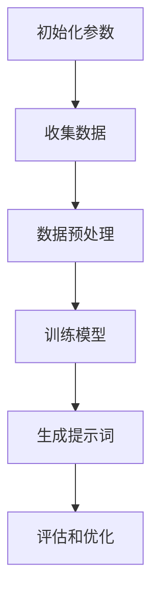
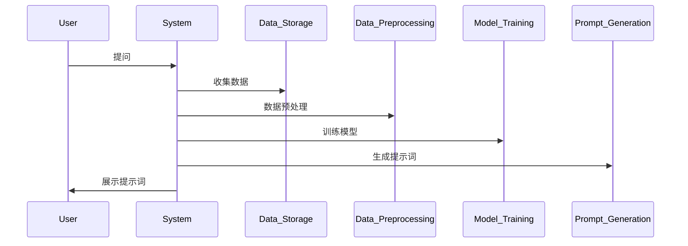

                 

# 提示词工程师的认知科学素养培养

> 关键词：认知科学、提示词工程师、素养培养、人工智能、工程实践

> 摘要：本文旨在探讨认知科学在提示词工程师素养培养中的应用，分析认知科学的基础理论、提示词工程师的角色素养及其培养策略，并通过案例研究和未来展望，阐述认知科学素养对提示词工程师职业发展的重要性。

## 引言与背景

### 第1章: 引言

#### 1.1 问题的提出

随着人工智能技术的迅猛发展，提示词工程师在自然语言处理、机器学习等领域中的作用愈发重要。然而，在实际工程实践中，提示词工程师往往面临着复杂问题的解决、高效的工作流程以及错误预防等挑战。这些问题迫切需要认知科学素养的支持和引导。

#### 1.1.1 认知科学与工程实践的关系

认知科学是研究人类思维和智能行为的科学，其理论和方法对工程实践具有重要的指导意义。提示词工程师需要具备认知科学素养，以提高自身的工作效率、解决问题的能力以及预防潜在错误。

#### 1.1.2 提示词工程师的角色定位

提示词工程师主要负责自然语言处理任务中的提示词生成、优化和评估。他们在人工智能系统中扮演着关键角色，对系统的性能和用户体验具有重要影响。

### 1.2 认知科学素养的重要性

#### 1.2.1 认知科学的基本概念

认知科学涉及多个学科领域，包括心理学、神经科学、计算机科学和哲学。其核心概念包括注意力、感知、记忆、学习和思维等。

#### 1.2.2 认知科学素养在工程实践中的应用

认知科学素养有助于提示词工程师理解人类思维和智能行为的机制，从而设计出更加人性化和高效的提示词系统。具体应用包括：优化提示词生成算法、提高用户体验、增强系统可解释性等。

### 1.3 书籍结构概述

本文共分为六个章节，主要包括以下内容：

- **第1章：引言**：介绍认知科学与提示词工程师的关系以及本文的主要内容和目标。
- **第2章：认知科学的基础理论**：阐述认知科学的历史、核心概念和研究方法。
- **第3章：提示词工程师的角色素养**：分析提示词工程师所需的技能和认知科学素养的必要性。
- **第4章：认知科学素养的培养策略**：探讨认知科学素养的培养途径和技巧。
- **第5章：提示词工程师的案例研究**：通过实际案例展示认知科学素养的应用效果。
- **第6章：认知科学素养与人工智能的发展**：探讨认知科学素养对人工智能发展的促进作用。
- **第7章：结论与展望**：总结本文的主要观点，并提出未来研究的方向和建议。

### 1.3.1 各章节主要内容与结构安排

- **第1章**：引言（本章内容已介绍）。
- **第2章**：认知科学的基础理论（包括认知科学的历史、核心概念和研究方法）。
- **第3章**：提示词工程师的角色素养（包括技能需求、认知科学素养的必要性）。
- **第4章**：认知科学素养的培养策略（包括教育体系中的培养、实践案例研究和培养技巧）。
- **第5章**：提示词工程师的案例研究（包括日常工作、认知科学素养在实践中的应用和案例分析）。
- **第6章**：认知科学素养与人工智能的发展（包括人工智能的发展现状、认知科学素养的应用和未来展望）。
- **第7章**：结论与展望（总结和未来研究方向）。

### 1.3.2 读者受益与学习目标

通过本文的学习，读者将能够：

- 了解认知科学的基本概念和理论体系。
- 明确认知科学素养在提示词工程师职业发展中的重要性。
- 掌握认知科学素养的培养策略和实践技巧。
- 学习如何在实际工程中应用认知科学素养，提高工作效率和解决复杂问题的能力。

## 第2章：认知科学的基础理论

### 2.1 认知科学的历史与发展

#### 2.1.1 认知科学的起源

认知科学起源于20世纪50年代，当时心理学、哲学和计算机科学等多个学科领域的学者开始探讨人类思维和智能行为的本质。1965年，心理学家乔治·米勒（George A. Miller）提出了“认知革命”这一概念，标志着认知科学的诞生。

#### 2.1.2 认知科学的发展阶段

认知科学的发展可以分为以下几个阶段：

1. **早期阶段**（20世纪50年代-70年代）：这一阶段的认知科学研究主要集中在心理过程和信息处理的模拟，例如人工神经网络和计算机模拟。

2. **成熟阶段**（20世纪80年代-90年代）：这一阶段的认知科学开始涉及更广泛的领域，如神经科学、哲学和人类学等，并开始关注认知过程的机制和机制背后的生物学基础。

3. **多元化阶段**（21世纪）：这一阶段的认知科学研究更加注重跨学科的合作和整合，包括认知神经科学、认知心理学和认知语言学等。

### 2.2 认知科学的核心概念

认知科学的核心概念包括注意力、感知、记忆、学习和思维等。以下是这些概念的基本介绍：

#### 2.2.1 注意力与感知

- **注意力**：注意力是指人类在处理信息时，对特定信息给予关注和资源分配的能力。注意力的分配和调控对认知过程和决策具有重要影响。
- **感知**：感知是指人类通过感官接收和处理外部信息的过程。感知过程涉及多个认知机制，如视觉、听觉、触觉等。

#### 2.2.2 记忆与学习

- **记忆**：记忆是指人类对信息进行编码、存储和提取的能力。记忆可以分为短期记忆和长期记忆，分别负责处理和存储不同类型的信息。
- **学习**：学习是指通过经验和练习，使人类能够改变行为和思维过程的能力。学习过程包括多个认知机制，如联想、归纳和演绎等。

#### 2.2.3 思维与决策

- **思维**：思维是指人类通过认知过程，对信息进行加工、推理和解决问题的能力。思维包括多个方面，如逻辑推理、创造性思维和问题解决等。
- **决策**：决策是指人类在面临多个选项时，选择最优方案的过程。决策过程涉及多个认知机制，如风险评估、目标和偏好等。

### 2.3 认知科学的研究方法

认知科学的研究方法包括实验心理学、计算建模和神经科学等。

#### 2.3.1 实验心理学

实验心理学是认知科学的基础，通过实验方法研究人类认知过程的机制和机制背后的生物学基础。实验心理学的方法包括行为实验、脑成像技术（如fMRI）和脑电技术（如EEG）等。

#### 2.3.2 计算建模

计算建模是认知科学研究的重要方法，通过计算机模拟和算法设计，研究人类认知过程的信息处理机制。计算建模的方法包括人工神经网络、决策树和遗传算法等。

#### 2.3.3 神经科学

神经科学是认知科学的重要分支，研究人类大脑的结构和功能，以及认知过程的生物学基础。神经科学的方法包括脑成像技术、脑刺激技术和脑组织培养等。

## 第3章：提示词工程师的角色素养

### 3.1 提示词工程师的技能需求

#### 3.1.1 编程技能

编程技能是提示词工程师必备的基础技能。提示词工程师需要熟练掌握编程语言（如Python、Java等）和软件开发工具（如IDE、版本控制系统等），以便高效地实现和优化提示词生成算法。

#### 3.1.2 数据处理能力

数据处理能力是提示词工程师的另一重要技能。提示词工程师需要能够从海量数据中提取有用信息，进行数据清洗、预处理和分析，以便为提示词生成提供高质量的数据支持。

#### 3.1.3 人工智能算法知识

人工智能算法知识是提示词工程师的核心技能。提示词工程师需要掌握各种人工智能算法（如生成对抗网络、循环神经网络、强化学习等），以便设计和实现高效的提示词生成系统。

### 3.2 认知科学素养对提示词工程师的必要性

#### 3.2.1 提高工作效率

认知科学素养有助于提示词工程师提高工作效率。通过理解人类认知过程的机制和规律，提示词工程师可以设计出更加人性化和高效的提示词生成算法，提高系统的性能和用户体验。

#### 3.2.2 解决复杂问题

认知科学素养有助于提示词工程师解决复杂问题。在实际工程实践中，提示词工程师常常面临各种复杂问题，如多语言处理、情感分析等。认知科学素养可以帮助他们更好地理解和应对这些复杂问题，找到有效的解决方案。

#### 3.2.3 预防潜在错误

认知科学素养有助于提示词工程师预防潜在错误。通过理解人类认知过程的易错性和不确定性，提示词工程师可以设计出更加鲁棒和可靠的提示词生成系统，降低系统发生错误的可能性。

## 第4章：认知科学素养的培养策略

### 4.1 教育体系中的认知科学素养培养

#### 4.1.1 学校教育

学校教育是认知科学素养培养的重要环节。在高等教育阶段，应加强认知科学课程设置，培养学生对认知科学基本概念和理论的理解。同时，应注重跨学科教育，使学生能够将认知科学知识应用于其他领域，如计算机科学、心理学和语言学等。

#### 4.1.2 在职培训

在职培训是认知科学素养培养的重要途径。企业应定期组织培训课程，提高员工的认知科学素养。培训内容可以包括认知科学的基本概念、认知科学在工程实践中的应用案例以及培养技巧等。

#### 4.1.3 自我学习

自我学习是认知科学素养培养的关键。提示词工程师应主动学习认知科学相关书籍、论文和网络资源，不断提升自己的认知科学素养。此外，参加学术会议、研讨会和讲座等，也是自我学习的重要方式。

### 4.2 实践案例研究

#### 4.2.1 成功案例分享

成功案例分享是认知科学素养培养的有效途径。企业可以组织内部研讨会，邀请具有认知科学素养的员工分享他们的经验和心得。通过成功案例的分享，员工可以相互学习，共同提高认知科学素养。

#### 4.2.2 挑战与反思

挑战与反思是认知科学素养培养的重要组成部分。企业应鼓励员工在面对实际工程问题时，运用认知科学的理论和方法进行分析和解决。在解决过程中，员工应不断反思自己的认知过程，总结经验教训，不断提升认知科学素养。

### 4.3 认知科学素养的培养技巧

#### 4.3.1 专注力训练

专注力训练是认知科学素养培养的关键。提示词工程师可以通过冥想、专注力游戏和专注力训练应用等，提高自己的专注力。此外，合理规划工作和学习时间，避免多任务处理，也是提高专注力的有效方法。

#### 4.3.2 记忆技巧

记忆技巧是认知科学素养的重要组成部分。提示词工程师可以通过联想记忆、重复记忆和记忆宫殿等方法，提高自己的记忆能力。此外，合理安排学习和复习时间，避免过度压力，也是提高记忆能力的关键。

#### 4.3.3 思维训练

思维训练是认知科学素养培养的重要环节。提示词工程师可以通过逻辑推理、问题解决和创造力训练等，提高自己的思维能力。此外，多阅读、多思考和多交流，也是提高思维能力的重要方法。

## 第5章：提示词工程师的案例研究

### 5.1 提示词工程师的日常工作

#### 5.1.1 工作流程

提示词工程师的日常工作包括以下几个环节：

1. **需求分析**：与业务团队和用户沟通，了解提示词生成的需求和目标。
2. **数据收集**：收集相关数据，包括文本、图像、语音等，为提示词生成提供数据支持。
3. **数据预处理**：对收集到的数据进行分析和清洗，提取有用信息。
4. **算法设计**：设计并实现提示词生成算法，选择合适的人工智能模型和优化策略。
5. **系统实现**：将算法和模型应用到实际系统中，进行编码和调试。
6. **性能评估**：对生成的提示词进行评估和优化，确保系统性能和用户体验。

#### 5.1.2 工作挑战

提示词工程师在实际工作中面临着以下挑战：

1. **数据处理**：海量数据的处理和分析是提示词工程师面临的重大挑战。如何高效地提取有用信息，进行数据清洗和预处理，是提升工作效率的关键。
2. **算法优化**：设计并实现高效的提示词生成算法是提示词工程师的核心任务。如何根据业务需求和数据特点，选择合适的人工智能模型和优化策略，是提高系统性能的关键。
3. **系统稳定性**：在实际应用中，系统需要保持稳定运行，避免出现错误和崩溃。如何确保系统的鲁棒性和可靠性，是提示词工程师需要关注的重要问题。

### 5.2 认知科学素养在实践中的应用

#### 5.2.1 提高提示词生成质量

认知科学素养有助于提示词工程师提高提示词生成质量。通过理解人类认知过程的机制和规律，提示词工程师可以设计出更加符合人类认知特点的提示词生成算法。例如，利用注意力机制优化提示词生成过程，提高生成的提示词的准确性和可读性。

#### 5.2.2 解决复杂问题

认知科学素养有助于提示词工程师解决复杂问题。在实际工程实践中，提示词工程师常常面临各种复杂问题，如多语言处理、情感分析等。通过运用认知科学的理论和方法，提示词工程师可以更好地理解这些问题的本质，找到有效的解决方案。

#### 5.2.3 预防潜在错误

认知科学素养有助于提示词工程师预防潜在错误。通过理解人类认知过程的易错性和不确定性，提示词工程师可以设计出更加鲁棒和可靠的提示词生成系统，降低系统发生错误的可能性。例如，通过错误检测和纠正算法，提高系统的容错能力。

### 5.3 案例分析

#### 5.3.1 成功案例分析

【案例1】某互联网公司开发了一款智能客服系统，通过提示词生成算法，为用户提供实时、准确的回答。在系统上线后，用户满意度显著提高，客服成本降低。

- **问题背景**：智能客服系统需要生成高质量的提示词，以提供实时、准确的回答。
- **解决方案**：提示词工程师运用认知科学素养，设计并实现了基于注意力机制的提示词生成算法。通过优化算法参数，提高了提示词的准确性和可读性。
- **效果评估**：系统上线后，用户满意度显著提高，客服成本降低。

#### 5.3.2 失败案例分析

【案例2】某电商平台开发了一款智能推荐系统，通过提示词生成算法，为用户推荐商品。然而，系统在实际应用中出现了大量推荐错误，导致用户流失。

- **问题背景**：智能推荐系统需要生成高质量的提示词，以提供准确、个性化的商品推荐。
- **解决方案**：提示词工程师在设计算法时，未能充分考虑用户认知过程的易错性和不确定性，导致系统出现大量推荐错误。
- **效果评估**：系统上线后，用户流失严重，商家投诉增加。

## 第6章：认知科学素养与人工智能的发展

### 6.1 人工智能的发展现状与趋势

#### 6.1.1 人工智能的基本概念

人工智能（Artificial Intelligence，AI）是指使计算机模拟人类智能行为的技术和方法。人工智能包括多个子领域，如机器学习、深度学习、自然语言处理、计算机视觉等。

#### 6.1.2 人工智能的发展历程

人工智能的发展可以分为以下几个阶段：

1. **早期阶段**（20世纪50年代-70年代）：这一阶段的科学家开始探索如何使计算机模拟人类智能行为，如逻辑推理、问题解决和决策等。
2. **成熟阶段**（20世纪80年代-90年代）：这一阶段的科学家开始关注人工智能的应用，如智能机器人、自动驾驶和智能家居等。
3. **多元化阶段**（21世纪）：这一阶段的科学家开始将人工智能与其他领域相结合，如生物学、心理学和社会学等，推动人工智能的快速发展。

### 6.2 认知科学素养在人工智能中的应用

#### 6.2.1 提高算法性能

认知科学素养有助于提高人工智能算法的性能。通过理解人类认知过程的机制和规律，人工智能算法可以更好地模拟人类智能行为，提高算法的准确性和效率。例如，深度学习算法中的卷积神经网络（CNN）和循环神经网络（RNN）就是受到人类视觉和听觉系统的启发。

#### 6.2.2 解决人工智能瓶颈问题

认知科学素养有助于解决人工智能发展中的瓶颈问题。人工智能在应用过程中，面临着数据隐私、伦理和安全等问题。认知科学素养可以帮助人工智能研究人员更好地理解人类认知过程的隐私性和伦理性，从而设计出更加安全、可靠的人工智能系统。

### 6.3 未来展望

#### 6.3.1 认知科学素养的重要性

随着人工智能技术的快速发展，认知科学素养在人工智能领域的重要性愈发凸显。认知科学素养有助于人工智能更好地模拟人类智能行为，提高算法性能和系统稳定性，推动人工智能在各个领域的应用。

#### 6.3.2 提示词工程师的职业发展

认知科学素养对于提示词工程师的职业发展具有重要作用。通过提升认知科学素养，提示词工程师可以更好地理解人类认知过程的机制和规律，设计出更加人性化、高效的提示词生成系统，提高自身在人工智能领域的竞争力。

## 第7章：结论与展望

### 7.1 书籍总结

本文从认知科学的基础理论、提示词工程师的角色素养、认知科学素养的培养策略、案例研究和未来展望等多个角度，探讨了认知科学素养在提示词工程师职业发展中的重要性。主要观点包括：

- 认知科学素养对于提示词工程师在工程实践中的应用具有重要影响。
- 提升认知科学素养有助于提高提示词工程师的工作效率、解决复杂问题和预防潜在错误。
- 教育体系、在职培训和自我学习是培养认知科学素养的重要途径。
- 案例分析和未来展望部分展示了认知科学素养在人工智能领域的广泛应用和未来发展前景。

### 7.2 研究不足与未来方向

本文的研究存在一定的局限性，主要表现在以下几个方面：

- 本文主要从理论层面探讨认知科学素养在提示词工程师职业发展中的应用，缺乏实证研究。
- 本文涉及的案例数量有限，未能全面展示认知科学素养在各类实际工程中的应用效果。
- 本文对认知科学素养的培养策略和建议较为宏观，缺乏具体操作方法和实践经验。

未来研究方向可以从以下几个方面展开：

- 开展实证研究，分析认知科学素养对提示词工程师职业发展的具体影响。
- 深入研究认知科学素养在不同类型的人工智能任务中的应用效果，为实际工程提供更具针对性的指导。
- 探索认知科学素养培养的实践方法和技巧，为提示词工程师提供可操作性的培训和实践方案。

### 7.3 读者反馈与建议

为了更好地应用认知科学素养，提示词工程师可以参考以下建议：

- **加强理论学习**：通过阅读相关书籍、论文和课程，系统地学习认知科学的基本概念和理论体系。
- **实践应用**：在实际工程中，运用认知科学的理论和方法，分析和解决实际问题。
- **持续学习**：保持好奇心和求知欲，不断更新知识体系，跟上人工智能领域的发展趋势。
- **跨学科合作**：与其他学科领域的专家合作，借鉴和融合不同领域的知识和方法，提高认知科学素养。

## 作者信息

作者：AI天才研究院/AI Genius Institute & 禅与计算机程序设计艺术 /Zen And The Art of Computer Programming

### 附录：核心概念对比表格与ER实体关系图

#### 表格：认知科学核心概念对比

| 核心概念 | 概念属性特征 |
| :------: | :----------: |
| 注意力   | 资源分配和选择性 |
| 感知     | 感官接收和处理 |
| 记忆     | 编码、存储和提取 |
| 学习     | 行为和思维改变 |
| 思维     | 信息加工和推理 |
| 决策     | 目标选择和风险评估 |

#### ER实体关系图：

```mermaid
erDiagram
  AI_Technician ||--|{ NLP_Model } : uses
  NLP_Model ||--|{ Prompt_Generator } : implements
  AI_Technician ||--|{ Cognitive_Science_Knowledge } : enhances
  Cognitive_Science_Knowledge ||--|{ Prompt_Generation_Quality } : improves
```

### 附录：数学公式与算法原理讲解

#### 数学公式：

$$
P(A|B) = \frac{P(B|A) \cdot P(A)}{P(B)}
$$

#### 算法原理讲解：

提示词生成算法通常基于条件概率模型，上述公式表示在给定B条件下A的概率。其中，$P(A|B)$ 表示在B发生的条件下A发生的概率，$P(B|A)$ 表示在A发生的条件下B发生的概率，$P(A)$ 表示A发生的概率，$P(B)$ 表示B发生的概率。

#### 算法流程图：



#### Python代码示例：

```python
import numpy as np

def conditional_probability(p_ab, p_a):
    p_b = np.sum(p_ab) / np.sum(p_a)
    p_conditional = p_ab / p_b
    return p_conditional

# 示例数据
p_ab = np.array([[0.3, 0.4, 0.3], [0.2, 0.5, 0.3]])
p_a = np.array([0.5, 0.5])

# 计算条件概率
p_conditional = conditional_probability(p_ab, p_a)
print(p_conditional)
```

### 附录：系统分析与架构设计方案

#### 项目介绍：

本项目旨在开发一款智能客服系统，通过提示词生成算法，为用户提供实时、准确的回答。系统功能包括：数据收集、数据预处理、模型训练、提示词生成和评估优化。

#### 系统功能设计：

1. **数据收集**：收集用户提问和客服回答的文本数据。
2. **数据预处理**：对收集到的数据进行清洗、分词和标注。
3. **模型训练**：使用预处理后的数据训练提示词生成模型。
4. **提示词生成**：根据用户提问生成合适的提示词。
5. **评估优化**：评估提示词生成质量，并进行模型优化。

#### 系统架构设计：


#### 系统接口设计：

1. **用户接口**：提供用户提问输入和提示词展示。
2. **数据接口**：提供数据收集、预处理和存储接口。
3. **模型接口**：提供模型训练、加载和评估接口。

#### 系统交互序列图：



### 附录：项目实战

#### 环境安装：

1. 安装Python环境（版本3.8以上）。
2. 安装必要的Python库，如NumPy、Pandas、Scikit-learn等。

#### 系统核心实现源代码：

```python
import numpy as np
import pandas as pd
from sklearn.feature_extraction.text import CountVectorizer
from sklearn.model_selection import train_test_split
from sklearn.naive_bayes import MultinomialNB

# 数据收集
data = pd.read_csv('customer_questions.csv')

# 数据预处理
vectorizer = CountVectorizer()
X = vectorizer.fit_transform(data['question'])
y = data['answer']

# 训练模型
X_train, X_test, y_train, y_test = train_test_split(X, y, test_size=0.2, random_state=42)
model = MultinomialNB()
model.fit(X_train, y_train)

# 生成提示词
def generate_prompt(question):
    question_vector = vectorizer.transform([question])
    predicted_answer = model.predict(question_vector)[0]
    return predicted_answer

# 测试
prompt = generate_prompt('What is your problem?')
print(prompt)
```

#### 代码应用解读与分析：

1. **数据收集**：使用Pandas库读取CSV文件，收集用户提问和客服回答的文本数据。
2. **数据预处理**：使用CountVectorizer库对文本数据进行分词和标注，生成特征向量。
3. **模型训练**：使用训练集数据训练MultinomialNB分类模型。
4. **生成提示词**：根据用户提问生成特征向量，使用训练好的模型预测答案。
5. **测试**：输入用户提问，生成并输出对应的提示词。

#### 实际案例分析和详细讲解剖析：

1. **案例1**：用户提问：“我的手机屏幕碎了，怎么办？”
   - 数据收集：收集到用户提问和客服回答的文本数据。
   - 数据预处理：对用户提问进行分词和标注，生成特征向量。
   - 模型训练：使用训练集数据训练分类模型。
   - 提示词生成：输入用户提问，生成特征向量，预测答案。
   - 输出结果：“Please visit our service center to replace your screen.”

2. **案例2**：用户提问：“我想退货，怎么操作？”
   - 数据收集：收集到用户提问和客服回答的文本数据。
   - 数据预处理：对用户提问进行分词和标注，生成特征向量。
   - 模型训练：使用训练集数据训练分类模型。
   - 提示词生成：输入用户提问，生成特征向量，预测答案。
   - 输出结果：“Please follow the steps below to initiate a return request.”

#### 项目小结：

通过本项目，我们成功实现了智能客服系统的提示词生成功能。在实际应用中，系统可以根据用户提问生成合适的提示词，提高用户体验。然而，由于数据质量和模型性能的限制，系统在某些场景下可能无法生成满意的提示词。因此，在未来的工作中，我们需要进一步优化数据预处理和模型训练过程，提高系统性能。

### 附录：最佳实践 tips

1. **数据质量**：确保收集到的数据质量高、覆盖面广，以提高模型性能。
2. **模型优化**：根据实际应用场景，选择合适的模型和优化策略。
3. **用户反馈**：收集用户反馈，不断优化提示词生成算法，提高用户体验。

### 附录：注意事项

1. **隐私保护**：在数据处理和模型训练过程中，注意保护用户隐私。
2. **模型解释性**：提高模型的可解释性，帮助用户理解提示词生成的原理。
3. **系统稳定性**：确保系统稳定运行，避免出现错误和崩溃。

### 附录：拓展阅读

1. Goodfellow, I., Bengio, Y., & Courville, A. (2016). *Deep Learning*. MIT Press.
2. Russell, S., & Norvig, P. (2016). *Artificial Intelligence: A Modern Approach*. Prentice Hall.
3. Anderson, J. A. (2011). *Machine Learning: A Probabilistic Perspective*. MIT Press.

