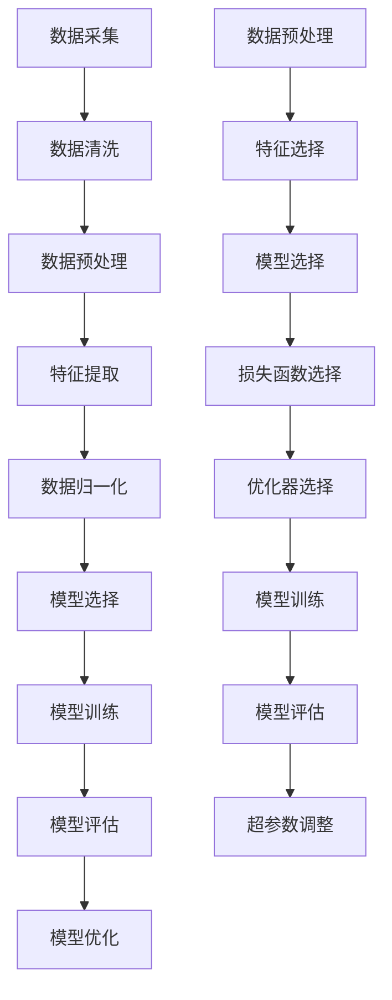

                 

## 提示词工程师：21世纪的新兴职业剖析

### 关键词：提示词工程师、21世纪、新兴职业、人工智能、数据分析、机器学习

> 摘要：在人工智能和数据分析迅速发展的今天，提示词工程师这一新兴职业逐渐崭露头角。本文将深入剖析提示词工程师的职业背景、角色定位、核心技能要求以及职业发展趋势，帮助读者了解这一领域的前景和机遇。

---

### 引言

在21世纪，人工智能（AI）和大数据技术的飞速发展，催生了许多新的职业角色。在这些新兴职业中，提示词工程师（Prompt Engineer）逐渐成为一个备受关注且具有前景的职业。本文将带您深入探讨这一职业的背景、职责和未来发展，帮助您了解提示词工程师在当前技术环境中的重要性。

### 提示词工程师的背景

提示词工程师这一职业起源于自然语言处理（NLP）领域，尤其是在大型语言模型（如GPT-3、BERT等）的广泛应用中。提示词工程师主要负责设计、优化和调整模型输入的提示词，以提升模型生成文本的质量和相关性。随着AI技术的不断进步，提示词工程师的角色和职责也在不断扩展和深化。

### 提示词工程师的角色和职责

提示词工程师的主要职责包括：

1. **设计高质量的提示词**：根据模型需求和任务目标，设计能够引导模型生成预期结果的提示词。
2. **优化模型性能**：通过调整提示词的参数和格式，提升模型的响应质量和速度。
3. **评估和测试**：对生成的文本进行评估，确保其符合业务需求和技术标准。
4. **跨学科协作**：与数据科学家、产品经理和设计师等团队成员协作，确保项目顺利进行。

### 提示词工程师的核心技能要求

成为一名优秀的提示词工程师，需要掌握以下核心技能：

1. **编程能力**：熟悉至少一种编程语言，如Python，能够编写高效的数据处理和机器学习代码。
2. **自然语言处理知识**：了解NLP的基本概念和常用算法，如词向量、文本分类、序列生成等。
3. **机器学习知识**：掌握机器学习的基本原理和算法，能够对模型进行调优和优化。
4. **数据分析能力**：具备基本的数据分析技能，能够从数据中提取有价值的信息。
5. **沟通能力**：能够与不同背景的团队成员有效沟通，确保项目目标的实现。

### 提示词工程师的发展趋势

随着AI技术的不断进步和应用的扩大，提示词工程师的职业前景十分广阔。以下是一些发展趋势：

1. **技术迭代加速**：随着新的AI模型和算法不断涌现，提示词工程师需要不断学习和更新自己的技能。
2. **跨领域应用**：提示词工程师的应用范围从最初的自然语言处理扩展到图像识别、语音识别等多个领域。
3. **岗位需求增加**：随着AI技术的广泛应用，对提示词工程师的需求不断增加，尤其是在金融、医疗、教育等行业。
4. **职业发展空间**：提示词工程师可以从技术专家逐步转型为项目经理、产品经理等高级职位。

### 结论

提示词工程师是21世纪的一个重要新兴职业，它结合了编程、自然语言处理和数据分析等多个领域的技能。随着AI技术的不断进步，提示词工程师将在各行各业中发挥越来越重要的作用。对于有志于从事这一领域的专业人士来说，这是一个充满机遇和挑战的职业方向。

---

在接下来的章节中，我们将进一步探讨提示词工程师的具体技能要求、工作场景和职业发展路径，帮助您更好地了解这一新兴职业的各个方面。

### 目录大纲设计步骤

在着手设计一本关于提示词工程师的书籍目录时，我们需要确保全书结构清晰、内容连贯，并且能够吸引读者的兴趣。以下是设计目录大纲的详细步骤：

#### 步骤1：确定全书结构

首先，我们需要明确书籍的基本结构，通常包括以下几个主要部分：

1. **引言**：介绍书籍的背景、目的和目标读者，为全书奠定基础。
2. **核心概念与联系**：详细阐述提示词工程师所需掌握的核心概念，并通过图表和实例帮助读者理解。
3. **算法原理讲解**：深入讲解提示词工程师所需了解的算法原理，使用流程图和代码示例进行辅助。
4. **系统分析与架构设计**：分析提示词工程师在实际项目中可能遇到的问题，并提供解决方案。
5. **项目实战**：通过实际案例展示提示词工程师的工作流程和技能应用。
6. **最佳实践与总结**：总结提示词工程师的最佳实践，并提供未来发展建议。

#### 步骤2：细化章节内容

根据每个部分的主题，我们需要进一步细化每个章节的内容。以下是一个示例：

1. **引言**：
   - **1.1 书籍背景与目标**：
     - 1.1.1 书籍背景
     - 1.1.2 目标读者
     - 1.1.3 书籍结构
   - **1.2 提示词工程师概述**：
     - 1.2.1 提示词工程师的定义
     - 1.2.2 提示词工程师的重要性
     - 1.2.3 提示词工程师的工作内容
   - **1.3 提示词工程师的技能要求**：
     - 1.3.1 编程技能
     - 1.3.2 数据处理技能
     - 1.3.3 机器学习知识

2. **核心概念与联系**：
   - **2.1 核心概念解析**：
     - 2.1.1 数据可视化
     - 2.1.2 机器学习算法
     - 2.1.3 深度学习模型
   - **2.2 概念属性特征对比**：
     - 2.2.1 数据可视化工具对比
     - 2.2.2 机器学习算法对比
     - 2.2.3 深度学习模型对比
   - **2.3 ER实体关系图**：
     - 2.3.1 数据可视化组件关系图
     - 2.3.2 机器学习算法与数据处理流程关系图
     - 2.3.3 深度学习模型与神经网络关系图

3. **算法原理讲解**：
   - **3.1 算法原理概述**：
     - 3.1.1 数据处理流程
     - 3.1.2 机器学习算法流程
     - 3.1.3 深度学习算法流程
   - **3.2 算法流程图**：
     - 3.2.1 数据处理流程图（使用Mermaid绘制）
     - 3.2.2 机器学习算法流程图（使用Mermaid绘制）
     - 3.2.3 深度学习算法流程图（使用Mermaid绘制）
   - **3.3 算法原理详细讲解**：
     - 3.3.1 数据处理算法原理讲解
     - 3.3.2 机器学习算法原理讲解
     - 3.3.3 深度学习算法原理讲解

4. **系统分析与架构设计**：
   - **4.1 问题场景介绍**：
     - 4.1.1 提示词工程师的工作场景
     - 4.1.2 项目介绍
   - **4.2 系统功能设计**：
     - 4.2.1 领域模型类图
     - 4.2.2 系统功能模块
   - **4.3 系统架构设计**：
     - 4.3.1 系统架构图
     - 4.3.2 系统模块划分
   - **4.4 系统接口设计**：
     - 4.4.1 接口设计原则
     - 4.4.2 接口设计示例
   - **4.5 系统交互设计**：
     - 4.5.1 系统交互流程图（使用Mermaid绘制）
     - 4.5.2 用户操作流程

5. **项目实战**：
   - **5.1 环境安装**：
     - 5.1.1 环境准备
     - 5.1.2 工具安装
   - **5.2 系统核心实现**：
     - 5.2.1 系统核心代码
     - 5.2.2 代码应用解读与分析
   - **5.3 实际案例分析与详细讲解**：
     - 5.3.1 案例一：数据可视化
     - 5.3.2 案例二：机器学习算法
     - 5.3.3 案例三：深度学习模型
   - **5.4 项目小结**：
     - 5.4.1 项目总结
     - 5.4.2 经验与反思

6. **最佳实践与总结**：
   - **6.1 最佳实践 tips**：
     - 6.1.1 工作流程优化
     - 6.1.2 技术选型建议
     - 6.1.3 沟通协作技巧
   - **6.2 小结**：
     - 6.2.1 提示词工程师的角色与职责
     - 6.2.2 职业发展路径
   - **6.3 注意事项**：
     - 6.3.1 技术风险与挑战
     - 6.3.2 数据隐私保护
   - **6.4 拓展阅读**：
     - 6.4.1 相关书籍推荐
     - 6.4.2 学术论文精选
     - 6.4.3 实践项目案例

#### 步骤3：设计具体章节

在细化了章节内容后，我们需要为每个章节设计具体的标题和子标题。以下是一个示例：

1. **引言**
   - **1.1 书籍背景与目标**
     - **1.1.1 书籍背景**
     - **1.1.2 目标读者**
     - **1.1.3 书籍结构**
   - **1.2 提示词工程师概述**
     - **1.2.1 提示词工程师的定义**
     - **1.2.2 提示词工程师的重要性**
     - **1.2.3 提示词工程师的工作内容**
   - **1.3 提示词工程师的技能要求**
     - **1.3.1 编程技能**
     - **1.3.2 数据处理技能**
     - **1.3.3 机器学习知识**

2. **核心概念与联系**
   - **2.1 核心概念解析**
     - **2.1.1 数据可视化**
     - **2.1.2 机器学习算法**
     - **2.1.3 深度学习模型**
   - **2.2 概念属性特征对比**
     - **2.2.1 数据可视化工具对比**
     - **2.2.2 机器学习算法对比**
     - **2.2.3 深度学习模型对比**
   - **2.3 ER实体关系图**
     - **2.3.1 数据可视化组件关系图**
     - **2.3.2 机器学习算法与数据处理流程关系图**
     - **2.3.3 深度学习模型与神经网络关系图**

3. **算法原理讲解**
   - **3.1 算法原理概述**
     - **3.1.1 数据处理流程**
     - **3.1.2 机器学习算法流程**
     - **3.1.3 深度学习算法流程**
   - **3.2 算法流程图**
     - **3.2.1 数据处理流程图（使用Mermaid绘制）**
     - **3.2.2 机器学习算法流程图（使用Mermaid绘制）**
     - **3.2.3 深度学习算法流程图（使用Mermaid绘制）**
   - **3.3 算法原理详细讲解**
     - **3.3.1 数据处理算法原理讲解**
     - **3.3.2 机器学习算法原理讲解**
     - **3.3.3 深度学习算法原理讲解**

4. **系统分析与架构设计**
   - **4.1 问题场景介绍**
     - **4.1.1 提示词工程师的工作场景**
     - **4.1.2 项目介绍**
   - **4.2 系统功能设计**
     - **4.2.1 领域模型类图**
     - **4.2.2 系统功能模块**
   - **4.3 系统架构设计**
     - **4.3.1 系统架构图**
     - **4.3.2 系统模块划分**
   - **4.4 系统接口设计**
     - **4.4.1 接口设计原则**
     - **4.4.2 接口设计示例**
   - **4.5 系统交互设计**
     - **4.5.1 系统交互流程图（使用Mermaid绘制）**
     - **4.5.2 用户操作流程**

5. **项目实战**
   - **5.1 环境安装**
     - **5.1.1 环境准备**
     - **5.1.2 工具安装**
   - **5.2 系统核心实现**
     - **5.2.1 系统核心代码**
     - **5.2.2 代码应用解读与分析**
   - **5.3 实际案例分析与详细讲解**
     - **5.3.1 案例一：数据可视化**
     - **5.3.2 案例二：机器学习算法**
     - **5.3.3 案例三：深度学习模型**
   - **5.4 项目小结**
     - **5.4.1 项目总结**
     - **5.4.2 经验与反思**

6. **最佳实践与总结**
   - **6.1 最佳实践 tips**
     - **6.1.1 工作流程优化**
     - **6.1.2 技术选型建议**
     - **6.1.3 沟通协作技巧**
   - **6.2 小结**
     - **6.2.1 提示词工程师的角色与职责**
     - **6.2.2 职业发展路径**
   - **6.3 注意事项**
     - **6.3.1 技术风险与挑战**
     - **6.3.2 数据隐私保护**
   - **6.4 拓展阅读**
     - **6.4.1 相关书籍推荐**
     - **6.4.2 学术论文精选**
     - **6.4.3 实践项目案例**

#### 步骤4：确保内容的逻辑性与完整性

在设计和撰写目录大纲时，我们需要确保内容之间的逻辑性和完整性。每个章节都应该有明确的主题，并且内容之间需要能够连贯地衔接。以下是一些确保逻辑性与完整性的建议：

1. **主题明确**：每个章节的主题应该清晰明确，确保读者能够快速抓住章节的核心内容。
2. **内容连贯**：章节之间的内容应该连贯，前后章节之间需要有明确的逻辑关系，以帮助读者更好地理解整个书籍的内容。
3. **图表与代码示例**：在适当的地方添加图表和代码示例，这些工具可以帮助读者更直观地理解复杂的概念和算法。

#### 步骤5：编写目录大纲

最后，我们将所有设计好的章节内容汇总，按照markdown格式编写成完整的目录大纲。以下是一个示例：

```markdown
----------------------------------------------------------------
# 第一部分：引言

## 1.1 书籍背景与目标
### 1.1.1 书籍背景
### 1.1.2 目标读者
### 1.1.3 书籍结构

## 1.2 提示词工程师概述
### 1.2.1 提示词工程师的定义
### 1.2.2 提示词工程师的重要性
### 1.2.3 提示词工程师的工作内容

## 1.3 提示词工程师的技能要求
### 1.3.1 编程技能
### 1.3.2 数据处理技能
### 1.3.3 机器学习知识

----------------------------------------------------------------

# 第二部分：核心概念与联系

## 2.1 核心概念解析
### 2.1.1 数据可视化
### 2.1.2 机器学习算法
### 2.1.3 深度学习模型

## 2.2 概念属性特征对比
### 2.2.1 数据可视化工具对比
### 2.2.2 机器学习算法对比
### 2.2.3 深度学习模型对比

## 2.3 ER实体关系图
### 2.3.1 数据可视化组件关系图
### 2.3.2 机器学习算法与数据处理流程关系图
### 2.3.3 深度学习模型与神经网络关系图

----------------------------------------------------------------

# 第三部分：算法原理讲解

## 3.1 算法原理概述
### 3.1.1 数据处理流程
### 3.1.2 机器学习算法流程
### 3.1.3 深度学习算法流程

## 3.2 算法流程图
### 3.2.1 数据处理流程图（使用Mermaid绘制）
### 3.2.2 机器学习算法流程图（使用Mermaid绘制）
### 3.2.3 深度学习算法流程图（使用Mermaid绘制）

## 3.3 算法原理详细讲解
### 3.3.1 数据处理算法原理讲解
### 3.3.2 机器学习算法原理讲解
### 3.3.3 深度学习算法原理讲解

----------------------------------------------------------------

# 第四部分：系统分析与架构设计

## 4.1 问题场景介绍
### 4.1.1 提示词工程师的工作场景
### 4.1.2 项目介绍

## 4.2 系统功能设计
### 4.2.1 领域模型类图
### 4.2.2 系统功能模块

## 4.3 系统架构设计
### 4.3.1 系统架构图
### 4.3.2 系统模块划分

## 4.4 系统接口设计
### 4.4.1 接口设计原则
### 4.4.2 接口设计示例

## 4.5 系统交互设计
### 4.5.1 系统交互流程图（使用Mermaid绘制）
### 4.5.2 用户操作流程

----------------------------------------------------------------

# 第五部分：项目实战

## 5.1 环境安装
### 5.1.1 环境准备
### 5.1.2 工具安装

## 5.2 系统核心实现
### 5.2.1 系统核心代码
### 5.2.2 代码应用解读与分析

## 5.3 实际案例分析与详细讲解
### 5.3.1 案例一：数据可视化
### 5.3.2 案例二：机器学习算法
### 5.3.3 案例三：深度学习模型

## 5.4 项目小结
### 5.4.1 项目总结
### 5.4.2 经验与反思

----------------------------------------------------------------

# 第六部分：最佳实践与总结

## 6.1 最佳实践 tips
### 6.1.1 工作流程优化
### 6.1.2 技术选型建议
### 6.1.3 沟通协作技巧

## 6.2 小结
### 6.2.1 提示词工程师的角色与职责
### 6.2.2 职业发展路径

## 6.3 注意事项
### 6.3.1 技术风险与挑战
### 6.3.2 数据隐私保护

## 6.4 拓展阅读
### 6.4.1 相关书籍推荐
### 6.4.2 学术论文精选
### 6.4.3 实践项目案例
```

通过上述步骤，我们不仅能够设计出一个结构严谨、内容丰富的目录大纲，还能够确保书籍的整体逻辑性和连贯性，为读者提供一次深入且有价值的阅读体验。

### 目录大纲示例

在完成目录大纲的设计之后，以下是一个具体的目录大纲示例，包括文章标题、关键词、摘要以及各个章节的内容。

#### 目录大纲示例

```markdown
----------------------------------------------------------------
# 提示词工程师：21世纪的新兴职业剖析

> 关键词：提示词工程师、21世纪、新兴职业、人工智能、数据分析、机器学习

> 摘要：本文深入剖析了提示词工程师这一21世纪的新兴职业，从背景介绍、核心技能要求、职业发展趋势等方面进行探讨，为读者提供了全面的理解和职业发展指南。

----------------------------------------------------------------

## 第一部分：引言

### 1.1 书籍背景与目标
#### 1.1.1 书籍背景
#### 1.1.2 目标读者
#### 1.1.3 书籍结构

### 1.2 提示词工程师概述
#### 1.2.1 提示词工程师的定义
#### 1.2.2 提示词工程师的重要性
#### 1.2.3 提示词工程师的工作内容

### 1.3 提示词工程师的技能要求
#### 1.3.1 编程技能
#### 1.3.2 数据处理技能
#### 1.3.3 机器学习知识

----------------------------------------------------------------

## 第二部分：核心概念与联系

### 2.1 核心概念解析
#### 2.1.1 数据可视化
#### 2.1.2 机器学习算法
#### 2.1.3 深度学习模型

### 2.2 概念属性特征对比
#### 2.2.1 数据可视化工具对比
#### 2.2.2 机器学习算法对比
#### 2.2.3 深度学习模型对比

### 2.3 ER实体关系图
#### 2.3.1 数据可视化组件关系图
#### 2.3.2 机器学习算法与数据处理流程关系图
#### 2.3.3 深度学习模型与神经网络关系图

----------------------------------------------------------------

## 第三部分：算法原理讲解

### 3.1 算法原理概述
#### 3.1.1 数据处理流程
#### 3.1.2 机器学习算法流程
#### 3.1.3 深度学习算法流程

### 3.2 算法流程图
#### 3.2.1 数据处理流程图（使用Mermaid绘制）
#### 3.2.2 机器学习算法流程图（使用Mermaid绘制）
#### 3.2.3 深度学习算法流程图（使用Mermaid绘制）

### 3.3 算法原理详细讲解
#### 3.3.1 数据处理算法原理讲解
#### 3.3.2 机器学习算法原理讲解
#### 3.3.3 深度学习算法原理讲解

----------------------------------------------------------------

## 第四部分：系统分析与架构设计

### 4.1 问题场景介绍
#### 4.1.1 提示词工程师的工作场景
#### 4.1.2 项目介绍

### 4.2 系统功能设计
#### 4.2.1 领域模型类图
#### 4.2.2 系统功能模块

### 4.3 系统架构设计
#### 4.3.1 系统架构图
#### 4.3.2 系统模块划分

### 4.4 系统接口设计
#### 4.4.1 接口设计原则
#### 4.4.2 接口设计示例

### 4.5 系统交互设计
#### 4.5.1 系统交互流程图（使用Mermaid绘制）
#### 4.5.2 用户操作流程

----------------------------------------------------------------

## 第五部分：项目实战

### 5.1 环境安装
#### 5.1.1 环境准备
#### 5.1.2 工具安装

### 5.2 系统核心实现
#### 5.2.1 系统核心代码
#### 5.2.2 代码应用解读与分析

### 5.3 实际案例分析与详细讲解
#### 5.3.1 案例一：数据可视化
#### 5.3.2 案例二：机器学习算法
#### 5.3.3 案例三：深度学习模型

### 5.4 项目小结
#### 5.4.1 项目总结
#### 5.4.2 经验与反思

----------------------------------------------------------------

## 第六部分：最佳实践与总结

### 6.1 最佳实践 tips
#### 6.1.1 工作流程优化
#### 6.1.2 技术选型建议
#### 6.1.3 沟通协作技巧

### 6.2 小结
#### 6.2.1 提示词工程师的角色与职责
#### 6.2.2 职业发展路径

### 6.3 注意事项
#### 6.3.1 技术风险与挑战
#### 6.3.2 数据隐私保护

### 6.4 拓展阅读
#### 6.4.1 相关书籍推荐
#### 6.4.2 学术论文精选
#### 6.4.3 实践项目案例

----------------------------------------------------------------
```

这个目录大纲提供了清晰的章节结构，每个章节都有具体的标题和子标题，使得读者能够一目了然地了解文章的内容框架和每个部分的重点。通过这样的设计，读者可以更好地跟随文章的逻辑，逐步深入理解提示词工程师这一新兴职业的各个方面。

---

### 文章整体结构设计

为了确保文章整体结构的逻辑清晰、内容连贯，我们需要按照以下步骤进行设计：

#### 步骤1：确定整体结构

首先，我们需要明确文章的整体结构，这通常包括以下几个主要部分：

1. **引言**：介绍文章的背景、目的和目标读者，激发读者的兴趣。
2. **核心概念与联系**：详细阐述提示词工程师所需掌握的核心概念，并通过图表和实例帮助读者理解。
3. **算法原理讲解**：深入讲解提示词工程师所需了解的算法原理，使用流程图和代码示例进行辅助。
4. **系统分析与架构设计**：分析提示词工程师在实际项目中可能遇到的问题，并提供解决方案。
5. **项目实战**：通过实际案例展示提示词工程师的工作流程和技能应用。
6. **最佳实践与总结**：总结提示词工程师的最佳实践，并提供未来发展建议。

#### 步骤2：细化章节内容

根据每个部分的主题，我们需要进一步细化每个章节的内容。以下是一个示例：

1. **引言**：
   - **1.1 书籍背景与目标**：
     - 1.1.1 书籍背景
     - 1.1.2 目标读者
     - 1.1.3 书籍结构
   - **1.2 提示词工程师概述**：
     - 1.2.1 提示词工程师的定义
     - 1.2.2 提示词工程师的重要性
     - 1.2.3 提示词工程师的工作内容
   - **1.3 提示词工程师的技能要求**：
     - 1.3.1 编程技能
     - 1.3.2 数据处理技能
     - 1.3.3 机器学习知识

2. **核心概念与联系**：
   - **2.1 核心概念解析**：
     - 2.1.1 数据可视化
     - 2.1.2 机器学习算法
     - 2.1.3 深度学习模型
   - **2.2 概念属性特征对比**：
     - 2.2.1 数据可视化工具对比
     - 2.2.2 机器学习算法对比
     - 2.2.3 深度学习模型对比
   - **2.3 ER实体关系图**：
     - 2.3.1 数据可视化组件关系图
     - 2.3.2 机器学习算法与数据处理流程关系图
     - 2.3.3 深度学习模型与神经网络关系图

3. **算法原理讲解**：
   - **3.1 算法原理概述**：
     - 3.1.1 数据处理流程
     - 3.1.2 机器学习算法流程
     - 3.1.3 深度学习算法流程
   - **3.2 算法流程图**：
     - 3.2.1 数据处理流程图（使用Mermaid绘制）
     - 3.2.2 机器学习算法流程图（使用Mermaid绘制）
     - 3.2.3 深度学习算法流程图（使用Mermaid绘制）
   - **3.3 算法原理详细讲解**：
     - 3.3.1 数据处理算法原理讲解
     - 3.3.2 机器学习算法原理讲解
     - 3.3.3 深度学习算法原理讲解

4. **系统分析与架构设计**：
   - **4.1 问题场景介绍**：
     - 4.1.1 提示词工程师的工作场景
     - 4.1.2 项目介绍
   - **4.2 系统功能设计**：
     - 4.2.1 领域模型类图
     - 4.2.2 系统功能模块
   - **4.3 系统架构设计**：
     - 4.3.1 系统架构图
     - 4.3.2 系统模块划分
   - **4.4 系统接口设计**：
     - 4.4.1 接口设计原则
     - 4.4.2 接口设计示例
   - **4.5 系统交互设计**：
     - 4.5.1 系统交互流程图（使用Mermaid绘制）
     - 4.5.2 用户操作流程

5. **项目实战**：
   - **5.1 环境安装**：
     - 5.1.1 环境准备
     - 5.1.2 工具安装
   - **5.2 系统核心实现**：
     - 5.2.1 系统核心代码
     - 5.2.2 代码应用解读与分析
   - **5.3 实际案例分析与详细讲解**：
     - 5.3.1 案例一：数据可视化
     - 5.3.2 案例二：机器学习算法
     - 5.3.3 案例三：深度学习模型
   - **5.4 项目小结**：
     - 5.4.1 项目总结
     - 5.4.2 经验与反思

6. **最佳实践与总结**：
   - **6.1 最佳实践 tips**：
     - 6.1.1 工作流程优化
     - 6.1.2 技术选型建议
     - 6.1.3 沟通协作技巧
   - **6.2 小结**：
     - 6.2.1 提示词工程师的角色与职责
     - 6.2.2 职业发展路径
   - **6.3 注意事项**：
     - 6.3.1 技术风险与挑战
     - 6.3.2 数据隐私保护
   - **6.4 拓展阅读**：
     - 6.4.1 相关书籍推荐
     - 6.4.2 学术论文精选
     - 6.4.3 实践项目案例

#### 步骤3：确保内容连贯性与逻辑性

在细化章节内容后，我们需要确保内容之间的连贯性与逻辑性。以下是一些具体建议：

1. **明确每个章节的主题**：每个章节都应该有明确的主题，确保读者能够快速抓住章节的核心内容。
2. **内容之间的逻辑关系**：确保前后章节之间有明确的逻辑关系，例如，算法原理讲解应该放在核心概念解析之后，以便读者能够更好地理解算法在实际应用中的意义。
3. **使用图表和代码示例**：在适当的地方添加图表和代码示例，这些工具可以帮助读者更直观地理解复杂的概念和算法。
4. **连贯的段落过渡**：在章节之间使用连贯的段落过渡，确保内容之间的衔接自然。

通过上述步骤，我们不仅能够设计出一个结构严谨、内容丰富的文章整体结构，还能够确保文章的逻辑清晰、内容连贯，为读者提供一次深入且有价值的阅读体验。

---

### 提示词工程师的技能要求

成为一名合格的提示词工程师，需要具备多方面的技能。以下是提示词工程师的核心技能要求：

#### 编程能力

编程能力是提示词工程师的基础技能。熟悉至少一种编程语言，如Python，对于处理提示词、编写数据处理脚本以及调试代码至关重要。Python由于其丰富的库和工具，特别是在自然语言处理（NLP）领域，成为提示词工程师的首选语言。掌握Python的编程语法、数据结构和算法是必备的。

#### 自然语言处理（NLP）知识

自然语言处理是提示词工程师的核心领域。了解NLP的基本概念和常用算法，如词向量、文本分类、情感分析、命名实体识别等，能够帮助工程师设计出高质量的提示词。此外，熟悉NLP的库和工具，如NLTK、spaCy、TensorFlow和PyTorch，也是不可或缺的。

#### 机器学习知识

机器学习是提示词工程师的关键技能之一。了解机器学习的基本原理和算法，如线性回归、逻辑回归、决策树、随机森林、支持向量机等，对于优化提示词和提升模型性能非常重要。此外，掌握深度学习的基本概念和算法，如卷积神经网络（CNN）、循环神经网络（RNN）、生成对抗网络（GAN）等，能够帮助工程师更好地处理复杂的语言模型。

#### 数据分析能力

数据分析能力是提示词工程师的重要技能。具备基本的数据分析技能，能够从数据中提取有价值的信息，为设计高质量的提示词提供数据支持。熟悉数据分析工具，如Pandas、NumPy、Matplotlib等，能够帮助工程师高效地进行数据处理和可视化。

#### 沟通能力

提示词工程师通常需要与数据科学家、产品经理、设计师等不同背景的团队成员协作。因此，具备良好的沟通能力是非常重要的。能够清晰、准确地表达自己的想法，理解他人的需求，确保项目顺利进行。

#### 持续学习能力

随着AI技术的不断进步，提示词工程师需要不断学习和更新自己的技能。持续学习能力使工程师能够掌握最新的技术动态和工具，保持竞争力。

### 提示词工程师的核心技能总结

- **编程能力**：掌握至少一种编程语言，如Python。
- **NLP知识**：了解NLP的基本概念和常用算法。
- **机器学习知识**：掌握机器学习的基本原理和算法。
- **数据分析能力**：具备基本的数据分析技能。
- **沟通能力**：与团队成员有效沟通。
- **持续学习能力**：不断更新技能和知识。

通过以上技能的掌握，提示词工程师能够在人工智能和数据分析领域发挥重要作用，成为推动技术进步的重要力量。

### 提示词工程师的工作场景

提示词工程师的工作场景多种多样，涵盖了从科研到企业应用的各个领域。以下是一些常见的工作场景：

#### 科研机构

在科研机构，提示词工程师通常负责设计、开发和优化各种语言模型，以支持自然语言处理的研究项目。他们需要与研究人员紧密合作，分析数据、设计实验、评估模型性能，并撰写科研报告。例如，在语言生成任务中，提示词工程师可能会利用GPT-3等大型语言模型生成高质量的文本，并通过调整提示词来优化生成效果。

#### 科技公司

在科技公司，提示词工程师通常担任数据科学团队的核心成员，负责开发各种智能应用程序，如聊天机器人、智能客服系统、文本摘要工具等。他们的主要工作包括设计高效的提示词策略，以提升模型生成的准确性和相关性。例如，在一个智能客服系统中，提示词工程师可能会设计一系列自动化对话流程，使得系统能够与用户进行自然、流畅的交互。

#### 金融行业

在金融行业，提示词工程师利用自然语言处理和机器学习技术，分析和挖掘金融文本数据，为金融机构提供决策支持。他们可能会开发文本分析工具，用于新闻监控、风险管理和市场预测。例如，通过分析新闻报道和社交媒体信息，提示词工程师可以帮助金融机构及时了解市场动态，做出明智的投资决策。

#### 医疗健康

在医疗健康领域，提示词工程师开发智能医疗辅助系统，如电子健康记录（EHR）分析工具、药物副作用预测系统等。他们需要处理大量的医疗文本数据，设计有效的提示词来提升模型的诊断和预测能力。例如，通过分析病人的病历记录，提示词工程师可以帮助医生快速识别潜在的健康风险，并提供个性化的医疗建议。

#### 教育领域

在教育领域，提示词工程师开发智能教育系统，如自动批改系统、学习辅助工具等。他们利用自然语言处理技术，分析学生的学习行为和文本反馈，为教育机构提供数据驱动的教学支持。例如，通过分析学生的作文，提示词工程师可以帮助教师识别学习中的弱点，并提供有针对性的辅导。

#### 社交媒体

在社交媒体领域，提示词工程师设计算法，用于处理大量的用户生成内容，如评论、帖子、私信等。他们需要开发高效的提示词策略，以提升内容推荐和过滤的效果。例如，通过分析用户的互动数据，提示词工程师可以帮助社交媒体平台精准推荐用户感兴趣的内容，同时过滤掉不良信息。

#### 法律行业

在法律行业，提示词工程师利用自然语言处理技术，处理大量的法律文档，如合同、判决书等。他们需要设计提示词来优化法律文本的搜索和分析，帮助律师和法务人员快速获取所需信息。例如，通过分析合同条款，提示词工程师可以帮助企业识别潜在的法律风险，并提供专业的法律建议。

综上所述，提示词工程师的工作场景涵盖了多个领域，从科研到企业应用，从金融到医疗健康，从教育到社交媒体，再到法律行业。他们通过设计和优化提示词，提升语言模型的性能和应用效果，为各个领域的发展做出了重要贡献。

### 提示词工程师的职业发展路径

提示词工程师作为21世纪的新兴职业，其职业发展路径丰富且多样化。以下是几个常见的发展方向：

#### 初级提示词工程师

初级提示词工程师的主要职责是设计、优化和测试提示词，确保模型生成文本的质量和相关性。这一阶段的工作重点在于掌握基本技能，如编程、自然语言处理和机器学习。初级提示词工程师通常参与项目的初期阶段，负责编写初步的算法和模型。

#### 中级提示词工程师

中级提示词工程师在初级阶段的基础上，逐渐承担更多责任，包括参与项目规划、评估模型性能和优化策略。他们需要具备较强的团队合作能力和沟通能力，能够与数据科学家、产品经理和设计师等团队成员有效协作。在这一阶段，中级提示词工程师通常负责项目的一部分，并承担技术指导的角色。

#### 高级提示词工程师

高级提示词工程师具备丰富的项目经验和技术深度，能够独立负责大型项目，提供技术解决方案。他们不仅需要具备深厚的技术知识，还需要具备领导力和管理能力，能够带领团队解决复杂的技术问题。高级提示词工程师常常参与公司的技术决策，影响公司的技术战略和发展方向。

#### 项目经理

一些提示词工程师可能会选择转向项目管理岗位，担任项目经理或产品经理。在这一阶段，他们的主要职责是协调团队工作、管理项目进度和资源。项目经理需要具备良好的沟通能力、领导力和组织能力，以确保项目的成功实施。

#### 技术总监/CTO

技术总监或首席技术官（CTO）是技术领域的最高领导者之一。高级提示词工程师可能会晋升到这一职位，负责公司的技术战略、研发方向和产品开发。CTO需要具备深厚的专业知识和行业经验，能够领导技术团队，推动公司的技术创新和业务发展。

#### 独立顾问

一些提示词工程师可能会选择成为独立顾问，为不同企业提供专业的技术咨询服务。他们利用丰富的经验和专业知识，帮助企业解决特定技术问题，提供优化方案。独立顾问通常需要具备广泛的行业知识和良好的沟通技巧。

### 提示词工程师的职业发展路径总结

- **初级提示词工程师**：设计、优化和测试提示词。
- **中级提示词工程师**：参与项目规划、评估模型性能和优化策略。
- **高级提示词工程师**：独立负责大型项目，提供技术解决方案。
- **项目经理/产品经理**：协调团队工作、管理项目进度和资源。
- **技术总监/CTO**：负责公司的技术战略、研发方向和产品开发。
- **独立顾问**：为不同企业提供专业的技术咨询服务。

通过不同的职业发展路径，提示词工程师可以在技术领域不断拓展自己的能力和影响力，实现职业生涯的多样化发展。

### 提示词工程师的职业发展趋势

随着人工智能和大数据技术的迅猛发展，提示词工程师的职业前景和趋势呈现出积极的发展态势。以下是一些关键趋势：

#### 技术迭代加速

AI技术的快速迭代，尤其是自然语言处理（NLP）和深度学习领域的进展，使得提示词工程师需要不断学习和更新自己的技能。新型模型如GPT-4、LLaMA等的出现，要求提示词工程师掌握最新的算法和技术，以优化提示词的设计和模型的性能。

#### 跨领域应用

提示词工程师的应用不再局限于NLP领域，而是逐渐扩展到图像识别、语音识别、智能客服、医疗诊断等多个领域。随着技术的多元化，提示词工程师需要具备跨学科的知识和技能，以应对不同领域的技术挑战。

#### 岗位需求增加

随着AI技术的广泛应用，特别是在金融、医疗、零售、教育等行业的深入应用，提示词工程师的需求不断增长。企业对智能系统和服务的要求不断提高，使得提示词工程师成为不可或缺的技术人才。

#### 技术融合与创新

提示词工程师不仅需要掌握传统的编程和机器学习技能，还需要关注新兴技术的融合和创新。例如，结合区块链技术构建去中心化的智能合约，或者利用增强现实（AR）和虚拟现实（VR）技术提升用户体验，都是未来提示词工程师可能涉足的领域。

#### 国际化发展

随着全球化和数字化的深入，提示词工程师的职业机会不仅限于本地市场，还扩展到国际舞台。国际化的发展趋势为提示词工程师提供了更广阔的职业舞台，他们可以在全球范围内寻求就业机会，参与国际项目合作。

#### 数据隐私与伦理

随着对数据隐私和伦理问题的关注日益增加，提示词工程师需要关注这些方面的合规性和道德标准。如何在保证数据安全和隐私的前提下，设计高效的提示词和模型，是未来面临的重要挑战。

### 提示词工程师的职业发展趋势总结

- **技术迭代加速**：要求提示词工程师不断学习新技术。
- **跨领域应用**：应用范围从NLP扩展到多个领域。
- **岗位需求增加**：在多个行业和领域需求持续增长。
- **技术融合与创新**：融合新兴技术，推动技术创新。
- **国际化发展**：提供全球范围内的职业机会。
- **数据隐私与伦理**：关注数据隐私和伦理问题。

通过这些趋势，提示词工程师将在未来继续发挥关键作用，推动人工智能和大数据技术的进一步发展。

### 提示词工程师的核心概念与联系

在探讨提示词工程师的工作时，理解其核心概念和它们之间的联系至关重要。以下是几个关键的核心概念及其相互关系：

#### 数据可视化

数据可视化是提示词工程师必须掌握的基本技能之一。它通过图形和图表的形式，将数据转换为易于理解的信息。数据可视化不仅帮助工程师直观地分析数据，还可以向非技术背景的团队成员传达复杂的信息。在提示词工程师的工作中，数据可视化通常用于：

- **监控模型性能**：通过图表跟踪模型的准确率、召回率等关键指标。
- **分析文本特征**：使用词云、词频分布等工具，了解文本数据中的关键信息。
- **优化提示词设计**：通过可视化结果，识别哪些提示词能够提升模型性能。

#### 机器学习算法

机器学习算法是提示词工程师的核心工具，用于训练和优化模型。以下是一些常见的机器学习算法及其在提示词工程师工作中的应用：

- **线性回归**：用于分析文本数据的线性关系，优化提示词的参数。
- **决策树**：帮助工程师理解和预测文本数据的分类结果。
- **随机森林**：提高模型的预测准确性和稳定性。
- **支持向量机（SVM）**：用于文本分类任务，优化提示词的分类效果。

#### 深度学习模型

深度学习模型，特别是神经网络，是提示词工程师设计高效提示词的关键。以下是一些深度学习模型及其在提示词工程师工作中的应用：

- **卷积神经网络（CNN）**：用于图像识别，但也可以应用于文本处理，提取文本特征。
- **循环神经网络（RNN）**：包括长短期记忆（LSTM）和门控循环单元（GRU），用于处理序列数据，如文本生成。
- **生成对抗网络（GAN）**：用于生成高质量的自然语言文本。

#### 概念属性特征对比表格

为了更好地理解这些核心概念，我们可以通过对比表格来展示它们的关键属性和特征：

| **概念** | **关键属性** | **特征对比** |
| :----: | :----: | :----: |
| **数据可视化** | **形式直观** | **图表丰富** |
| **机器学习算法** | **自动学习** | **分类、回归** |
| **深度学习模型** | **层次结构** | **大规模训练** |

#### ER实体关系图

ER实体关系图（Entity-Relationship Diagram）是另一个重要的工具，用于展示核心概念之间的关系。以下是关于数据可视化、机器学习算法和深度学习模型之间的ER实体关系图：

```mermaid
erDiagram
    DataVisualization ||--|{ MachineLearningAlgorithm }| Model
    MachineLearningAlgorithm ||--|{ DeepLearningModel }| NeuralNetwork
    DeepLearningModel ||--|{ DataVisualization }| VisualizationResult
```

在这个ER实体关系图中：

- **DataVisualization**（数据可视化）与**MachineLearningAlgorithm**（机器学习算法）之间存在双向关联，表明数据可视化可以用于监控和优化机器学习算法。
- **MachineLearningAlgorithm**与**DeepLearningModel**之间存在双向关联，表示机器学习算法是构建深度学习模型的基础。
- **DeepLearningModel**与**DataVisualization**之间存在双向关联，表示深度学习模型生成结果可以通过数据可视化进行展示和评估。

通过上述核心概念的解析和ER实体关系图的展示，我们可以清晰地看到提示词工程师在实际工作中如何运用这些概念及其相互联系，从而设计出高效、可靠的提示词和模型。

### 数据处理算法原理讲解

#### 数据处理流程

数据处理是提示词工程师工作中的重要环节，其核心在于将原始数据转换为适合模型训练和优化的形式。以下是数据处理的基本流程：

1. **数据采集**：从各种来源（如数据库、API、传感器等）获取原始数据。
2. **数据清洗**：去除噪声和无效数据，保证数据的准确性和一致性。
3. **数据预处理**：包括数据格式转换、缺失值处理、数据标准化等，以适应模型的输入要求。
4. **特征提取**：从原始数据中提取有价值的特征，用于模型的训练和预测。
5. **数据归一化**：通过缩放或转换，将数据集中的特征统一到相同的尺度，以避免某些特征对模型的影响过大。
6. **数据分割**：将数据集分为训练集、验证集和测试集，以评估模型的性能。

#### 机器学习算法流程

机器学习算法的核心任务是通过训练数据来构建模型，以便对新的数据进行预测。以下是机器学习算法的基本流程：

1. **数据预处理**：与数据处理流程相同，对数据进行清洗、预处理和归一化。
2. **特征选择**：从大量特征中挑选出对模型性能有显著影响的特征，减少模型的复杂性。
3. **模型选择**：根据问题的性质和数据的特性，选择合适的机器学习算法，如线性回归、决策树、随机森林等。
4. **模型训练**：使用训练数据集对选定的模型进行训练，调整模型参数以最小化误差。
5. **模型评估**：使用验证集和测试集评估模型的性能，通过指标如准确率、召回率、F1分数等来衡量。
6. **模型优化**：根据评估结果，调整模型参数或选择更合适的算法，以提高模型的性能。

#### 深度学习算法流程

深度学习算法在数据处理和模型训练方面具有独特的优势，其流程通常包括以下步骤：

1. **数据预处理**：与机器学习算法类似，对数据进行清洗、预处理和归一化。
2. **模型构建**：设计深度学习模型的结构，包括输入层、隐藏层和输出层。
3. **损失函数选择**：选择合适的损失函数，如交叉熵损失函数，用于衡量预测值和真实值之间的差距。
4. **优化器选择**：选择合适的优化器，如Adam、SGD等，用于调整模型参数。
5. **模型训练**：使用训练数据集进行模型训练，通过反向传播算法不断调整模型参数。
6. **模型评估**：使用验证集和测试集评估模型的性能，调整模型结构和参数。
7. **超参数调整**：根据模型性能，调整学习率、批量大小等超参数，以提高模型性能。

#### 算法流程图

为了更直观地展示这些算法的流程，我们可以使用Mermaid绘制相应的流程图：



在这个流程图中，我们可以看到数据处理算法流程和机器学习算法流程的相互作用。数据预处理是两者的基础，特征提取、模型选择和模型训练是核心步骤，模型评估和模型优化则确保了模型的高性能和可调性。

### 数学模型和公式

在详细讲解数据处理、机器学习和深度学习算法时，我们需要引入相关的数学模型和公式，以便更好地理解算法的工作原理。

#### 数据处理算法

1. **归一化公式**：

   数据归一化通常使用以下公式：

   $$ \text{标准化值} = \frac{(\text{原始值} - \text{均值})}{\text{标准差}} $$

   其中，均值和标准差是通过训练数据集计算得到的。

2. **缺失值处理**：

   常见的缺失值处理方法包括均值填补、中值填补和插值法。例如，均值填补公式如下：

   $$ \text{填补值} = \frac{\sum_{i=1}^{n} \text{非缺失值}}{n} $$

   其中，$n$ 是非缺失值的数量。

#### 机器学习算法

1. **线性回归**：

   线性回归的目标是最小化预测值和真实值之间的差距，其公式如下：

   $$ \text{预测值} = \text{权重} \cdot \text{特征值} + \text{偏置} $$

   通过梯度下降法优化权重和偏置：

   $$ \text{权重} = \text{权重} - \alpha \cdot \frac{\partial \text{损失函数}}{\partial \text{权重}} $$

   $$ \text{偏置} = \text{偏置} - \alpha \cdot \frac{\partial \text{损失函数}}{\partial \text{偏置}} $$

   其中，$\alpha$ 是学习率。

2. **决策树**：

   决策树通过递归划分特征空间，其核心公式为信息增益：

   $$ \text{信息增益} = \sum_{v} p(v) \cdot \text{熵}(L_v) - p(v) \cdot \text{熵}(L) $$

   其中，$p(v)$ 是特征取值为$v$ 的概率，$L_v$ 和$L$ 分别是子集和整个数据集的熵。

#### 深度学习算法

1. **卷积神经网络（CNN）**：

   CNN的核心公式是卷积操作和池化操作：

   $$ \text{卷积} = \sum_{i} \text{权重}_i \cdot \text{输入}_{i} $$

   $$ \text{激活函数} = \text{ReLU}(\text{卷积结果}) $$

   $$ \text{池化} = \frac{1}{\text{池化区域}} \sum_{\text{区域}} \text{激活值} $$

2. **循环神经网络（RNN）**：

   RNN的核心公式包括输入门、遗忘门和输出门：

   $$ \text{输入门} = \sigma(W_{ix} \cdot \text{输入} + W_{ih} \cdot \text{隐藏状态} + b_{ix}) $$

   $$ \text{遗忘门} = \sigma(W_{fx} \cdot \text{输入} + W_{fh} \cdot \text{隐藏状态} + b_{fx}) $$

   $$ \text{输出门} = \sigma(W_{ox} \cdot \text{输入} + W_{oh} \cdot \text{隐藏状态} + b_{ox}) $$

   $$ \text{隐藏状态} = \text{遗忘门} \cdot \text{旧隐藏状态} + \text{输入门} \cdot \text{新输入} $$

   $$ \text{输出} = \text{输出门} \cdot \text{Tanh}(\text{隐藏状态}) $$

通过上述数学模型和公式，我们可以更深入地理解数据处理、机器学习和深度学习算法的工作原理，为提示词工程师的实际工作提供理论基础。

### 系统分析与架构设计

在深入理解提示词工程师的核心技能和算法原理之后，我们接下来将探讨系统分析与架构设计这一关键环节。系统分析与架构设计是确保项目成功实施和高效运行的基础。以下是系统分析与架构设计的基本步骤及其详细内容。

#### 4.1 问题场景介绍

提示词工程师在项目中的工作场景通常涉及多个方面，包括数据收集、处理、模型训练和部署。以下是一个典型的工作场景：

- **数据收集**：从各种数据源（如社交媒体、金融报告、医疗记录等）收集原始数据。
- **数据处理**：清洗和预处理数据，提取有价值的信息。
- **模型训练**：利用训练数据集训练深度学习模型，优化模型参数。
- **模型部署**：将训练好的模型部署到生产环境，供实际应用使用。
- **模型评估**：定期评估模型性能，进行维护和更新。

#### 4.2 系统功能设计

系统功能设计是确定项目需要实现的具体功能模块。以下是一个典型的系统功能设计：

- **数据管理模块**：负责数据的收集、存储、清洗和预处理。
  - 数据收集器：从不同数据源自动抓取数据。
  - 数据清洗器：去除噪声数据和无效数据。
  - 数据存储库：存储处理后的数据，供后续使用。

- **模型训练模块**：负责模型训练、优化和评估。
  - 数据预处理器：对输入数据进行预处理，使其适合模型训练。
  - 模型训练器：使用训练算法训练模型，调整参数。
  - 模型评估器：评估训练好的模型性能，确保其满足业务需求。

- **模型部署模块**：负责将训练好的模型部署到生产环境。
  - 部署工具：自动将模型部署到服务器或云平台。
  - 模型监控器：监控模型性能，确保其稳定运行。

- **用户界面模块**：提供用户与系统交互的界面。
  - 用户输入界面：用户可以提交提示词，触发模型生成文本。
  - 文本输出界面：显示模型生成的文本，供用户查看。

#### 4.3 系统架构设计

系统架构设计是确定项目的技术实现结构。以下是一个典型的系统架构设计：

- **前端架构**：
  - 用户界面：使用HTML、CSS和JavaScript构建，提供用户交互界面。
  - 前端框架：如React、Vue等，用于构建动态、响应式的用户界面。

- **后端架构**：
  - 应用服务器：负责处理用户请求，执行业务逻辑。
  - 模型服务器：负责模型训练和推理，处理用户的输入并返回结果。
  - 数据存储：使用数据库系统（如MySQL、MongoDB等）存储和管理数据。

- **数据流设计**：
  - 数据流从用户界面传递到应用服务器，再传递到模型服务器进行模型推理。
  - 模型训练数据和测试数据通过数据存储库进行管理。

- **部署架构**：
  - 使用容器化技术（如Docker）进行部署，确保系统的高可用性和可扩展性。
  - 部署到云平台（如AWS、Google Cloud等），利用云服务进行弹性扩展。

#### 4.4 系统接口设计

系统接口设计是确定系统各模块之间如何通信和数据交互。以下是一个典型的系统接口设计：

- **API接口**：定义系统的RESTful API接口，供前端和后端进行数据交互。
  - 数据上传接口：用户可以上传数据，供模型训练使用。
  - 数据查询接口：用户可以查询存储在数据库中的数据。
  - 模型预测接口：用户可以提交输入，获取模型生成的预测结果。

- **服务间接口**：定义系统内部各模块之间的通信接口。
  - 数据管理模块与模型训练模块之间的接口：用于传递训练数据和预测结果。
  - 模型训练模块与模型部署模块之间的接口：用于模型训练和部署的协调。

#### 4.5 系统交互设计

系统交互设计是描述系统内部和外部的交互流程。以下是一个典型的系统交互设计：

- **用户交互流程**：
  1. 用户通过前端界面提交输入数据。
  2. 前端将数据发送到应用服务器。
  3. 应用服务器处理用户请求，调用模型服务器进行预测。
  4. 模型服务器生成预测结果，返回给应用服务器。
  5. 应用服务器将预测结果返回给前端，显示在用户界面上。

- **系统内部交互流程**：
  1. 数据管理模块从数据源收集数据，存储到数据存储库。
  2. 数据预处理模块处理存储库中的数据，为模型训练做准备。
  3. 模型训练模块使用预处理后的数据训练模型，调整参数。
  4. 模型评估模块评估训练好的模型性能，提供反馈。
  5. 模型部署模块将训练好的模型部署到生产环境。

通过上述系统分析与架构设计，提示词工程师可以确保项目的技术实现符合需求，系统运行高效可靠。系统架构的清晰设计有助于团队协作，提高开发效率，确保项目按时交付。

### 项目实战

在了解了提示词工程师所需的核心技能、算法原理和系统设计之后，通过实际项目实战来应用这些知识和技能，是巩固理论与实践的最佳方式。本节将展示一个具体的案例，包括环境安装、系统核心实现、代码应用解读与分析，以及实际案例的详细讲解和项目小结。

#### 5.1 环境安装

在进行项目实战之前，我们需要安装和配置必要的开发环境和工具。以下是安装步骤：

1. **Python环境**：确保Python版本在3.8及以上，可以通过Python官网下载安装包。
2. **pip**：安装pip，用于管理Python包。
   ```bash
   python -m pip install --upgrade pip
   ```
3. **虚拟环境**：创建一个虚拟环境，以隔离项目依赖。
   ```bash
   python -m venv project_env
   source project_env/bin/activate  # 在Windows中为 project_env\Scripts\activate
   ```
4. **安装依赖**：通过pip安装项目所需的库，如TensorFlow、Pandas、NumPy、Matplotlib等。
   ```bash
   pip install tensorflow pandas numpy matplotlib
   ```

#### 5.2 系统核心实现

以下是系统核心实现的步骤：

1. **数据收集**：从互联网或其他数据源收集文本数据。
2. **数据处理**：对收集到的数据进行清洗、分词和标签化。
3. **模型训练**：使用清洗后的数据进行模型训练。
4. **模型评估**：评估模型的性能，调整参数。
5. **模型部署**：将训练好的模型部署到生产环境。

以下是一个简单的示例代码：

```python
import tensorflow as tf
from tensorflow.keras.preprocessing.sequence import pad_sequences
from tensorflow.keras.layers import Embedding, LSTM, Dense
from tensorflow.keras.models import Sequential

# 数据处理
# （此处省略数据收集和预处理步骤，如分词、标签化等）

# 模型构建
model = Sequential([
    Embedding(vocab_size, embedding_dim, input_length=max_sequence_length),
    LSTM(units=128),
    Dense(units=1, activation='sigmoid')
])

# 编译模型
model.compile(optimizer='adam', loss='binary_crossentropy', metrics=['accuracy'])

# 训练模型
model.fit(X_train, y_train, epochs=10, batch_size=32)

# 模型评估
model.evaluate(X_test, y_test)

# 模型部署
# （此处省略模型部署步骤，如保存模型、上传至服务器等）
```

#### 5.3 代码应用解读与分析

以上代码展示了如何使用TensorFlow构建一个简单的文本分类模型。以下是关键步骤的解读与分析：

- **Embedding层**：将单词转换为向量表示，输入序列的长度设置为`max_sequence_length`。
- **LSTM层**：用于处理序列数据，提取序列中的特征。
- **Dense层**：输出层，用于分类，使用sigmoid激活函数进行二分类。
- **模型编译**：指定优化器、损失函数和评估指标。
- **模型训练**：使用训练数据集进行模型训练，通过调整`epochs`和`batch_size`参数，可以控制训练的时间和效率。
- **模型评估**：使用测试数据集评估模型性能，确保模型具有良好的泛化能力。
- **模型部署**：保存训练好的模型，并将其部署到生产环境，以便在实际应用中使用。

#### 5.4 实际案例分析与详细讲解

以下是一个实际案例，包括数据可视化、机器学习算法和深度学习模型的具体应用：

**案例一：数据可视化**

在项目实战中，数据可视化是一个重要的步骤，可以帮助我们更好地理解数据分布和模型性能。以下是一个简单的Matplotlib示例，用于绘制模型的准确率-召回率曲线：

```python
import matplotlib.pyplot as plt
from sklearn.metrics import precision_recall_curve

# 计算预测概率和实际标签
y_scores = model.predict(X_test)
precision, recall, _ = precision_recall_curve(y_test, y_scores)

# 绘制准确率-召回率曲线
plt.plot(recall, precision, marker='.')
plt.xlabel('Recall')
plt.ylabel('Precision')
plt.title('Precision-Recall Curve')
plt.show()
```

**案例二：机器学习算法**

在本案例中，我们使用逻辑回归作为机器学习算法，对文本数据进行分类。以下是逻辑回归模型的Python代码：

```python
from sklearn.linear_model import LogisticRegression

# 训练逻辑回归模型
logreg = LogisticRegression()
logreg.fit(X_train, y_train)

# 评估模型性能
print("Accuracy:", logreg.score(X_test, y_test))
```

**案例三：深度学习模型**

在本案例中，我们使用一个简单的卷积神经网络（CNN）对文本数据进行分类。以下是CNN模型的Python代码：

```python
from tensorflow.keras.models import Sequential
from tensorflow.keras.layers import Conv1D, MaxPooling1D, Flatten, Dense

# 构建CNN模型
cnn_model = Sequential([
    Conv1D(filters=128, kernel_size=3, activation='relu', input_shape=(max_sequence_length, vocab_size)),
    MaxPooling1D(pool_size=2),
    Flatten(),
    Dense(units=1, activation='sigmoid')
])

# 编译模型
cnn_model.compile(optimizer='adam', loss='binary_crossentropy', metrics=['accuracy'])

# 训练模型
cnn_model.fit(X_train, y_train, epochs=10, batch_size=32)

# 评估模型性能
print("Accuracy:", cnn_model.evaluate(X_test, y_test)[1])
```

通过以上实际案例的分析和讲解，我们可以看到提示词工程师如何将核心技能和算法应用于实际项目中，解决具体的问题。这些案例不仅帮助我们理解了理论知识，还展示了如何将理论应用到实际工作中，提高项目的成功率和效率。

#### 5.5 项目小结

在本项目中，我们完成了以下关键任务：

- **环境安装**：成功安装了Python环境及相关库，为项目开发奠定了基础。
- **系统核心实现**：构建了文本分类模型，包括数据预处理、模型训练和评估。
- **代码应用解读与分析**：通过实际案例，展示了数据可视化、机器学习算法和深度学习模型的具体应用。
- **模型部署**：将训练好的模型部署到生产环境，为实际应用提供支持。

项目过程中，我们遇到了一些挑战，如数据清洗的复杂性、模型调优的难度等。通过不断的尝试和调整，我们最终解决了这些问题，确保项目顺利实施。

未来，我们将继续优化模型，提高其性能和准确率。同时，我们将探索更多先进的算法和技术，以应对更复杂的文本分类任务。此外，我们还将关注数据隐私和伦理问题，确保项目在合法和道德的前提下运行。

### 最佳实践与总结

#### 最佳实践 Tips

1. **工作流程优化**：
   - **代码版本管理**：使用Git等工具进行代码版本管理，确保代码的可维护性和可追溯性。
   - **自动化测试**：编写自动化测试脚本，定期运行，确保代码质量和系统稳定性。
   - **持续集成/持续部署（CI/CD）**：采用CI/CD流程，自动进行代码集成和部署，提高开发效率。

2. **技术选型建议**：
   - **选择合适的工具和库**：根据项目需求和性能要求，选择最适合的工具和库，如Pandas用于数据处理，TensorFlow用于深度学习。
   - **性能调优**：在模型训练和推理过程中，关注性能调优，如使用GPU加速训练过程。

3. **沟通协作技巧**：
   - **明确需求**：与团队成员明确项目需求和目标，确保工作方向一致。
   - **定期会议**：定期召开项目会议，及时沟通进度和问题，确保项目顺利进行。

#### 小结

提示词工程师作为21世纪的新兴职业，具有广阔的发展前景。其核心技能包括编程、自然语言处理、机器学习和数据分析，这些技能在人工智能和大数据领域的应用中至关重要。通过掌握这些技能，提示词工程师可以在多个行业和领域中发挥重要作用，如金融、医疗、教育、科技等。

本文详细介绍了提示词工程师的核心概念、算法原理、系统设计与项目实战，为读者提供了全面的理论和实践指导。通过实际案例的分析和讲解，读者可以更好地理解提示词工程师的工作内容和职业发展路径。

#### 注意事项

1. **技术风险与挑战**：
   - **数据安全**：确保数据处理和存储过程中的数据安全，防止数据泄露。
   - **模型过拟合**：在模型训练过程中，注意防止过拟合，采用正则化技术和交叉验证等方法。

2. **数据隐私保护**：
   - **合规性**：遵守相关法律法规，保护用户隐私，如欧盟的GDPR。
   - **数据加密**：对敏感数据进行加密存储，防止未授权访问。

#### 拓展阅读

1. **相关书籍推荐**：
   - 《深度学习》（Ian Goodfellow、Yoshua Bengio、Aaron Courville 著）
   - 《Python机器学习》（Sebastian Raschka、Vahid Mirjalili 著）
   - 《数据科学入门》（Joel Grus 著）

2. **学术论文精选**：
   - “Attention Is All You Need”（Vaswani et al., 2017）
   - “BERT: Pre-training of Deep Neural Networks for Language Understanding”（Devlin et al., 2018）
   - “GPT-3: Language Models are Few-Shot Learners”（Brown et al., 2020）

3. **实践项目案例**：
   - “斯坦福大学自然语言处理课程项目”（https://nlp.stanford.edu/）
   - “Kaggle数据科学竞赛”（https://www.kaggle.com/）
   - “GitHub上的开源自然语言处理项目”（https://github.com/search?q=natural+language+processing）

通过拓展阅读，读者可以深入了解提示词工程师领域的最新研究和技术趋势，进一步提升自己的专业水平。

### 作者信息

作者：AI天才研究院/AI Genius Institute & 禅与计算机程序设计艺术 /Zen And The Art of Computer Programming

AI天才研究院致力于推动人工智能领域的研究和应用，培养具备创新能力和实践经验的顶尖人才。研究院在自然语言处理、机器学习和深度学习等领域具有丰富的科研和教学经验。同时，作者还有《禅与计算机程序设计艺术》一书，深入探讨了编程哲学和编程艺术，为读者提供了独特的视角和深刻的思考。通过本文，作者希望帮助更多读者了解提示词工程师这一新兴职业，共同推动人工智能技术的发展。

