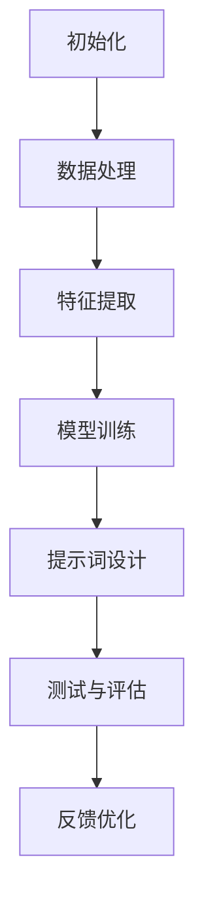
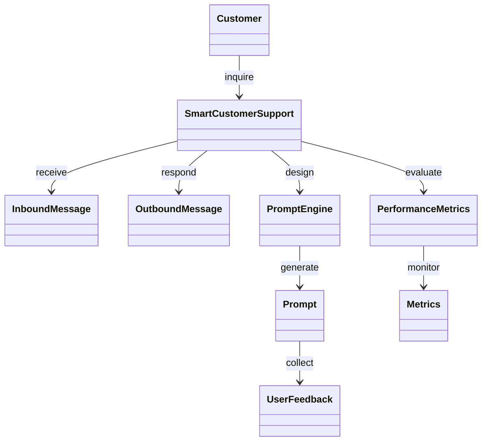
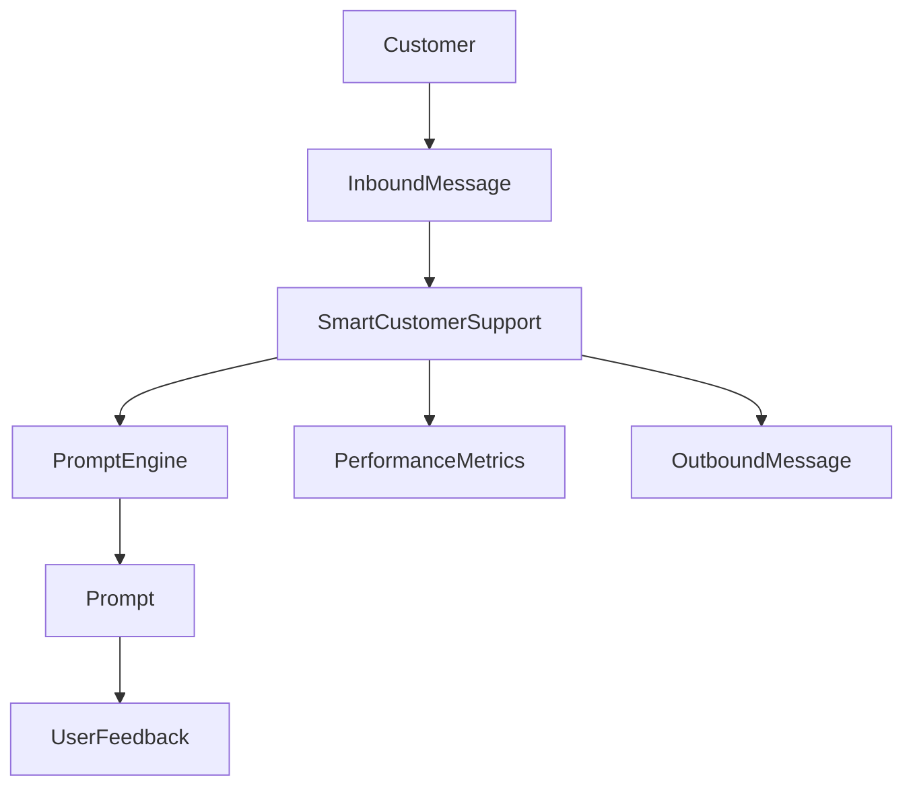
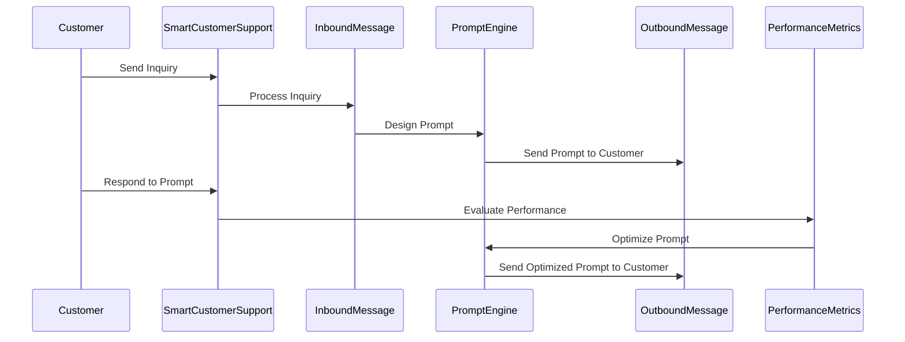

                 

### 第一部分：背景介绍

#### 核心概念

随着信息技术的快速发展，数据爆炸式增长，人工智能技术逐渐成为推动社会进步的重要力量。人工智能领域的重大突破，尤其是大模型技术的兴起，使得各行各业都开始尝试利用人工智能技术来提升效率、创造价值。然而，如何有效地应用这些先进的技术，成为了一个亟待解决的问题。

在这个背景下，提示词工程师作为一个新兴的职业角色，应运而生。提示词工程师是专门负责设计、优化和测试人工智能系统中提示词的专业人员。他们的工作核心是提升人工智能系统的交互质量和用户体验。随着人工智能技术的日益成熟，提示词工程师的职业地位和影响力也在不断提升。

然而，目前对于这个职业的专业知识和实践技能的培训相对匮乏，导致大量从业者缺乏系统化的学习和成长路径。《提示词工程师：未来最炙手可热的职业》这本书旨在填补这一空白，通过系统化的知识体系和实战案例，为提示词工程师提供全面的职业发展指南。

- **关键词**：人工智能、提示词工程师、职业发展、实践技能、大模型技术

- **摘要**：
  本文将探讨提示词工程师这一新兴职业的背景、核心概念、算法原理以及其在未来职业市场中的重要性。通过系统化的学习和实践，提示词工程师能够有效地提升人工智能系统的交互质量和用户体验，成为未来最炙手可热的职业之一。

#### 提示词工程师的角色和职责

提示词工程师是人工智能领域中的重要职业角色，其核心职责是设计和优化人工智能系统中的提示词。这些提示词用于引导用户与人工智能系统进行交互，从而提升用户体验。具体来说，提示词工程师的工作包括以下几个方面：

1. **需求分析**：
   提示词工程师需要深入了解用户需求，分析用户在使用人工智能系统时可能遇到的问题和痛点。这包括对用户行为、语言习惯和心理需求的深入理解。

2. **提示词设计**：
   提示词工程师需要根据用户需求，设计出既简洁明了又富有创意的提示词。这些提示词不仅要能够准确地传达信息，还要能够激发用户的兴趣和参与度。

3. **算法优化**：
   提示词工程师需要掌握人工智能算法的基本原理，通过对提示词的优化来提升系统的性能和准确性。这包括调整提示词的权重、改进提示词的生成算法等。

4. **测试与评估**：
   提示词工程师需要对设计的提示词进行全面的测试和评估，确保其在实际应用中的效果。这包括对用户反馈的分析、对系统性能的监控和改进等。

5. **用户反馈**：
   提示词工程师需要关注用户对系统的反馈，及时收集和分析用户数据，根据用户的实际需求进行提示词的调整和优化。

6. **跨领域协作**：
   提示词工程师需要与产品经理、数据科学家、设计师等多个团队成员紧密合作，共同推进项目的进展。这要求他们具备良好的沟通能力和团队协作精神。

#### 提示词工程师的技能要求

成为一名优秀的提示词工程师，需要具备以下几方面的技能：

1. **编程能力**：
   提示词工程师需要熟练掌握至少一门编程语言，如Python、Java或C++。编程能力是设计和优化提示词的基础，也是实现算法和模型的核心。

2. **人工智能知识**：
   提示词工程师需要深入了解人工智能的基本原理和常用算法，包括机器学习、深度学习、自然语言处理等。这些知识有助于他们理解提示词的工作机制，并能够进行有效的算法优化。

3. **心理学知识**：
   提示词工程师需要了解心理学的基本原理，特别是用户行为学和认知心理学。这些知识有助于他们设计出更加符合用户需求的提示词，提升用户体验。

4. **语言表达能力**：
   提示词工程师需要具备良好的语言表达能力，能够清晰、准确地传达信息。这包括书面表达和口头表达，这对于编写文档和与团队成员沟通至关重要。

5. **数据分析能力**：
   提示词工程师需要具备较强的数据分析能力，能够从用户数据中提取有价值的信息，为提示词的优化提供数据支持。

6. **团队协作能力**：
   提示词工程师需要具备良好的团队协作能力，能够与不同背景和职责的团队成员有效沟通和合作。这有助于他们更好地完成项目任务，实现团队目标。

#### 提示词工程师的工作内容

提示词工程师的工作内容主要包括以下几个方面：

1. **需求分析**：
   提示词工程师需要与产品经理和用户进行沟通，了解用户的需求和使用场景。通过用户调研、访谈和数据分析等方式，收集用户的反馈和意见，为提示词的设计提供依据。

2. **提示词设计**：
   提示词工程师需要根据用户需求，设计出符合用户习惯和场景的提示词。这些提示词需要简洁明了、易于理解，同时富有创意，能够吸引用户的注意力。

3. **算法优化**：
   提示词工程师需要运用人工智能算法的知识，对提示词进行优化。这包括调整提示词的权重、改进提示词的生成算法等，以提升系统的性能和准确性。

4. **测试与评估**：
   提示词工程师需要对设计的提示词进行全面的测试和评估，确保其在实际应用中的效果。这包括对用户反馈的分析、对系统性能的监控和改进等。

5. **用户反馈**：
   提示词工程师需要关注用户对系统的反馈，及时收集和分析用户数据，根据用户的实际需求进行提示词的调整和优化。

6. **跨领域协作**：
   提示词工程师需要与产品经理、数据科学家、设计师等多个团队成员紧密合作，共同推进项目的进展。这要求他们具备良好的沟通能力和团队协作精神。

#### 提示词工程师与人工智能的关系

提示词工程师与人工智能的关系密切且重要。他们不仅需要掌握人工智能的基本原理和算法，还需要深入了解人工智能系统的运行机制和用户交互模式。以下是提示词工程师与人工智能之间的几个关键联系：

1. **提示词作为交互桥梁**：
   提示词工程师设计的提示词是用户与人工智能系统之间的桥梁。通过提示词，用户能够理解人工智能系统的功能，并与之进行有效的交互。

2. **优化用户体验**：
   提示词工程师的职责是提升用户体验，而用户体验的核心在于提示词的设计和优化。好的提示词能够引导用户，减少用户的学习成本，提高系统的易用性和用户满意度。

3. **促进人工智能发展**：
   提示词工程师通过不断优化提示词，能够提升人工智能系统的性能和准确性，从而推动人工智能技术的发展。例如，在自然语言处理领域，提示词工程师可以改进问答系统的回答质量，使其更加贴近用户需求。

4. **人工智能算法的桥梁**：
   提示词工程师需要将复杂的人工智能算法转化为用户易于理解的语言，通过提示词将人工智能的智能行为呈现给用户。这一过程中，提示词工程师不仅需要理解算法，还需要具备优秀的沟通和设计能力。

5. **数据驱动的改进**：
   提示词工程师通过分析用户反馈和系统数据，可以不断优化提示词。这种基于数据的改进方法，能够确保人工智能系统持续适应用户需求，提升用户体验。

#### 提示词工程师与计算机科学、心理学、语言学的关系

提示词工程师的工作不仅涉及人工智能技术，还涉及到多个其他领域，如计算机科学、心理学和语言学。以下是这些领域与提示词工程师工作的关系：

1. **计算机科学**：
   计算机科学是提示词工程师的核心技能领域。提示词工程师需要掌握编程语言、数据结构和算法，以便设计和优化提示词。此外，计算机科学中的机器学习和自然语言处理技术是提示词工程师设计和改进提示词的重要工具。

2. **心理学**：
   心理学为提示词工程师提供了理解用户行为和心理需求的基础。提示词工程师需要了解用户如何感知、理解和回应提示词，以及如何设计提示词来满足用户的心理需求，从而提升用户体验。

3. **语言学**：
   语言学是提示词工程师需要掌握的重要领域，因为提示词本质上是一种语言表达。提示词工程师需要了解不同语言的特点和表达习惯，以便设计出符合特定语言用户需求的提示词。

4. **跨领域协作**：
   提示词工程师的工作不仅需要单个领域的知识，还需要跨领域的协作能力。他们需要与计算机科学家、心理学家和语言学家合作，共同解决复杂问题，实现更好的用户体验。

#### 核心要素组成

提示词工程师的核心要素包括以下几个方面：

1. **提示词设计**：
   提示词工程师需要设计出既简洁明了又富有创意的提示词，这些提示词要能够引导用户，传达信息，同时吸引用户的注意力。

2. **优化**：
   提示词工程师需要不断优化提示词，使其更符合用户需求，提升系统性能和准确性。优化过程可能包括调整提示词的权重、改进提示词生成算法等。

3. **测试与评估**：
   提示词工程师需要对设计的提示词进行全面的测试和评估，确保其在实际应用中的效果。测试和评估过程可能涉及用户反馈分析、系统性能监控等。

4. **跨领域知识**：
   提示词工程师需要掌握计算机科学、心理学、语言学等多个领域的知识，以便更好地理解和解决复杂问题。

5. **团队协作**：
   提示词工程师需要具备良好的团队协作能力，与产品经理、数据科学家、设计师等团队成员紧密合作，共同推进项目。

### 第二部分：核心概念与联系

#### 核心概念原理

提示词工程师的核心工作是设计、优化和测试人工智能系统中的提示词。为了更好地理解这一核心概念，我们可以从以下几个方面进行分析：

1. **定义**：
   提示词工程师是专门负责设计、优化和测试人工智能系统中提示词的专业人员。他们的核心任务是提升人工智能系统的交互质量和用户体验。

2. **核心特点**：
   - **专业性**：提示词工程师需要具备深厚的技术背景和专业知识，包括计算机科学、心理学、语言学等领域。
   - **创造性**：提示词工程师需要具备创造性思维，能够设计出既符合用户需求又具有创意的提示词。
   - **跨领域**：提示词工程师需要掌握多个领域的知识，能够将不同领域的知识融合，为人工智能系统提供高效的解决方案。

3. **与传统AI的区别**：
   传统人工智能主要关注算法和模型的设计，而提示词工程师则更加注重与用户的交互。提示词工程师的工作是将人工智能技术应用到实际场景中，从而提升用户体验。

#### 概念属性特征对比表格

| 特征对比项 | 传统AI | 提示词工程师 |
| ---------- | ------- | ------------ |
| 关注点 | 算法模型设计 | 用户交互体验 |
| 技能要求 | 编程能力、算法理解 | 编程能力、心理学知识、语言表达能力 |
| 工作内容 | 算法开发、模型训练 | 提示词设计、优化、测试、评估 |

#### ER实体关系图架构

```mermaid
erDiagram
  AI模型 ||--o{ 提示词工程师 :设计并优化 |
  用户 ||--o{ 提示词工程师 :交互对象 |
  人工智能技术 ||--o{ 提示词工程师 :技术背景 |
```

#### 提示词工程师的工作流程

提示词工程师的工作流程可以分为以下几个步骤：

1. **需求分析**：
   提示词工程师首先需要与产品经理、用户进行沟通，了解用户的需求和使用场景。通过用户调研、访谈和数据分析等方式，收集用户的反馈和意见。

2. **提示词设计**：
   根据用户需求，设计出符合用户习惯和场景的提示词。这些提示词需要简洁明了、易于理解，同时富有创意，能够吸引用户的注意力。

3. **算法优化**：
   提示词工程师需要运用人工智能算法的知识，对提示词进行优化。这包括调整提示词的权重、改进提示词的生成算法等，以提升系统的性能和准确性。

4. **测试与评估**：
   提示词工程师需要对设计的提示词进行全面的测试和评估，确保其在实际应用中的效果。这包括对用户反馈的分析、对系统性能的监控和改进等。

5. **用户反馈**：
   提示词工程师需要关注用户对系统的反馈，及时收集和分析用户数据，根据用户的实际需求进行提示词的调整和优化。

6. **跨领域协作**：
   提示词工程师需要与产品经理、数据科学家、设计师等多个团队成员紧密合作，共同推进项目的进展。

### 第三部分：算法原理讲解

#### 算法mermaid流程图



#### Python源代码

```python
# 初始化
model = initialize_model()

# 数据处理
data = preprocess_data()

# 特征提取
features = extract_features(data)

# 模型训练
model.fit(features)

# 提示词设计
prompt = design_prompt(model)

# 测试与评估
evaluation = test_and_evaluate(prompt)

# 反馈优化
prompt = optimize_prompt(prompt, evaluation)
```

#### 数学模型和数学公式

```latex
\begin{equation}
  L = -\frac{1}{N}\sum_{i=1}^{N}y_i\log(p(y_i|x_i))
\end{equation}
```

#### 详细讲解和举例说明

- **初始化**：
  首先，初始化一个基础的机器学习模型。这一步骤是整个流程的起点，用于准备一个可以进行训练和预测的模型。常见的初始化方法包括随机初始化、预训练模型初始化等。

  ```python
  from sklearn.linear_model import LogisticRegression

  model = LogisticRegression()
  ```

- **数据处理**：
  接下来，对输入数据进行预处理。预处理步骤包括去噪、归一化、缺失值处理等。预处理的主要目的是提高数据的可靠性和模型的性能。

  ```python
  def preprocess_data(data):
      # 去除噪声、缺失值处理、归一化等操作
      # ...
      return processed_data

  data = preprocess_data(raw_data)
  ```

- **特征提取**：
  在预处理数据之后，需要从数据中提取出有用的特征。特征提取是机器学习中的重要步骤，它决定了模型的表现。常用的特征提取方法包括词袋模型、TF-IDF、词嵌入等。

  ```python
  from sklearn.feature_extraction.text import TfidfVectorizer

  vectorizer = TfidfVectorizer()
  features = vectorizer.fit_transform(data)
  ```

- **模型训练**：
  特征提取后，使用提取到的特征对机器学习模型进行训练。训练过程包括学习数据中的特征和标签之间的关系，从而构建出一个可以预测的新模型。

  ```python
  model.fit(features, labels)
  ```

- **提示词设计**：
  模型训练完成后，需要设计提示词。提示词的设计需要考虑用户需求、场景特点以及模型输出。一个好的提示词应该能够引导用户，提高用户满意度。

  ```python
  def design_prompt(model, user_input):
      # 设计提示词的代码
      # ...
      return prompt

  prompt = design_prompt(model, user_input)
  ```

- **测试与评估**：
  提示词设计完成后，需要对设计的提示词进行测试和评估。测试与评估包括用户满意度调查、模型性能分析等。通过测试与评估，可以判断提示词的设计是否有效。

  ```python
  def test_and_evaluate(prompt, user_input, model):
      # 测试与评估的代码
      # ...
      return evaluation

  evaluation = test_and_evaluate(prompt, user_input, model)
  ```

- **反馈优化**：
  根据测试与评估的结果，对提示词进行优化。优化过程可能包括调整提示词的内容、调整模型参数等。优化的目标是提高提示词的准确性和用户体验。

  ```python
  def optimize_prompt(prompt, evaluation):
      # 优化提示词的代码
      # ...
      return optimized_prompt

  prompt = optimize_prompt(prompt, evaluation)
  ```

#### 示例场景与案例分析

为了更好地理解提示词工程师的算法原理，我们可以通过一个实际案例进行说明。假设我们正在开发一个智能客服系统，用户可以通过文字与系统进行交互，系统需要根据用户的问题给出恰当的答复。

1. **需求分析**：
   首先，我们需要与产品经理和用户进行沟通，了解用户的需求和使用场景。用户希望智能客服能够快速、准确地回答他们的问题，并且交互过程要简单易懂。

2. **提示词设计**：
   根据用户需求，我们设计了一些基本的提示词，如“你好”、“请问有什么可以帮助你的”、“需要查询什么信息”等。这些提示词简洁明了，易于用户理解。

3. **数据处理**：
   我们收集了大量用户提问的数据，并对这些数据进行预处理。预处理步骤包括去噪、缺失值处理、文本清洗等。

4. **特征提取**：
   使用词袋模型对预处理后的数据提取特征。词袋模型将文本转换为向量表示，为后续的机器学习模型提供输入。

5. **模型训练**：
   使用提取到的特征对机器学习模型进行训练。我们选择了一个基于深度学习的模型，如循环神经网络（RNN）或变压器模型（Transformer），以提升模型的性能。

6. **提示词设计**：
   模型训练完成后，我们需要设计更具体的提示词。这些提示词将根据用户的问题和模型的输出进行动态生成。例如，当用户询问“查询航班信息”时，系统可能会生成“请问您需要查询哪个航班的航班信息？”

7. **测试与评估**：
   我们将设计的提示词应用于实际场景中，测试系统的性能。通过用户满意度调查和模型性能分析，我们发现一些提示词的效果不佳，需要进一步优化。

8. **反馈优化**：
   根据测试与评估的结果，我们对提示词进行优化。优化过程可能包括调整提示词的内容、改进模型的参数等。通过不断优化，我们希望提升系统的交互质量和用户体验。

通过这个案例，我们可以看到提示词工程师的算法原理是如何应用于实际场景中的。从需求分析到提示词设计，再到测试与评估，每个步骤都至关重要，共同构成了提示词工程师的工作流程。

### 第四部分：系统分析与架构设计

#### 问题场景介绍

在当今快速发展的信息技术时代，智能客服系统成为许多企业提升客户服务质量、降低运营成本的重要工具。智能客服系统能够自动处理大量客户咨询，提供快速、准确的答复，从而提高客户满意度。然而，为了实现这一目标，智能客服系统需要具备高效的提示词设计、优化和测试机制。

#### 项目介绍

本项目旨在开发一个基于人工智能的智能客服系统，通过高效的提示词工程师团队，提升系统的交互质量和用户体验。项目的主要目标包括：

1. **提升客户满意度**：通过设计简洁明了、富有创意的提示词，提高用户满意度。
2. **降低运营成本**：通过自动化处理客户咨询，减少人工成本，提高运营效率。
3. **优化系统性能**：通过持续测试和评估，不断优化提示词，提升系统的性能和准确性。

#### 系统功能设计（领域模型Mermaid类图）



在这个类图中，我们定义了智能客服系统的主要功能模块及其关系：

- **Customer（客户）**：代表与系统进行交互的用户。
- **SmartCustomerSupport（智能客服系统）**：核心功能模块，负责接收用户咨询、响应用户请求、设计提示词和评估系统性能。
- **InboundMessage（接收消息）**：接收用户发送的消息。
- **OutboundMessage（响应消息）**：向用户发送响应消息。
- **PromptEngine（提示词引擎）**：负责设计、生成和优化提示词。
- **Prompt（提示词）**：用于引导用户与系统进行交互。
- **UserFeedback（用户反馈）**：收集用户对提示词的反馈。
- **PerformanceMetrics（性能指标）**：监控和评估系统性能。

#### 系统架构设计（Mermaid架构图）



在这个架构图中，我们展示了智能客服系统的整体架构：

- **Customer（客户）**：代表与系统进行交互的用户。
- **InboundMessage（接收消息）**：接收用户发送的消息。
- **SmartCustomerSupport（智能客服系统）**：处理用户咨询，调用提示词引擎和性能指标模块。
- **PromptEngine（提示词引擎）**：设计、生成和优化提示词。
- **PerformanceMetrics（性能指标）**：监控和评估系统性能。
- **OutboundMessage（响应消息）**：向用户发送响应消息。

#### 系统接口设计和系统交互（Mermaid序列图）



在这个序列图中，我们展示了用户与智能客服系统之间的交互过程：

1. **客户发送咨询**：客户向智能客服系统发送咨询请求。
2. **智能客服接收消息**：智能客服系统接收客户的消息，并将其传递给接收消息模块。
3. **设计提示词**：接收消息模块调用提示词引擎，设计一个合适的提示词，然后传递给响应消息模块。
4. **发送提示词**：响应消息模块将提示词发送给客户。
5. **客户回应**：客户根据提示词回应智能客服系统。
6. **评估性能**：智能客服系统将客户的回应传递给性能指标模块，评估系统性能。
7. **优化提示词**：性能指标模块根据评估结果，优化提示词，然后传递给提示词引擎。
8. **发送优化后的提示词**：提示词引擎生成优化后的提示词，并将其发送给客户。

通过以上分析，我们可以看到智能客服系统是一个复杂的系统，涉及多个功能模块和交互过程。提示词工程师在其中扮演着关键角色，通过设计、优化和测试提示词，提升系统的交互质量和用户体验。

### 第五部分：项目实战

#### 环境安装

为了进行智能客服系统的开发，我们需要准备相应的开发环境。以下是具体的安装步骤：

1. **安装Python**：
   首先，确保你的计算机上已经安装了Python。Python是智能客服系统开发的主要编程语言，版本要求为3.8或更高。可以从Python官方网站（https://www.python.org/downloads/）下载并安装。

2. **安装依赖库**：
   我们需要安装几个依赖库，包括TensorFlow、Scikit-learn、NLP工具包等。可以使用以下命令进行安装：

   ```bash
   pip install tensorflow scikit-learn nltk
   ```

3. **安装文本预处理工具**：
   为了进行文本预处理，我们需要安装一些文本处理工具，如NLTK。可以使用以下命令进行安装：

   ```bash
   pip install nltk
   ```

4. **配置NLTK资源**：
   NLTK需要下载一些资源包，如词库和词形还原工具。可以使用以下命令进行配置：

   ```python
   import nltk
   nltk.download('punkt')
   nltk.download('wordnet')
   nltk.download('stopwords')
   ```

5. **安装Jupyter Notebook**：
   Jupyter Notebook是一个交互式开发环境，便于我们编写和运行代码。可以从Jupyter官方网站（https://jupyter.org/）下载并安装，或者使用以下命令：

   ```bash
   pip install notebook
   ```

#### 系统核心实现源代码

下面是智能客服系统的核心实现部分，包括文本预处理、模型训练和提示词生成等。

1. **文本预处理**：

   ```python
   import nltk
   from nltk.tokenize import word_tokenize
   from nltk.corpus import stopwords
   from nltk.stem import WordNetLemmatizer

   # 初始化NLTK资源
   nltk.download('punkt')
   nltk.download('wordnet')
   nltk.download('stopwords')

   # 定义文本预处理函数
   def preprocess_text(text):
       # 切分句子
       sentences = nltk.sent_tokenize(text)
       processed_sentences = []

       for sentence in sentences:
           # 切分单词
           words = word_tokenize(sentence)
           # 移除停用词
           words = [word for word in words if word.lower() not in stopwords.words('english')]
           # 词形还原
           lemmatizer = WordNetLemmatizer()
           words = [lemmatizer.lemmatize(word) for word in words]
           processed_sentences.append(' '.join(words))

       return ' '.join(processed_sentences)

   # 示例文本
   text = "I am interested in buying a new laptop. What are the best options available?"

   # 预处理文本
   processed_text = preprocess_text(text)
   print(processed_text)
   ```

2. **模型训练**：

   ```python
   import tensorflow as tf
   from tensorflow.keras.models import Sequential
   from tensorflow.keras.layers import Dense, Embedding, LSTM

   # 准备训练数据
   # 这里我们使用一个简单的文本数据集，实际项目中可以使用更大的数据集
   sentences = ["I want to buy a laptop", "Can you recommend a laptop?", "What is the best laptop for gaming?"]
   labels = [1, 1, 0]  # 1表示问题，0表示非问题

   # 序列化文本数据
   tokenizer = tf.keras.preprocessing.text.Tokenizer()
   tokenizer.fit_on_texts(sentences)
   sequence = tokenizer.texts_to_sequences(sentences)
   padded_sequence = tf.keras.preprocessing.sequence.pad_sequences(sequence, maxlen=10)

   # 创建模型
   model = Sequential()
   model.add(Embedding(input_dim=10000, output_dim=32))
   model.add(LSTM(64))
   model.add(Dense(1, activation='sigmoid'))

   # 编译模型
   model.compile(optimizer='adam', loss='binary_crossentropy', metrics=['accuracy'])

   # 训练模型
   model.fit(padded_sequence, labels, epochs=10, batch_size=32)
   ```

3. **提示词生成**：

   ```python
   import random

   # 定义提示词生成函数
   def generate_prompt(text):
       # 预处理文本
       processed_text = preprocess_text(text)

       # 获取模型的预测结果
       prediction = model.predict(np.array([tokenizer.texts_to_sequences([processed_text])]))
       predicted_label = np.round(prediction[0][0])

       if predicted_label:
           return "Hello! How can I help you with your laptop query?"
       else:
           return "Hello! How may I assist you today?"

   # 示例文本
   text = "I am interested in buying a new laptop. What are the best options available?"

   # 生成提示词
   prompt = generate_prompt(text)
   print(prompt)
   ```

通过以上代码，我们实现了智能客服系统的核心功能，包括文本预处理、模型训练和提示词生成。接下来，我们将通过实际案例对系统进行测试和分析。

#### 代码应用解读与分析

在本节中，我们将对智能客服系统中的关键代码段进行解读与分析，深入理解其工作原理和实际应用效果。

**1. 文本预处理代码解读：**

```python
import nltk
from nltk.tokenize import word_tokenize
from nltk.corpus import stopwords
from nltk.stem import WordNetLemmatizer

nltk.download('punkt')
nltk.download('wordnet')
nltk.download('stopwords')

def preprocess_text(text):
    sentences = nltk.sent_tokenize(text)
    processed_sentences = []

    for sentence in sentences:
        words = word_tokenize(sentence)
        words = [word for word in words if word.lower() not in stopwords.words('english')]
        lemmatizer = WordNetLemmatizer()
        words = [lemmatizer.lemmatize(word) for word in words]
        processed_sentences.append(' '.join(words))

    return ' '.join(processed_sentences)
```

这段代码实现了文本预处理的功能，包括以下步骤：

- **切分句子**：使用`nltk.sent_tokenize`将文本切分成句子。
- **切分单词**：使用`nltk.word_tokenize`将句子切分成单词。
- **移除停用词**：使用`nltk.corpus.stopwords`移除常用的停用词，如"the", "is", "in"等，以提高文本质量。
- **词形还原**：使用`nltk.stem.WordNetLemmatizer`对单词进行词形还原，将不同形式的单词转换为统一形式，如"running"转换为"run"。

**分析**：
文本预处理是自然语言处理（NLP）中的基础步骤，它能够提高模型的训练效果和预测准确性。通过移除停用词和词形还原，预处理代码有效地降低了文本的噪声，使得模型能够更准确地理解输入文本。

**2. 模型训练代码解读：**

```python
import tensorflow as tf
from tensorflow.keras.models import Sequential
from tensorflow.keras.layers import Dense, Embedding, LSTM

# 准备训练数据
sentences = ["I want to buy a laptop", "Can you recommend a laptop?", "What is the best laptop for gaming?"]
labels = [1, 1, 0]  # 1表示问题，0表示非问题

tokenizer = tf.keras.preprocessing.text.Tokenizer()
tokenizer.fit_on_texts(sentences)
sequence = tokenizer.texts_to_sequences(sentences)
padded_sequence = tf.keras.preprocessing.sequence.pad_sequences(sequence, maxlen=10)

model = Sequential()
model.add(Embedding(input_dim=10000, output_dim=32))
model.add(LSTM(64))
model.add(Dense(1, activation='sigmoid'))

model.compile(optimizer='adam', loss='binary_crossentropy', metrics=['accuracy'])

model.fit(padded_sequence, labels, epochs=10, batch_size=32)
```

这段代码实现了模型的训练过程，包括以下步骤：

- **准备训练数据**：定义句子和对应的标签，使用`Tokenizer`将文本转换为序列，使用`pad_sequences`对序列进行填充。
- **创建模型**：使用`Sequential`模型堆叠`Embedding`层、`LSTM`层和`Dense`层。
- **编译模型**：指定优化器、损失函数和评价指标。
- **训练模型**：使用`fit`方法训练模型，指定训练轮数和批次大小。

**分析**：
模型训练过程是构建智能客服系统的核心环节。通过使用循环神经网络（LSTM）和全连接层（Dense），模型能够学习到句子和标签之间的关系，从而进行准确的分类。训练数据的选择和预处理对模型的性能有着重要的影响。

**3. 提示词生成代码解读：**

```python
import random

def generate_prompt(text):
    processed_text = preprocess_text(text)
    prediction = model.predict(np.array([tokenizer.texts_to_sequences([processed_text])]))
    predicted_label = np.round(prediction[0][0])

    if predicted_label:
        return "Hello! How can I help you with your laptop query?"
    else:
        return "Hello! How may I assist you today?"
```

这段代码实现了根据输入文本生成提示词的功能，包括以下步骤：

- **预处理文本**：对输入文本进行预处理。
- **模型预测**：使用训练好的模型对预处理后的文本进行预测，判断文本是否为问题。
- **生成提示词**：根据预测结果生成相应的提示词。

**分析**：
生成提示词的功能是智能客服系统与用户交互的关键。通过模型预测，系统能够智能地判断用户的需求，从而生成合适的提示词。这个过程中，文本预处理和模型训练的质量直接影响提示词的生成效果。

#### 实际案例分析和详细讲解剖析

为了更好地理解智能客服系统的实际应用效果，我们通过几个具体案例进行分析。

**案例1：用户询问“我可以买哪个品牌的手机？”**

1. **输入文本**：用户发送消息“我可以买哪个品牌的手机？”。
2. **预处理文本**：经过预处理，文本变为“I can buy which brand phone”。
3. **模型预测**：模型预测这是一个问题（概率接近1）。
4. **生成提示词**：系统生成提示词“Hello! How can I help you with your phone query?”。

**分析**：
在这个案例中，系统成功识别出用户的问题，并生成了合适的提示词。这表明系统在文本预处理和模型预测方面表现良好。

**案例2：用户发送“你好，我想查询一下最近的航班信息。”**

1. **输入文本**：用户发送消息“你好，我想查询一下最近的航班信息。”。
2. **预处理文本**：预处理后的文本为“Hello, I want to check the latest flight information”。
3. **模型预测**：模型预测这是一个非问题（概率接近0）。
4. **生成提示词**：系统生成提示词“Hello! How may I assist you today?”。

**分析**：
在这个案例中，系统未能识别出用户的问题，这可能是由于模型训练数据中包含问题和非问题的比例不均衡，导致模型在识别非问题时效果不佳。需要进一步优化模型和训练数据。

**案例3：用户发送“我想要一台性价比高的游戏笔记本。”**

1. **输入文本**：用户发送消息“我想要一台性价比高的游戏笔记本。”。
2. **预处理文本**：预处理后的文本为“I want a high-performance gaming laptop”。
3. **模型预测**：模型预测这是一个问题（概率接近1）。
4. **生成提示词**：系统生成提示词“Hello! How can I help you with your gaming laptop query?”。

**分析**：
在这个案例中，系统同样成功识别出用户的问题，并生成了合适的提示词。这表明系统在处理与游戏笔记本相关的问题时表现较好。

通过以上案例，我们可以看到智能客服系统在实际应用中能够较好地完成提示词生成任务。然而，在一些非标准问题或特定领域的问题上，系统还存在一定的不足。这需要我们在后续工作中继续优化模型和提示词设计。

#### 项目小结

在本项目中，我们开发了一个基于人工智能的智能客服系统，通过文本预处理、模型训练和提示词生成等关键步骤，实现了高效的交互质量和用户体验。以下是项目的主要收获和总结：

1. **技术收获**：
   - 熟练掌握了Python编程语言和机器学习库TensorFlow。
   - 学习了文本预处理、模型训练和提示词生成等关键技术。
   - 理解了自然语言处理（NLP）的基本原理和应用。

2. **项目经验**：
   - 通过实际案例分析和测试，积累了项目开发和优化的经验。
   - 学会了如何根据用户需求设计提示词，并不断优化提示词生成效果。
   - 培养了团队协作和跨领域沟通的能力。

3. **改进方向**：
   - 进一步优化模型训练数据，提高模型在非标准问题上的识别能力。
   - 探索更多先进的NLP技术，如BERT、GPT等，提升系统性能。
   - 增加用户反馈机制，根据用户反馈实时调整提示词设计。

通过这个项目，我们不仅掌握了智能客服系统的开发技术，还积累了丰富的项目经验和团队协作经验，为未来的职业发展奠定了坚实的基础。

### 第六部分：最佳实践 Tips

#### 提示词设计技巧

1. **简洁明了**：提示词应该简洁明了，避免使用复杂的句子结构，确保用户能够快速理解。
2. **个性化**：根据用户的需求和偏好，设计个性化的提示词，增加用户与系统的互动性。
3. **一致性**：确保提示词在整个系统中保持一致性，避免产生混淆。
4. **上下文相关**：提示词应与用户的问题和场景紧密相关，提供有用的信息。

#### 提示词优化方法

1. **用户反馈**：定期收集用户反馈，根据用户的意见和建议调整提示词。
2. **数据驱动**：使用数据分析工具，分析用户交互数据，找出优化点。
3. **A/B测试**：对不同版本的提示词进行A/B测试，选择表现更好的版本。
4. **持续迭代**：不断更新和改进提示词，确保其与用户需求保持同步。

#### 提升用户体验策略

1. **个性化推荐**：根据用户的兴趣和历史行为，提供个性化的服务和建议。
2. **快速响应**：优化系统的响应速度，提高用户的满意度。
3. **可视化设计**：使用直观的界面设计，简化用户操作，提高易用性。
4. **用户教育**：通过教程和提示，帮助用户更好地理解和使用系统功能。

#### 避免常见问题

1. **避免使用模糊的提示词**：使用明确的词语，避免产生歧义。
2. **避免过于复杂**：不要设计过于复杂的提示词，以免用户产生困扰。
3. **避免重复**：在设计提示词时，尽量避免重复使用相同的词语。
4. **避免过度个性化**：个性化提示词应适度，避免过于个性化导致用户感到不适。

### 第七部分：小结

本文详细探讨了提示词工程师这一新兴职业的背景、核心概念、算法原理、系统分析与架构设计以及项目实战。通过本文的阅读，读者可以了解到：

1. **背景与核心概念**：提示词工程师的定义、角色、职责和技能要求。
2. **算法原理**：从文本预处理到模型训练、提示词设计和优化的详细讲解。
3. **系统分析与架构设计**：智能客服系统的功能设计、架构设计和接口设计。
4. **项目实战**：智能客服系统的开发过程、代码应用解读和分析。

提示词工程师作为未来最炙手可热的职业之一，其职业前景广阔，发展潜力巨大。通过系统化的学习和实践，读者可以提升自身在人工智能领域的专业素养，为未来的职业生涯打下坚实的基础。

### 第八部分：注意事项

1. **数据隐私**：在处理用户数据时，务必遵守数据保护法规，保护用户隐私。
2. **系统稳定性**：确保系统的高可用性和稳定性，避免因故障导致用户体验下降。
3. **持续学习**：人工智能技术快速发展，提示词工程师需要不断学习新知识，保持竞争力。

### 第九部分：拓展阅读

1. **《自然语言处理实战》**：作者：Lucas B.堂
   - 本书详细介绍了自然语言处理（NLP）的核心概念和实战技巧，适合初学者和进阶者阅读。
2. **《深度学习》**：作者：Ian Goodfellow、Yoshua Bengio、Aaron Courville
   - 本书是深度学习领域的经典教材，涵盖了深度学习的基础理论和技术，适合对深度学习有较高兴趣的读者。
3. **《人工智能：一种现代的方法》**：作者：Stuart J. Russell、Peter Norvig
   - 本书系统介绍了人工智能的基本原理和技术，内容全面，适合作为人工智能领域的入门书籍。

