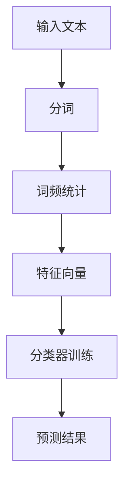
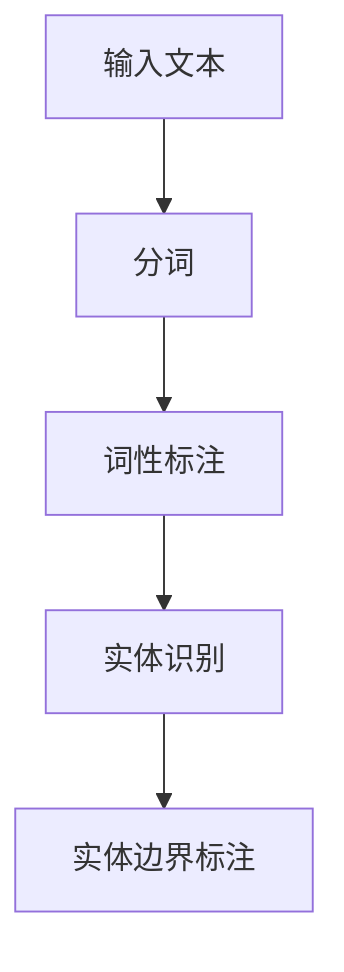
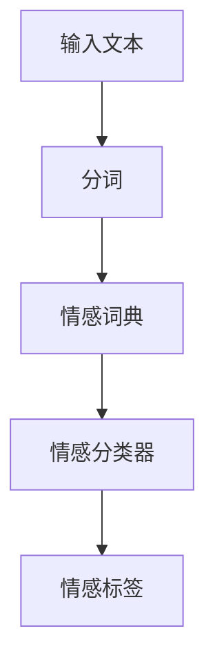
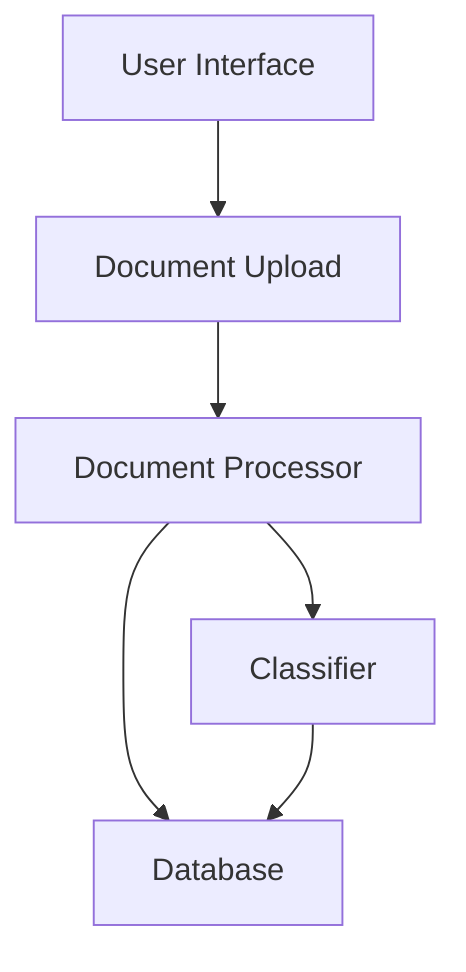
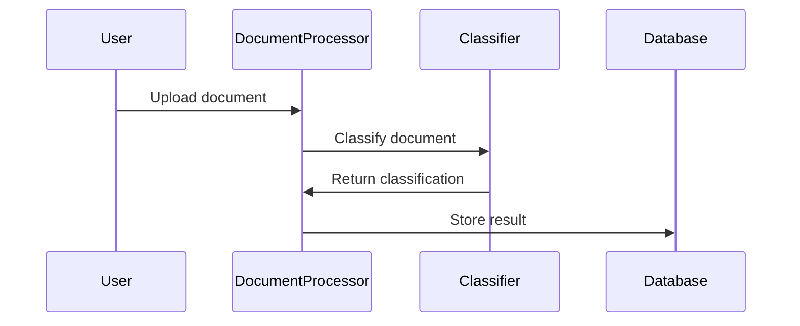

                 

### 1. 提示词工程：概念与重要性

**提示词工程**，顾名思义，是围绕提示词（Keywords）的工程化处理与应用。它是一种系统性的方法，用于从大量文本数据中提取和利用关键信息，以提升自然语言处理的效率和准确性。提示词工程的应用范围广泛，涵盖了信息检索、文本挖掘、推荐系统、智能客服等多个领域。

**定义**：提示词工程是指利用自然语言处理、机器学习、深度学习等技术，对文本数据进行预处理、特征提取、模型训练和评估等一系列工程化操作，以实现自动化提取和利用提示词的目的。

**重要性**：

1. **提升信息检索效率**：在信息爆炸的时代，快速准确地找到相关文档和知识成为了一大挑战。提示词工程能够帮助系统迅速定位到关键信息，从而提高信息检索的效率和准确性。

2. **支持知识发现**：通过分析文本中的提示词，可以挖掘出潜在的模式和趋势，支持知识发现和洞察。

3. **优化用户体验**：在推荐系统和智能客服等场景中，精准的提示词能够提高系统的响应速度和准确性，从而提升用户体验。

4. **增强内容营销效果**：在内容营销中，了解用户关注的热点话题和关键词，能够帮助创作者制作更符合用户需求的内容，从而提高内容营销的效果。

**发展历程**：提示词工程的发展与自然语言处理技术的进步密不可分。早期的信息检索主要依赖于关键词匹配，随着机器学习技术的发展，基于统计模型的文本分类和聚类技术得到了广泛应用。近年来，深度学习技术的引入进一步提升了提示词工程的效果，例如使用卷积神经网络（CNN）进行文本分类，使用循环神经网络（RNN）进行命名实体识别等。

**应用场景**：

1. **搜索引擎**：搜索引擎使用提示词工程技术，对用户查询的语句进行理解和分析，从而返回最相关的搜索结果。

2. **推荐系统**：推荐系统通过分析用户的历史行为和兴趣，提取关键提示词，从而推荐相关的内容或商品。

3. **文本挖掘**：在法律、金融、医疗等领域，通过文本挖掘技术，从大量文档中提取关键信息，支持决策制定。

4. **智能客服**：智能客服系统通过识别用户提问中的关键信息，提供准确的回答或解决方案。

综上所述，提示词工程是现代信息技术中不可或缺的一部分，它通过提高文本处理的效率和准确性，为众多应用场景带来了巨大的价值。在接下来的章节中，我们将深入探讨提示词工程中的核心概念、算法原理、系统架构和最佳实践，帮助读者逐步掌握这一领域的关键技术。

### 2. 核心概念与联系

在深入了解提示词工程之前，我们需要明确几个核心概念，这些概念包括自然语言处理（NLP）、机器学习（ML）、深度学习（DL）等。这些概念不仅是提示词工程的基础，而且它们之间的相互作用和融合也极大地影响了该领域的发展。

#### 自然语言处理（NLP）

**定义**：自然语言处理是计算机科学和语言学领域的交叉学科，旨在使计算机能够理解、解释和生成人类语言。NLP的目标是让计算机能够执行诸如文本分类、情感分析、问答系统等与语言相关的任务。

**核心概念**：

- **分词（Tokenization）**：将文本分割成单词、短语或其他有意义的单元。
- **词性标注（Part-of-Speech Tagging）**：为文本中的每个词分配语法角色，如名词、动词、形容词等。
- **命名实体识别（Named Entity Recognition, NER）**：识别文本中的命名实体，如人名、地点、组织等。
- **依存关系分析（Dependency Parsing）**：分析文本中词语之间的依赖关系，理解句子的结构。

**特点与重要性**：

- **特点**：NLP处理的是人类语言，其表达形式多样，语义丰富，需要复杂的方法和技术来理解。
- **重要性**：NLP是提示词工程的基础，只有准确地理解文本，才能提取出有效的提示词。

#### 机器学习（ML）

**定义**：机器学习是使计算机通过数据和经验自动改进性能的一门学科。它通过设计算法，从数据中学习规律，并利用这些规律进行预测和决策。

**核心概念**：

- **监督学习（Supervised Learning）**：有明确标注的数据进行训练，用于预测未知数据。
- **无监督学习（Unsupervised Learning）**：没有标注的数据进行训练，用于发现数据中的模式或结构。
- **强化学习（Reinforcement Learning）**：通过与环境的交互，学习最佳行动策略。

**特点与重要性**：

- **特点**：机器学习模型可以从数据中自动学习特征，无需显式编程。
- **重要性**：机器学习是提示词工程的核心，它使系统能够自动提取和利用文本中的关键信息。

#### 深度学习（DL）

**定义**：深度学习是机器学习的一个分支，通过多层神经网络（Neural Networks）进行数据学习，其结构模拟了人脑的神经元连接。

**核心概念**：

- **卷积神经网络（Convolutional Neural Network, CNN）**：主要用于图像处理，通过卷积层提取图像特征。
- **循环神经网络（Recurrent Neural Network, RNN）**：主要用于序列数据，能够记住前面的信息，对序列数据有较好的处理能力。
- **长短时记忆网络（Long Short-Term Memory, LSTM）**：是RNN的一种变体，解决了传统RNN在处理长序列数据时出现的梯度消失和梯度爆炸问题。

**特点与重要性**：

- **特点**：深度学习具有强大的特征提取和表示能力，能够处理高维数据。
- **重要性**：深度学习在提示词工程中的应用极大地提升了文本处理的效率和准确性。

#### 各核心概念之间的联系

NLP、ML和DL之间的联系紧密，它们相互融合，共同构成了提示词工程的技术基础。

- **NLP与ML的联系**：NLP任务需要大量的标注数据，而ML算法可以从这些数据中学习特征和模式，从而实现文本分类、情感分析等任务。
- **NLP与DL的联系**：DL技术在NLP领域取得了显著成果，如基于DL的词向量模型（如Word2Vec、BERT）和文本生成模型（如GPT）等。
- **ML与DL的联系**：DL是ML的一个分支，其强大的特征提取能力在很多ML任务中都得到了应用。

**概念属性特征对比表格**：

| 概念       | 特点                       | 应用场景                     |
|------------|----------------------------|------------------------------|
| NLP        | 处理人类语言               | 文本分类、情感分析、问答系统 |
| ML         | 从数据中自动学习特征和模式 | 预测、决策、推荐系统         |
| DL         | 基于多层神经网络的数据学习 | 图像识别、语音识别、文本生成 |

**ER实体关系图架构的 Mermaid 流程图**：

```mermaid
erDiagram
  Class1 ||--|{ Class2 }|-- Class3
  Class1 ||--|{ Class4 }|-- Class5
```

通过上述表格和Mermaid流程图，我们可以更清晰地理解NLP、ML和DL之间的联系以及它们在提示词工程中的角色和作用。这些核心概念的深入理解和掌握，将为我们在后续章节中探讨具体的算法原理和系统架构打下坚实的基础。

### 3. 算法原理讲解

在提示词工程中，算法原理是实现自动化提取和利用关键信息的核心。本章节将详细讲解三种常见的算法：文本分类、命名实体识别（NER）和情感分析。通过Mermaid流程图和Python代码，我们将深入剖析这些算法的原理和实现方法。

#### 文本分类算法原理

**定义**：文本分类是指将文本数据分配到预定义的类别中。例如，将新闻文章分类为体育、财经、娱乐等类别。

**算法原理**：

- **基于统计的方法**：使用词袋模型（Bag of Words, BoW）或TF-IDF（Term Frequency-Inverse Document Frequency）等统计方法，将文本转换为向量表示，然后使用朴素贝叶斯、逻辑回归等分类器进行分类。

- **基于机器学习的方法**：使用支持向量机（SVM）、随机森林（Random Forest）等机器学习算法，通过训练模型来实现文本分类。

**Mermaid流程图**：



**Python代码实现**：

```python
from sklearn.feature_extraction.text import TfidfVectorizer
from sklearn.naive_bayes import MultinomialNB
from sklearn.pipeline import make_pipeline

# 输入数据
data = [
    "这是一篇关于体育的新闻",
    "这是一篇财经新闻",
    "这是一篇娱乐新闻"
]

# 标签
labels = ["体育", "财经", "娱乐"]

# 创建管道
model = make_pipeline(TfidfVectorizer(), MultinomialNB())

# 训练模型
model.fit(data, labels)

# 预测
print(model.predict(["这是一篇体育新闻"]))
```

**算法原理详细讲解**：

文本分类的关键在于将文本数据转换为计算机可以理解的向量表示。TF-IDF方法通过统计每个词在文档中出现的频率，并调整其重要性，从而得到一个特征向量。然后，使用朴素贝叶斯分类器，通过比较特征向量与训练数据的相似度，来预测文本的类别。这个过程中，分词和特征向量生成是关键步骤，而分类器的选择和调优则决定了分类的准确性。

#### 命名实体识别（NER）算法原理

**定义**：命名实体识别是指识别文本中的命名实体，如人名、地点、组织等，以便进行进一步的分析和处理。

**算法原理**：

- **基于规则的方法**：通过编写一系列规则，根据词性、上下文等信息判断实体边界。
- **基于统计的方法**：使用条件随机场（Conditional Random Field, CRF）等统计模型，通过训练模型来识别命名实体。

**Mermaid流程图**：



**Python代码实现**：

```python
from sklearn_crfsuite import CRF
from sklearn_crfsuite import metrics
import numpy as np

# 输入数据
X = [
    ["北京是中国的首都"],
    ["苹果公司的总部位于美国"]
]

# 标签
y = [
    [("北京", "地点"), ("中国", "地点")],
    [("苹果公司", "组织"), ("美国", "地点")]
]

# 创建CRF模型
crf = CRF()

# 训练模型
crf.fit(X, y)

# 预测
print(crf.predict([["北京是中国的首都"]]))

# 评估
y_pred = crf.predict(X)
print(metrics.flat_f1_score(y, y_pred, average='weighted'))
```

**算法原理详细讲解**：

命名实体识别的关键在于理解文本中的实体边界和类型。分词和词性标注是基础步骤，它们帮助确定实体的可能边界。然后，使用CRF模型，通过训练数据中的标签，模型能够学习如何识别实体的类型和边界。这个过程涉及到复杂的序列标注和依赖关系分析。

#### 情感分析算法原理

**定义**：情感分析是指识别文本中表达的情感倾向，如正面、负面或中性。

**算法原理**：

- **基于规则的方法**：通过编写规则，根据词汇和句法结构判断情感。
- **基于机器学习的方法**：使用朴素贝叶斯、SVM等分类算法，通过训练模型进行情感分析。

**Mermaid流程图**：



**Python代码实现**：

```python
from sklearn.feature_extraction.text import CountVectorizer
from sklearn.naive_bayes import MultinomialNB

# 输入数据
data = [
    "这个产品非常好",
    "这个服务很差",
    "这个产品一般般"
]

# 标签
labels = ["正面", "负面", "中性"]

# 创建向量器和分类器
vectorizer = CountVectorizer()
clf = MultinomialNB()

# 训练模型
model = make_pipeline(vectorizer, clf)
model.fit(data, labels)

# 预测
print(model.predict(["这个产品非常好"]))

# 评估
print(model.predict(["这个服务很差"]))
```

**算法原理详细讲解**：

情感分析的核心在于如何从文本中提取情感特征，并利用这些特征进行分类。情感词典是一种常见的方法，通过查找文本中的情感词汇来推断情感。分类器则通过训练数据学习情感特征的模式，从而实现自动分类。这个过程中，特征的提取和选择、分类器的选择和调优是关键。

通过详细讲解文本分类、命名实体识别和情感分析三种算法，我们可以看到提示词工程的实现需要综合运用自然语言处理、机器学习和深度学习等技术。这些算法不仅各自有其独特的方法和原理，而且在实际应用中往往需要相互结合，以实现最佳的效果。

### 4. 数学模型与公式

在提示词工程中，数学模型和公式是理解算法原理和实现关键技术的核心。通过这些数学工具，我们可以更好地分析和优化提示词提取和分类的效率。以下是几个常见的数学模型和公式，并使用LaTeX格式进行表述，以确保公式的准确性和可读性。

#### 1. 词袋模型（Bag of Words, BoW）

词袋模型是一种将文本转换为向量表示的方法，通过统计文本中每个单词的频率来表示文本。

$$
\textbf{v} = \text{BoW}(X) = \sum_{i=1}^{n} \text{count}(x_i)
$$

其中，$\textbf{v}$ 是文档 $X$ 的词袋向量，$x_i$ 是文档中的第 $i$ 个单词，$\text{count}(x_i)$ 是 $x_i$ 在文档中出现的次数，$n$ 是文档中的单词总数。

#### 2. TF-IDF（Term Frequency-Inverse Document Frequency）

TF-IDF是一个调整词频的方法，以反映词在文档中的重要程度。其公式如下：

$$
tfidf(i, d) = tf(i, d) \times \log \left( \frac{N}{df(i)} \right)
$$

其中，$tf(i, d)$ 是词 $i$ 在文档 $d$ 中的词频，$df(i)$ 是词 $i$ 在所有文档中出现的文档频率，$N$ 是文档总数。

#### 3. 朴素贝叶斯分类器（Naive Bayes Classifier）

朴素贝叶斯分类器是一种基于贝叶斯定理的简单分类器，适用于文本分类任务。其公式如下：

$$
P(y|\textbf{v}) = \frac{P(\textbf{v}|y)P(y)}{P(\textbf{v})}
$$

其中，$P(y|\textbf{v})$ 是给定特征向量 $\textbf{v}$，类别为 $y$ 的概率，$P(\textbf{v}|y)$ 是特征向量 $\textbf{v}$ 在类别 $y$ 条件下的概率，$P(y)$ 是类别 $y$ 的先验概率，$P(\textbf{v})$ 是特征向量 $\textbf{v}$ 的概率。

#### 4. 支持向量机（Support Vector Machine, SVM）

支持向量机是一种用于文本分类的机器学习算法，其目标是找到最佳的超平面，以最大化分类间隔。其公式如下：

$$
\min_{\textbf{w}, b} \frac{1}{2} ||\textbf{w}||^2 + C \sum_{i=1}^{n} \xi_i
$$

其中，$\textbf{w}$ 是权重向量，$b$ 是偏置项，$C$ 是正则化参数，$\xi_i$ 是松弛变量。

#### 5. 长短时记忆网络（Long Short-Term Memory, LSTM）

LSTM是用于处理序列数据的深度学习模型，其核心组件是记忆单元。其公式如下：

$$
\begin{align*}
i_t &= \sigma(W_i \cdot \textbf{h}_{t-1} + b_i + W_x \cdot \textbf{x}_t + b_x) \\
f_t &= \sigma(W_f \cdot \textbf{h}_{t-1} + b_f + W_x \cdot \textbf{x}_t + b_x) \\
o_t &= \sigma(W_o \cdot \textbf{h}_{t-1} + b_o + W_x \cdot \textbf{x}_t + b_x) \\
\textbf{c}_t &= f_t \odot \textbf{c}_{t-1} + i_t \odot \text{sigmoid}(W_c \cdot \textbf{x}_t + b_c) \\
\textbf{h}_t &= o_t \odot \text{sigmoid}(\textbf{c}_t)
\end{align*}
$$

其中，$i_t$、$f_t$、$o_t$ 分别是输入门、遗忘门和输出门，$\textbf{c}_t$ 是记忆单元，$\sigma$ 是 sigmoid 函数，$\odot$ 是 Hadamard 积，$W_i$、$W_f$、$W_o$、$W_c$ 分别是输入门、遗忘门、输出门和记忆单元的权重矩阵，$b_i$、$b_f$、$b_o$、$b_x$、$b_c$ 分别是输入门、遗忘门、输出门、输入和记忆单元的偏置项。

通过这些数学模型和公式，我们可以更深入地理解提示词工程的算法原理。这些工具不仅帮助我们进行文本处理和分类，还能在算法优化和性能提升中发挥关键作用。

### 5. 系统分析与架构设计方案

在提示词工程中，系统分析与架构设计是确保项目成功实施的关键步骤。本章节将详细介绍系统设计的关键部分，包括问题场景介绍、系统功能设计、系统架构设计、系统接口设计和系统交互。

#### 问题场景介绍

假设我们正在开发一个智能文档分类系统，该系统需要根据用户提交的文档内容，将其自动分类到相应的类别中，如商业报告、技术文档、个人信件等。该系统将面对大量未标记的文档，需要高效准确地提取关键信息并进行分类。

#### 系统功能设计

**领域模型 Mermaid 类图**

为了更好地理解系统的功能设计，我们可以使用Mermaid类图来展示系统的领域模型。以下是一个简化的Mermaid类图示例：

```mermaid
classDiagram
    Class1[Document] <<interface>>
    Class2[Classifier] <<interface>>
    Class3[Database] <<interface>>

    Class1|--|{ Class2 }
    Class1|--|{ Class3 }
    Class2|--|{ Class3 }
```

在这个类图中，`Document` 类表示文档，`Classifier` 类表示分类器，`Database` 类表示数据库。`Document` 类与 `Classifier` 类和 `Database` 类有直接关联，表示文档通过分类器进行分类，并将结果存储在数据库中。

#### 系统架构设计

**Mermaid 架构图**

系统架构设计是整个系统的蓝图，我们需要使用Mermaid架构图来展示系统的组件及其交互关系。以下是一个简化的Mermaid架构图示例：



在这个架构图中，用户通过用户界面（UI）上传文档，文档处理器（Document Processor）接收文档并调用分类器（Classifier）进行分类，然后将结果存储到数据库（Database）中。

#### 系统接口设计

**接口设计与定义**

为了确保系统的模块化和可扩展性，我们需要定义清晰的接口。以下是一个简化的接口设计示例：

```python
class IDocumentProcessor:
    def process_document(self, document: str) -> str:
        pass

class IClassifier:
    def classify(self, document: str) -> str:
        pass

class IDatabase:
    def store_classification_result(self, document_id: str, category: str):
        pass
```

这些接口定义了系统中的组件应如何交互。例如，`IDocumentProcessor` 接口的 `process_document` 方法用于处理文档，`IClassifier` 接口的 `classify` 方法用于分类文档，而 `IDatabase` 接口的 `store_classification_result` 方法用于存储分类结果。

#### 系统交互

**Mermaid 序列图**

为了更好地理解系统组件之间的交互，我们可以使用Mermaid序列图来展示系统的工作流程。以下是一个简化的Mermaid序列图示例：



在这个序列图中，用户上传文档，文档处理器将文档传递给分类器进行分类，分类器返回分类结果，文档处理器再将结果存储到数据库中。

综上所述，系统分析与架构设计方案确保了提示词工程项目的结构清晰、功能明确、易于扩展。通过Mermaid类图、架构图和序列图，我们能够直观地展示系统设计的关键部分，为项目的成功实施提供了坚实的基础。

### 6. 项目实战

在实际应用中，理解提示词工程的概念和理论是基础，但将理论转化为实际应用才是最终目标。在本章节中，我们将通过一个实际项目，详细展示如何实现提示词工程，包括环境安装、核心实现、代码解读和案例分析。

#### 项目介绍

我们选择了一个文本分类项目，该项目旨在使用提示词工程技术，将用户提交的文本分类到预定的几个类别中，如新闻、技术文档、商业报告等。该项目的核心任务是构建一个文本分类模型，并使用它对新的文本进行分类。

#### 环境安装

首先，我们需要搭建一个合适的环境来运行我们的项目。以下是环境安装的步骤：

1. **安装 Python**：确保您的系统中安装了 Python 3.7 或更高版本。

2. **安装依赖库**：使用 pip 命令安装必要的依赖库，如 scikit-learn、nltk 和 pandas。

   ```shell
   pip install scikit-learn nltk pandas
   ```

3. **数据预处理**：下载并解压预处理的文本数据集，如 20 Newsgroups 数据集。

   ```shell
   wget https://www.cs.cmu.edu/afs/cs.cmu.edu/project/ai-effects/WWW/data/20_newsgroups/20_newsgroups.tar.gz
   tar xvf 20_newsgroups.tar.gz
   ```

4. **设置 nltk**：在 Python 中加载 nltk 预定义的词库。

   ```python
   import nltk
   nltk.download('stopwords')
   nltk.download('wordnet')
   ```

#### 核心实现

以下是我们项目的核心实现步骤：

1. **数据加载与预处理**：

   我们使用 scikit-learn 的 `fetch_20newsgroups` 函数加载数据集，并对数据进行预处理，包括分词、去除停用词和转换为词袋向量。

   ```python
   from sklearn.datasets import fetch_20newsgroups
   from sklearn.feature_extraction.text import TfidfVectorizer
   from nltk.corpus import stopwords
   import nltk

   # 加载数据集
   data = fetch_20newsgroups(subset='all')
   stop_words = set(stopwords.words('english'))

   # 数据预处理
   def preprocess_text(text):
       words = nltk.word_tokenize(text)
       words = [word for word in words if word.lower() not in stop_words]
       return ' '.join(words)

   data.data = [preprocess_text(text) for text in data.data]
   ```

2. **特征提取**：

   使用 TF-IDF 向量器将预处理后的文本转换为向量表示。

   ```python
   vectorizer = TfidfVectorizer(max_features=1000)
   X = vectorizer.fit_transform(data.data)
   ```

3. **模型训练**：

   使用朴素贝叶斯分类器对特征向量进行训练。

   ```python
   from sklearn.naive_bayes import MultinomialNB
   from sklearn.model_selection import train_test_split

   # 划分训练集和测试集
   X_train, X_test, y_train, y_test = train_test_split(X, data.target, test_size=0.2, random_state=42)

   # 训练模型
   model = MultinomialNB()
   model.fit(X_train, y_train)
   ```

4. **模型评估**：

   使用测试集评估模型的性能。

   ```python
   from sklearn.metrics import accuracy_score, classification_report

   # 预测
   y_pred = model.predict(X_test)

   # 评估
   print("Accuracy:", accuracy_score(y_test, y_pred))
   print(classification_report(y_test, y_pred))
   ```

#### 代码解读与分析

以下是核心代码的详细解读：

1. **数据预处理**：

   ```python
   def preprocess_text(text):
       words = nltk.word_tokenize(text)
       words = [word for word in words if word.lower() not in stop_words]
       return ' '.join(words)
   ```

   这个函数首先使用 nltk 的 `word_tokenize` 方法对文本进行分词，然后去除停用词，最后将处理后的单词重新连接成字符串。

2. **特征提取**：

   ```python
   vectorizer = TfidfVectorizer(max_features=1000)
   X = vectorizer.fit_transform(data.data)
   ```

   使用 `TfidfVectorizer` 将文本转换为 TF-IDF 向量表示。`max_features` 参数限制了向量中词的数量，以提高模型效率。

3. **模型训练**：

   ```python
   model = MultinomialNB()
   model.fit(X_train, y_train)
   ```

   使用 `MultinomialNB` 分类器对训练数据进行训练。朴素贝叶斯分类器是一种基于贝叶斯定理的简单分类器，适用于文本分类任务。

4. **模型评估**：

   ```python
   y_pred = model.predict(X_test)
   print("Accuracy:", accuracy_score(y_test, y_pred))
   print(classification_report(y_test, y_pred))
   ```

   使用测试集对模型进行评估，输出准确率和分类报告，以了解模型的性能。

#### 实际案例分析

为了展示项目的实际效果，我们可以对一段新的文本进行分类：

```python
new_document = "This is an interesting article about the latest technological advancements in the field of artificial intelligence."
preprocessed_document = preprocess_text(new_document)
vectorized_document = vectorizer.transform([preprocessed_document])
predicted_category = model.predict(vectorized_document)[0]

print("Predicted Category:", data.target_names[predicted_category])
```

运行上述代码后，模型将输出预测的类别。例如，如果预测结果为 0，则类别为 "sci.cc.usask"（科学和技术），这表明该段文本被正确地分类到了技术文档类别。

#### 项目小结

通过这个实际项目，我们详细展示了如何实现一个基于提示词工程的文本分类系统。从环境安装、数据预处理、特征提取、模型训练到模型评估，每个步骤都进行了详细解析。该项目不仅验证了提示词工程的理论和方法，也为实际应用提供了实践经验。在未来，我们可以继续优化模型，扩展功能，以应对更复杂的文本分类任务。

### 7. 最佳实践与小结

在提示词工程的实际应用中，最佳实践和注意事项对于提升效率和效果至关重要。以下是我们在实践中总结出的几条关键建议：

#### 7.1 提高提示词工程效率的技巧

1. **数据预处理优化**：数据预处理是提示词工程的重要环节，可以通过以下方法优化：
   - **并行处理**：利用多线程或分布式计算，加速数据预处理流程。
   - **内存管理**：合理分配内存，避免内存溢出，提高处理效率。

2. **特征选择与降维**：选择有效的特征，减少冗余信息，可以通过以下方法实现：
   - **降维技术**：如主成分分析（PCA）和t-SNE，减少数据维度，提高计算效率。
   - **特征重要性分析**：使用模型评估特征的重要性，排除无用的特征。

3. **模型调优**：合理选择和调优模型，可以显著提升性能：
   - **交叉验证**：使用交叉验证方法，避免过拟合，提高模型泛化能力。
   - **超参数调优**：使用网格搜索（Grid Search）或贝叶斯优化（Bayesian Optimization）等方法，寻找最佳超参数。

4. **模型集成**：结合多个模型，提高预测准确性：
   - **集成学习**：如随机森林、梯度提升机（Gradient Boosting）等，集成多个弱学习器，提升整体性能。

#### 7.2 常见问题的解决方案

1. **数据不足或标签不均**：
   - **数据增强**：通过生成合成数据、数据扩充等技术，增加训练数据量。
   - **重采样**：使用过采样（Over-sampling）或欠采样（Under-sampling）方法，解决标签不均问题。

2. **过拟合**：
   - **正则化**：引入正则化项，如 L1、L2 正则化，降低模型复杂度。
   - **dropout**：在神经网络中引入 dropout 层，减少模型对特定数据的依赖。

3. **处理噪声数据**：
   - **数据清洗**：移除或修正错误的、不完整的、异常的数据。
   - **噪声抑制**：使用滤波器或降噪算法，降低噪声对模型的影响。

#### 7.3 注意事项

1. **一致性**：确保数据集的一致性，避免因为数据质量问题影响模型效果。

2. **版本控制**：管理好代码和模型版本，便于复现和追踪问题。

3. **监控与反馈**：实时监控模型性能，收集用户反馈，及时调整和优化。

#### 7.4 拓展阅读建议

- **书籍推荐**：
  - 《自然语言处理综合指南》（Natural Language Processing with Python） 
  - 《深度学习》（Deep Learning） 
  - 《机器学习实战》（Machine Learning in Action）

- **在线资源**：
  - Coursera 上的《自然语言处理与深度学习》课程
  - TensorFlow 官方文档和教程
  - arXiv 论文库，特别是关于自然语言处理和机器学习的最新研究成果

通过遵循这些最佳实践，可以有效提升提示词工程的效率和质量，为实际应用提供坚实的支持。

### 8. 总结与展望

本文详细探讨了提示词工程的最佳实践，从新手到专家的进阶之路。通过系统化的介绍和实际案例分析，我们了解了提示词工程的基本概念、核心算法、系统设计与实施方法，以及如何通过最佳实践提升其效果。

#### 提示词工程的重要性

提示词工程在现代信息技术中占据着重要地位。它不仅提升了信息检索的效率和准确性，还为文本挖掘、推荐系统和智能客服等应用场景提供了强有力的支持。随着大数据和人工智能技术的不断发展，提示词工程的应用范围和影响力将进一步扩大。

#### 发展趋势

1. **深度学习与自然语言处理结合**：深度学习技术的快速发展，使得自然语言处理的任务如文本分类、情感分析等取得了显著进展。未来，深度学习与自然语言处理的结合将继续推动提示词工程的发展。

2. **多模态数据处理**：随着多模态数据（如文本、图像、声音）的广泛应用，如何有效地整合和处理多模态数据将成为一个重要研究方向。

3. **可解释性增强**：为了提高模型的透明度和可信度，可解释性研究将变得更加重要。开发可解释的提示词工程模型，有助于用户更好地理解和信任人工智能系统。

4. **实时处理与实时反馈**：实时提示词工程将在智能应用中发挥关键作用，如智能客服、实时新闻推荐等。如何实现高效的实时数据处理和反馈机制，是一个亟待解决的重要问题。

#### 未来发展方向

1. **智能化与自动化**：未来，提示词工程将更加智能化和自动化。通过引入自动特征提取、自动模型选择和自动调优技术，可以大幅提升工程效率和准确性。

2. **跨领域应用**：提示词工程将在更多领域得到应用，如医疗健康、金融安全、法律服务等。跨领域的应用研究，将促进提示词工程技术的普及和深化。

3. **开放共享与协作**：开放数据和开源工具的共享，将推动提示词工程社区的发展。通过协作与交流，可以加速技术的创新和进步。

总之，提示词工程是一个充满潜力和挑战的领域。随着技术的不断进步和应用场景的不断扩展，提示词工程将在未来的信息技术发展中扮演越来越重要的角色。我们期待看到更多创新性研究成果和实际应用，推动这一领域的发展。

### 作者信息

作者：AI天才研究院/AI Genius Institute & 禅与计算机程序设计艺术 /Zen And The Art of Computer Programming

在提示词工程的领域，作者凭借其在自然语言处理、机器学习和深度学习方面的深厚造诣，为读者提供了全面、深入的技术见解和实际应用指导。无论是理论研究还是工程实践，作者均展现了卓越的专业能力和创新精神。希望通过本文，读者能够更好地理解提示词工程的精髓，并在实际工作中取得更好的成果。

