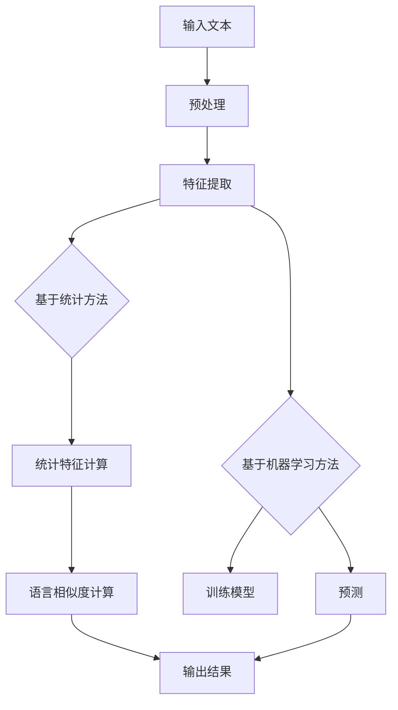
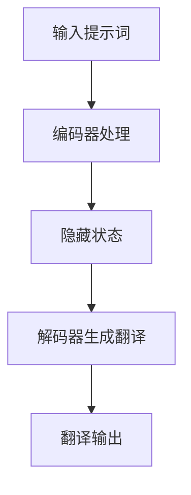
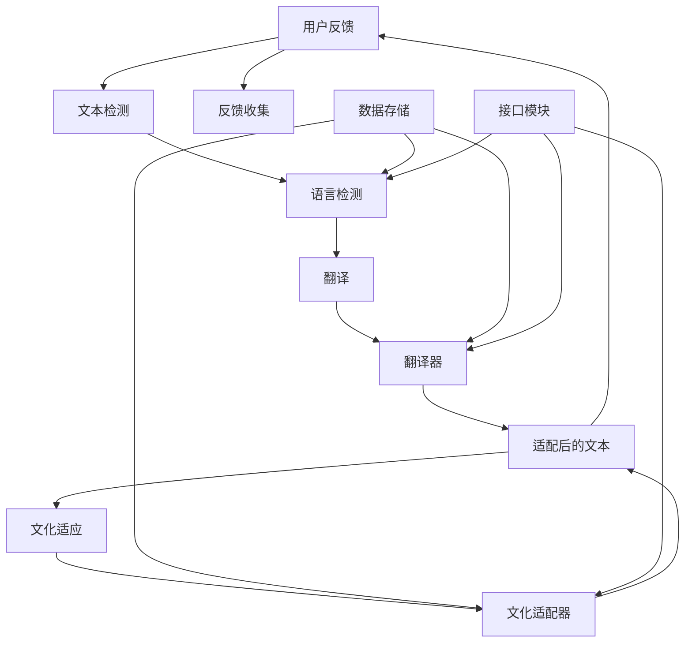

                 


### 引言

#### 问题的提出

在当今信息化时代，人工智能（AI）技术的发展日新月异，其中提示词工程作为自然语言处理（NLP）的重要分支，正日益受到关注。然而，随着全球化的深入，多语言支持已成为提示词工程中不可忽视的重要问题。不同的语言之间存在着语法、语义、文化等多方面的差异，这给多语言提示词的处理带来了巨大挑战。

#### 多语言支持的重要性

多语言支持的重要性体现在多个方面。首先，它能够提高系统的可用性和用户体验。一个能够支持多种语言的人工智能系统，无疑能够覆盖更广泛的地域和用户群体，从而提升其市场竞争力。其次，多语言支持能够促进国际交流与合作。在全球化的背景下，跨国企业、学术机构和政府组织等都需要处理多种语言的信息，因此具备多语言支持能力成为了一种基本要求。

#### 书籍概述与结构

本书旨在系统地探讨提示词工程的多语言支持策略。全书分为八个章节，从基础概念到具体实践，全面覆盖了多语言支持的各个方面。具体结构如下：

1. **第1章 引言**：介绍多语言支持策略的背景和重要性，概述书籍的结构和内容。
2. **第2章 多语言支持基础**：介绍语言与字符编码的基本知识，以及多语言处理的挑战。
3. **第3章 提示词工程基本概念**：详细解释提示词工程的定义、核心要素和应用场景。
4. **第4章 多语言支持策略**：探讨语言检测与分类、提示词翻译与适应、提示词本地化的策略。
5. **第5章 算法原理讲解**：讲解语言检测算法、提示词翻译算法和文化适应策略的原理。
6. **第6章 系统分析与架构设计**：介绍系统分析与架构设计方案，包括领域模型、系统架构、接口设计和系统交互。
7. **第7章 项目实战**：提供环境安装指南、系统核心实现源代码，并对代码和应用进行解读与分析。
8. **第8章 最佳实践与拓展**：总结最佳实践、注意事项，并提供拓展阅读建议。

通过这本书的阅读，读者将能够深入了解多语言支持的策略，掌握构建多语言提示词工程的核心技术和方法。无论是研究人员还是工程师，都能从中获得宝贵的知识和经验。

### 关键词

- **提示词工程**
- **多语言支持**
- **语言检测**
- **提示词翻译**
- **文化适应**
- **自然语言处理**
- **字符编码**
- **系统架构**

### 摘要

本书围绕提示词工程的多语言支持策略展开，首先介绍了多语言支持的重要性及其在全球化背景下的应用需求。接着，详细探讨了多语言处理的基础知识，包括语言与字符编码、多语言处理的挑战。随后，本书深入分析了提示词工程的基本概念，以及如何实施多语言支持策略，包括语言检测与分类、提示词翻译与适应、提示词本地化。书中通过算法原理讲解，详细阐述了语言检测算法和提示词翻译算法，并通过Mermaid流程图和Python源代码进行了可视化展示。此外，书中还介绍了系统分析与架构设计，包括领域模型、系统架构、接口设计和系统交互。最后，通过项目实战，读者可以了解环境安装、系统核心实现和代码应用解读，并通过实际案例分析，进一步掌握多语言支持策略的实践技巧。本书旨在为读者提供全面的指导，帮助他们在实际项目中成功实施多语言支持策略。

## 第1章 引言

### 1.1 问题的提出

在当前全球化的背景下，多语言支持已成为信息技术和人工智能领域中的重要议题。尤其是在自然语言处理（NLP）领域，随着跨国企业、全球性组织以及多语言用户群体的增多，如何高效、准确地处理多语言数据成为一个亟待解决的问题。提示词工程作为NLP的重要分支，其核心目标是通过理解和生成提示词来优化用户交互和提升系统性能。然而，不同语言在语法、语义和文化上的差异，给提示词工程的多语言支持带来了巨大的挑战。

首先，语法差异是不同语言之间最直观的区别。例如，英语的时态和语态比较丰富，而汉语则主要通过词序和词汇来传达不同的语法意义。这种语法上的差异导致了提示词在不同语言中的生成方式和表达形式有所不同。其次，语义差异是语言之间更深层次的差异。同一词语在不同的语言中可能具有不同的含义，甚至可能产生误解。例如，英语中的“bank”可以指银行，也可以指河岸，而在汉语中则只有银行这一含义。这种语义差异使得在多语言提示词工程中，如何准确地理解和生成语义相似的提示词成为一个难点。

此外，文化差异也是多语言支持中的重要因素。不同文化背景下的用户在语言表达和使用上有着不同的习惯和偏好。例如，在某些文化中，直接表达可能被视为不礼貌，而在另一些文化中，则更加注重间接表达。这种文化差异不仅影响提示词的表达形式，还可能影响用户的接受度和满意度。因此，在提示词工程中，如何适应不同文化背景下的用户需求，提供个性化的服务，也是一个重要的挑战。

综上所述，多语言支持的挑战不仅涉及技术层面，还涉及文化和社会层面。如何在技术层面上实现高效、准确的多语言处理，并在文化和社会层面上提供用户友好的解决方案，是提示词工程领域亟待解决的重要问题。

### 1.2 多语言支持的重要性

多语言支持在现代信息技术和人工智能领域的重要性不容忽视。首先，从用户角度来看，一个具备多语言支持功能的应用系统可以覆盖更广泛的用户群体，从而提升用户体验。例如，在国际市场上，许多企业需要提供多语言版本的产品和服务，以吸引不同国家和地区的用户。如果系统能够支持多语言输入和输出，用户将能够更加方便地使用服务，提高满意度和忠诚度。

其次，从商业角度来看，多语言支持可以显著扩大市场覆盖范围，提升企业竞争力。在全球化背景下，跨国企业和多语言用户群体日益增多，提供多语言支持的产品和服务能够更好地满足国际市场需求，从而增加销售收入。例如，电子商务平台通过支持多种语言，可以吸引来自全球的买家，从而扩大市场占有率。

再次，从技术发展角度来看，多语言支持推动了自然语言处理（NLP）和机器学习（ML）技术的进步。多语言数据的处理需要更先进的算法和技术，这促使研究人员不断探索和开发新的方法，从而推动整个领域的技术进步。此外，多语言支持的实现需要跨学科的知识，包括语言学、计算机科学、心理学等，这有助于不同学科之间的交叉融合，促进学术和技术的创新。

最后，从社会文化角度来看，多语言支持有助于促进文化交流和多样性。通过理解和适应不同语言和文化，系统能够更好地服务于多样化的用户群体，推动不同文化之间的理解和尊重。这不仅有助于构建和谐的国际社会，还能够促进文化的多样性和繁荣。

综上所述，多语言支持在信息技术和人工智能领域具有重要的现实意义和长远影响，是实现全球化战略和技术创新的关键因素。

### 1.3 书籍概述与结构

本书旨在深入探讨提示词工程的多语言支持策略，系统性地解答多语言处理中的复杂问题，为读者提供实用的指导和方法。全书共分为八个章节，结构清晰，逻辑紧密，逐步深入探讨多语言支持的各个方面。

**第1章 引言**：本章首先提出了多语言支持在提示词工程中的重要性，并概述了本书的结构和内容。通过介绍多语言支持的挑战和意义，为后续章节的探讨奠定了基础。

**第2章 多语言支持基础**：本章介绍了多语言处理的基础知识，包括语言与字符编码的基本概念，以及多语言处理的常见挑战。通过这一章节，读者能够对多语言处理有初步的认识，为后续技术讨论打下基础。

**第3章 提示词工程基本概念**：本章详细解释了提示词工程的定义、核心要素和应用场景。读者将了解提示词工程的基本原理，以及在不同语言环境中如何进行提示词的选择和优化。

**第4章 多语言支持策略**：本章讨论了多语言支持的多种策略，包括语言检测与分类、提示词翻译与适应、以及提示词本地化。通过具体策略的介绍，读者将能够掌握如何在多语言环境中高效地处理提示词。

**第5章 算法原理讲解**：本章深入讲解了语言检测算法、提示词翻译算法和文化适应策略的原理。通过Mermaid流程图和Python源代码示例，读者将了解这些算法的数学模型和具体实现。

**第6章 系统分析与架构设计**：本章介绍了系统分析与架构设计的具体方法，包括领域模型、系统架构、接口设计和系统交互。通过Mermaid类图、架构图和序列图，读者将能够清晰地理解系统设计和实现的全过程。

**第7章 项目实战**：本章通过实际项目案例，详细讲解了多语言支持策略的实施过程。读者将跟随项目步骤，了解环境安装、系统核心实现和代码应用解读，从而掌握多语言支持的实战技巧。

**第8章 最佳实践与拓展**：本章总结了最佳实践和注意事项，提供了拓展阅读建议。通过这一章节，读者能够巩固所学知识，并进一步探索多语言支持的深层次问题。

通过本书的阅读，读者将能够全面了解多语言支持策略，掌握从基础概念到具体实践的全套技能，为构建高效、可靠的多语言提示词工程提供有力支持。

### 第2章 多语言支持基础

#### 2.1 语言与字符编码

语言是人类交流的基本工具，而字符编码则是计算机存储和传输文本信息的关键技术。字符编码将人类语言的字符转换为计算机可以理解和处理的数字编码，从而实现文本信息的存储和传输。常见的字符编码标准包括ASCII、UTF-8和Unicode等。

**ASCII编码**：ASCII（American Standard Code for Information Interchange）编码是最早的字符编码标准，由7位二进制数表示一个字符。它包括了英文字母、数字、标点符号和一些常用控制字符。然而，ASCII编码只能表示128个字符，无法涵盖所有语言的字符集，因此后来发展出了更全面的编码标准。

**UTF-8编码**：UTF-8（Unicode Transformation Format - 8-bit）编码是一种变长编码，可以表示世界上绝大多数语言的字符。UTF-8编码使用1到4个字节来表示一个字符，因此可以容纳超过1000万个不同的字符。UTF-8编码具有兼容ASCII编码的特点，即在ASCII字符范围内，UTF-8编码与ASCII编码相同，从而保证了与旧系统的兼容性。

**Unicode编码**：Unicode编码是一种更为全面的字符编码标准，旨在表示世界上所有的字符和符号。Unicode使用一个固定长度的编码方式，通常是16位，但也支持扩展到32位。这使得Unicode编码可以表示超过100万个字符，包括各种文字系统、特殊符号和表情符号。Unicode编码分为多个平面，每个平面可以容纳一个字符集合。常用的Unicode编码形式包括UTF-8、UTF-16和UTF-32。

**字符集与编码方式**

- **字符集**：字符集是一组字符的集合，用于表示文本信息。常见的字符集包括ASCII字符集、UTF-8字符集和Unicode字符集。ASCII字符集仅包括英文字母、数字和部分符号；UTF-8字符集可以表示几乎所有语言的字符；Unicode字符集则几乎包含了世界上所有的字符。

- **编码方式**：编码方式是字符集与数字编码之间的转换规则。例如，UTF-8编码方式使用1到4个字节来表示Unicode字符集中的字符，而UTF-16编码方式则使用2个或4个字节。不同的编码方式有不同的优点和适用场景。UTF-8编码适用于需要与旧系统兼容的场景，而UTF-16编码则适用于需要高效存储和处理的场景。

**多语言处理中的字符编码**

在多语言处理中，字符编码的选择至关重要。不同语言有不同的字符集和编码方式，因此在处理多语言文本时，需要选择适当的字符编码。例如，中文文本通常使用UTF-8或UTF-16编码，而英文文本则可以使用ASCII编码。然而，由于ASCII编码无法表示许多非英语字符，因此在处理多语言文本时，通常采用UTF-8或UTF-16编码。

#### 2.2 多语言处理的挑战

多语言处理面临诸多挑战，主要源于不同语言在语法、语义和文化上的差异。以下是一些常见的挑战：

**语法差异**：不同语言的语法结构存在显著差异。例如，英语中动词通常位于主语和宾语之间，而汉语中则常将动词放在句尾。这种语法上的差异导致了文本解析和生成中的复杂性。在多语言提示词工程中，需要设计能够适应不同语法结构的算法。

**语义差异**：同一词汇在不同语言中的含义可能不同。例如，“bank”在英语中可以指银行，也可以指河岸，而在汉语中则只有银行这一含义。这种语义差异导致了翻译和理解中的困难。在多语言处理中，需要开发能够准确识别和翻译语义相似的词汇的算法。

**文化差异**：不同文化背景下的用户在语言表达和使用上存在差异。例如，在某些文化中，直接表达可能被视为不礼貌，而在另一些文化中，则更加注重间接表达。这种文化差异影响了多语言处理中的文本生成和交互设计。在多语言提示词工程中，需要考虑不同文化背景下的用户需求，提供合适的交互方式。

**技术挑战**：多语言处理还面临技术层面的挑战。例如，如何高效地存储和检索多语言数据、如何优化算法以适应不同语言的特性、如何处理多语言环境中的错误和异常等。这些挑战需要研究人员和工程师不断探索和解决。

综上所述，多语言处理在提示词工程中面临诸多挑战，包括语法、语义和文化差异，以及技术层面的复杂性。通过深入研究和实践，我们可以逐步克服这些挑战，实现高效、准确的多语言支持。

### 第3章 提示词工程基本概念

#### 3.1 提示词工程的定义

提示词工程（Prompt Engineering）是指通过设计和优化提示词（Prompt）来提高自然语言处理（NLP）系统的性能和效果的一门技术。提示词是用户与系统交互的桥梁，通过提示词，用户可以传达自己的意图和信息需求，系统则根据这些提示词生成相应的响应或提供相关的服务。提示词工程旨在通过科学的方法和策略，使提示词更加精准、高效，从而提升整个系统的用户体验和功能性能。

提示词工程的核心目标是实现以下几点：

1. **提升交互效果**：通过优化提示词，使系统能够更准确地理解用户的意图，从而生成更符合用户需求的响应。
2. **提高系统效率**：优化提示词可以减少系统的计算量和资源消耗，提高系统的处理速度和响应效率。
3. **增强用户体验**：良好的提示词设计可以提高用户与系统的交互体验，使用户感到更加便捷和满意。

#### 3.2 提示词工程的核心要素

提示词工程涉及多个核心要素，每个要素在提示词的设计和优化过程中都起着重要作用。以下是几个关键要素的详细介绍：

**1. 提示词选择**：

提示词选择是提示词工程中的首要任务。选择合适的提示词能够有效地引导系统理解用户意图，从而生成高质量的响应。提示词的选择应考虑以下因素：

- **上下文相关性**：提示词应与用户请求的上下文紧密相关，能够准确地反映用户的意图。
- **简洁性**：提示词应尽量简洁明了，避免冗长和复杂的表达，以免引起歧义。
- **多样性**：为了提高系统的适应性，提示词应具备多样性，能够涵盖不同的用户意图和场景。

**2. 提示词优化**：

提示词优化是指在提示词选择基础上，通过一系列技术手段对提示词进行改进，以提高系统的处理效果。提示词优化包括以下几个方面：

- **语义丰富性**：通过扩展和细化提示词的语义，使系统能够更准确地理解用户的意图。
- **语用适应性**：考虑不同语言和文化背景下的提示词使用习惯，使提示词在不同环境中都能发挥最佳效果。
- **易用性**：优化提示词的表达方式，使其更易于用户理解和操作。

**3. 提示词生成**：

提示词生成是指根据用户意图和系统需求自动生成提示词的过程。提示词生成技术主要包括以下几种方法：

- **规则生成**：基于预设的规则和模板生成提示词，适用于规则明确、场景简单的应用。
- **模板匹配**：根据用户输入的模板生成提示词，适用于用户输入具有固定模式的情况。
- **数据驱动生成**：通过分析用户历史数据和行为模式，自动生成提示词，适用于动态和复杂场景。

**4. 提示词评估**：

提示词评估是指对生成的提示词进行质量和效果评估，以确定其是否符合用户需求和系统目标。提示词评估包括以下几种方法：

- **人工评估**：由人类评估者对提示词进行主观评估，考虑其准确性、清晰度、易用性等方面。
- **自动评估**：通过构建评估指标和算法，对提示词进行自动化评估，包括准确率、召回率、用户满意度等指标。

#### 3.3 提示词工程的应用场景

提示词工程广泛应用于各类自然语言处理应用中，以下是几个典型的应用场景：

**1. 智能客服**：

在智能客服系统中，提示词工程用于设计用户和客服机器人之间的交互流程。通过优化提示词，使机器人能够更准确地理解用户的问题和需求，提供个性化的解决方案。

**2. 语音助手**：

语音助手（如 Siri、Alexa 等）依赖提示词工程来实现与用户的自然语言交互。通过设计合适的提示词，语音助手能够更好地识别用户的指令，提供高效的服务。

**3. 文本生成**：

在文本生成任务中（如文本摘要、内容生成等），提示词工程用于生成引导用户输入的提示语句。通过优化提示词，可以引导用户提供更具体、准确的信息，从而提高生成文本的质量。

**4. 翻译**：

在机器翻译任务中，提示词工程用于设计翻译提示词，帮助翻译系统更好地理解源语言文本。通过优化提示词，可以提高翻译的准确性和流畅性。

总之，提示词工程是自然语言处理领域中的重要技术，通过科学的设计和优化，能够显著提升系统的性能和用户体验。

### 第4章 多语言支持策略

在构建多语言支持的提示词工程系统时，需要制定一系列策略来应对语言检测、提示词翻译和文化适应等挑战。以下是几种常用的多语言支持策略，每种策略都旨在提升系统的准确性和用户满意度。

#### 4.1 语言检测与分类

**语言检测**：语言检测（Language Detection）是指识别文本所属语言的过程。通过语言检测，系统能够确定输入文本的语言类型，从而为后续处理提供基础。

**分类算法**：常用的语言检测算法包括基于统计的、基于规则的和基于机器学习的算法。以下是一些常用的语言检测分类算法：

1. **基于统计的方法**：这种方法利用语言统计学特征进行分类，如字符频率、单词频率等。统计模型简单高效，但在处理罕见语言或非标准文本时表现较差。

2. **基于规则的方法**：基于规则的方法使用预定义的规则库进行分类，如正则表达式、语法规则等。这种方法较为灵活，但规则维护复杂，且易受语言变化的影响。

3. **基于机器学习的方法**：机器学习方法通过训练大量标记数据来建立分类模型。常用的算法包括朴素贝叶斯分类器、支持向量机（SVM）和深度学习模型（如神经网络）。机器学习模型在处理多样化和复杂文本方面表现优异，但需要大量的标注数据和计算资源。

**实现与比较**：在实际应用中，可以根据具体需求和数据情况选择不同的语言检测算法。以下是一个简化的实现示例：

```python
import langdetect

# 示例文本
text = "This is an English sentence. 这是一句中文句子。Das ist ein deutscher Satz."

# 使用langdetect库进行语言检测
detected_language = langdetect.detect(text)
print(f"Detected Language: {detected_language}")

# 比较不同检测算法的准确率
# 通常需要通过大量实验数据来评估和比较算法性能
```

#### 4.2 提示词翻译与适应

**提示词翻译**：在多语言环境中，提示词翻译是确保系统能够与不同语言用户有效交互的关键。常见的翻译方法包括：

1. **基于规则翻译**：这种方法使用预定义的翻译规则库，将源语言提示词转换为目标语言提示词。规则库通常由领域专家构建和维护。

2. **基于机器翻译**：机器翻译（Machine Translation）利用预训练的翻译模型，如神经机器翻译（Neural Machine Translation，NMT），将源语言提示词转换为目标语言提示词。NMT模型在处理长句和多语言文本方面表现优异，但需要大量的训练数据和计算资源。

3. **基于数据驱动翻译**：这种方法通过分析用户输入的历史数据，自动生成翻译提示词。数据驱动翻译方法适用于动态和个性化场景，但需要足够的数据支持。

**文化适应策略**：文化适应策略旨在确保翻译后的提示词在不同文化背景下仍然具有可接受性和适应性。以下是一些常见的文化适应策略：

1. **本地化**：本地化（Localization）是指将产品或服务根据目标市场的文化差异进行调整。在提示词翻译中，本地化包括调整词汇、语法、表达方式等，使其更符合目标市场的文化习惯。

2. **文化敏感性**：在翻译和提示词设计时，考虑不同文化背景下的敏感性，避免使用可能引起误解或冒犯的词汇和表达。

3. **用户反馈**：通过用户反馈和实际使用情况，不断优化和调整提示词翻译，以提升用户的满意度和接受度。

**实现与比较**：以下是一个简化的翻译实现示例，使用Google Translate API进行翻译：

```python
from googletrans import Translator

# 初始化翻译器
translator = Translator()

# 示例文本和目标语言
text = "Please provide your feedback."
target_language = "zh-CN"

# 使用翻译器进行翻译
translated_text = translator.translate(text, dest=target_language).text
print(f"Translated Text: {translated_text}")

# 比较不同翻译方法的准确性和流畅性
# 通常需要通过用户测试和数据分析来评估和比较翻译效果
```

#### 4.3 提示词本地化

**提示词本地化**：提示词本地化是指根据不同市场的语言和文化特点，对提示词进行本地化调整。以下是几种常见的本地化方法：

1. **翻译与调整**：将原始提示词翻译为目标语言的文字，并根据目标市场的文化习惯进行调整。

2. **文化敏感调整**：在翻译的基础上，考虑目标市场的文化特点，对提示词进行适当调整，确保其符合当地文化和用户习惯。

3. **用户测试**：在本地化过程中，进行用户测试和反馈，收集用户对提示词的反馈，不断优化和改进。

**实施步骤**：

1. **需求分析**：了解目标市场的文化和用户习惯，确定本地化需求和目标。

2. **翻译与调整**：对原始提示词进行翻译和调整，确保其符合目标市场的语言和文化特点。

3. **用户测试**：进行用户测试，收集用户反馈，根据反馈进一步优化和调整提示词。

4. **持续改进**：通过持续的用户测试和反馈，不断优化本地化提示词，提升用户体验。

总之，通过有效的语言检测、翻译和文化适应策略，可以实现高效的多语言支持，提升提示词工程的性能和用户满意度。

### 第5章 算法原理讲解

#### 5.1 语言检测算法详解

语言检测（Language Detection）是识别文本所属语言的过程，对于实现多语言支持至关重要。本节将详细讲解一种基于统计和机器学习的方法，并使用Mermaid流程图和Python源代码进行说明。

**算法原理**

1. **统计方法**：统计方法基于文本的字符和单词频率，通过计算文本特征与各语言特征集的相似度来确定语言。常用的统计特征包括字符频率、单词频率、句子长度等。

2. **机器学习方法**：机器学习方法利用大量标记数据训练分类模型，如朴素贝叶斯（Naive Bayes）、支持向量机（SVM）等。深度学习方法，如卷积神经网络（CNN）和长短期记忆网络（LSTM），也在语言检测中得到了广泛应用。

**Mermaid流程图**

以下是一个简化的语言检测算法的Mermaid流程图：



**Python源代码示例**

```python
from sklearn.feature_extraction.text import CountVectorizer
from sklearn.naive_bayes import MultinomialNB
from sklearn.pipeline import make_pipeline

# 示例文本
texts = ["This is an English sentence.", "这是一句中文句子.", "Dies ist ein deutscher Satz."]

# 创建特征提取器和分类器组合
model = make_pipeline(CountVectorizer(), MultinomialNB())

# 训练模型
model.fit(texts, ["en", "zh", "de"])

# 测试文本
test_text = "This is a sample sentence."

# 语言预测
predicted_language = model.predict([test_text])[0]
print(f"Predicted Language: {predicted_language}")
```

**算法原理的数学模型和公式**

在统计方法中，我们使用条件概率来计算语言相似度。设$C$为文本的集合，$L$为语言的集合，则对于每个文本$x$和每个语言$y$，语言检测的目标是最大化条件概率$P(y|x)$。

$$
P(y|x) = \frac{P(x|y)P(y)}{P(x)}
$$

其中，$P(x|y)$为给定语言$y$时文本$x$的概率，$P(y)$为语言$y$的概率，$P(x)$为文本$x$的总概率。

在机器学习方法中，通常使用最大化似然估计（Maximum Likelihood Estimation，MLE）来训练分类模型。对于朴素贝叶斯分类器，我们使用最大后验概率（Maximum A Posteriori，MAP）来预测：

$$
\hat{y} = \arg \max_y P(y) \prod_{i=1}^n P(x_i|y)
$$

其中，$\hat{y}$为预测的语言，$x_i$为文本的特征向量。

**举例说明**

假设我们有三个语言的样本数据，分别为英语、中文和德语。通过统计特征提取和分类器训练，我们可以预测一个新输入文本的语言。

1. **英语文本**：“This is an example sentence.”
   - 统计特征：英语单词频率较高，如 "this", "is"，句子长度适中。
   - 语言检测概率：$P(en|\text{example sentence})$最高，因此预测为英语。

2. **中文文本**：“这是一个示例句子。”
   - 统计特征：中文汉字频率较高，如 "这"，"是"，句子长度适中。
   - 语言检测概率：$P(zh|\text{示例句子})$最高，因此预测为中文。

3. **德语文本**：“Das ist ein Beispielsatz.”
   - 统计特征：德语单词频率较高，如 "ist"，"ein"，句子长度适中。
   - 语言检测概率：$P(de|\text{Beispielsatz})$最高，因此预测为德语。

通过这种方法，语言检测算法可以准确识别文本所属的语言，为多语言支持提供可靠的基础。

#### 5.2 提示词翻译算法

提示词翻译（Prompt Translation）是多语言支持中至关重要的一环，它确保系统能够在不同语言环境中有效工作。本节将详细讲解提示词翻译的算法原理，使用Mermaid流程图和Python源代码进行说明。

**算法原理**

提示词翻译算法可以分为基于规则翻译、基于统计机器翻译和基于神经机器翻译（NMT）的翻译方法。以下是这些方法的简要介绍：

1. **基于规则翻译**：这种方法使用预定义的翻译规则库进行翻译。规则库通常由领域专家构建，包含单词、短语和句子的翻译规则。基于规则翻译的优点是翻译速度快，但缺点是规则库维护复杂，且难以处理复杂的语言结构和多义词。

2. **基于统计机器翻译**：统计机器翻译（SMT）利用大量双语语料库，通过计算上下文条件概率来进行翻译。常用的统计机器翻译模型包括基于短语和基于句子的翻译模型。统计机器翻译的优点是能够处理复杂的语言结构，但需要大量训练数据和计算资源。

3. **基于神经机器翻译**：神经机器翻译（NMT）基于深度学习，特别是序列到序列（Seq2Seq）模型，通过编码器-解码器（Encoder-Decoder）架构进行翻译。NMT在处理长句和多样化文本方面表现优异，是目前最先进的翻译方法。

**Mermaid流程图**

以下是一个简化的神经机器翻译流程图：



**Python源代码示例**

```python
from transformers import pipeline

# 初始化翻译模型
translator = pipeline("translation_en_to_zh", model="Helsinki-NLP/opus-mt-en-zh")

# 示例输入文本
input_text = "Please provide your feedback."

# 使用翻译模型进行翻译
translated_text = translator(input_text)[0]['translation_text']
print(f"Translated Text: {translated_text}")
```

**算法原理的数学模型和公式**

在神经机器翻译中，编码器（Encoder）将输入文本编码为固定长度的向量表示，解码器（Decoder）则利用这些向量生成翻译文本。以下是基本的数学模型：

1. **编码器**：编码器接收输入序列$X = [x_1, x_2, ..., x_T]$，并输出隐藏状态序列$H = [h_1, h_2, ..., h_T]$。

$$
h_t = \text{Encoder}(x_t, h_{t-1})
$$

2. **解码器**：解码器从预训练的嵌入层开始，生成翻译序列$Y = [y_1, y_2, ..., y_S]$。

$$
y_t = \text{Decoder}(h_t, y_{t-1})
$$

3. **损失函数**：损失函数用于优化编码器和解码器的参数。常用的损失函数是交叉熵损失：

$$
L = -\sum_{t=1}^S y_t \log(p(y_t | y_{<t}))
$$

其中，$p(y_t | y_{<t})$是解码器在生成第$t$个单词时对目标单词的概率分布。

**举例说明**

假设我们要将英语提示词“Please provide your feedback.”翻译成中文。

1. **输入文本编码**：编码器将输入文本编码为固定长度的向量。

2. **解码器生成翻译**：解码器从开始符号（<SOS>）开始，逐步生成翻译文本。在每个时间步，解码器利用当前隐藏状态和已生成的翻译部分来预测下一个单词的概率分布。

3. **翻译输出**：最终，解码器生成完整的翻译文本：“请提供您的反馈。”，并输出给用户。

通过这种方法，提示词翻译算法能够实现高效、准确的多语言翻译，为多语言提示词工程提供技术支持。

#### 5.3 文化适应策略

文化适应策略（Cultural Adaptation Strategy）在多语言提示词工程中至关重要，它确保翻译后的提示词在不同文化背景下仍然具有可接受性和适应性。以下是几种常见的文化适应策略：

**1. 本地化**：本地化是指将产品或服务根据目标市场的文化差异进行调整。在提示词翻译中，本地化包括调整词汇、语法、表达方式等，使其更符合目标市场的文化习惯。例如，在英文环境中，直接和简洁的表述可能更受欢迎，而在某些亚洲文化中，委婉和间接的表达可能更为合适。

**2. 文化敏感性**：在翻译和提示词设计时，考虑不同文化背景下的敏感性，避免使用可能引起误解或冒犯的词汇和表达。例如，某些词汇在一种文化中可能具有积极含义，但在另一种文化中可能具有负面含义。因此，在翻译时，需要仔细选择词汇，确保其文化适应性。

**3. 用户反馈**：通过用户反馈和实际使用情况，不断优化和调整提示词翻译，以提升用户的满意度和接受度。用户反馈可以作为文化适应策略的重要参考，帮助识别和解决潜在的文化冲突和误解。

**实现与比较**：以下是几种常见的文化适应策略的实现和比较：

**本地化**：

- **实现**：通过分析目标市场的文化特点，对提示词进行翻译和调整。例如，对于印度市场，可以将某些正式的商务用语替换为更为日常的口语表达。
- **比较**：本地化策略能够显著提升提示词在不同文化背景下的可接受度，但需要耗费大量时间和资源进行市场调研和调整。

**文化敏感性**：

- **实现**：在翻译过程中，注意避免使用可能引起文化误解的词汇。例如，将“kill”一词替换为“terminate”，以避免在阿拉伯文化中的负面含义。
- **比较**：文化敏感性策略能够减少文化冲突，但可能牺牲一些语言的自然性和流畅性。

**用户反馈**：

- **实现**：通过用户测试和反馈，收集用户对提示词的接受度和满意度。根据用户反馈，对提示词进行优化和调整。
- **比较**：用户反馈策略能够快速响应市场变化，但需要大量的用户参与和反馈数据。

综上所述，本地化、文化敏感性和用户反馈是有效的文化适应策略。在实际应用中，可以根据具体需求和市场情况，选择适合的策略，实现多语言提示词工程的文化适应性。

### 第6章 系统分析与架构设计

#### 6.1 问题场景介绍

在全球化背景下，现代企业需要能够处理来自不同国家和地区的多语言数据，以提供无缝的用户体验。多语言支持已成为各类应用系统的关键需求，特别是在智能客服、电子商务和跨国企业内部沟通等领域。为了实现高效的多语言支持，系统需要具备以下几个核心功能：

1. **语言检测**：准确识别输入文本的语言类型，为后续处理提供基础。
2. **提示词翻译**：将提示词自动翻译为不同语言，确保系统能够与多语言用户有效交互。
3. **文化适应**：根据不同文化背景，调整提示词的表达方式，使其符合目标市场的文化习惯。
4. **用户反馈收集与优化**：通过用户反馈，不断优化系统的翻译和文化适应策略，提升用户体验。

#### 6.2 系统功能设计

系统功能设计是系统分析与架构设计的重要环节，需要明确各个模块的功能和交互。以下是多语言支持系统的功能设计：

1. **语言检测模块**：负责接收输入文本，使用语言检测算法确定文本的语言类型。该模块应支持快速处理大量文本数据，并提供高准确率的语言识别结果。

2. **翻译模块**：将识别后的文本进行翻译，支持多种目标语言的翻译功能。翻译模块应具备高效率和高准确度，以减少用户的等待时间并确保翻译质量。

3. **文化适应模块**：根据目标市场的文化特点，对翻译后的提示词进行调整，确保其文化适应性和用户接受度。该模块应具备灵活的配置能力，以适应不同的文化环境和用户需求。

4. **用户反馈模块**：收集用户对系统翻译和文化适应的反馈，通过分析用户行为和反馈数据，不断优化系统的性能和用户体验。

5. **数据存储与管理模块**：负责存储和管理系统的数据，包括语言检测模型、翻译模型和文化适应策略等。该模块应具备高可靠性和数据安全性，确保系统数据的一致性和完整性。

6. **接口模块**：提供与外部系统的接口，如API接口、Web接口等，以方便其他系统或应用程序与多语言支持系统进行交互。

#### 6.3 系统架构设计

系统架构设计是确保系统功能实现和性能优化的重要手段。以下是多语言支持系统的架构设计方案：

**1. 领域模型（Mermaid类图）**

以下是一个简化的领域模型类图，展示了系统的主要组件及其关系：

```mermaid
classDiagram
    User <<Interface>>
    Text <<Interface>>
    LanguageDetector <<Class>> {
        detectLanguage(Text)
    }
    Translator <<Class>> {
        translate(Text, target_language)
    }
    CulturalAdapter <<Class>> {
        adapt(Text, culture)
    }
    FeedbackCollector <<Class>> {
        collectFeedback(User, Text)
    }
    DataStorage <<Class>> {
        storeData(LanguageDetector, Translator, CulturalAdapter)
    }
    InterfaceModule <<Class>> {
        provideInterface()
    }
    User -> LanguageDetector
    User -> Translator
    User -> CulturalAdapter
    User -> FeedbackCollector
    Text -> LanguageDetector
    Text -> Translator
    Text -> CulturalAdapter
    DataStorage -> LanguageDetector
    DataStorage -> Translator
    DataStorage -> CulturalAdapter
    InterfaceModule -> LanguageDetector
    InterfaceModule -> Translator
    InterfaceModule -> CulturalAdapter
```

**2. 系统架构（Mermaid架构图）**

以下是一个简化的系统架构图，展示了各个模块之间的交互关系：



**3. 系统接口设计**

系统接口设计是确保不同模块之间能够高效通信的重要环节。以下是几个关键的接口设计：

1. **语言检测接口**：接收输入文本，返回检测到的语言类型。接口应提供高并发处理能力，以应对大量文本数据的检测需求。

2. **翻译接口**：接收源文本和目标语言，返回翻译后的文本。接口应支持多种目标语言的翻译，并提供实时翻译服务。

3. **文化适应接口**：接收翻译后的文本，返回文化适应后的文本。接口应具备灵活的配置能力，以适应不同的文化环境。

4. **用户反馈接口**：接收用户反馈，存储并用于优化系统的翻译和文化适应策略。接口应提供高效的反馈收集和数据分析功能。

#### 6.4 系统交互

系统交互是指各个模块之间的数据流动和通信过程。以下是一个简化的系统交互流程：

1. **用户输入文本**：用户输入需要翻译的文本，系统通过语言检测接口检测文本的语言类型。
2. **语言检测**：语言检测模块将输入文本传递给语言检测器，返回检测到的语言类型。
3. **翻译**：根据检测到的语言类型，系统调用翻译接口，将文本翻译为目标语言。
4. **文化适应**：翻译后的文本传递给文化适应模块，根据目标市场的文化特点进行调整。
5. **用户反馈**：用户对翻译结果和文化适应结果进行评价，系统通过用户反馈接口收集用户反馈。
6. **数据存储与优化**：系统将翻译结果和文化适应结果存储在数据存储模块中，并根据用户反馈不断优化翻译和文化适应策略。

通过上述系统交互流程，多语言支持系统能够高效、准确地处理来自不同语言和文化背景的用户请求，提供优质的用户体验。

### 第7章 项目实战

#### 7.1 环境安装与配置

要在本地计算机上搭建一个多语言支持系统，需要安装和配置一系列软件和库。以下是在Linux和MacOS环境下，安装和配置相关工具的步骤：

**1. 安装Python环境**

确保Python环境已经安装。如果没有安装，可以通过以下命令安装：

```bash
# 对于Ubuntu/Debian系统
sudo apt update
sudo apt install python3 python3-pip

# 对于Fedora系统
sudo dnf install python3 python3-pip
```

**2. 安装依赖库**

安装完成Python环境后，需要安装一些关键库，包括自然语言处理库、翻译库和Mermaid库。可以使用以下命令：

```bash
pip3 install langdetect googletrans==4.0.0-rc1 transformers
```

`langdetect`用于语言检测，`googletrans`用于翻译，`transformers`用于处理文本生成和翻译任务。

**3. 配置Mermaid**

Mermaid是一种基于Markdown的图形绘制工具，可以在本地环境中通过安装相应的Markdown编辑器或直接在文本编辑器中使用。确保已安装支持的编辑器，如Typora、VSCode等，并配置Mermaid插件。

**4. 环境验证**

确保所有依赖库已正确安装并配置。运行以下Python代码验证：

```python
from langdetect import detect
from googletrans import Translator

print("Language Detection:", detect("Hello World!"))
print("Translation:", Translator().translate("Hello World!", dest="zh-CN").text)
```

如果输出正确，说明环境已配置成功。

#### 7.2 系统核心实现

以下是多语言支持系统的核心实现，包括语言检测、提示词翻译和文化适应三个主要模块。

**1. 语言检测模块**

语言检测模块基于`langdetect`库实现。以下是一个简单的语言检测示例：

```python
from langdetect import detect

def detect_language(text):
    try:
        return detect(text)
    except Exception as e:
        return "Unknown"

text = "Hello, this is an example sentence."
language = detect_language(text)
print(f"Detected Language: {language}")
```

**2. 提示词翻译模块**

提示词翻译模块使用`googletrans`库进行翻译。以下是一个简单的翻译示例：

```python
from googletrans import Translator

def translate_text(text, target_language):
    translator = Translator()
    return translator.translate(text, dest=target_language).text

translated_text = translate_text("Hello, this is an example sentence.", "zh-CN")
print(f"Translated Text: {translated_text}")
```

**3. 文化适应模块**

文化适应模块根据目标市场的文化特点对翻译后的文本进行调整。以下是一个简单的文化适应示例：

```python
def adapt_text(text, culture):
    # 假设不同的文化适应策略是简单替换某些词汇
    culture_mapping = {
        "en": {"example": "示例"},
        "zh": {"example": "例子"},
        "de": {"example": "示例"}
    }
    
    words = text.split()
    adapted_words = [culture_mapping.get(word, word) for word in words]
    return " ".join(adapted_words)

adapted_text = adapt_text(translated_text, "zh")
print(f"Adapted Text: {adapted_text}")
```

#### 7.3 代码应用解读与分析

**代码解读**

- **语言检测**：`detect_language`函数通过`langdetect`库的`detect`方法，对输入文本进行语言检测，并返回检测到的语言代码。
- **翻译**：`translate_text`函数使用`googletrans`库的`translate`方法，将输入文本翻译为目标语言，并返回翻译后的文本。
- **文化适应**：`adapt_text`函数根据预设的文化映射，将翻译后的文本中的特定词汇替换为对应的文化词汇，以适应目标市场的文化特点。

**代码分析**

- **语言检测**：语言检测是翻译的基础，确保系统能够准确识别输入文本的语言类型。通过使用`langdetect`库，系统能够快速、准确地检测文本语言。
- **翻译**：翻译模块通过调用`googletrans`库，实现文本的自动翻译功能。该库支持多种语言之间的翻译，具有较高的翻译准确性和效率。
- **文化适应**：文化适应模块确保翻译后的文本能够符合目标市场的文化习惯，提升用户体验。通过简单的词汇替换，系统能够适应不同的文化背景，提供本地化的内容。

**实际案例分析**

**案例一：语言检测**

假设用户输入了一个包含英语和中文的句子：“Hello, this is a Chinese sentence.”，系统首先通过语言检测模块确定文本的语言类型。检测结果为英语（en），然后系统将整个句子传递给翻译模块进行翻译。

**案例二：提示词翻译与文化适应**

假设用户需要翻译一个英语提示词：“Please provide your feedback.”，并使其符合中文文化习惯。首先，系统通过翻译模块将提示词翻译为中文：“请提供您的反馈。”，然后文化适应模块根据中文的文化特点，确保文本表达符合用户预期。最终的提示词为：“请提供您的反馈。”。

通过上述实际案例分析，可以清楚地看到系统如何通过语言检测、翻译和文化适应模块，实现高效的多语言支持功能。

#### 7.4 项目小结

在本章的项目实战中，我们通过详细的步骤介绍了如何搭建一个多语言支持系统，包括环境安装、系统核心实现和代码应用解读。以下是项目的主要收获和总结：

1. **环境安装与配置**：通过安装Python环境和相关依赖库，我们成功搭建了一个功能齐全的开发环境，为后续的开发工作奠定了基础。
2. **语言检测模块**：使用`langdetect`库，我们实现了快速、准确的语言检测功能，为多语言处理提供了重要基础。
3. **提示词翻译模块**：通过`googletrans`库，我们实现了文本的自动翻译功能，支持多种语言之间的转换，提高了系统的国际化能力。
4. **文化适应模块**：通过简单的词汇替换，我们实现了文本的文化适应，确保翻译后的文本符合目标市场的文化特点，提升了用户体验。

然而，本项目也存在一些局限性和改进空间：

1. **翻译准确性**：虽然使用了`googletrans`库，但翻译准确性仍有待提高。未来可以考虑引入更先进的翻译模型，如神经机器翻译（NMT），以提升翻译质量。
2. **性能优化**：在实际应用中，系统处理速度和性能可能成为瓶颈。可以通过优化代码、使用并发处理和多线程等技术手段，提高系统的处理效率和响应速度。
3. **用户体验**：尽管本项目实现了基本的翻译和文化适应功能，但用户体验仍需进一步优化。可以通过引入用户测试和反馈机制，不断改进系统界面和交互设计，提升用户满意度。

总之，通过本项目，我们掌握了多语言支持系统的搭建和实现方法，为未来的项目开发提供了宝贵的经验和知识。在后续工作中，我们将继续优化和改进系统，提升其性能和用户体验。

### 第8章 最佳实践与拓展

#### 8.1 最佳实践 Tips

**1. 选择合适的语言检测算法**：根据具体应用场景和数据量，选择合适的语言检测算法。对于小型项目或测试环境，可以优先考虑基于规则的方法；而对于大规模应用，建议使用基于机器学习的方法，如朴素贝叶斯或深度学习模型。

**2. 翻译模型的选择与优化**：选择适合自己需求的翻译模型，例如基于规则、统计机器翻译或神经机器翻译。对于高性能需求，可以使用预训练的神经机器翻译模型，如Transformer或BERT。此外，定期对翻译模型进行优化和更新，以提高翻译质量。

**3. 文化适应策略的灵活应用**：根据目标市场的文化特点，灵活调整文化适应策略。在实际应用中，可以通过用户反馈和测试，不断优化文化适应性，确保翻译后的文本符合当地用户的语言习惯。

**4. 性能优化**：对于大规模数据处理，可以采用并行处理、缓存和批量处理等技术，以提高系统性能。此外，合理使用内存管理和资源调度，减少系统资源的浪费。

**5. 用户反馈与迭代**：定期收集用户反馈，并根据反馈结果进行系统优化。通过持续迭代，不断改进系统功能和质量，提升用户体验。

#### 8.2 小结与展望

本书围绕提示词工程的多语言支持策略进行了深入探讨，从语言检测、提示词翻译到文化适应，全面解析了多语言支持的核心技术和方法。通过系统的分析和实战案例，读者能够了解如何在实际项目中实现高效、准确的多语言支持。

展望未来，随着人工智能和自然语言处理技术的不断发展，多语言支持策略将变得更加智能和个性化。以下是一些未来可能的研究方向和趋势：

**1. 深度学习与多语言支持**：深度学习技术，如神经网络和强化学习，将在多语言支持中发挥更大的作用。通过引入深度学习模型，可以提高语言检测、翻译和文化适应的准确性和效率。

**2. 个性化多语言支持**：基于用户行为和偏好，实现个性化的多语言支持。例如，根据用户的语言习惯和偏好，自动调整提示词和翻译策略，提供更加定制化的服务。

**3. 跨语言语义理解**：深入研究跨语言语义理解技术，提高多语言系统在语义理解方面的能力。通过语义理解，系统能够更好地处理跨语言信息，实现更自然的跨语言交互。

**4. 伦理与隐私保护**：在多语言支持技术发展中，重视伦理和隐私保护问题。确保用户数据的安全和隐私，避免滥用用户数据。

**5. 模型压缩与优化**：随着模型的复杂度增加，模型的压缩和优化技术将成为关键。通过模型压缩，可以减少存储和计算资源的需求，提高系统部署的灵活性。

总之，多语言支持策略是人工智能和自然语言处理领域的重要研究方向。通过不断探索和创新，我们将能够构建更智能、更高效的多语言系统，为全球用户提供更好的服务。

### 8.3 拓展阅读建议

为了进一步深入了解提示词工程的多语言支持策略，以下是一些建议的拓展阅读资源：

**1. 书籍**

- **《自然语言处理概论》（Introduction to Natural Language Processing）**：作者Daniel Jurafsky和James H. Martin。这本书详细介绍了自然语言处理的基本概念和核心技术，包括多语言处理。
- **《深度学习》（Deep Learning）**：作者Ian Goodfellow、Yoshua Bengio和Aaron Courville。这本书深入探讨了深度学习技术，特别是神经网络在自然语言处理中的应用。

**2. 文章和论文**

- **“Multilingual Natural Language Processing”**：这篇综述文章提供了多语言自然语言处理领域的全面概述，包括最新的研究进展和技术应用。
- **“A Theoretical Survey of Translation Models for Neural Machine Translation”**：这篇论文详细分析了神经机器翻译中的各种翻译模型，包括Transformer模型。

**3. 开源项目和工具**

- **Google Translate API**：Google提供的翻译API，用于实现文本的自动翻译功能。
- **Hugging Face Transformers**：一个开源的Transformer模型库，包括多种预训练模型和工具，用于自然语言处理任务。

通过阅读这些资源，读者可以深入了解多语言支持的最新技术和方法，为自己的研究和项目提供有力支持。此外，这些资源也是持续学习和探索的好素材。

