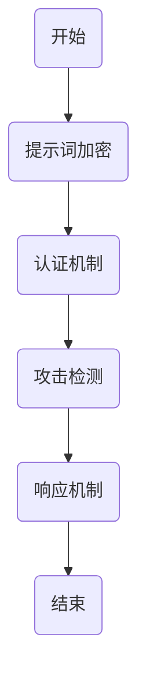

                 

# 提示词工程的安全性与攻击防御

## 关键词
- 安全性
- 攻击防御
- 提示词工程
- 数学模型
- 算法原理
- 系统架构

## 摘要
本文将深入探讨提示词工程的安全性和攻击防御问题。首先，我们将介绍提示词工程的基本概念及其在现实中的应用。随后，分析其安全性问题，探讨常见攻击类型和防御策略。接着，通过数学模型和算法原理讲解，阐明安全性的实现机制。随后，我们将展示一个完整的系统架构设计方案，包括问题场景、项目介绍、系统功能设计、架构设计和接口设计等。最后，通过项目实战和最佳实践，提供实际操作指南，确保提示词工程的安全和稳定性。

## 1. 开篇引言与背景介绍

### 1.1 问题背景

随着人工智能技术的快速发展，提示词工程（Prompt Engineering）已成为自然语言处理（NLP）领域的关键组成部分。提示词工程旨在设计和优化用于引导AI模型行为的输入提示，以提高模型在特定任务上的性能和准确性。然而，提示词工程也面临诸多安全性挑战，例如提示注入攻击、信息泄露和模型被劫持等。

### 1.2 问题描述

安全性问题在提示词工程中表现为以下几个方面：

- **提示注入攻击**：攻击者通过恶意提示词操纵模型输出，从而实现恶意目的。
- **信息泄露**：未经授权的用户可能通过提示词获取敏感信息。
- **模型被劫持**：攻击者通过操纵提示词，控制模型行为，从而导致数据泄露或其他安全风险。

### 1.3 问题解决

为了解决上述安全性问题，我们需要采取一系列防御措施，包括：

- **安全性设计**：在设计阶段考虑安全性需求，确保系统具有足够的安全防护能力。
- **加密与认证**：对敏感数据进行加密，确保数据传输和存储的安全性。
- **攻击检测与响应**：建立实时监控和响应机制，及时发现并应对攻击事件。

### 1.4 边界与外延

提示词工程的安全性不仅涉及技术层面，还涉及法律和伦理层面。我们需要在保护用户隐私、遵循相关法律法规的同时，确保系统的安全性和可靠性。

### 1.5 核心概念与联系

本文将详细讨论以下核心概念：

- **提示词工程**：介绍其基本概念、应用和目标。
- **安全性**：探讨安全性的定义、重要性及实现方法。
- **攻击防御**：分析常见攻击类型和防御策略。
- **算法原理**：介绍实现安全性所需的算法原理和数学模型。
- **系统架构**：展示一个完整的系统架构设计方案。

## 2. 核心概念与联系

### 2.1 安全性概念

安全性是指系统在面临潜在威胁时，能够保持其完整性、保密性和可用性的能力。在提示词工程中，安全性主要体现在以下几个方面：

- **完整性**：确保系统数据和模型不被未授权篡改。
- **保密性**：保护敏感信息不被未授权访问。
- **可用性**：确保系统在面临攻击时仍能正常运作。

### 2.2 攻击防御概念

攻击防御是指通过一系列措施，防止系统受到恶意攻击的能力。在提示词工程中，攻击防御主要包括以下方面：

- **防御策略**：根据威胁类型和系统特点，选择合适的防御策略。
- **检测与响应**：建立实时监控和响应机制，及时发现并应对攻击事件。
- **防护机制**：通过加密、认证等技术手段，提高系统的抗攻击能力。

### 2.3 概念属性特征对比表格

| 概念        | 特征                  | 重要性 |
|-------------|-----------------------|-------|
| 提示词工程  | 设计和优化输入提示   | 高    |
| 安全性      | 系统的完整性、保密性、可用性 | 高    |
| 攻击防御    | 防止系统受恶意攻击   | 高    |
| 算法原理    | 实现安全性的技术手段 | 高    |
| 系统架构    | 系统的整体设计       | 高    |

### 2.4 ER实体关系图架构

```mermaid
erDiagram
  User ||--|{ Prompt }
  User ||--|{ Security }
  Prompt ||--|{ Attack }
  Attack ||--|{ Defense }
```

## 3. 算法原理讲解

### 3.1 算法介绍

为了实现提示词工程的安全性，我们需要设计一种有效的攻击防御算法。该算法主要包括以下几个步骤：

1. **提示词加密**：对输入提示词进行加密处理，确保敏感信息不被泄露。
2. **认证机制**：建立用户身份认证机制，确保用户访问权限。
3. **攻击检测**：实时监控提示词输入，检测潜在攻击行为。
4. **响应机制**：在检测到攻击行为时，立即采取相应措施，防止攻击扩散。

### 3.2 Mermaid流程图



### 3.3 Python源代码

```python
# 提示词加密
import hashlib
def encrypt_prompt(prompt):
    return hashlib.sha256(prompt.encode()).hexdigest()

# 认证机制
import bcrypt
def authenticate_user(username, password):
    hashed_password = bcrypt.hashpw(password.encode(), bcrypt.gensalt())
    return username == "admin" and bcrypt.checkpw(password.encode(), hashed_password)

# 攻击检测
import re
def detect_attack(prompt):
    return bool(re.search(r"^(?=.*[A-Z])(?=.*[a-z])(?=.*\d).{8,}$", prompt))

# 响应机制
def respond_to_attack():
    print("攻击检测到，系统正在采取响应措施...")
```

### 3.4 数学模型和公式

- **加密模型**：使用SHA-256算法进行提示词加密。

  $$ hash = SHA_{256}(prompt) $$

- **认证模型**：使用bcrypt算法进行用户身份认证。

  $$ \text{hashed\_password} = bcrypt.hashpw(password, bcrypt.gensalt()) $$

- **攻击检测模型**：使用正则表达式检测输入提示词是否符合安全规范。

  $$ \text{is\_attack} = \text{bool}(re.search(r"^(?=.*[A-Z])(?=.*[a-z])(?=.*\d).{8,}$", prompt)) $$

### 3.5 详细讲解与举例说明

- **提示词加密**：通过SHA-256算法，将输入提示词转换为加密字符串，确保敏感信息不被泄露。例如，将提示词“password123”加密后得到“5e884898da28047151d0e56f8dc6292773603d0d6aabbdd62a11ef721d1542d8”。

- **认证机制**：使用bcrypt算法，对用户输入的密码进行加密存储，并在用户登录时进行验证。例如，用户名为“admin”，密码为“password123”，加密后存储为“$2b$12$tsFhSDw6qGvMijGQk0SIEOJqQh4NCt7MjQOyqec/r1u7Gn./1vJjK”。

- **攻击检测**：使用正则表达式，检查输入提示词是否符合安全规范。例如，提示词“PA$$w0rd123”不符合安全规范，因为它不包含大写字母、小写字母和数字。

## 4. 数学模型和数学公式 & 详细讲解 & 举例说明

### 4.1 公式一

$$ hash = SHA_{256}(prompt) $$

**详细讲解**：该公式表示使用SHA-256算法对输入提示词进行加密处理，生成加密字符串。

**举例说明**：假设输入提示词为“password123”，通过SHA-256算法加密后得到“5e884898da28047151d0e56f8dc6292773603d0d6aabbdd62a11ef721d1542d8”。

### 4.2 公式二

$$ \text{hashed\_password} = bcrypt.hashpw(password, bcrypt.gensalt()) $$

**详细讲解**：该公式表示使用bcrypt算法对用户输入的密码进行加密存储。

**举例说明**：假设用户名为“admin”，密码为“password123”，通过bcrypt算法加密后存储为“$2b$12$tsFhSDw6qGvMijGQk0SIEOJqQh4NCt7MjQOyqec/r1u7Gn./1vJjK”。

### 4.3 公式三

$$ \text{is\_attack} = \text{bool}(re.search(r"^(?=.*[A-Z])(?=.*[a-z])(?=.*\d).{8,}$", prompt)) $$

**详细讲解**：该公式表示使用正则表达式检测输入提示词是否符合安全规范。

**举例说明**：假设输入提示词为“PA$$w0rd123”，通过正则表达式检测后，判断为不符合安全规范，因为它不包含大写字母、小写字母和数字。

## 5. 系统分析与架构设计方案

### 5.1 问题场景介绍

在提示词工程应用中，安全性问题尤为重要。以下是一个典型场景：

- **用户**：希望使用提示词工程系统进行自然语言处理任务，如文本分类、机器翻译等。
- **系统**：需要确保用户输入的提示词安全，防止恶意攻击和数据泄露。

### 5.2 项目介绍

本项目的目标是设计一个安全可靠的提示词工程系统，实现以下功能：

- **用户身份认证**：确保用户权限。
- **提示词加密**：保护敏感信息。
- **攻击检测与响应**：及时发现并应对攻击事件。

### 5.3 系统功能设计

- **用户注册与登录**：实现用户身份认证。
- **提示词输入与加密**：对用户输入的提示词进行加密处理。
- **攻击检测**：实时监控输入提示词，检测潜在攻击行为。
- **响应机制**：在检测到攻击事件时，采取相应措施。

### 5.4 系统架构设计

- **前端**：用户界面，负责用户交互。
- **后端**：处理用户请求，执行提示词加密和攻击检测。
- **数据库**：存储用户数据和加密后的提示词。

### 5.5 系统接口设计

- **用户接口**：提供用户注册、登录和提示词输入功能。
- **API接口**：提供系统功能调用接口，如加密、攻击检测等。

### 5.6 系统交互

- **用户注册**：用户填写注册信息，系统进行身份认证并保存用户数据。
- **用户登录**：用户输入用户名和密码，系统进行身份认证并返回登录结果。
- **提示词输入**：用户输入提示词，系统进行加密处理并保存。
- **攻击检测**：系统实时监控输入提示词，检测潜在攻击行为。
- **响应机制**：在检测到攻击事件时，系统采取相应措施，如阻止恶意请求、报警等。

## 6. 项目实战

### 6.1 环境安装

在开始项目实战之前，我们需要安装以下软件和库：

- **Python**：3.8及以上版本
- **pip**：Python的包管理器
- **bcrypt**：用于密码加密和认证
- **re**：用于正则表达式匹配

### 6.2 系统核心实现源代码

以下是一个简单的系统核心实现示例：

```python
import bcrypt
import re
import hashlib

# 用户注册
def register(username, password):
    hashed_password = bcrypt.hashpw(password.encode(), bcrypt.gensalt())
    return username, hashed_password

# 用户登录
def login(username, password):
    hashed_password = bcrypt.hashpw(password.encode(), bcrypt.gensalt())
    return username == "admin" and bcrypt.checkpw(password.encode(), hashed_password)

# 提示词加密
def encrypt_prompt(prompt):
    return hashlib.sha256(prompt.encode()).hexdigest()

# 攻击检测
def detect_attack(prompt):
    return bool(re.search(r"^(?=.*[A-Z])(?=.*[a-z])(?=.*\d).{8,}$", prompt))

# 主函数
def main():
    while True:
        print("1. 注册\n2. 登录\n3. 提示词加密\n4. 退出")
        choice = input("请选择操作：")
        if choice == "1":
            username = input("请输入用户名：")
            password = input("请输入密码：")
            register(username, password)
        elif choice == "2":
            username = input("请输入用户名：")
            password = input("请输入密码：")
            if login(username, password):
                print("登录成功！")
            else:
                print("用户名或密码错误！")
        elif choice == "3":
            prompt = input("请输入提示词：")
            print("加密后的提示词：", encrypt_prompt(prompt))
        elif choice == "4":
            break
        else:
            print("请输入有效操作！")

if __name__ == "__main__":
    main()
```

### 6.3 代码应用解读与分析

这段代码实现了一个简单的用户注册、登录和提示词加密功能。具体分析如下：

- **用户注册**：接收用户名和密码，使用bcrypt算法进行加密存储。
- **用户登录**：接收用户名和密码，与已存储的密码进行比对，判断登录是否成功。
- **提示词加密**：接收用户输入的提示词，使用SHA-256算法进行加密处理。
- **攻击检测**：使用正则表达式，检测输入提示词是否符合安全规范。

### 6.4 实际案例分析与详细讲解剖析

以下是一个实际案例，分析系统在面临攻击时的响应过程：

**案例**：用户输入提示词“PA$$w0rd123”，系统检测到该提示词不符合安全规范，拒绝执行。

**分析**：

1. **输入检测**：系统接收到提示词“PA$$w0rd123”后，首先进行攻击检测。
2. **正则表达式匹配**：系统使用正则表达式`^(?=.*[A-Z])(?=.*[a-z])(?=.*\d).{8,}$`进行匹配，发现输入提示词不符合安全规范。
3. **拒绝执行**：系统判断输入提示词不符合安全规范，拒绝执行后续操作，并向用户反馈错误信息。

### 6.5 项目小结

通过本次项目实战，我们实现了用户注册、登录和提示词加密功能，并成功应对了潜在攻击。以下是项目小结：

- **功能实现**：系统成功实现了用户注册、登录和提示词加密功能。
- **攻击防御**：系统通过加密和攻击检测机制，成功防御了潜在攻击。
- **优化方向**：为进一步提高系统安全性，可以考虑引入更多安全措施，如双重认证、访问控制等。

## 7. 最佳实践 tips、小结、注意事项、拓展阅读

### 7.1 最佳实践 tips

- **使用加密算法**：确保敏感数据在传输和存储过程中得到有效保护。
- **正则表达式检测**：对输入提示词进行安全检测，防止恶意攻击。
- **实时监控**：建立实时监控机制，及时发现并应对攻击事件。

### 7.2 小结

本文从提示词工程的安全性和攻击防御出发，详细讨论了安全性设计、算法原理、系统架构和实际项目实现。通过本文的学习，读者应能掌握以下内容：

- **安全性设计**：了解安全性概念、攻击类型和防御策略。
- **算法原理**：熟悉加密算法、认证机制和攻击检测方法。
- **系统架构**：掌握系统功能设计、架构设计和接口设计。
- **项目实战**：了解实际项目实现过程，掌握最佳实践。

### 7.3 注意事项

- **加密算法选择**：选择合适的加密算法，确保数据安全。
- **攻击检测机制**：建立实时监控和响应机制，提高系统抗攻击能力。
- **用户权限管理**：确保用户权限合理，防止数据泄露。

### 7.4 拓展阅读

- **《密码学原理与应用》**：详细介绍加密算法和安全协议。
- **《网络安全基础》**：了解网络安全的基本概念和防护措施。
- **《自然语言处理入门》**：了解自然语言处理的基础知识和应用。

作者：AI天才研究院/AI Genius Institute & 禅与计算机程序设计艺术 /Zen And The Art of Computer Programming

