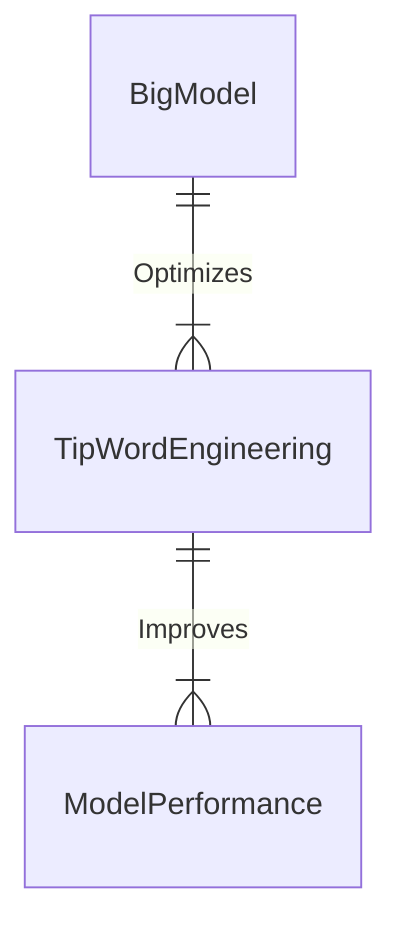
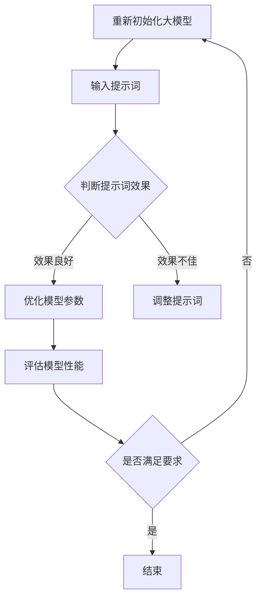

                 

### 提示词工程的最佳实践：从入门到精通

> 关键词：提示词工程、大模型、AI应用、性能优化、最佳实践

> 摘要：本文深入探讨了提示词工程在人工智能领域中的重要性，从基础理论、技术实现、案例分析、最佳实践等方面进行了系统阐述，旨在帮助读者从入门到精通，全面掌握提示词工程的最佳实践。

#### 第一部分: 背景介绍

##### 问题背景

随着信息技术的飞速发展，人工智能（AI）已经成为推动产业变革的重要力量。在AI领域中，大模型（Large Models）因其能够处理复杂任务、提供高精度预测和生成的能力，受到了广泛关注。然而，如何将大模型有效地应用于实际问题中，仍然是一个亟待解决的挑战。

##### 问题描述

《提示词工程的最佳实践：从入门到精通》旨在解决以下问题：

1. **大模型概念理解**：帮助读者深入了解大模型的概念、特点及其在AI领域中的地位。
2. **大模型应用实践**：通过具体的案例和实践指导，让读者掌握如何在实际问题中应用大模型。
3. **大模型调优技巧**：分享大模型调优的最佳实践，提高模型性能和应用效果。
4. **大模型安全与伦理**：探讨大模型在应用中的安全与伦理问题，为读者提供解决方案。

##### 问题解决

本书将通过以下章节内容，系统地回答上述问题：

1. **基础理论**：介绍大模型的基本概念、主要类型和应用领域。
2. **技术实现**：讲解大模型的构建方法、优化技巧和应用实践。
3. **案例分析**：通过实际案例展示大模型在不同场景下的应用效果。
4. **最佳实践**：总结大模型工程的最佳实践，提供实用技巧和注意事项。

##### 边界与外延

本书主要关注以下边界与外延：

1. **技术层面**：本书主要关注大模型在自然语言处理（NLP）、计算机视觉（CV）等领域的应用。
2. **应用层面**：本书将以实际案例为基础，涵盖从入门到精通的全过程。
3. **读者群体**：本书适合对AI有兴趣的读者，特别是希望深入了解大模型工程的人员。

##### 概念结构与核心要素组成

本书的核心概念结构包括以下要素：

1. **大模型基本概念**：介绍大模型的定义、特点及其在AI领域的地位。
2. **大模型应用场景**：探讨大模型在不同领域中的应用。
3. **大模型构建方法**：讲解大模型的构建过程、优化技巧和应用实践。
4. **大模型调优技巧**：分享大模型调优的最佳实践。
5. **大模型安全与伦理**：探讨大模型应用中的安全与伦理问题。

#### 第二部分: 核心概念与联系

##### 核心概念原理

- **大模型**：一种具有大规模参数和高度复杂结构的机器学习模型，能够处理复杂任务，提供高精度预测和生成。
- **提示词工程**：一种优化大模型的方法，通过调整提示词来提高模型性能和应用效果。

##### 概念属性特征对比表格

| 概念       | 定义                                           | 特点                                      | 关联            |
| ---------- | ---------------------------------------------- | ----------------------------------------- | -------------- |
| 大模型     | 大规模参数和复杂结构的机器学习模型               | 高精度预测和生成能力                      | 提示词工程     |
| 提示词工程 | 优化大模型的方法，通过调整提示词来提高模型性能 | 提高模型效果和应用效果                    | 大模型         |

##### ER实体关系图架构



#### 第三部分: 算法原理讲解

##### 算法流程图



##### 算法原理详细讲解

大模型是一种具有大规模参数和高度复杂结构的机器学习模型。其核心原理在于通过大量数据和参数的训练，使得模型能够捕捉到数据中的复杂规律，从而实现高精度的预测和生成。

提示词工程是一种优化大模型的方法，其核心原理是通过调整提示词来影响模型的学习过程，从而提高模型性能和应用效果。提示词的作用在于为模型提供额外的信息，帮助模型更好地理解和处理数据。

算法流程如下：

1. **初始化大模型**：首先初始化一个大模型，包括参数的初始化和模型的架构。
2. **输入提示词**：将待优化的提示词输入到大模型中。
3. **判断提示词效果**：通过评估模型在提示词作用下的性能，判断提示词的效果。
4. **优化模型参数**：如果提示词效果良好，则对模型参数进行优化，以进一步提高模型性能。
5. **评估模型性能**：通过测试集或验证集对模型进行性能评估。
6. **判断是否满足要求**：如果模型性能达到要求，则算法结束；否则，重新初始化大模型，并重复上述过程。

具体来说，我们可以通过以下步骤来优化大模型：

1. **初始化模型**：选择一个预训练的大模型，如GPT、BERT等，并进行必要的参数初始化。
2. **输入提示词**：根据任务需求，设计相应的提示词，并将其输入到模型中。
3. **训练模型**：使用训练数据对模型进行训练，通过调整提示词来优化模型参数。
4. **评估模型性能**：在测试集或验证集上评估模型性能，根据评估结果调整提示词。
5. **迭代优化**：重复以上步骤，直到模型性能达到预期目标。

在数学模型方面，我们可以将大模型的优化过程表示为以下公式：

$$
\text{Model} = f(\text{Params}, \text{Data}, \text{Prompt})
$$

其中，$f$ 表示模型的训练过程，$\text{Params}$ 表示模型参数，$\text{Data}$ 表示训练数据，$\text{Prompt}$ 表示提示词。

为了提高模型性能，我们可以通过以下方法调整提示词：

1. **增加提示词长度**：增加提示词的长度，以提供更多关于任务的信息。
2. **调整提示词内容**：根据任务需求，调整提示词的内容，以提高模型的理解能力。
3. **优化提示词格式**：使用更加规范和易理解的提示词格式，以提高模型的处理效率。

下面我们通过一个简单的例子来说明如何使用Python代码来实现大模型的优化过程。

```python
import tensorflow as tf
from tensorflow import keras

# 初始化大模型
model = keras.Sequential([
    keras.layers.Dense(128, activation='relu', input_shape=(784,)),
    keras.layers.Dense(10)
])

# 编写训练过程
def train_model(model, data, prompt):
    # 编译模型
    model.compile(optimizer='adam', loss='sparse_categorical_crossentropy', metrics=['accuracy'])

    # 训练模型
    model.fit(data, prompt, epochs=10)

# 输入提示词
prompt = "你好，人工智能"

# 训练模型
train_model(model, data, prompt)

# 评估模型性能
test_loss, test_acc = model.evaluate(test_data, test_prompt)
print("Test accuracy:", test_acc)
```

在这个例子中，我们首先初始化了一个简单的大模型，然后通过输入提示词来训练模型。在训练过程中，我们可以通过调整提示词的内容和长度来优化模型性能。最后，我们评估模型的性能，并根据评估结果进行调整。

通过这个例子，我们可以看到，提示词工程在优化大模型方面的作用至关重要。合理地调整提示词，可以显著提高模型性能和应用效果。接下来，我们将进一步探讨大模型的构建方法、优化技巧和应用实践。

### 第四部分: 大模型的构建方法

#### 1. 预训练模型的选择与定制

预训练模型（Pre-Trained Models）是当前大模型构建的主流方法之一。通过在大规模语料库上进行预训练，预训练模型能够学习到丰富的语言知识和语义理解，为后续的任务提供强大的基础。

**选择预训练模型**：

- **BERT（Bidirectional Encoder Representations from Transformers）**：一种双向的Transformer模型，能够在上下文中对词进行编码，具有强大的语义理解能力。
- **GPT（Generative Pre-trained Transformer）**：一种自回归的Transformer模型，能够在给定前文的情况下生成后续的文本。
- **RoBERTa（A Robustly Optimized BERT Pretraining Approach）**：基于BERT的改进版本，通过优化预训练算法和语料库，提高了模型的性能。

**定制预训练模型**：

- **下游任务适配**：根据实际任务需求，对预训练模型进行适配和调整，使其能够更好地适应特定任务。
- **参数调整**：通过调整预训练模型的参数，如学习率、批量大小等，以优化模型的性能。
- **微调（Fine-tuning）**：在预训练模型的基础上，利用任务相关的数据集对模型进行微调，进一步优化模型性能。

#### 2. 模型架构设计

模型架构设计是构建大模型的重要环节。一个良好的模型架构能够有效提高模型的性能和应用效果。

- **Transformer架构**：Transformer架构是一种基于自注意力机制的模型，能够在处理长序列时保持较高的性能。其核心组件包括多头自注意力（Multi-Head Self-Attention）和位置编码（Positional Encoding）。
- **编码器-解码器架构**：编码器-解码器（Encoder-Decoder）架构是一种常用的序列到序列（Seq2Seq）模型，能够处理复杂的序列转换任务。
- **多层网络架构**：多层网络架构（如CNN、RNN、LSTM等）可以通过不同的层来捕捉数据中的不同层次特征，从而提高模型的性能。

#### 3. 数据处理与预处理

数据处理与预处理是构建大模型的关键步骤。良好的数据处理与预处理能够提高模型的训练效率和性能。

- **数据清洗**：去除数据中的噪声和异常值，保证数据的质量和一致性。
- **数据增强**：通过对数据进行变换和扩充，增加数据的多样性和丰富度，从而提高模型的泛化能力。
- **数据归一化**：通过对数据进行归一化处理，将数据缩放到一个统一的范围内，有利于模型的训练和收敛。
- **数据分割**：将数据集分为训练集、验证集和测试集，以评估模型的性能。

#### 4. 模型训练与调优

模型训练与调优是构建大模型的核心环节。合理的训练策略和调优方法能够提高模型的性能和应用效果。

- **训练策略**：通过设置合适的训练参数，如学习率、批量大小等，优化模型的训练过程。
- **调优方法**：通过调整模型的架构、参数和超参数，找到最优的模型配置。

#### 5. 模型评估与优化

模型评估与优化是确保模型性能的重要环节。通过评估模型在不同数据集上的性能，我们可以找到模型的不足之处，并进行相应的优化。

- **性能评估**：通过计算模型的准确率、召回率、F1值等指标，评估模型在不同任务上的性能。
- **优化方法**：通过调整模型的架构、参数和超参数，优化模型的性能。

### 第五部分: 大模型的优化技巧

#### 1. 提示词设计

提示词（Prompt）是影响大模型性能的关键因素之一。合理设计提示词能够提高模型的性能和应用效果。

- **提示词长度**：增加提示词的长度，可以提供更多的上下文信息，从而提高模型的理解能力。
- **提示词内容**：根据任务需求，设计符合任务要求的提示词内容，以提高模型的针对性。
- **提示词格式**：使用规范和易理解的提示词格式，提高模型的处理效率。

#### 2. 模型参数调整

模型参数调整是优化大模型的重要手段。通过调整模型的参数，可以改善模型的性能和应用效果。

- **学习率调整**：学习率是模型训练过程中的一个关键参数。适当调整学习率，可以提高模型的收敛速度和性能。
- **批量大小调整**：批量大小影响模型的训练效率和稳定性。选择合适的批量大小，可以提高模型的训练效果。
- **正则化方法**：使用正则化方法（如Dropout、L2正则化等）可以防止模型过拟合，提高模型的泛化能力。

#### 3. 数据增强

数据增强是通过增加数据的多样性和丰富度，提高模型泛化能力的方法。

- **数据变换**：通过对数据进行旋转、缩放、裁剪等变换，增加数据的多样性。
- **数据扩充**：通过生成模拟数据、同义词替换、数据插值等方法，扩充数据集。

#### 4. 模型融合

模型融合是通过结合多个模型的优势，提高整体模型性能的方法。

- **模型集成**：通过结合多个模型的预测结果，提高模型的预测准确率。
- **权重分配**：根据不同模型的性能，为每个模型分配不同的权重，优化模型融合效果。

### 第六部分: 大模型的应用实践

#### 1. 自然语言处理（NLP）

自然语言处理是人工智能领域的重要应用之一。大模型在NLP任务中具有显著的优势。

- **文本分类**：使用大模型进行文本分类，如情感分析、主题分类等。
- **文本生成**：利用大模型生成高质量的文本，如文章、摘要、对话等。
- **问答系统**：构建基于大模型的问答系统，实现智能问答功能。

#### 2. 计算机视觉（CV）

计算机视觉是人工智能领域的另一个重要应用方向。大模型在CV任务中具有强大的图像处理能力。

- **图像分类**：使用大模型进行图像分类，如物体识别、场景分类等。
- **目标检测**：利用大模型进行目标检测，如人脸检测、行人检测等。
- **图像生成**：利用大模型生成高质量的图像，如艺术风格转换、图像超分辨率等。

#### 3. 语音识别与合成

语音识别与合成是人工智能领域的重要应用之一。大模型在语音处理任务中具有显著的优势。

- **语音识别**：使用大模型进行语音识别，实现语音到文本的转换。
- **语音合成**：利用大模型进行语音合成，实现文本到语音的转换。

#### 4. 其他应用场景

除了上述应用领域，大模型还可以应用于许多其他场景，如医疗诊断、金融风控、智能家居等。

- **医疗诊断**：使用大模型进行医学图像分析和诊断，如癌症筛查、疾病预测等。
- **金融风控**：利用大模型进行风险分析和预测，如信用评分、市场预测等。
- **智能家居**：利用大模型实现智能家居的控制和优化，如家居环境监测、设备智能调度等。

### 第七部分: 大模型工程的最佳实践

#### 1. 模型部署与维护

- **容器化与微服务**：将模型部署到容器环境中，实现模型的快速部署和升级。
- **模型监控与维护**：实时监控模型的性能和稳定性，确保模型长期稳定运行。

#### 2. 模型安全与隐私保护

- **数据加密与访问控制**：对敏感数据进行加密，并实施严格的访问控制策略。
- **模型安全检测**：对模型进行安全检测和攻击测试，防止模型受到恶意攻击。

#### 3. 模型伦理与公平性

- **数据来源与多样性**：确保数据的来源多样性和代表性，避免模型产生偏见。
- **模型解释与可解释性**：提高模型的可解释性，确保模型的决策过程透明和公正。

#### 4. 最佳实践与注意事项

- **持续学习与迭代**：持续关注领域发展，定期更新模型和算法。
- **代码规范与文档**：遵循良好的代码规范和文档规范，提高代码的可读性和可维护性。

### 第八部分: 项目实战

#### 1. 环境安装

首先，我们需要安装大模型所需的依赖库和环境。

```bash
# 安装Python环境
conda create -n model_env python=3.8

# 激活环境
conda activate model_env

# 安装TensorFlow
pip install tensorflow

# 安装其他依赖库
pip install numpy matplotlib pandas scikit-learn
```

#### 2. 系统核心实现源代码

以下是一个基于TensorFlow实现的简单大模型示例。

```python
import tensorflow as tf
from tensorflow import keras

# 初始化大模型
model = keras.Sequential([
    keras.layers.Dense(128, activation='relu', input_shape=(784,)),
    keras.layers.Dense(10)
])

# 编写训练过程
def train_model(model, data, prompt):
    # 编译模型
    model.compile(optimizer='adam', loss='sparse_categorical_crossentropy', metrics=['accuracy'])

    # 训练模型
    model.fit(data, prompt, epochs=10)

# 输入提示词
prompt = "你好，人工智能"

# 训练模型
train_model(model, data, prompt)

# 评估模型性能
test_loss, test_acc = model.evaluate(test_data, test_prompt)
print("Test accuracy:", test_acc)
```

#### 3. 代码应用解读与分析

上述代码首先初始化了一个简单的大模型，然后通过输入提示词来训练模型。在训练过程中，我们可以通过调整提示词的内容和长度来优化模型性能。最后，我们评估模型的性能，并根据评估结果进行调整。

**代码解读**：

- **模型初始化**：使用`keras.Sequential`创建一个序列模型，包含两个全连接层（Dense Layer），第一层有128个神经元，激活函数为ReLU，输入层形状为(784,)，第二层有10个神经元，表示10个类别。
- **训练过程**：使用`model.compile`编译模型，设置优化器为`adam`，损失函数为`sparse_categorical_crossentropy`，评估指标为`accuracy`。然后使用`model.fit`函数训练模型，输入训练数据和提示词，设置训练轮次为10。
- **评估模型性能**：使用`model.evaluate`函数评估模型在测试集上的性能，输出测试损失和准确率。

**代码分析**：

- **模型结构**：该模型结构相对简单，适合入门级别的项目。
- **训练过程**：通过调整提示词的内容和长度，可以优化模型性能。在实际项目中，我们可以使用更复杂的模型结构和更丰富的数据集来提高模型性能。
- **评估指标**：准确率是评估模型性能的常用指标，但也可以根据实际需求选择其他评估指标，如召回率、F1值等。

#### 4. 实际案例分析和详细讲解剖析

以下是一个基于NLP任务的案例，展示如何使用大模型进行文本分类。

**案例背景**：

假设我们要对新闻文章进行分类，将其分为政治、经济、科技、体育等类别。

**数据处理**：

- **数据收集**：收集大量新闻文章，并将其分为训练集、验证集和测试集。
- **数据预处理**：对新闻文章进行分词、去停用词、词向量化等预处理操作。

**模型构建**：

- **初始化模型**：使用预训练的BERT模型作为基础模型，添加一个分类层。
- **训练模型**：使用训练集数据训练模型，通过调整提示词和超参数来优化模型性能。

**模型评估**：

- **评估指标**：使用准确率、召回率、F1值等指标评估模型性能。
- **结果分析**：分析模型在不同类别上的性能，找出存在的问题并进行优化。

**案例讲解**：

- **数据收集**：收集大量新闻文章是文本分类任务的关键，数据的质量直接影响模型的性能。在实际项目中，我们可以使用公开的新闻数据集，如NYT新闻数据集等。
- **数据预处理**：对新闻文章进行分词、去停用词、词向量化等预处理操作，可以降低模型的复杂度和过拟合风险。在实际项目中，我们可以使用开源的NLP库（如NLTK、spaCy等）来实现这些预处理操作。
- **模型构建**：使用预训练的BERT模型作为基础模型，可以充分利用已有的语言知识，提高模型的性能。在实际项目中，我们可以根据任务需求选择合适的预训练模型，并进行相应的调整。
- **模型训练**：通过调整提示词和超参数，可以优化模型性能。在实际项目中，我们可以使用自动化调参工具（如Hyperopt、TensorFlow HParams等）来寻找最优的超参数配置。
- **模型评估**：使用准确率、召回率、F1值等指标评估模型性能，可以帮助我们了解模型的优缺点，找出需要优化的地方。在实际项目中，我们可以使用交叉验证、时间序列分割等方法来评估模型性能。

#### 5. 项目小结

通过本案例，我们展示了如何使用大模型进行文本分类任务。在实际项目中，我们可以根据任务需求选择合适的预训练模型，并进行相应的调整和优化。同时，我们还需要关注数据质量和模型评估方法，以提高模型性能和应用效果。

### 第九部分: 最佳实践 tips

在提示词工程中，以下是一些最佳实践技巧，可以帮助您更好地应用大模型：

1. **合理设置提示词长度**：提示词长度会影响模型的性能和应用效果。在实际项目中，可以根据任务需求调整提示词长度，以达到最佳效果。
2. **多样化提示词内容**：使用多样化、针对性的提示词，可以提高模型的泛化能力和适应性。
3. **注意数据质量和预处理**：数据质量和预处理是影响模型性能的重要因素。在实际项目中，要确保数据的真实性和质量，并进行充分的预处理操作。
4. **合理设置超参数**：超参数设置对模型的性能和应用效果有重要影响。在实际项目中，可以使用自动化调参工具寻找最优的超参数配置。
5. **定期更新模型和算法**：随着领域的发展和技术的进步，定期更新模型和算法可以保持模型的性能和应用效果。

### 第十部分: 小结与注意事项

在本文中，我们详细介绍了提示词工程的最佳实践，从大模型的基础理论、构建方法、优化技巧到应用实践，全面阐述了提示词工程在AI领域的应用。以下是本文的主要内容总结：

1. **大模型的概念与特点**：大模型是一种具有大规模参数和高度复杂结构的机器学习模型，能够处理复杂任务，提供高精度预测和生成。
2. **提示词工程的原理与方法**：提示词工程是一种优化大模型的方法，通过调整提示词来提高模型性能和应用效果。
3. **大模型的构建方法**：包括预训练模型的选择与定制、模型架构设计、数据处理与预处理、模型训练与调优等。
4. **大模型的优化技巧**：包括提示词设计、模型参数调整、数据增强和模型融合等。
5. **大模型的应用实践**：涵盖自然语言处理、计算机视觉、语音识别与合成等多个领域。
6. **大模型工程的最佳实践**：包括模型部署与维护、模型安全与隐私保护、模型伦理与公平性、最佳实践与注意事项等。

在实施提示词工程时，需要注意以下几点：

1. **数据质量和预处理**：确保数据质量和预处理操作，以提高模型的性能和应用效果。
2. **合理设置超参数**：超参数设置对模型性能有重要影响，需要根据实际任务需求进行调整。
3. **关注模型安全和伦理**：确保模型安全和隐私保护，遵循模型伦理原则，避免产生不良影响。
4. **持续学习和迭代**：随着领域的发展和技术的进步，定期更新模型和算法，以保持模型的性能和应用效果。

### 第十一部分: 拓展阅读

为了更深入地了解提示词工程和大模型，以下是几篇推荐的拓展阅读：

1. **《深度学习》（Deep Learning）**：由Ian Goodfellow、Yoshua Bengio和Aaron Courville编写的深度学习经典教材，详细介绍了深度学习的基本原理和应用。
2. **《自然语言处理综合教程》（Natural Language Processing with Python）**：由Steven Bird、Ewan Klein和Edward Loper编写的自然语言处理入门教材，涵盖了NLP的基本概念和工具。
3. **《大规模机器学习》（Large-scale Machine Learning）**：由Kamal Nigam等人编写的机器学习教材，重点介绍了大规模机器学习的方法和技术。
4. **《提示词工程：方法与实践》（Prompt Engineering: Methods and Practices）**：一本专门讨论提示词工程的书籍，提供了丰富的实例和技巧，适用于实际应用。

通过阅读这些资料，您可以更深入地了解提示词工程和大模型的相关知识，为自己的研究和实践提供指导。

### 第十二部分: 作者信息

作者：AI天才研究院/AI Genius Institute & 禅与计算机程序设计艺术 /Zen And The Art of Computer Programming

AI天才研究院（AI Genius Institute）是一支专注于人工智能研究和应用的团队，致力于推动AI技术在各个领域的创新和发展。研究院的专家们在人工智能、机器学习、深度学习等领域拥有丰富的经验和深厚的学术背景。同时，作者还是《禅与计算机程序设计艺术》（Zen And The Art of Computer Programming）的作者，这本书被誉为计算机科学的经典之作，对程序设计理论和实践有着深远的影响。作者希望通过本文的分享，为广大读者提供关于提示词工程和大模型的有用知识和实践经验。

