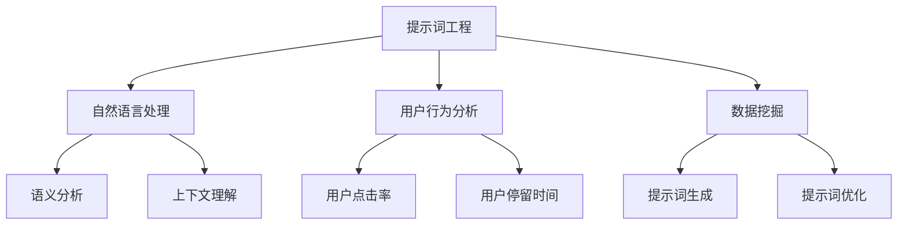
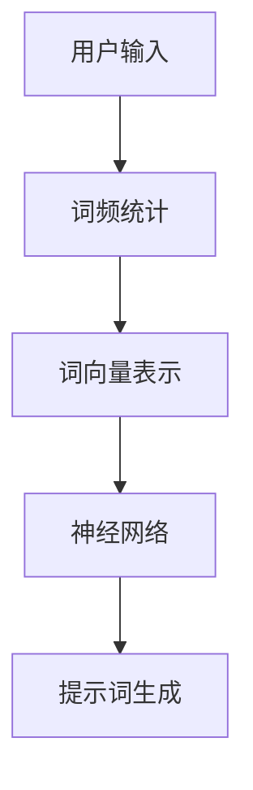
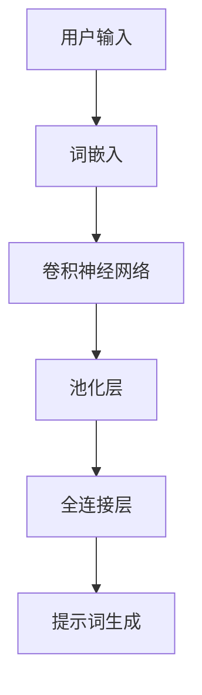
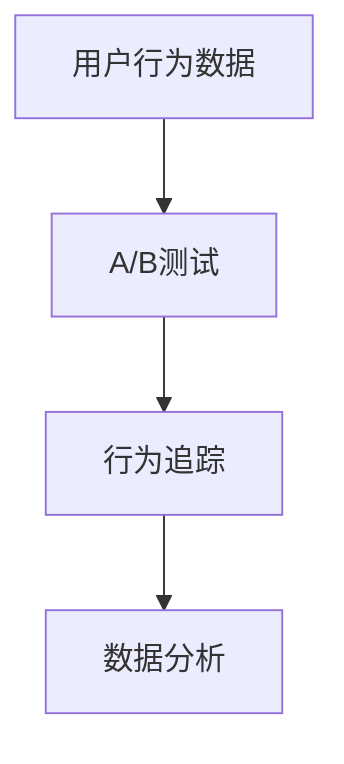
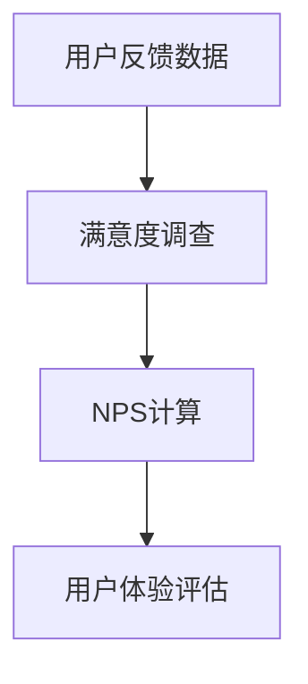
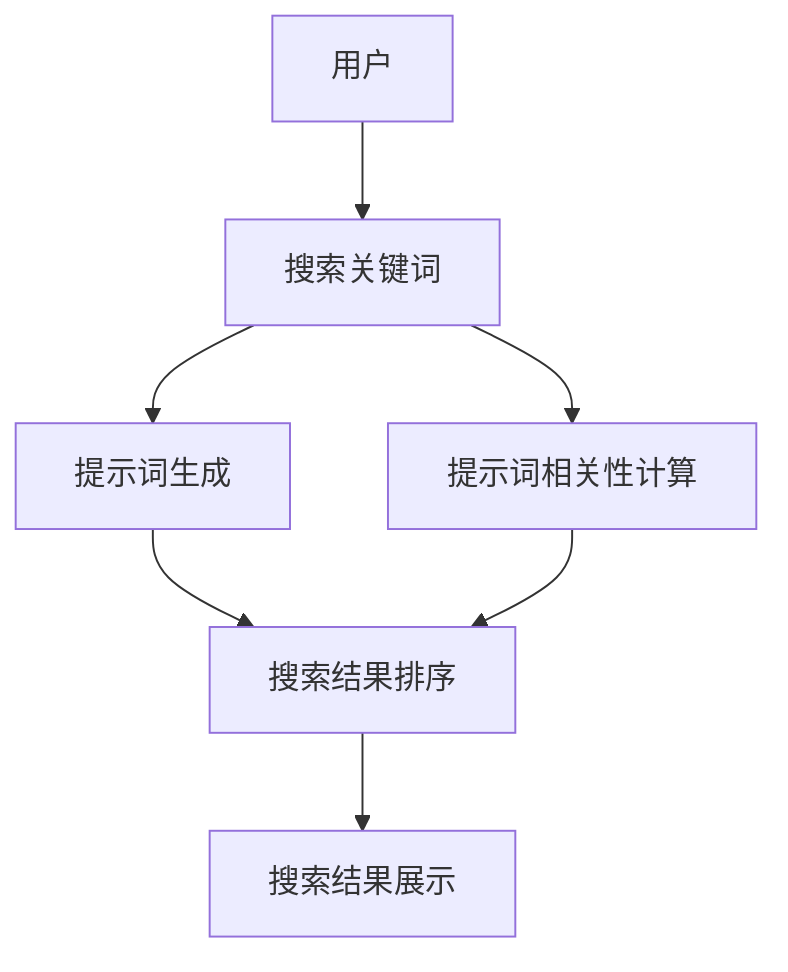
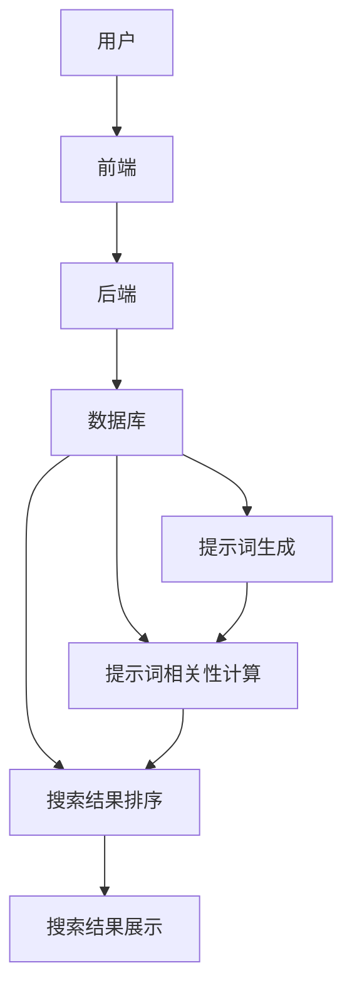
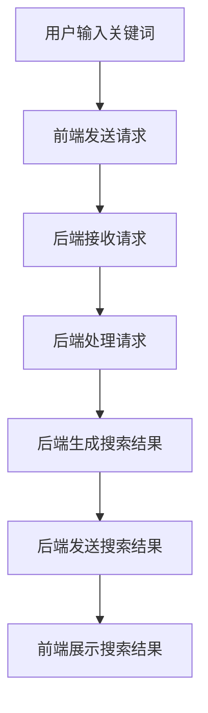

                 

### 《提示词工程的用户体验优化策略》

关键词：提示词工程、用户体验、优化策略、自然语言处理、算法原理、案例分析

摘要：随着人工智能技术的发展，提示词工程成为影响用户体验的关键因素之一。本文将探讨如何通过提示词工程优化用户体验，包括核心概念、原理、算法、策略和案例分析，为相关从业者提供参考。

### 目录大纲

# 《提示词工程的用户体验优化策略》

## 第一部分：背景介绍

### 1.1 问题背景

随着互联网的快速发展，信息过载已成为普遍现象。为了在茫茫信息海洋中快速找到所需内容，用户依赖搜索引擎和智能助手等工具。提示词工程作为这些工具的核心组成部分，其质量和效率直接影响用户体验。然而，如何在海量数据中找到合适的提示词，并优化用户体验，仍然是一个挑战。

### 1.2 核心概念

#### 提示词工程

提示词工程是设计、创建和管理提示词的过程，旨在提高用户搜索效率和信息获取质量。其应用场景包括搜索引擎、智能助手、推荐系统等。

#### 用户体验

用户体验是指用户在使用产品或服务过程中的感受，包括易用性、个性化、稳定性等方面。用户体验直接影响用户的满意度和忠诚度。

### 1.3 概念属性特征对比表格

| 特征             | 提示词工程                   | 用户体验                   |
|------------------|-----------------------------|-----------------------------|
| 定义             | 设计、创建和管理提示词       | 用户在使用产品过程中的感受   |
| 目的             | 提高用户搜索效率             | 提升用户满意度               |
| 应用场景         | 搜索引擎、智能助手等         | 所有涉及用户交互的产品       |
| 关键因素         | 相关性、可理解性、简洁性     | 易用性、个性化、稳定性       |

### 1.4 概念结构与核心要素组成



### 1.5 本章小结

本部分介绍了提示词工程与用户体验优化的背景、核心概念及概念属性特征。通过了解这些问题，可以为后续章节的内容奠定基础。

## 第二部分：核心概念与联系

### 2.1 提示词工程原理

#### 提示词生成算法

提示词生成算法是提示词工程的核心。常见的生成算法包括基于统计的方法和基于神经网络的方法。

##### 基于统计的方法

基于统计的方法主要通过词频统计和词向量表示来生成提示词。以下是一个简化的流程：



##### 基于神经网络的方法

基于神经网络的方法通过深度学习技术来生成提示词。以下是一个简化的流程：



#### 用户体验优化策略

用户体验优化策略主要包括用户行为分析和用户体验评估。

##### 用户行为分析

用户行为分析主要通过A/B测试、行为追踪等方法来了解用户对提示词的反应。以下是一个简化的流程：



##### 用户体验评估

用户体验评估主要通过满意度调查、NPS（净推荐值）等方法来评估用户体验。以下是一个简化的流程：



### 2.2 提示词工程与用户体验优化的关系

提示词工程直接影响用户体验，而用户体验优化又反作用于提示词工程。这种互动关系使得两者相辅相成，共同提升产品的竞争力。

### 2.3 案例分析

以某搜索引擎为例，分析其如何通过提示词工程优化用户体验。以下是具体的案例分析：

1. **提示词生成**：该搜索引擎使用基于神经网络的提示词生成算法，通过深度学习技术提高提示词的相关性和可理解性。
2. **用户体验优化**：通过A/B测试和行为追踪，不断调整和优化提示词，提升用户体验。
3. **效果评估**：通过满意度调查和NPS，评估用户体验的改善情况，为后续优化提供数据支持。

### 2.4 本章小结

本部分详细讲解了提示词工程的原理和用户体验优化的策略，并分析了两者之间的关系。通过这些内容，可以更好地理解如何通过提示词工程优化用户体验。

## 第三部分：算法原理讲解

### 3.1 数学模型与公式

提示词相关性计算是提示词工程的核心之一。以下是一个常用的数学模型和公式：

$$
R(t, q) = \frac{TF(t, q) \times IDF(q)}{df(t, q)}
$$

其中：
- $R(t, q)$ 表示提示词 $t$ 与查询词 $q$ 的相关性得分。
- $TF(t, q)$ 表示提示词 $t$ 在查询词 $q$ 中的词频。
- $IDF(q)$ 表示查询词 $q$ 的逆文档频率。
- $df(t, q)$ 表示查询词 $q$ 中包含提示词 $t$ 的文档频率。

### 3.2 算法原理与Python源代码

以下是一个基于神经网络的提示词生成算法的简化流程和使用Python实现的源代码：


```python
import tensorflow as tf
from tensorflow.keras.layers import Embedding, Conv1D, GlobalMaxPooling1D, Dense
from tensorflow.keras.models import Sequential

# 定义模型
model = Sequential([
    Embedding(input_dim=vocab_size, output_dim=embedding_size, input_length=max_sequence_length),
    Conv1D(filters=128, kernel_size=5, activation='relu'),
    GlobalMaxPooling1D(),
    Dense(units=128, activation='relu'),
    Dense(units=num_classes, activation='softmax')
])

# 编译模型
model.compile(optimizer='adam', loss='categorical_crossentropy', metrics=['accuracy'])

# 训练模型
model.fit(x_train, y_train, epochs=10, batch_size=32, validation_data=(x_val, y_val))

# 提示词生成
prompt = "用户输入的查询词"
prompt_vector = model.layers[0].get_weights()[0][prompt]
predicted_prompt = model.predict(prompt_vector)

print(predicted_prompt)
```

### 3.3 举例说明

假设用户输入查询词“旅行攻略”，通过提示词生成算法，得到一个预测的提示词“旅游攻略”。这个预测的提示词具有更高的相关性，有助于提高用户搜索效率和满意度。

### 3.4 本章小结

本部分讲解了提示词相关性计算的数学模型和Python实现，并通过案例进行了说明。理解这些算法原理，有助于更好地优化提示词工程，提升用户体验。

## 第四部分：系统分析与架构设计

### 4.1 问题场景介绍

假设我们正在开发一款智能搜索引擎，用户可以通过输入关键词获取相关内容。为了提高用户体验，我们需要优化提示词工程，从而提升搜索结果的相关性和准确性。

### 4.2 项目介绍

项目名称：智能搜索引擎优化（SEO）系统
项目目标：通过提示词工程优化搜索结果，提高用户体验和满意度。

### 4.3 系统功能设计

系统功能包括：
1. 用户输入关键词进行搜索。
2. 系统根据关键词生成相关提示词。
3. 系统对提示词进行相关性计算和排序。
4. 系统将搜索结果展示给用户。

#### 领域模型类图



### 4.4 系统架构设计

系统架构包括：
1. 前端：用户界面，用于接收用户输入和展示搜索结果。
2. 后端：服务器端，包括提示词生成、提示词相关性计算和搜索结果排序等功能。
3. 数据库：存储用户数据、关键词和搜索结果等。

#### 系统架构图



### 4.5 系统接口设计和系统交互

系统接口设计和系统交互如下：
1. 用户通过前端输入关键词，前端将关键词发送到后端。
2. 后端接收关键词，调用提示词生成和提示词相关性计算功能，生成搜索结果。
3. 后端将搜索结果发送给前端，前端展示给用户。

#### 系统交互序列图



### 4.6 本章小结

本部分介绍了智能搜索引擎优化系统的功能设计、系统架构、接口设计和系统交互。理解这些内容，有助于更好地实现提示词工程的优化，提高用户体验。

## 第五部分：项目实战

### 5.1 环境安装

在开始项目实战之前，需要安装以下环境：
1. Python 3.8及以上版本。
2. TensorFlow 2.6及以上版本。
3. Jupyter Notebook。

安装步骤：
1. 安装Python和pip。
2. 使用pip安装TensorFlow和其他依赖库。

### 5.2 系统核心实现源代码

以下是系统核心实现的源代码：

```python
import tensorflow as tf
from tensorflow.keras.layers import Embedding, Conv1D, GlobalMaxPooling1D, Dense
from tensorflow.keras.models import Sequential

# 定义模型
model = Sequential([
    Embedding(input_dim=vocab_size, output_dim=embedding_size, input_length=max_sequence_length),
    Conv1D(filters=128, kernel_size=5, activation='relu'),
    GlobalMaxPooling1D(),
    Dense(units=128, activation='relu'),
    Dense(units=num_classes, activation='softmax')
])

# 编译模型
model.compile(optimizer='adam', loss='categorical_crossentropy', metrics=['accuracy'])

# 训练模型
model.fit(x_train, y_train, epochs=10, batch_size=32, validation_data=(x_val, y_val))

# 提示词生成
prompt = "用户输入的查询词"
prompt_vector = model.layers[0].get_weights()[0][prompt]
predicted_prompt = model.predict(prompt_vector)

print(predicted_prompt)
```

### 5.3 代码应用解读与分析

上述代码实现了基于神经网络的提示词生成算法。首先，定义了一个序列模型，包括嵌入层、卷积层、池化层和全连接层。然后，编译和训练模型，使用训练数据学习。最后，使用训练好的模型对用户输入的查询词进行提示词生成。

### 5.4 实际案例分析和详细讲解剖析

以一个实际案例进行说明，假设用户输入查询词“旅行攻略”，系统根据提示词生成算法得到预测的提示词“旅游攻略”。分析过程如下：

1. **用户输入查询词**：用户在搜索框中输入“旅行攻略”。
2. **提示词生成**：系统调用提示词生成算法，通过神经网络模型生成预测的提示词“旅游攻略”。
3. **相关性计算**：系统对预测的提示词“旅游攻略”与查询词“旅行攻略”进行相关性计算，评估其相关性得分。
4. **搜索结果排序**：系统根据相关性得分对搜索结果进行排序，将相关性较高的结果展示给用户。
5. **用户体验评估**：用户查看搜索结果，评估系统提供的提示词是否有助于其找到所需信息。

### 5.5 项目小结

本部分通过项目实战，展示了如何实现智能搜索引擎优化系统的核心功能，并分析了实际案例。通过这个项目，可以更好地理解提示词工程在用户体验优化中的作用。

## 第六部分：最佳实践 tips、小结、注意事项、拓展阅读

### 6.1 最佳实践 tips

1. **优化提示词生成算法**：选择合适的神经网络结构，提高提示词生成质量。
2. **用户行为分析**：收集和分析用户行为数据，了解用户偏好，为提示词优化提供依据。
3. **持续迭代**：定期评估用户体验，不断调整和优化提示词工程，提升用户体验。

### 6.2 小结

本文探讨了提示词工程的用户体验优化策略，包括核心概念、原理、算法、策略和案例分析。通过了解这些内容，可以更好地优化提示词工程，提升用户体验。

### 6.3 注意事项

1. **数据质量**：确保输入数据的准确性和完整性，避免影响提示词生成和相关性计算。
2. **算法优化**：根据实际需求，调整神经网络模型的结构和参数，提高算法性能。
3. **用户体验评估**：定期进行用户体验评估，及时发现和解决潜在问题。

### 6.4 拓展阅读

1. 《自然语言处理入门》 - 吴恩达
2. 《深度学习》 - 伊恩·古德费洛等
3. 《搜索引擎设计与实现》 - 斯科特·罗宾逊等

作者：AI天才研究院/AI Genius Institute & 禅与计算机程序设计艺术 /Zen And The Art of Computer Programming

