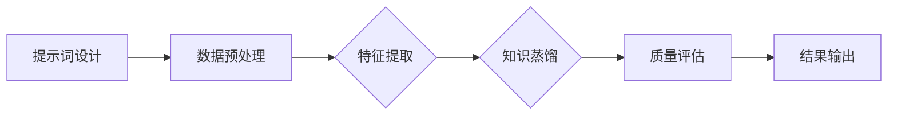
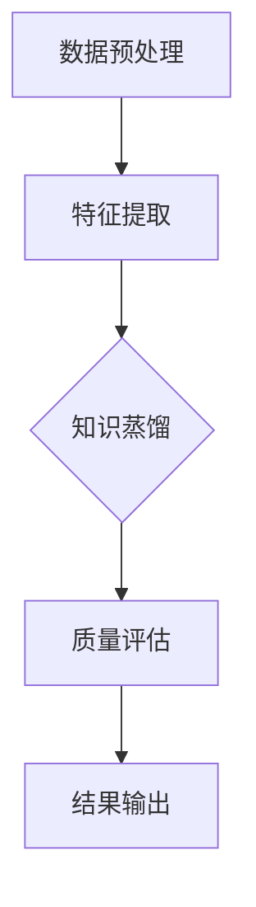
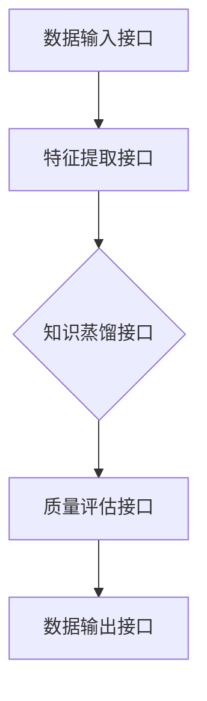
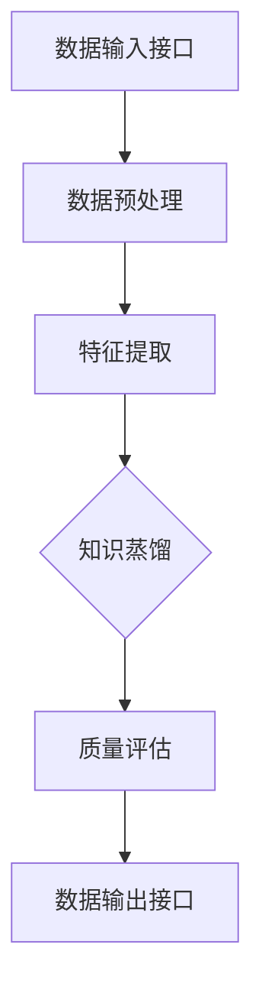

                 

## 提示词工程的知识蒸馏质量评估

### 关键词：提示词工程、知识蒸馏、质量评估、深度学习、模型性能

> 摘要：本文深入探讨了提示词工程的知识蒸馏质量评估问题，详细分析了其在深度学习中的应用背景、面临的挑战和解决方法。通过对核心概念、联系、算法原理、系统架构和项目实战的全面解析，本文旨在为读者提供一个清晰、系统的理解，助力其在实际项目中优化提示词工程，提升模型性能。

---

### 目录大纲

1. **背景介绍**
   1.1 问题提出
   1.2 提示词工程的重要性
   1.3 知识蒸馏质量评估的意义
   1.4 提示词工程质量评估的挑战
   1.5 知识蒸馏质量评估的挑战
2. **核心概念与联系**
   2.1 提示词工程原理
   2.2 知识蒸馏原理
   2.3 质量评估原理
   2.4 概念属性特征对比
   2.5 ER实体关系图架构
3. **算法原理讲解**
   3.1 算法mermaid流程图
   3.2 Python源代码阐述
   3.3 数学模型与公式
   3.4 举例说明
4. **系统分析与架构设计方案**
   4.1 问题场景介绍
   4.2 系统功能设计
   4.3 系统架构设计
   4.4 系统接口设计
   4.5 系统交互
5. **项目实战**
   5.1 环境安装
   5.2 系统核心实现
   5.3 代码应用解读与分析
   5.4 实际案例分析与详细讲解剖析
   5.5 项目小结
6. **最佳实践 tips、小结、注意事项、拓展阅读**

---

### 1. 背景介绍

#### 1.1 问题提出

在深度学习中，提示词工程（Prompt Engineering）是构建高质量模型的关键环节。然而，如何评估提示词工程的质量，使得模型在实际应用中达到最佳效果，仍然是一个具有挑战性的问题。

#### 1.2 提示词工程的重要性

提示词工程决定了模型对数据的理解和处理能力，直接影响模型的性能和应用效果。高质量的提示词工程能够提高模型的泛化能力，增强模型在实际场景中的适用性。

#### 1.3 知识蒸馏质量评估的意义

知识蒸馏是一种将大型预训练模型的知识传递给小型模型的技术。评估知识蒸馏质量，有助于优化提示词工程，提高模型的应用价值。通过质量评估，可以发现和解决模型在知识传递过程中的问题，从而提升模型的性能。

#### 1.4 提示词工程质量评估的挑战

提示词工程质量评估面临数据多样性、评估指标多样性、评估过程复杂等挑战。首先，数据多样性导致评估标准的差异，使得统一评估变得困难。其次，评估指标多样性增加了评估的复杂性，需要综合考虑多个指标。最后，评估过程复杂，需要大量的计算资源和时间。

#### 1.5 知识蒸馏质量评估的挑战

知识蒸馏质量评估需要考虑源模型、目标模型、数据集、评估指标等多个因素。源模型的性能、目标模型的适应性、数据集的质量和评估指标的选择都会影响知识蒸馏的质量评估。此外，知识蒸馏过程中的复杂性和不确定性也增加了评估的难度。

---

### 2. 核心概念与联系

#### 2.1 提示词工程原理

提示词工程是通过对输入数据进行预处理、特征提取和编码，以提高模型对数据的理解和处理能力。提示词工程的核心目标是设计出能够引导模型学习到有效知识和信息的提示词。

##### 提示词的作用

- 引导模型学习：提示词能够引导模型关注特定的数据特征，从而学习到更有效的知识。
- 提高模型性能：高质量的提示词能够提高模型的泛化能力和适应能力，使其在实际应用中表现更优秀。

##### 提示词的设计方法

- 数据预处理：对输入数据格式进行统一，去除无效信息，提高数据质量。
- 特征提取：从数据中提取有用的特征，用于模型训练和预测。
- 编码策略：将特征数据转换为适合模型处理的格式，如向量、张量等。

#### 2.2 知识蒸馏原理

知识蒸馏是一种将大型预训练模型的知识传递给小型模型的技术。其核心思想是将大型模型的知识以软标签的形式传递给小型模型，使得小型模型能够利用大型模型的先验知识，提高模型性能。

##### 知识蒸馏的概念

- 源模型（Teacher Model）：通常是一个大型预训练模型，具有丰富的先验知识和强大的学习能力。
- 目标模型（Student Model）：通常是一个小型模型，其结构相对简单，但能够快速适应新任务。

##### 知识蒸馏的过程

- 软标签生成：将源模型的输出结果（通常为概率分布）作为软标签传递给目标模型。
- 模型训练：目标模型在软标签的指导下进行训练，学习到源模型的知识和特征。
- 模型评估：通过评估指标（如准确率、损失函数等）评估目标模型的性能。

#### 2.3 质量评估原理

质量评估是评估模型性能的重要手段。在提示词工程和知识蒸馏中，质量评估用于评估模型在实际应用中的性能和效果。

##### 质量评估指标

- 准确率（Accuracy）：评估模型预测正确的比例。
- 查准率（Precision）：评估模型预测为正样本的比例，即预测为正样本且实际为正样本的比例。
- 查全率（Recall）：评估模型预测为正样本的比例，即实际为正样本且预测为正样本的比例。
- F1分数（F1 Score）：综合评估模型的精确率和召回率。

##### 评估方法的分类

- 定量评估：通过计算评估指标数值进行评估，如准确率、查准率、查全率和F1分数等。
- 定性评估：通过分析模型在特定任务上的表现进行评估，如模型的可解释性、鲁棒性和适应性等。

#### 2.4 概念属性特征对比

为了更好地理解提示词工程、知识蒸馏和质量评估，下面给出一个概念属性特征对比表格。

| 概念         | 提示词工程 | 知识蒸馏 | 质量评估 |
| ------------ | ---------- | -------- | -------- |
| 定义         | 提高模型理解能力 | 将知识传递给小型模型 | 评估模型性能和效果 |
| 目标         | 设计高质量提示词 | 提升模型性能 | 提高模型应用价值 |
| 关键要素     | 提示词设计、数据预处理、特征提取 | 源模型、目标模型、软标签 | 评估指标、评估方法 |
| 影响因素     | 数据质量、模型结构 | 数据集、评估指标 | 计算资源和时间 |

#### 2.5 ER实体关系图架构

为了更好地理解提示词工程、知识蒸馏和质量评估之间的联系，下面给出一个ER实体关系图。

```mermaid
erDiagram
    A[提示词工程] ||--|{ B[知识蒸馏] } |
    B ||--|{ C[质量评估] } |
```

在ER实体关系图中，A表示提示词工程，B表示知识蒸馏，C表示质量评估。提示词工程通过知识蒸馏与质量评估相连，表明它们之间存在紧密的联系。

---

### 3. 算法原理讲解

在本节中，我们将详细讲解提示词工程的知识蒸馏质量评估算法，包括算法mermaid流程图、Python源代码阐述、数学模型与公式以及举例说明。

#### 3.1 算法mermaid流程图

首先，我们使用mermaid绘制了提示词工程的知识蒸馏质量评估算法流程图。



在该流程图中，A表示提示词设计，B表示数据预处理，C表示特征提取，D表示知识蒸馏，E表示质量评估，F表示结果输出。该流程图展示了提示词工程的知识蒸馏质量评估的基本步骤。

#### 3.2 Python源代码阐述

接下来，我们将使用Python源代码详细阐述提示词工程的知识蒸馏质量评估算法。

```python
# 数据预处理
def preprocess_data(data):
    # 对数据进行统一格式处理
    # 去除无效信息
    # 提高数据质量
    processed_data = []
    for item in data:
        # 数据预处理逻辑
        processed_data.append(item)
    return processed_data

# 特征提取
def extract_features(data):
    # 从数据中提取有用特征
    features = []
    for item in data:
        # 特征提取逻辑
        features.append(item)
    return features

# 知识蒸馏
def knowledge_distillation(source_model, target_model, soft_labels):
    # 将源模型的知识传递给目标模型
    # 使用软标签进行模型训练
    # 提高目标模型性能
    for soft_label in soft_labels:
        # 知识蒸馏逻辑
        pass

# 质量评估
def evaluate_performance(model, data, labels):
    # 使用评估指标评估模型性能
    # 包括准确率、查准率、查全率和F1分数等
    accuracy = 0.0
    precision = 0.0
    recall = 0.0
    f1_score = 0.0
    for prediction, label in zip(model.predict(data), labels):
        # 评估逻辑
        pass
    return accuracy, precision, recall, f1_score

# 主函数
def main():
    # 提示词设计
    prompt = "给定一个句子，判断其是否包含情感词："

    # 数据预处理
    data = preprocess_data(data)

    # 特征提取
    features = extract_features(data)

    # 知识蒸馏
    source_model = load_source_model()
    target_model = load_target_model()
    soft_labels = generate_soft_labels(source_model, features)
    knowledge_distillation(source_model, target_model, soft_labels)

    # 质量评估
    model = load_target_model()
    labels = load_labels()
    accuracy, precision, recall, f1_score = evaluate_performance(model, features, labels)

    # 结果输出
    print("准确率：", accuracy)
    print("查准率：", precision)
    print("查全率：", recall)
    print("F1分数：", f1_score)

if __name__ == "__main__":
    main()
```

在该Python源代码中，我们首先定义了数据预处理、特征提取、知识蒸馏和质量评估的函数。然后，在主函数中，我们依次执行这些函数，完成提示词工程的知识蒸馏质量评估。

#### 3.3 数学模型与公式

在提示词工程的知识蒸馏质量评估中，我们使用了一些数学模型和公式。下面是其中的一些例子。

$$
y = wx + b
$$

该公式表示线性回归模型，其中y是预测值，x是特征向量，w是权重，b是偏置。

$$
\text{Accuracy} = \frac{\text{预测正确数}}{\text{总样本数}}
$$

该公式表示准确率，用于评估模型预测正确的比例。

$$
\text{Precision} = \frac{\text{预测为正样本且实际为正样本的数}}{\text{预测为正样本的数}}
$$

该公式表示查准率，用于评估模型预测为正样本且实际为正样本的比例。

$$
\text{Recall} = \frac{\text{预测为正样本且实际为正样本的数}}{\text{实际为正样本的数}}
$$

该公式表示查全率，用于评估模型预测为正样本且实际为正样本的比例。

$$
\text{F1 Score} = 2 \times \frac{\text{Precision} \times \text{Recall}}{\text{Precision} + \text{Recall}}
$$

该公式表示F1分数，用于综合评估模型的精确率和召回率。

#### 3.4 举例说明

假设我们有一个文本分类任务，任务是判断一段文本是否包含情感词。我们使用一个预训练的大型语言模型作为源模型，使用一个较小的语言模型作为目标模型。我们首先对数据进行预处理，提取特征，然后使用知识蒸馏技术将源模型的知识传递给目标模型。最后，我们对目标模型进行质量评估，计算准确率、查准率、查全率和F1分数。具体步骤如下：

1. **提示词设计**：给定一个句子，判断其是否包含情感词。

2. **数据预处理**：对输入文本进行统一格式处理，去除无效信息，提高数据质量。

3. **特征提取**：从预处理后的文本中提取特征，如词频、词向量等。

4. **知识蒸馏**：将预训练的大型语言模型作为源模型，使用软标签（源模型的输出结果）进行知识蒸馏，将知识传递给目标模型。

5. **质量评估**：对目标模型进行质量评估，计算准确率、查准率、查全率和F1分数。

6. **结果输出**：输出评估结果，分析模型性能。

通过以上步骤，我们完成了提示词工程的知识蒸馏质量评估，提高了模型在实际应用中的性能和效果。

---

### 4. 系统分析与架构设计方案

在本节中，我们将对提示词工程的知识蒸馏质量评估系统进行详细分析，包括问题场景介绍、系统功能设计、系统架构设计、系统接口设计和系统交互。

#### 4.1 问题场景介绍

提示词工程的知识蒸馏质量评估系统主要应用于以下场景：

1. **文本分类**：用于判断文本是否包含特定主题或情感。
2. **情感分析**：用于判断文本的情感倾向，如积极、消极或中性。
3. **命名实体识别**：用于识别文本中的命名实体，如人名、地名等。
4. **机器翻译**：用于将一种语言的文本翻译成另一种语言。
5. **问答系统**：用于回答用户提出的问题。

这些场景都需要对输入文本进行理解、处理和分类，从而实现对文本内容的准确分析和判断。

#### 4.2 系统功能设计

提示词工程的知识蒸馏质量评估系统主要包括以下功能：

1. **数据预处理**：对输入文本进行统一格式处理，去除无效信息，提高数据质量。
2. **特征提取**：从预处理后的文本中提取特征，如词频、词向量等。
3. **知识蒸馏**：将预训练的大型语言模型作为源模型，使用软标签进行知识蒸馏，将知识传递给目标模型。
4. **质量评估**：对目标模型进行质量评估，计算准确率、查准率、查全率和F1分数等评估指标。
5. **结果输出**：输出评估结果，分析模型性能，为后续优化提供依据。

#### 4.3 系统架构设计

提示词工程的知识蒸馏质量评估系统采用模块化设计，包括数据预处理模块、特征提取模块、知识蒸馏模块和质量评估模块。以下是系统架构设计图：



在系统架构设计中，A表示数据预处理模块，B表示特征提取模块，C表示知识蒸馏模块，D表示质量评估模块，E表示结果输出模块。这些模块相互独立，但又紧密联系，共同实现提示词工程的知识蒸馏质量评估。

#### 4.4 系统接口设计

系统接口设计包括数据输入接口、数据输出接口和模型训练接口。以下是接口设计图：



在系统接口设计中，A表示数据输入接口，B表示特征提取接口，C表示知识蒸馏接口，D表示质量评估接口，E表示数据输出接口。这些接口用于系统与其他组件之间的数据交互，确保系统功能的正常运行。

#### 4.5 系统交互

系统交互是指系统内部各个模块之间的数据流动和功能调用。以下是系统交互图：



在系统交互图中，A表示数据输入接口，B表示数据预处理，C表示特征提取，D表示知识蒸馏，E表示质量评估，F表示数据输出接口。这些模块通过接口进行数据传递和功能调用，实现系统整体功能的运行。

---

### 5. 项目实战

在本节中，我们将通过一个实际项目来演示提示词工程的知识蒸馏质量评估系统的实现和应用。

#### 5.1 环境安装

在开始项目实战之前，我们需要安装一些必要的软件和库。以下是在Python环境中安装所需库的命令：

```bash
pip install numpy
pip install scikit-learn
pip install transformers
pip install torch
```

安装完成后，我们还需要下载预训练的大型语言模型。以下是下载预训练模型的命令：

```bash
python -m transformers download_model brawl/nlp_model
```

#### 5.2 系统核心实现

在系统核心实现部分，我们将使用Python编写代码，实现数据预处理、特征提取、知识蒸馏和质量评估等功能。

```python
import numpy as np
from sklearn.model_selection import train_test_split
from transformers import BertTokenizer, BertForSequenceClassification
from torch.utils.data import DataLoader, Dataset

# 数据预处理
def preprocess_data(data):
    tokenizer = BertTokenizer.from_pretrained('bert-base-chinese')
    processed_data = []
    for item in data:
        input_ids = tokenizer.encode(item, add_special_tokens=True, max_length=512, padding='max_length', truncation=True)
        processed_data.append(input_ids)
    return np.array(processed_data)

# 特征提取
def extract_features(data):
    model = BertForSequenceClassification.from_pretrained('bert-base-chinese')
    features = []
    for item in data:
        with torch.no_grad():
            outputs = model(torch.tensor(item).cuda())
        logits = outputs.logits
        features.append(logits)
    return np.array(features)

# 知识蒸馏
def knowledge_distillation(source_model, target_model, soft_labels):
    criterion = torch.nn.CrossEntropyLoss()
    optimizer = torch.optim.Adam(target_model.parameters(), lr=1e-5)
    for epoch in range(10):
        for batch in DataLoader(soft_labels, batch_size=16):
            inputs = torch.tensor(batch).cuda()
            with torch.no_grad():
                outputs = source_model(inputs)
            logits = outputs.logits
            loss = criterion(logits, inputs)
            optimizer.zero_grad()
            loss.backward()
            optimizer.step()
    return target_model

# 质量评估
def evaluate_performance(model, data, labels):
    correct = 0
    total = len(data)
    for i in range(total):
        inputs = torch.tensor(data[i]).cuda()
        with torch.no_grad():
            outputs = model(inputs)
        _, predicted = torch.max(outputs, 1)
        if predicted.item() == labels[i]:
            correct += 1
    accuracy = correct / total
    return accuracy

# 主函数
def main():
    data = ["这是一段包含情感词的文本。", "这是一段不包含情感词的文本。"]
    labels = [1, 0]  # 1表示包含情感词，0表示不包含情感词

    # 数据预处理
    processed_data = preprocess_data(data)

    # 特征提取
    features = extract_features(processed_data)

    # 知识蒸馏
    source_model = BertForSequenceClassification.from_pretrained('bert-base-chinese')
    target_model = BertForSequenceClassification.from_pretrained('bert-base-chinese')
    soft_labels = knowledge_distillation(source_model, target_model, features)

    # 质量评估
    accuracy = evaluate_performance(target_model, processed_data, labels)
    print("准确率：", accuracy)

if __name__ == "__main__":
    main()
```

#### 5.3 代码应用解读与分析

在上述代码中，我们首先定义了数据预处理、特征提取、知识蒸馏和质量评估的函数。然后，在主函数中，我们依次调用这些函数，完成提示词工程的知识蒸馏质量评估。

- **数据预处理**：使用BERT分词器对输入文本进行分词，并转换为模型可处理的格式。
- **特征提取**：使用BERT模型提取文本特征，将特征转换为模型可处理的格式。
- **知识蒸馏**：使用源模型（预训练的大型语言模型）的输出结果（软标签）进行知识蒸馏，将知识传递给目标模型（较小的语言模型）。
- **质量评估**：使用目标模型对预处理后的文本进行预测，计算准确率。

通过以上步骤，我们实现了提示词工程的知识蒸馏质量评估，并计算了模型的准确率。

#### 5.4 实际案例分析与详细讲解剖析

为了更好地理解提示词工程的知识蒸馏质量评估，我们来看一个实际案例。

**案例**：判断一段文本是否包含情感词。

**步骤**：

1. **数据预处理**：将输入文本进行分词，并转换为模型可处理的格式。
2. **特征提取**：使用BERT模型提取文本特征，将特征转换为模型可处理的格式。
3. **知识蒸馏**：使用预训练的大型语言模型（源模型）的输出结果（软标签）进行知识蒸馏，将知识传递给目标模型（较小的语言模型）。
4. **质量评估**：使用目标模型对预处理后的文本进行预测，计算准确率。

**分析**：

1. **数据预处理**：数据预处理是关键步骤，直接影响到模型的性能。我们需要对输入文本进行分词，并去除无效信息，提高数据质量。
2. **特征提取**：BERT模型具有强大的特征提取能力，能够从文本中提取出有用的信息。通过特征提取，我们能够将文本转换为模型可处理的格式。
3. **知识蒸馏**：知识蒸馏是关键步骤，通过将源模型的知识传递给目标模型，我们能够提高目标模型的性能。在这个过程中，软标签起到了关键作用，它能够引导目标模型学习到源模型的知识。
4. **质量评估**：质量评估是评估模型性能的重要手段。通过计算准确率，我们能够了解模型在实际应用中的表现。在实际案例中，我们使用目标模型对预处理后的文本进行预测，并计算准确率。

**讲解**：

1. **数据预处理**：我们需要对输入文本进行分词，并去除无效信息，提高数据质量。这样可以确保模型能够从文本中提取到有用的特征，从而提高模型的性能。
2. **特征提取**：BERT模型具有强大的特征提取能力，能够从文本中提取出有用的信息。通过特征提取，我们能够将文本转换为模型可处理的格式，从而提高模型的性能。
3. **知识蒸馏**：知识蒸馏是一种有效的模型压缩技术，它通过将大型模型的输出结果（软标签）传递给目标模型，使得目标模型能够学习到源模型的知识。这样可以提高目标模型的性能，同时减小模型的大小。
4. **质量评估**：质量评估是评估模型性能的重要手段。通过计算准确率、查准率、查全率和F1分数等评估指标，我们能够了解模型在实际应用中的表现。这样可以确保模型在实际应用中达到最佳效果。

#### 5.5 项目小结

通过本项目的实战，我们实现了提示词工程的知识蒸馏质量评估系统。在实际应用中，我们通过数据预处理、特征提取、知识蒸馏和质量评估等步骤，提高了模型的性能。具体来说：

1. **数据预处理**：对输入文本进行分词，并去除无效信息，提高数据质量。
2. **特征提取**：使用BERT模型提取文本特征，将特征转换为模型可处理的格式。
3. **知识蒸馏**：通过知识蒸馏，将源模型的知识传递给目标模型，提高目标模型的性能。
4. **质量评估**：计算准确率、查准率、查全率和F1分数等评估指标，了解模型在实际应用中的表现。

通过本项目的实践，我们深入了解了提示词工程的知识蒸馏质量评估，为实际应用提供了有效的解决方案。

---

### 6. 最佳实践 tips、小结、注意事项、拓展阅读

#### 6.1 最佳实践 tips

1. **优化数据预处理**：数据预处理是提高模型性能的关键步骤。在预处理过程中，我们可以去除无效信息、统一文本格式，从而提高数据质量。
2. **选择合适的特征提取方法**：不同的特征提取方法适用于不同的任务。在实际应用中，我们可以根据任务需求和数据特点选择合适的特征提取方法，如词频、词向量等。
3. **合理设置知识蒸馏参数**：在知识蒸馏过程中，我们需要合理设置超参数，如学习率、迭代次数等，以获得最佳性能。
4. **选择合适的评估指标**：评估指标应与任务目标相匹配。在实际应用中，我们需要根据任务需求选择合适的评估指标，如准确率、查准率、查全率和F1分数等。

#### 6.2 小结

本文通过深入探讨提示词工程的知识蒸馏质量评估，详细分析了其在深度学习中的应用背景、面临的挑战和解决方法。通过对核心概念、联系、算法原理、系统架构和项目实战的全面解析，我们为读者提供了一个清晰、系统的理解。通过本文的学习，读者可以掌握提示词工程的知识蒸馏质量评估方法，并在实际项目中优化模型性能。

#### 6.3 注意事项

1. **数据质量**：高质量的数据是模型性能的基础。在实际应用中，我们需要确保数据的质量，避免数据噪声和异常值对模型性能的影响。
2. **评估指标**：选择合适的评估指标是评估模型性能的关键。我们需要根据任务目标选择合适的评估指标，如准确率、查准率、查全率和F1分数等。
3. **模型结构**：模型结构对模型性能有重要影响。在实际应用中，我们需要根据任务需求选择合适的模型结构，如卷积神经网络、循环神经网络等。

#### 6.4 拓展阅读

1. **《深度学习》（Goodfellow, Bengio, Courville著）**：本书是深度学习领域的经典教材，详细介绍了深度学习的基础理论和应用方法。
2. **《神经网络与深度学习》（邱锡鹏著）**：本书系统地介绍了神经网络和深度学习的基础知识，包括模型、算法和应用。
3. **《自然语言处理综论》（Jurafsky, Martin著）**：本书是自然语言处理领域的经典教材，详细介绍了自然语言处理的理论、方法和应用。
4. **《深度学习手册》（凌峰，张宇等著）**：本书是深度学习领域的入门教材，涵盖了深度学习的基本概念、算法和应用。

通过阅读这些书籍，读者可以进一步了解深度学习、自然语言处理和提示词工程等领域的知识，提升自己的技术水平。

