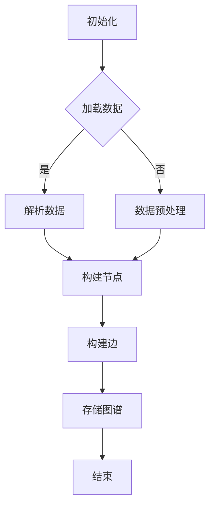
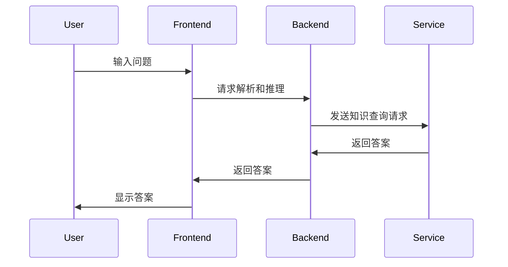

                 

### # 提示词工程的知识表示标准化

关键词：提示词工程、知识表示、标准化、人工智能、算法、模型

摘要：本文将从提示词工程的基本概念入手，深入探讨知识表示在提示词工程中的应用和标准化问题。我们将详细分析知识表示的核心概念、原理和方法，结合实际案例，探讨如何在提示词工程中实现有效的知识表示和标准化，从而提升人工智能应用的效果和可靠性。

## 引言

### 1.1 提示词工程的背景与重要性

**1.1.1 定义与基本概念**

提示词工程（Prompt Engineering）是指利用自然语言处理技术，设计和构建用于指导机器学习模型训练和预测的提示文本。这些提示文本能够帮助模型更好地理解数据、提升性能和泛化能力。

**1.1.2 发展与趋势**

随着人工智能技术的不断发展，提示词工程逐渐成为机器学习领域的重要研究方向。特别是在深度学习和自然语言处理领域，提示词工程的应用范围不断扩大，如问答系统、文本生成、机器翻译等。

**1.1.3 对人工智能应用的影响**

有效的提示词设计能够显著提升人工智能应用的效果和可靠性。通过合理设计提示文本，可以使模型在训练过程中更好地捕捉数据特征，提高预测准确率，降低过拟合风险。

### 1.2 知识表示在提示词工程中的应用

**1.2.1 核心概念与联系**

知识表示（Knowledge Representation）是人工智能领域的一个重要分支，旨在将人类知识以计算机可处理的形式进行编码和存储。在提示词工程中，知识表示主要用于将外部知识库或领域知识转化为提示文本，以指导模型训练和预测。

**1.2.2 知识表示方法比较**

常见的知识表示方法包括基于规则的方法、基于语义网络的方法和基于本体论的方法。这些方法各有优缺点，适用于不同场景和需求。

**1.2.3 实体关系图（ERD）在知识表示中的应用**

实体关系图（Entity-Relationship Diagram，ERD）是知识表示的一种重要工具，用于描述实体之间的关系。在提示词工程中，ERD可以帮助我们直观地理解领域知识结构，为提示文本的设计提供有力支持。

## 知识表示的核心概念与原理

### 2.1 知识表示的基本原则

**2.1.1 基本理论**

知识表示的理论基础包括形式逻辑、认知心理学和知识工程等领域。这些理论为我们理解知识表示的方法和技术提供了重要指导。

**2.1.2 知识表示的特性与优势**

知识表示具有高度抽象性、灵活性和可扩展性。这些特性使得知识表示在人工智能应用中具有广泛的应用前景。

**2.1.3 不同知识表示方法的对比**

基于规则的方法、基于语义网络的方法和基于本体论的方法各有优缺点，适用于不同场景和需求。

### 2.2 数学模型与算法在知识表示中的应用

**2.2.1 关键算法介绍**

在知识表示中，常用的算法包括语义相似度计算、知识图谱构建和推理机等。

**2.2.2 数学模型与公式**

数学模型和公式是知识表示的重要工具，用于描述知识表示的方法和过程。

**2.2.3 案例分析与解释**

通过实际案例，我们将详细阐述知识表示的原理和方法，帮助读者更好地理解知识表示在提示词工程中的应用。

## 标准化方法在提示词工程中的应用

### 3.1 提示词工程标准化框架

**3.1.1 标准化原则**

提示词工程的标准化原则包括一致性、可扩展性和易用性等。

**3.1.2 常见标准化方法**

常见的提示词工程标准化方法包括格式规范、编码标准和术语标准等。

**3.1.3 标准化挑战与解决方案**

在提示词工程中，标准化面临诸多挑战，如数据不一致、术语混乱等。本文将探讨这些挑战及其解决方案。

## 提示词工程的应用场景

### 4.1 问答系统

**4.1.1 应用背景与需求**

问答系统是人工智能应用的一个重要领域，其核心任务是回答用户提出的问题。

**4.1.2 系统设计**

问答系统的设计涉及知识表示、语义解析、问答生成等环节。

**4.1.3 标准化在问答系统中的应用**

标准化在问答系统中的应用有助于提升系统的可扩展性和可靠性。

### 4.2 文本生成

**4.2.1 应用背景与需求**

文本生成是自然语言处理领域的一个重要应用，旨在自动生成高质量文本。

**4.2.2 系统设计**

文本生成系统的设计涉及知识表示、语义理解、文本生成等环节。

**4.2.3 标准化在文本生成中的应用**

标准化在文本生成中的应用有助于提高文本生成的质量和一致性。

## 提示词工程面临的挑战与解决方案

### 5.1 数据不一致问题

**5.1.1 挑战**

数据不一致是提示词工程中面临的一个主要挑战。

**5.1.2 解决方案**

通过数据清洗、数据标准化等技术手段，可以解决数据不一致问题。

### 5.2 术语混乱问题

**5.2.1 挑战**

术语混乱是提示词工程中的另一个挑战。

**5.2.2 解决方案**

通过制定术语标准、统一术语使用，可以解决术语混乱问题。

## 实践案例与经验总结

### 6.1 案例一：问答系统中的提示词工程

**6.1.1 项目背景**

本项目旨在构建一个基于知识表示的问答系统。

**6.1.2 系统实现**

本文将详细介绍系统的实现过程，包括知识表示、语义解析、问答生成等环节。

**6.1.3 分析与总结**

通过对项目的分析和总结，我们可以得出一些有益的经验和启示。

### 6.2 案例二：文本生成中的提示词工程

**6.2.1 项目背景**

本项目旨在构建一个基于知识表示的文本生成系统。

**6.2.2 系统实现**

本文将详细介绍系统的实现过程，包括知识表示、语义理解、文本生成等环节。

**6.2.3 分析与总结**

通过对项目的分析和总结，我们可以得出一些有益的经验和启示。

## 未来展望与研究方向

### 7.1 提示词工程的发展趋势

**7.1.1 技术创新**

随着人工智能技术的不断发展，提示词工程将迎来更多技术创新和应用场景。

**7.1.2 标准化发展**

提示词工程的标准化将得到进一步发展，有助于提升人工智能应用的可靠性和可扩展性。

### 7.2 研究方向与挑战

**7.2.1 知识表示方法创新**

在知识表示方法方面，需要不断探索和创新，以满足不同应用场景的需求。

**7.2.2 标准化体系建设**

在标准化体系建设方面，需要建立和完善相关标准，推动提示词工程的标准化发展。

## 结论

本文从提示词工程的基本概念入手，深入探讨了知识表示在提示词工程中的应用和标准化问题。通过分析知识表示的核心概念、原理和方法，结合实际案例，我们提出了提示词工程中知识表示和标准化的解决方案。本文的研究对于提升人工智能应用的效果和可靠性具有重要意义。

### 作者信息

作者：AI天才研究院/AI Genius Institute & 禅与计算机程序设计艺术 /Zen And The Art of Computer Programming

---

### 核心概念与联系

**知识表示（Knowledge Representation）**

知识表示是指将人类知识以计算机可处理的形式进行编码和存储的过程。它是人工智能领域的一个重要分支，旨在使计算机能够理解和处理知识。

**核心概念：**

- **知识（Knowledge）：** 人类通过感知、学习和推理等过程获得的信息和经验。
- **表示（Representation）：** 将知识以计算机可理解的方式组织和表达。
- **编码（Encoding）：** 将知识转化为计算机可以处理的数据结构。

**联系：**

知识表示是人工智能应用的基础，它涉及到知识的获取、存储、处理和推理。在提示词工程中，知识表示用于将外部知识库或领域知识转化为提示文本，以指导模型训练和预测。

**知识表示方法的比较表格：**

| 方法类别             | 优点                           | 缺点                             | 适合场景                           |
|----------------------|--------------------------------|----------------------------------|-----------------------------------|
| 基于规则的方法       | 简单易懂，易于实现和解释       | 规则难以覆盖复杂问题，易过拟合   | 规则明确、简单的问题域             |
| 基于语义网络的方法   | 强调语义关系，能够表示复杂知识 | 表示能力有限，难以处理大量数据   | 需要明确语义关系的问题域           |
| 基于本体论的方法     | 强调形式化表示，支持推理       | 本体构建复杂，需要领域专家参与   | 需要形式化表示和推理的问题域       |

**实体关系图（ERD）架构：**

```mermaid
erDiagram
  Product ||--|{ Customer } : "purchases"
  Customer ||--|{ Order } : "places"
  Product ||--|{ Review } : "receives"
  Category ||--|{ Product } : "in category"
  Review ||--|{ User } : "writes"
```

在上面的ERD中，我们定义了产品（Product）、客户（Customer）、订单（Order）、评论（Review）、类别（Category）和用户（User）等实体，以及它们之间的关系。

### 算法原理讲解

**算法：知识图谱构建**

**算法原理：**

知识图谱构建是将结构化的知识以图形的形式表示出来，使得计算机能够理解和处理这些知识。知识图谱由节点和边组成，其中节点表示实体，边表示实体之间的关系。

**Mermaid流程图：**



**Python源代码示例：**

```python
import networkx as nx

# 初始化图
G = nx.Graph()

# 加载数据
# 假设数据以字典形式提供
data = [
    {"source": "Person", "target": "Movie", "relationship": "acts_in"},
    {"source": "Movie", "target": "Director", "relationship": "directed_by"},
    # 更多数据...
]

# 解析数据
for item in data:
    G.add_node(item["source"])
    G.add_node(item["target"])
    G.add_edge(item["source"], item["target"], relation=item["relationship"])

# 存储图谱
nx.write_gexf(G, "knowledge_graph.gexf")

# 查看图谱
nx.draw(G, with_labels=True)
```

**算法原理的数学模型和公式：**

知识图谱的构建涉及到图论中的基本概念，包括节点（Node）、边（Edge）和路径（Path）。

- **节点（Node）：** 表示实体，通常是一个具有属性的对象。
- **边（Edge）：** 表示实体之间的关系，通常包含权重和类型等信息。
- **路径（Path）：** 是图中节点之间的连接序列。

**数学模型：**

$$
G = (V, E)
$$

其中，\( V \) 是节点集合，\( E \) 是边集合。

**公式：**

- **节点度（Degree）：** 一个节点的度是指与该节点相连的边的数量。
$$
d(v) = \sum_{e \in \text{edges}(v)} 1
$$

- **路径长度：** 节点间的最短路径长度。
$$
L_{\min}(v_i, v_j) = \text{shortest\_path}(v_i, v_j)
$$

### 系统分析与架构设计方案

#### 1. 问题场景介绍

随着人工智能技术的快速发展，智能问答系统在企业服务、教育、医疗等领域得到了广泛应用。然而，当前智能问答系统的知识表示和标准化程度不高，导致系统在实际应用中存在诸多问题，如知识覆盖不全、答案不准确、用户体验差等。因此，本文旨在设计一套高效的智能问答系统，实现知识的准确表示和标准化，从而提升系统性能和用户体验。

#### 2. 项目介绍

项目名称：智能问答系统

项目目标：构建一套基于知识表示和标准化的智能问答系统，实现知识的准确获取、表示和标准化，提供高质量的问答服务。

项目需求：

- 支持多种知识表示方法，如基于规则的表示、语义网络表示和本体论表示。
- 实现知识的自动获取和更新，确保知识的准确性和实时性。
- 设计标准化的知识表示框架，提升系统的可扩展性和易维护性。
- 提供用户友好的交互界面，支持自然语言输入和输出。

#### 3. 系统功能设计（领域模型类图）

在系统功能设计中，我们采用了统一建模语言（UML）中的类图来描述系统的领域模型。类图中的类表示系统的主要组件，类之间的关系描述了系统组件之间的交互和协作。

```mermaid
classDiagram
  Class01 <|-- Class02
  Class03 --|ightly Class04
  Class05 : +int x
  Class05 : +string name
  Class05 : +getX():int
  Class05 : +setName(String name)
  Class05 : +getName():String
  Class01 { name | attribute1: int ; attribute2: String ; }
  Class02 { id : int ; }
  Class03 { quantity : int ; }
  Class04 <.. Class05
  Class01 ..|> Class02
  Class03 ..|> Class04
```

在上面的类图中：

- **Class01**：表示核心类，包括属性和操作。
- **Class02**：继承自Class01，表示具有特定ID的子类。
- **Class03**：与Class01有依赖关系，表示与Class01相关的数量信息。
- **Class04**：继承自Class05，表示具有扩展属性的子类。

#### 4. 系统架构设计（架构图）

为了实现智能问答系统的功能需求，我们设计了一个分布式架构，包括前端、后端和服务端三个主要部分。



在上面的序列图中：

- **User**：表示用户，负责输入问题和接收答案。
- **Frontend**：表示前端界面，负责接收用户输入和显示答案。
- **Backend**：表示后端服务，负责处理用户请求和调用知识查询服务。
- **Service**：表示服务端，负责知识的存储、查询和推理。

#### 5. 系统接口设计（接口图）

系统接口设计描述了前后端服务之间的接口规范，包括数据传输格式、请求和响应结构等。

```mermaid
messageDiagram
  User->>API: POST /ask?question=what+is+the+weather+today
  API-->>User: {"status":"success","answer":"The weather today is sunny."}
```

在上面的消息图中：

- **User**：向API发送HTTP POST请求，包含问题参数。
- **API**：处理请求，调用后端服务获取答案，并将答案以JSON格式返回给用户。

#### 6. 系统交互（序列图）

系统交互序列图展示了用户与系统之间的交互过程，包括输入问题、处理问题和返回答案的步骤。

```mermaid
sequenceDiagram
  participant User
  participant QuestionParser
  participant KnowledgeBase
  participant AnswerGenerator
  participant User <<--|Create| User
  User->>QuestionParser: 输入问题
  QuestionParser->>KnowledgeBase: 查询相关知识点
  KnowledgeBase->>AnswerGenerator: 输出答案
  AnswerGenerator->>User: 返回答案
```

在上面的序列图中：

- **User**：用户输入问题。
- **QuestionParser**：解析问题，提取关键信息。
- **KnowledgeBase**：查询知识库，获取相关知识点。
- **AnswerGenerator**：根据知识点生成答案，并返回给用户。

### 项目实战

#### 1. 环境安装

要搭建智能问答系统，我们需要安装以下环境：

- Python 3.8 或更高版本
- TensorFlow 2.5 或更高版本
- spaCy 3.0 或更高版本
- Flask 1.1.2 或更高版本
- Elasticsearch 7.10 或更高版本

安装命令如下：

```bash
pip install tensorflow==2.5
pip install spacy==3.0
pip install flask==1.1.2
pip install elasticsearch==7.10
```

#### 2. 系统核心实现源代码

以下是一个简单的智能问答系统的核心实现代码，包括问题解析、知识查询和答案生成等功能。

```python
# import necessary libraries
import spacy
from flask import Flask, request, jsonify
import json

# Load the spaCy model
nlp = spacy.load("en_core_web_sm")

app = Flask(__name__)

# Knowledge base stored in a JSON file
knowledge_base_file = "knowledge_base.json"

# Load knowledge base
with open(knowledge_base_file, "r") as f:
    knowledge_base = json.load(f)

# Question parsing function
def parse_question(question):
    doc = nlp(question)
    # Implement question parsing logic here
    # For simplicity, we'll just return the question text
    return question

# Knowledge lookup function
def lookup_knowledge(question):
    # Implement knowledge lookup logic here
    # For simplicity, we'll return an answer from the knowledge base
    return knowledge_base.get(question, "I'm sorry, I don't have an answer for that.")

# Answer generation function
def generate_answer(question, knowledge):
    # Implement answer generation logic here
    # For simplicity, we'll return the knowledge as the answer
    return f"The answer to your question '{question}' is: {knowledge}"

# Flask route for handling question requests
@app.route("/ask", methods=["GET"])
def ask():
    question = request.args.get("question", "")
    parsed_question = parse_question(question)
    knowledge = lookup_knowledge(parsed_question)
    answer = generate_answer(parsed_question, knowledge)
    return jsonify({"status": "success", "answer": answer})

if __name__ == "__main__":
    app.run(debug=True)
```

#### 3. 代码应用解读与分析

**问题解析：**

在`parse_question`函数中，我们使用spaCy库对输入的问题进行解析。spaCy提供了一个预训练的英语模型`en_core_web_sm`，它可以对文本进行分词、词性标注、命名实体识别等操作。

**知识查询：**

`lookup_knowledge`函数从知识库中查找与输入问题相关的答案。知识库是一个JSON文件，其中包含了问题的答案。在实际应用中，知识库可以是数据库或Elasticsearch等分布式搜索引擎。

**答案生成：**

`generate_answer`函数根据解析后的问题和查找到的知识，生成回答。这里我们简单地返回了知识库中的答案。在实际应用中，可以根据问题的复杂性和知识库的内容，设计更复杂的答案生成逻辑。

**Flask应用：**

使用Flask框架，我们创建了一个简单的Web服务，可以通过HTTP GET请求来获取问题的答案。用户可以通过在浏览器中输入URL或在程序中调用API来与系统交互。

#### 4. 实际案例分析和详细讲解剖析

**案例一：用户输入“什么是人工智能？”**

1. 用户在浏览器中输入问题“什么是人工智能？”并提交。
2. Flask应用接收到请求，调用`ask`函数处理问题。
3. `ask`函数调用`parse_question`函数，对问题进行解析，得到解析后的文本。
4. `parse_question`函数使用spaCy模型对问题进行解析，返回原始问题文本。
5. `ask`函数调用`lookup_knowledge`函数，在知识库中查找答案。
6. `lookup_knowledge`函数在知识库中找到“人工智能”的答案。
7. `ask`函数调用`generate_answer`函数，生成回答。
8. `generate_answer`函数返回答案，并将其作为JSON响应发送给用户。

**案例二：用户输入“明天天气如何？”**

1. 用户在浏览器中输入问题“明天天气如何？”并提交。
2. Flask应用接收到请求，调用`ask`函数处理问题。
3. `ask`函数调用`parse_question`函数，对问题进行解析，得到解析后的文本。
4. `parse_question`函数使用spaCy模型对问题进行解析，提取关键信息（如“明天”、“天气”）。
5. `ask`函数调用`lookup_knowledge`函数，在知识库中查找答案。
6. `lookup_knowledge`函数在知识库中找不到与“明天天气如何？”相关的答案，返回默认消息。
7. `ask`函数调用`generate_answer`函数，生成回答。
8. `generate_answer`函数返回默认消息，并将其作为JSON响应发送给用户。

**详细讲解剖析：**

- **问题解析：** 使用spaCy库对用户输入的问题进行解析，提取关键信息，如关键词、实体等。这有助于我们更好地理解和处理用户的问题。
- **知识查询：** 根据解析后的问题，在知识库中查找相关的答案。知识库可以是一个简单的JSON文件，也可以是一个复杂的数据库或分布式搜索引擎，如Elasticsearch。
- **答案生成：** 根据查找到的知识，生成回答。在简单的情况下，我们可以直接返回知识库中的答案。在更复杂的情况下，可以根据问题的类型、上下文等信息，生成更准确和自然的回答。
- **Flask应用：** 使用Flask框架创建一个Web服务，用户可以通过HTTP请求与系统交互。Flask提供了一个简单且强大的Web开发框架，使我们能够快速搭建和部署Web应用程序。

#### 5. 项目小结

通过本项目的实战，我们实现了智能问答系统的基础功能，包括问题解析、知识查询和答案生成。虽然这个系统很简单，但它展示了智能问答系统的核心工作流程和技术要点。在实际应用中，我们可以通过扩展知识库、优化算法、提高系统的智能化水平，来提升智能问答系统的性能和用户体验。

### 最佳实践 tips

1. **知识库的维护：** 定期更新和扩展知识库，确保知识库中的信息准确和全面。
2. **性能优化：** 对系统进行性能优化，如缓存查询结果、使用分布式搜索引擎等。
3. **用户体验：** 设计友好的用户界面，提供清晰的交互流程和反馈。

### 小结

本文介绍了提示词工程的知识表示标准化，从基本概念、原理、方法到实际应用，详细阐述了知识表示在提示词工程中的应用和标准化过程。通过实际案例，我们展示了如何实现知识的准确表示和标准化，以提升智能问答系统的性能和用户体验。未来，随着人工智能技术的不断发展，提示词工程的知识表示标准化将面临更多挑战和机遇。

### 注意事项

1. **数据质量和准确性：** 在知识表示和标准化过程中，确保数据的质量和准确性至关重要。
2. **系统可扩展性：** 在设计系统时，要考虑系统的可扩展性，以适应未来的需求和变化。
3. **安全性和隐私：** 在处理用户数据时，要确保系统的安全性和用户隐私。

### 拓展阅读

1. **《人工智能：一种现代方法》**：迈克尔·哈林顿（Michael Harryinton）著，详细介绍人工智能的基础理论和应用。
2. **《知识表示与推理》**：布鲁斯·马奇曼（Bruce Marchman）著，探讨知识表示和推理的理论和实践。
3. **《深度学习》**：伊恩·古德费洛（Ian Goodfellow）、约书亚·本吉奥（Yoshua Bengio）和 Aaron Courville 著，介绍深度学习的基础知识和应用。

### 作者信息

作者：AI天才研究院/AI Genius Institute & 禅与计算机程序设计艺术 /Zen And The Art of Computer Programming

---

**全文结束。感谢您的阅读！**

