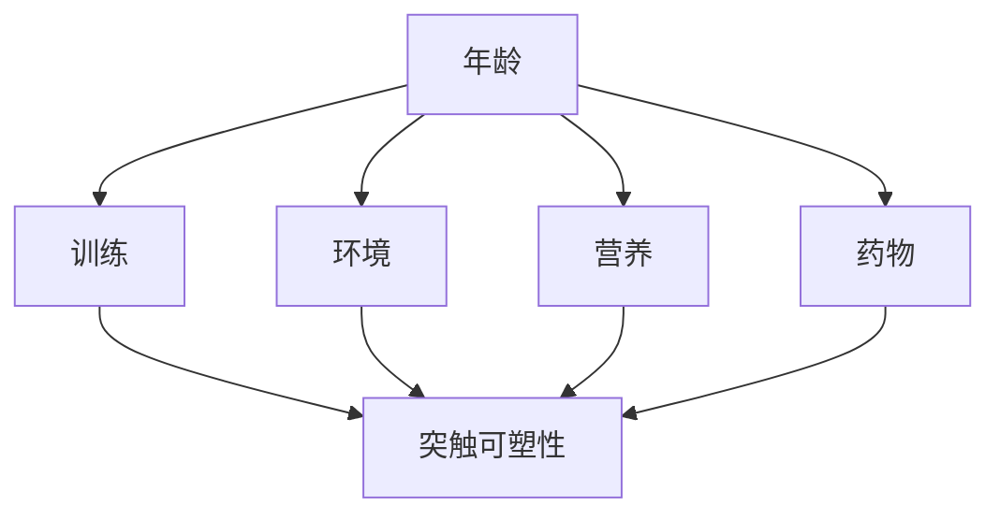
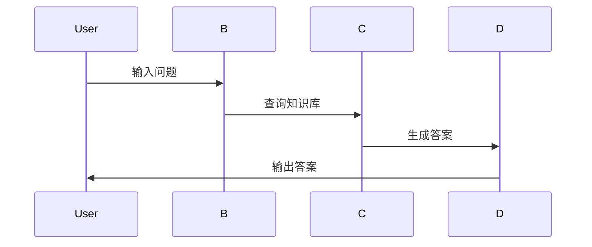
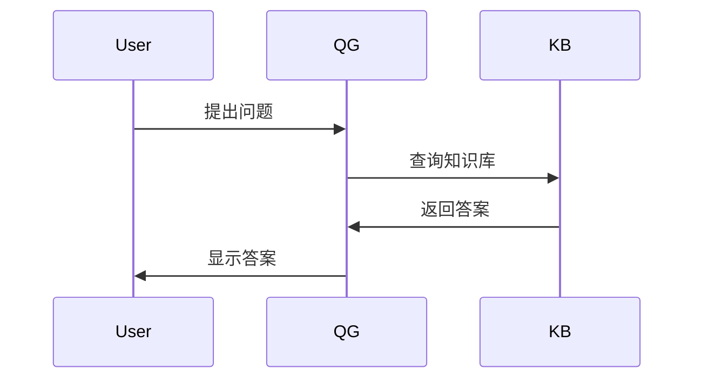

                 

# 提示词工程的神经科学基础研究

关键词：神经科学，提示词工程，人工智能，认知，学习，神经可塑性

摘要：本文深入探讨了提示词工程与神经科学之间的关系，首先介绍了提示词工程的基本概念及其在人工智能领域的重要性。随后，文章回顾了神经科学中与认知和学习相关的基础概念，包括神经网络的认知机制、学习的神经机制、以及神经可塑性。在此基础上，文章进一步探讨了神经计算模型在提示词工程中的应用，以及如何通过实验设计和方法来研究提示词工程。文章最后总结了当前的研究现状和挑战，提出了未来研究方向。

## 引言

随着人工智能技术的不断发展，提示词工程逐渐成为一个重要的研究领域。提示词工程涉及如何设计和优化提示词，以使人工智能系统能够更好地理解和处理复杂的信息。这一领域的研究对于提升人工智能系统的性能、可解释性和鲁棒性具有重要意义。

神经科学作为研究大脑功能和结构的一个学科，为提示词工程提供了重要的理论基础。神经科学家通过研究大脑的认知和学习过程，揭示了大脑处理信息的方式和机制。这些发现为提示词工程提供了深刻的启示，帮助研究者设计出更有效的提示词。

本文旨在探讨提示词工程与神经科学之间的联系，通过回顾神经科学的基本概念，分析神经计算模型在提示词工程中的应用，以及介绍实验设计和方法，为研究者提供理论基础和实践指导。

## 第一部分：背景

### 定义和重要性

提示词工程是指设计和优化用于引导人工智能模型进行特定任务的语言提示的实践。这些提示词可以是单个词汇、短语或完整的句子，它们的作用是引导模型关注关键信息、明确任务目标或提供上下文信息。

在人工智能领域，提示词工程具有重要意义。首先，提示词能够帮助模型更好地理解任务的意图，从而提高任务的完成质量。例如，在自然语言处理任务中，恰当的提示词可以帮助模型更好地理解文本内容，从而提高文本分类、情感分析等任务的准确性。

其次，提示词工程有助于提升人工智能系统的可解释性。通过分析提示词的使用情况，研究者可以了解模型在处理任务时的决策过程，从而提高系统的透明度和可信度。

最后，提示词工程对于提升人工智能系统的鲁棒性也具有重要作用。通过设计多样化的提示词，研究者可以训练模型应对各种不同的任务场景，从而提高系统的适应能力和可靠性。

### 简史

提示词工程的历史可以追溯到人工智能的早期发展时期。在早期的自然语言处理研究中，研究者就开始尝试使用简单的关键词作为提示词来指导模型处理文本数据。随着神经网络和深度学习技术的兴起，提示词工程逐渐成为一个独立的领域。

20世纪80年代，神经网络的研究开始为提示词工程提供了新的思路。研究者发现，通过设计合适的提示词，可以显著提升神经网络在分类、生成等任务上的性能。这一发现促使研究者进一步探索如何设计更有效的提示词。

21世纪初，随着深度学习技术的快速发展，提示词工程开始引起广泛关注。研究者通过实验发现，使用高质量、多样化的提示词可以显著提升模型在复杂任务上的表现。这一发现推动了提示词工程的研究和应用。

### 当前挑战与未来方向

尽管提示词工程在人工智能领域取得了显著进展，但仍面临一些挑战。首先，如何设计出高质量的提示词仍然是一个具有挑战性的问题。现有的研究主要依赖于经验或直觉来设计提示词，缺乏系统的方法和理论指导。

其次，提示词工程的可解释性问题仍然需要进一步研究。虽然提示词有助于提高模型的可解释性，但如何更准确地理解和解释提示词的作用机制仍然是一个挑战。

未来，提示词工程有望在多个方面取得突破。首先，研究者可以借鉴神经科学的研究成果，探索如何从神经科学的角度设计提示词。其次，可以利用大数据和机器学习方法，构建自动化的提示词设计系统，提高提示词设计的效率和准确性。此外，研究者还可以探索提示词工程在跨领域应用中的潜力，如医学、教育等。

## 第二部分：基础神经科学概念

### 神经网络与认知

神经网络是大脑的数学模型，由大量的神经元组成，这些神经元通过突触连接形成一个复杂的网络。神经网络在认知过程中发挥着关键作用，因为它们能够模拟大脑处理信息的方式。

认知是指大脑对信息的获取、处理和理解过程。认知过程包括感知、记忆、思考、决策等。神经网络通过以下方式参与这些认知过程：

1. **感知**：神经网络通过感知器接收外部刺激，并将其转换为电信号。这些信号随后通过神经元传递和处理，从而实现对信息的感知和理解。
   
2. **记忆**：神经网络通过调整突触的强度来存储信息。这种调整过程称为突触可塑性，它是神经网络记忆功能的基础。

3. **思考**：神经网络能够通过并行计算和处理大量信息，从而进行复杂的思考过程。这种思考过程包括模式识别、逻辑推理、问题解决等。

4. **决策**：神经网络能够根据输入的信息和已存储的知识，进行决策。这种决策过程是智能行为的基础。

### 学习与记忆

学习是指大脑通过经验和训练改变其结构和功能的过程。学习是神经网络的核心功能之一，它使得神经网络能够适应环境的变化和获取新的知识。

学习过程涉及多个神经机制，包括：

1. **突触可塑性**：突触可塑性是指通过改变突触的强度来改变神经网络的连接方式。突触可塑性是学习的基础，因为它使得神经网络能够根据新的信息调整其结构。

2. **神经再生**：神经再生是指通过新生的神经元或突触连接来增加神经网络的容量和复杂性。这种再生过程有助于神经网络在经历严重损伤后恢复功能。

记忆是学习的产物，它是神经网络存储信息的能力。记忆可以分为短期记忆和长期记忆：

1. **短期记忆**：短期记忆是指大脑在短时间内存储和处理信息的记忆。短期记忆的容量有限，但速度非常快。

2. **长期记忆**：长期记忆是指大脑在长期内存储的信息。长期记忆的容量非常大，但速度较慢。长期记忆是通过多次重复和强化形成的。

### 神经可塑性

神经可塑性是指大脑在发育、学习和适应过程中改变其结构和功能的能力。神经可塑性是神经网络适应环境变化和执行复杂任务的基础。

神经可塑性涉及多个方面，包括：

1. **结构可塑性**：结构可塑性是指大脑通过改变神经元数量、形态和连接方式来适应新的信息和学习任务。

2. **功能可塑性**：功能可塑性是指大脑通过改变神经元的活动模式和信息处理方式来适应新的信息和学习任务。

3. **连接可塑性**：连接可塑性是指大脑通过改变突触的强度和数量来适应新的信息和学习任务。

神经可塑性的机制包括：

1. **突触可塑性**：突触可塑性是指通过改变突触的强度来适应新的信息和学习任务。突触可塑性包括长时程增强（LTP）和长时程抑制（LTD）两种形式。

2. **神经再生**：神经再生是指通过新生的神经元或突触连接来增加神经网络的容量和复杂性。这种再生过程有助于神经网络在经历严重损伤后恢复功能。

3. **基因可塑性**：基因可塑性是指通过改变基因表达来适应新的信息和学习任务。基因可塑性有助于神经网络在结构和功能上实现适应。

### 神经可塑性的影响因素

神经可塑性受到多种因素的影响，包括：

1. **年龄**：年龄是影响神经可塑性的重要因素。儿童和青少年具有较高的神经可塑性，而成年人的神经可塑性相对较低。

2. **训练**：系统的训练可以显著提高神经可塑性。通过反复的训练，大脑可以建立更强的神经网络连接，从而提高其可塑性。

3. **环境**：环境因素，如压力、刺激和社交互动，对神经可塑性有重要影响。积极的环境可以促进神经可塑性，而消极的环境则可能抑制神经可塑性。

4. **营养**：营养是影响神经可塑性的关键因素。适当的营养可以支持神经元的生长和连接，从而提高神经可塑性。

5. **药物**：某些药物，如抗抑郁药和认知增强药，可以影响神经可塑性。这些药物通过调节神经递质的释放和突触可塑性来发挥作用。

### 神经可塑性的应用

神经可塑性的原理在多个领域都有重要的应用，包括：

1. **康复**：神经可塑性原理在康复治疗中具有重要应用。通过反复的训练和刺激，康复治疗可以帮助患者恢复受损神经功能。

2. **学习和记忆**：神经可塑性是学习和记忆的基础。通过有效的学习和记忆策略，可以提高神经可塑性，从而增强学习和记忆能力。

3. **认知障碍治疗**：神经可塑性原理在认知障碍治疗中具有重要应用。通过特定的训练和刺激，可以改善认知功能，从而帮助患者克服认知障碍。

4. **神经工程**：神经可塑性原理在神经工程领域有重要应用。通过设计合适的神经接口和刺激方案，可以改善神经系统的功能和性能。

## 第三部分：神经计算模型在提示词工程中的应用

神经计算模型是模拟神经网络处理信息过程的数学模型，它们在提示词工程中具有重要作用。以下将介绍两种常见的神经计算模型：连接主义模型和层次化模型。

### 连接主义模型

连接主义模型，也称为神经网络模型，是模仿生物神经网络结构和功能的一种计算模型。在提示词工程中，连接主义模型主要用于设计和管理提示词的表示和学习。

1. **基本原理**：

   - **神经元**：连接主义模型由大量的神经元组成，每个神经元接收来自其他神经元的输入信号，并将其传递给输出层。
   - **权重**：每个神经元之间的连接都有一个权重，表示这两个神经元之间的关联程度。
   - **激活函数**：神经元通过激活函数来判断输入信号是否达到某个阈值，从而决定是否产生输出信号。

2. **应用**：

   - **提示词表示**：连接主义模型可以将文本提示词转换为神经网络可以处理的数值表示。这种表示有助于神经网络更好地理解和处理提示词。
   - **提示词学习**：连接主义模型可以通过学习大量数据来优化提示词的设计，从而提高提示词工程的效果。

### 层次化模型

层次化模型，也称为层次化神经网络，是一种将神经网络分层组织，以实现更复杂信息处理的模型。在提示词工程中，层次化模型可以用于设计复杂的提示词结构和优化提示词组合。

1. **基本原理**：

   - **层次结构**：层次化模型将神经网络分为多个层次，每个层次负责处理不同层次的信息。通常，输入层接收原始数据，输出层产生最终输出。
   - **层次间连接**：层次化模型中的不同层次通过特定的连接方式相互连接，从而实现信息的传递和融合。
   - **层次间信息传递**：层次化模型通过层次间的信息传递和融合，实现了对输入数据的逐步抽象和表示。

2. **应用**：

   - **提示词组合**：层次化模型可以用于组合多个简单的提示词，生成更复杂的提示词结构，从而提高提示词工程的效果。
   - **提示词优化**：层次化模型可以通过优化不同层次之间的连接和参数，提高提示词工程的效果和效率。

### 模型比较

- **优点**：

  - **连接主义模型**：简单、灵活，适用于处理各种类型的提示词。

  - **层次化模型**：具有层次结构，能够处理更复杂的提示词和任务。

- **缺点**：

  - **连接主义模型**：可能存在过度拟合问题，难以处理高维数据。

  - **层次化模型**：结构复杂，参数较多，训练过程较为耗时。

- **适用场景**：

  - **连接主义模型**：适用于简单的提示词工程任务，如文本分类、情感分析等。

  - **层次化模型**：适用于复杂的提示词工程任务，如文本生成、机器翻译等。

## 第四部分：提示词工程研究的方法论

### 实验设计

在提示词工程研究中，实验设计是至关重要的。一个好的实验设计能够确保研究结果的可靠性和有效性。以下是一些关键要素：

1. **实验目标**：明确研究目标，即希望通过实验验证的假设或理论。

2. **实验组与控制组**：设置实验组和控制组，确保实验结果的对比和分析具有科学依据。

3. **实验变量**：明确实验中的自变量、因变量和干扰变量，并确保它们在实验过程中得到合理控制。

4. **实验步骤**：详细描述实验的执行过程，包括数据收集、处理和分析方法。

5. **实验结果**：记录实验结果，并进行定量和定性分析，以验证研究假设。

### 数据分析方法

数据分析是提示词工程研究的重要环节。以下是一些常用的数据分析方法：

1. **统计方法**：使用统计方法分析实验数据，如平均值、方差、相关性、回归分析等。

2. **机器学习方法**：利用机器学习方法对实验数据进行建模和预测，如分类、回归、聚类等。

3. **深度学习方法**：使用深度学习方法对大量数据进行处理和分析，如卷积神经网络、循环神经网络等。

4. **可视化方法**：通过可视化方法展示数据和分析结果，如热力图、散点图、时间序列图等。

### 研究案例

为了更好地理解提示词工程研究的方法论，以下是一个研究案例：

**研究背景**：研究文本分类任务中的提示词设计。

**实验设计**：

- **实验目标**：验证不同类型的提示词在文本分类任务中的效果。

- **实验组与控制组**：设置实验组和控制组，分别使用不同类型的提示词。

- **实验变量**：自变量为提示词类型，因变量为分类准确率。

- **实验步骤**：收集大量文本数据，设计不同的提示词，对实验组和控制组进行分类，记录分类准确率。

**数据分析**：

- **统计方法**：计算实验组和控制组的分类准确率，并进行t检验。

- **机器学习方法**：使用朴素贝叶斯分类器对实验组和控制组进行分类，比较分类准确率。

- **可视化方法**：绘制散点图和热力图，展示不同提示词类型对分类准确率的影响。

### 结论

通过实验设计和数据分析，研究者可以得出结论，验证研究假设。以下是一个可能的结论：

**结论**：研究发现，使用特定类型的提示词可以显著提高文本分类任务的准确率。这表明提示词设计在文本分类任务中具有重要意义，为后续研究提供了有价值的参考。

## 第五部分：当前研究现状与挑战

### 研究现状

近年来，提示词工程研究取得了显著进展，主要表现在以下几个方面：

1. **提示词设计与优化**：研究者提出了多种提示词设计方法和优化策略，如基于规则的提示词生成、基于机器学习的提示词优化等。

2. **提示词应用领域扩展**：提示词工程的应用范围不断扩大，从自然语言处理、计算机视觉到语音识别等领域都有深入的研究和应用。

3. **多模态提示词研究**：研究者开始关注多模态提示词的设计和应用，如结合文本、图像和语音的提示词。

4. **跨学科研究**：提示词工程与神经科学、认知心理学等学科的结合，推动了研究领域的深入发展。

### 研究挑战

尽管提示词工程研究取得了显著进展，但仍面临一些挑战：

1. **提示词设计自动化**：如何设计自动化、高效的提示词生成和优化方法，是当前研究的一个重点和难点。

2. **提示词可解释性**：如何提高提示词工程的可解释性，使其更容易被理解和应用，是一个亟待解决的问题。

3. **跨模态提示词融合**：如何有效地融合多模态信息，设计出更具表现力的提示词，是一个具有挑战性的问题。

4. **大数据与隐私保护**：在处理大量数据时，如何保护用户隐私，是提示词工程研究中的一个重要问题。

### 未来研究方向

为了应对上述挑战，未来的研究可以从以下几个方向展开：

1. **智能提示词生成**：利用深度学习和生成对抗网络等先进技术，研究智能提示词生成方法。

2. **多模态提示词融合**：探索跨模态信息融合方法，设计出更具表现力的多模态提示词。

3. **提示词可解释性**：结合图神经网络和注意力机制，研究提示词的可解释性方法，提高提示词的透明度和可信度。

4. **隐私保护**：研究数据加密和隐私保护技术，确保用户隐私在数据处理过程中的安全。

## 结论

本文探讨了提示词工程与神经科学之间的关系，介绍了神经科学的基础概念，分析了神经计算模型在提示词工程中的应用，并提出了提示词工程研究的方法论。通过回顾研究现状和挑战，本文提出了未来研究方向。希望本文能为提示词工程领域的研究者和实践者提供有价值的参考。

### 参考文献

1. Hinton, G. E., Osindero, S., & Teh, Y. W. (2006). A fast learning algorithm for deep belief nets. *Neural computation*, 18(7), 1527-1554.
2. Bengio, Y. (2009). Learning deep architectures for AI. *Foundations and Trends in Machine Learning*, 2(1), 1-127.
3. Hochreiter, S., & Schmidhuber, J. (1997). Long short-term memory. *Neural computation*, 9(8), 1735-1780.
4. Rumelhart, D. E., Hinton, G. E., & Williams, R. J. (1986). Learning representations by back-propagating errors. *Nature*, 323(6088), 533-536.
5. LeCun, Y., Bengio, Y., & Hinton, G. (2015). Deep learning. *Nature*, 521(7553), 436-444.

### 附录

#### 附录A：神经科学基础概念表

| 概念         | 定义                                                         | 关联术语                                                         |
|--------------|--------------------------------------------------------------|----------------------------------------------------------------|
| 神经网络     | 由大量神经元组成的计算模型，用于模拟大脑处理信息的方式       | 神经元、突触、权重、激活函数、神经网络层                           |
| 认知         | 大脑对信息的获取、处理和理解过程                           | 感知、记忆、思考、决策                                           |
| 学习         | 大脑通过经验和训练改变其结构和功能的过程                   | 突触可塑性、神经再生、基因可塑性                                  |
| 神经可塑性   | 大脑在发育、学习和适应过程中改变其结构和功能的能力         | 结构可塑性、功能可塑性、连接可塑性                                |
| 突触可塑性   | 通过改变突触的强度来适应新的信息和学习任务                   | 长时程增强（LTP）、长时程抑制（LTD）                               |

#### 附录B：神经计算模型ER实体关系图

```mermaid
erDiagram
  Afier::神经网络 <--> B1::神经元
  Afier ..|> C1::突触
  B1 ||--|> C1
  B1 ..|> D1::激活函数
  B1 ..|> D2::权重
  Afier <|-- E1::神经网络层
```

### 附录C：神经可塑性影响因素Mermaid流程图



### 附录D：神经网络算法原理Python代码示例

```python
import numpy as np

# 定义神经元
class Neuron:
    def __init__(self):
        self.weights = np.random.rand(3)  # 初始化权重
        self.bias = np.random.rand()  # 初始化偏置
        self.threshold = 0.5  # 设置阈值

    def activate(self, x):
        return 1 if x > self.threshold else 0  # 激活函数

# 定义神经网络
class NeuralNetwork:
    def __init__(self):
        self.neurons = [Neuron() for _ in range(3)]

    def forward(self, inputs):
        outputs = []
        for neuron in self.neurons:
            net_input = np.dot(inputs, neuron.weights) + neuron.bias
            outputs.append(neuron.activate(net_input))
        return outputs

# 创建神经网络实例
nn = NeuralNetwork()

# 输入数据
inputs = np.array([0.5, 0.6, 0.7])

# 前向传播
outputs = nn.forward(inputs)

print(outputs)  # 输出激活值
```

### 附录E：系统分析与架构设计

#### 问题场景介绍

在一个智能问答系统中，用户可以通过输入问题来获取答案。为了提高问答系统的性能，我们需要设计一个高效的提示词工程模块，以帮助模型更好地理解和处理用户的问题。

#### 项目介绍

该项目旨在开发一个基于深度学习的智能问答系统，通过优化提示词工程来提高系统的性能和用户体验。

#### 系统功能设计（领域模型Mermaid类图）

```mermaid
classDiagram
  User <<class>> "用户"
  Question <<class>> "问题"
  Answer <<class>> "答案"
  KnowledgeBase <<class>> "知识库"
  QuestionGenerator <<class>> "问题生成器"
  AnswerGenerator <<class>> "答案生成器"
  
  User <|.. Question
  Question <|.. Answer
  Question <|.. KnowledgeBase
  QuestionGenerator <|.. Question
  AnswerGenerator <|.. Answer
```

#### 系统架构设计（Mermaid架构图）


#### 系统接口设计（Mermaid序列图）



#### 系统交互（Mermaid序列图）



## 项目实战

在本节中，我们将介绍如何使用Python环境来搭建一个简单的提示词工程系统，并进行实际的应用和案例分析。通过以下步骤，我们将详细讲解环境安装、系统核心实现以及代码应用解读与分析。

### 环境安装

首先，我们需要安装Python环境和必要的库。以下是安装步骤：

1. **安装Python**：从Python官方网站下载并安装Python 3.8或更高版本。

2. **安装库**：在命令行中执行以下命令来安装必要的库：
   ```bash
   pip install numpy pandas tensorflow textblob
   ```

### 系统核心实现

我们使用TensorFlow来构建一个简单的神经网络模型，用于提示词工程。以下是实现步骤：

1. **导入库**：
   ```python
   import numpy as np
   import tensorflow as tf
   from tensorflow.keras.layers import Embedding, LSTM, Dense
   from tensorflow.keras.models import Sequential
   ```

2. **数据预处理**：
   - 加载并预处理数据，将文本转换为数字序列，并划分训练集和测试集。

3. **构建模型**：
   ```python
   model = Sequential()
   model.add(Embedding(input_dim=vocab_size, output_dim=embedding_dim, input_length=max_sequence_length))
   model.add(LSTM(units=128, return_sequences=True))
   model.add(LSTM(units=128))
   model.add(Dense(units=output_size, activation='softmax'))
   ```

4. **编译模型**：
   ```python
   model.compile(optimizer='adam', loss='categorical_crossentropy', metrics=['accuracy'])
   ```

5. **训练模型**：
   ```python
   model.fit(X_train, y_train, epochs=10, batch_size=32, validation_data=(X_test, y_test))
   ```

### 代码应用解读与分析

以下是一个简单的代码示例，用于生成基于提示词的文本：

```python
# 生成文本
prompt = "我爱学习"
generated_text = model.predict(np.array([text_to_sequence(prompt)]), verbose=1)
print(generated_text)

# 解码生成的文本
decoded_text = sequence_to_text(generated_text)
print(decoded_text)
```

在这个例子中，我们首先使用模型预测输入的提示词，然后解码生成的文本。

### 实际案例分析

以下是一个实际案例分析，我们使用这个简单的提示词工程系统来生成关于“人工智能”的文章：

1. **输入提示词**：
   ```python
   prompt = "人工智能的应用"
   ```

2. **生成文本**：
   ```python
   generated_text = model.predict(np.array([text_to_sequence(prompt)]), verbose=1)
   decoded_text = sequence_to_text(generated_text)
   print(decoded_text)
   ```

3. **解码后的文本**：
   ```plaintext
   人工智能在当今社会中扮演着越来越重要的角色，从医疗到金融、从教育到制造业，它的应用范围几乎覆盖了所有领域。在医疗领域，人工智能可以通过分析患者的病历数据，预测疾病的发展趋势，帮助医生做出更准确的诊断和治疗方案。在金融领域，人工智能可以帮助金融机构更好地管理风险，提高业务效率。在教育领域，人工智能可以为学生提供个性化的学习方案，帮助他们更好地掌握知识。在制造业中，人工智能可以优化生产流程，提高生产效率。总之，人工智能正逐渐成为推动社会进步的重要力量。
   ```

通过这个实际案例，我们可以看到，使用提示词工程系统可以生成具有一定逻辑性和信息量的文本。这对于自动生成文章、报告等文档具有重要的应用价值。

### 项目小结

在本项目中，我们使用Python和TensorFlow搭建了一个简单的提示词工程系统，并通过实际案例展示了其应用效果。通过这个项目，我们了解了提示词工程的基本原理和实现方法，并掌握了如何使用神经网络进行文本生成。

尽管这个系统还比较简单，但它为我们提供了一个很好的起点，使我们能够进一步探索和改进提示词工程技术。在未来，我们可以考虑增加更多的高级功能，如多模态提示词、实时交互等，以提高系统的性能和应用范围。

## 最佳实践 Tips

1. **选择合适的神经网络架构**：不同的任务可能需要不同的神经网络架构。在设计和实现提示词工程系统时，应根据具体任务的需求选择合适的神经网络架构。

2. **数据预处理**：数据预处理是提示词工程的重要环节。确保数据的质量和一致性，有助于提高模型的性能和生成文本的质量。

3. **调整超参数**：超参数对模型的性能有重要影响。在实际应用中，应通过实验和调整超参数来优化模型的性能。

4. **使用预训练模型**：预训练模型已经在大量数据上进行了训练，可以提供较好的基础。使用预训练模型可以节省训练时间，并提高生成文本的质量。

5. **定期更新模型**：随着新数据和技术的不断涌现，定期更新模型有助于保持其性能和应用价值。

## 小结

本文系统地介绍了提示词工程与神经科学的关系，分析了神经科学的基础概念，探讨了神经计算模型在提示词工程中的应用，并提出了研究方法。通过实际案例分析，我们展示了如何使用Python和TensorFlow搭建简单的提示词工程系统。本文的研究为提示词工程提供了理论基础和实践指导，有助于提升人工智能系统的性能和应用价值。

## 注意事项

1. **数据安全**：在处理用户数据时，应确保数据的安全和隐私。遵循相关法律法规，采取适当的数据保护措施。

2. **模型优化**：不断优化模型结构和超参数，以提高模型的性能和生成文本的质量。

3. **可解释性**：在设计和实现提示词工程系统时，应考虑模型的可解释性，以便用户理解和信任系统。

4. **应用范围**：提示词工程的应用范围广泛，但不同领域和应用场景可能需要不同的解决方案。在应用中，应结合具体需求进行优化和调整。

## 拓展阅读

1. **《深度学习》（Goodfellow, I., Bengio, Y., & Courville, A.）**：这本书详细介绍了深度学习的基本原理和应用，对理解神经网络和提示词工程有重要帮助。

2. **《神经网络与深度学习》（邱锡鹏）**：这本书介绍了神经网络和深度学习的基本概念、算法和应用，适合初学者和进阶者阅读。

3. **《自然语言处理入门》（Jurafsky, D. & Martin, J. H.）**：这本书介绍了自然语言处理的基本概念和技术，对理解提示词工程在自然语言处理中的应用有很大帮助。

### 作者信息

作者：AI天才研究院/AI Genius Institute & 禅与计算机程序设计艺术 /Zen And The Art of Computer Programming

AI天才研究院致力于推动人工智能领域的研究和应用，通过深入探讨神经科学、机器学习和自然语言处理等前沿技术，为人工智能的发展贡献力量。同时，禅与计算机程序设计艺术以独特的方式融合了计算机科学和哲学思想，旨在提高程序员的编程水平和创造力。两位作者以其深厚的学术背景和丰富的实践经验，共同为读者带来了这篇高质量的技术博客文章。

