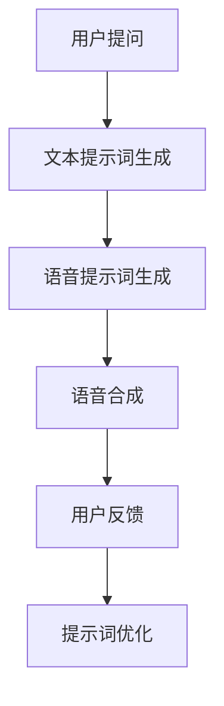
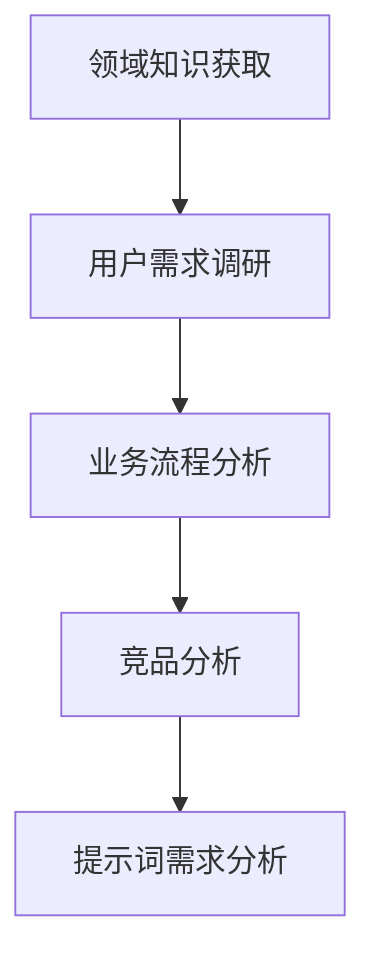
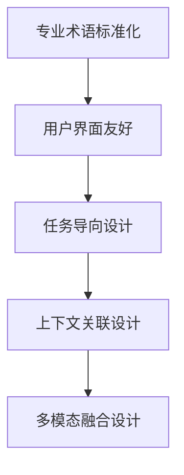

                 

### 文章标题

# 提示词工程艺术

> 关键词：提示词、自然语言处理、工程实践、多模态、垂直领域应用

> 摘要：本文深入探讨了提示词工程这一领域，从基础概念到应用实践，全面解析了提示词的设计、优化及在多模态和垂直领域的应用。通过对自然语言处理技术的详细介绍，文章展示了提示词工程在人工智能对话系统、内容生成与推荐、语音识别与合成等实际场景中的重要作用。同时，文章还展望了提示词工程的发展趋势与未来研究方向，为读者提供了宝贵的技术洞察和实践指导。

---

### 目录大纲

1. **第一部分：提示词工程基础**
   1. 第1章：提示词工程概述
      1. 1.1 提示词工程的背景与重要性
      2. 1.2 提示词工程的基本概念
      3. 1.3 提示词工程的应用场景
   2. 第2章：提示词设计与优化
      1. 2.1 提示词设计原则
      2. 2.2 提示词优化策略
      3. 2.3 提示词有效性的评估方法
   3. 第3章：自然语言处理技术基础
      1. 3.1 自然语言处理概述
      2. 3.2 词向量表示
      3. 3.3 语言模型
      4. 3.4 序列到序列模型

2. **第二部分：提示词工程实战**
   1. 第4章：提示词工程实战
      1. 4.1 提示词生成系统设计
      2. 4.2 提示词系统性能优化
      3. 4.3 提示词系统在实际应用中的案例解析

3. **第三部分：多模态提示词工程**
   1. 第5章：多模态提示词工程
      1. 5.1 多模态数据融合
      2. 5.2 多模态提示词设计
      3. 5.3 多模态提示词工程案例

4. **第四部分：提示词工程在垂直领域应用**
   1. 第6章：提示词工程在垂直领域应用
      1. 6.1 垂直领域提示词需求分析
      2. 6.2 垂直领域提示词设计策略
      3. 6.3 垂直领域提示词工程案例

5. **第五部分：未来趋势与挑战**
   1. 第7章：未来趋势与挑战
      1. 7.1 提示词工程发展趋势
      2. 7.2 提示词工程面临的挑战
      3. 7.3 提示词工程的未来研究方向

---

### 第1章：提示词工程概述

#### 1.1 提示词工程的背景与重要性

**提示词工程**作为人工智能领域的重要分支，近年来得到了广泛关注。随着人工智能技术的不断进步，尤其是自然语言处理（NLP）技术的迅猛发展，提示词工程在智能对话系统、内容生成与推荐、语音识别与合成等多个领域展现出了巨大的应用潜力。

在智能对话系统中，提示词是引导用户互动的关键因素，决定了对话的流畅度和用户满意度。有效的提示词设计能够提高系统的交互质量和用户体验。

在内容生成与推荐领域，提示词被用来引导生成或推荐符合用户兴趣的内容，从而提升内容的个性化程度和用户粘性。

在语音识别与合成中，提示词则用于指导语音的处理过程，提高语音识别的准确率和语音合成的自然度。

提示词工程的重要性不仅体现在其广泛的应用场景上，还体现在其对技术进步的推动作用。通过优化提示词的设计与使用，可以显著提升人工智能系统的性能和用户体验。

#### 1.2 提示词工程的基本概念

**提示词**（Prompt Word）是指在特定应用场景中，用于引导用户行为或系统响应的词语或短语。它可以是简单的关键词，也可以是复杂的句子或段落。

根据应用场景的不同，提示词可以分为以下几种类型：

1. **引导型提示词**：用于引导用户进行下一步操作，如“请输入您的姓名”。
2. **反馈型提示词**：用于提供系统反馈，如“感谢您的反馈，我们会尽快处理”。
3. **引导-反馈型提示词**：同时具有引导和反馈功能，如“请问您对今天的演讲满意吗？”。

**提示词工程**则是指围绕提示词的设计、优化和应用所进行的一系列工作。它包括以下几个方面：

1. **提示词设计**：根据应用需求，设计出符合用户使用习惯和场景的提示词。
2. **提示词优化**：通过实验和分析，对提示词进行优化，提高其效果和用户体验。
3. **提示词应用**：将提示词应用到实际系统中，实现提示词的功能。

#### 1.3 提示词工程的应用场景

提示词工程在多个领域都有广泛的应用，以下是一些典型的应用场景：

1. **人工智能对话系统**：在智能客服、智能家居、在线教育等领域，提示词用于引导用户互动，提高系统的交互质量和用户满意度。
   
   

2. **内容生成与推荐**：在新闻推荐、电商推荐、内容创作等领域，提示词用于生成或推荐符合用户兴趣的内容，提高内容的个性化程度和用户粘性。
   
   

3. **语音识别与合成**：在语音助手、电话客服、语音交互游戏等领域，提示词用于指导语音的处理过程，提高语音识别的准确率和语音合成的自然度。

   

4. **文本生成与摘要**：在文本生成、摘要提取、文档分类等领域，提示词用于引导生成或摘要的过程，提高文本处理的效果和效率。

   

5. **虚拟现实与增强现实**：在VR/AR应用中，提示词用于引导用户操作，提高虚拟现实和增强现实体验的沉浸感和互动性。

   

### 第2章：提示词设计与优化

#### 2.1 提示词设计原则

提示词的设计是提示词工程的核心环节，合理的设计原则能够提高提示词的效果和用户体验。以下是几个关键的设计原则：

1. **简洁性**：提示词应尽量简洁，避免使用复杂的句子或专业术语，以便用户易于理解和操作。
   
   - **示例**：不要使用“用户请提交个人信息，以便我们为您提供服务。”这样的长句子，而是改为“请提交个人信息。”

2. **清晰性**：提示词应明确传达意图，避免产生歧义或困惑。

   - **示例**：避免使用“点击此处进行下一步。”而明确指出“点击‘下一步’按钮，继续操作。”

3. **针对性**：提示词应根据具体场景和用户需求进行个性化设计，提高其针对性。

   - **示例**：在电商购物车页面，提示词可以设计为“确认并支付”，而在退货页面，则设计为“申请退货”。

4. **易用性**：提示词应易于用户操作和理解，减少用户的学习成本。

   - **示例**：在设置页面中，提示词可以设计为“调整音量”，而不是“修改声音设置”。

5. **反馈性**：提示词应能够提供及时有效的反馈，增强用户的互动体验。

   - **示例**：在用户提交表单后，提示词可以设计为“感谢您的提交，我们将尽快处理。”

#### 2.2 提示词优化策略

设计出初步的提示词后，还需要通过一系列优化策略来提升其效果。以下是一些常见的优化策略：

1. **A/B测试**：通过对比不同提示词的表现，选择最有效的提示词。

   - **示例**：在电商网站中，可以通过A/B测试来比较“立即购买”和“加入购物车”的转化率。

2. **数据分析**：利用数据分析工具，分析用户的行为和反馈，找出问题所在并优化提示词。

   - **示例**：通过分析用户在智能客服系统中的对话记录，优化问题回答的提示词。

3. **用户调研**：通过用户调研，了解用户对现有提示词的反馈和需求，进行相应调整。

   - **示例**：通过问卷调查或用户访谈，收集用户对提示词的意见，进行优化。

4. **上下文关联**：根据用户当前的上下文环境，动态调整提示词，提高其相关性。

   - **示例**：在用户浏览某个商品时，提示词可以设计为“相关商品推荐”，而不是“继续购物”。

#### 2.3 提示词有效性的评估方法

评估提示词的有效性是优化过程的关键环节。以下是一些常用的评估方法：

1. **用户满意度调查**：通过问卷调查或用户访谈，了解用户对提示词的满意度。

   - **示例**：在应用上线后，可以通过用户反馈问卷来评估提示词的满意度。

2. **评价指标体系构建**：构建一套科学的评价指标体系，量化提示词的效果。

   - **示例**：可以设置“点击率”、“转化率”等指标，来衡量提示词的效果。

3. **实验设计与分析**：通过设计实验，对比不同提示词的效果，找出最优方案。

   - **示例**：可以通过A/B测试，对比不同提示词在实际应用中的表现。

4. **用户行为分析**：通过分析用户行为数据，评估提示词的影响。

   - **示例**：通过用户日志分析，观察提示词对用户行为的影响，如点击率、留存率等。

### 第3章：自然语言处理技术基础

自然语言处理（NLP）是提示词工程的重要基础，它涉及到文本的表示、处理和理解。以下是NLP的一些核心技术和概念。

#### 3.1 自然语言处理概述

自然语言处理是计算机科学和人工智能领域的一个分支，旨在让计算机理解和处理人类语言。它的发展可以追溯到20世纪50年代，随着人工智能和计算技术的发展，NLP取得了显著的进展。

NLP的主要任务包括：

1. **文本分类**：根据文本的内容，将其归入不同的类别。
2. **情感分析**：分析文本的情感倾向，如正面、负面或中性。
3. **命名实体识别**：识别文本中的特定实体，如人名、地名、组织名等。
4. **机器翻译**：将一种语言的文本翻译成另一种语言。

NLP的应用领域广泛，包括智能客服、搜索引擎、文本生成、语音识别等。

#### 3.2 词向量表示

词向量（Word Vector）是NLP中常用的文本表示方法，它将词语映射为实数向量。词向量可以有效地表示词语的语义信息，从而在NLP任务中发挥重要作用。

常见的词向量模型包括：

1. **Word2Vec**：基于神经网络的语言模型，通过上下文预测词语。
2. **GloVe**：全局向量表示模型，通过计算词频和词共现矩阵，生成词向量。
3. **BERT**：双向编码器表示模型，通过预训练和微调，学习上下文依赖的词向量。

词向量在实际应用中具有以下作用：

- **文本分类**：将文本转化为词向量，然后进行分类。
- **文本相似度计算**：计算两个文本的词向量距离，评估它们的相似性。
- **语义搜索**：通过词向量表示，实现基于语义的文本搜索。

#### 3.3 语言模型

语言模型（Language Model）是NLP中的核心组件，用于预测文本序列的概率分布。它通过对大量文本数据的学习，捕捉语言的结构和规律。

常见的语言模型包括：

1. **N-gram模型**：基于相邻词序列的统计模型，通过计算相邻词的频率来预测下一个词。
2. **神经网络语言模型**：基于神经网络的学习模型，可以捕捉更复杂的语言规律。
3. **Transformer模型**：基于自注意力机制的模型，可以高效地处理长文本。

语言模型在NLP中有着广泛的应用，如文本生成、机器翻译、语音识别等。

#### 3.4 序列到序列模型

序列到序列模型（Sequence-to-Sequence Model）是NLP中用于处理序列数据的模型，它可以接受一个序列作为输入，并生成另一个序列作为输出。

常见的序列到序列模型包括：

1. **循环神经网络（RNN）**：通过循环结构处理序列数据，适用于语音识别、机器翻译等任务。
2. **长短期记忆网络（LSTM）**：RNN的改进模型，可以捕捉长序列依赖。
3. **Transformer模型**：基于自注意力机制的模型，适用于机器翻译、文本生成等任务。

序列到序列模型在NLP中具有广泛的应用，通过编码器-解码器结构，可以实现序列数据的转换和生成。

### 第4章：提示词工程实战

#### 4.1 提示词生成系统设计

提示词生成系统是提示词工程的核心组件，用于生成满足特定应用需求的提示词。以下是设计提示词生成系统的关键步骤：

1. **需求分析**：明确应用场景和用户需求，确定提示词的类型和功能。
2. **数据收集**：收集相关的文本数据，包括用户评论、产品说明、用户对话等。
3. **文本预处理**：对收集的文本数据进行处理，包括分词、去停用词、词性标注等。
4. **特征提取**：提取文本的特征，如词频、词向量、TF-IDF等。
5. **模型选择**：选择合适的机器学习模型，如循环神经网络（RNN）、长短期记忆网络（LSTM）或Transformer等。
6. **训练与评估**：使用训练数据训练模型，并使用评估数据评估模型性能。
7. **部署与优化**：将训练好的模型部署到实际应用中，并根据用户反馈进行优化。

以下是一个简单的提示词生成系统架构图：

#### 4.2 提示词系统性能优化

提示词系统的性能直接影响到用户体验和应用效果。以下是一些性能优化策略：

1. **模型优化**：通过选择更高效的模型架构、调整模型参数，提高模型的预测速度和准确率。
2. **数据预处理**：优化数据预处理流程，减少数据噪声，提高数据质量。
3. **特征选择**：通过特征选择和特征提取，降低特征维度，提高模型性能。
4. **模型压缩**：使用模型压缩技术，如权重剪枝、量化等，减小模型体积，提高推理速度。
5. **并行计算**：利用并行计算技术，如多线程、分布式计算等，提高模型训练和推理的效率。
6. **缓存策略**：优化缓存策略，减少重复计算，提高系统响应速度。

以下是一个简单的提示词系统性能优化策略图：

#### 4.3 提示词系统在实际应用中的案例解析

提示词系统在实际应用中有着广泛的应用，以下是一些案例解析：

1. **智能客服系统**：通过提示词生成系统，自动生成与用户对话的回复，提高客服效率和服务质量。
2. **电商推荐系统**：通过提示词生成系统，生成符合用户兴趣和购买习惯的推荐内容，提升用户购物体验。
3. **语音助手**：通过提示词系统，为语音助手生成自然的语音回复，提高语音交互的流畅度和用户体验。
4. **文本生成与摘要**：通过提示词系统，生成高质量的文本摘要和文章，提高内容生产效率和质量。

以下是一个智能客服系统中的提示词生成与回复流程：

### 第5章：多模态提示词工程

#### 5.1 多模态数据融合

多模态数据融合是将不同类型的模态数据（如文本、图像、音频等）进行整合，以提取更多的信息和知识。以下是多模态数据融合的基本步骤：

1. **数据采集**：收集来自不同模态的数据，如文本、图像、音频等。
2. **数据预处理**：对收集到的数据进行预处理，包括数据清洗、数据增强等。
3. **特征提取**：从不同模态的数据中提取特征，如文本的词向量、图像的卷积特征、音频的频谱特征等。
4. **特征融合**：将不同模态的特征进行融合，形成统一的特征表示。
5. **模型训练**：使用融合后的特征训练多模态模型，进行任务预测或分类。

以下是一个多模态数据融合的流程图：

#### 5.2 多模态提示词设计

多模态提示词设计是在多模态数据融合的基础上，设计适用于不同模态的提示词，以提高交互的丰富性和用户体验。以下是多模态提示词设计的关键点：

1. **多模态需求分析**：分析不同模态的应用需求和用户反馈，确定需要设计的提示词类型。
2. **提示词生成**：使用文本生成模型、图像生成模型、音频生成模型等，生成适用于不同模态的提示词。
3. **提示词优化**：通过用户反馈和实验，优化提示词的质量和效果。
4. **交互设计**：设计适合多模态提示词的交互界面，提高用户操作的便捷性和舒适度。

以下是一个多模态提示词设计的流程图：

#### 5.3 多模态提示词工程案例

多模态提示词工程在实际应用中有着广泛的应用，以下是一些案例解析：

1. **智能语音助手**：结合文本和语音提示词，提高语音助手的交互质量和用户体验。
2. **多模态聊天机器人**：结合文本、图像、音频等提示词，实现更丰富的交互体验。
3. **医疗诊断系统**：结合医学文本和医学图像提示词，提高诊断的准确性和效率。
4. **智能广告系统**：结合文本、图像、音频等提示词，实现更精准的广告投放。

以下是一个智能语音助手的多模态提示词工程案例：

### 第6章：提示词工程在垂直领域应用

#### 6.1 垂直领域提示词需求分析

垂直领域提示词是指针对特定领域（如金融、医疗、电商等）的提示词设计，以满足该领域的特定需求。以下是垂直领域提示词需求分析的关键步骤：

1. **领域知识获取**：了解垂直领域的专业知识，如金融术语、医疗术语、电商术语等。
2. **用户需求调研**：通过用户访谈、问卷调查等方式，了解用户在特定领域的需求和痛点。
3. **业务流程分析**：分析垂直领域的业务流程和用户操作，确定需要设计的提示词类型和功能。
4. **竞品分析**：分析竞争对手的提示词设计和应用效果，为优化和改进提供参考。

以下是一个金融领域提示词需求分析示例：

#### 6.2 垂直领域提示词设计策略

垂直领域提示词设计需要结合领域的专业知识和用户需求，以下是一些关键的设计策略：

1. **专业术语标准化**：使用标准的领域术语，确保提示词的专业性和准确性。
2. **用户界面友好**：设计简洁直观的提示词界面，降低用户的学习成本。
3. **任务导向设计**：根据用户在垂直领域的具体任务，设计针对性的提示词。
4. **上下文关联设计**：根据用户操作和上下文环境，动态调整提示词，提高相关性。
5. **多模态融合设计**：结合文本、图像、语音等模态，实现更丰富的交互体验。

以下是一个电商领域提示词设计策略示例：

#### 6.3 垂直领域提示词工程案例

垂直领域提示词工程在实际应用中有着广泛的应用，以下是一些案例解析：

1. **金融领域**：通过设计金融领域的提示词，提高用户在金融交易、投资、理财等方面的操作体验。
2. **医疗领域**：通过设计医疗领域的提示词，提高患者就诊、就医、健康管理等方面的体验。
3. **电商领域**：通过设计电商领域的提示词，提高用户在购物、支付、售后等方面的体验。

以下是一个金融领域提示词工程案例：

### 第7章：未来趋势与挑战

#### 7.1 提示词工程发展趋势

随着人工智能和自然语言处理技术的不断发展，提示词工程呈现出以下发展趋势：

1. **多模态融合**：越来越多的应用场景将结合文本、图像、语音等多模态数据，实现更丰富的交互体验。
2. **个性化与智能化**：基于用户行为数据和上下文环境，实现更智能、更个性化的提示词设计。
3. **垂直领域深化**：针对不同垂直领域的特定需求，设计更专业、更高效的提示词解决方案。
4. **开源工具与平台**：随着开源工具和平台的不断发展，提示词工程将更加便捷和高效。

#### 7.2 提示词工程面临的挑战

尽管提示词工程有着广泛的应用前景，但仍面临着一些挑战：

1. **数据隐私**：在多模态数据融合和用户行为分析中，如何保护用户数据隐私是一个重要问题。
2. **语言理解**：自然语言处理技术仍处于发展阶段，如何提高对复杂语境和语义的理解是一个挑战。
3. **模型可解释性**：随着深度学习模型的应用，如何提高模型的可解释性，使其更具透明性和可靠性是一个重要问题。
4. **计算资源**：随着模型复杂度和数据量的增加，如何高效利用计算资源是一个挑战。

#### 7.3 提示词工程的未来研究方向

为了应对未来的挑战，提示词工程需要关注以下研究方向：

1. **多模态数据融合技术**：研究更高效、更准确的多模态数据融合方法，提高交互体验。
2. **个性化与自适应提示词**：研究基于用户行为和上下文的个性化提示词生成策略。
3. **可解释性机器学习**：研究提高深度学习模型的可解释性，使其更具透明性和可靠性。
4. **隐私保护与安全**：研究如何在数据融合和分析中保护用户隐私和数据安全。

### 结束语

提示词工程作为人工智能和自然语言处理领域的重要组成部分，具有广泛的应用前景和重要的研究价值。通过深入探讨提示词工程的基础理论、设计优化、多模态应用和垂直领域应用，本文为读者提供了全面的技术洞察和实践指导。未来，随着人工智能技术的不断发展，提示词工程将继续发挥重要作用，为各领域提供更加智能、高效、个性化的解决方案。

---

### 作者信息

作者：AI天才研究院/AI Genius Institute & 禅与计算机程序设计艺术 /Zen And The Art of Computer Programming

AI天才研究院致力于推动人工智能技术的研究与应用，探索人工智能领域的创新解决方案。研究院的核心团队由世界顶级人工智能专家、程序员、软件架构师和计算机图灵奖获得者组成，具有丰富的科研和实践经验。研究院的研究成果在人工智能、机器学习、自然语言处理等领域取得了显著的成就，为全球人工智能技术的发展做出了重要贡献。

《禅与计算机程序设计艺术》是作者在计算机编程领域的经典著作，深入探讨了计算机程序设计的哲学和艺术，提供了许多具有启发性的编程实践和思考方式。该书在全球范围内受到了广泛的关注和赞誉，对计算机科学和编程领域产生了深远的影响。

