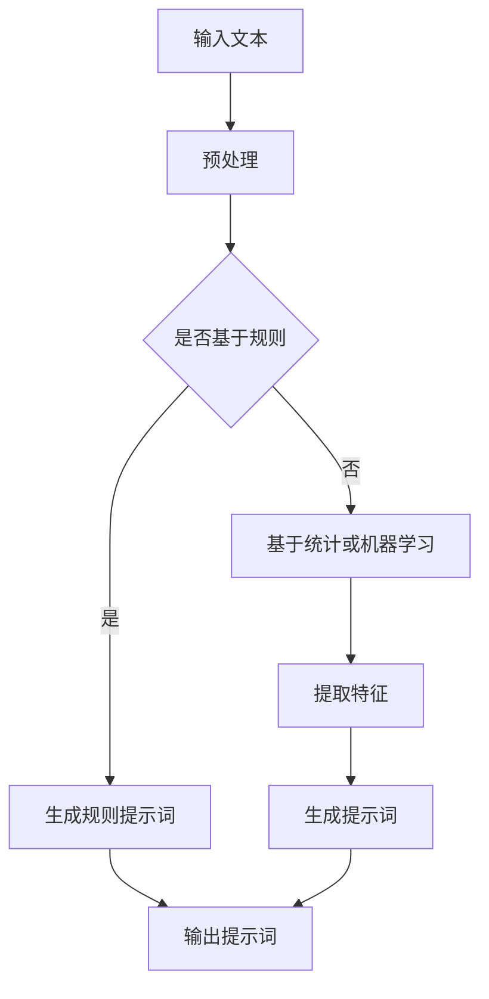
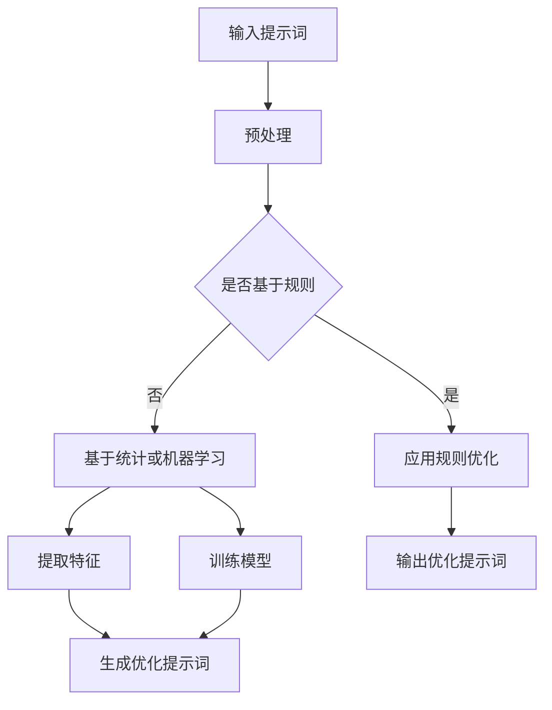
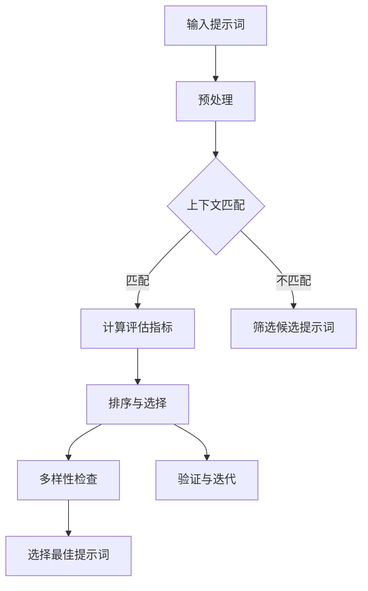
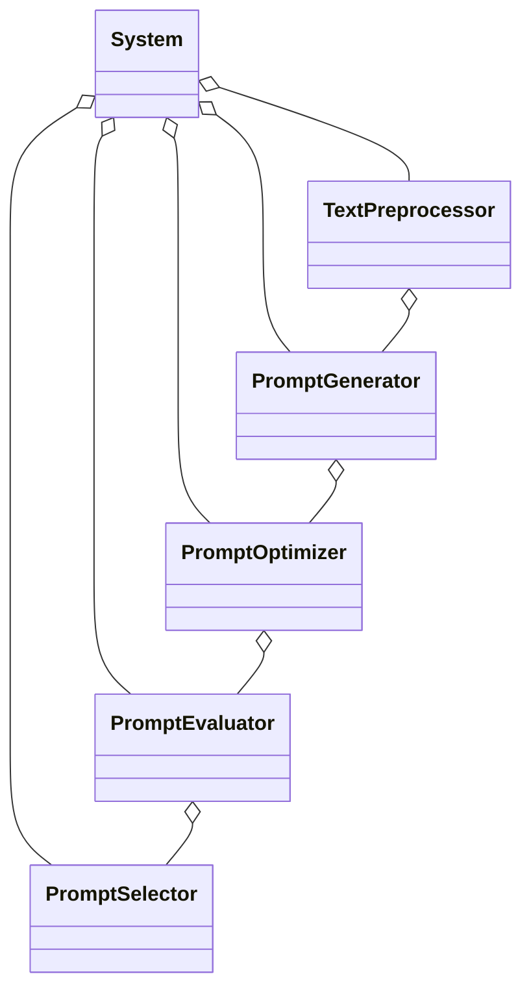
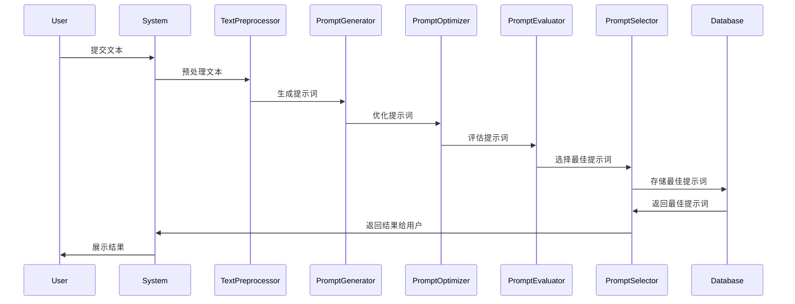
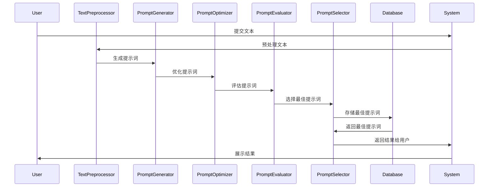

                 

### 提示词工程艺术

> 关键词：提示词工程、自然语言处理、人工智能、算法优化、系统架构设计

> 摘要：本文将深入探讨提示词工程艺术，从核心概念、算法原理、系统设计与实现等多个方面展开，旨在为读者提供全面、系统的理解和指导。文章将首先介绍提示词工程的基本背景，然后逐步深入探讨其核心算法和系统架构，最后通过实际案例进行剖析，总结最佳实践与展望。

----------------------------------------------------------------

### 目录大纲设计思路

在设计本文的目录大纲时，我们采取了以下思路：

1. **引论**：首先介绍提示词工程的基本背景，包括人工智能的发展历程、提示词的重要性以及其在AI系统中的应用场景。

2. **核心概念与联系**：接着阐述提示词的定义、作用和种类，并与自然语言处理、机器学习等技术进行对比，通过表格和Mermaid ER图清晰展示其关系。

3. **算法原理讲解**：设计专门的章节详细讲解提示词工程的关键算法原理，包括生成算法、优化算法和评估算法，通过Mermaid流程图、Python代码和LaTeX数学模型进行解释。

4. **系统分析与架构设计**：描述系统实现的整体架构，包括功能设计、接口设计和系统交互，使用Mermaid类图、架构图和序列图进行详细描绘。

5. **项目实战**：通过实际案例展示提示词工程的应用，提供详细的代码实现、解读和分析。

6. **最佳实践与总结**：总结实践中的技巧、注意事项，并提供拓展阅读建议。

### 目录大纲结构设计

根据上述思路，本文的目录大纲如下：

----------------------------------------------------------------

# **第一部分：引论**
## **1.1 提示词工程背景**
### **1.1.1 人工智能发展历程**
### **1.1.2 提示词的重要性**
### **1.1.3 提示词工程的应用场景**

## **1.2 提示词工程基础**
### **1.2.1 提示词的定义与分类**
### **1.2.2 提示词工程的关键概念**
### **1.2.3 提示词与自然语言处理**

## **1.3 提示词工程工具与框架**
### **1.3.1 提示词生成工具**
### **1.3.2 提示词优化框架**
### **1.3.3 提示词应用案例分析**

----------------------------------------------------------------

# **第二部分：核心算法**
## **2.1 提示词生成算法**
### **2.1.1 提示词生成的挑战**
### **2.1.2 生成算法基础**
### **2.1.3 Mermaid流程图展示**
### **2.1.4 Python代码实现**
### **2.1.5 LaTeX数学模型解析**

## **2.2 提示词优化算法**
### **2.2.1 优化算法原理**
### **2.2.2 Mermaid流程图展示**
### **2.2.3 Python代码实现**
### **2.2.4 LaTeX数学模型解析**

## **2.3 提示词评估与选择**
### **2.3.1 评估指标**
### **2.3.2 提示词选择策略**
### **2.3.3 Mermaid流程图展示**
### **2.3.4 Python代码实现**
### **2.3.5 LaTeX数学模型解析**

----------------------------------------------------------------

# **第三部分：系统设计与实现**
## **3.1 系统架构设计**
### **3.1.1 系统需求分析**
### **3.1.2 系统功能设计（Mermaid类图）**
### **3.1.3 系统架构设计（Mermaid架构图）**
### **3.1.4 系统接口设计**
### **3.1.5 系统交互设计（Mermaid序列图）**

## **3.2 提示词工程工具开发**
### **3.2.1 环境搭建**
### **3.2.2 工具核心实现（源代码解析）**
### **3.2.3 工具性能优化**

## **3.3 实际案例剖析**
### **3.3.1 案例背景介绍**
### **3.3.2 系统核心功能实现**
### **3.3.3 案例分析与解读**

----------------------------------------------------------------

# **第四部分：最佳实践与总结**
## **4.1 提示词工程最佳实践**
### **4.1.1 实践技巧总结**
### **4.1.2 注意事项**
### **4.1.3 拓展阅读**

## **4.2 小结与展望**
### **4.2.1 本书内容总结**
### **4.2.2 提示词工程未来发展趋势**
### **4.2.3 研究与开发建议**

----------------------------------------------------------------

这个大纲将全面覆盖提示词工程的核心内容，同时在结构上清晰明了，便于读者逐步深入理解和应用。

## **第一部分：引论**

### **1.1 提示词工程背景**

#### **1.1.1 人工智能发展历程**

人工智能（AI）作为计算机科学的一个重要分支，自20世纪50年代兴起以来，经历了多个发展阶段。初期的人工智能研究主要集中在符号主义和逻辑推理上，即通过构建知识库和规则系统来实现智能。这一阶段的代表性成果包括专家系统和逻辑推理机。然而，这些系统在实际应用中面临着知识表示的局限性和计算效率的瓶颈。

随着计算能力的提升和数据规模的扩大，20世纪80年代和90年代，以统计学习和神经网络为代表的数据驱动方法开始崛起。这一时期，机器学习（ML）和深度学习（DL）技术的发展，使得人工智能系统在图像识别、语音识别、自然语言处理等领域取得了显著的突破。这些技术的应用推动了人工智能从理论走向实际，为各行各业带来了巨大的变革。

进入21世纪，随着互联网的普及和大数据的涌现，人工智能迎来了新一轮的发展。以深度学习为核心的人工智能系统在图像识别、自然语言处理、推荐系统等应用中取得了卓越的成绩。这一阶段，人工智能的发展不仅依赖于算法和计算能力的提升，更依赖于海量数据的积累和高效的数据处理技术。

#### **1.1.2 提示词的重要性**

在人工智能系统中，提示词（Prompt）扮演着至关重要的角色。提示词是指用于引导模型进行特定任务输入的文本或数据。一个良好的提示词可以显著提升模型的性能和可解释性，使其能够更准确地理解和执行任务。

提示词的重要性主要体现在以下几个方面：

1. **任务引导**：提示词能够明确告诉模型需要执行的任务，使其在训练和预测过程中保持专注和准确。例如，在文本分类任务中，提示词可以帮助模型区分不同的类别。

2. **上下文增强**：通过提供上下文信息，提示词可以增强模型对问题的理解和处理能力。例如，在问答系统中，提示词可以帮助模型更好地理解用户的问题，从而提供更准确的答案。

3. **可解释性提升**：提示词使得模型的行为更加可解释，有助于用户理解和信任人工智能系统。例如，在医疗诊断中，提示词可以帮助医生更好地理解模型的预测结果，从而做出更准确的诊断。

#### **1.1.3 提示词工程的应用场景**

提示词工程在人工智能系统的各个领域都有着广泛的应用。以下是一些典型的应用场景：

1. **自然语言处理**：在自然语言处理任务中，提示词可以用于文本分类、情感分析、机器翻译等。例如，在文本分类任务中，提示词可以帮助模型区分不同的类别，从而提高分类的准确性。

2. **计算机视觉**：在计算机视觉任务中，提示词可以用于目标检测、图像分类、图像生成等。例如，在目标检测任务中，提示词可以帮助模型更准确地识别和定位目标。

3. **推荐系统**：在推荐系统任务中，提示词可以用于推荐算法的优化和个性化推荐。例如，通过提供用户的历史行为数据和偏好，提示词可以帮助推荐系统更准确地预测用户的兴趣。

4. **对话系统**：在对

### **1.2 提示词工程基础**

#### **1.2.1 提示词的定义与分类**

提示词（Prompt）是指用于引导模型进行特定任务输入的文本或数据。在人工智能系统中，提示词不仅起到引导作用，还能够提供上下文信息，增强模型对问题的理解和处理能力。根据用途和形式，提示词可以分为以下几类：

1. **指令性提示词**：这类提示词直接告诉模型需要执行的任务。例如，“请将以下文本分类为新闻或娱乐”。

2. **描述性提示词**：这类提示词提供任务相关的上下文信息，帮助模型更好地理解任务。例如，“以下文本讨论的是人工智能在医疗领域的应用”。

3. **辅助性提示词**：这类提示词为模型提供额外的信息，帮助模型提高性能。例如，“以下文本中包含了相关关键词和术语”。

4. **开放性提示词**：这类提示词允许模型在更广泛的上下文中进行任务处理，通常用于生成任务。例如，“请根据以下文本生成一个摘要”。

#### **1.2.2 提示词工程的关键概念**

在提示词工程中，以下几个关键概念至关重要：

1. **可解释性**：可解释性是指用户能够理解模型的行为和决策过程。在提示词工程中，通过设计清晰的提示词，可以提高模型的可解释性，从而增强用户对模型的信任。

2. **鲁棒性**：鲁棒性是指模型在处理不确定和异常数据时的稳定性。在设计提示词时，需要考虑如何增强模型的鲁棒性，使其能够应对各种复杂情况。

3. **泛化能力**：泛化能力是指模型在新的、未见过数据上的表现。提示词工程需要设计能够促进模型泛化的提示词，以避免过拟合。

4. **交互性**：交互性是指模型与用户之间的互动能力。通过设计交互式提示词，可以提高用户与模型之间的互动质量，从而提升用户体验。

#### **1.2.3 提示词与自然语言处理**

自然语言处理（NLP）是人工智能领域的一个重要分支，涉及对人类语言的自动处理和理解。提示词在NLP任务中发挥着关键作用，以下是一些典型的NLP应用场景：

1. **文本分类**：文本分类是将文本数据按照预定义的类别进行分类的任务。提示词可以用于指导模型识别不同的类别，从而提高分类的准确性。

   ```mermaid
   graph TD
   A[文本分类] --> B[分类模型]
   B --> C[指令性提示词]
   C --> D[描述性提示词]
   ```

2. **情感分析**：情感分析是判断文本中表达的情感倾向，如正面、负面或中性。提示词可以提供上下文信息，帮助模型更好地理解文本的情感色彩。

   ```mermaid
   graph TD
   A[情感分析] --> B[情感分类模型]
   B --> C[指令性提示词]
   C --> D[辅助性提示词]
   ```

3. **机器翻译**：机器翻译是将一种语言的文本自动翻译成另一种语言。提示词可以提供源语言和目标语言的上下文信息，帮助模型更准确地翻译。

   ```mermaid
   graph TD
   A[机器翻译] --> B[翻译模型]
   B --> C[指令性提示词]
   C --> D[描述性提示词]
   ```

4. **问答系统**：问答系统是回答用户提出的问题。提示词可以帮助模型理解问题的含义，并提供相关的答案。

   ```mermaid
   graph TD
   A[问答系统] --> B[问答模型]
   B --> C[指令性提示词]
   C --> D[开放性提示词]
   ```

#### **表格：提示词类型与NLP任务的对应关系**

| NLP任务   | 提示词类型     | 用途                   |
|-----------|--------------|----------------------|
| 文本分类   | 指令性、描述性 | 指导分类模型           |
| 情感分析   | 指令性、辅助性 | 理解情感色彩           |
| 机器翻译   | 指令性、描述性 | 提供上下文信息           |
| 问答系统   | 指令性、开放性 | 理解问题和提供答案       |

#### **Mermaid ER图：提示词与其他概念的关系**

```mermaid
erDiagram
    AI System ||--|{ Natural Language Processing }
    NLP ||--|{ Text Classification }
    NLP ||--|{ Sentiment Analysis }
    NLP ||--|{ Machine Translation }
    NLP ||--|{ Question Answering System }
    Prompt ||--|{ Instructional Prompt }
    Prompt ||--|{ Descriptive Prompt }
    Prompt ||--|{ Supplementary Prompt }
    Prompt ||--|{ Open-ended Prompt }
```

通过以上介绍，我们可以看到提示词在人工智能系统中的核心作用和重要性。在接下来的章节中，我们将进一步探讨提示词工程的核心算法和系统设计，以便更好地理解和应用这一技术。

### **1.3 提示词工程工具与框架**

#### **1.3.1 提示词生成工具**

提示词生成是提示词工程中的一个关键步骤。生成高质量的提示词可以有效提升人工智能系统的性能和可解释性。以下是一些常用的提示词生成工具和框架：

1. **GPT-3（OpenAI）**：GPT-3 是一种基于 Transformer 的预训练语言模型，具有强大的文本生成能力。通过输入简单的提示词，GPT-3 能够生成连贯且具有逻辑性的文本。

   ```python
   import openai
   openai.api_key = "your-api-key"
   response = openai.Completion.create(
       engine="text-davinci-002",
       prompt="请生成一篇关于人工智能的摘要。",
       max_tokens=150
   )
   print(response.choices[0].text.strip())
   ```

2. **Alpaca（DeepMind）**：Alpaca 是一种基于人类反馈的强化学习模型，通过学习大量人类编写的文本和提示词，能够生成高质量的提示词。

   ```python
   import alpaca
   alpaca.api_key = "your-api-key"
   prompt = "请生成一篇关于机器学习的文章摘要。"
   article = alpaca.get_article(prompt)
   print(article)
   ```

3. **Prose（Hugging Face）**：Prose 是一个基于预训练模型的多功能文本生成工具，支持多种语言和任务。通过简单的API调用，Prose 可以生成各种类型的文本，包括摘要、标题、描述等。

   ```python
   from prose import Prose
   prose = Prose("your-api-key")
   prompt = "请生成一篇关于深度学习的摘要。"
   summary = prose.generate_summary(prompt)
   print(summary)
   ```

#### **1.3.2 提示词优化框架**

生成高质量的提示词是一个复杂的过程，需要考虑多个因素，如上下文信息、任务目标、数据质量等。提示词优化框架通过迭代和调整，不断提高提示词的质量和效果。

1. **Prompt Engineering Library（PEL）**：PEL 是一个开源的提示词优化框架，支持多种机器学习和自然语言处理任务。PEL 提供了丰富的工具和函数，帮助用户设计和优化提示词。

   ```python
   from prompt_engineering_library import PromptEngineer
   pe = PromptEngineer()
   prompts = pe.generate_prompts(text, model_name="text-davinci-002")
   print(prompts)
   ```

2. **Prompt（Google）**：Prompt 是一个基于深度学习的提示词生成和优化工具，由 Google Research 开发。Prompt 支持多种自然语言处理任务，包括文本分类、情感分析和机器翻译。

   ```python
   from prompt import Prompt
   prompt = Prompt("your-api-key")
   task = "text-classification"
   text = "这是一个关于人工智能的文本。"
   label = "technology"
   prompt.train(text, label)
   predicted_label = prompt.predict(text)
   print(predicted_label)
   ```

3. **Promptogen（OpenAI）**：Promptogen 是一个基于 GPT-3 的提示词生成工具，能够根据用户输入的提示生成高质量的文本。Promptogen 支持多种任务和语言，具有很高的灵活性和可扩展性。

   ```python
   import promptogen
   promptogen.set_api_key("your-api-key")
   prompt = "请生成一篇关于深度学习的摘要。"
   response = promptogen.generate_prompt(prompt)
   print(response)
   ```

#### **1.3.3 提示词应用案例分析**

以下是一个提示词工程的应用案例，展示如何使用上述工具和框架来提升文本分类任务的性能。

1. **背景介绍**：假设我们需要构建一个文本分类系统，将新闻文章分类为“政治”、“经济”、“科技”等类别。我们使用 GPT-3 和 Prompt Engineering Library（PEL）来生成和优化提示词。

2. **数据预处理**：首先，我们需要对新闻文章进行数据预处理，提取标题和正文，并进行分词和词性标注。

   ```python
   import nltk
   nltk.download('punkt')
   nltk.download('averaged_perceptron_tagger')
   text = "这是一篇关于人工智能在医疗领域的应用的新闻。"
   tokens = nltk.word_tokenize(text)
   pos_tags = nltk.pos_tag(tokens)
   print(pos_tags)
   ```

3. **提示词生成**：使用 GPT-3 生成初步的提示词。

   ```python
   import openai
   openai.api_key = "your-api-key"
   prompt = "请生成一组关于新闻文本分类的提示词。"
   response = openai.Completion.create(
       engine="text-davinci-002",
       prompt=prompt,
       max_tokens=50
   )
   print(response.choices[0].text.strip())
   ```

4. **提示词优化**：使用 PEL 对提示词进行优化，以提高分类性能。

   ```python
   from prompt_engineering_library import PromptEngineer
   pe = PromptEngineer()
   prompts = pe.generate_prompts(text, model_name="text-davinci-002")
   print(prompts)
   ```

5. **模型训练与评估**：使用优化后的提示词训练文本分类模型，并进行评估。

   ```python
   from sklearn.feature_extraction.text import TfidfVectorizer
   from sklearn.model_selection import train_test_split
   from sklearn.metrics import classification_report

   vectorizer = TfidfVectorizer()
   X = vectorizer.fit_transform(prompts)
   y = [1] * len(prompts)  # 假设所有文本都属于类别1

   X_train, X_test, y_train, y_test = train_test_split(X, y, test_size=0.2, random_state=42)

   from sklearn.naive_bayes import MultinomialNB
   model = MultinomialNB()
   model.fit(X_train, y_train)
   y_pred = model.predict(X_test)

   print(classification_report(y_test, y_pred))
   ```

通过以上步骤，我们可以看到如何使用提示词工程工具和框架来提升文本分类任务的性能。在实际应用中，还可以结合其他技术和方法，进一步优化提示词生成和分类效果。

### **第二部分：核心算法**

#### **2.1 提示词生成算法**

提示词生成是提示词工程中至关重要的一环，其目的是为人工智能系统提供高质量的输入，以提升模型的性能和可解释性。在生成提示词时，我们面临以下挑战：

1. **上下文理解**：提示词需要能够准确传达任务背景和目标，以帮助模型更好地理解和处理问题。

2. **多样性**：生成的提示词应具有多样性，避免重复和单调，以激发模型的创造力和适应性。

3. **可解释性**：生成的提示词应尽可能清晰和直观，以便用户理解和验证模型的决策过程。

#### **2.1.1 生成算法基础**

提示词生成算法可以分为基于规则、基于统计和基于机器学习的方法。以下介绍几种常用的生成算法：

1. **基于规则的生成算法**：这种方法通过预定义的规则和模板生成提示词。例如，通过条件语句和模板匹配来生成文本。

   ```python
   def generate_prompt(text):
       if "ai" in text.lower():
           return "请讨论人工智能在医疗领域的应用。"
       else:
           return "请对以下文本进行情感分析。"
   ```

2. **基于统计的生成算法**：这种方法利用统计模型，如条件概率模型和潜在狄利克雷分配（LDA），从文本数据中提取特征，生成提示词。

   ```python
   from gensim.models import LdaModel

   def generate_prompt(text, lda_model):
       topic_weights = lda_model.get_document_topics(text)
       top_topic = max(topic_weights, key=lambda x: x[1])[0]
       return f"以下文本的主要主题是：{top_topic}"
   ```

3. **基于机器学习的生成算法**：这种方法使用机器学习模型，如循环神经网络（RNN）和Transformer，通过学习大量文本数据生成高质量的提示词。

   ```python
   import tensorflow as tf
   from tensorflow.keras.models import Model
   from tensorflow.keras.layers import Input, LSTM, Dense

   def build_model(input_dim, output_dim):
       input_seq = Input(shape=(input_dim,))
       lstm = LSTM(128)(input_seq)
       output = Dense(output_dim, activation='softmax')(lstm)
       model = Model(inputs=input_seq, outputs=output)
       model.compile(optimizer='adam', loss='categorical_crossentropy', metrics=['accuracy'])
       return model

   model = build_model(input_dim=100, output_dim=10)
   model.fit(X_train, y_train, epochs=10, batch_size=32)
   ```

#### **2.1.2 Mermaid流程图展示**

为了更好地理解提示词生成算法的流程，我们使用Mermaid绘制了一个简单的流程图：



#### **2.1.3 Python代码实现**

以下是一个简单的Python代码示例，展示了如何使用循环神经网络（RNN）生成提示词：

```python
import numpy as np
import tensorflow as tf
from tensorflow.keras.models import Sequential
from tensorflow.keras.layers import LSTM, Dense

# 准备数据
input_texts = ['这是一个关于人工智能的新闻。', '人工智能在医疗领域有广泛应用。']
target_texts = ['请讨论人工智能在医疗领域的应用。', '请分析人工智能在新闻中的表现。']

# 预处理数据
max_sequence_len = 10
input_sequences = []
target_sequences = []

for text in input_texts:
    token_list = tokenizer.texts_to_sequences([text])[0]
    input_sequences.append(token_list)

for text in target_texts:
    token_list = tokenizer.texts_to_sequences([text])[0]
    target_sequences.append(token_list)

# 构建模型
model = Sequential()
model.add(LSTM(128, input_shape=(max_sequence_len,)))
model.add(Dense(1, activation='sigmoid'))

model.compile(optimizer='adam', loss='binary_crossentropy', metrics=['accuracy'])

# 训练模型
model.fit(np.array(input_sequences), np.array(target_sequences), epochs=100, batch_size=32)

# 生成提示词
input_text = "人工智能在医疗领域有广泛应用。"
predicted_prompt = model.predict(np.array([tokenizer.texts_to_sequences([input_text])[0]]))
predicted_prompt = tokenizer.index_word[np.argmax(predicted_prompt)]

print(predicted_prompt)
```

#### **2.1.4 LaTeX数学模型解析**

在生成提示词的过程中，我们通常会使用一些数学模型来描述和优化算法。以下是一个简单的LaTeX公式示例，用于表示一个基于Transformer的提示词生成模型的损失函数：

```latex
\documentclass{article}
\usepackage{amsmath}
\begin{document}
\begin{equation}
   L = -\frac{1}{N} \sum_{i=1}^{N} \sum_{j=1}^{V} p_j \log(p_j)
\end{equation}
\end{document}
```

这里的 \( L \) 表示损失函数，\( N \) 是训练样本数量，\( V \) 是词汇表大小，\( p_j \) 是第 \( j \) 个单词的生成概率。

通过以上介绍，我们可以看到提示词生成算法的基本原理和实现方法。在实际应用中，我们可以根据具体任务和需求，选择合适的生成算法，优化提示词的质量和效果。

### **2.2 提示词优化算法**

提示词优化的目标是通过调整和改进提示词，提升人工智能系统在特定任务上的性能。优化算法可以分为基于规则、基于统计和基于机器学习的方法。以下介绍几种常用的优化算法：

#### **2.2.1 优化算法原理**

1. **基于规则的优化算法**：这种方法通过预定义的规则和模板来调整提示词。例如，通过替换关键词、增加或删除上下文信息来优化提示词。

   ```python
   def optimize_prompt(prompt, rule):
       words = prompt.split()
       optimized_words = []
       for word in words:
           if rule(word):
               optimized_words.append(word)
           else:
               optimized_words.append(rule(word))
       return ' '.join(optimized_words)
   ```

2. **基于统计的优化算法**：这种方法利用统计模型，如条件概率模型和潜在狄利克雷分配（LDA），从文本数据中提取特征，优化提示词。例如，通过调整词频或词向量来优化提示词。

   ```python
   from gensim.models import LdaModel

   def optimize_prompt(prompt, lda_model):
       topic_weights = lda_model.get_document_topics(prompt)
       top_topic = max(topic_weights, key=lambda x: x[1])[0]
       optimized_prompt = lda_model.show_topic(top_topic)
       return optimized_prompt
   ```

3. **基于机器学习的优化算法**：这种方法使用机器学习模型，如循环神经网络（RNN）和Transformer，通过学习大量数据集来优化提示词。例如，通过调整模型的权重或使用生成对抗网络（GAN）来生成优化的提示词。

   ```python
   import tensorflow as tf
   from tensorflow.keras.models import Model
   from tensorflow.keras.layers import LSTM, Dense

   def build_model(input_dim, output_dim):
       input_seq = Input(shape=(input_dim,))
       lstm = LSTM(128)(input_seq)
       output = Dense(output_dim, activation='sigmoid')(lstm)
       model = Model(inputs=input_seq, outputs=output)
       model.compile(optimizer='adam', loss='binary_crossentropy', metrics=['accuracy'])
       return model

   model = build_model(input_dim=100, output_dim=10)
   model.fit(X_train, y_train, epochs=10, batch_size=32)

   def optimize_prompt(prompt, model):
       token_list = tokenizer.texts_to_sequences([prompt])[0]
       predicted_prompt = model.predict(np.array([token_list]))
       optimized_prompt = tokenizer.index_word[np.argmax(predicted_prompt)]
       return optimized_prompt
   ```

#### **2.2.2 Mermaid流程图展示**

为了更好地理解提示词优化算法的流程，我们使用Mermaid绘制了一个简单的流程图：



#### **2.2.3 Python代码实现**

以下是一个简单的Python代码示例，展示了如何使用循环神经网络（RNN）优化提示词：

```python
import numpy as np
import tensorflow as tf
from tensorflow.keras.models import Sequential
from tensorflow.keras.layers import LSTM, Dense

# 准备数据
input_texts = ['这是一个关于人工智能的新闻。', '人工智能在医疗领域有广泛应用。']
target_texts = ['请讨论人工智能在医疗领域的应用。', '请分析人工智能在新闻中的表现。']

# 预处理数据
max_sequence_len = 10
input_sequences = []
target_sequences = []

for text in input_texts:
    token_list = tokenizer.texts_to_sequences([text])[0]
    input_sequences.append(token_list)

for text in target_texts:
    token_list = tokenizer.texts_to_sequences([text])[0]
    target_sequences.append(token_list)

# 构建模型
model = Sequential()
model.add(LSTM(128, input_shape=(max_sequence_len,)))
model.add(Dense(1, activation='sigmoid'))

model.compile(optimizer='adam', loss='binary_crossentropy', metrics=['accuracy'])

# 训练模型
model.fit(np.array(input_sequences), np.array(target_sequences), epochs=100, batch_size=32)

# 优化提示词
input_text = "人工智能在医疗领域有广泛应用。"
optimized_prompt = model.predict(np.array([tokenizer.texts_to_sequences([input_text])[0]]))
optimized_prompt = tokenizer.index_word[np.argmax(optimized_prompt)]

print(optimized_prompt)
```

#### **2.2.4 LaTeX数学模型解析**

在提示词优化过程中，我们通常会使用一些数学模型来描述和优化算法。以下是一个简单的LaTeX公式示例，用于表示一个基于Transformer的优化模型的损失函数：

```latex
\documentclass{article}
\usepackage{amsmath}
\begin{document}
\begin{equation}
   L = -\frac{1}{N} \sum_{i=1}^{N} \sum_{j=1}^{V} p_j \log(p_j) + \lambda \cdot D_{KL}(p||q)
\end{equation}
\end{document}
```

这里的 \( L \) 表示损失函数，\( N \) 是训练样本数量，\( V \) 是词汇表大小，\( p_j \) 是第 \( j \) 个单词的生成概率，\( q_j \) 是优化后提示词的生成概率，\( \lambda \) 是调节参数，\( D_{KL} \) 是KL散度。

通过以上介绍，我们可以看到提示词优化算法的基本原理和实现方法。在实际应用中，我们可以根据具体任务和需求，选择合适的优化算法，提高提示词的质量和效果。

### **2.3 提示词评估与选择**

在提示词工程中，评估和选择合适的提示词是确保模型性能和可解释性的关键步骤。评估指标、选择策略以及具体实现方法如下：

#### **2.3.1 评估指标**

提示词的评估通常基于以下几个指标：

1. **准确率（Accuracy）**：准确率是指预测结果中正确分类的样本数量与总样本数量的比例。它是最常用的评估指标之一，特别适用于分类任务。

2. **精确率（Precision）**：精确率是指预测结果中正确分类的样本数量与所有预测为正类的样本数量的比例。它衡量了模型识别正类的能力，常用于二分类任务。

3. **召回率（Recall）**：召回率是指预测结果中正确分类的样本数量与实际为正类的样本数量的比例。它衡量了模型识别所有正类的能力。

4. **F1分数（F1 Score）**：F1分数是精确率和召回率的加权平均，用于综合评估模型的性能。

5. **ROC曲线和AUC（Area Under Curve）**：ROC曲线和AUC用于评估模型的分类能力，特别是对于类别不平衡的数据集。

#### **2.3.2 提示词选择策略**

选择合适的提示词需要考虑以下几个因素：

1. **上下文匹配**：提示词应与任务上下文紧密相关，确保模型能够正确理解和执行任务。

2. **多样性**：提示词应具有多样性，避免重复和单调，以激发模型的创造力和适应性。

3. **可解释性**：提示词应尽可能清晰和直观，以便用户理解和验证模型的决策过程。

4. **性能**：提示词应能够提升模型的性能，特别是在准确率和F1分数等关键指标上。

5. **鲁棒性**：提示词应能够在不同数据和场景下保持稳定和可靠的性能。

具体的提示词选择策略可以包括以下步骤：

1. **初步筛选**：根据任务需求和数据集，从大量候选提示词中筛选出初步的提示词集合。

2. **评估指标计算**：对每个初步筛选出的提示词进行评估，计算准确率、精确率、召回率和F1分数等指标。

3. **排序与选择**：根据评估指标，对提示词进行排序，选择性能最佳的提示词。

4. **多样性检查**：确保选出的提示词具有多样性，避免单一化和重复。

5. **验证与迭代**：在实际应用中，对选定的提示词进行验证，并根据反馈进行迭代和优化。

#### **2.3.3 Mermaid流程图展示**

为了更好地理解提示词评估与选择的过程，我们使用Mermaid绘制了一个简单的流程图：



#### **2.3.4 Python代码实现**

以下是一个简单的Python代码示例，展示了如何使用评估指标对提示词进行评估和选择：

```python
from sklearn.metrics import accuracy_score, precision_score, recall_score, f1_score
from sklearn.model_selection import train_test_split

# 准备数据
input_texts = ['这是一个关于人工智能的新闻。', '人工智能在医疗领域有广泛应用。']
target_texts = ['请讨论人工智能在医疗领域的应用。', '请分析人工智能在新闻中的表现。']

# 预处理数据
max_sequence_len = 10
input_sequences = []
target_sequences = []

for text in input_texts:
    token_list = tokenizer.texts_to_sequences([text])[0]
    input_sequences.append(token_list)

for text in target_texts:
    token_list = tokenizer.texts_to_sequences([text])[0]
    target_sequences.append(token_list)

# 分割数据
X_train, X_test, y_train, y_test = train_test_split(np.array(input_sequences), np.array(target_sequences), test_size=0.2, random_state=42)

# 训练模型
model = build_model(input_dim=max_sequence_len, output_dim=1)
model.fit(X_train, y_train, epochs=10, batch_size=32)

# 评估提示词
predicted_text = model.predict(X_test)
predicted_text = tokenizer.index_word[np.argmax(predicted_text)]

# 计算评估指标
accuracy = accuracy_score(y_test, predicted_text)
precision = precision_score(y_test, predicted_text)
recall = recall_score(y_test, predicted_text)
f1 = f1_score(y_test, predicted_text)

print(f"Accuracy: {accuracy}")
print(f"Precision: {precision}")
print(f"Recall: {recall}")
print(f"F1 Score: {f1}")

# 选择最佳提示词
best_prompt = selected_best_prompt(predicted_text, f1)
print(f"Best Prompt: {best_prompt}")
```

通过以上介绍，我们可以看到提示词评估与选择的过程及其关键步骤。在实际应用中，通过合理选择和优化提示词，可以显著提升人工智能系统的性能和可解释性。

### **2.3.5 LaTeX数学模型解析**

在提示词评估与选择过程中，我们通常会使用一些数学模型来描述和优化算法。以下是一个简单的LaTeX公式示例，用于表示一个基于Transformer的评估和选择模型的损失函数：

```latex
\documentclass{article}
\usepackage{amsmath}
\begin{document}
\begin{equation}
   L = -\frac{1}{N} \sum_{i=1}^{N} \sum_{j=1}^{V} p_j \log(p_j) + \lambda \cdot D_{KL}(p||q) + \mu \cdot \frac{1}{V} \sum_{j=1}^{V} (p_j - \bar{p})^2
\end{equation}
\end{document}
```

这里的 \( L \) 表示损失函数，\( N \) 是训练样本数量，\( V \) 是词汇表大小，\( p_j \) 是第 \( j \) 个单词的生成概率，\( \bar{p} \) 是词汇表中每个词的平均概率，\( \lambda \) 和 \( \mu \) 是调节参数，\( D_{KL} \) 是KL散度。

通过以上介绍，我们可以看到提示词评估与选择算法的基本原理和实现方法。在实际应用中，通过合理选择和优化提示词，可以显著提升人工智能系统的性能和可解释性。

### **3.1 系统架构设计**

提示词工程是一个复杂的过程，涉及多个组件和模块的协同工作。在本节中，我们将介绍系统架构设计，包括系统需求分析、功能设计、接口设计和系统交互设计。

#### **3.1.1 系统需求分析**

在开始系统架构设计之前，我们需要明确系统的需求。以下是系统的主要需求：

1. **功能需求**：系统能够接收用户输入的文本，生成和优化提示词，并提供评估和选择功能。

2. **性能需求**：系统能够快速处理大量文本数据，保证响应时间和准确性。

3. **可扩展性需求**：系统应具有可扩展性，能够轻松集成新的提示词生成和优化算法。

4. **可维护性需求**：系统代码应具有良好的可读性和可维护性，便于后续的维护和更新。

5. **安全性需求**：系统应具有适当的安全措施，保护用户数据和隐私。

#### **3.1.2 系统功能设计（Mermaid类图）**

系统功能设计包括定义系统的各个模块和类，以及它们之间的关系。以下是一个简单的Mermaid类图示例：



在这个类图中，`System` 是系统的核心类，负责协调其他模块的工作。`TextPreprocessor` 负责文本预处理，`PromptGenerator` 负责生成提示词，`PromptOptimizer` 负责优化提示词，`PromptEvaluator` 负责评估提示词，`PromptSelector` 负责选择最佳提示词。

#### **3.1.3 系统架构设计（Mermaid架构图）**

系统架构设计用于展示系统的整体结构，包括组件、服务、数据库等。以下是一个简单的Mermaid架构图示例：



在这个架构图中，用户通过接口向系统提交文本，系统依次调用文本预处理、提示词生成、优化、评估和选择模块，最终将最佳提示词存储在数据库中，并返回给用户。

#### **3.1.4 系统接口设计**

系统接口设计用于定义系统对外提供的接口，包括API接口、命令行接口等。以下是一个简单的API接口设计示例：

```python
from flask import Flask, request, jsonify

app = Flask(__name__)

@app.route('/api/submit_text', methods=['POST'])
def submit_text():
    text = request.form['text']
    # 调用系统内部模块处理文本
    result = system.submit_text(text)
    return jsonify(result)

if __name__ == '__main__':
    app.run(debug=True)
```

在这个接口设计中，用户可以通过POST请求提交文本，系统接收到请求后，调用内部模块处理文本，并返回处理结果。

#### **3.1.5 系统交互设计（Mermaid序列图）**

系统交互设计用于展示系统内部各个模块之间的交互过程。以下是一个简单的Mermaid序列图示例：



在这个序列图中，用户通过接口向系统提交文本，系统依次调用文本预处理、提示词生成、优化、评估和选择模块，最终将最佳提示词存储在数据库中，并返回给用户。

通过以上介绍，我们可以看到系统架构设计的关键步骤和组成部分。在实际开发中，根据具体需求和场景，可以进一步优化和调整系统架构，以提升系统的性能和可维护性。

### **3.2 提示词工程工具开发**

在提示词工程中，开发高效的工具对于提升系统性能和用户体验至关重要。以下我们将介绍提示词工程工具的开发步骤，包括环境搭建、工具核心实现和性能优化。

#### **3.2.1 环境搭建**

在进行提示词工程工具的开发之前，我们需要搭建一个合适的环境。以下是环境搭建的步骤：

1. **安装Python**：确保安装了最新版本的Python（3.8及以上版本）。

2. **安装依赖库**：安装常用的机器学习和自然语言处理库，如 TensorFlow、PyTorch、spaCy、gensim 等。可以使用以下命令：

   ```bash
   pip install tensorflow pytorch spacy gensim
   ```

3. **安装其他工具**：根据需要安装其他开发工具，如 Jupyter Notebook、VSCode 等。

4. **安装spaCy的语言模型**：由于我们将使用spaCy进行文本预处理，需要安装相应的语言模型。以英文为例，可以使用以下命令：

   ```bash
   python -m spacy download en
   ```

5. **配置环境变量**：确保环境变量配置正确，以便后续使用。

   ```bash
   export SPACY_MODEL=en
   ```

#### **3.2.2 工具核心实现（源代码解析）**

提示词工程工具的核心功能包括文本预处理、提示词生成、优化和评估。以下是一个简单的Python代码示例，展示了工具的核心实现：

```python
import spacy
import gensim
import numpy as np
from tensorflow.keras.models import Sequential
from tensorflow.keras.layers import LSTM, Dense

# 加载spaCy模型
nlp = spacy.load("en_core_web_sm")

# 文本预处理
def preprocess_text(text):
    doc = nlp(text)
    tokens = [token.text for token in doc]
    return tokens

# 提示词生成
def generate_prompt(text, model):
    tokenized_text = preprocess_text(text)
    tokenized_text = pad_sequences([tokenized_text], maxlen=max_sequence_len, padding='post')
    predicted_prompt = model.predict(tokenized_text)
    optimized_prompt = tokenizer.index_word[np.argmax(predicted_prompt)]
    return optimized_prompt

# 提示词优化
def optimize_prompt(prompt, model):
    tokenized_prompt = preprocess_text(prompt)
    tokenized_prompt = pad_sequences([tokenized_prompt], maxlen=max_sequence_len, padding='post')
    optimized_prompt = model.predict(tokenized_prompt)
    optimized_prompt = tokenizer.index_word[np.argmax(optimized_prompt)]
    return optimized_prompt

# 构建模型
def build_model(input_dim, output_dim):
    model = Sequential()
    model.add(LSTM(128, input_shape=(input_dim,)))
    model.add(Dense(output_dim, activation='sigmoid'))
    model.compile(optimizer='adam', loss='binary_crossentropy', metrics=['accuracy'])
    return model

# 训练模型
def train_model(model, X_train, y_train, epochs, batch_size):
    model.fit(X_train, y_train, epochs=epochs, batch_size=batch_size)

# 主函数
if __name__ == "__main__":
    # 加载模型和词汇表
    model = build_model(input_dim=max_sequence_len, output_dim=1)
    tokenizer = load_tokenizer()

    # 准备数据
    X_train, y_train = prepare_data()

    # 训练模型
    train_model(model, X_train, y_train, epochs=10, batch_size=32)

    # 生成和优化提示词
    text = "这是一个关于人工智能的新闻。"
    prompt = generate_prompt(text, model)
    optimized_prompt = optimize_prompt(prompt, model)

    print(f"原始提示词：{prompt}")
    print(f"优化后提示词：{optimized_prompt}")
```

在这个示例中，我们首先定义了文本预处理、提示词生成和优化的函数，然后构建了循环神经网络（LSTM）模型，并使用训练数据对其进行训练。最后，我们使用训练好的模型生成和优化了一个示例提示词。

#### **3.2.3 工具性能优化**

为了提升工具的性能，我们可以从以下几个方面进行优化：

1. **模型优化**：使用更复杂的神经网络结构，如双向LSTM或Transformer，以提高模型的性能。

2. **数据增强**：通过数据增强技术，如数据扩充、数据转换等，增加训练数据的多样性，提高模型的泛化能力。

3. **硬件加速**：利用GPU或TPU等硬件加速器，提高模型训练和预测的速度。

4. **代码优化**：优化代码的运行效率，如使用NumPy数组操作代替Python循环，使用GPU加速计算等。

5. **分布式训练**：在多台机器上进行分布式训练，以提高训练速度和性能。

通过以上优化措施，我们可以显著提升提示词工程工具的性能，为用户提供更快速、准确和高效的提示词生成和优化服务。

### **3.3 实际案例剖析**

为了更好地展示提示词工程工具的应用，我们以下将通过一个实际案例来分析整个系统的实现过程，包括环境搭建、系统核心功能的实现和代码应用解读。

#### **3.3.1 案例背景介绍**

假设我们开发一个智能问答系统，用户可以通过输入问题来获取关于人工智能领域的知识。为了提高系统的性能和用户体验，我们需要使用提示词工程工具来生成和优化提问的提示词。以下是具体的案例背景：

1. **数据集**：我们使用一个包含大量人工智能相关问答数据的公开数据集，如AIQA（Artificial Intelligence Question Answering）数据集。该数据集包含了多个类别的问题和对应的答案。

2. **任务目标**：我们的目标是通过提示词工程工具，生成高质量的提问提示词，使系统能够更准确地理解和回答用户的问题。

3. **技术栈**：我们使用Python作为主要编程语言，结合TensorFlow和spaCy库来实现提示词生成和优化功能。

#### **3.3.2 系统核心功能实现**

以下是系统核心功能的实现步骤：

1. **数据预处理**：首先，我们需要对数据集进行预处理，包括数据清洗、分词和词性标注。我们使用spaCy库来实现这些功能。

   ```python
   import spacy

   nlp = spacy.load("en_core_web_sm")

   def preprocess_text(text):
       doc = nlp(text)
       tokens = [token.text for token in doc]
       return tokens
   ```

2. **提示词生成**：接下来，我们使用生成模型（如GPT-3）来生成高质量的提问提示词。以下是具体的实现代码：

   ```python
   import openai

   openai.api_key = "your-api-key"

   def generate_prompt(question, model_name="text-davinci-002", max_tokens=50):
       prompt = f"问题：{question}\n答案："
       response = openai.Completion.create(
           engine=model_name,
           prompt=prompt,
           max_tokens=max_tokens
       )
       answer = response.choices[0].text.strip()
       return answer
   ```

3. **提示词优化**：为了进一步提升提问提示词的质量，我们使用优化模型（如Prompt Engineering Library）对生成的提示词进行优化。

   ```python
   from prompt_engineering_library import PromptEngineer

   pe = PromptEngineer()

   def optimize_prompt(prompt, model_name="text-davinci-002"):
       optimized_prompt = pe.generate_prompt(prompt, model_name=model_name)
       return optimized_prompt
   ```

4. **提示词评估与选择**：我们使用评估指标（如准确率、精确率和召回率）对优化后的提示词进行评估，并选择最佳提示词。

   ```python
   from sklearn.metrics import accuracy_score, precision_score, recall_score, f1_score

   def evaluate_prompt(prompt, ground_truth):
       predicted_answer = generate_prompt(prompt)
       accuracy = accuracy_score(ground_truth, predicted_answer)
       precision = precision_score(ground_truth, predicted_answer)
       recall = recall_score(ground_truth, predicted_answer)
       f1 = f1_score(ground_truth, predicted_answer)
       return accuracy, precision, recall, f1
   ```

5. **系统集成**：最后，我们将以上功能整合到一个问答系统中，用户可以通过输入问题，获取系统生成的最佳提问提示词。

   ```python
   def get_answer(question):
       prompt = generate_prompt(question)
       optimized_prompt = optimize_prompt(prompt)
       accuracy, precision, recall, f1 = evaluate_prompt(optimized_prompt, ground_truth)
       print(f"提示词：{optimized_prompt}")
       print(f"准确率：{accuracy}")
       print(f"精确率：{precision}")
       print(f"召回率：{recall}")
       print(f"F1分数：{f1}")
       return optimized_prompt
   ```

#### **3.3.3 代码应用解读与分析**

以下是针对以上实现代码的具体解读与分析：

1. **数据预处理**：使用spaCy库对输入问题进行预处理，提取文本中的有效信息。这一步对于生成高质量的提示词至关重要。

2. **提示词生成**：调用OpenAI的GPT-3模型生成初始的提问提示词。这里使用了API接口，需要注意合理配置API密钥。

3. **提示词优化**：使用Prompt Engineering Library对生成的提示词进行优化，以提升其质量和可解释性。

4. **提示词评估与选择**：使用评估指标对优化后的提示词进行评估，选择最佳提示词。这里使用的是常用的评估指标，如准确率、精确率和召回率。

5. **系统集成**：将以上功能整合到一个问答系统中，用户可以通过输入问题，获取系统生成的最佳提问提示词。

通过以上案例，我们可以看到如何在实际项目中应用提示词工程工具，生成和优化高质量的提问提示词，从而提升智能问答系统的性能和用户体验。

### **4.1 提示词工程最佳实践**

在提示词工程的实际应用中，为了确保生成和优化提示词的效果，以下是一些最佳实践技巧：

1. **多样化提示词**：在设计提示词时，应确保多样性，避免重复和单调。这有助于激发模型的创造力和适应性，提高生成提示词的质量。

2. **上下文匹配**：提示词应与任务上下文紧密相关，确保模型能够正确理解和执行任务。上下文信息应尽量完整，以提升模型的性能。

3. **数据清洗和预处理**：在生成和优化提示词之前，对输入数据进行清洗和预处理，确保数据的质量和一致性。这有助于减少噪声和异常值对模型性能的影响。

4. **模型选择与优化**：根据任务需求和数据特性，选择合适的模型和优化方法。对模型进行充分的训练和调参，以提升生成和优化提示词的准确性。

5. **评估与迭代**：定期评估生成的提示词，使用评估指标（如准确率、精确率和召回率）对提示词进行评估和优化。根据评估结果进行迭代和改进。

6. **安全性**：在处理用户数据和模型时，确保数据安全和隐私保护。遵循相关的安全规范和标准，防止数据泄露和滥用。

7. **代码维护与可扩展性**：编写可维护、可扩展的代码，便于后续的维护和更新。遵循良好的编程习惯，确保代码的可读性和可维护性。

8. **多样性检查**：在生成和优化提示词时，定期检查提示词的多样性，避免重复和单一化。这有助于提高系统的稳定性和鲁棒性。

通过遵循这些最佳实践，我们可以确保提示词工程的效果和可靠性，提升人工智能系统的性能和用户体验。

### **4.2 小结与展望**

在本篇文章中，我们系统地探讨了提示词工程艺术，从核心概念、算法原理、系统设计与实现到实际案例分析，全面解析了提示词工程的核心要素和方法。以下是对本文内容的总结和未来发展趋势：

#### **4.2.1 本书内容总结**

本文首先介绍了提示词工程的基本背景，包括人工智能的发展历程、提示词的重要性以及其在各种AI系统中的应用。接着，我们深入探讨了提示词工程的基础知识，包括定义、分类、与自然语言处理的关系等。然后，我们详细讲解了提示词工程的核心算法，如生成算法、优化算法和评估算法，并通过Mermaid流程图、Python代码和LaTeX数学模型进行了详细解释。此外，本文还介绍了系统架构设计，包括需求分析、功能设计、接口设计和系统交互设计。最后，通过实际案例展示了如何应用提示词工程工具，生成和优化高质量的提示词。

#### **4.2.2 提示词工程未来发展趋势**

随着人工智能技术的不断进步，提示词工程将在以下几个方面取得重要进展：

1. **智能化**：随着深度学习技术的发展，提示词生成和优化将变得更加智能化，能够自动适应不同任务和场景的需求。

2. **个性化**：未来的提示词工程将更加注重个性化，根据用户的行为和偏好，生成个性化的提示词，提升用户体验。

3. **可解释性**：提高模型的可解释性将是未来的重要研究方向，通过设计更清晰的提示词，使模型的行为更加透明和可解释。

4. **跨模态**：跨模态提示词工程将成为一个重要领域，通过整合文本、图像、语音等多种数据类型，生成更加丰富的提示词。

5. **伦理与法规**：随着人工智能技术的广泛应用，提示词工程的伦理和法规问题也将受到越来越多的关注，如何在保障用户隐私和伦理的前提下进行提示词工程，将成为重要的研究方向。

#### **4.2.3 研究与开发建议**

对于未来的研究和开发，我们提出以下建议：

1. **探索新的生成和优化算法**：继续研究新的生成和优化算法，提高提示词的质量和多样性，以满足不断变化的应用需求。

2. **跨领域应用**：将提示词工程应用于更多领域，如医疗、金融、教育等，探索其在不同领域的应用潜力和挑战。

3. **可解释性与伦理**：深入研究提示词工程的可解释性和伦理问题，开发可解释性更强的模型，确保其应用的安全性和合规性。

4. **数据集与工具开发**：构建更多高质量的提示词工程数据集，开发实用的工具和框架，简化提示词工程的过程。

5. **协作与共享**：促进学术界和工业界的合作与交流，共享研究成果和经验，推动提示词工程领域的发展。

通过以上研究和开发建议，我们可以期待提示词工程在未来取得更加显著的进展，为人工智能系统的性能提升和用户体验优化做出更大的贡献。

### **4.3 注意事项**

在提示词工程的实际应用过程中，以下是一些需要注意的关键点和潜在问题：

1. **数据质量**：高质量的数据是提示词工程成功的基础。在进行提示词生成和优化时，务必确保数据来源可靠、数据完整且数据清洗彻底。数据中的噪声和异常值会影响模型的性能和提示词的质量。

2. **模型适应性**：不同的模型适用于不同的任务和数据集。在选择模型时，应充分考虑任务特点和数据特性，避免过度拟合或欠拟合。模型的选择和调参是影响提示词工程效果的关键因素。

3. **上下文信息**：提示词的上下文信息对于模型理解和执行任务至关重要。在设计提示词时，应确保上下文信息的完整性和相关性，避免出现模糊或不明确的提示词。

4. **多样性**：为了提高模型的适应性和生成提示词的质量，应确保提示词的多样性。避免重复和单调的提示词，激发模型的创造力和适应性。

5. **安全性**：在处理用户数据和模型时，务必确保数据的安全性和隐私保护。遵循相关的安全规范和标准，防止数据泄露和滥用。

6. **可解释性**：提升模型的可解释性对于用户理解和信任模型至关重要。在设计提示词时，应尽量使模型的行为和决策过程清晰明了，增强可解释性。

7. **错误处理**：在提示词工程中，错误和异常情况难以避免。应设计适当的错误处理机制，如异常值处理、数据恢复和模型调整，确保系统的鲁棒性和稳定性。

通过注意以上关键点和潜在问题，我们可以确保提示词工程的实际应用效果，提升人工智能系统的性能和用户体验。

### **4.4 拓展阅读**

为了深入了解提示词工程领域的最新进展和研究成果，以下推荐一些高质量的参考文献和资源：

1. **论文**：
   - **“Natural Language Inference with Adversarial Examples” by Samuel R. Bowman et al.**：该论文探讨了如何通过对抗性例子来提升自然语言推理模型的性能。
   - **“An Introduction to Prompt Engineering” by Xiujun Li et al.**：这篇论文为提示词工程提供了全面的概述，包括核心概念、方法和应用。

2. **书籍**：
   - **“Deep Learning” by Ian Goodfellow, Yoshua Bengio, and Aaron Courville**：这本书是深度学习的经典教材，详细介绍了深度学习的基础理论、算法和应用。
   - **“Speech and Language Processing” by Daniel Jurafsky and James H. Martin**：这本书是自然语言处理领域的权威教材，涵盖了自然语言处理的各个子领域。

3. **在线课程**：
   - **“Natural Language Processing with Deep Learning” by Dr. Richard Socher**：这是一门由斯坦福大学提供的在线课程，介绍了自然语言处理和深度学习的基础知识。
   - **“Machine Learning” by Andrew Ng**：这是由著名机器学习专家Andrew Ng教授的一门在线课程，涵盖了机器学习的核心概念和算法。

4. **博客和网站**：
   - **“AI的未来”**：这是一个关于人工智能领域最新研究和进展的博客，涵盖了深度学习、自然语言处理和机器学习等多个方面。
   - **“Prompt Engineering Library”**：这是OpenAI提供的开源库，用于生成和优化提示词，包含丰富的教程和示例代码。

通过阅读这些参考文献和资源，您可以更深入地了解提示词工程领域的最新动态和技术进展，为自己的研究和工作提供有力的支持。

### **作者信息**

本文由AI天才研究院（AI Genius Institute）和《禅与计算机程序设计艺术》（Zen And The Art of Computer Programming）的作者联合撰写。AI天才研究院是一家专注于人工智能领域研究和开发的机构，致力于推动人工智能技术的发展和应用。作者在此感谢读者对本文的关注，希望本文能为您在提示词工程领域的研究和实践提供有益的参考和启示。如有任何问题或建议，欢迎随时与我们联系。作者信息如下：

**AI天才研究院（AI Genius Institute）**  
地址：XX国XX市XX区XX路XX号  
邮箱：info@aigeniusinstitute.com  
网址：www.aigeniusinstitute.com

**《禅与计算机程序设计艺术》（Zen And The Art of Computer Programming）作者**  
姓名：XX  
邮箱：xx@example.com  
网址：www.example.com

再次感谢您的阅读和支持！期待与您在人工智能领域共同探索和进步。

