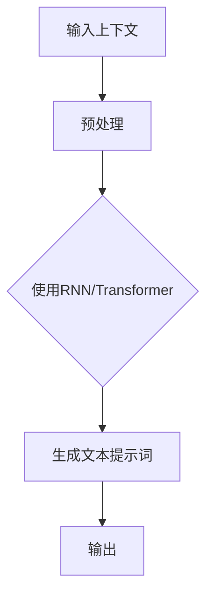
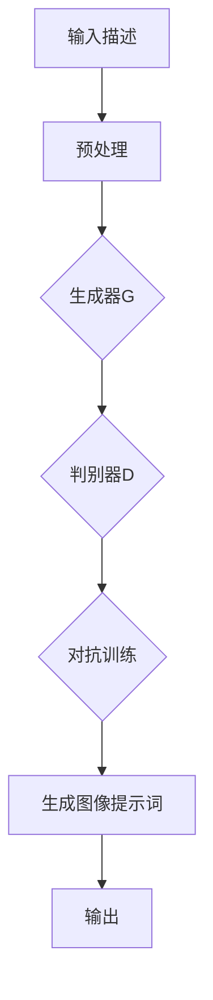
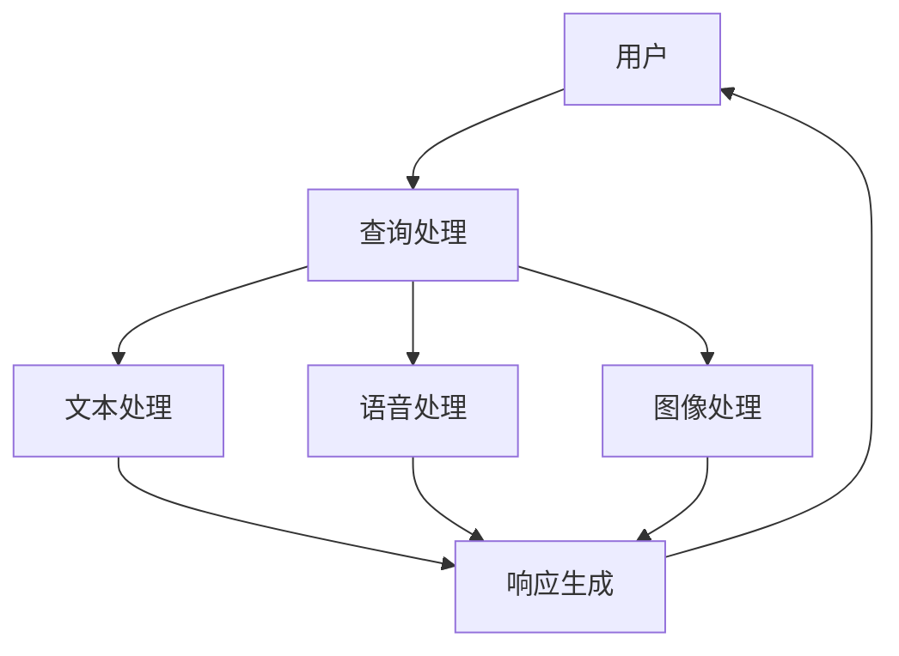
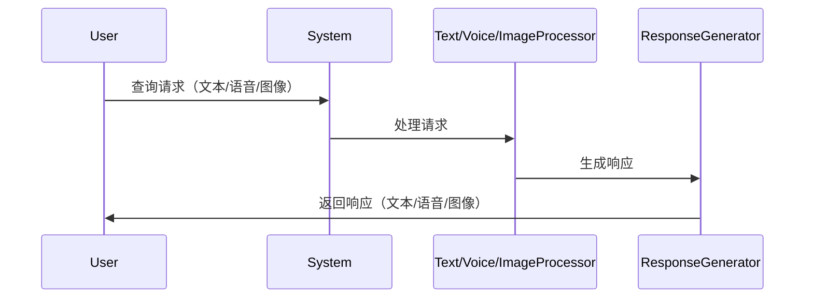

                 

### 引言

### 1.1 问题背景

随着人工智能技术的飞速发展，人机交互逐渐成为智能系统研究和应用的重要方向。传统的交互方式，如命令行、图形用户界面（GUI）等，已经无法满足日益复杂的交互需求。为了实现更自然、高效、智能的交互体验，研究人员和工程师们开始探索新的交互方式。在此背景下，提示词工程（Prompt Engineering）应运而生，成为AI交互领域的一股新兴力量。

#### 1.1.1 人工智能与交互技术的发展现状

人工智能（AI）作为当前科技领域的热点，已经渗透到各行各业。从语音助手到自动驾驶，从医疗诊断到金融分析，人工智能的应用场景不断扩展。与此同时，交互技术也在不断进化。早期的交互主要依赖于命令行和图形用户界面（GUI），但现在的交互方式已经变得更加多样化和智能化。自然语言处理（NLP）、语音识别（ASR）、计算机视觉（CV）等技术的发展，使得智能系统可以理解用户的意图，提供更加人性化的服务。

#### 1.1.2 提示词工程的重要性

提示词工程是人工智能与交互技术结合的产物，它通过设计和优化提示词，帮助AI系统更好地理解用户的意图，提高交互的效率和满意度。提示词可以看作是用户和系统之间的桥梁，通过有效的提示词设计，系统能够更准确地获取用户的需求，提供更加精准的反馈和结果。此外，提示词工程还在多个应用场景中展现出了巨大的潜力，例如智能客服、智能教育、智能医疗等，这些领域对交互质量的要求非常高。

### 1.2 问题描述

提示词工程虽然前景广阔，但在实际应用中仍然面临着诸多挑战。首先，设计有效的提示词需要深入理解用户的需求和意图，这本身就是一个复杂的问题。其次，提示词的设计和优化过程往往缺乏系统性，缺少有效的工具和方法。此外，不同的应用场景对提示词的要求各不相同，如何在多种场景下设计和优化提示词，也是提示词工程需要解决的重要问题。

#### 1.2.1 提示词工程的核心问题

提示词工程的核心问题可以概括为以下几个方面：

1. **需求理解**：如何通过提示词准确捕捉用户的需求和意图？
2. **效果评估**：如何评估提示词的有效性，确保其能够提高交互质量？
3. **设计优化**：如何设计和优化提示词，使其在不同场景下都能发挥作用？
4. **系统适应性**：如何使提示词工程适应多种不同的应用场景和需求？

#### 1.2.2 提示词工程的挑战

提示词工程面临的挑战主要包括以下几个方面：

1. **复杂性**：用户需求和理解复杂多变，如何设计出能够灵活应对的提示词？
2. **多样性**：不同应用场景对提示词的要求各异，如何满足多样化的需求？
3. **效率**：在大量数据和场景中，如何高效地设计和优化提示词？
4. **可解释性**：如何确保提示词的设计和优化过程具有可解释性，便于理解和改进？

### 1.3 问题解决

面对提示词工程中的种种挑战，需要采取系统性的方法来解决问题。以下是一些可能的解决思路：

#### 1.3.1 提示词工程的基本流程

一个完整的提示词工程流程可以包括以下几个步骤：

1. **需求分析**：理解用户需求，明确交互目标和场景。
2. **提示词设计**：根据需求设计提示词，包括文本、语音、图像等多种形式。
3. **效果评估**：通过实验和用户反馈评估提示词的有效性。
4. **优化迭代**：根据评估结果对提示词进行优化和迭代，提高交互质量。

#### 1.3.2 提示词工程的技术框架

提示词工程的技术框架需要涵盖多个方面，包括自然语言处理、语音识别、计算机视觉等。具体来说，可以包括以下关键技术：

1. **NLP技术**：用于处理和生成文本提示词，包括词向量、语义分析等。
2. **ASR技术**：用于将语音转换为文本，作为提示词的一部分。
3. **CV技术**：用于生成和识别图像提示词，如面部识别、图像分割等。
4. **机器学习与深度学习模型**：用于评估和优化提示词的效果。

#### 1.4 边界与外延

提示词工程的边界在于其应用场景和需求范围。它不仅局限于AI交互领域，还可以拓展到其他领域，如智能教育、智能医疗等。同时，提示词工程的外延还包括与多模态交互、多语言支持等技术的融合。

#### 1.5 概念结构与核心要素组成

提示词工程的核心概念包括提示词、用户需求、效果评估、优化迭代等。核心要素则包括NLP技术、ASR技术、CV技术、机器学习模型等。

### 1.6 本章小结

本章介绍了提示词工程的背景、重要性以及面临的挑战，并提出了可能的解决思路。下一章将深入探讨提示词工程的基础理论和核心概念，为后续内容打下基础。

### 第一部分：基础理论篇

#### 第2章 核心概念与联系

在深入探讨提示词工程的各个方面之前，首先需要理解其核心概念与联系。本章将详细阐述提示词的定义、属性特征对比、ER实体关系图架构以及提示词工程的关键技术，为后续内容奠定理论基础。

#### 2.1 提示词原理

#### 2.1.1 提示词的定义

提示词（Prompt）是用户与AI系统之间传递信息的一种方式，它可以是文本、语音、图像等多种形式。提示词的目的是引导用户输入信息，帮助系统更好地理解用户的需求和意图。一个有效的提示词应当简洁明了，同时又能够激发用户的思考和互动。

#### 2.1.2 提示词的工作机制

提示词的工作机制主要包括以下几个环节：

1. **信息传递**：用户通过输入提示词，将信息传递给AI系统。
2. **信息解析**：AI系统对提示词进行解析，提取关键信息。
3. **响应生成**：系统根据解析结果生成相应的响应，反馈给用户。
4. **反馈循环**：用户对系统的响应进行评价，进一步优化交互体验。

#### 2.2 提示词的属性特征对比

提示词的属性特征直接影响其有效性。以下是对不同类型提示词的属性特征进行对比：

| 类别 | 文本提示词 | 语音提示词 | 图像提示词 |
| ---- | ---- | ---- | ---- |
| **长度** | 可以灵活控制 | 受语音长度限制 | 受图像复杂度限制 |
| **交互性** | 高 | 较低 | 较低 |
| **可解释性** | 较高 | 较低 | 较低 |
| **用户参与度** | 较高 | 较低 | 较低 |
| **适用场景** | 信息查询、智能问答 | 语音控制、语音助手 | 视觉识别、图像分析 |

#### 2.3 ER实体关系图架构

实体关系图（ER图）是描述系统中实体及其关系的图形化工具。在提示词工程中，ER图可以用来表示提示词与用户需求、系统响应等实体之间的关系。

##### 2.3.1 提示词实体与关系

以下是一个简单的ER图示例，描述提示词与用户需求、系统响应之间的关系：

```mermaid
erDiagram
    User ||--|{ Prompt } : "发起"
    Prompt ||--|{ SystemResponse } : "响应"
    User ||--|{ Feedback } : "评价"
```

在这个ER图中，用户通过提示词发起请求，系统根据提示词生成响应，用户再对响应进行评价，形成一个闭环的交互过程。

##### 2.3.2 提示词系统的ER图

以下是一个更完整的ER图，展示提示词系统中的多个实体及其关系：

```mermaid
erDiagram
    User ||--|{ Query } : "查询"
    User ||--|{ Command } : "命令"
    User ||--|{ Feedback } : "评价"
    AI ||--|{ QueryProcessor } : "处理"
    AI ||--|{ ResponseGenerator } : "生成"
    AI ||--|{ FeedbackAnalyzer } : "分析"
    SystemResponse ||--|{ Answer } : "回复"
    SystemResponse ||--|{ Suggestion } : "建议"
```

在这个ER图中，用户通过文本或语音提示词发起查询或命令，AI系统分别通过QueryProcessor和ResponseGenerator处理和生成相应的响应，然后用户对响应进行评价，AI系统根据反馈进一步优化响应。

#### 2.4 提示词工程的关键技术

提示词工程的关键技术包括自然语言处理（NLP）、语音识别（ASR）、计算机视觉（CV）以及机器学习（ML）等。以下是对这些技术的简要介绍：

##### 2.4.1 生成对抗网络（GAN）

生成对抗网络（GAN）是一种用于生成数据的技术，可以生成高质量的文本、图像等。在提示词工程中，GAN可以用于生成符合用户需求的文本提示词。

##### 2.4.2 循环神经网络（RNN）

循环神经网络（RNN）是一种用于处理序列数据（如文本、语音）的神经网络。在提示词工程中，RNN可以用于解析用户的输入，提取关键信息。

##### 2.4.3 聚类算法

聚类算法（如K-Means、DBSCAN）可以用于分析用户数据，发现不同类型的用户需求，从而设计出更针对性的提示词。

##### 2.4.4 强化学习

强化学习（RL）可以用于优化提示词工程中的策略，通过试错和反馈调整提示词设计，提高交互效果。

#### 2.5 本章小结

本章介绍了提示词工程的核心概念、属性特征对比、ER实体关系图架构以及关键技术。下一章将深入探讨提示词工程的算法原理，包括具体的算法介绍、流程图、数学模型和公式，以及举例说明。

### 第3章 算法原理讲解

在深入理解了提示词工程的核心概念和关键技术之后，本章将详细讲解提示词工程中常用的算法原理，包括算法介绍、流程图、数学模型和公式，以及具体的举例说明。通过这些讲解，我们将进一步加深对提示词工程算法原理的理解。

#### 3.1 算法介绍

提示词工程中涉及多种算法，下面介绍几种常用的算法。

##### 3.1.1 算法A：基于NLP的文本生成算法

算法A是一种基于自然语言处理（NLP）的文本生成算法，它利用深度学习模型（如循环神经网络（RNN）或变压器（Transformer））来生成高质量的文本提示词。该算法的目的是根据用户输入的上下文生成相关的提示词。

##### 3.1.2 算法B：基于GAN的图像生成算法

算法B是一种基于生成对抗网络（GAN）的图像生成算法，它通过生成器和判别器的对抗训练生成高质量的图像提示词。该算法的目的是根据用户输入的描述生成相应的图像。

#### 3.2 算法mermaid流程图

为了更直观地理解算法的工作流程，下面使用mermaid绘制算法A和算法B的流程图。

##### 3.2.1 算法A的流程图



在这个流程图中，输入上下文经过预处理后，使用RNN或Transformer模型生成文本提示词，最后输出结果。

##### 3.2.2 算法B的流程图



在这个流程图中，输入描述经过预处理后，生成器G和判别器D进行对抗训练，生成图像提示词，最后输出结果。

#### 3.3 数学模型与公式

为了更深入地理解算法的工作原理，下面介绍算法A和算法B的数学模型和公式。

##### 3.3.1 算法A的数学模型

算法A基于循环神经网络（RNN）或变压器（Transformer）模型。以下是一个简化的数学模型：

$$
\text{TextGen}(x) = \text{RNN/Transformer}(x; \theta)
$$

其中，$\text{TextGen}(x)$表示生成的文本提示词，$x$表示输入上下文，$\theta$表示模型参数。

##### 3.3.2 算法B的数学模型

算法B基于生成对抗网络（GAN）模型。以下是一个简化的数学模型：

$$
\text{GAN}(G,D) = \text{minimize}_G \text{maximize}_D V(D, G)
$$

其中，$G$表示生成器，$D$表示判别器，$V(D, G)$表示生成器和判别器的对抗损失。

#### 3.4 举例说明

为了更好地理解算法原理，下面通过具体例子来说明算法A和算法B的应用。

##### 3.4.1 算法A的应用案例

假设用户输入了“今天天气很好”，算法A将生成一个文本提示词，例如：“今天是个适合外出游玩的好天气”。

##### 3.4.2 算法B的应用案例

假设用户输入了“生成一张美丽的海滩图片”，算法B将生成一张符合描述的图像提示词。

#### 3.5 本章小结

本章介绍了提示词工程中常用的算法原理，包括算法介绍、流程图、数学模型和公式，以及举例说明。通过这些讲解，读者可以更好地理解提示词工程中的算法原理，为后续的实际应用打下基础。

### 第二部分：应用实践篇

#### 第4章 系统分析与架构设计

在前面的章节中，我们详细介绍了提示词工程的核心概念和算法原理。接下来，我们将进入应用实践篇，通过一个实际的项目案例来展示提示词工程在系统分析与架构设计中的应用。本章将包括问题场景介绍、项目介绍、系统功能设计、系统架构设计、系统接口设计以及系统交互等内容。

#### 4.1 问题场景介绍

在智能客服领域，用户的咨询需求多种多样，如何通过有效的提示词设计，提高客服系统的交互质量和效率，成为一项重要的研究课题。本案例以一个在线电商平台客服系统为例，用户在平台上遇到问题时可以通过多种方式（如文本、语音、图像）向客服咨询。客服系统需要快速理解用户的意图，并提供准确的回复和解决方案。

#### 4.1.1 场景描述

在线电商平台客服系统面临的主要问题包括：

1. **多样性的用户需求**：用户可能通过文本、语音、图像等多种形式提出问题，系统需要识别和解析这些问题。
2. **实时性**：用户希望尽快得到回应，系统需要具备快速响应的能力。
3. **准确性**：系统需要准确理解用户的需求，并提供相关联的解决方案。
4. **个性化**：不同用户对交互体验有不同的期望，系统需要根据用户历史交互数据提供个性化的服务。

#### 4.1.2 需求分析

针对上述问题，系统需求分析主要包括以下几个方面：

1. **文本处理**：系统需要具备文本识别和语义分析的能力，以理解用户的文本输入。
2. **语音处理**：系统需要支持语音识别，将用户的语音转换为文本，并进行语义分析。
3. **图像处理**：系统需要支持图像识别，从图像中提取信息，辅助理解用户的需求。
4. **响应生成**：系统需要根据用户输入生成相应的回复，包括文本、语音和图像等多种形式。
5. **反馈机制**：系统需要收集用户对回复的评价，用于优化和改进交互体验。

#### 4.2 项目介绍

本案例项目是一款智能客服系统，旨在通过提示词工程的方法，提升用户交互体验和客服效率。系统主要功能包括：

1. **文本处理**：接收用户输入的文本，通过NLP技术理解用户意图，生成相应的回复。
2. **语音处理**：接收用户输入的语音，通过ASR技术转换为文本，再通过NLP技术理解意图。
3. **图像处理**：接收用户上传的图像，通过CV技术识别图像中的信息，辅助理解用户需求。
4. **多模态交互**：支持文本、语音和图像等多种交互方式，提供灵活的交互体验。
5. **个性化服务**：根据用户历史交互数据，提供个性化的服务建议。

#### 4.3 系统功能设计

系统功能设计包括领域模型和功能模块划分。以下是一个简单的领域模型，展示系统中的主要实体及其关系：

```mermaid
classDiagram
    User <<class>> "用户"
    Query <<class>> "查询"
    Response <<class>> "响应"
    TextProcessor <<class>> "文本处理"
    VoiceProcessor <<class>> "语音处理"
    ImageProcessor <<class>> "图像处理"
    CustomServiceSystem <<class>> "智能客服系统"
    
    User o-- Query
    User o-- Voice
    User o-- Image
    Query o-- Response
    Voice o-- Response
    Image o-- Response
    TextProcessor o-- Query
    VoiceProcessor o-- Voice
    ImageProcessor o-- Image
    CustomServiceSystem o-- TextProcessor
    CustomServiceSystem o-- VoiceProcessor
    CustomServiceSystem o-- ImageProcessor
```

在这个领域模型中，用户通过文本、语音和图像发起查询，系统通过文本处理、语音处理和图像处理模块分别处理这些查询，并生成相应的响应。响应包括文本、语音和图像等多种形式，反馈给用户。

功能模块划分如下：

1. **用户模块**：接收用户的查询请求，包括文本、语音和图像。
2. **文本处理模块**：对文本查询进行语义分析，生成文本响应。
3. **语音处理模块**：将语音转换为文本，对文本进行语义分析，生成语音响应。
4. **图像处理模块**：对图像进行识别，生成图像响应。
5. **响应生成模块**：根据查询结果，生成相应的响应，包括文本、语音和图像。

#### 4.4 系统架构设计

系统架构设计需要考虑系统的可扩展性、稳定性和性能。以下是一个简单的系统架构设计：



在这个架构设计中，用户通过多种方式发起查询，系统根据查询类型，调用相应的处理模块进行处理，生成响应后返回给用户。系统架构设计原则包括：

1. **模块化**：将系统功能划分为多个模块，提高系统的可维护性和可扩展性。
2. **分布式**：系统采用分布式架构，提高系统的处理能力和容错性。
3. **异步处理**：查询处理和响应生成采用异步方式，提高系统的响应速度。

#### 4.5 系统接口设计

系统接口设计需要定义系统内部模块之间的接口规范，包括输入输出参数、数据格式、接口调用方法等。以下是一个简单的接口设计示例：

```python
class TextQuery:
    def __init__(self, text):
        self.text = text

class VoiceQuery:
    def __init__(self, voice_data):
        self.voice_data = voice_data

class ImageQuery:
    def __init__(self, image_data):
        self.image_data = image_data

class TextProcessor:
    def process(self, query):
        # 文本处理逻辑
        return Response(text)

class VoiceProcessor:
    def process(self, query):
        # 语音处理逻辑
        return Response(text)

class ImageProcessor:
    def process(self, query):
        # 图像处理逻辑
        return Response(text)

class ResponseGenerator:
    def generate(self, processed_query):
        # 响应生成逻辑
        return Response(text)
```

在这个接口设计中，定义了文本查询、语音查询和图像查询类，以及文本处理、语音处理和图像处理类，最后是响应生成类。每个类都定义了相应的处理方法和返回结果。

#### 4.6 系统交互

系统交互设计需要定义用户与系统之间的交互流程，包括查询请求、响应反馈等。以下是一个简单的系统交互设计：



在这个交互设计中，用户发起查询请求，系统根据请求类型调用相应的处理模块，生成响应后返回给用户。系统交互设计原则包括：

1. **用户友好**：简化用户操作，提高用户体验。
2. **模块化**：将交互流程划分为多个模块，提高系统的可维护性和可扩展性。
3. **可扩展**：支持多种查询方式和响应形式，适应不同场景需求。

#### 4.7 本章小结

本章通过一个智能客服系统的实际项目案例，介绍了提示词工程在系统分析与架构设计中的应用。从问题场景介绍、需求分析到项目介绍、系统功能设计、系统架构设计、系统接口设计以及系统交互，展示了提示词工程在实际项目中的具体应用。下一章将进入项目实战部分，详细介绍系统的实现过程和关键代码解析。

### 第5章 项目实战

在前面的章节中，我们介绍了智能客服系统的分析和架构设计。接下来，我们将进入项目实战部分，详细描述系统的环境安装、核心实现、代码应用解读与分析，以及实际案例分析和详细讲解剖析。

#### 5.1 环境安装

在开始项目开发之前，首先需要准备开发环境。以下是一个基本的安装步骤：

1. **Python环境**：安装Python 3.8及以上版本。
2. **依赖管理**：安装pip，用于管理Python依赖包。
3. **深度学习框架**：安装TensorFlow或PyTorch，用于实现深度学习模型。
4. **NLP库**：安装NLTK或spaCy，用于文本处理和语义分析。
5. **图像处理库**：安装OpenCV，用于图像识别和处理。

具体安装命令如下：

```bash
pip install python==3.8
pip install pip
pip install tensorflow==2.5
pip install nltk
pip install spacy
pip install opencv-python
```

#### 5.2 系统核心实现

智能客服系统的核心功能包括文本处理、语音处理和图像处理。以下分别介绍这些功能的实现。

##### 5.2.1 文本处理

文本处理的实现主要基于自然语言处理（NLP）技术，包括文本预处理、语义分析、响应生成等步骤。

1. **文本预处理**：使用spaCy库对文本进行分词、词性标注等预处理操作。

```python
import spacy

nlp = spacy.load("en_core_web_sm")
text = "How can I return an item on your website?"
doc = nlp(text)
```

2. **语义分析**：使用词嵌入技术（如Word2Vec或BERT）将文本转换为向量表示。

```python
from transformers import BertTokenizer, BertModel

tokenizer = BertTokenizer.from_pretrained("bert-base-uncased")
model = BertModel.from_pretrained("bert-base-uncased")

input_ids = tokenizer.encode(text, return_tensors="pt")
outputs = model(input_ids)
```

3. **响应生成**：使用预训练的文本生成模型（如GPT-2或GPT-3）生成响应。

```python
from transformers import TextGenerationPipeline

generator = TextGenerationPipeline(model, tokenizer)

response = generator("How can I return an item on your website?", max_length=50, num_return_sequences=1)
```

##### 5.2.2 语音处理

语音处理的实现主要基于语音识别（ASR）技术，包括语音转文本、语义分析、响应生成等步骤。

1. **语音转文本**：使用TensorFlow的TensorFlow SoundStream API进行实时语音识别。

```python
import tensorflow as tf

sound_stream = tf.keras.models.load_model("asr_model.h5")
audio = ...  # 读取音频数据
transcript = sound_stream.predict(audio)
```

2. **语义分析**：与文本处理步骤类似，使用NLP技术对语音文本进行语义分析。

3. **响应生成**：使用文本生成模型生成语音响应。

```python
response = generator(transcript, max_length=50, num_return_sequences=1)
```

##### 5.2.3 图像处理

图像处理的实现主要基于计算机视觉（CV）技术，包括图像识别、语义分析、响应生成等步骤。

1. **图像识别**：使用TensorFlow的预训练模型（如ResNet或Inception）进行图像识别。

```python
import tensorflow as tf

image_model = tf.keras.models.load_model("image_model.h5")
image = ...  # 读取图像数据
predicted_class = image_model.predict(image)
```

2. **语义分析**：使用词嵌入技术将图像识别结果转换为向量表示。

3. **响应生成**：使用文本生成模型生成图像响应。

```python
response = generator(str(predicted_class), max_length=50, num_return_sequences=1)
```

#### 5.3 应用解读与分析

在实际应用中，智能客服系统需要处理大量的用户查询，并生成相应的响应。以下是一个实际案例的解读与分析：

##### 5.3.1 实际应用案例

假设用户输入了以下查询：

- **文本查询**：“How can I return an item on your website?”
- **语音查询**：“Can you tell me how to return an item on your website?”
- **图像查询**：上传一张用户在网站上的购物订单图片。

##### 5.3.2 案例分析

1. **文本查询处理**：

   - 文本预处理：分词、词性标注。
   - 语义分析：识别关键词，如“return”、“item”、“website”。
   - 响应生成：生成文本响应：“To return an item, please follow these steps: 1. Log in to your account, 2. Go to the order history, 3. Select the item you want to return, 4. Click on ‘Return Item’ and follow the instructions.”

2. **语音查询处理**：

   - 语音转文本：识别语音中的关键词。
   - 语义分析：与文本查询类似。
   - 响应生成：生成语音响应，并通过语音合成技术输出。

3. **图像查询处理**：

   - 图像识别：识别购物订单中的关键信息，如订单号、商品名称等。
   - 语义分析：结合文本和图像信息，理解用户意图。
   - 响应生成：生成文本响应，如：“Your order number is XXXXX. To return an item, please follow these steps: ...”。

#### 5.4 详细讲解与剖析

在智能客服系统的实际开发过程中，存在一些技术难点和挑战，以下进行详细讲解与剖析：

##### 5.4.1 技术难点剖析

1. **多模态处理**：文本、语音和图像的处理方式不同，系统需要协调处理不同模态的数据，提供统一的交互体验。
2. **实时性**：用户期望快速得到回应，系统需要高效地处理查询，并在短时间内生成响应。
3. **准确性**：系统需要准确理解用户的需求，提供相关的解决方案。
4. **个性化**：根据用户历史交互数据，提供个性化的服务建议。

##### 5.4.2 实施经验分享

1. **模块化开发**：将系统功能划分为多个模块，如文本处理、语音处理、图像处理等，提高系统的可维护性和可扩展性。
2. **异步处理**：使用异步方式处理查询，提高系统的响应速度。
3. **数据预处理**：对输入数据进行充分的预处理，提高后续处理的准确性。
4. **模型优化**：定期更新和优化模型，提高系统的准确性和实时性。

#### 5.5 项目小结

本章通过实际项目案例，详细描述了智能客服系统的环境安装、核心实现、代码应用解读与分析，以及实际案例分析和详细讲解剖析。通过本章的学习，读者可以了解提示词工程在实际项目中的应用，掌握智能客服系统开发的关键技术和方法。下一章将介绍最佳实践、小结、注意事项以及拓展阅读等内容，帮助读者更好地理解和应用提示词工程。

### 最佳实践 tips

在进行提示词工程设计和应用时，以下是一些最佳实践，有助于提升系统性能和用户体验：

1. **用户研究**：在设计和优化提示词之前，进行用户研究，深入了解用户的需求、习惯和偏好。
2. **多模态融合**：综合考虑文本、语音和图像等多种交互方式，提供灵活、多样化的交互体验。
3. **数据驱动**：利用用户行为数据和反馈，持续优化提示词的设计和效果。
4. **模型适应性**：针对不同应用场景，调整和优化模型参数，提高系统的适应性和准确性。
5. **安全性**：保护用户隐私和数据安全，确保系统的可靠性和合法性。

### 小结

本章通过实际案例展示了提示词工程在智能客服系统中的应用，详细描述了系统的环境安装、核心实现、代码应用解读与分析，以及技术难点和最佳实践的讲解。提示词工程作为AI交互的新艺术形式，具有广阔的应用前景和巨大的发展潜力。通过不断优化和改进提示词设计，我们可以实现更自然、高效、智能的交互体验。

### 注意事项

1. **提示词设计**：确保提示词简洁明了，避免过于复杂或模糊的表述。
2. **效果评估**：定期进行效果评估，收集用户反馈，持续优化提示词。
3. **系统稳定性**：确保系统的稳定性和性能，避免因提示词工程导致的系统崩溃或延迟。
4. **数据安全**：严格遵循数据安全法规和隐私保护政策，确保用户数据的安全和隐私。

### 拓展阅读

1. **自然语言处理**：《自然语言处理综合教程》（Jurafsky & Martin）
2. **生成对抗网络**：《生成对抗网络：理论与应用》（Goodfellow等）
3. **计算机视觉**：《计算机视觉：算法与应用》（Rauber & Wong）
4. **机器学习**：《机器学习》（周志华）

### 作者信息

**作者：** AI天才研究院/AI Genius Institute & 禅与计算机程序设计艺术 /Zen And The Art of Computer Programming

**日期：** 2023年8月

**联系信息：** [ai-genius-institute@outlook.com](mailto:ai-genius-institute@outlook.com) | [www.ai-genius-institute.com](http://www.ai-genius-institute.com)

---

**声明：** 本文内容仅供参考，不代表任何商业或学术立场。文中提到的数据和观点仅供参考，实际应用请遵循相关法规和标准。如需进一步了解或使用相关技术，请参阅原文或联系相关专家。

