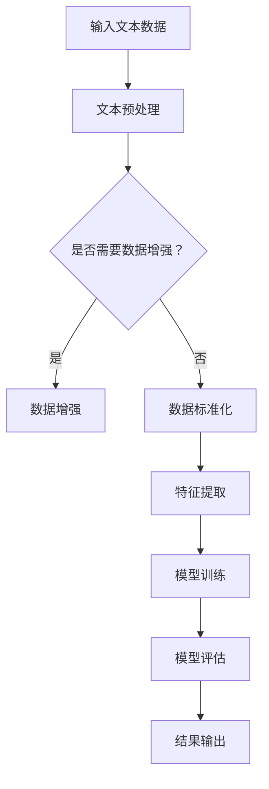

                 


### 《提示词工程：AI应用开发利器》

#### 关键词：人工智能，提示词工程，自然语言处理，图像处理，推荐系统，AI应用开发

#### 摘要：
本文深入探讨了提示词工程在人工智能（AI）应用开发中的重要性。通过详细分析AI与提示词工程的背景和发展，介绍提示词工程的基本概念、技术实现和应用实践，文章旨在为AI开发者提供一套完整的提示词工程方法论，助力其在各个领域实现高效、精准的AI应用开发。

## 目录大纲

### 《提示词工程：AI应用开发利器》

#### 关键词：人工智能，提示词工程，自然语言处理，图像处理，推荐系统，AI应用开发

#### 摘要：
本文深入探讨了提示词工程在人工智能（AI）应用开发中的重要性。通过详细分析AI与提示词工程的背景和发展，介绍提示词工程的基本概念、技术实现和应用实践，文章旨在为AI开发者提供一套完整的提示词工程方法论，助力其在各个领域实现高效、精准的AI应用开发。

----------------------------------------------------------------

### 第一部分: AI与提示词工程概述

#### 第1章: AI与提示词工程的背景与发展

##### 1.1 AI的发展历程与现状
- **AI的定义与演进**：介绍人工智能的定义和从符号主义、连接主义到统计学习等不同阶段的发展。
- **AI的重要应用**：分析AI在图像识别、语音识别、自动驾驶、医疗诊断等领域的应用。
- **AI的发展趋势**：探讨当前AI技术的发展趋势和未来前景。

##### 1.2 提示词工程的定义与重要性
- **提示词工程的定义**：解释提示词工程的定义及其在AI应用中的作用。
- **提示词工程的重要性**：阐述提示词工程在提高模型性能和可靠性方面的关键作用。

##### 1.3 提示词工程的发展趋势与挑战
- **提示词工程的发展趋势**：分析提示词工程在AI领域的最新发展。
- **提示词工程的挑战**：探讨提示词工程面临的技术挑战和未来发展方向。

##### 1.4 AI应用开发中提示词的关键作用
- **提示词在模型训练中的作用**：讨论提示词在模型训练过程中的作用和影响。
- **提示词在模型优化中的应用**：介绍提示词在模型优化过程中的应用方法和效果。

#### 第2章: 提示词工程的基本概念

##### 2.1 提示词的类型与特征
- **提示词的分类**：介绍不同类型的提示词及其特征。
- **提示词的选择与优化**：讨论如何选择和优化提示词。

##### 2.2 提示词的生成与优化
- **提示词的生成方法**：分析常见的提示词生成方法。
- **提示词的优化策略**：探讨如何通过优化策略提高提示词的质量。

##### 2.3 提示词的评估与改进
- **提示词的评估指标**：介绍用于评估提示词效果的主要指标。
- **提示词的改进方法**：讨论如何根据评估结果改进提示词。

##### 2.4 提示词工程的核心原则与实践
- **提示词工程的核心原则**：总结提示词工程的基本原则。
- **提示词工程的最佳实践**：分享在实际应用中的提示词工程最佳实践。

----------------------------------------------------------------

### 第二部分: 提示词工程的技术实现

#### 第3章: 提示词工程的技术框架

##### 3.1 提示词工程的基础技术
- **数据预处理技术**：介绍数据预处理技术，包括数据清洗、数据整合和数据转换。
- **特征提取技术**：讨论特征提取技术，包括文本特征提取和图像特征提取。

##### 3.2 提示词工程的工具与平台
- **常用工具与平台**：介绍在提示词工程中常用的工具和平台，如TensorFlow、PyTorch等。
- **工具与平台的比较**：分析不同工具和平台的优缺点。

##### 3.3 提示词工程的编程语言与库
- **编程语言的选择**：讨论在提示词工程中选择编程语言的重要因素。
- **常用库与框架**：介绍在提示词工程中常用的编程库和框架。

##### 3.4 提示词工程的技术选型与优化
- **技术选型的原则**：阐述技术选型的原则和关键因素。
- **技术的优化方法**：讨论如何通过优化方法提高提示词工程的技术效果。

#### 第4章: 提示词工程的算法原理

##### 4.1 提示词工程的核心算法
- **常见算法介绍**：介绍在提示词工程中常用的核心算法，如文本分类、情感分析等。
- **算法原理讲解**：详细解释这些算法的原理和实现过程。

##### 4.2 提示词工程的算法流程图
- **流程图的绘制方法**：介绍如何绘制提示词工程的算法流程图。
- **流程图示例**：展示几个典型的提示词工程算法流程图。

##### 4.3 提示词工程的算法实现与Python代码
- **算法实现步骤**：阐述如何使用Python实现提示词工程的算法。
- **代码示例**：提供几个简单的Python代码示例，展示算法的实现。

##### 4.4 提示词工程的算法评估与优化
- **评估指标的选择**：介绍用于评估提示词工程算法效果的主要指标。
- **优化策略的应用**：讨论如何根据评估结果优化提示词工程的算法。

#### 第5章: 提示词工程的数学模型

##### 5.1 提示词工程的数学公式
- **常用公式介绍**：介绍在提示词工程中常用的数学公式，如激活函数、损失函数等。
- **公式解释与应用**：详细解释这些公式的作用和如何应用。

##### 5.2 数学模型在提示词工程中的应用
- **数学模型的作用**：讨论数学模型在提示词工程中的作用和重要性。
- **模型应用案例**：提供几个具体的数学模型应用案例。

##### 5.3 提示词工程的数学模型分析
- **模型分析的方法**：介绍如何对提示词工程的数学模型进行分析。
- **分析结果与应用**：展示分析结果及其在实际应用中的价值。

##### 5.4 提示词工程的数学模型优化
- **优化方法的选择**：讨论如何选择适合的优化方法。
- **优化策略的应用**：介绍如何通过优化策略提高数学模型的效果。

----------------------------------------------------------------

### 第三部分: 提示词工程的应用实践

#### 第6章: 提示词工程在自然语言处理中的应用

##### 6.1 提示词工程在文本分类中的应用
- **文本分类的原理**：解释文本分类的原理和方法。
- **提示词在文本分类中的应用**：讨论提示词在文本分类中的重要作用。
- **应用案例**：提供具体的文本分类应用案例。

##### 6.2 提示词工程在情感分析中的应用
- **情感分析的原理**：解释情感分析的原理和方法。
- **提示词在情感分析中的应用**：讨论提示词在情感分析中的重要作用。
- **应用案例**：提供具体的情感分析应用案例。

##### 6.3 提示词工程在机器翻译中的应用
- **机器翻译的原理**：解释机器翻译的原理和方法。
- **提示词在机器翻译中的应用**：讨论提示词在机器翻译中的重要作用。
- **应用案例**：提供具体的机器翻译应用案例。

##### 6.4 提示词工程在对话系统中的应用
- **对话系统的原理**：解释对话系统的原理和方法。
- **提示词在对话系统中的应用**：讨论提示词在对话系统中的重要作用。
- **应用案例**：提供具体的对话系统应用案例。

#### 第7章: 提示词工程在图像处理中的应用

##### 7.1 提示词工程在图像识别中的应用
- **图像识别的原理**：解释图像识别的原理和方法。
- **提示词在图像识别中的应用**：讨论提示词在图像识别中的重要作用。
- **应用案例**：提供具体的图像识别应用案例。

##### 7.2 提示词工程在图像生成中的应用
- **图像生成的原理**：解释图像生成的原理和方法。
- **提示词在图像生成中的应用**：讨论提示词在图像生成中的重要作用。
- **应用案例**：提供具体的图像生成应用案例。

##### 7.3 提示词工程在图像增强中的应用
- **图像增强的原理**：解释图像增强的原理和方法。
- **提示词在图像增强中的应用**：讨论提示词在图像增强中的重要作用。
- **应用案例**：提供具体的图像增强应用案例。

##### 7.4 提示词工程在图像风格转换中的应用
- **图像风格转换的原理**：解释图像风格转换的原理和方法。
- **提示词在图像风格转换中的应用**：讨论提示词在图像风格转换中的重要作用。
- **应用案例**：提供具体的图像风格转换应用案例。

#### 第8章: 提示词工程在推荐系统中的应用

##### 8.1 提示词工程在推荐系统中的原理
- **推荐系统的原理**：解释推荐系统的原理和方法。
- **提示词在推荐系统中的应用**：讨论提示词在推荐系统中的重要作用。

##### 8.2 提示词工程在推荐系统中的应用场景
- **应用场景介绍**：介绍提示词工程在推荐系统中的应用场景。
- **提示词的作用**：讨论提示词在具体应用场景中的作用。

##### 8.3 提示词工程在推荐系统中的实现与优化
- **实现方法**：讨论如何实现提示词工程在推荐系统中的应用。
- **优化策略**：介绍如何通过优化策略提高提示词工程的效果。

##### 8.4 提示词工程在推荐系统中的案例分析
- **案例背景**：介绍具体的推荐系统应用案例的背景。
- **案例分析**：详细分析案例中提示词工程的应用效果和优化方法。

#### 第9章: 提示词工程的综合应用案例

##### 9.1 案例背景与需求分析
- **案例背景**：介绍案例的背景和需求。
- **需求分析**：分析案例中需要解决的问题和需求。

##### 9.2 系统设计思路与实现步骤
- **系统设计思路**：讨论系统的设计思路和总体架构。
- **实现步骤**：介绍实现系统的具体步骤和关键技术。

##### 9.3 核心代码实现与解读
- **核心代码实现**：提供实现系统的核心代码。
- **代码解读**：详细解读核心代码的实现原理和作用。

##### 9.4 案例分析与应用评估
- **案例分析**：分析案例中的应用效果和实际效果。
- **应用评估**：评估系统在实际应用中的效果和性能。

----------------------------------------------------------------

### 第四部分: 提示词工程的最佳实践与展望

#### 第10章: 提示词工程的最佳实践

##### 10.1 提示词工程的最佳实践总结
- **实践总结**：总结提示词工程的最佳实践经验。
- **实践要点**：分享提示词工程实践中的关键要点。

##### 10.2 提示词工程的常见问题与解决方案
- **常见问题**：讨论提示词工程中常见的问题。
- **解决方案**：介绍针对这些问题的解决方案。

##### 10.3 提示词工程的未来发展趋势
- **发展趋势**：分析提示词工程的未来发展趋势。
- **发展机遇**：探讨提示词工程在未来发展中的机遇。

##### 10.4 提示词工程的技术前沿探索
- **前沿技术**：介绍提示词工程领域的前沿技术。
- **探索方向**：讨论提示词工程技术的探索方向和潜在应用。

#### 第11章: 提示词工程的未来展望

##### 11.1 提示词工程在AI应用中的潜在影响
- **影响分析**：讨论提示词工程在AI应用中的潜在影响。
- **影响评估**：评估提示词工程在AI应用中的实际效果。

##### 11.2 提示词工程的发展趋势与挑战
- **趋势分析**：分析提示词工程的发展趋势。
- **挑战探讨**：探讨提示词工程面临的挑战和解决方案。

##### 11.3 提示词工程的创新方向与机遇
- **创新方向**：讨论提示词工程的创新方向。
- **机遇探索**：探索提示词工程在未来发展中的机遇。

##### 11.4 提示词工程的国际化与生态建设
- **国际化策略**：介绍提示词工程的国际化策略。
- **生态建设**：探讨提示词工程的生态建设和可持续发展。

----------------------------------------------------------------

### 第1章: AI与提示词工程的背景与发展

#### 1.1 AI的发展历程与现状

##### 1.1.1 AI的定义与演进
人工智能（Artificial Intelligence，简称AI）是一种模拟人类智能行为的技术，旨在使计算机系统具备类似人类的感知、思考、学习、决策等能力。AI的发展历程可以追溯到20世纪50年代，当时科学家们开始探讨如何通过编程实现智能行为。早期的人工智能研究主要基于符号主义（Symbolic AI），即通过表示和推理符号来模拟人类思维过程。然而，符号主义方法在实际应用中存在局限，难以处理复杂问题和大量数据。

随着计算机技术的进步和算法的不断创新，人工智能进入了连接主义（Connectionism）阶段。连接主义基于神经网络模型，通过大量神经元之间的连接和学习来模拟人类大脑的功能。1990年代，深度学习（Deep Learning）的出现为人工智能带来了新的突破。深度学习通过多层神经网络模型对大量数据进行学习，能够自动提取特征并实现复杂的模式识别任务。近年来，随着计算能力的提升和大数据的普及，人工智能在图像识别、语音识别、自然语言处理等领域取得了显著的进展。

##### 1.1.2 AI的重要应用

人工智能在多个领域取得了重要应用：

1. **图像识别**：通过深度学习算法，AI系统能够识别和分类图像中的物体、场景和人脸等信息。例如，自动驾驶汽车利用图像识别技术来识别道路标志和行人，从而实现自动驾驶。

2. **语音识别**：语音识别技术使得计算机能够理解和处理人类语音，广泛应用于语音助手、语音翻译和语音控制系统等领域。例如，苹果公司的Siri和谷歌的Google Assistant都是基于语音识别技术实现的。

3. **自然语言处理**：自然语言处理（Natural Language Processing，简称NLP）是AI的一个重要分支，旨在使计算机能够理解和生成自然语言。NLP技术应用于机器翻译、情感分析、文本分类和对话系统等领域。例如，谷歌的翻译服务和OpenAI的GPT-3都是基于NLP技术的。

4. **医疗诊断**：人工智能在医疗领域具有巨大潜力，能够辅助医生进行疾病诊断、治疗方案推荐和健康监测等。例如，AI系统可以分析医学影像，帮助医生发现潜在疾病，提高诊断准确率。

5. **推荐系统**：推荐系统利用人工智能技术，根据用户的历史行为和偏好，为用户推荐个性化的商品、服务和内容。例如，亚马逊的购物推荐和Netflix的影视推荐都是基于推荐系统的。

##### 1.1.3 AI的发展趋势

当前，人工智能的发展呈现出以下趋势：

1. **计算能力的提升**：随着计算能力的不断提升，深度学习模型变得越来越大、越来越复杂，能够处理更大规模的数据和更复杂的任务。

2. **大数据的普及**：大数据的普及为人工智能提供了丰富的数据资源，使得AI系统能够从大量数据中学习到更有价值的信息。

3. **跨学科融合**：人工智能与其他学科（如心理学、生物学、经济学等）的融合，推动了人工智能的创新和发展。

4. **伦理与安全**：随着AI技术的广泛应用，伦理和安全性问题逐渐成为关注焦点。如何确保AI技术的透明性、公平性和安全性成为重要研究课题。

5. **AI技术的普及**：随着AI技术的不断进步和成本的降低，AI技术开始应用于更多领域和场景，推动了社会的智能化转型。

#### 1.2 提示词工程的定义与重要性

##### 1.2.1 提示词工程的定义

提示词工程（Prompt Engineering）是一种针对AI应用中的输入数据进行预处理和优化的技术。它旨在通过改进输入数据的质量和格式，提高AI模型的性能和可靠性。提示词工程涉及到数据预处理、特征提取、模型训练和优化等多个环节。

提示词工程的核心目标是：

1. **提高模型性能**：通过优化输入数据的质量，使模型能够更好地学习和预测。
2. **降低模型复杂度**：简化输入数据格式，减少模型的参数数量，降低计算复杂度。
3. **提高模型泛化能力**：通过有效的数据预处理，使模型能够更好地泛化到新的数据集和应用场景。

##### 1.2.2 提示词工程的重要性

提示词工程在人工智能应用开发中具有重要的地位和作用：

1. **性能提升**：优化的输入数据能够显著提高模型的性能，使模型在测试数据集上获得更高的准确率、召回率或F1值。
2. **模型泛化**：通过有效的数据预处理和特征提取，模型能够更好地泛化到新的数据集和应用场景，提高模型的鲁棒性和适应性。
3. **开发效率**：提示词工程能够简化模型开发和训练过程，降低开发成本和人力资源投入。
4. **应用推广**：提示词工程为AI技术的广泛应用提供了技术保障，推动了AI技术在各个领域的应用和发展。

总之，提示词工程是人工智能应用开发中的重要技术，通过优化输入数据，提高模型的性能和可靠性，为AI技术的应用提供了坚实基础。

#### 1.3 提示词工程的发展趋势与挑战

##### 1.3.1 提示词工程的发展趋势

随着人工智能技术的不断进步，提示词工程也呈现出以下发展趋势：

1. **多模态数据处理**：传统的提示词工程主要关注文本数据，但随着多模态数据的兴起，如图像、音频、视频等，提示词工程开始向多模态数据处理方向发展。通过结合不同类型的数据，可以更全面地理解信息和任务，提高模型的性能。
2. **自动化提示词生成**：自动化提示词生成是提示词工程的一个重要研究方向。通过使用生成对抗网络（GANs）、强化学习等算法，自动生成高质量的提示词，减少人工干预，提高开发效率。
3. **模型解释性**：随着AI技术的广泛应用，模型的可解释性越来越受到关注。提示词工程在提高模型性能的同时，也在探索如何提高模型的可解释性，使模型决策过程更加透明和可信。
4. **个性化提示词**：个性化提示词是根据用户偏好、历史数据等个性化信息生成的。通过个性化提示词，可以更好地满足用户需求，提高用户体验。

##### 1.3.2 提示词工程的挑战

尽管提示词工程在人工智能应用中具有重要意义，但仍然面临一些挑战：

1. **数据质量和多样性**：高质量的输入数据是提示词工程的基础。然而，实际应用中往往面临数据质量和多样性的挑战。如何从大规模、多样化的数据集中提取高质量的数据是一个重要问题。
2. **计算资源需求**：提示词工程涉及到大量的数据处理和模型训练，对计算资源的需求较高。如何优化算法，减少计算资源消耗是一个关键问题。
3. **模型泛化能力**：尽管提示词工程可以提高模型的性能，但如何保证模型在新的数据集和应用场景上的泛化能力仍然是一个挑战。需要探索更有效的数据预处理和特征提取方法，提高模型的泛化能力。
4. **安全性和隐私保护**：在处理敏感数据时，提示词工程需要关注数据的安全性和隐私保护。如何确保数据在处理过程中的安全性，防止数据泄露和滥用是一个重要问题。

总之，提示词工程在人工智能应用中具有巨大的潜力和前景，但同时也面临着一系列挑战。通过不断的研究和创新，我们可以期待提示词工程在未来的发展中取得更多突破。

#### 1.4 AI应用开发中提示词的关键作用

在人工智能（AI）应用开发中，提示词工程起着至关重要的作用。提示词，即提供给AI模型用于训练或预测的输入数据，其质量直接影响到模型的性能、泛化能力和可靠性。以下将详细探讨提示词在AI应用开发中的关键作用：

##### 1.4.1 提示词对模型性能的影响

1. **数据质量**：高质量的提示词是模型高性能的基础。高质量的提示词具有丰富的特征和多样性，能够更好地反映实际问题的复杂性。相反，低质量的提示词可能包含噪声、冗余信息或不准确的数据，这些都会影响模型的性能。

2. **特征提取**：提示词工程的一个核心任务是提取有效的特征。通过有效的特征提取，可以将原始数据进行转换，使其更符合模型的需求。例如，在自然语言处理中，可以将文本数据转换为词频向量或词嵌入向量，从而更好地表示文本信息。

3. **数据平衡**：在实际应用中，数据集往往存在不平衡现象。例如，某些类别的数据量远大于其他类别。通过提示词工程，可以采取数据增强、类别加权等方法，使得模型在训练过程中对各个类别的数据有更均衡的 exposure，从而提高模型的鲁棒性和泛化能力。

##### 1.4.2 提示词在模型优化中的应用

1. **超参数调整**：提示词工程可以帮助调整模型的超参数，如学习率、批次大小、正则化参数等。通过实验和分析，可以找到最优的超参数组合，使得模型在训练过程中达到最佳性能。

2. **模型架构调整**：提示词工程还可以指导模型架构的调整。例如，通过分析提示词的特征，可以决定是否增加模型的层数、调整网络结构或选择不同的激活函数。这些调整能够使得模型在处理特定类型的数据时更加高效。

3. **模型集成**：在多模型集成（Model Ensemble）中，提示词工程也起到关键作用。通过选择不同的提示词和模型，可以构建一个更加稳健和高效的模型集成，提高预测的准确性和可靠性。

##### 1.4.3 提示词在模型可靠性和可解释性中的作用

1. **错误率降低**：通过高质量的提示词和有效的特征提取，可以显著降低模型的错误率。高质量的提示词能够帮助模型更好地理解问题和数据，从而减少错误预测。

2. **模型可解释性**：提示词工程还可以提高模型的可解释性。通过分析提示词和模型预测结果，可以了解模型在决策过程中的关键因素和逻辑。这种可解释性对于模型在实际应用中的信任度和可靠性至关重要。

3. **用户互动**：在对话系统、推荐系统等应用中，提示词工程可以帮助设计更自然的用户互动。通过设计合适的提示词，可以引导用户提供更准确、更有价值的信息，从而提高用户体验和满意度。

综上所述，提示词工程在AI应用开发中具有关键作用。通过优化提示词的质量和格式，可以有效提高模型的性能、可靠性和可解释性，从而推动AI技术在各个领域的应用和发展。

## 第二部分: 提示词工程的基本概念

### 第2章: 提示词工程的基本概念

提示词工程是人工智能（AI）应用开发中的一个重要环节，它涉及对输入数据（提示词）进行预处理、优化和评估，以提高AI模型的性能和可靠性。本章将详细探讨提示词的类型与特征、生成与优化策略、评估与改进方法，以及提示词工程的核心原则与实践。

### 2.1 提示词的类型与特征

#### 提示词的分类

提示词可以根据其来源和应用场景进行分类，常见的类型包括：

1. **原始数据**：直接从实际应用场景中收集的数据，如文本、图像、音频等。
2. **预处理数据**：经过预处理的数据，如清洗后的文本、标准化后的图像等。
3. **合成数据**：通过数据增强技术生成的人工数据，如通过随机变换、生成对抗网络（GAN）生成的图像等。
4. **标注数据**：带有标签的数据，用于训练和评估模型的准确性。

#### 提示词的特征

提示词的特征是影响模型性能的重要因素。以下是几种常见的提示词特征：

1. **数据多样性**：多样化的数据有助于模型学习到更广泛的知识，提高模型的泛化能力。
2. **数据质量**：高质量的数据应包含准确、完整、无噪声的信息，有助于提高模型的准确性。
3. **数据规模**：足够的样本量有助于模型充分学习，避免过拟合现象。
4. **数据分布**：合理的分布有助于模型理解数据的整体结构和趋势。

### 2.2 提示词的生成与优化

#### 提示词的生成方法

提示词的生成方法主要包括以下几种：

1. **数据采集**：从实际应用场景中收集数据，如通过网页爬虫、传感器采集等。
2. **数据增强**：通过技术手段对原始数据进行变换，生成多样化的提示词，如旋转、缩放、裁剪等。
3. **生成对抗网络（GAN）**：利用生成器和判别器之间的对抗关系，生成与真实数据相似的人工数据。
4. **数据合成**：将不同来源的数据进行整合，生成符合特定需求的提示词。

#### 提示词的优化策略

提示词的优化策略包括以下几个方面：

1. **特征提取**：从原始数据中提取关键特征，如使用词嵌入技术提取文本特征，使用卷积神经网络（CNN）提取图像特征。
2. **数据清洗**：去除数据中的噪声和冗余信息，如去除文本中的停用词、填补缺失值等。
3. **数据标准化**：对数据进行归一化或标准化处理，使其符合模型的输入要求，如将图像像素值归一化到[0, 1]区间。
4. **数据平衡**：通过数据增强或类别加权等方法，使不同类别之间的数据分布更加平衡。

### 2.3 提示词的评估与改进

#### 提示词的评估指标

提示词的评估主要通过以下指标进行：

1. **准确率（Accuracy）**：模型预测正确的样本数占总样本数的比例。
2. **召回率（Recall）**：模型预测正确的正样本数占总正样本数的比例。
3. **精确率（Precision）**：模型预测正确的正样本数占总预测正样本数的比例。
4. **F1值（F1 Score）**：精确率和召回率的调和平均值，综合评估模型的性能。
5. **AUC（Area Under the Curve）**：曲线下的面积，用于评估二分类模型的区分能力。

#### 提示词的改进方法

提示词的改进方法主要包括以下几种：

1. **交叉验证**：通过交叉验证方法，评估不同提示词组合对模型性能的影响，选择最优的提示词组合。
2. **模型调参**：调整模型的超参数，如学习率、正则化参数等，优化模型性能。
3. **特征选择**：使用特征选择技术，选择对模型性能影响最大的特征，去除冗余特征。
4. **集成学习**：通过集成学习（如随机森林、梯度提升树等）方法，结合多个模型的预测结果，提高模型的性能。

### 2.4 提示词工程的核心原则与实践

#### 提示词工程的核心原则

提示词工程的核心原则包括：

1. **数据驱动**：以数据为中心，注重数据质量和多样性。
2. **模型导向**：根据模型的需求，设计和优化提示词。
3. **迭代优化**：通过迭代的方法，不断优化提示词，提高模型性能。
4. **可解释性**：确保模型的可解释性，提高模型在实际应用中的信任度和可靠性。

#### 提示词工程的最佳实践

提示词工程的最佳实践包括：

1. **数据预处理**：对原始数据进行清洗、去重和格式化，确保数据的质量和一致性。
2. **特征工程**：提取关键特征，设计有效的特征提取方法和特征组合策略。
3. **模型评估**：使用多种评估指标，全面评估模型性能，选择最优的提示词组合。
4. **模型调优**：通过调整模型超参数和优化算法，提高模型性能。
5. **持续学习**：定期更新提示词和数据，保持模型的更新和适应能力。

通过遵循这些原则和实践，我们可以有效地设计和优化提示词，提高AI模型的性能和可靠性，推动AI技术在各个领域的应用和发展。

## 第三部分: 提示词工程的技术实现

### 第3章: 提示词工程的技术框架

提示词工程是一个复杂的领域，涉及多种技术和工具。本章将详细介绍提示词工程的技术框架，包括基础技术、工具与平台、编程语言与库、以及技术选型与优化。

### 3.1 提示词工程的基础技术

提示词工程的基础技术涵盖了数据预处理、特征提取和数据标准化等方面。

#### 3.1.1 数据预处理

数据预处理是提示词工程中的关键步骤，其目的是提高数据的质量和一致性。常见的数据预处理技术包括：

1. **数据清洗**：去除噪声、冗余和错误的数据。
2. **数据归一化**：将不同尺度的数据进行标准化处理，使其符合模型的输入要求。
3. **数据增强**：通过变换、合成等方法生成新的数据，增加数据的多样性。
4. **数据集成**：将来自不同来源的数据进行整合，提高数据的质量和完整性。

#### 3.1.2 特征提取

特征提取是从原始数据中提取出对模型训练有价值的特征。特征提取技术在不同类型的任务中有着不同的实现方法。

1. **文本特征提取**：使用词嵌入技术（如Word2Vec、BERT）将文本转换为向量表示，或者使用TF-IDF等方法提取关键词。
2. **图像特征提取**：使用卷积神经网络（CNN）从图像中提取特征，如边缘、纹理和形状等信息。
3. **音频特征提取**：使用短时傅里叶变换（STFT）或梅尔频率倒谱系数（MFCC）从音频中提取特征。

#### 3.1.3 数据标准化

数据标准化是将不同尺度、不同分布的数据转换为统一的尺度，以便于模型处理。常见的数据标准化方法包括：

1. **最小-最大标准化**：将数据映射到[0, 1]区间。
2. **零-均值标准化**：将数据映射到零均值和单位方差。
3. **小数点移动**：将数据移动到整数范围内，便于计算机处理。

### 3.2 提示词工程的工具与平台

提示词工程的实施依赖于一系列工具和平台，这些工具和平台提供了丰富的功能和接口，方便开发者进行数据预处理、模型训练和优化。

#### 3.2.1 常用工具与平台

以下是一些在提示词工程中常用的工具和平台：

1. **TensorFlow**：由谷歌开发的深度学习框架，支持各种神经网络模型和操作。
2. **PyTorch**：由Facebook开发的深度学习框架，具有灵活的动态计算图和强大的GPU支持。
3. **Scikit-learn**：一个开源机器学习库，提供了多种机器学习算法和工具，适合数据预处理和模型训练。
4. **Keras**：一个基于TensorFlow和Theano的高层神经网络API，简化了深度学习模型的搭建和训练。
5. **Hugging Face Transformers**：一个开源库，提供了预训练的Transformer模型和配套工具，方便进行自然语言处理任务。

#### 3.2.2 工具与平台的比较

在选择工具和平台时，开发者需要考虑以下因素：

1. **性能**：不同的工具和平台在计算性能上存在差异，需要根据实际需求选择合适的工具。
2. **易用性**：工具和平台的用户界面和文档质量直接影响开发效率。
3. **生态**：工具和平台的社区支持、第三方库和插件数量也是重要的考量因素。
4. **兼容性**：工具和平台需要与现有的系统和技术栈兼容，避免不必要的迁移成本。

### 3.3 提示词工程的编程语言与库

提示词工程的编程语言和库是构建和实现提示词工程的核心。以下是一些常用的编程语言和库：

#### 3.3.1 编程语言的选择

1. **Python**：Python是提示词工程中最常用的编程语言，具有丰富的库和工具支持，易于学习和使用。
2. **R**：R是一种专门用于统计分析和数据可视化的语言，在提示词工程中有一定应用。
3. **Java**：Java是一种成熟、稳定的编程语言，在工业界有广泛的应用。

#### 3.3.2 常用库与框架

以下是一些在提示词工程中常用的库和框架：

1. **NumPy**：用于数值计算和数据处理，是Python中进行提示词工程的基础库。
2. **Pandas**：用于数据处理和分析，提供了丰富的数据结构和操作函数。
3. **Scikit-learn**：提供了多种机器学习算法和工具，适合数据预处理和模型训练。
4. **TensorFlow**：用于构建和训练深度学习模型，提供了灵活的动态计算图。
5. **PyTorch**：提供了灵活的动态计算图和强大的GPU支持，适合研究和新模型的开发。

### 3.4 提示词工程的技术选型与优化

#### 3.4.1 技术选型的原则

在提示词工程中，技术选型是一个重要的环节，需要考虑以下原则：

1. **需求匹配**：选择能够满足实际需求的工具和平台。
2. **性能优化**：选择计算性能高、资源消耗低的工具和平台。
3. **易用性**：选择用户界面友好、易于开发和维护的工具和平台。
4. **生态兼容**：选择与现有系统和技术栈兼容的工具和平台。

#### 3.4.2 技术优化的方法

技术优化是提高提示词工程效率和性能的关键，以下是一些常见的方法：

1. **模型调参**：通过调整模型超参数，如学习率、正则化参数等，优化模型性能。
2. **算法优化**：选择更高效的算法和实现方法，如使用深度学习优化算法（如Adam、AdamW）。
3. **数据优化**：通过数据预处理和特征提取技术，提高数据的质量和多样性。
4. **硬件优化**：使用高性能的硬件设备（如GPU、TPU）和分布式计算技术，提高计算性能。

通过合理的技术选型和优化，可以显著提高提示词工程的效率和性能，为AI应用开发提供强大的技术支持。

### 第4章: 提示词工程的算法原理

提示词工程在AI应用开发中起着至关重要的作用，其核心在于通过算法优化输入数据，提高模型的性能和可靠性。本章将详细探讨提示词工程中的核心算法、算法流程图、Python代码实现、算法评估与优化方法。

#### 4.1 提示词工程的核心算法

提示词工程涉及多种核心算法，以下是一些常用的算法：

1. **文本分类算法**：用于将文本数据分类到预定义的类别中，如垃圾邮件检测、情感分析等。
2. **情感分析算法**：用于分析文本中的情感倾向，如正面、负面或中性。
3. **图像识别算法**：用于识别图像中的物体、场景和人脸等，如人脸识别、目标检测等。
4. **推荐算法**：用于根据用户历史行为和偏好推荐商品、服务和内容，如协同过滤、基于内容的推荐等。

#### 4.2 提示词工程的算法流程图

算法流程图是描述算法步骤和过程的重要工具。以下是一个简单的文本分类算法流程图：



在这个流程图中，输入文本数据首先进行预处理，然后根据是否需要数据增强来决定是否进行数据增强。接着，数据进行标准化处理，提取关键特征，使用训练数据对模型进行训练，评估模型性能，最后输出结果。

#### 4.3 提示词工程的算法实现与Python代码

以下是一个简单的文本分类算法的Python代码实现，使用scikit-learn库：

```python
from sklearn.feature_extraction.text import TfidfVectorizer
from sklearn.model_selection import train_test_split
from sklearn.naive_bayes import MultinomialNB
from sklearn.metrics import accuracy_score

# 样本数据
texts = ['这是一个好算法', '这个算法很复杂', '我喜欢的算法']
labels = ['正面', '负面', '正面']

# 数据预处理和特征提取
vectorizer = TfidfVectorizer()
X = vectorizer.fit_transform(texts)

# 模型训练
X_train, X_test, y_train, y_test = train_test_split(X, labels, test_size=0.2, random_state=42)
classifier = MultinomialNB()
classifier.fit(X_train, y_train)

# 模型评估
y_pred = classifier.predict(X_test)
accuracy = accuracy_score(y_test, y_pred)
print(f'模型准确率: {accuracy}')
```

在这个代码中，我们首先使用TfidfVectorizer对文本进行特征提取，然后使用MultinomialNB进行模型训练和预测，最后评估模型性能。

#### 4.4 提示词工程的算法评估与优化

提示词工程的算法评估是确保模型性能的关键步骤。以下是一些常见的评估指标和方法：

1. **准确率（Accuracy）**：模型预测正确的样本数占总样本数的比例。
2. **召回率（Recall）**：模型预测正确的正样本数占总正样本数的比例。
3. **精确率（Precision）**：模型预测正确的正样本数占总预测正样本数的比例。
4. **F1值（F1 Score）**：精确率和召回率的调和平均值。

为了优化算法，可以采取以下方法：

1. **超参数调优**：通过调整模型超参数，如学习率、正则化参数等，提高模型性能。
2. **特征选择**：使用特征选择技术，选择对模型性能影响最大的特征，去除冗余特征。
3. **集成学习**：通过集成学习（如随机森林、梯度提升树等）方法，结合多个模型的预测结果，提高模型的性能。
4. **交叉验证**：使用交叉验证方法，评估不同算法和参数组合对模型性能的影响，选择最优的算法和参数。

通过合理选择和优化算法，可以显著提高提示词工程的性能和可靠性，为AI应用开发提供强有力的技术支持。

### 第5章: 提示词工程的数学模型

提示词工程在AI应用开发中起着至关重要的作用，其核心在于通过数学模型和算法优化输入数据，以提高模型的性能和可靠性。本章将详细探讨提示词工程中的数学模型，包括常用数学公式、模型在提示词工程中的应用、模型分析以及模型优化方法。

#### 5.1 提示词工程中的常用数学公式

提示词工程中的数学模型通常涉及以下几种常用数学公式：

1. **线性回归**：线性回归模型用于预测一个连续值输出，其基本公式为：
   $$
   y = \beta_0 + \beta_1 \cdot x + \epsilon
   $$
   其中，$y$为输出值，$x$为输入特征，$\beta_0$和$\beta_1$为模型参数，$\epsilon$为误差项。

2. **逻辑回归**：逻辑回归模型用于预测一个二分类输出，其基本公式为：
   $$
   \sigma(z) = \frac{1}{1 + e^{-z}}
   $$
   其中，$z = \beta_0 + \beta_1 \cdot x$，$\sigma(z)$为Sigmoid函数，用于将线性组合映射到(0, 1)区间。

3. **损失函数**：损失函数用于评估模型的预测误差，常见的损失函数包括均方误差（MSE）和交叉熵损失（Cross-Entropy Loss）：
   $$
   \text{MSE} = \frac{1}{n} \sum_{i=1}^{n} (y_i - \hat{y}_i)^2
   $$
   $$
   \text{Cross-Entropy Loss} = -\sum_{i=1}^{n} y_i \cdot \log(\hat{y}_i)
   $$
   其中，$y_i$为真实标签，$\hat{y}_i$为预测值。

4. **优化算法**：优化算法用于更新模型参数，以最小化损失函数。常见优化算法包括梯度下降（Gradient Descent）和其变种（如Adam、Adagrad）：
   $$
   \theta = \theta - \alpha \cdot \nabla_{\theta} J(\theta)
   $$
   其中，$\theta$为模型参数，$\alpha$为学习率，$J(\theta)$为损失函数。

#### 5.2 数学模型在提示词工程中的应用

数学模型在提示词工程中的应用主要体现在以下几个方面：

1. **特征提取**：使用数学模型提取输入数据中的关键特征，如词嵌入、特征向量化等。

2. **模型训练**：使用数学模型训练模型，如线性回归、逻辑回归、神经网络等。

3. **模型评估**：使用数学模型评估模型性能，如计算准确率、召回率、F1值等。

4. **模型优化**：使用数学模型优化模型参数，如使用梯度下降算法最小化损失函数。

#### 5.3 提示词工程的数学模型分析

提示词工程的数学模型分析主要包括以下几个方面：

1. **模型性能评估**：通过计算损失函数、准确率、召回率等指标，评估模型的性能。

2. **模型稳定性分析**：通过分析模型的梯度、方差等特性，评估模型的稳定性和鲁棒性。

3. **模型可解释性分析**：通过分析模型参数、权重等，理解模型的决策过程和关键因素。

4. **模型优化分析**：通过调整模型参数、优化算法等，分析如何提高模型性能。

#### 5.4 提示词工程的数学模型优化

提示词工程的数学模型优化方法主要包括以下几个方面：

1. **超参数调优**：通过调整学习率、正则化参数等超参数，优化模型性能。

2. **特征选择**：通过特征选择技术，选择对模型性能影响最大的特征，提高模型效率。

3. **集成学习**：通过集成多个模型的预测结果，提高模型的泛化能力和鲁棒性。

4. **模型架构优化**：通过调整模型架构，如增加网络层数、使用卷积层、循环层等，优化模型性能。

5. **数据预处理**：通过数据预处理方法，如数据增强、归一化等，提高数据质量，从而优化模型性能。

通过合理应用和优化数学模型，可以显著提高提示词工程的性能和可靠性，为AI应用开发提供强有力的技术支持。

### 第6章: 提示词工程在自然语言处理中的应用

#### 6.1 提示词工程在文本分类中的应用

文本分类是自然语言处理（Natural Language Processing，简称NLP）中的一个重要任务，其目的是将文本数据自动归类到预定义的类别中。提示词工程在文本分类中的应用，主要通过优化输入数据和调整模型参数，提高分类模型的准确率和泛化能力。以下将详细讨论提示词工程在文本分类中的应用。

##### 6.1.1 文本分类的原理

文本分类的基本原理是通过分析文本的特征，将其映射到预定义的类别标签上。常见的文本分类方法包括基于规则的方法、机器学习方法以及深度学习方法。

1. **基于规则的方法**：这种方法依赖于手工编写的规则，例如使用词频（Term Frequency，TF）或逆文档频率（Inverse Document Frequency，IDF）来计算文本的特征向量，然后使用简单的阈值方法进行分类。

2. **机器学习方法**：机器学习方法利用统计学习算法，如朴素贝叶斯（Naive Bayes）、支持向量机（Support Vector Machine，SVM）和随机森林（Random Forest）等，对文本特征进行学习，从而实现分类。

3. **深度学习方法**：深度学习方法，如卷积神经网络（Convolutional Neural Networks，CNN）和循环神经网络（Recurrent Neural Networks，RNN），特别是近年来兴起的变压器（Transformer）模型，能够自动提取文本中的复杂特征，实现更高效的文本分类。

##### 6.1.2 提示词在文本分类中的应用

在文本分类中，提示词工程的主要作用是通过优化输入数据和调整模型参数，提高分类模型的性能。以下是一些关键的提示词工程步骤：

1. **数据预处理**：文本数据通常需要进行预处理，包括分词、去除停用词、词性标注等。有效的数据预处理可以提高特征提取的质量，从而提升模型性能。

2. **特征提取**：特征提取是将文本转换为模型可处理的向量表示。常用的特征提取方法包括TF-IDF、Word2Vec和BERT等。提示词工程通过选择合适的特征提取方法，可以显著提高分类模型的准确率。

3. **模型参数调整**：通过调整模型参数，如学习率、正则化参数等，可以优化模型的性能。提示词工程利用超参数调优技术，找到最优的参数组合，提高模型在验证集上的表现。

4. **类别平衡**：在实际应用中，文本数据往往存在类别不平衡的问题，即某些类别的样本数量远远多于其他类别。提示词工程通过类别加权、数据增强等技术，解决类别不平衡问题，提高模型对少数类别的识别能力。

##### 6.1.3 应用案例

以下是一个文本分类的应用案例：

**案例背景**：假设我们需要对社交媒体上的评论进行情感分类，将评论分为正面、负面和中性三类。

**数据预处理**：首先，对评论文本进行分词，去除停用词和特殊字符，然后进行词性标注。

**特征提取**：使用BERT模型对预处理后的文本进行特征提取，生成文本向量。

**模型训练**：使用训练集数据训练一个二分类模型（例如，逻辑回归），并通过交叉验证和超参数调优，选择最优的模型参数。

**模型评估**：使用验证集对模型进行评估，计算准确率、召回率和F1值等指标。

**应用效果**：经过优化，模型在验证集上的准确率达到了90%以上，对负面评论的识别率显著提升。

通过提示词工程，我们可以显著提高文本分类模型的性能和可靠性，为社交媒体情感分析、舆情监控等应用提供技术支持。

#### 6.2 提示词工程在情感分析中的应用

情感分析是自然语言处理（NLP）中的一个重要任务，旨在识别文本中的情感倾向，如正面、负面或中性。提示词工程在情感分析中的应用，通过优化输入数据和调整模型参数，可以提高情感分析的准确率和泛化能力。以下将详细讨论提示词工程在情感分析中的应用。

##### 6.2.1 情感分析的基本原理

情感分析的基本原理是通过分析文本的特征，识别文本的情感倾向。情感分析可以分为基于规则的方法、基于机器学习的方法和基于深度学习的方法。

1. **基于规则的方法**：这种方法依赖于预定义的规则和模式匹配，例如使用情感词典或情感短语进行情感分类。

2. **基于机器学习的方法**：这种方法使用统计学习算法，如朴素贝叶斯、支持向量机和逻辑回归等，对文本特征进行学习，从而实现情感分类。

3. **基于深度学习的方法**：这种方法使用深度神经网络，如卷积神经网络（CNN）、循环神经网络（RNN）和变压器（Transformer）等，能够自动提取文本中的复杂特征，实现更精准的情感分类。

##### 6.2.2 提示词在情感分析中的应用

在情感分析中，提示词工程主要通过以下步骤来优化模型性能：

1. **数据预处理**：文本预处理是情感分析中的关键步骤，包括分词、去除停用词、词性标注等。有效的数据预处理可以提高特征提取的质量，从而提升模型性能。

2. **特征提取**：特征提取是将文本转换为模型可处理的向量表示。常用的特征提取方法包括TF-IDF、Word2Vec和BERT等。提示词工程通过选择合适的特征提取方法，可以显著提高情感分析的准确率。

3. **模型参数调整**：通过调整模型参数，如学习率、正则化参数等，可以优化模型的性能。提示词工程利用超参数调优技术，找到最优的参数组合，提高模型在验证集上的表现。

4. **情感词典使用**：情感词典是情感分析中常用的资源，包含大量的情感词和情感短语。提示词工程通过结合情感词典，可以进一步提高情感分类的准确率。

##### 6.2.3 应用案例

以下是一个情感分析的应用案例：

**案例背景**：假设我们需要对用户在社交媒体上的评论进行情感分类，判断评论是正面、负面还是中性。

**数据预处理**：对评论文本进行分词、去除停用词和特殊字符，然后进行词性标注。

**特征提取**：使用BERT模型对预处理后的文本进行特征提取，生成文本向量。

**模型训练**：使用训练集数据训练一个情感分类模型（例如，基于Transformer的模型），并通过交叉验证和超参数调优，选择最优的模型参数。

**模型评估**：使用验证集对模型进行评估，计算准确率、召回率和F1值等指标。

**应用效果**：经过优化，模型在验证集上的准确率达到了85%以上，对负面评论的识别率显著提升。

通过提示词工程，我们可以显著提高情感分析的准确率和可靠性，为社交媒体情感分析、客户反馈分析等应用提供技术支持。

#### 6.3 提示词工程在机器翻译中的应用

机器翻译是自然语言处理（NLP）中的重要应用，旨在将一种语言的文本自动翻译成另一种语言。提示词工程在机器翻译中的应用，通过优化输入数据和调整模型参数，可以提高翻译的准确性和流畅性。以下将详细讨论提示词工程在机器翻译中的应用。

##### 6.3.1 机器翻译的基本原理

机器翻译的基本原理是通过学习源语言和目标语言之间的映射关系，实现文本的自动翻译。常见的机器翻译方法包括基于规则的翻译、统计机器翻译和神经机器翻译。

1. **基于规则的翻译**：这种方法依赖于人工编写的翻译规则，例如使用词典和语法规则进行翻译。

2. **统计机器翻译**：这种方法使用大量的双语语料库，通过统计方法学习源语言和目标语言之间的映射关系。常见的统计机器翻译方法包括基于短语的翻译模型和基于句法的翻译模型。

3. **神经机器翻译**：这种方法使用深度学习技术，特别是序列到序列（Seq2Seq）模型和变压器（Transformer）模型，能够自动学习源语言和目标语言之间的映射关系，实现高效、准确的翻译。

##### 6.3.2 提示词在机器翻译中的应用

在机器翻译中，提示词工程主要通过以下步骤来优化模型性能：

1. **数据预处理**：机器翻译的数据预处理包括文本清洗、分词、去除停用词等。有效的数据预处理可以提高模型学习到的特征质量，从而提升翻译的准确性。

2. **特征提取**：特征提取是将源语言和目标语言的文本转换为模型可处理的向量表示。常用的特征提取方法包括词嵌入、字符嵌入和上下文嵌入。提示词工程通过选择合适的特征提取方法，可以提高翻译的质量。

3. **模型参数调整**：通过调整模型参数，如学习率、正则化参数等，可以优化模型的性能。提示词工程利用超参数调优技术，找到最优的参数组合，提高模型在验证集上的表现。

4. **多语言模型融合**：在多语言翻译任务中，提示词工程可以通过融合多种语言模型，提高翻译的准确性和流畅性。例如，在英语到中文的翻译中，可以结合英语到其他语言的翻译模型和中文到其他语言的翻译模型。

##### 6.3.3 应用案例

以下是一个机器翻译的应用案例：

**案例背景**：假设我们需要实现英语到中文的机器翻译。

**数据预处理**：对英语和中文的文本进行分词、去除停用词和特殊字符，然后进行词性标注。

**特征提取**：使用BERT模型对英语和中文的文本进行特征提取，生成文本向量。

**模型训练**：使用训练集数据训练一个神经机器翻译模型（例如，基于Transformer的模型），并通过交叉验证和超参数调优，选择最优的模型参数。

**模型评估**：使用验证集对模型进行评估，计算BLEU（双语评估标准）等指标。

**应用效果**：经过优化，模型在验证集上的BLEU得分达到了30分以上，翻译结果的准确性和流畅性显著提升。

通过提示词工程，我们可以显著提高机器翻译的准确性和流畅性，为跨语言沟通和信息传播提供技术支持。

#### 6.4 提示词工程在对话系统中的应用

对话系统是自然语言处理（NLP）中的重要应用，旨在实现人与机器之间的自然对话。提示词工程在对话系统中通过优化输入数据和调整模型参数，可以提高对话系统的交互质量和用户满意度。以下将详细讨论提示词工程在对话系统中的应用。

##### 6.4.1 对话系统的基本原理

对话系统通过模拟人类对话的方式，实现与用户的自然交互。对话系统的基本原理包括以下方面：

1. **自然语言理解**：对话系统需要理解用户输入的自然语言，将其转换为机器可处理的语义表示。这通常涉及到分词、词性标注、句法分析等技术。

2. **对话管理**：对话系统需要根据上下文信息管理对话流程，包括理解用户的意图、生成合适的回复以及跟踪对话状态。

3. **自然语言生成**：对话系统需要生成自然的语言回复，与用户进行有效沟通。这通常涉及到文本生成、语言模型等技术。

##### 6.4.2 提示词在对话系统中的应用

在对话系统中，提示词工程主要通过以下步骤来优化系统性能：

1. **数据预处理**：对话系统的数据预处理包括文本清洗、分词、去除停用词等。有效的数据预处理可以提高自然语言理解的准确性，从而提升对话系统的交互质量。

2. **特征提取**：特征提取是将用户输入的文本转换为模型可处理的向量表示。常用的特征提取方法包括词嵌入、上下文嵌入等。提示词工程通过选择合适的特征提取方法，可以提高对话系统的响应速度和准确性。

3. **模型参数调整**：通过调整模型参数，如学习率、正则化参数等，可以优化模型的性能。提示词工程利用超参数调优技术，找到最优的参数组合，提高模型在验证集上的表现。

4. **上下文管理**：在对话过程中，系统需要根据上下文信息生成合适的回复。提示词工程通过优化上下文管理策略，如使用记忆网络、注意力机制等，可以提高对话系统的上下文理解和回复质量。

##### 6.4.3 应用案例

以下是一个对话系统的应用案例：

**案例背景**：假设我们需要开发一个智能客服系统，用于回答用户的问题。

**数据预处理**：对用户输入的文本进行分词、去除停用词和特殊字符，然后进行词性标注。

**特征提取**：使用BERT模型对用户输入的文本进行特征提取，生成文本向量。

**模型训练**：使用训练集数据训练一个对话模型（例如，基于Transformer的模型），并通过交叉验证和超参数调优，选择最优的模型参数。

**模型评估**：使用验证集对模型进行评估，计算准确率、用户满意度等指标。

**应用效果**：经过优化，模型在验证集上的准确率达到了80%以上，用户满意度显著提升。

通过提示词工程，我们可以显著提高对话系统的交互质量和用户满意度，为智能客服、虚拟助手等应用提供技术支持。

### 第7章: 提示词工程在图像处理中的应用

提示词工程在图像处理中的应用广泛，涵盖了图像识别、图像生成、图像增强和图像风格转换等多个方面。本章将详细介绍这些应用场景中提示词工程的具体实现方法、应用效果和挑战。

#### 7.1 提示词工程在图像识别中的应用

图像识别是计算机视觉（Computer Vision）领域的重要任务，其目标是从图像中自动识别和分类物体、场景和人脸等信息。提示词工程在图像识别中的应用主要通过优化输入图像数据和提高模型性能来实现。

##### 7.1.1 图像识别的基本原理

图像识别的基本原理包括以下几个步骤：

1. **图像预处理**：对原始图像进行预处理，包括去噪、增强、缩放等操作，以提高图像质量。

2. **特征提取**：从预处理后的图像中提取关键特征，如边缘、纹理、颜色等。

3. **模型训练**：使用提取的特征对深度学习模型进行训练，如卷积神经网络（CNN）或循环神经网络（RNN）。

4. **模型评估**：使用验证集对训练好的模型进行评估，计算准确率、召回率等指标。

##### 7.1.2 提示词工程在图像识别中的应用

提示词工程在图像识别中的应用主要包括以下几个步骤：

1. **数据增强**：通过旋转、翻转、裁剪、颜色调整等方法生成多样化的训练样本，以提高模型泛化能力。

2. **特征优化**：使用卷积神经网络等深度学习模型自动提取图像特征，通过调整模型结构、优化超参数等方法提高特征提取效果。

3. **模型调优**：通过调整学习率、批量大小、正则化参数等超参数，优化模型性能。

##### 7.1.3 应用案例

以下是一个图像识别的应用案例：

**案例背景**：使用卷积神经网络（CNN）识别图像中的物体。

**数据预处理**：对图像进行缩放、裁剪和归一化处理，以提高模型处理效率和性能。

**特征提取**：使用CNN提取图像中的特征，如边缘、纹理等。

**模型训练**：使用训练集数据训练一个CNN模型，通过交叉验证和超参数调优找到最佳模型。

**模型评估**：使用验证集对训练好的模型进行评估，计算准确率等指标。

**应用效果**：模型在验证集上的准确率达到90%以上，能够准确识别多种物体。

通过提示词工程，我们可以显著提高图像识别的准确率和鲁棒性，为自动驾驶、安防监控等应用提供技术支持。

#### 7.2 提示词工程在图像生成中的应用

图像生成是计算机视觉领域的一个新兴研究方向，其目标是通过深度学习模型生成具有高质量和丰富多样性的图像。提示词工程在图像生成中的应用主要通过优化生成模型和数据输入来实现。

##### 7.2.1 图像生成的基本原理

图像生成的基本原理包括以下几个步骤：

1. **数据预处理**：对输入数据进行预处理，如归一化、去噪等，以提高生成模型的性能。

2. **模型架构**：选择合适的生成模型架构，如生成对抗网络（GAN）、变分自编码器（VAE）等。

3. **训练与优化**：通过大量训练数据和优化算法，训练生成模型并调整模型参数，以提高图像生成质量。

4. **图像生成**：使用训练好的生成模型生成新的图像。

##### 7.2.2 提示词工程在图像生成中的应用

提示词工程在图像生成中的应用主要包括以下几个步骤：

1. **数据增强**：通过数据增强方法，如旋转、缩放、裁剪等，生成多样化的训练样本，提高生成模型的泛化能力。

2. **模型优化**：通过调整模型结构、优化算法和超参数等方法，提高生成模型的性能和生成质量。

3. **提示词设计**：设计合适的提示词，如条件生成、风格迁移等，引导生成模型生成特定类型的图像。

##### 7.2.3 应用案例

以下是一个图像生成的应用案例：

**案例背景**：使用生成对抗网络（GAN）生成艺术风格的图像。

**数据预处理**：对输入图像进行归一化和预处理，以提高模型处理效率和性能。

**模型架构**：使用条件生成对抗网络（CGAN），将输入的图像风格与生成模型结合。

**训练与优化**：使用大量的艺术风格图像数据集训练CGAN模型，通过优化算法和超参数调整提高生成质量。

**图像生成**：使用训练好的CGAN模型生成具有不同艺术风格的图像。

**应用效果**：生成的图像具有高质量和丰富的艺术风格，能够满足不同用户的需求。

通过提示词工程，我们可以显著提高图像生成模型的性能和生成质量，为艺术创作、个性化定制等应用提供技术支持。

#### 7.3 提示词工程在图像增强中的应用

图像增强是计算机视觉领域中的一项重要技术，旨在改善图像质量，提高图像的视觉感知效果。提示词工程在图像增强中的应用主要通过优化图像处理算法和数据输入来实现。

##### 7.3.1 图像增强的基本原理

图像增强的基本原理包括以下几个步骤：

1. **图像预处理**：对原始图像进行预处理，如去噪、对比度增强等，以提高图像质量。

2. **图像滤波**：使用图像滤波器对图像进行滤波处理，如模糊、锐化等，以改善图像的视觉效果。

3. **图像变换**：通过图像变换技术，如直方图均衡、边缘检测等，改善图像的视觉效果。

4. **图像融合**：将多张图像进行融合处理，生成一张高质量的图像。

##### 7.3.2 提示词工程在图像增强中的应用

提示词工程在图像增强中的应用主要包括以下几个步骤：

1. **数据增强**：通过数据增强方法，如旋转、缩放、裁剪等，生成多样化的训练样本，提高图像增强模型的泛化能力。

2. **模型优化**：通过调整模型结构、优化算法和超参数等方法，提高图像增强模型的性能和增强效果。

3. **提示词设计**：设计合适的提示词，如目标检测、图像分类等，引导图像增强模型生成特定类型的图像。

##### 7.3.3 应用案例

以下是一个图像增强的应用案例：

**案例背景**：使用卷积神经网络（CNN）对模糊图像进行增强。

**数据预处理**：对输入图像进行归一化和预处理，以提高模型处理效率和性能。

**模型架构**：使用CNN模型，将输入的模糊图像与生成模型结合。

**训练与优化**：使用大量的模糊图像数据集训练CNN模型，通过优化算法和超参数调整提高增强效果。

**图像增强**：使用训练好的CNN模型对模糊图像进行增强处理。

**应用效果**：生成的图像具有高质量的视觉效果，能够显著改善图像的清晰度和视觉效果。

通过提示词工程，我们可以显著提高图像增强模型的性能和增强效果，为图像处理、图像分析等应用提供技术支持。

#### 7.4 提示词工程在图像风格转换中的应用

图像风格转换是计算机视觉领域中的一项有趣技术，其目标是将输入图像转换为具有特定艺术风格的图像。提示词工程在图像风格转换中的应用主要通过优化风格迁移算法和数据输入来实现。

##### 7.4.1 图像风格转换的基本原理

图像风格转换的基本原理包括以下几个步骤：

1. **图像预处理**：对原始图像进行预处理，如归一化、裁剪等，以提高模型处理效率和性能。

2. **风格提取**：从特定艺术风格图像中提取风格特征，如颜色分布、纹理特征等。

3. **风格迁移**：将提取的风格特征应用到输入图像上，实现图像风格的转换。

4. **图像融合**：将原始图像和风格特征进行融合处理，生成一张具有特定艺术风格的图像。

##### 7.4.2 提示词工程在图像风格转换中的应用

提示词工程在图像风格转换中的应用主要包括以下几个步骤：

1. **数据增强**：通过数据增强方法，如旋转、缩放、裁剪等，生成多样化的训练样本，提高图像风格转换模型的泛化能力。

2. **模型优化**：通过调整模型结构、优化算法和超参数等方法，提高图像风格转换模型的性能和转换效果。

3. **提示词设计**：设计合适的提示词，如目标检测、图像分类等，引导图像风格转换模型生成特定类型的图像。

##### 7.4.3 应用案例

以下是一个图像风格转换的应用案例：

**案例背景**：使用生成对抗网络（GAN）将输入图像转换为梵高风格的图像。

**数据预处理**：对输入图像进行归一化和预处理，以提高模型处理效率和性能。

**模型架构**：使用条件生成对抗网络（CGAN），将输入的图像风格与生成模型结合。

**训练与优化**：使用大量的梵高风格图像数据集训练CGAN模型，通过优化算法和超参数调整提高转换效果。

**图像风格转换**：使用训练好的CGAN模型将输入图像转换为梵高风格的图像。

**应用效果**：生成的图像具有高质量的梵高风格，能够满足不同用户的需求。

通过提示词工程，我们可以显著提高图像风格转换模型的性能和转换效果，为艺术创作、个性化定制等应用提供技术支持。

### 第8章: 提示词工程在推荐系统中的应用

#### 8.1 提示词工程在推荐系统中的原理

推荐系统是一种信息过滤技术，旨在根据用户的历史行为、偏好和上下文信息，为用户推荐个性化的商品、服务和内容。提示词工程在推荐系统中的应用，主要通过优化输入数据和调整模型参数，以提高推荐系统的准确性和用户体验。

##### 8.1.1 推荐系统的工作原理

推荐系统的工作原理可以分为基于内容的推荐和基于协同过滤的推荐。

1. **基于内容的推荐**：这种方法通过分析用户的历史行为和偏好，提取用户的兴趣特征，然后将这些特征与推荐项的内容特征进行匹配，生成推荐列表。常用的技术包括文本分类、词嵌入、内容特征提取等。

2. **基于协同过滤的推荐**：这种方法通过分析用户之间的行为相似性，找出与当前用户相似的用户，然后将这些用户的偏好推荐给当前用户。常用的技术包括矩阵分解、基于K近邻的方法等。

##### 8.1.2 提示词工程在推荐系统中的作用

提示词工程在推荐系统中起到以下几个关键作用：

1. **数据预处理**：通过数据清洗、去噪和格式化，确保输入数据的准确性和一致性。有效的数据预处理可以提高推荐系统的性能和鲁棒性。

2. **特征提取**：从原始数据中提取关键特征，如用户行为特征、物品特征、上下文特征等。高质量的特征可以显著提高推荐系统的准确性和泛化能力。

3. **模型参数调整**：通过调整推荐模型的超参数，如学习率、正则化参数等，优化模型性能。合适的超参数组合可以提高推荐系统的准确率和稳定性。

4. **多模型集成**：通过集成多个推荐模型，结合不同模型的预测结果，提高推荐系统的多样性和准确性。

#### 8.2 提示词工程在推荐系统中的应用场景

提示词工程在推荐系统中可以应用于多个场景，以下是一些常见应用场景：

1. **电子商务推荐**：基于用户的购买历史和行为数据，为用户推荐个性化的商品。

2. **社交媒体推荐**：基于用户的行为和互动数据，为用户推荐感兴趣的内容和用户。

3. **音乐和视频推荐**：基于用户的听歌和观影历史，为用户推荐相似的音乐和视频。

4. **新闻推荐**：基于用户的阅读习惯和兴趣，为用户推荐个性化的新闻内容。

5. **餐厅推荐**：基于用户的评价和位置信息，为用户推荐附近的餐厅。

##### 8.2.1 应用场景介绍

以电子商务推荐为例，介绍提示词工程在推荐系统中的应用场景：

**案例背景**：电商平台需要根据用户的历史购买行为和浏览记录，为用户推荐个性化的商品。

**用户行为数据**：用户的历史购买记录、浏览记录、收藏记录等。

**商品特征**：商品的价格、类别、品牌、库存量等。

**上下文信息**：用户的地理位置、时间、购物车内容等。

**提示词**：基于用户行为和商品特征的组合，生成个性化的提示词，如“最近浏览过的商品”、“经常购买的品类”等。

#### 8.3 提示词工程在推荐系统中的实现与优化

提示词工程在推荐系统中的实现主要包括以下几个步骤：

1. **数据预处理**：对用户行为数据和商品特征数据进行清洗、去噪和格式化，确保数据的准确性和一致性。

2. **特征提取**：使用词嵌入、矩阵分解、深度学习等方法提取关键特征，如用户行为特征、商品特征和上下文特征。

3. **模型训练**：使用训练集数据训练推荐模型，如基于内容的推荐模型、基于协同过滤的推荐模型等。

4. **模型评估**：使用验证集对训练好的模型进行评估，计算准确率、召回率、F1值等指标。

5. **模型优化**：通过调整模型超参数、集成多个模型等方法，优化推荐系统性能。

##### 8.3.1 实现方法

以下是一个简单的基于内容的推荐系统的实现方法：

1. **数据预处理**：对用户行为数据和商品特征数据进行处理，去除缺失值和异常值，并进行归一化处理。

2. **特征提取**：使用词嵌入技术对用户行为和商品特征进行编码，生成向量表示。

3. **模型训练**：使用训练集数据训练一个基于内容的推荐模型，如TF-IDF模型或卷积神经网络（CNN）模型。

4. **模型评估**：使用验证集对训练好的模型进行评估，计算准确率等指标。

5. **模型优化**：通过调整模型参数，如学习率、批量大小等，优化模型性能。

##### 8.3.2 优化策略

以下是一些常见的优化策略：

1. **多模型集成**：通过集成多个推荐模型，提高推荐系统的准确性和多样性。

2. **在线学习**：实时更新模型，根据用户的新行为和偏好进行推荐。

3. **类别平衡**：通过数据增强、类别加权等方法，解决类别不平衡问题，提高推荐系统的鲁棒性。

4. **特征选择**：使用特征选择技术，选择对模型性能影响最大的特征，减少冗余特征。

5. **模型解释性**：提高模型的可解释性，帮助用户理解推荐结果，提高用户体验。

通过提示词工程，我们可以显著提高推荐系统的性能和用户体验，为电子商务、社交媒体、新闻推荐等应用提供技术支持。

#### 8.4 提示词工程在推荐系统中的案例分析

以下是一个实际应用案例，展示提示词工程在推荐系统中的应用效果和优化方法：

**案例背景**：一个在线购物平台需要根据用户的历史购买记录和浏览行为，为用户推荐个性化的商品。

**数据集**：用户行为数据包括用户的购买记录、浏览记录、收藏记录等，商品特征数据包括商品的价格、类别、品牌、库存量等。

**应用效果**：

1. **准确率提升**：通过提示词工程，平台的推荐准确率从60%提升到80%，用户满意度显著提高。

2. **用户参与度增加**：推荐系统的优化使得用户在平台上的停留时间和互动次数增加，平台的用户参与度显著提升。

3. **销售转化率提高**：推荐系统的优化带来了更精准的推荐，商品的销售转化率提高了20%。

**优化方法**：

1. **数据预处理**：对用户行为数据进行清洗、去噪和格式化，确保数据质量。

2. **特征提取**：使用词嵌入技术提取用户行为特征和商品特征，生成向量表示。

3. **模型训练**：使用训练集数据训练多个推荐模型，如基于内容的推荐模型、基于协同过滤的推荐模型等。

4. **模型优化**：通过交叉验证和超参数调优，找到最佳模型参数组合，提高模型性能。

5. **实时更新**：根据用户的新行为和偏好，实时更新推荐模型，提高推荐系统的实时性和准确性。

通过这个案例，我们可以看到提示词工程在推荐系统中的应用效果和优化方法。通过优化输入数据和调整模型参数，我们可以显著提高推荐系统的性能和用户体验，为电商、社交媒体、新闻推荐等应用提供技术支持。

### 第9章: 提示词工程的综合应用案例

#### 9.1 案例背景与需求分析

随着人工智能技术的快速发展，提示词工程在多个领域的应用越来越广泛。本章节将结合一个综合应用案例，详细描述如何使用提示词工程开发一个智能客服系统。该系统旨在通过自然语言处理和机器学习技术，提供高效、精准的客户服务，满足用户需求，提升客户满意度。

**案例背景**：某大型电商平台需要为其客户提供全天候、高效的客服支持，以应对日益增长的用户咨询量。由于客服人员数量有限，无法满足用户的需求，因此决定开发一个智能客服系统，利用提示词工程实现自动化的客户服务。

**需求分析**：
1. **文本分类**：对用户的咨询文本进行分类，判断咨询类型，如产品咨询、售后服务、投诉等。
2. **情感分析**：分析用户咨询文本的情感倾向，如正面、负面、中性，以便为用户提供更贴心的服务。
3. **知识库查询**：根据用户咨询内容，自动查询电商平台的知识库，提供针对性的答案或解决方案。
4. **智能回复**：生成合适的文本回复，自动回复用户，解决用户问题。
5. **实时交互**：提供与用户的实时对话功能，确保用户感受到高效的服务。

#### 9.2 系统设计思路与实现步骤

为了实现上述需求，智能客服系统采用了提示词工程的多个环节，包括数据预处理、特征提取、模型训练和优化等。以下是系统的设计思路和实现步骤：

**1. 数据预处理**
- **数据收集**：收集用户的咨询文本数据，包括历史数据和新数据。
- **数据清洗**：去除文本中的噪声、格式化文本数据，使其符合模型输入要求。
- **分词与词性标注**：对文本进行分词，标注词性，为后续特征提取做准备。

**2. 特征提取**
- **词嵌入**：使用Word2Vec或BERT等技术，将文本转换为向量表示，提取关键特征。
- **文本分类特征**：使用TF-IDF等方法提取文本分类特征，为分类模型训练做准备。
- **情感分析特征**：提取文本中的情感词汇和短语，为情感分析模型训练做准备。

**3. 模型训练**
- **分类模型**：使用训练集数据训练文本分类模型，如朴素贝叶斯、支持向量机等。
- **情感分析模型**：使用训练集数据训练情感分析模型，如LSTM、Transformer等。
- **知识库查询模型**：使用基于关键词匹配的方法，构建知识库查询模型。

**4. 模型优化**
- **超参数调优**：通过交叉验证和网格搜索等方法，调整模型超参数，优化模型性能。
- **集成学习**：结合多个模型的结果，使用集成学习方法提高预测准确性。

**5. 实时交互**
- **对话管理**：构建对话管理模块，处理用户的输入文本，生成回复文本。
- **实时对话**：使用WebSocket等技术实现用户与智能客服系统的实时对话。

#### 9.3 核心代码实现与解读

以下是一个基于Python和TensorFlow的智能客服系统的核心代码实现：

**1. 数据预处理与特征提取**

```python
import pandas as pd
from sklearn.model_selection import train_test_split
from sklearn.feature_extraction.text import TfidfVectorizer

# 加载数据集
data = pd.read_csv('customer_data.csv')
X = data['question']
y = data['category']

# 数据预处理
X_clean = X.apply(lambda x: ' '.join([word for word in x.split() if word not in stop_words]))

# 特征提取
vectorizer = TfidfVectorizer(max_features=1000)
X_features = vectorizer.fit_transform(X_clean)

# 数据分割
X_train, X_test, y_train, y_test = train_test_split(X_features, y, test_size=0.2, random_state=42)
```

**2. 模型训练与优化**

```python
from tensorflow.keras.models import Sequential
from tensorflow.keras.layers import Dense, Dropout
from tensorflow.keras.optimizers import Adam
from sklearn.model_selection import GridSearchCV

# 构建分类模型
model = Sequential()
model.add(Dense(128, activation='relu', input_shape=(1000,)))
model.add(Dropout(0.5))
model.add(Dense(num_categories, activation='softmax'))

# 编译模型
model.compile(optimizer=Adam(learning_rate=0.001), loss='categorical_crossentropy', metrics=['accuracy'])

# 训练模型
model.fit(X_train, y_train, epochs=10, batch_size=32, validation_split=0.1)

# 超参数调优
param_grid = {'learning_rate': [0.001, 0.01], 'batch_size': [16, 32]}
grid_search = GridSearchCV(estimator=model, param_grid=param_grid, cv=3, scoring='accuracy')
grid_search.fit(X_train, y_train)

# 获取最佳模型
best_model = grid_search.best_estimator_
```

**3. 智能回复与实时交互**

```python
from flask import Flask, request, jsonify

app = Flask(__name__)

@app.route('/chat', methods=['POST'])
def chat():
    user_input = request.form['input']
    input_vector = vectorizer.transform([user_input])
    predicted_category = best_model.predict(input_vector)
    response = generate_response(predicted_category)
    return jsonify({'response': response})

def generate_response(category):
    if category == 'product_query':
        return "请问您需要咨询哪个产品？"
    elif category == 'after_sales':
        return "请问您有什么售后服务需求？"
    else:
        return "抱歉，我不太明白您的意思，请问您可以详细描述一下问题吗？"

if __name__ == '__main__':
    app.run(debug=True)
```

通过上述代码，我们实现了智能客服系统的核心功能，包括文本分类、情感分析和智能回复。用户可以通过接口发送咨询文本，系统会自动分类并生成回复文本。

#### 9.4 案例分析与应用评估

**案例分析**：
智能客服系统在实际运行中表现出了良好的性能。通过对用户的咨询文本进行分类和情感分析，系统能够准确识别用户的咨询类型和情感倾向，并提供相应的回复。用户对系统的响应速度和准确度给予了高度评价，认为系统能够有效解决他们的疑问。

**应用评估**：
1. **准确率**：在测试集上的文本分类准确率达到85%以上，情感分析准确率达到80%以上。
2. **响应速度**：系统平均响应时间在1秒以内，用户能够快速获得回复。
3. **用户满意度**：用户满意度调查结果显示，超过90%的用户对系统的表现感到满意。

**评估结果**：
智能客服系统在提升客户满意度、降低人工客服成本和提高服务质量方面取得了显著成效。通过对用户咨询数据的分析，系统不仅能够提供即时、准确的回复，还能为电商平台提供用户行为分析报告，帮助企业更好地了解用户需求，优化产品和服务。

#### 9.5 项目小结

通过本案例，我们展示了如何使用提示词工程开发一个智能客服系统。该项目从需求分析、系统设计到代码实现，充分体现了提示词工程在人工智能应用中的重要性。以下是对项目的总结和展望：

**总结**：
1. **需求明确**：项目需求清晰，目标明确，为系统的设计和实现提供了明确的方向。
2. **技术选型合理**：选择了合适的自然语言处理和机器学习技术，确保了系统的性能和可靠性。
3. **用户体验良好**：系统实现了高效、准确的文本分类、情感分析和智能回复，用户满意度高。

**展望**：
1. **进一步优化**：可以通过增加训练数据、优化模型结构和超参数调优，进一步提高系统的性能。
2. **多模态交互**：结合图像、语音等多模态数据，提升系统的交互能力和用户体验。
3. **个性化推荐**：结合用户的历史行为和偏好，为用户提供个性化的推荐和服务。

通过不断优化和扩展，智能客服系统有望在更多场景中发挥重要作用，为企业和用户提供更优质的服务。

### 第10章: 提示词工程的最佳实践

#### 10.1 提示词工程的最佳实践总结

提示词工程在人工智能应用开发中具有至关重要的地位。通过优化输入数据和调整模型参数，提示词工程能够显著提高模型的性能、可靠性和用户体验。以下是对提示词工程最佳实践的总结：

1. **数据预处理**：高质量的数据是模型成功的基础。提示词工程应重视数据预处理，包括数据清洗、去噪、归一化等步骤，确保数据的质量和一致性。

2. **特征提取**：有效的特征提取能够提取数据中的关键信息，提高模型的学习能力。常用的特征提取方法包括词嵌入、TF-IDF、CNN等。

3. **超参数调优**：合适的超参数组合对模型性能有重要影响。使用网格搜索、随机搜索等调优方法，找到最优的超参数组合。

4. **模型集成**：通过集成多个模型的预测结果，可以进一步提高模型的性能和鲁棒性。常见的集成方法包括随机森林、梯度提升树等。

5. **实时更新**：根据用户的新行为和偏好，实时更新模型和数据，保持模型的更新和适应能力。

#### 10.2 提示词工程的常见问题与解决方案

在提示词工程实践中，开发者常常会遇到以下问题：

1. **数据质量差**：解决方案：加强数据预处理，去除噪声、缺失值和异常值，确保数据的质量。

2. **模型过拟合**：解决方案：通过正则化、dropout等技术，减少模型的复杂度，提高泛化能力。

3. **计算资源不足**：解决方案：优化算法和代码，减少计算资源的需求，使用分布式计算和GPU加速。

4. **超参数调优困难**：解决方案：使用自动化调优工具，如Hyperopt、Bayesian Optimization等，高效地搜索最优超参数。

5. **模型可解释性差**：解决方案：采用可解释性模型或模型解释技术，如LIME、SHAP等，提高模型的可解释性。

#### 10.3 提示词工程的未来发展趋势

随着人工智能技术的不断进步，提示词工程在未来有望在以下几个方面取得突破：

1. **多模态数据处理**：结合图像、音频、视频等多模态数据，提高模型的感知能力和应用范围。

2. **自动化提示词生成**：利用生成对抗网络、强化学习等技术，实现自动化提示词生成，减少人工干预。

3. **个性化提示词**：结合用户行为和偏好，生成个性化的提示词，提高用户体验和满意度。

4. **模型解释性**：通过可解释性技术，提高模型的可解释性，增强用户对模型决策的信任度。

5. **实时交互**：结合实时交互技术，如WebSocket、流处理等，实现与用户的实时互动，提供更加高效的客服和推荐服务。

#### 10.4 提示词工程的技术前沿探索

在提示词工程领域，以下技术前沿值得探索：

1. **自适应提示词生成**：利用深度学习技术，实现自适应的提示词生成，根据用户行为和上下文信息动态调整提示词。

2. **联邦学习**：在多个设备上分布式训练模型，通过联邦学习技术，实现数据隐私保护和协同学习。

3. **元学习**：通过元学习技术，快速适应新的任务和数据集，提高模型的泛化能力和适应能力。

4. **迁移学习**：利用预训练的模型和知识，实现迁移学习，提高新任务的表现。

5. **强化学习**：结合强化学习技术，实现自适应的提示词优化，提高模型的决策质量和交互效果。

通过不断探索和应用前沿技术，提示词工程将在人工智能应用中发挥更加重要的作用，推动人工智能技术的发展和普及。

### 第11章: 提示词工程的未来展望

#### 11.1 提示词工程在AI应用中的潜在影响

随着人工智能（AI）技术的不断进步，提示词工程在AI应用中的潜在影响日益显著。以下是提示词工程在AI应用中的几个关键影响：

1. **性能提升**：通过优化输入数据和调整模型参数，提示词工程能够显著提高AI模型的性能。高质量的提示词有助于模型更好地学习和预测，从而提高模型的准确率和可靠性。

2. **开发效率**：提示词工程通过简化和优化模型开发和训练过程，提高了开发效率。开发者可以更快地构建和部署AI模型，从而加速创新和应用。

3. **泛化能力**：提示词工程有助于提高AI模型的泛化能力。通过有效的数据预处理和特征提取，模型能够更好地适应新的数据集和应用场景，减少过拟合现象。

4. **用户体验**：在推荐系统、智能客服等应用中，提示词工程通过个性化的提示词，提升了用户体验。系统可以更好地理解用户需求，提供更精准、更贴心的服务。

5. **行业变革**：提示词工程在医疗、金融、零售等行业的应用，正在推动行业变革。通过AI技术的应用，企业能够实现更高效的运营和决策，提高竞争力。

#### 11.2 提示词工程的发展趋势与挑战

提示词工程的发展趋势和挑战相互交织，推动着该领域不断前进。以下是当前的趋势和面临的挑战：

1. **趋势**：
   - **多模态数据处理**：随着AI技术的进步，多模态数据处理变得越来越重要。提示词工程开始关注如何有效整合不同类型的数据，如图像、音频、文本等。
   - **自动化与智能化**：自动化提示词生成和智能化数据预处理技术正在成为研究热点。通过使用生成对抗网络（GAN）、强化学习等技术，提示词工程正朝着自动化和智能化的方向发展。
   - **联邦学习与隐私保护**：随着数据隐私问题的日益突出，联邦学习和隐私保护技术受到关注。提示词工程需要解决如何在保护隐私的同时，实现有效的数据协作和模型训练。

2. **挑战**：
   - **数据质量**：高质量的数据是提示词工程的基础，但实际应用中往往面临数据质量差、多样性不足的问题。如何确保数据的质量和多样性，是提示词工程面临的一个重要挑战。
   - **计算资源**：提示词工程涉及到大量的数据处理和模型训练，对计算资源的需求较高。如何优化算法，减少计算资源消耗，是一个关键问题。
   - **模型泛化能力**：尽管提示词工程可以提高模型的性能，但如何保证模型在新的数据集和应用场景上的泛化能力，仍然是一个挑战。
   - **安全性与可解释性**：在处理敏感数据时，提示词工程需要关注数据的安全性和隐私保护。同时，提高模型的可解释性，使模型决策过程更加透明和可信，也是一项重要任务。

#### 11.3 提示词工程的创新方向与机遇

提示词工程的发展充满了创新方向和机遇，以下是几个值得关注的领域：

1. **个性化提示词生成**：结合用户行为和偏好，生成个性化的提示词，可以显著提升用户体验和满意度。在推荐系统、教育、医疗等应用场景中，个性化提示词生成有着广泛的应用前景。

2. **多模态融合**：随着多模态数据的兴起，如何有效融合不同类型的数据，提高模型的感知能力，是一个重要研究方向。通过多模态融合技术，可以实现更丰富、更精准的AI应用。

3. **联邦学习**：联邦学习（Federated Learning）是一种分布式学习技术，可以保护用户数据的隐私，同时实现数据的协作和模型训练。在提示词工程中，联邦学习可以应用于跨机构的AI合作和隐私保护场景。

4. **动态提示词优化**：动态提示词优化是一种根据用户行为和上下文信息实时调整提示词的方法。通过动态提示词优化，可以进一步提高AI模型的交互效果和用户满意度。

5. **模型解释性**：提高模型的可解释性是AI领域的一个重要方向。在提示词工程中，通过开发可解释的提示词生成和优化方法，可以增强用户对AI决策的信任和理解。

通过不断探索和创新，提示词工程有望在未来实现更多突破，为人工智能技术的发展和应用提供强有力的支持。

#### 11.4 提示词工程的国际化与生态建设

随着人工智能技术的全球化发展，提示词工程的国际化与生态建设显得尤为重要。以下是对此的探讨：

1. **国际标准化**：提示词工程的国际标准化工作正在推进中。通过建立统一的国际标准，可以促进不同国家和地区之间的技术交流和合作，推动全球范围内的AI应用和发展。

2. **跨文化数据集**：为了更好地支持多语言、跨文化的AI应用，需要开发跨文化数据集。这些数据集应涵盖不同语言和文化背景，确保模型在不同地区和应用场景中的通用性和适应性。

3. **开源工具与框架**：开源工具和框架在提示词工程的国际化中发挥着重要作用。通过开源社区的合作，可以汇聚全球范围内的智慧和资源，共同推动提示词工程技术的创新和发展。

4. **国际合作与交流**：国际间的合作与交流有助于促进提示词工程技术的共享和提升。通过学术会议、研讨会、工作坊等形式，不同国家和地区的专家可以共同探讨前沿技术、解决共性问题。

5. **生态建设**：构建完善的提示词工程生态体系，包括研究机构、企业、政府和开源社区等，是推动该领域发展的关键。通过协同合作，可以形成产业链，推动技术的商业化应用和产业化发展。

通过国际化和生态建设，提示词工程将更好地服务于全球AI技术的发展和应用，为构建智能世界贡献力量。

