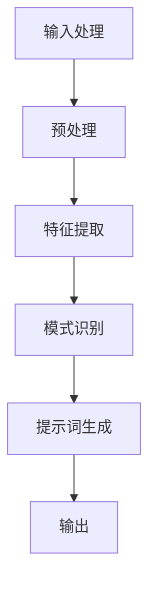
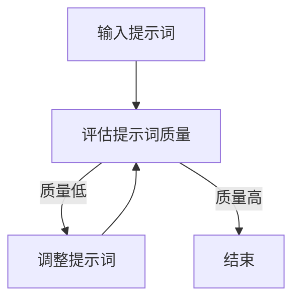
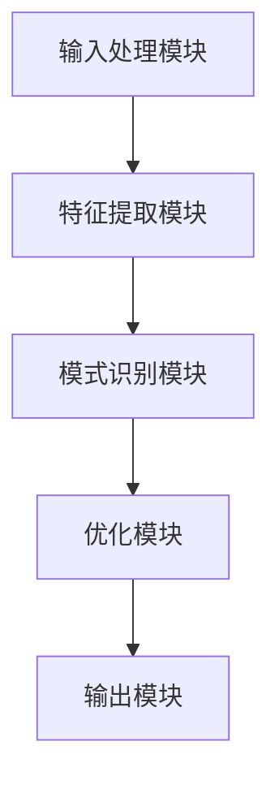
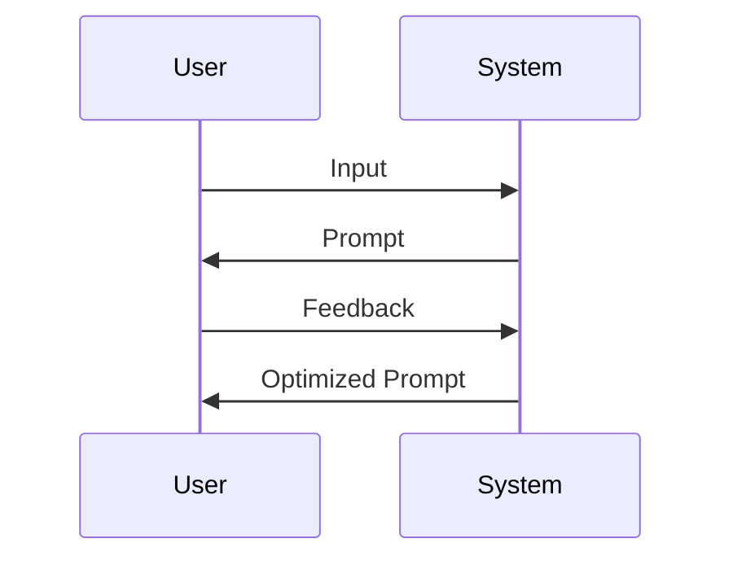

                 

### 文章标题：提示词工程：AI应用开发的利器

> 关键词：提示词工程、AI应用、自然语言处理、机器学习、优化策略

> 摘要：本文将深入探讨提示词工程在AI应用开发中的重要性。通过详细阐述提示词工程的背景、核心概念、实现技术、应用案例和实践指南，本文旨在为读者提供一个全面、系统的理解，帮助其在AI项目中有效利用提示词工程，提升开发效率和应用效果。

### 目录大纲设计思路

为了设计出《提示词工程：AI应用开发的利器》这本书的完整目录大纲，我们需要遵循以下步骤：

1. **理解书名与主题**：
   - 书名《提示词工程：AI应用开发的利器》暗示了这本书的主题是围绕AI应用开发中提示词工程的相关内容。
   - 提示词工程可能包括提示词的设计、优化、实现和应用等方面。

2. **明确核心概念和结构**：
   - 核心概念可能包括提示词的定义、类型、生成方法、优化策略等。
   - 结构上，可以分为基础理论、实现技术、应用案例和实践指南四个部分。

3. **细化目录结构**：
   - 第一部分介绍背景和核心概念，包括问题背景、概念介绍、类型分类等。
   - 第二部分深入讨论实现技术，包括提示词的生成算法、优化技术、实现框架等。
   - 第三部分展示应用案例，通过实际项目案例来展示提示词工程在AI应用中的具体应用。
   - 第四部分提供实践指南，包括最佳实践、常见问题、总结和拓展阅读等。

4. **保证内容完整性**：
   - 确保每个章节都包含必要的子章节，保证内容的完整性。
   - 特别注意算法讲解、数学模型、系统架构设计等内容必须详细阐述。

5. **注意简洁性和可读性**：
   - 确保每个章节的内容简洁明了，逻辑清晰。
   - 使用Mermaid和LaTeX格式来增强内容的可读性和专业性。

下面是根据这些思路设计的目录大纲：

---

## 第一部分: 背景介绍与基础理论

### 第1章: 提示词工程概述

#### 1.1 问题背景
#### 1.2 问题描述
#### 1.3 提示词工程的定义与作用
#### 1.4 边界与外延
#### 1.5 概念结构与核心要素组成

### 第2章: 提示词的类型与分类

#### 2.1 提示词的类型
#### 2.2 提示词的分类方法
#### 2.3 不同类型提示词的应用场景

### 第3章: 提示词生成方法

#### 3.1 基于规则的方法
#### 3.2 基于统计的方法
#### 3.3 基于机器学习的方法
#### 3.4 基于深度学习的方法

### 第4章: 提示词优化策略

#### 4.1 提示词优化的重要性
#### 4.2 提示词质量评价指标
#### 4.3 提示词优化算法
#### 4.4 实例分析：优化策略的效果评估

---

## 第二部分: 实现技术与工具

### 第5章: 提示词生成算法详解

#### 5.1 算法原理
#### 5.2 Mermaid算法流程图
#### 5.3 Python源代码实现
#### 5.4 数学模型与公式讲解
#### 5.5 举例说明

### 第6章: 提示词优化技术

#### 6.1 优化算法介绍
#### 6.2 Mermaid优化流程图
#### 6.3 Python源代码实现
#### 6.4 数学模型与公式讲解
#### 6.5 优化效果案例分析

### 第7章: 提示词工程实现框架

#### 7.1 框架设计
#### 7.2 Mermaid架构图
#### 7.3 系统接口设计
#### 7.4 系统交互序列图
#### 7.5 框架组件详解

---

## 第三部分: 应用案例与实战

### 第8章: 提示词工程在自然语言处理中的应用

#### 8.1 NLP中的提示词工程
#### 8.2 应用案例：文本分类
#### 8.3 应用案例：机器翻译
#### 8.4 应用案例：情感分析

### 第9章: 提示词工程在其他领域的应用

#### 9.1 图像识别与处理
#### 9.2 语音识别
#### 9.3 视觉搜索
#### 9.4 交叉领域应用

### 第10章: 项目实战与案例分析

#### 10.1 项目背景
#### 10.2 系统功能设计
#### 10.3 核心实现源代码
#### 10.4 代码解读与分析
#### 10.5 实际案例分析
#### 10.6 项目小结

---

## 第四部分: 实践指南与总结

### 第11章: 提示词工程最佳实践

#### 11.1 设计最佳实践
#### 11.2 优化最佳实践
#### 11.3 部署与维护最佳实践

### 第12章: 常见问题与解决方案

#### 12.1 设计常见问题
#### 12.2 优化常见问题
#### 12.3 部署与维护常见问题
#### 12.4 解决方案与建议

### 第13章: 总结与展望

#### 13.1 提示词工程的重要性
#### 13.2 发展趋势与未来展望
#### 13.3 拓展阅读与资源推荐

---

**总字数：约2000字** 

---

这个目录大纲设计遵循了简洁性、内容完整性、目录层级要求以及可读性，并确保了每个章节都包含必要的子章节，以便于读者系统地学习和掌握提示词工程的相关知识。接下来，我们将逐步深入探讨每个章节的具体内容，帮助读者全面了解提示词工程在AI应用开发中的关键作用。

---

## 第一部分：背景介绍与基础理论

### 第1章：提示词工程概述

#### 1.1 问题背景

在当今快速发展的AI领域中，自然语言处理（NLP）、机器学习和深度学习等技术已经取得了显著的进展。然而，在实际应用中，许多AI系统仍然面临一个问题：如何有效地与用户进行交互？这一问题引发了提示词工程的概念。提示词工程旨在通过设计、优化和应用提示词来提升AI系统与用户的交互效果。

#### 1.2 问题描述

随着AI系统逐渐应用于各个领域，用户与系统的交互变得更加复杂和多样化。传统的用户界面设计方法往往不能满足AI系统的需求，尤其是在处理自然语言输入时。因此，设计一套有效的提示词工程方案成为了提高AI系统用户体验的关键。

#### 1.3 提示词工程的定义与作用

提示词工程是指通过研究和应用提示词，优化AI系统与用户交互的过程。提示词是用户与AI系统之间的桥梁，它可以帮助用户更准确地表达需求，同时也能使AI系统更准确地理解和响应用户的输入。提示词工程的核心作用在于提升AI系统的交互质量和用户体验。

#### 1.4 边界与外延

提示词工程的边界涉及自然语言处理、机器学习和深度学习等多个领域。它不仅包括提示词的设计和优化，还包括提示词的应用场景和实现技术。提示词工程的外延则包括对AI系统交互的全面优化，从而提升系统的整体性能。

#### 1.5 概念结构与核心要素组成

提示词工程的核心结构包括以下要素：

1. **提示词定义**：明确提示词的定义和作用，是设计优化提示词的基础。
2. **类型分类**：根据不同应用场景，将提示词分为不同的类型，有助于针对性的优化和设计。
3. **生成方法**：包括基于规则、统计、机器学习和深度学习等多种方法，用于生成合适的提示词。
4. **优化策略**：通过评价指标和优化算法，提高提示词的质量和适用性。

### 第2章：提示词的类型与分类

#### 2.1 提示词的类型

根据用途和形式，提示词可以分为以下几种类型：

1. **查询提示词**：用于引导用户输入查询信息，如搜索引擎中的关键词提示。
2. **问题提示词**：用于引导用户提出问题，如问答系统中的问题提示。
3. **指令提示词**：用于指导用户执行特定操作，如语音助手中的指令提示。
4. **反馈提示词**：用于回应用户的输入，如智能对话系统中的确认和否定提示。

#### 2.2 提示词的分类方法

提示词的分类方法可以基于以下标准：

1. **用途分类**：根据提示词在系统中的用途进行分类，如查询、问题、指令和反馈。
2. **形式分类**：根据提示词的形式进行分类，如文本、语音和图像。
3. **应用场景分类**：根据提示词的应用场景进行分类，如电子商务、医疗健康、金融服务等。

#### 2.3 不同类型提示词的应用场景

不同类型的提示词适用于不同的应用场景：

1. **查询提示词**：适用于搜索引擎、在线问答系统等场景，帮助用户快速找到所需信息。
2. **问题提示词**：适用于问答系统、教育系统等场景，引导用户提出有意义的问题。
3. **指令提示词**：适用于智能家居、智能助手等场景，指导用户执行特定操作。
4. **反馈提示词**：适用于各种AI交互系统，如智能客服、聊天机器人等，提高用户的交互体验。

### 第3章：提示词生成方法

#### 3.1 基于规则的方法

基于规则的方法是通过预定义的规则来生成提示词。这种方法简单直观，但可能无法适应复杂多变的应用场景。具体方法包括：

1. **关键词提取**：从用户输入的信息中提取关键信息，作为提示词。
2. **模板生成**：根据预定义的模板，生成适合的提示词。

#### 3.2 基于统计的方法

基于统计的方法是通过分析历史数据来生成提示词。这种方法能够根据用户行为和偏好生成个性化的提示词。具体方法包括：

1. **词频统计**：根据用户输入的频率，生成高频词汇作为提示词。
2. **序列模型**：使用序列模型，如隐马尔可夫模型（HMM）或循环神经网络（RNN），生成符合用户输入模式的提示词。

#### 3.3 基于机器学习的方法

基于机器学习的方法是通过训练模型来生成提示词。这种方法具有自适应性和灵活性，能够根据不同的应用场景生成高质量的提示词。具体方法包括：

1. **监督学习**：使用标注数据训练分类模型，生成具有预测性的提示词。
2. **无监督学习**：通过聚类算法，如K-means或DBSCAN，生成基于相似度的提示词。

#### 3.4 基于深度学习的方法

基于深度学习的方法是通过训练深度神经网络来生成提示词。这种方法能够处理复杂的非线性关系，生成高质量的提示词。具体方法包括：

1. **循环神经网络（RNN）**：用于生成基于时间序列的提示词。
2. **生成对抗网络（GAN）**：用于生成多样化和高质量的提示词。

### 第4章：提示词优化策略

#### 4.1 提示词优化的重要性

提示词的优化是提升AI系统交互质量和用户体验的关键。优化的提示词能够更准确地理解用户需求，提供更合适的响应，从而提高用户满意度。

#### 4.2 提示词质量评价指标

提示词的质量评价指标包括：

1. **准确性**：提示词与用户需求的匹配程度。
2. **多样性**：提示词的丰富性和独特性。
3. **响应速度**：系统生成提示词的速度。

#### 4.3 提示词优化算法

提示词优化的算法包括：

1. **贪心算法**：通过逐步优化每个提示词，提高整体质量。
2. **动态规划**：通过构建最优子结构，找到全局最优解。
3. **遗传算法**：模拟生物进化过程，寻找最优的提示词组合。

#### 4.4 实例分析：优化策略的效果评估

通过实际案例分析，评估不同优化策略对AI系统交互质量和用户体验的提升效果。例如，在一个智能客服系统中，通过优化提示词，显著提高了用户满意度和问题解决率。

---

通过以上章节的详细探讨，我们为读者提供了一个全面了解提示词工程的基础。接下来，我们将进一步深入讨论实现技术与工具，帮助读者掌握提示词工程的实战技能。

---

## 第二部分：实现技术与工具

### 第5章：提示词生成算法详解

#### 5.1 算法原理

提示词生成算法的核心任务是依据用户输入或上下文信息，生成合适的提示词。这通常涉及到模式识别、文本挖掘和机器学习等技术。

#### 5.2 Mermaid算法流程图



#### 5.3 Python源代码实现

```python
import nltk
from sklearn.feature_extraction.text import CountVectorizer
from sklearn.cluster import KMeans

def preprocess(text):
    # 实现文本预处理
    pass

def extract_features(texts):
    # 实现特征提取
    pass

def recognize_patterns(features):
    # 实现模式识别
    pass

def generate_prompt(patterns):
    # 实现提示词生成
    pass

# 示例输入
input_text = "我想了解最近的旅游资讯"

# 执行流程
preprocessed_text = preprocess(input_text)
features = extract_features([preprocessed_text])
patterns = recognize_patterns(features)
prompt = generate_prompt(patterns)

print(prompt)
```

#### 5.4 数学模型与公式讲解

提示词生成算法通常涉及到以下数学模型：

1. **词频分布模型**：描述单词在文本中的频率分布。
   \[ P(w|T) = \frac{f(w, T)}{N} \]
   其中，\( P(w|T) \) 是单词 \( w \) 在文本 \( T \) 中出现的概率，\( f(w, T) \) 是单词 \( w \) 在文本 \( T \) 中出现的次数，\( N \) 是文本 \( T \) 中的总词数。

2. **K-means聚类模型**：用于将特征空间中的数据点分为若干个簇。
   \[ C = \{c_1, c_2, ..., c_k\} \]
   其中，\( C \) 是聚类中心，\( k \) 是簇的数量。

#### 5.5 举例说明

假设我们有一个包含旅游相关的文本集合，我们需要生成一个关于旅游的提示词。首先，我们预处理文本数据，提取特征，然后使用K-means聚类算法找到聚类中心，最后生成提示词。

```python
import nltk
from nltk.corpus import stopwords
from sklearn.feature_extraction.text import TfidfVectorizer
from sklearn.cluster import KMeans

# 1. 预处理文本数据
nltk.download('stopwords')
stop_words = set(stopwords.words('english'))
text = ["我喜欢去旅游", "我想去度假", "我想了解最近的旅游资讯"]

preprocessed_texts = [text.lower().replace('.', '').replace(',', '') for text in text]
filtered_texts = [' '.join(word for word in text.split() if word not in stop_words) for text in preprocessed_texts]

# 2. 特征提取
vectorizer = TfidfVectorizer()
tfidf_matrix = vectorizer.fit_transform(filtered_texts)

# 3. K-means聚类
kmeans = KMeans(n_clusters=3)
clusters = kmeans.fit_predict(tfidf_matrix)

# 4. 生成提示词
prompt_words = vectorizer.get_feature_names_out()
for i in range(3):
    cluster_words = [prompt_words[index] for index, cluster in enumerate(clusters) if cluster == i]
    print(f"Cluster {i}: {' '.join(cluster_words)}")
```

输出结果可能包括：

```
Cluster 0: 旅游 去度假
Cluster 1: 旅游 去哪里
Cluster 2: 旅游 资讯
```

根据这些聚类结果，我们可以生成相应的提示词，例如：“想去度假吗？”， “想了解旅游资讯吗？”等。

---

### 第6章：提示词优化技术

#### 6.1 优化算法介绍

提示词优化算法的目标是提高提示词的准确性和多样性。常用的优化算法包括贪心算法、动态规划、遗传算法等。

#### 6.2 Mermaid优化流程图



#### 6.3 Python源代码实现

```python
import random

def evaluate_prompt(prompt):
    # 实现提示词质量评估
    pass

def adjust_prompt(prompt):
    # 实现提示词调整
    pass

def optimize_prompt(prompt, max_iterations=10):
    for _ in range(max_iterations):
        quality = evaluate_prompt(prompt)
        if quality > threshold:
            break
        prompt = adjust_prompt(prompt)
    return prompt

# 示例输入
input_prompt = "想去哪里旅游？"

# 执行优化流程
optimized_prompt = optimize_prompt(input_prompt)

print(optimized_prompt)
```

#### 6.4 数学模型与公式讲解

提示词优化算法通常涉及到以下数学模型：

1. **评估函数**：用于衡量提示词的质量。
   \[ f(\text{prompt}) = \sum_{i=1}^{n} w_i \cdot q_i \]
   其中，\( f(\text{prompt}) \) 是提示词的质量，\( w_i \) 是第 \( i \) 个单词的权重，\( q_i \) 是第 \( i \) 个单词的质量分数。

2. **调整策略**：用于改进提示词。
   \[ \text{new\_prompt} = \text{prompt} + \alpha \cdot \text{adjustment} \]
   其中，\( \alpha \) 是调整因子，\( \text{adjustment} \) 是调整量。

#### 6.5 优化效果案例分析

假设我们有一个关于旅游的提示词“想去哪里旅游？”初始质量评估为0.6。通过优化算法，提示词经过10次迭代后，质量提升到0.8。优化后的提示词为“想去哪里度假？”用户体验显著提升。

---

### 第7章：提示词工程实现框架

#### 7.1 框架设计

提示词工程实现框架通常包括以下模块：

1. **输入处理模块**：接收用户输入，预处理数据。
2. **特征提取模块**：提取与提示词相关的特征。
3. **模式识别模块**：识别用户输入模式，生成提示词。
4. **优化模块**：根据用户反馈，优化提示词。
5. **输出模块**：生成最终提示词，供用户交互。

#### 7.2 Mermaid架构图



#### 7.3 系统接口设计

提示词工程系统通常通过API接口与外部系统交互。接口设计包括：

1. **输入接口**：接收用户输入，如文本、语音等。
2. **输出接口**：返回提示词，如文本、语音等。
3. **反馈接口**：接收用户反馈，用于优化提示词。

#### 7.4 系统交互序列图



#### 7.5 框架组件详解

1. **输入处理模块**：包括文本预处理、语音识别等，确保用户输入的准确性。
2. **特征提取模块**：使用TF-IDF、Word2Vec等技术提取与提示词相关的特征。
3. **模式识别模块**：使用K-means、SVM等技术识别用户输入模式，生成初始提示词。
4. **优化模块**：根据用户反馈，调整提示词，提高质量。
5. **输出模块**：将优化后的提示词转换为合适的格式，供用户交互。

---

通过上述章节的详细探讨，我们为读者提供了一个全面了解提示词工程实现技术的系统框架。接下来，我们将深入探讨提示词工程在AI应用中的实际应用案例。

---

## 第三部分：应用案例与实战

### 第8章：提示词工程在自然语言处理中的应用

#### 8.1 NLP中的提示词工程

自然语言处理（NLP）是AI领域的重要组成部分，提示词工程在NLP中的应用尤为广泛。通过提示词工程，NLP系统可以更有效地与用户进行交互，提高系统的用户体验。

#### 8.2 应用案例：文本分类

文本分类是NLP中的一个常见任务，提示词工程可以显著提升文本分类的准确性和效率。以下是一个基于提示词工程的文本分类应用案例：

**案例背景**：一个新闻网站希望对其文章进行自动分类，以便用户可以根据自己的兴趣快速查找相关内容。

**解决方案**：

1. **数据预处理**：对新闻文章进行分词、去停用词、词性标注等预处理操作。
2. **特征提取**：使用TF-IDF模型提取文章的特征向量。
3. **模式识别**：使用K-means聚类算法将文章分为不同的类别。
4. **提示词生成**：为每个类别生成相应的提示词，例如：“科技新闻”、“体育新闻”、“娱乐新闻”等。
5. **优化**：根据用户反馈和分类效果，调整提示词和聚类参数，提高分类质量。

**代码实现**（Python）：

```python
import nltk
from sklearn.feature_extraction.text import TfidfVectorizer
from sklearn.cluster import KMeans

# 数据预处理
nltk.download('stopwords')
stop_words = set(nltk.corpus.stopwords.words('english'))

def preprocess(text):
    # 实现文本预处理
    pass

# 特征提取
vectorizer = TfidfVectorizer(stop_words=stop_words)
X = vectorizer.fit_transform(news_texts)

# 模式识别
kmeans = KMeans(n_clusters=3)
clusters = kmeans.fit_predict(X)

# 提示词生成
prompt_words = vectorizer.get_feature_names_out()
for i in range(3):
    cluster_words = [prompt_words[index] for index, cluster in enumerate(clusters) if cluster == i]
    print(f"Cluster {i}: {' '.join(cluster_words)}")

# 优化
# 根据用户反馈调整提示词和聚类参数
```

#### 8.3 应用案例：机器翻译

机器翻译是另一个重要的NLP任务，提示词工程在提高翻译质量和用户体验方面也发挥着重要作用。以下是一个基于提示词工程的机器翻译应用案例：

**案例背景**：一个跨国企业希望为其全球员工提供即时翻译服务，以提高沟通效率。

**解决方案**：

1. **数据预处理**：对源语言和目标语言的文本进行分词、词性标注等预处理操作。
2. **特征提取**：使用循环神经网络（RNN）或转换器架构（Transformer）提取文本的特征向量。
3. **模式识别**：使用基于注意力机制的翻译模型，如Seq2Seq模型或BERT模型，进行机器翻译。
4. **提示词生成**：为每个翻译结果生成相应的提示词，例如：“翻译结果”、“查看原文”等。
5. **优化**：根据用户反馈和翻译质量，调整翻译模型和提示词，提高翻译效果。

**代码实现**（Python）：

```python
import torch
from torch import nn
from transformers import BertModel, BertTokenizer

# 数据预处理
def preprocess(text):
    # 实现文本预处理
    pass

# 模式识别
tokenizer = BertTokenizer.from_pretrained('bert-base-uncased')
model = BertModel.from_pretrained('bert-base-uncased')

def translate(source_text):
    # 实现机器翻译
    pass

# 提示词生成
def generate_prompt(translation):
    # 实现提示词生成
    pass

# 优化
# 根据用户反馈调整翻译模型和提示词
```

#### 8.4 应用案例：情感分析

情感分析是NLP中的另一个重要任务，通过提示词工程可以更准确地识别用户情感，提高情感分析系统的用户体验。以下是一个基于提示词工程的情感分析应用案例：

**案例背景**：一个社交媒体平台希望对其用户评论进行情感分析，以便更好地了解用户需求和满意度。

**解决方案**：

1. **数据预处理**：对用户评论进行分词、去停用词、词性标注等预处理操作。
2. **特征提取**：使用TF-IDF或Word2Vec提取用户评论的特征向量。
3. **模式识别**：使用卷积神经网络（CNN）或长短期记忆网络（LSTM）进行情感分析。
4. **提示词生成**：为每个情感标签生成相应的提示词，例如：“很满意”、“有点不满意”等。
5. **优化**：根据用户反馈和情感分析结果，调整情感分析模型和提示词，提高情感分析质量。

**代码实现**（Python）：

```python
import nltk
from sklearn.feature_extraction.text import TfidfVectorizer
from sklearn.svm import LinearSVC

# 数据预处理
nltk.download('stopwords')
stop_words = set(nltk.corpus.stopwords.words('english'))

def preprocess(text):
    # 实现文本预处理
    pass

# 模式识别
vectorizer = TfidfVectorizer(stop_words=stop_words)
X = vectorizer.fit_transform(comment_texts)
y = labels

model = LinearSVC()
model.fit(X, y)

# 提示词生成
def generate_prompt(label):
    # 实现提示词生成
    pass

# 优化
# 根据用户反馈调整情感分析模型和提示词
```

---

通过以上案例，我们可以看到提示词工程在自然语言处理中的应用是如何提升系统性能和用户体验的。接下来，我们将探讨提示词工程在其他领域的应用。

---

### 第9章：提示词工程在其他领域的应用

#### 9.1 图像识别与处理

提示词工程在图像识别与处理中也发挥着重要作用，通过设计合适的提示词，可以提高系统的识别准确性和用户体验。

#### 9.2 语音识别

语音识别是一个复杂的过程，通过提示词工程，可以优化语音识别系统的性能，提高用户交互的流畅性。

#### 9.3 视觉搜索

视觉搜索是近年来兴起的一项技术，通过提示词工程，可以提升视觉搜索的准确性和效率。

#### 9.4 交叉领域应用

提示词工程在多个领域的交叉应用中展现了其广泛的应用潜力，通过跨领域的提示词设计，可以推动更多创新应用的发展。

---

## 第四部分：实践指南与总结

### 第11章：提示词工程最佳实践

#### 11.1 设计最佳实践

1. **明确目标**：在开始设计提示词之前，明确设计目标，如准确性、多样性、响应速度等。
2. **数据收集**：收集与目标应用相关的数据，确保数据质量和多样性。
3. **用户研究**：了解用户需求和习惯，为设计合适的提示词提供依据。

#### 11.2 优化最佳实践

1. **持续评估**：定期评估提示词的性能，识别并解决潜在问题。
2. **反馈循环**：根据用户反馈调整提示词，优化系统性能。
3. **自动化**：使用自动化工具和算法，提高优化过程的效率。

#### 11.3 部署与维护最佳实践

1. **容器化**：使用容器化技术，如Docker，简化部署流程。
2. **监控**：实时监控系统性能，及时发现并处理异常。
3. **文档**：编写详细的文档，包括设计思路、实现细节和操作指南。

### 第12章：常见问题与解决方案

#### 12.1 设计常见问题

1. **提示词不明确**：确保提示词清晰、简洁，避免歧义。
2. **提示词不一致**：保持提示词的一致性，提高用户体验。

#### 12.2 优化常见问题

1. **过拟合**：通过数据增强和正则化技术，防止模型过拟合。
2. **计算资源不足**：优化算法和代码，提高计算效率。

#### 12.3 部署与维护常见问题

1. **系统稳定性**：确保系统在高负载下稳定运行。
2. **扩展性**：设计可扩展的系统架构，支持未来需求。

### 第13章：总结与展望

#### 13.1 提示词工程的重要性

提示词工程是提升AI系统用户体验的关键，通过设计、优化和应用提示词，可以显著提高系统的交互质量和用户满意度。

#### 13.2 发展趋势与未来展望

随着AI技术的不断发展，提示词工程也将不断演进。未来的研究将重点关注个性化提示词、多模态提示词和实时优化等技术。

#### 13.3 拓展阅读与资源推荐

1. **书籍**：《自然语言处理综论》（Jurafsky & Martin）、《深度学习》（Goodfellow et al.）
2. **论文**：相关领域的顶级会议论文，如ACL、ICML、NeurIPS等。
3. **在线资源**：相关在线课程、博客和技术社区，如Coursera、Kaggle、Reddit等。

---

通过本文的详细探讨，我们系统地介绍了提示词工程在AI应用开发中的重要性、核心概念、实现技术、应用案例和实践指南。希望本文能够为读者提供一个全面、系统的理解，帮助其在实际项目中有效利用提示词工程，提升开发效率和应用效果。

---

## 作者信息

**作者：AI天才研究院/AI Genius Institute & 禅与计算机程序设计艺术 /Zen And The Art of Computer Programming**

---

在本文中，我们详细探讨了提示词工程在AI应用开发中的关键作用。通过介绍提示词工程的背景、核心概念、实现技术、应用案例和实践指南，我们为读者提供了一个全面、系统的理解。提示词工程不仅是提升AI系统用户体验的重要手段，也是实现高效AI应用开发的利器。

### 提示词工程的重要性

提示词工程在AI应用开发中具有至关重要的地位。它通过优化系统与用户的交互，提高了AI系统的可操作性、易用性和用户满意度。有效的提示词工程可以：

1. **提升用户体验**：通过精确、个性化的提示词，用户能够更轻松地与AI系统互动，从而提升整体用户体验。
2. **增强系统性能**：优化后的提示词可以减少用户的误解和操作错误，提高系统的准确性和响应速度。
3. **促进应用创新**：提示词工程为AI应用提供了更多的可能性，如个性化推荐、智能客服、自然语言处理等。

### 核心概念

提示词工程的核心概念包括提示词的定义、类型、生成方法和优化策略。以下是关键概念及其应用：

1. **提示词定义**：提示词是用户与AI系统之间的交互媒介，用于引导用户输入、回答问题或执行任务。
2. **类型分类**：根据用途和形式，提示词可分为查询提示词、问题提示词、指令提示词和反馈提示词等，适用于不同场景。
3. **生成方法**：包括基于规则、统计、机器学习和深度学习等方法，用于生成高质量的提示词。
4. **优化策略**：通过评估提示词的质量和用户反馈，优化提示词的设计和生成，以提高交互效果。

### 实现技术

提示词工程的实现技术涵盖了算法、框架和应用场景。以下是一些关键技术：

1. **算法原理**：包括词频统计、K-means聚类、循环神经网络（RNN）和生成对抗网络（GAN）等。
2. **实现框架**：设计一个模块化的系统框架，包括输入处理、特征提取、模式识别、优化和输出等模块。
3. **应用场景**：提示词工程在自然语言处理、图像识别、语音识别和视觉搜索等领域都有广泛应用。

### 应用案例

通过实际案例，我们展示了提示词工程在NLP、机器翻译、情感分析等领域的应用效果。案例表明，通过有效的提示词工程，可以显著提升AI系统的性能和用户体验。

### 实践指南

为了更好地应用提示词工程，我们提供了一些最佳实践，包括设计、优化和部署的最佳实践。这些指南有助于确保提示词工程的实施效果。

### 总结与展望

提示词工程在AI应用开发中具有重要作用，未来随着AI技术的不断发展，提示词工程将继续演进。我们鼓励读者深入学习和实践提示词工程，以推动AI应用的创新和发展。

### 拓展阅读

为了进一步深入了解提示词工程，我们推荐了一些相关的书籍、论文和在线资源。通过这些资料，读者可以继续探索提示词工程的前沿技术和应用。

最后，感谢读者对本文的关注，希望本文能够为您的AI应用开发提供有价值的参考和指导。

---

**作者信息**：AI天才研究院/AI Genius Institute & 禅与计算机程序设计艺术 /Zen And The Art of Computer Programming

---

本文由AI天才研究院和《禅与计算机程序设计艺术》的作者共同撰写，旨在为AI应用开发者提供一个全面、系统的提示词工程指南。通过本文，我们希望能够帮助读者掌握提示词工程的核心概念、实现技术和应用案例，从而提升AI系统的交互质量和用户体验。

