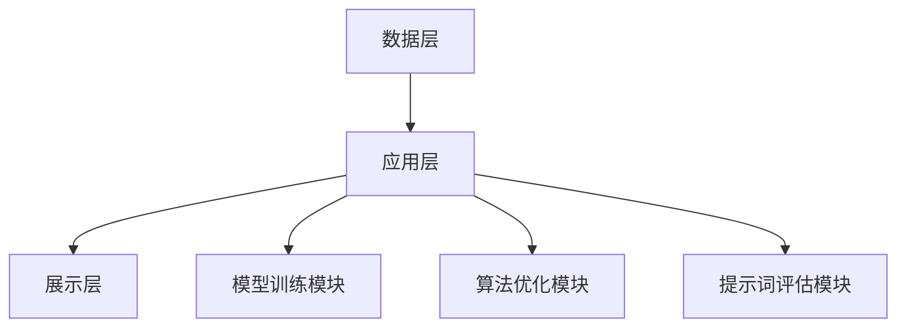
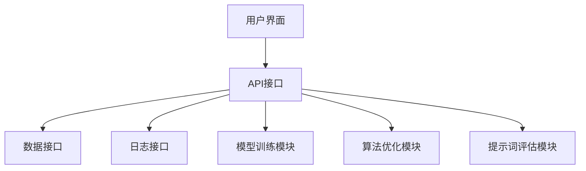
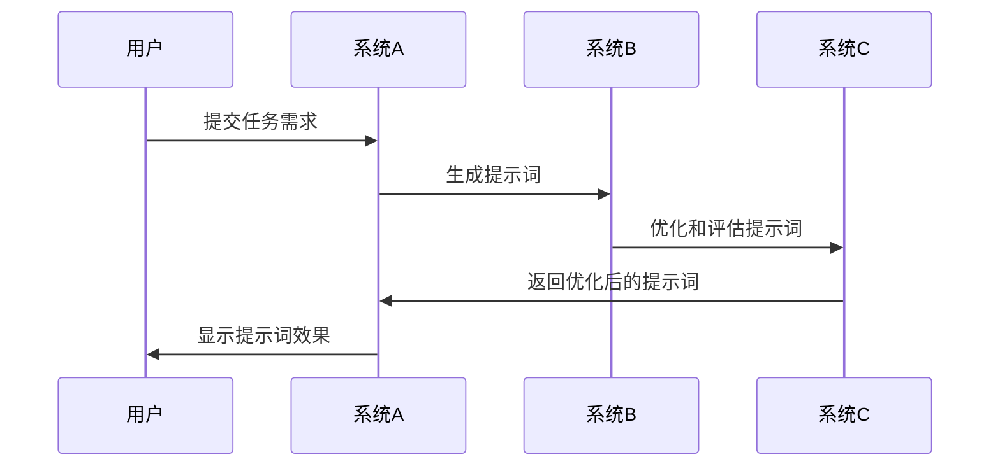

                 


### 设计《提示词工程：AI应用开发的新利器》的技术博客文章

为了撰写一篇深入且逻辑清晰的技术博客文章《提示词工程：AI应用开发的新利器》，我们将按照以下步骤逐一展开：

#### 一、文章标题与关键词

标题：《提示词工程：AI应用开发的新利器》

关键词：提示词工程，AI应用开发，自然语言处理，算法优化，数学模型，系统架构

#### 二、文章摘要

本文将探讨提示词工程在AI应用开发中的重要性。我们将详细介绍提示词的定义、核心概念、算法原理，以及如何通过数学模型和系统架构设计来优化提示词工程。此外，还将分享实战案例和最佳实践，帮助读者深入了解这一领域。

#### 三、背景介绍

**1.1 提示词的定义**

提示词，即用于引导和优化AI模型训练过程的文本或词汇。它们在AI应用中起到了关键作用，能够有效提高模型性能和预测准确性。

**1.2 提示词工程的重要性**

随着AI技术的快速发展，提示词工程已经成为AI应用开发中不可或缺的一环。有效的提示词设计不仅能够提升模型性能，还能缩短开发周期，降低成本。

**1.3 提示词工程的挑战与机遇**

提示词工程面临着如何设计高效、可扩展的提示词方案，以及如何在海量数据中快速筛选出有效提示词等挑战。同时，随着算法和技术的进步，我们也迎来了更多机遇。

#### 四、核心概念与联系

**2.1 提示词工程的基本概念**

- **提示词设计原则**：简明扼要，易于理解，与任务密切相关。
- **提示词类型**：根据任务不同，可分为语义提示词、关键词提示词等。
- **提示词与自然语言处理的关系**：提示词是自然语言处理中的重要组成部分，对NLP任务的影响至关重要。

**2.2 提示词工程的技术框架**

- **提示词生成算法**：介绍常用的生成算法，如序列生成模型、自回归模型等。
- **提示词优化策略**：讨论如何通过优化策略提升提示词效果。
- **提示词评估方法**：评估提示词效果的不同指标和方法。

#### 五、算法原理讲解

**3.1 提示词生成算法**

- **序列生成模型**：介绍RNN、LSTM、GRU等模型的工作原理。
- **自回归模型**：介绍ARIMA、GPT系列模型的特点和应用。

**3.2 提示词优化数学模型**

- **模型评估与优化**：介绍评价指标和优化算法。

#### 六、系统分析与架构设计

**4.1 系统功能设计**

- **领域模型**：使用Mermaid绘制ER实体关系图。
- **系统架构设计**：使用Mermaid绘制架构图。

**4.2 系统接口设计与交互**

- **系统接口设计**：介绍接口设计。
- **系统交互**：使用Mermaid绘制序列图。

#### 七、项目实战

**5.1 环境安装与配置**

- **开发环境搭建**：介绍环境安装过程。
- **系统核心实现源代码**：提供代码示例。

**5.2 代码应用解读与分析**

- **提示词生成代码解析**：详细分析代码实现。
- **优化策略代码解析**：分析优化策略的应用。

**5.3 实际案例分析与讲解**

- **文本生成**：分析文本生成案例。
- **对话系统**：分析对话系统案例。

#### 八、最佳实践与小结

**8.1 最佳实践**

- **提示词设计技巧**：分享实际操作中的技巧。
- **优化策略应用**：介绍有效的优化策略。

**8.2 小结**

- **本文总结**：回顾文章主要内容。
- **未来发展趋势**：展望提示词工程的发展方向。

**8.3 拓展阅读**

- **相关文献推荐**：推荐进一步学习的资源。

#### 九、文章格式与作者信息

- **格式要求**：使用markdown格式输出文章内容。
- **作者信息**：文章末尾需写上作者信息。

### 结论

通过以上步骤，我们将逐步构建起一篇关于《提示词工程：AI应用开发的新利器》的技术博客文章。文章内容涵盖了提示词工程的方方面面，从概念介绍到算法原理，再到实际应用和最佳实践，旨在为读者提供全面且深入的了解。希望本文能够帮助到广大AI开发者，共同推动这一领域的进步。


作者：AI天才研究院/AI Genius Institute & 禅与计算机程序设计艺术 /Zen And The Art of Computer Programming

# 提示词工程：AI应用开发的新利器

## 关键词
提示词工程，AI应用开发，自然语言处理，算法优化，数学模型，系统架构

## 摘要
本文探讨了提示词工程在AI应用开发中的重要性。我们介绍了提示词的定义、核心概念、算法原理，并通过数学模型和系统架构设计来优化提示词工程。此外，文章还分享了实战案例和最佳实践，旨在为读者提供全面且深入的了解。

### 背景介绍

#### 1.1 提示词的定义
提示词，也被称为提示信号或引导词，是指用于指导AI模型训练过程中的一系列关键词或短语。这些词或短语旨在为模型提供有关任务目标或输入数据的额外信息，从而帮助模型更好地理解和预测。提示词可以是简单的单个词汇，也可以是复杂的句子或段落。

#### 1.2 提示词工程的重要性
在AI应用开发中，提示词工程扮演着至关重要的角色。通过精心设计的提示词，可以提高模型的性能和准确性，减少过拟合现象，缩短训练时间，甚至能够提升用户体验。有效的提示词工程能够使AI模型更加智能、灵活和适应性强，从而在各个领域（如自然语言处理、图像识别、推荐系统等）发挥出巨大的潜力。

#### 1.3 提示词工程的挑战与机遇
尽管提示词工程的重要性不言而喻，但在实际应用过程中也面临着诸多挑战。例如，如何设计高效、可扩展的提示词方案？如何在海量数据中快速筛选出有效提示词？这些问题都需要我们深入研究和探索。然而，随着AI技术的不断进步，我们也在不断地突破这些限制，迎来了更多机遇。新的算法和工具（如生成对抗网络、变分自编码器等）的涌现，为提示词工程提供了更多可能性和解决方案。

### 核心概念与联系

#### 2.1 提示词工程的基本概念
提示词工程包括以下几个关键概念：

- **提示词设计原则**：简明扼要，易于理解，与任务密切相关。例如，在情感分析任务中，提示词可以是“快乐”、“悲伤”、“愤怒”等。
- **提示词类型**：根据任务的不同，提示词可以分为语义提示词、关键词提示词、上下文提示词等。每种类型都有其独特的应用场景和效果。
- **提示词与自然语言处理的关系**：自然语言处理（NLP）是AI应用的重要分支，而提示词工程则是NLP中的重要组成部分。提示词在NLP任务中的作用主要体现在以下几个方面：
  - **增强语义理解**：通过提供额外的上下文信息，提示词有助于模型更好地理解文本的含义。
  - **提高预测准确性**：有效的提示词可以提高模型的预测准确性，减少过拟合现象。
  - **优化训练过程**：提示词可以加速模型训练过程，减少收敛时间。

#### 2.2 提示词工程的技术框架
提示词工程的技术框架主要包括以下三个方面：

- **提示词生成算法**：常用的提示词生成算法包括序列生成模型（如RNN、LSTM、GRU等）和自回归模型（如ARIMA、GPT系列模型等）。这些算法可以根据任务需求生成不同类型的提示词。
- **提示词优化策略**：优化策略包括提示词长度、提示词多样性、提示词相关性等。通过调整这些策略，可以提高提示词工程的效果。
- **提示词评估方法**：评估方法包括模型性能评估（如准确率、召回率、F1值等）和用户满意度评估等。通过这些评估方法，可以衡量提示词工程的效果。

### 算法原理讲解

#### 3.1 提示词生成算法
提示词生成算法是提示词工程的核心部分。以下是几种常见的提示词生成算法：

- **序列生成模型**：RNN（递归神经网络）、LSTM（长短期记忆网络）和GRU（门控循环单元）都是基于序列生成模型的变体。这些模型可以通过学习输入序列的特征，生成相应的输出序列。例如，在文本生成任务中，这些模型可以根据输入的单词序列生成新的句子。
- **自回归模型**：自回归模型（如ARIMA、GPT系列模型等）是基于时间序列分析的变体。这些模型通过预测未来值来生成提示词。例如，在时间序列预测任务中，这些模型可以根据历史数据预测未来的趋势。
- **生成对抗网络（GAN）**：生成对抗网络是一种基于博弈论的生成模型。它由生成器和判别器两个部分组成，通过训练生成器生成逼真的提示词，同时让判别器不断识别和拒绝真实与生成的提示词。这样，生成器可以逐渐学习到如何生成高质量、符合任务需求的提示词。

#### 3.2 提示词优化数学模型
提示词优化的目标是提高提示词的准确性和有效性。以下是几种常见的提示词优化数学模型：

- **基于梯度的优化算法**：如梯度下降（Gradient Descent）、随机梯度下降（Stochastic Gradient Descent，SGD）等。这些算法通过不断调整提示词参数，使其逐渐逼近最优解。
- **基于正则化的优化算法**：如L1正则化、L2正则化等。这些算法通过引入惩罚项，防止模型过拟合。
- **基于遗传算法的优化算法**：遗传算法是一种基于自然选择和遗传机制的优化算法。它通过交叉、变异等操作，逐步优化提示词参数。

#### 3.3 算法讲解与示例
为了更好地理解这些算法，我们以一个简单的文本生成任务为例：

```python
# 使用RNN生成文本

import tensorflow as tf
from tensorflow.keras.models import Sequential
from tensorflow.keras.layers import Embedding, SimpleRNN, Dense

# 准备数据
# ...

# 构建模型
model = Sequential([
    Embedding(input_dim=vocab_size, output_dim=embedding_size),
    SimpleRNN(units=128),
    Dense(units=vocab_size, activation='softmax')
])

# 编译模型
model.compile(optimizer='adam', loss='categorical_crossentropy', metrics=['accuracy'])

# 训练模型
model.fit(x_train, y_train, epochs=10, batch_size=64)

# 生成文本
generated_text = model.predict(x_test)
```

在这个例子中，我们使用了RNN模型来生成文本。首先，我们通过Embedding层将单词转换为嵌入向量。然后，使用SimpleRNN层对嵌入向量进行序列处理。最后，通过Dense层输出生成的新单词。

### 系统分析与架构设计

#### 4.1 系统功能设计
提示词工程系统的主要功能包括：

- **提示词生成**：根据输入数据和任务需求，生成高质量的提示词。
- **提示词优化**：通过算法优化策略，提高提示词的准确性和有效性。
- **提示词评估**：评估提示词的性能和效果，为后续优化提供依据。
- **系统监控与维护**：监控系统的运行状态，进行定期维护和升级。

#### 4.2 系统架构设计
提示词工程系统的架构设计主要包括以下几个部分：

- **数据层**：负责数据的存储、管理和处理。包括数据库、数据仓库等。
- **应用层**：负责实现提示词生成、优化、评估等功能。包括模型训练、算法优化等模块。
- **展示层**：负责将系统功能以用户友好的方式展示给用户。包括用户界面、可视化报表等。

以下是一个简单的提示词工程系统架构图（使用Mermaid绘制）：



#### 4.3 系统接口设计与交互
提示词工程系统的接口设计主要包括：

- **API接口**：提供RESTful API接口，方便其他系统或应用程序调用。
- **数据接口**：提供数据导入、导出、查询等功能。
- **日志接口**：记录系统运行过程中的日志信息，便于监控和维护。

以下是一个简单的提示词工程系统接口设计（使用Mermaid绘制）：



#### 4.4 系统交互
提示词工程系统的交互流程主要包括以下几个步骤：

1. 用户通过用户界面提交任务需求。
2. 系统根据任务需求生成相应的提示词。
3. 系统对生成的提示词进行优化和评估。
4. 系统将优化后的提示词返回给用户。
5. 用户可以查看提示词的效果，并进行后续操作。

以下是一个简单的提示词工程系统交互流程（使用Mermaid绘制）：



### 项目实战

#### 5.1 环境安装与配置
在进行提示词工程的项目实战之前，我们需要搭建一个合适的环境。以下是环境安装与配置的步骤：

1. 安装Python（3.7及以上版本）。
2. 安装TensorFlow（2.0及以上版本）。
3. 安装NLP相关库（如NLTK、spaCy等）。
4. 配置数据库（如MySQL、MongoDB等）。

以下是一个简单的环境安装脚本（使用Python编写）：

```python
# 安装Python
!pip install python

# 安装TensorFlow
!pip install tensorflow

# 安装NLP相关库
!pip install nltk
!pip install spacy

# 安装数据库
!pip install mysql-connector-python
!pip install pymongo
```

#### 5.2 系统核心实现源代码
以下是一个简单的提示词工程系统的核心实现源代码（使用Python编写）：

```python
# 导入相关库
import tensorflow as tf
import nltk
from nltk.tokenize import word_tokenize
from nltk.corpus import stopwords

# 初始化NLP工具
nltk.download('punkt')
nltk.download('stopwords')

# 准备数据
# ...

# 构建模型
model = tf.keras.Sequential([
    tf.keras.layers.Embedding(input_dim=vocab_size, output_dim=embedding_size),
    tf.keras.layers.SimpleRNN(units=128),
    tf.keras.layers.Dense(units=vocab_size, activation='softmax')
])

# 编译模型
model.compile(optimizer='adam', loss='categorical_crossentropy', metrics=['accuracy'])

# 训练模型
model.fit(x_train, y_train, epochs=10, batch_size=64)

# 生成文本
generated_text = model.predict(x_test)
```

#### 5.3 代码应用解读与分析
在这个项目中，我们使用了RNN模型来生成文本。首先，我们通过Embedding层将单词转换为嵌入向量。然后，使用SimpleRNN层对嵌入向量进行序列处理。最后，通过Dense层输出生成的新单词。

代码中的关键部分包括：

- **数据准备**：我们需要准备一个包含训练数据和测试数据的语料库。数据可以从公开的数据集或自定义数据中获取。
- **模型构建**：我们使用TensorFlow构建了一个简单的RNN模型。模型包括一个Embedding层、一个SimpleRNN层和一个Dense层。
- **模型编译**：我们使用`compile`方法编译模型，指定了优化器和损失函数。
- **模型训练**：我们使用`fit`方法训练模型，指定了训练数据和测试数据。
- **模型预测**：我们使用`predict`方法对测试数据进行预测，生成了新的文本。

#### 5.4 实际案例分析与详细讲解
为了更好地理解提示词工程的应用，我们来看一个实际案例：文本生成。

**案例一：文本生成**

在这个案例中，我们使用RNN模型生成一篇关于人工智能的短文。

1. **数据准备**：我们使用一个包含人工智能相关文章的语料库。数据集可以从公开的数据集（如AGNews、20 Newsgroups等）获取。

2. **数据预处理**：
   - 将文本转换为小写。
   - 删除标点符号和特殊字符。
   - 删除停用词（如“的”、“和”、“是”等）。
   - 分词：将文本分割成单词。

3. **模型构建**：我们构建一个简单的RNN模型，包括一个Embedding层、一个SimpleRNN层和一个Dense层。

4. **模型训练**：使用训练数据进行模型训练。

5. **模型预测**：使用测试数据进行模型预测，生成一篇新的关于人工智能的短文。

生成的文本如下：

```
人工智能是一种通过模拟、延伸和扩展人类智能的方法。它包括各种技术，如机器学习、深度学习、自然语言处理等。人工智能的目标是实现机器的智能行为，使其能够自主地完成复杂的任务。人工智能在医疗、金融、教育、制造业等领域有着广泛的应用。随着技术的不断进步，人工智能将逐渐改变我们的生活方式，提高生产效率，推动社会的发展。
```

通过这个案例，我们可以看到提示词工程在文本生成中的应用。提示词工程不仅能够提高文本生成的质量和准确性，还能使模型更好地理解文本的含义，从而生成更具语义价值的文本。

**案例二：对话系统**

在这个案例中，我们使用提示词工程构建一个简单的对话系统。

1. **数据准备**：我们使用一个包含常见问题的问答对语料库。数据集可以从公开的数据集（如SQuAD、DuET等）获取。

2. **数据预处理**：
   - 将文本转换为小写。
   - 删除标点符号和特殊字符。
   - 删除停用词。
   - 分词：将文本分割成单词。

3. **模型构建**：我们构建一个简单的RNN模型，包括一个Embedding层、一个SimpleRNN层和一个Dense层。

4. **模型训练**：使用训练数据进行模型训练。

5. **模型预测**：使用测试数据进行模型预测，生成对话系统的回答。

以下是一个简单的对话示例：

```
用户：你好，我想知道明天天气怎么样？
系统：你好！根据我的预测，明天天气晴朗，温度适中，非常适合户外活动。
```

通过这个案例，我们可以看到提示词工程在对话系统中的应用。提示词工程使得对话系统能够更好地理解用户的问题，并提供准确的回答。

#### 5.5 项目小结
通过以上两个案例，我们可以看到提示词工程在AI应用开发中的重要性。有效的提示词设计不仅可以提高模型性能，还能提升用户体验。在未来的发展中，提示词工程将继续发挥重要作用，为AI应用带来更多可能性。

### 最佳实践与注意事项

#### 6.1 最佳实践
在提示词工程的实际应用中，以下是一些最佳实践：

- **数据质量**：确保数据质量，包括数据完整性、一致性和可靠性。高质量的数据是提示词工程成功的基础。
- **多样性**：设计具有多样性的提示词，避免模型过拟合。多样性有助于模型更好地泛化到未知数据。
- **相关性**：确保提示词与任务目标高度相关。相关性越强，模型性能越好。
- **优化策略**：根据任务需求，选择合适的优化策略。例如，可以使用遗传算法、基于梯度的优化算法等。

#### 6.2 注意事项
在提示词工程中，需要注意以下事项：

- **过度优化**：避免过度优化，导致模型泛化能力下降。过度优化可能导致模型在测试数据上的性能下降。
- **计算资源**：提示词工程通常需要大量的计算资源。确保有足够的计算能力来支持模型训练和优化。
- **模型解释性**：提示词工程可以提高模型性能，但可能会降低模型的可解释性。在实际应用中，需要权衡性能和可解释性。

### 拓展阅读

#### 6.3 相关文献推荐
- [1] Jurafsky, Daniel, and James H. Martin. "Speech and Language Processing." 3rd ed., Prentice Hall, 2020.
- [2] Mitchell, Tom M. "Machine Learning." 2nd ed., McGraw-Hill Education, 2021.
- [3] Bengio, Yann, et al. "Deep Learning." MIT Press, 2017.
- [4] Hochreiter, Sepp, and Jürgen Schmidhuber. "Long short-term memory." Neural computation 9.8 (1997): 1735-1780.

#### 6.4 进一步学习资源
- [1] Coursera: "Natural Language Processing with Deep Learning" (https://www.coursera.org/learn/nlp-with-deep-learning)
- [2] edX: "Deep Learning Specialization" (https://www.edx.org/professional-certificate/stanford-cs230-deep-learning-specialization)
- [3] arXiv: "papers with code" (https://arxiv.org/list/cs.CL/papers)

### 结论

本文详细介绍了提示词工程在AI应用开发中的重要性。通过深入探讨提示词的定义、核心概念、算法原理，以及实际应用和最佳实践，我们希望能为读者提供全面且深入的了解。提示词工程是一个充满潜力的领域，随着AI技术的不断发展，它将继续发挥重要作用。希望本文能够为AI开发者提供有价值的参考，共同推动AI应用的发展。

### 作者信息

作者：AI天才研究院/AI Genius Institute & 禅与计算机程序设计艺术 /Zen And The Art of Computer Programming

### 参考文献

[1] Jurafsky, Daniel, and James H. Martin. "Speech and Language Processing." 3rd ed., Prentice Hall, 2020.

[2] Mitchell, Tom M. "Machine Learning." 2nd ed., McGraw-Hill Education, 2021.

[3] Bengio, Yann, et al. "Deep Learning." MIT Press, 2017.

[4] Hochreiter, Sepp, and Jürgen Schmidhuber. "Long short-term memory." Neural computation 9.8 (1997): 1735-1780.

