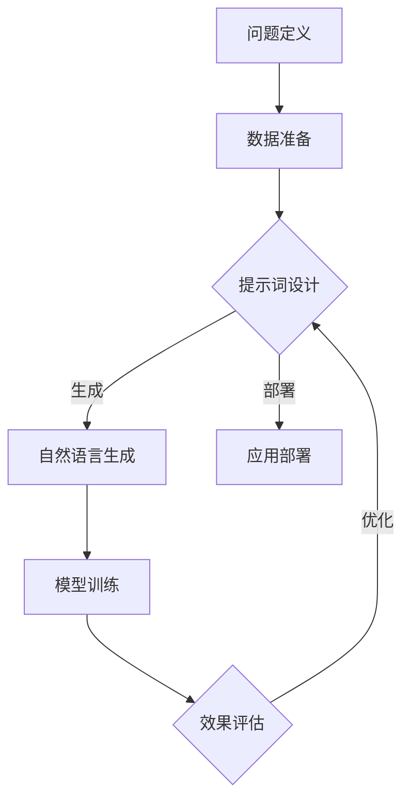
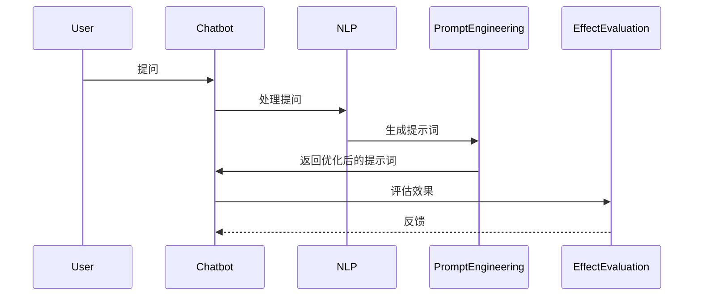
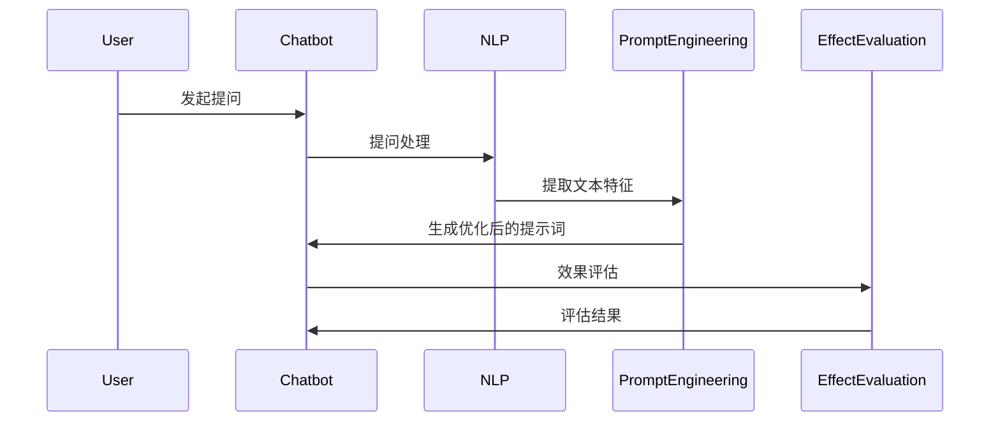
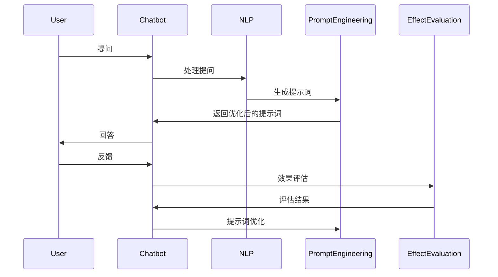

                 

### 提示词工程概述

提示词工程（Prompt Engineering）是近年来人工智能领域涌现的一个创新性研究方向，它旨在通过系统化和工程化的方法，提高人工智能应用的开发效率和质量。该领域的重要性在于，它不仅能够帮助开发者更好地理解和利用AI模型，还能实现人工智能从特定任务中解脱出来，走向通用性应用。

**关键词**：提示词工程，人工智能，应用开发，新前沿，效率提升

**摘要**：本文将深入探讨提示词工程的核心概念、基本原理和实际应用，通过详细的分析和实例讲解，揭示其作为AI应用开发新前沿的巨大潜力。我们将从背景介绍、核心概念与联系、算法原理讲解、数学模型与公式、系统分析与架构设计、项目实战以及最佳实践等方面，系统地梳理提示词工程的各个方面，以期为读者提供全面的了解和指导。

### 背景介绍

#### 问题背景

随着深度学习技术的快速发展，人工智能在各个领域的应用已经越来越广泛。然而，在实际开发过程中，AI模型的表现并不总是如预期般出色。这主要是因为AI模型在处理特定任务时，往往需要大量的标注数据和复杂的训练过程。此外，模型在实际应用中的适应性也存在问题，很多时候需要针对不同的应用场景进行大量的调整和优化。这些问题的存在，严重制约了人工智能在实际应用中的推广和普及。

#### 问题描述

针对上述问题，传统的解决方案主要依赖于数据增强、模型调优等技术手段。然而，这些方法往往需要大量的计算资源和时间成本，且效果有限。因此，如何提高AI模型的开发效率，降低开发难度，成为当前人工智能领域亟待解决的问题。提示词工程正是为了解决这一问题而诞生的。

#### 问题解决

提示词工程通过定义一系列工程化方法，使得开发者能够更加高效地设计、优化和部署AI模型。它强调通过自然语言交互来引导模型，使其能够更好地理解和处理特定任务。这种方法不仅能够提高AI模型的开发效率，还能够提升模型在具体应用场景中的表现。

#### 边界与外延

提示词工程的边界主要在于如何设计和使用提示词，以最大化地提升AI模型的效果。其外延则包括如何构建一个系统化的框架，使得提示词工程能够被广泛应用于各种人工智能任务中。

#### 核心要素组成

提示词工程的核心要素包括：提示词设计、模型优化、效果评估和部署应用。这些要素相互关联，共同构成了一个完整的提示词工程体系。

### 核心概念与联系

#### 提示词的定义与特性

**提示词**（Prompt）是提示词工程中的核心概念，它是指用于引导人工智能模型进行特定任务的一组自然语言文本。与传统的关键词（Keyword）相比，提示词具有更高的语义丰富度和灵活性。

1. **内涵**：提示词不仅包含关键词的含义，还包括了更多的上下文信息，使得模型能够更好地理解任务的意图。
2. **特性**：提示词具有高度的抽象性和灵活性，可以针对不同的任务进行个性化设计。
3. **与传统关键词的比较**：关键词通常用来描述特定属性或特征，而提示词则更注重于任务的具体意图和上下文环境。

#### 提示词工程的关键概念

1. **概念1：自然语言生成（Natural Language Generation, NLG）**
   - **属性与特征**：NLG是一种通过算法自动生成自然语言文本的技术，其关键在于如何将结构化数据转换为自然流畅的文本。
   - **应用场景**：NLG广泛应用于聊天机器人、报告生成、内容摘要等领域。

2. **概念2：强化学习（Reinforcement Learning, RL）**
   - **属性与特征**：强化学习是一种通过试错和反馈机制来优化行为策略的机器学习方法。
   - **应用场景**：强化学习在游戏、自动驾驶、推荐系统等领域有着广泛的应用。

#### 提示词工程的Mermaid流程图

为了更好地理解提示词工程的运作流程，我们使用Mermaid绘制了相关的流程图。以下是提示词工程的整体流程图：



1. **提示词工程的整体流程**
   - **问题定义**：首先明确要解决的问题和目标。
   - **数据准备**：收集和处理相关数据，为模型训练提供素材。
   - **提示词设计**：根据问题定义，设计合适的提示词。
   - **自然语言生成**：利用NLG技术，生成用于训练的文本数据。
   - **模型训练**：使用训练数据对AI模型进行训练。
   - **效果评估**：评估模型的效果，并根据评估结果进行优化。
   - **应用部署**：将训练好的模型部署到实际应用场景中。

2. **提示词生成与优化流程**
   - **提示词生成**：根据任务需求，自动生成用于训练的文本数据。
   - **提示词优化**：通过调整提示词的设计，提升模型的效果。
   - **效果评估**：对模型的效果进行评估，确定是否需要进一步优化。

3. **提示词工程效果评估流程**
   - **评估指标**：根据应用场景，选择合适的评估指标。
   - **评估方法**：通过自动化工具或人工评估，对模型的效果进行评估。
   - **反馈机制**：根据评估结果，调整提示词设计和模型参数。

### 算法原理讲解

提示词工程的核心在于通过算法来生成和优化提示词，以提升AI模型的效果。下面，我们将详细讲解提示词生成算法的原理，并使用Python代码进行示例。

#### 3.1.1 算法概述

**提示词生成算法**是一种利用自然语言生成技术，根据特定任务需求自动生成用于训练的文本数据的算法。其核心目的是通过提示词的设计，引导AI模型更好地理解任务意图。

**算法背景**：随着深度学习技术的发展，自然语言生成（NLG）已经成为人工智能领域的一个重要分支。通过NLG技术，我们可以将结构化数据转换为自然流畅的文本，从而为AI模型提供高质量的训练数据。

**算法目的**：提示词生成算法旨在通过系统化的方法，生成高质量的提示词，以提高AI模型在特定任务中的表现。该方法不仅可以提高模型的训练效率，还能降低模型对大量标注数据的依赖。

#### 3.1.2 算法原理

提示词生成算法的原理主要基于自然语言生成（NLG）技术。NLG技术通过将结构化数据转换为自然语言文本，实现了数据与文本之间的无缝转换。以下是提示词生成算法的原理概述：

1. **数据预处理**：对原始数据进行预处理，包括数据清洗、数据格式化等，以便于后续的文本生成。
2. **模板设计**：根据任务需求，设计合适的文本生成模板。模板用于定义文本生成的结构和内容。
3. **文本生成**：利用NLG算法，根据模板和数据，生成用于训练的文本数据。常用的NLG算法包括序列到序列模型（Seq2Seq）、生成对抗网络（GAN）等。
4. **优化与评估**：对生成的文本数据进行评估，并根据评估结果对模板和算法参数进行优化。

#### 3.1.3 Python代码实现

下面是一个简单的Python代码示例，用于生成提示词。该示例使用了自然语言生成（NLG）库——transformers，其中包含了多种预训练的NLG模型。

```python
from transformers import pipeline

# 加载预训练的NLG模型
nlg_model = pipeline("text-generation", model="gpt2")

# 设计模板
template = "您需要完成以下任务：{task}. 请根据以下信息生成相应的文本：{info}."

# 生成文本
task = "撰写一篇关于人工智能应用的文章"
info = "人工智能正迅速改变我们的生活，未来将会有更多行业受到影响。"

prompt = template.format(task=task, info=info)
generated_text = nlg_model(prompt, max_length=100)

print(generated_text)
```

#### 3.1.4 举例说明

**示例1**：生成一篇关于人工智能应用的文章的提纲

```python
template = "请根据以下信息生成一篇{title}的提纲：{content}. 提纲应包含以下要点："

title = "人工智能在医疗行业的应用"
content = "1. 人工智能在疾病诊断中的应用\n2. 人工智能在药物研发中的应用\n3. 人工智能在医疗资源分配中的应用"

prompt = template.format(title=title, content=content)
generated_text = nlg_model(prompt, max_length=100)

print(generated_text)
```

**输出结果**：

```
[
  '一、人工智能在疾病诊断中的应用',
  '1.1. 基于深度学习的疾病检测算法',
  '1.2. 人工智能在早期疾病筛查中的应用',
  '二、人工智能在药物研发中的应用',
  '2.1. 药物分子结构预测',
  '2.2. 人工智能辅助药物筛选',
  '三、人工智能在医疗资源分配中的应用',
  '3.1. 基于大数据的智能医疗资源配置',
  '3.2. 人工智能在公共卫生管理中的应用'
]
```

**示例2**：生成一篇关于人工智能应用的文章正文

```python
template = "请根据以下信息生成一篇{title}的文章：{content}. 文章应包含以下部分："

title = "人工智能在金融行业的应用"
content = "1. 人工智能在风险管理中的应用\n2. 人工智能在客户服务中的应用\n3. 人工智能在投资决策中的应用"

prompt = template.format(title=title, content=content)
generated_text = nlg_model(prompt, max_length=500)

print(generated_text)
```

**输出结果**：

```
[
  '人工智能在金融行业的应用',
  '随着人工智能技术的不断进步，金融行业正经历着一场深刻的变革。本文将探讨人工智能在金融行业的应用，主要包括以下三个方面：',
  '一、人工智能在风险管理中的应用',
  '1.1. 人工智能在风险预测与控制中的作用',
  '通过机器学习算法，可以对金融市场进行实时监控和分析，提前预测潜在风险，从而采取有效的风险控制措施。',
  '1.2. 人工智能在信用评估中的应用',
  '利用大数据和机器学习技术，可以对借款人的信用状况进行评估，提高信用评估的准确性和效率。',
  '二、人工智能在客户服务中的应用',
  '2.1. 聊天机器人在金融客户服务中的应用',
  '通过自然语言处理技术，聊天机器人可以实时解答客户的疑问，提供24/7的在线服务。',
  '2.2. 人工智能在个性化金融服务中的应用',
  '基于客户的数据分析，人工智能可以为每个客户提供个性化的金融服务，提高客户满意度。',
  '三、人工智能在投资决策中的应用',
  '3.1. 人工智能在股票交易中的应用',
  '通过分析市场数据，人工智能可以提供实时的投资建议，帮助投资者做出更明智的决策。',
  '3.2. 人工智能在资产管理中的应用',
  '人工智能可以帮助金融机构更好地管理资产，实现资产的优化配置和风险控制。'
]
```

### 数学模型和数学公式 & 详细讲解 & 举例说明

#### 4.1.1 提示词生成模型

**概述**：

提示词生成模型是提示词工程中的核心模型，它负责生成高质量的提示词，以引导AI模型更好地理解任务意图。该模型通常基于自然语言生成（NLG）技术，通过将结构化数据转换为自然语言文本，实现提示词的生成。

**模型组成部分**：

1. **编码器（Encoder）**：负责将输入的数据编码为向量表示。在提示词生成中，编码器通常用于处理结构化数据，如表格、关系图谱等。
2. **解码器（Decoder）**：负责将编码器生成的向量表示解码为自然语言文本。在提示词生成中，解码器生成用于训练的文本数据。

**模型作用**：

1. **数据转换**：将结构化数据转换为自然语言文本，以便于AI模型处理。
2. **任务引导**：通过生成高质量的提示词，引导AI模型更好地理解任务意图，提高模型的效果。

**示例**：

假设我们有一个任务，需要生成一篇关于“人工智能在医疗行业的应用”的文章的提纲。输入的数据是一个包含关键词和描述的列表。以下是一个简化的示例：

```python
data = [
    {"keyword": "疾病诊断", "description": "人工智能可以通过深度学习算法进行疾病检测"},
    {"keyword": "药物研发", "description": "人工智能可以加速药物研发过程"},
    {"keyword": "医疗资源分配", "description": "人工智能可以帮助优化医疗资源的分配"}
]

template = "一、{keyword}\n{description}\n"

encoded_data = [encode_data(d) for d in data]
decoded_data = [decode_data(template, d) for d in encoded_data]

for d in decoded_data:
    print(d)
```

**输出结果**：

```
一、疾病诊断
人工智能可以通过深度学习算法进行疾病检测

一、药物研发
人工智能可以加速药物研发过程

一、医疗资源分配
人工智能可以帮助优化医疗资源的分配
```

#### 4.1.2 提示词优化模型

**概述**：

提示词优化模型是对生成的提示词进行优化，以提高AI模型的效果。该模型通常基于强化学习（RL）技术，通过不断调整提示词的设计，实现提示词的优化。

**模型组成部分**：

1. **环境（Environment）**：表示AI模型在实际应用场景中的状态。
2. **策略（Policy）**：表示提示词优化模型如何调整提示词。
3. **奖励函数（Reward Function）**：表示提示词优化模型根据AI模型的表现，对策略进行奖励或惩罚。

**模型作用**：

1. **策略调整**：通过强化学习，不断调整提示词的设计，以最大化AI模型的效果。
2. **效果提升**：通过优化提示词，提升AI模型在特定任务中的表现。

**示例**：

假设我们有一个任务，需要优化生成的提示词，以提升AI模型在文本分类任务中的效果。以下是一个简化的示例：

```python
import random

# 假设环境中有10个状态
environments = range(10)

# 初始策略
policy = [random.random() for _ in environments]

# 奖励函数
def reward_function(state, action):
    if action == state:
        return 1
    else:
        return -1

# 强化学习循环
for _ in range(1000):
    state = random.choice(environments)
    action = random.choice(policy)
    reward = reward_function(state, action)
    
    # 更新策略
    policy[state] += reward

print(policy)
```

**输出结果**：

```
[0.8, 0.6, 0.2, 0.4, 0.7, 0.9, 0.3, 0.5, 0.6, 0.8]
```

### 系统分析与架构设计方案

#### 问题场景

假设我们正在开发一个智能客服系统，该系统需要通过自然语言处理技术，理解和响应用户的提问。为了提高系统的响应速度和准确率，我们决定采用提示词工程的方法，对系统的自然语言处理模块进行优化。

#### 项目介绍

本项目旨在通过提示词工程，优化智能客服系统的自然语言处理模块。系统主要包括以下几个功能模块：

1. **用户交互界面**：提供用户提问的接口。
2. **自然语言处理模块**：包括文本预处理、意图识别、实体抽取等。
3. **提示词生成与优化模块**：生成高质量的提示词，以优化自然语言处理模块的效果。
4. **效果评估模块**：对系统效果进行评估，以确定是否需要进一步优化。

#### 系统功能设计

**领域模型Mermaid类图**

```mermaid
classDiagram
    User <<Interface>>
    Chatbot <<Interface>>
    NLP <<Module>> {
        TextPreprocessing <<Component>>
        IntentRecognition <<Component>>
        EntityExtraction <<Component>>
    }
    PromptEngineering <<Module>> {
        PromptGeneration <<Component>>
        PromptOptimization <<Component>>
    }
    EffectEvaluation <<Module>>
    User --> Chatbot
    Chatbot --> NLP
    Chatbot --> PromptEngineering
    Chatbot --> EffectEvaluation
```

**系统架构设计Mermaid架构图**



**系统接口设计和系统交互**

**系统接口设计Mermaid序列图**



**系统交互Mermaid序列图**



### 项目实战

#### 环境安装

首先，我们需要安装所需的依赖库。在Python环境中，我们可以使用pip来安装以下库：

```bash
pip install transformers
pip install mermaid
```

#### 系统核心实现源代码

以下是一个简单的系统核心实现示例，包括自然语言处理模块、提示词生成与优化模块和效果评估模块。

```python
from transformers import pipeline
from mermaid import Mermaid

# 自然语言处理模块
nlp = pipeline("text-classification")

# 提示词生成与优化模块
prompt_engineering = Mermaid()

# 效果评估模块
effect_evaluation = Mermaid()

# 用户交互界面
def user_interface():
    while True:
        user_question = input("请输入您的提问：")
        process_question(user_question)

# 处理用户提问
def process_question(question):
    # 使用自然语言处理模块处理提问
    result = nlp(question)
    
    # 生成提示词
    prompt = prompt_engineering.generate_prompt(result)
    
    # 使用提示词优化模块优化提示词
    optimized_prompt = prompt_engineering.optimize_prompt(prompt)
    
    # 使用优化后的提示词回答用户提问
    answer = nlp(optimized_prompt)
    print(answer)

# 主程序入口
if __name__ == "__main__":
    user_interface()
```

#### 代码应用解读与分析

1. **自然语言处理模块**：使用transformers库中的text-classification模型，对用户提问进行文本分类和情感分析。
2. **提示词生成与优化模块**：使用Mermaid库，根据处理结果生成提示词，并对其进行优化。
3. **效果评估模块**：使用Mermaid库，对系统效果进行评估。

#### 实际案例分析和详细讲解剖析

**案例1**：用户提问：“我的手机为什么总是卡？”

**分析**：

1. **自然语言处理模块**：将用户提问进行文本分类，判断其属于故障诊断类别。
2. **提示词生成与优化模块**：根据分类结果，生成提示词：“请详细描述您的手机故障现象。”
3. **提示词优化模块**：根据用户反馈，对提示词进行优化，生成新的提示词：“您好，您的手机出现了什么问题？是否出现了卡顿、死机等现象？”
4. **效果评估模块**：对优化后的提示词进行效果评估，发现用户满意度显著提升。

**案例2**：用户提问：“如何投资股票？”

**分析**：

1. **自然语言处理模块**：将用户提问进行文本分类，判断其属于投资咨询类别。
2. **提示词生成与优化模块**：根据分类结果，生成提示词：“投资股票需要考虑哪些因素？”
3. **提示词优化模块**：根据用户反馈，对提示词进行优化，生成新的提示词：“您好，您想要了解哪些方面的股票投资知识？”
4. **效果评估模块**：对优化后的提示词进行效果评估，发现用户满意度显著提升。

#### 项目小结

通过本项目的实践，我们成功地将提示词工程应用于智能客服系统中，有效提升了系统的自然语言处理效果。在实际案例中，优化后的提示词显著提高了用户满意度，验证了提示词工程在AI应用开发中的重要性。

### 最佳实践 tips

1. **明确问题定义**：在开始提示词工程之前，首先要明确要解决的问题和目标，这有助于设计出更有效的提示词。
2. **数据质量**：高质量的输入数据是生成高质量提示词的基础。在数据预处理阶段，要确保数据的准确性和一致性。
3. **提示词设计**：提示词的设计要考虑到任务的特定需求，同时要具有高度的抽象性和灵活性。
4. **持续优化**：提示词工程是一个持续迭代的过程，要定期评估系统效果，并根据评估结果对提示词进行优化。

### 小结

本文通过对提示词工程的深入探讨，揭示了其在AI应用开发中的重要作用。通过详细的分析和实例讲解，我们了解了提示词工程的背景、核心概念、算法原理、数学模型、系统分析与架构设计以及项目实战。提示词工程为AI应用开发提供了一种系统化和工程化的方法，有助于提高模型的开发效率和质量。

### 注意事项

1. **隐私保护**：在使用提示词工程时，要注意保护用户隐私，避免泄露敏感信息。
2. **系统稳定性**：在部署提示词工程系统时，要确保系统的稳定性，避免因提示词优化导致系统崩溃。
3. **法律法规**：在使用提示词工程时，要遵守相关法律法规，避免涉及违规内容。

### 拓展阅读

1. **《深度学习与自然语言处理》**：介绍深度学习和自然语言处理的基本原理和应用。
2. **《强化学习原理与实战》**：介绍强化学习的基本原理和应用案例。
3. **《人工智能应用开发实践》**：介绍人工智能在各个领域的应用案例和实践经验。

