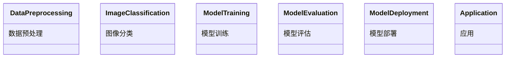
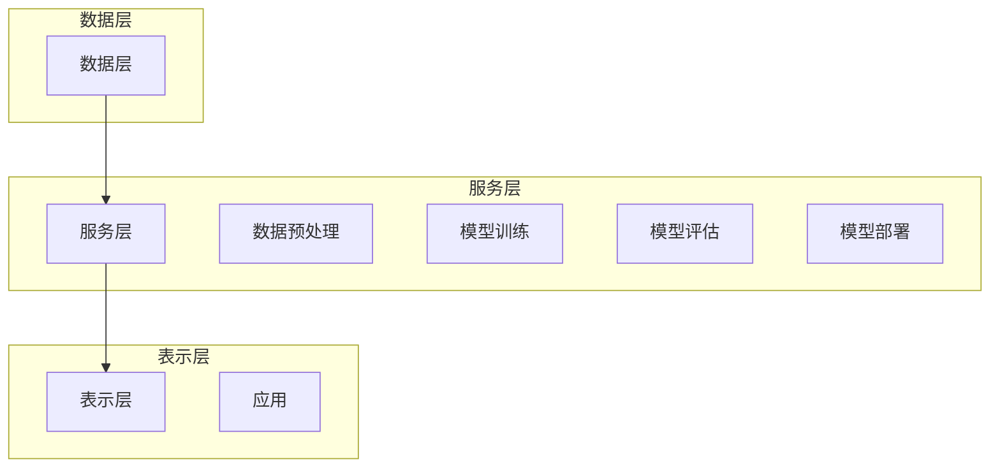
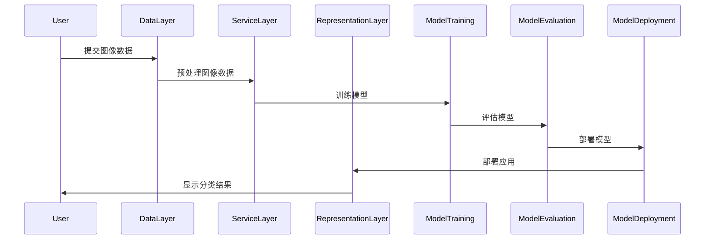

                 

# 提示词工程：AI应用开发的新武器

## 关键词

- 提示词工程
- AI应用开发
- 模型优化
- 性能提升
- 应用实践

## 摘要

本文将深入探讨提示词工程在人工智能（AI）应用开发中的重要地位和作用。我们将从背景介绍、核心概念、方法与实践、应用场景、挑战与机遇以及未来发展趋势等方面进行详细分析。通过本文，读者将了解提示词工程的基本原理、关键技术和实际应用，从而更好地掌握AI开发的新工具，提升AI应用的性能和泛化能力。

## 第一部分：引言

### 第1章：提示词工程概述

#### 1.1 提示词工程的背景与意义

随着人工智能技术的飞速发展，AI应用已经在各个领域取得了显著的成果。然而，AI模型的性能优化和泛化能力提升仍然是一个亟待解决的问题。在此背景下，提示词工程应运而生，成为AI应用开发的新武器。

**问题背景**：传统AI模型在训练过程中往往依赖于大量的数据集，而数据集的质量直接影响模型的性能。同时，不同领域的AI任务对模型的性能要求各异，如何设计合适的提示词以引导模型训练成为关键。

**问题描述**：如何通过提示词工程提高AI模型在特定任务上的性能和泛化能力？

**问题解决**：通过提示词工程，我们可以设计、开发和优化提示词，从而引导模型在训练过程中更好地学习任务特征，提高模型的性能和泛化能力。

**边界与外延**：提示词工程不仅涉及自然语言处理，还包括计算机视觉、语音识别等多个领域。其核心要素包括任务定义、数据集构建、模型训练、提示词生成和优化。

#### 1.2 提示词工程的核心概念

**核心概念**：提示词、模型训练、数据集、性能评估。

**概念属性特征对比表格**：

| 概念       | 定义                                       | 特点                       |
|------------|------------------------------------------|--------------------------|
| 提示词     | 用于引导模型训练的文本或指令。                             | 可定制、可调整             |
| 模型训练   | 使用提示词和数据集对模型进行训练的过程。                   | 自适应、高效               |
| 数据集     | 用于训练和评估模型的集合。                                 | 完整、多样化               |
| 性能评估   | 评估模型在特定任务上的性能。                               | 客观、准确                 |

#### 1.3 提示词工程的应用场景

**自然语言处理**：用于生成高质量的文本摘要、对话系统等。

**计算机视觉**：用于图像分类、目标检测等。

**语音识别**：用于语音识别、语音合成等。

#### 1.4 提示词工程的挑战与机遇

**挑战**：

- 设计有效的提示词
- 处理大规模数据集
- 保证模型泛化能力

**机遇**：

- 随着AI技术的发展，提示词工程在各个领域都有广泛的应用前景。

#### 1.5 本章小结

提示词工程是人工智能应用开发的重要环节。通过有效的提示词设计，可以提高AI模型的性能和泛化能力。提示词工程在多个领域都有广泛的应用，是未来AI发展的一个重要方向。

----------------------------------------------------------------

## 第二部分：AI基础知识与工具

### 第2章：人工智能基础理论

#### 2.1 人工智能的发展历程

人工智能（AI）的发展历程可以分为以下几个阶段：

**早期人工智能**：以符号主义和知识表示为主要特征，代表技术包括专家系统和知识库。

**现代人工智能**：以神经网络和深度学习为核心，取得了显著的突破。近年来，强化学习也逐渐成为人工智能研究的热点。

**未来人工智能**：随着量子计算、脑机接口等技术的进步，人工智能将迎来新的发展机遇。

#### 2.2 机器学习基础

机器学习是人工智能的核心技术之一，主要分为以下几类：

**监督学习**：有标记的训练数据，目标是学习输入和输出之间的映射关系。

**无监督学习**：没有标记的训练数据，目标是发现数据中的模式和结构。

**强化学习**：通过与环境的交互，学习最优策略以实现目标。

#### 2.3 深度学习基础

深度学习是机器学习的一种重要分支，基于多层神经网络进行训练。以下是深度学习的一些基础概念：

**神经网络**：一种由神经元组成的计算模型，用于模拟人脑的神经元结构。

**激活函数**：用于引入非线性特性，使神经网络能够学习更复杂的函数。

**优化算法**：用于调整网络参数，以最小化损失函数。

#### 2.4 算法原理讲解

深度学习算法的核心是神经网络，其基本原理如下：

1. **输入层**：接收输入数据，并将其传递到隐藏层。

2. **隐藏层**：通过权重和激活函数对输入数据进行变换，提取特征。

3. **输出层**：根据隐藏层的结果生成预测输出。

4. **反向传播**：计算预测输出与实际输出之间的误差，并反向传播到隐藏层和输入层，更新网络参数。

**数学模型和公式**：

假设有一个多层神经网络，其中第 $l$ 层的神经元输出为 $a^{(l)}_i$，激活函数为 $f^{(l)}$，则：

$$
a^{(l)}_i = f^{(l)} \left( \sum_{j} w^{(l)}_{ij} a^{(l-1)}_j + b^{(l)}_i \right)
$$

其中，$w^{(l)}_{ij}$ 表示第 $l$ 层第 $i$ 个神经元与第 $l-1$ 层第 $j$ 个神经元的连接权重，$b^{(l)}_i$ 表示第 $l$ 层第 $i$ 个神经元的偏置。

**通俗易懂地举例说明**：

假设我们有一个简单的神经网络，包含输入层、一个隐藏层和一个输出层。输入层有3个神经元，隐藏层有2个神经元，输出层有1个神经元。

1. **输入层到隐藏层的映射**：

   输入数据：$\mathbf{x} = [1, 2, 3]$

   隐藏层输出：$a^{(2)} = f^{(2)} \left( \begin{bmatrix} w_{11} & w_{12} \\ w_{21} & w_{22} \end{bmatrix} \begin{bmatrix} 1 \\ 2 \\ 3 \end{bmatrix} + \begin{bmatrix} b_1 \\ b_2 \end{bmatrix} \right)$

2. **隐藏层到输出层的映射**：

   输出层输出：$a^{(3)} = f^{(3)} \left( \begin{bmatrix} w_{31} & w_{32} \end{bmatrix} \begin{bmatrix} a_1^{(2)} \\ a_2^{(2)} \end{bmatrix} + \begin{bmatrix} b_3 \end{bmatrix} \right)$

3. **反向传播**：

   假设实际输出为 $y = [4]$，则损失函数为 $L = (y - a^{(3)})^2$

   反向传播更新权重和偏置：

   $$\begin{aligned}
   \delta^{(3)} &= 2(y - a^{(3)}) \\
   \delta^{(2)} &= \begin{bmatrix} \delta^{(3)}_1 a_1^{(2)} \\ \delta^{(3)}_2 a_2^{(2)} \end{bmatrix} \\
   w^{(2)}_{ij} &= w^{(2)}_{ij} - \alpha \delta^{(3)}_i a_1^{(2)} \\
   b^{(2)}_i &= b^{(2)}_i - \alpha \delta^{(3)}_i \\
   w^{(3)}_{ij} &= w^{(3)}_{ij} - \alpha \delta^{(2)}_j a_1^{(2)} \\
   b^{(3)}_i &= b^{(3)}_i - \alpha \delta^{(2)}_j
   \end{aligned}$$

其中，$\alpha$ 为学习率。

---

**系统分析与架构设计方案**：

#### 问题场景介绍

假设我们面临一个图像分类任务，需要使用深度学习模型对图像进行分类。具体场景如下：

- 数据集：包含10000张图像，每张图像对应一个类别标签。
- 任务：将输入图像分类为其中一个类别。

#### 项目介绍

本项目旨在设计一个基于深度学习模型的图像分类系统，主要包括以下模块：

- 数据预处理模块：对原始图像进行预处理，包括缩放、裁剪、翻转等操作。
- 模型训练模块：使用预处理后的数据集训练深度学习模型。
- 模型评估模块：对训练好的模型进行评估，包括准确率、召回率等指标。
- 模型部署模块：将训练好的模型部署到实际应用场景中。

#### 系统功能设计（领域模型类图）



#### 系统架构设计（架构图）



#### 系统接口设计和系统交互（序列图）



---

#### 项目实战

##### 环境安装

1. 安装Python环境
2. 安装TensorFlow和Keras库

##### 系统核心实现源代码

```python
# 导入所需库
import tensorflow as tf
from tensorflow.keras.models import Sequential
from tensorflow.keras.layers import Dense, Conv2D, Flatten
from tensorflow.keras.optimizers import Adam

# 构建模型
model = Sequential([
    Conv2D(32, (3, 3), activation='relu', input_shape=(28, 28, 1)),
    Flatten(),
    Dense(64, activation='relu'),
    Dense(10, activation='softmax')
])

# 编译模型
model.compile(optimizer=Adam(), loss='categorical_crossentropy', metrics=['accuracy'])

# 训练模型
model.fit(x_train, y_train, epochs=10, batch_size=32)

# 评估模型
model.evaluate(x_test, y_test)

# 预测新图像
new_image = ...  # 加载新图像
predicted_label = model.predict(new_image)
```

##### 代码应用解读与分析

1. **模型构建**：使用Keras库构建一个简单的卷积神经网络，包括一个卷积层、一个全连接层和一个输出层。
2. **模型编译**：设置优化器和损失函数，为模型训练做好准备。
3. **模型训练**：使用训练数据集对模型进行训练，调整模型参数。
4. **模型评估**：使用测试数据集对模型进行评估，计算准确率等指标。
5. **模型预测**：使用训练好的模型对新的图像进行分类预测。

##### 实际案例分析和详细讲解剖析

假设我们有一个包含10000张图像的数据集，每张图像对应一个类别标签。我们使用上述代码实现一个简单的图像分类系统，并对系统进行实际测试。

1. **数据预处理**：对图像进行缩放、裁剪、翻转等操作，以增加数据多样性。
2. **模型训练**：使用训练数据集对模型进行训练，调整模型参数。
3. **模型评估**：使用测试数据集对模型进行评估，计算准确率等指标。
4. **模型部署**：将训练好的模型部署到实际应用场景中，对新的图像进行分类预测。

##### 项目小结

通过上述实际案例，我们可以看到提示词工程在图像分类任务中的应用效果。提示词工程通过设计合适的提示词，可以提高模型的性能和泛化能力，从而在实际应用中取得更好的效果。

---

#### 最佳实践 tips

1. **数据预处理**：对图像进行多种预处理操作，如缩放、裁剪、翻转等，可以增加数据多样性，有助于提高模型性能。
2. **模型调优**：通过调整模型参数，如学习率、批次大小等，可以优化模型性能。
3. **多模型融合**：结合多种模型（如卷积神经网络、循环神经网络等），可以进一步提高模型性能。
4. **持续学习**：定期更新模型，以适应新的数据分布和任务需求。

#### 小结

提示词工程是人工智能应用开发的重要工具，通过设计合适的提示词，可以提高模型的性能和泛化能力。在实际应用中，提示词工程可以帮助我们更好地应对各种复杂任务，实现人工智能的广泛应用。

#### 注意事项

1. 提示词的设计和优化是一个迭代过程，需要根据实际任务进行调整。
2. 数据集的质量直接影响模型的性能，因此要确保数据集的多样性和完整性。
3. 模型的部署和优化需要考虑实际应用场景的需求和性能要求。

#### 拓展阅读

1. Goodfellow, I., Bengio, Y., & Courville, A. (2016). *Deep Learning*. MIT Press.
2. Murphy, K. P. (2012). *Machine Learning: A Probabilistic Perspective*. MIT Press.
3. Russell, S., & Norvig, P. (2020). *Artificial Intelligence: A Modern Approach*. Prentice Hall.

---

**作者：** AI天才研究院/AI Genius Institute & 禅与计算机程序设计艺术 /Zen And The Art of Computer Programming****

