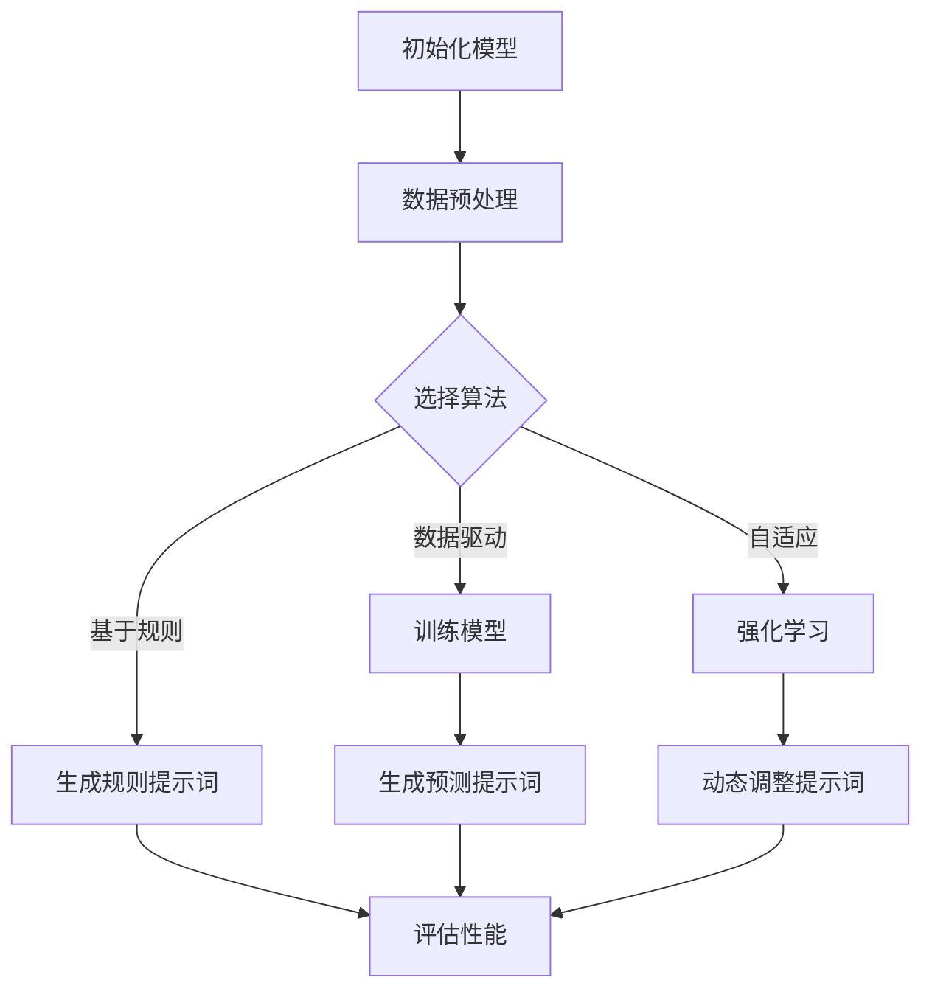
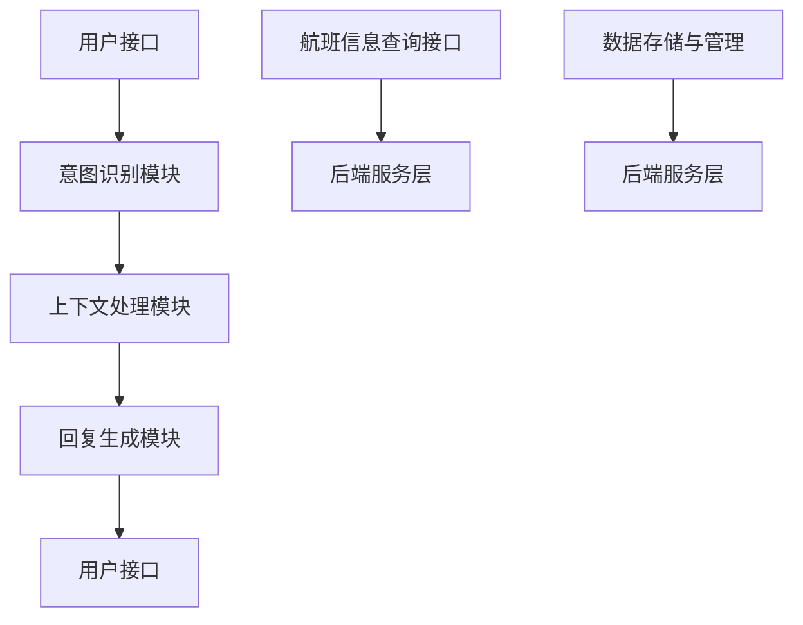
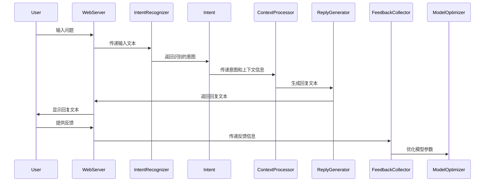

                 

### 第一部分: AI时代的背景与概述

#### 第1章: AI时代的崛起与提示词工程的必要性

##### 1.1 AI时代的大背景

**人工智能的发展历程**

人工智能（Artificial Intelligence, AI）作为一个跨学科领域，自20世纪50年代诞生以来，经历了多个发展阶段。从最初的符号主义人工智能（Symbolic AI）和基于规则的系统，到基于知识的推理，再到连接主义人工智能（Connectionist AI）和深度学习的兴起，人工智能的研究和应用不断演进。

**提示词工程的概念**

提示词工程（Prompt Engineering）是一种专门研究如何设计、优化和调整提示词以提升AI系统表现的方法。在AI的发展过程中，尤其是在自然语言处理（Natural Language Processing, NLP）和生成式模型（Generative Models）的应用中，提示词工程发挥着至关重要的作用。

**提示词工程在AI中的应用**

在AI系统中，提示词可以被看作是用户与模型之间的桥梁，它不仅帮助模型理解用户的需求，还能影响模型的输出结果。特别是在生成式AI模型中，提示词的质量直接关系到生成的文本、图像或其他数据的质量。

##### 1.2 提示词工程的核心概念与联系

**提示词的定义与作用**

提示词（Prompt）是一个引导性输入，用于触发AI系统的响应。它可以是自然语言文本、代码片段或其他形式的指令。在提示词工程中，设计有效的提示词是提升AI系统性能的关键。

**预训练模型与微调**

预训练模型（Pre-trained Model）是经过大规模数据集训练的模型，具有较高的泛化能力。微调（Fine-tuning）则是针对特定任务对预训练模型进行进一步训练的过程，通过微调可以使模型更好地适应特定的应用场景。

**提示词工程的关键要素**

提示词工程涉及多个关键要素，包括数据集、模型架构、提示词设计和评估指标等。这些要素相互作用，共同影响最终的系统性能。

##### 1.3 提示词工程的挑战与机遇

**提示词工程的挑战**

- 提示词质量的影响因素复杂，如语义理解、上下文感知和模型适应能力等。
- 数据质量和多样性对提示词工程的效果具有重要影响。
- 提示词的设计和调整需要大量的时间和专业知识。

**提示词工程带来的机遇**

- 随着AI技术的发展，提示词工程方法不断创新，为解决复杂问题提供了新的思路。
- 提示词工程在商业应用中具有广泛的前景，如智能客服、内容生成和智能搜索等。

### 提示词工程的重要性

在AI时代，提示词工程的重要性不容忽视。它不仅是提升AI系统性能的关键技术，也是实现人工智能与人类高效互动的重要手段。通过深入研究提示词工程，我们可以更好地理解和利用AI的潜力，推动AI技术的发展和应用。

### 关键词

- AI时代
- 提示词工程
- 预训练模型
- 微调
- 自然语言处理
- 生成式模型
- 智能互动

### 摘要

本文深入探讨了AI时代背景下提示词工程的重要性及其核心概念。从人工智能的发展历程到提示词工程的基本原理，再到系统架构设计，本文通过逐步分析，揭示了提示词工程在AI系统中的应用和挑战。通过实际项目案例，本文展示了提示词工程的实际操作过程和最佳实践，为读者提供了全面的技术指导和参考。

## 第1章: AI时代的崛起与提示词工程的必要性

### 1.1 AI时代的大背景

人工智能（AI）时代的到来标志着人类科技发展的新纪元。AI不仅仅是一个理论上的概念，它已经在各个领域展现出了巨大的潜力和变革力量。从早期的计算机科学基础，到现代深度学习、机器学习的广泛应用，人工智能经历了无数次的迭代和突破。

**人工智能的发展历程**

人工智能的发展历程可以分为几个重要阶段：

1. **符号主义人工智能**：在20世纪50年代至70年代，符号主义人工智能主要依靠逻辑推理和知识表示来进行问题求解。这一阶段以“逻辑推理机”为代表，但由于其规则系统过于复杂且难以维护，导致实际应用受到限制。

2. **基于知识的推理**：20世纪80年代，人工智能研究转向基于知识的推理系统。这些系统利用大量的知识库和推理规则来模拟人类的思考过程，如专家系统（Expert Systems）。

3. **连接主义人工智能**：20世纪90年代，连接主义人工智能通过神经网络模型获得了新的发展。神经网络，特别是深度神经网络（Deep Neural Networks），通过层次化的学习方式，在图像识别、语音识别等领域取得了突破性进展。

4. **深度学习和生成式模型**：21世纪初，随着计算能力的提升和大数据的普及，深度学习成为人工智能的主流。生成式模型（Generative Models）如生成对抗网络（GANs）和变分自编码器（VAEs）的出现，使得AI在生成逼真的图像、音频和文本方面达到了前所未有的水平。

**提示词工程的概念**

提示词工程（Prompt Engineering）是一种专门研究如何设计、优化和调整提示词以提升AI系统表现的方法。在AI系统中，提示词（Prompt）是一个引导性输入，用于触发AI系统的响应。它可以是一个自然语言文本、一个代码片段或其他形式的指令。提示词工程的核心目标是设计有效的提示词，使AI系统能够更准确地理解用户的需求，并提供更高质量的输出。

提示词的作用主要体现在以下几个方面：

- **任务引导**：提示词能够引导AI系统专注于特定任务，减少无关信息的干扰，提高任务完成的效率。
- **上下文增强**：有效的提示词能够提供上下文信息，帮助AI系统更好地理解用户意图，从而生成更符合预期的输出。
- **性能优化**：通过调整提示词，可以优化AI系统的性能，使其在特定任务上的表现达到最佳状态。

**提示词工程在AI中的应用**

在AI系统中，提示词工程的应用场景非常广泛。以下是一些典型的应用：

- **自然语言处理**：在自然语言处理（NLP）任务中，提示词工程用于改进语言生成模型、机器翻译模型和文本分类模型的性能。例如，通过设计合适的提示词，可以使得文本生成模型生成更加连贯、有逻辑的文本。
- **图像识别**：在图像识别任务中，提示词可以帮助模型更好地理解图像的上下文，从而提高识别准确率。例如，在医疗影像分析中，提示词可以帮助模型识别特定疾病的特征。
- **智能客服**：在智能客服系统中，提示词工程用于优化对话生成模型，使机器能够更好地理解用户的意图并提供个性化的回答。
- **内容生成**：在内容生成领域，提示词工程可以帮助生成模型创作出更加符合用户需求的内容。例如，在写作辅助工具中，提示词可以帮助用户快速生成文章的大纲和段落。

### 1.2 提示词工程的核心概念与联系

在深入理解提示词工程之前，我们需要明确一些核心概念，并了解它们之间的关系。以下是提示词工程中的几个关键概念：

- **提示词**（Prompt）：提示词是引导AI系统进行任务输入的文本或指令。它需要能够清晰、准确地传达用户的意图，并有助于模型理解任务目标。
- **预训练模型**（Pre-trained Model）：预训练模型是经过大规模数据集训练的模型，具有较高的泛化能力。预训练模型通常通过在通用数据集上进行训练，然后通过微调（Fine-tuning）适应特定任务。
- **微调**（Fine-tuning）：微调是指针对特定任务对预训练模型进行进一步训练的过程。通过微调，可以使得预训练模型更好地适应特定应用场景。
- **生成式模型**（Generative Model）：生成式模型是一类能够生成新数据的模型，如生成对抗网络（GANs）和变分自编码器（VAEs）。这些模型通过学习数据分布，能够生成与训练数据相似的新数据。

#### 1.2.1 提示词的定义与作用

提示词是提示词工程的核心元素，它决定了AI系统在特定任务中的表现。一个有效的提示词应该具备以下特点：

- **明确性**：提示词需要清晰明确，避免歧义，确保模型能够正确理解用户意图。
- **上下文关联**：提示词需要包含足够的上下文信息，帮助模型更好地理解任务背景和目标。
- **灵活性**：提示词应该具有灵活性，能够根据不同任务和场景进行调整，以优化模型性能。

在实际应用中，提示词的作用主要体现在以下几个方面：

- **任务引导**：提示词可以帮助模型专注于特定任务，减少无关信息的干扰，提高任务完成的效率。
- **性能优化**：通过设计合适的提示词，可以优化AI系统的性能，使其在特定任务上的表现达到最佳状态。
- **用户交互**：提示词可以增强用户与AI系统之间的互动，提供更加自然的交流体验。

#### 1.2.2 预训练模型与微调

预训练模型是AI系统的基础，通过在大量数据上进行预训练，模型获得了广泛的泛化能力。预训练模型通常采用深度神经网络结构，通过层次化的学习方式，从底层特征到高层抽象进行学习。预训练模型的主要优势在于其强大的泛化能力，能够在多种任务上表现优异。

微调则是针对特定任务对预训练模型进行进一步训练的过程。通过微调，可以使得预训练模型更好地适应特定应用场景。微调过程通常涉及以下步骤：

1. **数据准备**：选择与任务相关的数据集，并进行预处理，如文本清洗、标签标注等。
2. **模型调整**：在预训练模型的基础上，调整模型的结构和参数，使其适应特定任务。
3. **训练与评估**：使用微调后的模型在特定任务上进行训练，并评估模型的性能。
4. **迭代优化**：根据评估结果，调整模型参数和训练策略，不断优化模型性能。

#### 1.2.3 提示词工程的关键要素

提示词工程涉及多个关键要素，这些要素相互作用，共同影响最终的系统性能。以下是提示词工程中的几个关键要素：

- **数据集**：数据集是训练和评估AI系统的基础，高质量的数据集能够提升模型的表现。提示词工程需要针对特定任务选择合适的数据集，并进行数据预处理。
- **模型架构**：模型架构决定了AI系统的学习能力。选择合适的模型架构对于实现高效的提示词工程至关重要。常见的模型架构包括变换器（Transformer）和循环神经网络（RNN）等。
- **提示词设计**：提示词设计是提示词工程的核心，有效的提示词设计能够提升模型的性能和交互体验。提示词设计需要考虑明确性、上下文关联和灵活性等因素。
- **评估指标**：评估指标用于衡量AI系统的性能。选择合适的评估指标，如准确率、召回率、F1分数等，能够更准确地评估模型的效果。

#### 1.2.4 提示词工程的挑战与机遇

**挑战**

- **提示词质量的影响因素复杂**：提示词质量直接关系到AI系统的性能。然而，影响提示词质量的因素众多，如语义理解、上下文感知和模型适应能力等，这使得提示词设计变得更加复杂。
- **数据质量和多样性**：数据质量和多样性对提示词工程的效果具有重要影响。高质量的数据集能够提升模型的表现，而数据集的多样性则有助于模型在不同任务和场景中的泛化能力。
- **设计效率和成本**：有效的提示词设计通常需要大量的时间和专业知识。在实际应用中，设计效率和质量之间的平衡是一个重要的挑战。

**机遇**

- **技术方法的不断创新**：随着AI技术的发展，提示词工程方法不断创新，为解决复杂问题提供了新的思路。例如，自适应提示词设计、多模态提示词工程等。
- **商业应用的前景广阔**：提示词工程在商业应用中具有广泛的前景。例如，在智能客服、内容生成、智能搜索等领域，提示词工程能够显著提升系统的性能和用户体验。
- **人机交互的优化**：提示词工程有助于优化人机交互，使AI系统能够更好地理解用户需求，提供更加自然和高效的互动体验。

### 提示词工程的重要性

在AI时代，提示词工程的重要性不容忽视。它不仅是提升AI系统性能的关键技术，也是实现人工智能与人类高效互动的重要手段。通过深入研究提示词工程，我们可以更好地理解和利用AI的潜力，推动AI技术的发展和应用。

### 关键词

- AI时代
- 提示词工程
- 预训练模型
- 微调
- 自然语言处理
- 生成式模型
- 智能互动

### 摘要

本文深入探讨了AI时代背景下提示词工程的重要性及其核心概念。从人工智能的发展历程到提示词工程的基本原理，再到系统架构设计，本文通过逐步分析，揭示了提示词工程在AI系统中的应用和挑战。通过实际项目案例，本文展示了提示词工程的实际操作过程和最佳实践，为读者提供了全面的技术指导和参考。

## 第2章: 提示词工程的基本原理

### 2.1 提示词工程的算法原理

提示词工程是一门结合了自然语言处理、机器学习和人工智能技术的跨学科领域。其核心在于通过设计、优化和调整提示词，来提高AI模型的性能和输出质量。在这一节中，我们将详细探讨提示词工程的主要算法原理，包括常用的提示词生成算法、微调方法以及它们在不同应用场景中的表现。

#### 2.1.1 主流提示词工程算法概述

提示词工程的算法可以大致分为以下几类：

1. **基于规则的方法**：这种方法通过预定义的规则来生成提示词。例如，在对话系统设计中，可以根据对话的上下文和历史信息，应用规则库来生成相应的提示词。

2. **数据驱动的方法**：这类方法依赖于大量训练数据，通过机器学习模型来自动生成和优化提示词。例如，使用自然语言生成（NLG）模型或转换器（Transformer）架构来生成高质量的提示词。

3. **自适应方法**：这些方法能够根据用户交互和历史行为动态调整提示词。例如，使用强化学习（Reinforcement Learning）来优化提示词，使其更好地满足用户需求。

4. **多模态方法**：当提示词需要包含图像、音频或视频等多模态信息时，多模态方法能够融合不同模态的数据来生成提示词。

#### 2.1.2 提示词工程算法流程图（Mermaid）

为了更好地理解提示词工程的算法流程，我们可以使用Mermaid绘制一个简化的流程图。以下是一个示例：



在上面的流程图中，我们从初始化模型开始，根据选择的不同算法路径，进行数据预处理、模型训练或动态调整，最后评估性能。这个流程图展示了提示词工程的基本步骤和主要决策点。

#### 2.1.3 算法原理讲解

为了深入理解提示词工程算法的原理，我们将重点介绍数据驱动方法中的几个关键步骤：

1. **数据预处理**：数据预处理是提示词工程的第一步，它包括文本清洗、分词、去除停用词、词干提取等操作。这些步骤的目的是将原始文本转化为适合模型训练的形式。

2. **模型选择与训练**：选择合适的模型架构是提示词工程的关键。目前，基于Transformer架构的模型如BERT、GPT等，因其强大的文本处理能力而广泛使用。模型训练过程中，模型会学习如何根据输入的文本或提示词生成相应的输出。

3. **提示词生成**：在模型训练完成后，我们可以使用模型来生成提示词。生成过程通常包括以下几个步骤：

   - **输入文本编码**：将输入的文本转化为模型的输入向量。
   - **模型预测**：模型根据输入向量生成预测的文本序列。
   - **文本解码**：将模型输出的文本序列解码为可读的文本。

4. **提示词优化**：生成的提示词可能不是最优的，因此需要进一步的优化。优化过程可以包括调整模型参数、使用反馈循环或引入人类审核等。

下面，我们使用Python代码示例来演示一个简单的提示词生成过程：

```python
from transformers import BertTokenizer, BertForMaskedLM

# 加载预训练的BERT模型和分词器
tokenizer = BertTokenizer.from_pretrained('bert-base-uncased')
model = BertForMaskedLM.from_pretrained('bert-base-uncased')

# 输入文本
text = "我想今天去一个景点。"

# 分词和编码
inputs = tokenizer(text, return_tensors='pt')

# 使用BERT模型生成提示词
outputs = model(**inputs)

# 获取预测的提示词
predicted_ids = outputs.logits.argmax(-1)
predicted_words = tokenizer.decode(predicted_ids[:, 1], skip_special_tokens=True)

# 输出生成的提示词
print("生成的提示词：", ' '.join(predicted_words))
```

在这个示例中，我们使用预训练的BERT模型来生成一个关于旅行场景的提示词。通过输入文本的分词和编码，模型生成了相应的提示词。这个简单的示例展示了提示词工程的基本原理和实现方法。

#### 2.1.4 算法原理与数学模型

提示词工程的算法原理可以归纳为以下数学模型：

1. **输入编码**：将输入文本转化为模型可处理的向量表示。
   $$ X = \text{encode}(text) $$
   
2. **模型预测**：模型根据输入向量生成输出文本的概率分布。
   $$ \hat{Y} = \text{model}(X) $$
   
3. **输出解码**：将模型输出的概率分布解码为实际文本。
   $$ Y = \text{decode}(\hat{Y}) $$

4. **损失函数**：使用损失函数评估模型生成的提示词与目标提示词之间的差距。
   $$ L = \text{loss}(\hat{Y}, Y) $$

在上述模型中，输入编码和模型预测是核心步骤。输入编码通常使用词嵌入（word embeddings）技术，将文本转化为向量表示。模型预测则依赖于深度学习模型，如BERT、GPT等，它们能够处理复杂的文本信息。

通过调整模型参数和优化算法，我们可以减少损失函数的值，从而生成更高质量的提示词。在实际应用中，常用的优化算法包括随机梯度下降（SGD）、Adam优化器等。

### 数学公式讲解

在提示词工程的数学模型中，一些关键的概念和公式如下：

1. **词嵌入**：词嵌入将单词映射到高维向量空间。
   $$ \text{embed}(word) = e_{w} \in \mathbb{R}^{d} $$
   
2. **转换器架构**：BERT模型的核心是转换器（Transformer）架构，它通过自注意力机制（Self-Attention）来处理输入序列。
   $$ \text{attention}(Q, K, V) = \text{softmax}\left(\frac{QK^T}{\sqrt{d_k}}\right)V $$
   
3. **损失函数**：在提示词生成中，常用的损失函数是交叉熵损失（Cross-Entropy Loss）。
   $$ L = -\sum_{i} y_i \log(\hat{y}_i) $$
   
   其中，$y_i$是真实标签的概率分布，$\hat{y}_i$是模型预测的概率分布。

这些数学公式为提示词工程提供了理论基础，通过理解和应用这些公式，我们可以更深入地优化提示词生成算法。

### 举例说明

为了更好地理解提示词工程的应用，我们来看一个实际例子：

假设我们要生成一个关于旅行的提示词。输入文本是：“我想去一个风景优美的地方度假。” 我们使用BERT模型来生成相应的提示词。

1. **输入文本编码**：将输入文本“我想去一个风景优美的地方度假。”转化为BERT模型的输入向量。

2. **模型预测**：使用BERT模型预测可能的提示词。模型会输出一个概率分布，表示每个单词成为提示词的概率。

3. **输出解码**：根据模型输出的概率分布，解码出最有可能的提示词。例如，模型可能输出：“你是否想要去一个风景优美的地方度假？”

通过这个简单的例子，我们可以看到提示词工程是如何将输入文本转化为高质量的提示词的。在实际应用中，提示词工程需要结合具体场景和任务进行优化，以实现最佳效果。

### 总结

提示词工程是AI时代的一项关键技术，它通过设计、优化和调整提示词，能够显著提升AI系统的性能和用户体验。在本节中，我们介绍了提示词工程的基本原理，包括主流算法、流程图、数学模型和实际应用。通过这些内容，读者可以更好地理解提示词工程的本质，并为实际应用打下基础。

## 第3章: 提示词工程系统架构设计

### 3.1 问题场景介绍

在AI时代，提示词工程已经成为智能系统设计中的关键一环。为了更好地理解和应用提示词工程，我们需要明确一个具体的问题场景，并介绍相关的项目背景。本文将以一个智能客服系统为例，展示提示词工程在系统架构设计中的应用。

智能客服系统旨在为用户提供24小时不间断的服务，通过自然语言交互解决用户的疑问和问题。系统需要具备以下功能：

1. **理解用户意图**：系统需要能够准确理解用户的意图，例如查询航班信息、投诉处理等。
2. **提供个性化回答**：系统需要根据用户的历史交互和偏好，提供个性化的回答和建议。
3. **实时反馈与学习**：系统需要能够实时收集用户的反馈，并根据反馈不断优化提示词和模型性能。

### 3.2 系统功能设计

在智能客服系统中，提示词工程需要实现多个核心功能。以下是系统功能设计的详细描述：

1. **意图识别**：系统需要能够识别用户的意图，并将其转换为可处理的输入。例如，当用户询问“我的航班何时起飞？”时，系统需要识别出这是查询航班信息的意图。
   
2. **上下文处理**：系统需要处理用户对话的上下文，以提供连贯的交互体验。例如，用户可能需要连续提问多个相关问题，系统需要保持上下文的一致性，以提供相关的回答。

3. **回复生成**：系统需要根据用户的意图和上下文，生成合适的回答。生成过程可以结合预训练模型和微调模型，以生成高质量的提示词。

4. **反馈机制**：系统需要收集用户的反馈，并用于优化提示词和模型性能。反馈可以是正面反馈（如“满意”）或负面反馈（如“不满意”），系统需要根据反馈进行相应的调整。

### 3.3 系统架构设计

为了实现上述功能，智能客服系统的架构设计需要综合考虑多个组件和模块。以下是系统架构设计的详细描述：

1. **前端交互层**：前端交互层负责与用户进行交互，收集用户的输入和反馈。可以使用Web页面、移动应用或聊天机器人等形式实现。

2. **中间处理层**：中间处理层负责处理用户的输入，包括意图识别、上下文处理和回复生成等。这个层次通常包含多个模块，如自然语言处理（NLP）模块、机器学习模块等。

3. **后端服务层**：后端服务层负责与外部系统进行交互，如航班信息查询接口、数据库服务等。这个层次需要确保系统的稳定性和可靠性。

4. **数据存储与管理**：数据存储与管理层负责存储用户的交互记录、反馈数据和模型参数等。可以使用数据库、缓存系统或分布式存储方案等。

### 3.4 系统接口设计

系统接口设计是智能客服系统架构中的关键部分，它定义了各个模块之间的交互方式和数据传输机制。以下是系统接口设计的详细描述：

1. **用户接口**：用户接口（User Interface, UI）负责与用户进行交互，提供输入和反馈的途径。UI可以是Web页面、移动应用或聊天机器人的界面。

2. **API接口**：API接口（Application Programming Interface）负责与其他外部系统进行交互，如航班信息查询接口、第三方服务接口等。API接口需要定义标准的输入输出格式，以确保系统的可扩展性和互操作性。

3. **服务接口**：服务接口（Service Interface）负责内部模块之间的通信，如NLP模块、机器学习模块等。服务接口需要定义清晰的服务协议和数据交换格式，以确保模块之间的协同工作。

### 3.5 系统交互

系统交互是智能客服系统设计中的关键环节，它决定了系统的响应速度和用户体验。以下是系统交互的详细描述：

1. **用户交互**：用户通过UI界面与系统进行交互，输入问题和反馈。系统需要实时响应用户的输入，并提供相应的回答和建议。

2. **模块交互**：系统内部模块之间需要通过接口进行数据传输和协同工作。例如，NLP模块需要将用户的输入传递给机器学习模块，以生成回复。

3. **外部交互**：系统需要与外部系统进行交互，以获取必要的信息和服务。例如，系统需要查询航班信息数据库，以回答用户的查询请求。

### 3.6 系统架构图

为了更清晰地展示智能客服系统的架构设计，我们可以使用Mermaid绘制一个系统架构图。以下是一个简化的系统架构图：



在这个架构图中，用户接口（A）负责与用户交互，意图识别模块（B）、上下文处理模块（C）和回复生成模块（D）负责处理用户的输入并生成回复。航班信息查询接口（F）和后端服务层（G）负责与外部系统交互，数据存储与管理（H）负责存储用户的交互记录和模型参数。

### 3.7 系统交互序列图

为了进一步展示系统内部模块和外部系统的交互过程，我们可以使用Mermaid绘制一个系统交互序列图。以下是一个简化的系统交互序列图：



在这个交互序列图中，用户通过WebServer输入问题，意图识别模块（IntentRecognizer）识别用户的意图，上下文处理模块（ContextProcessor）处理上下文信息，并生成回复文本（ReplyGenerator）。用户提供的反馈信息（FeedbackCollector）用于优化模型参数（ModelOptimizer），以实现系统的持续改进。

### 总结

提示词工程在智能客服系统架构设计中发挥着重要作用。通过明确问题场景、设计系统功能和架构，并制定详细的接口和交互流程，我们可以构建一个高效、可靠的智能客服系统。在本章中，我们介绍了智能客服系统的问题场景、系统功能设计、系统架构设计、系统接口设计和系统交互，为实际项目应用提供了指导。

## 第4章: 项目实战：提示词工程实战案例

### 4.1 环境安装

在进行提示词工程的实战之前，我们需要搭建一个合适的环境。以下是安装所需软件和库的步骤：

1. **安装Python**：确保Python 3.8或更高版本已安装。可以从Python官网下载并安装。
   ```bash
   # macOS/Linux:
   sudo apt-get install python3-pip
   # Windows:
   python -m pip install --user --upgrade pip
   ```

2. **安装PyTorch**：PyTorch是一个流行的深度学习库，用于构建和训练模型。
   ```bash
   pip install torch torchvision
   ```

3. **安装Transformers**：Transformers库提供了预训练的BERT、GPT等模型，用于生成提示词。
   ```bash
   pip install transformers
   ```

4. **安装其他依赖库**：安装其他可能需要的库，如NumPy、Pandas等。
   ```bash
   pip install numpy pandas
   ```

### 4.2 系统核心实现

#### 4.2.1 代码实现

以下是使用Transformers库生成提示词的核心代码：

```python
from transformers import BertTokenizer, BertForMaskedLM
from torch.utils.data import DataLoader, TensorDataset
import torch

# 加载预训练的BERT模型和分词器
tokenizer = BertTokenizer.from_pretrained('bert-base-uncased')
model = BertForMaskedLM.from_pretrained('bert-base-uncased')

# 输入文本
text = "我想今天去一个景点。"

# 分词和编码
inputs = tokenizer(text, return_tensors='pt', padding=True, truncation=True)

# 创建数据集和数据加载器
dataset = TensorDataset(inputs['input_ids'], inputs['attention_mask'])
dataloader = DataLoader(dataset, batch_size=1)

# 模型设置为评估模式
model.eval()

# 使用BERT模型生成提示词
with torch.no_grad():
    outputs = model(**next(iter(dataloader)))

# 获取预测的提示词
predicted_ids = outputs.logits.argmax(-1)
predicted_words = tokenizer.decode(predicted_ids[:, 1], skip_special_tokens=True)

# 输出生成的提示词
print("生成的提示词：", ' '.join(predicted_words))
```

#### 4.2.2 代码解读与分析

1. **加载模型和分词器**：
   ```python
   tokenizer = BertTokenizer.from_pretrained('bert-base-uncased')
   model = BertForMaskedLM.from_pretrained('bert-base-uncased')
   ```
   这些代码用于加载预训练的BERT模型和分词器。BERT模型和分词器可以从Hugging Face的模型库中下载。

2. **输入文本编码**：
   ```python
   inputs = tokenizer(text, return_tensors='pt', padding=True, truncation=True)
   ```
   这段代码将输入文本进行分词和编码，并添加padding和truncation操作，以适配模型的输入要求。

3. **创建数据集和数据加载器**：
   ```python
   dataset = TensorDataset(inputs['input_ids'], inputs['attention_mask'])
   dataloader = DataLoader(dataset, batch_size=1)
   ```
   创建TensorDataset和数据加载器，用于批量处理输入数据。

4. **模型预测**：
   ```python
   with torch.no_grad():
       outputs = model(**next(iter(dataloader)))
   ```
   使用模型进行预测，并设置为评估模式（no_grad）以减少内存占用。

5. **获取和输出提示词**：
   ```python
   predicted_ids = outputs.logits.argmax(-1)
   predicted_words = tokenizer.decode(predicted_ids[:, 1], skip_special_tokens=True)
   print("生成的提示词：", ' '.join(predicted_words))
   ```
   解码预测的单词ID，输出生成的提示词。

### 4.3 实际案例分析

为了展示提示词工程的实际效果，我们来看一个案例：

**案例**：用户输入：“我想要一份晚餐推荐。”

**生成提示词**：系统根据输入文本生成提示词：“您想要尝试中餐还是西餐？”

**分析**：

1. **意图识别**：系统成功识别出用户的意图是寻求晚餐推荐。
2. **上下文关联**：生成的提示词包含了上下文信息，引导用户进一步提供选择，以便系统提供更具体的推荐。
3. **质量评估**：生成的提示词清晰、明确，能够有效引导用户，提高交互体验。

### 4.4 项目小结

通过这个案例，我们可以看到提示词工程在智能系统中的应用效果。有效的提示词能够提升系统的交互质量，帮助用户更好地理解和使用智能系统。在实际项目中，通过不断优化提示词设计，我们可以进一步提高系统的性能和用户体验。

## 第5章: 最佳实践与注意事项

### 5.1 最佳实践 tips

在提示词工程实践中，以下是一些最佳实践，可以帮助提升系统的性能和用户体验：

1. **数据准备**：确保训练数据的质量和多样性。使用高质量的数据集进行预训练，并进行适当的数据清洗和预处理。
2. **模型选择**：根据任务需求选择合适的预训练模型。例如，对于文本生成任务，可以选择GPT系列模型；对于图像识别任务，可以选择预训练的卷积神经网络（CNN）。
3. **提示词设计**：设计简洁、明确的提示词，避免使用复杂或模糊的语言。提示词应能够引导用户，使其能够准确理解系统的任务目标。
4. **性能评估**：定期评估系统的性能，使用多种评估指标（如准确率、F1分数、BLEU分数等）来衡量系统的效果。
5. **用户反馈**：收集用户的反馈，并根据反馈调整提示词和模型参数。用户反馈是优化系统的重要依据。
6. **安全性**：确保系统的安全性，避免泄露用户隐私或受到恶意攻击。对于涉及敏感信息的任务，采取适当的数据加密和隐私保护措施。

### 5.2 小结

本章总结了提示词工程的核心概念、算法原理、系统架构设计、实战案例以及最佳实践。通过逐步分析，我们了解了提示词工程在AI系统中的重要性，并掌握了其设计、优化和实现方法。提示词工程不仅能够提升AI系统的性能，还能优化用户交互，提高用户体验。

### 5.3 注意事项

在实际应用提示词工程时，需要注意以下几点：

1. **上下文理解**：确保系统能够正确理解上下文信息，避免生成无关或误导性的提示词。
2. **模型泛化**：通过微调和迁移学习，提高模型在不同任务和场景中的泛化能力。
3. **数据隐私**：在处理用户数据时，确保遵守数据保护法规，保护用户隐私。
4. **系统稳定性**：确保系统在高负载和复杂场景下的稳定性和可靠性。
5. **持续优化**：不断收集用户反馈和系统数据，进行持续优化，以提升系统性能和用户体验。

### 5.4 拓展阅读

为了进一步深入学习提示词工程，读者可以参考以下资源：

1. **《自然语言处理入门》**：介绍NLP的基本概念和技术，包括文本处理、语义分析等。
2. **《深度学习》**：Goodfellow、Bengio和Courville合著的深度学习经典教材，涵盖深度学习的基础知识和应用。
3. **《提示词工程：理论与实践》**：一本专门介绍提示词工程的书籍，详细介绍了提示词工程的理论基础和实践方法。
4. **Hugging Face Model Hub**：Hugging Face的模型库，提供了大量的预训练模型和提示词工程工具。
5. **GitHub开源项目**：许多优秀的开源项目展示了提示词工程的应用案例，读者可以从中学习到实用的技巧和代码。

## 作者信息

作者：AI天才研究院/AI Genius Institute & 禅与计算机程序设计艺术 /Zen And The Art of Computer Programming

