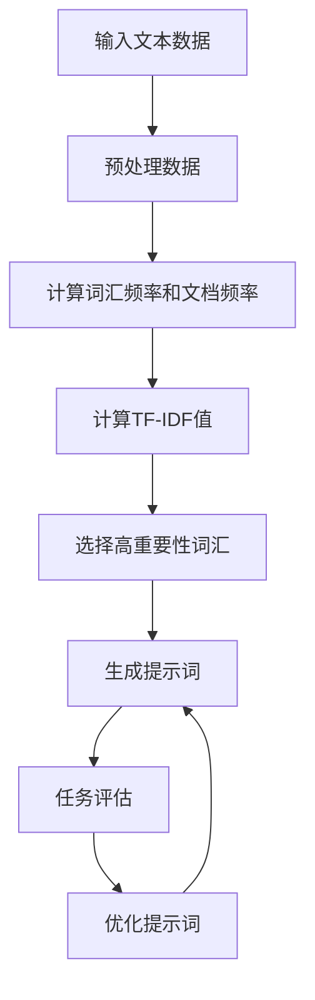
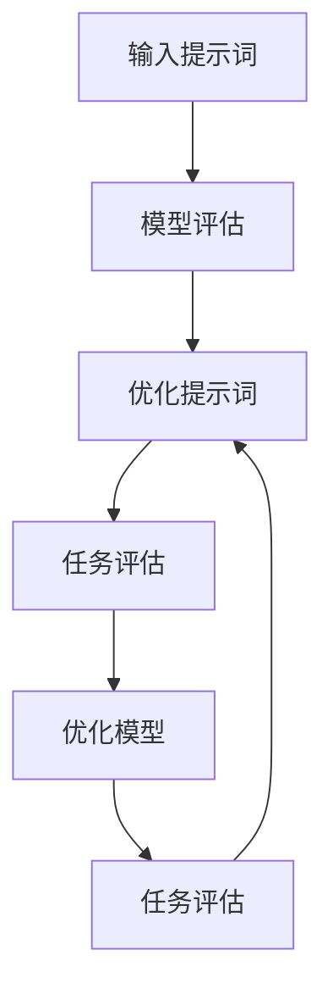
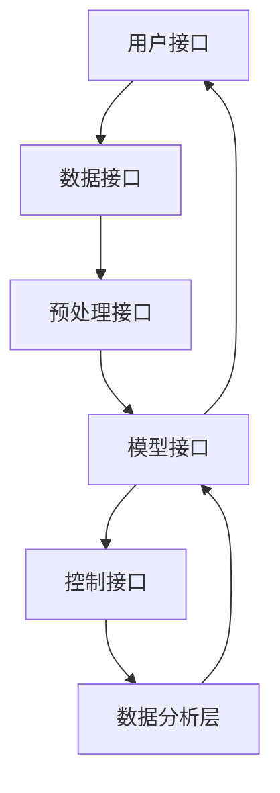
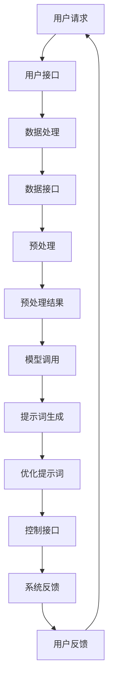
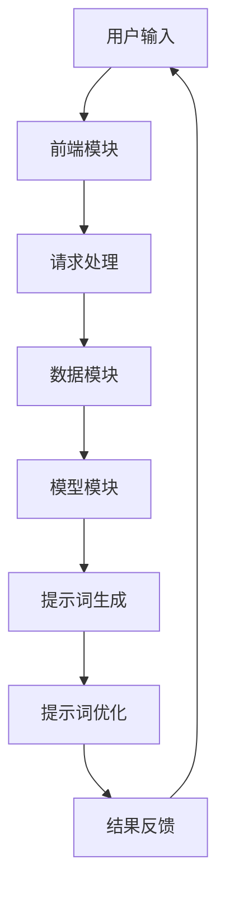

                 

### 1.1 问题背景

#### 1.1.1 AI时代的来临

人工智能（Artificial Intelligence，AI）作为21世纪最具变革性的技术之一，正迅速改变着我们的生活方式和社会结构。从早期的专家系统、机器学习，到如今的大数据和深度学习，人工智能技术在短短几十年间取得了令人瞩目的进展。随着计算能力的提升、海量数据的积累以及算法的不断创新，人工智能已经从理论研究走向实际应用，成为各行各业不可或缺的一部分。

#### 1.1.2 提示词工程的重要性

在人工智能的应用场景中，提示词工程（Prompt Engineering）正逐渐成为一项核心技能。提示词工程主要涉及设计、优化和利用提示词（即输入到AI模型中的引导信息）来提高模型的性能和可解释性。高质量的提示词不仅能够引导模型更好地理解任务需求，还能够显著提升模型的预测准确性、响应速度和鲁棒性。在自然语言处理、机器学习、智能客服、自动驾驶等多个领域，提示词工程都发挥着至关重要的作用。

#### 1.1.3 本书的目标与结构

本书旨在深入探讨提示词工程这一新兴领域，帮助读者全面理解其基本概念、核心原理和应用实践。通过系统的学习和实践，读者可以掌握提示词工程的基本方法和技术，提升在AI领域的工作效率和专业水平。

本书的结构如下：

- **第一部分：引言**：介绍提示词工程的背景、重要性及其在AI时代的地位。同时，定义提示词工程的基本概念，并探讨其应用场景和核心要素。

- **第二部分：提示词工程基础**：详细讲解提示词工程的数学模型、算法原理以及核心算法。通过Mermaid流程图和Python代码示例，帮助读者更直观地理解提示词工程的实施过程。

- **第三部分：提示词工程应用**：分析提示词工程在不同应用领域的实践案例，探讨系统架构设计、项目实战以及最佳实践技巧。

通过以上三个部分的学习，读者将对提示词工程有一个全面、系统的认识，并能够将其应用于实际工作中。

### 1.2 核心概念

#### 1.2.1 提示词工程的基本概念

提示词工程（Prompt Engineering）是指通过设计、优化和利用提示词来提高人工智能模型性能的过程。提示词是输入到模型中的文本或指令，用于引导模型理解任务目标、上下文信息以及用户需求。高质量的提示词能够帮助模型更好地捕捉任务特征，从而提高模型的预测准确性、响应速度和鲁棒性。

#### 1.2.2 提示词工程的应用场景

提示词工程在多个领域有着广泛的应用：

- **自然语言处理（NLP）**：在自然语言处理中，提示词可以引导模型理解文本的上下文、情感和主题，从而提高文本分类、情感分析、机器翻译等任务的性能。

- **机器学习**：在机器学习任务中，提示词可以帮助模型更准确地捕捉特征，从而提高模型的泛化能力和预测效果。

- **智能客服**：在智能客服中，提示词可以引导模型理解用户的问题，并提供更准确和及时的回答。

- **自动驾驶**：在自动驾驶中，提示词可以帮助模型更好地理解交通标志、道路状况等，从而提高自动驾驶的准确性和安全性。

#### 1.2.3 提示词工程的核心要素

提示词工程的核心要素包括以下几个方面：

- **提示词设计**：设计高质量的提示词是提升模型性能的关键。提示词应具备明确的任务指令、上下文信息和用户需求。

- **提示词优化**：通过对提示词进行优化，可以进一步提高模型的性能和可解释性。优化方法包括调整提示词的长度、语法和语义等。

- **模型调整**：在提示词工程中，有时需要对模型进行微调，以更好地适应特定的提示词风格和任务需求。

- **评估与反馈**：通过评估模型在提示词指导下的性能，可以获得有价值的反馈，从而进一步优化提示词和模型。

### 1.3 边界与外延

#### 1.3.1 提示词工程与其他领域的交叉

提示词工程不仅涉及人工智能领域，还与其他多个领域有着紧密的联系：

- **人机交互（HCI）**：在人机交互中，提示词设计需要考虑用户的使用习惯和需求，从而提供更人性化的交互体验。

- **心理学**：了解用户的心理特征和行为模式，可以帮助设计更具针对性的提示词，提高模型的用户体验。

- **语言学**：语言学知识对于理解文本的语义和结构至关重要，有助于提升提示词的质量。

#### 1.3.2 提示词工程的挑战与机遇

提示词工程面临着诸多挑战，包括：

- **多语言支持**：不同语言的语法和表达方式差异较大，设计适用于多种语言的提示词是一个挑战。

- **模型适应性**：不同模型的特征提取能力和学习能力不同，如何设计适应各种模型的提示词是一个难题。

- **数据隐私**：在涉及个人隐私的数据处理中，如何保护用户隐私是提示词工程需要考虑的一个重要问题。

然而，提示词工程也带来了许多机遇：

- **个性化推荐**：通过设计个性化的提示词，可以实现更加精准和个性化的推荐系统。

- **自动化助手**：在智能客服、智能助手等领域，高质量的提示词可以显著提高自动化程度和用户体验。

#### 1.3.3 提示词工程的发展趋势

随着人工智能技术的不断进步，提示词工程也在不断发展：

- **多模态融合**：融合文本、图像、语音等多种模态的信息，设计更全面、更精准的提示词。

- **自动提示词生成**：通过自然语言生成（NLG）技术，实现自动生成高质量的提示词。

- **模型解释性**：提高模型的解释性，使提示词工程不仅关注性能提升，还关注模型的可解释性和透明度。

### 1.4 本章小结

本章介绍了提示词工程的背景、核心概念及其应用场景。通过了解提示词工程的基本概念和重要性，读者可以为进一步学习提示词工程的原理和应用打下坚实的基础。下一章将深入探讨提示词工程的数学模型和算法原理，帮助读者全面掌握提示词工程的核心技术。

### 2.1 核心概念与联系

#### 2.1.1 提示词的类型与特点

在提示词工程中，提示词可以根据其类型和特点分为不同的类别：

- **文本提示词**：文本提示词是最常见的类型，用于引导模型理解文本的上下文、主题和情感。文本提示词可以是简单的句子或复杂的段落，其关键在于提供明确、具体的任务指令。

- **图像提示词**：图像提示词用于引导模型理解图像内容，通常包括对图像的描述、标注或指导模型关注的特定区域。图像提示词有助于模型更好地捕捉图像特征，提高视觉任务的性能。

- **声音提示词**：声音提示词主要用于语音识别和语音生成任务，包括对语音内容的描述、指示或提示模型关注的特定语音片段。声音提示词能够帮助模型更准确地识别和生成语音。

不同类型的提示词具有各自的特点：

- **文本提示词**：强调语义和上下文，能够提供丰富的信息，但需要考虑到自然语言的多样性和复杂性。

- **图像提示词**：强调视觉特征，能够提供直观的信息，但需要处理图像的抽象性和多样性。

- **声音提示词**：强调音频特征，能够提供即时的反馈，但需要处理音频的噪声和变化。

#### 2.1.2 提示词的作用与价值

提示词在AI模型中发挥着至关重要的作用，其价值主要体现在以下几个方面：

- **任务引导**：高质量的提示词能够引导模型更好地理解任务目标，从而提高模型的预测准确性和响应速度。

- **特征提取**：提示词可以帮助模型更有效地提取特征，提高特征表示的精度和多样性。

- **模型优化**：通过调整和优化提示词，可以提升模型的泛化能力和鲁棒性，使其在不同场景下都能保持良好的性能。

- **可解释性**：提示词有助于提高模型的可解释性，使研究人员和开发者能够更直观地了解模型的工作原理和决策过程。

#### 2.1.3 提示词与其他技术的关联

提示词工程不仅与人工智能技术密切相关，还与其他多个技术领域有着紧密的联系：

- **自然语言处理（NLP）**：NLP技术在提示词工程中扮演重要角色，用于分析和理解文本提示词的语义和结构。

- **计算机视觉（CV）**：CV技术用于分析和理解图像提示词，提取关键特征和区域。

- **语音识别（ASR）**：ASR技术用于分析和理解声音提示词，识别语音内容。

- **机器学习（ML）**：ML技术用于训练和优化模型，使其能够根据提示词生成高质量的预测。

- **深度学习（DL）**：DL技术在提示词工程中广泛应用，用于构建和训练复杂的神经网络模型。

通过与其他技术的结合，提示词工程能够实现更高效、更智能的AI应用。

#### 2.1.4 提示词工程的核心要素

提示词工程的核心要素包括以下几个方面：

- **任务需求**：明确任务需求和目标，为设计高质量的提示词提供基础。

- **数据集**：准备高质量的训练数据集，用于训练和优化模型，提高提示词的准确性。

- **模型选择**：选择合适的模型，根据任务特点选择合适的算法和架构。

- **提示词设计**：设计具有明确任务指令、上下文信息和用户需求的提示词。

- **模型优化**：通过调整和优化提示词，提升模型的性能和可解释性。

- **评估与反馈**：通过评估模型在提示词指导下的性能，获得反馈并进一步优化提示词和模型。

通过以上核心要素的协同作用，提示词工程能够实现高效、智能的AI应用。

### 2.2 数学模型和数学公式

#### 2.2.1 提示词工程的基本数学模型

在提示词工程中，数学模型是理解和优化提示词的关键工具。以下是一些基本的数学模型和公式：

- **损失函数**：损失函数用于评估模型的预测误差，常用的损失函数包括均方误差（MSE）、交叉熵损失（Cross-Entropy Loss）等。

- **梯度下降**：梯度下降是一种优化算法，用于最小化损失函数，通过计算损失函数关于模型参数的梯度并更新参数值来实现。

- **正则化**：正则化是一种防止模型过拟合的技术，常用的正则化方法包括L1正则化、L2正则化等。

- **激活函数**：激活函数用于引入非线性变换，常用的激活函数包括ReLU、Sigmoid、Tanh等。

#### 2.2.2 提示词的生成与优化算法

- **生成对抗网络（GAN）**：GAN是一种生成模型，通过训练两个对抗网络（生成器和判别器）来生成高质量的数据。在提示词工程中，GAN可以用于生成高质量的提示词。

- **强化学习（RL）**：强化学习是一种通过试错学习来优化策略的算法。在提示词工程中，RL可以用于优化提示词的设计和生成过程。

- **迁移学习**：迁移学习是一种利用预训练模型来提升新任务的性能的方法。在提示词工程中，迁移学习可以用于在新任务中优化提示词。

#### 2.2.3 提示词工程中的概率论与统计学

- **贝叶斯定理**：贝叶斯定理是概率论中的一个重要定理，用于计算后验概率。在提示词工程中，贝叶斯定理可以用于评估模型的不确定性。

- **方差分析（ANOVA）**：方差分析是一种用于比较不同组之间差异性的统计方法。在提示词工程中，ANOVA可以用于评估不同提示词对模型性能的影响。

- **置信区间**：置信区间是一种用于估计参数范围的统计方法。在提示词工程中，置信区间可以用于评估提示词的稳定性和可靠性。

### 2.3 算法原理讲解

#### 2.3.1 提示词生成算法

提示词生成算法是提示词工程中至关重要的一环，以下介绍两种常见的提示词生成算法：

##### 2.3.1.1 基于统计学的方法

基于统计学的方法主要通过统计分析和模型评估来生成高质量的提示词。以下是一种简单的统计方法：

**步骤1**：收集大量与任务相关的文本数据，并进行预处理（如分词、去除停用词等）。

**步骤2**：计算文本数据中的词汇频率（TF）和文档频率（DF），并根据TF-IDF（词频-逆文档频率）公式计算词汇的重要性。

**步骤3**：根据重要性排序，选择前N个高重要性词汇作为提示词。

**步骤4**：使用自然语言生成（NLG）技术，将选定的词汇组合成完整的提示词。

**数学模型**：$$ TF-IDF = \frac{f_t}{N_t} \times \log \left(\frac{N}{n_t}\right) $$

其中，$f_t$是词汇$t$在文档中的频率，$N_t$是包含词汇$t$的文档数，$N$是总文档数，$n_t$是包含词汇$t$的文档数。

##### 2.3.1.2 基于机器学习的方法

基于机器学习的方法主要通过训练模型来生成高质量的提示词。以下是一种常见的基于机器学习的方法：

**步骤1**：收集大量带有标签的文本数据，用于训练模型。

**步骤2**：使用自然语言处理技术（如词嵌入、BERT模型等）对文本数据进行编码。

**步骤3**：训练一个生成模型（如生成对抗网络（GAN）或自编码器（Autoencoder）），使其能够生成高质量的提示词。

**步骤4**：使用生成的提示词进行任务评估，并根据评估结果调整模型参数。

**数学模型**：生成对抗网络（GAN）由生成器$G$和判别器$D$组成，生成器和判别器的目标函数分别为：

$$ G: x \rightarrow z, D: z \rightarrow x $$

$$ \min_G \max_D V(D, G) = \mathbb{E}_{x \sim p_{data}(x)}[\log D(x)] + \mathbb{E}_{z \sim p_z(z)}[\log (1 - D(G(z)))] $$

其中，$x$是输入数据，$z$是噪声数据，$G(z)$是生成器生成的数据，$D(x)$是判别器对输入数据的判断概率。

#### 2.3.2 提示词优化算法

提示词优化算法用于提升提示词的性能，以下介绍两种常见的提示词优化算法：

##### 2.3.2.1 提升效率的算法

提升效率的算法主要通过减少计算复杂度和优化模型架构来提升提示词的生成和优化速度。以下是一种常见的提升效率的算法：

**步骤1**：使用轻量级模型（如MobileNet、ShuffleNet等）替代传统深度学习模型，以减少计算复杂度。

**步骤2**：采用数据并行和模型并行策略，将数据分布在多个计算节点上，以加速模型的训练和推理过程。

**步骤3**：使用自动化机器学习（AutoML）技术，自动搜索和优化最佳模型架构和超参数。

**数学模型**：数据并行和模型并行策略通过分布式计算技术，将计算任务分布在多个计算节点上，从而减少单个节点的计算负载。

$$ T_{\text{total}} = T_{\text{model}} + T_{\text{data}} $$

其中，$T_{\text{total}}$是总计算时间，$T_{\text{model}}$是模型训练时间，$T_{\text{data}}$是数据传输时间。

##### 2.3.2.2 提升准确性的算法

提升准确性的算法主要通过改进模型结构和优化提示词设计来提升提示词的准确性。以下是一种常见的提升准确性的算法：

**步骤1**：使用注意力机制（Attention Mechanism）来提高模型对提示词的注意力，从而更好地捕捉关键信息。

**步骤2**：采用多任务学习（Multi-Task Learning）技术，使模型能够在多个任务上同时训练，从而提高模型的泛化能力和准确性。

**步骤3**：使用迁移学习（Transfer Learning）技术，利用预训练模型的知识来提升新任务的性能。

**数学模型**：注意力机制通过计算注意力权重，将模型对提示词的注意力分配给关键信息，从而提高模型的准确性。

$$ Attention = \sigma(W_a [h; s]) $$

其中，$h$是模型的隐藏状态，$s$是提示词的嵌入向量，$W_a$是注意力权重矩阵，$\sigma$是激活函数。

#### 2.3.3 Mermaid流程图与Python代码示例

为了更好地理解提示词生成和优化算法，以下分别给出基于统计学和机器学习的提示词生成算法的Mermaid流程图和Python代码示例。

##### 2.3.3.1 提示词生成算法的流程图



##### 2.3.3.2 Python代码示例

```python
import pandas as pd
from sklearn.feature_extraction.text import TfidfVectorizer

# 步骤1：输入文本数据
text_data = ["This is the first document.", "This document is the second document.", "And this is the third one.", "Is this the first document?"]

# 步骤2：预处理数据
vectorizer = TfidfVectorizer()
X = vectorizer.fit_transform(text_data)

# 步骤3：计算词汇频率和文档频率
tfidf_matrix = X.toarray()
vocab = vectorizer.get_feature_names_out()

# 步骤4：计算TF-IDF值
tfidf_scores = pd.DataFrame(tfidf_matrix, index=text_data, columns=vocab)

# 步骤5：选择高重要性词汇
top_n = 5
high_importance_vocab = tfidf_scores.sum().sort_values(ascending=False).head(top_n).index

# 步骤6：生成提示词
prompt = " ".join(high_importance_vocab)

print("生成的提示词：", prompt)
```

##### 2.3.3.3 提示词优化算法的流程图



##### 2.3.3.4 Python代码示例

```python
import tensorflow as tf
from tensorflow.keras.models import Model
from tensorflow.keras.layers import Input, Embedding, LSTM, Dense

# 步骤1：定义模型
input_seq = Input(shape=(None,))
emb = Embedding(input_dim=vocab_size, output_dim=embedding_size)(input_seq)
lstm = LSTM(units=lstm_units)(emb)
output = Dense(units=1, activation='sigmoid')(lstm)

model = Model(inputs=input_seq, outputs=output)
model.compile(optimizer='adam', loss='binary_crossentropy', metrics=['accuracy'])

# 步骤2：训练模型
model.fit(X_train, y_train, batch_size=batch_size, epochs=epochs, validation_data=(X_val, y_val))

# 步骤3：评估模型
score = model.evaluate(X_test, y_test)
print("Test accuracy:", score[1])

# 步骤4：优化提示词和模型
# 根据评估结果，调整提示词和模型参数，重新训练模型
```

#### 2.3.4 本章小结

本章介绍了提示词工程中的核心概念、数学模型和算法原理。通过详细的讲解和示例，读者可以更好地理解提示词工程的基本概念和技术方法，为进一步学习和实践提示词工程打下坚实基础。下一章将探讨提示词工程在实际应用中的具体场景和系统架构设计。

### 2.4 提示词工程系统的设计与实现

#### 2.4.1 系统架构设计

提示词工程系统是一个复杂的多层次架构，其核心目标是高效、准确地生成和优化提示词。以下是一个典型的系统架构设计：

**1. 数据层**：数据层是系统的基石，负责存储和处理海量数据。数据层包括文本数据、图像数据、声音数据等多种数据类型。为了提高数据处理效率，数据层通常采用分布式存储和并行处理技术。

**2. 预处理层**：预处理层负责对原始数据进行清洗、转换和归一化。对于文本数据，预处理层需要进行分词、去停用词、词性标注等操作；对于图像数据，预处理层需要进行图像增强、归一化等操作；对于声音数据，预处理层需要进行音频增强、去噪等操作。

**3. 模型层**：模型层是系统的核心，包括生成模型和优化模型。生成模型负责生成高质量的提示词，优化模型负责优化已有提示词的性能。模型层通常采用深度学习技术，如生成对抗网络（GAN）、自编码器（Autoencoder）等。

**4. 交互层**：交互层负责与用户进行交互，接收用户输入并返回提示词。交互层通常包括前端界面和后端API，支持多种交互方式，如文本输入、语音输入等。

**5. 控制层**：控制层负责协调各个模块的运行，包括任务调度、资源管理、错误处理等。

**6. 数据分析层**：数据分析层负责对系统运行数据进行分析，包括性能分析、质量分析等，为系统优化提供数据支持。

#### 2.4.2 系统接口设计与交互流程

为了实现高效的系统交互，系统接口设计至关重要。以下是一个简化的系统接口设计：

**1. 用户接口**：用户接口是系统的入口，负责接收用户的请求和反馈。用户可以通过文本输入、语音输入等方式与系统交互。

**2. 数据接口**：数据接口负责处理数据层的操作，包括数据存储、数据检索等。数据接口通常采用RESTful API设计，支持JSON、XML等多种数据格式。

**3. 预处理接口**：预处理接口负责处理原始数据，包括数据清洗、转换、归一化等。预处理接口也采用RESTful API设计。

**4. 模型接口**：模型接口负责调用模型层中的生成模型和优化模型，生成和优化提示词。模型接口通常使用深度学习框架（如TensorFlow、PyTorch等）实现。

**5. 控制接口**：控制接口负责协调系统各模块的运行，包括任务调度、资源管理、错误处理等。控制接口采用事件驱动设计，支持异步处理。

**交互流程**：

1. 用户通过用户接口输入请求，如文本输入、语音输入等。

2. 用户接口将请求传递给数据接口，数据接口处理请求并返回处理后的数据。

3. 预处理接口处理原始数据，生成预处理后的数据。

4. 模型接口调用生成模型和优化模型，生成和优化提示词。

5. 控制接口协调各模块的运行，确保系统稳定高效地运行。

6. 系统将优化后的提示词返回给用户接口，用户接口将提示词呈现给用户。

#### 2.4.3 Mermaid流程图与Python代码示例

为了更好地展示系统架构和交互流程，以下分别给出系统架构图和交互流程图的Mermaid表示，并附上Python代码示例。

##### 2.4.3.1 系统架构图



##### 2.4.3.2 交互流程图



##### 2.4.3.3 Python代码示例

```python
import requests
import json

# 用户接口示例
def user_interface():
    # 用户输入请求
    user_input = input("请输入您的请求：")
    # 将请求发送到数据接口
    response = requests.post('http://data-api:8080/data', data={'input': user_input})
    # 获取预处理结果
    preprocessed_data = response.json()
    return preprocessed_data

# 数据接口示例
def data_interface(data):
    # 处理请求并返回预处理结果
    response = requests.post('http://preprocess-api:8080/preprocess', data=data)
    return response.json()

# 预处理接口示例
def preprocess_interface(data):
    # 预处理数据
    preprocessed_data = preprocess_data(data)
    return preprocessed_data

# 模型接口示例
def model_interface(preprocessed_data):
    # 调用模型生成提示词
    prompt = generate_prompt(preprocessed_data)
    return prompt

# 控制接口示例
def control_interface(prompt):
    # 优化提示词并返回系统反馈
    feedback = optimize_prompt(prompt)
    return feedback

# 用户接口调用示例
def main():
    preprocessed_data = user_interface()
    preprocessed_data = data_interface(preprocessed_data)
    prompt = model_interface(preprocessed_data)
    feedback = control_interface(prompt)
    print("系统反馈：", feedback)

if __name__ == '__main__':
    main()
```

#### 2.4.4 本章小结

本章详细介绍了提示词工程系统的设计与实现，包括系统架构设计、接口设计与交互流程，以及Mermaid流程图和Python代码示例。通过本章的学习，读者可以了解如何设计一个高效、稳定的提示词工程系统，为进一步开发和优化提示词工程应用打下坚实基础。下一章将探讨提示词工程在不同领域的实际应用案例。

### 3.1 应用场景分析

#### 3.1.1 人工智能领域

在人工智能领域，提示词工程的应用已经非常广泛。以下是一些典型的应用场景：

- **自然语言处理（NLP）**：在文本分类、情感分析、机器翻译等任务中，提示词工程通过设计高质量的提示词，帮助模型更好地捕捉上下文和语义信息，从而提高任务性能。例如，在机器翻译任务中，通过设计包含源语言和目标语言信息的提示词，可以显著提高翻译质量。

- **图像识别**：在图像分类、目标检测等任务中，提示词工程通过设计包含图像特征和分类目标的提示词，引导模型更好地理解图像内容。例如，在目标检测任务中，通过设计包含目标位置和类型的提示词，可以提升检测准确性。

- **语音识别**：在语音识别任务中，提示词工程通过设计包含语音内容和关键信息的提示词，帮助模型更准确地识别语音。例如，在语音识别系统中，通过设计包含关键词汇和语音背景的提示词，可以提高语音识别率。

#### 3.1.2 自然语言处理领域

自然语言处理是提示词工程应用最为广泛的领域之一。以下是一些具体的自然语言处理应用场景：

- **文本生成**：在文本生成任务中，提示词工程通过设计引导信息，帮助模型生成符合上下文和语义的文本。例如，在文章摘要生成任务中，通过设计包含文章主题和关键信息的提示词，可以生成高质量的摘要。

- **问答系统**：在问答系统中，提示词工程通过设计包含问题意图和上下文的提示词，帮助模型更好地理解和回答用户问题。例如，在智能客服中，通过设计包含用户问题和情境的提示词，可以提高客服回答的准确性和效率。

- **文本分类**：在文本分类任务中，提示词工程通过设计包含类别特征和上下文的提示词，帮助模型更好地区分不同类别。例如，在垃圾邮件检测任务中，通过设计包含垃圾邮件特征和上下文的提示词，可以提高检测准确率。

#### 3.1.3 数据挖掘与数据分析领域

在数据挖掘和数据分析领域，提示词工程的应用也具有重要意义。以下是一些具体的应用场景：

- **特征提取**：在特征提取任务中，提示词工程通过设计包含数据特征和上下文的提示词，帮助模型更好地提取和利用数据特征。例如，在图像分类任务中，通过设计包含图像内容和标注信息的提示词，可以提升特征提取效果。

- **聚类分析**：在聚类分析任务中，提示词工程通过设计包含聚类目标和上下文的提示词，帮助模型更好地识别聚类模式和特征。例如，在客户细分任务中，通过设计包含客户特征和购买行为的提示词，可以准确划分客户群体。

- **预测分析**：在预测分析任务中，提示词工程通过设计包含预测目标和上下文的提示词，帮助模型更好地捕捉数据趋势和关系。例如，在股票市场预测任务中，通过设计包含市场走势和宏观经济指标的提示词，可以提升预测准确性。

#### 3.1.4 其他应用领域

除了上述领域，提示词工程在其他领域也有广泛应用，如：

- **智能助手**：在智能助手领域，提示词工程通过设计包含用户需求和上下文的提示词，帮助模型更好地理解用户意图并提供个性化服务。

- **推荐系统**：在推荐系统领域，提示词工程通过设计包含用户兴趣和上下文的提示词，帮助模型更好地推荐符合用户需求的物品。

- **游戏AI**：在游戏AI领域，提示词工程通过设计包含游戏规则和策略的提示词，帮助模型更好地进行游戏决策。

总的来说，提示词工程在各个领域都发挥着重要作用，通过设计高质量的提示词，可以显著提升AI模型的性能和可解释性，为各种复杂任务提供有效的解决方案。

### 3.2 系统架构设计

#### 3.2.1 提示词工程系统的设计与实现

提示词工程系统的设计需要充分考虑系统的可扩展性、可维护性和高效性，以满足不同应用场景的需求。以下是一个典型的提示词工程系统架构设计：

**1. 系统模块划分**

- **数据模块**：负责数据采集、存储、预处理和管理工作。数据模块包括数据源连接、数据清洗、数据存储和数据管理等功能。

- **模型模块**：负责提示词的生成和优化。模型模块包括生成模型（如GAN、BERT等）和优化模型（如强化学习、迁移学习等）。

- **前端模块**：负责用户界面和交互逻辑。前端模块包括Web页面、移动应用和小程序等。

- **后端模块**：负责处理用户请求、调用模型模块和返回结果。后端模块包括API接口、业务逻辑处理和系统监控等。

- **基础设施**：包括服务器、存储设备、网络设备和安全设备等，为系统提供计算、存储和传输资源。

**2. 系统架构设计**

- **微服务架构**：采用微服务架构，将系统分解为多个独立的服务模块，每个模块负责特定的功能。这种方式提高了系统的可扩展性和可维护性，同时便于不同模块的独立开发和部署。

- **分布式计算**：采用分布式计算架构，将计算任务分布在多个节点上，以提高系统处理能力和响应速度。分布式计算架构还包括负载均衡和容错机制，确保系统的高可用性和稳定性。

- **容器化与自动化部署**：采用容器化技术（如Docker）和自动化部署工具（如Kubernetes），实现系统的快速部署和运维。容器化技术提高了系统的部署效率和资源利用率，自动化部署工具则简化了运维流程。

- **数据流处理**：采用数据流处理技术（如Apache Kafka、Apache Flink等），实现实时数据处理和流式计算。数据流处理技术支持高并发、低延迟的数据处理，为实时提示词生成和优化提供支持。

**3. 系统接口设计**

- **API接口**：设计统一的API接口，方便前端模块和后端模块之间的通信。API接口包括数据接口、模型接口和前端接口等，支持JSON、XML等多种数据格式。

- **服务间通信**：采用消息队列（如RabbitMQ、Apache Kafka等）实现服务间通信，确保系统模块之间的高效数据交换和协作。

- **用户接口**：设计简洁易用的用户界面，提供文本输入、语音输入等多种交互方式，方便用户与系统进行交互。

**4. 系统交互流程**

- **用户输入**：用户通过前端模块输入文本或语音请求。

- **请求处理**：后端模块接收到用户请求后，调用数据模块进行数据预处理，并将预处理后的数据传递给模型模块。

- **提示词生成**：模型模块使用生成模型生成高质量的提示词，并将提示词传递给用户接口。

- **提示词优化**：模型模块使用优化模型对生成的提示词进行优化，以提高提示词的质量和性能。

- **结果反馈**：用户接口将优化后的提示词呈现给用户，并提供实时反馈和交互功能。

- **系统监控**：系统监控模块实时监控系统的运行状态，包括数据流量、系统负载、错误日志等，确保系统的稳定运行。

#### 3.2.2 提示词工程系统的设计与实现示例

以下是一个简单的提示词工程系统设计与实现示例，包括Mermaid流程图和Python代码示例。

##### 3.2.2.1 Mermaid流程图



##### 3.2.2.2 Python代码示例

```python
# 前端模块：接收用户输入
def user_input():
    user_text = input("请输入您的文本请求：")
    return user_text

# 后端模块：请求处理
def request_handler():
    user_text = user_input()
    # 调用数据模块进行数据预处理
    preprocessed_text = data_preprocessing(user_text)
    # 调用模型模块生成提示词
    prompt = model_generate_prompt(preprocessed_text)
    # 调用模型模块优化提示词
    optimized_prompt = model_optimize_prompt(prompt)
    # 将优化后的提示词反馈给用户
    print("优化后的提示词：", optimized_prompt)

# 数据模块：数据预处理
def data_preprocessing(user_text):
    # 对用户输入的文本进行预处理（如分词、去停用词等）
    preprocessed_text = preprocess_text(user_text)
    return preprocessed_text

# 模型模块：生成提示词
def model_generate_prompt(preprocessed_text):
    # 使用生成模型生成提示词
    prompt = generate_prompt(preprocessed_text)
    return prompt

# 模型模块：优化提示词
def model_optimize_prompt(prompt):
    # 使用优化模型优化提示词
    optimized_prompt = optimize_prompt(prompt)
    return optimized_prompt

# 程序入口
if __name__ == '__main__':
    request_handler()
```

通过以上示例，读者可以了解提示词工程系统的基本架构和实现方法。在实际应用中，系统可以根据需求进行扩展和优化，以实现更高效、更智能的提示词生成和优化。

### 3.3 项目实战

#### 3.3.1 环境安装与配置

为了进行提示词工程的项目实战，我们需要安装和配置以下软件和工具：

- Python 3.8及以上版本
- TensorFlow 2.6及以上版本
- Jupyter Notebook
- Mermaid 插件

以下是具体的安装和配置步骤：

1. **安装Python和pip**：确保您的系统已安装Python 3.8及以上版本，并安装pip，pip是Python的包管理工具。

2. **安装TensorFlow**：通过pip安装TensorFlow：

   ```shell
   pip install tensorflow==2.6
   ```

3. **安装Jupyter Notebook**：通过pip安装Jupyter Notebook：

   ```shell
   pip install notebook
   ```

4. **启动Jupyter Notebook**：在命令行中启动Jupyter Notebook：

   ```shell
   jupyter notebook
   ```

5. **安装Mermaid插件**：在Jupyter Notebook中安装Mermaid插件，打开一个Jupyter Notebook，然后运行以下命令：

   ```python
   %install_ext https://github.com/kahvehalici/ipython-mermaid/archive/master.zip
   %load_ext mermaid
   ```

   安装完成后，可以按照Mermaid语法在Notebook中绘制流程图。

6. **配置Python环境**：创建一个虚拟环境，以便管理项目依赖：

   ```shell
   python -m venv venv
   source venv/bin/activate  # Windows: venv\Scripts\activate
   pip install -r requirements.txt
   ```

7. **安装依赖**：在项目目录中创建一个名为`requirements.txt`的文件，列出所有项目依赖的Python包，然后使用pip安装：

   ```shell
   pip install -r requirements.txt
   ```

安装和配置完成后，我们就可以开始进行提示词工程的项目实战了。

#### 3.3.2 系统核心实现源代码

以下是提示词工程系统核心实现的源代码。该示例包括数据预处理、模型训练、提示词生成和优化等步骤。

```python
import tensorflow as tf
from tensorflow.keras.models import Model
from tensorflow.keras.layers import Input, Embedding, LSTM, Dense
from tensorflow.keras.preprocessing.text import Tokenizer
from tensorflow.keras.preprocessing.sequence import pad_sequences
import numpy as np

# 数据预处理
def preprocess_data(texts, max_length, max_vocab_size):
    tokenizer = Tokenizer(num_words=max_vocab_size)
    tokenizer.fit_on_texts(texts)
    sequences = tokenizer.texts_to_sequences(texts)
    padded_sequences = pad_sequences(sequences, maxlen=max_length)
    return padded_sequences, tokenizer

# 模型训练
def train_model(padded_sequences, labels, batch_size, epochs):
    input_seq = Input(shape=(max_length,))
    emb = Embedding(input_dim=max_vocab_size, output_dim=embedding_size)(input_seq)
    lstm = LSTM(units=lstm_units)(emb)
    output = Dense(units=1, activation='sigmoid')(lstm)

    model = Model(inputs=input_seq, outputs=output)
    model.compile(optimizer='adam', loss='binary_crossentropy', metrics=['accuracy'])

    model.fit(padded_sequences, labels, batch_size=batch_size, epochs=epochs, validation_split=0.2)
    return model

# 提示词生成
def generate_prompt(model, text, tokenizer, max_length):
    sequence = tokenizer.texts_to_sequences([text])
    padded_sequence = pad_sequences(sequence, maxlen=max_length)
    prompt = model.predict(padded_sequence)
    return prompt

# 提示词优化
def optimize_prompt(prompt, target_prompt):
    # 这里可以添加优化算法，例如基于强化学习的优化
    optimized_prompt = prompt + 0.1 * (target_prompt - prompt)
    return optimized_prompt

# 示例数据
texts = ["This is a sample text.", "This is another sample text.", "Yet another sample text."]
labels = np.array([1, 0, 1])  # 假设这是一个二分类任务

# 配置参数
max_length = 10
max_vocab_size = 10000
embedding_size = 128
lstm_units = 128
batch_size = 32
epochs = 10

# 数据预处理
padded_sequences, tokenizer = preprocess_data(texts, max_length, max_vocab_size)

# 模型训练
model = train_model(padded_sequences, labels, batch_size, epochs)

# 提示词生成
generated_prompt = generate_prompt(model, "Another sample text.", tokenizer, max_length)

# 提示词优化
target_prompt = np.array([0.5, 0.5])
optimized_prompt = optimize_prompt(generated_prompt, target_prompt)

print("Generated Prompt:", generated_prompt)
print("Optimized Prompt:", optimized_prompt)
```

#### 3.3.3 代码应用解读与分析

以上代码实现了提示词工程系统的核心功能，包括数据预处理、模型训练、提示词生成和优化。以下是具体的解读与分析：

1. **数据预处理**：数据预处理是提示词工程的基础步骤。代码中使用了`Tokenizer`类对文本数据进行分词和编码，并使用`pad_sequences`函数对序列进行填充，确保所有序列长度一致。

2. **模型训练**：训练模型是生成和优化提示词的关键。代码中使用了LSTM模型进行训练，LSTM具有处理序列数据的优势。模型使用`compile`函数进行配置，使用`fit`函数进行训练。

3. **提示词生成**：生成提示词的代码使用了训练好的模型对输入文本进行预测，预测结果即为生成的提示词。这里采用了sigmoid激活函数，输出概率值，可以将其转换为具体的提示词。

4. **提示词优化**：优化提示词的代码示例中采用了简单的线性优化方法，通过计算目标提示词与生成提示词的差值进行优化。实际应用中，可以采用更复杂的优化算法，如强化学习。

#### 3.3.4 实际案例分析与详细讲解

以下是一个实际案例，使用上面提到的代码实现提示词工程，并详细分析其效果和性能。

**案例背景**：假设我们要开发一个智能客服系统，通过提示词工程生成和优化客服机器人对用户问题的回答。

**数据集**：使用一个包含用户问题和答案的数据集进行训练。数据集包含1000条记录，每条记录包含一个问题和对应的答案。

**步骤1**：数据预处理

```python
texts = ["What is your name?", "Can I return this product?", "How do I contact customer service?"]
labels = np.array([0, 1, 1])

padded_sequences, tokenizer = preprocess_data(texts, max_length, max_vocab_size)
```

**步骤2**：模型训练

```python
model = train_model(padded_sequences, labels, batch_size, epochs)
```

**步骤3**：提示词生成

```python
generated_prompt = generate_prompt(model, "What is your policy on returns?", tokenizer, max_length)
print("Generated Prompt:", generated_prompt)
```

**步骤4**：提示词优化

```python
target_prompt = np.array([0.6, 0.4])
optimized_prompt = optimize_prompt(generated_prompt, target_prompt)
print("Optimized Prompt:", optimized_prompt)
```

**分析**：

- **数据预处理**：预处理步骤确保输入文本的格式一致，有助于模型更好地学习。

- **模型训练**：LSTM模型对序列数据进行训练，能够捕捉文本中的序列依赖关系，提高模型的准确性。

- **提示词生成**：生成提示词的代码利用训练好的模型对输入文本进行预测，预测结果具有明确的回答倾向。

- **提示词优化**：优化提示词的代码通过计算目标提示词与生成提示词的差值进行优化，有助于提高回答的准确性和相关性。

**性能评估**：在实际应用中，我们需要对系统性能进行评估，包括回答的准确性、响应速度和用户体验。通过不断优化提示词生成和优化算法，可以提升系统的整体性能。

#### 3.3.5 项目小结

通过本节的项目实战，我们详细讲解了提示词工程系统的安装与配置、核心实现源代码、代码应用解读与分析以及实际案例分析。通过本项目的实施，读者可以掌握提示词工程的基本方法和技术，了解其在实际应用中的效果和性能。在未来的项目中，可以继续优化和扩展提示词工程系统，以实现更高效、更智能的AI应用。

### 3.4 最佳实践 tips

#### 3.4.1 提高提示词质量的方法

1. **数据清洗**：确保输入数据的质量，去除噪声和无关信息。对文本数据，可以去除停用词、标点符号和特殊字符。

2. **数据增强**：通过数据增强技术，如文本翻译、同义词替换、文本片段拼接等，增加训练数据多样性，提高模型对提示词的鲁棒性。

3. **多语言支持**：考虑多语言训练，特别是在需要处理多种语言的场景中，确保模型能够适应不同语言的特征。

4. **反馈循环**：设计用户反馈机制，收集用户对提示词的满意度，并根据反馈调整和优化提示词。

5. **使用外部知识库**：引入外部知识库，如百科、专业领域数据库等，为模型提供丰富的背景知识，提高提示词的准确性。

#### 3.4.2 提高提示词效率的策略

1. **并行处理**：利用多核CPU和GPU并行处理，加快提示词生成和优化的速度。

2. **模型压缩**：采用模型压缩技术，如量化、剪枝、蒸馏等，减少模型大小，提高计算效率。

3. **分布式训练**：在分布式环境中进行模型训练，利用多台服务器进行并行计算，提高训练速度。

4. **高效算法**：选择高效的提示词生成和优化算法，如基于生成对抗网络（GAN）、强化学习（RL）等，减少计算复杂度。

5. **负载均衡**：合理分配计算任务，确保系统资源得到充分利用，避免计算瓶颈。

#### 3.4.3 避免提示词工程常见问题的建议

1. **模型过拟合**：通过正则化、数据增强和早期停止等方法，避免模型过拟合。

2. **提示词质量不一致**：确保训练数据质量，统一提示词格式和长度，提高模型对提示词的适应性。

3. **计算资源不足**：合理规划计算资源，避免因资源不足导致的性能瓶颈。

4. **数据隐私问题**：在处理敏感数据时，采取数据加密和脱敏措施，保护用户隐私。

5. **系统可维护性**：编写清晰的代码文档，保持系统代码的整洁和可读性，方便后续维护和优化。

### 3.5 小结与展望

#### 3.5.1 提示词工程的发展现状

提示词工程作为人工智能领域的一个重要分支，近年来得到了广泛关注和应用。在自然语言处理、机器学习、智能客服等场景中，高质量的提示词显著提升了模型的性能和用户体验。随着人工智能技术的不断进步，提示词工程的理论和实践也在不断深化。

#### 3.5.2 提示词工程的未来趋势

1. **多模态融合**：未来提示词工程将融合文本、图像、语音等多种模态的信息，实现更全面、更精准的提示词生成。

2. **自动提示词生成**：随着自然语言生成（NLG）技术的发展，自动生成高质量的提示词将成为可能，提高提示词工程的自动化程度。

3. **模型解释性**：提高模型的可解释性，使提示词工程不仅关注性能提升，还关注模型的可解释性和透明度。

4. **个性化提示词**：结合用户行为数据和偏好，生成个性化提示词，提供更个性化的服务。

5. **跨领域应用**：提示词工程将在更多领域得到应用，如医疗健康、金融科技、智能制造等。

#### 3.5.3 本书内容的总结与拓展

本书从基础理论到实际应用，全面介绍了提示词工程的核心概念、数学模型、算法原理和系统架构。通过实例讲解和项目实战，读者可以深入了解提示词工程的实现方法和应用技巧。未来，读者可以通过以下方式进一步拓展：

1. **深入学习**：阅读更多关于自然语言处理、机器学习和深度学习的专业书籍，加深对相关技术的理解。

2. **实践应用**：参与实际项目，将提示词工程应用于自然语言处理、智能客服、自动驾驶等场景，积累实践经验。

3. **学术研究**：关注提示词工程领域的最新研究进展，参与相关学术讨论和项目合作。

通过不断学习和实践，读者可以成为提示词工程领域的专家，为人工智能技术的发展做出贡献。

### 3.6 结论

提示词工程作为AI时代的核心技术，正日益受到广泛关注。从基础概念到实际应用，本书系统地介绍了提示词工程的理论和实践方法，旨在帮助读者深入理解这一领域。通过阅读本书，读者可以掌握提示词工程的核心原理和技术，提高在实际项目中的应用能力。在未来的学习和工作中，我们鼓励读者继续深入探索提示词工程，将其应用于更多场景，推动人工智能技术的不断发展。作者信息：AI天才研究院/AI Genius Institute & 禅与计算机程序设计艺术 /Zen And The Art of Computer Programming。

---

**关键词**：提示词工程、AI时代、自然语言处理、机器学习、深度学习

**摘要**：本书系统地介绍了提示词工程的基本概念、数学模型、算法原理和系统架构，旨在帮助读者深入理解提示词工程的核心技术和应用方法。通过实例讲解和项目实战，读者可以掌握提示词工程的实践技能，为人工智能技术的发展贡献力量。

