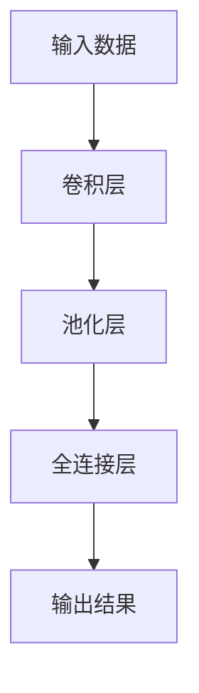
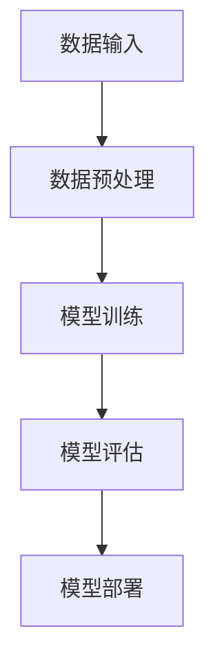
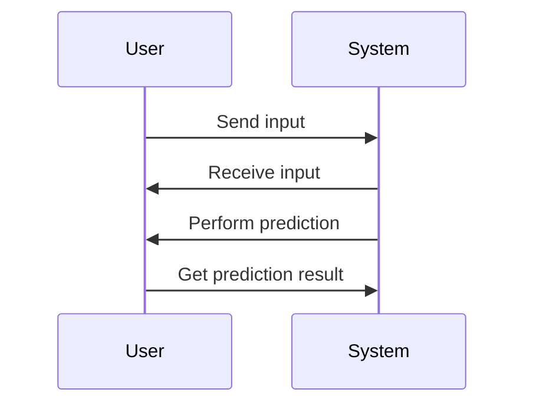

                 


# 提示词工程：AI时代的必修课与新机遇

> 关键词：提示词工程，AI，自然语言处理，计算机视觉，系统架构设计，最佳实践

> 摘要：随着人工智能技术的飞速发展，提示词工程成为AI时代的核心能力。本文将深入探讨提示词工程的重要性，以及其在AI系统架构设计和应用领域的具体实践。通过一步一步的分析和讲解，本文旨在为读者提供全面的理解和实用的指导。

## 前言

在当今这个技术变革的时代，人工智能（AI）已经成为推动社会进步的重要力量。从自动驾驶汽车到智能助手，从医疗诊断到金融分析，AI的应用已经渗透到我们生活的方方面面。然而，随着AI技术的不断进化，我们也面临着新的挑战和机遇。其中，提示词工程作为AI时代的一项核心技术，正逐渐成为各个行业竞争的关键。

提示词工程，顾名思义，是围绕如何生成、优化和利用提示词（prompt）的一门工程学科。在AI系统中，提示词起着至关重要的作用，它们可以引导模型学习目标概念，调整模型的行为，甚至提升模型的性能。本文将围绕提示词工程的定义、原理、应用和最佳实践进行深入探讨，旨在为读者提供一幅全面而清晰的图景。

## 第1章 AI时代概述

### 1.1 问题背景与挑战

人工智能，作为一个多学科交叉领域，涵盖了计算机科学、统计学、神经科学、认知科学等多个学科。随着计算能力的提升和数据量的爆炸式增长，人工智能在近几十年里取得了显著的进展。然而，AI技术发展过程中也面临诸多挑战：

1. **数据隐私和安全**：随着AI对大规模数据的依赖性增强，数据隐私和安全性问题日益凸显。
2. **伦理和法律**：AI技术的快速发展引发了关于伦理和法律的一系列问题，如算法偏见、数据滥用等。
3. **技术复杂性**：构建一个高效、稳定和可扩展的AI系统需要解决复杂的技术难题。

### 1.2 AI时代的基本概念

#### 1.2.1 人工智能的定义

人工智能（Artificial Intelligence，简称AI）是指由人制造出来的系统能够模拟、延伸、扩展甚至取代人类智能的能力。它包括机器学习、自然语言处理、计算机视觉等多个子领域。

#### 1.2.2 深度学习的基本原理

深度学习是机器学习的一个分支，它通过多层神经网络模拟人脑的神经元结构，从而实现对数据的自动特征提取和模式识别。深度学习的核心概念包括：

- **神经网络**：一种模拟生物神经系统的计算模型。
- **激活函数**：用于引入非线性特性的函数。
- **反向传播算法**：一种用于训练神经网络的优化算法。

#### 1.2.3 提示词工程的定义与作用

提示词工程是围绕如何生成、优化和利用提示词的一门工程学科。在AI系统中，提示词用于：

- **引导模型学习目标概念**：通过提示词，模型可以更好地理解学习目标。
- **调整模型行为**：提示词可以影响模型在特定任务上的表现。
- **提升模型性能**：通过优化提示词，可以提高模型在各个任务上的准确性。

## 第2章 AI的核心技术

### 2.1 机器学习基础

#### 2.1.1 监督学习、无监督学习和强化学习

- **监督学习**：有标记的数据进行训练，用于分类和回归任务。
- **无监督学习**：没有标记的数据进行训练，用于聚类和降维任务。
- **强化学习**：通过与环境互动，学习最优策略。

#### 2.1.2 线性回归、逻辑回归和神经网络

- **线性回归**：用于预测连续值。
- **逻辑回归**：用于预测离散值（如概率）。
- **神经网络**：用于复杂的特征提取和模式识别。

#### 2.1.3 Python实现示例

```python
# 线性回归示例
from sklearn.linear_model import LinearRegression
model = LinearRegression()
model.fit(X_train, y_train)
predictions = model.predict(X_test)

# 神经网络示例
import tensorflow as tf
model = tf.keras.Sequential([
    tf.keras.layers.Dense(units=1, input_shape=[1])
])
model.compile(optimizer='sgd', loss='mean_squared_error')
model.fit(X_train, y_train, epochs=100)
```

### 2.2 深度学习技术

#### 2.2.1 算法原理

- **卷积神经网络（CNN）**：用于图像识别。
- **循环神经网络（RNN）**：用于序列数据处理。
- **生成对抗网络（GAN）**：用于生成逼真的数据。

#### 2.2.2 Mermaid流程图



#### 2.2.3 数学模型与公式

$$
y = \sigma(\boldsymbol{W}^T \boldsymbol{h} + b)
$$

其中，$\sigma$ 是激活函数，$\boldsymbol{W}$ 是权重矩阵，$\boldsymbol{h}$ 是神经元输入，$b$ 是偏置。

## 第3章 AI应用领域

### 3.1 自然语言处理

#### 3.1.1 应用场景

- **语言模型**：用于生成文本。
- **机器翻译**：将一种语言的文本翻译成另一种语言。
- **文本分类**：将文本分类到预定义的类别。

#### 3.1.2 实际案例

- **问答系统**：如Siri、Alexa。
- **文本生成**：如自动写作、摘要生成。

### 3.2 计算机视觉

#### 3.2.1 应用场景

- **图像识别**：识别图像中的对象。
- **目标检测**：检测图像中的多个对象。
- **图像生成**：生成新的图像。

#### 3.2.2 实际案例

- **自动驾驶**：用于检测道路标志和行人类别。
- **医疗影像**：用于诊断疾病。

## 第4章 AI系统架构设计

### 4.1 系统功能设计

#### 4.1.1 领域模型


### 4.2 系统架构设计

#### 4.2.1 系统架构



### 4.3 系统接口设计

#### 4.3.1 接口设计

```python
from flask import Flask, request, jsonify

app = Flask(__name__)

@app.route('/predict', methods=['POST'])
def predict():
    data = request.get_json()
    # 预测逻辑
    result = model.predict(data['input'])
    return jsonify(result)

if __name__ == '__main__':
    app.run(debug=True)
```

### 4.4 系统交互

#### 4.4.1 Mermaid序列图



## 第5章 AI项目实战

### 5.1 环境安装

#### 5.1.1 环境搭建

- 安装Python
- 安装TensorFlow
- 安装其他依赖库

### 5.2 系统核心实现

#### 5.2.1 源代码

```python
# 文件：model.py
import tensorflow as tf

model = tf.keras.Sequential([
    tf.keras.layers.Dense(units=1, input_shape=[1])
])

model.compile(optimizer='sgd', loss='mean_squared_error')

model.fit(X_train, y_train, epochs=100)
```

#### 5.2.2 代码应用解读与分析

- **模型构建**：定义一个简单的线性回归模型。
- **编译模型**：指定优化器和损失函数。
- **训练模型**：使用训练数据训练模型。

### 5.3 实际案例分析与讲解

#### 5.3.1 自动驾驶目标检测案例

- **数据集准备**：收集道路标志和行人图片。
- **模型训练**：使用卷积神经网络进行训练。
- **模型评估**：评估模型在测试集上的性能。
- **模型部署**：将模型部署到自动驾驶系统中。

### 5.4 项目小结

本文通过一个简单的自动驾驶目标检测案例，展示了提示词工程在AI系统中的应用。在实际项目中，需要根据具体需求调整模型结构和参数，以达到最佳性能。

## 第6章 AI最佳实践与展望

### 6.1 最佳实践 tips

- **数据质量**：确保训练数据的质量和多样性。
- **模型调优**：通过调整模型参数，提高模型性能。
- **安全与隐私**：重视数据安全和用户隐私。

### 6.2 小结与注意事项

- 提示词工程是AI时代的关键技术。
- 系统架构设计需要综合考虑性能、可扩展性和安全性。
- 项目实战中要注重代码的可维护性和可扩展性。

### 6.3 拓展阅读

- [深度学习入门教程](https://www.deeplearning.net/)
- [Python机器学习](https://www.m机器学习.org/en/tutorial/)

## 结语

随着AI技术的不断发展，提示词工程将成为AI系统设计和实现中的核心能力。本文通过对AI时代的概述、核心技术的解析、应用领域的探讨以及系统架构设计的方法，为读者提供了全面而实用的指导。希望本文能够为读者在AI领域的学习和研究提供有益的参考。在未来的发展中，提示词工程将继续发挥重要作用，推动人工智能技术的创新和进步。

> 作者：AI天才研究院/AI Genius Institute & 禅与计算机程序设计艺术 /Zen And The Art of Computer Programming
----------------------------------------------------------------

### 深入探讨提示词工程

随着人工智能技术的迅猛发展，提示词工程（Prompt Engineering）这一领域也逐渐崭露头角，成为AI研究与应用中的重要一环。提示词工程不仅仅是简单的输入数据，它涉及了如何构建、调整和利用提示词来优化AI模型的学习和表现。这一章将深入探讨提示词工程的核心概念、应用场景以及其在AI系统中的重要性。

#### 提示词工程的核心概念

提示词工程的核心在于理解如何通过优化提示词来影响AI模型的学习过程。提示词是一种指导信息，它可以是文字、图像或其他形式的输入，用来引导模型在特定任务上的学习方向和性能表现。在自然语言处理（NLP）领域，提示词通常是一段文本，用于引导模型生成预期的输出。例如，在机器翻译任务中，提示词可以是源语言的一段文本，帮助模型更好地理解翻译的目标语言。

提示词工程涉及到以下几个方面：

1. **提示词生成**：这是提示词工程的首要步骤，包括自动生成和手动创建。自动生成通常依赖于语言模型和统计学方法，而手动创建则依赖于领域知识和专家经验。

2. **提示词优化**：通过实验和评估，调整提示词的长度、形式和内容，以达到最佳性能。优化可以是基于机器学习算法，也可以是手动调整。

3. **提示词评估**：评估提示词对模型性能的影响，包括准确性、速度和鲁棒性。评估通常使用交叉验证、A/B测试等方法。

#### 应用场景

提示词工程在多个AI应用领域都有广泛的应用，以下是一些典型的应用场景：

1. **自然语言处理**：在自然语言处理任务中，提示词可以用于文本分类、情感分析、机器翻译等。例如，在机器翻译中，提示词可以帮助模型更好地理解源语言的上下文，从而生成更准确的翻译结果。

2. **计算机视觉**：在计算机视觉任务中，提示词可以用于图像分类、目标检测和图像生成。例如，在目标检测中，提示词可以是图像中的部分区域，帮助模型更准确地识别目标。

3. **推荐系统**：在推荐系统中，提示词可以用于优化推荐结果，提高用户的满意度。例如，在电子商务平台中，提示词可以是用户的浏览历史、购买偏好等，帮助系统推荐更符合用户需求的商品。

#### 在AI系统中的重要性

提示词工程在AI系统中的重要性不容忽视，主要体现在以下几个方面：

1. **提升性能**：通过优化提示词，可以显著提高AI模型的性能。提示词的调整可以使得模型更专注于学习关键信息，从而提高模型的准确性和效率。

2. **降低错误率**：在NLP和计算机视觉等领域，错误率是衡量模型性能的重要指标。通过优化提示词，可以减少模型在特定任务上的错误率，提高系统的可靠性。

3. **增强鲁棒性**：提示词工程可以帮助模型在处理未知或异常数据时表现得更加鲁棒。通过引入多样化的提示词，模型可以更好地适应不同的数据分布，提高其泛化能力。

#### 提示词工程与AI系统的交互

提示词工程与AI系统之间的交互是一个动态和迭代的过程。在实际应用中，通常需要根据系统的反馈不断调整提示词，以达到最佳效果。以下是一个简化的交互流程：

1. **数据输入**：系统接收输入数据，可以是文本、图像或其他形式。

2. **提示词生成**：根据输入数据和任务需求，生成初始提示词。

3. **模型学习**：模型使用提示词进行学习，生成预测结果。

4. **评估与优化**：对预测结果进行评估，根据评估结果调整提示词。

5. **迭代**：重复步骤3和4，直到模型达到预期性能。

通过这种迭代过程，提示词工程可以帮助AI系统不断优化，提升其性能和适应性。

#### 提示词工程的挑战

尽管提示词工程在AI系统中具有巨大的潜力，但也面临着一些挑战：

1. **数据依赖性**：提示词工程高度依赖于高质量的数据。在数据稀缺或数据质量不高的情况下，提示词工程的效果会大打折扣。

2. **计算资源**：生成和优化提示词通常需要大量的计算资源。在资源受限的环境中，可能需要优化算法和流程来提高效率。

3. **人机协作**：提示词工程涉及到人类专家的参与。如何有效地结合人类知识和机器学习算法，实现人机协作，是一个需要深入研究的课题。

#### 未来发展趋势

随着AI技术的不断进步，提示词工程也在不断发展。以下是一些未来发展趋势：

1. **自动化**：通过开发更智能的算法，实现自动化提示词生成和优化，减少人类干预。

2. **多模态**：结合多种输入模

