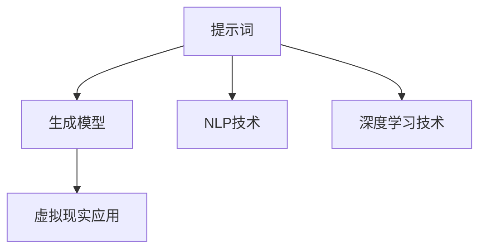

                 

# 提示词工程：AI时代的新兴艺术形式

## 关键词

- AI艺术
- 提示词工程
- 生成模型
- 跨领域应用
- 伦理问题

> 在人工智能的浪潮中，艺术正经历一场深刻的变革。提示词工程，作为AI时代的新兴艺术形式，正逐渐成为艺术家和程序员之间桥梁，推动着艺术创作的新潮流。

## 摘要

本文旨在探讨AI时代的新兴艺术形式——提示词工程。通过逐步分析提示词工程的定义、特点、分类和应用，揭示其在艺术创作、设计与广告、娱乐与游戏、教育等领域的广泛应用。同时，本文还将探讨提示词工程所面临的挑战与机遇，以及其在未来发展趋势中的可能方向。

## 第一部分：AI时代的艺术形式概述

### 第1章：AI时代的艺术变革

#### 1.1 AI艺术的发展背景

人工智能（AI）作为当今科技发展的前沿领域，已经渗透到了我们生活的方方面面。从最初的自动化机器到如今的智能系统，AI技术的发展不断推动着各个行业的变革。而在艺术领域，AI同样带来了一场前所未有的革命。

AI艺术的发展可以追溯到20世纪80年代，当时人工智能已经开始应用于图形处理和图像生成。随着时间的推移，随着计算能力和算法的进步，AI在艺术领域的应用越来越广泛，从简单的图像生成到复杂的文本、音频和虚拟现实艺术。

#### 1.2 提示词工程的定义

提示词工程是AI艺术中的一个重要分支，它利用人工智能技术，通过提示词（Prompts）来指导生成模型创作出各种艺术作品。提示词可以是一个简单的文字描述，也可以是一幅图像、一段音频或其他类型的输入，它为模型提供了创作方向和灵感。

#### 1.3 提示词工程的特点与优势

提示词工程具有以下特点：

1. **高度个性化**：通过提示词，艺术家可以引导模型生成符合特定需求和风格的个性化作品。
2. **创新性**：AI模型能够探索新的艺术形式和风格，打破传统艺术界限。
3. **高效性**：相比手工创作，提示词工程能够快速生成大量作品，提高艺术创作的效率。
4. **跨领域融合**：提示词工程不仅限于文字、图像、音频等单一领域，还能够实现跨领域的艺术创作。

#### 1.4 提示词工程的分类

根据生成的艺术作品类型，提示词工程可以分为以下几类：

1. **文本生成艺术**：通过自然语言处理技术生成文本作品，如诗歌、故事、评论等。
2. **图像生成艺术**：利用生成对抗网络（GAN）等模型生成或修改图像。
3. **音频生成艺术**：通过深度学习模型生成音乐、声音效果等。
4. **虚拟现实艺术**：利用虚拟现实技术，结合AI生成沉浸式的艺术体验。

#### 1.5 提示词工程的应用领域

提示词工程在多个领域展现出了巨大的潜力：

1. **艺术创作**：为艺术家提供创作灵感，生成新的艺术作品。
2. **设计与广告**：辅助设计师进行创意工作，提高广告宣传的效果。
3. **娱乐与游戏**：为游戏和虚拟世界提供丰富的内容，提升用户体验。
4. **教育**：通过生成教学资源，帮助学生更好地理解和掌握知识。

#### 1.6 AI时代艺术面临的挑战与机遇

在AI时代，艺术既面临挑战也充满机遇：

1. **技术发展的挑战**：AI技术的快速进步给传统艺术带来了冲击，如何保持艺术的独特性和创造性成为一个问题。
2. **艺术创新的机遇**：AI技术为艺术创作提供了新的工具和平台，艺术家可以通过AI实现更多的创意想法。

### 总结

AI时代的艺术形式正在发生深刻的变革，提示词工程作为新兴的艺术形式，正以其独特的魅力和潜力吸引着越来越多的关注。通过本文的探讨，我们希望能够帮助读者更好地理解这一领域，并激发对AI艺术的兴趣和思考。

## 第二部分：文本生成艺术的提示词工程

### 第2章：文本生成艺术概述

文本生成艺术是提示词工程的重要组成部分，它利用人工智能技术，通过提示词来生成各种形式的文本作品。文本生成艺术不仅能够创造文学作品，还可以用于生成自动化报告、新闻文章、对话等。

### 2.1 文本生成的概念

文本生成是指利用自然语言处理（NLP）技术，将输入的提示词转换为具有连贯性和可读性的文本。文本生成技术可以基于统计方法、规则方法或深度学习方法。

#### 2.1.1 统计方法

统计方法通常使用语言模型，如n-gram模型，通过对大量文本数据进行统计分析，预测下一个单词或短语。这种方法简单有效，但生成的文本往往缺乏创造性。

#### 2.1.2 规则方法

规则方法通过预定义的规则和模板生成文本。这种方法能够保证文本的准确性和一致性，但灵活性较差，难以应对复杂和多变的场景。

#### 2.1.3 深度学习方法

深度学习方法，如序列到序列（Seq2Seq）模型和注意力模型，通过学习大量文本数据，生成更具有创造性和多样性的文本。这种方法是目前文本生成艺术中最常用的技术。

### 2.2 提示词在文本生成中的作用

提示词是文本生成艺术的核心，它为生成模型提供了创作方向和约束条件。一个有效的提示词可以引导模型生成符合预期风格的文本。

#### 2.2.1 提示词的构建方法

构建有效的提示词需要考虑以下几个步骤：

1. **文本数据收集**：收集与创作主题相关的文本数据，如书籍、文章、新闻等。
2. **提示词预处理**：对收集的文本数据进行清洗、去噪和格式化，使其适合模型训练。
3. **提示词生成算法**：可以使用规则方法或机器学习方法生成提示词。例如，可以使用文本摘要技术提取关键信息作为提示词。

#### 2.2.2 常见的文本生成模型

1. **序列到序列（Seq2Seq）模型**

   序列到序列模型是一种基于神经网络的文本生成模型，它将输入序列（提示词）映射到输出序列（生成的文本）。这种模型通常包含编码器和解码器两个部分。

   ```mermaid
   graph TB
   A[编码器] --> B[嵌入层]
   B --> C[编码层]
   C --> D[解码器]
   D --> E[嵌入层]
   E --> F[解码层]
   F --> G[输出]
   ```

2. **注意力模型**

   注意力模型通过关注输入序列中的关键信息，提高文本生成的准确性和连贯性。注意力机制允许模型在不同的时间步之间建立关联，从而提高生成文本的质量。

   ```mermaid
   graph TB
   A[编码器] --> B[嵌入层]
   B --> C[编码层]
   C --> D[注意力层]
   D --> E[解码器]
   E --> F[嵌入层]
   F --> G[解码层]
   G --> H[输出]
   ```

3. **自回归模型**

   自回归模型通过预测下一个单词或字符来生成文本。这种模型通常使用循环神经网络（RNN）或 Transformer 架构，能够生成具有较长依赖关系的文本。

   ```mermaid
   graph TB
   A[输入] --> B[RNN]
   B --> C[隐藏状态]
   C --> D[预测层]
   D --> E[输出]
   ```

### 2.3 提示词工程在文本生成艺术中的应用

1. **文学创作**

   提示词工程在文学创作中具有广泛的应用，如生成小说、诗歌、剧本等。通过有效的提示词，模型可以创作出风格独特、富有创意的文学作品。

2. **自动化报告**

   在企业和政府机构中，自动化报告生成是一个常见需求。提示词工程可以帮助生成结构化、格式化的报告，提高工作效率。

3. **对话系统**

   对话系统能够模拟人类的对话行为，通过提示词工程，模型可以生成自然、流畅的对话内容，为聊天机器人、客服系统等提供支持。

### 2.4 提示词工程的优化策略

1. **模型训练策略**

   - 使用大量的高质量文本数据，提高模型的泛化能力。
   - 采用多任务学习，使模型在生成文本的同时学习其他相关任务，如文本分类、情感分析等。

2. **提示词优化算法**

   - 利用文本摘要技术，提取关键信息作为提示词，提高生成文本的准确性和连贯性。
   - 采用对抗性训练，增加模型的鲁棒性，使其能够应对不同类型的提示词。

### 总结

文本生成艺术是提示词工程的重要组成部分，通过有效的提示词和先进的生成模型，我们可以创造出各种形式的文本作品。随着技术的不断进步，文本生成艺术将继续发展，为艺术创作和实际应用带来更多可能性。

### 第三部分：图像生成艺术的提示词工程

### 第3章：图像生成艺术概述

图像生成艺术是提示词工程的另一重要领域，通过人工智能技术，生成或修改图像，创造独特的视觉艺术作品。图像生成艺术的应用范围广泛，包括但不限于艺术创作、图像编辑、游戏开发、虚拟现实等领域。

#### 3.1 图像生成的概念

图像生成是指利用机器学习模型，根据输入的提示词或条件，生成符合要求的图像。图像生成技术可以分为无监督学习、有监督学习和半监督学习三种类型：

1. **无监督学习**：模型在没有标签数据的情况下，通过学习数据分布生成图像。例如，生成对抗网络（GAN）就是一种典型的无监督学习图像生成方法。

2. **有监督学习**：模型在有标签数据的情况下，通过学习输入和输出之间的映射关系生成图像。例如，变分自编码器（VAE）就是一种有监督学习图像生成方法。

3. **半监督学习**：模型在部分有标签数据和大量无标签数据的情况下，通过学习数据分布和标签数据的映射关系生成图像。半监督学习在图像生成中具有很大的潜力。

#### 3.2 提示词在图像生成中的作用

提示词在图像生成中起到了关键作用，它们为生成模型提供了生成图像的指导。一个有效的提示词可以帮助模型生成符合预期内容、风格和结构的图像。提示词的构建通常包括以下几个步骤：

1. **文本描述**：使用自然语言描述图像内容，如“一幅美丽的日落景色”。
2. **图像标注**：对图像进行标注，如类别标注（例如，风景、动物、人物等）和细节标注（例如，天空、海洋、山脉等）。
3. **组合提示词**：将文本描述和图像标注结合起来，形成更具体的提示词，如“一幅美丽的日落景色，有彩虹和飞鸟”。

#### 3.3 常见的图像生成模型

图像生成模型的种类繁多，以下介绍几种常见的模型：

1. **生成对抗网络（GAN）**

   生成对抗网络由生成器和判别器组成，生成器尝试生成逼真的图像，判别器判断生成图像和真实图像的区别。通过对抗训练，生成器不断优化，生成越来越逼真的图像。

   ```mermaid
   graph TB
   A[生成器] --> B[生成图像]
   B --> C[判别器]
   C --> D{判断}
   D --> A[反馈]
   ```

2. **变分自编码器（VAE）**

   变分自编码器是一种基于概率模型的图像生成方法，通过编码器将图像映射到潜在空间，解码器从潜在空间中生成图像。VAE具有较好的图像保真度和灵活性。

   ```mermaid
   graph TB
   A[编码器] --> B[潜在空间]
   B --> C[解码器]
   C --> D[生成图像]
   ```

3. **风格迁移模型**

   风格迁移模型通过将一种图像的风格应用到另一种图像的内容上，生成新的图像。这种模型在艺术创作和图像编辑中具有广泛的应用。

   ```mermaid
   graph TB
   A[内容图像] --> B[风格图像]
   B --> C[风格迁移模型]
   C --> D[生成图像]
   ```

#### 3.4 提示词工程在图像生成艺术中的应用

1. **艺术创作**

   提示词工程在艺术创作中为艺术家提供了强大的创作工具，艺术家可以通过提示词引导模型生成具有独特风格和主题的图像。

2. **图像编辑**

   提示词工程可以帮助用户快速编辑图像，如改变图像的色彩、风格、分辨率等，为图像处理提供了新的方法和思路。

3. **游戏开发**

   在游戏开发中，提示词工程可以用于生成游戏场景、角色、道具等，提高游戏的多样性和可玩性。

4. **虚拟现实**

   虚拟现实（VR）领域需要大量的图像资源，提示词工程可以快速生成高质量的VR内容，提高用户体验。

#### 3.5 提示词工程的优化策略

1. **模型训练策略**

   - 使用多种类型的提示词，提高模型的泛化能力。
   - 采用迁移学习，利用预训练模型，减少训练时间。

2. **提示词优化算法**

   - 利用文本摘要和图像标注技术，生成更具体的提示词。
   - 采用对抗性训练，增强生成图像的多样性和质量。

### 总结

图像生成艺术是提示词工程的重要组成部分，通过有效的提示词和先进的图像生成模型，我们可以创造出各种类型的图像作品。随着技术的发展，图像生成艺术将在更多领域得到应用，为艺术创作和实际应用带来更多可能性。

### 第四部分：音频生成艺术的提示词工程

### 第4章：音频生成艺术概述

音频生成艺术是提示词工程的又一重要分支，利用人工智能技术，根据输入的提示词生成或修改音频内容。音频生成艺术在音乐创作、声音效果制作、音频编辑等领域具有广泛的应用，为音频艺术创作提供了新的工具和方法。

#### 4.1 音频生成的概念

音频生成是指利用机器学习模型，根据输入的提示词或条件生成音频内容。音频生成技术可以分为无监督学习和有监督学习两种类型：

1. **无监督学习**：模型在没有标签数据的情况下，通过学习数据分布生成音频。例如，自编码器可以用于生成新的音乐片段。

2. **有监督学习**：模型在有标签数据的情况下，通过学习输入和输出之间的映射关系生成音频。例如，自动回归模型可以用于生成连续的音频序列。

#### 4.2 提示词在音频生成中的作用

提示词在音频生成中起到了关键作用，它们为生成模型提供了生成音频的指导。一个有效的提示词可以帮助模型生成符合预期风格、节奏和内容的音频。构建有效的提示词通常包括以下步骤：

1. **文本描述**：使用自然语言描述音频内容，如“一首悲伤的钢琴曲”。
2. **音频标注**：对音频进行标注，如音高、节奏、音色等。
3. **组合提示词**：将文本描述和音频标注结合起来，形成更具体的提示词，如“一首悲伤的钢琴曲，音高在C到E之间，节奏缓慢”。

#### 4.3 常见的音频生成模型

以下介绍几种常见的音频生成模型：

1. **自动回归模型**

   自动回归模型通过预测音频序列中的下一个音素或音频帧来生成音频。这种模型通常使用循环神经网络（RNN）或 Transformer 架构，能够生成连续的音频序列。

   ```mermaid
   graph TB
   A[输入] --> B[RNN]
   B --> C[隐藏状态]
   C --> D[预测层]
   D --> E[输出]
   ```

2. **预训练模型**

   预训练模型是通过在大规模音频数据集上进行预训练，然后微调到特定任务上的模型。例如，预训练的语音转换模型可以用于生成新的语音。

3. **频谱建模模型**

   频谱建模模型通过学习音频信号的频谱特征来生成音频。这种模型通常使用卷积神经网络（CNN）或 Transformer 架构，能够生成具有特定频谱特征的音频。

   ```mermaid
   graph TB
   A[输入] --> B[频谱建模层]
   B --> C[卷积层]
   C --> D[池化层]
   D --> E[输出]
   ```

#### 4.4 提示词工程在音频生成艺术中的应用

1. **音乐创作**

   提示词工程在音乐创作中为音乐家提供了强大的创作工具，通过提示词，模型可以生成新的旋律、和声和节奏，为音乐创作提供灵感。

2. **声音效果制作**

   提示词工程可以帮助音效师快速制作各种声音效果，如环境音、特效音等，提高音频编辑的效率。

3. **语音合成**

   提示词工程在语音合成领域具有广泛的应用，通过提示词，模型可以生成具有特定风格和内容的语音，用于语音助手、播报系统等。

4. **虚拟现实**

   在虚拟现实（VR）领域，提示词工程可以生成高质量的音频内容，如虚拟场景的声音、角色对话等，提高用户的沉浸体验。

#### 4.5 提示词工程的优化策略

1. **模型训练策略**

   - 使用多种类型的提示词，提高模型的泛化能力。
   - 采用迁移学习，利用预训练模型，减少训练时间。

2. **提示词优化算法**

   - 利用文本摘要和音频标注技术，生成更具体的提示词。
   - 采用对抗性训练，增强生成音频的多样性和质量。

### 总结

音频生成艺术是提示词工程的重要组成部分，通过有效的提示词和先进的音频生成模型，我们可以创造出各种类型的音频作品。随着技术的不断进步，音频生成艺术将在更多领域得到应用，为音频艺术创作和实际应用带来更多可能性。

### 第五部分：虚拟现实艺术的提示词工程

### 第5章：虚拟现实艺术概述

虚拟现实（VR）艺术是提示词工程的另一个重要应用领域，通过人工智能技术，生成或修改虚拟现实场景和交互内容，为用户提供沉浸式的艺术体验。虚拟现实艺术结合了计算机图形学、交互技术和人工智能，为艺术创作和用户体验带来了全新的可能性。

#### 5.1 虚拟现实的概念

虚拟现实是一种通过计算机技术创建的模拟环境，用户可以在其中互动和探索。虚拟现实的关键特征包括：

1. **沉浸感**：用户感觉仿佛置身于虚拟世界中，与周围环境和对象进行互动。
2. **交互性**：用户可以通过动作、声音或其他方式与虚拟世界进行交互。
3. **多感官体验**：虚拟现实不仅提供视觉体验，还可以结合声音、触觉等多感官刺激。

#### 5.2 提示词在虚拟现实中的作用

在虚拟现实艺术中，提示词为生成模型提供了创作方向和交互内容。一个有效的提示词可以帮助模型生成符合预期主题、风格和交互方式的虚拟现实场景。提示词的构建通常包括以下步骤：

1. **场景描述**：使用自然语言描述虚拟现实场景，如“一个未来科技都市的夜景”。
2. **交互需求**：指定用户在虚拟现实中的交互方式，如“用户可以探索城市并与其他角色互动”。
3. **艺术风格**：定义虚拟现实场景的艺术风格，如“立体派绘画风格”或“超现实主义风格”。

#### 5.3 虚拟现实艺术的技术基础

虚拟现实艺术的技术基础包括以下几个方面：

1. **增强现实（AR）技术**：通过在现实世界叠加虚拟内容，增强用户的感知体验。
2. **虚拟现实（VR）引擎**：用于创建和渲染虚拟现实场景的软件平台，如Unity和Unreal Engine。
3. **空间感知算法**：用于检测用户的位置和动作，实现虚拟现实中的交互。

#### 5.4 提示词工程在虚拟现实艺术中的应用

1. **虚拟展览**

   提示词工程可以帮助艺术家创建虚拟展览空间，通过提示词引导用户探索不同主题的艺术作品。

2. **虚拟游戏**

   在虚拟游戏中，提示词工程可以用于生成游戏场景、角色、任务等，提供丰富的游戏体验。

3. **虚拟培训**

   虚拟现实艺术在教育培训领域有广泛应用，通过提示词工程，可以生成互动式的培训内容，提高学习效果。

4. **虚拟旅游**

   提示词工程可以创建虚拟旅游场景，让用户在家中体验世界各地的风景和文化。

#### 5.5 提示词工程的优化策略

1. **模型训练策略**

   - 使用多样化的提示词，提高模型的泛化能力。
   - 采用迁移学习，利用预训练模型，减少训练时间。

2. **提示词优化算法**

   - 利用文本摘要和图像标注技术，生成更具体的提示词。
   - 采用对抗性训练，增强生成虚拟现实内容的多样性和质量。

### 总结

虚拟现实艺术是提示词工程的重要组成部分，通过有效的提示词和先进的虚拟现实技术，我们可以创造出沉浸式的艺术体验。随着技术的不断发展，虚拟现实艺术将在更多领域得到应用，为艺术创作和用户体验带来更多可能性。

### 第六部分：提示词工程的跨领域应用

#### 第6章：提示词工程的跨领域应用

提示词工程作为一种新兴的AI艺术形式，其应用不仅限于单一领域，而是跨越多个领域，为不同领域的艺术创作和实际应用提供支持。跨领域应用不仅拓展了提示词工程的应用范围，也为不同领域的融合提供了新的思路和工具。

#### 6.1 跨领域应用概述

跨领域应用的提示词工程，意味着将文本生成、图像生成、音频生成和虚拟现实等不同领域的生成模型进行整合和交互，以实现更丰富和多样化的艺术创作。这种跨领域应用具有以下几个特点：

1. **多样性**：跨领域应用可以生成包括文本、图像、音频和虚拟现实等多种类型的艺术作品，满足不同用户的需求。
2. **融合性**：不同领域的模型和提示词可以相互融合，生成具有独特风格和主题的作品。
3. **创新性**：跨领域应用可以探索新的艺术形式和创作方式，推动艺术创作的创新和发展。

#### 6.2 跨领域应用的案例分析

以下是一些跨领域应用的典型案例：

1. **文本与图像的跨领域生成**

   文本与图像的跨领域生成是指通过文本提示词生成图像，或将图像转化为文本描述。这种跨领域应用在虚拟现实、游戏设计和广告等领域有广泛的应用。

   - **案例**：使用文本提示词“创造一幅具有未来科技感的星空图”，模型生成一幅结合了科技元素和星空背景的图像。
   - **应用**：这种跨领域生成技术可以用于虚拟现实游戏场景的快速创建，提高设计效率。

2. **音频与虚拟现实的跨领域交互**

   音频与虚拟现实的跨领域交互是指将音频内容与虚拟现实场景结合，提供更加沉浸式的用户体验。

   - **案例**：使用音频提示词“一段森林的声音”，模型生成一个虚拟森林场景，用户在虚拟现实中可以听到森林的声音。
   - **应用**：这种跨领域交互技术可以用于虚拟旅游、虚拟培训等领域，提升用户体验。

#### 6.3 提示词工程的跨领域优化策略

为了实现跨领域应用的优化，提示词工程需要采取以下策略：

1. **模型融合策略**

   - **多模态训练**：将文本、图像、音频等多模态数据进行联合训练，使模型能够同时处理多种类型的输入和输出。
   - **跨领域迁移学习**：利用在不同领域上预训练的模型，通过迁移学习的方式，提高跨领域应用的性能。

2. **提示词协同优化**

   - **多提示词组合**：将多个提示词组合使用，以提供更丰富的创作方向和约束条件。
   - **提示词权重调整**：根据不同领域的需求和特点，调整提示词的权重，提高生成结果的多样性和质量。

### 总结

跨领域应用是提示词工程发展的重要方向，它不仅拓展了提示词工程的应用范围，也为不同领域的融合提供了新的工具和方法。通过模型融合和提示词协同优化，提示词工程在跨领域应用中展现出巨大的潜力，为艺术创作和实际应用带来了新的可能。

### 第七部分：提示词工程的未来发展趋势

#### 第7章：提示词工程的未来发展趋势

随着人工智能技术的不断进步，提示词工程作为AI艺术的重要组成部分，也在不断发展和创新。未来，提示词工程将在人工智能与艺术的深度融合、新艺术形式的探索以及伦理与社会影响等方面展现出新的发展趋势。

#### 7.1 人工智能与艺术的深度融合

人工智能与艺术的深度融合是提示词工程未来发展的一个重要方向。在这一过程中，人工智能技术不仅被用于艺术创作，还将参与到艺术品的鉴赏、评价和传播等各个环节。

1. **个性化创作**：人工智能可以根据用户的喜好和需求，生成个性化的艺术品，满足不同用户群体的个性化需求。
2. **智能辅助创作**：人工智能可以辅助艺术家进行创作，提供灵感、技巧和工具，提高创作效率和质量。
3. **智能评价系统**：人工智能可以用于评价艺术品的价值，提供客观、科学的评价标准，推动艺术品市场的健康发展。

#### 7.2 新艺术形式的探索

提示词工程的不断发展将带来新的艺术形式和创作方式。未来，艺术家和程序员可以共同探索以下新艺术形式：

1. **跨媒介艺术**：结合多种媒介（如文本、图像、音频、虚拟现实等），创作出具有多重感官体验的艺术作品。
2. **交互式艺术**：通过人工智能技术，实现用户与艺术品的实时交互，提供更加沉浸式的艺术体验。
3. **数据驱动艺术**：利用大数据技术，挖掘和分析用户行为和喜好，生成数据驱动的艺术作品，反映社会和时代的特征。

#### 7.3 提示词工程的伦理与社会影响

随着提示词工程的普及和应用，其伦理和社会影响也逐渐引起关注。未来，提示词工程需要在以下几个方面进行考虑：

1. **知识产权**：如何保护人工智能生成的艺术作品的知识产权，防止侵权和滥用。
2. **透明度和可解释性**：如何提高人工智能生成模型的透明度和可解释性，使其创作过程更加透明和可理解。
3. **社会责任**：人工智能企业和开发者应承担社会责任，确保提示词工程的应用不会对人类社会和环境造成负面影响。

#### 7.4 提示词工程的未来发展前景

未来，提示词工程将在人工智能和艺术领域发挥越来越重要的作用，其应用前景广阔：

1. **艺术创作**：提示词工程将继续推动艺术创作的发展，带来更多的艺术形式和创作方式。
2. **教育与培训**：提示词工程将被用于教育领域，辅助教师和学生进行教学和学习。
3. **商业应用**：提示词工程将在广告、设计、游戏等商业领域得到广泛应用，提高商业创新和效率。
4. **公共服务**：提示词工程将被用于公共服务领域，如虚拟旅游、虚拟医疗等，提升公共服务的质量和覆盖范围。

### 总结

提示词工程作为AI时代的新兴艺术形式，具有广阔的发展前景。在人工智能与艺术的深度融合、新艺术形式的探索以及伦理与社会影响等方面，提示词工程都将发挥重要作用。通过不断创新和优化，提示词工程将为艺术创作和实际应用带来更多可能性。

### 附录：提示词工程实践资源与拓展

#### 7.5 实践资源与工具

为了更好地理解和实践提示词工程，以下是几个常用的资源和工具：

1. **开源模型与资源库**：例如，TensorFlow、PyTorch等深度学习框架，以及预训练模型库如Hugging Face等。
2. **在线平台**：例如，Google Colab、Kaggle等，提供便捷的编程环境和数据资源。
3. **工具箱**：例如，StyleGAN、DALL-E等，用于生成图像和文本。

#### 7.6 拓展阅读

以下是几篇与提示词工程相关的拓展阅读资源：

1. **论文**：《生成对抗网络》（Generative Adversarial Nets, GANs）等经典论文。
2. **书籍**：《深度学习》（Deep Learning）等深度学习领域的权威著作。
3. **报告与案例**：行业报告、案例分析等，了解提示词工程在不同领域的应用和趋势。

### 总结

提示词工程作为AI时代的新兴艺术形式，具有丰富的理论和实践资源。通过拓展阅读和实践资源，读者可以更深入地了解这一领域，掌握相关技术，并尝试将其应用于实际项目中。

### 作者信息

- 作者：AI天才研究院/AI Genius Institute & 禅与计算机程序设计艺术 /Zen And The Art of Computer Programming

### 附录：提示词工程的核心概念与联系

#### 核心概念

1. **提示词（Prompt）**：用于引导生成模型创作的输入信息，可以是文字、图像、音频等。
2. **生成模型（Generative Model）**：通过学习大量数据，生成新的数据样本的模型，如生成对抗网络（GAN）、变分自编码器（VAE）等。
3. **自然语言处理（NLP）**：研究如何使计算机理解、生成和处理自然语言的学科。
4. **深度学习（Deep Learning）**：一种基于人工神经网络的机器学习技术，通过多层神经网络来学习和提取数据特征。
5. **虚拟现实（VR）**：通过计算机技术创建的模拟环境，用户可以在其中互动和探索。

#### 概念属性特征对比表格

| 概念        | 描述                                                         | 特征对比                      |
| ----------- | ------------------------------------------------------------ | ---------------------------- |
| 提示词      | 引导生成模型创作的输入信息                                   | 文本、图像、音频等           |
| 生成模型    | 通过学习数据生成新数据的模型                                 | GAN、VAE、自回归模型等       |
| NLP         | 研究如何使计算机理解、生成和处理自然语言的学科               | 词嵌入、序列模型、注意力机制 |
| 深度学习    | 基于人工神经网络的机器学习技术，通过多层神经网络来学习和提取数据特征 | 神经网络结构、训练策略等     |
| 虚拟现实    | 通过计算机技术创建的模拟环境，用户可以在其中互动和探索           | 增强现实、沉浸感、交互性等   |

#### ER实体关系图架构



在这个ER实体关系图中，提示词作为核心实体，与生成模型、NLP技术和深度学习技术密切相关，同时生成模型也可以应用于虚拟现实领域。通过这张图，我们可以清晰地看到提示词工程中各个核心概念之间的联系和作用。

### 总结

本文通过逐步分析提示词工程的定义、特点、分类和应用，揭示了其在AI艺术领域的核心概念和联系。通过概念对比表格和ER实体关系图，我们更深入地理解了提示词工程在AI艺术创作中的关键作用，为未来的研究和应用提供了理论基础。

