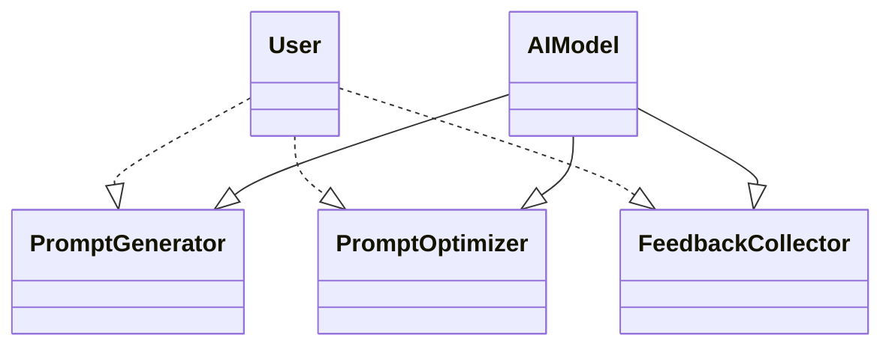
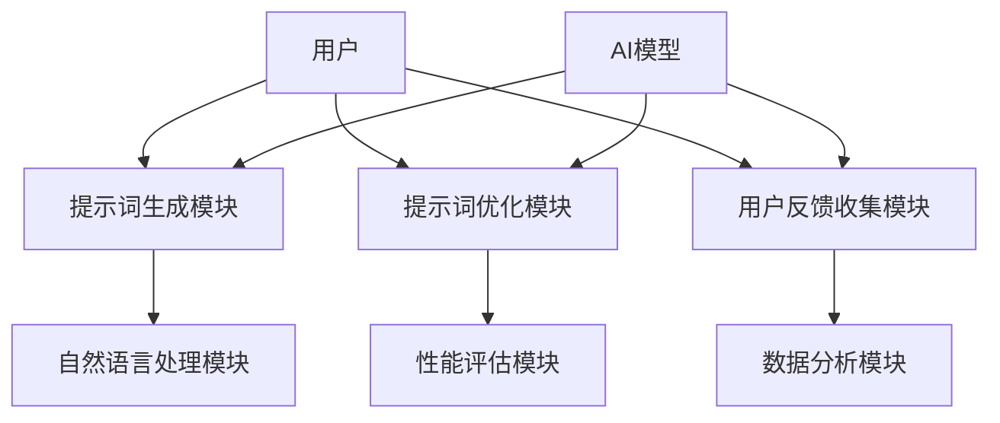
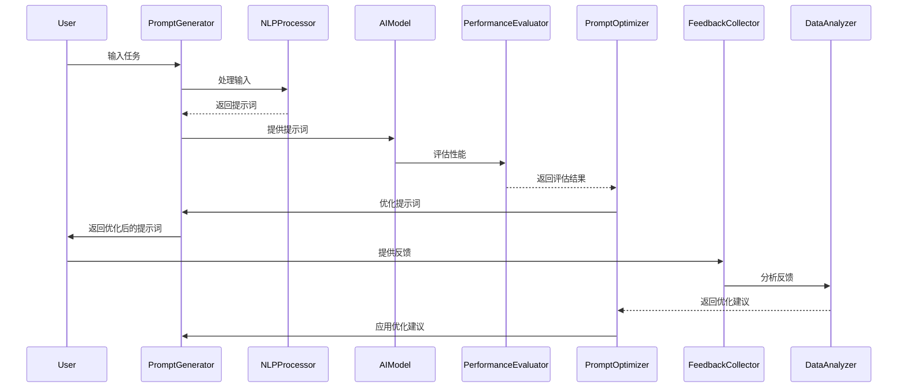

                 

## 提示词工程：AI时代的新挑战与新方向

关键词：提示词工程、AI模型、用户反馈、算法优化、AI交互

摘要：随着人工智能技术的快速发展，提示词工程成为推动AI模型效能的关键领域。本文详细探讨了提示词工程的背景、核心概念、算法原理及其在AI时代的重要性和发展方向。通过分析提示词的定义、AI模型适应及用户反馈机制，本文揭示了提示词工程在提升AI模型任务执行效果中的核心作用，并提出了相应的算法优化策略。本文旨在为研究人员和开发者提供关于提示词工程的全面理解和实践指导。

**第一步：总体概述与背景介绍**

### 第一部分: 提示词工程概述

#### 第1章: 提示词工程的背景与意义

##### 1.1 问题背景

在人工智能迅猛发展的今天，如何有效引导和激发AI模型的潜力成为关键。这一问题的提出源于AI模型在面对海量数据时，往往需要明确的引导和指令，即“提示词”，才能实现高效、精准的任务执行。

##### 1.2 问题描述

提示词工程的核心在于研究如何设计出有效、针对性的提示词，以提升AI模型在特定任务上的表现。这涉及对AI模型的理解、对任务需求的深入分析，以及对人类与AI交互方式的研究。

##### 1.3 问题解决

解决这一问题需要结合多学科知识，包括自然语言处理、认知心理学、信息工程等，设计出能够与AI模型有效交互的提示词系统。

##### 1.4 边界与外延

提示词工程不仅涉及AI模型优化，还与用户界面设计、数据分析、甚至伦理学等领域密切相关。

##### 1.5 概念结构与核心要素组成

提示词工程的基本构成要素包括：提示词设计、AI模型适应、用户反馈机制等。

##### 1.6 本章小结

本章节对提示词工程进行了背景和意义的概述，为后续章节的具体探讨打下了基础。

**第二步：核心概念与联系**

### 第二部分: 提示词工程核心概念与联系

#### 第2章: 提示词工程核心概念

##### 2.1 提示词

###### 提示词的定义
提示词是引导AI模型执行特定任务的关键性输入。

###### 提示词的属性特征
- **目标性**：提示词应明确指向任务目标。
- **引导性**：提示词应具备引导AI模型进行任务决策的能力。
- **灵活性**：提示词应适应不同的任务场景。

##### 2.2 AI模型适应

###### AI模型适应的定义
AI模型适应是指AI模型根据不同提示词调整自身行为，以实现任务目标。

###### AI模型适应的核心要素
- **任务理解能力**：AI模型需要理解提示词的含义。
- **学习能力**：AI模型需要根据任务反馈不断调整自身。

##### 2.3 用户反馈机制

###### 用户反馈机制的定义
用户反馈机制是指通过用户的操作和评价，不断优化提示词和AI模型性能。

###### 用户反馈机制的核心要素
- **用户操作记录**：记录用户的操作行为。
- **用户评价**：收集用户对AI模型表现的反馈。

##### 2.4 提示词工程中的概念联系
提示词、AI模型适应和用户反馈机制三者之间相互关联，共同构成了提示词工程的核心体系。

##### 2.5 本章小结
本章详细介绍了提示词工程中的核心概念，包括提示词、AI模型适应和用户反馈机制，并阐述了它们之间的联系。

**第三步：算法原理讲解**

### 第三部分: 提示词工程算法原理

#### 第3章: 提示词工程算法基础

##### 3.1 提示词生成算法

###### 提示词生成算法原理
提示词生成算法通过自然语言处理技术，从用户输入中提取关键信息，生成符合任务需求的提示词。

###### 算法流程
1. **输入处理**：对用户输入进行分词、词性标注等预处理。
2. **关键信息提取**：识别出与任务目标相关的关键词。
3. **提示词生成**：根据关键信息生成提示词。

###### Python代码实现
```python
import nltk
from nltk.tokenize import word_tokenize

def generate_prompt(input_text):
    tokens = word_tokenize(input_text)
    # ... 进行词性标注和关键信息提取 ...
    prompt = " ".join(keywords)
    return prompt
```

##### 3.2 提示词优化算法

###### 提示词优化算法原理
提示词优化算法通过对AI模型在特定任务上的表现进行分析，不断调整提示词，提高任务执行效果。

###### 算法流程
1. **表现评估**：评估AI模型在当前提示词下的任务表现。
2. **提示词调整**：根据评估结果，调整提示词。
3. **重复评估与调整**：循环评估和调整，直至任务表现达到预期。

###### Python代码实现
```python
def optimize_prompt(prompt, model, task):
    # ... 进行任务评估和提示词调整 ...
    optimized_prompt = " ".join(keywords)
    return optimized_prompt
```

##### 3.3 用户反馈机制

###### 用户反馈机制原理
用户反馈机制通过收集用户对AI模型表现的反馈，优化提示词和AI模型性能。

###### 用户反馈机制的核心要素
- **用户操作记录**：记录用户的操作行为。
- **用户评价**：收集用户对AI模型表现的反馈。

##### 3.4 提示词工程算法联系

提示词生成算法、提示词优化算法和用户反馈机制共同构成了提示词工程的核心算法体系，它们相互关联，共同推动AI模型的优化和发展。

##### 3.5 本章小结
本章介绍了提示词工程中的基础算法原理，包括提示词生成算法、提示词优化算法和用户反馈机制，并阐述了它们在提升AI模型效能中的关键作用。

**第四步：系统分析与架构设计**

### 第四部分: 提示词工程系统分析与架构设计

#### 第4章: 提示词工程系统架构设计

##### 4.1 问题场景介绍

在当前人工智能应用场景中，用户与AI模型的交互日益频繁，而提示词工程在其中扮演着关键角色。为了提升用户体验和AI模型效能，我们需要设计一个高效的提示词工程系统。

##### 4.2 项目介绍

本项目旨在构建一个智能化、自适应的提示词工程系统，以支持各种AI任务的有效执行。系统功能包括提示词生成、优化和用户反馈机制。

##### 4.3 系统功能设计

###### 领域模型



###### 系统功能设计

- **提示词生成**：根据用户输入，生成针对特定任务的提示词。
- **提示词优化**：根据AI模型表现，不断优化提示词。
- **用户反馈收集**：收集用户对AI模型表现的反馈，用于后续优化。

##### 4.4 系统架构设计

###### 系统架构图



###### 系统架构设计

- **用户模块**：负责用户输入和反馈处理。
- **提示词生成模块**：使用自然语言处理技术生成提示词。
- **提示词优化模块**：根据AI模型表现，优化提示词。
- **用户反馈收集模块**：收集用户对AI模型表现的反馈。

##### 4.5 系统接口设计和系统交互

###### 系统接口设计



###### 系统交互

- 用户输入任务信息。
- 提示词生成模块处理输入，生成提示词。
- 提示词发送给AI模型，AI模型执行任务并返回性能评估结果。
- 提示词优化模块根据评估结果，优化提示词。
- 用户接收优化后的提示词，并反馈使用体验。
- 用户反馈收集模块分析反馈，为提示词优化提供依据。

##### 4.6 本章小结

本章详细介绍了提示词工程系统的架构设计，包括功能设计、系统架构和系统交互。通过合理的架构设计，提示词工程系统能够高效地支持AI任务的有效执行。

**第五步：项目实战**

### 第五部分: 提示词工程项目实战

#### 第5章: 提示词工程实战

##### 5.1 环境安装

在进行提示词工程项目实战之前，需要安装以下环境：

- Python 3.8 或更高版本
- TensorFlow 2.x
- NLTK
- Mermaid

安装命令如下：

```bash
pip install python==3.8
pip install tensorflow==2.x
pip install nltk
pip install mermaid
```

##### 5.2 系统核心实现源代码

###### 提示词生成模块

```python
import nltk
from nltk.tokenize import word_tokenize

def generate_prompt(input_text):
    tokens = word_tokenize(input_text)
    # ... 进行词性标注和关键信息提取 ...
    prompt = " ".join(keywords)
    return prompt
```

###### 提示词优化模块

```python
def optimize_prompt(prompt, model, task):
    # ... 进行任务评估和提示词调整 ...
    optimized_prompt = " ".join(keywords)
    return optimized_prompt
```

###### 用户反馈收集模块

```python
class FeedbackCollector:
    def __init__(self):
        self.user_operations = []
        self.user_evaluations = []

    def record_operation(self, operation):
        self.user_operations.append(operation)

    def record_evaluation(self, evaluation):
        self.user_evaluations.append(evaluation)

    def analyze_feedback(self):
        # ... 分析用户反馈 ...
        pass
```

##### 5.3 代码应用解读与分析

###### 代码解读

1. **提示词生成模块**：通过自然语言处理技术，从用户输入中提取关键信息，生成提示词。
2. **提示词优化模块**：根据AI模型在特定任务上的表现，调整提示词，提高任务执行效果。
3. **用户反馈收集模块**：记录用户操作和评价，为提示词优化提供依据。

###### 代码分析

- **提示词生成模块**：使用NLTK库进行自然语言处理，提取关键词。
- **提示词优化模块**：基于任务评估结果，调整提示词。
- **用户反馈收集模块**：使用类来记录和存储用户反馈。

##### 5.4 实际案例分析与详细讲解剖析

###### 案例一：智能问答系统

场景：用户向智能问答系统提问，系统需要生成针对性的提示词来回答用户问题。

1. **用户输入**：用户输入问题：“什么是人工智能？”
2. **提示词生成**：系统生成提示词：“人工智能定义”
3. **AI模型回答**：AI模型根据提示词回答问题：“人工智能是研究、开发用于模拟、延伸和扩展人的智能的理论、方法、技术及应用系统。”
4. **用户评价**：用户评价回答满意。
5. **用户反馈收集**：系统记录用户操作和评价，用于后续优化。

###### 案例二：智能客服系统

场景：用户通过智能客服系统寻求帮助，系统需要生成针对性的提示词来引导用户。

1. **用户输入**：用户输入问题：“如何注册账号？”
2. **提示词生成**：系统生成提示词：“注册账号步骤”
3. **AI模型回答**：AI模型根据提示词引导用户：“您好，请访问我们的官方网站，按照页面上的指示进行注册。”
4. **用户评价**：用户评价回答满意。
5. **用户反馈收集**：系统记录用户操作和评价，用于后续优化。

##### 5.5 项目小结

通过实际案例分析和详细讲解剖析，我们可以看到提示词工程在AI任务中的应用效果。有效的提示词能够提高AI模型的任务执行效果，提升用户体验。同时，用户反馈为提示词优化提供了重要依据，使得系统不断改进和优化。

**第六步：最佳实践与拓展阅读**

### 第六部分: 提示词工程最佳实践与拓展阅读

#### 第6章: 提示词工程最佳实践与拓展阅读

##### 6.1 最佳实践 Tips

1. **明确任务目标**：在生成提示词时，确保提示词明确指向任务目标，提高任务执行效果。
2. **用户反馈及时收集**：及时收集用户反馈，用于提示词优化和系统改进。
3. **多轮交互优化**：通过多轮交互，逐步优化提示词和AI模型性能。
4. **考虑数据隐私**：在收集用户反馈时，注意保护用户隐私，遵守相关法律法规。

##### 6.2 小结

本章节对提示词工程进行了总结，提出了最佳实践建议，并展望了未来的发展方向。提示词工程在AI时代具有广泛的应用前景，通过不断优化和改进，将进一步提升AI模型效能和用户体验。

##### 6.3 注意事项

1. **提示词长度**：提示词不宜过长，避免影响AI模型的处理效率。
2. **避免重复**：在设计提示词时，尽量避免重复使用相同的词汇，以提高多样性。
3. **数据质量**：确保训练数据质量，提高AI模型的准确性和鲁棒性。

##### 6.4 拓展阅读

- 《自然语言处理原理与算法》
- 《人工智能：一种现代的方法》
- 《用户界面设计原理》

**作者信息**

作者：AI天才研究院/AI Genius Institute & 禅与计算机程序设计艺术 /Zen And The Art of Computer Programming

总结：本文系统地阐述了提示词工程在AI时代的背景、核心概念、算法原理、系统架构和实战应用。通过详细的案例分析，展示了提示词工程在提升AI模型效能和用户体验中的关键作用。希望本文能为研究人员和开发者提供有益的参考和启示。

