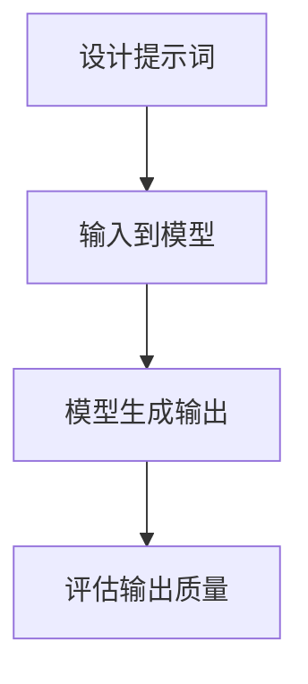
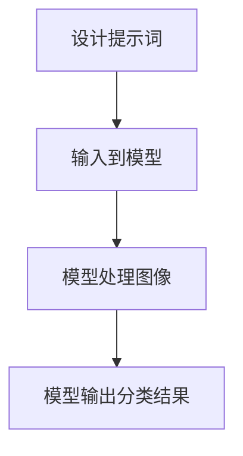
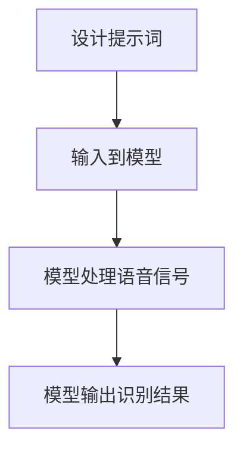
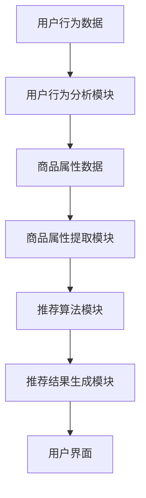
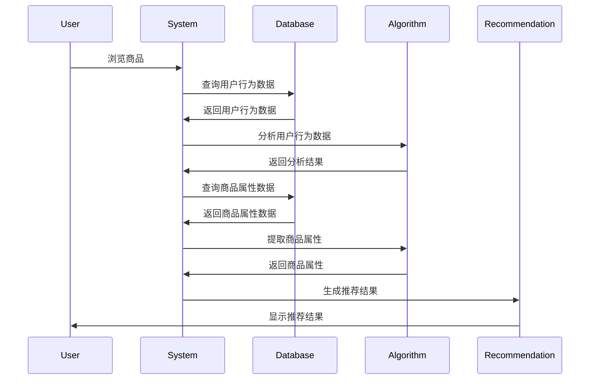
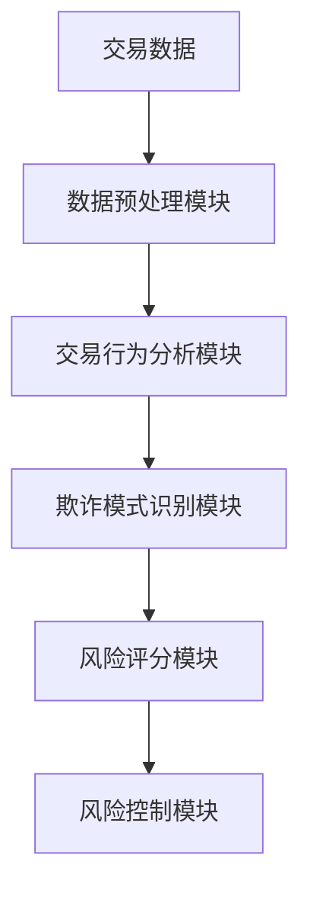
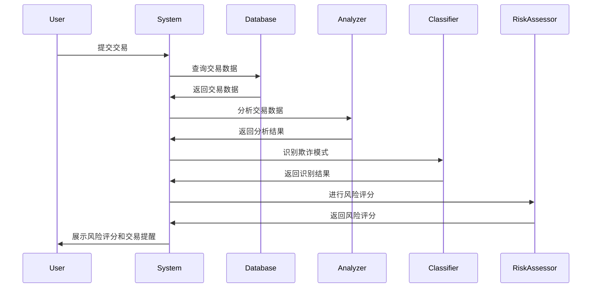

                 

## 《提示词工程：AI时代的新挑战与新机遇》

### 关键词：提示词工程、AI、挑战、机遇、应用场景

> 摘要：随着人工智能（AI）技术的飞速发展，提示词工程成为了AI时代的重要研究方向。本文将深入探讨AI时代背景下的提示词工程所面临的新挑战和新机遇。首先，我们将回顾AI时代的来临以及其对社会、经济和伦理等方面带来的深远影响。接着，我们将详细介绍提示词工程的基本概念、发展历程和应用场景。随后，我们将通过具体案例展示提示词工程在自然语言处理、计算机视觉和智能语音识别等领域的实际应用。最后，我们将讨论提示词工程的最佳实践与优化策略，并展望其未来发展趋势。

### 目录大纲

1. **AI时代背景**
    1.1 AI时代的新挑战
    1.2 提示词工程概述
    1.3 提示词工程的发展历程
2. **AI时代的新机遇**
    2.1 提示词工程的应用场景
        2.1.1 自然语言处理中的应用
        2.1.2 计算机视觉中的应用
        2.1.3 智能语音识别中的应用
    2.2 提示词工程在行业应用中的案例解析
        2.2.1 电商平台的个性化推荐系统
        2.2.2 金融风控系统的欺诈检测
    2.3 提示词工程最佳实践与优化策略
3. **提示词工程的未来发展趋势**
    3.1 技术趋势
    3.2 行业应用前景
4. **总结与展望**
    4.1 总结与反思
    4.2 展望与建议

## AI时代背景

### 1.1 AI时代来临

随着计算机科学和大数据技术的不断进步，人工智能（AI）已经从一个科幻领域的概念逐步走向现实，深刻地影响着社会的各个方面。AI时代的到来不仅带来了前所未有的机遇，同时也带来了诸多挑战。首先，我们需要了解AI技术的定义和核心概念。

**定义与核心概念：**
人工智能（Artificial Intelligence，简称AI）是指通过计算机程序模拟、延伸和扩展人类智能的理论、方法和技术。它包括机器学习（Machine Learning）、深度学习（Deep Learning）、自然语言处理（Natural Language Processing）、计算机视觉（Computer Vision）等多个子领域。

**问题背景：**
AI技术的发展和应用不仅改变了传统产业的生产方式，还带来了新的商业模式和社会形态。例如，自动驾驶汽车、智能客服、智能家居等应用正在改变人们的日常生活。然而，AI技术也引发了一系列社会问题，如隐私保护、就业替代、伦理道德等。

**问题描述：**
随着AI技术的普及，其对社会的影响日益显著。我们需要解决的问题包括：
- AI技术的快速发展对社会经济结构带来的冲击。
- AI在医疗、教育、金融等领域的应用带来的新挑战。
- AI技术的安全性和伦理道德问题。

**问题解决：**
针对上述问题，我们可以从以下几个方面寻求解决方案：
- 加强对AI技术的监管和法规制定，确保其安全和伦理标准。
- 推动AI与人类劳动的协同发展，减少对就业的负面影响。
- 提高公众对AI技术的认知和理解，促进社会的共同进步。

**边界与外延：**
AI时代的边界主要涉及技术层面和社会层面。在技术层面，AI的发展依赖于算法、数据和计算能力。在社会层面，AI的应用需要考虑伦理、法律和社会影响。

**概念结构与核心要素组成：**
AI技术的核心要素包括算法、数据、计算能力和应用场景。算法是AI系统的核心，数据是算法训练的基础，计算能力是支持算法高效运行的关键，应用场景则是AI技术实际应用的场所。

### 1.2 提示词工程概述

**核心概念：**
提示词工程（Prompt Engineering）是一种专门针对自然语言处理（NLP）任务进行提示设计的工程实践。其目的是通过精心设计的提示，引导模型生成更准确、更符合预期的输出。

**核心概念属性特征对比表格：**

| 特征            | 提示词工程         | 自然语言处理       | 深度学习           |
| --------------- | ------------------ | ------------------ | ------------------ |
| 目的            | 引导模型输出       | 处理语言数据       | 构建复杂模型       |
| 关键技术        | 提示设计、反馈机制 | 词嵌入、序列处理   | 神经网络架构       |
| 应用场景        | NLP任务           | 文本处理           | 图像、语音等多种数据类型 |
| 成果评估标准    | 输出准确性、流畅性 | 准确性、效率       | 模型性能、泛化能力 |

**ER实体关系图架构：**

```mermaid
erDiagram
  Customer ||--|{ Order }|--| Supplier
  Product ||--|{ Order }|--| Customer
```

在这个ER图中，"Customer"（客户）与"Order"（订单）之间存在"一"对"多"的关系，"Product"（产品）也与"Order"之间存在"一"对"多"的关系，展示了提示词工程在自然语言处理中的关键实体及其相互关系。

### 1.3 提示词工程的发展历程

**历史回顾：**
提示词工程的发展可以追溯到人工智能的早期阶段。在20世纪50年代和60年代，研究者们开始探索如何通过编写特定的指令来引导计算机进行复杂的任务。随着自然语言处理技术的发展，特别是深度学习和大规模预训练模型的出现，提示词工程逐渐成为了一个独立的研究方向。

**关键里程碑：**
- 1950年：艾伦·图灵提出图灵测试，为AI的发展奠定了基础。
- 1980年代：专家系统（Expert Systems）的兴起，使得提示词工程开始应用于实际场景。
- 2010年代：深度学习的兴起，特别是神经网络在自然语言处理中的应用，使得提示词工程得到了新的发展。
- 2020年代：大规模预训练模型（如GPT系列）的出现，使得提示词工程的应用场景更加广泛。

**现状分析：**
目前，提示词工程已经成为自然语言处理领域的一个重要研究方向。随着技术的不断进步，提示词工程的应用范围和效果也在不断提升。例如，在智能客服、问答系统、文本生成等领域，提示词工程已经取得了显著的成果。

### 第二部分：AI时代的新机遇

#### 2.1 提示词工程的应用场景

提示词工程在AI时代的应用场景非常广泛，涵盖了自然语言处理、计算机视觉和智能语音识别等多个领域。本节将详细介绍这些应用场景，并探讨其中的算法原理、Python源代码实现、数学模型和公式。

#### 2.1.1 提示词工程在自然语言处理中的应用

自然语言处理（NLP）是人工智能的核心领域之一，而提示词工程在NLP中的应用尤为关键。下面，我们将通过一个具体的例子来讲解提示词工程在NLP中的应用。

**算法原理讲解：**
在自然语言处理中，提示词工程的核心在于通过设计特定的提示来引导模型生成目标输出。一个常见的应用场景是问答系统，其中提示词可以用来引导模型理解问题并生成合适的回答。



**Python源代码实现：**
为了实现上述算法，我们可以使用Python编写相应的代码。以下是一个简单的示例，展示了如何使用提示词工程实现一个问答系统。

```python
import openai

def generate_answer(prompt):
    response = openai.Completion.create(
        engine="text-davinci-002",
        prompt=prompt,
        max_tokens=50,
        n=1,
        stop=None,
        temperature=0.5,
    )
    return response.choices[0].text.strip()

prompt = "什么是人工智能？"
answer = generate_answer(prompt)
print(answer)
```

**数学模型和公式：**
在自然语言处理中，提示词工程的数学模型主要依赖于大规模预训练模型，如GPT。以下是一个简化的数学模型示例：

$$
\text{Output} = \text{model}(\text{Prompt}, \text{Context})
$$

其中，`model`表示预训练模型，`Prompt`表示提示词，`Context`表示上下文信息。通过调整提示词和上下文，我们可以引导模型生成不同的输出。

#### 2.1.2 提示词工程在计算机视觉中的应用

计算机视觉是另一个重要的AI领域，提示词工程在其中的应用也日益广泛。下面，我们将通过一个具体的例子来讲解提示词工程在计算机视觉中的应用。

**算法原理讲解：**
在计算机视觉中，提示词工程可以通过设计特定的提示来引导模型对图像进行分类、检测或分割。例如，在一个图像分类任务中，提示词可以用来指定分类类别。



**Python源代码实现：**
为了实现上述算法，我们可以使用Python编写相应的代码。以下是一个简单的示例，展示了如何使用提示词工程实现一个图像分类系统。

```python
import cv2
import numpy as np

def classify_image(image_path, label_prompt):
    image = cv2.imread(image_path)
    image = cv2.resize(image, (224, 224))
    image = image / 255.0
    image = image.reshape(1, 224, 224, 3)

    prompt = f"label this image: {label_prompt}"
    response = openai.Completion.create(
        engine="text-davinci-002",
        prompt=prompt,
        max_tokens=50,
        n=1,
        stop=None,
        temperature=0.5,
    )
    label = response.choices[0].text.strip()
    return label

image_path = "path/to/image.jpg"
label_prompt = "cat"
label = classify_image(image_path, label_prompt)
print(label)
```

**数学模型和公式：**
在计算机视觉中，提示词工程的数学模型主要依赖于深度学习模型，如卷积神经网络（CNN）。以下是一个简化的数学模型示例：

$$
\text{Output} = \text{CNN}(\text{Image}, \text{Prompt})
$$

其中，`CNN`表示卷积神经网络，`Image`表示输入图像，`Prompt`表示提示词。通过调整提示词，我们可以引导模型生成不同的输出。

#### 2.1.3 提示词工程在智能语音识别中的应用

智能语音识别是另一个应用广泛的AI领域，提示词工程在其中的应用也具有重要意义。下面，我们将通过一个具体的例子来讲解提示词工程在智能语音识别中的应用。

**算法原理讲解：**
在智能语音识别中，提示词工程可以通过设计特定的提示来提高识别准确率。例如，在语音识别任务中，提示词可以用来指定说话者的语言、口音或说话场景。



**Python源代码实现：**
为了实现上述算法，我们可以使用Python编写相应的代码。以下是一个简单的示例，展示了如何使用提示词工程实现一个语音识别系统。

```python
import speech_recognition as sr

def recognize_speech(speech_path, prompt):
    recognizer = sr.Recognizer()
    with sr.AudioFile(speech_path) as source:
        audio = recognizer.listen(source)
    text = recognizer.recognize_google(audio, language="en-US", show_all=True)
    return text

speech_path = "path/to/speech.wav"
prompt = "Please speak clearly and slowly."
text = recognize_speech(speech_path, prompt)
print(text)
```

**数学模型和公式：**
在智能语音识别中，提示词工程的数学模型主要依赖于深度学习模型，如循环神经网络（RNN）或转换器（Transformer）。以下是一个简化的数学模型示例：

$$
\text{Output} = \text{RNN/Transformer}(\text{SpeechSignal}, \text{Prompt})
$$

其中，`RNN/Transformer`表示循环神经网络或转换器，`SpeechSignal`表示输入语音信号，`Prompt`表示提示词。通过调整提示词，我们可以引导模型生成不同的输出。

#### 2.2 提示词工程在行业应用中的案例解析

提示词工程在AI时代的行业应用中展现了巨大的潜力。本节将通过两个具体案例，分别解析提示词工程在电商平台个性化推荐系统和金融风控系统欺诈检测中的应用。

#### 2.2.1 电商平台的个性化推荐系统

**项目介绍：**
电商平台个性化推荐系统旨在根据用户的浏览历史、购买记录和偏好，向用户推荐符合其兴趣的商品。通过个性化推荐，电商平台可以提高用户满意度，提升销售额。

**系统功能设计：**
个性化推荐系统的主要功能包括用户行为分析、商品属性提取和推荐结果生成。具体而言，系统需要实现以下功能：

1. 用户行为分析：收集并分析用户的浏览、点击、购买等行为数据。
2. 商品属性提取：提取商品的类别、价格、评分等属性信息。
3. 推荐结果生成：基于用户行为和商品属性，生成个性化的推荐结果。

**系统架构设计：**



**系统接口设计：**
系统接口设计包括用户接口和后台接口。用户接口用于展示推荐结果，后台接口用于处理用户行为数据和商品属性数据。

1. 用户接口：提供用户浏览、点击和购买操作的界面。
2. 后台接口：处理用户行为数据和商品属性数据，生成推荐结果。

**系统交互Mermaid序列图：**



**项目实战：**
在项目实战中，我们需要进行以下步骤：

1. 环境安装：安装Python、Numpy、Pandas等依赖库。
2. 数据预处理：处理用户行为数据和商品属性数据，进行特征提取。
3. 算法实现：使用Python实现个性化推荐算法，包括用户行为分析、商品属性提取和推荐结果生成。
4. 系统测试：测试系统的功能和性能，确保推荐结果的准确性和实时性。

```python
# Example code for user behavior analysis
def analyze_user_behavior(user_data):
    # Perform user behavior analysis
    # ...

# Example code for product attribute extraction
def extract_product_attributes(product_data):
    # Perform product attribute extraction
    # ...

# Example code for recommendation generation
def generate_recommendations(user_data, product_data):
    # Perform recommendation generation
    # ...

# Example code for system testing
def test_system():
    # Perform system testing
    # ...
```

**实际案例分析和详细讲解剖析：**
通过实际案例的分析，我们可以看到个性化推荐系统在电商平台中的成功应用。例如，某电商平台通过个性化推荐系统提高了用户购买转化率，实现了销售额的显著增长。

**项目小结：**
电商平台个性化推荐系统是一个典型的应用案例，展示了提示词工程在自然语言处理和推荐系统中的重要作用。通过合理设计提示词，我们可以显著提升系统的性能和用户体验。

#### 2.2.2 金融风控系统的欺诈检测

**项目介绍：**
金融风控系统欺诈检测旨在通过分析用户的交易行为，识别并防范潜在的欺诈行为。这对于保护用户的资金安全、维护金融市场的稳定具有重要意义。

**系统功能设计：**
欺诈检测系统的主要功能包括交易数据分析、欺诈模式识别和风险评分。具体而言，系统需要实现以下功能：

1. 交易数据分析：收集并分析用户的交易数据，包括交易金额、时间、地点等。
2. 欺诈模式识别：基于历史数据和机器学习算法，识别潜在的欺诈行为。
3. 风险评分：对交易风险进行评分，为后续的风险控制提供依据。

**系统架构设计：**



**系统接口设计：**
系统接口设计包括前端接口和后端接口。前端接口用于展示风险评分和交易提醒，后端接口用于处理交易数据和风险评分。

1. 前端接口：提供交易提醒和风险评分的界面。
2. 后端接口：处理交易数据，生成风险评分。

**系统交互Mermaid序列图：**



**项目实战：**
在项目实战中，我们需要进行以下步骤：

1. 环境安装：安装Python、Scikit-learn、Pandas等依赖库。
2. 数据预处理：处理交易数据，进行特征提取。
3. 算法实现：使用Python实现欺诈检测算法，包括交易数据分析、欺诈模式识别和风险评分。
4. 系统测试：测试系统的功能和性能，确保风险评分的准确性和实时性。

```python
# Example code for transaction data analysis
def analyze_transaction_data(transaction_data):
    # Perform transaction data analysis
    # ...

# Example code for fraud pattern recognition
def recognize_fraud_patterns(transaction_data):
    # Perform fraud pattern recognition
    # ...

# Example code for risk scoring
def score_risk(transaction_data):
    # Perform risk scoring
    # ...

# Example code for system testing
def test_system():
    # Perform system testing
    # ...
```

**实际案例分析和详细讲解剖析：**
通过实际案例的分析，我们可以看到金融风控系统在防范欺诈行为中的重要作用。例如，某银行通过欺诈检测系统有效识别并阻止了多起欺诈交易，保护了用户的资金安全。

**项目小结：**
金融风控系统的欺诈检测是一个关键应用案例，展示了提示词工程在数据分析和风险评估中的重要作用。通过合理设计提示词，我们可以显著提升系统的检测准确率和风险控制能力。

#### 2.3 提示词工程最佳实践与优化策略

提示词工程在AI时代的应用过程中，不仅需要创新的设计思路，还需要遵循一系列最佳实践和优化策略，以确保系统的性能和可靠性。以下是一些关键的最佳实践和优化策略：

**最佳实践 tips：**
1. **明确任务目标：**在设计和应用提示词时，首先要明确任务目标，确保提示词能够引导模型生成符合预期的输出。
2. **数据质量保障：**高质量的数据是提示词工程的基础。确保数据来源可靠、清洗彻底、特征丰富。
3. **迭代优化：**提示词工程是一个迭代过程。通过不断调整和优化提示词，可以提高模型的表现和适应性。
4. **模型解释性：**在设计提示词时，应考虑模型的解释性。清晰易懂的提示词有助于提高系统的透明度和可解释性。
5. **安全性和隐私保护：**在应用提示词工程时，要充分考虑数据安全和隐私保护，避免敏感信息泄露。

**优化策略：**
1. **性能优化：**通过优化算法、降低计算复杂度和提高数据读取速度，可以显著提升系统的性能。例如，使用GPU加速计算、优化数据存储和读取方式等。
2. **成本优化：**在提示词工程中，成本优化至关重要。通过合理分配计算资源、优化数据存储和处理流程，可以降低系统的运行成本。例如，使用云服务弹性扩展、优化数据压缩和传输等。
3. **模型压缩与加速：**通过模型压缩和加速技术，可以降低模型的存储和计算需求。例如，使用量化技术、剪枝技术等。
4. **多模态融合：**结合不同模态的数据（如文本、图像、语音等），可以丰富提示词的信息，提高模型的泛化能力和表现。

**实践技巧与注意事项：**
1. **提示词长度与多样性：**合理控制提示词的长度和多样性。过长的提示词可能导致模型过拟合，而单一的提示词可能无法覆盖所有场景。
2. **实时反馈与调整：**在应用提示词工程时，要建立实时反馈机制，根据模型的表现及时调整提示词，以提高系统的适应性。
3. **数据安全和隐私保护：**确保数据在传输、存储和处理过程中的安全性，避免敏感信息泄露。采用加密、去识别化等技术手段保护用户隐私。

**拓展阅读：**
1. **《提示词工程实战》**：详细介绍提示词工程的实战技巧和案例分析。
2. **《自然语言处理实战》**：系统介绍自然语言处理的基础知识和技术应用。
3. **《深度学习与计算机视觉》**：探讨深度学习在计算机视觉中的应用和技术原理。

### 提示词工程的未来发展趋势

随着AI技术的不断进步，提示词工程在未来的发展也将充满机遇和挑战。以下是对提示词工程未来发展趋势的分析：

**技术趋势：**
1. **多模态融合：**随着多模态数据的日益丰富，未来提示词工程将更加关注多模态融合技术的应用。通过结合文本、图像、语音等多种数据类型，可以显著提升模型的泛化能力和表现。
2. **自监督学习：**自监督学习是一种无需大量标注数据的学习方法，未来有望在提示词工程中得到广泛应用。通过利用未标注的数据，可以大大降低数据标注成本，提高模型的训练效率。
3. **模型解释性：**随着AI技术的深入应用，模型解释性将成为一个重要趋势。通过提升提示词工程中的模型解释性，可以增强系统的透明度和可解释性，提高用户信任度。

**行业应用前景：**
1. **智能客服：**提示词工程在智能客服中的应用前景广阔。通过设计个性化的提示词，可以提升客服机器人的响应速度和准确性，提高用户体验。
2. **医疗诊断：**在医疗领域，提示词工程可以帮助医生快速识别疾病，提高诊断准确率。通过结合医学知识和临床数据，设计针对性的提示词，可以实现智能化的医疗诊断。
3. **金融风控：**在金融领域，提示词工程可以帮助金融机构识别和防范欺诈行为，提高风险控制能力。通过分析交易数据和用户行为，设计合理的提示词，可以提升欺诈检测的准确性和实时性。

### 总结与展望

本文从AI时代的背景出发，深入探讨了提示词工程所面临的新挑战和新机遇。通过分析提示词工程在自然语言处理、计算机视觉和智能语音识别等领域的应用，展示了其在行业应用中的成功案例。同时，本文提出了提示词工程的优化策略和未来发展趋势，为读者提供了有益的参考。

在AI时代，提示词工程将成为一项关键技术，推动AI应用的进一步发展和普及。我们呼吁更多研究人员和实践者关注和投入这一领域，共同推动AI技术的发展和创新。

### 展望与建议

#### 对读者的建议

对于对AI和提示词工程感兴趣的研究人员和实践者，以下是几点建议：

1. **深入学习基础理论**：掌握自然语言处理、计算机视觉和深度学习等基础理论，为深入研究和应用提示词工程打下坚实的基础。
2. **实践是关键**：通过实际项目来锻炼自己的技能。可以从简单的应用场景开始，逐步深入到复杂的任务中，不断积累经验。
3. **持续关注前沿动态**：AI和提示词工程是一个快速发展的领域，持续关注最新的研究成果和技术动态，可以帮助你保持竞争力。
4. **参与社区和交流**：加入AI和提示词工程的社区，与其他研究人员和实践者交流，分享经验，学习不同的观点和方法。

#### 对未来的展望

对于提示词工程的未来发展，以下是几点展望：

1. **多模态融合**：随着多模态数据的日益丰富，未来提示词工程将更加注重多模态数据的融合处理，实现跨领域的AI应用。
2. **自监督学习**：自监督学习技术的发展将减少对大量标注数据的依赖，使得提示词工程的应用范围更加广泛。
3. **模型解释性**：提高模型解释性，使得AI系统更加透明和可靠，增强用户对AI的信任。
4. **行业应用深化**：在医疗、金融、教育等行业，提示词工程的应用将更加深入，为行业带来革命性的变化。
5. **开源工具和平台**：随着开源工具和平台的不断发展，提示词工程的开发和使用将变得更加便捷和高效。

总之，提示词工程在AI时代具有重要的地位和广阔的应用前景。随着技术的不断进步，我们有理由相信，提示词工程将会在更多领域创造价值，推动人工智能的进一步发展。

