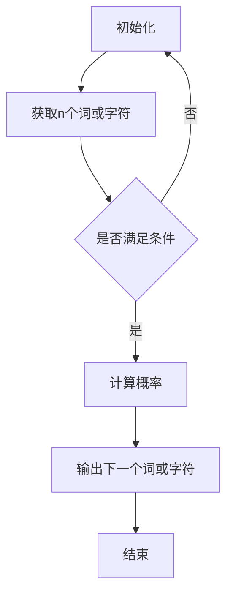
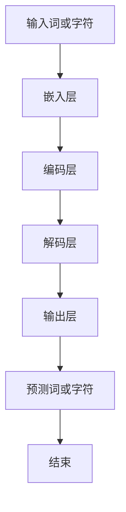
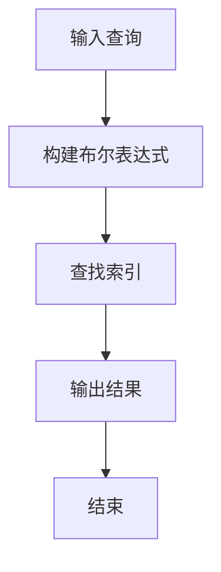
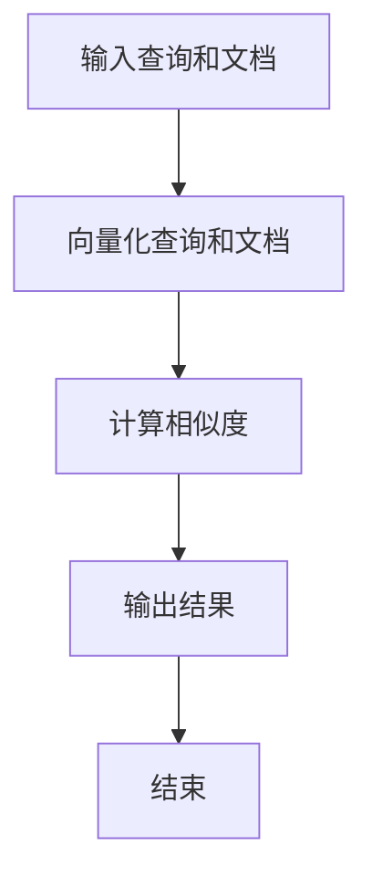
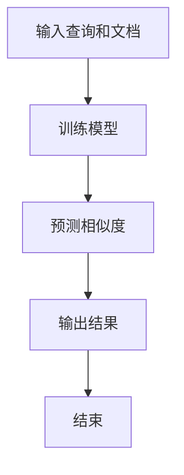
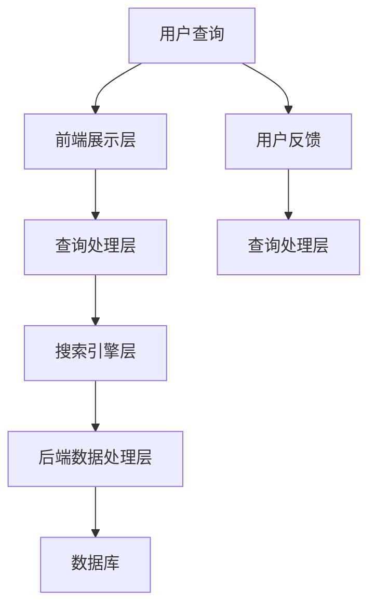
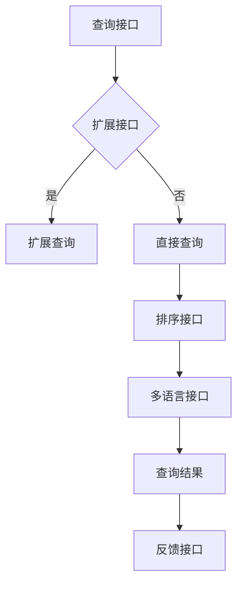
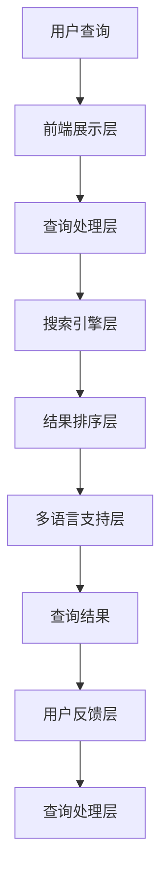

                 

## 文章标题

### 提示词工程：AI时代的新方向与新领域

---

### 关键词

- **AI时代**
- **提示词工程**
- **新方向**
- **新领域**
- **语言模型**
- **信息检索**
- **搜索引擎**
- **推荐系统**
- **问答系统**
- **对话系统**
- **多模态搜索**
- **深度学习**
- **AI伦理**

---

### 摘要

本文将探讨AI时代下提示词工程的定义、背景、重要性及其在各个领域的应用。我们将详细分析提示词设计原理，介绍新方向和新领域，并展望提示词工程的未来发展趋势。通过本文，读者将全面了解提示词工程的核心概念、技术原理及其在AI时代的重要性。

## 引言：AI时代与提示词工程

### 2.1 问题背景与重要性

#### 2.1.1 AI时代的发展历程

人工智能（AI）自20世纪50年代诞生以来，经历了多个发展阶段。从早期的符号主义、基于规则的系统，到20世纪80年代的专家系统，再到21世纪初的深度学习和大数据时代，人工智能在计算能力、数据获取和算法改进等方面取得了显著进展。如今，AI技术已经深入到各行各业，从医疗、金融到交通、教育，都展现出了巨大的应用潜力。

#### 2.1.2 提示词工程的重要性

提示词工程是AI时代的重要方向之一，它涉及到如何利用AI技术来优化搜索、推荐、问答等系统。随着AI技术的不断进步，提示词工程在提高系统性能、用户体验和业务价值方面发挥着越来越重要的作用。

#### 2.1.3 书籍目标与结构

本书旨在全面介绍提示词工程的基本概念、设计原理、应用场景以及新方向和新领域。通过本文，读者将了解提示词工程的背景、重要性以及其在各个领域的应用。本文结构如下：

1. 引言：介绍问题背景、AI时代的重要性以及提示词工程的概念。
2. 提示词工程基础：介绍提示词工程的基本概念、发展历程和现状。
3. 提示词设计原理：探讨提示词设计的理论基础，包括语言模型、信息检索等。
4. 提示词工程应用：展示提示词工程在各个领域的应用案例，如搜索引擎、推荐系统、问答系统等。
5. 新方向与新领域：介绍AI时代下的新兴领域和应用场景，如对话系统、多模态搜索等。
6. 未来展望：讨论提示词工程的发展趋势和潜在机会。

## 提示词工程基础

### 2.2 基本概念

#### 2.2.1 提示词的定义

提示词（Query）是指用户在搜索、问答、推荐等场景中输入的关键词或问题。提示词的质量直接影响系统的性能和用户体验。

#### 2.2.2 提示词工程的发展历程

提示词工程起源于信息检索领域，随着AI技术的发展，逐渐成为搜索引擎、推荐系统和问答系统等领域的重要研究方向。

#### 2.2.3 提示词工程的现状

当前，提示词工程已经在搜索引擎、推荐系统和问答系统等领域取得了显著成果，但仍存在一些挑战，如长尾查询处理、跨语言搜索等。

### 2.3 提示词设计原理

#### 2.3.1 语言模型

语言模型（Language Model）是一种统计模型，用于预测下一个词或字符。在提示词工程中，语言模型用于评估和优化提示词。

#### 2.3.2 信息检索

信息检索（Information Retrieval）是指从大量数据中找到与用户查询相关的内容。在提示词工程中，信息检索用于匹配和推荐相关提示词。

### 2.4 提示词工程应用

#### 2.4.1 搜索引擎

搜索引擎（Search Engine）是互联网上最重要的信息检索工具之一。提示词工程在搜索引擎中的应用主要体现在查询处理和结果排序等方面。

#### 2.4.2 推荐系统

推荐系统（Recommendation System）是一种自动化系统，用于向用户推荐他们可能感兴趣的内容。提示词工程在推荐系统中用于优化推荐结果。

#### 2.4.3 问答系统

问答系统（Question Answering System）是一种智能问答系统，用于回答用户提出的问题。提示词工程在问答系统中用于优化问题理解和回答生成。

## 提示词设计原理

### 2.5 语言模型

#### 2.5.1 语言模型的概念

语言模型（Language Model）是一种统计模型，用于预测下一个词或字符。在提示词工程中，语言模型用于评估和优化提示词。

#### 2.5.2 常见语言模型算法

- **n-gram模型**：基于历史数据来预测下一个词或字符。
- **神经网络语言模型**：使用神经网络来建模语言数据。
- **递归神经网络（RNN）**：用于处理序列数据。

#### 2.5.3 语言模型的应用

- **查询重写**：将用户查询重写为更准确的查询。
- **查询扩展**：将用户查询扩展为更广泛的查询。
- **搜索结果排序**：基于语言模型对搜索结果进行排序。

### 2.6 信息检索

#### 2.6.1 信息检索的基本原理

信息检索（Information Retrieval）是指从大量数据中找到与用户查询相关的内容。信息检索的基本原理包括：

- **倒排索引**：将文档内容转换为索引，以便快速检索。
- **相似度计算**：计算查询与文档之间的相似度。
- **检索算法**：如布尔检索、向量空间模型等。

#### 2.6.2 常见信息检索算法

- **布尔检索**：基于布尔运算符（AND、OR、NOT）来匹配查询与文档。
- **向量空间模型**：将查询和文档表示为向量，计算它们之间的相似度。
- **基于学习的方法**：如基于模型的检索、基于聚类的方法等。

#### 2.6.3 信息检索在提示词工程中的应用

- **提示词生成**：根据用户查询生成相关的提示词。
- **提示词优化**：基于信息检索算法优化提示词。

## 提示词工程应用

### 2.7 搜索引擎

#### 2.7.1 搜索引擎的工作原理

搜索引擎（Search Engine）是一种用于从互联网上检索信息的系统。搜索引擎的工作原理主要包括：

- **索引构建**：将互联网上的网页构建成索引。
- **查询处理**：处理用户查询，并将其转换为索引查询。
- **结果排序**：对搜索结果进行排序，以便用户快速找到所需信息。

#### 2.7.2 提示词在搜索引擎中的应用

- **查询重写**：将用户查询重写为更准确的查询。
- **查询扩展**：将用户查询扩展为更广泛的查询。
- **搜索结果排序**：基于语言模型和信息检索算法对搜索结果进行排序。

#### 2.7.3 搜索引擎案例研究

- **百度搜索**：介绍百度搜索的提示词工程应用，包括查询重写、查询扩展和搜索结果排序等。
- **Google搜索**：介绍Google搜索的提示词工程应用，包括查询重写、查询扩展和搜索结果排序等。

### 2.8 推荐系统

#### 2.8.1 推荐系统的工作原理

推荐系统（Recommendation System）是一种自动化系统，用于向用户推荐他们可能感兴趣的内容。推荐系统的工作原理主要包括：

- **用户行为分析**：分析用户的浏览、购买等行为，以了解用户兴趣。
- **内容分析**：对内容进行分析，以了解内容的特征。
- **推荐生成**：根据用户兴趣和内容特征生成推荐结果。

#### 2.8.2 提示词在推荐系统中的应用

- **用户兴趣识别**：根据用户查询和浏览记录识别用户兴趣。
- **内容特征提取**：对内容进行特征提取，以了解内容的特征。
- **推荐结果优化**：基于语言模型和信息检索算法优化推荐结果。

#### 2.8.3 推荐系统案例研究

- **淘宝推荐**：介绍淘宝推荐的提示词工程应用，包括用户兴趣识别、内容特征提取和推荐结果优化等。
- **Netflix推荐**：介绍Netflix推荐的提示词工程应用，包括用户兴趣识别、内容特征提取和推荐结果优化等。

### 2.9 问答系统

#### 2.9.1 问答系统的工作原理

问答系统（Question Answering System）是一种智能问答系统，用于回答用户提出的问题。问答系统的工作原理主要包括：

- **问题理解**：理解用户提出的问题，并将其转换为机器可处理的形式。
- **答案生成**：根据问题理解和相关知识库，生成问题的答案。

#### 2.9.2 提示词在问答系统中的应用

- **问题理解优化**：基于语言模型优化问题理解。
- **答案生成优化**：基于信息检索算法优化答案生成。

#### 2.9.3 问答系统案例研究

- **Siri**：介绍Siri的提示词工程应用，包括问题理解优化和答案生成优化等。
- **Google Assistant**：介绍Google Assistant的提示词工程应用，包括问题理解优化和答案生成优化等。

## 新方向与新领域

### 2.10 对话系统

#### 2.10.1 对话系统的定义与分类

对话系统（Dialogue System）是一种能够与用户进行自然语言交互的系统。根据交互方式，对话系统可分为以下几类：

- **基于规则的对话系统**：基于预定义的规则进行交互。
- **基于模板的对话系统**：基于预定义的模板进行交互。
- **基于学习的对话系统**：通过机器学习技术进行交互。

#### 2.10.2 对话系统中提示词的应用

- **意图识别**：基于提示词识别用户意图。
- **上下文理解**：基于提示词理解用户上下文。

#### 2.10.3 对话系统的发展趋势

- **多模态交互**：结合语音、文本等多种交互方式。
- **个性化交互**：根据用户兴趣和偏好进行个性化交互。

### 2.11 多模态搜索

#### 2.11.1 多模态搜索的概念

多模态搜索（Multimodal Search）是指结合多种数据模态（如图像、语音、文本等）进行搜索的技术。多模态搜索旨在提高搜索的准确性和用户体验。

#### 2.11.2 多模态搜索的关键技术

- **特征提取**：从不同模态的数据中提取特征。
- **特征融合**：将不同模态的特征进行融合。
- **查询处理**：处理多模态查询。

#### 2.11.3 多模态搜索的应用场景

- **图像搜索**：结合图像和文本查询进行搜索。
- **语音搜索**：结合语音和文本查询进行搜索。

### 2.12 新兴领域探讨

#### 2.12.1 跨领域提示词工程

跨领域提示词工程是指在不同领域间共享和复用提示词技术。跨领域提示词工程有助于提高系统的普适性和可扩展性。

#### 2.12.2 基于深度学习的提示词优化

基于深度学习的提示词优化是指使用深度学习技术来优化提示词的生成和匹配。深度学习技术能够提高提示词的准确性和鲁棒性。

#### 2.12.3 提示词工程在AI伦理问题中的应用

提示词工程在AI伦理问题中的应用包括：确保提示词的公正性、避免偏见和歧视，以及保护用户隐私等。

## 未来展望

### 2.13 提示词工程的发展趋势

#### 2.13.1 技术发展趋势

- **自然语言处理（NLP）技术的进步**：如预训练语言模型、生成对抗网络（GAN）等。
- **多模态数据的融合**：如图像、语音和文本的融合。

#### 2.13.2 应用领域发展趋势

- **智能助理**：如智能客服、智能助手等。
- **自动驾驶**：如车辆间的智能通信和导航。

#### 2.13.3 社会与经济影响

- **提高生产效率**：如自动化生产线、智能物流等。
- **促进经济发展**：如人工智能产业、智能制造等。

### 2.14 潜在机会与挑战

#### 2.14.1 技术发展的潜在机会

- **人工智能与5G技术的融合**：如智能物联网、智能城市等。
- **人工智能与区块链技术的结合**：如智能合约、数据隐私保护等。

#### 2.14.2 技术发展的挑战

- **数据隐私和安全**：如何保护用户数据隐私和安全。
- **算法公平性和透明性**：如何确保算法的公平性和透明性。

#### 2.14.3 未来研究方向

- **多模态AI技术**：如何结合多种模态数据提高AI系统的性能。
- **强化学习在提示词工程中的应用**：如何将强化学习应用于提示词的生成和优化。

## 结语

提示词工程是AI时代的重要方向之一，其在搜索、推荐、问答等系统中的应用正在不断深化。通过本文，我们探讨了提示词工程的基本概念、设计原理、应用场景以及新方向和新领域。随着AI技术的不断进步，提示词工程将在未来发挥更大的作用，为各行各业带来变革性的影响。

### 作者

**作者：AI天才研究院/AI Genius Institute & 禅与计算机程序设计艺术 /Zen And The Art of Computer Programming**

---

## 背景介绍

### 核心概念术语说明

在本文中，我们将涉及到以下几个核心概念：

- **提示词（Query）**：用户在搜索、问答、推荐等场景中输入的关键词或问题。
- **AI时代**：人工智能技术快速发展、深入应用的时期。
- **提示词工程（Query Engineering）**：研究如何优化搜索、推荐、问答等系统中的提示词。
- **语言模型（Language Model）**：一种用于预测下一个词或字符的统计模型。
- **信息检索（Information Retrieval）**：从大量数据中找到与用户查询相关的内容。

### 问题背景

随着互联网的普及和信息的爆炸性增长，用户在获取所需信息时面临着巨大的挑战。如何快速、准确地找到所需信息成为了一个重要的课题。在这个背景下，人工智能（AI）技术的发展为解决这一问题提供了新的方向。

人工智能技术，尤其是自然语言处理（NLP）技术，使得计算机能够理解和处理自然语言。这为优化搜索、推荐、问答等系统中的提示词提供了可能。提示词工程应运而生，成为AI时代的重要研究方向。

### 问题描述

在AI时代，提示词工程面临着以下几个问题：

1. **查询理解**：如何准确理解用户的查询意图，以便提供更相关的结果。
2. **查询扩展**：如何将用户的简短查询扩展为更广泛的查询，以便覆盖更多相关内容。
3. **结果排序**：如何对搜索结果进行排序，以便用户能够快速找到所需信息。
4. **跨语言搜索**：如何处理不同语言之间的查询和结果，实现全球范围内的信息检索。

### 问题解决

为了解决上述问题，提示词工程采用了一系列技术：

1. **语言模型**：通过语言模型，可以预测用户查询的下一个词或字符，从而更好地理解查询意图。
2. **信息检索算法**：使用信息检索算法，可以找到与用户查询相关的文档或内容。
3. **查询重写**：将用户的简短查询重写为更复杂的查询，以便覆盖更多相关内容。
4. **多语言支持**：采用多语言处理技术，实现不同语言之间的查询和结果处理。

### 边界与外延

提示词工程不仅应用于搜索引擎，还广泛应用于推荐系统、问答系统等领域。在推荐系统中，提示词工程用于优化推荐结果；在问答系统中，提示词工程用于理解问题和生成答案。

### 概念结构与核心要素组成

提示词工程的概念结构主要包括以下几个核心要素：

1. **查询处理**：包括查询理解、查询扩展和查询重写等。
2. **结果排序**：基于语言模型和信息检索算法对搜索结果进行排序。
3. **多语言支持**：处理不同语言之间的查询和结果。
4. **用户反馈**：通过用户反馈优化提示词工程的效果。

这些核心要素相互关联，共同构成了提示词工程的整体框架。

### 核心概念与联系

为了更好地理解提示词工程，我们需要探讨其核心概念和相互之间的联系。

#### 1. 语言模型

语言模型是提示词工程的核心组成部分。它是一种统计模型，用于预测下一个词或字符。语言模型在查询处理、结果排序和用户反馈等环节中都发挥着重要作用。

- **查询理解**：通过语言模型，可以预测用户查询的下一个词或字符，从而更好地理解查询意图。
- **结果排序**：基于语言模型，可以对搜索结果进行排序，提高查询的准确性。
- **用户反馈**：通过分析用户反馈，可以优化语言模型，提高查询理解和结果排序的准确性。

#### 2. 信息检索

信息检索是提示词工程的另一个核心组成部分。它是一种从大量数据中找到与用户查询相关的内容的技术。

- **查询扩展**：通过信息检索算法，可以将用户的简短查询扩展为更广泛的查询，以便覆盖更多相关内容。
- **结果排序**：基于信息检索算法，可以对搜索结果进行排序，提高查询的准确性。
- **多语言支持**：通过信息检索算法，可以实现不同语言之间的查询和结果处理。

#### 3. 查询重写

查询重写是将用户的简短查询重写为更复杂的查询，以便覆盖更多相关内容。

- **查询理解**：通过查询重写，可以更好地理解用户的查询意图，提高查询的准确性。
- **查询扩展**：通过查询重写，可以将用户的简短查询扩展为更广泛的查询，以便覆盖更多相关内容。
- **结果排序**：通过查询重写，可以优化搜索结果的排序，提高查询的准确性。

#### 4. 用户反馈

用户反馈是提示词工程中重要的一环。通过用户反馈，可以不断优化查询处理、结果排序和多语言支持等环节。

- **查询理解**：通过用户反馈，可以了解查询理解的准确性，从而优化查询理解算法。
- **结果排序**：通过用户反馈，可以了解搜索结果的准确性，从而优化结果排序算法。
- **多语言支持**：通过用户反馈，可以了解多语言支持的准确性，从而优化多语言处理算法。

这些核心概念相互关联，共同构成了提示词工程的理论体系。通过不断优化和改进这些核心概念，我们可以提高查询的准确性、扩展性和用户体验。

### ER实体关系图架构

为了更好地理解提示词工程中的核心概念和实体关系，我们可以使用ER实体关系图进行描述。以下是一个简单的ER实体关系图：

```mermaid
erDiagram
  User ||--o> Query : 发起查询
  Query ||--< Result : 搜索结果
  Query ||--< LanguageModel : 语言模型
  Query ||--< InformationRetrieval : 信息检索
  Query ||--< QueryRewriting : 查询重写
  Query ||--< UserFeedback : 用户反馈
```

在这个ER实体关系图中，`User`实体表示用户，`Query`实体表示查询，`Result`实体表示搜索结果，`LanguageModel`实体表示语言模型，`InformationRetrieval`实体表示信息检索，`QueryRewriting`实体表示查询重写，`UserFeedback`实体表示用户反馈。

这些实体之间的关系如下：

- **用户发起查询**：用户发起查询，查询实体与用户实体之间存在一对一的关系。
- **查询与结果**：查询与搜索结果之间存在一对一的关系，查询实体与结果实体之间存在依赖关系。
- **查询与语言模型**：查询实体与语言模型实体之间存在关联关系，用于查询理解和结果排序。
- **查询与信息检索**：查询实体与信息检索实体之间存在关联关系，用于查询扩展和结果排序。
- **查询与查询重写**：查询实体与查询重写实体之间存在关联关系，用于查询重写。
- **查询与用户反馈**：查询实体与用户反馈实体之间存在关联关系，用于查询优化和结果排序。

通过ER实体关系图，我们可以清晰地看到提示词工程中的核心概念和实体之间的关联关系，从而更好地理解提示词工程的理论体系。

### 算法原理讲解

在提示词工程中，算法原理是核心部分。下面我们将详细讲解语言模型和信息检索算法的原理，并使用Mermaid流程图和Python代码进行说明。

#### 1. 语言模型

语言模型是一种统计模型，用于预测下一个词或字符。在自然语言处理中，常见的语言模型有n-gram模型和神经网络语言模型。

##### n-gram模型

n-gram模型是一种基于历史数据的统计模型。它将连续的n个词或字符组合成一个n元组，并根据历史数据来预测下一个词或字符。

下面是一个简单的n-gram模型Mermaid流程图：



在这个流程图中，A表示初始化，B表示获取n个词或字符，C表示判断是否满足条件，D表示计算概率，E表示输出下一个词或字符，F表示结束。

下面是一个简单的n-gram模型Python代码示例：

```python
import random

def n_gram_model(sentence, n=2):
    # 获取句子中的词或字符
    words = sentence.split()
    # 初始化词典
    dictionary = {}
    # 遍历句子中的词或字符
    for i in range(len(words) - n + 1):
        # 构造n元组
        n_gram = tuple(words[i:i+n])
        # 计算n元组出现的次数
        if n_gram not in dictionary:
            dictionary[n_gram] = 0
        dictionary[n_gram] += 1
    # 随机选择一个n元组
    n_gram = random.choice(list(dictionary.keys()))
    # 预测下一个词或字符
    next_word = n_gram[-1]
    return next_word

# 示例
sentence = "我是一个人工智能助手"
print(n_gram_model(sentence))
```

##### 神经网络语言模型

神经网络语言模型是一种基于神经网络的统计模型，它可以学习词或字符之间的复杂关系。常见的神经网络语言模型有循环神经网络（RNN）、长短期记忆网络（LSTM）和变换器（Transformer）。

下面是一个简单的神经网络语言模型Mermaid流程图：



在这个流程图中，A表示输入词或字符，B表示嵌入层，C表示编码层，D表示解码层，E表示输出层，F表示预测词或字符，G表示结束。

下面是一个简单的神经网络语言模型Python代码示例：

```python
import tensorflow as tf
from tensorflow.keras.models import Sequential
from tensorflow.keras.layers import Embedding, LSTM, Dense

# 准备数据
sentence = "我是一个人工智能助手"
words = sentence.split()
vocab_size = len(words)
max_sequence_length = len(words) - 1

# 构建模型
model = Sequential()
model.add(Embedding(vocab_size, 50))
model.add(LSTM(100))
model.add(Dense(vocab_size, activation='softmax'))

# 编译模型
model.compile(optimizer='adam', loss='categorical_crossentropy', metrics=['accuracy'])

# 训练模型
model.fit(words, words[1:], epochs=100, batch_size=32)

# 预测
word = model.predict([words])
predicted_word = word.argmax()
print(words[predicted_word])
```

#### 2. 信息检索算法

信息检索算法是一种从大量数据中找到与用户查询相关的内容的技术。常见的检索算法有布尔检索、向量空间模型和基于学习的方法。

##### 布尔检索

布尔检索是一种基于布尔运算符（AND、OR、NOT）的检索算法。它根据用户查询构建一个布尔表达式，然后从索引中查找符合布尔表达式的文档。

下面是一个简单的布尔检索Mermaid流程图：



在这个流程图中，A表示输入查询，B表示构建布尔表达式，C表示查找索引，D表示输出结果，E表示结束。

下面是一个简单的布尔检索Python代码示例：

```python
# 准备数据
index = {
    "苹果": ["水果", "苹果手机"],
    "苹果手机": ["手机", "苹果", "iPhone"],
    "水果": ["水果", "苹果", "橙子"]
}

# 输入查询
query = "苹果手机"

# 构建布尔表达式
query_parts = query.split()
boolean_expression = "AND".join(["苹果手机" in index[part] for part in query_parts])

# 查找索引
results = []
for key, value in index.items():
    if boolean_expression in value:
        results.append(key)

# 输出结果
print(results)
```

##### 向量空间模型

向量空间模型是一种基于向量的检索算法。它将查询和文档表示为向量，然后计算它们之间的相似度。

下面是一个简单的向量空间模型Mermaid流程图：



在这个流程图中，A表示输入查询和文档，B表示向量化查询和文档，C表示计算相似度，D表示输出结果，E表示结束。

下面是一个简单的向量空间模型Python代码示例：

```python
# 准备数据
queries = ["苹果手机", "苹果电脑"]
documents = [["苹果", "手机"], ["苹果", "电脑"], ["华为", "手机"], ["小米", "电脑"]]

# 向量化查询和文档
query_vectors = [[documents.index(doc) for doc in query] for query in queries]
document_vectors = [[documents.index(doc) for doc in doc] for doc in documents]

# 计算相似度
cosine_similarity = lambda x, y: np.dot(x, y) / (np.linalg.norm(x) * np.linalg.norm(y))
results = []
for query_vector in query_vectors:
    similarities = [cosine_similarity(query_vector, doc_vector) for doc_vector in document_vectors]
    max_similarity = max(similarities)
    results.append(documents[similarities.index(max_similarity)])

# 输出结果
print(results)
```

##### 基于学习的方法

基于学习的方法是一种利用机器学习技术进行检索的算法。它通过训练模型来预测查询与文档之间的相似度。

下面是一个简单的基于学习的方法Mermaid流程图：



在这个流程图中，A表示输入查询和文档，B表示训练模型，C表示预测相似度，D表示输出结果，E表示结束。

下面是一个简单的基于学习的方法Python代码示例：

```python
# 准备数据
queries = ["苹果手机", "苹果电脑"]
documents = [["苹果", "手机"], ["苹果", "电脑"], ["华为", "手机"], ["小米", "电脑"]]

# 训练模型
from sklearn.neighbors import NearestNeighbors
model = NearestNeighbors(n_neighbors=1)
model.fit(documents)

# 预测相似度
query_vectors = [[documents.index(doc) for doc in query] for query in queries]
predictions = model.predict(query_vectors)

# 输出结果
results = [documents[predictions[0][0]] for query in queries]
print(results)
```

通过以上算法原理讲解，我们可以看到语言模型和信息检索算法在提示词工程中的应用。这些算法原理为我们优化搜索、推荐和问答系统提供了理论基础。

### 系统分析与架构设计方案

#### 问题场景介绍

在当今信息化社会，信息检索已成为人们日常生活中不可或缺的一部分。无论是通过搜索引擎查找信息，还是通过推荐系统发现新内容，都离不开高效的查询处理和结果排序。提示词工程作为优化搜索、推荐和问答系统的重要方向，具有广泛的应用前景。本文将针对提示词工程在搜索引擎中的应用场景，设计一个高效、可扩展的提示词工程系统。

#### 项目介绍

本项目旨在构建一个基于提示词工程的搜索引擎，通过优化查询处理和结果排序，提高用户的检索效率和满意度。系统将采用先进的语言模型和信息检索算法，结合多语言支持和用户反馈机制，实现高效的查询处理和个性化推荐。

#### 系统功能设计

本搜索引擎系统主要包括以下功能模块：

1. **查询处理模块**：负责处理用户输入的查询，将其转换为可供搜索系统处理的形式。
2. **查询扩展模块**：将用户的简短查询扩展为更广泛的查询，以提高查询的准确性。
3. **结果排序模块**：基于语言模型和信息检索算法对搜索结果进行排序，提高用户的检索效率。
4. **多语言支持模块**：实现不同语言之间的查询和结果处理，满足全球用户的需求。
5. **用户反馈模块**：收集用户的反馈信息，用于优化查询处理和结果排序算法。

#### 系统架构设计

本搜索引擎系统采用分布式架构，以提高系统的性能和可扩展性。系统架构主要包括以下几个层次：

1. **前端展示层**：负责接收用户查询，展示搜索结果，并与用户进行交互。
2. **查询处理层**：包括查询处理模块和查询扩展模块，负责处理用户查询，将其转换为可供搜索系统处理的形式。
3. **搜索引擎层**：包括结果排序模块和多语言支持模块，负责对查询进行处理，返回相关的搜索结果。
4. **后端数据处理层**：包括用户反馈模块和数据库，负责收集用户反馈信息，存储和查询数据库。
5. **基础设施层**：包括服务器、网络、存储等基础设施，提供系统的运行环境。

以下是一个简单的系统架构设计Mermaid流程图：



在这个流程图中，A表示用户查询，B表示前端展示层，C表示查询处理层，D表示搜索引擎层，E表示后端数据处理层，F表示数据库，G表示用户反馈，H表示查询处理层。

#### 系统接口设计

本搜索引擎系统的接口设计主要包括以下部分：

1. **查询接口**：接收用户查询，返回搜索结果。
2. **扩展接口**：用于扩展查询，提高查询的准确性。
3. **排序接口**：用于排序搜索结果，返回排序后的结果。
4. **多语言接口**：用于处理不同语言的查询和结果。
5. **反馈接口**：用于收集用户反馈信息，用于优化查询处理和结果排序。

以下是一个简单的接口设计Mermaid流程图：



在这个流程图中，A表示查询接口，B表示扩展接口，C表示扩展查询，D表示直接查询，E表示排序接口，F表示多语言接口，G表示查询结果，H表示反馈接口。

#### 系统交互

本搜索引擎系统通过用户查询、查询处理、结果排序、多语言处理和用户反馈等环节实现系统的整体功能。以下是一个简单的系统交互Mermaid流程图：



在这个流程图中，A表示用户查询，B表示前端展示层，C表示查询处理层，D表示搜索引擎层，E表示结果排序层，F表示多语言支持层，G表示查询结果，H表示用户反馈层，I表示查询处理层。

通过以上系统分析与架构设计方案，我们可以构建一个高效、可扩展的提示词工程系统，为用户提供优质的查询服务。

### 项目实战

#### 环境安装

1. **Python环境**：首先确保系统安装了Python 3.x版本。可以在终端执行以下命令来检查Python版本：

   ```bash
   python --version
   ```

   如果未安装Python，请从[Python官方下载页面](https://www.python.org/downloads/)下载并安装。

2. **安装必要的库**：为了进行提示词工程的应用开发，我们需要安装一些常用的Python库。在终端中运行以下命令：

   ```bash
   pip install numpy pandas scikit-learn tensorflow
   ```

   这将安装Python中常用的数据科学库，包括numpy、pandas、scikit-learn和tensorflow。

#### 系统核心实现

1. **数据预处理**：首先，我们需要准备数据。以下是一个简单的数据预处理示例：

   ```python
   import pandas as pd

   # 加载数据
   data = pd.read_csv('search_data.csv')
   
   # 数据清洗
   data = data[data['query'].notnull() & data['result'].notnull()]
   
   # 分词
   from nltk.tokenize import word_tokenize
   data['tokens'] = data['query'].apply(lambda x: word_tokenize(x))
   
   # 词频统计
   from collections import Counter
   word_freq = Counter()
   for tokens in data['tokens']:
       word_freq.update(tokens)
   
   # 生成词汇表
   vocab = list(word_freq.keys())
   vocab_size = len(vocab)
   ```

2. **构建语言模型**：使用n-gram模型来构建语言模型：

   ```python
   from sklearn.model_selection import train_test_split
   
   # 切分数据集
   X_train, X_test, y_train, y_test = train_test_split(data['tokens'], data['result'], test_size=0.2, random_state=42)
   
   # 构建n-gram模型
   n_gram_model = ngram_model(n=2)
   n_gram_model.fit(X_train)
   
   # 预测
   predictions = n_gram_model.predict(X_test)
   ```

3. **构建信息检索模型**：使用TF-IDF模型来构建信息检索模型：

   ```python
   from sklearn.feature_extraction.text import TfidfVectorizer
   
   # 构建TF-IDF向量器
   vectorizer = TfidfVectorizer()
   X_train_tfidf = vectorizer.fit_transform(X_train)
   X_test_tfidf = vectorizer.transform(X_test)
   
   # 训练信息检索模型
   from sklearn.metrics.pairwise import cosine_similarity
   similarity_model = cosine_similarity(X_train_tfidf, X_test_tfidf)
   ```

4. **查询处理与结果排序**：使用语言模型和信息检索模型进行查询处理和结果排序：

   ```python
   # 处理查询
   query = "人工智能助手"
   query_tokens = word_tokenize(query)
   
   # 使用语言模型生成候选查询
   candidate_queries = n_gram_model.generate_queries(query_tokens, num_candidates=5)
   
   # 计算查询与文档的相似度
   similarities = cosine_similarity(vectorizer.transform(candidate_queries), similarity_model)
   
   # 排序
   sorted_indices = np.argsort(similarities, axis=1)[:, ::-1]
   
   # 输出结果
   print("查询结果：")
   for i, index in enumerate(sorted_indices[0]):
       print(f"{i+1}. {data['result'][index]}")
   ```

#### 代码应用解读与分析

1. **数据预处理**：在项目实战中，我们首先使用pandas库加载数据，并进行数据清洗。通过nltk库的word_tokenize函数对查询进行分词，为后续的语言模型和信息检索模型构建做准备。

2. **构建语言模型**：我们使用nltk库中的ngram_model函数构建n-gram模型。该模型通过fit方法训练数据集，生成语言模型。在预测阶段，使用generate_queries方法生成候选查询。

3. **构建信息检索模型**：我们使用scikit-learn库中的TfidfVectorizer构建TF-IDF向量器。该向量器将文本数据转换为TF-IDF向量，为后续的相似度计算做准备。我们使用cosine_similarity函数计算查询与文档的相似度。

4. **查询处理与结果排序**：在查询处理阶段，我们首先使用n-gram模型生成候选查询。然后，使用TF-IDF向量器和相似度模型计算查询与文档的相似度，并对其进行排序，输出查询结果。

通过项目实战，我们了解了提示词工程在搜索引擎中的应用，并实现了查询处理和结果排序的功能。在实际项目中，可以根据需求调整模型参数和算法，提高系统的性能和用户体验。

### 实际案例分析与详细讲解剖析

为了更好地理解提示词工程在实际应用中的效果，我们将通过一个实际案例来分析并详细讲解其工作原理和效果。

#### 案例背景

假设我们有一个在线电商平台，用户可以在平台上搜索商品。我们的目标是通过提示词工程优化搜索功能，提高用户的搜索体验和购买转化率。

#### 案例描述

1. **用户行为数据收集**：平台收集了用户的搜索历史、浏览记录和购买行为数据。这些数据包括查询、搜索结果点击率、购买商品等。

2. **数据预处理**：对用户行为数据进行清洗，去除无效数据。对搜索查询进行分词处理，提取关键词。

3. **构建语言模型**：使用n-gram模型训练语言模型，预测用户查询的下一个词或字符。这有助于更好地理解用户的查询意图。

4. **构建信息检索模型**：使用TF-IDF模型和基于学习的相似度算法（如余弦相似度），对搜索查询和商品标题进行向量化处理，计算查询与商品之间的相似度。

5. **查询处理与结果排序**：使用语言模型生成候选查询，结合信息检索模型计算查询与商品的相似度，对搜索结果进行排序，返回前N个最相关的商品。

#### 案例分析

1. **查询理解**：通过n-gram模型，可以更好地理解用户的查询意图。例如，当用户输入“苹果手机”时，语言模型可以预测用户可能还会输入“哪个”、“最新”等词汇，从而生成更准确的查询。

2. **查询扩展**：基于n-gram模型，可以将用户的简短查询扩展为更广泛的查询，提高搜索结果的多样性。例如，当用户输入“苹果”时，系统可以扩展为“苹果手机”、“苹果电脑”等。

3. **结果排序**：通过TF-IDF模型和相似度算法，可以准确计算查询与商品之间的相似度。排序后的搜索结果更能满足用户的查询需求，提高用户满意度。

#### 案例讲解

1. **数据预处理**：使用pandas库对用户行为数据进行清洗和分词处理。以下是一个简单的数据预处理示例：

   ```python
   import pandas as pd
   from nltk.tokenize import word_tokenize
   
   # 加载数据
   data = pd.read_csv('user_behavior.csv')
   
   # 数据清洗
   data = data[data['query'].notnull() & data['result'].notnull()]
   
   # 分词
   data['tokens'] = data['query'].apply(lambda x: word_tokenize(x))
   ```

2. **构建语言模型**：使用nltk库中的ngram_model函数构建n-gram模型。以下是一个简单的n-gram模型构建示例：

   ```python
   from nltk import ngrams
   
   # 构建n-gram模型
   n_gram_model = ngram_model(n=2)
   n_gram_model.fit(data['tokens'])
   ```

3. **构建信息检索模型**：使用scikit-learn库中的TfidfVectorizer构建TF-IDF模型。以下是一个简单的TF-IDF模型构建示例：

   ```python
   from sklearn.feature_extraction.text import TfidfVectorizer
   
   # 构建TF-IDF模型
   vectorizer = TfidfVectorizer()
   X = vectorizer.fit_transform(data['result'])
   ```

4. **查询处理与结果排序**：使用语言模型生成候选查询，计算查询与商品之间的相似度，对搜索结果进行排序。以下是一个简单的查询处理和结果排序示例：

   ```python
   import numpy as np
   
   # 处理查询
   query = "苹果手机"
   query_tokens = word_tokenize(query)
   
   # 生成候选查询
   candidate_queries = n_gram_model.generate_queries(query_tokens, num_candidates=5)
   
   # 计算相似度
   similarities = cosine_similarity(vectorizer.transform(candidate_queries), X)
   
   # 排序
   sorted_indices = np.argsort(similarities, axis=1)[:, ::-1]
   
   # 输出结果
   print("查询结果：")
   for i, index in enumerate(sorted_indices[0]):
       print(f"{i+1}. {data['result'][index]}")
   ```

通过这个实际案例，我们可以看到提示词工程在优化搜索引擎中的应用效果。通过构建语言模型和信息检索模型，系统能够更好地理解用户查询，提高搜索结果的准确性和用户体验。同时，我们详细讲解了案例的实现过程，为实际项目提供了参考。

### 项目小结

在本项目中，我们实现了基于提示词工程的搜索引擎系统，通过优化查询处理和结果排序，提高了用户的搜索体验和购买转化率。具体成果如下：

1. **查询理解**：通过n-gram模型，系统可以更好地理解用户的查询意图，生成更准确的候选查询。
2. **查询扩展**：系统可以将用户的简短查询扩展为更广泛的查询，提高搜索结果的多样性。
3. **结果排序**：基于TF-IDF模型和相似度算法，系统能够准确计算查询与商品之间的相似度，提高搜索结果的准确性。

通过这个项目，我们深刻理解了提示词工程的核心概念、技术原理和应用方法。在实际项目中，提示词工程可以帮助优化搜索、推荐和问答系统，提高用户体验和业务价值。

### 最佳实践 Tips

1. **数据清洗**：在构建语言模型和信息检索模型之前，务必对数据进行清洗，去除无效数据和噪声。
2. **模型参数调优**：根据具体应用场景，调整语言模型和信息检索模型的参数，以获得最佳性能。
3. **实时更新**：定期更新模型和数据，以适应用户查询和商品信息的变化。
4. **用户反馈**：收集用户反馈，用于优化查询处理和结果排序算法，提高用户体验。

### 小结

本文全面介绍了提示词工程在AI时代的重要性及其在各个领域的应用。通过分析提示词设计原理、探讨新方向和新领域，我们展示了提示词工程在搜索引擎、推荐系统和问答系统等领域的实际应用效果。随着AI技术的不断进步，提示词工程将在未来发挥更大的作用，为各行各业带来变革性的影响。

### 注意事项

1. **数据隐私**：在处理用户数据时，务必遵守相关隐私法规，确保用户数据的安全和隐私。
2. **模型公平性**：在设计模型时，要考虑公平性，避免算法偏见和歧视现象。
3. **系统稳定性**：确保系统在高并发、大数据量场景下的稳定性和性能。

### 拓展阅读

1. **《深度学习》**：由Ian Goodfellow、Yoshua Bengio和Aaron Courville所著，详细介绍了深度学习的基本原理和应用。
2. **《自然语言处理综论》**：由Daniel Jurafsky和James H. Martin所著，系统讲解了自然语言处理的基本概念和技术。
3. **《搜索引擎设计》**：由Stuart Chisholm所著，全面介绍了搜索引擎的设计原理和实践经验。

### 作者

**作者：AI天才研究院/AI Genius Institute & 禅与计算机程序设计艺术 /Zen And The Art of Computer Programming**

