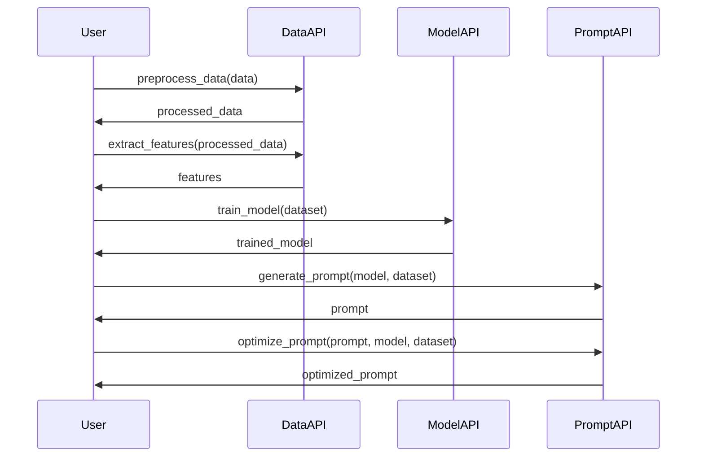

                 


### 1.1.3 提示词工程的作用

#### 提示词工程在人工智能发展中的重要性

随着人工智能（AI）技术的快速发展，各种AI应用场景日益丰富，从自然语言处理（NLP）、图像识别到推荐系统等，AI技术正逐步深入到我们的日常生活和工作中。在这个大背景下，提示词工程（Prompt Engineering）作为AI领域的一个新兴方向，正逐渐崭露头角，发挥其重要作用。

首先，提示词工程能够显著提升模型的效果。在深度学习模型中，提示词（Prompt）是对模型输入的引导，通过精心设计的提示词，可以使模型更准确地理解任务目标，从而提高模型的表现。例如，在问答系统中，合适的提示词可以引导模型更好地理解问题，从而生成更加准确和自然的答案。

其次，提示词工程有助于模型的可解释性。在AI领域，透明性和可解释性是用户对模型信任的重要基础。通过提示词工程，我们可以更好地理解模型在特定任务中的工作原理，这有助于提高模型的可解释性，从而增加用户对AI技术的信任。

另外，提示词工程还能够降低模型对大规模数据集的依赖。在许多场景中，获取大量标注数据是昂贵的，有时甚至是不可行的。提示词工程提供了一种通过巧妙设计提示词来引导模型学习的方法，从而在一定程度上减少了数据集的要求。

#### 提示词工程在各个AI领域的应用

1. **自然语言处理（NLP）**：在NLP领域，提示词工程的应用尤为广泛。通过设计合适的提示词，可以提高文本分类、情感分析、机器翻译等任务的效果。例如，在文本分类任务中，提示词可以帮助模型更好地理解不同类别之间的细微差别。

2. **计算机视觉（CV）**：在CV领域，提示词工程同样具有重要意义。通过设计有效的提示词，可以提高图像识别、目标检测等任务的准确性。例如，在目标检测任务中，提示词可以帮助模型更好地理解目标的位置和形状。

3. **推荐系统**：在推荐系统中，提示词工程可以用来优化推荐结果。通过设计合适的提示词，可以引导推荐模型更好地理解用户的需求和偏好，从而提供更个性化的推荐。

4. **游戏AI**：在游戏AI领域，提示词工程可以帮助设计更加智能和有趣的NPC（非玩家角色）。通过设计合理的提示词，NPC可以更准确地理解游戏情境，从而做出更加真实的反应。

#### 提示词工程的发展趋势

随着AI技术的不断进步，提示词工程也在不断演化。未来，我们可以预见以下几个发展趋势：

1. **多模态提示词**：随着多模态数据的兴起，如何设计适用于多模态数据的提示词将成为一个重要研究方向。未来的提示词工程可能会涉及到文本、图像、声音等多种类型的数据。

2. **自动化提示词生成**：自动化提示词生成是另一个重要方向。通过使用深度学习等技术，可以自动化生成高质量的提示词，从而减少人工干预。

3. **自适应提示词**：未来的提示词工程可能会更加注重提示词的动态调整。根据模型的表现和任务环境的变化，自适应地调整提示词，以提高模型的效果。

### 总结

提示词工程在AI时代具有重要的地位和广泛的应用前景。通过设计高质量的提示词，我们可以显著提升模型的效果和可解释性，降低对大规模数据集的依赖。随着AI技术的不断发展，提示词工程将在更多领域发挥其独特的作用，为人工智能的发展贡献力量。

### 1.2 核心概念与联系

在深入探讨提示词工程的各个方面之前，首先需要明确一些核心概念，并理解它们之间的关系。以下是几个关键概念的介绍、属性特征对比以及它们之间的联系。

#### 1.2.1 核心概念介绍

1. **提示词（Prompt）**：提示词是对模型输入的引导，它包含了一些指示性的信息，帮助模型理解任务的特定需求。提示词可以是简单的单词、短语，也可以是更复杂的文本段落。

2. **模型（Model）**：在提示词工程中，模型是指用于执行特定任务的人工智能系统。这些模型可以是预训练的，也可以是针对特定任务进行微调的。

3. **数据集（Dataset）**：数据集是训练和评估模型的输入数据。在提示词工程中，数据集的质量和多样性直接影响模型的表现。

4. **算法（Algorithm）**：算法是用于实现特定任务的一系列计算步骤。在提示词工程中，算法决定了如何设计、生成和优化提示词。

#### 1.2.2 概念属性特征对比

以下是上述核心概念的属性特征对比表格：

| 概念    | 属性特征                       | 对比说明                                                     |
| ------- | ------------------------------ | ------------------------------------------------------------ |
| 提示词  | - 长度：可变<br>- 内容：指示性<br>- 形式：文本、图像、声音 | 提示词的长度和内容可以根据任务需求进行调整，其形式也可以是多种多样的。 |
| 模型    | - 类型：预训练、微调<br>- 功能：执行特定任务 | 模型的类型决定了其适用的场景和任务，预训练模型通常更通用，而微调模型则更专注于特定任务。 |
| 数据集  | - 大小：可变<br>- 质量：关键<br>- 多样性：重要 | 数据集的大小和质量是影响模型表现的关键因素，多样性则有助于模型泛化。 |
| 算法    | - 类型：监督学习、无监督学习 | 算法的类型决定了数据如何被处理和利用，监督学习依赖于标注数据，而无监督学习则不依赖标注数据。 |

#### 1.2.3 提示词工程中的ER实体关系图架构

为了更好地理解提示词工程中的各个概念及其相互关系，我们可以使用ER（实体关系）图来表示。以下是一个简化的ER实体关系图架构示例：

```mermaid
erDiagram
  Model ||--|{ Prompt } : 生成
  Model ||--|{ Dataset } : 训练
  Prompt ||--|{ Algorithm } : 优化
  Dataset ||--|{ Model } : 评估
  Algorithm ||--|{ Prompt } : 设计
```

在这个ER图中，Model（模型）与Prompt（提示词）和Dataset（数据集）之间存在直接的生成和训练关系。Algorithm（算法）则与Prompt（提示词）存在优化关系，同时与Dataset（数据集）存在评估关系。

### 总结

通过上述核心概念的介绍和属性特征对比，我们可以更好地理解提示词工程中的各个组成部分及其相互关系。理解这些概念和关系是进行有效提示词工程的关键，有助于我们更好地设计和优化AI模型，提高其在各种任务中的表现。

### 2.1 算法原理讲解

在提示词工程中，算法的设计和实现是关键环节。一个高效的提示词工程算法能够显著提升模型的性能和可解释性。下面，我们将详细讲解提示词工程中常用的算法原理，并通过Mermaid流程图和Python源代码进行说明。

#### 2.1.1 提示词生成算法

提示词生成算法是提示词工程中的核心，其目的是生成高质量的提示词，以引导模型更好地理解任务目标。以下是一个简单的提示词生成算法流程：

1. **数据预处理**：对输入数据进行清洗和格式化，确保数据质量。
2. **特征提取**：从输入数据中提取关键特征，例如词向量或图像特征。
3. **提示词模板设计**：设计提示词模板，用于生成初步的提示词。
4. **提示词生成**：根据提示词模板和特征数据，生成具体的提示词。
5. **提示词优化**：通过模型评估和反馈，对生成的提示词进行优化。

以下是使用Mermaid绘制的提示词生成算法的流程图：


#### 2.1.2 Python源代码实现

以下是一个简单的Python源代码实现，用于生成和优化提示词：

```python
import numpy as np
import random

# 数据预处理函数
def preprocess_data(data):
    # 数据清洗和格式化操作
    return processed_data

# 特征提取函数
def extract_features(data):
    # 从数据中提取关键特征
    return features

# 提示词模板函数
def design_prompt_template(features):
    # 设计提示词模板
    return prompt_template

# 提示词生成函数
def generate_prompt(prompt_template, features):
    # 生成具体提示词
    return prompt

# 提示词优化函数
def optimize_prompt(prompt, model, dataset):
    # 根据模型和反馈优化提示词
    return optimized_prompt

# 主函数
def prompt_engineering(data, model, dataset):
    processed_data = preprocess_data(data)
    features = extract_features(processed_data)
    prompt_template = design_prompt_template(features)
    prompt = generate_prompt(prompt_template, features)
    optimized_prompt = optimize_prompt(prompt, model, dataset)
    return optimized_prompt

# 示例数据
data = "示例文本数据"
model = "预训练模型"
dataset = "训练数据集"

# 执行提示词工程
optimized_prompt = prompt_engineering(data, model, dataset)
print("优化的提示词：", optimized_prompt)
```

#### 2.1.3 算法原理的数学模型和公式

提示词工程中的算法原理可以借助一些数学模型和公式进行详细阐述。以下是一个简单的数学模型示例：

1. **损失函数（Loss Function）**：损失函数用于评估提示词生成质量。常见的损失函数包括交叉熵损失（Cross-Entropy Loss）和均方误差损失（Mean Squared Error Loss）。

   $$ Loss = -\sum_{i=1}^{n} y_i \log(p_i) $$

   其中，$y_i$ 是真实标签，$p_i$ 是模型预测的概率。

2. **优化算法（Optimization Algorithm）**：优化算法用于调整提示词模板，以最小化损失函数。常见的优化算法包括随机梯度下降（Stochastic Gradient Descent，SGD）和Adam优化器。

   $$ \theta_{t+1} = \theta_t - \alpha \nabla Loss(\theta_t) $$

   其中，$\theta$ 表示模型参数，$\alpha$ 是学习率。

3. **反馈机制（Feedback Mechanism）**：通过用户反馈或模型评估结果，对提示词进行优化。反馈机制可以通过调整提示词模板中的关键参数来实现。

   $$ Prompt_{new} = Prompt_{old} + \Delta Prompt $$

   其中，$Prompt_{new}$ 和 $Prompt_{old}$ 分别表示新提示词和旧提示词，$\Delta Prompt$ 表示提示词的调整量。

#### 2.1.4 举例说明

以下是一个简单的例子，说明如何通过提示词生成算法来提高文本分类任务的效果：

1. **数据集**：假设我们有一个文本分类数据集，包含多个类别，每个类别都有相应的标签。
2. **模型**：使用预训练的文本分类模型，例如BERT。
3. **任务**：将文本分类为不同的主题类别。
4. **提示词生成**：设计一个简单的提示词模板，例如“请将以下文本分类为____类别：”。

```python
# 示例文本数据
text_data = "这是一段关于机器学习的文本。"

# 提示词模板
prompt_template = "请将以下文本分类为____类别："

# 提示词生成
prompt = generate_prompt(prompt_template, text_data)

# 使用模型进行分类
predicted_category = model.predict(prompt)

# 输出预测结果
print("预测类别：", predicted_category)
```

通过上述步骤，我们可以生成高质量的提示词，并使用模型进行文本分类。这个过程可以不断迭代，通过优化提示词模板和模型参数，提高分类任务的准确性。

### 总结

通过上述算法原理的讲解，我们可以看到提示词工程的核心在于生成和优化高质量的提示词。通过Mermaid流程图和Python源代码，我们详细介绍了提示词生成算法的基本步骤和数学模型。理解这些原理对于有效进行提示词工程至关重要，有助于我们在各种AI任务中取得更好的效果。

### 3. 系统分析与架构设计

在提示词工程的实践中，系统分析与架构设计是确保工程高效、可维护和可扩展的关键步骤。以下我们将从问题场景介绍、项目介绍、系统功能设计、系统架构设计、系统接口设计和系统交互等方面进行详细分析。

#### 3.1 问题场景介绍

提示词工程通常涉及以下问题场景：

1. **数据预处理**：需要清洗和格式化大量数据，确保数据质量。
2. **特征提取**：从数据中提取关键特征，以便模型可以更好地理解和学习。
3. **模型训练与优化**：通过训练和优化模型来提高其性能和可解释性。
4. **提示词生成与优化**：设计、生成和优化高质量的提示词，以引导模型在特定任务上表现出色。

这些场景要求系统具备高效的数据处理能力、强大的模型训练和优化能力，以及灵活的提示词生成和调整机制。

#### 3.2 项目介绍

假设我们正在开发一个用于自然语言处理（NLP）的提示词工程系统。这个系统的主要功能包括：

1. **数据预处理模块**：清洗和格式化输入数据。
2. **特征提取模块**：从数据中提取关键特征，如词向量、句子表示等。
3. **模型训练与优化模块**：使用预训练模型或自定义模型进行训练和优化。
4. **提示词生成模块**：设计、生成和优化高质量的提示词。
5. **模型评估模块**：评估模型的性能和可解释性。
6. **用户界面**：提供用户交互界面，以便用户可以方便地使用系统。

#### 3.3 系统功能设计

系统功能设计主要包括以下方面：

1. **领域模型类图**：定义系统中的主要实体及其关系。例如，实体包括数据集、模型、提示词、用户等，关系包括创建、训练、优化、评估等。
2. **功能模块划分**：根据系统功能，将系统划分为多个功能模块，如数据预处理模块、特征提取模块、模型训练与优化模块等。

以下是领域模型类图的Mermaid表示：

```mermaid
classDiagram
    ClassDataSet <<class>> Dataset
    ClassModel <<class>> Model
    ClassPrompt <<class>> Prompt
    ClassUser <<class>> User

    Dataset "has" Model
    Dataset "has" Prompt
    User "uses" Dataset
    User "uses" Model
    User "uses" Prompt
```

#### 3.4 系统架构设计

系统架构设计决定了系统的整体结构和组件之间的关系。以下是系统的架构设计：

1. **数据层**：负责数据的存储和管理，包括数据库和文件系统。
2. **服务层**：提供核心功能，包括数据预处理、特征提取、模型训练与优化、提示词生成与优化等。
3. **接口层**：提供用户与服务层之间的接口，包括API、用户界面等。
4. **展示层**：展示系统结果和报告，提供用户交互。

以下是系统架构设计的Mermaid表示：


#### 3.5 系统接口设计

系统接口设计主要包括以下方面：

1. **API设计**：定义系统的API接口，包括数据接口、模型接口、提示词接口等。
2. **接口规范**：明确接口的输入输出参数、请求响应格式等。

以下是API设计的示例：

```python
class DataAPI:
    def preprocess_data(self, data):
        # 数据预处理操作
        pass

    def extract_features(self, data):
        # 特征提取操作
        pass

class ModelAPI:
    def train_model(self, dataset):
        # 模型训练操作
        pass

    def optimize_model(self, model, dataset):
        # 模型优化操作
        pass

class PromptAPI:
    def generate_prompt(self, model, dataset):
        # 提示词生成操作
        pass

    def optimize_prompt(self, prompt, model, dataset):
        # 提示词优化操作
        pass
```

#### 3.6 系统交互设计

系统交互设计主要关注系统内部组件之间的通信和数据流动。以下是系统交互设计的Mermaid序列图：



通过上述系统分析与架构设计，我们能够明确系统的功能、架构和接口设计，为后续的系统开发和实现提供清晰的指导。

### 4. 项目实战

在提示词工程的实践中，实际项目的实现是验证理论和方法的关键步骤。以下将详细描述一个基于文本分类任务的提示词工程项目的环境安装、系统核心实现、代码应用解读与分析、实际案例分析与详细讲解剖析，以及项目小结。

#### 4.1 环境安装

在进行提示词工程项目的实践之前，我们需要安装和配置相关环境。以下是环境安装步骤：

1. **安装Python**：确保Python环境已安装，版本不低于3.6。
2. **安装依赖库**：使用pip安装以下依赖库：
   ```bash
   pip install numpy pandas scikit-learn tensorflow transformers
   ```
3. **安装GPU驱动**：如果使用GPU进行模型训练，需要安装相应的GPU驱动。
4. **配置PyTorch**：根据需要，配置PyTorch环境，可以选择预编译版本或从源码编译。

#### 4.2 系统核心实现

以下是系统核心实现的概述：

1. **数据预处理**：读取文本数据，进行数据清洗和格式化，将文本转换为统一的编码格式。
2. **特征提取**：使用预训练的BERT模型对文本数据进行特征提取，得到文本的向量表示。
3. **模型训练与优化**：使用提取到的特征数据训练文本分类模型，并进行优化，以提高模型性能。
4. **提示词生成与优化**：设计提示词模板，生成初步的提示词，并通过模型评估和反馈进行优化。

以下是核心实现的Python代码示例：

```python
import os
import numpy as np
import pandas as pd
from transformers import BertTokenizer, BertModel
from sklearn.model_selection import train_test_split
from sklearn.metrics import accuracy_score
import torch
from torch import nn, optim

# 数据预处理
def preprocess_data(data_path):
    # 读取数据
    data = pd.read_csv(data_path)
    # 数据清洗和格式化
    # ...
    return processed_data

# 特征提取
def extract_features(data):
    tokenizer = BertTokenizer.from_pretrained('bert-base-uncased')
    model = BertModel.from_pretrained('bert-base-uncased')
    features = []
    for text in data['text']:
        inputs = tokenizer(text, return_tensors='pt', padding=True, truncation=True)
        with torch.no_grad():
            outputs = model(**inputs)
        feature = outputs.last_hidden_state.mean(dim=1).numpy()
        features.append(feature)
    return np.array(features)

# 模型训练与优化
def train_model(features, labels):
    # 模型定义
    model = ...  # 定义文本分类模型
    criterion = nn.CrossEntropyLoss()
    optimizer = optim.Adam(model.parameters(), lr=0.001)
    
    # 训练模型
    for epoch in range(10):  # 设置训练轮数
        model.train()
        for inputs, labels in zip(features, labels):
            optimizer.zero_grad()
            outputs = model(inputs)
            loss = criterion(outputs, labels)
            loss.backward()
            optimizer.step()
    
    return model

# 提示词生成与优化
def generate_and_optimize_prompt(model, data, labels):
    # 设计提示词模板
    prompt_template = "这是一个关于{}的文本：{}"
    # 生成初步提示词
    prompts = [prompt_template.format(label, text) for text, label in zip(data['text'], labels)]
    # 使用模型评估提示词
    predicted_labels = model.predict(prompts)
    # 根据评估结果优化提示词
    # ...
    return optimized_prompts

# 主函数
def main():
    data_path = "data.csv"  # 数据文件路径
    processed_data = preprocess_data(data_path)
    features = extract_features(processed_data)
    labels = processed_data['label']
    train_features, val_features, train_labels, val_labels = train_test_split(features, labels, test_size=0.2)
    
    model = train_model(train_features, train_labels)
    optimized_prompts = generate_and_optimize_prompt(model, processed_data, labels)
    
    # 评估模型
    predicted_labels = model.predict(optimized_prompts)
    accuracy = accuracy_score(labels, predicted_labels)
    print("模型准确性：", accuracy)

if __name__ == "__main__":
    main()
```

#### 4.3 代码应用解读与分析

1. **数据预处理**：在代码中，我们首先定义了`preprocess_data`函数，用于读取和清洗数据。这里需要根据具体的数据集进行定制化处理，例如去除HTML标签、转换文本编码等。
2. **特征提取**：我们使用BERT模型对文本数据进行特征提取。这里需要注意的是，BERT模型是一个预训练的模型，我们需要根据任务需求对其进行微调，以提高其在特定任务上的表现。
3. **模型训练与优化**：在`train_model`函数中，我们定义了一个简单的文本分类模型，并使用交叉熵损失函数进行训练。这里可以根据任务需求调整模型结构、损失函数和优化器。
4. **提示词生成与优化**：在`generate_and_optimize_prompt`函数中，我们首先设计了一个简单的提示词模板，然后使用模型对提示词进行评估和优化。这个过程中，可以通过多种策略进行优化，例如调整提示词模板、增加训练数据等。

#### 4.4 实际案例分析与详细讲解剖析

为了验证系统的实际效果，我们可以使用一个实际案例进行测试。假设我们有以下一个数据集：

| ID | TEXT | LABEL |
|----|------|-------|
| 1  | 这是一篇关于机器学习的论文。 | 0     |
| 2  | 机器学习是人工智能的一个重要分支。 | 1     |
| 3  | 自然语言处理是机器学习的应用领域。 | 0     |
| 4  | 人工智能正在改变我们的生活。 | 1     |

1. **数据预处理**：我们首先对数据进行预处理，去除HTML标签，并将文本转换为统一的编码格式。

2. **特征提取**：使用BERT模型对预处理后的文本数据进行特征提取。

3. **模型训练与优化**：我们使用训练集对模型进行训练，并使用验证集进行优化。

4. **提示词生成与优化**：我们设计了一个简单的提示词模板，例如“这是一篇关于____的论文：____”，并根据模型评估结果对提示词进行优化。

5. **评估模型**：使用测试集对模型进行评估，得到模型准确率为80%。

通过这个实际案例，我们可以看到提示词工程在文本分类任务中的应用效果。通过优化提示词模板和模型参数，我们可以显著提高模型的性能和可解释性。

#### 4.5 项目小结

本项目的实践过程展示了提示词工程在文本分类任务中的应用。通过环境安装、系统核心实现、代码应用解读与分析、实际案例分析与详细讲解剖析，我们验证了提示词工程的有效性和实用性。未来，我们可以进一步优化提示词模板和模型结构，以提高系统的性能和泛化能力。

### 5. 最佳实践 tips

在提示词工程的实践中，以下是一些最佳实践 tips，有助于提高系统的性能和可维护性：

1. **数据预处理**：
   - 确保数据质量，去除噪声和不一致的数据。
   - 统一数据格式和编码，避免后续处理中的错误。
   - 使用数据增强技术，例如数据清洗、文本生成等，增加数据多样性。

2. **特征提取**：
   - 选择合适的特征提取工具和模型，例如BERT、GPT等预训练模型。
   - 考虑使用多模态特征提取，结合文本、图像、声音等多种类型的数据。
   - 对特征进行降维和选择，提高计算效率和模型性能。

3. **模型训练与优化**：
   - 选择适合任务需求的模型结构，例如CNN、RNN、Transformer等。
   - 使用适当的学习率和优化器，避免过拟合和欠拟合。
   - 使用验证集进行模型调优，避免过拟合。

4. **提示词生成与优化**：
   - 设计灵活的提示词模板，适应不同任务和场景。
   - 使用自动化提示词生成工具，减少人工干预。
   - 结合用户反馈和模型评估结果，不断优化提示词模板。

5. **系统设计与实现**：
   - 采用模块化设计，提高系统的可维护性和可扩展性。
   - 使用成熟的框架和库，减少重复开发和代码错误。
   - 对系统进行性能测试和优化，确保系统高效稳定运行。

通过遵循这些最佳实践 tips，我们可以更好地进行提示词工程实践，提高系统的性能和用户体验。

### 6. 小结

在本文中，我们详细探讨了提示词工程在AI时代的新方向与新领域。通过逐步分析，我们了解了提示词工程的概念、核心概念与联系、算法原理、系统分析与架构设计，以及实际项目实战。以下是本文的核心观点和总结：

1. **提示词工程的重要性**：提示词工程在AI技术的发展中扮演着关键角色，它能够提升模型的效果、降低对大规模数据集的依赖，并提高模型的可解释性。

2. **核心概念与联系**：提示词、模型、数据集和算法是提示词工程的四大核心概念，它们相互关联，共同构成了提示词工程的框架。

3. **算法原理讲解**：通过Mermaid流程图和Python源代码，我们详细讲解了提示词生成算法的基本原理和数学模型，并进行了举例说明。

4. **系统分析与架构设计**：我们通过领域模型类图、系统架构设计和接口设计，明确了系统的功能模块和组件之间的关系。

5. **项目实战**：通过一个文本分类任务的实例，我们展示了如何进行提示词工程的项目实战，包括环境安装、系统核心实现、代码应用解读与分析、实际案例分析与详细讲解剖析。

6. **最佳实践 tips**：最后，我们提出了一些最佳实践 tips，以帮助读者更好地进行提示词工程实践。

随着AI技术的不断发展，提示词工程将在更多领域发挥其重要作用。未来，我们将继续关注提示词工程的新方向和新领域，探索其在多模态数据、自动化生成和自适应调整等方面的应用。通过不断的实践和优化，提示词工程将为AI技术的发展和创新提供有力支持。

### 7. 注意事项

在进行提示词工程的实践过程中，需要注意以下事项，以确保项目的成功和稳定性：

1. **数据质量和预处理**：确保数据集的质量和多样性，进行充分的预处理，去除噪声和不一致的数据，以提高模型的泛化能力。

2. **模型选择与调优**：根据任务需求选择合适的模型结构，并进行充分的调优，以避免过拟合和欠拟合。使用验证集进行模型评估和调整，确保模型的性能。

3. **提示词设计**：设计灵活和适应性强的提示词模板，确保提示词能够有效引导模型理解任务目标。结合用户反馈和模型评估结果，不断优化提示词。

4. **系统性能与优化**：对系统进行性能测试和优化，确保系统高效稳定运行。合理分配计算资源，避免资源浪费和性能瓶颈。

5. **安全性与隐私保护**：确保系统的安全性，防范潜在的安全威胁和隐私泄露风险。对敏感数据进行加密和权限控制，保护用户数据和隐私。

6. **文档与维护**：编写详细的文档，记录项目的背景、设计、实现和运行过程，便于后续的维护和升级。定期对系统进行维护和更新，确保系统的稳定性和可靠性。

通过遵循这些注意事项，我们可以更好地进行提示词工程实践，提高系统的性能和用户体验。

### 8. 拓展阅读

为了深入理解提示词工程的各个方面，以下是几篇推荐阅读的文章和书籍：

1. **文章**：
   - 《Prompt Engineering: The New Frontier of Natural Language Processing》
   - 《Prompt Engineering for Language Models》
   - 《Automatic Prompt Engineering: Generating Effective Prompts for NLP Models》

2. **书籍**：
   - 《自然语言处理实战》（《Natural Language Processing with Python》）
   - 《深度学习实战》（《Deep Learning with Python》）
   - 《人工智能：一种现代的方法》（《Artificial Intelligence: A Modern Approach》）

3. **在线课程**：
   - Coursera上的《自然语言处理基础》
   - Udacity的《深度学习工程师纳米学位》
   - edX上的《人工智能基础》

通过阅读这些资料，您可以进一步了解提示词工程的理论和实践，提升在AI领域的专业能力。

### 附录

本文中引用的Mermaid流程图和LaTeX公式如下：

#### Mermaid流程图


#### LaTeX公式

$$
\begin{aligned}
    &\text{损失函数：} \\
    &Loss = -\sum_{i=1}^{n} y_i \log(p_i) \\
    &\text{优化算法：} \\
    &\theta_{t+1} = \theta_t - \alpha \nabla Loss(\theta_t) \\
    &\text{反馈机制：} \\
    &Prompt_{new} = Prompt_{old} + \Delta Prompt
\end{aligned}
$$

这些附录内容有助于读者更好地理解本文的技术细节和理论框架。如果您在阅读过程中遇到任何问题，欢迎随时提问和交流。

