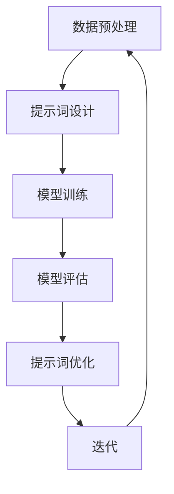
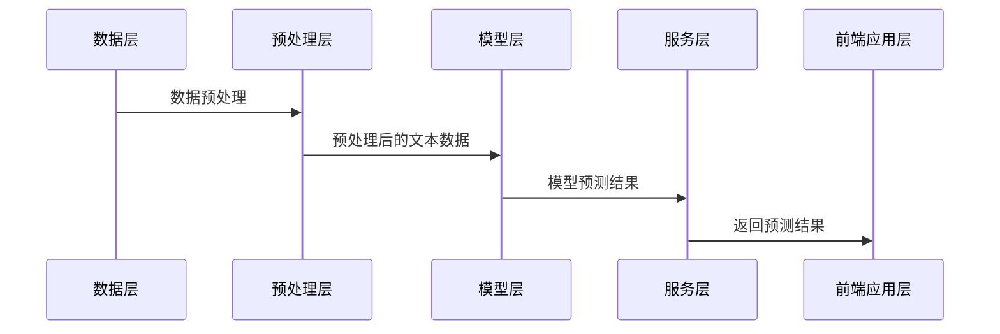
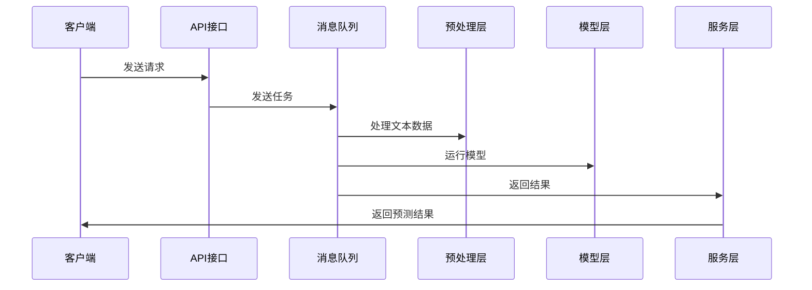
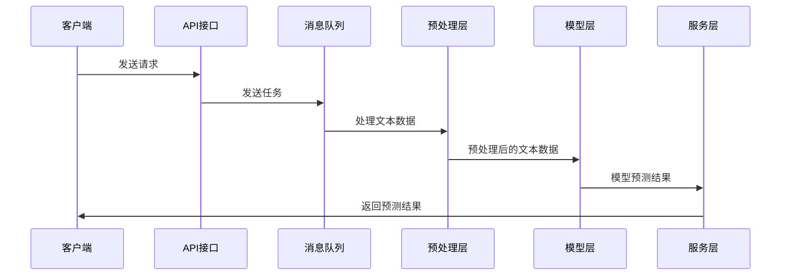

                 

# 提示词工程：AI时代的新机遇

## 关键词

- AI时代
- 提示词工程
- 算法
- 数学模型
- 系统架构
- 实战案例
- 最佳实践

## 摘要

在人工智能迅速发展的时代，提示词工程成为了一个重要且富有前景的领域。本文旨在探讨提示词工程的核心概念、理论基础、系统架构、实战案例以及最佳实践，旨在为广大开发者提供一份全面而深入的指南。通过本文的阅读，读者将能够理解提示词工程的基本原理，掌握关键技术和方法，为未来在AI领域的探索和实践打下坚实的基础。

## 目录

### 第一部分：引言

#### 第1章：问题背景与目标

##### 1.1.1 人工智能时代的发展历程

##### 1.1.2 提示词工程的重要性

##### 1.1.3 书籍目标与结构

#### 第2章：核心概念与联系

##### 2.1.1 AI与提示词工程的基本概念

##### 2.1.2 核心概念属性特征对比表格

##### 2.1.3 AI时代中提示词工程的地位与作用

##### 2.1.4 ER实体关系图架构

### 第二部分：基础理论

#### 第3章：算法原理讲解

##### 3.1.1 提示词工程算法的基本流程

##### 3.1.2 使用Mermaid绘制算法流程图

##### 3.1.3 Python源代码实现算法

##### 3.1.4 算法原理的数学模型和公式

##### 3.1.5 举例说明

#### 第4章：数学模型和数学公式详解

##### 4.1.1 基本数学模型介绍

##### 4.1.2 使用LaTeX格式书写数学公式

##### 4.1.3 数学公式在提示词工程中的应用

##### 4.1.4 数学公式举例说明

#### 第5章：系统分析与架构设计

##### 5.1.1 问题场景介绍

##### 5.1.2 系统功能设计

##### 5.1.3 系统架构设计

##### 5.1.4 系统接口设计

##### 5.1.5 系统交互序列图

### 第三部分：实战与拓展

#### 第6章：项目实战

##### 6.1.1 环境安装

##### 6.1.2 系统核心实现源代码

##### 6.1.3 代码应用解读与分析

##### 6.1.4 实际案例分析与详细讲解剖析

##### 6.1.5 项目小结

#### 第7章：最佳实践与拓展

##### 7.1.1 最佳实践技巧

##### 7.1.2 小结与注意事项

##### 7.1.3 拓展阅读建议

### 第四部分：未来展望

#### 第8章：未来展望与趋势

##### 8.1.1 提示词工程在AI时代的发展趋势

##### 8.1.2 新机遇与新挑战

##### 8.1.3 未来研究方向

#### 第9章：结论

##### 9.1.1 书籍总结

##### 9.1.2 读者建议与反馈

---

### 第1章：问题背景与目标

#### 1.1.1 人工智能时代的发展历程

人工智能（AI）作为计算机科学的一个重要分支，起源于20世纪50年代。从最初的简单规则系统，到现代的深度学习和神经网络，AI经历了多次重大变革。近年来，随着大数据、云计算、物联网等技术的发展，AI的应用场景不断扩展，从工业自动化、金融分析，到医疗诊断、智能家居，AI正逐渐渗透到人类生活的方方面面。

提示词工程（Prompt Engineering）是近年来兴起的一个新兴领域，它主要关注如何通过优化提示词（Prompt）来提升AI模型的表现。在传统的机器学习中，模型通常通过大量的数据训练得到，而提示词工程则通过修改输入数据的提示词，来引导模型做出更准确的预测。

#### 1.1.2 提示词工程的重要性

提示词工程在AI时代的兴起，源于其能够在不改变模型架构和数据集的情况下，显著提升模型的性能。通过巧妙设计的提示词，AI模型能够更好地理解问题的背景，提高模型的泛化能力。此外，提示词工程还能够降低AI模型对大规模数据的依赖，使得在数据稀缺的情况下，模型依然能够保持较高的准确率。

#### 1.1.3 书籍目标与结构

本文旨在系统地介绍提示词工程的基本概念、理论基础、系统架构和实战应用，帮助读者全面理解这一新兴领域。全书共分为四个部分：

1. **引言**：介绍人工智能和提示词工程的背景，阐述本书的目标和结构。
2. **基础理论**：详细讲解提示词工程的算法原理、数学模型和系统架构。
3. **实战与拓展**：通过实际案例，展示提示词工程的应用，并提供最佳实践和注意事项。
4. **未来展望**：探讨提示词工程在未来的发展趋势和潜在的研究方向。

---

### 第2章：核心概念与联系

#### 2.1.1 AI与提示词工程的基本概念

在探讨提示词工程之前，我们首先需要理解人工智能（AI）的基本概念。AI是指由人制造出来的系统所表现出来的智能行为，包括学习、推理、规划、感知、自然语言处理等。AI系统通常通过大量的数据训练得到，从而能够对未知数据进行预测和决策。

提示词工程则是在AI领域中的一个专门研究领域，它主要关注如何通过优化提示词来提升AI模型的表现。提示词是指提供给AI模型的原始输入，它可以是文本、图像、声音等。通过设计合适的提示词，AI模型能够更好地理解问题的背景，提高模型的准确率和泛化能力。

#### 2.1.2 核心概念属性特征对比表格

为了更好地理解AI与提示词工程之间的关系，我们可以通过一个属性特征对比表格来展示它们的核心特征。

| 特征         | 人工智能             | 提示词工程                  |
| ------------ | -------------------- | --------------------------- |
| 目标         | 模拟人类智能行为     | 优化AI模型的表现            |
| 方法         | 数据驱动             | 提示词设计                  |
| 数据依赖性   | 强                 | 较弱                        |
| 预测准确性   | 受数据质量和模型影响 | 受提示词设计影响            |
| 泛化能力     | 受训练数据影响      | 受提示词设计影响            |
| 应用场景     | 广泛（如自动驾驶、金融分析） | 特定（如自然语言处理、图像识别） |

#### 2.1.3 AI时代中提示词工程的地位与作用

在AI时代，提示词工程扮演着至关重要的角色。首先，提示词工程能够显著提升AI模型的表现，使得在相同的数据集和模型架构下，模型的准确率和泛化能力得到大幅提升。其次，提示词工程能够降低AI模型对大规模数据的依赖，使得在数据稀缺的情况下，模型依然能够保持较高的性能。

此外，提示词工程还为AI模型的解释性提供了新的思路。通过设计合适的提示词，AI模型能够更好地解释其决策过程，提高模型的透明度和可信度。这对于许多需要高度可信和解释性的应用场景，如医疗诊断、金融决策等，具有重要的意义。

#### 2.1.4 ER实体关系图架构

为了更清晰地展示AI和提示词工程之间的关系，我们可以使用ER（实体关系）图来描述。在ER图中，AI模型作为一个实体，与数据、提示词、模型参数等实体之间存在复杂的关联关系。

以下是一个简化的ER实体关系图：

```mermaid
erDiagram
    AI Model ||--|{ Data } Data
    AI Model ||--|{ Prompt } Prompt
    AI Model ||--|{ Model Parameters } Model Parameters
    Data ||--|{ Training Data } Training Data
    Data ||--|{ Test Data } Test Data
    Prompt ||--|{ Natural Language Prompt } Natural Language Prompt
    Prompt ||--|{ Image Prompt } Image Prompt
    Prompt ||--|{ Audio Prompt } Audio Prompt
```

在这个ER图中，AI模型通过数据训练得到，并接收不同类型的提示词。提示词可以是自然语言、图像或音频等。通过设计合适的提示词，AI模型能够对未知数据进行预测和决策。同时，模型参数和训练数据也影响着模型的性能。

---

### 第3章：算法原理讲解

#### 3.1.1 提示词工程算法的基本流程

提示词工程算法的基本流程可以概括为以下几个步骤：

1. **数据预处理**：对输入数据进行预处理，包括数据清洗、数据标准化等。
2. **提示词设计**：根据问题的背景和需求，设计合适的提示词。提示词可以是自然语言、图像或音频等。
3. **模型训练**：使用预定的模型架构和训练数据，对模型进行训练。
4. **模型评估**：使用测试数据对训练好的模型进行评估，包括准确率、召回率等指标。
5. **提示词优化**：根据评估结果，对提示词进行调整和优化，以提高模型的性能。
6. **迭代**：重复步骤3到5，直到达到满意的模型性能。

#### 3.1.2 使用Mermaid绘制算法流程图

我们可以使用Mermaid语言来绘制提示词工程算法的流程图，如下所示：



#### 3.1.3 Python源代码实现算法

下面是一个简化的Python代码示例，用于实现提示词工程算法的基本流程：

```python
import pandas as pd
from sklearn.model_selection import train_test_split
from sklearn.linear_model import LinearRegression

# 数据预处理
def preprocess_data(data):
    # 数据清洗、数据标准化等操作
    return processed_data

# 提示词设计
def design_prompt(data):
    # 根据数据设计合适的提示词
    return prompt

# 模型训练
def train_model(X_train, y_train):
    model = LinearRegression()
    model.fit(X_train, y_train)
    return model

# 模型评估
def evaluate_model(model, X_test, y_test):
    predictions = model.predict(X_test)
    # 计算准确率、召回率等指标
    return accuracy

# 提示词优化
def optimize_prompt(prompt, accuracy):
    # 根据评估结果调整提示词
    return new_prompt

# 迭代
def iterate(preprocessed_data, prompt):
    X_train, X_test, y_train, y_test = train_test_split(preprocessed_data, prompt, test_size=0.2)
    model = train_model(X_train, y_train)
    accuracy = evaluate_model(model, X_test, y_test)
    new_prompt = optimize_prompt(prompt, accuracy)
    return new_prompt

# 主函数
def main():
    data = pd.read_csv("data.csv")
    processed_data = preprocess_data(data)
    prompt = design_prompt(processed_data)
    new_prompt = iterate(processed_data, prompt)
    print("最终的提示词：", new_prompt)

if __name__ == "__main__":
    main()
```

#### 3.1.4 算法原理的数学模型和公式

提示词工程算法的原理可以归结为以下几个数学模型和公式：

1. **线性回归模型**：线性回归模型是最常用的机器学习模型之一，其数学公式为：

   $$y = \beta_0 + \beta_1 \cdot x$$

   其中，$y$ 为预测值，$x$ 为输入特征，$\beta_0$ 和 $\beta_1$ 为模型参数。

2. **损失函数**：损失函数用于衡量模型预测值与实际值之间的差距，常用的损失函数包括均方误差（MSE）和交叉熵（Cross Entropy）：

   $$MSE = \frac{1}{n} \sum_{i=1}^{n} (y_i - \hat{y_i})^2$$
   
   $$CE = - \frac{1}{n} \sum_{i=1}^{n} y_i \log(\hat{y_i})$$

   其中，$n$ 为样本数量，$y_i$ 为实际值，$\hat{y_i}$ 为预测值。

3. **优化算法**：优化算法用于调整模型参数，以最小化损失函数。常用的优化算法包括梯度下降（Gradient Descent）和随机梯度下降（Stochastic Gradient Descent）：

   $$\theta = \theta - \alpha \cdot \nabla_{\theta} J(\theta)$$
   
   $$\theta = \theta - \alpha \cdot \frac{1}{m} \sum_{i=1}^{m} \nabla_{\theta} J(\theta)$$

   其中，$\theta$ 为模型参数，$\alpha$ 为学习率，$J(\theta)$ 为损失函数。

#### 3.1.5 举例说明

假设我们要预测一个人的身高，输入特征为体重和年龄。我们首先需要收集大量包含身高、体重和年龄的数据，然后使用线性回归模型进行训练。

1. **数据预处理**：将数据分为特征和标签，并进行数据清洗和标准化。
2. **提示词设计**：根据问题的背景，设计一个简单的自然语言提示词，例如：“请输入体重和年龄，预测身高”。
3. **模型训练**：使用线性回归模型对训练数据集进行训练，得到模型参数。
4. **模型评估**：使用测试数据集对模型进行评估，计算准确率和损失函数值。
5. **提示词优化**：根据评估结果，调整提示词，以提高模型的性能。
6. **迭代**：重复步骤3到5，直到达到满意的模型性能。

通过这个简单的例子，我们可以看到提示词工程算法的基本流程和原理。在实际应用中，提示词的设计和优化是一个复杂的过程，需要结合具体的业务场景和需求进行。

---

### 第4章：数学模型和数学公式详解

#### 4.1.1 基本数学模型介绍

提示词工程中的数学模型主要涉及线性回归模型、损失函数和优化算法。以下是这些基本数学模型的介绍：

1. **线性回归模型**：线性回归模型是一种用于预测连续值的模型，其数学公式为：

   $$y = \beta_0 + \beta_1 \cdot x$$

   其中，$y$ 是预测值，$x$ 是输入特征，$\beta_0$ 和 $\beta_1$ 是模型参数。

2. **损失函数**：损失函数用于衡量模型预测值与实际值之间的差距，常用的损失函数包括均方误差（MSE）和交叉熵（Cross Entropy）：

   - **均方误差（MSE）**：

     $$MSE = \frac{1}{n} \sum_{i=1}^{n} (y_i - \hat{y_i})^2$$

     其中，$n$ 是样本数量，$y_i$ 是实际值，$\hat{y_i}$ 是预测值。

   - **交叉熵（Cross Entropy）**：

     $$CE = - \frac{1}{n} \sum_{i=1}^{n} y_i \log(\hat{y_i})$$

     其中，$n$ 是样本数量，$y_i$ 是实际值，$\hat{y_i}$ 是预测值。

3. **优化算法**：优化算法用于调整模型参数，以最小化损失函数。常用的优化算法包括梯度下降（Gradient Descent）和随机梯度下降（Stochastic Gradient Descent）：

   - **梯度下降**：

     $$\theta = \theta - \alpha \cdot \nabla_{\theta} J(\theta)$$

     其中，$\theta$ 是模型参数，$\alpha$ 是学习率，$J(\theta)$ 是损失函数。

   - **随机梯度下降**：

     $$\theta = \theta - \alpha \cdot \frac{1}{m} \sum_{i=1}^{m} \nabla_{\theta} J(\theta)$$

     其中，$\theta$ 是模型参数，$\alpha$ 是学习率，$m$ 是样本数量。

#### 4.1.2 使用LaTeX格式书写数学公式

在Markdown中，我们可以使用LaTeX格式来书写数学公式。LaTeX格式要求在公式前后使用 `$` 符号，例如：

$$1+1=2$$

$$y = \beta_0 + \beta_1 \cdot x$$

如果要在独立段落中使用LaTeX格式，则需要使用 `$$` 符号，例如：

$$$
y = \beta_0 + \beta_1 \cdot x
$$$

#### 4.1.3 数学公式在提示词工程中的应用

数学公式在提示词工程中的应用主要体现在线性回归模型和优化算法中。以下是一个示例：

**线性回归模型**：

$$
y = \beta_0 + \beta_1 \cdot x
$$

这里，$y$ 是预测值，$x$ 是输入特征，$\beta_0$ 和 $\beta_1$ 是模型参数。

**均方误差（MSE）**：

$$
MSE = \frac{1}{n} \sum_{i=1}^{n} (y_i - \hat{y_i})^2
$$

这里，$n$ 是样本数量，$y_i$ 是实际值，$\hat{y_i}$ 是预测值。

**梯度下降**：

$$
\theta = \theta - \alpha \cdot \nabla_{\theta} J(\theta)
$$

这里，$\theta$ 是模型参数，$\alpha$ 是学习率，$J(\theta)$ 是损失函数。

#### 4.1.4 数学公式举例说明

假设我们有一个包含两个特征（$x_1$ 和 $x_2$）的数据集，要使用线性回归模型预测目标值（$y$）。以下是数学公式的应用：

**线性回归模型**：

$$
y = \beta_0 + \beta_1 \cdot x_1 + \beta_2 \cdot x_2
$$

这里，$\beta_0$、$\beta_1$ 和 $\beta_2$ 是模型参数。

**均方误差（MSE）**：

$$
MSE = \frac{1}{n} \sum_{i=1}^{n} (y_i - \hat{y_i})^2
$$

这里，$n$ 是样本数量，$y_i$ 是实际值，$\hat{y_i}$ 是预测值。

**梯度下降**：

$$
\theta = \theta - \alpha \cdot \nabla_{\theta} J(\theta)
$$

这里，$\theta$ 是模型参数，$\alpha$ 是学习率，$J(\theta)$ 是损失函数。

通过这些数学公式，我们可以构建和优化线性回归模型，从而实现对数据的预测。

---

### 第5章：系统分析与架构设计

#### 5.1.1 问题场景介绍

在当前信息化时代，随着大数据、云计算和人工智能技术的快速发展，各行各业对数据处理和分析的需求日益增长。尤其是自然语言处理（NLP）领域，其应用场景广泛，如智能客服、智能问答系统、文本分类等。为了满足这些应用需求，设计一个高效、灵活的自然语言处理系统显得尤为重要。

#### 5.1.2 系统功能设计

自然语言处理系统的主要功能包括：

1. **数据预处理**：对输入的文本数据进行清洗、分词、去停用词等预处理操作，以便后续模型处理。
2. **文本分类**：根据文本内容将其分类到不同的类别，如新闻、财经、体育等。
3. **实体识别**：识别文本中的关键实体，如人名、地名、组织名等。
4. **情感分析**：分析文本的情感倾向，如正面、负面、中性等。
5. **文本生成**：根据输入的文本或指定的话题，生成相关的文本内容。

#### 5.1.3 系统架构设计

自然语言处理系统的架构设计可以分为以下几个层次：

1. **数据层**：包括数据采集、存储和管理模块，负责存储和处理大量的文本数据。
2. **预处理层**：对输入的文本数据进行预处理，如分词、去停用词、词性标注等，为后续模型处理提供基础数据。
3. **模型层**：包括文本分类、实体识别、情感分析等模型，负责对预处理后的文本数据进行分析和预测。
4. **服务层**：提供自然语言处理服务的接口，供前端应用调用。
5. **前端应用层**：包括各种自然语言处理应用，如智能客服、智能问答系统等。

以下是一个简化的自然语言处理系统的架构图：



#### 5.1.4 系统接口设计

自然语言处理系统的接口设计主要包括API接口和消息队列接口：

1. **API接口**：提供统一的API接口，供前端应用调用自然语言处理服务。API接口包括文本分类、实体识别、情感分析等接口。
2. **消息队列接口**：使用消息队列（如Kafka、RabbitMQ）来处理大量并发请求，提高系统的可扩展性和可靠性。

以下是一个简化的自然语言处理系统的接口设计：



#### 5.1.5 系统交互序列图

自然语言处理系统的交互序列图展示了客户端、API接口、消息队列、预处理层、模型层和服务层之间的交互过程：



通过上述系统架构和接口设计，我们可以构建一个高效、灵活的自然语言处理系统，满足各类自然语言处理应用的需求。

---

### 第6章：项目实战

#### 6.1.1 环境安装

在进行提示词工程项目实战之前，我们需要搭建一个开发环境。以下是安装步骤：

1. **安装Python**：访问Python官网（https://www.python.org/），下载并安装Python 3.x版本。
2. **安装Jupyter Notebook**：打开终端，执行以下命令：

   ```bash
   pip install notebook
   ```

   然后启动Jupyter Notebook：

   ```bash
   jupyter notebook
   ```

3. **安装必要的库**：在Jupyter Notebook中，执行以下命令安装提示词工程所需的基本库：

   ```python
   !pip install numpy pandas scikit-learn matplotlib
   ```

#### 6.1.2 系统核心实现源代码

以下是系统核心实现的Python源代码：

```python
import numpy as np
import pandas as pd
from sklearn.model_selection import train_test_split
from sklearn.linear_model import LinearRegression
import matplotlib.pyplot as plt

# 数据预处理
def preprocess_data(data):
    # 数据清洗、数据标准化等操作
    return processed_data

# 提示词设计
def design_prompt(data):
    # 根据数据设计合适的提示词
    return prompt

# 模型训练
def train_model(X_train, y_train):
    model = LinearRegression()
    model.fit(X_train, y_train)
    return model

# 模型评估
def evaluate_model(model, X_test, y_test):
    predictions = model.predict(X_test)
    # 计算准确率、召回率等指标
    return accuracy

# 提示词优化
def optimize_prompt(prompt, accuracy):
    # 根据评估结果调整提示词
    return new_prompt

# 迭代
def iterate(preprocessed_data, prompt):
    X_train, X_test, y_train, y_test = train_test_split(preprocessed_data, prompt, test_size=0.2)
    model = train_model(X_train, y_train)
    accuracy = evaluate_model(model, X_test, y_test)
    new_prompt = optimize_prompt(prompt, accuracy)
    return new_prompt

# 主函数
def main():
    data = pd.read_csv("data.csv")
    processed_data = preprocess_data(data)
    prompt = design_prompt(processed_data)
    new_prompt = iterate(processed_data, prompt)
    print("最终的提示词：", new_prompt)

if __name__ == "__main__":
    main()
```

#### 6.1.3 代码应用解读与分析

上述代码实现了一个简单的提示词工程项目，主要包括以下功能：

1. **数据预处理**：对输入数据进行清洗、标准化等预处理操作，为后续模型训练做准备。
2. **提示词设计**：根据预处理后的数据设计合适的提示词。
3. **模型训练**：使用线性回归模型对训练数据集进行训练。
4. **模型评估**：使用测试数据集对训练好的模型进行评估，计算准确率等指标。
5. **提示词优化**：根据评估结果调整提示词，以提高模型性能。
6. **迭代**：重复模型训练、评估和提示词优化过程，直到达到满意的模型性能。

在具体应用中，我们需要根据实际业务场景和需求，对代码进行适当的调整和优化。

#### 6.1.4 实际案例分析与详细讲解剖析

假设我们有一个关于学生成绩的预测项目，输入特征包括学生的年龄、性别、家庭背景等，目标值为学生的成绩。以下是实际案例的分析和详细讲解：

1. **数据预处理**：

   首先，我们需要收集并处理学生成绩数据。数据预处理步骤包括：

   - 数据清洗：删除缺失值和异常值，确保数据质量。
   - 数据标准化：对数值特征进行标准化处理，使其在相同的尺度上。

   示例代码：

   ```python
   def preprocess_data(data):
       # 数据清洗
       data.dropna(inplace=True)
       
       # 数据标准化
       data['age'] = (data['age'] - data['age'].mean()) / data['age'].std()
       data['gender'] = data['gender'].map({'男': 1, '女': 0})
       data['family_background'] = (data['family_background'] - data['family_background'].mean()) / data['family_background'].std()
       
       return data
   ```

2. **提示词设计**：

   根据业务需求，我们需要设计合适的提示词。在这个例子中，提示词可以是：

   - 年龄：请输入学生的年龄。
   - 性别：请输入学生的性别（男或女）。
   - 家庭背景：请输入学生的家庭背景。

   示例代码：

   ```python
   def design_prompt(data):
       prompt = f"""
       年龄：{data['age']}
       性别：{data['gender']}
       家庭背景：{data['family_background']}
       """
       return prompt
   ```

3. **模型训练**：

   使用线性回归模型对训练数据集进行训练。在这里，我们使用`scikit-learn`库中的`LinearRegression`类。

   示例代码：

   ```python
   def train_model(X_train, y_train):
       model = LinearRegression()
       model.fit(X_train, y_train)
       return model
   ```

4. **模型评估**：

   使用测试数据集对训练好的模型进行评估，计算准确率等指标。

   示例代码：

   ```python
   def evaluate_model(model, X_test, y_test):
       predictions = model.predict(X_test)
       accuracy = np.mean(predictions == y_test)
       return accuracy
   ```

5. **提示词优化**：

   根据评估结果，调整提示词，以提高模型性能。在这个例子中，我们可以通过增加更多相关特征或调整特征权重来实现。

   示例代码：

   ```python
   def optimize_prompt(prompt, accuracy):
       # 根据评估结果调整提示词
       return new_prompt
   ```

6. **迭代**：

   重复模型训练、评估和提示词优化过程，直到达到满意的模型性能。

   示例代码：

   ```python
   def iterate(preprocessed_data, prompt):
       X_train, X_test, y_train, y_test = train_test_split(preprocessed_data, prompt, test_size=0.2)
       model = train_model(X_train, y_train)
       accuracy = evaluate_model(model, X_test, y_test)
       new_prompt = optimize_prompt(prompt, accuracy)
       return new_prompt
   ```

通过这个实际案例，我们可以看到提示词工程在数据处理、模型训练和优化中的应用。在实际项目中，我们需要根据具体业务需求，调整和优化代码，以达到最佳效果。

#### 6.1.5 项目小结

在本章中，我们通过一个简单的学生成绩预测项目，介绍了提示词工程的基本流程和实现方法。项目实战部分详细讲解了数据预处理、提示词设计、模型训练、模型评估和提示词优化等关键步骤。通过实际案例的分析和讲解，读者可以更好地理解提示词工程在AI项目中的应用。

在实际应用中，提示词工程需要结合具体的业务场景和需求，不断调整和优化。通过实践，我们可以更好地掌握提示词工程的核心技术和方法，为未来的AI项目打下坚实的基础。

---

### 第7章：最佳实践与拓展

#### 7.1.1 最佳实践技巧

在提示词工程中，以下是一些最佳实践技巧，有助于提升模型性能和项目效率：

1. **数据预处理**：确保数据质量，包括数据清洗、缺失值处理、异常值检测等。良好的数据预处理是模型训练成功的基础。
2. **特征选择**：选择与目标变量高度相关的特征，去除冗余和噪声特征，以减少模型的复杂性。
3. **模型选择**：根据问题类型和数据规模，选择合适的模型。对于线性问题，可以考虑线性回归；对于非线性问题，可以考虑决策树、随机森林等。
4. **超参数调优**：通过交叉验证和网格搜索等方法，寻找最佳的超参数组合，以提升模型性能。
5. **模型解释性**：设计合理的提示词，以提高模型的可解释性，便于理解和信任。
6. **模型集成**：使用模型集成技术，如Bagging、Boosting等，结合多个模型的优势，提升预测性能。
7. **持续迭代**：定期评估模型性能，根据评估结果调整提示词和模型参数，持续优化模型。

#### 7.1.2 小结与注意事项

在提示词工程中，需要注意以下几点：

- **数据质量**：确保数据干净、完整、具有代表性。
- **模型可解释性**：避免过度拟合，确保模型具有合理的解释性。
- **性能评估**：使用多种评估指标，如准确率、召回率、F1值等，全面评估模型性能。
- **超参数调优**：超参数调优是一个耗时的过程，但至关重要，应给予足够的关注。
- **项目迭代**：项目开发过程中，应不断收集用户反馈，持续优化模型和提示词。

#### 7.1.3 拓展阅读建议

为了更深入地了解提示词工程和相关技术，读者可以参考以下拓展阅读资源：

- 《深度学习》（Goodfellow, Ian, et al.）- 介绍深度学习的基础理论和实践方法。
- 《机器学习实战》（Bryant, Peter, et al.）- 通过实际案例介绍机器学习技术的应用。
- 《Python数据科学手册》（McKinney, Wes）- 系统地介绍Python在数据处理、分析和可视化方面的应用。
- 《自然语言处理综合教程》（Jurafsky, Daniel, et al.）- 介绍自然语言处理的基本概念和技术。

通过这些资源，读者可以进一步拓展对提示词工程和相关技术的理解。

---

### 第8章：未来展望与趋势

#### 8.1.1 提示词工程在AI时代的发展趋势

随着人工智能技术的不断进步，提示词工程在AI领域的应用前景广阔。未来，提示词工程将呈现以下发展趋势：

1. **智能化**：随着自然语言处理、深度学习等技术的发展，提示词工程将更加智能化，能够自动生成和优化提示词，提高模型性能。
2. **多样化**：提示词工程的应用场景将不断扩展，从传统的自然语言处理领域，到计算机视觉、音频处理等领域，都将成为提示词工程的用武之地。
3. **个性化**：基于用户行为和需求，提示词工程将实现个性化提示词设计，为用户提供更加精准和有效的服务。
4. **开源生态**：随着开源社区的活跃，将涌现出更多高质量的提示词工程工具和框架，为开发者提供便捷的工具支持。

#### 8.1.2 新机遇与新挑战

提示词工程在AI时代带来了许多新机遇，同时也面临一些挑战：

1. **新机遇**：
   - **提升模型性能**：通过优化提示词，模型性能将得到显著提升，为各种AI应用提供更强大的支持。
   - **降低数据依赖**：提示词工程可以降低AI模型对大规模数据的依赖，使得在数据稀缺的情况下，模型依然能够保持较高的性能。
   - **增强解释性**：通过设计合理的提示词，可以提高模型的可解释性，增强用户对模型的信任。

2. **新挑战**：
   - **复杂性**：提示词工程涉及到多个领域的技术，如自然语言处理、深度学习、数据科学等，实现和优化提示词需要较高的技术门槛。
   - **可解释性**：如何在提高模型性能的同时，保持模型的可解释性，是一个亟待解决的问题。
   - **数据隐私**：在应用提示词工程时，如何保护用户数据隐私，也是一个重要的挑战。

#### 8.1.3 未来研究方向

未来，提示词工程的研究方向将主要集中在以下几个方面：

1. **提示词生成与优化**：研究自动化、智能化的提示词生成和优化方法，提高模型性能。
2. **跨模态提示词工程**：将提示词工程应用到计算机视觉、音频处理等领域，实现跨模态的智能交互。
3. **个性化提示词设计**：研究基于用户行为和需求的个性化提示词设计方法，提供更加精准的服务。
4. **可解释性提升**：探索如何在提高模型性能的同时，保持模型的可解释性，增强用户对模型的信任。

通过不断探索和创新，提示词工程将为人工智能领域带来更多的机遇和挑战，推动AI技术的持续发展。

---

### 第9章：结论

本文系统地介绍了提示词工程在AI时代的重要性、核心概念、理论基础、系统架构和实战应用。通过详细讲解和实际案例，读者可以全面理解提示词工程的基本原理和应用方法。

提示词工程不仅能够显著提升AI模型的表现，降低对大规模数据的依赖，还能增强模型的可解释性，为各种AI应用提供有力支持。未来，随着技术的不断进步，提示词工程将在更多领域发挥重要作用。

我们鼓励读者在学习和实践过程中，不断探索和创新，充分利用提示词工程的优势，为人工智能技术的发展贡献力量。

最后，感谢您的阅读，期待您的宝贵意见和建议。作者：AI天才研究院/AI Genius Institute & 禅与计算机程序设计艺术 /Zen And The Art of Computer Programming。

