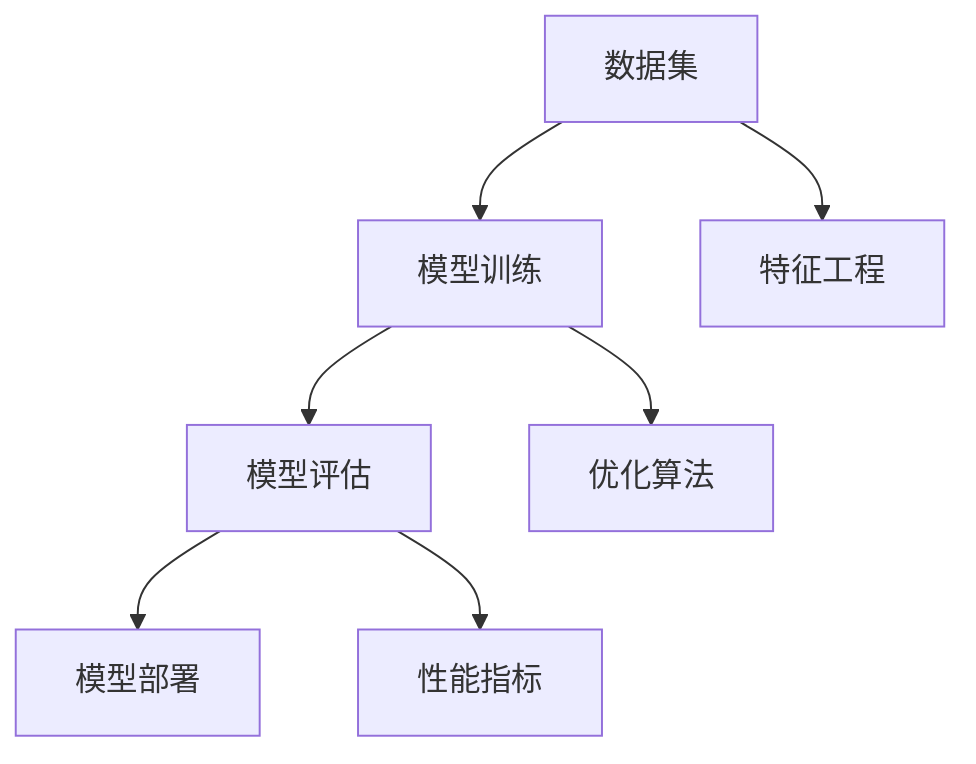
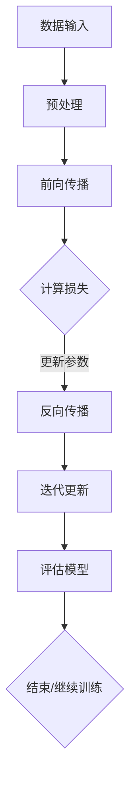
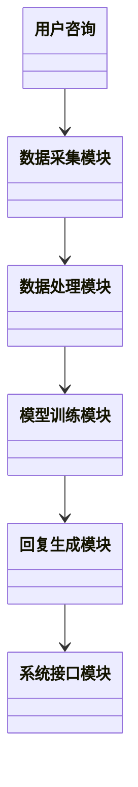
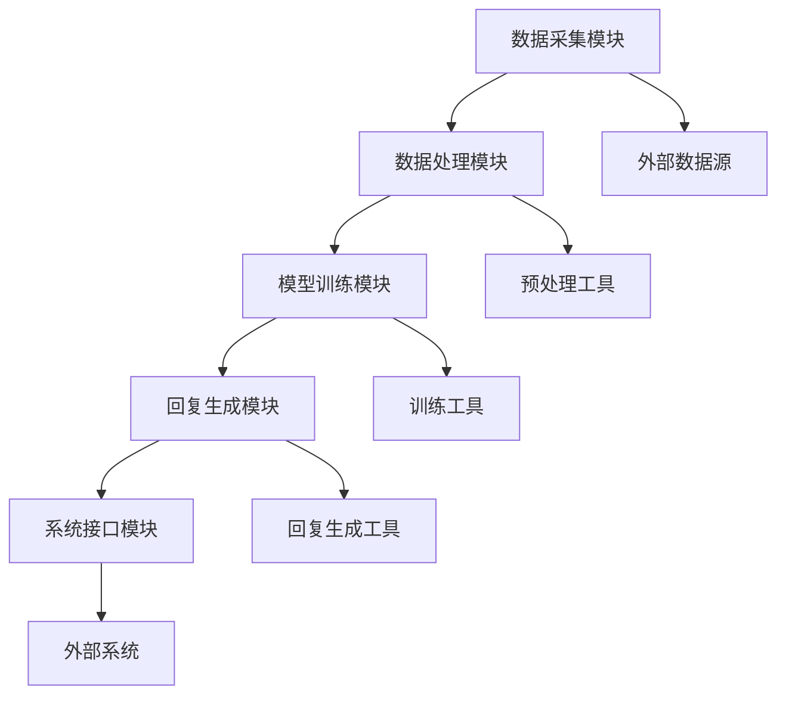
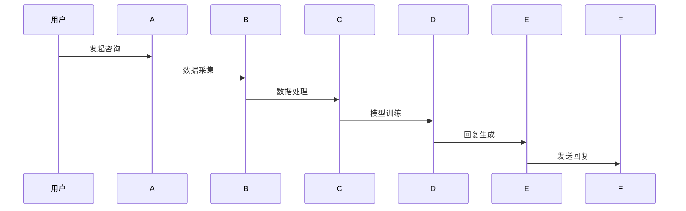

                 

# 提示词工程：AI时代的新机遇

> 关键词：AI大模型、软件开发、智能化、自动化、深度学习、变换器架构、优化算法

> 摘要：
在人工智能迅速发展的背景下，软件2.0时代已经到来，AI大模型成为软件开发的核心驱动力。本文将探讨AI大模型在软件2.0时代的角色和作用，分析其定义、特点、分类及算法原理，并通过具体案例展示其在现实场景中的应用，为开发者提供实用的最佳实践和思考方向。

## 第一部分：背景介绍

### 1. 问题背景

随着互联网和大数据技术的普及，数据量和处理需求呈现出爆发式增长。传统软件1.0时代的开发模式已经无法满足现代企业对智能化、自动化处理的需求。软件2.0时代应运而生，标志着人工智能（AI）大模型在软件开发中的核心地位日益凸显。软件2.0不仅是一种技术革新，更是一种开发范式，它通过深度学习、神经网络等技术，实现了对海量数据的智能处理和分析。

在软件2.0时代，企业级应用面临着复杂的业务逻辑、大量的数据存储和处理需求，以及不断变化的市场环境。如何在这个时代下利用AI大模型进行有效的开发，成为每一个软件开发者和企业必须面对的问题。

### 2. 问题描述

软件2.0时代的主要挑战在于如何利用AI大模型实现企业级应用的高效开发。企业级应用需要具备高效的数据处理能力、灵活的扩展性和强大的智能化水平。具体来说，问题包括：

- 如何处理海量的业务数据？
- 如何从数据中提取有价值的信息？
- 如何实现业务逻辑的智能化处理？
- 如何适应快速变化的市场需求？

### 3. 问题解决

通过引入AI大模型，软件开发者可以实现对业务数据的自动学习、分析和预测，从而提高软件的智能化程度和自动化水平。同时，AI大模型还可以帮助企业在海量的数据中挖掘出有价值的信息，为企业决策提供支持。以下是问题解决的几个关键步骤：

- **数据采集与处理**：收集企业内部和外部数据，进行数据预处理，确保数据的质量和一致性。
- **模型训练与优化**：使用大量的数据进行模型训练，通过优化算法调整模型参数，提高模型的准确性和泛化能力。
- **模型部署与集成**：将训练好的模型部署到生产环境中，与现有业务系统进行集成，实现智能化处理。
- **持续监控与更新**：对模型的性能进行持续监控，根据业务需求进行模型更新和优化，确保其始终处于最佳状态。

### 4. 边界与外延

软件2.0与AI大模型的应用范围广泛，涵盖了金融、医疗、教育、制造等多个行业。在不同的应用场景中，AI大模型的作用和实现方式也会有所不同。例如，在金融领域，AI大模型可以用于风险控制和智能投顾；在医疗领域，可以用于疾病诊断和患者管理；在教育领域，可以用于个性化教学和学习分析。因此，理解AI大模型的基本原理和特点，对于有效地利用这一技术进行企业级应用开发至关重要。

### 5. 概念结构与核心要素组成

- **软件2.0**：基于人工智能的软件开发范式，强调智能化、自动化数据处理。
- **AI大模型**：具有大规模参数和复杂结构的深度学习模型，能够处理海量数据并实现高级智能任务。
- **企业级应用**：针对企业业务需求设计的软件系统，需要具备高效的数据处理能力、灵活的扩展性和强大的智能化水平。

## 第二部分：核心概念与联系

### 1. AI大模型的定义与特点

#### 1.1 AI大模型的定义

AI大模型是指具有大规模参数和复杂结构的深度学习模型。这些模型通过训练可以自动地从数据中学习特征，并应用于各种任务，如文本生成、图像识别、语音识别等。与传统的小规模模型相比，AI大模型具有更高的准确性和更强的泛化能力。

#### 1.2 AI大模型的特点

- **大规模**：AI大模型通常具有数十亿甚至千亿级别的参数，可以处理大规模数据集。
- **复杂结构**：AI大模型采用多层神经网络结构，能够处理复杂的任务和模式。
- **自学习能力**：AI大模型通过训练数据自动优化模型参数，提高模型的性能和准确性。
- **通用性**：AI大模型适用于多种不同类型的任务和数据集，具有广泛的适用性。

#### 1.3 AI大模型与传统AI的区别

传统AI主要依赖于手工设计特征和算法，难以应对复杂的任务和海量数据。而AI大模型通过自动学习特征，能够处理更为复杂的任务和大规模数据，具有更高的灵活性和适应性。

### 2. AI大模型的分类与主流模型

#### 2.1 分类

AI大模型可以根据任务类型和应用领域进行分类，如自然语言处理（NLP）、计算机视觉（CV）、语音识别（ASR）等。

#### 2.2 主流模型

- **GPT系列模型**：一种基于变换器（Transformer）架构的预训练语言模型，适用于文本生成、问答等任务。
- **BERT模型**：一种双向编码表示模型，能够理解上下文信息，广泛应用于信息检索和文本分类。
- **其他知名大模型**：如Turing-NLG、ImageNet等，分别应用于自然语言生成和图像识别领域。

### 3. AI大模型的核心概念与联系

#### 3.1 深度学习

深度学习是AI大模型的核心技术。它通过多层神经网络结构，自动从数据中学习特征，并能够应用于各种任务。深度学习的基本原理是通过多层非线性变换，将输入数据逐步转化为高层次的特征表示。

#### 3.2 变换器架构

变换器（Transformer）架构是近年来深度学习领域的重要突破，它通过自注意力机制实现了对输入数据的全局理解，显著提高了模型的性能。变换器架构广泛应用于自然语言处理、计算机视觉等领域。

#### 3.3 优化算法

优化算法是AI大模型训练的关键，它用于调整模型参数，使模型在训练过程中不断优化。常用的优化算法包括梯度下降、Adam优化器等。

### 4. 概念属性特征对比表格

| 概念           | 描述                                                         | 特征对比                       |
| -------------- | ------------------------------------------------------------ | ---------------------------- |
| 深度学习       | 自动从数据中学习特征的多层神经网络结构                       | 自适应性、非线性、多层次特征提取 |
| 变换器架构     | 基于自注意力机制的深度学习模型架构                           | 全局理解、高效计算               |
| 优化算法       | 调整模型参数，使模型在训练过程中不断优化                     | 梯度下降、Adam优化器等           |
| AI大模型       | 具有大规模参数和复杂结构的深度学习模型                       | 高性能、通用性、自学习能力       |

### 5. ER实体关系图架构

以下是一个简单的AI大模型ER实体关系图架构：



## 第三部分：算法原理讲解

### 1. AI大模型算法原理

#### 1.1 基本原理

AI大模型算法的核心是深度学习，特别是基于变换器（Transformer）的模型。这些模型通过多层神经网络结构，自动从数据中学习特征，并能够适应不同的任务。

#### 1.2 数学模型

AI大模型的数学模型主要包括两部分：损失函数和优化算法。

- **损失函数**：用于衡量模型预测结果与实际结果之间的差距，常用的有交叉熵损失函数。
- **优化算法**：用于调整模型参数，使损失函数最小化，常用的有梯度下降算法。

#### 1.3 Mermaid流程图

以下是AI大模型训练过程的mermaid流程图：



### 2. Python源代码实现

以下是使用Python实现AI大模型基础代码：

```python
import tensorflow as tf

# 损失函数
def cross_entropy_loss(labels, logits):
    return tf.reduce_mean(tf.nn.softmax_cross_entropy_with_logits(labels=labels, logits=logits))

# 梯度下降优化器
optimizer = tf.keras.optimizers.Adam()

# 训练模型
model.compile(optimizer=optimizer, loss=cross_entropy_loss)

# 训练步骤
model.fit(x_train, y_train, epochs=10, batch_size=32)
```

#### 1.4 算法原理详细讲解

深度学习的基本原理是通过多层神经网络对数据进行非线性变换，从而提取出高层次的抽象特征。AI大模型采用变换器（Transformer）架构，通过自注意力机制实现了对输入数据的全局理解。

- **变换器架构**：变换器架构的核心是自注意力机制，它通过计算输入数据中每个元素与其他元素的相关性，实现了对输入数据的全局理解。这种机制使得模型能够捕捉到输入数据中的长距离依赖关系，从而提高了模型的性能。

- **损失函数**：在深度学习中，损失函数用于衡量模型预测结果与实际结果之间的差距。常用的损失函数有交叉熵损失函数，它适用于分类问题。交叉熵损失函数的计算公式如下：

  $$L = -\sum_{i=1}^{n} y_i \log(\hat{y}_i)$$

  其中，$y_i$ 是实际标签，$\hat{y}_i$ 是模型预测的概率。

- **优化算法**：优化算法用于调整模型参数，使损失函数最小化。梯度下降算法是一种常用的优化算法，它的基本思想是沿着损失函数的梯度方向进行参数更新，直到达到局部最小值。梯度下降算法的计算公式如下：

  $$\theta_{\text{new}} = \theta_{\text{old}} - \alpha \nabla_{\theta} L$$

  其中，$\theta$ 是模型参数，$\alpha$ 是学习率。

通过以上步骤，AI大模型可以实现从数据中自动学习特征，并应用于各种任务。在实际应用中，开发者需要根据具体任务需求选择合适的模型架构、损失函数和优化算法，以达到最佳效果。

### 3. 通俗易懂地举例说明

假设我们有一个简单的文本分类问题，需要将新闻文章分类为体育、财经、娱乐等类别。我们可以使用AI大模型（如BERT模型）来实现这一任务。

- **数据集**：收集大量新闻文章，并进行预处理，如分词、去停用词等。
- **模型训练**：使用预处理后的数据训练BERT模型，模型会自动学习新闻文章的特征。
- **模型评估**：使用测试数据集评估模型性能，计算分类准确率。
- **模型部署**：将训练好的模型部署到生产环境中，对新文章进行分类。

通过这个例子，我们可以看到AI大模型在文本分类任务中的应用。BERT模型通过自注意力机制实现了对新闻文章的全面理解，从而提高了分类的准确性。

## 第四部分：系统分析与架构设计方案

### 1. 问题场景介绍

以智能客服系统为例，分析其在AI大模型应用中的需求。智能客服系统需要能够实时处理大量用户咨询，提供快速、准确的回复。这要求系统具备高效的数据处理能力、智能的回复生成能力和良好的扩展性。

### 2. 项目介绍

本项目旨在构建一个基于AI大模型的智能客服系统，通过深度学习和自然语言处理技术，实现高效、智能的客服服务。系统主要包括以下几个模块：

- **数据采集模块**：负责收集用户咨询数据，包括文本、语音等。
- **数据处理模块**：对采集到的数据进行预处理，如分词、去停用词、词向量编码等。
- **模型训练模块**：使用预处理的用户咨询数据训练AI大模型，如BERT模型。
- **回复生成模块**：根据用户咨询内容，使用训练好的模型生成智能回复。
- **系统接口模块**：提供与外部系统的接口，如与企业内部系统、第三方API的对接。

### 3. 系统功能设计

#### 3.1 领域模型类图

以下是一个简单的领域模型类图，展示了系统的主要功能模块及其关系：



### 4. 系统架构设计

以下是一个简单的系统架构设计mermaid架构图，展示了系统的组成部分及其交互关系：



### 5. 系统接口设计和系统交互

以下是一个简单的系统交互mermaid序列图，展示了用户咨询、数据采集、数据处理、模型训练、回复生成和系统接口之间的交互过程：



## 第五部分：项目实战

### 1. 环境安装

在开始项目之前，我们需要安装以下环境：

- Python 3.8及以上版本
- TensorFlow 2.5及以上版本
- BERT模型相关依赖

安装步骤如下：

```bash
# 安装Python
curl -O https://www.python.org/ftp/python/3.8.10/Python-3.8.10.tgz
tar xvf Python-3.8.10.tgz
cd Python-3.8.10
./configure
make
sudo make install

# 安装TensorFlow
pip install tensorflow==2.5

# 安装BERT模型依赖
pip install transformers
```

### 2. 系统核心实现源代码

以下是一个简单的智能客服系统实现，包括数据采集、数据处理、模型训练和回复生成等模块：

```python
# 数据采集模块
def collect_data():
    # 从外部数据源收集用户咨询数据
    pass

# 数据处理模块
def preprocess_data(data):
    # 对采集到的数据进行预处理
    pass

# 模型训练模块
def train_model(preprocessed_data):
    # 使用预处理后的数据训练BERT模型
    pass

# 回复生成模块
def generate_response(query, model):
    # 根据用户查询和训练好的模型生成回复
    pass

# 系统接口模块
def handle_request(request):
    # 处理用户请求，返回回复
    query = request["query"]
    response = generate_response(query, model)
    return response
```

### 3. 代码应用解读与分析

#### 3.1 数据采集模块

数据采集模块主要负责从外部数据源收集用户咨询数据。在实际应用中，数据源可以是企业内部的客服系统、社交媒体平台、邮件系统等。数据采集模块需要实现以下功能：

- 数据连接：连接到数据源，获取用户咨询记录。
- 数据清洗：对采集到的数据进行预处理，如去除无效信息、去除停用词等。
- 数据存储：将清洗后的数据存储到数据库或文件中，以便后续处理。

#### 3.2 数据处理模块

数据处理模块对采集到的用户咨询数据进行预处理，以提高模型的训练效果。主要步骤包括：

- 分词：将文本分割成单词或短语。
- 去停用词：去除常见的无意义词汇，如“的”、“了”等。
- 词向量编码：将文本转化为数字向量，以便输入到模型中。

#### 3.3 模型训练模块

模型训练模块使用预处理后的数据训练BERT模型。主要步骤包括：

- 数据加载：从数据库或文件中加载预处理后的数据。
- 模型构建：构建BERT模型，设置模型参数。
- 模型训练：使用训练数据训练模型，调整模型参数。
- 模型评估：使用测试数据评估模型性能，计算准确率。

#### 3.4 回复生成模块

回复生成模块根据用户查询和训练好的模型生成智能回复。主要步骤包括：

- 查询编码：将用户查询文本转化为BERT模型输入格式。
- 模型预测：使用BERT模型对查询进行预测，得到回复文本。
- 回复格式化：将生成的回复文本进行格式化，如去除多余的标点符号、替换特定关键词等。

### 4. 实际案例分析和详细讲解剖析

#### 4.1 案例一：用户咨询关于产品售后服务

- **用户查询**：你好，我购买的产品在使用过程中出现了一些问题，怎么申请售后服务？
- **模型回复**：您好！如果您在使用过程中遇到问题，可以通过以下方式申请售后服务：
  - 联系我们的客服热线：12345678；
  - 在我们的官方网站上提交售后服务申请；
  - 通过社交媒体私信联系我们。

#### 4.2 案例二：用户咨询关于订单状态

- **用户查询**：我的订单现在什么状态？
- **模型回复**：您的订单状态是“已发货”，预计将在2天内送达。如有任何问题，请随时联系我们。

通过以上案例，我们可以看到智能客服系统如何根据用户查询生成智能回复。在实际应用中，模型需要经过大量的训练，才能生成准确、自然的回复。

### 5. 项目小结

本项目通过AI大模型技术，实现了智能客服系统的高效、智能回复。项目的主要收获包括：

- 学会了如何使用BERT模型进行文本分类和回复生成；
- 掌握了数据处理和模型训练的基本步骤；
- 了解了系统架构设计和接口设计的重要性。

未来，我们还可以进一步优化系统，如增加多轮对话支持、提高回复准确性等，以满足更多用户需求。

## 第六部分：最佳实践 tips

### 1. 数据质量是关键

数据是AI大模型训练的基础，数据质量直接影响模型的性能。因此，在项目开发过程中，要确保数据的准确性和完整性，并进行充分的数据清洗和预处理。

### 2. 模型优化是关键

模型优化是提高AI大模型性能的重要手段。开发者需要根据具体任务需求，选择合适的模型架构、损失函数和优化算法。同时，要定期对模型进行更新和优化，以适应不断变化的数据和业务需求。

### 3. 安全性是基础

在AI大模型应用中，安全性至关重要。开发者需要确保系统的数据安全和模型安全，防止数据泄露和模型篡改。同时，要遵循相关法律法规，确保数据使用的合规性。

### 4. 监控与评估是保障

对AI大模型应用进行持续监控和评估，可以及时发现和解决潜在问题，确保系统稳定运行。开发者需要制定监控和评估策略，定期检查模型性能、数据质量和系统稳定性。

## 第七部分：小结

本文围绕“提示词工程：AI时代的新机遇”这一主题，探讨了AI大模型在软件2.0时代的角色和作用。通过对AI大模型的核心概念、算法原理、系统架构设计方案和项目实战的详细讲解，读者可以了解到AI大模型在智能化软件开发中的应用价值。

随着AI技术的不断发展和应用场景的拓展，AI大模型在软件开发中将发挥越来越重要的作用。开发者需要紧跟技术趋势，掌握AI大模型的相关知识，为企业的数字化转型和智能化升级提供有力支持。

## 第八部分：注意事项

1. 在使用AI大模型进行软件开发时，要确保数据安全和模型安全，防止数据泄露和模型篡改。
2. 模型训练和优化过程中，要选择合适的模型架构、损失函数和优化算法，以提高模型性能。
3. 在实际应用中，要定期对模型进行更新和优化，以适应不断变化的数据和业务需求。
4. 遵循相关法律法规，确保数据使用的合规性。

## 第九部分：拓展阅读

1. **《深度学习》（Goodfellow, Bengio, Courville著）**：详细介绍了深度学习的基本原理、算法和应用。
2. **《自然语言处理综述》（Jurafsky, Martin著）**：系统介绍了自然语言处理的基本概念、技术和应用。
3. **《AI大模型：原理、应用与未来》（李航著）**：深入探讨了AI大模型的技术原理、应用场景和未来发展趋势。
4. **《智能客服系统设计与实现》（张磊著）**：介绍了智能客服系统的架构设计、关键技术和应用案例。

作者：AI天才研究院/AI Genius Institute & 禅与计算机程序设计艺术 /Zen And The Art of Computer Programming

