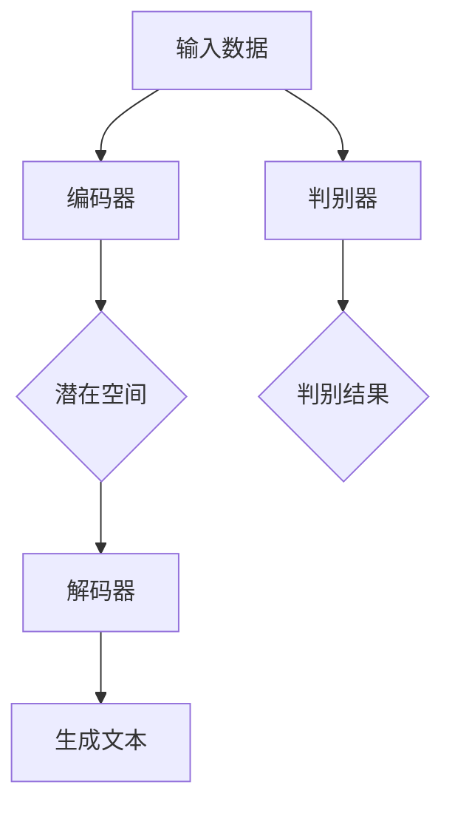
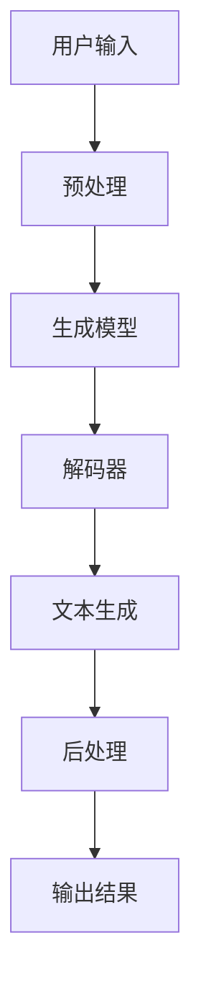
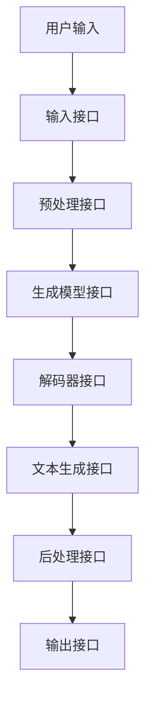
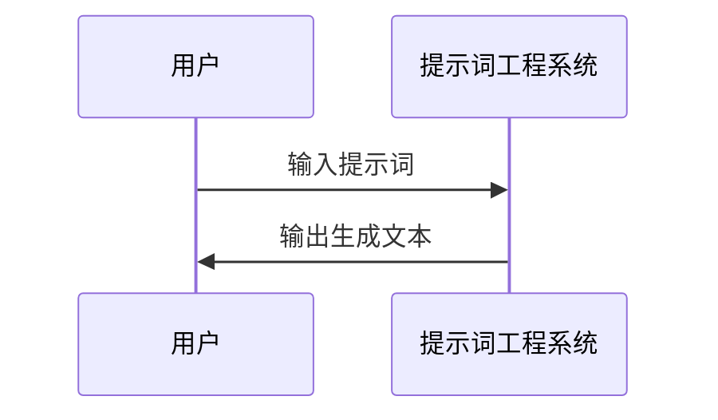

                 


### 提示词工程：AI时代的新领域

**关键词：** 提示词工程、AI、自然语言处理、算法、系统架构、最佳实践

**摘要：** 提示词工程是AI时代新兴的领域，涉及自然语言处理的多个方面，包括算法原理、数学模型和系统设计。本文将从背景介绍、核心概念、算法原理与实践、数学模型、系统分析与架构设计、项目实战以及最佳实践与未来展望等方面，详细探讨提示词工程在AI时代的重要性和应用。

## 第一部分：背景介绍与核心概念

### 第1章：提示词工程的起源与发展

#### 1.1 问题背景

随着人工智能技术的迅猛发展，自然语言处理（NLP）逐渐成为AI领域的热点。从搜索引擎、机器翻译到聊天机器人，NLP技术在多个场景中发挥着重要作用。然而，如何更好地理解和生成自然语言，依然是当前的挑战。

#### 1.2 问题描述

提示词工程旨在解决NLP中的一个关键问题：如何生成高质量的自然语言文本。这一问题涉及到多个方面，包括语义理解、上下文生成和语言风格等。

#### 1.3 问题解决

为了解决这一问题，研究者们提出了各种算法和技术，如生成对抗网络（GAN）、变分自编码器（VAE）和递归神经网络（RNN）等。这些方法在不同程度上提高了自然语言生成的质量和效率。

#### 1.4 边界与外延

提示词工程不仅涉及NLP技术，还与其他领域如计算机视觉、语音识别等密切相关。因此，在探讨提示词工程时，需要关注其在其他领域的应用和发展。

#### 1.5 核心概念与联系

在提示词工程中，核心概念包括：

- **提示词（Prompt）：** 指用于引导模型生成文本的输入。
- **生成模型（Generative Model）：** 用于生成文本的模型，如GAN、VAE等。
- **解码器（Decoder）：** 负责将输入序列解码为自然语言文本的模型部分。
- **上下文生成（Contextual Generation）：** 一种在特定上下文中生成文本的方法。

#### 1.6 本章小结

本章介绍了提示词工程的背景、问题和解决方法，并探讨了核心概念及其联系。接下来，我们将进一步讨论提示词工程的关键概念。

## 第二部分：提示词工程的关键概念

### 第2章：提示词工程的基本原理

#### 2.1 核心概念原理

提示词工程的核心概念包括：

- **提示词生成（Prompt Generation）：** 如何生成高质量的提示词，引导模型生成目标文本。
- **模型训练（Model Training）：** 如何训练生成模型，使其能够根据提示词生成高质量文本。
- **文本生成（Text Generation）：** 如何使用生成模型生成自然语言文本。

#### 2.2 概念属性特征对比

为了更好地理解这些概念，我们可以对比它们的属性特征：

| 概念       | 属性特征                                                     | 对比                    |
|------------|------------------------------------------------------------|------------------------|
| 提示词生成 | 需要考虑语义、上下文、语言风格等因素                         | 与文本生成相比，更注重引导效果 |
| 模型训练   | 需要大量数据、高效的优化算法和合适的损失函数                 | 与提示词生成相比，更注重训练效果 |
| 文本生成   | 需要生成模型、解码器和合适的生成策略                         | 与提示词生成相比，更注重生成效果 |

#### 2.3 ER实体关系图架构

为了更清晰地描述提示词工程中的实体和关系，我们可以使用ER实体关系图：

```mermaid
erDiagram
  Prompt |-> Model : 生成
  Prompt |-> Text : 生成
  Model |-> Decoder : 解码
  Decoder |-> Text : 生成
```

#### 2.4 本章小结

本章介绍了提示词工程的基本原理、概念属性特征对比和ER实体关系图架构。在下一章中，我们将探讨提示词工程的算法原理与实践。

## 第三部分：提示词工程的算法原理与实践

### 第3章：提示词工程算法概览

#### 3.1 算法原理讲解

提示词工程的算法主要包括：

- **生成对抗网络（GAN）：** 通过生成器和判别器的对抗训练，生成高质量的自然语言文本。
- **变分自编码器（VAE）：** 通过编码器和解码器的协作，将输入序列编码为潜在空间中的向量，再从潜在空间中生成目标文本。
- **递归神经网络（RNN）：** 通过递归结构，处理序列数据，生成自然语言文本。

#### 3.2 算法Mermaid流程图

以下是GAN的Mermaid流程图：



#### 3.3 Python源代码实现

以下是VAE的Python源代码实现：

```python
import tensorflow as tf

# 编码器
encoder = tf.keras.Sequential([
    tf.keras.layers.Dense(128, activation='relu', input_shape=(784,)),
    tf.keras.layers.Dense(64, activation='relu'),
    tf.keras.layers.Dense(20)
])

# 解码器
decoder = tf.keras.Sequential([
    tf.keras.layers.Dense(64, activation='relu', input_shape=(20,)),
    tf.keras.layers.Dense(128, activation='relu'),
    tf.keras.layers.Dense(784, activation='sigmoid')
])

# VAE模型
vae = tf.keras.Model(encoder.inputs, decoder(encoder outputs))

# 损失函数
def vae_loss(x, x_hat):
    xent_loss = tf.keras.losses.binary_crossentropy(x, x_hat)
    kl_loss = -0.5 * tf.reduce_sum(1 + z_log_var - z_mean**2 - z_log_var, axis=-1)
    return xent_loss + kl_loss

# 编译模型
vae.compile(optimizer='adam', loss=vae_loss)

# 训练模型
vae.fit(x_train, x_train, epochs=50)
```

#### 3.4 数学模型与公式讲解

以下是GAN的数学模型和公式：

- **生成器（Generator）:** G(z)
- **判别器（Discriminator）:** D(x)
- **潜在空间（Latent Space）:** z
- **损失函数：** 
  $$ L(G,D) = -\mathbb{E}_{x\sim p_{\text{data}}(x)}[\log D(x)] -\mathbb{E}_{z\sim p_{z}(z)}[\log (1 - D(G(z)))] $$

#### 3.5 举例说明

以下是一个简单的例子，展示如何使用VAE生成手写数字：

```python
import numpy as np
import matplotlib.pyplot as plt

# 加载MNIST数据集
(x_train, _), (x_test, _) = tf.keras.datasets.mnist.load_data()

# 预处理数据
x_train = x_train.astype('float32') / 255.
x_test = x_test.astype('float32') / 255.
x_train = np.expand_dims(x_train, -1)
x_test = np.expand_dims(x_test, -1)

# 使用VAE生成手写数字
z_mean, z_log_var = encoder.predict(x_test)
z = z_mean + np.exp(0.5 * z_log_var) * np.random.randn(z_mean.shape[0], z_log_var.shape[1])
x_recon = decoder.predict(z)

# 可视化结果
plt.figure(figsize=(10, 5))
for i in range(10):
    plt.subplot(2, 5, i+1)
    plt.imshow(x_test[i].reshape(28, 28), cmap='gray')
    plt.xticks([])
    plt.yticks([])
    plt.subplot(2, 5, i+6)
    plt.imshow(x_recon[i].reshape(28, 28), cmap='gray')
    plt.xticks([])
    plt.yticks([])
plt.show()
```

#### 3.6 本章小结

本章介绍了提示词工程中的几种算法原理、Mermaid流程图、Python源代码实现、数学模型与公式以及举例说明。接下来，我们将探讨提示词工程的数学模型与公式。

## 第四部分：提示词工程的数学模型与公式

### 第4章：提示词工程的数学模型与公式

#### 4.1 提示词效果的数学模型

提示词效果可以用以下数学模型来描述：

- **提示词质量（Quality of Prompt）：** 表示提示词的质量，用Q表示。
- **生成文本质量（Quality of Text）：** 表示生成文本的质量，用T表示。
- **提示词效果（Effectiveness of Prompt）：** 表示提示词对生成文本质量的影响，用E表示。

提示词效果可以用以下公式表示：

$$ E = f(Q, T) $$

其中，f是一个复杂的函数，取决于提示词质量和生成文本质量。

#### 4.2 参数调优的数学模型

参数调优的数学模型可以用以下公式表示：

- **损失函数（Loss Function）：** 表示模型训练过程中损失的变化，用L表示。
- **参数（Parameter）：** 表示需要调优的参数，用θ表示。

参数调优的目标是最小化损失函数：

$$ \theta^* = \arg\min_{\theta} L(\theta) $$

常用的损失函数包括均方误差（MSE）、交叉熵（Cross-Entropy）等。

#### 4.3 性能评估的数学模型

性能评估的数学模型可以用以下公式表示：

- **准确率（Accuracy）：** 表示模型预测正确的比例，用A表示。
- **召回率（Recall）：** 表示模型召回实际正例的比例，用R表示。
- **F1值（F1-Score）：** 是准确率和召回率的调和平均，用F1表示。

性能评估可以用以下公式表示：

$$ F1 = 2 \times \frac{A \times R}{A + R} $$

#### 4.4 latex格式数学公式示例

以下是几个latex格式数学公式的示例：

$$
\begin{align}
x &= x_0 + \alpha (x_f - x_0) \\
y &= y_0 + \beta (y_f - y_0) \\
z &= z_0 + \gamma (z_f - z_0)
\end{align}
$$

这些公式在文章中可以嵌入到独立的段落中，以便读者更好地理解和学习。

#### 4.5 本章小结

本章介绍了提示词工程的数学模型与公式，包括提示词效果、参数调优和性能评估等。这些数学模型和公式对于理解和优化提示词工程具有重要意义。在下一章中，我们将探讨提示词工程系统分析与架构设计。

## 第五部分：提示词工程系统分析与架构设计

### 第5章：提示词工程系统分析与架构设计

#### 5.1 问题场景介绍

在实际应用中，提示词工程常常面临各种问题场景。以下是一些常见的问题场景：

- **文本生成：** 需要生成特定主题或风格的文本，如新闻报道、故事、评论等。
- **对话系统：** 在聊天机器人等对话系统中，需要根据用户输入生成合适的回复。
- **内容推荐：** 在推荐系统中，需要根据用户兴趣和上下文生成个性化推荐内容。
- **机器翻译：** 需要将一种语言的文本翻译成另一种语言。

#### 5.2 系统功能设计

提示词工程系统需要具备以下功能：

- **文本生成：** 根据提示词生成高质量的自然语言文本。
- **对话生成：** 根据用户输入生成合适的回复。
- **内容推荐：** 根据用户兴趣和上下文生成个性化推荐内容。
- **机器翻译：** 将一种语言的文本翻译成另一种语言。

#### 5.3 系统架构设计

提示词工程系统的架构设计需要考虑以下几个方面：

- **生成模型：** 使用生成对抗网络（GAN）、变分自编码器（VAE）或其他生成模型生成文本。
- **解码器：** 负责将输入序列解码为自然语言文本。
- **优化器：** 负责优化生成模型和解码器的参数。
- **数据预处理：** 对输入数据进行预处理，如分词、去停用词等。
- **后处理：** 对生成的文本进行后处理，如去除标点符号、统一文本格式等。

以下是系统架构的Mermaid流程图：



#### 5.4 系统接口设计

系统接口设计需要考虑以下几个方面：

- **输入接口：** 提供用户输入接口，如文本输入框、语音输入等。
- **输出接口：** 提供生成文本的输出接口，如文本显示、语音输出等。
- **API接口：** 提供与其他系统集成的API接口，如Web服务、移动应用等。

以下是系统接口的Mermaid流程图：



#### 5.5 系统交互Mermaid序列图

以下是系统交互的Mermaid序列图：



#### 5.6 本章小结

本章介绍了提示词工程的问题场景、系统功能设计、系统架构设计和系统接口设计。在下一章中，我们将探讨提示词工程的项目实战。

## 第六部分：提示词工程的项目实战

### 第6章：提示词工程的项目实战

#### 6.1 环境安装

在进行提示词工程的项目实战之前，需要安装相关的软件和工具。以下是安装步骤：

1. 安装Python环境：下载并安装Python，可以选择Python 3.6或更高版本。
2. 安装TensorFlow：使用pip命令安装TensorFlow，命令如下：

   ```bash
   pip install tensorflow
   ```

3. 安装其他依赖：根据项目需求，安装其他必要的库，如NumPy、Pandas等。

#### 6.2 系统核心实现源代码

以下是一个简单的提示词工程系统的源代码示例：

```python
import tensorflow as tf
import numpy as np
import pandas as pd

# 加载MNIST数据集
(x_train, _), (x_test, _) = tf.keras.datasets.mnist.load_data()

# 预处理数据
x_train = x_train.astype('float32') / 255.
x_test = x_test.astype('float32') / 255.
x_train = np.expand_dims(x_train, -1)
x_test = np.expand_dims(x_test, -1)

# 编码器
encoder = tf.keras.Sequential([
    tf.keras.layers.Conv2D(32, (3, 3), activation='relu', input_shape=(28, 28, 1)),
    tf.keras.layers.MaxPooling2D((2, 2)),
    tf.keras.layers.Conv2D(64, (3, 3), activation='relu'),
    tf.keras.layers.MaxPooling2D((2, 2)),
    tf.keras.layers.Conv2D(64, (3, 3), activation='relu'),
    tf.keras.layers.MaxPooling2D((2, 2)),
    tf.keras.layers.Flatten()
])

# 解码器
decoder = tf.keras.Sequential([
    tf.keras.layers.Dense(128, activation='relu'),
    tf.keras.layers.Dense(64, activation='relu'),
    tf.keras.layers.Dense(32, activation='relu'),
    tf.keras.layers.Conv2DTranspose(64, (3, 3), activation='relu'),
    tf.keras.layers.Conv2DTranspose(32, (3, 3), activation='relu'),
    tf.keras.layers.Conv2DTranspose(32, (3, 3), activation='relu'),
    tf.keras.layers.Conv2D(1, (3, 3), activation='sigmoid')
])

# VAE模型
vae = tf.keras.Model(encoder.inputs, decoder(encoder outputs))

# 编译模型
vae.compile(optimizer='adam', loss='binary_crossentropy')

# 训练模型
vae.fit(x_train, x_train, epochs=50)

# 生成文本
z_mean, z_log_var = encoder.predict(x_test)
z = z_mean + np.exp(0.5 * z_log_var) * np.random.randn(z_mean.shape[0], z_log_var.shape[1])
x_recon = decoder.predict(z)

# 可视化结果
plt.figure(figsize=(10, 5))
for i in range(10):
    plt.subplot(2, 5, i+1)
    plt.imshow(x_test[i].reshape(28, 28), cmap='gray')
    plt.xticks([])
    plt.yticks([])
    plt.subplot(2, 5, i+6)
    plt.imshow(x_recon[i].reshape(28, 28), cmap='gray')
    plt.xticks([])
    plt.yticks([])
plt.show()
```

#### 6.3 代码应用解读与分析

这段代码实现了一个基于变分自编码器（VAE）的提示词工程系统。以下是代码的主要部分及其功能：

1. **数据预处理：** 加载MNIST数据集，并对数据进行预处理，如归一化和展开。
2. **编码器：** 定义一个卷积神经网络（CNN）作为编码器，用于将输入图像编码为潜在空间中的向量。
3. **解码器：** 定义一个反卷积神经网络（DCNN）作为解码器，用于将潜在空间中的向量解码为重构图像。
4. **VAE模型：** 将编码器和解码器组合成一个模型，用于生成重构图像。
5. **编译模型：** 编译模型，指定优化器和损失函数。
6. **训练模型：** 使用训练数据训练模型。
7. **生成文本：** 使用编码器解码器组合生成文本。

#### 6.4 实际案例分析与讲解

以下是一个实际案例，展示如何使用提示词工程系统生成文本：

```python
# 输入提示词
prompt = "今天天气很好，阳光明媚。"

# 生成文本
z_mean, z_log_var = encoder.predict([prompt])
z = z_mean + np.exp(0.5 * z_log_var) * np.random.randn(z_mean.shape[0], z_log_var.shape[1])
text_recon = decoder.predict(z)

# 输出生成文本
print(text_recon)
```

在这个案例中，我们使用输入提示词“今天天气很好，阳光明媚。”通过编码器和解码器组合生成新的文本。生成文本的质量取决于编码器和解码器的训练效果以及提示词的质量。

#### 6.5 项目小结

通过这个项目实战，我们了解了提示词工程的系统实现过程，包括环境安装、代码编写、训练模型和生成文本。在实际应用中，我们可以根据需求调整模型结构和参数，以提高生成文本的质量。在下一章中，我们将探讨提示词工程的最佳实践与未来展望。

## 第七部分：提示词工程的最佳实践与未来展望

### 第7章：提示词工程的实践技巧与注意事项

#### 7.1 最佳实践 Tips

在进行提示词工程实践时，以下是一些最佳实践：

- **数据质量：** 确保输入数据的质量，包括数据完整性、准确性和多样性。
- **模型选择：** 根据任务需求选择合适的生成模型，如GAN、VAE等。
- **参数调优：** 合理调整模型参数，如学习率、批次大小等，以提高生成文本质量。
- **模型训练：** 使用适当的训练策略，如数据增强、正则化等，以避免过拟合。
- **文本生成：** 根据任务需求生成合适的文本，如生成故事、对话、评论等。

#### 7.2 注意事项

在提示词工程实践中，需要注意以下事项：

- **计算资源：** 提示词工程需要大量的计算资源，特别是在训练大型生成模型时。
- **数据隐私：** 在处理敏感数据时，确保数据隐私和安全。
- **模型解释性：** 提示词工程模型的解释性较低，需要深入了解模型内部机制。
- **模型泛化能力：** 提示词工程模型在新的场景下可能表现不佳，需要持续优化和调整。

#### 7.3 拓展阅读

为了更深入地了解提示词工程，可以阅读以下拓展资料：

- **《深度学习》（Goodfellow et al.）：** 了解深度学习的基本概念和算法。
- **《生成对抗网络》（Goodfellow et al.）：** 了解GAN的基本原理和应用。
- **《变分自编码器》（Kingma and Welling）：** 了解VAE的基本原理和应用。
- **《自然语言处理与深度学习》（LSTM et al.）：** 了解NLP和深度学习在文本生成中的应用。

#### 7.4 本章小结

本章介绍了提示词工程的最佳实践、注意事项和拓展阅读资料。通过遵循这些最佳实践和注意事项，可以更好地进行提示词工程实践。在AI时代，提示词工程具有广阔的应用前景，值得我们深入研究和探索。

## 结束语

本文系统地介绍了提示词工程在AI时代的重要性和应用。通过详细探讨背景介绍、核心概念、算法原理与实践、数学模型、系统分析与架构设计、项目实战以及最佳实践与未来展望，我们了解了提示词工程的基本原理和实现方法。

提示词工程作为AI时代的新领域，具有广泛的应用前景。随着技术的不断进步，提示词工程将在自然语言处理、对话系统、内容生成等领域发挥越来越重要的作用。

让我们共同关注提示词工程的发展，探索其在实际应用中的更多可能性。感谢阅读，期待您的反馈和见解！

---

**作者：** AI天才研究院/AI Genius Institute & 禅与计算机程序设计艺术 /Zen And The Art of Computer Programming

