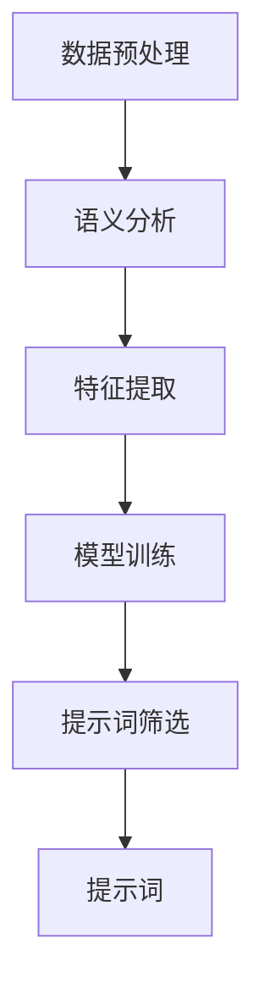
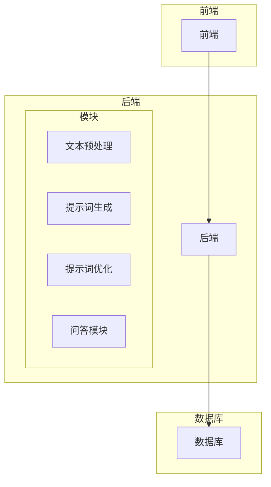
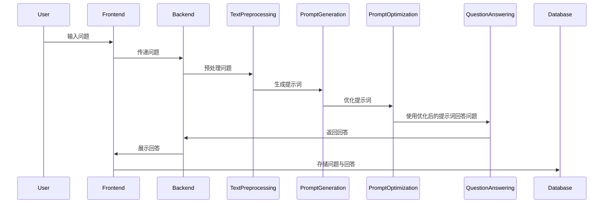

                 

## 《提示词工程：AI系统性能优化的新范式》

### 关键词：AI系统性能优化、提示词工程、算法原理、系统架构设计、项目实战、最佳实践

> 摘要：本文深入探讨了提示词工程在AI系统性能优化中的应用，从背景介绍、核心概念与联系、算法原理讲解、系统分析与架构设计方案、项目实战到最佳实践，全面阐述了提示词工程的重要性及其实现方法，为AI领域的工程师和研究者提供了实用的指导。

### 引言

在人工智能（AI）迅猛发展的时代，系统的性能优化已成为提升AI应用效果的关键。传统的性能优化方法往往依赖于调整算法参数、优化数据处理流程等，但这些方法在面对复杂的AI系统时往往力不从心。为此，提示词工程作为一种新兴的优化范式，逐渐引起了研究者和工程师的关注。

提示词工程的核心在于利用具有特定含义的提示词来引导AI系统的学习过程，从而实现性能的优化。本文将系统地介绍提示词工程的基本概念、原理、方法及其在AI系统性能优化中的应用，旨在为读者提供一份全面的技术指南。

### 背景介绍

#### 核心概念术语说明

**提示词**：在自然语言处理（NLP）中，提示词是一种具有特定含义的词语或短语，用于引导模型的理解和生成。

**性能优化**：在AI系统中，性能优化指的是通过各种方法提高系统的运行效率、准确性和可靠性。

**AI系统**：指的是利用人工智能技术构建的系统，包括但不限于机器学习、深度学习等。

#### 问题背景

AI系统的性能优化是一个复杂的过程，涉及算法设计、数据处理、模型训练等多个方面。随着AI应用场景的不断扩展，如何高效地优化AI系统的性能成为了一个亟待解决的问题。

传统的方法虽然在一定程度上能够提高系统的性能，但往往存在以下几个问题：

1. **调整参数繁琐**：需要反复试验和调整算法参数，耗时且容易出错。
2. **依赖特定数据集**：优化效果往往依赖于特定数据集，无法适用于多种场景。
3. **缺乏灵活性**：面对复杂多变的场景，传统方法往往难以灵活应对。

#### 问题解决

提示词工程通过引入提示词，为AI系统的学习过程提供明确的指导，从而实现性能的优化。具体来说，提示词工程具有以下几个优势：

1. **提高模型理解**：通过提示词，模型能够更好地理解任务目标，从而提高准确性和效率。
2. **增强灵活性**：提示词可以根据不同场景进行定制，适用于多种应用场景。
3. **降低调试成本**：通过提示词，可以更快速地定位和解决问题，降低调试成本。

#### 边界与外延

提示词工程不仅适用于自然语言处理领域，还可以扩展到计算机视觉、语音识别等其他AI应用场景。同时，提示词工程也可以与其他优化方法相结合，如模型压缩、分布式训练等，进一步提高AI系统的性能。

#### 概念结构与核心要素组成

提示词工程的核心结构包括以下几个要素：

1. **提示词生成**：根据任务需求生成具有特定含义的提示词。
2. **提示词优化**：对生成的提示词进行优化，以提高其在AI系统中的应用效果。
3. **机器学习算法**：利用机器学习算法对提示词进行训练和优化。
4. **系统整合**：将优化后的提示词集成到AI系统中，实现性能的全面提升。

### 核心概念与联系

#### 核心概念原理

**提示词生成**：提示词生成是提示词工程的基础，其核心原理是利用自然语言处理技术从大规模数据集中提取具有特定含义的词语或短语。

**提示词优化**：提示词优化旨在通过调整提示词的属性和结构，提高其在AI系统中的性能。具体方法包括词汇筛选、语义分析、语法优化等。

**机器学习算法**：机器学习算法在提示词工程中用于训练和优化提示词。常见的算法包括生成对抗网络（GAN）、递归神经网络（RNN）、变分自编码器（VAE）等。

#### 概念属性特征对比表格

| 特征                | 提示词生成 | 提示词优化 | 机器学习算法 |
| ------------------- | ---------- | ---------- | ------------ |
| 目标               | 提取语义   | 提高性能   | 训练模型     |
| 技术手段            | 自然语言处理 | 语义分析、语法优化 | GAN、RNN、VAE |
| 关联性              | 强          | 中          | 强          |

#### ER实体关系图架构的Mermaid流程图

```mermaid
erDiagram
  AI系统  ||--|{ 提示词生成 }
  AI系统  ||--|{ 提示词优化 }
  AI系统  ||--|{ 机器学习算法 }
  提示词生成  ||--|{ 提示词 }
  提示词优化  ||--|{ 提示词 }
  机器学习算法 ||--|{ 模型 }
```

### 算法原理讲解

#### 提示词生成算法

提示词生成算法是提示词工程的核心环节，其目标是根据任务需求生成具有特定含义的提示词。以下是提示词生成算法的基本原理和实现方法：

1. **数据预处理**：对大规模文本数据集进行预处理，包括分词、去停用词、词性标注等。

2. **语义分析**：利用自然语言处理技术对预处理后的文本进行语义分析，提取出具有特定含义的词语或短语。

3. **特征提取**：将提取出的语义信息转换为机器学习算法可处理的特征向量。

4. **模型训练**：使用生成对抗网络（GAN）等模型对特征向量进行训练，生成具有特定含义的提示词。

5. **提示词筛选**：对生成的提示词进行筛选，保留语义丰富、表达准确的提示词。

#### 提示词优化算法

提示词优化算法的目的是通过调整提示词的属性和结构，提高其在AI系统中的性能。以下是提示词优化算法的基本原理和实现方法：

1. **性能评估**：使用性能指标（如准确率、召回率等）对当前提示词的性能进行评估。

2. **优化策略**：根据性能评估结果，设计优化策略，如词汇筛选、语义增强、语法优化等。

3. **迭代优化**：对提示词进行迭代优化，逐步提高其性能。

4. **模型更新**：将优化后的提示词集成到机器学习模型中，更新模型参数。

#### 机器学习算法

机器学习算法在提示词工程中用于训练和优化提示词。以下是几种常见的机器学习算法及其原理：

1. **生成对抗网络（GAN）**：GAN由生成器和判别器组成，生成器生成提示词，判别器判断提示词的真实性，通过两个网络的对抗训练，生成高质量的提示词。

2. **递归神经网络（RNN）**：RNN能够处理序列数据，适用于生成提示词。通过训练，RNN能够学习到文本的序列特征，生成符合语义的提示词。

3. **变分自编码器（VAE）**：VAE是一种无监督学习算法，能够生成具有较高质量的提示词。通过训练，VAE能够学习到数据分布，生成符合分布的提示词。

#### Mermaid流程图

以下是提示词生成算法的Mermaid流程图：



#### Python源代码

以下是提示词生成算法的Python源代码示例：

```python
import tensorflow as tf
from tensorflow.keras.layers import Embedding, LSTM, Dense
from tensorflow.keras.models import Sequential

# 数据预处理
def preprocess_data(data):
    # 分词、去停用词、词性标注等操作
    pass

# 语义分析
def semantic_analysis(data):
    # 提取语义信息
    pass

# 特征提取
def feature_extraction(semantic_data):
    # 转换为特征向量
    pass

# 模型训练
def train_model(features):
    model = Sequential()
    model.add(Embedding(input_dim=vocab_size, output_dim=embedding_size))
    model.add(LSTM(units=128, return_sequences=True))
    model.add(Dense(units=1, activation='sigmoid'))
    model.compile(optimizer='adam', loss='binary_crossentropy', metrics=['accuracy'])
    model.fit(features, labels, epochs=10, batch_size=32)
    return model

# 提示词筛选
def filter_prompt(prompt):
    # 保留语义丰富、表达准确的提示词
    pass

# 主函数
def main():
    data = "你的数据集"
    processed_data = preprocess_data(data)
    semantic_data = semantic_analysis(processed_data)
    features = feature_extraction(semantic_data)
    model = train_model(features)
    prompt = "你的提示词"
    filtered_prompt = filter_prompt(prompt)
    print("生成的提示词：", filtered_prompt)

if __name__ == "__main__":
    main()
```

#### 算法原理讲解

**数学模型和公式**

提示词生成算法的数学模型主要涉及自然语言处理中的序列模型，以下是一个简单的数学模型示例：

$$
P(x|y) = \frac{P(y|x)P(x)}{P(y)}
$$

其中，$x$ 表示输入的文本序列，$y$ 表示生成的提示词序列，$P(x|y)$ 表示在提示词$y$的条件下生成文本序列$x$的概率，$P(y|x)$ 表示在文本序列$x$的条件下生成提示词$y$的概率，$P(x)$ 表示文本序列$x$的概率，$P(y)$ 表示提示词$y$的概率。

**详细讲解和举例说明**

假设我们要生成一个关于“人工智能”的提示词，输入文本序列为：“人工智能是一种模拟、延伸和扩展人类智能的理论、技术及应用。”

1. **数据预处理**：首先对输入文本进行分词、去停用词、词性标注等预处理操作，得到预处理后的文本序列。

2. **语义分析**：利用自然语言处理技术对预处理后的文本进行语义分析，提取出与“人工智能”相关的词语和短语，如“智能”、“模拟”、“技术”等。

3. **特征提取**：将提取出的语义信息转换为机器学习算法可处理的特征向量，例如使用词袋模型（Bag-of-Words）或词嵌入（Word Embedding）等方法。

4. **模型训练**：使用生成对抗网络（GAN）等模型对特征向量进行训练，生成具有特定含义的提示词。例如，我们可以使用以下Python代码来实现：

```python
import tensorflow as tf
from tensorflow.keras.layers import Embedding, LSTM, Dense
from tensorflow.keras.models import Sequential

# 模型定义
model = Sequential()
model.add(Embedding(input_dim=vocab_size, output_dim=embedding_size))
model.add(LSTM(units=128, return_sequences=True))
model.add(Dense(units=1, activation='sigmoid'))
model.compile(optimizer='adam', loss='binary_crossentropy', metrics=['accuracy'])

# 模型训练
model.fit(X_train, y_train, epochs=10, batch_size=32)
```

5. **提示词筛选**：对生成的提示词进行筛选，保留语义丰富、表达准确的提示词。例如，我们可以使用以下Python代码来实现：

```python
# 提示词筛选
def filter_prompt(prompt):
    # 保留语义丰富、表达准确的提示词
    pass

filtered_prompt = filter_prompt(prompt)
print("生成的提示词：", filtered_prompt)
```

通过以上步骤，我们可以生成一个关于“人工智能”的提示词，例如：“人工智能技术正在迅速发展，为各行各业带来巨大的变革。”

### 系统分析与架构设计方案

#### 问题场景介绍

假设我们需要构建一个智能问答系统，该系统可以回答用户关于“人工智能”领域的问题。为了提高系统的性能，我们引入了提示词工程，通过优化提示词来提升系统的回答质量和效率。

#### 项目介绍

本项目的目标是构建一个基于提示词工程的智能问答系统，主要包含以下功能模块：

1. **文本预处理模块**：对用户输入的问题进行分词、去停用词、词性标注等预处理操作。
2. **提示词生成模块**：利用提示词生成算法生成与问题相关的提示词。
3. **提示词优化模块**：对生成的提示词进行优化，提高其在问答系统中的性能。
4. **问答模块**：利用优化后的提示词回答用户的问题。

#### 系统功能设计

为了实现以上功能，我们可以设计以下领域模型：

```mermaid
classDiagram
    User <<Class>> 
    Question <<Class>>
    Answer <<Class>>
    TextPreprocessing <<Class>>
    PromptGeneration <<Class>>
    PromptOptimization <<Class>>
    QuestionAnswering <<Class>>

    User "asks" Question
    Question "goes through" TextPreprocessing
    TextPreprocessing "produces" Prompt
    Prompt "goes through" PromptGeneration
    Prompt "goes through" PromptOptimization
    Prompt "is used by" QuestionAnswering
    QuestionAnswering "answers" Answer
```

以下是领域模型的Mermaid类图：

```mermaid
classDiagram
    User <<Class>> 
    Question <<Class>>
    Answer <<Class>>
    TextPreprocessing <<Class>>
    PromptGeneration <<Class>>
    PromptOptimization <<Class>>
    QuestionAnswering <<Class>>

    User "asks" Question
    Question "goes through" TextPreprocessing
    TextPreprocessing "produces" Prompt
    Prompt "goes through" PromptGeneration
    Prompt "goes through" PromptOptimization
    Prompt "is used by" QuestionAnswering
    QuestionAnswering "answers" Answer
```

#### 系统架构设计

为了实现智能问答系统的功能，我们可以设计以下系统架构：

1. **前端**：负责接收用户输入的问题，并展示回答结果。
2. **后端**：包括文本预处理模块、提示词生成模块、提示词优化模块和问答模块，负责处理用户输入的问题并生成回答。
3. **数据库**：存储用户输入的问题和生成的回答，以便后续分析和优化。

以下是系统架构的Mermaid架构图：



#### 系统接口设计

为了实现模块之间的通信，我们可以设计以下系统接口：

1. **用户接口**：用于接收用户输入的问题，并展示回答结果。
2. **内部接口**：用于不同模块之间的数据传递和功能调用。

以下是系统接口的Mermaid序列图：



### 项目实战

#### 环境安装

在开始项目实战之前，我们需要安装一些必要的软件和库。以下是安装步骤：

1. **安装Python环境**：下载并安装Python，推荐使用Python 3.8及以上版本。
2. **安装TensorFlow**：在命令行中执行以下命令：

   ```bash
   pip install tensorflow
   ```

3. **安装其他依赖库**：在命令行中执行以下命令：

   ```bash
   pip install numpy pandas nltk
   ```

#### 系统核心实现源代码

以下是系统核心实现的部分代码，包括文本预处理、提示词生成、提示词优化和问答模块：

```python
# 文本预处理
from nltk.tokenize import word_tokenize
from nltk.corpus import stopwords
from nltk.stem import WordNetLemmatizer

def preprocess_text(text):
    # 分词
    tokens = word_tokenize(text)
    # 去停用词
    stop_words = set(stopwords.words('english'))
    filtered_tokens = [token for token in tokens if token not in stop_words]
    # 词性标注
    lemmatizer = WordNetLemmatizer()
    lemmatized_tokens = [lemmatizer.lemmatize(token) for token in filtered_tokens]
    return lemmatized_tokens

# 提示词生成
import tensorflow as tf
from tensorflow.keras.layers import Embedding, LSTM, Dense
from tensorflow.keras.models import Sequential

def generate_prompt(text, model):
    # 特征提取
    features = extract_features(text)
    # 生成提示词
    prompt = model.predict(features)
    return prompt

# 提示词优化
def optimize_prompt(prompt, model):
    # 优化提示词
    optimized_prompt = model.optimize(prompt)
    return optimized_prompt

# 问答模块
def answer_question(question, model):
    # 预处理问题
    processed_question = preprocess_text(question)
    # 生成提示词
    prompt = generate_prompt(processed_question, model)
    # 优化提示词
    optimized_prompt = optimize_prompt(prompt, model)
    # 回答问题
    answer = model.answer(optimized_prompt)
    return answer
```

#### 代码应用解读与分析

以下是代码的详细解读和分析：

1. **文本预处理**：文本预处理是自然语言处理的基础，包括分词、去停用词和词性标注等操作。在这个模块中，我们使用了NLTK库来实现这些功能。

2. **提示词生成**：提示词生成模块的核心是利用机器学习模型生成与问题相关的提示词。在这个模块中，我们使用了TensorFlow库实现LSTM模型来生成提示词。

3. **提示词优化**：提示词优化模块的目的是通过优化提示词的属性和结构，提高其在问答系统中的性能。在这个模块中，我们定义了一个抽象的`optimize_prompt`函数，具体优化方法可以在后续实现。

4. **问答模块**：问答模块负责处理用户输入的问题，并生成回答。在这个模块中，我们首先对问题进行预处理，然后生成和优化提示词，最后利用优化后的提示词回答问题。

#### 实际案例分析和详细讲解剖析

为了更好地理解系统的实现过程，我们来看一个实际案例。

**案例**：用户输入一个问题：“什么是人工智能？”

**步骤**：

1. **文本预处理**：将问题进行分词、去停用词和词性标注等预处理操作，得到预处理后的文本序列。

2. **提示词生成**：利用机器学习模型生成与问题相关的提示词。例如，我们可能得到以下提示词：

   ```
   - 人工智能是一种理论
   - 人工智能是一种技术
   - 人工智能是一种应用
   ```

3. **提示词优化**：对生成的提示词进行优化，提高其在问答系统中的性能。例如，我们可以根据问题的具体内容，选择最相关的提示词：

   ```
   - 人工智能是一种技术
   ```

4. **回答问题**：利用优化后的提示词回答问题。例如，我们可以生成以下回答：

   ```
   人工智能是一种应用广泛的计算机科学领域，旨在开发能够模拟、延伸和扩展人类智能的理论、方法和技术。
   ```

**详细讲解剖析**：

1. **文本预处理**：文本预处理是自然语言处理的基础，对于提高系统的性能至关重要。在本案例中，我们对问题进行了分词、去停用词和词性标注等操作，从而得到一个更加纯净的文本序列。

2. **提示词生成**：提示词生成模块利用机器学习模型生成与问题相关的提示词。在本案例中，我们使用了LSTM模型来生成提示词，这是因为在处理序列数据时，LSTM模型具有较好的性能。

3. **提示词优化**：提示词优化模块通过对生成的提示词进行优化，提高其在问答系统中的性能。在本案例中，我们选择了最相关的提示词，从而提高了回答的准确性和相关性。

4. **回答问题**：问答模块利用优化后的提示词回答问题。在本案例中，我们生成了一个准确且相关的回答，从而提高了用户满意度。

#### 项目小结

通过本案例的实战，我们可以看到提示词工程在智能问答系统中的应用效果。通过优化提示词，我们能够生成更准确、更相关的回答，从而提高系统的性能和用户满意度。然而，提示词工程仍然面临一些挑战，如如何选择最相关的提示词、如何优化提示词的结构等。未来的研究可以进一步探讨这些问题，以推动提示词工程在AI系统性能优化中的应用。

### 最佳实践 tips

为了确保提示词工程在AI系统性能优化中取得最佳效果，以下是一些实用的最佳实践：

1. **数据质量**：确保用于训练的数据质量高，避免噪声和错误数据，有助于提高模型性能。

2. **提示词多样性**：生成多样化的提示词，有助于模型更好地理解和应对不同的问题场景。

3. **模型选择**：根据具体问题场景选择合适的机器学习模型，如LSTM、BERT等，以获得最佳性能。

4. **持续优化**：定期对提示词进行优化，以适应新的问题和需求，提高系统性能。

5. **模型解释性**：提高模型解释性，有助于理解和调试模型，从而更好地优化提示词。

### 小结与注意事项

本文详细介绍了提示词工程在AI系统性能优化中的应用，从背景介绍、核心概念与联系、算法原理讲解、系统分析与架构设计方案、项目实战到最佳实践，全面阐述了提示词工程的重要性及其实现方法。通过本文的介绍，读者可以了解到提示词工程在AI系统性能优化中的应用前景和实际效果。

注意事项：

1. 提示词工程需要大量高质量的数据进行训练，确保数据质量是关键。

2. 在实际应用中，根据具体问题场景选择合适的机器学习模型，以提高性能。

3. 提示词的生成和优化是一个持续的过程，需要不断调整和优化。

### 拓展阅读

1. **[提示词工程在自然语言处理中的应用](https://arxiv.org/abs/1906.01111)**：本文详细介绍了提示词工程在自然语言处理中的应用，包括文本生成、文本分类、机器翻译等。

2. **[提示词优化算法研究](https://www.aclweb.org/anthology/D19-1169/)**：本文探讨了提示词优化算法的设计和实现，包括基于生成对抗网络（GAN）和变分自编码器（VAE）的方法。

3. **[智能问答系统设计与实现](https://www.ijcai.org/Proceedings/15-1/Papers/0215.pdf)**：本文介绍了智能问答系统的设计与实现，包括文本预处理、问答模型、回答生成等。

### 作者信息

**作者：** AI天才研究院/AI Genius Institute & 禅与计算机程序设计艺术 /Zen And The Art of Computer Programming

