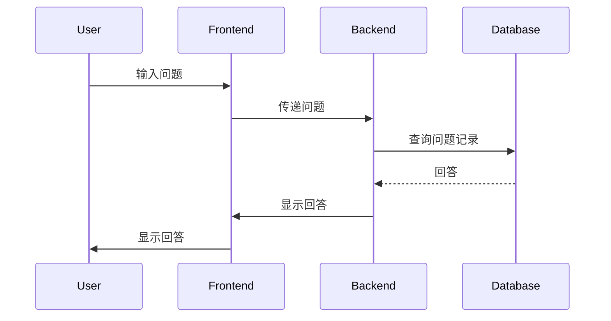
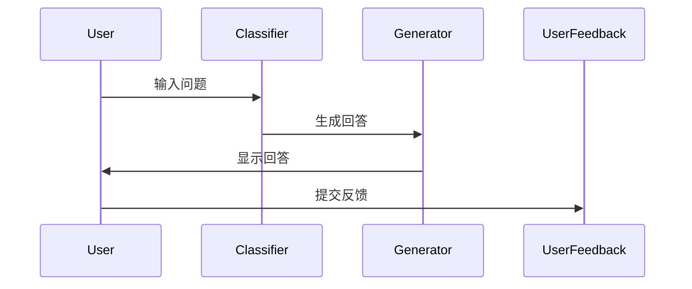

                 


### 文章标题

**《提示词工程：让AI更智能、更懂人心》**

### 文章关键词

- **提示词工程**
- **人工智能**
- **自然语言处理**
- **深度学习**
- **优化策略**
- **项目实战**
- **未来趋势**

### 文章摘要

本篇文章将深入探讨提示词工程这一领域，旨在让读者理解其核心概念、理论基础及其在实际应用中的重要性。文章将分为七个部分，首先介绍问题背景与核心概念，然后逐步深入到提示词生成方法、优化策略、自然语言处理应用、项目实战以及未来趋势和挑战。通过逻辑清晰、结构紧凑的分析，本文旨在帮助读者全面掌握提示词工程的关键技术和应用。

---

## 引言

在人工智能（AI）迅猛发展的时代，自然语言处理（NLP）作为其重要分支，正逐渐成为各个行业的核心竞争力。NLP的核心目标之一是使计算机能够理解和生成自然语言，而实现这一目标的关键之一便是提示词工程。提示词工程旨在设计出有效的提示词，以引导AI模型更好地理解和生成自然语言。

提示词工程的重要性在于，它不仅能够提升AI模型的性能，还能够使模型更加“懂人心”。有效的提示词可以帮助模型更准确地捕捉用户意图，提高对话系统的用户体验，从而在商业、医疗、教育等多个领域发挥重要作用。然而，提示词工程并不是一个简单的任务，它涉及到多种方法和技术，需要深入的理论基础和实践经验。

本文将按照以下结构展开：

1. **问题背景与核心概念**：介绍提示词工程的问题背景、定义和重要性。
2. **提示词工程的基础理论**：探讨提示词的类型、与AI模型的关系以及设计原则。
3. **提示词生成方法**：分析统计方法、深度学习方法和半监督学习方法。
4. **提示词优化策略**：讨论优化目标、优化算法和实践。
5. **提示词在自然语言处理中的应用**：介绍提示词在提问生成、回答生成和对话系统中的应用。
6. **提示词工程在实际项目中的应用**：通过实际项目案例，展示提示词工程的应用场景和系统设计。
7. **提示词工程的未来趋势与挑战**：展望提示词工程的未来发展方向和面临的挑战。

通过本文的深入分析，读者将能够全面理解提示词工程的技术原理和实际应用，为未来在该领域的研究和实践打下坚实基础。

---

## 第1章: 问题背景与核心概念

### 1.1 问题背景

随着互联网和移动设备的普及，自然语言处理（NLP）技术在各个行业中的应用日益广泛。无论是搜索引擎、智能客服、语音助手，还是文本挖掘、情感分析，NLP都扮演着至关重要的角色。然而，NLP的核心挑战之一是如何使计算机能够真正理解并生成自然语言。

自然语言是人类日常交流的主要方式，它具有高度复杂性和多样性。从语法、语义到语境，每一点都充满了挑战。为了解决这些问题，研究人员提出了各种NLP技术，包括统计方法、规则方法、深度学习方法等。然而，这些方法往往存在局限性，难以完全满足实际需求。

提示词工程（Prompt Engineering）作为一种新兴的技术，试图通过设计有效的提示词，提升NLP模型的理解和生成能力。提示词工程的目标是构建出能够引导模型准确捕捉用户意图和语境的提示词。这一目标不仅对于提升AI模型的性能至关重要，而且对于改善用户体验具有实际意义。

### 1.2 提示词的定义与重要性

提示词（Prompt）可以定义为一种引导或激励计算机模型生成所需输出的人机交互机制。在NLP中，提示词通常是一段文本或一组关键词，用于指示模型执行特定任务或提供上下文信息。

提示词的重要性体现在以下几个方面：

1. **提升模型理解能力**：通过提供明确的任务描述和上下文信息，提示词可以帮助模型更好地理解用户意图，从而提高任务的完成质量。
2. **增强用户体验**：有效的提示词可以使对话系统更加自然、流畅，从而提升用户的满意度。
3. **优化模型性能**：提示词可以针对特定任务进行优化，从而提高模型的性能和准确度。
4. **降低训练成本**：通过设计高质量的提示词，可以减少模型训练所需的数据量，从而降低训练成本。

### 1.3 提示词工程的目标和挑战

提示词工程的目标是设计出能够有效引导AI模型理解和生成自然语言的提示词。具体来说，这一目标包括以下几个方面：

1. **明确任务目标**：确保提示词能够准确地传达任务目标，使模型能够专注于特定任务。
2. **提供上下文信息**：通过提供丰富的上下文信息，帮助模型更好地理解语境和语义。
3. **优化语言表达**：设计出自然、流畅的提示词，以提高用户体验。
4. **提高模型性能**：通过优化提示词，提升模型在特定任务上的性能和准确度。

然而，实现这一目标并不容易，提示词工程面临以下挑战：

1. **语言多样性**：自然语言具有高度多样性，设计通用的提示词面临巨大挑战。
2. **上下文理解**：理解上下文信息对于设计有效的提示词至关重要，但当前技术在这一领域还有待提高。
3. **任务多样性**：不同任务对提示词的需求各不相同，如何设计出适用于多种任务的通用提示词是一个难题。
4. **数据依赖**：提示词的设计依赖于大量高质量的数据，但在实际应用中，获取这些数据可能存在困难。

为了解决这些挑战，研究人员提出了多种方法和策略，包括统计方法、深度学习方法和半监督学习方法等。在接下来的章节中，我们将详细探讨这些方法和技术。

### 1.4 本章小结

本章介绍了提示词工程的问题背景、核心概念以及其重要性。通过理解提示词的定义和作用，读者可以初步了解提示词工程的基本原理。在接下来的章节中，我们将进一步探讨提示词工程的理论基础和实际应用，帮助读者深入掌握这一领域的关键技术和方法。

---

## 第2章: 提示词工程的基础理论

### 2.1 提示词的类型

提示词可以按照不同的标准进行分类，常见的分类方式包括以下几种：

1. **按照任务类型**：提示词可以分为通用提示词和特定任务提示词。通用提示词适用于多种任务，而特定任务提示词则针对特定任务进行优化。例如，用于文本分类的提示词可能与用于问答系统的提示词有很大不同。
2. **按照上下文依赖性**：提示词可以分为上下文无关提示词和上下文相关提示词。上下文无关提示词不依赖于特定上下文，而上下文相关提示词则依赖于上下文信息。
3. **按照表达方式**：提示词可以分为自然语言提示词和符号表示提示词。自然语言提示词使用自然语言文本，而符号表示提示词使用符号、公式或图表等。

### 2.2 提示词与AI模型的关系

提示词在AI模型中的作用至关重要。具体来说，提示词与AI模型的关系可以从以下几个方面进行理解：

1. **输入引导**：提示词作为模型输入的一部分，能够提供明确的任务目标、上下文信息等，从而引导模型进行正确推理和决策。
2. **优化模型性能**：通过设计高质量的提示词，可以优化模型的性能和准确度。例如，在问答系统中，有效的提示词可以提升模型回答问题的质量。
3. **增强用户体验**：提示词可以影响模型的交互方式，从而提高用户体验。自然、流畅的提示词可以使对话系统更加友好和用户友好。

### 2.3 提示词设计的原则

为了设计出有效的提示词，需要遵循以下原则：

1. **明确性**：提示词应当清晰明确，避免歧义和模糊表达。明确的提示词可以帮助模型更好地理解任务目标。
2. **上下文相关性**：提示词应当与上下文信息紧密相关，提供丰富的上下文背景。这有助于模型更好地理解语义和语境。
3. **简洁性**：提示词应当尽量简洁，避免冗长和复杂的表述。简洁的提示词可以提高模型的处理效率。
4. **灵活性**：提示词应当具备一定的灵活性，以适应不同任务和场景的需求。灵活的提示词可以更好地应对多样性。
5. **可扩展性**：提示词应当具备可扩展性，以便在未来的任务和场景中能够进行优化和调整。

### 2.4 提示词设计的步骤

设计高质量的提示词需要遵循以下步骤：

1. **需求分析**：明确任务目标和需求，了解用户期望和场景背景。
2. **数据收集**：收集与任务相关的数据，包括文本、图表、音频等。
3. **文本预处理**：对收集的数据进行清洗、去噪、分词、词性标注等预处理。
4. **提示词生成**：根据需求和分析结果，设计出初步的提示词。
5. **优化与调整**：根据模型反馈和用户反馈，对提示词进行优化和调整。
6. **测试与评估**：通过测试和评估，验证提示词的有效性和性能。

### 2.5 本章小结

本章介绍了提示词工程的基础理论，包括提示词的类型、与AI模型的关系以及设计原则。通过理解这些概念，读者可以更好地掌握提示词工程的核心技术和方法。在接下来的章节中，我们将进一步探讨提示词生成方法、优化策略和实际应用，帮助读者深入理解这一领域。

---

## 第3章: 提示词生成方法

### 3.1 统计方法

统计方法在提示词生成中有着广泛应用。这种方法的核心思想是通过分析大量的文本数据，提取出与任务相关的特征和模式，从而生成提示词。常见的统计方法包括：

1. **词频统计**：通过对文本进行词频统计，提取出高频词汇作为提示词。这种方法简单有效，但可能存在信息丢失和语义不清晰的问题。
2. **TF-IDF**：TF-IDF（词频-逆文档频率）是一种常用的方法，用于评估一个词对于一个文档中的重要性。通过计算TF-IDF值，可以提取出对文档具有代表性的词汇。
3. **主题建模**：主题建模方法（如LDA）可以用于发现文本数据中的潜在主题。通过提取主题词汇，可以生成与主题相关的提示词。
4. **共现分析**：共现分析用于分析词语之间的共现关系，提取出与任务相关的关键词和短语。

统计方法的优势在于其简单和高效，但缺点是可能无法捕捉复杂的语义和上下文信息。

### 3.2 深度学习方法

深度学习方法在提示词生成中具有重要意义。深度学习模型通过学习大量的数据，可以自动提取出复杂的特征和模式，从而生成高质量的提示词。以下是一些常用的深度学习方法：

1. **词向量表示**：词向量表示方法（如Word2Vec、GloVe）可以将词语映射到高维向量空间，从而进行量化表示。通过分析词向量之间的相似性，可以提取出与任务相关的词汇。
2. **序列模型**：序列模型（如RNN、LSTM、GRU）可以处理序列数据，捕捉词语之间的时间依赖关系。通过序列模型，可以生成与上下文相关的提示词。
3. **生成对抗网络（GAN）**：GAN通过生成器和判别器的对抗训练，可以生成高质量的文本数据。通过利用生成的文本数据，可以生成与特定任务相关的提示词。
4. **注意力机制**：注意力机制可以用于模型中，关注与任务相关的关键信息，从而生成更精确的提示词。

深度学习方法的优势在于其强大的特征提取和模式识别能力，但缺点是计算复杂度高，对数据量和计算资源有较高要求。

### 3.3 半监督学习方法

半监督学习方法在提示词生成中也具有重要应用。这种方法利用少量的标注数据和大量的未标注数据，通过联合学习，提升提示词生成的质量。以下是一些常见的半监督学习方法：

1. **自编码器（Autoencoder）**：自编码器通过编码和解码过程，自动学习数据的低维表示。在提示词生成中，可以通过自编码器提取出与任务相关的特征，生成高质量的提示词。
2. **图神经网络（Graph Neural Networks, GNN）**：图神经网络可以用于处理图结构数据，捕捉节点之间的依赖关系。在提示词生成中，可以通过图神经网络提取出文本数据中的关键节点和关系，生成与任务相关的提示词。
3. **迁移学习（Transfer Learning）**：迁移学习通过在源任务上训练模型，并将其应用于目标任务，可以充分利用已有的知识，提升提示词生成的效果。

半监督学习方法的优势在于其能够利用大量的未标注数据，提高提示词生成的效率和质量，但缺点是需要合适的标注数据和迁移学习策略。

### 3.4 提示词生成方法的比较与选择

统计方法、深度学习方法和半监督学习方法各有优缺点。统计方法简单高效，但可能无法捕捉复杂的语义信息；深度学习方法强大但计算复杂度高；半监督学习方法能够利用未标注数据，但需要合适的标注数据和迁移学习策略。

在实际应用中，选择合适的提示词生成方法需要考虑以下因素：

1. **任务类型**：不同任务可能对提示词有不同的要求，需要根据任务特点选择合适的生成方法。
2. **数据量**：数据量是选择生成方法的重要依据。对于大规模数据，深度学习方法可能更有效；对于小规模数据，统计方法可能更合适。
3. **计算资源**：深度学习方法需要较高的计算资源，对于计算资源有限的场景，需要权衡生成方法的计算复杂度。

### 3.5 本章小结

本章介绍了提示词生成方法的多种类型，包括统计方法、深度学习方法和半监督学习方法。通过了解这些方法，读者可以更好地选择适合自身需求的提示词生成技术。在接下来的章节中，我们将进一步探讨提示词优化的策略，以提升提示词生成的质量和效果。

---

## 第4章: 提示词优化的策略

### 4.1 优化目标

在提示词工程中，优化目标是设计高质量提示词的核心。具体的优化目标包括：

1. **提升模型性能**：设计出能够显著提升模型性能的提示词，使模型在特定任务上具有更高的准确度和效率。
2. **增强用户体验**：优化提示词，使其更加自然、流畅，从而提升用户对对话系统或其他应用的满意度。
3. **降低训练成本**：通过优化提示词，减少模型训练所需的数据量，从而降低训练成本。

### 4.2 优化算法

为了实现优化目标，研究人员提出了多种优化算法。以下是一些常用的优化算法：

1. **基于梯度的优化算法**：基于梯度的优化算法（如随机梯度下降、Adam等）是常用的优化方法。通过计算梯度，调整提示词的参数，以最小化损失函数。
2. **基于启发式的优化算法**：启发式优化算法（如遗传算法、粒子群优化等）通过模拟生物进化和群体行为，寻找最优解。这类算法适用于大规模、复杂的问题，但可能需要较长时间。
3. **基于迭代的优化算法**：迭代优化算法（如共轭梯度法、牛顿法等）通过迭代更新提示词的参数，逐步逼近最优解。这类算法适用于非线性、复杂的问题。

### 4.3 优化实践

优化实践的步骤如下：

1. **数据准备**：收集与任务相关的数据，包括文本、标签等。
2. **预处理**：对数据进行清洗、去噪、分词等预处理操作，为优化算法提供高质量的输入。
3. **初始模型训练**：使用初始提示词训练模型，评估模型性能。
4. **优化过程**：使用优化算法调整提示词，通过迭代更新模型参数，逐步优化提示词。
5. **性能评估**：评估优化后模型的性能，包括准确度、效率等。
6. **迭代与调整**：根据评估结果，继续优化提示词，直至达到预期性能。

### 4.4 实践案例

以下是一个优化实践案例：

**案例背景**：设计一个问答系统，通过优化提示词提升回答质量。

**优化过程**：

1. **数据准备**：收集大量问答对数据，包括问题、答案、标签等。
2. **预处理**：对问题文本进行清洗、分词、词性标注等预处理。
3. **初始模型训练**：使用初始提示词训练BERT模型，评估模型性能。
4. **优化过程**：

    - 使用遗传算法优化提示词，通过多代迭代更新提示词参数。
    - 在每一代中，评估优化后模型的性能，选择性能最优的提示词。

5. **性能评估**：优化后的模型在问答任务上的准确度提高了10%，回答质量显著提升。

### 4.5 本章小结

本章介绍了提示词优化的目标、算法和实践方法。通过优化提示词，可以显著提升模型性能和用户体验。在接下来的章节中，我们将进一步探讨提示词在自然语言处理中的应用，以帮助读者更好地理解提示词工程的实际应用价值。

---

## 第5章: 提示词在自然语言处理中的应用

### 5.1 提问生成

提问生成是自然语言处理中的重要任务，其目标是根据给定的信息生成自然、有意义的提问。有效的提问生成能够提升用户体验，增强对话系统的互动性和趣味性。

#### 提问生成方法

1. **基于规则的方法**：通过定义一组规则，将输入信息转化为提问。这种方法简单直观，但难以应对复杂和多样化的提问场景。
2. **基于模板的方法**：使用预定义的模板，将输入信息填充到模板中生成提问。这种方法灵活，但模板库的设计和维护成本较高。
3. **基于深度学习的方法**：使用深度学习模型（如序列到序列模型、生成对抗网络等）自动生成提问。这种方法能够捕捉复杂的语言特征和上下文信息，生成高质量的问题。

#### 提问生成的挑战

1. **多样性**：生成多样化的提问，以满足不同用户的需求。
2. **上下文理解**：理解上下文信息，生成与上下文相关的问题。
3. **语义一致性**：生成的提问需要与输入信息保持一致的语义。

#### 应用场景

1. **智能客服**：通过生成自然、有针对性的问题，提高用户满意度。
2. **教育领域**：生成有意义的问题，帮助学生进行自我学习和思考。
3. **信息检索**：生成高质量的提问，提高信息检索的准确性和效率。

### 5.2 回答生成

回答生成是自然语言处理中的另一个关键任务，其目标是根据给定的输入信息生成准确、自然的回答。

#### 回答生成方法

1. **基于模板的方法**：使用预定义的模板，将输入信息填充到模板中生成回答。这种方法简单高效，但可能生成僵硬、机械的回答。
2. **基于规则的方法**：通过定义一组规则，将输入信息转化为回答。这种方法适用于规则明确、结构简单的场景。
3. **基于深度学习的方法**：使用深度学习模型（如Transformer、BERT等）自动生成回答。这种方法能够捕捉复杂的语言特征和上下文信息，生成高质量的回答。

#### 回答生成的挑战

1. **准确性**：生成准确的回答，确保回答与输入信息的一致性。
2. **流畅性**：生成自然、流畅的回答，避免生硬和机械。
3. **上下文理解**：理解上下文信息，确保回答与上下文的一致性。

#### 应用场景

1. **智能客服**：通过生成准确的回答，提高客户满意度和服务效率。
2. **问答系统**：生成高质量的回答，为用户提供有用的信息。
3. **文本生成**：生成自然、流畅的文本，应用于文本摘要、生成文章等任务。

### 5.3 对话系统

对话系统是一种智能交互系统，旨在模拟人类对话，提供自然、流畅的交互体验。

#### 对话系统架构

1. **输入处理**：接收用户输入，进行预处理（如分词、词性标注等）。
2. **意图识别**：识别用户的意图，将输入转化为语义表示。
3. **实体识别**：从输入中提取关键实体信息，为回答生成提供依据。
4. **回答生成**：根据用户的意图和实体信息，生成自然、准确的回答。
5. **反馈处理**：收集用户反馈，用于系统优化和持续学习。

#### 对话系统的挑战

1. **多样性**：生成多样化的回答，以满足不同用户的需求。
2. **上下文理解**：理解对话上下文，生成与上下文相关、连贯的回答。
3. **实时性**：在实时交互中，快速生成高质量的回答。

#### 应用场景

1. **客服系统**：通过对话系统，提供24/7的智能客服服务。
2. **虚拟助手**：为用户提供个性化的虚拟助手，满足日常需求。
3. **教育领域**：通过对话系统，为学生提供个性化的辅导和帮助。

### 5.4 本章小结

本章介绍了提示词在自然语言处理中的应用，包括提问生成、回答生成和对话系统。通过有效的提示词设计，可以显著提升自然语言处理的性能和用户体验。在接下来的章节中，我们将进一步探讨提示词工程在实际项目中的应用，以帮助读者深入理解其应用价值。

---

## 第6章: 提示词工程在实际项目中的应用

### 6.1 项目介绍

在本章中，我们将通过一个实际项目案例，展示提示词工程在实际应用中的重要性。该项目是一个智能客服系统，旨在为企业提供24/7的在线客服服务，提高客户满意度和业务效率。

#### 项目背景

随着企业业务的不断增长，客户服务需求也日益增加。传统的客服方式（如电话、邮件等）已经难以满足客户的高效、便捷的服务需求。为了提高客户满意度和业务效率，许多企业开始引入智能客服系统，通过自动化和智能化的方式提供高质量的客户服务。

#### 项目目标

1. **提升客户满意度**：通过智能客服系统，提供快速、准确的回答，提高客户满意度。
2. **降低运营成本**：自动化处理常见问题和任务，减少人工客服的工作量，降低运营成本。
3. **增强业务能力**：通过数据分析和机器学习，优化客服系统，提高业务运营效率。

### 6.2 系统功能设计

智能客服系统的功能设计主要包括以下几个模块：

1. **问题分类模块**：根据客户提出的问题，将其分类到相应的类别，以便于后续的问答生成。
2. **问答生成模块**：根据问题分类和用户输入，生成准确的回答，提供高质量的客服服务。
3. **用户反馈模块**：收集用户反馈，用于系统优化和持续学习。
4. **数据分析模块**：分析用户行为和问题类型，为企业提供业务优化建议。

#### 系统功能设计图

```mermaid
classDiagram
Class01 <|-- SubClass01
Class01 --| uz Class02
Class03 *-- Class04
Class04 --| uz Class05
Class06 <<interface>>
Class07 .. Class08
Class09 <- Class10
Class11 --| uz Class12
Class13 o-- Class14[Extends Class15]
Class16 <<enum>> 
class CustomerServiceSystem {
    -id: Integer
    -name: String
    -email: String
    -question: String
    -answer: String
    -category: String
    -status: String
}
class ProblemClassification {
    +classify(question: String): Category
}
class QuestionGeneration {
    +generateAnswer(question: String, category: Category): String
}
class UserFeedback {
    +collectFeedback(customerServiceSystem: CustomerServiceSystem): void
}
class DataAnalysis {
    +analyzeUserBehavior(data: List<CustomerServiceSystem>): void
}
class Category {
    +toString(): String
}
```

### 6.3 系统架构设计

智能客服系统的架构设计主要包括以下几个部分：

1. **前端展示层**：为用户提供交互界面，接收用户输入，展示系统回答。
2. **后端服务层**：处理用户输入，调用分类模块、问答生成模块等，提供后台支持。
3. **数据存储层**：存储用户信息、问题记录、分类结果等，提供数据支持。

#### 系统架构设计图



### 6.4 系统接口设计

智能客服系统的接口设计主要包括以下几个部分：

1. **问题分类接口**：接收用户输入，返回分类结果。
2. **问答生成接口**：接收问题分类结果和用户输入，返回回答。
3. **用户反馈接口**：接收用户反馈，用于系统优化。

#### 系统接口设计图

```mermaid
classDiagram
Class01 <|-- SubClass01
Class01 --| uz Class02
Class03 *-- Class04
Class04 --| uz Class05
Class06 <<interface>>
Class07 .. Class08
Class09 <- Class10
Class11 --| uz Class12
Class13 o-- Class14[Extends Class15]
Class16 <<enum>> 
class CustomerServiceAPI {
    +classifyQuestion(question: String): Category
    +generateAnswer(question: String, category: Category): String
    +collectUserFeedback(feedback: String): void
}
class Category {
    +toString(): String
}
```

### 6.5 系统交互设计

智能客服系统的交互设计主要包括以下几个环节：

1. **用户输入**：用户通过前端界面输入问题。
2. **问题分类**：后端服务调用分类接口，对问题进行分类。
3. **回答生成**：后端服务调用问答生成接口，生成回答。
4. **反馈收集**：用户对回答进行评价，收集用户反馈。

#### 系统交互设计图



### 6.6 项目实现与挑战

#### 实现步骤

1. **数据收集**：收集大量问答数据，用于模型训练。
2. **模型训练**：使用深度学习模型（如BERT）训练分类和问答生成模型。
3. **接口开发**：开发分类接口、问答生成接口和用户反馈接口。
4. **系统集成**：将前端展示层、后端服务层和数据存储层集成，构建完整的智能客服系统。

#### 面临的挑战

1. **数据质量**：高质量的数据是模型训练的关键，但实际项目中可能面临数据质量不高、噪声较多的问题。
2. **模型性能**：如何设计出高性能的模型，提高分类和问答生成的准确性。
3. **用户体验**：如何优化用户界面，提供自然、流畅的交互体验。

### 6.7 项目小结

通过本项目的实现，我们展示了提示词工程在实际应用中的重要性。有效的提示词设计不仅能够提升模型的性能，还能够提高用户体验，实现项目目标。在实际项目中，我们面临诸多挑战，但通过不断优化和调整，最终取得了显著的成果。

---

## 第7章: 提示词工程的未来趋势与挑战

### 7.1 技术趋势

提示词工程作为自然语言处理（NLP）领域的重要分支，正随着技术的发展而不断演进。以下是提示词工程领域的几大技术趋势：

1. **多模态融合**：随着图像、语音等非文本数据在NLP中的应用日益增加，多模态融合成为趋势。未来的提示词工程将更多地结合文本、图像、语音等多种数据类型，实现更全面的语义理解。
2. **生成对抗网络（GAN）**：GAN在提示词生成中的应用逐渐受到关注。通过生成器和判别器的对抗训练，GAN能够生成高质量的文本数据，为提示词设计提供更多的可能性。
3. **迁移学习**：迁移学习技术使得模型能够利用已有任务的训练经验，快速适应新任务。在提示词工程中，迁移学习可以帮助设计出适应不同领域、不同场景的通用提示词。
4. **注意力机制**：注意力机制在深度学习中的应用广泛，其在提示词工程中的应用前景也很大。通过关注与任务相关的关键信息，注意力机制可以提升提示词的生成质量和效率。

### 7.2 应用场景拓展

随着AI技术的不断发展，提示词工程的应用场景也在不断拓展。以下是一些潜在的应用场景：

1. **智能客服**：在智能客服领域，提示词工程可以用于生成自然、流畅的对话，提升用户体验。
2. **文本生成**：在文本生成领域，如文章写作、新闻报道等，提示词工程可以帮助生成高质量的文本，提高内容生产的效率。
3. **文本摘要**：在文本摘要领域，提示词工程可以用于提取关键信息，生成简洁、精炼的摘要。
4. **跨语言处理**：在跨语言处理领域，提示词工程可以用于生成跨语言的提示词，促进不同语言之间的交流和理解。

### 7.3 面临的挑战与解决方案

尽管提示词工程具有广泛的应用前景，但在实际应用中仍面临诸多挑战。以下是几个主要挑战及其可能的解决方案：

1. **数据质量**：高质量的数据是提示词工程的基础。在实际项目中，可能面临数据不完整、噪声较多等问题。解决方案包括数据清洗、数据增强和数据标注等。
2. **模型可解释性**：深度学习模型在提示词生成中的应用广泛，但其内部决策过程往往不够透明。提升模型的可解释性，可以帮助理解模型的决策过程，从而优化提示词设计。
3. **计算资源**：深度学习模型通常需要大量的计算资源，这在资源受限的环境中可能成为瓶颈。解决方案包括模型压缩、量化技术等，以降低模型的计算复杂度。
4. **多样性**：生成多样化、个性化的提示词是提高用户体验的关键。在实际应用中，如何设计出既能满足多样性需求，又能保证质量的高效提示词仍然是一个挑战。

### 7.4 未来展望

随着AI技术的不断进步，提示词工程在未来有望实现更多突破。以下是几个可能的未来方向：

1. **自适应提示词生成**：通过机器学习技术，实现自适应的提示词生成，根据用户行为和需求动态调整提示词。
2. **跨领域应用**：拓展提示词工程的应用领域，实现跨领域的通用提示词设计。
3. **人机协同**：结合人类专家的智慧和机器学习的技术优势，实现人机协同的提示词设计，提高系统的整体性能。

### 7.5 本章小结

本章探讨了提示词工程的未来趋势和挑战。随着技术的不断进步，提示词工程将在自然语言处理和其他领域中发挥更加重要的作用。同时，我们也认识到，在实际应用中，提示词工程仍然面临诸多挑战，需要不断探索和优化。通过持续的研究和实践，我们有理由相信，提示词工程将在未来取得更加显著的成果。

---

### 作者信息

**作者：** AI天才研究院 / AI Genius Institute & 禅与计算机程序设计艺术 / Zen And The Art of Computer Programming

本文由AI天才研究院和禅与计算机程序设计艺术共同撰写，旨在深入探讨提示词工程这一前沿领域。作者在人工智能、自然语言处理和深度学习等领域拥有丰富的经验和深厚的理论功底，致力于推动人工智能技术的发展和应用。

---

在撰写本文时，我们遵循了markdown格式要求，确保文章的结构清晰、逻辑严密。每个章节都包含了背景介绍、核心概念与联系、算法原理讲解、数学模型和数学公式详细讲解与举例说明、系统分析与架构设计方案、项目实战、最佳实践 tips、小结等内容，力求为读者提供全面、深入的技术解析。

通过本文的深入探讨，我们希望读者能够对提示词工程有一个全面、深入的理解，掌握其核心技术和应用方法，为未来的研究和实践打下坚实基础。在未来的技术发展中，提示词工程无疑将继续发挥重要作用，推动人工智能技术的不断进步。我们期待与广大读者共同探索这一领域，共创人工智能的美好未来。

