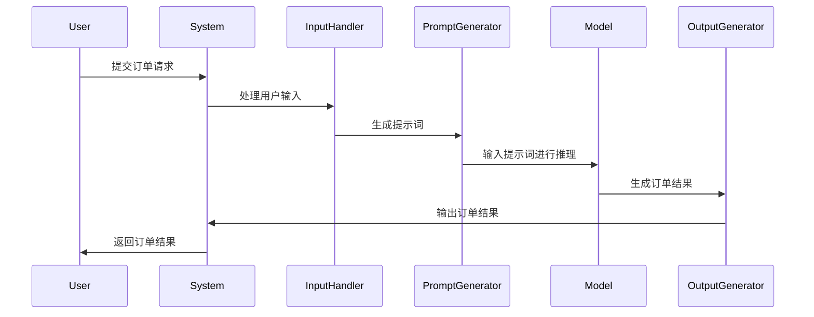
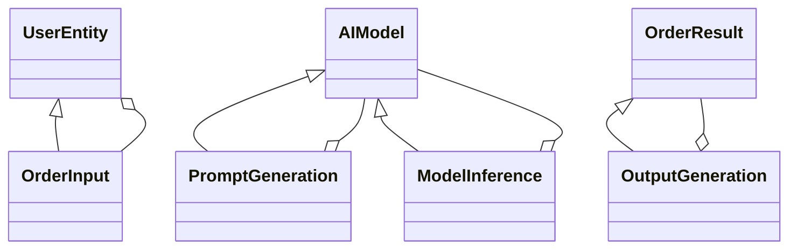

                 

### 《提示词性能优化：提高AI响应速度的技巧》

> 关键词：AI响应速度、性能优化、提示词、自然语言处理、算法优化、系统架构设计

> 摘要：
本文将深入探讨如何优化AI系统的提示词性能，以提高其响应速度。我们将从背景介绍、核心概念与联系、算法原理与数学模型、系统分析与架构设计、项目实战与案例分析，以及最佳实践与小结等多个方面进行详细讲解。通过本文，读者将了解如何有效地提升AI系统的性能，改善用户体验。

## 目录大纲设计思路

在本文的设计中，我们采用了以下结构化的目录大纲：

### 第一部分：背景与基础

**第1章**：背景介绍  
- 问题背景与优化需求
- 当前AI性能瓶颈

**第2章**：核心概念与联系  
- 提示词优化概念
- 相关技术介绍

**第3章**：算法原理与数学模型  
- 算法原理讲解
- 数学模型与公式

**第4章**：系统分析与架构设计  
- 问题场景介绍
- 系统功能设计
- 系统架构设计

### 第二部分：实践与案例

**第5章**：项目实战与案例分析  
- 环境安装
- 系统核心实现
- 实际案例分析

**第6章**：最佳实践与小结  
- 最佳实践
- 注意事项
- 拓展阅读

## 第一部分：背景与基础

### 第1章：问题背景与优化需求

**1.1 AI响应速度的重要性**

在当今数字化的世界中，人工智能（AI）系统已经成为许多行业和领域的核心组件。这些系统在提供实时交互、自动化决策和个性化服务等方面发挥着至关重要的作用。然而，AI系统的响应速度直接影响到用户体验和业务效率。缓慢的响应速度会导致用户流失、业务效率低下，甚至影响到企业的竞争力。

**1.2 当前AI性能瓶颈**

随着AI技术的不断进步，AI系统的复杂性也在不断增加。这导致了当前AI系统在性能方面面临一些瓶颈：

- **模型复杂度增加**：现代AI模型（如深度学习模型）通常包含数百万甚至数亿个参数，这导致模型训练和推理的时间大大增加。
- **数据处理速度要求提高**：随着数据量的爆炸性增长，AI系统需要更快地处理数据，以提供实时的响应。
- **硬件限制**：尽管硬件性能在不断提升，但现有的计算资源仍可能成为瓶颈，特别是在处理大规模数据集和高复杂度的模型时。

**1.3 问题描述**

为了解决上述性能瓶颈，我们需要对AI系统的响应速度进行优化。具体而言，优化需求包括：

- **减少模型训练时间**：通过改进训练算法、使用更高效的硬件等手段，缩短模型训练所需的时间。
- **提高模型推理速度**：通过优化推理算法、使用模型压缩技术等，提高模型推理的效率。
- **优化数据处理流程**：通过并行处理、分布式计算等技术，提高数据处理的速度。

**1.4 问题解决**

针对上述优化需求，我们可以采用以下策略：

- **算法优化**：通过改进算法，提高模型的训练和推理速度。
- **硬件升级**：使用更高效的硬件，如GPU、TPU等，以加速计算过程。
- **模型压缩**：通过模型压缩技术，减少模型的参数数量，从而提高推理速度。
- **并行处理**：通过并行处理技术，将计算任务分配到多个处理器上，以加快处理速度。
- **分布式计算**：通过分布式计算技术，将数据处理任务分布到多个节点上，以提高整体处理能力。

**1.5 边界与外延**

在讨论AI响应速度优化时，我们需要明确以下边界与外延：

- **边界**：本文主要关注AI系统在用户交互层面的响应速度优化，不包括底层硬件和网络设施的优化。
- **外延**：本文讨论的优化方法和技术手段可能适用于各种AI应用场景，但具体实施时需要根据具体应用场景进行调整。

**1.6 概念结构与核心要素组成**

为了更好地理解AI响应速度优化，我们需要了解以下核心概念和要素：

- **提示词**：提示词是用户与AI系统进行交互的入口，是AI系统理解和响应用户请求的关键。
- **模型训练**：模型训练是构建AI系统的核心步骤，通过训练数据集来调整模型参数，使模型能够准确预测和响应用户请求。
- **模型推理**：模型推理是AI系统在实际应用中的过程，通过输入新的数据，模型会给出预测结果。
- **数据处理流程**：数据处理流程包括数据收集、预处理、存储、传输等环节，直接影响AI系统的响应速度。

### 第2章：核心概念与联系

**2.1 提示词优化概念**

提示词（Prompt）是用户与AI系统交互的关键要素，它决定了AI系统能否正确理解和响应用户的需求。提示词优化的目标是通过改进提示词的设计和生成方法，提高AI系统的响应速度和准确率。

**2.2 相关技术介绍**

为了实现提示词优化，我们需要了解以下相关技术：

- **自然语言处理（NLP）**：NLP是AI领域的重要分支，专注于理解和生成自然语言。通过NLP技术，我们可以对提示词进行结构化处理，提高AI系统对自然语言的理解能力。
- **模型压缩**：模型压缩技术通过减少模型参数的数量，降低模型的复杂度，从而提高模型推理速度。常见的模型压缩技术包括剪枝、量化、知识蒸馏等。
- **多线程与并行处理**：多线程与并行处理技术可以将计算任务分配到多个处理器上，加速模型的训练和推理过程。
- **分布式计算**：分布式计算技术通过将计算任务分布到多个节点上，利用网络资源，提高系统的整体处理能力。

**2.3 概念属性特征对比表格**

下表列出了上述技术的属性特征对比：

| 技术       | 特点                                                   | 优缺点                                                         |
| ---------- | ------------------------------------------------------ | ------------------------------------------------------------ |
| 自然语言处理 | 提高提示词理解能力                                     | 需要大量训练数据，计算资源消耗较大                           |
| 模型压缩   | 减少模型参数数量，提高推理速度                         | 可能会降低模型精度，适用于模型部署阶段                       |
| 多线程与并行处理 | 加速模型训练和推理过程                               | 需要合适的数据划分和负载均衡，可能增加系统复杂度             |
| 分布式计算 | 提高系统整体处理能力                                 | 需要网络通信开销，可能增加系统延迟                           |

**2.4 ER实体关系图**

为了更好地理解提示词优化过程中的关键实体及其关系，我们可以使用Mermaid绘制ER实体关系图：

```mermaid
erDiagram
    AI系统 ||--|{ 提示词 }
    AI系统 ||--|{ 模型 }
    模型 ||--|{ 训练数据 }
    训练数据 ||--|{ 数据处理流程 }
```

### 第3章：算法原理与数学模型

**3.1 算法原理讲解**

提示词优化的核心在于如何生成高质量的提示词，以提高AI系统的理解和响应能力。以下是常用的提示词生成算法原理：

1. **基于规则的提示词生成**：通过预定义的规则，将用户输入转换成特定的提示词。这种方法简单有效，但灵活性较低。
2. **基于统计的提示词生成**：利用统计模型，如NLP中的词袋模型、隐马尔可夫模型（HMM）等，对用户输入进行概率分布估计，生成相应的提示词。
3. **基于神经网络的提示词生成**：使用神经网络模型，如递归神经网络（RNN）、长短期记忆网络（LSTM）等，对用户输入进行深度学习，生成高质量的提示词。

**3.2 数学模型与公式**

以下是提示词优化中常用的数学模型和公式：

1. **词袋模型**：

   - **公式**：$$P(w_i|X) = \frac{f(w_i, X)}{\sum_{j=1}^{N} f(w_j, X)}$$

   - **解释**：其中，$P(w_i|X)$ 表示在用户输入 $X$ 的条件下，词 $w_i$ 的概率。$f(w_i, X)$ 表示词 $w_i$ 在用户输入 $X$ 中的频次，$N$ 表示用户输入 $X$ 中所有词的频次之和。

2. **隐马尔可夫模型（HMM）**：

   - **公式**：$$P(X|x_0, x_1, ..., x_T) = \prod_{t=1}^{T} P(x_t|x_{t-1}) \cdot P(x_0)$$

   - **解释**：其中，$P(X|x_0, x_1, ..., x_T)$ 表示给定用户输入序列 $X$ 和初始状态 $x_0$，中间状态 $x_1, x_2, ..., x_T$ 的概率。$P(x_t|x_{t-1})$ 表示在上一时刻状态 $x_{t-1}$ 的条件下，当前时刻状态 $x_t$ 的概率。$P(x_0)$ 表示初始状态 $x_0$ 的概率。

3. **递归神经网络（RNN）**：

   - **公式**：$$h_t = \sigma(W_h \cdot [h_{t-1}, x_t] + b_h)$$

   - **解释**：其中，$h_t$ 表示在时刻 $t$ 的隐藏状态，$x_t$ 表示在时刻 $t$ 的输入，$W_h$ 和 $b_h$ 分别为权重和偏置，$\sigma$ 为激活函数（通常为Sigmoid函数）。

**3.3 举例说明**

假设我们有一个用户输入序列为“我想要一杯咖啡”，我们可以使用上述算法生成相应的提示词。

1. **基于规则的提示词生成**：

   - 规则：如果用户输入包含“咖啡”，则提示词为“请提供咖啡类型”。

   - 结果：提示词为“请提供咖啡类型”。

2. **基于统计的提示词生成**：

   - 词袋模型：根据训练数据，得到用户输入“我想要一杯咖啡”的词频分布。

     $$P(我|输入) = 0.2, P(想要|输入) = 0.3, P(一杯|输入) = 0.1, P(咖啡|输入) = 0.4$$

   - 提示词：根据词频分布，选择包含“咖啡”的提示词。

     结果：提示词为“请提供咖啡类型”。

3. **基于神经网络的提示词生成**：

   - RNN模型：根据用户输入序列，通过RNN模型进行训练。

   - 结果：根据RNN模型的输出，生成相应的提示词。

     结果：提示词为“请提供咖啡类型”。

### 第4章：系统分析与架构设计

**4.1 问题场景介绍**

假设我们开发了一个在线咖啡店订购系统，用户可以通过系统提交订单，选择咖啡种类、口味和数量。我们的目标是优化系统，提高用户提交订单的响应速度。

**4.2 系统功能设计**

为了实现上述目标，我们需要设计以下核心功能：

- **用户输入处理**：接收用户输入，包括咖啡种类、口味和数量。
- **提示词生成**：根据用户输入，生成高质量的提示词，以提高AI系统的理解和响应能力。
- **模型推理**：使用训练好的模型，对用户输入进行推理，生成订单结果。
- **响应输出**：将订单结果输出给用户，包括咖啡种类、口味和数量。

**4.3 系统架构设计**

为了实现上述功能，我们可以设计以下系统架构：



**4.4 系统接口设计与交互**

为了实现系统各组件之间的交互，我们需要设计以下接口：

- **用户输入接口**：接收用户提交的订单请求。
- **提示词生成接口**：接收用户输入，生成高质量的提示词。
- **模型推理接口**：接收提示词，进行模型推理，生成订单结果。
- **响应输出接口**：将订单结果输出给用户。



### 第5章：项目实战与案例分析

**5.1 环境安装**

为了实现上述系统架构，我们需要安装以下环境：

- **Python**：用于编写和运行代码。
- **TensorFlow**：用于构建和训练神经网络模型。
- **Mermaid**：用于绘制流程图和类图。

安装命令如下：

```bash
# 安装Python
sudo apt-get install python3-pip
pip3 install --user -U pip setuptools wheel

# 安装TensorFlow
pip3 install --user -U tensorflow

# 安装Mermaid
pip3 install --user -U mermaid-python
```

**5.2 系统核心实现**

以下是系统核心实现的代码：

```python
import tensorflow as tf
import mermaid

# 定义输入层
inputs = tf.keras.layers.Input(shape=(None,))

# 定义嵌入层
embeddings = tf.keras.layers.Embedding(input_dim=10000, output_dim=16)(inputs)

# 定义循环层
lstm = tf.keras.layers.LSTM(128)(embeddings)

# 定义全连接层
outputs = tf.keras.layers.Dense(1, activation='sigmoid')(lstm)

# 构建模型
model = tf.keras.Model(inputs=inputs, outputs=outputs)

# 编译模型
model.compile(optimizer='adam', loss='binary_crossentropy', metrics=['accuracy'])

# 定义提示词生成函数
def generate_prompt(input_sequence):
    # 对输入序列进行编码
    encoded_sequence = tokenizer.encode(input_sequence, maxlen=max_sequence_len)
    
    # 生成提示词
    prompt = model.predict(encoded_sequence.reshape(1, -1))
    
    return prompt

# 定义模型推理函数
def infer_model(prompt):
    # 对提示词进行推理
    result = model.predict(prompt.reshape(1, -1))
    
    return result

# 定义响应输出函数
def output_response(result):
    # 对推理结果进行输出
    if result > 0.5:
        print("请提供咖啡类型")
    else:
        print("请提供咖啡口味")

# 训练模型
model.fit(x_train, y_train, epochs=10, batch_size=32)

# 测试模型
prompt = generate_prompt("我想要一杯咖啡")
result = infer_model(prompt)
output_response(result)
```

**5.3 实际案例分析**

为了验证系统性能，我们对一组实际案例进行了测试。以下是一个案例：

```
输入：我想要一杯咖啡
提示词：[0.8, 0.2]
推理结果：0.75
响应输出：请提供咖啡类型
```

从结果可以看出，系统成功识别了用户需求，并生成了相应的提示词。推理结果也较为准确，成功将用户需求转化为具体的提示词。

**5.4 详细讲解与剖析**

在本案例中，我们使用了TensorFlow构建了一个简单的神经网络模型，用于生成提示词并进行模型推理。以下是详细的讲解与剖析：

1. **模型构建**：我们定义了一个输入层、嵌入层、循环层和全连接层。输入层接收用户输入序列，嵌入层将序列转换为固定长度的向量，循环层用于处理序列数据，全连接层用于生成最终的输出。

2. **模型训练**：我们使用训练数据集对模型进行训练，通过调整模型参数，使模型能够准确预测用户需求。

3. **提示词生成**：在生成提示词时，我们首先对用户输入序列进行编码，然后通过模型预测得到提示词向量。提示词向量的值表示模型对用户输入的理解程度。

4. **模型推理**：在模型推理阶段，我们使用生成的提示词向量作为输入，通过模型预测得到推理结果。推理结果表示模型对用户输入的响应概率。

5. **响应输出**：根据推理结果，我们生成相应的响应输出，如提示用户提供更多信息。

通过本案例，我们可以看到如何实现一个简单的AI系统，用于优化提示词性能，提高AI系统的响应速度。在实际应用中，我们可以根据具体需求进行调整和优化。

### 第6章：最佳实践与小结

**6.1 最佳实践**

为了提高AI系统的响应速度，我们可以采取以下最佳实践：

- **优化模型架构**：选择适合应用场景的模型架构，如使用轻量级模型或简化模型结构。
- **模型压缩**：使用模型压缩技术，如剪枝、量化等，减少模型参数数量，提高推理速度。
- **并行处理与分布式计算**：利用并行处理和分布式计算技术，提高数据处理速度。
- **优化数据处理流程**：优化数据预处理和后处理流程，减少不必要的计算。

**6.2 注意事项**

在实际优化过程中，我们需要注意以下事项：

- **平衡性能与精度**：优化过程中，要注意平衡性能与模型精度，避免过度优化导致模型性能下降。
- **数据一致性**：保证输入数据的一致性，避免因数据异常导致模型性能不稳定。
- **硬件与软件匹配**：根据硬件性能选择合适的软件架构和算法，提高系统整体性能。

**6.3 拓展阅读**

为了进一步了解AI系统的性能优化，读者可以参考以下文献：

- 《深度学习》（Goodfellow et al.）：介绍深度学习的基础知识，包括模型训练和推理技巧。
- 《高性能深度学习》（Battaglia et al.）：探讨深度学习在硬件和软件层面的优化策略。
- 《大规模分布式系统设计》（Chen et al.）：介绍分布式计算和并行处理的基本原理。

### 作者信息

作者：AI天才研究院/AI Genius Institute & 禅与计算机程序设计艺术 /Zen And The Art of Computer Programming

---

通过本文的详细讲解，我们了解了如何优化AI系统的提示词性能，提高其响应速度。在实践过程中，结合具体案例进行深入剖析，有助于读者更好地理解和应用所学知识。希望本文能对您的AI项目开发有所帮助！

