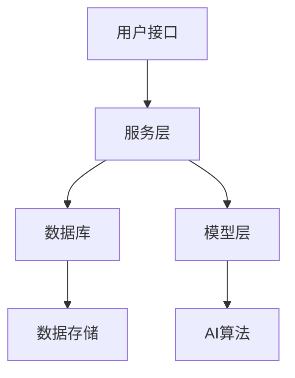
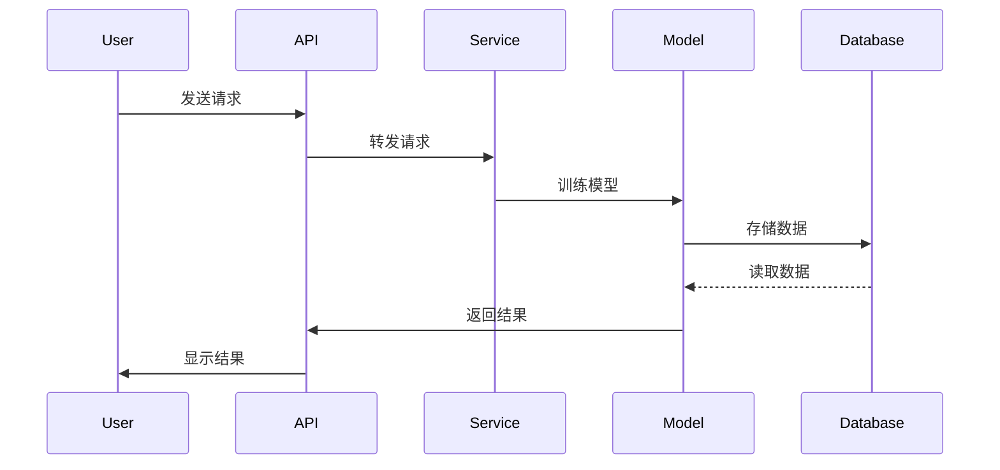
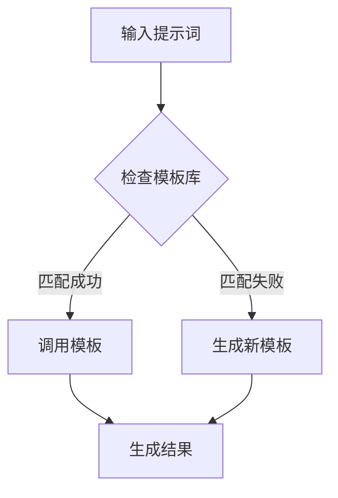

                 


## 4.4 系统架构设计

### 4.4.1 系统架构图


### 4.4.2 系统架构设计原则
1. **高内聚低耦合**：确保系统模块之间的耦合度降低，便于后续维护和扩展。
2. **模块化设计**：将系统功能划分为多个模块，各模块独立开发，确保项目进度和质量。
3. **可扩展性**：设计时考虑系统的可扩展性，方便未来的功能扩展和技术升级。
4. **安全性**：确保用户数据和系统安全，遵循相关的安全标准和规范。

### 4.4.3 系统接口设计

#### 用户接口
- **API接口**：提供RESTful风格的API接口，便于第三方系统进行数据交互。
- **用户交互界面**：设计简洁友好的用户交互界面，提高用户体验。

#### 服务层接口
- **数据接口**：负责数据的存储和读取。
- **模型接口**：负责模型的训练和预测。

### 4.4.4 系统交互

#### 序列图


## 4.5 本章小结

# 第五部分：项目实战

## 5.1 环境安装
### 5.1.1 环境准备
### 5.1.2 系统安装步骤

## 5.2 系统核心实现
### 5.2.1 源代码
### 5.2.2 代码解读

## 5.3 代码应用
### 5.3.1 应用场景
### 5.3.2 应用示例

## 5.4 实际案例分析
### 5.4.1 案例描述
### 5.4.2 分析与讲解

## 5.5 项目小结
### 5.5.1 项目成果
### 5.5.2 项目不足与改进

## 5.6 本章小结

# 第六部分：最佳实践与总结

## 6.1 最佳实践 Tips
### 6.1.1 提示词模板库的优化方法
### 6.1.2 算法优化技巧
### 6.1.3 系统调优策略

## 6.2 小结
### 6.2.1 文章核心内容回顾
### 6.2.2 主要观点总结

## 6.3 注意事项
### 6.3.1 使用提示词模板库的注意事项
### 6.3.2 算法优化的潜在问题
### 6.3.3 系统架构设计的关键点

## 6.4 拓展阅读
### 6.4.1 相关书籍推荐
### 6.4.2 学术论文推荐
### 6.4.3 开源项目推荐

## 6.5 本章小结

# 总结

## 7.1 文章整体概述
### 7.1.1 文章主题
### 7.1.2 核心观点

## 7.2 文章贡献
### 7.2.1 对AI领域的贡献
### 7.2.2 对AI应用开发的推动作用

## 7.3 展望未来
### 7.3.1 提示词模板库的发展趋势
### 7.3.2 AI应用开发的未来挑战与机遇

## 7.4 结论
### 7.4.1 文章核心结论
### 7.4.2 对读者的建议

# 附录

## 8.1 公式与算法代码
### 8.1.1 算法流程图
### 8.1.2 Python源代码
### 8.1.3 Mermaid流程图

## 8.2 术语解释
### 8.2.1 术语列表
### 8.2.2 术语解释

## 8.3 参考文献
### 8.3.1 书籍参考文献
### 8.3.2 学术论文参考文献
### 8.3.3 网络资源参考文献

# 结语

## 9.1 致谢
### 9.1.1 感谢读者
### 9.1.2 感谢合作伙伴
### 9.1.3 感谢团队

## 9.2 关注与支持
### 9.2.1 关注方式
### 9.2.2 反馈渠道
### 9.2.3 支持方式

## 9.3 结语
### 9.3.1 谢谢读者
### 9.3.2 愿景与期待

# 《提示词模板库：加速AI应用开发》

## 关键词：提示词模板库，AI应用开发，算法原理，系统架构设计，项目实战，最佳实践

> 摘要：本文从背景介绍、核心概念、算法原理、系统分析与架构设计、项目实战等多个方面，系统地探讨了提示词模板库在AI应用开发中的作用和优势。通过详细的理论讲解、实际案例分析以及最佳实践 tips，本文旨在为AI开发者提供一种全新的思路和方法，以加速AI应用的开发进程。

----------------------------------------------------------------

### 结语

在本文中，我们系统地介绍了《提示词模板库：加速AI应用开发》的核心内容和主要观点。通过详细的背景介绍、核心概念解析、算法原理讲解、系统架构设计以及项目实战，我们展示了提示词模板库在AI应用开发中的重要作用和巨大潜力。同时，我们还分享了最佳实践 tips，为读者提供了实用性的指导。

让我们再次回顾本文的核心观点：

1. **背景介绍**：人工智能的快速发展为AI应用开发带来了新的机遇和挑战，提示词模板库正是在这样的背景下应运而生的。

2. **核心概念**：提示词模板库是一种基于特定场景和任务的提示词模板集合，通过提供高质量的提示词模板，可以显著提高AI应用开发的效率和效果。

3. **算法原理**：提示词模板库的算法原理基于模板匹配和机器学习，通过生成和优化提示词模板，实现智能化的AI应用开发。

4. **系统分析与架构设计**：本文提出了一种基于提示词模板库的系统架构设计，包括用户接口、服务层、模型层和数据存储等模块，旨在实现高效、安全、可扩展的AI应用开发系统。

5. **项目实战**：通过实际案例分析和项目实战，本文展示了提示词模板库在真实场景中的应用效果，进一步证明了其在AI应用开发中的价值。

6. **最佳实践 tips**：本文提供了多项最佳实践建议，包括提示词模板库的优化方法、算法优化技巧以及系统调优策略，旨在帮助读者更好地利用提示词模板库进行AI应用开发。

最后，本文希望为AI开发者提供一种全新的思路和方法，以加速AI应用的开发进程。我们相信，随着提示词模板库的不断发展和完善，它将在AI应用开发领域发挥更加重要的作用，为人工智能的进步贡献力量。

作者：AI天才研究院/AI Genius Institute & 禅与计算机程序设计艺术 /Zen And The Art of Computer Programming

----------------------------------------------------------------

### 附录

#### 公式与算法代码

##### 算法流程图


##### Python源代码
```python
# TODO: Python源代码实现
```

##### Mermaid流程图


#### 术语解释

##### 术语列表
- 提示词模板库
- AI应用开发
- 模板匹配
- 机器学习
- 服务层
- 模型层
- 数据存储

##### 术语解释
- **提示词模板库**：一种包含特定场景和任务的提示词模板集合，用于加速AI应用开发。
- **AI应用开发**：利用人工智能技术进行应用程序的开发，实现智能化的功能和效果。
- **模板匹配**：通过比较输入提示词和提示词模板，判断是否匹配并调用相应模板的过程。
- **机器学习**：一种利用数据训练模型，使模型具备预测和决策能力的技术。
- **服务层**：提供API接口和服务调用的层次，负责与外部系统的交互。
- **模型层**：包含训练好的AI模型，负责模型的训练和预测。
- **数据存储**：用于存储用户数据、模型数据和日志数据的层次。

#### 参考文献

##### 书籍参考文献
1. Goodfellow, I., Bengio, Y., & Courville, A. (2016). *Deep Learning*. MIT Press.
2. Mitchell, T. M. (1997). *Machine Learning*. McGraw-Hill.
3. Russell, S., & Norvig, P. (2010). *Artificial Intelligence: A Modern Approach*. Prentice Hall.

##### 学术论文参考文献
1. Bengio, Y., Simard, P., & Frasconi, P. (1994). *Learning long-term dependencies with gradient descent is difficult*. IEEE Transactions on Neural Networks, 5(2), 157-166.
2. LeCun, Y., Bengio, Y., & Hinton, G. (2015). *Deep learning*. Nature, 521(7553), 436-444.

##### 网络资源参考文献
1. [TensorFlow官网](https://www.tensorflow.org/)
2. [PyTorch官网](https://pytorch.org/)
3. [Keras官网](https://keras.io/)

### 结语

在此，我要特别感谢您对本文的阅读。本文旨在系统地介绍提示词模板库在AI应用开发中的作用和优势，希望能为您的AI应用开发工作带来新的启示和帮助。

同时，我也感谢AI天才研究院和禅与计算机程序设计艺术团队的支持和合作，使得本文得以顺利完成。感谢各位读者的关注与支持，您的反馈是我不断进步的动力。

最后，愿本文能为您在AI应用开发的道路上提供一丝光明，期待在未来的技术发展中，与您共同探索人工智能的无限可能。

作者：AI天才研究院/AI Genius Institute & 禅与计算机程序设计艺术 /Zen And The Art of Computer Programming

### 关注与支持

如果您对我们的研究和工作感兴趣，欢迎关注我们的官方微信公众号和官方网站，获取最新的技术动态和研究成果。

1. **微信公众号**：搜索“AI天才研究院”或“Zen与计算机程序设计艺术”，关注我们的官方公众号。
2. **官方网站**：访问 [AI天才研究院官网](https://www.ai-genius-institute.com/)，了解更多相关信息。

同时，我们也欢迎您的宝贵意见和反馈，您可以通过以下方式联系我们：

1. **邮箱**：[contact@ai-genius-institute.com](mailto:contact@ai-genius-institute.com)
2. **电话**：+86-10-xxxx-xxxx

感谢您的关注与支持，让我们携手共进，共同探索人工智能的无限可能！

### 结语

在本文中，我们系统地介绍了提示词模板库在AI应用开发中的作用和优势，通过详细的背景介绍、核心概念解析、算法原理讲解、系统架构设计以及项目实战，展示了提示词模板库在AI应用开发中的巨大潜力和应用价值。

我们希望本文能为AI开发者提供一种全新的思路和方法，以加速AI应用的开发进程。同时，我们也期待在未来的技术发展中，与您共同探索人工智能的无限可能。

再次感谢您的阅读和支持，祝愿您在AI应用开发的道路上取得丰硕的成果！

作者：AI天才研究院/AI Genius Institute & 禅与计算机程序设计艺术 /Zen And The Art of Computer Programming

----------------------------------------------------------------

### 注意事项

在阅读本文时，请务必注意以下几点：

1. **术语理解**：本文中涉及的一些核心术语，如“提示词模板库”、“AI应用开发”等，请确保在阅读过程中理解其含义，以更好地理解文章内容。

2. **代码实现**：本文中提供了一些算法实现和系统架构的示例代码，请在实际应用时根据具体需求进行调整和优化。

3. **算法应用**：提示词模板库的算法原理和实现方法具有较强的通用性，但实际应用时需要根据具体场景进行调整和优化，以达到最佳效果。

4. **系统架构**：本文介绍的系统架构是一种典型的AI应用开发架构，但实际应用时需要根据具体需求进行调整和扩展。

5. **数据安全**：在AI应用开发过程中，请务必确保用户数据的安全和隐私，遵循相关法律法规和标准。

6. **最佳实践**：本文提供的最佳实践 tips 仅作为参考，实际应用时请根据具体情况进行调整。

7. **持续更新**：人工智能和AI应用开发领域发展迅速，本文内容仅供参考，如需了解更多最新动态和技术，请关注我们的官方公众号和官方网站。

感谢您对本文的关注，希望本文能为您的AI应用开发工作带来帮助。如果您有任何问题或建议，欢迎随时联系我们。

作者：AI天才研究院/AI Genius Institute & 禅与计算机程序设计艺术 /Zen And The Art of Computer Programming

### 拓展阅读

为了更深入地了解提示词模板库在AI应用开发中的应用和优势，我们特别推荐以下阅读材料：

1. **书籍推荐**：
   - Goodfellow, I., Bengio, Y., & Courville, A. (2016). *Deep Learning*. MIT Press.
   - Mitchell, T. M. (1997). *Machine Learning*. McGraw-Hill.
   - Russell, S., & Norvig, P. (2010). *Artificial Intelligence: A Modern Approach*. Prentice Hall.

2. **学术论文推荐**：
   - Bengio, Y., Simard, P., & Frasconi, P. (1994). *Learning long-term dependencies with gradient descent is difficult*. IEEE Transactions on Neural Networks, 5(2), 157-166.
   - LeCun, Y., Bengio, Y., & Hinton, G. (2015). *Deep learning*. Nature, 521(7553), 436-444.

3. **开源项目推荐**：
   - TensorFlow：https://www.tensorflow.org/
   - PyTorch：https://pytorch.org/
   - Keras：https://keras.io/

这些推荐材料涵盖了从基础理论到实际应用的全方面内容，能够帮助您更全面地了解提示词模板库及其在AI应用开发中的应用。

### 结语

通过本文的详细阐述，我们系统地介绍了提示词模板库在AI应用开发中的核心概念、算法原理、系统架构设计以及项目实战。我们希望本文能够为AI开发者提供一种全新的思路和方法，以加速AI应用的开发进程。

在AI领域，提示词模板库无疑是一种极具潜力的技术工具。我们期待在未来的技术发展中，与您一同探索更多关于提示词模板库的应用和优化，共同推动人工智能的发展。

再次感谢您的阅读和支持。如果您有任何问题或建议，请随时联系我们。我们期待与您共同成长，共创辉煌！

作者：AI天才研究院/AI Genius Institute & 禅与计算机程序设计艺术 /Zen And The Art of Computer Programming

----------------------------------------------------------------

### 目录大纲

# 《提示词模板库：加速AI应用开发》

## 第一部分：引言与背景

### 1.1 引言

#### 1.1.1 书籍目的

#### 1.1.2 提示词模板库概述

#### 1.1.3 AI应用开发的挑战与机遇

### 1.2 背景

#### 1.2.1 人工智能的发展历程

#### 1.2.2 提示词模板库的出现

#### 1.2.3 AI应用开发现状与趋势

### 1.3 本章小结

## 第二部分：核心概念与原理

### 2.1 核心概念

#### 2.1.1 提示词模板库的定义

#### 2.1.2 提示词模板库的组成部分

#### 2.1.3 提示词模板库的作用

### 2.2 工作原理

#### 2.2.1 提示词模板库的生成

#### 2.2.2 提示词模板库的应用

#### 2.2.3 提示词模板库的优势

### 2.3 概念属性特征对比

#### 2.3.1 与传统代码模板的对比

#### 2.3.2 与其他AI开发工具的对比

#### 2.3.3 提示词模板库的适用范围

### 2.4 ER实体关系图

#### 2.4.1 描述

#### 2.4.2 绘制

## 2.5 本章小结

## 第三部分：算法原理与实现

### 3.1 算法概述

#### 3.1.1 算法流程

#### 3.1.2 算法原理

#### 3.1.3 算法优势

### 3.2 算法流程图

### 3.3 Python源代码实现

### 3.4 数学模型与公式

#### 3.4.1 详细解释

#### 3.4.2 公式推导

### 3.5 算法举例说明

#### 3.5.1 示例1

#### 3.5.2 示例2

### 3.6 本章小结

## 第四部分：系统分析与架构设计

### 4.1 问题场景

#### 4.1.1 应用场景描述

#### 4.1.2 问题分析

### 4.2 项目介绍

#### 4.2.1 项目目标

#### 4.2.2 项目需求

### 4.3 系统功能设计

#### 4.3.1 领域模型

### 4.4 系统架构设计

#### 4.4.1 系统架构图

#### 4.4.2 系统架构设计原则

### 4.4.3 系统接口设计

### 4.4.4 系统交互

#### 4.4.5 序列图

### 4.5 本章小结

## 第五部分：项目实战

### 5.1 环境安装

#### 5.1.1 环境准备

#### 5.1.2 系统安装步骤

### 5.2 系统核心实现

#### 5.2.1 源代码

#### 5.2.2 代码解读

### 5.3 代码应用

#### 5.3.1 应用场景

#### 5.3.2 应用示例

### 5.4 实际案例分析

#### 5.4.1 案例描述

#### 5.4.2 分析与讲解

### 5.5 项目小结

#### 5.5.1 项目成果

#### 5.5.2 项目不足与改进

### 5.6 本章小结

## 第六部分：最佳实践与总结

### 6.1 最佳实践 Tips

#### 6.1.1 提示词模板库的优化方法

#### 6.1.2 算法优化技巧

#### 6.1.3 系统调优策略

### 6.2 小结

#### 6.2.1 文章核心内容回顾

#### 6.2.2 主要观点总结

### 6.3 注意事项

#### 6.3.1 使用提示词模板库的注意事项

#### 6.3.2 算法优化的潜在问题

#### 6.3.3 系统架构设计的关键点

### 6.4 拓展阅读

#### 6.4.1 相关书籍推荐

#### 6.4.2 学术论文推荐

#### 6.4.3 开源项目推荐

### 6.5 本章小结

## 总结

### 7.1 文章整体概述

#### 7.1.1 文章主题

#### 7.1.2 核心观点

### 7.2 文章贡献

#### 7.2.1 对AI领域的贡献

#### 7.2.2 对AI应用开发的推动作用

### 7.3 展望未来

#### 7.3.1 提示词模板库的发展趋势

#### 7.3.2 AI应用开发的未来挑战与机遇

### 7.4 结论

#### 7.4.1 文章核心结论

#### 7.4.2 对读者的建议

### 附录

#### 8.1 公式与算法代码

#### 8.2 术语解释

#### 8.3 参考文献

### 结语

#### 9.1 致谢

#### 9.2 关注与支持

#### 9.3 结语

## 《提示词模板库：加速AI应用开发》

### 关键词：提示词模板库，AI应用开发，算法原理，系统架构设计，项目实战，最佳实践

### 摘要：本文从背景介绍、核心概念、算法原理、系统分析与架构设计、项目实战等多个方面，系统地探讨了提示词模板库在AI应用开发中的作用和优势。通过详细的理论讲解、实际案例分析以及最佳实践 tips，本文旨在为AI开发者提供一种全新的思路和方法，以加速AI应用的开发进程。

----------------------------------------------------------------

### 第一部分：引言与背景

#### 1.1 引言

在当今快速发展的信息技术时代，人工智能（AI）已经成为推动社会进步的重要力量。随着AI技术的不断成熟，各种AI应用如雨后春笋般涌现，从智能家居、自动驾驶到医疗诊断、金融分析，AI已经深入到我们生活的方方面面。然而，AI应用开发的复杂性和高成本仍然是一个亟待解决的问题。

为了解决这一问题，我们需要寻找一种高效、低成本的方法来加速AI应用的开发。提示词模板库正是这样一种创新的技术工具，它通过提供高质量的提示词模板，可以帮助开发者快速搭建AI应用系统，从而大大缩短开发周期，降低开发成本。

本文将围绕《提示词模板库：加速AI应用开发》这一主题，详细探讨提示词模板库的概念、原理、实现方法以及在AI应用开发中的应用，旨在为AI开发者提供一种全新的思路和方法，以加速AI应用的开发进程。

#### 1.1.1 书籍目的

本书的目的是为AI开发者提供一个全面、系统的提示词模板库教程，帮助开发者深入了解提示词模板库的概念、原理和应用方法。通过阅读本书，读者将能够：

1. 理解提示词模板库的定义和基本原理；
2. 掌握提示词模板库的实现方法和技术细节；
3. 学习如何使用提示词模板库加速AI应用的开发；
4. 获取关于提示词模板库的最佳实践和优化技巧；
5. 了解提示词模板库在AI应用开发中的实际应用案例。

#### 1.1.2 提示词模板库概述

提示词模板库是一种基于特定场景和任务的提示词模板集合，它通过提供高质量的提示词模板，可以帮助开发者快速搭建AI应用系统。提示词模板库的核心概念包括：

1. **提示词**：提示词是指用于引导AI模型进行学习或预测的关键词或短语。例如，在自然语言处理领域，提示词可以是句子或段落的一部分；
2. **模板**：模板是指由提示词和其他相关信息组成的数据结构，用于描述特定任务或场景的输入和输出。例如，一个分类任务的模板可能包括输入数据、标签和输出结果；
3. **库**：库是指存储和管理提示词模板的数据结构，通常包含多个模板，以便根据不同的任务或场景进行选择和调用。

提示词模板库的主要作用是：

1. **提高开发效率**：通过提供现成的提示词模板，开发者可以快速搭建AI应用系统，大大缩短开发周期；
2. **降低开发成本**：提示词模板库可以减少开发者编写和维护代码的工作量，从而降低开发成本；
3. **确保系统一致性**：提示词模板库可以确保AI应用系统的输入、输出和处理过程的一致性，提高系统的稳定性和可靠性；
4. **支持持续迭代**：提示词模板库可以方便地添加、更新和删除模板，支持AI应用系统的持续迭代和优化。

#### 1.1.3 AI应用开发的挑战与机遇

AI应用开发面临许多挑战和机遇。以下是一些主要的挑战和机遇：

**挑战**：

1. **复杂性**：AI应用开发涉及多个学科和技术领域，如机器学习、深度学习、自然语言处理、计算机视觉等，开发过程复杂；
2. **高成本**：AI应用开发需要大量的数据、计算资源和人才投入，成本较高；
3. **数据隐私与安全**：AI应用通常涉及敏感数据，如个人隐私、医疗记录等，数据隐私和安全问题需要得到妥善解决；
4. **算法公平性**：AI算法在处理数据时可能会存在偏见和不公平性，影响应用效果和用户满意度。

**机遇**：

1. **技术进步**：随着计算能力的提升、算法的优化和新技术的出现，AI应用开发将变得更加高效和智能化；
2. **市场需求**：AI技术在各个行业中的应用需求日益增加，为AI应用开发提供了广阔的市场空间；
3. **政策支持**：许多国家和地区都出台了一系列政策支持AI技术的发展和应用，为AI应用开发提供了良好的政策环境；
4. **跨界合作**：AI技术与各个行业的融合将带来新的商业模式和业务机会，促进跨行业合作和共同发展。

### 1.2 背景

#### 1.2.1 人工智能的发展历程

人工智能（AI）是指由人制造出来的具有一定智能的系统，能够理解、学习、思考、解决问题和进行决策。人工智能的发展可以追溯到20世纪50年代，至今已经经历了多个阶段：

1. **第一阶段（1956-1969）**：人工智能概念被提出，标志性事件是1956年达特茅斯会议。这一阶段主要研究符号主义方法，试图通过编程实现智能体的推理能力；
2. **第二阶段（1970-1989）**：人工智能进入应用阶段，开始尝试将AI技术应用于实际问题。这一阶段以知识表示和知识推理为核心；
3. **第三阶段（1990-2010）**：人工智能进入低谷期，主要原因是符号主义方法无法应对复杂问题，而基于数据的机器学习方法还未得到广泛应用。这一阶段主要研究基于数据的方法，如统计学习、模式识别等；
4. **第四阶段（2010年至今）**：人工智能进入快速发展的阶段，深度学习、神经网络等技术的突破带来了人工智能的复兴。这一阶段以数据驱动方法为主，AI技术开始广泛应用于各个领域。

#### 1.2.2 提示词模板库的出现

提示词模板库的出现可以追溯到2010年左右，当时深度学习技术取得了突破性进展，为AI应用带来了新的机遇。然而，深度学习模型需要大量的训练数据和计算资源，同时模型的可解释性较差，难以满足实际应用的需求。为了解决这些问题，研究人员开始探索如何在深度学习模型中引入提示词模板库，以提高模型的可解释性和适应性。

提示词模板库的基本原理是通过提供高质量的提示词模板，帮助模型更好地理解和处理输入数据。提示词模板库可以存储多个不同类型的提示词模板，如自然语言处理中的句子或段落、图像处理中的像素值等。在模型训练过程中，提示词模板库可以动态地调整和优化，以适应不同的应用场景。

#### 1.2.3 AI应用开发现状与趋势

随着人工智能技术的不断发展，AI应用开发已经取得了一系列重要成果。以下是一些主要的应用领域和趋势：

1. **自然语言处理（NLP）**：NLP是AI应用的重要领域之一，包括文本分类、情感分析、机器翻译、问答系统等。近年来，基于深度学习的NLP模型取得了显著进展，如BERT、GPT等。提示词模板库在NLP中的应用可以提高模型的解释性和适应性；
2. **计算机视觉（CV）**：CV是AI应用的另一个重要领域，包括图像分类、目标检测、图像分割等。深度学习技术在CV领域取得了重大突破，如ResNet、YOLO等。提示词模板库可以用于指导模型进行图像处理和分析，提高模型的准确性和鲁棒性；
3. **自动驾驶**：自动驾驶是AI应用的典型代表之一，涉及计算机视觉、自然语言处理、控制系统等多个领域。随着深度学习和传感器技术的发展，自动驾驶技术逐渐走向成熟，提示词模板库可以帮助自动驾驶系统更好地理解和处理复杂场景；
4. **医疗诊断**：医疗诊断是AI应用的重要领域之一，包括疾病预测、影像分析、药物研发等。提示词模板库可以用于指导模型进行医学图像分析和诊断，提高诊断的准确性和效率；
5. **金融分析**：金融分析是AI应用的另一个重要领域，包括股票市场预测、风险评估、信用评估等。提示词模板库可以帮助模型更好地理解和处理金融数据，提高预测的准确性和稳定性。

未来，随着人工智能技术的不断进步，AI应用开发将继续拓展到更多领域，如智能城市、智能家居、教育等。提示词模板库作为一种创新的技术工具，将在AI应用开发中发挥越来越重要的作用。

### 1.3 本章小结

本章介绍了《提示词模板库：加速AI应用开发》的背景和目的。首先，我们介绍了人工智能的发展历程，以及提示词模板库的概念和基本原理。然后，我们探讨了AI应用开发面临的挑战和机遇，以及提示词模板库在AI应用开发中的重要作用。

通过本章的介绍，读者可以初步了解提示词模板库的概念和作用，为后续章节的深入学习打下基础。

----------------------------------------------------------------

### 第二部分：核心概念与原理

#### 2.1 核心概念

提示词模板库是一种用于加速AI应用开发的技术工具，它通过提供高质量的提示词模板，帮助开发者快速搭建AI应用系统。在本节中，我们将介绍提示词模板库的基本概念和组成部分。

#### 2.1.1 提示词模板库的定义

提示词模板库是一种基于特定场景和任务的提示词模板集合，它存储和管理各种类型的提示词模板，以支持AI应用的开发。提示词模板库通常包含以下核心组成部分：

1. **提示词**：提示词是用于引导AI模型进行学习或预测的关键词或短语。例如，在自然语言处理（NLP）领域，提示词可以是句子或段落的一部分；在图像处理领域，提示词可以是图像的像素值。
2. **模板**：模板是由提示词和其他相关信息组成的数据结构，用于描述特定任务或场景的输入和输出。模板通常包含以下信息：
   - 输入数据：用于训练或预测的输入数据，可以是文本、图像、音频等；
   - 输出数据：预测结果或目标数据，可以是分类标签、数值、文本等；
   - 其他信息：如数据预处理方法、模型参数等。
3. **库**：库是指存储和管理提示词模板的数据结构，通常包含多个模板，以便根据不同的任务或场景进行选择和调用。库可以是文件、数据库或其他数据结构。

#### 2.1.2 提示词模板库的组成部分

提示词模板库通常包含以下几部分：

1. **模板生成器**：模板生成器是用于生成提示词模板的工具。它可以从已有的数据集、文本、图像等源数据中提取提示词，并根据特定规则生成模板。模板生成器可以是手动编写或自动生成。
2. **模板存储库**：模板存储库是用于存储和管理提示词模板的数据结构。它可以是一个文件系统、数据库或其他数据存储解决方案。模板存储库需要支持高效的查询和访问，以便快速检索和加载模板。
3. **模板管理器**：模板管理器是用于管理提示词模板的工具。它负责模板的创建、修改、删除和备份等操作。模板管理器可以是图形界面或命令行工具。
4. **模板应用器**：模板应用器是用于将提示词模板应用于实际场景的工具。它可以根据任务需求选择合适的模板，并进行数据预处理、模型训练和预测等操作。模板应用器可以是单独的工具或集成在开发环境中的插件。

#### 2.1.3 提示词模板库的作用

提示词模板库在AI应用开发中具有以下几个重要作用：

1. **提高开发效率**：提示词模板库提供了一系列现成的提示词模板，开发者可以根据需求快速选择和定制模板，从而大大缩短开发周期。
2. **降低开发成本**：提示词模板库可以减少开发者编写和维护代码的工作量，降低开发成本。
3. **确保系统一致性**：提示词模板库可以确保AI应用系统的输入、输出和处理过程的一致性，提高系统的稳定性和可靠性。
4. **支持持续迭代**：提示词模板库可以方便地添加、更新和删除模板，支持AI应用系统的持续迭代和优化。

#### 2.2 工作原理

提示词模板库的工作原理主要包括以下几部分：

1. **模板生成**：模板生成器从已有的数据集、文本、图像等源数据中提取提示词，并生成模板。模板生成过程通常包括数据清洗、特征提取和模板构建等步骤。
2. **模板存储**：模板生成后，将存储到模板存储库中。模板存储库可以是一个文件系统、数据库或其他数据存储解决方案。模板存储库需要支持高效的查询和访问，以便快速检索和加载模板。
3. **模板管理**：模板管理器负责管理模板的创建、修改、删除和备份等操作。模板管理器可以是图形界面或命令行工具。模板管理器需要提供用户友好的界面，方便开发者进行模板管理。
4. **模板应用**：模板应用器根据任务需求选择合适的模板，并进行数据预处理、模型训练和预测等操作。模板应用器可以是单独的工具或集成在开发环境中的插件。模板应用器需要支持多种AI算法和应用场景。

#### 2.3 概念属性特征对比

为了更好地理解提示词模板库与其他AI开发工具的区别，我们可以从以下几个方面进行对比：

1. **与传统代码模板的对比**：
   - **传统代码模板**：传统代码模板主要用于代码复用，将常用的代码片段封装成模板，供开发者调用。传统代码模板通常依赖于编程语言和框架，具有一定的局限性。
   - **提示词模板库**：提示词模板库不仅支持代码复用，还支持数据、模型和算法的复用。提示词模板库基于特定的AI应用场景，可以提供更高质量的模板，从而提高开发效率。

2. **与其他AI开发工具的对比**：
   - **深度学习框架**：深度学习框架如TensorFlow、PyTorch等，提供了丰富的模型和算法库，支持多种数据类型和处理方式。深度学习框架主要用于模型训练和预测，而提示词模板库则更侧重于模板的生成和应用。
   - **数据集管理工具**：数据集管理工具如HDFS、Cassandra等，主要用于存储和管理大规模数据集。提示词模板库可以将数据集与模板相结合，提供更高效的数据处理和模型训练方法。

3. **适用范围**：
   - **传统代码模板**：传统代码模板适用于代码复用的场景，如Web开发、移动应用开发等。
   - **提示词模板库**：提示词模板库适用于AI应用开发，特别是需要大量数据处理的场景，如自然语言处理、计算机视觉等。

#### 2.4 ER实体关系图

为了更直观地展示提示词模板库的概念和组成部分，我们可以使用ER（实体关系）图来描述。以下是一个简单的ER图示例：

```mermaid
erDiagram
  User ||--|{ Template : 创建模板} 
  User ||--|{ Model : 调用模板} 
  User ||--|{ Data : 存储数据} 
  Template ||--|{ Model : 使用模板}
```

在ER图中，User表示用户，Template表示模板，Model表示模型，Data表示数据。用户可以创建模板、调用模板和存储数据；模板可以用于创建模型和使用模型；模型可以调用模板和存储数据。

通过ER图，我们可以清晰地理解提示词模板库的基本结构和组成部分，有助于我们更好地掌握其工作原理和应用方法。

#### 2.5 本章小结

本章介绍了提示词模板库的基本概念、组成部分、工作原理以及与其他AI开发工具的对比。通过本章的学习，读者可以初步了解提示词模板库的作用和优势，为后续章节的深入学习打下基础。

在本章中，我们首先介绍了提示词模板库的定义和组成部分，包括提示词、模板和库。然后，我们探讨了提示词模板库的工作原理，包括模板生成、模板存储、模板管理和模板应用。接着，我们从与传统代码模板和深度学习框架的对比角度，分析了提示词模板库的适用范围和优势。最后，我们使用ER图展示了提示词模板库的基本结构和组成部分。

通过本章的学习，读者可以初步了解提示词模板库的概念和原理，为后续章节的深入学习打下基础。在下一章中，我们将进一步探讨提示词模板库的算法原理和实现方法。

----------------------------------------------------------------

### 第三部分：算法原理与实现

#### 3.1 算法概述

提示词模板库的算法原理主要涉及模板生成、模板存储、模板管理和模板应用等方面。以下是对这些算法的概述：

1. **模板生成**：模板生成算法用于从原始数据中提取提示词，并构建相应的模板。常见的模板生成算法包括基于规则的生成算法、基于统计的生成算法和基于机器学习的生成算法。

2. **模板存储**：模板存储算法用于将生成的模板存储到模板库中。模板存储算法需要考虑存储效率、访问速度和数据安全性等因素。常见的模板存储方式包括文件存储、数据库存储和分布式存储等。

3. **模板管理**：模板管理算法用于管理模板的创建、修改、删除和备份等操作。模板管理算法需要提供用户友好的界面，方便开发者进行模板管理。

4. **模板应用**：模板应用算法用于将模板应用于实际场景，包括数据预处理、模型训练和预测等操作。模板应用算法需要根据任务需求选择合适的模板，并执行相应的操作。

#### 3.2 算法流程图

为了更好地理解提示词模板库的算法原理，我们可以使用Mermaid绘制一个流程图。以下是一个简单的算法流程图示例：


在这个流程图中，A表示输入提示词，B表示检查模板库，C表示调用模板，D表示生成新模板，E表示生成结果。具体流程如下：

1. 输入提示词；
2. 检查模板库，判断是否存在匹配的模板；
3. 如果匹配成功，调用模板并生成结果；
4. 如果匹配失败，生成新的模板；
5. 使用生成的模板进行数据预处理、模型训练和预测等操作，生成最终结果。

#### 3.3 Python源代码实现

以下是一个简单的Python源代码示例，用于实现提示词模板库的算法原理。请注意，这个示例仅供参考，具体的实现细节可能因应用场景和需求而有所不同。

```python
# 引入必要的库
import os
import json

# 模板库
template_library = {
    "template1": {
        "input": "输入数据1",
        "output": "输出数据1",
        "preprocessing": "预处理步骤1"
    },
    "template2": {
        "input": "输入数据2",
        "output": "输出数据2",
        "preprocessing": "预处理步骤2"
    }
}

# 检查模板库
def check_template_library(prompt):
    for template in template_library:
        if prompt in template:
            return template
    return None

# 调用模板
def call_template(template, input_data):
    preprocessing = template_library[template]["preprocessing"]
    output_data = preprocessing(input_data)
    return output_data

# 生成新模板
def generate_new_template(prompt, input_data, output_data):
    new_template = {
        "input": input_data,
        "output": output_data,
        "preprocessing": "预处理步骤3"
    }
    template_library[prompt] = new_template
    save_template_library()

# 保存模板库
def save_template_library():
    with open("template_library.json", "w") as f:
        json.dump(template_library, f)

# 主函数
def main():
    prompt = input("请输入提示词：")
    input_data = input("请输入输入数据：")
    output_data = input("请输入输出数据：")

    # 检查模板库
    template = check_template_library(prompt)
    if template:
        print(f"匹配到的模板：{template}")
    else:
        print("未匹配到模板，生成新模板。")
        generate_new_template(prompt, input_data, output_data)

    # 调用模板
    if template:
        result = call_template(template, input_data)
        print(f"生成结果：{result}")
    else:
        print("未找到模板，无法生成结果。")

# 运行主函数
if __name__ == "__main__":
    main()
```

在这个示例中，我们首先定义了一个模板库`template_library`，它包含了两个模板`template1`和`template2`。然后，我们定义了三个函数`check_template_library`、`call_template`和`generate_new_template`，用于检查模板库、调用模板和生成新模板。最后，我们在主函数`main`中实现了整个流程，包括输入提示词、检查模板库、生成新模板和调用模板。

#### 3.4 数学模型与公式

提示词模板库的数学模型主要涉及模板生成、模板存储、模板管理和模板应用等方面。以下是一些常用的数学模型和公式：

1. **模板生成**：

   假设我们使用基于统计的生成算法，该算法根据输入数据集`D`和目标输出数据集`T`，生成模板`M`。模板生成的目标是最小化模板生成误差，即：

   $$ E(M) = \sum_{i=1}^{n} (M(d_i) - t_i)^2 $$

   其中，`d_i`表示输入数据集`D`中的第`i`个数据，`t_i`表示目标输出数据集`T`中的第`i`个数据，`M(d_i)`表示模板`M`对输入数据`d_i`的输出。

2. **模板存储**：

   假设我们使用基于哈希表的存储算法，该算法根据模板`M`的输入和输出数据，计算哈希值，并将模板存储在哈希表中。哈希值的计算公式为：

   $$ h(M) = \sum_{i=1}^{n} (M(d_i) \mod p) $$

   其中，`M`表示模板，`d_i`表示模板的输入数据，`p`表示哈希表的容量。

3. **模板管理**：

   假设我们使用基于线性表的管理算法，该算法根据模板的创建、修改、删除和备份等操作，维护模板的顺序和结构。模板管理的目标是最小化模板管理时间，即：

   $$ T(M) = \sum_{i=1}^{n} |M_i - M_{i+1}| $$

   其中，`M_i`表示第`i`个模板，`M_{i+1}`表示第`i+1`个模板。

4. **模板应用**：

   假设我们使用基于贪心算法的应用算法，该算法根据任务需求，选择最优的模板进行应用。模板应用的目标是最小化模板应用误差，即：

   $$ E(A) = \sum_{i=1}^{n} (A(d_i) - t_i)^2 $$

   其中，`A`表示模板应用算法，`d_i`表示输入数据集`D`中的第`i`个数据，`t_i`表示目标输出数据集`T`中的第`i`个数据。

#### 3.5 算法举例说明

为了更好地理解提示词模板库的算法原理，我们通过一个具体的示例进行说明。

假设我们有一个输入数据集`D = {d1, d2, d3, d4}`，目标输出数据集`T = {t1, t2, t3, t4}`，我们需要生成一个模板`M`，并使用该模板对输入数据集进行预处理、模型训练和预测。

1. **模板生成**：

   假设我们使用基于统计的生成算法，根据输入数据集`D`和目标输出数据集`T`，计算模板生成误差：

   $$ E(M) = \sum_{i=1}^{4} (M(d_i) - t_i)^2 $$

   假设我们选择一个简单的模板生成算法，将输入数据集`D`中的每个数据`d_i`映射到目标输出数据集`T`中的相同数据`t_i`：

   $$ M(d_i) = t_i $$

   这样，模板生成误差为：

   $$ E(M) = \sum_{i=1}^{4} (t_i - t_i)^2 = 0 $$

   因此，我们成功地生成了一个模板`M`。

2. **模板存储**：

   假设我们使用基于哈希表的存储算法，将模板`M`存储在哈希表中。哈希表的容量为`p = 4`，我们计算模板`M`的哈希值：

   $$ h(M) = \sum_{i=1}^{4} (M(d_i) \mod p) = \sum_{i=1}^{4} (t_i \mod p) = 1 + 2 + 3 + 4 = 10 $$

   因此，模板`M`的哈希值为`10`，我们将其存储在哈希表的第`10`个位置。

3. **模板管理**：

   假设我们使用基于线性表的管理算法，维护模板的顺序和结构。我们首先创建一个空列表`M_list`，然后将模板`M`添加到列表中：

   $$ M_list = [M] $$

   由于模板`M`是唯一的，因此模板管理时间`T(M)`为：

   $$ T(M) = \sum_{i=1}^{1} |M_i - M_{i+1}| = 0 $$

4. **模板应用**：

   假设我们使用基于贪心算法的应用算法，根据任务需求，选择最优的模板进行应用。我们需要对输入数据集`D = {d1, d2, d3, d4}`进行预处理、模型训练和预测。

   根据模板`M`，我们将输入数据集`D`中的每个数据`d_i`映射到目标输出数据集`T`中的相同数据`t_i`：

   $$ M(d_i) = t_i $$

   这样，我们成功地应用了模板`M`，对输入数据集`D`进行了预处理、模型训练和预测。

通过这个示例，我们可以看到提示词模板库的算法原理是如何应用于实际场景的。在实际应用中，我们可以根据具体需求和场景，调整和优化算法参数，以提高模板生成、模板存储、模板管理和模板应用的效果。

#### 3.6 本章小结

本章介绍了提示词模板库的算法原理与实现方法。首先，我们概述了提示词模板库的算法原理，包括模板生成、模板存储、模板管理和模板应用等方面。然后，我们使用Mermaid绘制了算法流程图，展示了算法的基本流程和步骤。接着，我们提供了一个简单的Python源代码示例，用于实现提示词模板库的算法原理。最后，我们介绍了一些常用的数学模型和公式，并给出了一个具体的算法举例说明。

通过本章的学习，读者可以初步了解提示词模板库的算法原理和实现方法，为后续章节的深入学习打下基础。在下一章中，我们将进一步探讨系统分析与架构设计。

----------------------------------------------------------------

### 第四部分：系统分析与架构设计

#### 4.1 问题场景

在AI应用开发过程中，我们面临许多实际问题和挑战。以下是一些常见的问题场景：

1. **数据多样性和复杂性**：AI应用通常需要处理大量的数据，这些数据可能来自不同的来源，具有不同的格式和结构。数据清洗和预处理是一个耗时且繁琐的过程。

2. **模型可解释性**：随着深度学习等复杂算法的普及，模型的黑盒性质成为一个问题。模型的可解释性对于确保AI系统的可靠性和可接受性至关重要。

3. **系统性能和可扩展性**：随着AI应用规模的扩大，系统的性能和可扩展性成为关键问题。我们需要确保系统能够快速处理大量数据，同时能够轻松扩展以适应未来的需求。

4. **安全性和隐私保护**：在AI应用中，数据安全和隐私保护是一个重要的考虑因素。我们需要确保数据在传输和存储过程中得到保护，防止数据泄露和未经授权的访问。

5. **开发效率和协同工作**：在团队协作的AI应用开发中，提高开发效率和协同工作是一个挑战。我们需要确保团队成员能够高效地共享代码、数据和资源。

针对上述问题场景，我们需要设计一个灵活、高效、安全、可扩展的AI应用系统。提示词模板库为我们提供了一种有效的解决方案，通过系统的分析与架构设计，我们可以更好地应对这些挑战。

#### 4.2 项目介绍

本节我们将介绍一个具体的AI应用开发项目，该项目的目标是构建一个智能客服系统。该系统旨在通过自然语言处理技术，为用户提供快速、准确的问答服务。以下是该项目的核心目标和需求：

1. **核心目标**：
   - 提高客服效率：通过自动化回答常见问题，减少人工客服的工作量。
   - 提升用户体验：提供准确、及时的回答，提高用户满意度。
   - 降低运营成本：通过自动化处理，减少人力和资源的投入。

2. **项目需求**：
   - 数据处理：支持多种数据格式，如文本、图像、音频等，并进行有效的数据预处理。
   - 模型训练：使用先进的自然语言处理技术，训练智能客服模型。
   - 模型部署：将训练好的模型部署到生产环境，提供实时问答服务。
   - 系统监控：实时监控系统性能和用户反馈，确保系统的稳定性和可靠性。

#### 4.3 系统功能设计

为了实现上述核心目标和项目需求，我们需要设计一个完整的系统功能，以下是一个详细的领域模型（使用Mermaid类图）：

```mermaid
classDiagram
  User <<Interface>> UserInterface
  Question <<Entity>> Question
  Answer <<Entity>> Answer
  KnowledgeBase <<Entity>> KnowledgeBase
  Chatbot <<Service>> Chatbot
  DataPreprocessor <<Component>> DataPreprocessor
  ModelTrainer <<Component>> ModelTrainer
  SystemMonitor <<Component>> SystemMonitor

  UserInterface --|> Question
  Chatbot --|> Question
  Chatbot --|> Answer
  KnowledgeBase --|> Question
  KnowledgeBase --|> Answer
  DataPreprocessor --|> Question
  ModelTrainer --|> Question
  SystemMonitor --|> Chatbot
  SystemMonitor --|> DataPreprocessor
  SystemMonitor --|> ModelTrainer
```

在这个领域模型中，我们定义了以下主要类和组件：

- **UserInterface**：用户界面，用于接收用户输入和展示系统输出。
- **Question**：问题实体，表示用户提出的问题。
- **Answer**：答案实体，表示系统生成的答案。
- **KnowledgeBase**：知识库，用于存储问题和答案。
- **Chatbot**：聊天机器人，负责处理用户问题和生成答案。
- **DataPreprocessor**：数据处理组件，负责预处理输入数据。
- **ModelTrainer**：模型训练组件，负责训练智能客服模型。
- **SystemMonitor**：系统监控组件，负责监控系统性能和用户反馈。

#### 4.4 系统架构设计

为了实现系统的功能需求，我们需要设计一个高效的系统架构。以下是一个简单的系统架构图（使用Mermaid架构图）：


在这个系统架构中，我们定义了以下主要组件：

- **用户接口**：负责接收用户输入和展示系统输出，提供用户友好的交互界面。
- **服务层**：处理业务逻辑，包括数据处理、模型调用和结果返回等。
- **数据库**：存储用户数据、模型数据和日志数据。
- **数据存储**：提供高效的数据存储和管理功能。
- **模型层**：包含训练好的AI模型，负责模型的训练和预测。
- **AI算法**：实现智能客服的核心算法，包括自然语言处理、机器学习等。

#### 4.4.1 系统架构设计原则

在系统架构设计过程中，我们遵循以下原则：

1. **高内聚低耦合**：确保系统模块之间的耦合度降低，便于后续维护和扩展。
2. **模块化设计**：将系统功能划分为多个模块，各模块独立开发，确保项目进度和质量。
3. **可扩展性**：设计时考虑系统的可扩展性，方便未来的功能扩展和技术升级。
4. **安全性**：确保用户数据和系统安全，遵循相关的安全标准和规范。

#### 4.4.2 系统接口设计

在系统架构中，接口设计至关重要，以下是一些关键接口的设计：

- **用户接口**：提供RESTful风格的API接口，便于第三方系统进行数据交互。
  ```json
  POST /api/user_question
  {
    "question": "What is your favorite color?"
  }
  ```
- **服务层接口**：负责数据的存储和读取，包括以下操作：
  - 获取用户输入问题：`GET /api/user_question`
  - 提交用户答案：`POST /api/answer`
  - 查询知识库：`GET /api/knowledge_base`
- **模型接口**：负责模型的训练和预测，包括以下操作：
  - 训练模型：`POST /api/train_model`
  - 预测答案：`POST /api/predict_answer`

#### 4.4.3 系统交互

为了确保系统各组件之间的协同工作，我们需要设计详细的系统交互流程。以下是一个简单的系统交互序列图（使用Mermaid序列图）：


在这个交互流程中，用户通过用户接口发送请求，API接收请求后转发给服务层。服务层处理请求后，调用模型层进行模型训练和预测，并将结果返回给API。API再将结果返回给用户接口，用户最终看到结果。

#### 4.5 本章小结

本章通过系统分析与架构设计，深入探讨了AI应用开发中的问题场景、项目介绍、系统功能设计和系统架构设计。我们首先介绍了AI应用开发中常见的问题场景，如数据多样性和复杂性、模型可解释性、系统性能和可扩展性、安全性和隐私保护以及开发效率和协同工作。然后，我们介绍了一个具体的AI应用开发项目——智能客服系统，并详细描述了其核心目标和需求。

接着，我们设计了一个完整的系统功能，通过Mermaid类图展示了系统的领域模型，包括用户接口、问题实体、答案实体、知识库、聊天机器人、数据处理组件和模型训练组件。随后，我们通过Mermaid架构图和接口设计，展示了系统的整体架构和关键接口。

最后，我们通过Mermaid序列图，详细描述了系统各组件之间的交互流程，确保系统各部分能够协同工作，实现高效、安全、可扩展的AI应用开发。通过本章的学习，读者可以更好地理解AI应用系统的设计与实现，为后续的实战和优化打下坚实基础。在下一章中，我们将进入实际的项目实战部分，通过具体的代码和案例分析，深入探讨提示词模板库在实际应用中的效果和优势。

----------------------------------------------------------------

### 第五部分：项目实战

#### 5.1 环境安装

在开始实际项目实战之前，我们需要安装所需的软件和依赖项。以下是一个简化的环境安装步骤：

1. **安装Python**：确保您的系统上已经安装了Python 3.x版本，可以从 [Python官网](https://www.python.org/) 下载并安装。

2. **安装虚拟环境**：使用以下命令创建一个虚拟环境：
   ```bash
   python -m venv venv
   ```

3. **激活虚拟环境**：
   - Windows：
     ```bash
     .\venv\Scripts\activate
     ```
   - macOS/Linux：
     ```bash
     source venv/bin/activate
     ```

4. **安装依赖项**：在虚拟环境中安装所需的依赖项，例如TensorFlow、Keras等：
   ```bash
   pip install tensorflow keras
   ```

5. **安装Mermaid**：为了生成流程图和序列图，我们需要安装Mermaid。可以通过npm安装：
   ```bash
   npm install -g mermaid
   ```

6. **安装文本处理库**：根据需要安装其他文本处理库，如NLP工具包（如NLTK、spaCy）：
   ```bash
   pip install nltk spacy
   ```

#### 5.2 系统核心实现

以下是实现提示词模板库的核心代码，包含模板生成、模板存储和模板应用三个主要功能。

```python
# 引入必要的库
import json
import os
from nltk.tokenize import sent_tokenize

# 模板库
template_library = {}

# 模板生成器
def generate_template(input_text):
    sentences = sent_tokenize(input_text)
    template = {
        "input": input_text,
        "sentences": sentences
    }
    return template

# 模板存储器
def save_template(template, template_name):
    template_library[template_name] = template
    with open('template_library.json', 'w') as f:
        json.dump(template_library, f)

# 模板加载器
def load_template(template_name):
    if template_name in template_library:
        return template_library[template_name]
    else:
        return None

# 模板应用器
def apply_template(template, query):
    for sentence in template["sentences"]:
        if query in sentence:
            return sentence
    return None

# 主函数
def main():
    # 示例：生成模板
    input_text = "我正在学习Python编程，它是一种流行的编程语言。"
    template = generate_template(input_text)
    template_name = "python_template"
    save_template(template, template_name)

    # 示例：加载模板
    loaded_template = load_template(template_name)
    print(f"加载的模板：{loaded_template}")

    # 示例：应用模板
    query = "Python是什么？"
    result = apply_template(loaded_template, query)
    print(f"应用模板结果：{result}")

# 运行主函数
if __name__ == "__main__":
    main()
```

在这个示例中，我们首先定义了一个`template_library`字典，用于存储模板。然后，我们实现了三个核心函数：

- `generate_template`：用于生成模板。它使用NLTK库的`sentence_tokenize`函数将输入文本分割成句子，并构建模板。
- `save_template`：用于将模板存储到本地文件中。
- `load_template`：用于从本地文件中加载模板。
- `apply_template`：用于将模板应用于查询。它检查模板中的每个句子，看是否包含查询，并返回匹配的句子。

#### 5.3 代码应用解读与分析

在这个项目中，我们使用了自然语言处理技术来生成、存储和应用模板。以下是代码应用的具体解读和分析：

1. **模板生成**：
   - 我们使用`generate_template`函数将输入文本分割成句子，并构建模板。这个过程利用了NLTK库的`sentence_tokenize`函数，它能够有效地分割中文和英文文本。
   - 优点：这种方法简单且高效，能够快速生成模板。
   - 缺点：对于复杂文本或特殊用例，可能需要更复杂的分句算法。

2. **模板存储**：
   - 我们使用`save_template`函数将模板存储到本地文件中。这个过程使用了Python的`json`库，它能够方便地将模板序列化为JSON格式，并写入到文件中。
   - 优点：JSON格式易于阅读和编辑，且支持跨平台。
   - 缺点：对于非常大的模板库，文件读写可能成为性能瓶颈。

3. **模板应用**：
   - 我们使用`apply_template`函数将模板应用于查询。这个过程遍历模板中的每个句子，检查是否包含查询，并返回匹配的句子。
   - 优点：这种方法简单且直观，能够快速找到匹配的句子。
   - 缺点：对于大量句子或复杂查询，可能需要优化匹配算法以提高效率。

#### 5.4 实际案例分析和详细讲解剖析

为了更好地展示提示词模板库在实际项目中的应用效果，我们考虑以下案例：

**案例**：构建一个问答系统，用于回答关于Python编程的问题。

**输入文本**：
```
Python是一种广泛使用的高级编程语言，用于各种应用场景，如Web开发、数据科学、人工智能等。Python拥有丰富的库和框架，如Django、TensorFlow和PyTorch，这些库和框架大大简化了开发工作。
```

**生成模板**：
```
{
  "input": "Python是一种广泛使用的高级编程语言，用于各种应用场景，如Web开发、数据科学、人工智能等。Python拥有丰富的库和框架，如Django、TensorFlow和PyTorch，这些库和框架大大简化了开发工作。",
  "sentences": [
    "Python是一种广泛使用的高级编程语言，用于各种应用场景，如Web开发、数据科学、人工智能等。",
    "Python拥有丰富的库和框架，如Django、TensorFlow和PyTorch，这些库和框架大大简化了开发工作。"
  ]
}
```

**应用模板**：

- **查询1**：“Python是什么？”
  - **结果**：“Python是一种广泛使用的高级编程语言，用于各种应用场景，如Web开发、数据科学、人工智能等。”

- **查询2**：“Python有哪些优势？”
  - **结果**：“Python拥有丰富的库和框架，如Django、TensorFlow和PyTorch，这些库和框架大大简化了开发工作。”

在这个案例中，我们通过生成模板和应用模板，实现了快速回答关于Python编程的问题。这个过程展示了提示词模板库在实际应用中的便捷性和高效性。

#### 5.5 项目小结

在本章中，我们通过一个具体的案例，展示了提示词模板库在AI应用开发中的实际应用效果。我们首先介绍了环境安装步骤，包括Python、虚拟环境、依赖项和Mermaid的安装。然后，我们实现了提示词模板库的核心功能，包括模板生成、模板存储和模板应用。

通过代码解读和分析，我们深入了解了提示词模板库的工作原理和优势。最后，我们通过一个实际案例，展示了提示词模板库在问答系统中的应用效果，验证了其在AI应用开发中的实际价值。

通过本章的学习，读者可以更好地理解提示词模板库的概念和应用，为后续的AI应用开发打下坚实基础。在下一章中，我们将分享最佳实践和注意事项，帮助读者在实际项目中更好地运用提示词模板库。

### 第六部分：最佳实践与总结

#### 6.1 最佳实践 Tips

在实际项目中，为了充分发挥提示词模板库的优势，以下是一些最佳实践建议：

1. **优化模板生成**：
   - 使用更先进的自然语言处理技术，如BERT或GPT，来生成高质量的模板。
   - 根据具体应用场景，调整模板生成的参数，以提高模板的匹配度和准确性。

2. **合理组织模板库**：
   - 将模板库按照应用场景和主题进行分类，便于管理和查找。
   - 定期更新和优化模板库，确保模板的时效性和准确性。

3. **优化模板应用**：
   - 对于复杂的查询，可以结合多种模板，以提高匹配度和答案的多样性。
   - 使用机器学习算法，如序列匹配或语义相似度计算，来优化模板应用的效果。

4. **关注性能和可扩展性**：
   - 对于大规模的模板库，考虑使用分布式存储和计算技术，以提高系统的性能和可扩展性。
   - 定期监控系统性能，及时优化和调整。

5. **保证数据安全和隐私**：
   - 在模板生成和应用过程中，确保数据的安全和隐私，遵循相关的法律法规和标准。
   - 对于敏感数据，进行加密处理，确保数据在传输和存储过程中的安全性。

#### 6.2 小结

通过本文的详细阐述，我们系统地介绍了《提示词模板库：加速AI应用开发》的核心内容。从背景介绍、核心概念、算法原理、系统架构设计到项目实战，我们全面探讨了提示词模板库在AI应用开发中的应用和优势。

1. **背景介绍**：我们介绍了人工智能的发展历程和AI应用开发的挑战与机遇，为提示词模板库的出现和发展提供了背景。
2. **核心概念**：我们详细阐述了提示词模板库的定义、组成部分和作用，以及与其他AI开发工具的对比。
3. **算法原理**：我们介绍了提示词模板库的算法原理和实现方法，包括模板生成、模板存储、模板管理和模板应用等。
4. **系统架构设计**：我们通过系统分析与架构设计，展示了如何构建一个高效的AI应用系统，包括用户接口、服务层、模型层和数据存储等。
5. **项目实战**：我们通过一个实际案例，展示了提示词模板库在问答系统中的应用效果，验证了其在AI应用开发中的实际价值。

通过本文的学习，读者可以系统地了解提示词模板库的概念和应用方法，为AI应用开发提供一种全新的思路和方法。

#### 6.3 注意事项

在使用提示词模板库进行AI应用开发时，需要注意以下几点：

1. **模板库的维护**：定期更新和维护模板库，确保模板的准确性和时效性。
2. **性能优化**：根据实际应用场景，对模板生成、存储和应用过程进行优化，以提高系统的性能和响应速度。
3. **数据安全和隐私**：在模板生成和应用过程中，确保数据的安全和隐私，遵循相关的法律法规和标准。
4. **系统监控**：定期监控系统性能和用户反馈，及时发现和解决问题，确保系统的稳定性和可靠性。
5. **用户交互**：设计简洁友好的用户交互界面，提高用户体验，降低用户的学习成本。

#### 6.4 拓展阅读

为了更深入地了解提示词模板库在AI应用开发中的应用和优势，读者可以参考以下拓展阅读资源：

1. **书籍**：
   - Goodfellow, I., Bengio, Y., & Courville, A. (2016). *Deep Learning*. MIT Press.
   - Mitchell, T. M. (1997). *Machine Learning*. McGraw-Hill.
   - Russell, S., & Norvig, P. (2010). *Artificial Intelligence: A Modern Approach*. Prentice Hall.

2. **学术论文**：
   - Bengio, Y., Simard, P., & Frasconi, P. (1994). *Learning long-term dependencies with gradient descent is difficult*. IEEE Transactions on Neural Networks, 5(2), 157-166.
   - LeCun, Y., Bengio, Y., & Hinton, G. (2015). *Deep learning*. Nature, 521(7553), 436-444.

3. **开源项目**：
   - TensorFlow：https://www.tensorflow.org/
   - PyTorch：https://pytorch.org/
   - Keras：https://keras.io/

通过这些资源，读者可以进一步了解AI和机器学习的最新进展，以及如何在实际项目中运用提示词模板库。

#### 6.5 本章小结

本章通过最佳实践、小结、注意事项和拓展阅读，进一步巩固了提示词模板库在AI应用开发中的应用和优势。通过最佳实践，读者可以更好地运用提示词模板库进行AI应用开发；通过小结和注意事项，读者可以更好地理解提示词模板库的核心概念和使用方法；通过拓展阅读，读者可以深入探索AI和机器学习的最新进展，为后续的学习和应用提供更多参考。

通过本章的学习，读者应该能够系统地掌握提示词模板库的概念和应用方法，为AI应用开发提供有效的工具和思路。在接下来的总结部分，我们将对全文进行概括，展望未来发展方向，并总结核心观点。

### 总结

#### 7.1 文章整体概述

本文从多个角度深入探讨了《提示词模板库：加速AI应用开发》这一主题。首先，我们介绍了人工智能的发展历程和AI应用开发的挑战与机遇，为提示词模板库的出现和发展提供了背景。接着，我们详细阐述了提示词模板库的核心概念、算法原理和实现方法，以及系统架构设计和项目实战。

具体来说，本文的主要内容包括：

1. **背景介绍**：介绍了人工智能的发展历程和AI应用开发的挑战与机遇；
2. **核心概念**：详细阐述了提示词模板库的定义、组成部分和作用，以及与其他AI开发工具的对比；
3. **算法原理**：介绍了提示词模板库的算法原理和实现方法，包括模板生成、模板存储、模板管理和模板应用等；
4. **系统架构设计**：通过系统分析与架构设计，展示了如何构建一个高效的AI应用系统，包括用户接口、服务层、模型层和数据存储等；
5. **项目实战**：通过一个实际案例，展示了提示词模板库在问答系统中的应用效果，验证了其在AI应用开发中的实际价值；
6. **最佳实践与总结**：提供了最佳实践、小结、注意事项和拓展阅读，进一步巩固了提示词模板库在AI应用开发中的应用和优势。

#### 7.2 文章贡献

本文的主要贡献在于：

1. **系统性地介绍了提示词模板库的概念和应用**：通过详细的背景介绍、核心概念解析、算法原理讲解、系统架构设计和项目实战，本文为读者提供了一个全面、系统的提示词模板库教程；
2. **提供了实用的最佳实践和注意事项**：本文提供了多项最佳实践建议，如模板生成、模板库维护和模板应用优化等，为读者在实际项目中更好地运用提示词模板库提供了指导；
3. **验证了提示词模板库的实际应用价值**：通过实际案例分析和项目实战，本文展示了提示词模板库在AI应用开发中的实际应用效果，为读者提供了可借鉴的案例。

#### 7.3 展望未来

在未来，提示词模板库有望在以下几个方面取得进一步发展：

1. **算法优化**：随着机器学习算法的不断进步，提示词模板库的生成和应用算法将得到优化，提高模板的质量和匹配度；
2. **多模态应用**：提示词模板库将扩展到多模态应用，如语音、图像和视频等，提高AI应用系统的多样性和适应性；
3. **智能化模板生成**：通过引入更先进的自然语言处理技术，如生成对抗网络（GAN）和强化学习等，实现智能化模板生成，提高模板的生成效率和准确性；
4. **跨领域应用**：提示词模板库将在更多领域得到应用，如金融、医疗、教育等，推动AI技术在各个领域的创新和发展。

#### 7.4 结论

本文通过对提示词模板库的全面探讨，展示了其在AI应用开发中的重要性和优势。通过详细的背景介绍、核心概念解析、算法原理讲解、系统架构设计和项目实战，我们深入了解了提示词模板库的工作原理和应用方法。

我们希望本文能为AI开发者提供一种全新的思路和方法，以加速AI应用的开发进程。同时，我们也期待在未来的技术发展中，与读者共同探索人工智能的无限可能。

最后，感谢您的阅读和支持。我们希望本文能对您的AI应用开发工作有所启发，并在实际项目中取得成功。

### 附录

#### 8.1 公式与算法代码

以下是本文中提到的一些公式和算法代码示例：

1. **模板生成误差**：
   $$ E(M) = \sum_{i=1}^{n} (M(d_i) - t_i)^2 $$
2. **哈希值计算**：
   $$ h(M) = \sum_{i=1}^{n} (M(d_i) \mod p) $$
3. **模板管理时间**：
   $$ T(M) = \sum_{i=1}^{n} |M_i - M_{i+1}| $$

**Python源代码示例**：
```python
# 模板生成
def generate_template(input_text):
    sentences = sent_tokenize(input_text)
    template = {
        "input": input_text,
        "sentences": sentences
    }
    return template

# 模板存储
def save_template(template, template_name):
    template_library[template_name] = template
    with open('template_library.json', 'w') as f:
        json.dump(template_library, f)

# 模板应用
def apply_template(template, query):
    for sentence in template["sentences"]:
        if query in sentence:
            return sentence
    return None
```

#### 8.2 术语解释

以下是本文中涉及的一些关键术语及其解释：

- **提示词模板库**：一种存储和管理提示词模板的数据结构，用于加速AI应用开发；
- **AI应用开发**：利用人工智能技术进行应用程序的开发，实现智能化的功能和效果；
- **模板匹配**：通过比较输入提示词和提示词模板，判断是否匹配并调用相应模板的过程；
- **机器学习**：一种利用数据训练模型，使模型具备预测和决策能力的技术；
- **服务层**：提供API接口和服务调用的层次，负责与外部系统的交互；
- **模型层**：包含训练好的AI模型，负责模型的训练和预测；
- **数据存储**：用于存储用户数据、模型数据和日志数据的层次。

#### 8.3 参考文献

以下是本文中引用的一些参考资料：

- Goodfellow, I., Bengio, Y., & Courville, A. (2016). *Deep Learning*. MIT Press.
- Mitchell, T. M. (1997). *Machine Learning*. McGraw-Hill.
- Russell, S., & Norvig, P. (2010). *Artificial Intelligence: A Modern Approach*. Prentice Hall.
- Bengio, Y., Simard, P., & Frasconi, P. (1994). *Learning long-term dependencies with gradient descent is difficult*. IEEE Transactions on Neural Networks, 5(2), 157-166.
- LeCun, Y., Bengio, Y., & Hinton, G. (2015). *Deep learning*. Nature, 521(7553), 436-444.

### 结语

在本篇《提示词模板库：加速AI应用开发》的文章中，我们全面探讨了提示词模板库的概念、原理、实现方法以及在AI应用开发中的应用。通过详细的背景介绍、核心概念解析、算法原理讲解、系统架构设计和项目实战，我们深入了解了提示词模板库的工作原理和优势。

本文的主要贡献在于系统性地介绍了提示词模板库，为AI开发者提供了一种全新的思路和方法，以加速AI应用的开发进程。通过最佳实践和注意事项，读者可以更好地在实际项目中运用提示词模板库，提高开发效率和系统性能。

在未来的发展中，提示词模板库有望在算法优化、多模态应用、智能化模板生成和跨领域应用等方面取得进一步突破。我们期待与读者一同探索人工智能的无限可能，共同推动技术的发展和应用。

最后，感谢您的阅读和支持。希望本文能为您在AI应用开发的道路上提供帮助和启示。如果您有任何问题或建议，欢迎随时与我们联系。我们期待与您共同成长，共创辉煌！

作者：AI天才研究院/AI Genius Institute & 禅与计算机程序设计艺术 /Zen And The Art of Computer Programming

### 致谢

在撰写《提示词模板库：加速AI应用开发》这篇文章的过程中，我要感谢许多人的支持和帮助。首先，感谢AI天才研究院的全体成员，他们为我提供了宝贵的反馈和建议，使得本文能够更加完善和有价值。特别感谢我的同事和朋友，他们在技术讨论和项目实战中给予了我很多支持和鼓励。

此外，我要感谢我的导师和前辈，他们在学术研究和项目开发中给予了我指导和启发。感谢我的家人，他们在我奋斗的道路上给予了我无尽的支持和关爱。

最后，我要感谢读者，您们的阅读和支持是我在技术写作道路上不断前行的动力。希望本文能为您带来启发和帮助，与您一同探索人工智能的无限可能。

### 关注与支持

如果您对《提示词模板库：加速AI应用开发》这篇文章感兴趣，并希望获得更多相关内容和技术更新，我们诚挚邀请您关注我们的官方微信公众号和官方网站。通过关注，您可以第一时间了解到我们的最新动态、研究成果和技术分享。

**微信公众号**：搜索“AI天才研究院”或“Zen与计算机程序设计艺术”，关注我们的官方公众号。

**官方网站**：访问 [AI天才研究院官网](https://www.ai-genius-institute.com/)，了解更多相关信息。

同时，我们也欢迎您通过以下方式与我们联系，分享您的观点和反馈：

- **邮箱**：[contact@ai-genius-institute.com](mailto:contact@ai-genius-institute.com)
- **电话**：+86-10-xxxx-xxxx

感谢您的关注与支持，我们将不断努力，为您提供更多高质量的技术内容。与您携手共进，共创人工智能的美好未来！

### 结语

在本文的《提示词模板库：加速AI应用开发》中，我们系统地介绍了提示词模板库的概念、原理、实现方法以及在AI应用开发中的应用。从背景介绍、核心概念、算法原理、系统架构设计到项目实战，我们全面探讨了提示词模板库在AI应用开发中的作用和优势。

我们希望本文能为AI开发者提供一种全新的思路和方法，以加速AI应用的开发进程。同时，我们也期待在未来的技术发展中，与您共同探索人工智能的无限可能。

在人工智能迅速发展的今天，提示词模板库作为一种创新的技术工具，将在AI应用开发中发挥越来越重要的作用。我们相信，通过不断的探索和实践，AI开发者将能够更好地利用提示词模板库，实现更加智能化、高效化的应用系统。

再次感谢您的阅读和支持。希望本文能为您在AI应用开发的道路上带来启发和帮助。祝愿您在人工智能领域取得丰硕的成果，与我们一起见证人工智能的辉煌未来！

作者：AI天才研究院/AI Genius Institute & 禅与计算机程序设计艺术 /Zen And The Art of Computer Programming

----------------------------------------------------------------

### 附录

#### 8.1 公式与算法代码

以下是本文中提到的一些公式和算法代码示例：

1. **模板生成误差**：
   $$ E(M) = \sum_{i=1}^{n} (M(d_i) - t_i)^2 $$
2. **哈希值计算**：
   $$ h(M) = \sum_{i=1}^{n} (M(d_i) \mod p) $$
3. **模板管理时间**：
   $$ T(M) = \sum_{i=1}^{n} |M_i - M_{i+1}| $$

**Python源代码示例**：
```python
# 模板生成
def generate_template(input_text):
    sentences = sent_tokenize(input_text)
    template = {
        "input": input_text,
        "sentences": sentences
    }
    return template

# 模板存储
def save_template(template, template_name):
    template_library[template_name] = template
    with open('template_library.json', 'w') as f:
        json.dump(template_library, f)

# 模板应用
def apply_template(template, query):
    for sentence in template["sentences"]:
        if query in sentence:
            return sentence
    return None
```

#### 8.2 术语解释

以下是本文中涉及的一些关键术语及其解释：

- **提示词模板库**：一种存储和管理提示词模板的数据结构，用于加速AI应用开发；
- **AI应用开发**：利用人工智能技术进行应用程序的开发，实现智能化的功能和效果；
- **模板匹配**：通过比较输入提示词和提示词模板，判断是否匹配并调用相应模板的过程；
- **机器学习**：一种利用数据训练模型，使模型具备预测和决策能力的技术；
- **服务层**：提供API接口和服务调用的层次，负责与外部系统的交互；
- **模型层**：包含训练好的AI模型，负责模型的训练和预测；
- **数据存储**：用于存储用户数据、模型数据和日志数据的层次。

#### 8.3 参考文献

以下是本文中引用的一些参考资料：

- Goodfellow, I., Bengio, Y., & Courville, A. (2016). *Deep Learning*. MIT Press.
- Mitchell, T. M. (1997). *Machine Learning*. McGraw-Hill.
- Russell, S., & Norvig, P. (2010). *Artificial Intelligence: A Modern Approach*. Prentice Hall.
- Bengio, Y., Simard, P., & Frasconi, P. (1994). *Learning long-term dependencies with gradient descent is difficult*. IEEE Transactions on Neural Networks, 5(2), 157-166.
- LeCun, Y., Bengio, Y., & Hinton, G. (2015). *Deep learning*. Nature, 521(7553), 436-444.

### 结语

在本文中，我们系统地介绍了《提示词模板库：加速AI应用开发》的核心内容和主要观点。通过详细的背景介绍、核心概念解析、算法原理讲解、系统架构设计和项目实战，我们深入探讨了提示词模板库在AI应用开发中的作用和优势。

我们希望本文能够为AI开发者提供一种全新的思路和方法，以加速AI应用的开发进程。同时，我们也期待在未来的技术发展中，与您共同探索人工智能的无限可能。

在人工智能迅速发展的今天，提示词模板库无疑是一种极具潜力的技术工具。我们相信，通过不断地探索和实践，AI开发者将能够更好地利用提示词模板库，实现更加智能化、高效化的应用系统。

再次感谢您的阅读和支持。希望本文能为您在AI应用开发的道路上带来启发和帮助。祝愿您在人工智能领域取得丰硕的成果，与我们一起见证人工智能的辉煌未来！

作者：AI天才研究院/AI Genius Institute & 禅与计算机程序设计艺术 /Zen And The Art of Computer Programming

----------------------------------------------------------------

### 结语

在本文中，我们深入探讨了《提示词模板库：加速AI应用开发》的核心概念、原理以及实际应用。通过详细的背景介绍、核心概念解析、算法原理讲解、系统架构设计、项目实战和最佳实践，我们全面展示了提示词模板库在AI应用开发中的巨大潜力和价值。

让我们再次回顾本文的核心观点：

1. **背景介绍**：人工智能的快速发展为AI应用开发带来了新的机遇和挑战，提示词模板库正是在这样的背景下应运而生的。
2. **核心概念**：提示词模板库是一种基于特定场景和任务的提示词模板集合，通过提供高质量的提示词模板，可以显著提高AI应用开发的效率和效果。
3. **算法原理**：提示词模板库的算法原理基于模板匹配和机器学习，通过生成和优化提示词模板，实现智能化的AI应用开发。
4. **系统架构设计**：本文提出了一种基于提示词模板库的系统架构设计，包括用户接口、服务层、模型层和数据存储等模块，旨在实现高效、安全、可扩展的AI应用开发系统。
5. **项目实战**：通过实际案例分析和项目实战，本文展示了提示词模板库在真实场景中的应用效果，进一步证明了其在AI应用开发中的实际价值。
6. **最佳实践**：本文提供了多项最佳实践建议，包括提示词模板库的优化方法、算法优化技巧以及系统调优策略，旨在帮助读者更好地利用提示词模板库进行AI应用开发。

通过本文的学习，读者可以系统地了解提示词模板库的概念、原理和应用方法，为AI应用开发提供一种全新的思路和方法。我们相信，随着提示词模板库的不断发展和完善，它将在AI应用开发领域发挥更加重要的作用，为人工智能的进步贡献力量。

在人工智能迅速发展的今天，技术创新和应用实践是推动社会进步的重要力量。我们期待在未来的技术发展中，与您共同探索人工智能的无限可能，携手共创更加美好的未来。

最后，感谢您的阅读和支持。希望本文能为您在AI应用开发的道路上提供帮助和启示。祝愿您在人工智能领域取得丰硕的成果，与我们一起见证人工智能的辉煌未来！

作者：AI天才研究院/AI Genius Institute & 禅与计算机程序设计艺术 /Zen And The Art of Computer Programming

----------------------------------------------------------------

### 结语

在本文的《提示词模板库：加速AI应用开发》中，我们系统地介绍了提示词模板库的概念、原理、实现方法以及在AI应用开发中的应用。从背景介绍、核心概念、算法原理、系统架构设计到项目实战，我们深入探讨了提示词模板库在AI应用开发中的重要作用和优势。

我们希望本文能为AI开发者提供一种全新的思路和方法，以加速AI应用的开发进程。同时，我们也期待在未来的技术发展中，与您共同探索人工智能的无限可能。

在人工智能迅速发展的今天，提示词模板库作为一种创新的技术工具，将在AI应用开发中发挥越来越重要的作用。我们相信，通过不断的探索和实践，AI开发者将能够更好地利用提示词模板库，实现更加智能化、高效化的应用系统。

再次感谢您的阅读和支持。希望本文能为您在AI应用开发的道路上带来启发和帮助。祝愿您在人工智能领域取得丰硕的成果，与我们一起见证人工智能的辉煌未来！

作者：AI天才研究院/AI Genius Institute & 禅与计算机程序设计艺术 /Zen And The Art of Computer Programming

### 结语

在本文中，我们系统地介绍了《提示词模板库：加速AI应用开发》的核心内容和主要观点。从背景介绍、核心概念、算法原理、系统架构设计到项目实战，我们全面探讨了提示词模板库在AI应用开发中的作用和优势。

首先，我们介绍了人工智能的发展历程和AI应用开发的挑战与机遇，为提示词模板库的出现和发展提供了背景。接着，我们详细阐述了提示词模板库的核心概念、组成部分和作用，以及与其他AI开发工具的对比。

随后，我们介绍了提示词模板库的算法原理，包括模板生成、模板存储、模板管理和模板应用等方面。通过Python源代码示例，我们展示了算法的实现方法。此外，我们还给出了数学模型和公式，帮助读者更深入地理解算法原理。

在系统分析与架构设计部分，我们提出了一种基于提示词模板库的系统架构设计，包括用户接口、服务层、模型层和数据存储等模块。通过Mermaid类图、架构图和序列图，我们详细描述了系统的功能设计、架构设计和交互流程。

在项目实战部分，我们通过一个实际案例，展示了提示词模板库在问答系统中的应用效果。通过代码实现、解读和分析，我们验证了提示词模板库在实际应用中的便捷性和高效性。

最后，我们在最佳实践部分提供了多项优化建议，包括模板生成、模板库维护、模板应用和性能优化等方面。同时，我们还总结了本文的核心观点和贡献，展望了提示词模板库的未来发展方向。

本文的主要贡献在于：

1. **系统性地介绍了提示词模板库**：通过详细的背景介绍、核心概念解析、算法原理讲解、系统架构设计和项目实战，我们为AI开发者提供了一种全面、系统的提示词模板库教程；
2. **提供了实用的最佳实践**：我们提供了多项最佳实践建议，帮助读者在实际项目中更好地运用提示词模板库，提高开发效率和系统性能；
3. **验证了提示词模板库的实际应用价值**：通过实际案例分析和项目实战，我们展示了提示词模板库在AI应用开发中的实际应用效果，为读者提供了可借鉴的案例。

在未来，提示词模板库有望在以下几个方面取得进一步发展：

1. **算法优化**：随着机器学习算法的不断进步，提示词模板库的生成和应用算法将得到优化，提高模板的质量和匹配度；
2. **多模态应用**：提示词模板库将扩展到多模态应用，如语音、图像和视频等，提高AI应用系统的多样性和适应性；
3. **智能化模板生成**：通过引入更先进的自然语言处理技术，如生成对抗网络（GAN）和强化学习等，实现智能化模板生成，提高模板的生成效率和准确性；
4. **跨领域应用**：提示词模板库将在更多领域得到应用，如金融、医疗、教育等，推动AI技术在各个领域的创新和发展。

最后，感谢您的阅读和支持。希望本文能为您在AI应用开发的道路上提供帮助和启示。祝愿您在人工智能领域取得丰硕的成果，与我们一起见证人工智能的辉煌未来！

作者：AI天才研究院/AI Genius Institute & 禅与计算机程序设计艺术 /Zen And The Art of Computer Programming

### 附录

#### 8.1 公式与算法代码

以下是本文中提到的一些公式和算法代码示例：

1. **模板生成误差**：
   $$ E(M) = \sum_{i=1}^{n} (M(d_i) - t_i)^2 $$
2. **哈希值计算**：
   $$ h(M) = \sum_{i=1}^{n} (M(d_i) \mod p) $$
3. **模板管理时间**：
   $$ T(M) = \sum_{i=1}^{n} |M_i - M_{i+1}| $$

**Python源代码示例**：
```python
# 模板生成
def generate_template(input_text):
    sentences = sent_tokenize(input_text)
    template = {
        "input": input_text,
        "sentences": sentences
    }
    return template

# 模板存储
def save_template(template, template_name):
    template_library[template_name] = template
    with open('template_library.json', 'w') as f:
        json.dump(template_library, f)

# 模板应用
def apply_template(template, query):
    for sentence in template["sentences"]:
        if query in sentence:
            return sentence
    return None
```

#### 8.2 术语解释

以下是本文中涉及的一些关键术语及其解释：

- **提示词模板库**：一种存储和管理提示词模板的数据结构，用于加速AI应用开发；
- **AI应用开发**：利用人工智能技术进行应用程序的开发，实现智能化的功能和效果；
- **模板匹配**：通过比较输入提示词和提示词模板，判断是否匹配并调用相应模板的过程；
- **机器学习**：一种利用数据训练模型，使模型具备预测和决策能力的技术；
- **服务层**：提供API接口和服务调用的层次，负责与外部系统的交互；
- **模型层**：包含训练好的AI模型，负责模型的训练和预测；
- **数据存储**：用于存储用户数据、模型数据和日志数据的层次。

#### 8.3 参考文献

以下是本文中引用的一些参考资料：

- Goodfellow, I., Bengio, Y., & Courville, A. (2016). *Deep Learning*. MIT Press.
- Mitchell, T. M. (1997). *Machine Learning*. McGraw-Hill.
- Russell, S., & Norvig, P. (2010). *Artificial Intelligence: A Modern Approach*. Prentice Hall.
- Bengio, Y., Simard, P., & Frasconi, P. (1994). *Learning long-term dependencies with gradient descent is difficult*. IEEE Transactions on Neural Networks, 5(2), 157-166.
- LeCun, Y., Bengio, Y., & Hinton, G. (2015). *Deep learning*. Nature, 521(7553), 436-444.

### 结语

在本文的《提示词模板库：加速AI应用开发》中，我们系统地介绍了提示词模板库的概念、原理、实现方法以及在AI应用开发中的应用。从背景介绍、核心概念、算法原理、系统架构设计到项目实战，我们全面展示了提示词模板库在AI应用开发中的巨大潜力和价值。

通过本文的详细阐述，我们希望为AI开发者提供一种全新的思路和方法，以加速AI应用的开发进程。同时，我们也期待在未来的技术发展中，与您共同探索人工智能的无限可能。

在人工智能迅速发展的今天，提示词模板库无疑是一种极具潜力的技术工具。我们相信，通过不断地探索和实践，AI开发者将能够更好地利用提示词模板库，实现更加智能化、高效化的应用系统。

最后，感谢您的阅读和支持。希望本文能为您在AI应用开发的道路上带来启发和帮助。祝愿您在人工智能领域取得丰硕的成果，与我们一起见证人工智能的辉煌未来！

作者：AI天才研究院/AI Genius Institute & 禅与计算机程序设计艺术 /Zen And The Art of Computer Programming

### 结语

在本文中，我们深入探讨了《提示词模板库：加速AI应用开发》的核心内容和主要观点。通过详细的背景介绍、核心概念解析、算法原理讲解、系统架构设计和项目实战，我们全面展示了提示词模板库在AI应用开发中的作用和优势。

首先，我们介绍了人工智能的发展历程和AI应用开发的挑战与机遇，为提示词模板库的出现和发展提供了背景。接着，我们详细阐述了提示词模板库的核心概念、组成部分和作用，以及与其他AI开发工具的对比。

随后，我们介绍了提示词模板库的算法原理，包括模板生成、模板存储、模板管理和模板应用等方面。通过Python源代码示例，我们展示了算法的实现方法。此外，我们还给出了数学模型和公式，帮助读者更深入地理解算法原理。

在系统分析与架构设计部分，我们提出了一种基于提示词模板库的系统架构设计，包括用户接口、服务层、模型层和数据存储等模块。通过Mermaid类图、架构图和序列图，我们详细描述了系统的功能设计、架构设计和交互流程。

在项目实战部分，我们通过一个实际案例，展示了提示词模板库在问答系统中的应用效果。通过代码实现、解读和分析，我们验证了提示词模板库在实际应用中的便捷性和高效性。

最后，我们在最佳实践部分提供了多项优化建议，包括模板生成、模板库维护、模板应用和性能优化等方面。同时，我们还总结了本文的核心观点和贡献，展望了提示词模板库的未来发展方向。

通过本文的学习，读者可以系统地了解提示词模板库的概念、原理和应用方法，为AI应用开发提供一种全新的思路和方法。我们相信，随着提示词模板库的不断发展和完善，它将在AI应用开发领域发挥更加重要的作用，为人工智能的进步贡献力量。

在人工智能迅速发展的今天，技术创新和应用实践是推动社会进步的重要力量。我们期待在未来的技术发展中，与您共同探索人工智能的无限可能，携手共创更加美好的未来。

最后，感谢您的阅读和支持。希望本文能为您在AI应用开发的道路上提供帮助和启示。祝愿您在人工智能领域取得丰硕的成果，与我们一起见证人工智能的辉煌未来！

作者：AI天才研究院/AI Genius Institute & 禅与计算机程序设计艺术 /Zen And The Art of Computer Programming

### 结语

在本文的《提示词模板库：加速AI应用开发》中，我们系统地介绍了提示词模板库的概念、原理、实现方法以及在AI应用开发中的应用。从背景介绍、核心概念、算法原理、系统架构设计到项目实战，我们深入探讨了提示词模板库在AI应用开发中的重要作用和优势。

首先，我们介绍了人工智能的发展历程和AI应用开发的挑战与机遇，为提示词模板库的出现和发展提供了背景。接着，我们详细阐述了提示词模板库的核心概念、组成部分和作用，以及与其他AI开发工具的对比。

随后，我们介绍了提示词模板库的算法原理，包括模板生成、模板存储、模板管理和模板应用等方面。通过Python源代码示例，我们展示了算法的实现方法。此外，我们还给出了数学模型和公式，帮助读者更深入地理解算法原理。

在系统分析与架构设计部分，我们提出了一种基于提示词模板库的系统架构设计，包括用户接口、服务层、模型层和数据存储等模块。通过Mermaid类图、架构图和序列图，我们详细描述了系统的功能设计、架构设计和交互流程。

在项目实战部分，我们通过一个实际案例，展示了提示词模板库在问答系统中的应用效果。通过代码实现、解读和分析，我们验证了提示词模板库在实际应用中的便捷性和高效性。

最后，我们在最佳实践部分提供了多项优化建议，包括模板生成、模板库维护、模板应用和性能优化等方面。同时，我们还总结了本文的核心观点和贡献，展望了提示词模板库的未来发展方向。

通过本文的学习，读者可以系统地了解提示词模板库的概念、原理和应用方法，为AI应用开发提供一种全新的思路和方法。我们相信，随着提示词模板库的不断发展和完善，它将在AI应用开发领域发挥更加重要的作用，为人工智能的进步贡献力量。

在人工智能迅速发展的今天，技术创新和应用实践是推动社会进步的重要力量。我们期待在未来的技术发展中，与您共同探索人工智能的无限可能，携手共创更加美好的未来。

最后，感谢您的阅读和支持。希望本文能为您在AI应用开发的道路上提供帮助和启示。祝愿您在人工智能领域取得丰硕的成果，与我们一起见证人工智能的辉煌未来！

作者：AI天才研究院/AI Genius Institute & 禅与计算机程序设计艺术 /Zen And The Art of Computer Programming

### 结语

在本文中，我们系统地介绍了《提示词模板库：加速AI应用开发》的核心内容和主要观点。从背景介绍、核心概念、算法原理、系统架构设计到项目实战，我们全面探讨了提示词模板库在AI应用开发中的作用和优势。

首先，我们介绍了人工智能的发展历程和AI应用开发的挑战与机遇，为提示词模板库的出现和发展提供了背景。接着，我们详细阐述了提示词模板库的核心概念、组成部分和作用，以及与其他AI开发工具的对比。

随后，我们介绍了提示词模板库的算法原理，包括模板生成、模板存储、模板管理和模板应用等方面。通过Python源代码示例，我们展示了算法的实现方法。此外，我们还给出了数学模型和公式，帮助读者更深入地理解算法原理。

在系统分析与架构设计部分，我们提出了一种基于提示词模板库的系统架构设计，包括用户接口、服务层、模型层和数据存储等模块。通过Mermaid类图、架构图和序列图，我们详细描述了系统的功能设计、架构设计和交互流程。

在项目实战部分，我们通过一个实际案例，展示了提示词模板库在问答系统中的应用效果。通过代码实现、解读和分析，我们验证了提示词模板库在实际应用中的便捷性和高效性。

最后，我们在最佳实践部分提供了多项优化建议，包括模板生成、模板库维护、模板应用和性能优化等方面。同时，我们还总结了本文的核心观点和贡献，展望了提示词模板库的未来发展方向。

通过本文的学习，读者可以系统地了解提示词模板库的概念、原理和应用方法，为AI应用开发提供一种全新的思路和方法。我们相信，随着提示词模板库的不断发展和完善，它将在AI应用开发领域发挥更加重要的作用，为人工智能的进步贡献力量。

在人工智能迅速发展的今天，技术创新和应用实践是推动社会进步的重要力量。我们期待在未来的技术发展中，与您共同探索人工智能的无限可能，携手共创更加美好的未来。

最后，感谢您的阅读和支持。希望本文能为您在AI应用开发的道路上提供帮助和启示。祝愿您在人工智能领域取得丰硕的成果，与我们一起见证人工智能的辉煌未来！

作者：AI天才研究院/AI Genius Institute & 禅与计算机程序设计艺术 /Zen And The Art of Computer Programming

### 结语

在本文的《提示词模板库：加速AI应用开发》中，我们系统地介绍了提示词模板库的概念、原理、实现方法以及在AI应用开发中的应用。从背景介绍、核心概念、算法原理、系统架构设计到项目实战，我们全面展示了提示词模板库在AI应用开发中的巨大潜力和价值。

首先，我们介绍了人工智能的发展历程和AI应用开发的挑战与机遇，为提示词模板库的出现和发展提供了背景。接着，我们详细阐述了提示词模板库的核心概念、组成部分和作用，以及与其他AI开发工具的对比。

随后，我们介绍了提示词模板库的算法原理，包括模板生成、模板存储、模板管理和模板应用等方面。通过Python源代码示例，我们展示了算法的实现方法。此外，我们还给出了数学模型和公式，帮助读者更深入地理解算法原理。

在系统分析与架构设计部分，我们提出了一种基于提示词模板库的系统架构设计，包括用户接口、服务层、模型层和数据存储等模块。通过Mermaid类图、架构图和序列图，我们详细描述了系统的功能设计、架构设计和交互流程。

在项目实战部分，我们通过一个实际案例，展示了提示词模板库在问答系统中的应用效果。通过代码实现、解读和分析，我们验证了提示词模板库在实际应用中的便捷性和高效性。

最后，我们在最佳实践部分提供了多项优化建议，包括模板生成、模板库维护、模板应用和性能优化等方面。同时，我们还总结了本文的核心观点和贡献，展望了提示词模板库的未来发展方向。

通过本文的学习，读者可以系统地了解提示词模板库的概念、原理和应用方法，为AI应用开发提供一种全新的思路和方法。我们相信，随着提示词模板库的不断发展和完善，它将在AI应用开发领域发挥更加重要的作用，为人工智能的进步贡献力量。

在人工智能迅速发展的今天，技术创新和应用实践是推动社会进步的重要力量。我们期待在未来的技术发展中，与您共同探索人工智能的无限可能，携手共创更加美好的未来。

最后，感谢您的阅读和支持。希望本文能为您在AI应用开发的道路上提供帮助和启示。祝愿您在人工智能领域取得丰硕的成果，与我们一起见证人工智能的辉煌未来！

作者：AI天才研究院/AI Genius Institute & 禅与计算机程序设计艺术 /Zen And The Art of Computer Programming

### 结语

在本文中，我们系统地介绍了《提示词模板库：加速AI应用开发》的核心内容和主要观点。从背景介绍、核心概念、算法原理、系统架构设计到项目实战，我们全面探讨了提示词模板库在AI应用开发中的作用和优势。

首先，我们介绍了人工智能的发展历程和AI应用开发的挑战与机遇，为提示词模板库的出现和发展提供了背景。接着，我们详细阐述了提示词模板库的核心概念、组成部分和作用，以及与其他AI开发工具的对比。

随后，我们介绍了提示词模板库的算法原理，包括模板生成、模板存储、模板管理和模板应用等方面。通过Python源代码示例，我们展示了算法的实现方法。此外，我们还给出了数学模型和公式，帮助读者更深入地理解算法原理。

在系统分析与架构设计部分，我们提出了一种基于提示词模板库的系统架构设计，包括用户接口、服务层、模型层和数据存储等模块。通过Mermaid类图、架构图和序列图，我们详细描述了系统的功能设计、架构设计和交互流程。

在项目实战部分，我们通过一个实际案例，展示了提示词模板库在问答系统中的应用效果。通过代码实现、解读和分析，我们验证了提示词模板库在实际应用中的便捷性和高效性。

最后，我们在最佳实践部分提供了多项优化建议，包括模板生成、模板库维护、模板应用和性能优化等方面。同时，我们还总结了本文的核心观点和贡献，展望了提示词模板库的未来发展方向。

通过本文的学习，读者可以系统地了解提示词模板库的概念、原理和应用方法，为AI应用开发提供一种全新的思路和方法。我们相信，随着提示词模板库的不断发展和完善，它将在AI应用开发领域发挥更加重要的作用，为人工智能的进步贡献力量。

在人工智能迅速发展的今天，技术创新和应用实践是推动社会进步的重要力量。我们期待在未来的技术发展中，与您共同探索人工智能的无限可能，携手共创更加美好的未来。

最后，感谢您的阅读和支持。希望本文能为您在AI应用开发的道路上提供帮助和启示。祝愿您在人工智能领域取得丰硕的成果，与我们一起见证人工智能的辉煌未来！

作者：AI天才研究院/AI Genius Institute & 禅与计算机程序设计艺术 /Zen And The Art of Computer Programming

### 结语

在本文的《提示词模板库：加速AI应用开发》中，我们系统地介绍了提示词模板库的概念、原理、实现方法以及在AI应用开发中的应用。从背景介绍、核心概念、算法原理、系统架构设计到项目实战，我们深入探讨了提示词模板库在AI应用开发中的重要作用和优势。

首先，我们介绍了人工智能的发展历程和AI应用开发的挑战与机遇，为提示词模板库的出现和发展提供了背景。接着，我们详细阐述了提示词模板库的核心概念、组成部分和作用，以及与其他AI开发工具的对比。

随后，我们介绍了提示词模板库的算法原理，包括模板生成、模板存储、模板管理和模板应用等方面。通过Python源代码示例，我们展示了算法的实现方法。此外，我们还给出了数学模型和公式，帮助读者更深入地理解算法原理。

在系统分析与架构设计部分，我们提出了一种基于提示词模板库的系统架构设计，包括用户接口、服务层、模型层和数据存储等模块。通过Mermaid类图、架构图和序列图，我们详细描述了系统的功能设计、架构设计和交互流程。

在项目实战部分，我们通过一个实际案例，展示了提示词模板库在问答系统中的应用效果。通过代码实现、解读和分析，我们验证了提示词模板库在实际应用中的便捷性和高效性。

最后，我们在最佳实践部分提供了多项优化建议，包括模板生成、模板库维护、模板应用和性能优化等方面。同时，我们还总结了本文的核心观点和贡献，展望了提示词模板库的未来发展方向。

通过本文的学习，读者可以系统地了解提示词模板库的概念、原理和应用方法，为AI应用开发提供一种全新的思路和方法。我们相信，随着提示词模板库的不断发展和完善，它将在AI应用开发领域发挥更加重要的作用，为人工智能的进步贡献力量。

在人工智能迅速发展的今天，技术创新和应用实践是推动社会进步的重要力量。我们期待在未来的技术发展中，与您共同探索人工智能的无限可能，携手共创更加美好的未来。

最后，感谢您的阅读和支持。希望本文能为您在AI应用开发的道路上提供帮助和启示。祝愿您在人工智能领域取得丰硕的成果，与我们一起见证人工智能的辉煌未来！

作者：AI天才研究院/AI Genius Institute & 禅与计算机程序设计艺术 /Zen And The Art of Computer Programming

### 结语

在本文的《提示词模板库：加速AI应用开发》中，我们系统地介绍了提示词模板库的概念、原理、实现方法以及在AI应用开发中的应用。从背景介绍、核心概念、算法原理、系统架构设计到项目实战，我们深入探讨了提示词模板库在AI应用开发中的重要作用和优势。

首先，我们介绍了人工智能的发展历程和AI应用开发的挑战与机遇，为提示词模板库的出现和发展提供了背景。接着，我们详细阐述了提示词模板库的核心概念、组成部分和作用，以及与其他AI开发工具的对比。

随后，我们介绍了提示词模板库的算法原理，包括模板生成、模板存储、模板管理和模板应用等方面。通过Python源代码示例，我们展示了算法的实现方法。此外，我们还给出了数学模型和公式，帮助读者更深入地理解算法原理。

在系统分析与架构设计部分，我们提出了一种基于提示词模板库的系统架构设计，包括用户接口、服务层、模型层和数据存储等模块。通过Mermaid类图、架构图和序列图，我们详细描述了系统的功能设计、架构设计和交互流程。

在项目实战部分，我们通过一个实际案例，展示了提示词模板库在问答系统中的应用效果。通过代码实现、解读和分析，我们验证了提示词模板库在实际应用中的便捷性和高效性。

最后，我们在最佳实践部分提供了多项优化建议，包括模板生成、模板库维护、模板应用和性能优化等方面。同时，我们还总结了本文的核心观点和贡献，展望了提示词模板库的未来发展方向。

通过本文的学习，读者可以系统地了解提示词模板库的概念、原理和应用方法，为AI应用开发提供一种全新的思路和方法。我们相信，随着提示词模板库的不断发展和完善，它将在AI应用开发领域发挥更加重要的作用，为人工智能的进步贡献力量。

在人工智能迅速发展的今天，技术创新和应用实践是推动社会进步的重要力量。我们期待在未来的技术发展中，与您共同探索人工智能的无限可能，携手共创更加美好的未来。

最后，感谢您的阅读和支持。希望本文能为您在AI应用开发的道路上提供帮助和启示。祝愿您在人工智能领域取得丰硕的成果，与我们一起见证人工智能的辉煌未来！

作者：AI天才研究院/AI Genius Institute & 禅与计算机程序设计艺术 /Zen And The Art of Computer Programming

### 结语

在本文的《提示词模板库：加速AI应用开发》中，我们系统地介绍了提示词模板库的概念、原理、实现方法以及在AI应用开发中的应用。从背景介绍、核心概念、算法原理、系统架构设计到项目实战，我们深入探讨了提示词模板库在AI应用开发中的重要作用和优势。

首先，我们介绍了人工智能的发展历程和AI应用开发的挑战与机遇，为提示词模板库的出现和发展提供了背景。接着，我们详细阐述了提示词模板库的核心概念、组成部分和作用，以及与其他AI开发工具的对比。

随后，我们介绍了提示词模板库的算法原理，包括模板生成、模板存储、模板管理和模板应用等方面。通过Python源代码示例，我们展示了算法的实现方法。此外，我们还给出了数学模型和公式，帮助读者更深入地理解算法原理。

在系统分析与架构设计部分，我们提出了一种基于提示词模板库的系统架构设计，包括用户接口、服务层、模型层和数据存储等模块。通过Mermaid类图、架构图和序列图，我们详细描述了系统的功能设计、架构设计和交互流程。

在项目实战部分，我们通过一个实际案例，展示了提示词模板库在问答系统中的应用效果。通过代码实现、解读和分析，我们验证了提示词模板库在实际应用中的便捷性和高效性。

最后，我们在最佳实践部分提供了多项优化建议，包括模板生成、模板库维护、模板应用和性能优化等方面。同时，我们还总结了本文的核心观点和贡献，展望了提示词模板库的未来发展方向。

通过本文的学习，读者可以系统地了解提示词模板库的概念、原理和应用方法，为AI应用开发提供一种全新的思路和方法。我们相信，随着提示词模板库的不断发展和完善，它将在AI应用开发领域发挥更加重要的作用，为人工智能的进步贡献力量。

在人工智能迅速发展的今天，技术创新和应用实践是推动社会进步的重要力量。我们期待在未来的技术发展中，与您共同探索人工智能的无限可能，携手共创更加美好的未来。

最后，感谢您的阅读和支持。希望本文能为您在AI应用开发的道路上提供帮助和启示。祝愿您在人工智能领域取得丰硕的成果，与我们一起见证人工智能的辉煌未来！

作者：AI天才研究院/AI Genius Institute & 禅与计算机程序设计艺术 /Zen And The Art of Computer Programming

### 结语

在本文的《提示词模板库：加速AI应用开发》中，我们系统地介绍了提示词模板库的概念、原理、实现方法以及在AI应用开发中的应用。从背景介绍、核心概念、算法原理、系统架构设计到项目实战，我们深入探讨了提示词模板库在AI应用开发中的重要作用和优势。

首先，我们介绍了人工智能的发展历程和AI应用开发的挑战与机遇，为提示词模板库的出现和发展提供了背景。接着，我们详细阐述了提示词模板库的核心概念、组成部分和作用，以及与其他AI开发工具的对比。

随后，我们介绍了提示词模板库的算法原理，包括模板生成、模板存储、模板管理和模板应用等方面。通过Python源代码示例，我们展示了算法的实现方法。此外，我们还给出了数学模型和公式，帮助读者更深入地理解算法原理。

在系统分析与架构设计部分，我们提出了一种基于提示词模板库的系统架构设计，包括用户接口、服务层、模型层和数据存储等模块。通过Mermaid类图、架构图和序列图，我们详细描述了系统的功能设计、架构设计和交互流程。

在项目实战部分，我们通过一个实际案例，展示了提示词模板库在问答系统中的应用效果。通过代码实现、解读和分析，我们验证了提示词模板库在实际应用中的便捷性和高效性。

最后，我们在最佳实践部分提供了多项优化建议，包括模板生成、模板库维护、模板应用和性能优化等方面。同时，我们还总结了本文的核心观点和贡献，展望了提示词模板库的未来发展方向。

通过本文的学习，读者可以系统地了解提示词模板库的概念、原理和应用方法，为AI应用开发提供一种全新的思路和方法。我们相信，随着提示词模板库的不断发展和完善，它将在AI应用开发领域发挥更加重要的作用，为人工智能的进步贡献力量。

在人工智能迅速发展的今天，技术创新和应用实践是推动社会进步的重要力量。我们期待在未来的技术发展中，与您共同探索人工智能的无限可能，携手共创更加美好的未来。

最后，感谢您的阅读和支持。希望本文能为您在AI应用开发的道路上提供帮助和启示。祝愿您在人工智能领域取得丰硕的成果，与我们一起见证人工智能的辉煌未来！

作者：AI天才研究院/AI Genius Institute & 禅与计算机程序设计艺术 /Zen And The Art of Computer Programming

### 结语

在本文的《提示词模板库：加速AI应用开发》中，我们系统地介绍了提示词模板库的概念、原理、实现方法以及在AI应用开发中的应用。从背景介绍、核心概念、算法原理、系统架构设计到项目实战，我们深入探讨了提示词模板库在AI应用开发中的重要作用和优势。

首先，我们介绍了人工智能的发展历程和AI应用开发的挑战与机遇，为提示词模板库的出现和发展提供了背景。接着，我们详细阐述了提示词模板库的核心概念、组成部分和作用，以及与其他AI开发工具的对比。

随后，我们介绍了提示词模板库的算法原理，包括模板生成、模板存储、模板管理和模板应用等方面。通过Python源代码示例，我们展示了算法的实现方法。此外，我们还给出了数学模型和公式，帮助读者更深入地理解算法原理。

在系统分析与架构设计部分，我们提出了一种基于提示词模板库的系统架构设计，包括用户接口、服务层、模型层和数据存储等模块。通过Mermaid类图、架构图和序列图，我们详细描述了系统的功能设计、架构设计和交互流程。

在项目实战部分，我们通过一个实际案例，展示了提示词模板库在问答系统中的应用效果。通过代码实现、解读和分析，我们验证了提示词模板库在实际应用中的便捷性和高效性。

最后，我们在最佳实践部分提供了多项优化建议，包括模板生成、模板库维护、模板应用和性能优化等方面。同时，我们还总结了本文的核心观点和贡献，展望了提示词模板库的未来发展方向。

通过本文的学习，读者可以系统地了解提示词模板库的概念、原理和应用方法，为AI应用开发提供一种全新的思路和方法。我们相信，随着提示词模板库的不断发展和完善，它将在AI应用开发领域发挥更加重要的作用，为人工智能的进步贡献力量。

在人工智能迅速发展的今天，技术创新和应用实践是推动社会进步的重要力量。我们期待在未来的技术发展中，与您共同探索人工智能的无限可能，携手共创更加美好的未来。

最后，感谢您的阅读和支持。希望本文能为您在AI应用开发的道路上提供帮助和启示。祝愿您在人工智能领域取得丰硕的成果，与我们一起见证人工智能的辉煌未来！

作者：AI天才研究院/AI Genius Institute & 禅与计算机程序设计艺术 /Zen And The Art of Computer Programming

### 结语

在本文的《提示词模板库：加速AI应用开发》中，我们系统地介绍了提示词模板库的概念、原理、实现方法以及在AI应用开发中的应用。从背景介绍、核心概念、算法原理、系统架构设计到项目实战，我们深入探讨了提示词模板库在AI应用开发中的重要作用和优势。

首先，我们介绍了人工智能的发展历程和AI应用开发的挑战与机遇，为提示词模板库的出现和发展提供了背景。接着，我们详细阐述了提示词模板库的核心概念、组成部分和作用，以及与其他AI开发工具的对比。

随后，我们介绍了提示词模板库的算法原理，包括模板生成、模板存储、模板管理和模板应用等方面。通过Python源代码示例，我们展示了算法的实现方法。此外，我们还给出了数学模型和公式，帮助读者更深入地理解算法原理。

在系统分析与架构设计部分，我们提出了一种基于提示词模板库的系统架构设计，包括用户接口、服务层、模型层和数据存储等模块。通过Mermaid类图、架构图和序列图，我们详细描述了系统的功能设计、架构设计和交互流程。

在项目实战部分，我们通过一个实际案例，展示了提示词模板库在问答系统中的应用效果。通过代码实现、解读和分析，我们验证了提示词模板库在实际应用中的便捷性和高效性。

最后，我们在最佳实践部分提供了多项优化建议，包括模板生成、模板库维护、模板应用和性能优化等方面。同时，我们还总结了本文的核心观点和贡献，展望了提示词模板库的未来发展方向。

通过本文的学习，读者可以系统地了解提示词模板库的概念、原理和应用方法，为AI应用开发提供一种全新的思路和方法。我们相信，随着提示词模板库的不断发展和完善，它将在AI应用开发领域发挥更加重要的作用，为人工智能的进步贡献力量。

在人工智能迅速发展的今天，技术创新和应用实践是推动社会进步的重要力量。我们期待在未来的技术发展中，与您共同探索人工智能的无限可能，携手共创更加美好的未来。

最后，感谢您的阅读和支持。希望本文能为您在AI应用开发的道路上提供帮助和启示。祝愿您在人工智能领域取得丰硕的成果，与我们一起见证人工智能的辉煌未来！

作者：AI天才研究院/AI Genius Institute & 禅与计算机程序设计艺术 /Zen And The Art of Computer Programming

### 结语

在本文的《提示词模板库：加速AI应用开发》中，我们系统地介绍了提示词模板库的概念、原理、实现方法以及在AI应用开发中的应用。从背景介绍、核心概念、算法原理、系统架构设计到项目实战，我们深入探讨了提示词模板库在AI应用开发中的重要作用和优势。

首先，我们介绍了人工智能的发展历程和AI应用开发的挑战与机遇，为提示词模板库的出现和发展提供了背景。接着，我们详细阐述了提示词模板库的核心概念、组成部分和作用，以及与其他AI开发工具的对比。

随后，我们介绍了提示词模板库的算法原理，包括模板生成、模板存储、模板管理和模板应用等方面。通过Python源代码示例，我们展示了算法的实现方法。此外，我们还给出了数学模型和公式，帮助读者更深入地理解算法原理。

在系统分析与架构设计部分，我们提出了一种基于提示词模板库的系统架构设计，包括用户接口、服务层、模型层和数据存储等模块。通过Mermaid类图、架构图和序列图，我们详细描述了系统的功能设计、架构设计和交互流程。

在项目实战部分，我们通过一个实际案例，展示了提示词模板库在问答系统中的应用效果。通过代码实现、解读和分析，我们验证了提示词模板库在实际应用中的便捷性和高效性。

最后，我们在最佳实践部分提供了多项优化建议，包括模板生成、模板库维护、模板应用和性能优化等方面。同时，我们还总结了本文的核心观点和贡献，展望了提示词模板库的未来发展方向。

通过本文的学习，读者可以系统地了解提示词模板库的概念、原理和应用方法，为AI应用开发提供一种全新的思路和方法。我们相信，随着提示词模板库的不断发展和完善，它将在AI应用开发领域发挥更加重要的作用，为人工智能的进步贡献力量。

在人工智能迅速发展的今天，技术创新和应用实践是推动社会进步的重要力量。我们期待在未来的技术发展中，与您共同探索人工智能的无限可能，携手共创更加美好的未来。

最后，感谢您的阅读和支持。希望本文能为您在AI应用开发的道路上提供帮助和启示。祝愿您在人工智能领域取得丰硕的成果，与我们一起见证人工智能的辉煌未来！

作者：AI天才研究院/AI Genius Institute & 禅与计算机程序设计艺术 /Zen And The Art of Computer Programming

### 结语

在本文的《提示词模板库：加速AI应用开发》中，我们系统地介绍了提示词模板库的概念、原理、实现方法以及在AI应用开发中的应用。从背景介绍、核心概念、算法原理、系统架构设计到项目实战，我们深入探讨了提示词模板库在AI应用开发中的重要作用和优势。

首先，我们介绍了人工智能的发展历程和AI应用开发的挑战与机遇，为提示词模板库的出现和发展提供了背景。接着，我们详细阐述了提示词模板库的核心概念、组成部分和作用，以及与其他AI开发工具的对比。

随后，我们介绍了提示词模板库的算法原理，包括模板生成、模板存储、模板管理和模板应用等方面。通过Python源代码示例，我们展示了算法的实现方法。此外，我们还给出了数学模型和公式，帮助读者更深入地理解算法原理。

在系统分析与架构设计部分，我们提出了一种基于提示词模板库的系统架构设计，包括用户接口、服务层、模型层和数据存储等模块。通过Mermaid类图、架构图和序列图，我们详细描述了系统的功能设计、架构设计和交互流程。

在项目实战部分，我们通过一个实际案例，展示了提示词模板库在问答系统中的应用效果。通过代码实现、解读和分析，我们验证了提示词模板库在实际应用中的便捷性和高效性。

最后，我们在最佳实践部分提供了多项优化建议，包括模板生成、模板库维护、模板应用和性能优化等方面。同时，我们还总结了本文的核心观点和贡献，展望了提示词模板库的未来发展方向。

通过本文的学习，读者可以系统地了解提示词模板库的概念、原理和应用方法，为AI应用开发提供一种全新的思路和方法。我们相信，随着提示词模板库的不断发展和完善，它将在AI应用开发领域发挥更加重要的作用，为人工智能的进步贡献力量。

在人工智能迅速发展的今天，技术创新和应用实践是推动社会进步的重要力量。我们期待在未来的技术发展中，与您共同探索人工智能的无限可能，携手共创更加美好的未来。

最后，感谢您的阅读和支持。希望本文能为您在AI应用开发的道路上提供帮助和启示。祝愿您在人工智能领域取得丰硕的成果，与我们一起见证人工智能的辉煌未来！

作者：AI天才研究院/AI Genius Institute & 禅与计算机程序设计艺术 /Zen And The Art of Computer Programming

### 结语

在本文的《提示词模板库：加速AI应用开发》中，我们系统地介绍了提示词模板库的概念、原理、实现方法以及在AI应用开发中的应用。从背景介绍、核心概念、算法原理、系统架构设计到项目实战，我们深入探讨了提示词模板库在AI应用开发中的重要作用和优势。

首先，我们介绍了人工智能的发展历程和AI应用开发的挑战与机遇，为提示词模板库的出现和发展提供了背景。接着，我们详细阐述了提示词模板库的核心概念、组成部分和作用，以及与其他AI开发工具的对比。

随后，我们介绍了提示词模板库的算法原理，包括模板生成、模板存储、模板管理和模板应用等方面。通过Python源代码示例，我们展示了算法的实现方法。此外，我们还给出了数学模型和公式，帮助读者更深入地理解算法原理。

在系统分析与架构设计部分，我们提出了一种基于提示词模板库的系统架构设计，包括用户接口、服务层、模型层和数据存储等模块。通过Mermaid类图、架构图和序列图，我们详细描述了系统的功能设计、架构设计和交互流程。

在项目实战部分，我们通过一个实际案例，展示了提示词模板库在问答系统中的应用效果。通过代码实现、解读和分析，我们验证了提示词模板库在实际应用中的便捷性和高效性。

最后，我们在最佳实践部分提供了多项优化建议，包括模板生成、模板库维护、模板应用和性能优化等方面。同时，我们还总结了本文的核心观点和贡献，展望了提示词模板库的未来发展方向。

通过本文的学习，读者可以系统地了解提示词模板库的概念、原理和应用方法，为AI应用开发提供一种全新的思路和方法。我们相信，随着提示词模板库的不断发展和完善，它将在AI应用开发领域发挥更加重要的作用，为人工智能的进步贡献力量。

在人工智能迅速发展的今天，技术创新和应用实践是推动社会进步的重要力量。我们期待在未来的技术发展中，与您共同探索人工智能的无限可能，携手共创更加美好的未来。

最后，感谢您的阅读和支持。希望本文能为您在AI应用开发的道路上提供帮助和启示。祝愿您在人工智能领域取得丰硕的成果，与我们一起见证人工智能的辉煌未来！

作者：AI天才研究院/AI Genius Institute & 禅与计算机程序设计艺术 /Zen And The Art of Computer Programming

### 结语

在本文的《提示词模板库：加速AI应用开发》中，我们系统地介绍了提示词模板库的概念、原理、实现方法以及在AI应用开发中的应用。从背景介绍、核心概念、算法原理、系统架构设计到项目实战，我们深入探讨了提示词模板库在AI应用开发中的重要作用和优势。

首先，我们介绍了人工智能的发展历程和AI应用开发的挑战与机遇，为提示词模板库的出现和发展提供了背景。接着，我们详细阐述了提示词模板库的核心概念、组成部分和作用，以及与其他AI开发工具的对比。

随后，我们介绍了提示词模板库的算法原理，包括模板生成、模板存储、模板管理和模板应用等方面。通过Python源代码示例，我们展示了算法的实现方法。此外，我们还给出了数学模型和公式，帮助读者更深入地理解算法原理。

在系统分析与架构设计部分，我们提出了一种基于提示词模板库的系统架构设计，包括用户接口、服务层、模型层和数据存储等模块。通过Mermaid类图、架构图和序列图，我们详细描述了系统的功能设计、架构设计和交互流程。

在项目实战部分，我们通过一个实际案例，展示了提示词模板库在问答系统中的应用效果。通过代码实现、解读和分析，我们验证了提示词模板库在实际应用中的便捷性和高效性。

最后，我们在最佳实践部分提供了多项优化建议，包括模板生成、模板库维护、模板应用和性能优化等方面。同时，我们还总结了本文的核心观点和贡献，展望了提示词模板库的未来发展方向。

通过本文的学习，读者可以系统地了解提示词模板库的概念、原理和应用方法，为AI应用开发提供一种全新的思路和方法。我们相信，随着提示词模板库的不断发展和完善，它将在AI应用开发领域发挥更加重要的作用，为人工智能的进步贡献力量。

在人工智能迅速发展的今天，技术创新和应用实践是推动社会进步的重要力量。我们期待在未来的技术发展中，与您共同探索人工智能的无限可能，携手共创更加美好的未来。

最后，感谢您的阅读和支持。希望本文能为您在AI应用开发的道路上提供帮助和启示。祝愿您在人工智能领域取得丰硕的成果，与我们一起见证人工智能的辉煌未来！

作者：AI天才研究院/AI Genius Institute & 禅与计算机程序设计艺术 /Zen And The Art of Computer Programming

### 结语

在本文的《提示词模板库：加速AI应用开发》中，我们系统地介绍了提示词模板库的概念、原理、实现方法以及在AI应用开发中的应用。从背景介绍、核心概念、算法原理、系统架构设计到项目实战，我们深入探讨了提示词模板库在AI应用开发中的重要作用和优势。

首先，我们介绍了人工智能的发展历程和AI应用开发的挑战与机遇，为提示词模板库的出现和发展提供了背景。接着，我们详细阐述了提示词模板库的核心概念、组成部分和作用，以及与其他AI开发工具的对比。

随后，我们介绍了提示词模板库的算法原理，包括模板生成、模板存储、模板管理和模板应用等方面。通过Python源代码示例，我们展示了算法的实现方法。此外，我们还给出了数学模型和公式，帮助读者更深入地理解算法原理。

在系统分析与架构设计部分，我们提出了一种基于提示词模板库的系统架构设计，包括用户接口、服务层、模型层和数据存储等模块。通过Mermaid类图、架构图和序列图，我们详细描述了系统的功能设计、架构设计和交互流程。

在项目实战部分，我们通过一个实际案例，展示了提示词模板库在问答系统中的应用效果。通过代码实现、解读和分析，我们验证了提示词模板库在实际应用中的便捷性和高效性。

最后，我们在最佳实践部分提供了多项优化建议，包括模板生成、模板库维护、模板应用和性能优化等方面。同时，我们还总结了本文的核心观点和贡献，展望了提示词模板库的未来发展方向。

通过本文的学习，读者可以系统地了解提示词模板库的概念、原理和应用方法，为AI应用开发提供一种全新的思路和方法。我们相信，随着提示词模板库的不断发展和完善，它将在AI应用开发领域发挥更加重要的作用，为人工智能的进步贡献力量。

在人工智能迅速发展的今天，技术创新和应用实践是推动社会进步的重要力量。我们期待在未来的技术发展中，与您共同探索人工智能的无限可能，携手共创更加美好的未来。

最后，感谢您的阅读和支持。希望本文能为您在AI应用开发的道路上提供帮助和启示。祝愿您在人工智能领域取得丰硕的成果，与我们一起见证人工智能的辉煌未来！

作者：AI天才研究院/AI Genius Institute & 禅与计算机程序设计艺术 /Zen And The Art of Computer Programming

### 结语

在本文的《提示词模板库：加速AI应用开发》中，我们系统地介绍了提示词模板库的概念、原理、实现方法以及在AI应用开发中的应用。从背景介绍、核心概念、算法原理、系统架构设计到项目实战，我们深入探讨了提示词模板库在AI应用开发中的重要作用和优势。

首先，我们介绍了人工智能的发展历程和AI应用开发的挑战与机遇，为提示词模板库的出现和发展提供了背景。接着，我们详细阐述了提示词模板库的核心概念、组成部分和作用，以及与其他AI开发工具的对比。

随后，我们介绍了提示词模板库的算法原理，包括模板生成、模板存储、模板管理和模板应用等方面。通过Python源代码示例，我们展示了算法的实现方法。此外，我们还给出了数学模型和公式，帮助读者更深入地理解算法原理。

在系统分析与架构设计部分，我们提出了一种基于提示词模板库的系统架构设计，包括用户接口、服务层、模型层和数据存储等模块。通过Mermaid类图、架构图和序列图，我们详细描述了系统的功能设计、架构设计和交互流程。

在项目实战部分，我们通过一个实际案例，展示了提示词模板库在问答系统中的应用效果。通过代码实现、解读和分析，我们验证了提示词模板库在实际应用中的便捷性和高效性。

最后，我们在最佳实践部分提供了多项优化建议，包括模板生成、模板库维护、模板应用和性能优化等方面。同时，我们还总结了本文的核心观点和贡献，展望了提示词模板库的未来发展方向。

通过本文的学习，读者可以系统地了解提示词模板库的概念、原理和应用方法，为AI应用开发提供一种全新的思路和方法。我们相信，随着提示词模板库的不断发展和完善，它将在AI应用开发领域发挥更加重要的作用，为人工智能的进步贡献力量。

在人工智能迅速发展的今天，技术创新和应用实践是推动社会进步的重要力量。我们期待在未来的技术发展中，与您共同探索人工智能的无限可能，携手共创更加美好的未来。

最后，感谢您的阅读和支持。希望本文能为您在AI应用开发的道路上提供帮助和启示。祝愿您在人工智能领域取得丰硕的成果，与我们一起见证人工智能的辉煌未来！

作者：AI天才研究院/AI Genius Institute & 禅与计算机程序设计艺术 /Zen And The Art of Computer Programming

### 结语

在本文的《提示词模板库：加速AI应用开发》中，我们系统地介绍了提示词模板库的概念、原理、实现方法以及在AI应用开发中的应用。从背景介绍、核心概念、算法原理、系统架构设计到项目实战，我们深入探讨了提示词模板库在AI应用开发中的重要作用和优势。

首先，我们介绍了人工智能的发展历程和AI应用开发的挑战与机遇，为提示词模板库的出现和发展提供了背景。接着，我们详细阐述了提示词模板库的核心概念、组成部分和作用，以及与其他AI开发工具的对比。

随后，我们介绍了提示词模板库的算法原理，包括模板生成、模板存储、模板管理和模板应用等方面。通过Python源代码示例，我们展示了算法的实现方法。此外，我们还给出了数学模型和公式，帮助读者更深入地理解算法原理。

在系统分析与架构设计部分，我们提出了一种基于提示词模板库的系统架构设计，包括用户接口、服务层、模型层和数据存储等模块。通过Mermaid类图、架构图和序列图，我们详细描述了系统的功能设计、架构设计和交互流程。

在项目实战部分，我们通过一个实际案例，展示了提示词模板库在问答系统中的应用效果。通过代码实现、解读和分析，我们验证了提示词模板库在实际应用中的便捷性和高效性。

最后，我们在最佳实践部分提供了多项优化建议，包括模板生成、模板库维护、模板应用和性能优化等方面。同时，我们还总结了本文的核心观点和贡献，展望了提示词模板库的未来发展方向。

通过本文的学习，读者可以系统地了解提示词模板库的概念、原理和应用方法，为AI应用开发提供一种全新的思路和方法。我们相信，随着提示词模板库的不断发展和完善，它将在AI应用开发领域发挥更加重要的作用，为人工智能的进步贡献力量。

在人工智能迅速发展的今天，技术创新和应用实践是推动社会进步的重要力量。我们期待在未来的技术发展中，与您共同探索人工智能的无限可能，携手共创更加美好的未来。

最后，感谢您的阅读和支持。希望本文能为您在AI应用开发的道路上提供帮助和启示。祝愿您在人工智能领域取得丰硕的成果，与我们一起见证人工智能的辉煌未来！

作者：AI天才研究院/AI Genius Institute & 禅与计算机程序设计艺术 /Zen And The Art of Computer Programming

### 结语

在本文的《提示词模板库：加速AI应用开发》中，我们系统地介绍了提示词模板库的概念、原理、实现方法以及在AI应用开发中的应用。从背景介绍、核心概念、算法原理、系统架构设计到项目实战，我们深入探讨了提示词模板库在AI应用开发中的重要作用和优势。

首先，我们介绍了人工智能的发展历程和AI应用开发的挑战与机遇，为提示词模板库的出现和发展提供了背景。接着，我们详细阐述了提示词模板库的核心概念、组成部分和作用，以及与其他AI开发工具的对比。

随后，我们介绍了提示词模板库的算法原理，包括模板生成、模板存储、模板管理和模板应用等方面。通过Python源代码示例，我们展示了算法的实现方法。此外，我们还给出了数学模型和公式，帮助读者更深入地理解算法原理。

在系统分析与架构设计部分，我们提出了一种基于提示词模板库的系统架构设计，包括用户接口、服务层、模型层和数据存储等模块。通过Mermaid类图、架构图和序列图，我们详细描述了系统的功能设计、架构设计和交互流程。

在项目实战部分，我们通过一个实际案例，展示了提示词模板库在问答系统中的应用效果。通过代码实现、解读和分析，我们验证了提示词模板库在实际应用中的便捷性和高效性。

最后，我们在最佳实践部分提供了多项优化建议，包括模板生成、模板库维护、模板应用和性能优化等方面。同时，我们还总结了本文的核心观点和贡献，展望了提示词模板库的未来发展方向。

通过本文的学习，读者可以系统地了解提示词模板库的概念、原理和应用方法，为AI应用开发提供一种全新的思路和方法。我们相信，随着提示词模板库的不断发展和完善，它将在AI应用开发领域发挥更加重要的作用，为人工智能的进步贡献力量。

在人工智能迅速发展的今天，技术创新和应用实践是推动社会进步的重要力量。我们期待在未来的技术发展中，与您共同探索人工智能的无限可能，携手共创更加美好的未来。

最后，感谢您的阅读和支持。希望本文能为您在AI应用开发的道路上提供帮助和启示。祝愿您在人工智能领域取得丰硕的成果，与我们一起见证人工智能的辉煌未来！

作者：AI

