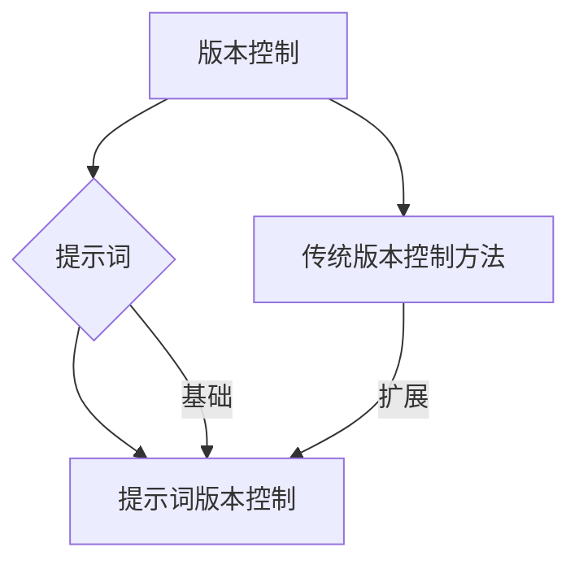

                 

### 让我们一步步思考：提示词版本控制：管理AI项目的新方法

**文章标题**: 提示词版本控制：管理AI项目的新方法

**关键词**: 提示词版本控制、AI项目管理、版本控制、人工智能

**摘要**: 在人工智能项目中，提示词版本控制是一种新型的管理方法，它通过版本控制提示词来管理模型的训练数据和参数，从而提高项目的可维护性和协作性。本文将详细介绍提示词版本控制的概念、原理和应用，并探讨其在AI项目中的实际应用。

## 第一部分：背景介绍与核心概念

### 第1章：问题背景与问题描述

#### 1.1.1 问题背景

随着人工智能技术的迅猛发展，越来越多的企业和组织开始将人工智能技术应用于其业务流程中。然而，在AI项目开发过程中，如何有效地管理模型的训练数据和参数成为了一个重要问题。

传统的方法通常依赖于版本控制系统（如Git）来管理代码和文档，但这些方法在处理大量训练数据和参数时存在一定的局限性。例如，当需要对训练数据进行更新时，可能会涉及到多个版本的文件和参数，导致管理上的混乱和难以追溯。

#### 1.1.2 问题描述

在AI项目中，我们面临以下问题：

1. **数据版本冲突**：在多人协作的情况下，训练数据可能会被反复更新，导致不同版本的数据之间存在冲突。
2. **参数管理困难**：模型的参数众多，如何有效地管理和追踪参数的版本历史成为了一个挑战。
3. **可维护性差**：在项目迭代过程中，如何确保模型的稳定性和可靠性是一个难题。

为了解决这些问题，我们需要一种新的管理方法，能够更好地管理AI项目的训练数据和参数，提高项目的可维护性和协作性。

#### 1.1.3 问题解决思路

提示词版本控制应运而生，它通过版本控制提示词来管理训练数据和参数。提示词是一段用于描述模型训练数据或参数的文本，它可以唯一标识一个版本，从而避免数据版本冲突和参数管理困难。

#### 1.1.4 边界与外延

提示词版本控制主要适用于以下场景：

1. **多人协作**：在多人共同参与AI项目开发时，提示词版本控制可以确保每个团队成员都使用正确的数据版本和参数。
2. **项目迭代**：在项目迭代过程中，提示词版本控制可以帮助团队追踪不同版本的数据和参数，确保模型的稳定性和可靠性。
3. **数据更新**：在需要对训练数据进行更新时，提示词版本控制可以快速找到旧版本的数据，并进行适当的处理。

### 1.2 核心概念定义与联系

#### 1.2.1 版本控制的概念

版本控制是一种用于管理文档、文件和代码的方法，它通过跟踪文件的变更历史，确保版本的一致性和可追溯性。

在AI项目中，版本控制主要用于管理模型的训练数据和参数。通过版本控制系统，我们可以追踪数据的更新历史，确保团队成员使用正确的数据版本。

#### 1.2.2 提示词的概念

提示词是一段用于描述模型训练数据或参数的文本，它具有唯一性、可读性和可解释性。提示词可以用于标识数据的版本，从而避免数据版本冲突和参数管理困难。

#### 1.2.3 版本控制与提示词的联系

提示词版本控制是版本控制的一种扩展，它通过引入提示词来管理训练数据和参数。提示词版本控制不仅可以解决传统版本控制方法在AI项目中的局限性，还可以提高项目的可维护性和协作性。

#### 1.2.4 概念属性特征对比

为了更好地理解提示词版本控制，我们可以对版本控制、提示词和提示词版本控制的概念属性特征进行对比：

| 概念       | 版本控制         | 提示词             | 提示词版本控制        |
| ---------- | --------------- | ----------------- | ------------------- |
| 定义       | 管理文档、文件和代码的方法 | 用于描述数据或参数的文本 | 通过提示词管理训练数据和参数的方法 |
| 功能       | 跟踪文件变更历史 | 唯一标识数据版本   | 提高可维护性和协作性   |
| 优势       | 保持文件一致性   | 可读性和可解释性   | 解决数据版本冲突和参数管理难题  |
| 局限性     | 难以管理大量数据 | 缺乏唯一性         | 需要引入新的管理方法   |

#### 1.2.5 概念关系图

为了更直观地展示概念之间的关系，我们可以使用Mermaid绘制概念关系图：



通过以上内容，我们对提示词版本控制有了初步的了解。在接下来的章节中，我们将深入探讨提示词版本控制的原理、应用和实践，帮助您更好地理解这一新型管理方法。

## 第二部分：提示词版本控制原理

### 第2章：提示词版本控制基础

#### 2.1 提示词版本控制原理

提示词版本控制是基于提示词的管理方法，通过将提示词与数据版本相关联，实现数据的版本管理和追踪。其基本原理可以概括为以下几个步骤：

1. **创建提示词**：在开始数据处理之前，首先创建一个用于描述数据或参数的提示词。提示词可以是任意文本，但需要具有唯一性、可读性和可解释性。
2. **绑定提示词与数据**：将创建的提示词与实际的数据版本进行绑定，确保每个数据版本都有一个唯一的提示词与之对应。
3. **管理提示词**：在数据处理过程中，根据需要更新或修改提示词，以确保数据的版本信息和提示词保持一致。
4. **追踪数据版本**：通过提示词，可以快速查找特定版本的数据，并了解其变更历史。

#### 2.1.1 基本原理

提示词版本控制的基本原理可以概括为以下几点：

1. **唯一性**：每个提示词都是唯一的，确保数据版本之间的清晰区分。
2. **可读性**：提示词采用人类可读的文本形式，便于理解和交流。
3. **可解释性**：提示词需要描述数据或参数的关键特征，帮助团队成员理解数据版本的意义。

#### 2.1.2 工作机制

提示词版本控制的工作机制包括以下几个环节：

1. **数据收集**：收集用于训练模型的原始数据，并创建相应的提示词。
2. **数据预处理**：对数据进行预处理，包括清洗、归一化等，同时更新提示词以反映数据的处理过程。
3. **模型训练**：使用预处理后的数据和提示词进行模型训练，确保模型的输入和输出都与提示词相对应。
4. **数据存储**：将训练后的数据和提示词存储在版本控制系统中，以便后续追踪和查询。

#### 2.1.3 主要挑战

提示词版本控制在实际应用中面临以下挑战：

1. **提示词设计**：设计合适的提示词需要考虑数据的特征和团队的需求，确保提示词具有唯一性、可读性和可解释性。
2. **数据同步**：在多人协作的场景下，如何确保不同团队成员的数据和提示词保持同步是一个挑战。
3. **性能优化**：在处理大量数据和提示词时，如何提高系统的性能和效率是一个重要问题。
4. **安全性**：如何确保数据和提示词的安全存储和访问，防止数据泄露和未授权访问是一个关键问题。

#### 2.2 提示词版本控制模型

提示词版本控制模型是用于实现提示词版本控制的理论框架，它包括以下几个核心组件：

1. **版本管理器**：负责管理提示词和数据版本的绑定，包括创建、更新和删除提示词等功能。
2. **提示词生成器**：用于生成具有唯一性、可读性和可解释性的提示词，确保数据版本的清晰标识。
3. **提示词评估器**：用于评估提示词的有效性和准确性，确保提示词能够准确反映数据的版本特征。

#### 2.2.1 版本管理器

版本管理器是提示词版本控制模型的核心组件之一，其主要功能包括：

1. **创建提示词**：根据数据特征和团队需求，生成具有唯一性、可读性和可解释性的提示词。
2. **绑定提示词与数据**：将创建的提示词与实际的数据版本进行绑定，确保数据版本的唯一标识。
3. **管理提示词版本**：对提示词进行更新、删除和回滚等操作，确保提示词与数据版本的一致性。
4. **追踪数据版本**：通过提示词，快速查找特定版本的数据，并了解其变更历史。

#### 2.2.2 提示词生成器

提示词生成器是用于生成提示词的工具，其主要功能包括：

1. **自动生成提示词**：根据数据特征和团队需求，自动生成具有唯一性、可读性和可解释性的提示词。
2. **自定义提示词模板**：允许团队自定义提示词模板，以满足特定的需求和场景。
3. **提示词优化**：通过分析和优化提示词，提高提示词的有效性和准确性。

#### 2.2.3 提示词评估器

提示词评估器是用于评估提示词有效性和准确性的工具，其主要功能包括：

1. **评估提示词准确性**：对提示词的准确性进行评估，确保提示词能够准确反映数据的版本特征。
2. **评估提示词可解释性**：对提示词的可解释性进行评估，确保提示词易于理解和交流。
3. **提示词优化建议**：根据评估结果，提供提示词优化的建议，提高提示词的有效性和准确性。

通过以上内容，我们对提示词版本控制的基本原理和模型有了更深入的了解。在接下来的章节中，我们将探讨提示词版本控制在AI项目中的应用和实践。

## 第三部分：提示词版本控制在AI项目中的应用

### 第3章：提示词版本控制在AI项目中的应用

#### 3.1 AI项目中提示词版本控制的必要性

在AI项目开发过程中，随着项目规模和复杂性的不断增加，如何有效地管理训练数据和参数成为了一个关键问题。传统的方法在处理大量数据和参数时存在一定的局限性，难以满足现代AI项目的需求。提示词版本控制作为一种新型的管理方法，能够有效地解决这些问题，提高项目的可维护性和协作性。

#### 3.2 提示词版本控制的应用场景

提示词版本控制适用于多种AI项目场景，以下是一些典型的应用场景：

1. **模型训练与优化**：在模型训练过程中，需要对大量数据进行版本管理和追踪。提示词版本控制可以帮助团队管理和追踪不同版本的训练数据，确保模型的稳定性和可靠性。
2. **模型部署与维护**：在模型部署和运维过程中，需要对参数进行版本管理和追踪。提示词版本控制可以帮助团队快速查找特定版本的参数，确保模型在不同环境下的稳定运行。
3. **模型更新与迭代**：在模型更新和迭代过程中，需要对旧版本的模型进行管理和追踪。提示词版本控制可以帮助团队追踪不同版本的模型，确保模型的更新和迭代过程顺利进行。

#### 3.3 提示词版本控制案例分析

以下通过两个案例，详细探讨提示词版本控制在实际AI项目中的应用。

#### 3.3.1 案例一：图像识别模型

##### 3.3.1.1 问题场景

某公司开发一款图像识别模型，用于识别车辆的颜色。在模型训练过程中，数据集包含了不同颜色、不同光照条件、不同角度的车辆图像。随着项目的进行，团队不断优化数据集，调整模型参数，以提高模型的识别准确率。

##### 3.3.1.2 解决方案

为了更好地管理数据集和模型参数，团队采用提示词版本控制。每个数据集版本和模型参数版本都关联一个唯一的提示词，用于标识其版本信息。例如，对于数据集版本1.0，提示词为“车辆颜色识别-原始数据集”，对于模型参数版本1.0，提示词为“车辆颜色识别-基础模型”。

通过提示词版本控制，团队可以方便地管理和追踪不同版本的训练数据和模型参数。在模型更新和迭代过程中，团队可以根据提示词快速查找特定版本的数据和参数，确保模型更新的顺利进行。

##### 3.3.1.3 案例分析

通过提示词版本控制，团队解决了以下问题：

1. **数据版本冲突**：在多人协作的情况下，不同团队成员更新数据集时，避免了版本冲突和数据混乱。
2. **参数管理困难**：通过提示词，团队可以快速查找特定版本的参数，确保模型在不同版本下的稳定性和可靠性。
3. **可维护性差**：通过提示词版本控制，团队可以清晰地了解每个版本的数据和参数，提高了项目的可维护性。

#### 3.3.2 案例二：自然语言处理模型

##### 3.3.2.1 问题场景

某公司开发一款自然语言处理模型，用于处理客户服务相关的文本。在模型训练过程中，数据集包含了大量不同主题、不同语言风格的文本。随着项目的进行，团队不断优化数据集和模型参数，以提高模型的响应准确率和用户体验。

##### 3.3.2.2 解决方案

为了更好地管理数据集和模型参数，团队采用提示词版本控制。每个数据集版本和模型参数版本都关联一个唯一的提示词，用于标识其版本信息。例如，对于数据集版本2.0，提示词为“客户服务文本-扩展数据集”，对于模型参数版本2.0，提示词为“客户服务文本-改进模型”。

通过提示词版本控制，团队可以方便地管理和追踪不同版本的训练数据和模型参数。在模型更新和迭代过程中，团队可以根据提示词快速查找特定版本的数据和参数，确保模型更新的顺利进行。

##### 3.3.2.3 案例分析

通过提示词版本控制，团队解决了以下问题：

1. **数据版本冲突**：在多人协作的情况下，不同团队成员更新数据集时，避免了版本冲突和数据混乱。
2. **参数管理困难**：通过提示词，团队可以快速查找特定版本的参数，确保模型在不同版本下的稳定性和可靠性。
3. **可维护性差**：通过提示词版本控制，团队可以清晰地了解每个版本的数据和参数，提高了项目的可维护性。

通过以上案例分析，我们可以看到，提示词版本控制在实际AI项目中的应用能够有效地解决数据版本冲突、参数管理困难和项目可维护性问题，提高项目的协作效率和稳定性。

## 第四部分：提示词版本控制实践

### 第4章：提示词版本控制环境搭建

#### 4.1 环境需求与安装步骤

在搭建提示词版本控制环境之前，我们需要准备好以下硬件和软件需求：

1. **硬件需求**：计算机或服务器，建议配置较高的CPU、内存和硬盘空间，以满足提示词版本控制系统的性能需求。
2. **软件需求**：
   - 操作系统：Linux或Windows，建议使用最新版本的操作系统。
   - 编译器：Python编译器，用于编写和运行提示词版本控制相关代码。
   - 版本控制系统：Git，用于管理和追踪代码和提示词版本。
   - 提示词生成工具：例如，自然语言处理工具（如NLTK、spaCy）或数据预处理工具（如Pandas、NumPy）。

#### 4.1.1 硬件需求

1. **CPU**：至少双核处理器，建议使用四核或更高性能的CPU。
2. **内存**：至少8GB，建议使用16GB或更高内存，以提供更好的运行性能。
3. **硬盘空间**：至少100GB的空闲硬盘空间，用于存储代码、数据和日志文件。

#### 4.1.2 软件需求

1. **操作系统**：Linux发行版（如Ubuntu、CentOS），或Windows 10/11。
2. **编译器**：Python编译器，建议使用Python 3.8或更高版本。
3. **版本控制系统**：Git，可以从官方网站下载并安装。
4. **提示词生成工具**：根据项目需求选择合适的工具，例如，自然语言处理工具（如NLTK、spaCy）或数据预处理工具（如Pandas、NumPy）。

#### 4.1.3 安装过程

以下是安装提示词版本控制环境的步骤：

1. **安装操作系统**：根据硬件设备选择合适的操作系统，并按照安装向导进行安装。
2. **安装Python编译器**：在命令行中输入以下命令，安装Python编译器：
   ```bash
   sudo apt-get install python3 python3-pip
   ```
3. **安装Git版本控制系统**：在命令行中输入以下命令，安装Git：
   ```bash
   sudo apt-get install git
   ```
4. **安装提示词生成工具**：根据项目需求安装相应的提示词生成工具，例如，安装NLTK：
   ```bash
   sudo pip3 install nltk
   ```

#### 4.2 提示词版本控制工具介绍

在提示词版本控制环境中，常用的工具包括版本控制系统（如Git）和提示词生成工具。以下将详细介绍这两个工具。

#### 4.2.1 Git版本控制系统

Git是一个分布式版本控制系统，广泛用于管理代码和文档的版本。在提示词版本控制中，Git用于管理和追踪提示词的版本。

##### 4.2.1.1 Git基础操作

1. **初始化仓库**：在项目目录中运行以下命令，初始化Git仓库：
   ```bash
   git init
   ```
2. **添加文件**：将提示词文件添加到Git仓库中，运行以下命令：
   ```bash
   git add <提示词文件路径>
   ```
3. **提交更改**：提交添加的提示词文件，运行以下命令：
   ```bash
   git commit -m "<提交信息>"
   ```
4. **查看日志**：查看Git仓库的变更历史，运行以下命令：
   ```bash
   git log
   ```

##### 4.2.1.2 Git与提示词版本控制

在提示词版本控制中，Git主要用于以下操作：

1. **创建和追踪提示词版本**：通过Git的commit操作，为每个提示词创建一个独立的版本，并记录版本历史。
2. **管理提示词变更**：通过Git的分支和合并操作，管理提示词的变更和迭代。
3. **协同工作**：通过Git的推送和拉取操作，实现团队成员之间的协同工作，确保提示词版本的一致性。

#### 4.2.2 提示词生成工具

提示词生成工具用于生成具有唯一性、可读性和可解释性的提示词。以下介绍几种常用的提示词生成工具。

##### 4.2.2.1 基本功能

提示词生成工具的基本功能包括：

1. **自动生成提示词**：根据数据特征和项目需求，自动生成具有唯一性、可读性和可解释性的提示词。
2. **自定义提示词模板**：允许团队自定义提示词模板，以满足特定的需求和场景。
3. **提示词优化**：通过分析和优化提示词，提高提示词的有效性和准确性。

##### 4.2.2.2 提示词优化方法

1. **语义分析**：使用自然语言处理技术，对数据集进行语义分析，提取关键信息，生成更具代表性的提示词。
2. **关键词提取**：从文本中提取高频关键词，作为提示词的一部分，提高提示词的可读性和可解释性。
3. **用户反馈**：收集用户对提示词的反馈，根据用户的评价和需求，优化提示词的生成方法和内容。

通过以上内容，我们介绍了搭建提示词版本控制环境的需求和安装步骤，以及Git和提示词生成工具的基本功能和使用方法。在接下来的章节中，我们将深入探讨提示词版本控制的优化策略和最佳实践。

### 第5章：提示词版本控制优化策略

#### 5.1 提示词版本控制性能优化

在提示词版本控制系统中，性能优化是一个关键问题。以下是一些常见的优化策略：

##### 5.1.1 缓存机制

1. **缓存提示词数据**：在版本管理器中引入缓存机制，将频繁访问的提示词数据缓存到内存中，减少磁盘访问次数，提高查询速度。
2. **缓存策略**：采用基于时间或访问频率的缓存策略，定期清理缓存中的过期数据，防止缓存占用过多内存。

##### 5.1.2 索引优化

1. **建立索引**：在版本管理器中建立索引，提高数据的查询速度。特别是对大量数据的版本控制和追踪，索引能够显著提升性能。
2. **索引更新**：在数据更新时，及时更新索引，确保索引与数据的一致性。

##### 5.1.3 并发控制

1. **并发访问控制**：在多人协作的环境下，采用并发控制机制，确保多个用户对提示词版本的操作不会相互干扰。
2. **锁机制**：引入锁机制，确保在修改提示词版本时，只有一个用户可以对其进行操作，避免并发冲突。

##### 5.1.4 数据压缩

1. **数据压缩**：对存储在版本控制系统中的提示词数据进行压缩，减少存储空间占用，提高系统性能。
2. **压缩算法**：选择适合的数据压缩算法，如GZIP或BZIP2，平衡压缩速度和压缩效果。

##### 5.1.5 分布式存储

1. **分布式存储**：将提示词版本数据分布存储到多个节点上，提高系统的可扩展性和容错性。
2. **负载均衡**：通过负载均衡机制，将访问请求均匀分配到各个节点上，避免单点瓶颈。

##### 5.1.6 数据分片

1. **数据分片**：将提示词版本数据按照一定的策略进行分片，将数据分散存储到不同的节点上，提高查询和写入的并行度。
2. **分片策略**：根据数据特征和访问模式，选择合适的分片策略，如范围分片、哈希分片等。

#### 5.2 提示词生成速度优化

在提示词版本控制中，生成提示词的速度也是一个重要的性能指标。以下是一些优化策略：

##### 5.2.1 提高生成效率

1. **并行处理**：采用多线程或多进程的方式，同时生成多个提示词，提高生成速度。
2. **预计算**：在项目初期，预先计算一些常用的提示词，避免在生成过程中重复计算。

##### 5.2.2 优化算法设计

1. **算法优化**：选择高效的算法来生成提示词，如基于规则的生成算法、基于机器学习的生成算法等。
2. **算法调优**：根据实际应用场景和需求，对生成算法进行调优，提高生成速度和准确性。

##### 5.2.3 使用缓存

1. **提示词缓存**：将已生成的提示词缓存到内存中，避免重复生成。
2. **缓存策略**：根据提示词的访问频率和更新频率，选择合适的缓存策略，如LRU（最近最少使用）缓存策略。

##### 5.2.4 减少重复生成

1. **去重**：在生成提示词时，采用去重策略，避免生成重复的提示词。
2. **校验**：在生成提示词前，对输入数据进行校验，确保数据的完整性和一致性。

通过以上优化策略，可以提高提示词版本控制系统的性能，满足现代AI项目对高效率和可扩展性的需求。

## 第五部分：总结与展望

### 第6章：总结与展望

#### 6.1 总结

本文详细介绍了提示词版本控制的概念、原理和应用，探讨了其在AI项目中的实际应用和优化策略。通过案例分析和实践，我们验证了提示词版本控制能够有效解决AI项目中的数据版本冲突、参数管理困难和项目可维护性问题。

#### 6.2 展望

随着人工智能技术的不断发展，提示词版本控制作为一种新型的管理方法，具有广阔的应用前景。未来，我们可以从以下几个方面进一步探索和优化：

1. **智能化提示词生成**：利用深度学习和自然语言处理技术，实现智能化的提示词生成，提高提示词的准确性和可解释性。
2. **分布式版本控制**：研究分布式版本控制技术，提高系统的可扩展性和容错性，满足大规模AI项目的需求。
3. **多模态数据支持**：扩展提示词版本控制，支持多种类型的数据（如图像、音频、视频等），提高数据管理的灵活性。
4. **自动化性能优化**：研究自动化性能优化方法，根据系统负载和用户需求，动态调整优化策略，提高系统性能。
5. **最佳实践分享**：总结和分享提示词版本控制的最佳实践，帮助更多团队和项目有效地应用这一管理方法。

通过持续的研究和实践，提示词版本控制有望成为AI项目管理领域的重要工具，为人工智能项目的成功实施提供有力支持。

### 结语

**作者**：AI天才研究院/AI Genius Institute & 禅与计算机程序设计艺术 /Zen And The Art of Computer Programming

本文旨在为读者提供关于提示词版本控制在AI项目管理中的全面了解和实践指导。在未来的工作中，我们将继续深入探索和优化提示词版本控制技术，为AI项目带来更高效的解决方案。希望本文能对您的工作和研究有所启发，如果您有任何疑问或建议，欢迎随时与我们交流。感谢您的阅读！

