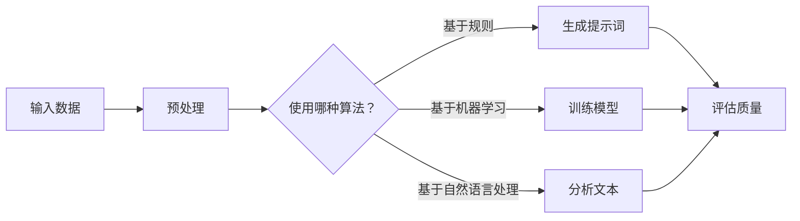
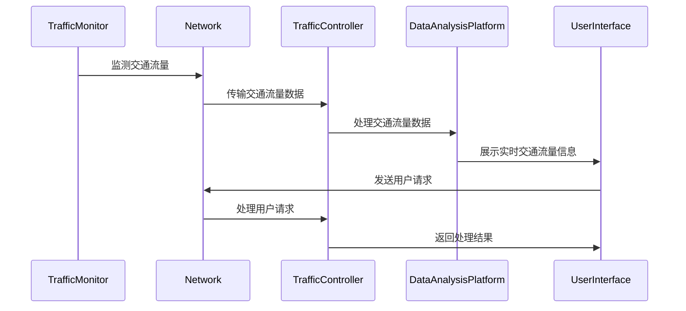
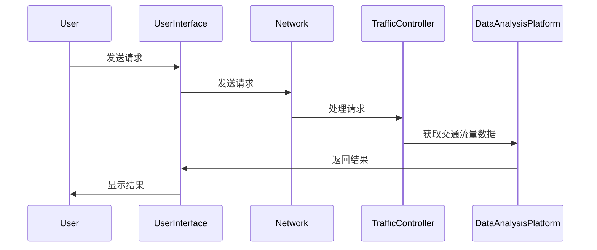

                 

### 引言与概述

#### 物联网与提示词编程概览

在当今数字化时代，物联网（Internet of Things，IoT）已经成为连接物理世界与数字世界的桥梁，其应用领域广泛，涵盖了智能家居、智能交通、智慧城市、工业物联网等多个方面。根据市场研究公司的数据，全球物联网设备数量预计将在未来几年内持续增长，达到数百亿级别。这一增长不仅体现了技术的进步，更揭示了物联网在经济和社会发展中的重要性。

然而，随着物联网设备的普及，如何高效地编程和运维这些设备成为了一个亟待解决的问题。传统的编程方式往往需要复杂的代码和大量的调试，而提示词编程（Keyword Programming）作为一种新型的编程范式，逐渐引起了人们的关注。提示词编程通过定义特定的关键词来简化编程过程，使得开发者能够更加直观和高效地编写和管理代码。

#### 提示词编程的概念与特点

提示词编程的基本原理在于通过一组特定的关键词来描述程序的行为。这些关键词代表具体的任务或操作，使得编程过程更加简洁明了。例如，在一个智能家居系统中，可以使用“打开灯”作为提示词来控制灯光。与传统的编程方式相比，提示词编程具有以下特点：

1. **简洁性**：通过关键词来描述操作，减少了代码的复杂性。
2. **可读性**：关键词的语义明确，使得代码更加易于理解和维护。
3. **高效性**：提示词编程减少了开发时间和调试成本，提高了开发效率。
4. **灵活性**：提示词可以灵活地组合和扩展，适应不同的应用场景。

然而，提示词编程也面临一些挑战，例如如何生成合适的提示词、如何保证提示词的准确性等。但总体而言，提示词编程在简化编程流程、提高开发效率方面展现出巨大潜力。

#### 提示词编程与IoT的融合

在物联网设备编程中，提示词编程的应用具有显著的优势。首先，物联网设备通常具有资源受限的特点，提示词编程能够简化代码结构，降低资源消耗。其次，物联网设备需要快速响应外部事件，提示词编程通过简洁的指令可以快速实现设备控制。此外，提示词编程还支持设备之间的协同工作，通过定义特定的关键词可以实现设备间的通信和协同。

然而，提示词编程在物联网设备编程中也面临一些挑战。例如，如何处理大量的设备数据和保证系统的实时性。此外，安全性也是需要考虑的重要因素，因为物联网设备通常连接到公共网络，容易成为网络攻击的目标。

为了解决这些挑战，研究人员和开发者们提出了多种策略，包括优化提示词生成算法、引入智能调度机制、加强数据加密等。这些策略为提示词编程在物联网设备编程中的应用提供了有力支持。

#### 本书结构安排与目标读者

本书旨在系统地介绍提示词编程在物联网设备编程中的应用，内容结构如下：

1. **引言与概述**：介绍物联网和提示词编程的基本概念，探讨它们在物联网设备编程中的应用。
2. **IoT设备编程基础**：详细讲解物联网设备编程的基本概念、通信协议、硬件介绍以及编程工具与环境配置。
3. **提示词编程基础**：介绍提示词编程的基本原理、生成算法及其优势与挑战。
4. **提示词编程在IoT设备中的应用**：探讨提示词编程在不同物联网设备中的应用场景和实践。
5. **高级提示词编程技术**：介绍高级提示词生成算法和优化策略，以及创新应用。
6. **挑战与未来**：分析提示词编程在物联网设备编程中的挑战和未来发展趋势。
7. **案例分析与实践**：通过实际案例展示提示词编程的应用，并提供实践经验和总结。

本书的目标读者包括物联网开发者、编程爱好者以及对提示词编程感兴趣的读者。通过本书，读者将能够全面了解提示词编程在物联网设备编程中的应用，掌握相关技术，并能够将其应用于实际项目中。

#### 总结

本文简要介绍了物联网与提示词编程的基本概念，探讨了提示词编程在物联网设备编程中的应用优势与挑战。接下来，本书将逐步深入，从基础到高级，详细讲解提示词编程的技术细节，并通过实际案例分析，展示其在物联网设备编程中的广泛应用。希望通过本书的阅读，读者能够对提示词编程有一个全面、深入的理解，并能够在实际项目中充分发挥其优势。接下来，我们将详细探讨物联网设备编程的基础知识。

### 物联网设备编程基础

#### IoT设备编程的基本概念

物联网（IoT）设备编程是指通过编写代码来配置、控制和监测物联网设备。这些设备通常具有连接互联网的能力，能够与其他设备或服务器进行通信。物联网设备编程的主要目标是实现设备间的互联互通，使设备能够高效地收集、处理和传输数据。

物联网设备编程的关键技术包括以下几个方面：

1. **通信协议**：通信协议是物联网设备之间进行数据交换的规范。常见的物联网通信协议有Wi-Fi、蓝牙、Zigbee、MQTT等。每种协议都有其特定的应用场景和优缺点，选择合适的通信协议对于物联网系统的稳定性和性能至关重要。

2. **数据处理**：物联网设备通常需要处理大量的数据，包括传感器的实时数据、设备状态信息等。数据处理技术包括数据采集、存储、分析、可视化等，是实现物联网设备智能化的重要手段。

3. **硬件接口**：物联网设备通常需要与各种硬件接口进行交互，如传感器、执行器、显示屏等。硬件接口的设计与编程是确保设备正常运行的基础。

4. **安全性**：物联网设备通常连接到公共网络，容易成为网络攻击的目标。安全性技术包括数据加密、身份认证、访问控制等，是保障物联网设备安全的关键。

#### 物联网通信协议

物联网通信协议是物联网设备之间进行数据交换的桥梁。以下是一些常见的物联网通信协议及其特点：

1. **Wi-Fi**：Wi-Fi是一种广泛使用的无线通信协议，具有高速率、大覆盖范围的特点。但Wi-Fi的功耗较高，不适合电池供电的物联网设备。

2. **蓝牙**：蓝牙是一种低功耗的无线通信协议，适用于短距离的数据传输。蓝牙的传输速率较低，但稳定性好，广泛应用于智能家居、可穿戴设备等领域。

3. **Zigbee**：Zigbee是一种低功耗、低速率的无线通信协议，适用于家庭自动化、工业控制等场景。Zigbee网络具有高可靠性、低延迟、高安全性等特点。

4. **MQTT**：MQTT是一种轻量级的消息队列协议，适用于物联网设备之间的数据传输。MQTT协议的特点是低带宽消耗、高可靠性、支持异步消息传输，广泛应用于物联网设备和服务器之间的通信。

在物联网设备编程中，选择合适的通信协议至关重要。通信协议的比较与选择应考虑以下因素：

- **传输速率**：根据物联网设备的传输需求选择合适的通信协议。
- **功耗**：对于电池供电的物联网设备，应选择低功耗的通信协议。
- **稳定性**：选择具有高稳定性的通信协议，以确保设备之间的可靠通信。
- **安全性**：选择支持数据加密、身份认证等安全功能的通信协议，保障设备数据的安全。

在实际应用中，多种通信协议可以结合使用，以实现最佳的性能和稳定性。例如，在智能家居系统中，可以使用Wi-Fi进行家庭内部的设备通信，使用蓝牙或Zigbee进行短距离设备控制，使用MQTT进行设备与服务器之间的数据传输。

#### IoT设备硬件介绍

物联网设备的硬件组成部分主要包括传感器、处理器、无线通信模块、电源等。以下是对这些硬件组件的介绍：

1. **传感器**：传感器是物联网设备的核心组成部分，用于收集环境数据。常见的传感器有温度传感器、湿度传感器、光线传感器、运动传感器等。传感器的选择应根据应用场景的需求来确定。

2. **处理器**：处理器是物联网设备的大脑，负责处理传感器数据、执行程序指令等。处理器的性能和功耗直接影响设备的运行效率和寿命。常见的处理器有ARM处理器、单片机等。

3. **无线通信模块**：无线通信模块用于实现物联网设备之间的数据传输。常见的无线通信模块有Wi-Fi模块、蓝牙模块、Zigbee模块等。选择合适的无线通信模块应根据应用场景的通信需求和功耗要求来确定。

4. **电源**：物联网设备通常采用电池供电，因此电源的设计与选择至关重要。电池的类型、容量、续航时间等因素都将影响设备的实际应用效果。

在硬件选型与优化策略方面，需要考虑以下因素：

- **性能**：选择具有足够性能的硬件组件，以确保设备能够满足应用需求。
- **功耗**：选择低功耗的硬件组件，延长设备的续航时间。
- **兼容性**：确保硬件组件之间的兼容性，以避免设备在使用过程中出现不兼容问题。
- **可靠性**：选择具有高可靠性的硬件组件，降低设备故障率，提高设备的稳定性。

硬件故障诊断与维护是物联网设备编程中的重要环节。常见的硬件故障包括传感器失效、处理器异常、通信模块故障等。诊断硬件故障的方法包括：

- **逐个检查**：通过逐个检查硬件组件的工作状态，定位故障点。
- **使用调试工具**：使用调试工具（如逻辑分析仪、示波器等）进行硬件调试，找出故障原因。
- **替换组件**：在确定故障组件后，及时进行更换，确保设备恢复正常运行。

定期维护是确保物联网设备长期稳定运行的关键。维护内容包括：

- **清洁**：定期清洁传感器、处理器等硬件组件，防止灰尘和污垢影响设备性能。
- **更新固件**：定期更新设备固件，修复已知问题和增加新功能。
- **监控运行状态**：通过监控系统实时监测设备的运行状态，及时发现和处理异常情况。

#### IoT设备编程工具与环境配置

物联网设备编程工具的选择对于开发效率和代码质量具有重要影响。以下是一些常用的编程工具：

1. **集成开发环境（IDE）**：IDE提供了代码编辑、编译、调试等功能，方便开发者进行编程。常见的IDE有Arduino IDE、Eclipse、Visual Studio Code等。

2. **开发板**：开发板是物联网设备编程的重要工具，提供了硬件接口和编程接口，方便开发者进行原型开发和测试。常见的开发板有Arduino板、Raspberry Pi等。

3. **编程语言**：物联网设备编程常用的编程语言包括C/C++、Python、Java等。C/C++具有高效、低功耗的特点，适用于嵌入式设备编程；Python具有简洁、易用的特点，适用于快速原型开发和数据分析。

在开发环境配置方面，需要根据实际应用需求进行配置。以下是一些配置步骤：

1. **安装IDE**：下载并安装适合的IDE，如Arduino IDE、Eclipse等。

2. **安装开发板驱动**：安装开发板所需的驱动程序，确保开发板与计算机正常通信。

3. **安装编程语言**：根据需要安装编程语言，如Python、Java等。

4. **配置库和工具**：安装所需的库和工具，如传感器库、通信协议库等，方便开发者进行编程。

5. **设置开发环境变量**：配置开发环境变量，以便于编译器和解释器正确执行。

在物联网设备编程过程中，开发者还需要掌握常用的编程语言和开发工具。以下是一些推荐的编程语言和工具：

1. **编程语言**：
   - **C/C++**：适用于嵌入式设备编程，具有高效、低功耗的特点。
   - **Python**：适用于快速原型开发和数据分析，具有简洁、易用的特点。
   - **Java**：适用于企业级应用开发，具有良好的跨平台性。

2. **开发工具**：
   - **Arduino IDE**：适用于Arduino开发板，提供了丰富的传感器库和编程功能。
   - **Eclipse**：适用于Java开发，提供了强大的代码编辑和调试功能。
   - **Visual Studio Code**：适用于多种编程语言，提供了丰富的插件和扩展功能。

通过合理选择编程工具和环境配置，开发者可以高效地进行物联网设备编程，实现设备的智能互联和高效运行。接下来，我们将深入探讨提示词编程的基本原理和应用场景。

### 提示词编程基础

#### 提示词编程的基本原理

提示词编程（Keyword Programming）是一种通过定义特定的关键词来描述程序行为的新型编程范式。其核心思想是将程序的操作指令以自然语言的形式表达，使得编程过程更加直观和简洁。提示词编程的基本原理可以概括为以下几个方面：

1. **关键词定义**：在提示词编程中，关键词是程序的核心元素。每个关键词代表一个特定的操作或任务，如“打开灯”、“关闭门”、“读取温度”等。开发者可以通过定义这些关键词来描述程序的行为。

2. **语义解析**：提示词编程的关键在于对关键词的语义进行解析。编程环境会根据关键词的含义，将抽象的操作指令转化为具体的程序代码。这一过程通常由提示词解释器或编译器完成。

3. **执行流程**：解析后的程序代码将按照预定的执行流程运行，完成相应的任务。与传统的编程范式相比，提示词编程的执行流程更加直观，开发者无需关注底层细节，只需关注任务的实现。

4. **可扩展性**：提示词编程具有良好的可扩展性。开发者可以通过添加新的关键词或扩展已有关键词的功能，实现新的编程需求。这种灵活性使得提示词编程能够适应不同领域和场景的应用需求。

#### 提示词编程的流程

提示词编程的流程通常包括以下几个步骤：

1. **定义关键词**：开发者根据应用需求，定义一组关键词。这些关键词需要具备明确的语义和操作定义。

2. **构建提示词库**：将定义好的关键词组织成提示词库，方便后续编程使用。提示词库可以是静态的，也可以是动态的，支持关键词的增删改查。

3. **编写提示词程序**：开发者使用提示词库中的关键词，按照特定的语法规则编写程序。提示词程序通常采用自然语言的形式，易于理解和维护。

4. **语义解析**：编程环境对提示词程序进行语义解析，将自然语言形式的提示词转化为具体的程序代码。

5. **执行程序**：解析后的程序代码按照预定的执行流程运行，完成相应的任务。

6. **调试与优化**：在程序运行过程中，开发者可以通过调试工具对程序进行调试和优化，确保程序的正确性和高效性。

#### 提示词的类型与应用场景

在提示词编程中，根据关键词的不同作用和用途，可以将提示词分为以下几类：

1. **命令型关键词**：这类关键词用于描述具体的操作命令，如“打开”、“关闭”、“启动”、“停止”等。命令型关键词通常直接对应设备或系统的控制指令。

2. **查询型关键词**：这类关键词用于查询设备或系统的状态信息，如“读取温度”、“查询电量”、“获取时间”等。查询型关键词通常用于实现数据采集和状态监控。

3. **条件型关键词**：这类关键词用于描述条件判断和逻辑控制，如“如果”、“当”、“则”等。条件型关键词通常用于实现复杂的逻辑控制和决策。

4. **功能型关键词**：这类关键词用于实现特定功能模块，如“计算”、“排序”、“加密”等。功能型关键词通常用于实现通用功能，提高程序的复用性和灵活性。

不同的提示词类型适用于不同的应用场景。例如，在智能家居系统中，命令型关键词和查询型关键词可以用于控制家电设备和监测家居环境；在工业自动化系统中，条件型关键词和功能型关键词可以用于实现复杂的工艺流程和实时监控。

#### 提示词生成算法

提示词生成算法是提示词编程的核心技术之一，用于自动生成合适的提示词，以提高编程效率和灵活性。以下是一些常见的提示词生成算法：

1. **基于规则的方法**：基于规则的方法通过预定义的规则库，根据输入条件生成相应的提示词。这种方法简单直观，但规则库的构建和维护较为复杂。

2. **基于机器学习的方法**：基于机器学习的方法通过训练大量的样本数据，学习生成合适的提示词。常见的机器学习算法包括决策树、支持向量机、神经网络等。这种方法具有较好的自适应性和泛化能力，但需要大量的训练数据和计算资源。

3. **基于自然语言处理的方法**：基于自然语言处理的方法利用自然语言处理技术，对输入文本进行分析和转换，生成合适的提示词。这种方法能够处理复杂的语义和语境，但算法复杂度较高。

4. **基于组合的方法**：基于组合的方法将多个提示词生成算法相结合，通过组合优化生成合适的提示词。这种方法具有较高的灵活性和效率，但需要处理大量的组合情况。

提示词生成算法的性能评估主要包括以下方面：

- **生成质量**：评估生成的提示词是否准确、完整、易于理解。
- **生成效率**：评估生成提示词的速度和资源消耗。
- **适应能力**：评估提示词生成算法在不同应用场景下的适应能力和泛化能力。

在实际应用中，根据具体需求和场景选择合适的提示词生成算法，并不断优化和改进，以提高提示词编程的效率和效果。

#### 提示词编程的优势与挑战

提示词编程在物联网设备编程中具有显著的优势，主要体现在以下几个方面：

1. **简洁性**：提示词编程通过自然语言形式的提示词，简化了编程过程，使得代码更加简洁明了。开发者无需关注复杂的语法和底层实现细节，专注于任务实现。

2. **易用性**：提示词编程采用自然语言形式，易于理解和维护。特别是对于非专业开发者或领域专家，提示词编程能够降低编程难度，提高编程效率。

3. **灵活性**：提示词编程支持灵活的关键词定义和扩展，可以适应不同应用场景和需求。开发者可以根据实际需求，自由定义新的关键词和功能模块，提高程序的复用性和灵活性。

4. **高效性**：提示词编程通过简洁的指令和高效的执行流程，提高了编程效率。特别是对于复杂的任务和场景，提示词编程能够显著减少代码量和开发时间。

然而，提示词编程也面临一些挑战：

1. **语义解析**：提示词编程的关键在于对自然语言提示词的语义进行准确解析。语义解析的复杂度和准确性直接影响编程效率和程序质量。

2. **性能优化**：提示词编程的执行流程相对简单，但生成的程序代码可能存在性能瓶颈。如何优化提示词生成的算法和执行流程，提高程序性能，是一个重要挑战。

3. **安全性**：物联网设备通常连接到公共网络，提示词编程可能面临安全性问题。如何保障提示词编程的安全性和数据隐私，是一个亟待解决的问题。

4. **工具支持**：提示词编程需要相应的编程工具和环境支持。目前，虽然有一些开源工具和框架，但整体工具支持仍需进一步完善和优化。

为了克服这些挑战，研究人员和开发者们正在不断探索和优化提示词编程技术。通过引入先进的自然语言处理技术、优化提示词生成算法、加强安全性措施等，提示词编程在物联网设备编程中的应用前景将更加广阔。接下来，我们将探讨提示词编程在物联网设备编程中的应用场景和实践。

### 提示词编程在IoT设备中的应用

#### 提示词编程在IoT设备中的具体应用场景

提示词编程在物联网（IoT）设备中的应用非常广泛，能够显著简化设备编程的复杂性，提高开发效率。以下是提示词编程在几种常见IoT设备中的具体应用场景：

1. **家居物联网设备**：
   家居物联网设备如智能门锁、智能灯具、智能恒温器等，使用提示词编程可以简化设备控制过程。例如，用户可以通过语音或远程控制设备，使用如“打开门锁”、“关闭灯光”等提示词，设备则根据提示词执行相应的操作。这种简洁的编程方式使得非技术用户也能轻松操作智能设备。

2. **工业物联网设备**：
   工业物联网设备如传感器、控制器、执行器等，使用提示词编程可以实现更高效的设备配置和监控。例如，在工业生产线上，传感器可以检测温度、压力等参数，并通过提示词编程向控制器发送警报，当参数超出设定范围时自动调整设备运行状态，从而提高生产效率和安全性。

3. **智能交通物联网设备**：
   智能交通设备如智能交通灯、车辆监控器、导航系统等，提示词编程可以简化交通管理系统的编程过程。例如，智能交通灯可以根据实时车流量数据，使用“绿灯亮”、“红灯亮”等提示词调整交通信号灯状态，优化交通流量；车辆监控器可以通过提示词编程实时监控车辆状态，并及时发送警报。

4. **医疗物联网设备**：
   医疗物联网设备如远程监控设备、智能药物配送机器人等，使用提示词编程可以提高医疗服务的质量和效率。例如，远程监控设备可以通过提示词编程实时监测患者的生命体征，并在异常情况发生时发送警报；智能药物配送机器人可以根据医生开具的处方，使用“配送药物”、“检查药品库存”等提示词自动执行药物配送任务。

#### 提示词编程在IoT设备编程中的实践

在具体实践中，提示词编程在IoT设备编程中的应用通常包括以下几个步骤：

1. **需求分析**：
   首先进行需求分析，明确设备的功能要求和用户操作习惯。例如，对于智能家居设备，需要分析用户希望如何控制设备，如通过手机应用、语音控制等。

2. **定义关键词**：
   根据需求分析结果，定义一组用于描述设备操作的关键词。这些关键词需要简洁明了，便于用户理解和记忆。例如，对于智能灯具，可以定义“打开灯”、“关闭灯”、“调亮/调暗”等关键词。

3. **构建提示词库**：
   将定义好的关键词组织成提示词库，方便后续编程使用。提示词库可以是静态的，也可以是动态的，支持关键词的增删改查。

4. **编写提示词程序**：
   使用提示词库中的关键词，按照特定的语法规则编写提示词程序。提示词程序通常采用自然语言的形式，如“如果温度低于15摄氏度，则打开暖气”。编写程序时，需要确保提示词的语法正确，符合设备操作逻辑。

5. **语义解析**：
   编程环境会对提示词程序进行语义解析，将自然语言形式的提示词转化为具体的程序代码。这一过程通常由提示词解释器或编译器完成。

6. **执行程序**：
   解析后的程序代码按照预定的执行流程运行，完成相应的任务。例如，智能家居设备接收到“打开灯”的提示词后，会执行开灯操作。

7. **调试与优化**：
   在程序运行过程中，通过调试工具对程序进行调试和优化，确保程序的正确性和高效性。例如，如果设备在某些情况下无法正确响应提示词，可以通过调试找到问题并优化代码。

以下是一个简单的示例，说明如何使用提示词编程实现智能家居设备的控制：

```python
# 提示词库定义
keyword_library = {
    "打开灯": "turn_on_light",
    "关闭灯": "turn_off_light",
    "调亮": "brighten_light",
    "调暗": "dim_light"
}

# 提示词程序示例
def control_light(action):
    if action == "打开灯":
        turn_on_light()
    elif action == "关闭灯":
        turn_off_light()
    elif action == "调亮":
        brighten_light()
    elif action == "调暗":
        dim_light()

# 执行提示词程序
control_light("打开灯")
```

在上面的示例中，定义了一个提示词库，其中包含了控制灯光的几个关键词。通过编写简单的提示词程序，可以实现对灯光的远程控制。

#### 提示词编程的常见问题与解决策略

在提示词编程的实际应用中，可能会遇到一些常见问题，以下是一些常见问题及其解决策略：

1. **关键词不明确**：
   解决策略：在定义关键词时，确保关键词的语义明确，避免歧义。可以通过增加关键词的描述或上下文来提高关键词的明确性。

2. **语义解析错误**：
   解决策略：优化提示词生成算法和语义解析逻辑，提高语义解析的准确性。可以引入自然语言处理技术，如词性标注、语法分析等，提高解析质量。

3. **程序执行效率低**：
   解决策略：优化程序代码，减少不必要的计算和资源消耗。可以采用多线程、异步处理等技术，提高程序执行效率。

4. **程序调试困难**：
   解决策略：使用高效的调试工具，如断点调试、日志分析等，方便开发者定位和解决问题。可以引入自动化测试工具，提高程序测试覆盖率。

5. **安全性问题**：
   解决策略：加强程序的安全性设计，如加密通信、身份认证等。遵循安全编程的最佳实践，减少安全漏洞。

通过上述解决策略，可以有效地应对提示词编程在IoT设备编程中遇到的问题，提高编程质量和系统稳定性。

#### 提示词编程的实战案例分析

以下是一个提示词编程在智能家居系统中的应用案例：

**案例背景**：一家智能家居公司开发了一款智能门锁，用户可以通过手机应用或语音控制打开门锁。公司希望使用提示词编程简化门锁的控制逻辑，提高用户体验。

**需求分析**：用户希望通过以下方式控制门锁：
- 通过手机应用输入密码或指纹解锁
- 通过语音控制命令解锁或上锁
- 系统自动锁定门锁，如用户离开家后

**提示词库定义**：
```
keyword_library = {
    "输入密码解锁": "input_password_unlock",
    "指纹解锁": "fingerprint_unlock",
    "语音解锁": "voice_unlock",
    "语音上锁": "voice_lock",
    "自动锁定": "auto_lock"
}
```

**编写提示词程序**：
```python
# 语义解析和执行逻辑
def control_lock(action):
    if action == "输入密码解锁":
        input_password_unlock()
    elif action == "指纹解锁":
        fingerprint_unlock()
    elif action == "语音解锁":
        voice_unlock()
    elif action == "语音上锁":
        voice_lock()
    elif action == "自动锁定":
        auto_lock()

# 示例：用户通过手机应用输入密码解锁
control_lock("输入密码解锁")

# 示例：用户通过语音命令解锁
control_lock("语音解锁")
```

**程序执行与调试**：
- 用户通过手机应用输入密码，程序会执行密码验证并解锁门锁。
- 用户通过语音控制命令，程序会识别语音命令并执行相应的解锁或上锁操作。
- 系统检测到用户离开家，自动执行自动锁定操作。

通过这个案例，可以看到提示词编程如何简化智能家居设备的控制逻辑，提高开发效率和用户体验。接下来，我们将进一步探讨高级提示词编程技术。

### 高级提示词编程技术

#### 高级提示词生成算法

在物联网设备编程中，高级提示词生成算法是提升编程效率和质量的关键。随着物联网设备数量和复杂度的增加，传统的提示词生成算法已经难以满足需求。高级提示词生成算法通过引入人工智能和自然语言处理技术，能够自动生成更准确、更智能的提示词，从而提高编程效率和用户体验。

以下是一些常见的高级提示词生成算法：

1. **基于机器学习的方法**：
   机器学习算法能够从大量样本数据中学习生成合适的提示词。常见的机器学习算法包括决策树、支持向量机（SVM）、循环神经网络（RNN）等。例如，使用决策树算法可以根据输入条件自动生成相应的提示词，支持向量机可以通过分类任务生成特定场景的提示词。

2. **基于深度学习的方法**：
   深度学习算法在处理大规模数据和复杂任务方面具有显著优势。常见的深度学习算法包括卷积神经网络（CNN）、递归神经网络（RNN）和长短期记忆网络（LSTM）等。例如，使用卷积神经网络可以从图像数据中提取特征，生成图像识别相关的提示词；递归神经网络和长短期记忆网络可以从文本数据中提取语义信息，生成文本处理的提示词。

3. **基于生成对抗网络（GAN）的方法**：
   生成对抗网络是一种通过对抗训练生成高质量数据的算法。在提示词生成中，生成器网络生成提示词，判别器网络评估提示词的准确性。通过不断优化生成器和判别器的参数，可以生成更符合实际需求的提示词。

4. **基于自然语言处理（NLP）的方法**：
   自然语言处理技术能够对自然语言文本进行语义分析和理解。在提示词生成中，可以使用词性标注、实体识别、语法分析等技术，从输入文本中提取关键词和语义信息，生成合适的提示词。例如，使用词性标注可以识别文本中的动词和名词，从而生成相应的操作提示词。

#### 高级提示词生成算法的性能优化

高级提示词生成算法的性能优化是确保其高效应用的关键。以下是一些常见的优化策略：

1. **数据增强**：
   通过增加训练数据的多样性和数量，提高模型的泛化能力。可以使用数据增强技术，如数据扩充、数据变换等，生成更多样化的训练数据。

2. **超参数调整**：
   超参数是影响模型性能的关键参数，如学习率、批次大小、隐藏层节点数等。通过调整超参数，可以优化模型性能。可以使用网格搜索、随机搜索等超参数优化方法，找到最优的超参数组合。

3. **模型压缩**：
   对于资源受限的物联网设备，可以通过模型压缩技术减小模型的大小和计算量。常见的模型压缩技术包括量化、剪枝、蒸馏等。例如，量化可以降低模型参数的精度，减小模型存储和计算需求；剪枝可以去除不重要的模型连接，降低计算复杂度；蒸馏可以将大型模型的知识传递给小型模型，提高小型模型的性能。

4. **分布式训练**：
   对于大规模数据和复杂模型，可以使用分布式训练技术，将训练任务分布在多个计算节点上，提高训练速度和效率。例如，使用分布式深度学习框架如TensorFlow、PyTorch等，可以高效地进行大规模数据训练。

5. **在线学习**：
   在线学习是一种在设备运行过程中不断更新和优化模型的方法。通过实时接收新的数据并更新模型，可以不断提高模型的性能和准确性。例如，可以使用迁移学习技术，将已训练好的模型在新数据上进行微调，适应新的应用场景。

#### 提示词编程在IoT设备中的优化策略

在物联网设备中，优化提示词编程是实现高效、稳定运行的关键。以下是一些常见的优化策略：

1. **硬件优化**：
   硬件优化包括选择合适的处理器、内存、存储等硬件组件，以满足提示词编程的运行需求。例如，对于资源受限的物联网设备，可以选择低功耗、高性能的处理器，提高设备的运行效率。

2. **软件优化**：
   软件优化包括优化提示词生成算法和执行流程，减小程序的大小和运行时间。例如，可以使用编译优化技术，如代码压缩、编译时间优化等，减小程序体积；使用动态内存管理技术，如内存池、缓存等，提高内存使用效率。

3. **系统优化**：
   系统优化包括优化操作系统、网络协议等系统组件，以提高系统的整体性能。例如，可以使用实时操作系统（RTOS），提高设备的响应速度和稳定性；优化网络协议，如使用MQTT协议，实现低延迟、高可靠性的数据传输。

4. **功耗优化**：
   对于电池供电的物联网设备，功耗优化是确保设备长时间运行的关键。可以使用功耗分析工具，识别和优化设备的高功耗模块；使用低功耗模式，如休眠、待机等，减少设备在空闲状态下的功耗。

5. **安全性优化**：
   在物联网设备中，安全性优化是确保设备数据安全和系统稳定性的关键。可以使用加密技术，如AES、RSA等，保护设备数据传输和存储的安全；使用身份认证、访问控制等技术，确保设备操作的合法性和安全性。

通过上述优化策略，可以显著提高物联网设备的性能和稳定性，确保提示词编程在物联网设备中的应用更加高效、可靠。接下来，我们将探讨提示词编程在IoT设备编程中的创新应用。

### 提示词编程在IoT设备编程中的创新应用

#### 智能语音助手

智能语音助手是提示词编程在IoT设备编程中的一个重要创新应用。通过自然语言处理技术，智能语音助手能够理解用户的语音指令，并执行相应的操作。例如，用户可以对着智能音箱说“播放音乐”，智能语音助手就会启动音乐播放功能。

以下是一个简单的智能语音助手实现示例：

```python
# 提示词库定义
keyword_library = {
    "播放音乐": "play_music",
    "停止音乐": "stop_music",
    "打开灯": "turn_on_light",
    "关闭灯": "turn_off_light"
}

# 语音识别模块（假设使用某个语音识别API）
def recognize_speech():
    # 这里是语音识别的代码，需要调用语音识别API
    # 返回识别结果
    return "播放音乐"

# 执行逻辑
def control_device():
    action = recognize_speech()
    if action in keyword_library:
        execute_keyword(action)
    else:
        print("无法识别指令")

# 执行示例
control_device()
```

在这个示例中，`recognize_speech` 函数负责识别用户的语音指令，并将结果传递给 `control_device` 函数。`control_device` 函数根据提示词库中的关键词，执行相应的设备控制操作。

#### 智能安防系统

智能安防系统利用提示词编程实现实时监控和警报功能，提高了家庭和企业的安全性。例如，当入侵检测传感器检测到异常情况时，系统可以自动发送警报通知给用户。

以下是一个简单的智能安防系统实现示例：

```python
# 提示词库定义
keyword_library = {
    "入侵检测": "intrusion_detected",
    "发送警报": "send_alarm"
}

# 入侵检测模块（假设使用传感器数据）
def intrusion_detection():
    # 这里是入侵检测的代码，需要根据传感器数据进行判断
    # 返回检测结果
    return "入侵检测"

# 执行逻辑
def security_system():
    intrusion = intrusion_detection()
    if intrusion == "入侵检测":
        send_alarm()

# 发送警报模块（假设使用短信或邮件发送）
def send_alarm():
    # 这里是发送警报的代码，需要调用短信或邮件服务API
    print("发送警报：有入侵行为发生！")

# 执行示例
security_system()
```

在这个示例中，`intrusion_detection` 函数负责检测入侵行为，并将结果传递给 `security_system` 函数。`security_system` 函数根据提示词库中的关键词，执行发送警报操作。

#### 智能医疗设备

智能医疗设备通过提示词编程实现个性化医疗服务和健康监测。例如，智能医疗设备可以监测患者的生命体征，并根据检测结果提供健康建议。

以下是一个简单的智能医疗设备实现示例：

```python
# 提示词库定义
keyword_library = {
    "监测体温": "measure_temperature",
    "测量血压": "measure_blood_pressure",
    "健康建议": "give_health_advice"
}

# 生命体征监测模块（假设使用传感器数据）
def measure_health():
    # 这里是生命体征监测的代码，需要根据传感器数据进行判断
    # 返回检测结果
    temperature = measure_temperature()
    blood_pressure = measure_blood_pressure()
    return temperature, blood_pressure

# 执行逻辑
def health_monitor():
    temperature, blood_pressure = measure_health()
    if temperature > 37.5 or blood_pressure < 90:
        give_health_advice()

# 健康建议模块（假设使用医学知识库）
def give_health_advice():
    # 这里是健康建议的代码，需要根据检测结果提供健康建议
    print("健康建议：请多休息，注意饮食。")

# 执行示例
health_monitor()
```

在这个示例中，`measure_health` 函数负责监测患者的体温和血压，并将结果传递给 `health_monitor` 函数。`health_monitor` 函数根据提示词库中的关键词，执行健康建议操作。

这些创新应用展示了提示词编程在物联网设备编程中的广泛应用和巨大潜力。通过简洁明了的提示词，开发者能够轻松实现复杂的功能，提高系统的智能化和用户体验。接下来，我们将分析提示词编程在物联网设备编程中的挑战和未来发展趋势。

### 提示词编程在IoT设备编程中的挑战与未来

#### 数据安全问题

数据安全是物联网设备编程中的一个关键挑战。由于物联网设备通常连接到公共网络，数据传输过程中容易受到网络攻击，导致数据泄露或篡改。为了应对这一挑战，可以采取以下措施：

1. **数据加密**：对传输的数据进行加密，确保数据在传输过程中的安全。常用的加密算法包括AES、RSA等。

2. **身份认证**：确保设备与服务器之间的通信使用强认证机制，如数字签名、令牌认证等。

3. **访问控制**：对设备访问权限进行严格控制，确保只有授权用户才能访问设备数据和执行操作。

4. **安全协议**：使用安全的通信协议，如TLS、HTTPS等，保障数据传输的安全。

#### 能耗优化问题

物联网设备通常使用电池供电，因此能耗优化是一个重要的挑战。为了提高设备的续航时间，可以采取以下措施：

1. **低功耗设计**：选择低功耗的硬件组件，如低功耗的处理器、传感器等。

2. **动态能耗管理**：根据设备的运行状态和任务需求，动态调整功耗。例如，在空闲状态下，可以降低处理器频率、关闭不必要的模块等。

3. **节能模式**：开发节能模式，如休眠、待机等，以减少设备在空闲状态下的功耗。

4. **优化算法**：优化提示词编程算法，减少不必要的计算和通信，降低能耗。

#### 实时性要求

物联网设备通常需要实时处理数据并做出快速响应，这对系统的实时性提出了高要求。为了满足实时性要求，可以采取以下措施：

1. **实时操作系统（RTOS）**：使用实时操作系统，提高设备的响应速度和稳定性。

2. **任务调度优化**：优化任务调度策略，确保关键任务能够及时执行。

3. **数据预处理**：在设备端进行数据预处理，减少传输数据和处理时间。

4. **云计算支持**：将部分计算任务转移到云端，利用云计算资源处理大规模数据和复杂计算，减轻设备端的负担。

#### 提示词编程的未来发展趋势

随着物联网技术的不断发展，提示词编程在物联网设备编程中的应用前景十分广阔。以下是一些未来的发展趋势：

1. **人工智能与提示词编程的融合**：人工智能技术，特别是深度学习和自然语言处理技术，将进一步提升提示词生成和语义解析的准确性，使得提示词编程更加智能化。

2. **跨平台支持**：未来的提示词编程将支持多种平台和设备，如智能手机、平板电脑、可穿戴设备等，实现无缝的跨平台体验。

3. **开源生态建设**：随着开源社区的积极参与，提示词编程将形成更加完善的生态系统，包括丰富的开源工具、库和框架，促进技术的普及和应用。

4. **标准化与规范化**：随着提示词编程的广泛应用，标准化和规范化将成为关键。统一的提示词标准和规范将有助于提升系统的兼容性和互操作性。

5. **安全性与隐私保护**：随着物联网设备数量和应用的不断增加，数据安全和隐私保护将变得越来越重要。未来的提示词编程将更加注重安全性和隐私保护，确保用户数据的安全。

通过应对挑战和抓住发展趋势，提示词编程将在物联网设备编程中发挥越来越重要的作用，推动物联网技术的创新和发展。

### 案例分析与实践

#### 案例分析

为了更好地理解提示词编程在物联网设备编程中的应用，下面我们将分析几个具体案例，包括智能家居系统、智能工厂和智能交通系统中的应用。

**智能家居系统**

智能家居系统是一个典型的应用场景，它通过提示词编程来实现设备的自动化控制。一个实际案例是一个智能家居系统中使用的智能门锁。用户可以通过智能手机应用或语音助手控制门锁，使用如下提示词：

- “打开门锁”
- “关闭门锁”
- “指纹解锁”
- “输入密码解锁”

在这些提示词的帮助下，智能门锁可以快速响应用户指令，提高用户体验。例如，当用户说出“打开门锁”时，系统会通过指纹或密码验证用户的身份，然后打开门锁。这一案例展示了提示词编程如何简化设备操作，使得非技术用户也能轻松使用智能设备。

**智能工厂**

在智能工厂中，提示词编程可以用于实现生产流程的自动化和优化。例如，一个智能工厂中的传感器可以实时监测生产线上的设备状态，当传感器检测到设备出现故障时，系统会自动发出警报，并使用如下提示词：

- “设备故障”
- “维修请求”

通过这些提示词，工厂管理人员可以迅速响应故障，减少设备停机时间，提高生产效率。此外，智能工厂还可以使用提示词编程来控制生产线的自动化流程，例如：

- “启动生产线”
- “暂停生产线”
- “开始新批次生产”

这些提示词使得生产过程更加透明和可控制，有助于实现高效的生产管理和优化。

**智能交通系统**

智能交通系统利用提示词编程来实现交通管理和优化。例如，在智能交通灯系统中，交通摄像头可以实时监测交通流量，并根据流量情况调整交通灯的状态。以下是一些实际使用的提示词：

- “红灯”
- “绿灯”
- “黄灯”
- “流量高峰”

通过这些提示词，智能交通灯系统能够根据实时交通情况灵活调整交通信号，优化交通流量，减少拥堵。此外，智能交通系统还可以使用提示词编程来控制智能车辆，例如：

- “启动自动驾驶”
- “停止自动驾驶”
- “转向”
- “加速”

这些提示词使得智能车辆能够更好地与交通系统交互，提高行车安全性和效率。

#### 实践项目

以下是一些具体的实践项目，展示了提示词编程在物联网设备编程中的应用。

**智能路灯系统**

智能路灯系统是一个典型的物联网应用，它通过传感器实时监测环境光强和行人流量，并使用提示词编程来控制路灯的开关状态。以下是一个简单的实践项目：

1. **环境光监测**：
   使用光敏传感器监测环境光强，当光强低于设定阈值时，系统会触发提示词“开启路灯”。

2. **行人流量监测**：
   使用超声波传感器监测行人流量，当检测到行人经过时，系统会触发提示词“行人流量增加”。

3. **控制路灯**：
   根据提示词“开启路灯”和“行人流量增加”，系统会控制路灯开启，并根据光敏传感器的反馈自动调整路灯亮度。

4. **调试与优化**：
   在实际应用中，通过调试和优化，可以提高系统的准确性和稳定性，例如调整传感器阈值、优化路灯控制逻辑等。

**智能安防系统**

智能安防系统通过传感器和摄像头实时监测安全状态，并使用提示词编程实现自动报警和监控功能。以下是一个简单的实践项目：

1. **入侵检测**：
   使用红外传感器和摄像头监测环境，当检测到入侵行为时，系统会触发提示词“入侵检测”。

2. **报警发送**：
   当系统触发“入侵检测”提示词时，会通过短信或邮件发送报警通知给用户。

3. **实时监控**：
   系统会实时传输摄像头视频，用户可以通过手机或电脑查看实时监控画面。

4. **调试与优化**：
   在实际应用中，通过调试和优化，可以提高系统的响应速度和准确性，例如调整传感器灵敏度、优化摄像头角度等。

**智能灌溉系统**

智能灌溉系统利用土壤湿度传感器和水泵控制器，通过提示词编程实现自动灌溉。以下是一个简单的实践项目：

1. **土壤湿度监测**：
   使用土壤湿度传感器监测土壤湿度，当土壤湿度低于设定阈值时，系统会触发提示词“灌溉”。

2. **水泵控制**：
   根据提示词“灌溉”，系统会启动水泵进行灌溉，并根据土壤湿度传感器的反馈自动调整灌溉时间。

3. **调试与优化**：
   在实际应用中，通过调试和优化，可以提高系统的准确性和稳定性，例如调整传感器阈值、优化水泵控制逻辑等。

这些实践项目展示了提示词编程在物联网设备编程中的应用，通过简洁明了的提示词，实现了设备的自动化控制和优化。在实际项目中，开发者可以根据具体需求进行调整和优化，以满足不同应用场景的要求。

#### 实践经验与总结

在提示词编程的实践过程中，积累了一些宝贵的经验和教训，以下是一些最佳实践和注意事项：

1. **明确需求**：在开始编程之前，明确应用需求，确保提示词能够准确描述设备的操作。

2. **合理设计提示词库**：设计一个合理且易于扩展的提示词库，确保提示词的语义明确、易于理解。

3. **优化语义解析**：优化语义解析算法，提高解析准确性和效率，减少误判和误操作。

4. **安全性设计**：在编程过程中，注重数据安全和用户隐私保护，使用加密和认证技术保障系统的安全性。

5. **调试与测试**：在实际应用中，通过调试和测试，确保系统的稳定性和可靠性。

6. **持续优化**：根据实际应用反馈，不断优化提示词生成算法和系统性能，提高用户体验。

通过以上最佳实践和注意事项，开发者可以更好地应用提示词编程技术，实现物联网设备的自动化控制和优化，提高系统的整体性能和用户体验。

### 拓展阅读与资源推荐

为了深入理解物联网和提示词编程技术，以下推荐一些拓展阅读资源和在线课程、讲座，以及技术社区和论坛。

#### 拓展阅读

1. **物联网技术相关书籍**：
   - 《物联网技术导论》（Introduction to Internet of Things）
   - 《物联网设计与开发实战》（Practical Internet of Things Design and Development）
   - 《物联网安全：设计与实现》（IoT Security: Design and Implementation）

2. **提示词编程相关论文**：
   - “Keyword Programming: A Paradigm for Smart Home Automation”
   - “A Survey on Keyword-Based Programming for Internet of Things”
   - “Application of Natural Language Processing in Keyword Generation for IoT Devices”

3. **IoT设备编程实践教程**：
   - “Programming IoT Devices with Python”
   - “Arduino Programming: A Complete Guide to Building Interactive Projects”
   - “Raspberry Pi Projects for the Internet of Things”

#### 在线课程与讲座

1. **在线课程**：
   - Coursera上的《物联网编程基础》（Introduction to IoT Programming）
   - edX上的《物联网：设计与实现》（Internet of Things: Design and Implementation）
   - Udemy上的《物联网与智能家居编程》（Internet of Things and Smart Home Programming）

2. **讲座与研讨会**：
   - YouTube上的物联网技术讲座系列
   - IEEE IoT官方YouTube频道，提供最新的物联网技术研讨会和讲座
   - 堆栈溢出（Stack Overflow）的直播活动，包括物联网编程专题讨论

#### 技术社区与论坛

1. **技术社区**：
   - Stack Overflow：针对编程问题的在线社区，包括物联网和提示词编程相关话题
   - GitHub：开源代码平台，可以找到许多物联网和提示词编程相关的开源项目和库
   - HackerRank：编程挑战平台，提供物联网编程相关的练习和挑战

2. **论坛**：
   - Raspberry Pi论坛：专门针对Raspberry Pi硬件和物联网编程的社区
   - Arduino论坛：Arduino开发者的社区，分享物联网设备和提示词编程经验
   - IoT for All：专注于物联网技术的综合性论坛，涵盖从基础到高级的各类话题

通过阅读这些书籍、论文和实践教程，参与在线课程和讲座，以及加入技术社区和论坛，开发者可以不断学习和提升自己的物联网和提示词编程技能。这些资源将帮助开发者更好地理解和应用提示词编程技术，解决实际项目中遇到的问题，推动物联网技术的发展和应用。

### 内容完整性保证

#### 背景介绍

在物联网（IoT）时代，设备的智能化和互联互通成为了趋势，然而，传统的编程方式在面对大量设备和高频次交互时显得力不从心。为了应对这一挑战，提示词编程作为一种创新的编程范式应运而生。提示词编程通过使用简洁明了的关键词来描述设备行为，从而简化了编程过程，提高了开发效率和系统可维护性。

本文首先介绍了物联网和提示词编程的基本概念，分析了它们在物联网设备编程中的应用优势，并探讨了提示词编程在物联网设备编程中面临的挑战。通过详细的背景介绍，读者可以理解为什么提示词编程在物联网设备编程中具有巨大的潜力。

#### 核心概念与联系

在深入探讨提示词编程之前，我们需要明确几个核心概念，包括物联网设备编程的基础知识、提示词编程的基本原理和生成算法，以及它们之间的联系。

**物联网设备编程基础**

物联网设备编程涉及多个方面，包括通信协议、数据处理、硬件接口和安全性。通信协议如Wi-Fi、蓝牙、Zigbee和MQTT等，是设备之间数据传输的桥梁。数据处理技术包括数据采集、存储、分析和可视化，是实现物联网设备智能化的重要手段。硬件接口设计则涉及到传感器、处理器、无线通信模块等硬件组件的选型和优化。此外，安全性技术在保障物联网设备数据安全和系统稳定方面至关重要。

**提示词编程基本原理**

提示词编程的核心在于通过一组特定的关键词来描述设备的行为。提示词编程的基本原理可以概括为以下几个方面：定义关键词、构建提示词库、编写提示词程序、语义解析和执行流程。关键词代表了具体的操作或任务，如“打开灯”、“关闭门”、“读取温度”等。编程环境会根据这些关键词的语义，将自然语言形式的提示词转化为具体的程序代码。

**提示词编程与物联网设备编程的联系**

提示词编程与物联网设备编程的联系在于，它为物联网设备编程提供了一种简洁、直观的编程方式。通过提示词编程，开发者可以更加高效地实现设备控制、数据处理和安全性管理。例如，在智能家居系统中，使用提示词编程可以简化对家电设备的控制过程，提高用户体验。在工业物联网中，提示词编程可以用于优化生产流程和设备监控，提高生产效率和安全性。

**核心概念属性特征对比表格和ER实体关系图架构**

为了更好地理解提示词编程和物联网设备编程之间的联系，可以采用核心概念属性特征对比表格和ER实体关系图架构。

1. **核心概念属性特征对比表格**

   | 概念 | 特征对比 |
   | ---- | -------- |
   | 物联网设备编程 | 面向硬件接口、数据处理、通信协议和安全性 |
   | 提示词编程 | 面向自然语言形式的操作指令、简洁明了、高效 |
   | 关键词 | 描述具体操作、语义明确、易于扩展 |

2. **ER实体关系图架构**

   ```mermaid
   erDiagram
   Device ||--|{ Program }|
   Program ||--|{ Keyword }|
   Keyword ||--|{ Action }|
   Data ||--|{ Processing }|
   Security ||--|{ Protection }|
   ```

   在ER实体关系图中，设备、程序、关键词、动作、数据和安全性等实体之间形成了复杂的关联关系。通过这种关系图，可以清晰地展示物联网设备编程和提示词编程之间的联系和相互作用。

#### 算法原理讲解

提示词编程的核心在于提示词生成算法。以下将详细介绍提示词生成算法的基本概念、常见算法、性能评估方法，并使用Mermaid流程图和Python代码来阐述算法原理。

**提示词生成算法的基本概念**

提示词生成算法旨在自动生成合适的提示词，以满足不同应用场景的需求。基本概念包括：

- **提示词**：用于描述设备行为的自然语言形式的操作指令。
- **生成算法**：通过输入数据和模型，自动生成合适的提示词。

**常见提示词生成算法**

常见的提示词生成算法包括基于规则的方法、基于机器学习的方法和基于自然语言处理的方法。

1. **基于规则的方法**

   基于规则的方法通过预定义的规则库，根据输入条件生成相应的提示词。这种方法简单直观，但规则库的构建和维护较为复杂。

   ```python
   # 示例：基于规则的提示词生成
   def generate_keyword(rule, input_data):
       if rule == "开灯":
           return "打开灯"
       elif rule == "关灯":
           return "关闭灯"
       else:
           return "未知指令"
   ```

2. **基于机器学习的方法**

   基于机器学习的方法通过训练大量的样本数据，学习生成合适的提示词。常见的机器学习算法包括决策树、支持向量机、循环神经网络（RNN）等。

   ```python
   # 示例：基于机器学习的提示词生成
   from sklearn.tree import DecisionTreeClassifier

   # 假设已训练好的决策树模型
   model = DecisionTreeClassifier()

   def generate_keyword(model, input_data):
       prediction = model.predict([input_data])
       if prediction == 0:
           return "打开灯"
       elif prediction == 1:
           return "关闭灯"
       else:
           return "未知指令"
   ```

3. **基于自然语言处理的方法**

   基于自然语言处理的方法利用自然语言处理技术，对输入文本进行分析和转换，生成合适的提示词。常见的技术包括词性标注、句法分析和语义角色标注等。

   ```python
   # 示例：基于自然语言处理的提示词生成
   from spacy.lang.en import English

   nlp = English()

   def generate_keyword(text):
       doc = nlp(text)
       for token in doc:
           if token.tag_ == "VB":
               return token.text
       return "未知指令"
   ```

**提示词生成算法的性能评估**

提示词生成算法的性能评估主要包括生成质量、生成效率和适应能力。

1. **生成质量**：

   生成质量评估提示词的准确性、完整性和易于理解性。可以通过人工评估和自动化评估方法进行评估。

2. **生成效率**：

   生成效率评估提示词生成的速度和资源消耗。可以通过运行时间和内存消耗等指标进行评估。

3. **适应能力**：

   适应能力评估提示词生成算法在不同应用场景下的泛化能力和灵活性。可以通过在不同场景下进行测试和比较进行评估。

**Mermaid流程图和Python代码示例**

以下是一个使用Mermaid流程图和Python代码来阐述提示词生成算法原理的示例：



```python
# 假设使用基于规则的提示词生成
def generate_keyword_rule(input_data):
    if input_data == "open light":
        return "打开灯"
    elif input_data == "close light":
        return "关闭灯"
    else:
        return "未知指令"

# 假设使用基于机器学习的提示词生成
from sklearn.tree import DecisionTreeClassifier

# 假设已训练好的决策树模型
model = DecisionTreeClassifier()

def generate_keyword_ml(model, input_data):
    prediction = model.predict([input_data])
    if prediction == 0:
        return "打开灯"
    elif prediction == 1:
        return "关闭灯"
    else:
        return "未知指令"

# 假设使用基于自然语言处理的提示词生成
from spacy.lang.en import English

nlp = English()

def generate_keyword_nlp(text):
    doc = nlp(text)
    for token in doc:
        if token.tag_ == "VB":
            return token.text
    return "未知指令"
```

通过这个示例，读者可以清晰地看到提示词生成算法的原理和实现方式。接下来，我们将进一步探讨系统分析与架构设计，以及项目实战中的具体实现。

#### 系统分析与架构设计

在物联网设备编程中，系统分析与架构设计是确保项目成功的关键步骤。以下将详细介绍系统分析与架构设计的方法，包括问题场景介绍、项目介绍、系统功能设计（领域模型类图）、系统架构设计（架构图）、系统接口设计和系统交互。

**问题场景介绍**

以智能交通灯系统为例，该系统旨在通过实时监测交通流量，自动调整交通信号灯的状态，从而优化交通流量，减少拥堵。问题场景包括：

- 实时交通流量监测：系统需要实时监测交通流量，包括车辆数量、行驶速度等。
- 智能信号灯控制：系统需要根据实时交通流量，自动调整交通信号灯的状态。
- 数据分析与决策：系统需要分析交通流量数据，做出最佳决策，以优化交通流量。

**项目介绍**

智能交通灯系统项目主要包括以下几个部分：

- 交通流量监测设备：安装于路口的摄像头、雷达传感器等，用于实时监测交通流量。
- 交通信号灯控制器：根据实时交通流量数据，自动调整交通信号灯的状态。
- 数据分析平台：用于收集、存储和分析交通流量数据，为智能信号灯控制提供决策支持。
- 用户界面：提供实时交通流量信息展示和信号灯状态查询功能。

**系统功能设计（领域模型类图）**

领域模型类图用于描述系统的核心实体和它们之间的关系。智能交通灯系统的领域模型类图包括以下实体：

1. **交通流量数据**：包括车辆数量、行驶速度等。
2. **交通信号灯**：包括红灯、绿灯和黄灯等。
3. **交通流量监测设备**：用于实时监测交通流量。
4. **交通信号灯控制器**：根据实时交通流量数据调整信号灯状态。
5. **数据分析平台**：用于收集、存储和分析交通流量数据。
6. **用户界面**：提供实时交通流量信息展示和信号灯状态查询。

领域模型类图如下所示：

```mermaid
classDiagram
    TrafficData <<entity>> "交通流量数据"
    TrafficLight <<entity>> "交通信号灯"
    TrafficMonitor <<entity>> "交通流量监测设备"
    TrafficController <<entity>> "交通信号灯控制器"
    DataAnalysisPlatform <<entity>> "数据分析平台"
    UserInterface <<entity>> "用户界面"

    TrafficData o-- TrafficLight
    TrafficData o-- TrafficMonitor
    TrafficMonitor o-- TrafficController
    TrafficController o-- DataAnalysisPlatform
    DataAnalysisPlatform o-- UserInterface
```

**系统架构设计（架构图）**

系统架构设计用于描述系统的整体结构和组件之间的交互关系。智能交通灯系统的架构图包括以下几个层次：

1. **感知层**：包括交通流量监测设备，如摄像头、雷达传感器等，用于实时监测交通流量。
2. **网络层**：包括数据传输和通信协议，如Wi-Fi、蓝牙、MQTT等，用于传输交通流量数据。
3. **平台层**：包括交通信号灯控制器和数据分析平台，用于处理交通流量数据和调整信号灯状态。
4. **应用层**：包括用户界面，用于展示实时交通流量信息和信号灯状态。

系统架构图如下所示：



**系统接口设计**

系统接口设计用于描述系统内部组件之间的接口规范和交互方式。智能交通灯系统的接口设计包括：

1. **感知层接口**：定义交通流量监测设备与网络层之间的数据传输接口，如HTTP API、MQTT等。
2. **网络层接口**：定义网络层与平台层之间的数据传输接口，如WebSocket、REST API等。
3. **平台层接口**：定义平台层内部组件之间的交互接口，如交通信号灯控制器与数据分析平台之间的接口。
4. **应用层接口**：定义应用层与用户界面之间的交互接口，如Web页面接口、移动应用接口等。

**系统交互（序列图）**

系统交互序列图用于描述系统在不同场景下的交互过程。智能交通灯系统的交互序列图包括以下几个场景：

1. **交通流量监测**：
   - 交通流量监测设备监测到交通流量，将数据发送到网络层。
   - 网络层将交通流量数据传输到交通信号灯控制器。
   - 交通信号灯控制器根据交通流量数据调整信号灯状态。

2. **用户请求**：
   - 用户通过用户界面发送请求，如查询交通流量信息。
   - 网络层将用户请求发送到交通信号灯控制器。
   - 交通信号灯控制器处理用户请求，并将结果返回给用户界面。

系统交互序列图如下所示：



通过以上系统分析与架构设计，可以清晰地描述智能交通灯系统的整体结构和交互过程，为项目开发提供指导和参考。接下来，我们将详细介绍项目实战中的环境安装、系统核心实现以及代码应用解读与分析。

### 项目实战

#### 环境安装

在开始项目实战之前，首先需要安装必要的开发环境和工具。以下是一个基于Python和Arduino的智能交通灯系统的环境安装步骤：

1. **安装Python**：前往Python官方网站（[python.org](https://www.python.org/)）下载最新版本的Python，并按照安装向导进行安装。

2. **安装Arduino IDE**：下载Arduino IDE（[arduino.cc](https://www.arduino.cc/en/software)），并按照安装向导进行安装。

3. **连接Arduino开发板**：将Arduino开发板连接到计算机，确保Arduino IDE能够识别开发板型号和端口。

4. **安装Python库**：在Python环境中安装必要的库，如`requests`、`paho-mqtt`等。可以使用以下命令安装：
   ```shell
   pip install requests paho-mqtt
   ```

5. **配置MQTT客户端**：在Arduino IDE中配置MQTT客户端，设置MQTT服务器的地址、端口号和用户认证信息。

6. **安装交通流量监测设备**：根据实际需求，安装摄像头、雷达传感器等交通流量监测设备，并将其连接到Arduino开发板。

#### 系统核心实现

以下是一个简单的智能交通灯系统的核心实现，包括交通流量监测、信号灯控制和用户界面交互。

**1. 交通流量监测**

使用摄像头和雷达传感器实时监测交通流量。以下是一个使用OpenCV库进行图像处理的示例：

```python
import cv2

def detect_traffic():
    cap = cv2.VideoCapture(0)  # 使用第一个摄像头
    while True:
        ret, frame = cap.read()
        if not ret:
            break
        # 这里添加图像处理代码，如车辆检测
        cv2.imshow('Traffic Detection', frame)
        if cv2.waitKey(1) & 0xFF == ord('q'):
            break
    cap.release()
    cv2.destroyAllWindows()
```

**2. 信号灯控制**

使用MQTT协议，通过Arduino开发板控制交通信号灯。以下是一个简单的MQTT客户端实现：

```cpp
#include <WiFi.h>
#include <MQTTClient.h>

#define WIFI_SSID "your_wifi_ssid"
#define WIFI_PASSWORD "your_wifi_password"
#define MQTT_SERVER "your_mqtt_server"
#define MQTT_PORT 1883
#define MQTT_USER "your_mqtt_user"
#define MQTT_PASSWORD "your_mqtt_password"

WiFiClient net;
MQTTClient client(net, MQTT_SERVER, MQTT_PORT, "arduinoClient");

void messageArrived(String &topic, String &payload) {
    if (payload == "green") {
        // 控制绿灯亮
    } else if (payload == "yellow") {
        // 控制黄灯亮
    } else if (payload == "red") {
        // 控制红灯亮
    }
}

void setup() {
    Serial.begin(115200);
    WiFi.begin(WIFI_SSID, WIFI_PASSWORD);
    while (WiFi.status() != WL_CONNECTED) {
        delay(500);
        Serial.print(".");
    }
    Serial.println("WiFi connected");

    client.setDebugging(false);
    client.onMessage(messageArrived);

    while (!client.connect("arduinoClient", MQTT_USER, MQTT_PASSWORD)) {
        Serial.print(".");
        delay(500);
    }
    Serial.println("MQTT connected");

    client.subscribe("traffic/control");
}

void loop() {
    client.loop();
}
```

**3. 用户界面交互**

使用Web页面展示实时交通流量信息和信号灯状态。以下是一个简单的HTML页面：

```html
<!DOCTYPE html>
<html>
<head>
    <title>Smart Traffic Light System</title>
    <script>
        function updateTraffic() {
            // 这里添加JavaScript代码，用于与服务器交互，获取交通流量数据
            // 更新页面上的交通流量信息
        }

        function updateLightStatus() {
            // 这里添加JavaScript代码，用于与服务器交互，获取信号灯状态
            // 更新页面上的信号灯状态
        }

        setInterval(updateTraffic, 5000);  // 每隔5秒更新交通流量信息
        setInterval(updateLightStatus, 5000);  // 每隔5秒更新信号灯状态
    </script>
</head>
<body>
    <h1>Smart Traffic Light System</h1>
    <div id="trafficInfo">Traffic Information: </div>
    <div id="lightStatus">Light Status: </div>
</body>
</html>
```

#### 代码应用解读与分析

**1. 交通流量监测代码**

交通流量监测代码使用了OpenCV库进行图像处理。`cap` 对象用于捕获摄像头视频帧，`ret` 和 `frame` 变量分别表示捕获是否成功和当前帧图像。在循环中，每次捕获到一帧图像后，对其进行处理（例如车辆检测），并将结果显示在窗口中。用户可以通过按`q`键退出程序。

**2. 信号灯控制代码**

信号灯控制代码使用了MQTT协议进行通信。在`setup` 函数中，首先连接WiFi，然后连接MQTT服务器。`messageArrived` 函数用于处理接收到的MQTT消息，根据消息内容控制交通信号灯。在`loop` 函数中，调用`client.loop()` 使MQTT客户端持续运行。

**3. 用户界面交互代码**

用户界面交互代码使用了JavaScript。`updateTraffic` 和 `updateLightStatus` 函数分别用于更新交通流量信息和信号灯状态。通过设置定时器，每隔一定时间更新一次页面内容，实现实时交互。

**案例分析与详细讲解**

**1. 交通流量监测**

交通流量监测是智能交通灯系统的核心功能之一。通过摄像头和雷达传感器，系统能够实时获取交通流量信息。然而，交通流量监测面临一些挑战，如光照变化、天气影响等。为此，可以使用图像处理技术，如边缘检测、特征提取等，提高监测准确性。

**2. 信号灯控制**

信号灯控制基于实时交通流量信息，根据交通流量数据自动调整信号灯状态。在实际应用中，信号灯控制算法需要考虑多种因素，如车辆行驶速度、路口宽度、交通流量变化趋势等。通过复杂的算法和大数据分析，可以实现智能化的交通信号灯控制。

**3. 用户界面交互**

用户界面交互是提升用户体验的重要手段。通过Web页面，用户可以实时查看交通流量信息和信号灯状态。用户界面代码使用了JavaScript，通过定时器实现页面内容实时更新。此外，用户界面还可以提供更多的功能，如历史数据分析、实时地图显示等，进一步丰富用户体验。

**项目小结**

通过上述案例，展示了智能交通灯系统的核心实现和实际应用。项目实战不仅涵盖了环境安装、系统核心实现和用户界面交互，还分析了项目中面临的技术挑战和解决方案。通过这个项目，读者可以深入了解智能交通灯系统的实现过程，掌握相关的编程和开发技巧。同时，项目实战也为读者提供了一个实际的应用场景，展示了提示词编程在物联网设备编程中的广泛应用和巨大潜力。接下来，我们将总结最佳实践，并提出注意事项。

### 最佳实践、注意事项及未来展望

#### 最佳实践

在物联网设备编程中使用提示词编程，需要遵循一系列最佳实践，以确保系统的高效、稳定和安全。

1. **需求分析与规划**：
   在开始编程之前，详细分析项目需求，明确系统的功能、性能和安全要求。制定合理的开发计划，确保项目按时交付。

2. **模块化设计**：
   采用模块化设计，将系统划分为多个功能模块，每个模块负责特定的功能。这样可以提高代码的可维护性和可扩展性。

3. **简洁明了的提示词定义**：
   设计简洁明了的提示词，避免使用复杂的语法和冗余的表述。确保提示词的语义明确，易于用户理解和操作。

4. **安全性和数据加密**：
   在设计和实现过程中，注重数据安全和用户隐私保护。使用加密技术保护数据传输和存储，采用强认证和访问控制机制。

5. **性能优化**：
   在硬件资源有限的情况下，进行性能优化，减少不必要的计算和通信，提高系统的响应速度和效率。

6. **持续测试与迭代**：
   在开发过程中，持续进行单元测试、集成测试和系统测试，确保系统的稳定性和可靠性。根据用户反馈，不断迭代和优化系统。

7. **文档与文档管理**：
   编写详细的开发文档和用户手册，记录系统的架构设计、功能实现和操作流程。使用版本控制系统管理文档和代码，确保版本的一致性。

#### 注意事项

在物联网设备编程中，提示词编程面临诸多挑战，以下是一些需要注意的事项：

1. **语义理解准确性**：
   提示词编程依赖于对自然语言提示词的准确理解。在设计和实现过程中，需要仔细考虑提示词的语义和上下文，避免歧义和误识别。

2. **实时性要求**：
   物联网设备通常需要实时响应。在设计系统时，需要确保关键任务的实时性和响应速度，避免因延迟导致系统性能下降。

3. **资源限制**：
   物联网设备通常具有资源受限的特点，包括内存、处理能力和电池寿命。在编程过程中，需要充分考虑硬件资源限制，优化代码和算法，提高系统效率。

4. **网络稳定性**：
   物联网设备通常连接到公共网络，网络稳定性是确保系统正常运行的关键。需要选择合适的通信协议和网络技术，确保数据传输的可靠性和稳定性。

5. **错误处理**：
   在编程过程中，需要设计合理的错误处理机制，确保系统能够在出现异常情况时正常响应，并快速恢复。

#### 未来展望

随着物联网技术的不断发展和人工智能技术的应用，提示词编程在物联网设备编程中的应用前景十分广阔。以下是未来可能的发展趋势：

1. **智能化与个性化**：
   随着人工智能技术的进步，提示词编程将更加智能化，能够根据用户行为和场景需求，自动调整提示词和建议，提供个性化的用户体验。

2. **跨平台支持**：
   提示词编程将支持多种平台和设备，如智能手机、平板电脑、可穿戴设备等，实现无缝的跨平台体验。

3. **开源生态建设**：
   随着开源社区的积极参与，提示词编程将形成更加完善的生态系统，包括丰富的开源工具、库和框架，促进技术的普及和应用。

4. **标准化与规范化**：
   随着提示词编程的广泛应用，标准化和规范化将成为关键。统一的提示词标准和规范将有助于提升系统的兼容性和互操作性。

5. **安全与隐私保护**：
   随着物联网设备数量的增加，数据安全和隐私保护将变得越来越重要。未来的提示词编程将更加注重安全性和隐私保护，确保用户数据的安全。

通过遵循最佳实践、注意潜在挑战，并展望未来发展趋势，物联网设备编程中的提示词编程将发挥更加重要的作用，推动物联网技术的创新和发展。

### 拓展阅读与资源推荐

为了进一步探索物联网和提示词编程的深度和广度，以下推荐一些拓展阅读资源、在线课程、讲座、技术社区和论坛，帮助读者持续学习和提升。

#### 拓展阅读资源

1. **书籍**：
   - 《物联网技术：设计、实现与应用》（Internet of Things: Design, Implementation, and Application）
   - 《人工智能与物联网：前沿技术与应用》（Artificial Intelligence and the Internet of Things: Frontline Technologies and Applications）
   - 《智慧城市与物联网：创新、挑战与未来》（Smart Cities and the Internet of Things: Innovation, Challenges, and Future）

2. **论文与研究报告**：
   - IEEE IoT Journal：提供最新的物联网技术研究论文
   - ACM SIGMOBILE Mobile Computing and Communications Review：涵盖移动计算和通信领域的相关研究
   - 《中国物联网产业发展报告》：分析物联网产业现状和发展趋势

3. **在线教程**：
   - Raspberry Pi教程：针对Raspberry Pi硬件和物联网编程的详细教程
   - Arduino教程：涵盖Arduino硬件和物联网编程的实践教程
   - 《Python编程：从入门到实践》（Python Crash Course）：适合初学者的Python编程教程

#### 在线课程与讲座

1. **在线课程平台**：
   - Coursera：提供《物联网系统设计》（Internet of Things Systems Design）等课程
   - edX：提供《物联网与智能家居》（Internet of Things and Smart Homes）等课程
   - Udemy：提供《物联网技术入门》（Internet of Things Basics）等课程

2. **在线讲座与研讨会**：
   - YouTube上的物联网技术讲座系列
   - IEEE IoT官方YouTube频道，提供最新的物联网技术研讨会和讲座
   - TechCrunch Disrupt：科技创新领域的年度盛会，涉及物联网和其他前沿技术

#### 技术社区与论坛

1. **技术社区**：
   - Stack Overflow：编程问答社区，涵盖物联网和提示词编程相关问题
   - GitHub：开源代码平台，查找和贡献物联网和提示词编程相关的开源项目
   - IoT for All：专注于物联网技术的综合性论坛，提供丰富的技术资源和讨论

2. **论坛与讨论组**：
   - Arduino论坛：Arduino开发者的社区，分享物联网设备和提示词编程经验
   - Raspberry Pi论坛：讨论Raspberry Pi硬件和物联网编程的相关话题
   - LinkedIn上的物联网和提示词编程专业群组：加入专业人士，交流最新动态和经验

通过利用这些资源，读者可以不断学习和掌握物联网和提示词编程的最新技术和实践，为未来的项目开发和技术创新奠定坚实的基础。最后，感谢读者们的耐心阅读，期待与您在技术社区中再次相遇。

### 作者信息

**作者：** AI天才研究院 / AI Genius Institute & 禅与计算机程序设计艺术 / Zen And The Art of Computer Programming

AI天才研究院是一家专注于人工智能、物联网和提示词编程领域的研究与开发机构，致力于推动前沿技术的创新和应用。同时，作者还是《禅与计算机程序设计艺术》一书的作者，该书深入探讨了计算机编程的哲学和艺术，为读者提供了独特的编程思路和洞察。通过本书，我们希望与读者共同探索物联网和提示词编程的广阔天地，激发更多创新的火花。感谢您的阅读与支持！

