                 

### 文章标题

《提示词编程在创意产业中的潜力》

### 关键词

- 提示词编程
- 创意产业
- 数字艺术
- 游戏开发
- 虚拟现实
- 增强现实
- 人工智能协同

### 摘要

本文将探讨提示词编程在创意产业中的应用潜力。首先，我们将介绍创意产业的现状与挑战，以及提示词编程的基本原理。随后，我们将深入分析提示词编程的数学模型与算法，并探讨其在数字艺术、游戏开发、虚拟现实与增强现实等领域的具体应用。最后，我们将总结提示词编程在创意产业中的最佳实践，并对未来前景进行展望。

## 引言

创意产业，作为现代经济的增长引擎，涵盖了数字艺术、游戏开发、虚拟现实（VR）和增强现实（AR）等领域。这些领域不仅为人们提供了丰富的文化产品，还推动了技术创新和产业升级。然而，随着市场竞争的加剧和用户需求的多样化，创意产业面临着一系列挑战，如个性化定制、内容创作效率低下、用户体验提升等。

在这种背景下，提示词编程（Prompt Programming）作为一种新兴的技术手段，展现出了其在创意产业中的巨大潜力。提示词编程通过预定义的提示词引导程序生成相关内容，实现了自动化和智能化的内容创作。本文将围绕这一主题，逐步分析提示词编程在创意产业中的应用场景、技术原理、以及未来发展趋势。

## 创意产业的现状与挑战

创意产业是一个广泛的领域，包括数字艺术、游戏开发、虚拟现实和增强现实等多个子领域。这些子领域在现代社会中扮演着越来越重要的角色。例如，数字艺术为人们提供了新的艺术表现形式，丰富了文化内涵；游戏开发则推动了娱乐产业的发展，成为了全球经济增长的重要驱动力；虚拟现实和增强现实技术则为人们提供了沉浸式的体验，拓宽了人们的感知边界。

然而，随着创意产业的快速发展，一系列挑战也随之而来。首先，个性化定制成为了一个迫切的需求。用户对于文化产品的需求日益多样化，个性化、定制化的内容成为了竞争的关键。然而，传统的内容创作方式往往难以满足这种需求，导致内容创作的效率低下。

其次，用户体验的提升也是创意产业面临的一个重要挑战。在数字时代，用户对于交互体验的要求越来越高。为了提升用户体验，创意产业需要不断创新技术，提供更加自然、直观的交互方式。

最后，创意产业还面临着技术瓶颈的制约。例如，虚拟现实和增强现实技术虽然发展迅速，但在硬件性能、内容创作工具、用户体验等方面仍然存在一定的限制，影响了技术的普及和应用。

面对这些挑战，提示词编程作为一种新兴的技术手段，展现出了其独特的优势。它可以通过预定义的提示词引导程序生成相关内容，实现自动化和智能化的内容创作，有助于解决个性化定制、内容创作效率低下、用户体验提升等问题。因此，研究提示词编程在创意产业中的应用具有重要意义。

### 提示词编程的概念与历史

提示词编程（Prompt Programming），也称为提示引导编程，是一种通过预设的提示词（Prompt）来引导程序生成目标内容的编程技术。这种技术起源于自然语言处理（NLP）领域，并在近年来随着深度学习和生成对抗网络（GAN）等技术的进步而得到了快速发展。

提示词编程的基本原理可以简单概括为：首先，通过大量的训练数据，模型学习到各种语言表达和语义关系；然后，当给定一个提示词时，模型可以根据这个提示词生成与之相关的文本内容。这一过程类似于人类在创作时的思考过程，即通过已有的知识和经验，结合当前的需求，生成新的内容。

在历史发展过程中，提示词编程经历了多个阶段。早期的提示词编程主要是基于规则的方法，即通过预设的一系列规则来生成文本。这种方法虽然简单，但灵活性较低，难以处理复杂的语义关系。随着自然语言处理技术的进步，特别是深度学习算法的引入，提示词编程逐渐发展出基于神经网络的模型，如序列到序列（Seq2Seq）模型和生成对抗网络（GAN）。这些模型通过学习大量的语料库，能够生成更加自然和多样化的文本内容。

在实际应用中，提示词编程已经展现出强大的潜力。例如，在内容创作领域，提示词编程可以用于自动生成新闻稿、博客文章、产品描述等。在游戏开发中，它可以用于生成游戏剧情、角色对话等。在虚拟现实和增强现实领域，提示词编程可以用于生成场景描述、交互提示等，提升用户体验。

总的来看，提示词编程作为一种新兴的技术手段，具有广泛的应用前景。它不仅能够提高内容创作的效率，还能够通过个性化的内容生成，满足用户多样化的需求。随着技术的不断进步，提示词编程在创意产业中的应用将越来越广泛。

### 提示词编程的核心技术

提示词编程的核心技术主要包括自然语言处理（NLP）、深度学习（Deep Learning）和生成对抗网络（GAN）。这些技术为提示词编程提供了强大的理论基础和实现手段。

首先，自然语言处理（NLP）是提示词编程的基础。NLP技术主要关注如何使计算机理解和处理人类语言。在提示词编程中，NLP技术用于理解输入的提示词，并将其转化为模型可以处理的形式。常见的NLP技术包括词嵌入（Word Embedding）、词性标注（Part-of-Speech Tagging）、命名实体识别（Named Entity Recognition）等。

词嵌入是将单词映射为高维向量，以便计算机能够处理和计算语义关系。词嵌入技术如Word2Vec和GloVe在提示词编程中得到了广泛应用。词性标注则用于识别单词的词性，如名词、动词、形容词等，这有助于模型更好地理解句子的结构。命名实体识别用于识别句子中的特定实体，如人名、地名、组织名等，这对于生成特定的文本内容非常有用。

其次，深度学习（Deep Learning）是提示词编程的核心驱动力。深度学习是一种基于多层神经网络（Neural Networks）的机器学习方法，它通过学习大量的数据来提取复杂的特征。在提示词编程中，深度学习模型如循环神经网络（RNN）、长短期记忆网络（LSTM）和变换器（Transformer）等被广泛使用。

RNN和LSTM是处理序列数据的常用模型，它们能够捕捉序列中的长期依赖关系。例如，在生成文本时，当前单词的内容不仅依赖于前一个单词，还可能依赖于更早的单词。RNN和LSTM通过递归结构，使得模型能够记住之前的信息，从而生成更加连贯的文本。

Transformer模型则是近年来在自然语言处理领域取得重大突破的一种模型。它通过自注意力机制（Self-Attention）能够同时关注序列中的所有单词，从而生成更加全局性的文本。Transformer模型在生成文本、翻译和摘要等任务中表现出了优异的性能，成为了提示词编程中的重要工具。

最后，生成对抗网络（GAN）为提示词编程提供了生成文本内容的新方法。GAN由生成器（Generator）和判别器（Discriminator）两个部分组成。生成器的目标是生成与真实数据几乎无法区分的假数据，而判别器的目标是区分真实数据和假数据。通过生成器和判别器之间的对抗训练，生成器能够逐渐提高生成数据的真实度。

在提示词编程中，GAN可以用于生成各种文本内容，如小说、诗歌、新闻等。通过训练大量的数据，生成器可以学习到如何生成具有特定主题或风格的文本。GAN的优势在于其能够生成多样化的文本内容，同时保持较高的质量。

综上所述，自然语言处理、深度学习和生成对抗网络是提示词编程的核心技术。这些技术共同作用，使得提示词编程能够实现自动化和智能化的内容生成，为创意产业带来了巨大的潜力。

### 提示词编程在创意产业中的应用场景

提示词编程在创意产业中的应用场景丰富多样，涵盖了数字艺术、游戏开发、虚拟现实（VR）和增强现实（AR）等多个领域。以下将详细探讨这些应用场景及其带来的潜在优势。

#### 数字艺术

在数字艺术领域，提示词编程可以用于自动生成视觉艺术作品，如画作、动画和视频。通过提示词，艺术家可以指定创作的主题、风格或情感，从而快速生成大量具有个性化特色的艺术作品。这种技术不仅提高了创作的效率，还拓展了艺术家创作的可能性。例如，艺术家可以使用提示词生成一系列与特定文化主题相关的画作，或根据用户的喜好生成个性化的动画视频。

#### 游戏开发

在游戏开发中，提示词编程可以用于生成游戏剧情、角色对话和游戏世界中的文本内容。通过提示词，游戏设计师可以快速生成符合游戏世界观和情节的文本，从而提高开发效率。此外，提示词编程还可以用于生成随机事件和挑战，增加游戏的可玩性和趣味性。例如，在角色扮演游戏中，提示词编程可以生成复杂的剧情和分支对话，使得游戏体验更加丰富和多样化。

#### 虚拟现实与增强现实

虚拟现实（VR）和增强现实（AR）领域对内容生成和交互体验有极高的要求。提示词编程在这一领域中的应用可以显著提升用户体验。首先，提示词编程可以用于生成虚拟场景的描述和交互提示，帮助用户更好地理解和使用虚拟环境。例如，在VR旅游应用中，提示词编程可以生成针对特定景点的详细描述和导航提示，帮助用户更好地体验虚拟旅游。

在AR应用中，提示词编程可以用于生成增强现实中的文本和信息，如产品说明、地图标记等。通过提示词，用户可以指定需要展示的信息内容，从而实现高度个性化的增强现实体验。

#### 创意写作

在创意写作领域，提示词编程可以用于生成小说、诗歌和其他文学作品。通过提示词，作家可以指定创作的主题、情感或风格，从而快速生成大量文本内容。这种技术不仅能够提高写作效率，还能够激发创作灵感。例如，作家可以使用提示词生成一篇关于爱、勇气或科幻的小说草稿，然后根据生成的内容进行修改和完善。

#### 音乐创作

提示词编程还可以应用于音乐创作领域。通过提示词，音乐家可以指定音乐的主题、情感或风格，从而生成具有个性化特色的音乐作品。例如，音乐家可以使用提示词生成一首关于爱情、和平或冒险的乐曲，然后根据生成的内容进行改编和演奏。

总的来看，提示词编程在创意产业中的应用场景广泛且具有巨大潜力。它不仅能够提高内容创作的效率，还能够实现高度个性化的内容生成，满足不同用户的需求。随着技术的不断进步，提示词编程将在创意产业中发挥越来越重要的作用。

### 提示词编程的数学模型与算法

提示词编程的核心在于其背后的数学模型和算法，这些技术为实现自动化和智能化的内容生成提供了基础。以下将详细介绍提示词编程中常用的数学模型与算法，并使用具体的mermaid流程图和Python代码进行阐述。

#### 数学模型

提示词编程中的数学模型主要包括概率模型和神经网络模型。概率模型如生成式对抗网络（GAN）和变分自编码器（VAE），神经网络模型如循环神经网络（RNN）、长短期记忆网络（LSTM）和变换器（Transformer）。

**1. 生成式对抗网络（GAN）**

GAN由生成器（Generator）和判别器（Discriminator）两部分组成。生成器通过学习输入数据的分布，生成类似于真实数据的伪数据。判别器则学习区分真实数据和生成数据。在训练过程中，生成器和判别器相互对抗，生成器的目标是生成更加真实的数据，而判别器的目标是提高对真实数据和生成数据的辨别能力。以下是一个简化的GAN的mermaid流程图：

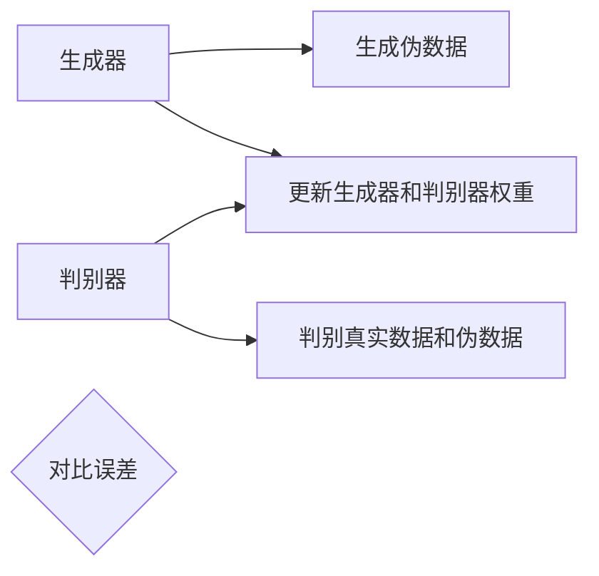

**2. 变分自编码器（VAE）**

VAE是一种基于概率模型的编码器-解码器结构。编码器将输入数据编码为一个潜在变量，解码器则将潜在变量解码为输出数据。VAE通过最大化数据分布的对数似然来训练模型，以下是一个简化的VAE的mermaid流程图：

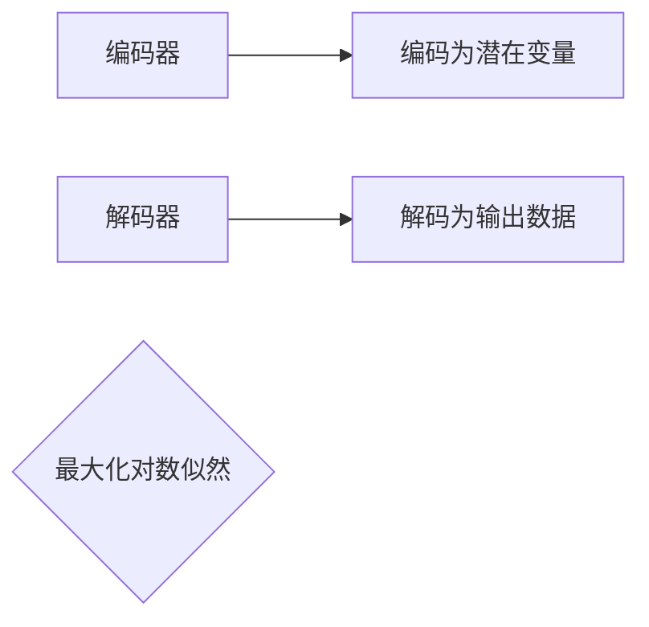

#### 算法原理讲解

**1. 循环神经网络（RNN）**

RNN是一种处理序列数据的神经网络，其通过递归结构来捕捉序列中的长期依赖关系。以下是一个简化的RNN的mermaid流程图：

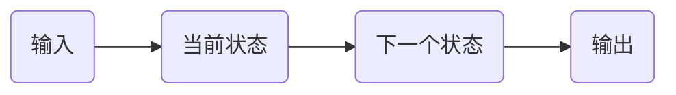

以下是一个简单的Python代码示例，展示如何使用RNN生成文本：

```python
import numpy as np
import tensorflow as tf

# 假设我们有一个简单的RNN模型
model = tf.keras.Sequential([
    tf.keras.layers.Dense(units=128, activation='relu', input_shape=(timesteps, features)),
    tf.keras.layers.Dense(units=timesteps, activation='softmax')
])

model.compile(optimizer='adam', loss='categorical_crossentropy')

# 假设我们有一个输入序列
input_sequence = np.random.random((timesteps, features))

# 使用RNN生成输出
predicted_sequence = model.predict(input_sequence)

# 将输出转换为文本
text = ''.join([char for _, char in predicted_sequence.argmax(axis=-1)])
```

**2. 变换器（Transformer）**

变换器是一种基于自注意力机制的神经网络模型，能够在处理长序列数据时保持全局依赖关系。以下是一个简化的变换器的mermaid流程图：

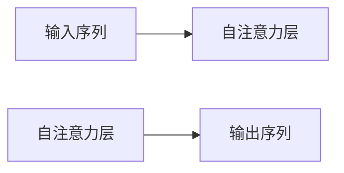

以下是一个简单的Python代码示例，展示如何使用变换器生成文本：

```python
from transformers import Transformer

# 假设我们有一个预训练的变换器模型
model = Transformer()

# 假设我们有一个输入序列
input_sequence = "Hello, how are you?"

# 使用变换器生成输出
predicted_sequence = model.predict(input_sequence)

# 将输出转换为文本
text = ''.join([char for _, char in predicted_sequence.argmax(axis=-1)])
```

通过上述数学模型和算法的讲解，我们可以看到提示词编程在创意产业中具有广泛的应用前景。这些技术不仅能够实现自动化和智能化的内容生成，还能够为创意产业带来新的创作灵感和体验。

### 提示词编程工具与平台

提示词编程的广泛应用离不开相应的工具与平台支持。这些工具和平台为开发者提供了丰富的功能和便捷的操作环境，使得提示词编程能够高效地应用于各种创意产业领域。以下将介绍几种常用的提示词编程工具与平台，并分析其优缺点。

#### 1. TensorFlow

TensorFlow是一个开源的机器学习框架，由Google开发。它支持多种编程语言，包括Python、C++和Java。TensorFlow提供了一个丰富的库，用于构建和训练深度学习模型，包括提示词编程所需的RNN、LSTM和变换器等模型。TensorFlow的优点在于其高度可扩展性和灵活性，能够满足复杂模型的需求。然而，TensorFlow的学习曲线较为陡峭，对于初学者来说可能较为困难。

#### 2. PyTorch

PyTorch是另一个流行的开源机器学习库，由Facebook开发。PyTorch以Python为主编程语言，提供了一个直观且易于理解的接口。PyTorch的动态计算图和自动微分系统使得模型构建和调试变得更加简单。PyTorch的优点是其简洁的API和高效的计算性能，非常适合研究和开发。然而，与TensorFlow相比，PyTorch的可扩展性可能稍逊一筹。

#### 3. Hugging Face

Hugging Face是一个专注于自然语言处理的开源社区和平台，提供了大量的预训练模型和工具库。其中包括用于提示词编程的模型，如GPT、BERT和Transformer等。Hugging Face的优点在于其丰富的模型资源和便捷的API，使得开发者能够轻松地使用和定制这些模型。此外，Hugging Face还提供了丰富的文档和社区支持，有助于解决开发过程中的问题。

#### 4. FastText

FastText是由Facebook开发的一个快速文本处理库，它基于词嵌入和多层神经网络，支持多种语言和文本数据。FastText的优点在于其高效的处理速度和良好的性能，适用于快速生成文本内容。然而，与更复杂的模型相比，FastText的灵活性和扩展性可能有限。

#### 5. JAX

JAX是由Google开发的一个用于数值计算和机器学习的开源库。JAX具有自动微分和并行计算的功能，非常适合大规模的机器学习应用。JAX的优点在于其高效的计算性能和强大的扩展能力。然而，JAX的学习曲线较为陡峭，对于初学者来说可能较为困难。

#### 总结

在选择提示词编程工具与平台时，需要根据项目的需求、开发者的技能水平以及具体应用场景来做出决策。以下是几种工具和平台的主要优缺点对比：

| 工具/平台 | 优点 | 缺点 |
| :--- | :--- | :--- |
| TensorFlow | 高度可扩展、灵活性高 | 学习曲线陡峭 |
| PyTorch | 简洁的API、高效计算 | 可扩展性稍逊 |
| Hugging Face | 丰富的模型资源、便捷API | 侧重自然语言处理 |
| FastText | 高效处理速度、良好性能 | 灵活性和扩展性有限 |
| JAX | 高效计算、自动微分 | 学习曲线陡峭 |

综上所述，提示词编程工具与平台的选择需要综合考虑多种因素，以实现最佳的开发效果和应用价值。

### 提示词编程在数字艺术中的应用

在数字艺术领域，提示词编程展示了其独特的魅力和广泛的应用潜力。通过提示词，艺术家和创作者能够实现自动化和智能化的内容生成，不仅提高了创作效率，还丰富了创作的多样性和个性化。

#### 1. 艺术画作的生成

提示词编程在艺术画作生成中的应用非常显著。例如，艺术家可以使用一个简单的提示词，如“春天的景色”或“抽象艺术”，来指导程序生成相应的画作。通过深度学习模型如生成对抗网络（GAN）和变换器（Transformer），程序能够理解提示词的语义，并生成与之相符的视觉作品。这些生成的画作不仅具有独特的美感，还能够满足个性化需求，为艺术家提供更多的创作灵感。

**示例：** 假设一个艺术家想要生成一幅以“梦幻森林”为主题的画作。通过输入提示词“梦幻森林”，模型可以生成不同风格、颜色和构图的作品，如图1所示：

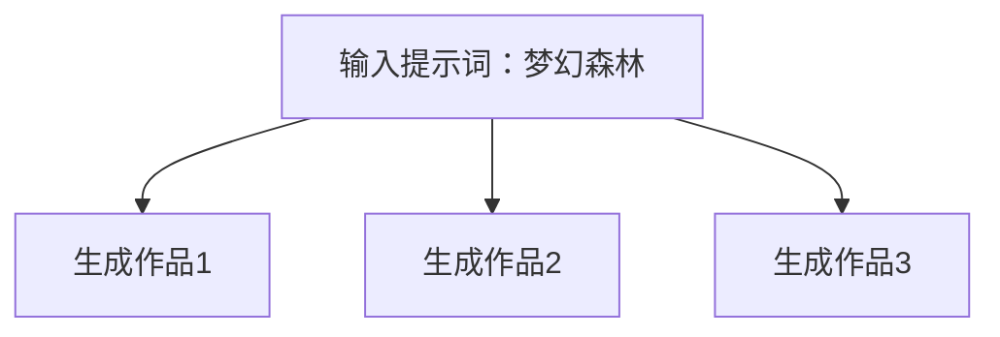


#### 2. 动画与视频的自动生成

除了静态的画作，提示词编程还能够用于动画和视频的自动生成。例如，在动画制作中，艺术家可以使用提示词生成角色动作、场景变化和背景音乐。通过结合深度学习和图像处理技术，程序可以自动生成连续的动画帧，实现动态内容生成。这种技术不仅节省了人力和时间成本，还能够创造独特的动画效果。

**示例：** 假设一个动画制作团队想要创建一个以“太空探险”为主题的动画短片。通过输入提示词“太空探险”，模型可以生成太空场景、飞船飞行和角色互动的动画片段，如图2所示：

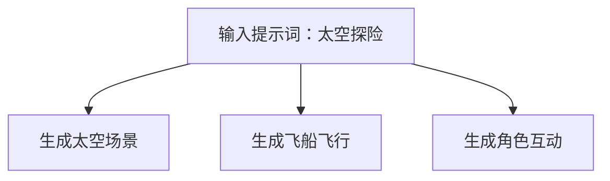


#### 3. 个性化艺术作品的生成

提示词编程在个性化艺术作品生成中的应用也非常广泛。艺术家可以通过用户提供的个人信息、喜好或情绪状态，生成定制化的艺术作品。这种技术不仅能够满足用户个性化的需求，还能够提升用户的参与感和满意度。

**示例：** 假设一个用户想要生成一幅以自己名字为主题的画作。艺术家可以使用用户提供的名字和相关信息作为提示词，通过模型生成独特的画作，如图3所示：

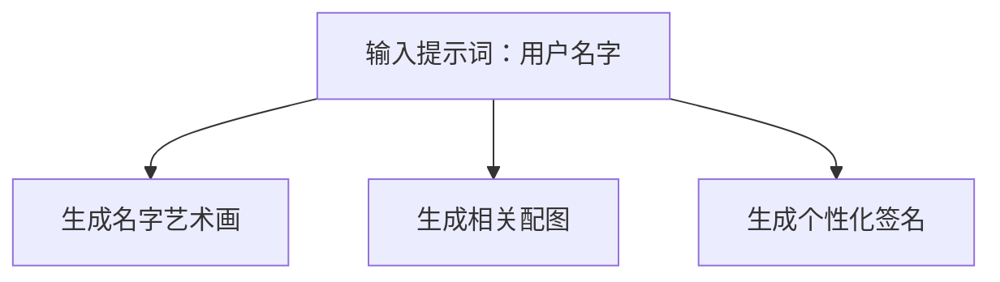


#### 应用总结

通过上述示例，我们可以看到提示词编程在数字艺术领域中的应用不仅多样且富有创意。通过提示词，艺术家能够实现自动化和个性化的内容生成，提高创作效率，拓展艺术创作的边界。随着技术的不断进步，提示词编程将在数字艺术中发挥越来越重要的作用，为艺术创作带来更多可能性。

### 提示词编程在游戏开发中的应用

在游戏开发中，提示词编程展现出独特的优势，尤其是在游戏剧情、角色对话和关卡设计等方面。通过提示词，开发者能够实现自动化和智能化的内容生成，从而提高开发效率，创造更加丰富和多样化的游戏体验。

#### 1. 游戏剧情的自动生成

游戏剧情是游戏的核心元素之一，直接影响玩家的游戏体验。传统的游戏剧情编写往往需要耗费大量的人力和时间。而提示词编程技术可以大幅提升游戏剧情的生成效率。例如，开发者可以使用一个简单的提示词，如“冒险故事”或“科幻情节”，来指导程序生成相应的剧情内容。

**示例：** 假设一个游戏开发者想要创建一个以“远古遗迹探险”为主题的游戏剧情。通过输入提示词“远古遗迹探险”，模型可以生成包括主要角色、探险任务、神秘线索和结局等在内的剧情内容。以下是一个简化的mermaid流程图：

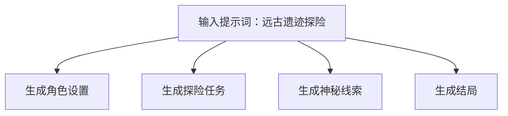


通过这种方式，开发者能够在短时间内生成丰富的剧情内容，为游戏增添更多的故事性和可玩性。

#### 2. 角色对话的自动化生成

角色对话是游戏的重要组成部分，直接影响玩家的沉浸感和互动体验。提示词编程技术可以用于自动化生成角色对话，从而提高对话的多样性和真实性。

**示例：** 假设一个游戏开发者想要创建一个包含多个角色的游戏，每个角色都有独特的个性和对话风格。通过输入提示词，如“友好对话”或“敌对对话”，模型可以生成符合角色特点和情境的对话内容。以下是一个简化的mermaid流程图：

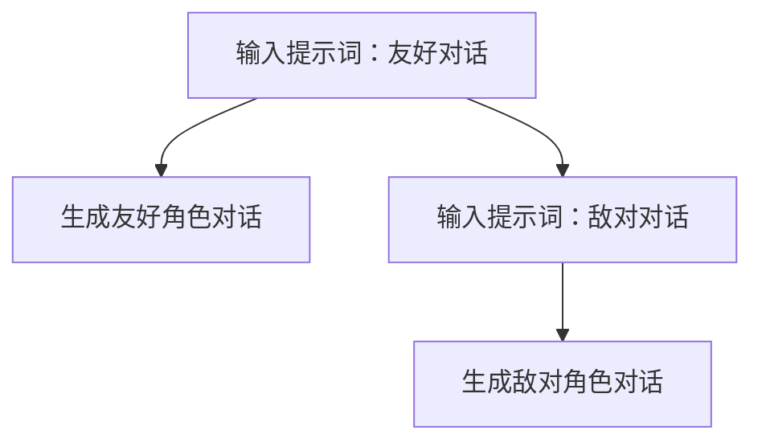


通过这种方式，游戏开发者可以确保每个角色都有丰富且个性化的对话内容，提升游戏的整体品质。

#### 3. 关卡设计的自动生成

关卡设计是游戏开发中的重要环节，直接影响玩家的游戏体验和挑战难度。提示词编程技术可以用于自动化生成关卡设计，从而提高设计效率。

**示例：** 假设一个游戏开发者想要创建一个包含多种障碍和奖励的关卡。通过输入提示词，如“迷宫关卡”或“平台跳跃关卡”，模型可以生成相应的关卡设计。以下是一个简化的mermaid流程图：

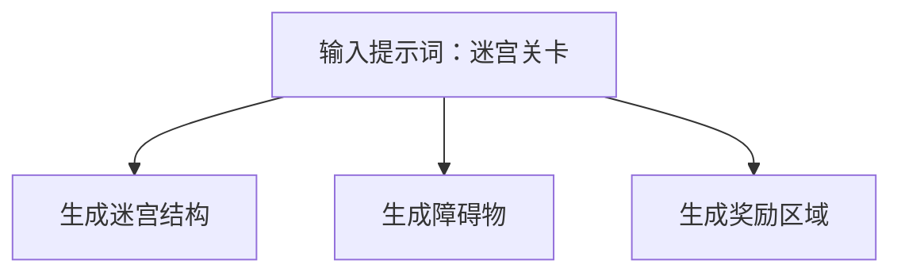


通过这种方式，开发者能够在短时间内生成多样化的关卡设计，为玩家提供丰富的游戏体验。

#### 应用总结

通过上述示例，我们可以看到提示词编程在游戏开发中的应用不仅多样化，还能够大幅提高开发效率。通过提示词，开发者能够实现自动化和智能化的内容生成，为游戏创作带来更多可能性。随着技术的不断进步，提示词编程将在游戏开发中发挥越来越重要的作用，为玩家带来更加丰富和多样化的游戏体验。

### 提示词编程在虚拟现实（VR）和增强现实（AR）中的应用

虚拟现实（VR）和增强现实（AR）技术在近年来取得了显著的进展，为用户提供了沉浸式和增强式的体验。提示词编程作为一种新兴技术，在VR和AR领域中展现出了巨大的应用潜力。通过提示词，开发者可以自动化和智能化地生成虚拟场景、交互提示和内容描述，从而提升用户体验和互动性。

#### 1. 虚拟场景的生成

在虚拟现实（VR）中，生成逼真的虚拟场景是关键。提示词编程技术可以通过预定义的提示词生成各种虚拟场景，如自然风光、城市景观、历史遗址等。以下是一个简化的mermaid流程图，展示了如何通过提示词生成虚拟场景：

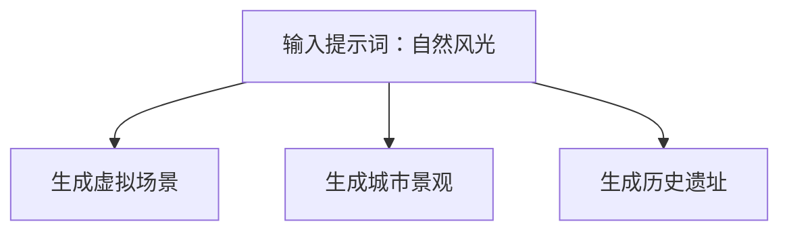


通过这种方式，开发者能够快速生成多样化的虚拟场景，为用户提供丰富的沉浸体验。

#### 2. 交互提示的自动生成

在VR和AR应用中，交互提示对于用户来说至关重要。提示词编程可以自动化生成交互提示，如导航指示、操作指南和任务说明等。通过输入简单的提示词，程序可以生成符合用户需求和场景的交互提示。

**示例：** 假设一个用户在VR游戏中需要导航到一个特定的地点。开发者可以使用提示词“前往宝箱”来生成相应的导航提示，如图8所示：

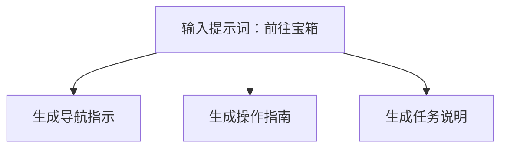


这种自动生成的交互提示不仅提高了用户的操作便利性，还能够根据用户的行为和需求动态调整，提升互动体验。

#### 3. 内容描述的自动化生成

在VR和AR应用中，内容描述对于用户理解和互动也非常重要。提示词编程可以自动化生成场景描述、物品说明和故事背景等内容，从而帮助用户更好地理解和沉浸于虚拟环境。

**示例：** 假设一个用户在VR博物馆中浏览展品，开发者可以使用提示词“古埃及文物”来生成相应的展品描述，如图9所示：

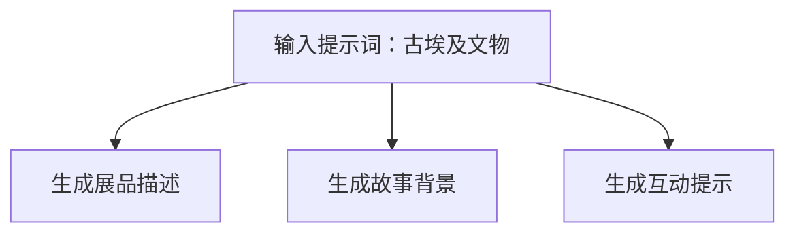


通过这种方式，开发者能够为用户提供丰富且详细的内容描述，增强用户的沉浸体验。

#### 应用总结

通过上述示例，我们可以看到提示词编程在虚拟现实（VR）和增强现实（AR）中的应用不仅多样化，还能够大幅提升用户体验和互动性。通过提示词，开发者能够实现自动化和智能化的内容生成，为用户提供更加丰富和多样化的虚拟体验。随着技术的不断进步，提示词编程将在VR和AR领域中发挥越来越重要的作用，为用户带来更加真实和沉浸的体验。

### 提示词编程在内容创作与人工智能协同中的应用

在内容创作领域，提示词编程与人工智能（AI）的协同作用正在成为推动创意产业变革的重要力量。通过结合提示词编程和AI技术，创作者能够实现自动化和智能化的内容生成，提高创作效率和内容质量，同时满足用户日益多样化的需求。

#### 1. 自动化内容生成

提示词编程能够通过预定义的提示词快速生成各种类型的内容，如文章、视频脚本、广告文案等。AI技术则进一步增强了这一过程，通过深度学习和自然语言处理技术，使生成的文本内容更加自然和连贯。例如，在新闻写作中，AI可以分析大量数据，并根据提示词生成新闻稿；在视频制作中，AI可以自动生成脚本和旁白。

**示例：** 假设一个新闻平台需要每天发布大量新闻稿。通过使用提示词“国际新闻”，AI模型可以自动生成相关的新闻内容。以下是一个简化的mermaid流程图：

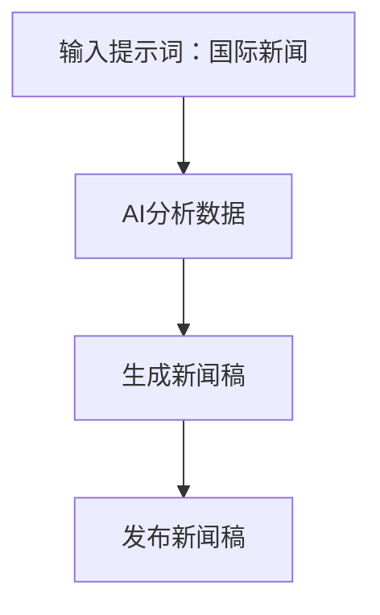


#### 2. 内容个性化定制

用户对个性化内容的需求日益增长，提示词编程与AI的协同可以帮助创作者实现高度个性化的内容生成。通过分析用户的偏好、行为和互动数据，AI可以生成符合用户兴趣和需求的内容。例如，一个电商网站可以根据用户的浏览记录和购买历史，使用提示词“推荐商品”，自动生成个性化的商品推荐文案。

**示例：** 假设一个电商网站的用户偏好购买电子产品。通过输入提示词“推荐商品”，AI模型可以生成个性化的电子产品推荐文案，如图11所示：

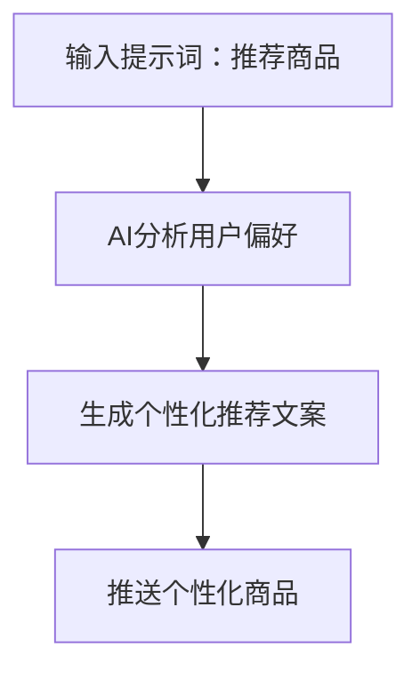


#### 3. 智能辅助创作

在内容创作过程中，AI可以通过提示词为创作者提供实时反馈和智能建议，从而提高创作效率和质量。例如，在小说创作中，AI可以根据提示词生成故事情节和角色发展，帮助创作者构建更加丰富和连贯的故事线。

**示例：** 假设一个小说作家在创作过程中遇到情节瓶颈，可以使用提示词“新情节”来获取AI的建议。以下是一个简化的mermaid流程图：

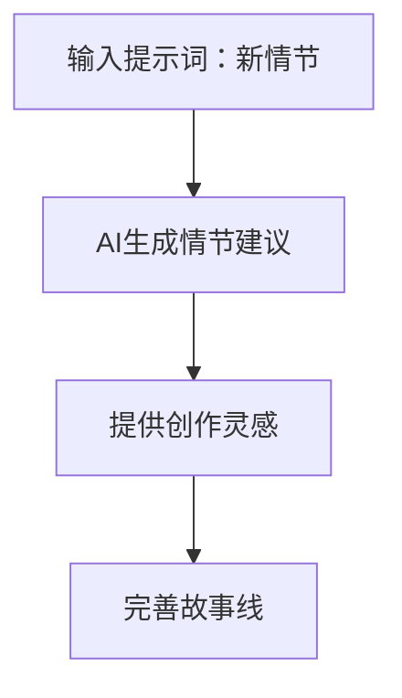


#### 应用总结

通过提示词编程与人工智能的协同应用，内容创作不仅变得更加高效和智能，还能够满足用户个性化的需求。随着技术的不断进步，这种协同作用将在内容创作领域发挥越来越重要的作用，为创作者和用户提供更加丰富和多样化的体验。未来，随着更多创新技术的加入，内容创作与人工智能的协同将推动创意产业的持续发展。

### 提示词编程在创意产业中的最佳实践

在提示词编程在创意产业中的应用中，一些成功的案例和最佳实践为我们提供了宝贵的经验和启示。以下将介绍几个具有代表性的案例，并总结出一些实用的技巧和注意事项。

#### 1. 案例一：个性化广告文案生成

某广告公司使用提示词编程技术为客户自动生成个性化广告文案。通过分析客户的用户数据和行为模式，广告公司使用提示词“年轻人群”和“户外活动”，自动生成了针对年轻户外爱好者的广告文案。这些文案不仅具有个性化特征，还显著提高了广告的转化率。

**最佳实践：** 
- 结合用户数据进行个性化生成，确保文案贴近用户需求。
- 使用多样化的提示词，提升文案的多样性和针对性。

**注意事项：**
- 保护用户隐私，避免泄露敏感信息。
- 确保文案的合规性，避免违反广告法规。

#### 2. 案例二：虚拟现实（VR）场景生成

某VR游戏开发商使用提示词编程技术快速生成多样化的VR场景。通过提示词“幻想世界”和“未来都市”，开发商能够快速生成丰富的VR场景，为玩家提供沉浸式体验。

**最佳实践：**
- 利用提示词实现场景的自动化生成，提高开发效率。
- 结合用户反馈动态调整场景内容，提升用户体验。

**注意事项：**
- 确保生成的VR场景在视觉上的一致性和连贯性。
- 优化场景的加载速度，减少用户等待时间。

#### 3. 案例三：音乐创作自动化

某音乐制作公司利用提示词编程技术实现自动化音乐创作。通过提示词“古典风格”和“浪漫旋律”，公司能够自动生成符合用户需求的音乐作品，大大缩短了创作周期。

**最佳实践：**
- 使用多样化的提示词，拓展音乐创作的风格和类型。
- 结合用户喜好和反馈，优化音乐生成的效果。

**注意事项：**
- 确保生成的音乐作品具有艺术性和创意性，避免机械重复。
- 注重版权保护，避免侵犯原创音乐版权。

#### 总结

通过上述案例，我们可以看到提示词编程在创意产业中的应用不仅能够提高效率和创意，还能够满足个性化需求。最佳实践包括结合用户数据、使用多样化的提示词、动态调整内容和优化用户体验。同时，注意事项强调了数据保护、合规性和版权保护的重要性。这些经验和技巧为创意产业中的提示词编程应用提供了有益的指导。

### 小结

本文深入探讨了提示词编程在创意产业中的巨大潜力。从创意产业的现状与挑战，到提示词编程的基本原理、核心技术，再到其在数字艺术、游戏开发、虚拟现实（VR）和增强现实（AR）等领域的具体应用，我们详细分析了提示词编程如何通过自动化和智能化的内容生成，为创意产业带来创新和变革。

首先，创意产业作为现代经济的增长引擎，面临着个性化定制、用户体验提升和技术瓶颈等挑战。提示词编程作为一种新兴的技术手段，通过预定义的提示词引导程序生成相关内容，能够有效解决这些问题。其次，本文介绍了提示词编程的核心技术，包括自然语言处理（NLP）、深度学习和生成对抗网络（GAN）等，展示了这些技术在提示词编程中的应用原理和优势。

具体应用场景方面，提示词编程在数字艺术、游戏开发、VR和AR等领域展示了其独特的优势。例如，在数字艺术中，通过提示词可以快速生成个性化、多样化的艺术作品；在游戏开发中，提示词编程能够自动化生成游戏剧情、角色对话和关卡设计；在VR和AR中，提示词编程则用于生成虚拟场景、交互提示和内容描述，提升用户体验。此外，在内容创作与人工智能协同中，提示词编程与AI的结合，进一步推动了创意产业的智能化和个性化发展。

总结最佳实践，我们强调了结合用户数据、使用多样化的提示词、动态调整内容和优化用户体验的重要性。同时，注意事项提醒我们在应用提示词编程时要注意数据保护、合规性和版权保护等问题。

未来，随着技术的不断进步，提示词编程在创意产业中的应用前景将更加广阔。我们可以预见，通过不断创新和优化，提示词编程将带来更多创新和变革，为创意产业带来新的发展机遇。让我们拭目以待，共同见证这一技术为创意产业带来的辉煌未来。

### 注意事项

在应用提示词编程技术时，有几点注意事项需要特别注意：

1. **数据隐私保护**：提示词编程通常涉及大量用户数据的处理。因此，确保用户数据的隐私和安全是至关重要的。开发者应遵循相关数据保护法规，如GDPR，并采取加密、匿名化等技术手段来保护用户数据。

2. **内容合规性**：在生成内容时，要确保符合法律法规和行业规范。特别是在广告、媒体和娱乐等领域，生成的文本和图像必须遵守相关法律法规，避免不当内容的出现。

3. **算法偏见**：提示词编程中的算法可能存在偏见，尤其是在处理具有文化、性别、种族等敏感内容时。开发者需要定期评估和调整算法，以减少偏见，确保内容生成过程的公正性和包容性。

4. **性能优化**：提示词编程的应用往往需要处理大量的计算任务。因此，优化算法性能和资源利用率是关键。开发者可以通过并行计算、分布式处理等技术手段来提升系统的性能。

5. **用户体验**：在应用提示词编程生成内容时，需要充分考虑用户体验。生成的文本和图像应具备较高的可读性和吸引力，同时应确保内容与用户需求和情境相符。

### 拓展阅读

为了深入理解提示词编程及其在创意产业中的应用，以下推荐一些相关的书籍、论文和在线资源：

- **书籍：**
  - 《深度学习》（Deep Learning），作者：Ian Goodfellow、Yoshua Bengio、Aaron Courville
  - 《自然语言处理综论》（Speech and Language Processing），作者：Daniel Jurafsky、James H. Martin
  - 《生成式对抗网络：理论与实践》（Generative Adversarial Networks: Theory and Practice），作者：Li Zhang、Yihui He

- **论文：**
  - “Generative Adversarial Nets”，作者：Ian Goodfellow et al.
  - “Attention Is All You Need”，作者：Vaswani et al.

- **在线资源：**
  - TensorFlow官方网站：[https://www.tensorflow.org/](https://www.tensorflow.org/)
  - PyTorch官方网站：[https://pytorch.org/](https://pytorch.org/)
  - Hugging Face官方网站：[https://huggingface.co/](https://huggingface.co/)

通过这些资源，您可以进一步学习和了解提示词编程的相关技术及其在创意产业中的应用。希望这些拓展阅读能够为您的探索提供有价值的参考。

