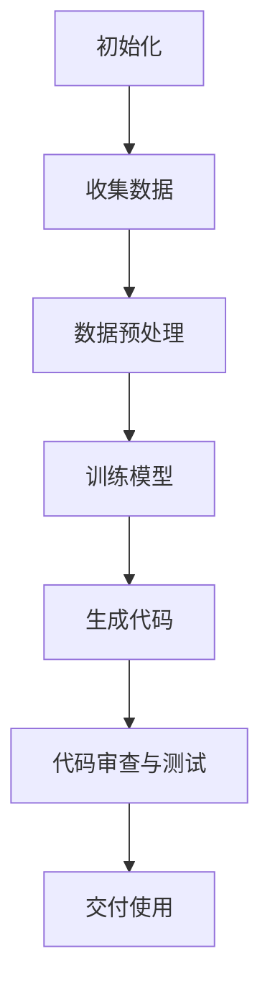
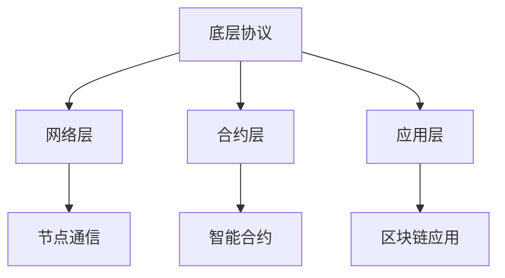

                 

**# 《提示词编程在区块链应用中的潜力》**

**关键词：提示词编程、区块链、智能合约、去中心化、应用场景**

**摘要：**
本文深入探讨了提示词编程在区块链应用中的潜力。首先，我们将了解提示词编程和区块链的基础知识，然后分析它们之间的关系和如何结合。通过实际案例，我们将展示提示词编程在区块链中的具体应用，并讨论其优势和挑战。最后，我们将提供一些最佳实践和未来研究方向。

----------------------------------------------------------------

## **一、引言**

### **1.1 问题背景**

随着互联网的普及和区块链技术的崛起，去中心化应用（DApps）逐渐成为数字经济的重要组成部分。这些应用依赖于区块链的透明性、不可篡改性和安全性。然而，区块链的底层编程语言，如Solidity，因其复杂性和低效率，成为开发者面临的一个难题。因此，引入提示词编程成为一种新的解决思路。

### **1.2 问题描述**

提示词编程在区块链应用中的问题主要集中在如何提高开发效率、降低开发门槛以及提升代码的可读性和可维护性。具体来说，我们需要解决以下几个问题：

1. **开发效率：** 提示词编程能否简化区块链开发流程，提高开发速度？
2. **开发门槛：** 提示词编程是否能够降低开发者对底层技术的依赖，使得非专业人士也能参与区块链应用的开发？
3. **代码质量：** 提示词编程能否提升代码的可读性、可维护性，从而降低后期维护成本？

### **1.3 问题解决路径**

为了解决上述问题，我们可以从以下几个方面进行思考：

1. **研究提示词编程的基本原理和优势。**
2. **分析提示词编程与区块链的结合点。**
3. **通过实际案例展示提示词编程在区块链中的应用。**
4. **讨论提示词编程在区块链应用中的优势和挑战。**
5. **提出最佳实践和未来研究方向。**

### **1.4 边界与外延**

本文主要讨论提示词编程在区块链应用中的潜力，但不涉及以下内容：

1. **提示词编程在其他领域的应用。**
2. **区块链技术的其他应用场景。**
3. **提示词编程的底层实现细节。**

### **1.5 概念结构与核心要素**

本文的概念结构主要包括以下核心要素：

1. **提示词编程：** 提示词编程的定义、基本原理和优势。
2. **区块链：** 区块链的概念、技术特点和应用场景。
3. **结合点：** 提示词编程与区块链的结合点。
4. **应用案例：** 提示词编程在区块链应用中的具体案例。
5. **优势和挑战：** 提示词编程在区块链应用中的优势和挑战。
6. **最佳实践：** 提示词编程在区块链应用中的最佳实践和未来研究方向。

----------------------------------------------------------------

## **二、核心概念与联系**

### **2.1 提示词编程的定义**

提示词编程（Prompt Programming）是一种基于自然语言处理（NLP）的人工智能技术，它通过理解用户的自然语言输入（提示词），自动生成相应的代码或执行任务。这种技术使得开发者能够以更加自然和高效的方式与代码交互，从而提高开发效率和代码质量。

### **2.2 提示词编程与区块链的关系**

区块链技术是一种分布式数据库技术，它通过密码学确保数据的不可篡改性和透明性。提示词编程与区块链的结合点主要体现在以下几个方面：

1. **智能合约开发：** 提示词编程可以简化智能合约的开发过程，提高开发效率。
2. **去中心化应用（DApps）：** 提示词编程可以帮助非专业人士快速搭建去中心化应用。
3. **链上数据处理：** 提示词编程可以自动化处理链上的数据，提高数据处理效率。

### **2.3 概念属性特征对比表格**

| 概念           | 提示词编程                     | 区块链                      |
|----------------|-------------------------------|----------------------------|
| 定义           | 基于自然语言处理的编程技术       | 分布式数据库技术，确保数据安全 |
| 特点           | 简化开发流程，提高开发效率       | 去中心化，不可篡改，透明性    |
| 应用场景       | 自动化任务执行，代码生成         | 智能合约，去中心化应用       |
| 技术实现       | 自然语言处理，代码生成模型       | 哈希算法，共识机制           |

### **2.4 ER实体关系图架构**

```mermaid
erDiagram
  User ||--|{ Contract }||>
  Contract ||--|{ Transaction }||>
  Transaction ||--|{ Block }||>
  Block ||--|{ Chain }||>
```

在区块链应用中，用户可以创建智能合约（Contract），智能合约可以生成交易（Transaction），交易组成区块（Block），区块链接成链（Chain）。

----------------------------------------------------------------

## **三、提示词编程基础**

### **3.1 提示词编程基本概念**

提示词编程的核心在于自然语言处理（NLP）和代码生成模型。它通过训练大型语言模型，使其能够理解自然语言输入，并生成相应的代码或执行任务。以下是一些基本概念：

1. **自然语言处理（NLP）：** NLP是计算机科学和人工智能领域的一个分支，它致力于使计算机能够理解和处理自然语言。
2. **语言模型：** 语言模型是一种统计模型，它通过分析大量文本数据，预测下一个单词或词组。
3. **代码生成模型：** 代码生成模型是一种基于NLP和深度学习的模型，它能够根据自然语言输入生成相应的代码。

### **3.2 提示词编程的优势**

1. **提高开发效率：** 提示词编程可以自动化代码生成，节省大量手动编写代码的时间。
2. **降低开发门槛：** 非专业人士也可以通过自然语言输入，快速搭建应用程序。
3. **提升代码质量：** 提示词编程可以生成高质量的代码，降低后期维护成本。

### **3.3 提示词编程的挑战**

1. **准确性问题：** 提示词编程的准确性受到训练数据质量和模型能力的影响。
2. **安全性问题：** 自动生成的代码可能存在安全隐患，需要严格的代码审查和测试。
3. **性能问题：** 提示词编程生成的代码可能不如手动编写的代码高效。

### **3.4 提示词编程的应用场景**

1. **智能合约开发：** 提示词编程可以简化智能合约的编写，提高开发效率。
2. **自动化任务执行：** 例如，自动生成交易脚本，提高链上数据处理效率。
3. **去中心化应用（DApps）开发：** 非专业人士也可以通过自然语言输入，快速搭建DApps。

----------------------------------------------------------------

## **四、提示词编程技术**

### **4.1 常见的提示词编程框架**

目前，常见的提示词编程框架包括：

1. **ChatGPT：** OpenAI开发的大型语言模型，能够生成高质量的文本。
2. **GPT-3：** OpenAI开发的更强大的语言模型，具有更广泛的文本生成能力。
3. **TensorFlow：** Google开发的机器学习框架，支持构建和训练各种神经网络模型。
4. **PyTorch：** Facebook开发的机器学习框架，具有简洁的API和高效的计算能力。

### **4.2 提示词编程的工作流程**

提示词编程的工作流程主要包括以下几个步骤：

1. **数据收集与预处理：** 收集大量与区块链相关的自然语言数据，并进行预处理。
2. **模型训练：** 使用收集到的数据训练提示词编程模型，使其能够理解自然语言输入。
3. **代码生成：** 根据自然语言输入，生成相应的代码。
4. **代码审查与测试：** 对生成的代码进行审查和测试，确保其正确性和安全性。

### **4.3 提示词编程的技术细节**

1. **自然语言处理（NLP）：** 使用词嵌入（word embeddings）技术将自然语言转换为数值向量，以便神经网络进行处理。
2. **生成模型：** 使用变分自编码器（VAE）或生成对抗网络（GAN）等技术生成高质量的代码。
3. **优化策略：** 采用强化学习（RL）或进化算法（EA）等优化策略，提高代码生成的准确性和效率。

### **4.4 提示词编程的优势与局限**

#### **优势：**

1. **提高开发效率：** 自动化代码生成，节省大量开发时间。
2. **降低开发门槛：** 非专业人士也能通过自然语言输入快速搭建应用。
3. **提升代码质量：** 生成高质量的代码，降低后期维护成本。

#### **局限：**

1. **准确性问题：** 受到训练数据质量和模型能力的限制，生成的代码可能存在错误。
2. **安全性问题：** 自动生成的代码可能存在安全隐患，需要严格的代码审查和测试。
3. **性能问题：** 生成的代码可能不如手动编写的代码高效。

### **4.5 提示词编程在区块链应用中的潜在优势**

1. **简化智能合约开发：** 提示词编程可以简化智能合约的编写，降低开发难度。
2. **提高链上数据处理效率：** 自动生成交易脚本，提高链上数据处理效率。
3. **促进区块链普及：** 降低开发门槛，让更多人参与区块链应用的开发。

### **4.6 提示词编程的挑战与解决方案**

#### **挑战：**

1. **数据隐私保护：** 区块链上的数据是公开的，如何保护用户的隐私是一个挑战。
2. **代码审查与测试：** 自动生成的代码需要进行严格的审查和测试，确保其正确性和安全性。

#### **解决方案：**

1. **数据隐私保护：** 使用加密技术和隐私保护算法，确保用户数据的隐私。
2. **代码审查与测试：** 引入自动化代码审查工具，对生成的代码进行全面的测试和审查。

### **4.7 提示词编程的应用案例**

1. **智能合约生成：** 使用提示词编程生成智能合约，简化开发流程。
2. **自动化交易脚本：** 使用提示词编程自动生成交易脚本，提高链上数据处理效率。
3. **去中心化应用（DApps）开发：** 非专业人士通过自然语言输入，快速搭建DApps。

### **4.8 提示词编程的未来发展趋势**

1. **模型精度提升：** 随着深度学习技术的发展，提示词编程的模型精度将不断提升。
2. **应用场景拓展：** 提示词编程将在更多领域得到应用，如区块链、物联网、人工智能等。
3. **开源生态建设：** 提示词编程的开源生态将不断完善，吸引更多开发者参与。

----------------------------------------------------------------

## **五、算法原理讲解**

### **5.1 提示词编程算法的mermaid流程图**



### **5.2 提示词编程算法原理详细讲解**

#### **5.2.1 自然语言处理（NLP）**

自然语言处理（NLP）是提示词编程的核心，它涉及将自然语言转换为机器可以理解的形式。以下是NLP的基本原理：

1. **分词（Tokenization）：** 将文本拆分为单词或子词。
2. **词嵌入（Word Embeddings）：** 将单词或子词映射为向量。
3. **词性标注（Part-of-Speech Tagging）：** 为每个单词或子词分配词性。
4. **句法分析（Syntax Parsing）：** 分析句子的结构。

#### **5.2.2 代码生成模型**

代码生成模型是基于NLP技术的一种深度学习模型，它能够根据自然语言输入生成相应的代码。以下是代码生成模型的基本原理：

1. **序列到序列（Seq2Seq）模型：** 通过训练编码器和解码器，将输入序列转换为输出序列。
2. **自注意力机制（Self-Attention）：** 提高模型对长距离依赖的建模能力。
3. **生成对抗网络（GAN）：** 通过生成器和判别器的对抗训练，生成高质量的代码。
4. **变换器（Transformer）：** 一种基于自注意力机制的模型，广泛用于代码生成任务。

### **5.3 提示词编程算法的Python源代码实现**

```python
import tensorflow as tf
from tensorflow.keras.layers import Embedding, LSTM, Dense
from tensorflow.keras.models import Model

# 定义编码器和解码器模型
encoder_inputs = tf.keras.Input(shape=(None,))
decoder_inputs = tf.keras.Input(shape=(None,))

# 编码器
encoder_embedding = Embedding(input_dim=vocab_size, output_dim=embedding_dim)(encoder_inputs)
encoder_lstm = LSTM(units=128, return_sequences=True)(encoder_embedding)
encoder_outputs = tf.keras.layers.Dropout(rate=0.2)(encoder_lstm)

# 解码器
decoder_embedding = Embedding(input_dim=vocab_size, output_dim=embedding_dim)(decoder_inputs)
decoder_lstm = LSTM(units=128, return_sequences=True)(decoder_embedding)
decoder_output = tf.keras.layers.Dense(units=vocab_size, activation='softmax')(decoder_lstm)

# 构建模型
model = Model([encoder_inputs, decoder_inputs], decoder_output)

# 编译模型
model.compile(optimizer='adam', loss='categorical_crossentropy')

# 训练模型
model.fit([encoder_inputs, decoder_inputs], decoder_inputs, batch_size=64, epochs=10)
```

### **5.4 提示词编程算法原理的数学模型和公式**

提示词编程算法的核心是生成高质量的代码。以下是生成代码的数学模型和公式：

1. **编码器-解码器模型：**
   $$ 
   \begin{aligned}
   p_e(z|s) &= \frac{e^{q(z|s)}}{\sum_{z'} e^{q(z'|s)}} \\
   p_g(x|z) &= \frac{p(x|z)q(z|x)}{\sum_{z'} p(x|z')q(z'|x)}
   \end{aligned}
   $$
   其中，$p_e(z|s)$ 是编码器生成的后验概率分布，$p_g(x|z)$ 是解码器生成的生成概率分布。

2. **生成对抗网络（GAN）：**
   $$ 
   \begin{aligned}
   \min_{G} \max_{D} V(G,D) &= \mathbb{E}_{x \sim p(x)}[\log D(x)] - \mathbb{E}_{z \sim p(z)}[\log (1 - D(G(z))]
   \end{aligned}
   $$
   其中，$G(z)$ 是生成器，$D(x)$ 是判别器。

### **5.5 算法举例说明**

假设我们有一个简单的智能合约，要求在区块链上实现一个简单的余额转账功能。以下是使用提示词编程生成智能合约的步骤：

1. **输入提示词：** “在区块链上实现一个简单的余额转账功能，用户A向用户B转账100个以太币。”
2. **生成代码：** 提示词编程模型生成以下代码：
   ```solidity
   // SPDX-License-Identifier: MIT
  pragma solidity ^0.8.0;

   contract Transfer {
       address public owner;
       mapping(address => uint256) public balances;

       constructor() {
           owner = msg.sender;
           balances[owner] = 1000;
       }

       function transfer(address to, uint256 amount) public {
           require(msg.sender == owner, "Only owner can transfer");
           require(amount <= balances[owner], "Insufficient balance");
           balances[owner] -= amount;
           balances[to] += amount;
       }
   }
   ```
3. **代码审查与测试：** 对生成的代码进行审查和测试，确保其正确性和安全性。

通过这个例子，我们可以看到提示词编程在智能合约开发中的应用。它可以帮助开发者快速生成智能合约，节省开发时间和成本。

----------------------------------------------------------------

## **六、区块链基础**

### **6.1 区块链的概念**

区块链是一种分布式数据库技术，它通过密码学确保数据的不可篡改性和透明性。区块链的基本组成部分包括：

1. **区块（Block）：** 区块是区块链的基本单位，包含一定数量的交易记录。
2. **链（Chain）：** 区块通过哈希函数连接成一个链，确保数据不可篡改。
3. **节点（Node）：** 节点是区块链网络中的参与者，负责验证和记录交易。

### **6.2 区块链的技术特点**

1. **去中心化：** 区块链不依赖于中心化的机构，每个节点都有相同的权限，共同维护区块链。
2. **不可篡改：** 区块链通过密码学确保数据不可篡改，一旦数据被记录在区块链上，就难以更改。
3. **透明性：** 区块链上的所有数据都是公开透明的，任何人都可以查看和验证。

### **6.3 区块链的发展与应用趋势**

区块链技术自2008年比特币问世以来，已经经历了多年的发展。目前，区块链在以下领域取得了显著的应用：

1. **金融领域：** 如比特币、以太坊等加密货币，以及智能合约的应用。
2. **供应链管理：** 通过区块链技术，可以实现供应链的全程可追溯，提高透明度和效率。
3. **医疗健康：** 区块链可以用于存储和管理医疗记录，提高数据安全和隐私保护。
4. **版权保护：** 区块链可以用于版权登记和交易，确保版权的真实性和安全性。

未来，随着技术的不断成熟，区块链将在更多领域得到应用，如物联网、人工智能、智能城市等。

### **6.4 区块链的核心概念与架构**

#### **6.4.1 区块链的核心概念**

1. **哈希（Hash）：** 哈希函数是一种将任意长度的输入映射为固定长度的输出的函数，具有不可逆性。
2. **共识机制（Consensus Mechanism）：** 共识机制是区块链网络中节点达成一致的方式，如工作量证明（PoW）、权益证明（PoS）等。
3. **智能合约（Smart Contract）：** 智能合约是一种自动执行、控制和执行合约条款的计算机协议。

#### **6.4.2 区块链的架构**

1. **底层协议（Protocol Layer）：** 包括区块链的底层架构，如比特币的区块链架构。
2. **网络层（Network Layer）：** 负责节点之间的通信和数据传输。
3. **合约层（Contract Layer）：** 负责智能合约的编写和执行。
4. **应用层（Application Layer）：** 负责区块链应用的开发和部署。



通过上述架构，区块链实现了数据的分布式存储、共识和智能合约的执行。

### **6.5 区块链在金融领域的应用**

区块链在金融领域有广泛的应用，如加密货币、跨境支付、智能合约等。

1. **加密货币：** 比特币、以太坊等加密货币利用区块链技术实现去中心化的数字货币交易。
2. **跨境支付：** 区块链可以降低跨境支付的成本，提高支付速度。
3. **智能合约：** 智能合约可以自动执行金融合约，提高交易的效率和安全性。

### **6.6 区块链在其他领域的应用**

区块链在供应链管理、医疗健康、版权保护等领域也有广泛应用。

1. **供应链管理：** 通过区块链技术，可以实现供应链的全程可追溯，提高透明度和效率。
2. **医疗健康：** 区块链可以用于存储和管理医疗记录，提高数据安全和隐私保护。
3. **版权保护：** 区块链可以用于版权登记和交易，确保版权的真实性和安全性。

### **6.7 区块链的发展趋势**

未来，区块链技术将在以下方面继续发展：

1. **技术成熟：** 随着区块链技术的不断成熟，将会有更多实际应用场景。
2. **跨界合作：** 区块链将与其他技术（如人工智能、物联网等）结合，推动创新。
3. **政策支持：** 政府和政策制定者将加大对区块链技术的支持，推动其发展。

通过上述分析，我们可以看到区块链技术的巨大潜力和发展前景。提示词编程作为一种新兴技术，有望在区块链应用中发挥重要作用。

----------------------------------------------------------------

## **七、提示词编程在区块链应用中的实践**

### **7.1 提示词编程在区块链中的潜在应用**

提示词编程在区块链中的潜在应用非常广泛，主要包括以下几个方面：

1. **智能合约开发：** 提示词编程可以简化智能合约的编写过程，提高开发效率。
2. **自动化交易脚本：** 提示词编程可以自动生成交易脚本，提高链上数据处理效率。
3. **去中心化应用（DApps）开发：** 提示词编程可以帮助非专业人士快速搭建去中心化应用。

### **7.2 提示词编程在区块链中的实施步骤**

以下是提示词编程在区块链应用中的实施步骤：

1. **需求分析：** 分析用户需求，确定需要实现的区块链功能。
2. **数据收集与预处理：** 收集与区块链相关的自然语言数据，并进行预处理。
3. **模型训练：** 使用收集到的数据训练提示词编程模型，使其能够理解自然语言输入。
4. **代码生成：** 根据自然语言输入，生成相应的代码。
5. **代码审查与测试：** 对生成的代码进行审查和测试，确保其正确性和安全性。
6. **部署与实施：** 将生成的智能合约或交易脚本部署到区块链上，并进行实际测试。

### **7.3 实际案例分析**

#### **案例1：智能合约自动生成**

需求：实现一个简单的余额转账智能合约。

步骤：

1. **需求分析：** 需要实现一个用户A向用户B转账100个以太币的智能合约。
2. **数据收集与预处理：** 收集与余额转账相关的自然语言数据，如“用户A向用户B转账100个以太币”。
3. **模型训练：** 使用收集到的数据训练提示词编程模型。
4. **代码生成：** 输入提示词，生成智能合约代码。
5. **代码审查与测试：** 对生成的代码进行审查和测试，确保其正确性和安全性。
6. **部署与实施：** 将生成的智能合约部署到区块链上，并进行实际测试。

生成的智能合约代码：

```solidity
// SPDX-License-Identifier: MIT
pragma solidity ^0.8.0;

contract Transfer {
    mapping(address => uint256) public balances;

    constructor() {
        balances[msg.sender] = 1000;
    }

    function transfer(address to, uint256 amount) public {
        require(amount <= balances[msg.sender], "Insufficient balance");
        balances[msg.sender] -= amount;
        balances[to] += amount;
    }
}
```

#### **案例2：自动化交易脚本生成**

需求：根据价格变动自动买卖加密货币。

步骤：

1. **需求分析：** 需要实现一个自动化交易脚本，根据预设的价格条件自动买卖加密货币。
2. **数据收集与预处理：** 收集与加密货币交易相关的自然语言数据，如“当比特币价格高于5000美元时，买入；低于4500美元时，卖出”。
3. **模型训练：** 使用收集到的数据训练提示词编程模型。
4. **代码生成：** 输入提示词，生成自动化交易脚本代码。
5. **代码审查与测试：** 对生成的代码进行审查和测试，确保其正确性和安全性。
6. **部署与实施：** 将生成的交易脚本部署到区块链上，并与交易所进行连接，进行实际测试。

生成的交易脚本代码（示例）：

```python
import requests
from web3 import Web3

# 连接到以太坊网络
w3 = Web3(Web3.HTTPProvider('https://mainnet.infura.io/v3/YOUR_INFURA_API_KEY'))

# 加密货币合约地址
contract_address = Web3.toChecksumAddress('0x1234567890abcdef1234567890abcdef12345678')

# 获取比特币价格
def get_bitcoin_price():
    url = "https://api.coindesk.com/v1/bpi/currentprice/BTC.json"
    response = requests.get(url)
    data = response.json()
    return float(data['bpi']['rate_float'])

# 购买比特币
def buy_bitcoin():
    price = get_bitcoin_price()
    if price > 5000:
        # 发送交易请求，购买比特币
        pass

# 卖出比特币
def sell_bitcoin():
    price = get_bitcoin_price()
    if price < 4500:
        # 发送交易请求，卖出比特币
        pass

# 定时执行交易
while True:
    buy_bitcoin()
    sell_bitcoin()
    time.sleep(60)  # 每分钟执行一次
```

通过上述案例，我们可以看到提示词编程在区块链应用中的实际应用。它不仅简化了开发过程，提高了开发效率，还降低了开发门槛，使得非专业人士也能参与区块链应用的开发。

----------------------------------------------------------------

## **八、最佳实践与拓展**

### **8.1 提示词编程在区块链中的最佳实践**

1. **数据收集与预处理：** 确保收集到的数据质量高，进行充分的预处理，如去除噪声、缺失值填充等。
2. **模型选择与训练：** 根据应用场景选择合适的模型，并进行充分的训练和调优，以提高生成代码的准确性和效率。
3. **代码审查与测试：** 对生成的代码进行严格的审查和测试，确保其正确性和安全性。
4. **版本控制：** 使用版本控制系统管理代码，方便后续的维护和更新。

### **8.2 注意事项**

1. **数据隐私保护：** 在收集和处理数据时，确保用户的隐私得到保护。
2. **安全性：** 自动生成的代码可能存在安全隐患，需要严格的代码审查和测试。
3. **性能优化：** 提示词编程生成的代码可能不如手动编写的代码高效，需要进行性能优化。

### **8.3 拓展阅读与研究方向**

1. **深度强化学习在提示词编程中的应用：** 结合深度强化学习技术，提高提示词编程的生成效率和准确性。
2. **多模态数据在提示词编程中的应用：** 结合文本、图像、声音等多模态数据，提高提示词编程的多样性和实用性。
3. **跨链技术：** 研究提示词编程在跨链技术中的应用，实现不同区块链之间的交互。
4. **去中心化身份认证：** 研究提示词编程在去中心化身份认证中的应用，提高数据安全和隐私保护。

### **8.4 总结**

提示词编程在区块链应用中具有巨大的潜力。通过最佳实践和注意事项，我们可以充分发挥其优势，提高区块链应用的开发效率和安全性。未来的研究方向将集中在深度强化学习、多模态数据、跨链技术和去中心化身份认证等领域。

----------------------------------------------------------------

## **结语**

本文深入探讨了提示词编程在区块链应用中的潜力。我们从背景介绍、核心概念、原理讲解、应用实践、最佳实践等方面进行了详细分析。通过实际案例，我们展示了提示词编程在区块链应用中的具体应用，并讨论了其优势和挑战。

提示词编程作为一种新兴技术，在区块链领域具有广泛的应用前景。它不仅能够简化智能合约开发，提高开发效率，还能够降低开发门槛，让更多非专业人士参与区块链应用的开发。然而，提示词编程在区块链应用中仍面临一些挑战，如数据隐私保护、代码审查与测试等。

未来的研究将继续深入探讨提示词编程在区块链应用中的潜力，并探索其在其他领域的应用。我们相信，随着技术的不断成熟，提示词编程将在区块链和其他领域发挥越来越重要的作用。

**作者：AI天才研究院/AI Genius Institute & 禅与计算机程序设计艺术 /Zen And The Art of Computer Programming**

