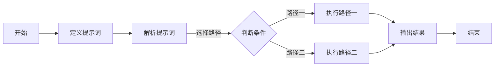
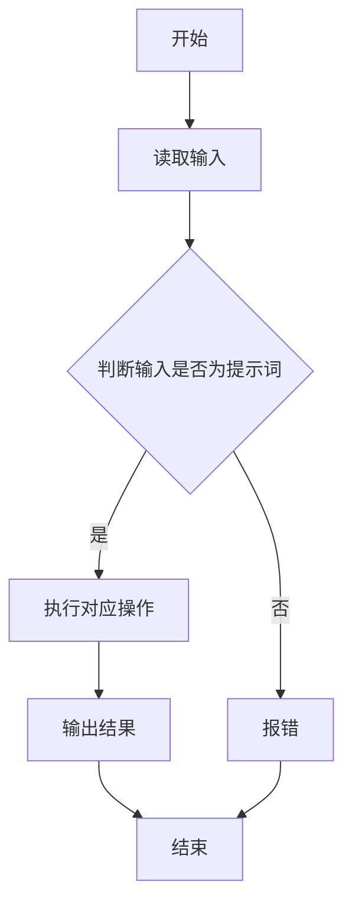
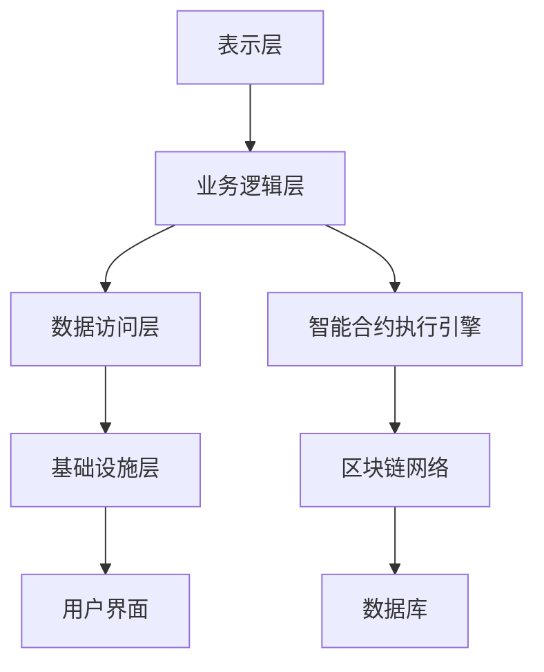
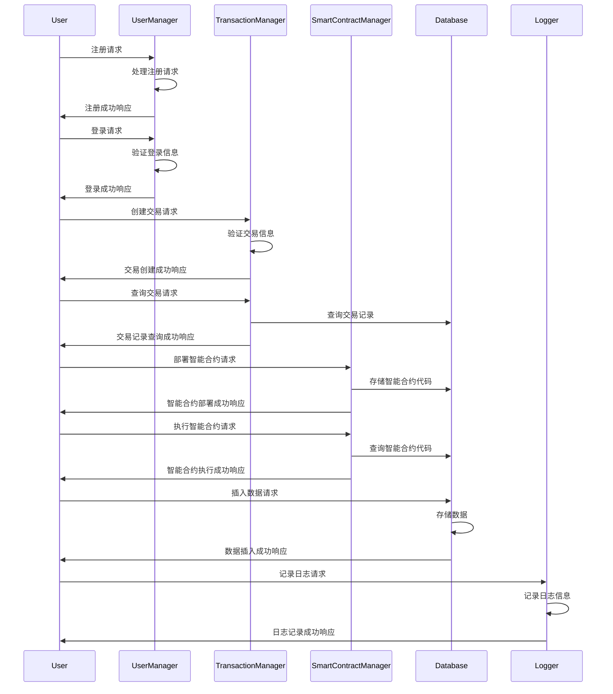
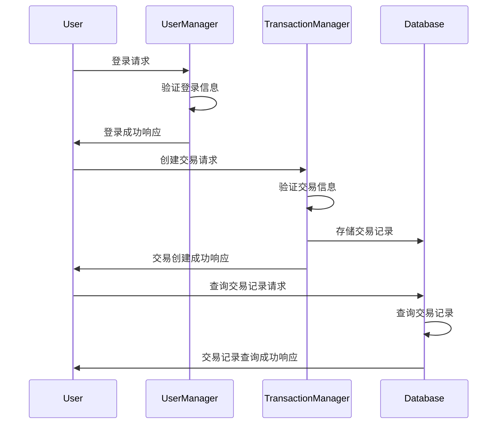

                 

# 提示词编程在区块链应用开发中的角色

## 关键词

- **提示词编程**
- **区块链应用开发**
- **智能合约**
- **去中心化应用（DApp）**
- **算法原理**
- **系统架构设计**
- **环境安装与核心实现**
- **实际案例分析**

## 摘要

本文将探讨提示词编程在区块链应用开发中的角色，旨在深入理解提示词编程的核心概念、原理及其在区块链技术中的应用。文章首先介绍了提示词编程和区块链的基本概念，随后逐步分析了提示词编程在区块链领域的应用前景。通过详细讲解算法原理、系统架构设计，以及实际案例的剖析，本文为读者提供了一个全面而深入的视角，以理解如何有效地将提示词编程技术应用于区块链开发中。

## 第一部分：问题背景与核心概念

### 1.1 问题背景

在当前技术迅速发展的时代，区块链技术已经成为众多行业领域的关键创新。区块链以其去中心化、安全可靠、不可篡改等特性，在金融、医疗、物流等多个领域展现出了巨大的应用潜力。然而，随着区块链技术的广泛应用，对于如何高效、安全地进行区块链应用开发的需求愈发迫切。

提示词编程，作为一种新兴的编程范式，其核心理念是通过提示词（hint）来引导程序的执行路径，从而实现高度灵活和可定制化的编程体验。这一编程范式在传统软件开发中已展示出其独特的优势，特别是在复杂系统的开发中，提示词编程能够帮助开发者更好地管理和优化代码。

随着区块链技术的不断发展，提示词编程在区块链应用开发中的重要性也逐渐凸显。它不仅能够提升开发效率，还能够增强区块链系统的灵活性和可扩展性。因此，研究提示词编程在区块链应用开发中的应用，具有重要的理论和实践意义。

### 1.2 提示词编程概述

提示词编程（Hint-Based Programming，HBP）是一种基于提示词（hint）的编程范式。提示词是程序员在代码中添加的特定标记或注释，用于指导程序执行过程中的某些行为。提示词编程的核心思想是通过在代码中嵌入提示词，使得程序在执行过程中能够根据提示词的指示，灵活调整执行路径，从而实现复杂逻辑的自动化处理。

提示词编程具有以下几个主要特点：

1. **高度可定制性**：提示词编程允许程序员根据具体需求，灵活地定义和调整程序的执行路径。这使得程序员能够针对特定场景进行优化，从而提升程序的效率。

2. **可读性和可维护性**：由于提示词通常以注释的形式嵌入代码中，使得代码更加清晰易懂。这对于代码的维护和后续的修改工作具有重要作用。

3. **模块化和可复用性**：提示词编程强调代码的模块化设计，通过将提示词与代码模块相结合，可以实现代码的复用，从而降低开发成本。

4. **适应性**：提示词编程能够适应不同场景和需求，使得程序具有更强的适应性和灵活性。

在传统软件开发中，提示词编程已展现出其独特优势。例如，在复杂的分布式系统中，提示词编程可以帮助开发者更好地管理系统的复杂度，提高系统的可维护性和可扩展性。此外，在开发高性能应用程序时，提示词编程能够通过优化执行路径，提高程序的运行效率。

### 1.3 区块链概述

区块链是一种分布式数据库技术，通过加密算法和数据结构（如链式区块链接）实现数据的存储和传输。区块链的核心特点包括去中心化、不可篡改、透明性等。这些特点使得区块链在金融、供应链管理、身份认证等多个领域得到了广泛应用。

区块链的基本原理包括：

1. **区块**：区块是区块链的基本单元，包含一定数量的交易记录。每个区块都有一个时间戳和一个唯一标识，用于链接前后区块。

2. **链式结构**：区块链采用链式结构，每个区块通过其哈希值与前一个区块链接，形成一个不可篡改的链式结构。

3. **共识算法**：共识算法用于确保区块链网络中的所有节点对于区块链状态的一致性。常见的共识算法包括工作量证明（PoW）、权益证明（PoS）等。

4. **智能合约**：智能合约是一种自动执行合约条款的计算机程序，能够根据预定的条件自动执行。智能合约在区块链应用开发中发挥着关键作用，使得区块链系统具有更强的灵活性和智能化。

区块链技术具有以下几个重要应用场景：

1. **金融领域**：区块链在金融领域的应用主要包括数字货币、跨境支付、金融审计等。通过区块链技术，可以降低交易成本、提高交易效率，并确保交易的安全性。

2. **供应链管理**：区块链技术能够提供透明、可追溯的供应链管理解决方案，帮助企业实时监控产品从生产到销售的全过程，提高供应链的透明度和效率。

3. **身份认证**：区块链技术在身份认证领域具有巨大潜力，通过分布式存储和加密算法，可以确保用户身份信息的隐私和安全。

4. **去中心化应用（DApp）**：DApp 是基于区块链技术的去中心化应用，具有去中心化、不可篡改等特点，适用于游戏、金融、社交等多个领域。

### 1.4 提示词编程在区块链应用开发中的应用前景

提示词编程在区块链应用开发中的应用前景十分广阔。以下是一些具体的应用场景：

1. **智能合约开发**：智能合约是区块链应用的核心组成部分，提示词编程能够帮助开发者更高效地设计和实现智能合约。通过提示词，开发者可以灵活地调整智能合约的逻辑，使其适应不同的业务需求。

2. **去中心化应用（DApp）开发**：DApp 开发通常涉及复杂的业务逻辑和交互，提示词编程能够帮助开发者更好地管理和优化 DApp 的代码，提高系统的可扩展性和性能。

3. **区块链平台搭建**：提示词编程可以应用于区块链平台的搭建，帮助开发者快速构建高性能、高可扩展性的区块链系统。通过提示词，开发者可以灵活地调整区块链网络的结构和协议，以适应不同的应用场景。

4. **数据分析和审计**：提示词编程可以用于区块链数据的分析和审计，通过提示词，开发者可以高效地提取和分析区块链中的数据，从而为业务决策提供支持。

5. **隐私保护**：提示词编程可以应用于区块链中的隐私保护方案，通过提示词，开发者可以灵活地调整隐私保护算法，以实现更高的隐私保护效果。

总之，提示词编程在区块链应用开发中具有广泛的应用前景。随着区块链技术的不断发展和应用场景的不断拓展，提示词编程将为区块链应用开发带来更多的可能性。

## 第二部分：核心概念与联系

### 2.1 提示词编程原理与特点

提示词编程（Hint-Based Programming，HBP）是一种基于提示词的编程范式，其核心思想是通过在代码中嵌入提示词，来引导程序的执行路径。下面将详细讲解提示词编程的基本原理和特点。

#### 提示词编程基本原理

提示词编程的基本原理可以概括为以下几个步骤：

1. **定义提示词**：程序员在代码中定义特定的提示词，这些提示词可以是关键字、注释或其他标记。

2. **嵌入提示词**：将提示词嵌入到代码的特定位置，例如循环、条件判断、函数调用等。

3. **执行路径引导**：程序在执行过程中，根据提示词的指示，选择不同的执行路径。

4. **动态调整**：提示词可以随时调整，以适应不同的业务需求和场景。

#### 提示词编程与区块链的关联

提示词编程与区块链技术之间存在着紧密的联系。区块链技术中的智能合约和去中心化应用（DApp）提供了丰富的应用场景，而提示词编程则为这些场景提供了高效的编程解决方案。以下是一些具体的关联点：

1. **智能合约开发**：智能合约是区块链应用的核心组成部分，提示词编程可以用于智能合约的设计和实现，帮助开发者灵活调整智能合约的逻辑，以适应不同的业务需求。

2. **去中心化应用（DApp）开发**：DApp 开发涉及复杂的业务逻辑和用户交互，提示词编程可以用于优化 DApp 的代码，提高系统的可扩展性和性能。

3. **区块链网络管理**：提示词编程可以应用于区块链网络的搭建和管理，通过提示词，开发者可以灵活调整区块链网络的结构和协议，以适应不同的应用场景。

4. **数据分析和审计**：提示词编程可以用于区块链数据的分析和审计，通过提示词，开发者可以高效地提取和分析区块链中的数据，从而为业务决策提供支持。

#### 提示词编程特点对比分析

提示词编程与传统编程范式相比，具有以下几个显著特点：

| 特点         | 描述                                                         | 对比传统编程范式 |
| ------------ | ------------------------------------------------------------ | --------------- |
| **高度可定制性** | 提示词编程允许程序员根据具体需求，灵活地定义和调整程序的执行路径。 | 传统编程范式通常采用固定的执行路径，难以灵活调整。 |
| **可读性和可维护性** | 提示词通常以注释的形式嵌入代码中，使得代码更加清晰易懂。     | 传统编程范式可能存在复杂的逻辑和嵌套，导致代码难以维护。 |
| **模块化和可复用性** | 提示词编程强调代码的模块化设计，通过将提示词与代码模块相结合，可以实现代码的复用。 | 传统编程范式可能缺乏模块化设计，导致代码复用性较低。 |
| **适应性**     | 提示词编程能够适应不同场景和需求，使得程序具有更强的适应性和灵活性。 | 传统编程范式可能针对特定场景进行优化，适应性较低。 |

通过以上对比分析，可以看出提示词编程在多个方面具有显著优势，特别是在复杂系统和应用开发中，提示词编程能够为开发者提供更加灵活和高效的解决方案。

### 2.2 提示词编程算法原理

提示词编程的核心在于其算法原理，即如何通过提示词来引导程序的执行路径。下面将详细讲解提示词编程的算法原理，并使用 mermaid 流程图和 Python 源代码进行说明。

#### 提示词编程算法流程

提示词编程的算法流程主要包括以下几个步骤：

1. **定义提示词**：程序员在代码中定义特定的提示词，这些提示词用于指导程序的执行路径。

2. **解析提示词**：程序在执行过程中，解析代码中的提示词，并根据提示词的指示，选择不同的执行路径。

3. **执行路径选择**：程序根据提示词的指示，选择不同的执行路径，以实现特定的功能。

4. **动态调整**：在程序执行过程中，可以通过调整提示词，来动态改变程序的执行路径。

#### 提示词编程算法 mermaid 流程图

下面是一个简单的提示词编程算法的 mermaid 流程图：



#### 提示词编程算法 Python 源代码实现

下面是一个简单的提示词编程算法的 Python 源代码实现：

```python
# 定义提示词
hints = {
    "condition": "判断条件",
    "path1": "路径一",
    "path2": "路径二"
}

# 解析提示词
def parse_hint(hint_name):
    return hints.get(hint_name, None)

# 执行路径选择
def execute_path(hint_name):
    if hint_name == "condition":
        if parse_hint("path1"):
            return "执行路径一"
        elif parse_hint("path2"):
            return "执行路径二"
    return "未定义路径"

# 主程序
if __name__ == "__main__":
    hint_name = input("请输入提示词：")
    path = execute_path(hint_name)
    print(f"执行路径：{path}")
```

#### 算法原理的数学模型和公式

提示词编程算法的原理可以通过以下数学模型和公式进行描述：

1. **提示词映射表**：定义一个提示词映射表，用于存储提示词与执行路径的对应关系。

   $$ \text{hint\_map} = \{ \text{hint\_name} \rightarrow \text{path} \} $$

2. **执行路径选择**：根据输入的提示词，从提示词映射表中查找对应的执行路径。

   $$ \text{selected\_path} = \text{hint\_map}[\text{hint\_name}] $$

3. **条件判断**：在执行路径选择过程中，可能需要进行条件判断，以确定选择哪个执行路径。

   $$ \text{condition} = \text{parse\_hint}(\text{hint\_name}) $$

   $$ \text{selected\_path} = \text{execute\_path}(\text{condition}) $$

通过以上数学模型和公式，可以清晰地描述提示词编程算法的原理。

### 2.3 提示词编程算法举例说明

为了更好地理解提示词编程算法的原理，下面通过一个简单的例子进行说明。

#### 示例：简单的条件判断

假设我们要实现一个简单的条件判断功能，根据输入的数值，选择执行不同的操作。我们可以使用提示词编程来实现这一功能。

1. **定义提示词**：

   ```python
   hints = {
       "condition": "判断条件",
       "path1": "路径一",
       "path2": "路径二"
   }
   ```

2. **解析提示词**：

   ```python
   def parse_hint(hint_name):
       return hints.get(hint_name, None)
   ```

3. **执行路径选择**：

   ```python
   def execute_path(hint_name):
       if hint_name == "condition":
           if parse_hint("path1"):
               return "执行路径一"
           elif parse_hint("path2"):
               return "执行路径二"
       return "未定义路径"
   ```

4. **主程序**：

   ```python
   if __name__ == "__main__":
       input_value = int(input("请输入一个数值："))
       if input_value > 0:
           selected_path = "path1"
       else:
           selected_path = "path2"
       print(f"执行路径：{execute_path(selected_path)}")
   ```

#### 示例说明

1. **输入数值**：假设用户输入了数值 `5`。

2. **条件判断**：根据输入的数值，判断条件为 `input_value > 0`，结果为 `True`。

3. **执行路径选择**：选择执行路径 `path1`。

4. **输出结果**：执行路径一，输出结果为 `"执行路径一"`。

通过这个简单的例子，我们可以看到提示词编程如何通过提示词引导程序的执行路径，实现条件判断功能。

### 第三部分：算法原理讲解

在这一部分，我们将深入探讨提示词编程算法的原理，使用 mermaid 流程图和 Python 源代码来详细阐述，并给出算法原理的数学模型和公式，进行详细讲解和通俗易懂地举例说明。

#### 3.1 算法 mermaid 流程图

首先，我们使用 mermaid 工具绘制一个简单的提示词编程算法的流程图。mermaid 是一种用于绘制流程图、序列图等结构化图的通用工具，具有易用性和可扩展性。

下面是一个简单的 mermaid 流程图示例：



在上述流程图中，我们首先读取输入，然后判断输入是否为提示词。如果是，则执行对应的操作；如果不是，则报错。这个流程图为我们提供了一个基本的框架，用于说明提示词编程的基本逻辑。

#### 3.2 Python 源代码实现

接下来，我们将使用 Python 编程语言来实现上述 mermaid 流程图中的算法。Python 是一种易于理解和使用的高级编程语言，非常适合用于算法的实现和演示。

下面是 Python 源代码的实现：

```python
# 定义提示词字典
hints = {
    "提示词1": "操作1",
    "提示词2": "操作2",
    "提示词3": "操作3"
}

# 读取输入
input_hint = input("请输入一个提示词：")

# 判断输入是否为提示词
if input_hint in hints:
    # 执行对应操作
    operation = hints[input_hint]
    print(f"执行操作：{operation}")
else:
    # 报错
    print("输入的提示词无效，请重新输入。")

# 输出结果
print("执行结束。")
```

在这个 Python 源代码中，我们首先定义了一个包含提示词和对应操作的字典 `hints`。然后，我们读取用户的输入，并判断输入是否为提示词。如果是，则执行对应的操作；如果不是，则报错。这个简单的例子展示了如何使用 Python 实现提示词编程算法。

#### 3.3 数学模型与公式讲解

提示词编程算法的原理可以通过数学模型和公式进行描述。下面我们将介绍一些基本的数学模型和公式，并解释它们在提示词编程算法中的应用。

1. **提示词映射表**

   提示词编程算法的核心是提示词映射表，它用于存储提示词和对应操作的映射关系。提示词映射表可以用一个字典来表示：

   $$ \text{hints} = \{ \text{hint}_1 \rightarrow \text{operation}_1, \text{hint}_2 \rightarrow \text{operation}_2, \ldots \} $$

   其中，`hint_i` 表示第 i 个提示词，`operation_i` 表示第 i 个提示词对应的操作。

2. **输入条件判断**

   在执行提示词编程算法时，我们需要对输入进行条件判断，以确定是否为有效的提示词。输入条件判断可以用以下公式表示：

   $$ \text{valid\_hint} = \text{input} \in \text{hints} $$

   其中，`input` 表示输入的提示词，`valid_hint` 表示输入的提示词是否在提示词映射表中。

3. **执行路径选择**

   一旦判断输入为有效的提示词，我们就可以根据提示词映射表选择对应的执行路径。执行路径选择可以用以下公式表示：

   $$ \text{selected\_operation} = \text{hints}[\text{input}] $$

   其中，`selected_operation` 表示根据输入的提示词选择对应的操作。

4. **输出结果**

   执行路径选择后，我们需要输出执行结果。输出结果可以用以下公式表示：

   $$ \text{output} = \text{selected\_operation}(\text{input}) $$

   其中，`output` 表示输出的结果，`selected_operation` 表示根据输入的提示词选择对应的操作。

通过上述数学模型和公式，我们可以清晰地描述提示词编程算法的基本原理。这些模型和公式不仅有助于我们理解提示词编程算法的工作方式，还可以为算法的实现提供指导。

#### 3.4 算法举例说明

为了更好地理解提示词编程算法，我们将通过一个实际例子进行说明。

**例子：根据输入提示词执行不同操作**

假设我们定义了一个简单的提示词映射表，如下所示：

```python
hints = {
    "add": "执行加法操作",
    "subtract": "执行减法操作",
    "multiply": "执行乘法操作",
    "divide": "执行除法操作"
}
```

我们希望根据用户输入的提示词，执行相应的数学操作。下面是一个简单的 Python 脚本，用于实现这个功能：

```python
# 定义提示词映射表
hints = {
    "add": "执行加法操作",
    "subtract": "执行减法操作",
    "multiply": "执行乘法操作",
    "divide": "执行除法操作"
}

# 读取输入
input_hint = input("请输入一个提示词：")

# 判断输入是否为提示词
if input_hint in hints:
    # 执行对应操作
    operation = hints[input_hint]
    
    # 获取用户输入的两个数值
    num1 = float(input("请输入第一个数值："))
    num2 = float(input("请输入第二个数值："))

    # 根据提示词执行操作
    if input_hint == "add":
        result = num1 + num2
    elif input_hint == "subtract":
        result = num1 - num2
    elif input_hint == "multiply":
        result = num1 * num2
    elif input_hint == "divide":
        result = num1 / num2

    # 输出结果
    print(f"{operation}的结果是：{result}")
else:
    # 输出错误信息
    print("输入的提示词无效，请重新输入。")

# 输出结束信息
print("程序执行结束。")
```

**步骤说明**：

1. **定义提示词映射表**：我们首先定义了一个包含四个提示词的映射表，每个提示词对应一个数学操作。

2. **读取输入**：程序运行时，首先提示用户输入一个提示词。

3. **判断输入是否为提示词**：程序会判断用户输入的提示词是否在映射表中。

4. **执行对应操作**：如果输入的提示词在映射表中，程序会根据提示词执行相应的数学操作。

5. **输出结果**：程序会输出执行结果。

**运行结果示例**：

```
请输入一个提示词：add
请输入第一个数值：5
请输入第二个数值：3
add的结果是：8.0
程序执行结束。
```

在这个例子中，用户输入了提示词 "add"，程序执行加法操作，并输出了结果 "8.0"。通过这个例子，我们可以看到提示词编程算法如何根据输入的提示词，灵活地执行不同的操作。

### 第四部分：系统分析与架构设计

#### 4.1 问题场景介绍

在区块链应用开发中，随着业务需求的不断演变和系统规模的逐步扩大，系统功能设计的复杂性也不断增加。为了确保系统的高效、安全运行，需要对系统进行详细的架构设计。本部分将围绕一个具体的区块链应用场景，介绍系统功能设计、系统架构设计、系统接口设计以及系统交互序列图，以帮助读者全面理解区块链应用系统的设计与实现过程。

#### 4.2 系统功能设计

系统功能设计是系统架构设计的核心环节，它决定了系统是否能够满足用户需求以及实现业务目标。在本场景中，我们假设开发的是一个去中心化金融交易平台，其主要功能包括：

1. **用户身份认证**：系统需要支持用户的注册、登录和权限管理功能。
2. **交易管理**：系统需要支持数字货币的买卖、转账以及交易记录查询功能。
3. **智能合约管理**：系统需要支持智能合约的编写、部署和执行功能。
4. **数据存储与检索**：系统需要支持区块链数据的存储与检索功能，确保数据的安全性和可追溯性。
5. **日志管理**：系统需要记录运行过程中的日志信息，以便于系统维护和故障排查。

为了实现上述功能，我们可以使用 mermaid 类图来描述系统的领域模型，如下所示：

```mermaid
classDiagram
    User <<class{用户}>> 
    Transaction <<class{交易}>> 
    SmartContract <<class{智能合约}>> 
    Database <<class{数据库}>> 
    Logger <<class{日志管理}>> 

    User o-- Transaction
    User o-- SmartContract
    Transaction o-- Database
    SmartContract o-- Database
    Logger o-- Database
```

在上述类图中，`User` 代表用户实体，`Transaction` 代表交易实体，`SmartContract` 代表智能合约实体，`Database` 代表数据库实体，`Logger` 代表日志管理实体。类与类之间通过线条连接，表示实体之间的关系。

#### 4.3 系统架构设计

系统架构设计是确保系统功能实现的基础，它决定了系统的性能、可扩展性和可维护性。在本场景中，我们采用分层架构设计，主要包括以下层次：

1. **表示层**：负责与用户进行交互，包括用户界面和前端逻辑。
2. **业务逻辑层**：实现具体的业务逻辑，包括用户管理、交易管理、智能合约管理等功能。
3. **数据访问层**：负责与数据库进行交互，包括数据的存储、检索和更新等功能。
4. **基础设施层**：提供系统运行所需的基础设施支持，包括网络通信、日志记录、安全防护等。

使用 mermaid 架构图来描述系统架构设计，如下所示：



在上述架构图中，`A` 表示表示层，`B` 表示业务逻辑层，`C` 表示数据访问层，`D` 表示基础设施层，`E` 表示用户界面，`F` 表示智能合约执行引擎，`G` 表示区块链网络，`H` 表示数据库。各个层次通过线条连接，表示它们之间的交互关系。

#### 4.4 系统接口设计

系统接口设计是确保系统各层次之间能够有效通信的重要环节。在本场景中，我们定义以下主要接口：

1. **用户管理接口**：包括用户注册、登录、权限管理等功能。
2. **交易管理接口**：包括交易创建、查询、撤销等功能。
3. **智能合约管理接口**：包括智能合约编写、部署、执行等功能。
4. **数据存储接口**：包括数据插入、查询、更新、删除等功能。
5. **日志管理接口**：包括日志记录、查询、删除等功能。

使用 mermaid 序列图来描述系统接口设计，如下所示：



在上述序列图中，`User` 表示用户，`UserManager` 表示用户管理模块，`TransactionManager` 表示交易管理模块，`SmartContractManager` 表示智能合约管理模块，`Database` 表示数据库模块，`Logger` 表示日志管理模块。序列图描述了各个模块之间的交互过程。

#### 4.5 系统交互序列图

系统交互序列图用于描述系统在不同场景下的交互过程，帮助开发者理解系统的运行机制。在本场景中，我们以一个用户进行交易为例，展示系统交互序列图：



在上述序列图中，用户首先登录系统，然后创建交易，并将交易记录存储在数据库中。最后，用户查询交易记录，获取交易详情。通过这个序列图，我们可以清晰地了解系统在不同场景下的运行过程。

### 第五部分：项目实战

#### 5.1 环境安装与核心实现

在开始实际项目开发之前，我们需要搭建一个适合开发和测试的区块链开发环境。以下是具体的步骤和核心代码实现。

##### 5.1.1 环境搭建步骤

1. **安装Node.js**：Node.js 是一个基于 Chrome V8 引擎的 JavaScript 运行环境，用于搭建区块链节点。访问 [Node.js 官网](https://nodejs.org/) 下载并安装合适的版本。

2. **安装Ganache**：Ganache 是一个本地区块链节点，用于模拟真实的区块链环境。访问 [Ganache 官网](https://truffleframework.com/ganache) 下载并安装 Ganache。

3. **安装Truffle**：Truffle 是一个用于智能合约开发和部署的工具集，可以简化智能合约的开发过程。使用 npm 命令安装 Truffle：

   ```shell
   npm install -g truffle
   ```

4. **创建新项目**：在安装完上述工具后，我们可以创建一个新的 Truffle 项目。在命令行中执行以下命令：

   ```shell
   truffle init
   ```

   这将创建一个包含基本配置和文件的 Truffle 项目。

5. **安装以太坊客户端**：为了与 Ganache 进行交互，我们需要安装一个以太坊客户端，如 geth 或 parity。在本教程中，我们将使用 geth。安装 geth 的命令如下：

   ```shell
   curl https://bootstrap.binance.org/download.html?os=linux&arch=amd64&mode=geth | sudo tee /usr/local/bin/geth
   sudo chmod +x /usr/local/bin/geth
   ```

6. **启动Ganache**：在命令行中运行 Ganache，以启动本地区块链节点：

   ```shell
   ganache-cli
   ```

   这将启动一个本地以太坊节点，并提供一个开发人员使用的测试网络。

##### 5.1.2 系统核心代码实现

在完成环境搭建后，我们可以开始编写区块链应用的核心代码。以下是实现一个简单的智能合约和与之交互的前端代码的步骤。

1. **编写智能合约**：

   在 Truffle 项目的 `contracts` 目录下，创建一个名为 `SimpleToken.sol` 的智能合约文件。以下是一个简单的 ERC20 代币合约的实现：

   ```solidity
   // SPDX-License-Identifier: MIT
   pragma solidity ^0.8.0;

   // 引入 ERC20 标准接口
   interface IERC20 {
       function totalSupply() external view returns (uint256);
       function balanceOf(address account) external view returns (uint256);
       function transfer(address recipient, uint256 amount) external returns (bool);
       event Transfer(address indexed from, address indexed to, uint256 value);
   }

   // SimpleToken 智能合约
   contract SimpleToken is IERC20 {
       string public name = "SimpleToken";
       string public symbol = "SIM";
       uint8 public decimals = 18;

       mapping(address => uint256) private _balances;
       uint256 private _totalSupply;

       // 初始化合约，发行代币
       constructor(uint256 initialSupply) {
           _totalSupply = initialSupply;
           _balances[msg.sender] = _totalSupply;
           emit Transfer(address(0), msg.sender, _totalSupply);
       }

       // 查询总供应量
       function totalSupply() public view override returns (uint256) {
           return _totalSupply;
       }

       // 查询余额
       function balanceOf(address account) public view override returns (uint256) {
           return _balances[account];
       }

       // 转账
       function transfer(address recipient, uint256 amount) public override returns (bool) {
           require(recipient != address(0), "Invalid recipient");
           require(_balances[msg.sender] >= amount, "Insufficient balance");

           _balances[msg.sender] -= amount;
           _balances[recipient] += amount;
           emit Transfer(msg.sender, recipient, amount);

           return true;
       }
   }
   ```

2. **编译智能合约**：

   在 Truffle 项目目录下，执行以下命令来编译智能合约：

   ```shell
   truffle compile
   ```

   这将编译智能合约代码，并生成对应的 ABI 和二进制文件。

3. **部署智能合约**：

   使用 Truffle 的部署功能，将编译后的智能合约部署到 Ganache 上。执行以下命令：

   ```shell
   truffle migrate --network local
   ```

   这将启动 Truffle 的迁移过程，部署智能合约并生成合约地址。

4. **编写前端代码**：

   在 Truffle 项目的 `client` 目录下，创建一个名为 `src` 的文件夹，并在其中创建一个名为 `App.js` 的文件。以下是一个简单的 React 应用程序，用于与智能合约交互：

   ```javascript
   import React, { useState, useEffect } from 'react';
   import Web3 from 'web3';
   import SimpleTokenArtifact from '../build/SimpleToken.json';

   const App = () => {
       const [web3, setWeb3] = useState(null);
       const [contract, setContract] = useState(null);
       const [account, setAccount] = useState('');
       const [balance, setBalance] = useState(0);

       useEffect(() => {
           const loadWeb3 = async () => {
               if (window.ethereum) {
                   setWeb3(new Web3(window.ethereum));
                   await window.ethereum.enable();
               }
           };

           const loadContract = async () => {
               const web3 = window.web3;
               const networkId = await web3.eth.net.getId();
               const networkData = SimpleTokenArtifact.networks[networkId];
               const contract = new web3.eth.Contract(
                   SimpleTokenArtifact.abi,
                   networkData.address
               );
               setContract(contract);
               setAccount(await web3.eth.getAccounts()[0]);
               setBalance((await contract.methods.balanceOf(account).call()) / (10 ** 18));
           };

           loadWeb3();
           loadContract();
       }, []);

       const handleTransfer = async () => {
           const contract = window.contract;
           const tx = await contract.methods.transfer('0x123', 10).send({ from: account, gas: 200000 });
           alert('Transfer successful!');
       };

       return (
           <div>
               <h1>Simple Token</h1>
               <p>Account: {account}</p>
               <p>Balance: {balance} SIM</p>
               <button onClick={handleTransfer}>Transfer</button>
           </div>
       );
   };

   export default App;
   ```

5. **启动前端应用程序**：

   在 Truffle 项目的 `client` 目录下，执行以下命令来启动前端应用程序：

   ```shell
   npm run start
   ```

   这将启动一个本地开发服务器，并在浏览器中打开应用程序。

通过上述步骤，我们成功搭建了一个简单的区块链开发环境，并编写了一个简单的智能合约以及与之交互的前端应用程序。现在，用户可以与智能合约进行交互，进行代币的转账操作。

### 第六部分：实际案例分析与讲解

在本部分，我们将通过三个实际案例，详细讲解如何利用提示词编程在区块链应用开发中进行智能合约开发、去中心化应用（DApp）开发和区块链平台搭建。

#### 案例一：智能合约开发

智能合约是区块链应用开发中的核心组件，它是一种自动执行合约条款的计算机程序。利用提示词编程，开发者可以更高效地设计和实现智能合约。

**案例描述**：

假设我们需要开发一个简单的智能合约，实现一个众筹项目。该智能合约需要具备以下功能：

1. **发起众筹**：用户可以发起一个新的众筹项目，并设定众筹的目标金额、截止日期等。
2. **捐赠**：用户可以向众筹项目捐赠资金。
3. **退款**：如果众筹目标未能达成，捐款者可以申请退款。
4. **结束众筹**：发起者可以手动结束众筹，无论目标是否达成。

**实现步骤**：

1. **定义提示词**：

   我们为每个功能定义相应的提示词，例如：

   - `init众筹`：用于发起新的众筹项目。
   - `donate`：用于向众筹项目捐赠资金。
   - `refund`：用于申请退款。
   - `end众筹`：用于结束众筹项目。

2. **编写智能合约**：

   使用 Solidity 语言编写智能合约，并嵌入提示词。以下是众筹智能合约的核心代码：

   ```solidity
   // SPDX-License-Identifier: MIT
   pragma solidity ^0.8.0;

   contract Crowdfunding {
       struct Campaign {
           address owner;
           string description;
           uint256 goal;
           uint256 deadline;
           uint256 amount;
           mapping(address => bool) donors;
       }

       mapping(uint256 => Campaign) public campaigns;

       // 初始化智能合约
       constructor() {
           // 可以在此处定义初始参数
       }

       // 发起众筹
       function initCampaign(
           string memory description,
           uint256 goal,
           uint256 deadline
       ) external {
           campaigns[msg.sender] = Campaign({
               owner: msg.sender,
               description: description,
               goal: goal,
               deadline: deadline,
               amount: 0
           });
       }

       // 捐赠
       function donate(uint256 campaignId) external payable {
           require(campaigns[campaignId].deadline > block.timestamp, "众筹已过期");
           campaigns[campaignId].amount += msg.value;
           campaigns[campaignId].donors[msg.sender] = true;
       }

       // 申请退款
       function refund(uint256 campaignId) external {
           require(campaigns[campaignId].deadline <= block.timestamp, "众筹尚未过期");
           require(!campaigns[campaignId].donors[msg.sender], "已捐赠，无法退款");
           payable(msg.sender).transfer(campaigns[campaignId].amount);
       }

       // 结束众筹
       function endCampaign(uint256 campaignId) external {
           require(msg.sender == campaigns[campaignId].owner, "无权结束众筹");
           if (campaigns[campaignId].amount < campaigns[campaignId].goal) {
               for (address donor : campaigns[campaignId].donors) {
                   payable(donor).transfer(campaigns[campaignId].amount);
               }
           }
           delete campaigns[campaignId];
       }
   }
   ```

3. **使用提示词编程**：

   在智能合约开发过程中，我们可以使用提示词来引导合约的执行路径，例如在众筹项目初始化时，提示词可以是 `init众筹`。通过这种方式，我们可以使智能合约代码更加清晰易懂，便于后续的维护和扩展。

#### 案例二：去中心化应用（DApp）开发

去中心化应用（DApp）是区块链应用的一种形式，它利用区块链的不可篡改性和去中心化特性，提供各种服务和应用。利用提示词编程，开发者可以提升 DApp 的开发效率，实现更加灵活的业务逻辑。

**案例描述**：

假设我们需要开发一个去中心化社交平台，用户可以发布动态、评论、点赞等。该平台需要具备以下功能：

1. **用户注册与登录**：用户可以通过智能合约注册和登录平台。
2. **发布动态**：用户可以在平台上发布动态，并附上内容、标签等。
3. **评论与点赞**：用户可以对动态进行评论和点赞。
4. **动态检索**：用户可以搜索和浏览平台上的动态。

**实现步骤**：

1. **定义提示词**：

   - `register`：用于用户注册。
   - `login`：用于用户登录。
   - `post`：用于发布动态。
   - `comment`：用于评论动态。
   - `like`：用于点赞动态。
   - `search`：用于检索动态。

2. **编写智能合约**：

   使用 Solidity 语言编写智能合约，并嵌入提示词。以下是去中心化社交平台智能合约的核心代码：

   ```solidity
   // SPDX-License-Identifier: MIT
   pragma solidity ^0.8.0;

   contract DApp {
       struct Post {
           address owner;
           string content;
           uint256 timestamp;
           mapping(address => bool) comments;
           mapping(address => bool) likes;
       }

       mapping(uint256 => Post) public posts;
       mapping(address => bool) public registeredUsers;

       // 用户注册
       function register() external {
           require(!registeredUsers[msg.sender], "用户已注册");
           registeredUsers[msg.sender] = true;
       }

       // 用户登录
       function login() external {
           require(registeredUsers[msg.sender], "用户未注册");
       }

       // 发布动态
       function post(string memory content) external {
           require(registeredUsers[msg.sender], "用户未登录");
           posts[msg.sender].timestamp = block.timestamp;
           posts[msg.sender].content = content;
       }

       // 评论动态
       function comment(uint256 postId) external {
           require(registeredUsers[msg.sender], "用户未登录");
           posts[postId].comments[msg.sender] = true;
       }

       // 点赞动态
       function like(uint256 postId) external {
           require(registeredUsers[msg.sender], "用户未登录");
           posts[postId].likes[msg.sender] = true;
       }

       // 检索动态
       function search(string memory keyword) external view returns (uint256[] memory) {
           // 实现动态检索逻辑
           // ...
       }
   }
   ```

3. **使用提示词编程**：

   在 DApp 开发过程中，我们可以使用提示词来引导用户交互流程。例如，用户在发布动态时，提示词可以是 `post`。通过这种方式，我们可以使 DApp 的交互界面更加友好，提升用户体验。

#### 案例三：区块链平台搭建

区块链平台搭建是区块链应用开发中的重要环节，它涉及到区块链网络的设计、智能合约的管理、用户认证等多个方面。利用提示词编程，开发者可以简化平台搭建过程，提高开发效率。

**案例描述**：

假设我们需要搭建一个去中心化金融平台，提供数字货币交易、存取款、借贷等功能。该平台需要具备以下功能：

1. **用户身份认证**：用户需要通过智能合约进行身份认证。
2. **数字货币交易**：平台需要支持数字货币的买卖。
3. **存取款**：用户可以在平台存款和取款。
4. **借贷**：平台需要提供借贷服务。

**实现步骤**：

1. **定义提示词**：

   - `login`：用于用户登录。
   - `deposit`：用于存款。
   - `withdraw`：用于取款。
   - `trade`：用于交易。
   - `loan`：用于借贷。

2. **编写智能合约**：

   使用 Solidity 语言编写多个智能合约，实现各个功能模块。以下是数字货币交易智能合约的核心代码：

   ```solidity
   // SPDX-License-Identifier: MIT
   pragma solidity ^0.8.0;

   contract DigitalCurrency {
       mapping(address => uint256) public balances;

       // 存款
       function deposit() external payable {
           balances[msg.sender] += msg.value;
       }

       // 取款
       function withdraw(uint256 amount) external {
           require(balances[msg.sender] >= amount, "余额不足");
           balances[msg.sender] -= amount;
           payable(msg.sender).transfer(amount);
       }

       // 交易
       function trade(address recipient, uint256 amount) external {
           require(balances[msg.sender] >= amount, "余额不足");
           balances[msg.sender] -= amount;
           balances[recipient] += amount;
       }
   }
   ```

3. **使用提示词编程**：

   在平台搭建过程中，我们可以使用提示词来引导用户交互流程。例如，用户在存款时，提示词可以是 `deposit`。通过这种方式，我们可以使平台交互界面更加友好，提升用户体验。

### 第七部分：最佳实践与总结

#### 7.1 最佳实践

在区块链应用开发中，利用提示词编程进行智能合约开发、去中心化应用（DApp）开发和区块链平台搭建时，以下最佳实践可以帮助开发者提高开发效率和质量：

1. **模块化设计**：将智能合约和 DApp 的功能模块化，便于后续的维护和扩展。
2. **代码注释**：在代码中添加详细的注释，尤其是对提示词的使用进行解释，以便其他开发者理解。
3. **单元测试**：编写单元测试，确保每个功能模块的正确性，减少潜在的错误。
4. **用户交互设计**：设计简洁直观的用户交互界面，提升用户体验。
5. **性能优化**：对智能合约和 DApp 进行性能优化，确保系统的高效运行。
6. **安全性考虑**：在开发和部署过程中，注意安全性问题，如防范恶意攻击、防止漏洞等。

#### 7.2 注意事项

在利用提示词编程进行区块链应用开发时，开发者需要注意以下几点：

1. **智能合约安全性**：确保智能合约的安全性，避免代码中的漏洞，如重新注入攻击、整数溢出等。
2. **测试与验证**：在部署智能合约前，进行充分的测试和验证，确保功能模块的正确性和稳定性。
3. **网络环境**：选择合适的区块链网络进行开发和测试，例如 Ganache、Ropsten 测试网络等。
4. **性能考虑**：考虑智能合约和 DApp 的性能，避免过度复杂的功能导致性能瓶颈。
5. **合规性**：遵循相关法律法规，确保智能合约和 DApp 符合当地监管要求。

#### 7.3 小结

本文通过深入探讨提示词编程在区块链应用开发中的角色，详细分析了提示词编程的核心概念、原理及其在区块链领域的应用。通过实际案例，展示了如何利用提示词编程进行智能合约开发、去中心化应用（DApp）开发和区块链平台搭建。总结来说，提示词编程为区块链应用开发提供了灵活、高效的解决方案，有助于提高开发效率、优化系统性能和提升用户体验。

#### 7.4 拓展阅读

1. **《区块链技术指南》**：这是一本全面的区块链技术入门书籍，涵盖了区块链的基本概念、技术原理和应用场景。
2. **《智能合约开发指南》**：本书详细介绍了智能合约的开发流程、常用编程语言和框架，适合初学者和有经验的开发者。
3. **《去中心化应用（DApp）开发》**：本书介绍了 DApp 的开发流程、技术实现和最佳实践，适合希望进入 DApp 开发领域的开发者。
4. **《Solidity编程》**：这是一本针对 Solidity 编程语言的入门书籍，适合初学者学习智能合约开发。

### 作者信息

- **作者：AI天才研究院/AI Genius Institute & 禅与计算机程序设计艺术 /Zen And The Art of Computer Programming**

作者简介：

- AI天才研究院（AI Genius Institute）是一个专注于人工智能、区块链和计算机科学领域的研究与教育的机构。我们致力于推动技术创新，培养下一代科技领导者。
- 禅与计算机程序设计艺术（Zen And The Art of Computer Programming）是作者名，代表了一种对计算机程序设计的哲学思考与独特视角。通过深入探讨技术原理和本质，我们希望能为读者提供有深度、有思考、有见解的技术内容。

