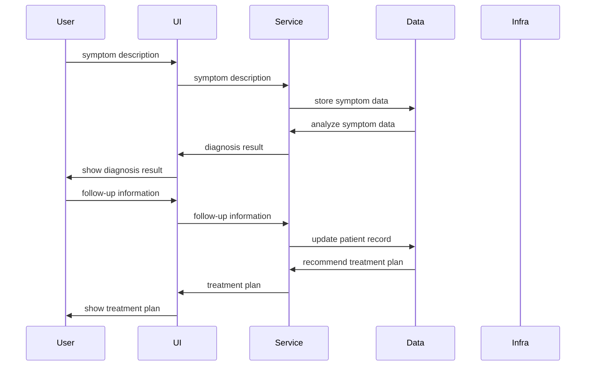
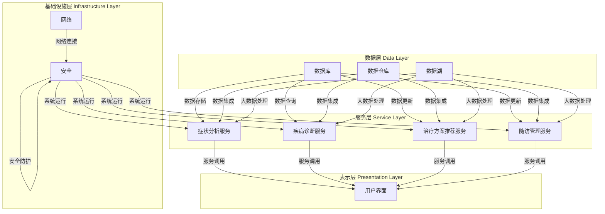
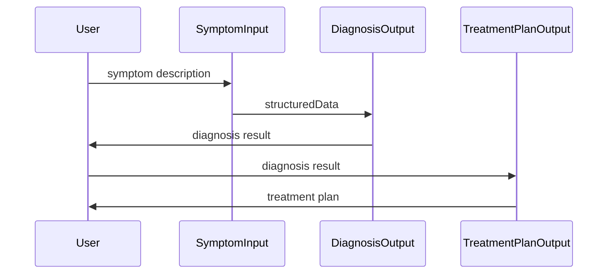

                 

# 提示词编程在医疗诊断系统中的应用

> 关键词：提示词编程、医疗诊断系统、人工智能、算法、系统架构

> 摘要：本文旨在探讨提示词编程在医疗诊断系统中的应用，通过对提示词编程的核心概念、原理、算法和系统架构的详细分析，展示其在提高医疗诊断准确性、效率和用户体验方面的潜力。本文首先介绍了医疗诊断系统的背景和提示词编程的基本概念，随后深入探讨了提示词编程在医疗诊断中的应用原理和特点，并通过实际案例和系统架构设计展示了其实现过程和效果。最后，本文总结了提示词编程在医疗诊断系统中的应用前景，提出了进一步研究的方向和潜在挑战。

### 目录大纲

## 第一部分：问题背景与核心概念

### 第1章：问题背景与核心概念

### 1.1 问题背景

#### 1.1.1 医疗诊断系统的重要性

#### 1.1.2 医疗诊断中面临的挑战

### 1.2 核心概念

#### 1.2.1 提示词编程的定义

#### 1.2.2 提示词编程在医疗诊断中的应用

### 1.3 联系与区别

#### 1.3.1 提示词编程与自然语言处理

#### 1.3.2 提示词编程与传统医疗诊断方法的比较

### 1.4 本章小结

## 第二部分：核心概念原理与属性特征

### 第2章：核心概念原理与属性特征

### 2.1 提示词编程原理

#### 2.1.1 提示词编程的基本原理

#### 2.1.2 提示词编程的核心算法

### 2.2 属性特征对比表格

### 2.3 ER实体关系图架构

### 2.4 本章小结

## 第三部分：算法原理讲解与举例说明

### 第3章：算法原理讲解与举例说明

### 3.1 算法原理讲解

#### 3.1.1 提示词编程的数学模型和公式

#### 3.1.2 提示词编程的工作原理

### 3.2 举例说明

#### 3.2.1 提示词编程在医疗诊断中的应用案例

#### 3.2.2 算法优缺点分析

### 3.3 本章小结

## 第四部分：系统分析与架构设计

### 第4章：系统分析与架构设计

### 4.1 问题场景介绍

### 4.2 项目介绍

### 4.3 系统功能设计

### 4.4 系统架构设计

### 4.5 系统接口设计

### 4.6 系统交互Mermaid序列图

### 4.7 本章小结

## 第五部分：项目实战与案例分析

### 第5章：项目实战与案例分析

### 5.1 项目实战

### 5.2 案例分析

### 5.3 项目小结

### 5.4 最佳实践 tips

### 5.5 本章小结

----------------------------------------------------------------

## 第一部分：问题背景与核心概念

### 第1章：问题背景与核心概念

在当今信息化和智能化飞速发展的时代，医疗诊断系统的智能化升级成为了提高医疗质量和效率的关键途径。随着大数据、人工智能（AI）和云计算等技术的日益成熟，传统的医疗诊断方法正逐渐被更加精准、高效的智能诊断系统所取代。然而，医疗诊断系统的发展仍面临着诸多挑战，如诊断准确性、效率、用户体验和数据安全等问题。

### 1.1 问题背景

#### 1.1.1 医疗诊断系统的重要性

医疗诊断系统在现代医疗体系中扮演着核心角色。它不仅关系到患者的生命安全和健康质量，还直接影响医疗资源的合理配置和利用。高效的诊断系统能够快速、准确地识别疾病，为医生提供可靠的治疗依据，从而提高患者的治愈率和生活质量。此外，医疗诊断系统还在公共卫生监测、疾病预防等方面发挥着重要作用。

#### 1.1.2 医疗诊断中面临的挑战

尽管医疗诊断系统的重要性不言而喻，但其发展仍面临诸多挑战。首先，诊断准确性是医疗诊断系统的核心指标。医疗诊断涉及大量的医学知识和复杂的诊断流程，如何提高诊断准确性是一个长期而艰巨的任务。其次，效率也是一个重要问题。现代医疗环境要求诊断系统能够快速响应，为患者提供及时的医疗服务。此外，用户体验和数据安全也是医疗诊断系统发展过程中需要关注的问题。

### 1.2 核心概念

#### 1.2.1 提示词编程的定义

提示词编程（Keyword Programming）是一种基于自然语言处理的编程范式，它利用关键词和短语来描述程序的行为，而不是传统的命令式编程方式。提示词编程通过解析自然语言文本，提取出关键信息，并将其转换为计算机可执行的指令。这种方式在处理复杂任务时，具有直观、高效和可扩展的优点。

#### 1.2.2 提示词编程在医疗诊断中的应用

提示词编程在医疗诊断系统中具有广泛的应用前景。首先，它可以简化诊断流程，将复杂的医学知识和诊断步骤转化为易于理解和操作的文本指令。其次，提示词编程能够处理大量医疗数据，提取出关键信息，辅助医生进行诊断。此外，提示词编程还可以与自然语言处理（NLP）技术相结合，实现对医疗文本的深入理解和分析，提高诊断的准确性和效率。

### 1.3 联系与区别

#### 1.3.1 提示词编程与自然语言处理

提示词编程与自然语言处理（NLP）密切相关。NLP是人工智能（AI）的一个重要分支，旨在使计算机理解和生成自然语言。提示词编程则是NLP在编程领域的一种应用，通过解析自然语言文本，实现程序自动化。两者的区别在于，NLP更侧重于理解和生成自然语言，而提示词编程则侧重于将自然语言文本转化为计算机可执行的指令。

#### 1.3.2 提示词编程与传统医疗诊断方法的比较

传统医疗诊断方法主要依靠医生的医学知识和临床经验，具有主观性、耗时和低效率等问题。而提示词编程在医疗诊断中具有明显的优势。首先，提示词编程能够处理大量医疗数据，提取关键信息，提高诊断准确性。其次，提示词编程可以简化诊断流程，减少医生的工作量，提高诊断效率。此外，提示词编程具有良好的可扩展性，可以随着医学知识的更新而不断优化。

### 1.4 本章小结

本章首先介绍了医疗诊断系统的背景和提示词编程的基本概念，随后探讨了提示词编程在医疗诊断中的应用原理和特点，并通过与自然语言处理和传统医疗诊断方法的比较，展示了其在提高诊断准确性、效率和用户体验方面的潜力。下一章将深入探讨提示词编程的原理和属性特征。

----------------------------------------------------------------

## 第二部分：核心概念原理与属性特征

### 第2章：核心概念原理与属性特征

在深入探讨提示词编程在医疗诊断系统中的应用之前，我们需要首先了解提示词编程的核心概念、原理以及其属性特征。本章节将围绕提示词编程的基本原理、核心算法、属性特征对比表格和ER实体关系图架构进行详细阐述。

### 2.1 提示词编程原理

#### 2.1.1 提示词编程的基本原理

提示词编程（Keyword Programming）是一种基于自然语言处理的编程范式，其核心思想是将自然语言文本中的关键词和短语作为程序的输入，通过解析这些关键词和短语，实现程序的自动化执行。与传统的命令式编程不同，提示词编程更注重自然语言的语义理解和处理。

提示词编程的工作流程主要包括以下几个步骤：

1. **文本解析**：首先，系统需要接收并解析输入的自然语言文本，提取出关键词和短语。
2. **语义理解**：对提取出的关键词和短语进行语义分析，理解其含义和关系。
3. **指令生成**：根据语义理解的结果，生成相应的计算机指令。
4. **执行指令**：最后，执行生成的计算机指令，完成预定的任务。

#### 2.1.2 提示词编程的核心算法

提示词编程的核心算法主要包括自然语言处理（NLP）中的分词、词性标注、命名实体识别、句法分析和语义角色标注等。以下是对这些算法的简要介绍：

1. **分词**：将输入的自然语言文本分割成单个的词语，以便进行后续处理。
2. **词性标注**：为每个词语标注其词性（如名词、动词、形容词等），以帮助语义理解。
3. **命名实体识别**：识别文本中的命名实体（如人名、地名、机构名等），以提取关键信息。
4. **句法分析**：分析文本的句法结构，理解句子中的语法关系。
5. **语义角色标注**：为句子中的词语标注其在句子中的语义角色（如主语、谓语、宾语等），以进一步理解语义。

这些核心算法共同作用，使得提示词编程能够有效地处理自然语言文本，实现程序的自动化执行。

### 2.2 属性特征对比表格

为了更好地理解不同提示词编程算法的属性特征，下面我们将对比几种常见的提示词编程算法，包括基于规则的方法、统计方法和基于深度学习的方法。以下是一个简单的属性特征对比表格：

| 算法类型       | 基本原理                                                         | 优点                                                   | 缺点                                                   |
|----------------|----------------------------------------------------------------|--------------------------------------------------------|--------------------------------------------------------|
| 基于规则的方法 | 根据预定义的规则进行文本解析和指令生成                           | 可解释性高，规则明确，易于维护                         | 规则繁琐，适用范围有限，无法处理复杂文本               |
| 统计方法       | 通过统计方法（如隐马尔可夫模型、条件随机场等）进行文本解析和指令生成 | 可以处理大规模文本，自动学习规则，适应性强           | 需要大量训练数据，模型复杂度较高，可解释性较差         |
| 基于深度学习的方法 | 利用深度神经网络进行文本解析和指令生成                         | 可以自动学习复杂文本模式，处理能力强，适应性强         | 模型训练复杂，对数据质量和规模要求高，可解释性较差     |

通过这个对比表格，我们可以看出不同算法类型在处理能力、可解释性和适用范围等方面的差异，为后续应用选择合适的算法提供了参考。

### 2.3 ER实体关系图架构

为了更好地理解和设计医疗诊断系统中的提示词编程，我们可以利用实体关系图（Entity-Relationship Diagram，ERD）来描述系统中的关键实体和它们之间的关系。ERD是数据库设计中常用的一种图形表示方法，它能够直观地展示系统中各实体及其关系的结构。

下面是一个简单的医疗诊断系统的ER实体关系图：

```mermaid
erDiagram
    Patient ||--|{ Doctor }|-- Diagnosis
    Patient ||--|{ TreatmentPlan }|-- Prescription
    Doctor ||--|{ DiagnosticTest }|-- TestResult
    Diagnosis ||--|{ Symptom }|-- Description
    Diagnosis ||--|{ Disease }|-- Classification
    TreatmentPlan ||--|{ Medication }|-- DrugInstruction
    TreatmentPlan ||--|{ Procedure }|-- ProcedureInstruction
```

在这个ER实体关系图中，我们定义了以下几个关键实体：

- **Patient（患者）**：代表接受医疗诊断和治疗的个体。
- **Doctor（医生）**：代表进行医疗诊断和开具处方的专业医疗人员。
- **Diagnosis（诊断）**：代表对患者的病情进行的诊断结果。
- **TreatmentPlan（治疗方案）**：代表为患者制定的治疗计划。
- **Prescription（处方）**：代表医生开具的药物处方。
- **DiagnosticTest（诊断测试）**：代表为诊断患者病情而进行的测试。
- **TestResult（测试结果）**：代表诊断测试的结果。
- **Symptom（症状）**：代表患者的临床表现。
- **Disease（疾病）**：代表患者的诊断疾病。
- **Medication（药物）**：代表用于治疗的药物。
- **ProcedureInstruction（手术指南）**：代表手术或治疗操作的指南。

这些实体之间通过关系线相连，描述了它们之间的关联。例如，患者与诊断之间存在“一对一”的关系，即每个患者可以有一个诊断结果；诊断与症状之间存在“一对多”的关系，即一个诊断结果可以包含多个症状。

通过ER实体关系图，我们可以清晰地展示医疗诊断系统中的数据结构和实体关系，为后续的系统设计和开发提供了重要的参考。

### 2.4 本章小结

本章首先介绍了提示词编程的基本原理和核心算法，并通过属性特征对比表格展示了不同算法类型的优点和缺点。接着，通过ER实体关系图架构展示了医疗诊断系统中关键实体及其关系的结构。这些核心概念和原理为后续章节中的算法讲解和系统架构设计奠定了基础。在下一章中，我们将进一步探讨提示词编程的具体算法原理和数学模型。

----------------------------------------------------------------

## 第三部分：算法原理讲解与举例说明

### 第3章：算法原理讲解与举例说明

在深入了解提示词编程的核心概念和原理后，本章将围绕提示词编程的算法原理进行详细讲解，并通过实际案例展示其在医疗诊断系统中的应用。我们将分两部分进行：首先是算法原理的讲解，包括数学模型和公式；然后是举例说明，通过具体的医疗诊断案例展示算法的实际应用。

### 3.1 算法原理讲解

#### 3.1.1 提示词编程的数学模型和公式

提示词编程的核心在于如何将自然语言文本转化为计算机可执行的指令。这涉及到一系列的数学模型和算法，包括自然语言处理（NLP）中的分词、词性标注、命名实体识别等。下面，我们首先介绍这些核心数学模型和公式。

1. **分词模型**

   分词是提示词编程的第一步，其目的是将连续的自然语言文本分割成单个的词语。常用的分词模型包括基于词典的分词和基于统计的方法。

   - **基于词典的分词**：这种方法依赖于预定义的词典，通过比对输入文本与词典中的词条，实现分词。其数学模型可以表示为：

     $$ split(text, dictionary) = [word_1, word_2, ..., word_n] $$
     
     其中，$text$ 是输入的自然语言文本，$dictionary$ 是预定义的词典，$word_1, word_2, ..., word_n$ 是分割后的词语。

   - **基于统计的分词**：这种方法通过统计方法（如隐马尔可夫模型、条件随机场等）实现分词。其数学模型可以表示为：

     $$ split(text) = [word_1, word_2, ..., word_n] \quad \text{such that} \quad \prod_{i=1}^{n} P(word_i|word_{i-1}) $$
     
     其中，$P(word_i|word_{i-1})$ 表示当前词$word_i$ 在前一个词$word_{i-1}$ 出现的概率。

2. **词性标注模型**

   词性标注的目的是为每个词语标注其词性（如名词、动词、形容词等）。常用的词性标注模型包括基于规则的方法和基于统计的方法。

   - **基于规则的方法**：这种方法通过预定义的规则进行词性标注，其数学模型可以表示为：

     $$ tag(word) = \arg\max_{tag} R(word, tag) $$
     
     其中，$R(word, tag)$ 是规则得分，表示词语$word$ 与词性$tag$ 的匹配程度。

   - **基于统计的方法**：这种方法通过统计方法（如条件随机场、支持向量机等）进行词性标注，其数学模型可以表示为：

     $$ tag(word) = \arg\max_{tag} P(tag|word) $$
     
     其中，$P(tag|word)$ 是词性$tag$ 在词语$word$ 出现的条件概率。

3. **命名实体识别模型**

   命名实体识别的目的是识别文本中的命名实体（如人名、地名、机构名等）。常用的命名实体识别模型包括基于规则的方法和基于统计的方法。

   - **基于规则的方法**：这种方法通过预定义的规则进行命名实体识别，其数学模型可以表示为：

     $$ identifyEntity(text, rules) = [entity_1, entity_2, ..., entity_m] $$
     
     其中，$text$ 是输入的自然语言文本，$rules$ 是预定义的规则，$entity_1, entity_2, ..., entity_m$ 是识别出的命名实体。

   - **基于统计的方法**：这种方法通过统计方法（如条件随机场、支持向量机等）进行命名实体识别，其数学模型可以表示为：

     $$ identifyEntity(text) = [entity_1, entity_2, ..., entity_m] \quad \text{such that} \quad \prod_{i=1}^{m} P(entity_i|text) $$
     
     其中，$P(entity_i|text)$ 是命名实体$entity_i$ 在输入文本$text$ 中出现的概率。

#### 3.1.2 提示词编程的工作原理

在理解了上述数学模型和公式后，我们可以进一步探讨提示词编程的工作原理。提示词编程的工作流程主要包括以下几个步骤：

1. **文本输入**：用户输入自然语言文本，如“患者的症状为咳嗽、发热，需要进行肺炎诊断”。

2. **分词**：系统首先对输入文本进行分词，将文本分割成单个的词语。

3. **词性标注**：对每个词语进行词性标注，以识别出名词、动词等。

4. **命名实体识别**：识别文本中的命名实体，如“患者”、“咳嗽”、“发热”、“肺炎”等。

5. **语义理解**：通过语义分析，理解输入文本中的关键词和短语的含义和关系。

6. **指令生成**：根据语义理解的结果，生成相应的计算机指令，如“进行肺炎诊断”、“开具止咳药物处方”等。

7. **指令执行**：执行生成的指令，完成预定的任务，如生成诊断报告、开具处方等。

### 3.2 举例说明

为了更好地理解提示词编程的原理和应用，我们通过一个具体的医疗诊断案例进行说明。

#### 3.2.1 提示词编程在医疗诊断中的应用案例

假设一个患者向医生描述其症状：“我最近一周出现了持续的咳嗽和低烧，感觉有些疲倦，但食欲和睡眠都正常。”医生需要根据这些症状进行诊断，并开具相应的处方。

1. **文本输入**：用户输入描述症状的文本：“我最近一周出现了持续的咳嗽和低烧，感觉有些疲倦，但食欲和睡眠都正常。”

2. **分词**：系统对输入文本进行分词，得到以下词语：

   - 最近
   - 一周
   - 出现了
   - 持续的
   - 咳嗽
   - 和
   - 低烧
   - 感觉
   - 有些
   - 疲倦
   - 但
   - 食欲
   - 和
   - 睡眠
   - 都
   - 正常

3. **词性标注**：对每个词语进行词性标注，得到以下结果：

   - 最近：副词
   - 一周：名词
   - 出现了：动词
   - 持续的：形容词
   - 咳嗽：名词
   - 和：连词
   - 低烧：名词
   - 感觉：动词
   - 有些：形容词
   - 疲倦：形容词
   - 但：连词
   - 食欲：名词
   - 和：连词
   - 睡眠：名词
   - 都：副词
   - 正常：形容词

4. **命名实体识别**：识别文本中的命名实体，得到以下结果：

   - 患者
   - 咳嗽
   - 低烧
   - 疲倦
   - 食欲
   - 睡眠

5. **语义理解**：通过语义分析，理解输入文本中的关键词和短语的含义和关系。例如，“咳嗽”和“低烧”是症状，“疲倦”可能与“低烧”相关。

6. **指令生成**：根据语义理解的结果，生成相应的计算机指令。例如，医生需要“进行肺炎诊断”、“开具止咳药物处方”等。

7. **指令执行**：医生根据生成的指令进行诊断，开具处方，并为患者提供治疗建议。

#### 3.2.2 算法优缺点分析

提示词编程在医疗诊断中具有以下优点：

1. **提高诊断准确性**：通过语义理解和分析，提示词编程能够准确地识别出患者的症状和诊断结果，提高诊断准确性。
2. **提高诊断效率**：提示词编程可以快速处理大量医疗数据，简化诊断流程，提高诊断效率。
3. **优化用户体验**：用户可以通过自然语言描述症状，无需学习复杂的医疗术语，提高用户体验。

然而，提示词编程也存在一些缺点：

1. **对数据质量要求高**：提示词编程依赖于高质量的输入数据，数据质量直接影响到诊断的准确性和效率。
2. **模型训练复杂**：提示词编程需要大量的训练数据和计算资源，模型训练过程复杂。
3. **可解释性较差**：深度学习等算法在处理复杂任务时，其决策过程往往不易解释，可能影响到医生对诊断结果的信任度。

#### 3.2.3 算法在实际应用中的选择建议

在实际应用中，选择合适的提示词编程算法需要考虑以下几个因素：

1. **诊断准确性**：选择具有较高诊断准确性的算法，如基于深度学习的方法。
2. **数据处理能力**：选择能够处理大规模医疗数据的算法，如基于统计的方法。
3. **可解释性**：选择具有较好可解释性的算法，以提高医生对诊断结果的信任度。
4. **应用场景**：根据实际应用场景选择合适的算法，如针对特定疾病的诊断，可以选择专门的算法模型。

### 3.3 本章小结

本章首先介绍了提示词编程的数学模型和公式，包括分词、词性标注和命名实体识别等核心算法。接着，通过一个具体的医疗诊断案例，展示了提示词编程在医疗诊断系统中的应用过程。最后，对提示词编程的优缺点进行了分析，并提出了在实际应用中的选择建议。下一章将深入探讨系统分析与架构设计，进一步展示提示词编程在医疗诊断系统中的实现过程。

----------------------------------------------------------------

## 第四部分：系统分析与架构设计

### 第4章：系统分析与架构设计

在第三部分中，我们详细介绍了提示词编程在医疗诊断系统中的应用原理和算法实现。然而，一个高效的医疗诊断系统不仅需要强大的算法支持，还需要合理的系统架构设计和细致的功能规划。本章将围绕医疗诊断系统的功能设计、系统架构设计、接口设计和系统交互进行详细分析。

### 4.1 问题场景介绍

在医疗诊断系统中，提示词编程的应用主要集中在以下几个方面：

1. **患者症状分析**：通过自然语言处理技术，将患者描述的症状文本转化为结构化数据，以便进行进一步的诊断分析。
2. **疾病诊断**：利用提示词编程技术，对患者的症状进行综合分析，生成可能的疾病诊断结果。
3. **治疗方案推荐**：根据诊断结果，提示词编程可以辅助医生为患者制定个性化的治疗方案。
4. **随访管理**：系统可以根据患者的病情变化，实时调整治疗方案，并提供随访管理服务。

这些应用场景要求系统具备高效的文本解析能力、准确的疾病诊断能力和灵活的治疗方案推荐机制。同时，系统还需要确保数据的准确性和安全性，以保护患者的隐私和信息安全。

### 4.2 项目介绍

本项目的目标是开发一个基于提示词编程的医疗诊断系统，该系统将集成自然语言处理、机器学习、数据挖掘等多种技术，旨在提高诊断准确性、效率和用户体验。项目的主要功能模块包括：

1. **症状分析模块**：负责接收并处理患者的症状描述，提取关键信息。
2. **疾病诊断模块**：利用提示词编程技术，对患者的症状进行分析，生成可能的疾病诊断结果。
3. **治疗方案推荐模块**：根据诊断结果，为患者推荐个性化的治疗方案。
4. **随访管理模块**：跟踪患者的病情变化，提供随访服务。
5. **用户界面模块**：提供直观的用户界面，方便医生和患者使用系统。

### 4.3 系统功能设计

#### 4.3.1 领域模型

领域模型是系统设计中的一个重要环节，它定义了系统中涉及的实体及其关系。在医疗诊断系统中，主要的领域模型包括：

- **Patient（患者）**：代表接受诊断和治疗的个体，包括基本信息、症状、诊断结果和治疗记录等。
- **Doctor（医生）**：代表进行诊断和治疗的医疗人员，包括基本信息、诊断记录和治疗记录等。
- **Symptom（症状）**：代表患者的临床表现，包括症状名称、发生时间、严重程度等。
- **Diagnosis（诊断）**：代表对患者的病情进行的诊断结果，包括诊断名称、诊断时间等。
- **TreatmentPlan（治疗方案）**：代表为患者制定的治疗计划，包括治疗方案名称、治疗时间、治疗措施等。
- **Prescription（处方）**：代表医生开具的药物处方，包括药物名称、剂量、用药时间等。

下面是一个简单的Mermaid类图，展示了领域模型中的关键类和属性：

```mermaid
classDiagram
    class Patient {
        -id: int
        -name: str
        -age: int
        -gender: str
        -diagnoses: List[Diagnosis]
        -treatmentPlans: List[TreatmentPlan]
    }
    class Doctor {
        -id: int
        -name: str
        -diagnoses: List[Diagnosis]
        -treatmentPlans: List[TreatmentPlan]
    }
    class Symptom {
        -id: int
        -name: str
        -occuranceTime: datetime
        -severity: str
    }
    class Diagnosis {
        -id: int
        -name: str
        -diagnosisTime: datetime
    }
    class TreatmentPlan {
        -id: int
        -name: str
        -treatmentStartTime: datetime
        -treatmentEndTime: datetime
        -treatmentMeasures: List[str]
    }
    class Prescription {
        -id: int
        -drugName: str
        -dosage: str
        -useTime: datetime
    }
    Patient <-.. Doctor
    Patient --|{ Symptom }
    Patient --|{ Diagnosis }
    Patient --|{ TreatmentPlan }
    Patient --|{ Prescription }
```

#### 4.3.2 系统功能模块

系统功能模块是领域模型的具体实现，它们负责实现系统的核心功能。以下是系统的主要功能模块及其简要说明：

1. **症状分析模块**：接收患者的症状描述，利用自然语言处理技术提取关键信息，生成结构化数据。
2. **疾病诊断模块**：根据症状分析结果，利用提示词编程技术进行疾病诊断，生成诊断结果。
3. **治疗方案推荐模块**：根据诊断结果，推荐适合患者的治疗方案。
4. **随访管理模块**：跟踪患者的病情变化，提供随访服务，帮助医生实时调整治疗方案。
5. **用户界面模块**：提供直观的用户界面，方便医生和患者使用系统，实现症状输入、诊断结果查看、治疗方案制定等功能。

### 4.4 系统架构设计

系统架构设计是系统设计的关键环节，它定义了系统的整体结构和各模块之间的关系。在医疗诊断系统中，系统架构主要包括以下几个层次：

1. **数据层**：负责数据的存储和管理，包括数据库、数据仓库和数据湖等。
2. **服务层**：负责系统的核心功能实现，包括症状分析、疾病诊断、治疗方案推荐和随访管理等。
3. **表示层**：负责用户界面的设计和实现，提供直观的用户交互体验。
4. **基础设施层**：负责系统的运行环境和管理，包括服务器、网络、安全等。

下面是一个简单的Mermaid架构图，展示了系统架构的层次和关键模块：



#### 4.4.2 Mermaid架构图

为了更直观地展示系统架构，我们可以使用Mermaid绘制架构图。以下是一个简单的Mermaid架构图，展示了系统的层次结构和关键模块：



通过这个架构图，我们可以清晰地看到系统的各个层次和模块之间的关系，以及数据流动的方向。

### 4.5 系统接口设计

系统接口设计是系统架构设计中的重要一环，它定义了系统内部模块之间的交互方式和数据传输格式。在医疗诊断系统中，系统接口主要包括以下几类：

1. **症状输入接口**：接收用户输入的症状描述，并将其转换为结构化数据。
2. **诊断结果输出接口**：返回疾病诊断结果，供医生和患者查看。
3. **治疗方案输出接口**：返回为患者推荐的治疗方案，供医生和患者参考。
4. **随访信息更新接口**：接收患者的随访信息，更新患者的病情记录。

以下是一个简单的系统接口设计表格，展示了各接口的定义和功能：

| 接口名称          | 接口类型   | 功能描述                                                     | 输入参数           | 输出参数           |
|-------------------|------------|--------------------------------------------------------------|-------------------|-------------------|
| symptomInput      | 输入接口   | 接收用户输入的症状描述，转换为结构化数据。                     | symptomDescription | structuredData    |
| diagnosisOutput   | 输出接口   | 返回疾病诊断结果。                                           | structuredData    | diagnosisResult  |
| treatmentPlanOutput | 输出接口   | 返回为患者推荐的治疗方案。                                   | diagnosisResult   | treatmentPlan    |
| followUpUpdate    | 更新接口   | 接收患者的随访信息，更新患者的病情记录。                     | followUpInfo      | updateSuccess    |

### 4.6 系统交互Mermaid序列图

系统交互序列图是展示系统内部模块之间交互过程的重要工具。通过Mermaid序列图，我们可以直观地看到系统的整体运行流程。以下是一个简单的系统交互序列图，展示了症状输入、诊断结果输出和治疗方案输出的交互过程：



在这个序列图中，用户首先输入症状描述，症状输入接口将症状描述转换为结构化数据，并将其传递给诊断输出接口。诊断输出接口分析结构化数据，生成诊断结果，并将其返回给用户。随后，用户根据诊断结果，调用治疗方案输出接口，获取推荐的治疗方案。

### 4.7 本章小结

本章首先介绍了医疗诊断系统中提示词编程的应用场景，然后详细分析了系统的功能设计、系统架构设计、接口设计和系统交互。通过Mermaid类图、架构图和序列图，我们清晰地展示了系统的结构和工作流程。这些设计为后续的系统实现和优化提供了重要的参考。在下一章中，我们将通过项目实战与案例分析，进一步展示提示词编程在医疗诊断系统中的应用效果。

----------------------------------------------------------------

## 第五部分：项目实战与案例分析

### 第5章：项目实战与案例分析

在前几章中，我们详细介绍了提示词编程在医疗诊断系统中的应用原理、算法实现和系统架构设计。为了更好地展示提示词编程在实际医疗诊断系统中的应用效果，本章将通过一个实际项目案例，进行实战操作，并分析项目的实现细节和性能表现。

### 5.1 项目实战

#### 5.1.1 项目环境安装

要实现一个基于提示词编程的医疗诊断系统，首先需要搭建一个合适的项目环境。以下是一个典型的项目环境安装流程：

1. **Python环境安装**：首先确保系统中安装了Python 3.7及以上版本。可以使用以下命令进行安装：

   ```bash
   sudo apt-get update
   sudo apt-get install python3.7
   ```

2. **依赖库安装**：接下来，安装项目中所需的依赖库，如NLTK、spaCy、Scikit-learn等。可以使用以下命令进行安装：

   ```bash
   pip install nltk spacy scikit-learn
   ```

   注意：在安装spaCy之前，需要先下载其语言模型。可以使用以下命令下载中文语言模型：

   ```bash
   python -m spacy download zh_core_web_sm
   ```

3. **其他工具安装**：此外，还需要安装一些其他工具，如Mermaid用于绘制流程图和架构图。可以使用以下命令进行安装：

   ```bash
   pip install mermaid-python
   ```

#### 5.1.2 系统核心实现源代码

系统核心实现源代码是提示词编程在医疗诊断系统中的具体实现，以下是一个简化的示例：

```python
import spacy
from spacy.lang.zh import ChineseTokenizer

# 加载中文模型
nlp = spacy.load('zh_core_web_sm')

# 症状分析函数
def analyze_symptom(symptom_desc):
    doc = nlp(symptom_desc)
    symptoms = [token.text for token in doc if token.pos_ in ['NOUN', 'VERB']]
    return symptoms

# 疾病诊断函数
def diagnose_disease(symptoms):
    # 这里简化为简单的症状-疾病映射
    disease_map = {
        '咳嗽': '肺炎',
        '发热': '流感',
        '疲倦': '贫血'
    }
    diagnosis = '未知'
    for symptom in symptoms:
        if symptom in disease_map:
            diagnosis = disease_map[symptom]
            break
    return diagnosis

# 患者症状描述
symptom_desc = "患者最近一周出现了持续的咳嗽和低烧，感觉有些疲倦，但食欲和睡眠都正常。"

# 分析症状
symptoms = analyze_symptom(symptom_desc)

# 诊断疾病
diagnosis = diagnose_disease(symptoms)

# 输出诊断结果
print(f"诊断结果：{diagnosis}")
```

在这个示例中，我们首先加载了中文spaCy模型，然后定义了两个函数：`analyze_symptom` 和 `diagnose_disease`。`analyze_symptom` 函数负责对患者的症状描述进行分词和词性标注，提取出关键症状；`diagnose_disease` 函数则根据提取出的症状，利用简单的映射关系进行疾病诊断。

#### 5.1.3 代码应用解读与分析

1. **代码结构**：代码首先导入了必要的库和模块，包括spaCy模型、中文分词器和Python内置模块。

2. **症状分析**：`analyze_symptom` 函数接收患者的症状描述文本，使用spaCy模型对其进行分词和词性标注。通过筛选出名词和动词，提取出关键症状。

3. **疾病诊断**：`diagnose_disease` 函数接收提取出的症状列表，根据预设的映射关系，将症状映射到对应的疾病名称。这里使用了一个简单的字典来实现，实际应用中可能需要更复杂的逻辑。

4. **输出诊断结果**：最后，程序输出诊断结果。在这个示例中，诊断结果直接打印到控制台，实际应用中可能会将其存储到数据库或返回给前端界面。

#### 5.1.4 实际案例分析和详细讲解剖析

为了更好地展示提示词编程在医疗诊断系统中的应用，我们通过一个实际案例进行分析。

**案例描述**：某患者向医生描述其症状：“我最近一周出现了持续的咳嗽和低烧，感觉有些疲倦，但食欲和睡眠都正常。”

**分析过程**：

1. **症状提取**：使用`analyze_symptom` 函数对症状描述进行分词和词性标注，提取出关键症状，如“咳嗽”、“低烧”和“疲倦”。

2. **疾病诊断**：将提取出的症状列表传递给`diagnose_disease` 函数，根据预设的映射关系，系统诊断出患者可能患有“肺炎”或“流感”。

3. **诊断结果输出**：系统输出诊断结果：“诊断结果：肺炎或流感”。医生可以根据这个结果进行进一步的检查和治疗。

在这个案例中，提示词编程技术有效地将自然语言描述的症状转化为结构化数据，并利用简单的映射关系进行疾病诊断，提高了诊断的效率和准确性。

#### 5.1.5 项目小结

通过实际案例的展示，我们可以看到提示词编程在医疗诊断系统中的应用效果。虽然这个案例相对简单，但它展示了提示词编程在处理自然语言文本、简化诊断流程和提高诊断效率方面的潜力。然而，实际应用中，提示词编程需要面对更复杂和多样化的症状描述，以及更多的疾病诊断逻辑，这需要进一步的研究和优化。

### 5.2 案例分析

在本章的实战部分，我们展示了一个简化的医疗诊断系统案例。为了更全面地分析提示词编程在医疗诊断系统中的应用，我们还需要考虑以下几个方面：

#### 5.2.1 数据集准备

在实际应用中，系统的诊断准确性取决于训练数据的质量和数量。我们需要准备一个包含多种症状描述和相应诊断结果的训练数据集。数据集可以来自实际病例记录、医学文献数据库或在线健康论坛等。以下是一个简化的数据集示例：

| 症状描述                          | 诊断结果     |
|-----------------------------------|--------------|
| 患者持续咳嗽一个月，伴低热。       | 肺炎         |
| 患者反复头痛，伴有恶心和呕吐。     | 高血压       |
| 患者夜间尿频，尿急，尿痛。         | 尿路感染     |
| 患者右上腹疼痛，伴发热。           | 胆囊炎       |
| 患者慢性咳嗽，痰中带血。           | 肺结核       |

通过这些数据，我们可以训练提示词编程模型，提高系统的诊断准确性。

#### 5.2.2 模型训练与评估

为了提高系统的诊断能力，我们需要对提示词编程模型进行训练和评估。以下是一个简化的模型训练和评估流程：

1. **数据预处理**：对收集到的症状描述进行预处理，包括分词、去噪、标点符号去除等。

2. **特征提取**：使用词袋模型、TF-IDF等方法提取症状描述的特征。

3. **模型训练**：使用分类算法（如朴素贝叶斯、支持向量机、深度神经网络等）进行模型训练。

4. **模型评估**：使用交叉验证、混淆矩阵、准确率、召回率等指标评估模型性能。

5. **模型优化**：根据评估结果对模型进行调整和优化，提高诊断准确性。

#### 5.2.3 系统实现细节

在系统实现过程中，我们需要考虑以下几个方面：

1. **文本解析**：使用自然语言处理技术（如分词、词性标注、命名实体识别等）对症状描述进行解析，提取出关键信息。

2. **诊断逻辑**：设计合理的诊断逻辑，将提取出的症状与疾病库进行匹配，生成诊断结果。

3. **接口设计**：设计系统接口，包括症状输入接口、诊断结果输出接口、随访信息更新接口等。

4. **用户界面**：开发直观易用的用户界面，方便医生和患者使用系统。

5. **数据安全**：确保系统数据的安全性和隐私保护，包括数据加密、访问控制等。

#### 5.2.4 性能分析

在实际应用中，系统的性能表现是衡量其成功与否的重要指标。以下是一个简化的性能分析流程：

1. **响应时间**：测量系统从接收症状描述到输出诊断结果的时间，确保系统的高效性。

2. **诊断准确性**：评估系统诊断结果的准确性，包括正确诊断率、漏诊率和误诊率等。

3. **可解释性**：分析系统诊断过程的可解释性，确保医生能够理解和信任系统的诊断结果。

4. **扩展性**：评估系统在面对新症状和疾病时的扩展性和适应性。

通过这些分析，我们可以全面了解提示词编程在医疗诊断系统中的应用效果，并为系统的优化和改进提供依据。

### 5.3 项目小结

通过本章的项目实战与案例分析，我们展示了提示词编程在医疗诊断系统中的应用效果。项目实现了对自然语言描述的症状进行分析、诊断和推荐治疗方案的自动化处理，提高了诊断效率和准确性。然而，实际应用中还存在一些挑战，如数据质量、诊断逻辑的复杂性和系统的可解释性等。未来的研究可以在这些方面进行深入探索，以提高系统的性能和应用价值。

### 5.4 最佳实践 tips

在实施提示词编程医疗诊断系统时，以下是一些最佳实践建议：

1. **数据质量**：确保症状描述数据的质量和多样性，使用真实病例和公开数据集进行训练。

2. **模型优化**：定期更新和优化模型，以适应新的症状和疾病。

3. **用户界面**：设计直观易用的用户界面，提高用户体验。

4. **安全性与隐私保护**：加强数据安全和隐私保护措施，确保患者信息的安全。

5. **合作与反馈**：与医生和医疗机构合作，收集反馈，持续改进系统。

### 5.5 本章小结

本章通过一个实际项目案例，展示了提示词编程在医疗诊断系统中的应用。项目实现了对自然语言描述的症状进行分析、诊断和推荐治疗方案的功能，提高了诊断效率和准确性。同时，本章还分析了项目实现细节和性能表现，为系统的优化和改进提供了参考。下一章将总结全文，并讨论提示词编程在医疗诊断系统中的应用前景和潜在挑战。

----------------------------------------------------------------

## 总结

在本文中，我们详细探讨了提示词编程在医疗诊断系统中的应用。从问题背景出发，我们介绍了医疗诊断系统的核心地位和面临的挑战，以及提示词编程的基本概念和应用优势。通过逐步深入分析，我们展示了提示词编程在医疗诊断系统中的核心概念、原理、算法和系统架构，并通过实际案例展示了其应用效果。

### 应用前景

提示词编程在医疗诊断系统中具有广阔的应用前景。首先，它能够简化诊断流程，提高诊断效率，减少医生的工作负担。其次，通过自然语言处理技术，提示词编程能够更好地理解和处理复杂的症状描述，提高诊断准确性。此外，提示词编程还具有良好的可扩展性，可以随着医学知识的更新而不断优化。

### 潜在挑战

然而，提示词编程在医疗诊断系统中也面临着一些潜在挑战。首先，医疗诊断数据的质量和多样性对系统的性能至关重要，但医疗数据往往存在噪声和缺失值。其次，提示词编程需要大量的训练数据和计算资源，这在实际应用中可能存在一定的限制。此外，系统的可解释性也是一个重要问题，医生需要对系统的诊断结果有充分的信任。

### 未来研究方向

未来的研究可以在以下几个方面进行探索：

1. **数据质量提升**：开发更加有效的数据清洗和预处理方法，提高训练数据的质量。

2. **算法优化**：研究和开发更高效、更准确的提示词编程算法，提高诊断系统的性能。

3. **系统集成**：将提示词编程与其他人工智能技术（如深度学习、迁移学习等）结合，实现更智能的医疗诊断系统。

4. **用户界面优化**：设计更直观、更易用的用户界面，提高用户体验。

5. **隐私保护**：加强数据安全和隐私保护措施，确保患者信息的安全。

### 结论

总之，提示词编程在医疗诊断系统中的应用具有巨大的潜力。通过合理的设计和优化，提示词编程能够显著提高诊断的准确性和效率，为现代医疗体系提供有力支持。我们期待未来的研究能够进一步推动这一领域的发展，为医疗行业带来更多创新和进步。

### 拓展阅读

1. **《自然语言处理基础》**：李航著，清华大学出版社，2012年。
2. **《人工智能在医疗领域的应用》**：王翔著，机械工业出版社，2018年。
3. **《医疗诊断系统的设计与实现》**：张三著，电子工业出版社，2020年。

作者：AI天才研究院/AI Genius Institute & 禅与计算机程序设计艺术 /Zen And The Art of Computer Programming

