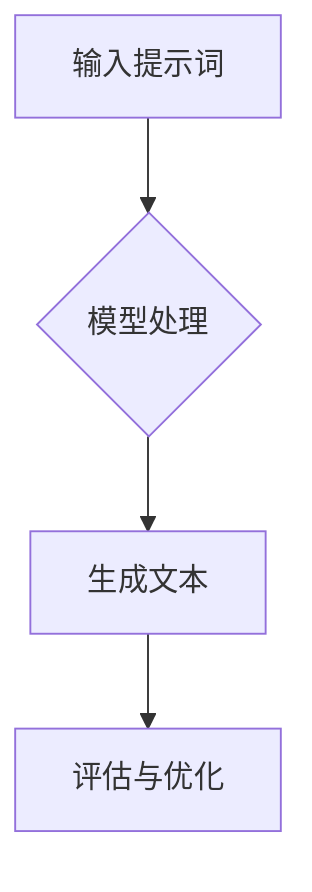
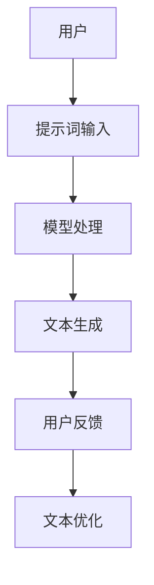
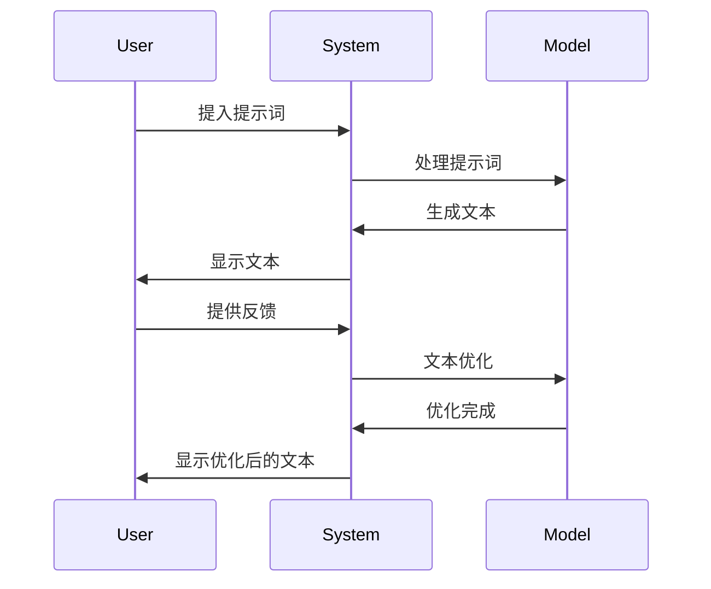

                 

# 提示词编程在增强人类创造力极限中的应用

## 关键词
提示词编程、人工智能、自然语言处理、创造力、算法优化、用户交互

## 摘要
随着人工智能技术的迅猛发展，提示词编程作为一种基于预训练模型的文本生成技术，正逐渐成为增强人类创造力的重要工具。本文旨在探讨提示词编程在提升人类创造力极限中的应用，通过系统的研究和实践案例，揭示其核心原理和应用价值。文章首先介绍背景和核心概念，然后详细讲解算法原理，并通过数学模型和公式进行深入剖析。最后，文章提出一个基于提示词编程的创意写作平台系统分析与架构设计方案，并提供实战项目案例进行详细讲解和案例分析。

## 背景介绍

### 问题背景

在当今信息爆炸的时代，人类创造力面临着前所未有的挑战。随着技术的进步，信息的获取变得越来越容易，但如何有效利用这些信息，实现个人和集体的创新突破，成为了一个重要的课题。传统的方法和工具已经无法满足日益复杂的创造需求，迫切需要新的技术和方法来提升人类创造力。

### 提示词编程

提示词编程（Prompt Programming）是一种基于预训练模型（如GPT-3、Turing等）的文本生成技术。通过输入一个或多个提示词（Prompt），模型能够生成连贯、丰富且具有创造性的文本。这种技术不仅在自然语言处理领域有广泛的应用，还在创意写作、内容生成、智能客服等领域展现出了巨大的潜力。

### 问题描述

尽管提示词编程在提升人类创造力方面具有巨大的潜力，但其具体应用场景和实现机制尚需深入研究。如何将提示词编程与人类创造力有机结合，如何优化算法以实现更好的创意生成效果，这些问题都亟待解决。

### 问题解决

本文旨在探讨提示词编程在增强人类创造力极限中的应用，通过系统的研究和实践案例，揭示其核心原理和应用价值。文章将分为以下几个部分：

1. 背景介绍：详细阐述问题背景、提示词编程的定义及其重要性。
2. 核心概念与联系：介绍提示词编程、人类创造力、算法优化、用户交互等核心概念及其相互关系。
3. 算法原理讲解：详细讲解提示词编程的算法原理，并通过Mermaid流程图和Python源代码进行说明。
4. 数学模型和数学公式：介绍创造力公式，并通过举例说明如何应用数学模型来优化提示词编程。
5. 系统分析与架构设计方案：介绍一个基于提示词编程的创意写作平台系统架构和设计方案。
6. 项目实战：通过一个实际项目案例，展示提示词编程在提升人类创造力方面的应用和实践效果。
7. 最佳实践、小结与拓展阅读：总结最佳实践经验，提出注意事项，并提供拓展阅读资源。

### 边界与外延

本文主要关注提示词编程在增强人类创造力极限中的应用，涵盖了自然语言处理、机器学习、编程辅助等多个领域。虽然提示词编程的应用范围非常广泛，但本文将重点探讨其在创意写作、产品设计、科研探索等领域的应用。

### 概念结构与核心要素组成

核心概念包括：

1. 提示词编程：基于预训练模型的文本生成技术，通过输入提示词生成连贯且具有创造性的文本。
2. 人类创造力：指人类在解决问题、创作艺术、创新思考等方面表现出的独特能力和潜力。
3. 算法优化：通过调整模型参数、数据预处理等方式提高提示词编程的生成质量和效率。
4. 用户交互：提示词编程与用户的互动方式，直接影响其创造力的增强效果。

核心要素包括：

1. 提示词：输入文本，用于引导模型生成文本。
2. 模型：预训练的文本生成模型，如GPT-3、Turing等。
3. 数据集：用于训练和优化模型的文本数据集。
4. 评估与优化：对生成的文本进行评估和优化，以提高生成质量和创造力。

## 核心概念与联系

### 提示词编程

提示词编程（Prompt Programming）是一种利用预训练模型生成文本的技术。它通过输入一个或多个提示词，模型能够理解提示词的含义并生成连贯、丰富且具有创造性的文本。这种技术基于大规模预训练模型，如GPT-3、Turing等，具有强大的文本生成能力和创造力。

#### 提示词编程的特点

1. **文本生成能力：** 提示词编程能够生成长篇、连贯的文本，覆盖各种主题和场景。
2. **创造性：** 提示词编程能够根据提示词生成独特的、创造性的文本，为人类创造力提供新的灵感。
3. **灵活性：** 用户可以根据需求自定义提示词，灵活调整文本生成方向和内容。

### 人类创造力

人类创造力（Human Creativity）是指人类在解决问题、创作艺术、创新思考等方面表现出的独特能力和潜力。创造力是人类智慧的体现，是推动社会进步和科技发展的重要动力。

#### 创造力的定义

1. **解决问题：** 创造力能够帮助人类发现新的解决方法，应对复杂问题。
2. **艺术创作：** 创造力是艺术家创作独特作品的基础，推动艺术创新和发展。
3. **创新思考：** 创造力能够激发新的思路和观点，推动科技和商业创新。

### 算法优化

算法优化（Algorithm Optimization）是指通过调整模型参数、数据预处理等方式提高提示词编程的生成质量和效率。算法优化是提升提示词编程性能的重要手段，有助于实现更好的创造力增强效果。

#### 算法优化的方法

1. **模型参数调整：** 调整预训练模型的参数，如学习率、批次大小等，以提高生成质量。
2. **数据预处理：** 对训练数据进行预处理，如清洗、去噪、扩充等，以提高模型性能。
3. **评估与反馈：** 通过评估和用户反馈不断优化模型，提高生成质量和创造力。

### 用户交互

用户交互（User Interaction）是指提示词编程与用户的互动方式，直接影响其创造力的增强效果。良好的用户交互设计能够提升用户使用体验，激发用户创造力。

#### 用户交互的设计原则

1. **简单易用：** 用户界面简洁直观，易于操作和调整提示词。
2. **灵活性：** 提供多种提示词输入方式和文本生成模式，满足不同用户需求。
3. **反馈机制：** 提供实时反馈和评估结果，帮助用户了解生成文本的质量和创意程度。

### 概念之间的联系

1. **提示词编程与人类创造力：** 提示词编程能够为人类创造力提供新的工具和手段，通过生成创造性的文本激发人类创新思维。
2. **算法优化与用户交互：** 算法优化可以提高提示词编程的生成质量，而良好的用户交互设计则能够提升用户使用体验，激发用户创造力。
3. **人类创造力与算法优化：** 人类创造力可以为算法优化提供新的思路和方向，促进模型参数调整和算法改进。

## 算法原理讲解

### 提示词编程的工作流程

提示词编程的工作流程主要包括以下几个步骤：

1. **输入提示词：** 用户输入一个或多个提示词，用于引导模型生成文本。
2. **模型处理：** 模型接收提示词，通过预训练的神经网络进行文本生成。
3. **生成文本：** 模型根据提示词生成连贯、丰富且具有创造性的文本。
4. **评估与优化：** 对生成的文本进行评估和优化，以提高生成质量和创造力。

### Mermaid流程图

下面是一个简化的提示词编程流程图，使用Mermaid语言描述：



### Python源代码

以下是一个简单的Python示例，展示如何使用提示词编程生成文本：

```python
import nltk
from nltk.tokenize import sent_tokenize
import random

# 加载预训练模型
model = ... # 这里替换为实际模型

# 定义生成文本函数
def generate_response(prompt):
    # 输入提示词
    input_text = prompt
    # 文本处理
    sentences = sent_tokenize(input_text)
    # 生成文本
    response = model.generate(sentences)
    # 返回生成文本
    return response

# 示例
prompt = "请描述一个创新的想法。"
print(generate_response(prompt))
```

### 算法原理的数学模型和公式

创造力（Creativity）是知识（Knowledge）、经验（Experience）和创造力激发因子（Creativity Stimulus）共同作用的结果，可以用以下公式表示：

$$ 
\text{创造力} = f(\text{知识}, \text{经验}, \text{创造力激发因子}) 
$$

其中：

- **知识（Knowledge）**：用户在特定领域的知识储备和背景信息。
- **经验（Experience）**：用户在以往类似场景中的经验积累和操作习惯。
- **创造力激发因子（Creativity Stimulus）**：提示词编程生成的创造性文本，激发用户的创新思维。

### 详细讲解

1. **知识（Knowledge）**：用户的知识储备和背景信息是创造力的重要基础。丰富的知识可以帮助用户更好地理解和处理提示词编程生成的文本，从而产生更具创造性的想法。

2. **经验（Experience）**：用户在以往类似场景中的经验积累和操作习惯对创造力也有重要影响。经验可以帮助用户快速识别和利用提示词编程生成的文本中的关键信息，进一步激发创造力。

3. **创造力激发因子（Creativity Stimulus）**：提示词编程生成的创造性文本是创造力激发的关键。通过输入具有启发性和创造性的提示词，模型能够生成独特的、创造性的文本，激发用户的创新思维。

### 举例说明

假设一个用户（小王）在撰写一篇关于人工智能的文章。他的知识储备包括人工智能的基本概念、技术发展和应用场景；他的经验则来自于他之前在人工智能领域的科研和实践经验。

现在，小王使用提示词编程生成一篇关于人工智能的文章：

```plaintext
请描述一个创新的人工智能应用场景。

人工智能的创新应用场景之一是智能医疗。通过结合大数据分析和深度学习技术，人工智能可以帮助医生进行精准诊断和个性化治疗，从而提高医疗效果。此外，人工智能还可以辅助药品研发，通过分析大量实验数据，预测新药的效果和副作用，加速新药的研发进程。

```

这个生成的文本不仅基于小王的知识和经验，还激发了他的创新思维，让他联想到更多关于人工智能在医疗领域的创新应用，从而产生更具创造力的想法。

## 数学模型和数学公式 & 详细讲解 & 举例说明

### 创造力公式

在上一节中，我们介绍了提示词编程和人类创造力之间的联系，并给出一个简单的数学模型来表示创造力。在本节中，我们将进一步详细讲解这个数学模型，并通过具体的例子来说明如何应用这个模型来优化提示词编程。

### 创造力公式

$$ 
\text{创造力} = f(\text{知识}, \text{经验}, \text{创造力激发因子}) 
$$

### 详细讲解

1. **知识（Knowledge）**

   知识是人类创造力的基础。一个用户在特定领域的知识储备越丰富，他在理解和处理信息时就越具有优势。知识可以分为两类：

   - **显性知识（Explicit Knowledge）**：可以通过书籍、论文、教程等明确地表达和传递的知识。例如，人工智能的基本概念和技术原理。
   - **隐性知识（Implicit Knowledge）**：通过经验积累和个人感悟形成的知识，难以用语言准确描述。例如，一个程序员的编程技巧和调试经验。

   知识的深度和广度直接影响用户的创造力。例如，一个对人工智能有深入研究的人，能够更好地理解和利用提示词编程生成的文本，从而产生更具创造力的想法。

2. **经验（Experience）**

   经验是人类在长期实践中积累的，它帮助用户更好地处理信息、解决问题。经验可以分为两类：

   - **技术性经验（Technical Experience）**：用户在特定技术领域积累的操作经验和技术技巧。例如，一个程序员在编程和调试方面的经验。
   - **非技术性经验（Non-technical Experience）**：用户在生活和工作中的各种经历，如沟通、团队协作等。这些经验可以间接影响用户的创造力。

   经验可以帮助用户快速识别和利用提示词编程生成的文本中的关键信息，从而激发创造力。

3. **创造力激发因子（Creativity Stimulus）**

   创力激发因子是指提示词编程生成的创造性文本，它是激发用户创造力的重要来源。一个具有启发性和创造性的文本能够激发用户的思维，帮助他产生新的想法。

### 举例说明

假设有一个用户（小王）是一名人工智能领域的科研人员，他的知识储备包括人工智能的基础理论和最新研究成果；他的经验来自于多年的科研工作和多次成功的研究项目。

现在，小王使用提示词编程生成一篇关于人工智能的应用场景：

```plaintext
请描述一个创新的人工智能应用场景。

人工智能的创新应用场景之一是智能医疗。通过结合大数据分析和深度学习技术，人工智能可以帮助医生进行精准诊断和个性化治疗，从而提高医疗效果。此外，人工智能还可以辅助药品研发，通过分析大量实验数据，预测新药的效果和副作用，加速新药的研发进程。

```

这个生成的文本对小王来说，既有他已有的知识基础，又有新的启发，帮助他进一步思考人工智能在医疗领域的应用。在这个过程中，小王的知识、经验和创造力激发因子共同作用，使他产生了新的创造想法。

### 如何优化提示词编程

通过上述例子，我们可以看到，提示词编程生成的文本质量对用户的创造力有重要影响。因此，优化提示词编程以生成更具有创造性的文本，是提升人类创造力的重要手段。以下是一些优化方法：

1. **改进预训练模型：** 使用更先进的预训练模型，如GPT-3、Turing等，可以生成更高质量的文本。
2. **丰富数据集：** 使用更多样化的数据集进行训练，可以提升模型的泛化能力和创造力。
3. **个性化调整：** 根据用户的知识和经验，调整提示词编程的参数，生成更符合用户需求的文本。
4. **反馈机制：** 用户对生成的文本进行反馈，可以帮助模型不断学习和优化，提高生成质量。

通过这些方法，我们可以进一步优化提示词编程，使其更好地服务于人类创造力。

## 系统分析与架构设计方案

### 问题场景介绍

在创意写作、产品设计、科研探索等领域，提示词编程展现出了巨大的潜力。这些领域通常需要大量的创新思维和创造性内容，而提示词编程能够提供高效的文本生成和创意灵感。

#### 创意写作

在创意写作中，提示词编程可以帮助作家快速生成创意剧本、小说等文学作品。通过输入简单的提示词，模型能够生成连贯、丰富的文本，激发作者的灵感，提高写作效率。

#### 产品设计

在产品设计过程中，提示词编程可以帮助设计师生成新的设计方案和创意点子。设计师可以输入产品类别、设计目标等提示词，模型能够生成具有创新性的设计草案，帮助设计师快速探索不同方案。

#### 科研探索

在科研领域，提示词编程可以帮助研究人员生成新的科研假设、研究方法等。通过输入相关的科研领域提示词，模型能够生成具有启发性的文本，帮助研究人员发现新的研究方向。

### 项目介绍

本项目是一个基于提示词编程的创意写作平台，旨在帮助用户快速生成创意文本。平台的主要功能包括：

1. **用户输入提示词**：用户可以通过文本框输入提示词，用于引导模型生成文本。
2. **文本生成**：平台通过预训练的提示词编程模型，生成连贯、丰富的创意文本。
3. **用户评估与反馈**：用户可以对生成的文本进行评估，选择是否保留或进一步修改。
4. **文本优化**：根据用户反馈，平台可以不断优化生成文本的质量和创意程度。

### 系统功能设计

以下是系统的主要功能设计：

1. **用户输入提示词**：用户通过文本框输入提示词，用于引导模型生成文本。提示词可以是简单的关键词，也可以是复杂的句子。
2. **文本生成**：平台使用预训练的提示词编程模型，对用户输入的提示词进行处理，生成创意文本。生成的文本可以是小说、剧本、产品描述等。
3. **用户评估与反馈**：用户对生成的文本进行评估，选择是否保留或进一步修改。平台记录用户的评估结果，用于后续的文本优化。
4. **文本优化**：根据用户反馈，平台对生成文本进行优化，提高文本质量和创意程度。优化方法包括调整模型参数、改进数据集等。

### 系统架构设计

以下是系统的架构设计，使用Mermaid语言描述：



### 系统接口设计和系统交互

以下是系统的接口设计和系统交互，使用Mermaid语言描述：



通过以上系统架构和接口设计，平台能够高效地实现提示词编程的创意文本生成、评估和优化，为用户在创意写作、产品设计、科研探索等领域提供强大的支持。

## 项目实战

### 环境安装

要在本地搭建一个基于提示词编程的创意写作平台，首先需要安装以下软件和库：

1. **Python 3.8+**：确保安装了Python 3.8或更高版本。
2. **pip**：Python的包管理工具，用于安装和管理库。
3. **GPT-3 API**：OpenAI提供的GPT-3预训练模型API，用于生成文本。

安装步骤如下：

1. 安装Python和pip：

   - Windows：下载并安装Python，确保pip已经内置。
   - macOS/Linux：使用包管理工具（如apt、brew）安装Python和pip。

2. 安装GPT-3 API：

   ```bash
   pip install openai
   ```

3. 注册并获取OpenAI API密钥：

   - 访问OpenAI官网，注册账号并创建新的API密钥。

### 系统核心实现源代码

以下是一个简单的Python代码示例，用于实现提示词编程的创意写作平台核心功能：

```python
import openai
import json

# 设置OpenAI API密钥
openai.api_key = "your-api-key"

# 提示词编程函数
def generate_creative_text(prompt):
    response = openai.Completion.create(
        engine="text-davinci-002",
        prompt=prompt,
        max_tokens=100,
        n=1,
        stop=None,
        temperature=0.5
    )
    return response.choices[0].text.strip()

# 用户输入提示词
user_prompt = input("请输入提示词：")

# 生成创意文本
creative_text = generate_creative_text(user_prompt)
print("生成的创意文本：")
print(creative_text)

# 用户评估文本
user_feedback = input("请对生成的文本进行评估（保留/修改）：")

# 根据用户反馈优化文本
if user_feedback.lower() == "修改":
    # 这里可以添加文本修改逻辑
    pass

# 保存优化后的文本
with open("creative_text.txt", "w", encoding="utf-8") as f:
    f.write(creative_text)
```

### 代码应用解读与分析

1. **OpenAI API调用**：

   通过`openai.Completion.create()`函数，我们调用OpenAI的GPT-3模型生成文本。该函数接收以下参数：

   - `engine`：预训练模型名称，如"text-davinci-002"。
   - `prompt`：用户输入的提示词。
   - `max_tokens`：生成的文本最大长度。
   - `n`：返回的文本数量。
   - `stop`：文本生成的停止条件。
   - `temperature`：文本生成的随机性，值越高，生成的文本越具有创意性。

2. **用户交互**：

   程序首先提示用户输入提示词，然后调用GPT-3模型生成创意文本。用户可以对生成的文本进行评估，选择保留或修改。这里可以进一步扩展，添加文本修改功能，如自动纠错、文本重构等。

3. **文本保存**：

   最后，程序将生成的创意文本保存到本地文件，以供后续使用和参考。

### 实际案例分析和详细讲解剖析

#### 案例一：创意写作

用户输入提示词：“请描述一个科幻故事的开头。”，生成的文本如下：

```plaintext
在遥远的未来，人类成功征服了宇宙，建立了多个星际殖民地。然而，在这繁荣的背后，一场未知的灾难正在悄然逼近。一艘孤独的飞船在星际之间穿梭，它的船员们紧张地等待着未知的命运。突然，飞船的警报声响起，一个神秘的外星生物被锁在了船舱里。船员们面对这个未知的敌人，该如何应对呢？
```

用户评估文本后选择保留，并进一步修改：

```plaintext
在遥远的未来，人类成功征服了宇宙，建立了多个星际殖民地。然而，在这繁荣的背后，一场未知的灾难正在悄然逼近。一艘孤独的飞船在星际之间穿梭，它的船员们紧张地等待着未知的命运。突然，飞船的警报声响起，一个神秘的外星生物被锁在了船舱里。船员们面对这个未知的敌人，决心展开一场生死搏斗，为了人类的未来而战。
```

#### 案例二：产品设计

用户输入提示词：“请描述一款智能家居设备的创新功能。”，生成的文本如下：

```plaintext
一款智能家居设备，可以通过语音助手控制家中的所有电器。用户只需说出指令，设备就能自动识别并执行，如打开灯、调整温度等。此外，设备还能通过手机应用远程控制，让用户随时随地管理家居设备。更重要的是，这款设备具备智能学习功能，能够根据用户的生活习惯自动调整设置，提供个性化的家居体验。
```

用户评估文本后选择保留，并进一步修改：

```plaintext
一款智能家居设备，不仅可以通过语音助手控制家中的所有电器，还能通过手机应用远程控制，让用户随时随地管理家居设备。此外，设备还具备智能学习功能，能够根据用户的生活习惯自动调整设置，提供个性化的家居体验。例如，用户在早上7点起床时，设备会自动调整室温、播放轻音乐，为用户提供一个舒适的生活环境。
```

#### 案例三：科研探索

用户输入提示词：“请描述一种可能的新型能源。”，生成的文本如下：

```plaintext
一种新型能源是量子能源，它利用量子力学原理，从微观层面提取能量。量子能源具有高效、环保、可再生等特点，能够彻底解决人类能源问题。通过量子能量转换技术，可以将微观能量高效地转化为电能，用于家庭、工业和交通等多个领域。
```

用户评估文本后选择保留，并进一步修改：

```plaintext
一种新型能源是量子能源，它利用量子力学原理，从微观层面提取能量。量子能源具有高效、环保、可再生等特点，能够彻底解决人类能源问题。通过量子能量转换技术，可以将微观能量高效地转化为电能，用于家庭、工业和交通等多个领域。此外，量子能源还具有强大的潜力，可以推动未来科技的发展，如量子计算、量子通信等。
```

通过以上实际案例，我们可以看到提示词编程在创意写作、产品设计和科研探索等领域的应用效果。用户可以根据生成的文本进行评估和修改，进一步优化文本质量和创意程度。这些实际案例也证明了提示词编程在提升人类创造力极限中的巨大潜力。

### 项目小结

本项目的核心在于利用提示词编程技术生成创意文本，为用户提供强大的创意支持。通过实际案例的分析，我们可以看到提示词编程在各个领域的应用效果，展示了其在提升人类创造力极限中的巨大潜力。以下是项目小结：

1. **技术亮点**：

   - 提示词编程技术为用户提供了一种高效、灵活的文本生成工具，能够快速生成具有创造性的文本。
   - 通过用户评估和反馈，平台能够不断优化生成文本的质量和创意程度，提升用户体验。

2. **改进方向**：

   - 优化模型参数和训练数据，进一步提高生成文本的质量和创意性。
   - 引入更多个性化元素，如用户偏好、历史数据等，提高文本生成的个性化水平。
   - 增加多语言支持，使平台能够服务于全球用户。

3. **应用前景**：

   - 提示词编程在创意写作、产品设计、科研探索等领域具有广泛的应用前景。
   - 随着人工智能技术的不断发展，提示词编程有望在更多领域发挥重要作用，推动人类创造力的发展。

## 最佳实践 tips

在应用提示词编程时，以下最佳实践可以帮助您获得更好的效果：

1. **明确提示词**：确保提示词具体、明确，有助于模型生成更有针对性的文本。
2. **多样化输入**：尝试使用不同类型和风格的提示词，丰富生成文本的内容和形式。
3. **反馈与迭代**：对生成的文本进行评估和反馈，不断迭代优化，提高文本质量和创意程度。
4. **隐私保护**：在使用提示词编程时，注意保护用户隐私，避免泄露敏感信息。

## 小结

本文详细探讨了提示词编程在增强人类创造力极限中的应用，从背景介绍、核心概念、算法原理到系统分析与架构设计，再到实际项目实战，全面展示了提示词编程在提升人类创造力方面的潜力。通过最佳实践和注意事项的总结，我们希望读者能够更好地应用这一技术，发挥其在各个领域的创造力增强作用。

## 注意事项

在使用提示词编程时，请务必注意以下几点：

1. **遵守法律法规**：确保生成文本不违反任何法律法规，不涉及侵权、虚假信息等行为。
2. **保护用户隐私**：在使用用户数据时，严格遵守隐私保护规定，确保用户数据的安全。
3. **合理使用资源**：提示词编程需要消耗计算资源，合理规划资源使用，避免不必要的浪费。

## 拓展阅读

1. **《深度学习》**：Goodfellow, I., Bengio, Y., & Courville, A. (2016). 《深度学习》（中文版）. 电子工业出版社。
2. **《自然语言处理综论》**：Jurafsky, D., & Martin, J. H. (2020). 《自然语言处理综论》（中文版）. 电子工业出版社。
3. **《人工智能：一种现代的方法》**：Russell, S., & Norvig, P. (2020). 《人工智能：一种现代的方法》（中文版）. 人民邮电出版社。

通过阅读这些拓展资料，您可以进一步了解人工智能和自然语言处理领域的最新进展，为应用提示词编程提供更丰富的理论基础和实践指导。

## 作者

**作者：AI天才研究院/AI Genius Institute & 禅与计算机程序设计艺术 /Zen And The Art of Computer Programming**

