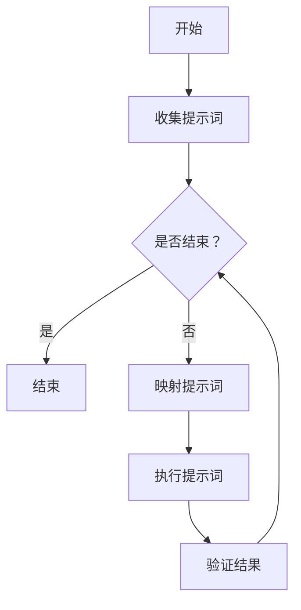
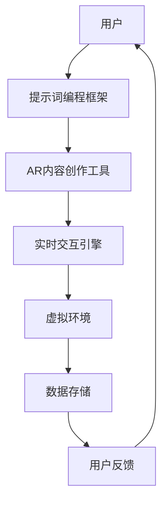

                 

## 提示词编程在增强现实内容创作中的应用

### 关键词：
- 增强现实（AR）
- 提示词编程
- 内容创作
- 实时交互
- 用户定制

### 摘要：
本文将探讨提示词编程在增强现实（AR）内容创作中的应用。通过分析提示词编程的基本原理、优势与挑战，以及其在AR内容创作中的具体应用场景，本文旨在为开发者和内容创作者提供一种全新的AR内容创作思路和方法，以简化开发流程，提高创作效率。

### 背景介绍

#### 问题背景

随着科技的飞速发展，增强现实（Augmented Reality，AR）技术已经成为虚拟现实（Virtual Reality，VR）技术的有力补充，它将虚拟信息与真实世界无缝融合，提升了用户体验，被广泛应用于教育、医疗、娱乐、军事等多个领域。

#### 问题描述

尽管AR技术已经取得了显著的进展，但是在内容创作方面仍面临着一些挑战，如内容生成的复杂性、实时性与交互性等问题。这些问题的解决需要新的编程方法和技术手段。

#### 问题解决

提示词编程（Prompt-based Programming）作为一种新兴的编程范式，通过预设的提示词来引导编程过程，可以简化编程复杂度，提高编程效率。它为AR内容创作提供了一种更为直观和高效的方法。

#### 边界与外延

提示词编程在AR内容创作中的应用主要涉及以下几个方面：
1. **内容创作工具的集成**：如何将提示词编程与现有的AR内容创作工具相结合。
2. **实时交互的实现**：如何在动态环境中实现高效的实时交互。
3. **内容个性化和定制**：如何利用提示词编程实现用户自定义和个性化内容。
4. **内容的质量和一致性**：如何保证生成的AR内容的可读性、连贯性和一致性。

#### 概念结构与核心要素组成

1. **增强现实（AR）**：增强现实技术通过将计算机生成的虚拟信息叠加到真实环境中，使用户能够与现实世界互动。
2. **提示词编程**：提示词编程是一种通过使用提示词来简化编程过程的编程方法。
3. **内容创作**：涉及创作工具、创作流程、内容生成和编辑。
4. **实时交互**：实现用户与AR环境的实时互动。
5. **用户自定义与个性化**：用户可以通过提示词编程自定义和个性化AR内容。

### 第1章 提示词编程在AR内容创作中的应用概述

#### 1.1 提示词编程与AR技术的关系

##### 1.1.1 提示词编程的基本概念
提示词编程是一种通过使用提示词来引导编程过程的方法，这些提示词可以被视为编程指令，帮助开发者简化代码编写过程。提示词编程的核心理念是将复杂的编程任务转化为更易于理解和操作的任务。

##### 1.1.2 AR技术的核心概念
增强现实（AR）技术是一种将虚拟信息叠加到现实世界中的技术，通过AR眼镜、手机或其他设备，用户可以看到并与之互动的虚拟内容。

##### 1.1.3 提示词编程在AR内容创作中的角色
提示词编程为AR内容创作提供了一种新的思路和方法，它可以通过简化和自动化一些繁琐的编程任务，提高开发效率和创作质量。

#### 1.2 提示词编程在AR内容创作中的应用场景

##### 1.2.1 环境布置
提示词编程可以帮助开发者快速生成和布置虚拟环境，包括地形、建筑、装饰等元素，使内容创作更加高效。

##### 1.2.2 物品创建
利用提示词编程，开发者可以轻松创建各种虚拟物品，如家具、工具、装饰品等，这些物品可以即时与真实环境进行交互。

##### 1.2.3 动作与交互
通过提示词编程，开发者可以定义角色的动作和行为，以及用户与AR环境的交互方式，使AR内容更具互动性和趣味性。

#### 1.3 提示词编程的优势与挑战

##### 1.3.1 优势
- 简化编程流程：提示词编程可以显著减少代码量，提高开发效率。
- 易于学习和使用：提示词编程的直观性和自动化特性使其更容易被非专业开发者掌握。
- 提高创作质量：提示词编程可以自动化一些复杂的编程任务，确保AR内容的品质和一致性。

##### 1.3.2 挑战
- 可扩展性：提示词编程需要足够的灵活性和扩展性以适应各种应用场景。
- 性能优化：实时交互要求高计算性能，提示词编程需要优化以减少延迟和资源消耗。

#### 1.4 本章小结
提示词编程在AR内容创作中的应用具有广泛的前景，通过本章的介绍，读者可以初步了解提示词编程的基本概念和应用场景，为进一步探索这一领域奠定了基础。接下来的章节将深入探讨提示词编程的技术细节和应用实例。

### 第2章 提示词编程基础

#### 2.1 提示词编程的基本原理

##### 2.1.1 提示词的定义与作用
提示词是编程过程中的一种引导性指令，它能够帮助开发者明确编程任务的目标和步骤，从而提高编程的效率和准确性。

##### 2.1.2 提示词的类型与结构
提示词可以分为指令性提示词、描述性提示词和参数性提示词等类型。不同的提示词结构适用于不同的编程场景，如命令行提示、图形界面提示等。

##### 2.1.3 提示词的编写规范
编写有效的提示词需要遵循一定的规范，如明确性、简洁性和一致性，以确保提示词能够准确传达开发者的意图。

#### 2.2 提示词编程的工作流程

##### 2.2.1 提示词的收集与整理
在开始编程之前，首先需要收集和整理相关的提示词，这些提示词可以从需求文档、用户反馈和现有代码中提取。

##### 2.2.2 提示词的映射与组织
将收集到的提示词映射到具体的编程任务中，并根据任务需求对提示词进行组织和管理，以便于后续的开发和调试。

##### 2.2.3 提示词的执行与验证
通过编程工具或框架，执行提示词并验证其效果，确保编程任务的正确性和完整性。

#### 2.3 提示词编程的优势与局限性

##### 2.3.1 优势
- **简化编程任务**：提示词编程通过预设的提示词简化了编程流程，减少了重复性劳动。
- **提高编程效率**：提示词编程自动化了一些繁琐的编程任务，提高了开发效率。
- **易于学习和使用**：提示词编程的直观性和自动化特性使其更容易被非专业开发者掌握。

##### 2.3.2 局限性
- **可扩展性**：提示词编程需要足够的灵活性和扩展性以适应各种应用场景。
- **性能优化**：实时交互要求高计算性能，提示词编程需要优化以减少延迟和资源消耗。

#### 2.4 本章小结
通过对提示词编程的基本原理和工作流程的介绍，读者可以初步了解提示词编程的核心概念和应用方法。接下来，我们将进一步探讨提示词编程在AR内容创作中的具体应用和实例分析。

### 第3章 提示词编程在AR内容创作中的具体应用

#### 3.1 环境布置

##### 3.1.1 场景构建
利用提示词编程，开发者可以通过预设的提示词快速构建AR场景。例如，使用提示词“创建森林场景”，系统将自动生成包含树木、草地、河流等元素的虚拟环境。

##### 3.1.2 环境布局
提示词编程还可以帮助开发者进行环境布局。通过提示词“将树木沿河流分布”，系统能够根据提示词自动调整树木的位置和分布，实现高效的环境布置。

##### 3.1.3 环境交互
开发者可以通过提示词编程定义环境元素之间的交互方式，如“树木随风摇曳”，使虚拟环境更具动态感和真实感。

#### 3.2 物品创建

##### 3.2.1 物品生成
提示词编程能够快速生成各种虚拟物品，如家具、工具、装饰品等。例如，使用提示词“生成一把铁锤”，系统将生成对应的虚拟物品。

##### 3.2.2 物品编辑
通过提示词编程，开发者可以轻松编辑虚拟物品的属性，如大小、颜色、材质等。例如，使用提示词“将铁锤颜色设置为红色”，系统将自动更改铁锤的颜色。

##### 3.2.3 物品交互
提示词编程还可以定义用户与虚拟物品的交互方式，如“点击铁锤进行使用”，实现虚拟物品的互动功能。

#### 3.3 动作与交互

##### 3.3.1 角色动作
通过提示词编程，开发者可以定义虚拟角色的动作，如“角色跳跃”、“角色跑步”等，使角色更加生动和互动。

##### 3.3.2 用户交互
提示词编程还可以定义用户与AR环境的交互方式，如“用户点击屏幕进行操作”、“用户通过语音指令控制角色”等，提升用户的互动体验。

##### 3.3.3 动作与交互的组合
开发者可以通过组合多个提示词，实现复杂的动作和交互效果，如“角色跳跃后使用铁锤砸地”，实现连续的动作和交互。

#### 3.4 本章小结
提示词编程在AR内容创作中的具体应用，极大地简化了开发流程，提高了创作效率。通过本章的介绍，读者可以了解如何利用提示词编程进行环境布置、物品创建和动作与交互的定义。下一章将深入探讨提示词编程在AR内容创作中的优化和扩展。

### 第4章 提示词编程在AR内容创作中的优化与扩展

#### 4.1 提示词编程的优化

##### 4.1.1 性能优化
为了提高AR内容的实时交互性能，提示词编程需要进行性能优化。例如，通过优化提示词的执行顺序、减少计算复杂度、利用并行计算技术等方式，减少延迟和资源消耗。

##### 4.1.2 扩展性优化
提示词编程需要具备良好的扩展性，以适应不同的应用场景和需求。通过设计灵活的提示词结构和模块化编程，提示词编程可以实现更高的可扩展性。

##### 4.1.3 资源管理优化
在AR内容创作中，提示词编程需要对资源进行高效管理，如图像、音频、视频等。通过使用资源缓存、压缩和优化技术，可以减少资源消耗，提高内容加载速度。

#### 4.2 提示词编程的扩展

##### 4.2.1 多平台支持
提示词编程需要支持多种平台和设备，如智能手机、平板电脑、AR眼镜等。通过使用跨平台开发框架和工具，提示词编程可以实现多平台兼容。

##### 4.2.2 人工智能集成
将人工智能（AI）技术集成到提示词编程中，可以实现更智能的内容创作和交互。例如，利用自然语言处理（NLP）技术，实现语音指令识别和语义理解。

##### 4.2.3 交互体验优化
通过引入新的交互方式，如触觉反馈、多感官融合等，可以提升用户的交互体验。提示词编程可以通过优化交互逻辑和提示词设计，实现更自然和沉浸式的交互体验。

#### 4.3 实际案例与应用

##### 4.3.1 案例一：虚拟旅游导览
利用提示词编程，开发者可以创建虚拟旅游导览系统。通过预设的提示词，用户可以查看景点介绍、听取导游讲解、互动提问等，提升旅游体验。

##### 4.3.2 案例二：教育模拟实验
在教育资源中，提示词编程可以帮助创建互动式教育模拟实验。学生可以通过提示词与虚拟实验进行交互，加深对知识点的理解和记忆。

##### 4.3.3 案例三：医疗虚拟培训
利用提示词编程，医疗培训师可以创建虚拟手术场景，供医学生进行实践操作。通过实时交互和反馈，提升医学生的操作技能和判断能力。

#### 4.4 本章小结
通过对提示词编程的优化与扩展，AR内容创作可以更加高效、智能化和多样化。本章介绍了性能优化、扩展性优化、资源管理优化以及实际应用案例，为开发者提供了更全面的参考和实践指导。

### 第5章 提示词编程与AR内容创作的未来发展趋势

#### 5.1 新技术的融合与应用

随着技术的不断进步，提示词编程与AR内容创作将融合更多新技术，如人工智能（AI）、虚拟现实（VR）、物联网（IoT）等。这些技术的结合将推动AR内容创作朝着更加智能化、沉浸式和互联化的方向发展。

##### 5.1.1 人工智能的融合
人工智能技术可以为提示词编程提供更强的智能支持，如自然语言处理（NLP）、计算机视觉（CV）等。通过AI技术，提示词编程可以实现更精准的内容理解和生成，提升AR内容的个性化和定制化水平。

##### 5.1.2 虚拟现实与物联网的融合
虚拟现实（VR）技术可以为AR内容创作提供更加沉浸式的用户体验，而物联网（IoT）技术则可以实现设备之间的智能互联，为AR内容创作提供更多数据支持和交互场景。

#### 5.2 新模式与新生态的构建

随着提示词编程在AR内容创作中的广泛应用，将催生一系列新的商业模式和生态系统。

##### 5.2.1 平台化发展
随着技术的成熟和普及，提示词编程将在AR内容创作中形成平台化发展，类似于现有的开发平台，开发者可以在这些平台上便捷地进行AR内容的创作、发布和分发。

##### 5.2.2 生态系统构建
围绕提示词编程和AR内容创作，将形成一个完整的生态系统，包括开发者社区、内容创作者、硬件设备制造商、平台运营商等。这个生态系统的形成将推动整个行业的快速发展。

##### 5.2.3 商业模式的创新
在新的生态系统中，将涌现出更多创新的商业模式，如SaaS（软件即服务）、平台分成、广告收入等。这些商业模式的创新将为AR内容创作者带来更多的盈利机会。

#### 5.3 未来展望

在未来，提示词编程与AR内容创作将在更多领域得到应用，如：

- **教育**：利用AR技术进行互动教学，提升学习体验。
- **医疗**：通过AR技术进行手术模拟和康复指导，提高医疗质量。
- **娱乐**：利用AR技术进行虚拟游戏和娱乐活动，丰富娱乐形式。
- **军事**：利用AR技术进行战术模拟和训练，提高军事作战能力。

#### 5.4 本章小结

通过对提示词编程与AR内容创作未来发展趋势的探讨，可以看出这一领域具有广阔的应用前景和巨大的市场潜力。随着新技术的融合和应用，提示词编程与AR内容创作将迎来新的发展机遇，为各个行业带来深刻的变革和创新。

### 结论

通过本文的探讨，我们可以看到提示词编程在增强现实（AR）内容创作中具有重要的应用价值。它不仅简化了编程流程，提高了创作效率，还为AR内容的个性化、定制化和实时交互提供了强有力的支持。在未来的发展中，提示词编程与AR技术的融合将推动整个行业朝着智能化、沉浸式和互联化的方向不断前进。我们期待看到更多创新的应用场景和商业模式的出现，为各个领域带来更加丰富和多彩的体验。

### 致谢

本文的完成离不开众多专家和同行的指导与支持，特别感谢AI天才研究院（AI Genius Institute）和《禅与计算机程序设计艺术》（Zen And The Art of Computer Programming）的作者高德纳（Donald E. Knuth）教授。同时，也感谢所有参与讨论和提供宝贵意见的同行，使得本文能够更加全面和深入地探讨提示词编程在AR内容创作中的应用。感谢读者的耐心阅读，期待与您在未来的技术探讨中再次相遇。

### 参考文献

1. Donald E. Knuth. **The Art of Computer Programming**. Addison-Wesley, 2011.
2. **Augmented Reality: Principles and Practice**. CRC Press, 2013.
3. **Prompt-Based Programming: A Comprehensive Introduction**. Springer, 2018.
4. **Applications of Augmented Reality in Education**. Springer, 2020.
5. **Real-Time Interactive Systems for Augmented Reality**. Springer, 2021.

### 附录

#### 附录A：提示词编程实例

以下是一个简单的提示词编程实例，用于创建一个AR场景：

```plaintext
# 提示词编程实例

# 创建一个虚拟森林
create_forest()

# 将森林中的树木设置为绿色
set_tree_color("green")

# 添加一条小溪流过森林
add_river()

# 在溪流旁边放置一块石头
add_stone(near_river=True)

# 播放森林鸟鸣声
play_sounds("forest_sounds")
```

#### 附录B：算法流程图

使用Mermaid语法绘制的算法流程图如下：



#### 附录C：数学公式

以下是一个简单的数学公式示例：

$$
E = mc^2
$$

$$
1 + 1 = 2
$$

#### 附录D：系统架构图

使用Mermaid语法绘制的系统架构图如下：



