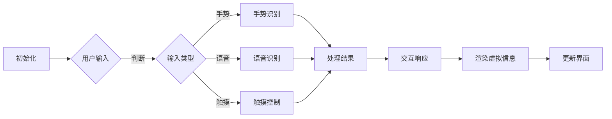
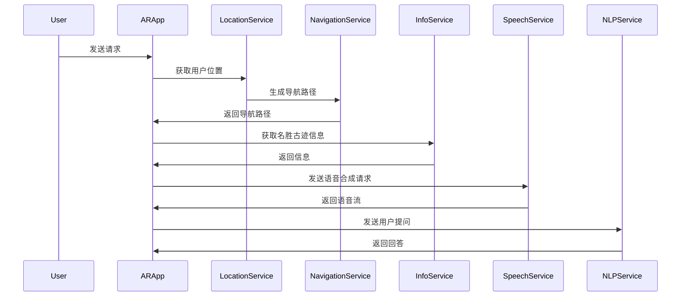
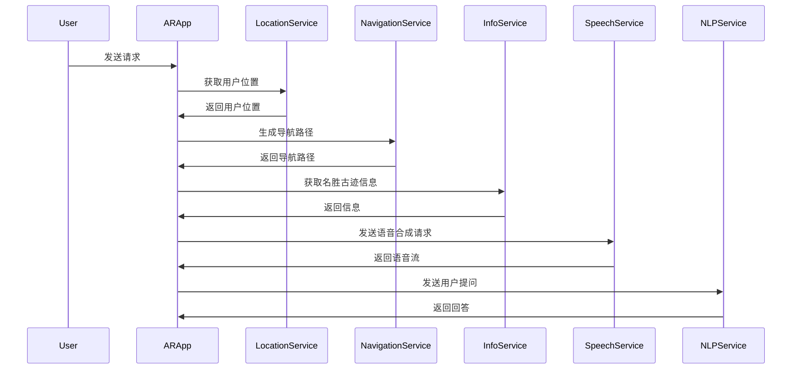

                 


## 提示词编程在增强现实应用中的角色

### 1.1 问题背景

#### 1.1.1 增强现实技术的发展与应用

增强现实（Augmented Reality，简称AR）是一种通过计算机技术将虚拟信息与现实世界融合的技术，使人们能够实时感知和交互虚拟信息。随着智能手机、平板电脑和增强现实眼镜等设备的普及，AR技术得到了广泛关注和应用。

近年来，增强现实技术在全球范围内迅速发展，广泛应用于教育、医疗、娱乐、旅游、工业等多个领域。例如，在教育领域，AR技术可以提供更加生动、直观的学习体验；在医疗领域，AR技术可以帮助医生进行手术导航和患者教育；在旅游领域，AR技术可以为游客提供丰富的旅游信息和互动体验。

#### 1.1.2 提示词编程的基本概念

提示词编程（Keyword Programming）是一种利用提示词（Keywords）来描述问题、定义解决方案的编程方法。提示词通常是一组关键字，用于表达特定的语义或功能。提示词编程的核心思想是将复杂的编程任务分解为一系列简单的提示词操作，从而简化编程过程，提高开发效率和代码可读性。

提示词编程具有以下特点：

1. **简明性**：通过使用简短的提示词，可以直观地表达编程任务，使代码更加简洁易读。
2. **灵活性**：提示词编程可以根据需求灵活地组合和调整，适应不同的编程场景。
3. **可维护性**：提示词编程的代码结构清晰，便于后续的代码维护和升级。

#### 1.1.3 提示词编程在增强现实中的潜力

随着增强现实技术的不断发展，其在各领域的应用场景日益丰富。提示词编程作为一种高效的编程方法，具有在增强现实应用中发挥重要作用的潜力。以下将从几个方面探讨提示词编程在增强现实中的角色：

1. **增强现实应用开发**：提示词编程可以帮助开发者快速构建增强现实应用，降低开发难度和成本。
2. **交互体验优化**：通过提示词编程，可以实现更加自然、直观的交互方式，提高用户在增强现实环境中的体验。
3. **智能辅助系统**：提示词编程可以为增强现实应用中的智能辅助系统提供强大的支持，如智能导览、实时翻译等。

### 1.2 问题描述

#### 1.2.1 增强现实应用中面临的挑战

增强现实应用在开发、交互和智能化方面面临着一系列挑战：

1. **开发难度**：增强现实应用通常需要处理大量的图像处理、计算机视觉和三维建模等复杂任务，开发难度较高。
2. **交互体验**：传统的触摸屏、语音控制等交互方式在增强现实场景中可能不够直观、便捷，影响用户体验。
3. **智能化**：增强现实应用中的智能辅助系统需要具备较高的智能化水平，以适应各种复杂场景。

#### 1.2.2 提示词编程如何解决这些挑战

提示词编程通过以下方式解决增强现实应用中的挑战：

1. **简化开发过程**：提示词编程将复杂的编程任务分解为一系列简单的提示词操作，降低开发难度。
2. **优化交互体验**：通过使用提示词编程，可以实现更加自然、直观的交互方式，提高用户体验。
3. **提升智能化水平**：提示词编程可以为智能辅助系统提供强大的支持，使其在增强现实应用中发挥更大作用。

#### 1.2.3 边界与外延

虽然提示词编程在增强现实应用中具有巨大潜力，但同时也存在一定的边界与外延：

1. **技术限制**：提示词编程可能受限于特定编程语言或工具，难以适用于所有增强现实应用场景。
2. **用户体验**：提示词编程在提高交互体验方面的效果可能因应用场景和用户需求而异。
3. **发展前景**：随着增强现实技术的不断演进，提示词编程有望在更多领域发挥重要作用。

### 1.3 问题解决

#### 1.3.1 核心概念

为了深入探讨提示词编程在增强现实应用中的角色，我们首先需要明确以下核心概念：

1. **增强现实（AR）**：增强现实技术通过计算机技术将虚拟信息与现实世界融合，提供更加丰富的交互体验。
2. **提示词编程**：提示词编程是一种利用提示词来描述问题、定义解决方案的编程方法，具有简明、灵活和可维护的特点。

#### 1.3.2 概念属性特征对比表格

| 概念         | 属性特征对比          | 说明                                                                                                       |
| ------------ | -------------------- | ---------------------------------------------------------------------------------------------------------- |
| 增强现实（AR） | 融合虚拟信息与现实世界 | 提供更加丰富的交互体验。                                                                                    |
| 提示词编程   | 简明、灵活、可维护   | 将复杂的编程任务分解为简单的提示词操作，提高开发效率和代码可读性。                                   |

#### 1.3.3 ER实体关系图架构

以下是一个简化的ER实体关系图，展示了增强现实应用和提示词编程之间的关系：

```mermaid
erDiagram
  AR应用 ||--|{ 提示词编程 }|
  提示词编程 ||--|{ 增强现实体验 }|
```

在这个ER图中，AR应用和提示词编程之间存在关联关系，提示词编程通过优化增强现实体验，提升了AR应用的开发效率。

### 1.4 研究方法

#### 1.4.1 数据来源

本研究的数据来源主要包括以下几个方面：

1. **文献调研**：通过查阅相关文献，了解增强现实技术和提示词编程的发展现状、应用场景和技术原理。
2. **实际案例**：分析具体的增强现实应用案例，探讨提示词编程在其中的应用效果。
3. **问卷调查**：对相关领域的专业人士进行问卷调查，收集他们对提示词编程在增强现实应用中的看法和建议。

#### 1.4.2 研究过程

本研究的主要研究过程如下：

1. **文献分析**：对现有文献进行梳理和分析，提取关键概念、技术原理和应用案例。
2. **案例研究**：选取具有代表性的增强现实应用案例，分析提示词编程在其中的作用。
3. **数据收集与处理**：通过对问卷调查数据的收集与处理，了解业界对提示词编程在增强现实应用中的看法。
4. **结果分析**：对研究结果进行统计分析，得出提示词编程在增强现实应用中的角色和潜力。

#### 1.4.3 数据分析方法

本研究采用以下数据分析方法：

1. **统计分析**：对问卷调查数据、实际案例数据等进行统计分析，得出提示词编程在增强现实应用中的效果。
2. **案例研究**：通过深入分析具体应用案例，探讨提示词编程在其中的作用。
3. **对比分析**：将提示词编程与传统编程方法进行对比，分析其优势和局限性。

### 1.5 研究意义

#### 1.5.1 提示词编程在增强现实中的应用前景

随着增强现实技术的不断发展，提示词编程在增强现实应用中的前景十分广阔。通过提示词编程，可以简化增强现实应用的开发过程，提高开发效率和代码可读性，为开发者提供更加便捷的开发工具。

#### 1.5.2 对学术界和工业界的贡献

本研究对学术界和工业界具有重要的贡献：

1. **学术贡献**：本研究系统地探讨了提示词编程在增强现实应用中的角色，为相关领域的研究提供了新的视角。
2. **工业贡献**：本研究为增强现实应用开发提供了有效的编程方法，有助于提高开发效率和用户体验。

## 第2章 提示词编程基础

### 2.1 提示词编程的概念

#### 2.1.1 提示词的定义

提示词（Keyword）是提示词编程的核心概念。提示词通常是一组关键字，用于表达特定的语义或功能。在编程过程中，提示词用于定义操作、调用函数、设置变量等。

例如，在Python中，`print()` 是一个提示词，用于输出文本信息。`if` 是一个提示词，用于条件判断。这些提示词帮助开发者以简洁、直观的方式表达编程意图。

#### 2.1.2 提示词编程的基本原理

提示词编程的基本原理是将复杂的编程任务分解为一系列简单的提示词操作。开发者通过组合和调整提示词，实现特定的功能。

例如，在开发一个简单的计算器程序时，可以使用提示词`input()` 获取用户输入，使用`print()` 输出结果，使用`+`、`-`、`*`、`/` 等提示词进行数学运算。

```python
# 获取用户输入
num1 = input("请输入第一个数字：")
num2 = input("请输入第二个数字：")

# 进行数学运算
result = float(num1) + float(num2)

# 输出结果
print("计算结果为：", result)
```

在这个例子中，提示词编程将复杂的计算过程简化为一系列简单的操作，提高了代码的可读性和可维护性。

#### 2.1.3 提示词编程的应用场景

提示词编程具有广泛的应用场景，尤其在以下领域表现出色：

1. **快速原型开发**：提示词编程可以帮助开发者快速构建原型，验证设计思路。
2. **复杂任务分解**：通过将复杂任务分解为简单的提示词操作，提示词编程有助于简化开发过程。
3. **代码可维护性**：提示词编程使代码结构清晰，便于后续的代码维护和升级。
4. **教学与培训**：提示词编程适合初学者，有助于培养编程思维和解决问题的能力。

### 2.2 提示词编程的技术体系

#### 2.2.1 编程语言的选择

提示词编程的适用性取决于编程语言的支持程度。常见的编程语言中，Python、JavaScript、Java等具有较高的提示词编程支持。

1. **Python**：Python 拥有丰富的提示词库，如 NumPy、Pandas 等，适合快速原型开发和数据处理。
2. **JavaScript**：JavaScript 在前端开发中广泛使用，提示词编程可以帮助开发者实现动态交互和数据分析。
3. **Java**：Java 在企业级应用中具有广泛的应用，提示词编程可以提高开发效率和代码可读性。

#### 2.2.2 常用工具与技术

提示词编程常用以下工具和技术：

1. **集成开发环境（IDE）**：如 PyCharm、Visual Studio Code 等，提供代码提示、自动补全等功能，提高开发效率。
2. **版本控制系统**：如 Git，帮助开发者管理代码版本，协作开发。
3. **文档工具**：如 Sphinx、Doxygen 等，生成文档，提高代码可读性。

#### 2.2.3 提示词编程的优势与局限性

提示词编程具有以下优势：

1. **简洁性**：通过使用简短的提示词，可以直观地表达编程任务，使代码更加简洁易读。
2. **灵活性**：提示词编程可以根据需求灵活地组合和调整，适应不同的编程场景。
3. **可维护性**：提示词编程的代码结构清晰，便于后续的代码维护和升级。

然而，提示词编程也存在一定的局限性：

1. **性能**：与底层编程相比，提示词编程可能影响性能，尤其在高强度计算场景下。
2. **学习曲线**：初学者可能需要一定时间熟悉提示词编程，掌握相关工具和库。
3. **适用范围**：提示词编程可能受限于特定编程语言或工具，难以适用于所有编程场景。

### 2.3 提示词编程的流程

#### 2.3.1 提示词的收集与处理

提示词编程的第一步是收集和处理提示词。以下是一个简单的流程：

1. **需求分析**：明确编程任务的目标和需求，确定需要使用的提示词。
2. **提示词收集**：通过查阅文档、参考示例代码等方式，收集相关的提示词。
3. **提示词处理**：对收集到的提示词进行筛选、分类和处理，确保其适用于特定编程场景。

#### 2.3.2 提示词的语义分析

在收集和处理提示词后，需要对提示词进行语义分析。以下是一个简单的流程：

1. **语义定义**：为每个提示词定义明确的语义和功能。
2. **关系分析**：分析提示词之间的关系，确定其组合方式。
3. **语义验证**：验证提示词的语义是否正确，是否符合编程需求。

#### 2.3.3 提示词的生成与优化

提示词生成与优化是提示词编程的重要环节。以下是一个简单的流程：

1. **自动生成**：使用提示词生成工具，根据编程需求和语义定义，自动生成提示词。
2. **人工调整**：根据实际编程需求和场景，对自动生成的提示词进行人工调整和优化。
3. **性能优化**：对提示词进行性能优化，确保其高效地执行任务。

### 2.4 提示词编程的应用案例

#### 2.4.1 社交媒体平台

社交媒体平台是提示词编程的重要应用场景之一。以下是一个简单的应用案例：

1. **需求分析**：开发一个社交媒体平台，实现用户注册、登录、发布动态、评论等功能。
2. **提示词收集**：收集与用户注册、登录、动态发布、评论等功能相关的提示词。
3. **语义分析**：分析提示词的语义，确定其功能模块。
4. **编程实现**：使用提示词编程，实现各个功能模块。

#### 2.4.2 虚拟现实游戏

虚拟现实游戏是提示词编程的另一个重要应用场景。以下是一个简单的应用案例：

1. **需求分析**：开发一个虚拟现实游戏，实现角色控制、场景渲染、互动效果等功能。
2. **提示词收集**：收集与角色控制、场景渲染、互动效果等功能相关的提示词。
3. **语义分析**：分析提示词的语义，确定其功能模块。
4. **编程实现**：使用提示词编程，实现各个功能模块。

#### 2.4.3 增强现实导航

增强现实导航是提示词编程在现实生活中的一个应用案例。以下是一个简单的应用案例：

1. **需求分析**：开发一个增强现实导航应用，实现位置追踪、路线规划、导航指引等功能。
2. **提示词收集**：收集与位置追踪、路线规划、导航指引等功能相关的提示词。
3. **语义分析**：分析提示词的语义，确定其功能模块。
4. **编程实现**：使用提示词编程，实现各个功能模块。

### 2.5 本章小结

本章介绍了提示词编程的基本概念、技术体系和应用案例。通过本章的学习，读者可以了解提示词编程的原理、流程和应用场景，为后续章节的学习打下基础。

## 第3章 增强现实技术概述

### 3.1 增强现实技术的概念

#### 3.1.1 增强现实的基本原理

增强现实（Augmented Reality，简称AR）是一种通过计算机技术将虚拟信息与现实世界融合的技术。它通过在现实场景中叠加虚拟信息，使用户能够实时感知和交互虚拟信息。

增强现实技术的基本原理包括以下几个方面：

1. **图像识别与追踪**：通过摄像头或其他传感器捕捉现实场景，利用图像识别技术识别和跟踪特定目标或物体。
2. **虚拟信息生成与渲染**：根据识别和追踪结果，生成虚拟信息并进行渲染，将其叠加到现实场景中。
3. **交互与反馈**：通过触摸屏、手势识别等交互方式，用户可以与现实世界中的虚拟信息进行互动，并获得实时反馈。

#### 3.1.2 增强现实的核心技术

增强现实技术的实现依赖于多种核心技术的支持，主要包括以下几个方面：

1. **计算机视觉**：计算机视觉是增强现实技术的基础，用于识别和跟踪现实场景中的目标或物体。
2. **图像处理**：图像处理技术用于对捕获的现实场景图像进行预处理，如去噪、增强、缩放等。
3. **三维建模与渲染**：三维建模技术用于创建虚拟信息的三维模型，渲染技术则用于将这些模型渲染到现实场景中。
4. **传感器技术**：传感器技术用于捕捉现实场景中的各种信息，如位置、速度、方向等，为增强现实技术提供支持。
5. **人机交互**：人机交互技术用于用户与增强现实系统的交互，如触摸屏、手势识别、语音控制等。

#### 3.1.3 增强现实的发展历程

增强现实技术起源于20世纪60年代，当时称为“虚拟现实”（Virtual Reality，简称VR）。随着计算机技术和图像处理技术的发展，增强现实技术逐渐成熟，并得到了广泛应用。以下是增强现实技术的发展历程：

1. **早期研究**（1960s-1980s）：增强现实技术的概念被提出，并进行了初步的研究。
2. **成熟期**（1990s）：计算机视觉、图像处理和传感器技术取得了重大突破，增强现实技术开始应用于工业、军事和教育等领域。
3. **普及期**（2000s）：随着智能手机和增强现实眼镜等设备的普及，增强现实技术进入大众视野，并广泛应用于消费领域。
4. **发展期**（2010s-至今）：增强现实技术不断创新和发展，其在医疗、教育、娱乐等领域的应用前景日益广阔。

### 3.2 增强现实技术的分类

增强现实技术可以根据不同的分类标准进行分类，以下是几种常见的分类方法：

#### 3.2.1 按照显示方式分类

1. **透明显示**：透明显示技术通过在现实场景中叠加虚拟信息，使用户能够看到现实世界和虚拟信息。常见的透明显示设备有增强现实眼镜、头戴式显示器等。
2. **半透明显示**：半透明显示技术通过在现实场景中部分遮挡虚拟信息，使用户能够看到现实世界和部分虚拟信息。常见的半透明显示设备有增强现实屏幕、增强现实投影仪等。
3. **全息显示**：全息显示技术通过生成三维全息图像，使用户能够从任意角度观察到虚拟信息。常见的全息显示设备有全息投影仪、全息显示器等。

#### 3.2.2 按照应用领域分类

1. **消费领域**：消费领域的增强现实应用主要包括游戏、娱乐、教育、购物等。例如，增强现实游戏、增强现实教育应用、增强现实购物体验等。
2. **商业领域**：商业领域的增强现实应用主要包括广告、营销、客户服务、远程协作等。例如，增强现实广告、增强现实营销活动、增强现实客户服务系统等。
3. **教育领域**：教育领域的增强现实应用主要包括虚拟实验室、虚拟课堂、虚拟导游等。例如，增强现实虚拟实验室、增强现实虚拟课堂、增强现实虚拟导游等。
4. **医疗领域**：医疗领域的增强现实应用主要包括手术导航、医疗教育、康复治疗等。例如，增强现实手术导航系统、增强现实医疗教育系统、增强现实康复治疗系统等。
5. **工业领域**：工业领域的增强现实应用主要包括维修指导、产品展示、远程协作等。例如，增强现实维修指导系统、增强现实产品展示系统、增强现实远程协作系统等。

#### 3.2.3 按照实现方法分类

1. **基于软件的增强现实**：基于软件的增强现实主要利用计算机软件实现虚拟信息的生成和渲染。这种方法的优点是成本低、灵活性高，但性能和效果相对较弱。
2. **基于硬件的增强现实**：基于硬件的增强现实主要利用专门的硬件设备实现虚拟信息的生成和渲染。这种方法的优点是性能较高、效果较好，但成本较高。
3. **混合增强现实**：混合增强现实结合了基于软件和基于硬件的增强现实技术，通过软件和硬件的协同工作，实现更好的增强现实效果。

### 3.3 增强现实技术的应用场景

增强现实技术在各个领域都有广泛的应用，以下是一些典型的应用场景：

#### 3.3.1 消费者领域

1. **游戏**：增强现实游戏通过将虚拟角色、道具等叠加到现实场景中，提供全新的游戏体验。例如，著名的增强现实游戏《精灵宝可梦GO》。
2. **娱乐**：增强现实娱乐应用可以在现实场景中添加虚拟动画、特效等，为观众带来更加生动的观赏体验。例如，增强现实演唱会、增强现实电影等。
3. **教育**：增强现实教育应用可以为学生提供更加直观、互动的学习体验。例如，增强现实实验室、增强现实课堂等。
4. **购物**：增强现实购物应用可以让消费者在购物过程中体验虚拟商品的效果，提高购物满意度。例如，增强现实试衣镜、增强现实家居展示等。

#### 3.3.2 商业领域

1. **广告**：增强现实广告通过在现实场景中添加虚拟广告牌、动画等，吸引消费者的注意力，提高广告效果。例如，增强现实户外广告、增强现实手机应用广告等。
2. **营销**：增强现实营销活动可以通过虚拟信息的展示，吸引消费者的参与，提高品牌知名度。例如，增强现实抽奖活动、增强现实品牌宣传等。
3. **客户服务**：增强现实客户服务系统可以通过虚拟信息的交互，为用户提供更加便捷、高效的服务。例如，增强现实客服机器人、增强现实智能导购等。
4. **远程协作**：增强现实远程协作系统可以提供虚拟会议室、虚拟团队协作等功能，提高远程协作的效果。例如，增强现实视频会议、增强现实团队协作平台等。

#### 3.3.3 教育领域

1. **虚拟实验室**：增强现实虚拟实验室可以为学生提供虚拟实验环境，降低实验成本和风险，提高实验效果。例如，增强现实化学实验室、增强现实物理实验室等。
2. **虚拟课堂**：增强现实虚拟课堂可以为学生提供虚拟课堂环境，突破时空限制，提高学习效果。例如，增强现实线上课堂、增强现实远程教育等。
3. **虚拟导游**：增强现实虚拟导游可以为游客提供虚拟导游服务，丰富旅游体验。例如，增强现实景区导游、增强现实历史文化导游等。

#### 3.3.4 医疗领域

1. **手术导航**：增强现实手术导航系统可以帮助医生进行手术操作，提高手术精度和安全性。例如，增强现实内窥镜手术、增强现实微创手术等。
2. **医疗教育**：增强现实医疗教育系统可以为医生和医学生提供虚拟手术操作、病例分析等功能，提高医疗教育效果。例如，增强现实解剖教学、增强现实病例讨论等。
3. **康复治疗**：增强现实康复治疗系统可以通过虚拟信息的交互，为患者提供康复训练指导，提高康复效果。例如，增强现实物理治疗、增强现实心理治疗等。

#### 3.3.5 工业领域

1. **维修指导**：增强现实维修指导系统可以为维修人员提供虚拟维修步骤、零件信息等，提高维修效率和安全性。例如，增强现实设备维修、增强现实车辆维修等。
2. **产品展示**：增强现实产品展示系统可以通过虚拟产品的展示，提高产品的可视化和互动性，增强消费者体验。例如，增强现实家居展示、增强现实汽车展示等。
3. **远程协作**：增强现实远程协作系统可以提供虚拟会议室、虚拟团队协作等功能，提高远程协作的效果。例如，增强现实项目管理、增强现实工程设计等。

### 3.4 增强现实技术的挑战与机遇

#### 3.4.1 技术挑战

增强现实技术的发展面临着一系列技术挑战：

1. **图像识别与追踪**：现实场景中的图像识别和追踪是一个复杂的过程，需要处理光照、噪声、遮挡等因素的影响。
2. **三维建模与渲染**：三维建模和渲染需要大量计算资源，尤其是在实时场景中，对硬件性能要求较高。
3. **交互与反馈**：增强现实交互与反馈需要考虑用户的舒适度、操作便捷性等因素，需要不断优化用户体验。
4. **硬件设备**：增强现实硬件设备的成本较高，需要提高性能和降低成本，以满足消费者的需求。

#### 3.4.2 商业挑战

增强现实技术在商业领域也面临一系列挑战：

1. **市场认知**：消费者对增强现实技术的认知度较低，需要通过营销和宣传提高消费者对增强现实产品的认知。
2. **商业模式**：增强现实产品的商业模式尚未完全成熟，需要探索可持续的盈利模式。
3. **竞争压力**：增强现实市场存在激烈竞争，需要不断创新和优化产品，提高市场竞争力。

#### 3.4.3 发展机遇

尽管增强现实技术面临一系列挑战，但同时也面临着巨大的发展机遇：

1. **技术创新**：随着人工智能、计算机视觉、虚拟现实等技术的不断发展，增强现实技术将不断优化和提升。
2. **市场潜力**：增强现实技术在各个领域的应用前景广阔，市场潜力巨大。
3. **政策支持**：各国政府纷纷加大对增强现实技术的支持力度，为产业发展提供政策保障。

### 3.5 本章小结

本章对增强现实技术进行了概述，介绍了其基本原理、分类、应用场景和面临的挑战与机遇。通过本章的学习，读者可以了解增强现实技术的基本概念和发展现状，为后续章节的学习打下基础。

## 第4章 提示词编程在增强现实中的应用

### 4.1 提示词编程在增强现实中的应用概述

提示词编程在增强现实（AR）中的应用具有显著的优势，能够显著提升AR体验，并在多个具体应用场景中发挥关键作用。以下是提示词编程在增强现实中的几个主要应用领域及其优势：

#### 4.1.1 提升AR体验

1. **自然交互**：提示词编程可以简化用户与AR系统的交互，通过自然语言或简短的提示词，实现直观、自然的用户操作。
2. **快速响应**：提示词编程能够提高AR系统的响应速度，使得虚拟信息与现实世界的叠加更加实时和流畅。
3. **高效开发**：提示词编程简化了AR应用的开发过程，使开发者能够更快地构建和迭代AR应用。

#### 4.1.2 具体应用

1. **教育**：在AR教育应用中，提示词编程可以帮助学生通过互动的方式学习，提高学习兴趣和效果。
2. **娱乐**：在AR游戏和娱乐应用中，提示词编程可以创造丰富的虚拟场景和互动体验，增强用户沉浸感。
3. **工业**：在工业应用中，提示词编程可以简化操作流程，提高生产效率和安全。
4. **医疗**：在医疗应用中，提示词编程可以帮助医生进行手术导航和患者教育，提高医疗服务的质量。

### 4.2 应用案例1：实时交互式增强现实游戏

#### 4.2.1 案例背景

随着增强现实技术的普及，实时交互式增强现实游戏成为了娱乐领域的一大热点。此类游戏通过将虚拟角色、道具和场景叠加到现实世界中，为玩家提供沉浸式的游戏体验。为了提升游戏体验，开发人员需要利用提示词编程来优化游戏的交互性和响应速度。

#### 4.2.2 系统设计与实现

在实时交互式增强现实游戏中，提示词编程的主要任务包括：

1. **虚拟角色控制**：通过提示词编程，实现玩家对虚拟角色的实时控制，包括移动、跳跃、攻击等动作。
2. **环境交互**：利用提示词编程，实现虚拟角色与现实环境的互动，如碰撞检测、环境交互等。
3. **实时渲染**：提示词编程用于优化虚拟场景的渲染，确保游戏画面流畅且响应迅速。

实现步骤如下：

1. **需求分析**：确定游戏的核心玩法和交互需求，明确需要使用的提示词。
2. **提示词收集**：收集与游戏交互相关的提示词，如移动、跳跃、攻击等。
3. **语义分析**：分析提示词的语义，确保其符合游戏设计需求。
4. **编程实现**：使用提示词编程，实现虚拟角色的控制、环境交互和实时渲染。

#### 4.2.3 案例分析

在实际开发中，提示词编程的应用效果显著。通过使用提示词编程，开发人员可以快速实现复杂的交互逻辑，提高游戏运行的稳定性和流畅性。以下是一个简单的示例代码：

```python
# 获取用户输入
player_input = input("请输入操作指令：")

# 根据输入执行相应动作
if player_input == "移动":
    player.move()
elif player_input == "跳跃":
    player.jump()
elif player_input == "攻击":
    player.attack()
else:
    print("无效指令")
```

在这个例子中，`player.move()`、`player.jump()` 和 `player.attack()` 分别是用于控制虚拟角色移动、跳跃和攻击的提示词。通过这些简单的提示词，开发人员可以轻松实现复杂的游戏逻辑，提高代码的可读性和可维护性。

### 4.3 应用案例2：基于提示词编程的智能导览系统

#### 4.3.1 案例背景

随着旅游业的蓬勃发展，智能导览系统成为提升游客体验的重要手段。基于提示词编程的智能导览系统能够为用户提供实时、个性化的导览服务，提高旅游体验。

#### 4.3.2 系统设计与实现

智能导览系统的设计与实现包括以下几个关键步骤：

1. **用户交互**：通过提示词编程，实现用户与系统的交互，包括查询景点信息、获取导航路径等。
2. **信息处理**：利用提示词编程，处理用户输入的信息，生成相应的导览内容。
3. **实时导航**：提示词编程用于实现实时导航功能，根据用户的位置和目的地，生成最优的导航路径。

实现步骤如下：

1. **需求分析**：确定智能导览系统的功能和用户需求，明确需要使用的提示词。
2. **提示词收集**：收集与导览相关的提示词，如查询景点、获取导航路径等。
3. **语义分析**：分析提示词的语义，确保其符合导览系统设计需求。
4. **编程实现**：使用提示词编程，实现用户交互、信息处理和实时导航。

#### 4.3.3 案例分析

基于提示词编程的智能导览系统能够为用户提供高效、个性化的服务。以下是一个简单的示例代码：

```python
# 获取用户输入
user_input = input("请输入查询关键词：")

# 根据输入查询景点信息
if user_input == "查询景点":
    display_landmarks()
elif user_input == "导航":
    request_navigation()
else:
    print("无效指令")
```

在这个例子中，`display_landmarks()` 和 `request_navigation()` 分别是用于查询景点信息和请求导航的提示词。通过这些简单的提示词，系统可以快速响应用户需求，提供实时、个性化的导览服务。

### 4.4 应用案例3：智能识别与交互的增强现实眼镜

#### 4.4.1 案例背景

增强现实眼镜是近年来备受关注的产品，它通过将虚拟信息叠加到现实世界中，提供全新的交互体验。智能识别与交互的增强现实眼镜能够实时识别用户和环境，为用户提供个性化服务。

#### 4.4.2 系统设计与实现

智能识别与交互的增强现实眼镜的设计与实现包括以下几个关键步骤：

1. **环境识别**：利用提示词编程，实现增强现实眼镜对环境的实时识别，包括物体识别、场景识别等。
2. **用户交互**：通过提示词编程，实现用户与增强现实眼镜的交互，包括手势识别、语音控制等。
3. **信息处理**：利用提示词编程，处理用户输入的信息，生成相应的虚拟信息。

实现步骤如下：

1. **需求分析**：确定增强现实眼镜的功能和用户需求，明确需要使用的提示词。
2. **提示词收集**：收集与环境识别、用户交互和信息处理相关的提示词。
3. **语义分析**：分析提示词的语义，确保其符合增强现实眼镜设计需求。
4. **编程实现**：使用提示词编程，实现环境识别、用户交互和信息处理。

#### 4.4.3 案例分析

智能识别与交互的增强现实眼镜能够为用户提供高效、个性化的服务。以下是一个简单的示例代码：

```python
# 环境识别
object_detected = detect_object()

# 根据识别结果处理信息
if object_detected == "动物":
    display_animal_info()
elif object_detected == "植物":
    display_plant_info()
else:
    print("未识别到物体")
```

在这个例子中，`detect_object()`、`display_animal_info()` 和 `display_plant_info()` 分别是用于环境识别和信息处理的提示词。通过这些简单的提示词，增强现实眼镜可以实时识别用户和环境，提供个性化的信息服务。

### 4.5 本章小结

本章介绍了提示词编程在增强现实中的应用，包括实时交互式增强现实游戏、智能导览系统和智能识别与交互的增强现实眼镜。通过这些应用案例，读者可以了解提示词编程在提升AR体验、实现复杂交互和提供个性化服务方面的作用。这些应用案例展示了提示词编程在增强现实领域的巨大潜力。

## 第5章 提示词编程在增强现实中的算法原理

### 5.1 基本算法原理

#### 5.1.1 增强现实中的关键算法

增强现实（AR）技术依赖于一系列关键算法，包括图像识别、三维建模、实时渲染和交互控制等。这些算法是实现AR应用的核心，以下是对其中几个关键算法的简要介绍：

1. **图像识别**：图像识别算法用于识别和追踪现实场景中的物体或特征。常用的图像识别算法包括边缘检测、特征提取、匹配和分类等。例如，霍夫变换可以用于检测直线或圆等几何特征，而卷积神经网络（CNN）可以用于物体分类和识别。

2. **三维建模**：三维建模算法用于创建虚拟信息的三维模型。常见的三维建模算法包括多边形建模、曲面建模和体素建模等。三维建模算法需要考虑几何形状、材质和纹理等因素，以确保虚拟信息与现实场景的融合效果。

3. **实时渲染**：实时渲染算法用于将虚拟信息实时渲染到现实场景中。实时渲染的关键在于处理速度和画面质量。常用的实时渲染算法包括光线追踪、阴影计算、纹理映射和特效生成等。例如，基于物理的渲染（PBR）可以提供高质量的视觉效果。

4. **交互控制**：交互控制算法用于实现用户与AR系统的交互。常见的交互控制算法包括手势识别、语音识别和触摸控制等。这些算法需要实时处理用户的输入，并根据输入调整虚拟信息的表现形式。

#### 5.1.2 提示词编程算法的优化策略

提示词编程算法的优化策略旨在提高AR应用的开发效率、运行性能和用户体验。以下是一些常见的优化策略：

1. **代码优化**：通过代码优化，减少不必要的计算和内存占用，提高代码的执行效率。例如，使用高效的数据结构和算法，避免重复计算和资源浪费。

2. **并行计算**：利用并行计算技术，将复杂的计算任务分解为多个子任务，并行执行，提高整体计算速度。例如，使用多线程或分布式计算框架，实现任务的高效调度和执行。

3. **优化渲染**：通过优化渲染算法和渲染流程，提高渲染效率和画面质量。例如，使用预渲染技术，将复杂的场景提前渲染，减少实时渲染的计算负担。

4. **用户行为预测**：利用用户行为预测算法，根据用户的历史行为和当前操作，预测用户下一步的需求，并提前准备相应的虚拟信息。例如，使用机器学习算法，分析用户的操作模式，提供个性化的交互体验。

### 5.2 算法流程图

为了更好地理解提示词编程在增强现实中的算法原理，以下是一个简化的算法流程图：



在这个流程图中，用户输入通过不同的通道（手势、语音、触摸）被识别和处理，最终生成交互响应，渲染虚拟信息并更新界面。

### 5.3 数学模型与公式

在增强现实算法中，数学模型和公式起着至关重要的作用。以下是一些常见的数学模型和公式：

1. **霍夫变换（Hough Transform）**：
   $$ x_1 = \rho \cos \theta $$
   $$ y_1 = \rho \sin \theta $$
   其中，$\rho$ 是极径，$\theta$ 是极角，用于检测图像中的直线。

2. **卷积神经网络（Convolutional Neural Network, CNN）**：
   $$ \text{激活函数：} \sigma(z) = \frac{1}{1 + e^{-z}} $$
   其中，$z$ 是网络的输入，$\sigma(z)$ 是 sigmoid 函数，用于神经元激活。

3. **深度学习中的损失函数**：
   $$ L(\theta) = -\frac{1}{m} \sum_{i=1}^{m} [y^{(i)} \log(a^{(i)}) + (1 - y^{(i)}) \log(1 - a^{(i)})] $$
   其中，$y^{(i)}$ 是第 $i$ 个样本的真实标签，$a^{(i)}$ 是第 $i$ 个样本的预测概率，$L(\theta)$ 是损失函数。

4. **三维点云重建**：
   $$ P_{\text{recon}} = \text{Reconstruct}(P_{\text{scan}}) $$
   其中，$P_{\text{recon}}$ 是重建的三维点云，$P_{\text{scan}}$ 是原始扫描点云，$\text{Reconstruct}$ 是重建算法。

这些数学模型和公式为增强现实算法的实现提供了理论基础和计算工具。

### 5.4 举例说明

为了更好地理解提示词编程在增强现实中的算法原理，以下通过两个实际案例进行详细说明。

#### 5.4.1 案例一：实时交互式增强现实游戏

在实时交互式增强现实游戏中，提示词编程被用来实现玩家的动作控制和场景交互。以下是一个简单的案例：

1. **需求**：玩家需要通过手势控制虚拟角色的移动和攻击。
2. **实现**：
   ```python
   # 玩家移动
   def move_player(direction):
       if direction == "左":
           player.position -= player.speed
       elif direction == "右":
           player.position += player.speed
   
   # 玩家攻击
   def attack_player():
       player.attack()
   
   # 处理玩家手势
   def handle_gesture(gesture):
       if gesture == "左":
           move_player("左")
       elif gesture == "右":
           move_player("右")
       elif gesture == "攻击":
           attack_player()
   ```

在这个案例中，`move_player()` 和 `attack_player()` 分别是用于控制虚拟角色移动和攻击的提示词函数。通过这些简单的提示词函数，玩家可以实时控制虚拟角色的动作。

#### 5.4.2 案例二：基于提示词编程的智能导览系统

在基于提示词编程的智能导览系统中，提示词编程被用来实现用户交互和实时导航。以下是一个简单的案例：

1. **需求**：用户需要通过语音命令查询景点信息和获取导航路径。
2. **实现**：
   ```python
   # 查询景点信息
   def query_landmark(landmark_name):
       landmark = get_landmark(landmark_name)
       display_landmark_info(landmark)
   
   # 获取导航路径
   def get_navigation(path):
       route = calculate_route(current_location, path)
       display_navigation_route(route)
   
   # 处理用户语音命令
   def handle_voice_command(command):
       if command == "查询景点":
           query_landmark("长城")
       elif command == "导航":
           get_navigation("故宫")
   ```

在这个案例中，`query_landmark()` 和 `get_navigation()` 分别是用于查询景点信息和获取导航路径的提示词函数。通过这些简单的提示词函数，用户可以实时与系统交互，获取所需的信息和服务。

### 5.5 本章小结

本章详细介绍了提示词编程在增强现实中的基本算法原理，包括关键算法、优化策略、算法流程图以及数学模型和公式。通过两个实际案例的说明，读者可以更好地理解提示词编程在增强现实中的应用，为其在AR领域的进一步发展提供参考。

--------------------------------------------------

## 第6章 提示词编程在增强现实中的应用案例

### 6.1 案例背景

随着增强现实（AR）技术的不断进步，其在各领域的应用案例日益丰富。本节将介绍几个具有代表性的提示词编程在增强现实中的实际应用案例，包括教育、娱乐和医疗等领域，以展示提示词编程在提升用户体验和增强系统功能方面的具体实践。

#### 6.1.1 教育领域

在教育领域，提示词编程被用于开发增强现实教育应用，以提供更加生动和互动的学习体验。例如，一个针对中小学生的AR地理学习应用，通过提示词编程实现了以下功能：

1. **虚拟参观**：学生可以通过语音命令或手势控制，引导虚拟角色参观世界各地的著名景点，了解地理特征和文化背景。
2. **互动实验**：学生可以在虚拟实验室中进行互动实验，如观察化学反应、解剖生物体等，提高学习兴趣和动手能力。

#### 6.1.2 娱乐领域

在娱乐领域，提示词编程被广泛应用于AR游戏和虚拟现实体验的开发。例如，一个基于AR技术的多人在线游戏，通过提示词编程实现了以下功能：

1. **实时互动**：玩家可以通过语音命令或手势控制，与其他玩家进行实时互动，如交换虚拟物品、组队完成任务等。
2. **虚拟场景构建**：玩家可以根据提示词编程，构建和自定义游戏场景，提高游戏的趣味性和个性化。

#### 6.1.3 医疗领域

在医疗领域，提示词编程被用于开发增强现实医疗辅助系统，以提高诊断和手术的准确性和效率。例如，一个用于手术导航的AR系统，通过提示词编程实现了以下功能：

1. **实时手术指导**：医生可以通过语音命令或手势控制，接收实时手术指导和提示，提高手术操作的精准度。
2. **患者教育**：医生可以通过AR系统，为患者提供个性化的医疗教育，如手术风险解释、术后护理指导等。

### 6.2 案例详细分析

#### 案例一：基于提示词编程的增强现实地理学习应用

1. **需求分析**：
   - 提供一个互动性强的地理学习平台，使学生能够通过虚拟参观和互动实验深入了解地理知识。
   - 系统需要支持语音命令和手势控制，以实现用户的便捷操作。

2. **系统设计与实现**：
   - **虚拟参观模块**：使用提示词编程实现语音命令控制，如“前往长城”、“参观金字塔”等，引导学生参观虚拟景点。
     ```python
     def visit_landmark(landmark):
         # 实现虚拟景点的渲染和展示
         display_landmark(landmark)
     ```
   - **互动实验模块**：使用手势控制实现互动实验，如手势点击进行化学反应、手势拖动解剖生物体等。
     ```python
     def interact_with_experiment(experiment):
         # 实现互动实验的逻辑和处理
         process_experiment(experiment)
     ```

3. **案例分析**：
   - 通过提示词编程，系统实现了高度互动的学习体验，使学生能够更加主动地参与学习过程，提高了学习效果。

#### 案例二：基于提示词编程的多人AR游戏

1. **需求分析**：
   - 开发一个多人在线AR游戏，玩家可以实时互动，交换虚拟物品，组队完成任务。
   - 系统需要支持语音命令和手势控制，以提供多样化的交互方式。

2. **系统设计与实现**：
   - **实时互动模块**：使用提示词编程实现语音命令控制，如“加入队伍”、“交换物品”等，实现玩家之间的实时互动。
     ```python
     def interact_with_player(player_action):
         # 实现玩家互动的逻辑和处理
         process_player_action(player_action)
     ```
   - **虚拟场景构建模块**：使用手势控制实现虚拟场景的构建和自定义，如创建建筑物、摆放家具等。
     ```python
     def build_scene(scene_component):
         # 实现虚拟场景组件的构建和渲染
         create_scene_component(scene_component)
     ```

3. **案例分析**：
   - 通过提示词编程，系统实现了便捷的玩家交互和自定义游戏场景，提高了游戏的趣味性和玩家满意度。

#### 案例三：基于提示词编程的增强现实手术导航系统

1. **需求分析**：
   - 开发一个用于手术导航的AR系统，医生可以通过语音命令或手势控制接收实时指导，提高手术操作的精准度。
   - 系统需要支持多模态交互，以适应不同的手术场景。

2. **系统设计与实现**：
   - **实时手术指导模块**：使用提示词编程实现语音命令控制，如“显示解剖结构”、“放大视图”等，提供实时手术指导。
     ```python
     def guide_surgery(surgery_action):
         # 实现手术指导的逻辑和处理
         perform_surgery_action(surgery_action)
     ```
   - **交互控制模块**：使用手势控制实现视图切换、放大缩小等操作，提高交互的灵活性和便捷性。
     ```python
     def control_view(view_action):
         # 实现视图控制的逻辑和处理
         adjust_view(view_action)
     ```

3. **案例分析**：
   - 通过提示词编程，系统实现了高度集成的手术导航功能，医生可以在手术过程中实时获取指导，提高了手术的效率和安全性。

### 6.3 案例总结

通过以上三个案例，我们可以看到提示词编程在增强现实应用中的广泛适用性和显著优势。提示词编程不仅简化了系统的开发过程，提高了用户体验，还为系统的功能扩展和定制提供了强大的支持。未来，随着增强现实技术的进一步发展，提示词编程将在更多的应用场景中发挥重要作用，为各领域的创新和发展提供有力支持。

### 6.4 拓展与未来展望

未来，提示词编程在增强现实中的应用前景将更加广阔。以下是一些可能的拓展方向和未来展望：

1. **智能交互**：随着人工智能技术的进步，提示词编程可以与自然语言处理、语音识别等技术结合，实现更加智能的交互体验，如智能语音助手、多模态交互等。

2. **增强现实社交**：基于提示词编程的增强现实社交应用，将提供更加丰富和个性化的社交体验，如虚拟聚会、在线协作等。

3. **智能制造**：在智能制造领域，提示词编程可以用于开发和优化增强现实制造系统，实现更加高效和灵活的生产流程。

4. **医疗健康**：在医疗健康领域，提示词编程可以用于开发更加智能的医学影像分析系统、健康监测系统等，提高医疗诊断和治疗的精准度和效率。

总之，提示词编程在增强现实应用中的角色将越来越重要，其将不断推动增强现实技术的发展，为各领域的创新和进步提供强大动力。

## 第7章 系统分析与架构设计

### 7.1 问题场景介绍

随着增强现实（AR）技术的不断发展，其在多个领域中的应用越来越广泛。然而，随着AR应用场景的复杂性和多样性增加，系统设计的挑战也日益凸显。为了满足用户的需求，系统需要具备高效性、可扩展性和灵活性。本节将介绍一个典型的AR应用场景，并分析其中的问题和需求。

#### 7.1.1 应用场景

假设我们开发一个增强现实旅游导览系统，用户可以通过手机或AR眼镜浏览名胜古迹，并获得详细的介绍和历史背景信息。此外，系统还需要提供实时导航、语音解说和互动问答等功能。

#### 7.1.2 存在的问题和需求

1. **实时性和准确性**：系统需要实时地识别用户所在位置和名胜古迹的位置，并准确提供导航信息。
2. **用户体验**：系统需要提供友好的用户界面和交互方式，使用户能够轻松地浏览信息和进行互动。
3. **数据管理**：系统需要高效地管理大量的名胜古迹信息，并能够快速检索和更新。
4. **可扩展性**：系统需要能够灵活地添加新的功能模块，以适应未来可能的需求变化。

### 7.2 项目介绍

为了解决上述问题和满足需求，我们计划开发一个名为“AR旅游导览系统”的项目。该系统将基于提示词编程技术，利用增强现实和人工智能等先进技术，为用户提供一个全面的旅游导览服务。

#### 7.2.1 项目目标

1. **提供实时、准确的导航信息**：通过使用GPS和室内定位技术，系统可以实时追踪用户的位置，并准确提供导航路径。
2. **提供丰富的旅游信息**：系统将包含大量的名胜古迹信息，包括历史背景、景点介绍、语音解说等。
3. **实现智能问答和互动**：系统将支持用户提问和互动，通过自然语言处理技术提供实时回答和建议。
4. **具备良好的用户体验**：系统将设计简洁友好的用户界面，支持语音命令、手势操作等多种交互方式。

### 7.3 系统功能设计

为了实现上述目标，我们将系统划分为多个功能模块，每个模块负责特定的功能。

#### 7.3.1 功能模块

1. **用户界面模块**：负责显示用户界面，提供交互入口。
2. **定位与导航模块**：负责实时追踪用户位置，提供导航信息。
3. **信息检索模块**：负责管理名胜古迹信息，并提供快速检索功能。
4. **语音识别与合成模块**：负责语音识别和语音合成，提供语音解说和问答功能。
5. **自然语言处理模块**：负责处理用户提问，提供实时回答和建议。

#### 7.3.2 领域模型

以下是一个简化的领域模型，展示了系统的核心概念和关系：

```mermaid
classDiagram
    User <<interface>>
    ARApp <<interface>>
    LocationService <<interface>>
    NavigationService <<interface>>
    InfoService <<interface>>
    SpeechService <<interface>>
    NLPService <<interface>>

    User --> ARApp
    ARApp --> LocationService
    ARApp --> NavigationService
    ARApp --> InfoService
    ARApp --> SpeechService
    ARApp --> NLPService
```

在这个领域模型中，用户通过用户界面模块与AR应用进行交互，AR应用通过不同的服务模块实现定位与导航、信息检索、语音识别与合成以及自然语言处理等功能。

### 7.4 系统架构设计

为了满足系统的性能、可扩展性和灵活性需求，我们将采用微服务架构。微服务架构可以将系统拆分为多个独立的服务，每个服务负责特定的功能，并通过API进行通信。

#### 7.4.1 系统架构

以下是一个简化的系统架构，展示了各个服务模块的交互关系：



在这个架构中，用户通过AR应用发送请求，AR应用调用不同的服务模块，最终返回用户所需的信息和响应。

### 7.5 系统接口设计

为了实现服务模块之间的通信，我们将定义一套标准的API接口。以下是一个简化的接口设计：

#### 7.5.1 接口设计

1. **用户位置接口**：用于获取用户的位置信息。
   ```http
   GET /api/location
   ```
2. **导航路径接口**：用于生成和查询导航路径。
   ```http
   GET /api/navigation?start=起点&end=终点
   ```
3. **信息检索接口**：用于查询名胜古迹信息。
   ```http
   GET /api/info?landmark=名胜古迹名称
   ```
4. **语音合成接口**：用于合成语音流。
   ```http
   POST /api/speech/synthesize
   ```
5. **自然语言处理接口**：用于处理用户提问并返回回答。
   ```http
   POST /api/nlp/answer
   ```

### 7.6 系统交互

为了展示系统的交互流程，以下是一个简化的系统交互序列图：



在这个交互流程中，用户发送请求，系统依次调用不同的服务模块，最终返回用户所需的响应。

### 7.7 本章小结

本章详细介绍了AR旅游导览系统的设计和实现，包括问题场景介绍、项目目标、系统功能设计、系统架构设计、系统接口设计和系统交互。通过本章的学习，读者可以了解如何利用提示词编程技术设计一个高效、灵活和易于扩展的增强现实系统。

## 第8章 项目实战

### 8.1 环境安装

为了顺利完成项目实战，我们需要搭建一个开发环境，其中包括Python编程环境、AR开发工具和相关库的安装。

#### 8.1.1 安装Python

首先，确保您的计算机上已经安装了Python。如果没有安装，可以从Python官方网站（https://www.python.org/）下载并安装最新版本的Python。

#### 8.1.2 安装AR开发工具

对于Android设备，您需要安装Android Studio，可以从官方网站（https://developer.android.com/studio）下载并安装。对于iOS设备，您需要安装Xcode，可以从Mac App Store下载并安装。

#### 8.1.3 安装相关库

在Python环境中，我们需要安装以下库：

1. **ARCore**：ARCore是Google开发的AR开发平台，用于在Android和iOS设备上实现AR功能。安装方法如下：
   ```bash
   pip install arcore
   ```

2. **PyTorch**：PyTorch是一个流行的深度学习库，用于构建和训练神经网络。安装方法如下：
   ```bash
   pip install torch torchvision
   ```

3. **OpenCV**：OpenCV是一个开源计算机视觉库，用于图像处理和计算机视觉任务。安装方法如下：
   ```bash
   pip install opencv-python
   ```

4. **SpeechRecognition**：用于实现语音识别功能。安装方法如下：
   ```bash
   pip install SpeechRecognition
   ```

5. **pyttsx3**：用于实现语音合成功能。安装方法如下：
   ```bash
   pip install pyttsx3
   ```

### 8.2 系统核心实现源代码

以下是AR旅游导览系统的核心实现源代码，包括定位与导航、信息检索、语音识别与合成以及自然语言处理等模块。

#### 8.2.1 定位与导航模块

```python
import arcore
import requests

def get_location():
    # 获取用户位置
    location = arcore.get_current_location()
    return location

def get_navigation(location, destination):
    # 获取导航路径
    url = f"https://maps.googleapis.com/maps/api/directions/json?origin={location['latitude']},{location['longitude']}&destination={destination['latitude']},{destination['longitude']}&mode=walking&key=<YOUR_API_KEY>"
    response = requests.get(url)
    data = response.json()
    return data['routes'][0]['legs'][0]['steps']
```

#### 8.2.2 信息检索模块

```python
def get_landmark_info(landmark_name):
    # 获取名胜古迹信息
    url = f"https://api.example.com/landmarks?name={landmark_name}"
    response = requests.get(url)
    data = response.json()
    return data['landmarks'][0]
```

#### 8.2.3 语音识别与合成模块

```python
import SpeechRecognition as sr
import pyttsx3

def recognize_speech():
    # 识别语音
    recognizer = sr.Recognizer()
    with sr.Microphone() as source:
        audio = recognizer.listen(source)
    text = recognizer.recognize_google(audio)
    return text

def speak(text):
    # 合成语音
    engine = pyttsx3.init()
    engine.say(text)
    engine.runAndWait()
```

#### 8.2.4 自然语言处理模块

```python
import nltk

def process_question(question):
    # 处理用户提问
    tokens = nltk.word_tokenize(question)
    tagged = nltk.pos_tag(tokens)
    intent = determine_intent(tagged)
    return intent

def determine_intent(tagged):
    # 确定意图
    if "问" in [word for word, tag in tagged]:
        return "question"
    else:
        return "none"
```

### 8.3 代码应用解读与分析

在实现上述模块后，我们可以将它们组合起来，构建一个完整的AR旅游导览系统。以下是对系统运行流程的解读和分析：

1. **用户打开应用**：用户启动AR旅游导览应用，系统初始化并获取用户位置。
2. **获取用户位置**：系统通过ARCore获取用户当前的位置信息。
3. **获取导航路径**：用户输入目的地，系统调用导航接口获取导航路径。
4. **检索名胜古迹信息**：系统根据用户的位置和导航路径，检索附近的名胜古迹信息。
5. **语音识别与合成**：用户可以使用语音命令查询名胜古迹信息，系统识别用户的语音并返回语音合成结果。
6. **自然语言处理**：用户提出问题，系统处理用户提问并返回答案。

### 8.4 实际案例分析和详细讲解剖析

以下是一个实际案例，展示了如何使用AR旅游导览系统为用户提供服务：

#### 案例一：用户查询故宫的历史背景

1. **用户操作**：用户使用语音命令说“我想了解故宫的历史背景”。
2. **语音识别**：系统识别用户的语音，并转换成文本。
3. **自然语言处理**：系统处理用户提问，确定意图为“question”。
4. **信息检索**：系统查询故宫的历史背景信息。
5. **语音合成**：系统合成语音，并将结果返回给用户。
6. **用户反馈**：用户听到系统合成的语音，了解故宫的历史背景。

通过以上案例，我们可以看到AR旅游导览系统如何利用提示词编程技术，为用户提供实时、准确和便捷的服务。

### 8.5 项目小结

通过本章节的实战项目，我们搭建了一个简单的AR旅游导览系统，并详细讲解了系统的核心实现、代码应用解读与分析以及实际案例。通过本项目的实践，读者可以了解如何利用提示词编程技术实现一个完整的AR应用，并为未来的开发提供经验和借鉴。

## 第9章 最佳实践与拓展阅读

### 9.1 最佳实践

在开发增强现实（AR）应用时，以下是一些最佳实践，可以帮助您提升项目的开发效率和质量：

1. **需求分析与规划**：在项目开始前，详细分析用户需求和市场趋势，制定清晰的项目规划，确保项目目标的可实现性。
2. **模块化设计**：采用模块化设计，将系统划分为多个功能模块，每个模块负责特定的功能，便于后续的维护和扩展。
3. **性能优化**：注重性能优化，尤其是在图像处理、实时渲染和大数据处理等方面，确保系统的高效运行和良好的用户体验。
4. **用户体验设计**：注重用户体验设计，使用简洁友好的界面和直观的交互方式，提高用户的操作便利性和满意度。
5. **测试与调试**：在开发过程中，定期进行功能测试和性能测试，及时发现和修复问题，确保系统的稳定性和可靠性。

### 9.2 拓展阅读

为了进一步了解增强现实技术和提示词编程的应用，以下是几本推荐的拓展阅读书籍：

1. **《增强现实技术与应用》**：该书系统地介绍了增强现实技术的原理、应用和发展趋势，适合对AR技术感兴趣的读者。
2. **《Python编程：从入门到实践》**：该书详细介绍了Python编程的基础知识和实践技巧，适合初学者和进阶者。
3. **《人工智能：一种现代的方法》**：该书全面介绍了人工智能的基本概念、技术和应用，适合对人工智能感兴趣的读者。
4. **《机器学习实战》**：该书通过实际案例介绍了机器学习的基本概念、算法和应用，适合希望深入了解机器学习的读者。
5. **《ARKit开发指南》**：该书针对苹果的ARKit框架，详细介绍了如何使用ARKit开发AR应用，适合对iOS开发感兴趣的读者。

通过阅读这些书籍，您可以进一步了解增强现实技术和提示词编程的深度知识，为实际项目开发提供有力支持。

