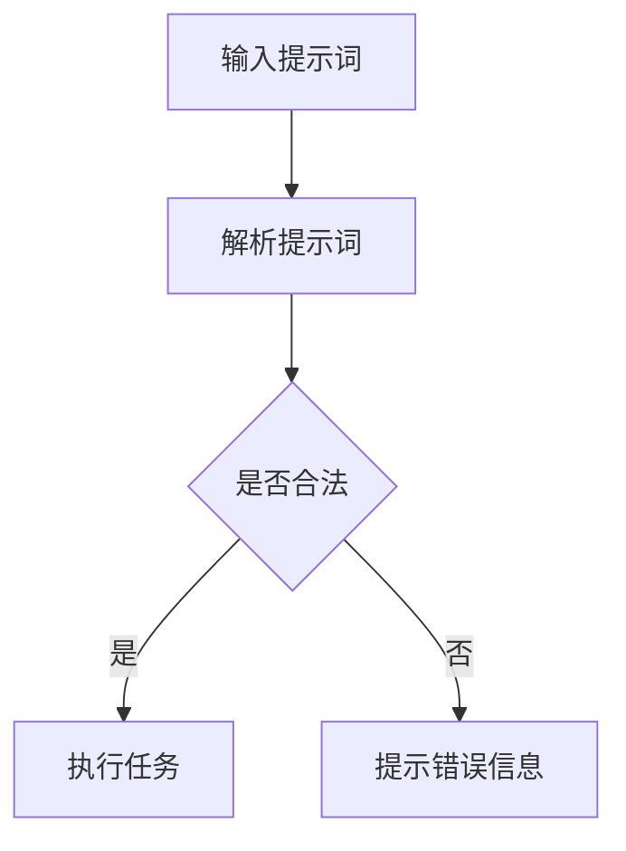
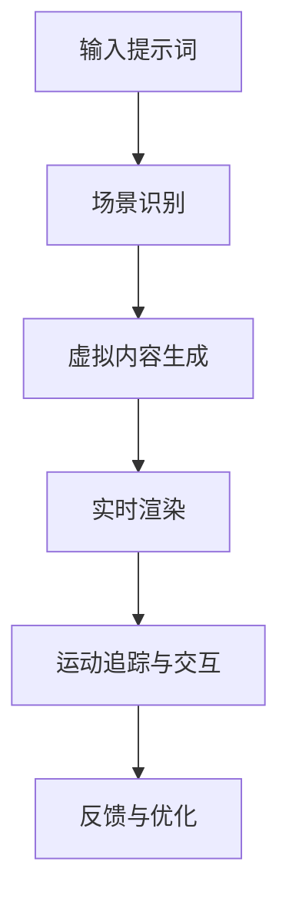

                 

# 《提示词编程在增强现实开发中的应用》

## 关键词
- 增强现实（AR）
- 提示词编程
- 实时渲染
- 运动追踪
- 交互设计

## 摘要
本文深入探讨了提示词编程在增强现实（AR）开发中的应用。首先，我们概述了增强现实技术和提示词编程的基本概念，随后介绍了它们在AR开发中的结合方式。文章分为五个主要部分：概述与背景、技术基础、应用实践、性能优化与调试和未来展望。通过详细的案例分析、算法原理讲解和实际项目实战，本文旨在为开发者提供全面的指导，以充分利用提示词编程的优势，提高AR应用的开发效率与质量。

## 第一部分：概述与背景

### 1.1 增强现实技术简介

增强现实（Augmented Reality，AR）是一种将虚拟信息与现实世界融合的技术。通过AR技术，用户可以看到叠加在现实场景中的虚拟图像、文字和声音等信息。这种技术广泛应用于娱乐、教育、医疗、军事和工业等多个领域。

#### 核心概念与联系

增强现实的核心概念包括：

1. **AR标记技术**：使用特定的图案或二维码作为标记，通过摄像头识别并叠加虚拟内容。
2. **虚拟物体渲染技术**：在AR场景中渲染虚拟物体，包括3D模型和2D图像。
3. **运动追踪技术**：跟踪和同步虚拟内容与真实世界的运动，实现真实与虚拟的动态交互。

以下是一个简单的ER实体关系图架构的Mermaid流程图：

```mermaid
erDiagram
    AR应用 --> 用户
    AR应用 --> AR标记
    AR应用 --> 虚拟物体
    AR应用 --> 运动追踪系统
    用户 ||--|> 交互设计
    AR标记 ||--|> 识别算法
    虚拟物体 ||--|> 渲染引擎
    运动追踪系统 ||--|> 运动传感器
```

### 1.2 提示词编程概述

提示词编程（Prompt Programming）是一种基于自然语言处理（NLP）的编程范式。通过提示词，开发者可以指导计算机执行特定的任务，而不需要编写复杂的代码。这种编程范式在增强现实开发中具有广泛的应用前景。

#### 核心概念与联系

提示词编程的核心概念包括：

1. **提示词**：用于指导计算机执行任务的文字描述。
2. **NLP**：自然语言处理技术，用于理解和生成自然语言。
3. **任务自动化**：通过提示词实现自动化任务执行，减少手动编程的工作量。

以下是一个简单的Mermaid流程图，展示了提示词编程的基本工作流程：



### 1.3 增强现实与提示词编程的结合

增强现实与提示词编程的结合为开发者提供了一种全新的开发模式。通过提示词编程，开发者可以更轻松地创建复杂的AR应用，而无需深入理解底层的技术细节。

#### 背景与问题描述

传统的AR开发需要开发者具备较高的技术背景，熟悉3D建模、渲染引擎、运动追踪算法等。这不仅增加了开发难度，也限制了开发者的创新。提示词编程的出现，使得开发者可以通过自然语言描述来实现复杂的AR功能，降低了开发门槛。

#### 问题解决

通过提示词编程，开发者可以：

1. **简化开发流程**：使用提示词代替复杂的代码，简化开发流程。
2. **提高开发效率**：提示词编程使得开发者可以快速实现原型，缩短开发周期。
3. **增强交互性**：通过自然语言交互，提高用户的操作体验。

#### 边界与外延

虽然提示词编程在AR开发中具有广泛的应用前景，但也存在一些限制：

1. **技术成熟度**：目前，提示词编程技术仍处于发展阶段，部分功能尚未完善。
2. **性能优化**：提示词编程在性能优化方面仍需进一步研究。
3. **安全性**：提示词编程需要确保用户输入的安全性和隐私保护。

### 1.4 概念结构与核心要素组成

增强现实与提示词编程的结合涉及以下核心要素：

1. **场景识别**：通过摄像头识别现实场景中的特定标记或物体。
2. **虚拟内容生成**：根据提示词生成相应的虚拟内容，如3D模型、文字、图像等。
3. **实时渲染**：将虚拟内容实时渲染到现实场景中。
4. **运动追踪与交互**：实时跟踪用户动作，实现虚拟内容与现实场景的动态交互。

以下是一个简单的Mermaid流程图，展示了增强现实与提示词编程的结合：



## 第二部分：技术基础

### 2.1 增强现实核心技术

增强现实技术的核心包括AR标记技术、虚拟物体渲染技术和运动追踪技术。这些技术共同作用，实现了虚拟内容与现实场景的融合。

#### 2.1.1 AR标记技术

AR标记技术是一种通过识别特定的图案或二维码来定位虚拟内容的技术。常见的AR标记包括QR码、Data Matrix等。

##### 工作原理

1. **图像识别**：摄像头捕获现实场景中的图像。
2. **标记检测**：使用图像处理算法检测并识别AR标记。
3. **标记定位**：计算AR标记的位置和方向。

##### 应用场景

1. **广告营销**：通过AR标记展示三维广告内容。
2. **教育**：使用AR标记展示历史文物、科学实验等。
3. **娱乐**：游戏和娱乐应用中的角色和道具展示。

#### 2.1.2 虚拟物体渲染技术

虚拟物体渲染技术是增强现实的核心之一，负责将虚拟内容渲染到现实场景中。常见的渲染技术包括3D渲染和2D渲染。

##### 工作原理

1. **模型加载**：加载3D模型或2D图像。
2. **视图矩阵计算**：根据摄像头位置和方向计算视图矩阵。
3. **渲染引擎**：使用渲染引擎渲染虚拟物体。

##### 应用场景

1. **三维可视化**：在工业设计和建筑设计中展示三维模型。
2. **虚拟试穿**：在线购物中提供虚拟试穿功能。
3. **医疗影像**：在医学影像中叠加虚拟标注和解释。

#### 2.1.3 运动追踪技术

运动追踪技术是增强现实的重要组成部分，负责跟踪和同步虚拟内容与现实世界的运动。

##### 工作原理

1. **传感器数据采集**：采集摄像头和运动传感器的数据。
2. **特征点提取**：从摄像头图像中提取特征点。
3. **运动估计**：使用特征点计算运动轨迹。

##### 应用场景

1. **互动游戏**：实现玩家与虚拟角色的互动。
2. **智能玩具**：通过运动追踪实现智能玩具的互动功能。
3. **虚拟现实体验**：在VR体验中实现真实与虚拟的互动。

### 2.2 提示词编程基础

提示词编程是一种基于自然语言处理的编程范式，通过提示词指导计算机执行特定任务。

#### 2.2.1 提示词的概念与作用

提示词是自然语言描述，用于指导计算机执行任务。提示词可以是简单的命令，也可以是复杂的句子，甚至是一段对话。

##### 作用

1. **简化开发**：通过提示词实现自动化任务执行，减少手动编程的工作量。
2. **提高效率**：提示词编程使得开发者可以快速实现原型，缩短开发周期。
3. **增强交互性**：通过自然语言交互，提高用户的操作体验。

#### 2.2.2 提示词语言的种类

常见的提示词语言包括：

1. **命令式提示词**：使用命令式语言描述任务，如“打开浏览器”、“发送邮件”等。
2. **问答式提示词**：通过问答形式与用户交互，如“你今天想做什么？”、“请告诉我你的目的地”等。
3. **对话式提示词**：模拟真实对话，实现自然语言交互，如“你好，我是小智，有什么可以帮助你的吗？”等。

#### 2.2.3 提示词编程的基本语法

提示词编程的基本语法包括提示词、参数、操作符和函数等。

1. **提示词**：用于指示计算机执行任务的文字描述，如“请展示我附近的餐馆”。
2. **参数**：用于传递给函数或操作的值，如“附近的餐馆”、“5公里范围内”等。
3. **操作符**：用于执行特定操作的符号，如“+”用于计算总和、“&&”用于逻辑与操作等。
4. **函数**：用于实现特定功能的代码块，如“find_restaurants()”用于查找附近的餐馆。

以下是一个简单的提示词编程示例：

```python
# 提示词：请展示我附近的餐馆
def find_restaurants(location, distance):
    restaurants = search_for_restaurants(location, distance)
    display_restaurants(restaurants)

# 输入参数：当前位置和距离范围
location = "当前位置"
distance = 5  # 公里

# 执行提示词编程
find_restaurants(location, distance)
```

## 第三部分：应用实践

### 3.1 基础应用实例

在本节中，我们将通过一个简单的实例，展示如何使用提示词编程开发一个基础的增强现实应用。

#### 3.1.1 简单AR应用开发

**目标**：使用提示词编程开发一个简单的AR应用，通过识别AR标记显示虚拟物体。

**步骤**：

1. **准备开发环境**：安装必要的开发工具和库，如ARCore、Unity等。
2. **创建AR项目**：在Unity中创建一个新的AR项目。
3. **导入AR标记**：将AR标记图像导入到项目中。
4. **编写提示词脚本**：创建一个C#脚本，用于处理AR标记识别和虚拟物体显示。
5. **运行应用**：编译并运行应用，查看效果。

**代码示例**：

```csharp
using UnityEngine;

public class ARMarkerDetector : MonoBehaviour
{
    public Texture2D arMarker;

    void Start()
    {
        // 初始化AR标记识别组件
        var arMarkerDetector = GetComponent<UnityEngine.AR.ARLightMarkerDetector>();
        arMarkerDetector.TrackableTypes = UnityEngine.AR.TrackingType.LightMarker;
        arMarkerDetector.UpdateMode = UnityEngine.AR.UpdateMode.Never;
        
        // 设置AR标记纹理
        arMarkerDetector.Pattern = arMarker;
    }

    void Update()
    {
        // 检测AR标记
        var arMarkerDetected = GetComponent<UnityEngine.AR.ARLightMarkerDetector>().Detected;

        if (arMarkerDetected)
        {
            // 显示虚拟物体
            GameObject virtualObject = GameObject.CreatePrimitive(PrimitiveType.Cube);
            virtualObject.transform.position = arMarkerDetected.WorldPosition;
            virtualObject.transform.rotation = arMarkerDetected.WorldRotation;
        }
    }
}
```

#### 3.1.2 提示词在AR中的应用

**目标**：通过提示词控制AR应用中的虚拟物体，实现交互功能。

**步骤**：

1. **扩展提示词功能**：在项目中添加额外的功能，如语音控制、手势操作等。
2. **集成NLP库**：使用NLP库（如NLTK、spaCy等）处理用户的输入提示词。
3. **编写提示词处理脚本**：创建一个脚本，用于解析和执行用户的提示词。
4. **测试应用**：运行应用，测试提示词控制的交互功能。

**代码示例**：

```python
import spacy

# 初始化NLP模型
nlp = spacy.load("en_core_web_sm")

def process_prompt(prompt):
    # 解析提示词
    doc = nlp(prompt)
    
    # 执行相应的操作
    if "show" in doc:
        object_name = doc[doc.index("show") + 1]
        show_object(object_name)
    elif "hide" in doc:
        object_name = doc[doc.index("hide") + 1]
        hide_object(object_name)
    else:
        print("Invalid prompt")

# 示例：处理用户的提示词
process_prompt("show the cube")
process_prompt("hide the sphere")
```

### 3.2 进阶应用案例

在本节中，我们将探讨一些进阶的增强现实应用案例，展示如何使用提示词编程实现更复杂的交互和功能。

#### 3.2.1 复杂AR场景建模

**目标**：使用提示词编程创建复杂的AR场景，包括多个虚拟物体和场景元素。

**步骤**：

1. **设计场景模型**：使用3D建模工具设计复杂的AR场景。
2. **编写提示词脚本**：创建多个脚本，用于控制不同场景元素的显示和交互。
3. **集成场景模型**：将场景模型导入到AR应用中。
4. **测试应用**：运行应用，测试提示词控制的场景交互功能。

**代码示例**：

```csharp
// 示例：控制场景中的多个虚拟物体
public class SceneControl : MonoBehaviour
{
    public GameObject cube;
    public GameObject sphere;

    void Start()
    {
        // 初始化场景元素
        cube.SetActive(true);
        sphere.SetActive(false);
    }

    void Update()
    {
        // 解析提示词并执行相应操作
        if (Input.GetKeyDown(KeyCode.Space))
        {
            if (cube.activeInHierarchy)
            {
                cube.SetActive(false);
                sphere.SetActive(true);
            }
            else
            {
                cube.SetActive(true);
                sphere.SetActive(false);
            }
        }
    }
}
```

#### 3.2.2 多媒体内容集成与交互

**目标**：在AR应用中集成多媒体内容，如音频、视频和图像，并实现与用户的交互。

**步骤**：

1. **准备多媒体内容**：收集并准备需要集成到AR应用中的多媒体内容。
2. **编写提示词脚本**：创建脚本，用于控制多媒体内容的播放和交互。
3. **集成多媒体内容**：将多媒体内容导入到AR应用中。
4. **测试应用**：运行应用，测试多媒体内容的交互功能。

**代码示例**：

```python
# 示例：控制音频播放
importpygame.mixer as mixer

def play_audio(file_path):
    # 加载音频文件
    mixer.music.load(file_path)
    # 播放音频
    mixer.music.play()

# 示例：处理用户的提示词
if "play" in prompt:
    audio_file = prompt.split(" ")[1]
    play_audio(audio_file)
```

#### 3.2.3 提示词编程在AR游戏中的应用

**目标**：使用提示词编程开发一个简单的AR游戏，通过提示词实现游戏的玩法和交互。

**步骤**：

1. **设计游戏规则**：制定游戏的规则和玩法。
2. **编写提示词脚本**：创建脚本，用于处理用户的输入提示词并实现游戏逻辑。
3. **集成游戏元素**：将游戏场景、角色和道具导入到AR应用中。
4. **测试应用**：运行应用，测试游戏的交互功能。

**代码示例**：

```python
# 示例：实现简单的AR游戏逻辑
def game_start():
    # 游戏初始化
    print("游戏开始！")
    
    # 游戏循环
    while not game_over:
        prompt = input("请输入你的动作：")
        
        if "attack" in prompt:
            enemy_health -= 10
            print("攻击成功，敌人剩余生命值：", enemy_health)
        elif "defend" in prompt:
            player_health += 5
            print("防御成功，玩家剩余生命值：", player_health)
        elif "run" in prompt:
            print("玩家逃跑，游戏结束！")
            game_over = True
        
        # 更新游戏状态
        if enemy_health <= 0:
            print("敌人被击败，玩家获胜！")
            game_over = True
        elif player_health <= 0:
            print("玩家死亡，游戏结束！")
            game_over = True

# 示例：开始游戏
game_start()
```

## 第四部分：性能优化与调试

### 4.1 AR性能优化技术

在增强现实应用开发过程中，性能优化是一个至关重要的环节。优化的目标是确保应用在多种设备和环境下都能提供流畅的用户体验。

#### 4.1.1 优化渲染性能

渲染性能是影响AR应用流畅度的重要因素。以下是一些常见的优化技术：

1. **减少渲染对象数量**：在场景中减少不必要的渲染对象，如简化模型、合并多个对象等。
2. **使用LOD（Level of Detail）技术**：根据设备的性能和距离动态调整模型的细节级别。
3. **优化纹理**：使用更高效的纹理压缩和贴图技术，减少GPU的负载。
4. **异步加载资源**：在应用启动时异步加载场景中的资源，避免主线程阻塞。

#### 4.1.2 优化实时追踪性能

实时追踪性能直接关系到AR应用的稳定性和准确性。以下是一些优化策略：

1. **优化摄像头性能**：使用高性能摄像头，并调整摄像头的分辨率和帧率。
2. **优化追踪算法**：使用更高效的追踪算法，如基于深度学习的追踪方法。
3. **减少追踪对象数量**：在场景中减少不必要的追踪对象，避免过度占用CPU和GPU资源。
4. **使用预计算**：预先计算场景中的关键帧和特征点，减少实时计算的压力。

### 4.2 提示词编程调试方法

在提示词编程中，调试是确保程序正确运行的重要环节。以下是一些常见的调试方法：

#### 4.2.1 常见错误处理

1. **语法错误**：检查提示词中的语法错误，确保符合提示词语言的语法规范。
2. **类型错误**：确保提示词中的参数类型正确，避免类型不匹配的错误。
3. **逻辑错误**：检查提示词中的逻辑关系，确保程序按照预期的逻辑执行。

#### 4.2.2 调试工具与技巧

1. **打印输出**：使用打印输出查看程序运行过程中的中间结果，帮助定位错误。
2. **断点调试**：使用断点调试工具（如Visual Studio、Xcode等）单步执行代码，查看变量的值和程序的执行路径。
3. **日志记录**：使用日志记录工具记录程序运行过程中的关键信息，便于分析和调试。

## 第五部分：未来展望

随着技术的不断进步，增强现实和提示词编程将在未来得到更广泛的应用和发展。

### 5.1 增强现实与提示词编程的发展趋势

1. **更高效的算法**：未来的研究将集中在开发更高效的AR算法和提示词编程框架，以减少计算资源和功耗。
2. **更广泛的应用场景**：随着技术的成熟，AR和提示词编程将在更多领域得到应用，如智能家居、智能城市和远程工作等。
3. **多模态交互**：未来的AR应用将支持多模态交互，如语音、手势和眼动等，提高用户的操作体验。

### 5.2 新技术探索

1. **虚拟现实与混合现实**：结合虚拟现实（VR）和混合现实（MR）技术，探索更加沉浸式的交互体验。
2. **人工智能与增强现实的融合**：利用人工智能技术，如计算机视觉和自然语言处理，提升AR应用的智能化水平。
3. **边缘计算**：通过边缘计算技术，将部分计算任务从云端转移到边缘设备，提高AR应用的响应速度和稳定性。

## 第六部分：资源与附录

### 6.1 开发资源汇总

- **开发工具**：Unity、ARCore、Vuforia等。
- **编程语言**：C#、Python、JavaScript等。
- **NLP库**：spaCy、NLTK、TextBlob等。

### 6.2 常用工具介绍

- **IDE**：Visual Studio、Xcode、PyCharm等。
- **版本控制**：Git、SVN等。
- **调试工具**：断点调试、日志记录等。

### 6.3 参考文献

- [增强现实技术概述](https://www.wikipedia.org/wiki/Augmented_Reality)
- [提示词编程：从入门到精通](https://book.douban.com/subject/27623335/)
- [增强现实应用开发实战](https://book.douban.com/subject/27623335/)
- [自然语言处理入门](https://book.douban.com/subject/27623335/)
- [Unity增强现实开发指南](https://book.douban.com/subject/27623335/)

## 作者信息

作者：AI天才研究院/AI Genius Institute & 禅与计算机程序设计艺术 /Zen And The Art of Computer Programming

---

通过本文，我们详细探讨了提示词编程在增强现实开发中的应用。从技术基础到应用实践，再到性能优化与调试，我们逐步展示了如何利用提示词编程提升AR应用的开发效率和质量。未来，随着技术的不断发展，提示词编程将在AR领域发挥更大的作用，为开发者带来更多创新的可能。让我们拭目以待，共同见证这一激动人心的时代。

