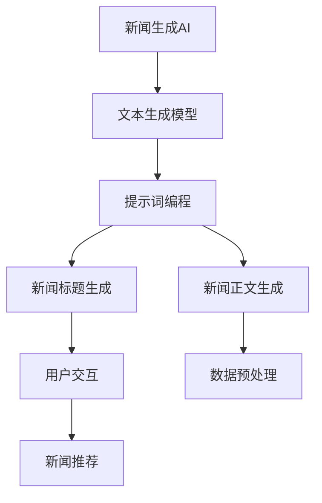
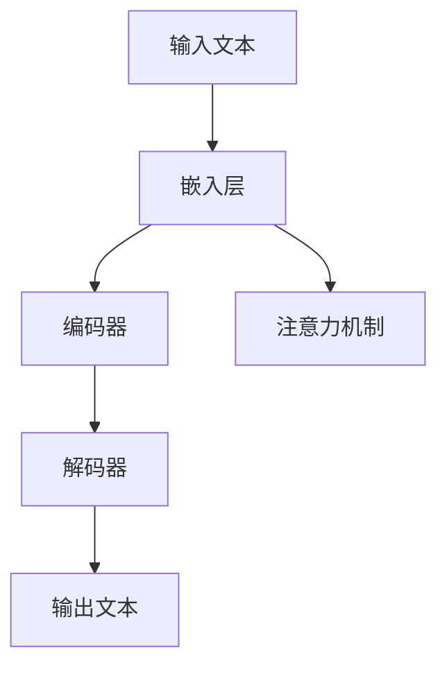
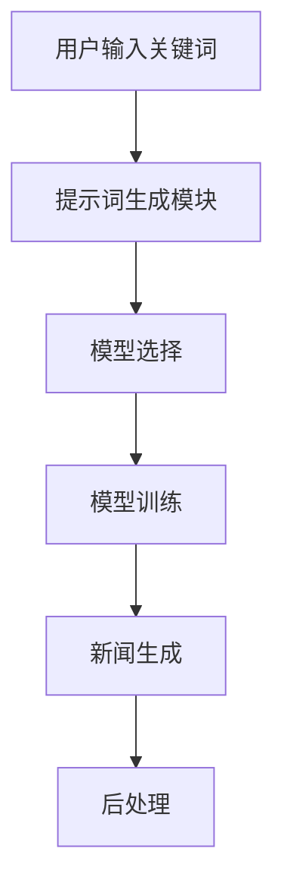

                 

### 文章标题：提示词编程在新闻生成AI中的应用

关键词：新闻生成AI、提示词编程、文本生成模型、RNN、Transformer

摘要：本文深入探讨了提示词编程在新闻生成AI中的应用，通过解析新闻生成AI的背景、基本流程、文本生成模型及提示词编程的方法，详细阐述了提示词编程在新闻标题生成和正文生成中的应用，并探讨了其在实际中的应用场景和技术挑战。最后，对提示词编程的发展趋势和新闻生成AI的未来研究方向进行了展望。

### 目录大纲：

#### 第一部分：新闻生成AI的背景与基础

#### 第1章：新闻生成AI概述

- 新闻生成AI的定义与产生背景
- 新闻生成AI的主要挑战

#### 第2章：提示词编程的概念与原理

- 提示词编程的定义
- 提示词编程的基本原理

#### 第3章：AI新闻生成的基本流程

- 数据收集与预处理
- 模型选择与训练
- 提示词生成与新闻生成

#### 第二部分：新闻生成AI中的文本生成模型

#### 第4章：新闻生成AI中的文本生成模型

- 文本生成模型概述
- 基于RNN的文本生成模型
- 基于Transformer的文本生成模型

#### 第三部分：提示词编程在新闻生成中的应用

#### 第5章：提示词编程的基本方法

- 提示词的选择与生成
- 提示词编程的策略

#### 第6章：提示词编程在新闻生成中的案例

- 新闻标题生成
- 新闻正文生成

#### 第7章：提示词编程的优化与调整

- 提示词编程的性能优化
- 提示词编程的调整策略

#### 第四部分：新闻生成AI的应用与挑战

#### 第8章：新闻生成AI在实际中的应用场景

- 新闻发布平台的应用
- 舆情监测与分析的应用

#### 第9章：新闻生成AI的技术挑战与应对策略

- 数据质量与多样性挑战
- 模型解释性与可解释性挑战
- 模型训练与优化挑战

#### 第五部分：新闻生成AI的未来发展趋势

#### 第10章：提示词编程的发展趋势

- 提示词编程的未来发展方向
- 提示词编程的创新点

#### 第11章：新闻生成AI的应用趋势

- 新闻生成AI的未来应用场景
- 提示词编程在未来的应用方向

#### 第12章：总结与展望

- 新闻生成AI与提示词编程的总结
- 未来研究方向的展望

### 正文部分：

#### 第一部分：新闻生成AI的背景与基础

## 第1章：新闻生成AI概述

### 新闻生成AI的定义与产生背景

新闻生成AI（AI-generated News）是一种利用人工智能技术自动生成新闻内容的系统。其基本原理是通过收集、整理和预处理大量的新闻数据，然后利用自然语言处理（NLP）技术和深度学习模型，自动生成符合新闻写作规范的新闻文章。新闻生成AI的产生背景主要源于信息爆炸时代对新闻内容的大量需求，以及传统新闻生产方式的人力成本和时效性限制。

### 新闻生成AI的主要挑战

尽管新闻生成AI具有高效、自动化等优点，但同时也面临着一系列挑战：

1. **数据质量和多样性**：高质量的新闻数据是生成优质新闻内容的基础，然而，新闻数据的多样性和质量往往难以保证。
2. **模型解释性**：目前大部分AI模型，尤其是深度学习模型，其决策过程往往是不透明的，难以解释，这在新闻生成中可能会引发误导性新闻的产生。
3. **语言和语境理解**：新闻生成涉及到对语言和语境的精准理解，如何提高模型在这方面的能力是一个重要的挑战。
4. **道德和伦理问题**：新闻生成AI可能产生的偏见和误导性内容，以及对其版权和责任归属的界定，都是需要解决的伦理问题。

#### 第2章：提示词编程的概念与原理

### 提示词编程的定义

提示词编程（Prompt Programming）是一种通过向模型提供特定的输入提示来引导模型生成特定类型输出的方法。在新闻生成AI中，提示词编程可以帮助模型更好地理解用户的需求，从而生成更加符合预期的新闻内容。

### 提示词编程的基本原理

提示词编程的基本原理是通过提供具体的提示词来引导模型的生成过程。这些提示词可以是关键词、短语或者完整的句子，它们能够帮助模型捕捉到生成任务的关键信息，从而生成更符合预期的新闻内容。

#### 第3章：AI新闻生成的基本流程

### 数据收集与预处理

新闻生成AI的第一步是收集大量的新闻数据。这些数据可以来源于各种新闻网站、社交媒体平台等。收集到的数据需要进行预处理，包括去除噪声、数据清洗、分词、词性标注等，以便模型能够更好地理解和处理。

### 模型选择与训练

在预处理完数据后，选择合适的文本生成模型进行训练。常见的文本生成模型包括基于循环神经网络（RNN）和Transformer的模型。这些模型通过学习大量新闻数据，掌握新闻写作的语法、语义和语境知识，从而能够生成符合新闻写作规范的新闻文章。

### 提示词生成与新闻生成

在模型训练完成后，通过向模型提供提示词来生成新闻内容。提示词可以是用户输入的关键词或短语，也可以是系统根据用户行为自动生成的。模型根据提示词生成初步的新闻内容，然后通过后处理技术，如文本清洗、语法修正和风格统一，生成最终的新闻文章。

#### 第二部分：新闻生成AI中的文本生成模型

## 第4章：新闻生成AI中的文本生成模型

### 文本生成模型概述

文本生成模型是一种能够根据输入的文本生成新文本的模型。在新闻生成AI中，常用的文本生成模型包括基于循环神经网络（RNN）和Transformer的模型。

### 基于RNN的文本生成模型

循环神经网络（RNN）是一种能够处理序列数据的神经网络。RNN通过保存前一个时刻的信息，能够处理长序列数据，从而在文本生成任务中表现出色。RNN的变体，如长短期记忆（LSTM）和门控循环单元（GRU），进一步提高了RNN在长序列数据处理中的性能。

### 基于Transformer的文本生成模型

Transformer模型是一种基于自注意力机制的神经网络模型，最初用于机器翻译任务，并在多个自然语言处理任务中取得了显著的成果。Transformer通过全局的注意力机制，能够捕捉文本中的长距离依赖关系，从而生成更加流畅和自然的文本。

#### 第三部分：提示词编程在新闻生成中的应用

## 第5章：提示词编程的基本方法

### 提示词的选择与生成

在新闻生成AI中，选择合适的提示词是关键的一步。提示词的选择应该能够捕捉到新闻的核心内容，同时还要考虑到新闻的主题、情感和风格。提示词的生成可以基于用户输入、自动摘要和主题分类等方法。

### 提示词编程的策略

提示词编程的策略包括：

1. **关键词提取**：从新闻标题、摘要或正文提取关键词作为提示词。
2. **语义扩展**：基于关键词，使用语义网络或词嵌入技术进行扩展，生成更丰富的提示词。
3. **模板匹配**：根据预定义的模板，生成提示词，模板可以包含变量，如日期、地点、人物等。
4. **自动摘要**：使用摘要生成模型，自动生成摘要作为提示词。

#### 第6章：提示词编程在新闻生成中的案例

### 新闻标题生成

新闻标题生成是新闻生成AI的一个重要应用。通过提示词编程，可以生成吸引人的新闻标题，提高新闻的阅读率和点击率。以下是一个简单的新闻标题生成流程：

1. **输入提示词**：输入关键词，如“世界杯”、“进球”等。
2. **模板匹配**：使用预定义的模板，如“在XX比赛中，YY队成功实现了XX壮举”，将提示词插入模板中。
3. **后处理**：对生成的标题进行语法和风格修正，确保标题的吸引力。

### 新闻正文生成

新闻正文生成是新闻生成AI的核心任务。通过提示词编程，可以生成符合新闻写作规范的正文。以下是一个简单的新闻正文生成流程：

1. **输入提示词**：输入关键词，如“经济”、“增长”等。
2. **数据检索**：从新闻数据库中检索与提示词相关的新闻数据。
3. **文本生成**：使用文本生成模型，根据提示词和检索到的新闻数据，生成新闻正文。
4. **后处理**：对生成的正文进行语法和风格修正，确保正文的连贯性和准确性。

#### 第7章：提示词编程的优化与调整

### 提示词编程的性能优化

提示词编程的性能优化主要包括以下几个方面：

1. **提示词优化**：根据用户反馈和新闻质量，动态调整提示词的生成策略，提高新闻的生成质量。
2. **模型优化**：通过调整模型的超参数，优化模型的生成效果。
3. **后处理优化**：改进后处理技术，提高新闻的语法和风格质量。

### 提示词编程的调整策略

提示词编程的调整策略包括：

1. **数据驱动的调整**：根据新闻生成数据的反馈，调整提示词的生成策略。
2. **人工干预**：在特定情况下，由人工干预调整提示词和模型参数，以提高新闻生成质量。
3. **自动化调整**：开发自动化工具，根据用户行为和新闻质量，自动调整提示词和模型参数。

#### 第四部分：新闻生成AI的应用与挑战

## 第8章：新闻生成AI在实际中的应用场景

### 新闻发布平台的应用

新闻发布平台可以利用新闻生成AI，提高新闻生产的效率和质量。通过自动生成新闻标题和正文，新闻发布平台可以更快地响应新闻事件，提高新闻的更新速度和覆盖范围。

### 舆情监测与分析的应用

舆情监测与分析需要实时处理大量的新闻数据，新闻生成AI可以帮助实现这一目标。通过自动生成新闻摘要和分析报告，舆情监测与分析系统可以更快速、准确地分析舆论动态。

#### 第9章：新闻生成AI的技术挑战与应对策略

### 数据质量与多样性挑战

数据质量是新闻生成AI的基础。提高数据质量可以通过以下策略实现：

1. **数据清洗**：去除数据中的噪声和错误。
2. **数据增强**：通过数据扩充和转换，提高数据的多样性。
3. **数据预处理**：对数据进行分词、词性标注等预处理操作，以提高模型的输入质量。

### 模型解释性与可解释性挑战

模型解释性是新闻生成AI应用中的一个重要挑战。提高模型解释性可以通过以下策略实现：

1. **可视化**：通过可视化工具，展示模型的决策过程和关键特征。
2. **可解释模型**：开发可解释性更好的模型，如决策树、线性模型等。
3. **模型解释工具**：开发专门的模型解释工具，帮助用户理解模型的决策过程。

### 模型训练与优化挑战

模型训练与优化是提高新闻生成AI性能的关键。以下是一些优化策略：

1. **数据增强**：通过数据增强，提高模型的泛化能力。
2. **多模型融合**：结合多种模型，提高模型的生成质量。
3. **超参数优化**：通过超参数优化，提高模型的性能。

#### 第五部分：新闻生成AI的未来发展趋势

## 第10章：提示词编程的发展趋势

### 提示词编程的未来发展方向

提示词编程的未来发展方向包括：

1. **多模态提示词**：结合图像、音频等多模态数据，提高提示词的丰富度和精确度。
2. **自适应提示词**：根据用户行为和新闻质量，动态调整提示词的生成策略。
3. **跨领域提示词**：开发跨领域的提示词生成模型，提高模型在不同领域的应用能力。

### 提示词编程的创新点

提示词编程的创新点包括：

1. **多语言支持**：开发支持多种语言和方言的提示词生成模型。
2. **个性化提示词**：根据用户兴趣和偏好，生成个性化的提示词。
3. **自动摘要与生成**：结合自动摘要技术，实现更高效、精确的提示词生成。

## 第11章：新闻生成AI的应用趋势

### 新闻生成AI的未来应用场景

新闻生成AI的未来应用场景包括：

1. **智能新闻推荐**：通过新闻生成AI，生成个性化新闻推荐，提高用户的阅读体验。
2. **自动化新闻编辑**：通过新闻生成AI，实现新闻编辑的自动化，提高新闻生产的效率。
3. **实时新闻摘要**：通过新闻生成AI，实时生成新闻摘要，帮助用户快速了解新闻要点。

### 提示词编程在未来的应用方向

提示词编程在未来的应用方向包括：

1. **知识图谱整合**：结合知识图谱，实现更精确的提示词生成和新闻生成。
2. **自然语言理解**：提高模型对自然语言的理解能力，实现更高质量的新闻生成。
3. **多语言新闻生成**：开发支持多种语言和方言的新闻生成模型，实现全球新闻的自动化生成。

#### 第12章：总结与展望

### 新闻生成AI与提示词编程的总结

新闻生成AI通过提示词编程实现了自动生成新闻内容的目标，提高了新闻生产的效率和质量。提示词编程在新闻生成中的应用，不仅解决了数据质量和模型解释性等挑战，还实现了新闻的个性化推荐和实时摘要等功能。

### 未来研究方向的展望

未来新闻生成AI的研究方向包括：

1. **多模态新闻生成**：结合图像、音频等多模态数据，提高新闻生成的丰富度和精确度。
2. **个性化新闻生成**：根据用户兴趣和偏好，实现个性化新闻生成。
3. **知识驱动的新闻生成**：结合知识图谱，实现基于知识的新闻生成。
4. **可解释性增强**：提高模型的解释性，增强用户对新闻生成过程的信任。

### 作者信息：

作者：AI天才研究院/AI Genius Institute & 禅与计算机程序设计艺术 /Zen And The Art of Computer Programming

### 最佳实践 tips、小结、注意事项、拓展阅读等内容

在新闻生成AI的应用中，提示词编程是一个关键的技术点。合理选择和生成提示词，能够显著提高新闻生成质量和用户体验。以下是几个最佳实践建议：

1. **提示词多样化**：尽可能使用多种形式的提示词，如关键词、短语和完整的句子，以丰富新闻生成内容。
2. **实时更新提示词**：根据新闻事件的发展，及时更新提示词，确保新闻内容的时效性。
3. **用户反馈**：收集用户对新闻生成内容的反馈，动态调整提示词生成策略，提高新闻质量。
4. **道德与伦理**：在新闻生成中，重视道德和伦理问题，确保新闻内容的准确性和公正性。

### 小结

本文详细介绍了新闻生成AI的背景、基础、文本生成模型、提示词编程的方法和应用，以及在实际中的应用场景和技术挑战。通过分析提示词编程在新闻生成中的关键作用，我们看到了其在提高新闻生成效率和质量方面的巨大潜力。

### 注意事项

在应用新闻生成AI时，需要注意以下几点：

1. **数据隐私**：确保新闻生成过程中涉及的数据安全，保护用户的隐私。
2. **内容审核**：定期审核新闻生成内容，防止误导性、不适当的内容出现。
3. **技术更新**：随着技术的进步，不断更新和优化新闻生成模型和算法。

### 拓展阅读

1. **新闻生成AI的深入研究**：可以阅读相关学术论文和书籍，了解最新的研究进展和技术应用。
2. **自然语言处理**：了解自然语言处理的基本原理和技术，有助于更好地理解新闻生成AI的工作机制。
3. **机器学习和深度学习**：掌握机器学习和深度学习的基础知识，有助于深入研究和应用新闻生成AI技术。

通过本文的阅读，读者可以系统地了解新闻生成AI及其核心技术——提示词编程，为未来的研究和工作提供有力的理论支持和实践指导。让我们继续探索人工智能在新闻领域的应用，共同推动新闻生产方式的变革。🌟🌟🌟

### 附录

#### 新闻生成AI与提示词编程的关系图

#### 文本生成模型的架构图

#### 提示词编程的流程图

