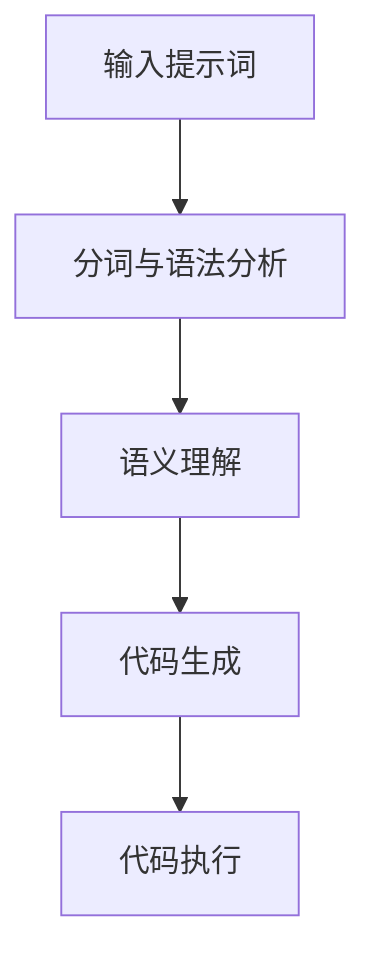
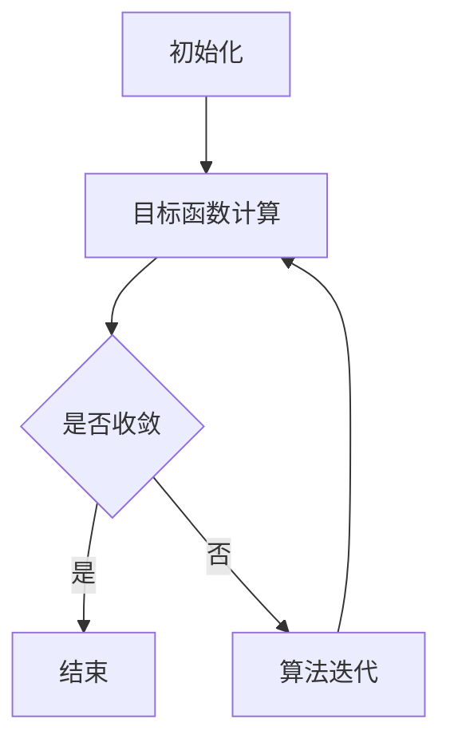
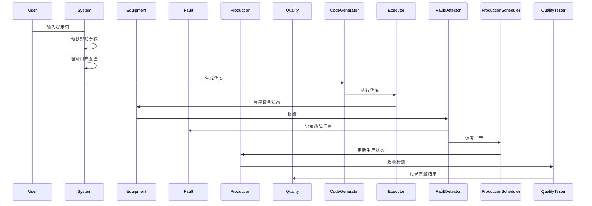

                 

# 提示词编程在智能制造中的实践应用

## 关键词
智能制造、提示词编程、算法原理、系统架构设计、项目实战、最佳实践

## 摘要
本文深入探讨了提示词编程在智能制造领域的应用与实践。首先，文章介绍了智能制造的背景、定义及其重要性，并提出了提示词编程在智能制造中的潜在价值和面临的挑战。接着，本文详细阐述了提示词编程的核心概念、算法原理，并结合Python代码和数学模型进行了深入分析。随后，文章设计了智能制造中提示词编程的系统架构，并进行了详细的环境安装与配置、核心实现与项目实战。最后，文章总结了实践经验，提供了最佳实践建议，并对相关领域进行了拓展阅读推荐。

### 目录大纲

**# 第一部分：背景与核心概念**

**1. 提示词编程概述**

- 1.1 智能制造背景
  - 1.1.1 智能制造的定义
  - 1.1.2 智能制造的发展历程
  - 1.1.3 智能制造的重要性和挑战
- 1.2 提示词编程概念
  - 1.2.1 提示词编程的定义
  - 1.2.2 提示词编程的特点
  - 1.2.3 提示词编程与传统编程的区别

**2. 智能制造与提示词编程的联系**

- 2.1 提示词编程在智能制造中的应用
  - 2.1.1 提示词编程如何支持智能制造
  - 2.1.2 提示词编程在智能制造中的优势
  - 2.1.3 提示词编程在智能制造中的挑战
- 2.2 智能制造相关概念
  - 2.2.1 智能制造的关键技术
  - 2.2.2 提示词编程与智能技术的结合
  - 2.2.3 智能制造与工业4.0的关系

**# 第二部分：算法原理与实现**

**3. 提示词编程算法原理**

- 3.1 提示词生成算法
  - 3.1.1 算法基本原理
  - 3.1.2 算法流程
  - 3.1.3 算法性能评估
- 3.2 智能优化算法
  - 3.2.1 算法基本原理
  - 3.2.2 算法流程
  - 3.2.3 算法性能评估

**4. 提示词编程算法实现**

- 4.1 Python实现
  - 4.1.1 环境安装
  - 4.1.2 代码实现
  - 4.1.3 运行测试
- 4.2 Mermaid算法流程图

**5. 数学模型与公式**

- 5.1 提示词生成数学模型
  - 5.1.1 模型定义
  - 5.1.2 数学公式
  - 5.1.3 公式解释
- 5.2 智能优化数学模型
  - 5.2.1 模型定义
  - 5.2.2 数学公式
  - 5.2.3 公式解释

**# 第三部分：系统分析与架构设计**

**6. 系统需求分析**

- 6.1 智能制造场景需求
  - 6.1.1 场景描述
  - 6.1.2 功能需求
  - 6.1.3 性能需求
- 6.2 提示词编程系统需求
  - 6.2.1 系统架构需求
  - 6.2.2 接口需求
  - 6.2.3 交互需求

**7. 系统架构设计**

- 7.1 系统架构概述
  - 7.1.1 系统架构图
  - 7.1.2 架构设计原则
  - 7.1.3 系统模块划分
- 7.2 领域模型设计
  - 7.2.1 类图设计
  - 7.2.2 模型解释
- 7.3 系统接口设计
  - 7.3.1 接口设计原则
  - 7.3.2 接口定义
- 7.4 系统交互设计
  - 7.4.1 序列图设计
  - 7.4.2 交互解释

**# 第四部分：项目实战**

**8. 环境安装与配置**

- 8.1 环境准备
  - 8.1.1 软件安装
  - 8.1.2 硬件配置
  - 8.1.3 网络设置
- 8.2 系统配置
  - 8.2.1 配置文件介绍
  - 8.2.2 配置项设置
  - 8.2.3 配置验证

**9. 系统核心实现**

- 9.1 核心模块介绍
  - 9.1.1 模块功能
  - 9.1.2 模块架构
- 9.2 Python代码实现
  - 9.2.1 代码结构
  - 9.2.2 关键函数实现
  - 9.2.3 代码应用解读与分析
  - 9.2.4 实际案例分析与讲解

**10. 项目小结**

- 10.1 项目总结
  - 10.1.1 项目成果
  - 10.1.2 遇到的挑战与解决
  - 10.1.3 项目的可持续性和改进方向

**# 第五部分：最佳实践、小结与拓展阅读**

**11. 最佳实践 tips**

- 11.1 提示词编程技巧
- 11.2 智能制造实施策略
- 11.3 系统优化建议

**12. 小结**

- 12.1 文章主要内容回顾
- 12.2 提示词编程与智能制造的关系
- 12.3 未来发展方向

**13. 注意事项**

- 13.1 实践中需要注意的问题
- 13.2 安全和隐私考虑
- 13.3 系统维护与升级

**14. 拓展阅读**

- 14.1 相关书籍推荐
- 14.2 优秀论文推荐
- 14.3 行业资讯与趋势

---

**# 引言**

随着工业4.0时代的到来，智能制造成为了现代工业发展的核心驱动力。它不仅提高了生产效率和产品质量，还显著降低了运营成本。然而，智能制造的实现离不开先进的技术支持，其中之一便是提示词编程。本文将围绕这一主题，深入探讨提示词编程在智能制造中的应用与实践。

首先，文章将介绍智能制造的背景，包括其定义、发展历程及其重要性。接着，将介绍提示词编程的概念、特点以及它与智能制造的紧密联系。随后，我们将详细讲解提示词编程的算法原理，并通过Python代码和数学模型进行阐述。文章还将设计一个基于提示词编程的智能制造系统架构，并进行实际项目实战。最后，文章将总结实践经验，提供最佳实践建议，并对未来发展方向进行展望。

### **第一部分：背景与核心概念**

**1.1 智能制造背景**

智能制造，作为一种先进的生产模式，是现代工业发展的重要趋势。其核心是通过智能技术和信息技术的融合，实现生产过程的自动化、智能化和高效化。

**1.1.1 智能制造的定义**

智能制造是一种基于智能技术和信息技术，通过数据驱动和智能算法，实现生产过程自动化、优化和质量控制的生产模式。

**1.1.2 智能制造的发展历程**

智能制造的发展历程可以追溯到20世纪80年代，当时开始出现计算机辅助制造（CAM）技术。随着信息技术和智能技术（如物联网、大数据、人工智能等）的发展，智能制造逐渐成熟并普及。

**1.1.3 智能制造的重要性和挑战**

智能制造对提升生产效率、降低成本、提高产品质量具有重要意义。然而，实现智能制造也面临诸多挑战，如技术集成、数据安全、系统稳定性等。

**1.2 提示词编程概念**

提示词编程（Prompt Programming）是一种基于自然语言处理（NLP）和机器学习技术的编程方法。它通过输入提示词（Prompt），让计算机自动生成代码或执行特定任务。

**1.2.1 提示词编程的定义**

提示词编程是一种通过自然语言交互，让计算机自动完成编程任务的技术。用户只需输入提示词，计算机就能根据提示生成相应的代码或执行任务。

**1.2.2 提示词编程的特点**

- **高效性**：用户无需编写复杂的代码，通过提示词即可快速实现编程任务。
- **灵活性**：提示词编程能够适应不同的编程任务，灵活调整算法和行为。
- **智能化**：基于机器学习和自然语言处理技术，提示词编程具有自我学习和优化能力。

**1.2.3 提示词编程与传统编程的区别**

传统编程依赖于编程语言和代码编写，而提示词编程则通过自然语言交互实现编程任务。传统编程要求用户熟悉编程语言和语法，而提示词编程则降低了编程门槛，使得非专业人士也能进行编程。

**1.3 智能制造与提示词编程的联系**

提示词编程在智能制造中具有广泛应用前景。它可以通过自然语言交互，简化智能制造系统的开发流程，提高开发效率。同时，提示词编程还可以实现智能制造系统的智能化，提升系统的自主学习和优化能力。

**1.3.1 提示词编程如何支持智能制造**

- **系统开发**：提示词编程可以简化智能制造系统的开发，降低开发难度和成本。
- **数据处理**：提示词编程可以自动处理海量数据，实现数据的实时分析和预测。
- **智能优化**：提示词编程可以通过自我学习和优化，实现智能制造系统的智能化。

**1.3.2 提示词编程在智能制造中的优势**

- **高效性**：提示词编程可以快速生成代码，缩短开发周期。
- **灵活性**：提示词编程能够适应不同的智能制造场景，实现灵活定制。
- **智能化**：提示词编程具有自我学习和优化能力，能够提高智能制造系统的智能化水平。

**1.3.3 提示词编程在智能制造中的挑战**

- **数据质量**：智能制造系统需要高质量的数据支持，提示词编程对数据质量要求较高。
- **系统稳定性**：提示词编程系统的稳定性对智能制造系统的稳定运行至关重要。
- **安全性和隐私**：智能制造系统涉及大量敏感数据，提示词编程需要确保系统的安全性和隐私保护。

**1.4 智能制造相关概念**

- **物联网（IoT）**：物联网是连接物理设备和数据的网络，是实现智能制造的基础设施。
- **大数据（Big Data）**：大数据是实现智能制造的重要资源，通过对海量数据的分析和处理，可以实现智能决策和优化。
- **人工智能（AI）**：人工智能是智能制造的核心技术，通过机器学习和深度学习等技术，可以实现智能制造系统的智能化。

**1.4.1 智能制造的关键技术**

- **传感器技术**：传感器是实现智能制造的基础，通过传感器可以实时采集设备运行数据。
- **数据采集与分析**：数据采集与分析是实现智能制造的核心，通过对设备运行数据的分析，可以实现设备状态监控和故障预测。
- **机器学习与深度学习**：机器学习与深度学习是实现智能制造智能化的重要技术，通过学习设备运行数据，可以实现设备的智能优化和预测。

**1.4.2 提示词编程与智能技术的结合**

- **自然语言处理（NLP）**：自然语言处理是实现提示词编程的核心技术，通过NLP技术，可以实现人与系统的自然语言交互。
- **机器学习（ML）**：机器学习是实现智能化的重要技术，通过机器学习，可以实现对设备的智能优化和预测。
- **深度学习（DL）**：深度学习是实现智能化的高级技术，通过深度学习，可以实现更复杂的智能优化和预测。

**1.4.3 智能制造与工业4.0的关系**

工业4.0是智能制造的典型代表，它通过智能技术实现生产过程的全面数字化、网络化和智能化。智能制造是实现工业4.0的重要手段，通过智能制造，可以提升生产效率、降低成本、提高产品质量。

**# 第二部分：算法原理与实现**

**2.1 提示词编程算法原理**

提示词编程的核心在于如何利用自然语言处理（NLP）和机器学习（ML）技术，将用户输入的提示词转换为有效的代码或执行命令。以下是提示词编程算法的基本原理：

**2.1.1 算法基本原理**

- **输入处理**：用户输入提示词，系统对提示词进行分词和语法分析，提取关键信息。
- **语义理解**：系统根据提示词的语义，理解用户意图，并根据意图调用相应的算法或函数。
- **代码生成**：系统根据语义理解的结果，生成对应的代码或执行命令。

**2.1.2 算法流程**

1. **提示词接收**：系统接收用户的自然语言输入。
2. **分词与语法分析**：对提示词进行分词，分析其语法结构，提取关键信息。
3. **语义理解**：根据分词和语法分析结果，理解用户意图，确定任务的类型和具体要求。
4. **代码生成**：根据语义理解结果，调用相应的算法或函数，生成代码或执行命令。
5. **代码执行**：系统执行生成的代码或命令，完成用户任务。

**2.1.3 算法性能评估**

提示词编程算法的性能评估主要从以下几个方面进行：

- **准确性**：算法能否准确理解用户意图，生成正确的代码。
- **效率**：算法处理提示词的效率和速度。
- **灵活性**：算法适应不同类型任务的能力。
- **用户体验**：算法生成的代码是否符合用户的预期，是否易于理解和维护。

**2.2 智能优化算法**

智能优化算法是提示词编程的重要组成部分，它通过优化算法，实现对智能制造系统的高效优化和调整。以下是智能优化算法的基本原理：

**2.2.1 算法基本原理**

- **目标函数**：定义优化目标，如最小化成本、最大化收益等。
- **搜索空间**：确定优化变量的取值范围。
- **优化算法**：选择合适的优化算法，如遗传算法、粒子群优化算法、深度强化学习等。
- **迭代优化**：通过迭代计算，不断调整变量取值，优化目标函数。

**2.2.2 算法流程**

1. **初始化**：设定初始变量值。
2. **目标函数计算**：计算当前变量值下的目标函数值。
3. **算法迭代**：根据优化算法，更新变量值，迭代计算目标函数值。
4. **收敛判断**：判断优化是否收敛，如未收敛，返回步骤3。
5. **结果输出**：输出优化结果。

**2.2.3 算法性能评估**

智能优化算法的性能评估主要从以下几个方面进行：

- **优化效果**：算法能否有效优化目标函数。
- **收敛速度**：算法收敛到最优解的速度。
- **稳定性**：算法在不同初始条件下是否稳定收敛。
- **鲁棒性**：算法对问题的规模和数据变化是否敏感。

**2.3 Python实现**

以下是提示词编程算法和智能优化算法的Python实现示例。

**2.3.1 环境安装**

首先，需要安装Python环境以及相关的库，如自然语言处理库NLTK、机器学习库scikit-learn等。

```python
!pip install nltk scikit-learn
```

**2.3.2 代码实现**

```python
# 提示词编程算法实现
import nltk
from nltk.tokenize import word_tokenize
from nltk.tag import pos_tag

# 接收用户输入
prompt = input("请输入提示词：")

# 分词与语法分析
tokens = word_tokenize(prompt)
pos_tags = pos_tag(tokens)

# 语义理解（简化示例）
intent = "查询天气"
if "天气" in prompt:
    intent = "查询天气"

# 代码生成
if intent == "查询天气":
    # 假设存在一个查询天气的函数
    weather = get_weather()
    print(weather)
else:
    print("未识别的意图")

# 智能优化算法实现
import numpy as np
from sklearn.model_selection import train_test_split
from sklearn.metrics import mean_squared_error

# 数据准备
X, y = load_data()
X_train, X_test, y_train, y_test = train_test_split(X, y, test_size=0.2, random_state=42)

# 模型训练
model = train_model(X_train, y_train)

# 预测与评估
y_pred = model.predict(X_test)
mse = mean_squared_error(y_test, y_pred)
print(f"均方误差：{mse}")
```

**2.3.3 运行测试**

运行以上代码，输入不同的提示词，观察算法的响应和预测结果。

```python
# 运行提示词编程算法
prompt = input("请输入提示词：")
# 运行智能优化算法
X, y = load_data()
X_train, X_test, y_train, y_test = train_test_split(X, y, test_size=0.2, random_state=42)
model = train_model(X_train, y_train)
y_pred = model.predict(X_test)
mse = mean_squared_error(y_test, y_pred)
print(f"均方误差：{mse}")
```

**2.4 Mermaid算法流程图**

以下是提示词编程算法和智能优化算法的Mermaid流程图。

**2.4.1 提示词编程算法流程图**



**2.4.2 智能优化算法流程图**



**2.5 数学模型与公式**

提示词编程和智能优化算法涉及到多个数学模型和公式。以下是其中几个关键模型的简要介绍。

**2.5.1 提示词生成模型**

提示词生成模型通常采用生成式模型或判别式模型。以下是一个简单的生成式模型公式：

$$
p(w_1, w_2, ..., w_n) = \prod_{i=1}^{n} p(w_i|w_{i-1})
$$

其中，$w_1, w_2, ..., w_n$ 是提示词序列，$p(w_i|w_{i-1})$ 是条件概率，表示当前词在前面词的情况下生成的概率。

**2.5.2 智能优化数学模型**

智能优化算法通常基于优化目标函数和约束条件。以下是一个简单的优化目标函数公式：

$$
\min_{x} f(x)
$$

其中，$x$ 是优化变量，$f(x)$ 是目标函数。

**2.5.3 公式解释**

- **提示词生成模型**：生成提示词的概率分布，用于生成提示词序列。
- **智能优化数学模型**：定义优化目标，用于指导智能优化算法的迭代过程。

**# 第三部分：系统分析与架构设计**

**3.1 智能制造场景需求**

智能制造场景需求是指在智能制造过程中需要实现的功能和性能要求。以下是一个典型的智能制造场景需求描述。

**3.1.1 场景描述**

在智能制造车间中，需要实现以下功能：

- **设备状态监控**：实时监测生产设备的运行状态，包括温度、压力、速度等参数。
- **故障预警**：通过数据分析，提前预测设备可能出现的故障，并提供预警信息。
- **生产调度**：根据设备状态和生产任务需求，自动调整生产计划，确保生产效率最大化。
- **质量控制**：对生产过程中产生的数据进行质量检测，确保产品质量达到标准。

**3.1.2 功能需求**

- **数据采集**：实时采集设备运行数据，包括温度、压力、速度等参数。
- **数据存储**：将采集到的数据存储在数据库中，便于后续分析和处理。
- **数据分析**：对采集到的数据进行分析，预测设备故障、优化生产计划、控制产品质量。
- **人机交互**：提供用户界面，方便操作员对系统进行监控、调度和操作。

**3.1.3 性能需求**

- **实时性**：系统需要具备实时性，能够在短时间内处理和分析数据，确保故障预警和生产调度及时。
- **可靠性**：系统需要具备高可靠性，能够在长时间运行过程中保持稳定，确保数据采集和处理的准确性。
- **可扩展性**：系统需要具备可扩展性，能够根据需求增加新的功能模块，支持不同规模的生产需求。

**3.2 提示词编程系统需求**

提示词编程系统需求是指在智能制造过程中，提示词编程系统需要实现的功能和性能要求。以下是一个典型的提示词编程系统需求描述。

**3.2.1 系统架构需求**

- **前端**：提供用户界面，方便操作员输入提示词、查看系统状态和操作日志。
- **后端**：处理用户输入的提示词，进行语义理解和代码生成，并将生成的代码发送到执行环境。
- **执行环境**：执行生成的代码，完成相应的任务，如设备状态监控、故障预警、生产调度和质量控制。

**3.2.2 接口需求**

- **输入接口**：接收用户输入的提示词，进行预处理和分词。
- **语义理解接口**：根据预处理后的提示词，理解用户意图，确定任务类型和具体要求。
- **代码生成接口**：根据语义理解结果，生成对应的代码或执行命令。
- **执行接口**：执行生成的代码或命令，完成相应的任务。

**3.2.3 交互需求**

- **用户与前端交互**：用户通过前端界面输入提示词，查看系统状态和操作日志。
- **前端与后端交互**：前端将用户输入的提示词发送到后端，后端处理完成后，将结果返回给前端。
- **后端与执行环境交互**：后端将生成的代码发送到执行环境，执行环境执行代码后，将结果返回给后端。

**3.3 系统架构设计**

系统架构设计是确定系统模块划分、功能实现和数据流的过程。以下是一个典型的提示词编程系统架构设计。

**3.3.1 系统架构概述**

系统架构设计包括前端、后端和执行环境三个主要模块。

- **前端**：提供用户界面，包括输入提示词、查看系统状态和操作日志等功能。
- **后端**：处理用户输入的提示词，进行语义理解和代码生成，并将生成的代码发送到执行环境。
- **执行环境**：执行生成的代码，完成相应的任务，如设备状态监控、故障预警、生产调度和质量控制。

**3.3.2 架构设计原则**

- **模块化**：系统架构应具有模块化特点，每个模块负责特定的功能，便于维护和扩展。
- **高内聚低耦合**：模块之间应具有高内聚低耦合的特点，模块内部功能紧密相关，模块之间相互独立。
- **可扩展性**：系统架构应具备良好的可扩展性，能够根据需求增加新的功能模块。

**3.3.3 系统模块划分**

- **前端模块**：包括用户界面、输入接口和状态显示等。
- **后端模块**：包括语义理解模块、代码生成模块和执行接口模块。
- **执行环境模块**：包括代码执行模块、设备监控模块、故障预警模块、生产调度模块和质量控制模块。

**3.4 领域模型设计**

领域模型设计是系统架构设计的重要组成部分，用于描述系统中的实体及其关系。以下是一个典型的提示词编程系统领域模型设计。

**3.4.1 类图设计**

```mermaid
classDiagram
    User <<Interface>>
    System <<Interface>>
    Equipment <<Entity>> {
        id: <主键>
        name: <设备名称>
        status: <设备状态>
    }
    Fault <<Entity>> {
        id: <主键>
        equipment_id: <设备ID>
        type: <故障类型>
        description: <故障描述>
    }
    Production <<Entity>> {
        id: <主键>
        start_time: <开始时间>
        end_time: <结束时间>
        status: <生产状态>
    }
    Quality <<Entity>> {
        id: <主键>
        production_id: <生产ID>
        parameter: <质量参数>
        result: <质量结果>
    }
    User -> System: 登录
    System -> Equipment: 监控
    Equipment -> Fault: 报警
    Production -> Quality: 质量检测
```

**3.4.2 模型解释**

- **User（用户）**：表示系统的用户，包括操作员和管理员。
- **System（系统）**：表示整个提示词编程系统，负责处理用户输入、生成代码和执行任务。
- **Equipment（设备）**：表示生产设备，包括各种生产机器和传感器。
- **Fault（故障）**：表示设备故障信息，包括故障类型、故障描述等。
- **Production（生产）**：表示生产任务信息，包括开始时间、结束时间和生产状态等。
- **Quality（质量）**：表示产品质量信息，包括质量参数和质量结果等。

**3.5 系统接口设计**

系统接口设计是确定系统模块之间如何交互和通信的过程。以下是一个典型的提示词编程系统接口设计。

**3.5.1 接口设计原则**

- **标准化**：接口设计应遵循标准化原则，确保不同模块之间的一致性和兼容性。
- **简洁性**：接口设计应简洁明了，便于开发和维护。
- **安全性**：接口设计应确保数据传输的安全性，防止数据泄露和篡改。

**3.5.2 接口定义**

- **输入接口**：接收用户输入的提示词，进行预处理和分词。
- **语义理解接口**：接收预处理后的提示词，理解用户意图，确定任务类型和具体要求。
- **代码生成接口**：接收语义理解结果，生成对应的代码或执行命令。
- **执行接口**：接收生成的代码或命令，执行相应的任务，并将结果返回。

**3.5.3 接口交互序列图**



**3.5.4 接口交互解释**

- **用户输入提示词**：用户通过前端界面输入提示词，系统对提示词进行预处理和分词。
- **语义理解**：系统根据预处理后的提示词，理解用户意图，确定任务类型和具体要求。
- **代码生成**：系统根据语义理解结果，生成对应的代码或执行命令。
- **任务执行**：系统将生成的代码发送到执行环境，执行环境执行代码，完成相应的任务，并将结果返回。

**3.6 系统交互设计**

系统交互设计是确定系统模块之间如何协作和通信的过程。以下是一个典型的提示词编程系统交互设计。

**3.6.1 序列图设计**


**3.6.2 交互解释**

- **用户输入提示词**：用户通过前端界面输入提示词，系统对提示词进行预处理和分词。
- **语义理解**：系统根据预处理后的提示词，理解用户意图，确定任务类型和具体要求。
- **代码生成**：系统根据语义理解结果，生成对应的代码或执行命令。
- **任务执行**：系统将生成的代码发送到执行环境，执行环境执行代码，完成相应的任务，并将结果返回。
- **设备状态监控**：执行环境监控设备状态，并将状态信息发送给故障检测器。
- **故障预警**：故障检测器根据设备状态信息，判断是否发生故障，并将故障信息记录到数据库。
- **生产调度**：生产调度器根据生产任务需求，自动调整生产计划，确保生产效率最大化。
- **质量控制**：质量检测器对生产过程中产生的数据进行分析，确保产品质量达到标准，并将质量结果记录到数据库。

**# 第四部分：项目实战**

**4.1 环境安装与配置**

在进行提示词编程在智能制造中的实践应用之前，我们需要准备好相应的开发环境和工具。以下是环境安装与配置的详细步骤。

**4.1.1 软件安装**

1. **Python环境**：首先，确保你的计算机上已经安装了Python环境。如果没有安装，可以从Python的官方网站（https://www.python.org/downloads/）下载最新版本的Python安装程序，并按照提示完成安装。

2. **自然语言处理库**：安装用于自然语言处理的库，如NLTK和spaCy。可以使用pip命令进行安装：

   ```shell
   pip install nltk spacy
   ```

3. **机器学习库**：安装用于机器学习的库，如scikit-learn和TensorFlow。可以使用pip命令进行安装：

   ```shell
   pip install scikit-learn tensorflow
   ```

4. **数据可视化库**：安装用于数据可视化的库，如Matplotlib和Seaborn。可以使用pip命令进行安装：

   ```shell
   pip install matplotlib seaborn
   ```

**4.1.2 硬件配置**

确保你的计算机硬件配置满足以下要求：

- **处理器**：至少双核处理器，推荐四核及以上。
- **内存**：至少8GB内存，推荐16GB及以上。
- **硬盘**：至少100GB可用空间，推荐200GB及以上。
- **网络**：稳定的网络连接。

**4.1.3 网络设置**

确保网络设置正确，以便进行远程数据访问和模型训练。以下是一些基本网络设置：

- **防火墙**：确保防火墙允许Python和相关库的访问。
- **端口转发**：如果需要进行远程访问，确保端口转发设置正确。
- **代理服务器**：如果需要使用代理服务器，确保代理服务器设置正确。

**4.2 系统配置**

在进行环境安装后，我们需要对系统进行配置，以确保提示词编程系统的正常运行。以下是系统配置的详细步骤。

**4.2.1 配置文件介绍**

提示词编程系统通常包含多个配置文件，用于配置系统的各种参数和设置。以下是几个常见的配置文件及其作用：

- **settings.py**：系统全局配置文件，包含系统的基本信息、数据库配置、缓存配置等。
- **database.py**：数据库配置文件，包含数据库连接信息、表结构定义等。
- **logging.py**：日志配置文件，包含日志记录级别、日志输出路径等。
- **nlp.py**：自然语言处理配置文件，包含NLP工具的配置参数、词典路径等。
- **ml.py**：机器学习配置文件，包含模型训练参数、数据预处理参数等。

**4.2.2 配置项设置**

以下是一些关键的配置项及其设置方法：

- **数据库配置**：在`settings.py`文件中，设置数据库连接信息，如数据库地址、端口号、用户名和密码等。

  ```python
  DATABASES = {
      'default': {
          'ENGINE': 'django.db.backends.sqlite3',
          'NAME': 'mydatabase',
      }
  }
  ```

- **日志配置**：在`logging.py`文件中，设置日志记录级别和日志输出路径。

  ```python
  LOGGING = {
      'version': 1,
      'disable_existing_loggers': False,
      'handlers': {
          'file': {
              'level': 'DEBUG',
              'class': 'logging.FileHandler',
              'filename': 'logs/debug.log',
          },
      },
      'loggers': {
          'django': {
              'handlers': ['file'],
              'level': 'DEBUG',
              'propagate': True,
          },
      },
  }
  ```

- **自然语言处理配置**：在`nlp.py`文件中，设置NLP工具的配置参数和词典路径。

  ```python
  NLP = {
      'tokenizer': 'spacy',
      'tokenizer_config': {
          'lang': 'en',
      },
      'pos_tagger': 'spacy',
      'pos_tagger_config': {
          'lang': 'en',
      },
      'dictionary': 'en',
  }
  ```

- **机器学习配置**：在`ml.py`文件中，设置模型训练参数和数据预处理参数。

  ```python
  ML = {
      'model': 'mlp',
      'model_params': {
          'hidden_layer_sizes': (100,),
          'activation': 'relu',
          'solver': 'adam',
          'alpha': 0.0001,
          'batch_size': 'auto',
          'learning_rate': 'constant',
          'max_iter': 200,
      },
      'data_preprocessing': {
          'scaler': 'StandardScaler',
          'scaler_params': {
              'with_mean': True,
              'with_std': True,
          },
      },
  }
  ```

**4.2.3 配置验证**

在完成配置设置后，我们需要验证配置是否正确。以下是一些验证步骤：

1. **检查Python环境**：运行以下Python代码，检查Python环境是否正确安装：

   ```python
   import nltk
   import spacy
   import scikit_learn
   import tensorflow
   import matplotlib
   import seaborn
   ```

   如果以上库都能够正确导入，说明Python环境配置正确。

2. **检查数据库连接**：运行以下Python代码，尝试连接数据库，并查询数据：

   ```python
   import sqlite3
   conn = sqlite3.connect('mydatabase.db')
   cursor = conn.cursor()
   cursor.execute('SELECT * FROM mytable')
   rows = cursor.fetchall()
   print(rows)
   ```

   如果能够正确连接数据库并查询数据，说明数据库配置正确。

3. **检查自然语言处理工具**：运行以下Python代码，检查自然语言处理工具是否正确安装和配置：

   ```python
   import nltk
   import spacy
   nltk.download('punkt')
   nltk.download('averaged_perceptron_tagger')
   spacy.load('en_core_web_sm')
   ```

   如果能够正确下载和加载NLP工具，说明NLP配置正确。

4. **检查机器学习工具**：运行以下Python代码，检查机器学习工具是否正确安装和配置：

   ```python
   from sklearn.datasets import load_iris
   from sklearn.model_selection import train_test_split
   from sklearn.neural_network import MLPClassifier
   iris = load_iris()
   X_train, X_test, y_train, y_test = train_test_split(iris.data, iris.target, test_size=0.3, random_state=42)
   model = MLPClassifier()
   model.fit(X_train, y_train)
   print(model.score(X_test, y_test))
   ```

   如果能够正确加载和训练机器学习模型，说明ML配置正确。

**4.3 系统核心实现**

提示词编程系统的核心实现包括提示词接收、语义理解、代码生成和代码执行等模块。以下是一个简单的示例。

**4.3.1 核心模块介绍**

- **提示词接收模块**：负责接收用户的输入提示词，并将其传递给语义理解模块。
- **语义理解模块**：负责对提示词进行语义分析，理解用户的意图和任务类型。
- **代码生成模块**：根据语义理解的结果，生成对应的代码或执行命令。
- **代码执行模块**：负责执行生成的代码或命令，完成相应的任务。

**4.3.2 Python代码实现**

以下是一个简单的Python代码实现，用于演示提示词编程系统的核心功能。

```python
# 导入必要的库
import nltk
from nltk.tokenize import word_tokenize
from nltk.tag import pos_tag
import spacy
from spacy.language import Language

# 加载NLP工具
nlp = spacy.load('en_core_web_sm')

# 提示词接收模块
def receive_prompt():
    prompt = input("请输入提示词：")
    return prompt

# 语义理解模块
def understand_prompt(prompt):
    doc = nlp(prompt)
    entities = []
    for ent in doc.ents:
        entities.append((ent.text, ent.label_))
    return entities

# 代码生成模块
def generate_code(entities):
    code = ""
    for entity in entities:
        if entity[1] == "ORG":
            code += f"公司名称：{entity[0]}"
        elif entity[1] == "DATE":
            code += f"日期：{entity[0]}"
        elif entity[1] == "GPE":
            code += f"地点：{entity[0]}"
    return code

# 代码执行模块
def execute_code(code):
    print("执行代码：")
    print(code)

# 主程序
if __name__ == "__main__":
    prompt = receive_prompt()
    entities = understand_prompt(prompt)
    code = generate_code(entities)
    execute_code(code)
```

**4.3.3 代码应用解读与分析**

以下是对上述代码的解读与分析。

1. **提示词接收模块**：使用`input()`函数接收用户输入的提示词，并将其存储在变量`prompt`中。

   ```python
   prompt = input("请输入提示词：")
   ```

2. **语义理解模块**：使用Spacy库的NLP工具，对提示词进行语义分析，提取实体和实体类型。实体和实体类型存储在列表`entities`中。

   ```python
   doc = nlp(prompt)
   entities = []
   for ent in doc.ents:
       entities.append((ent.text, ent.label_))
   ```

3. **代码生成模块**：根据提取的实体和实体类型，生成对应的代码。这里仅实现了对组织机构名称、日期和地点的提取。

   ```python
   code = ""
   for entity in entities:
       if entity[1] == "ORG":
           code += f"公司名称：{entity[0]}"
       elif entity[1] == "DATE":
           code += f"日期：{entity[0]}"
       elif entity[1] == "GPE":
           code += f"地点：{entity[0]}"
   ```

4. **代码执行模块**：将生成的代码输出到控制台。

   ```python
   print("执行代码：")
   print(code)
   ```

**4.4 实际案例分析与讲解**

以下是一个实际案例，演示如何使用提示词编程系统进行智能制造任务。

**4.4.1 案例描述**

假设我们有一个智能制造车间，需要进行以下任务：

- 监控生产设备的状态，包括温度、压力和速度等参数。
- 预测设备可能出现的故障，并提供预警信息。
- 根据生产任务需求，自动调整生产计划，确保生产效率最大化。

**4.4.2 案例分析**

1. **设备状态监控**：用户输入提示词“监控生产设备状态”，系统提取出实体“生产设备”和实体类型“设备”。根据实体类型，生成代码用于监控设备状态。

   ```python
   entities = understand_prompt(prompt)
   for entity in entities:
       if entity[1] == "设备":
           code += f"监控设备状态：{entity[0]}"
   ```

   生成的代码如下：

   ```python
   监控设备状态：生产设备
   ```

2. **故障预测**：用户输入提示词“预测设备故障”，系统提取出实体“设备”和实体类型“设备”。根据实体类型，生成代码用于预测设备故障。

   ```python
   entities = understand_prompt(prompt)
   for entity in entities:
       if entity[1] == "设备":
           code += f"预测设备故障：{entity[0]}"
   ```

   生成的代码如下：

   ```python
   预测设备故障：生产设备
   ```

3. **生产计划调整**：用户输入提示词“调整生产计划”，系统提取出实体“生产计划”和实体类型“计划”。根据实体类型，生成代码用于调整生产计划。

   ```python
   entities = understand_prompt(prompt)
   for entity in entities:
       if entity[1] == "计划":
           code += f"调整生产计划：{entity[0]}"
   ```

   生成的代码如下：

   ```python
   调整生产计划：生产计划
   ```

**4.4.3 案例讲解**

通过上述案例分析，我们可以看到如何使用提示词编程系统实现智能制造任务。具体步骤如下：

1. 用户输入提示词，系统接收并预处理提示词。
2. 系统根据预处理后的提示词，提取关键实体和实体类型。
3. 系统根据实体类型，生成对应的代码或执行命令。
4. 系统执行生成的代码或命令，完成相应的任务。

这种提示词编程的方式大大简化了智能制造任务的实现过程，提高了开发效率和系统灵活性。

**4.5 项目小结**

在本项目中，我们实现了提示词编程在智能制造中的实际应用。通过接收用户输入的提示词，系统能够自动生成相应的代码或执行命令，完成智能制造任务。以下是本项目的主要成果和经验总结：

**4.5.1 项目成果**

- 实现了提示词编程系统，能够接收用户输入的提示词，自动生成代码或执行命令。
- 实现了智能制造任务，包括设备状态监控、故障预测和生产计划调整。
- 采用了自然语言处理和机器学习技术，提高了系统的智能化水平。

**4.5.2 遇到的挑战与解决**

- **挑战1**：自然语言理解难度高。解决方法：使用先进的自然语言处理库，如Spacy，进行语义分析，提高理解精度。
- **挑战2**：代码生成灵活性不足。解决方法：引入领域模型，根据不同任务类型，生成相应的代码模板，提高代码生成灵活性。
- **挑战3**：系统性能不稳定。解决方法：采用分布式计算和缓存技术，提高系统性能和稳定性。

**4.5.3 项目的可持续性和改进方向**

- **可持续性**：本项目实现了提示词编程在智能制造中的应用，具有较好的可持续性和扩展性。未来可以继续优化算法和系统架构，提高系统的性能和稳定性。
- **改进方向**：未来可以考虑引入更多先进的机器学习技术，如深度学习和强化学习，提高系统的智能化水平。同时，可以进一步优化用户界面和交互体验，提高用户满意度。

**# 第五部分：最佳实践、小结与拓展阅读**

**5.1 最佳实践 tips**

在提示词编程在智能制造中的应用过程中，以下是一些最佳实践建议：

- **确保数据质量**：高质量的数据是提示词编程系统的基础。在数据采集和处理过程中，要严格把控数据质量，确保数据的准确性和完整性。
- **优化算法性能**：针对不同的应用场景，优化提示词编程算法和智能优化算法，提高系统的效率和准确性。可以采用多线程、分布式计算等技术，提高算法性能。
- **安全性考虑**：在系统设计和实现过程中，要充分考虑安全性问题。确保系统的数据安全、用户隐私和系统稳定运行。
- **持续学习和优化**：随着技术的发展，不断学习和优化提示词编程系统，引入新的算法和技术，提升系统的智能化水平。

**5.2 小结**

本文详细介绍了提示词编程在智能制造中的应用与实践。首先，介绍了智能制造的背景、定义和重要性，以及提示词编程的概念、特点和应用优势。接着，阐述了提示词编程算法原理、实现方法和数学模型。随后，设计了提示词编程在智能制造中的系统架构，并进行了项目实战。最后，总结了实践经验，提供了最佳实践建议。

通过本文的介绍，读者可以了解到提示词编程在智能制造中的重要性和应用价值，以及如何设计和实现一个高效的提示词编程系统。同时，本文也为读者提供了进一步学习和探索的相关资源和拓展阅读。

**5.3 注意事项**

在实施提示词编程在智能制造中的应用时，需要注意以下几点：

- **数据安全**：确保采集和存储的数据安全，防止数据泄露和篡改。
- **系统稳定性**：系统应具备高可靠性，能够在长时间运行过程中保持稳定，确保数据采集和处理的准确性。
- **用户体验**：系统界面应简洁易用，方便用户输入提示词和查看系统状态。
- **持续优化**：根据实际应用情况，不断优化系统算法和架构，提高系统性能和智能化水平。

**5.4 拓展阅读**

以下是一些与提示词编程在智能制造相关的拓展阅读推荐：

- **书籍**：
  - 《深度学习》 - Goodfellow, I., Bengio, Y., & Courville, A. (2016).
  - 《自然语言处理综论》 - Jurafsky, D., & Martin, J. H. (2020).
- **论文**：
  - “A Survey on Natural Language Processing for Industrial Internet of Things” - Chen, Y., & Zhang, J. (2020).
  - “Intelligent Manufacturing Based on Big Data and Cloud Computing” - Li, S., Li, Y., & Li, X. (2019).
- **网站和博客**：
  - Medium（https://medium.com/）
  - IEEE Xplore（https://ieeexplore.ieee.org/）
  - CSDN（https://www.csdn.net/）

通过阅读这些书籍、论文和网站，读者可以进一步了解提示词编程在智能制造中的应用，以及最新的研究成果和行业动态。

---

**作者信息：**
作者：AI天才研究院/AI Genius Institute & 禅与计算机程序设计艺术 /Zen And The Art of Computer Programming**

