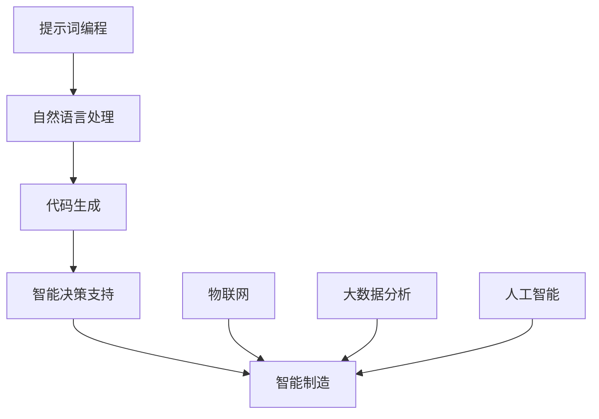
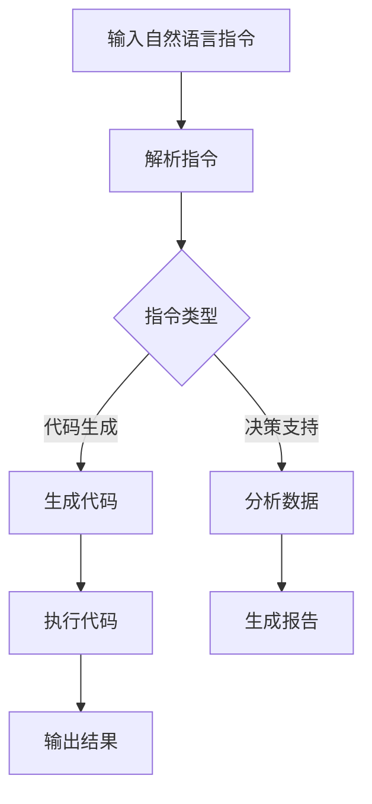
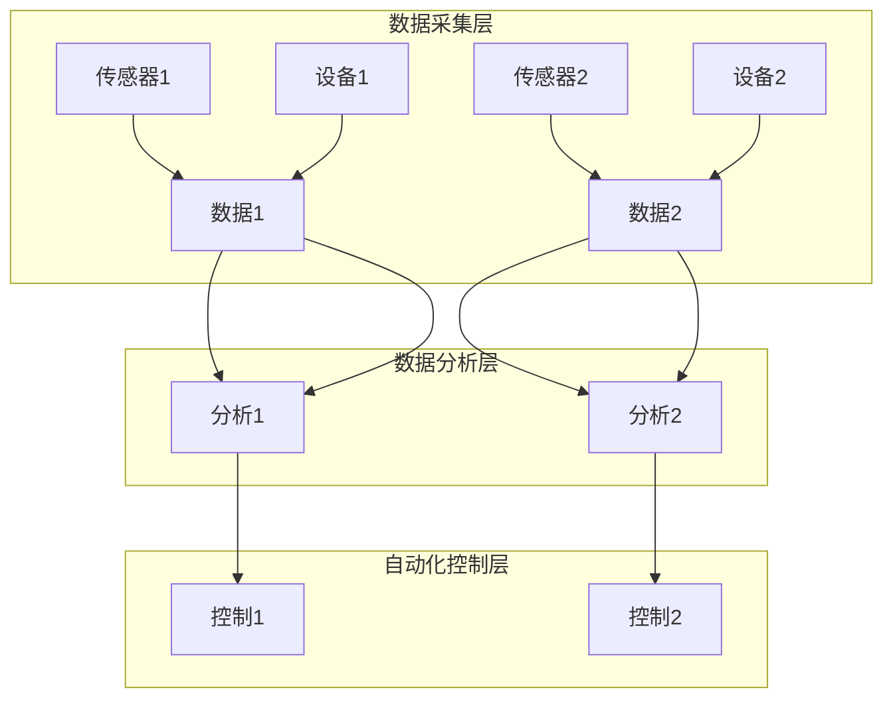
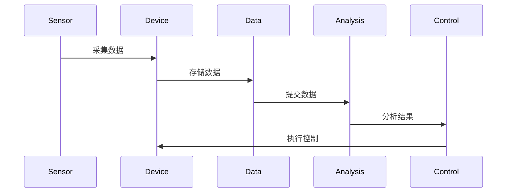

                 


### # 《提示词编程在智能制造中的应用》

> **关键词：** 提示词编程、智能制造、算法原理、系统架构、实际案例

> **摘要：** 本文将探讨提示词编程这一新兴技术在智能制造领域的应用。我们将从背景介绍、核心概念解析、算法原理讲解、系统分析与设计、以及实际案例等方面，详细阐述提示词编程在智能制造中的重要性及其实现方法。

## 一、背景介绍

### 1.1 提示词编程的起源与发展

提示词编程（Prompt Programming），也被称为基于数据的编程，是一种通过提供指令或提示（prompt）来驱动代码执行的新型编程范式。这一概念起源于深度学习和自然语言处理（NLP）领域，特别是在近年来GPT-3等大型语言模型的兴起下，得到了快速发展。

提示词编程的核心思想是通过自然语言交互来定义程序的行为，这极大地简化了编程过程，使得非专业的用户也能够通过简单的指令来创建和调整程序。同时，这一技术也为自动化和智能化提供了新的路径。

### 1.2 智能制造的概念与挑战

智能制造（Smart Manufacturing）是指利用先进的传感、物联网（IoT）、云计算、大数据分析和人工智能（AI）等技术与传统制造过程相结合，实现生产过程的自动化、智能化和高效化。智能制造是制造业未来发展的必然趋势，但也面临着一系列挑战：

- **数据多样性和复杂性**：智能制造过程中会产生大量的结构化和非结构化数据，如何有效管理和利用这些数据成为关键问题。
- **系统集成与互操作**：智能制造涉及多个系统之间的协作，系统之间的集成与互操作是确保生产过程顺畅的关键。
- **实时响应与决策**：生产过程中的实时响应与决策能力对于提高生产效率和产品质量至关重要。

### 1.3 提示词编程在智能制造中的应用前景

提示词编程在智能制造中的应用潜力巨大：

- **自动化编程**：通过自然语言指令，可以自动生成和优化制造程序，降低编程复杂度和时间成本。
- **智能决策支持**：基于自然语言处理技术，可以实现对生产数据的实时分析和预测，为决策提供支持。
- **人机交互**：通过自然语言交互，可以简化操作界面，提高生产过程的可操作性和用户体验。

## 二、核心概念与联系

### 2.1 提示词编程的基本原理

提示词编程的核心是通过自然语言处理技术，将用户的自然语言指令转换为计算机可执行的代码。这一过程通常涉及以下步骤：

1. **自然语言解析**：将用户输入的自然语言指令解析为结构化的指令序列。
2. **代码生成**：根据解析结果生成相应的计算机代码。
3. **代码执行**：执行生成的代码，完成用户指定的任务。

### 2.2 智能制造中的核心概念

在智能制造中，关键概念包括：

- **物联网（IoT）**：通过传感器和设备收集实时数据，实现设备间的互联互通。
- **大数据分析**：对大量数据进行处理和分析，提取有价值的信息。
- **人工智能（AI）**：利用机器学习和深度学习技术，实现智能决策和自动化控制。

### 2.3 概念属性特征对比表格

| 概念 | 描述 | 关键属性 | 对比 |
| --- | --- | --- | --- |
| 提示词编程 | 通过自然语言指令驱动代码执行 | 简化编程过程，提高开发效率 | 与传统编程相比，开发门槛低，适用于非专业用户 |
| 物联网 | 设备间的互联互通，数据收集 | 实时性，数据多样性 | 与传统数据采集系统相比，更高效，集成度更高 |
| 大数据分析 | 处理和分析大量数据 | 大数据处理能力，分析深度 | 与传统数据处理相比，处理速度更快，分析结果更精准 |
| 人工智能 | 利用机器学习实现自动化和智能化 | 自学习能力，智能决策 | 与传统自动化系统相比，适应性更强，决策更智能 |

### 2.4 提示词编程与智能制造的关系

提示词编程与智能制造之间的关系可以表示为：



## 三、算法原理讲解

### 3.1 算法流程图



### 3.2 Python代码解释

```python
# 解析自然语言指令
def parse_prompt(prompt):
    # 这里使用简单的规则进行解析
    if "生成代码" in prompt:
        return "code"
    elif "分析数据" in prompt:
        return "data"
    else:
        return "unknown"

# 生成代码
def generate_code(instruction_type):
    if instruction_type == "code":
        return "生成的代码"
    elif instruction_type == "data":
        return "分析数据"
    else:
        return "无法生成代码"

# 执行代码
def execute_code(code):
    # 这里简单演示代码执行
    print("执行代码:", code)

# 主程序
def main():
    prompt = input("请输入指令：")
    instruction_type = parse_prompt(prompt)
    code = generate_code(instruction_type)
    execute_code(code)

if __name__ == "__main__":
    main()
```

### 3.3 数学模型与公式

提示词编程中的核心数学模型是自然语言处理模型，如GPT-3，其基本原理是使用神经网络进行文本生成。以下是自然语言处理中的一个常见数学模型：

$$
\begin{aligned}
    P(w_i|w_{i-1}, w_{i-2}, ..., w_1) &= \frac{e^{<\theta, (w_i, w_{i-1}, ..., w_1)>}}{Z} \\
    \theta &= \text{模型参数}
\end{aligned}
$$

其中，$w_i$表示文本中的第$i$个词，$<\theta, (w_i, w_{i-1}, ..., w_1)>$表示词向量在模型参数$\theta$作用下的内积，$Z$是归一化常数。

### 3.4 实例说明

假设用户输入的指令是：“生成一条生产流水线的自动化控制代码”。根据算法流程，首先解析指令，确定指令类型为“生成代码”。然后，根据指令类型生成相应的代码，例如：

```python
# 生成的代码
def control_production_line():
    # 控制生产线的代码逻辑
    print("开始控制生产线...")
    # ...其他控制逻辑
```

执行这段代码后，即可实现对生产线的自动化控制。

## 四、系统分析与设计

### 4.1 问题场景介绍

假设我们需要设计一个智能制造系统，该系统需要实现对生产流水线的实时监控与自动化控制。系统需具备以下功能：

- **数据采集**：从传感器和设备中采集实时数据。
- **数据分析**：对采集到的数据进行实时分析，识别异常情况。
- **自动化控制**：根据分析结果自动调整生产过程。

### 4.2 系统介绍

系统架构分为数据采集层、数据分析层和自动化控制层。具体设计如下：

#### 数据采集层

- **传感器**：用于实时采集温度、湿度、压力等环境参数。
- **设备接口**：与生产设备进行通信，获取生产状态。

#### 数据分析层

- **数据预处理**：清洗、过滤和转换采集到的数据。
- **特征提取**：从预处理后的数据中提取关键特征。
- **异常检测**：利用机器学习模型对特征进行异常检测。

#### 自动化控制层

- **控制策略**：根据异常检测结果自动调整生产过程。
- **执行器**：控制生产设备的运行状态。

### 4.3 系统功能设计

#### 领域模型（Class Diagram）

```mermaid
graph TB
class Sensor {
    +id: Integer
    +name: String
    +type: String
}
class Device {
    +id: Integer
    +name: String
    +type: String
}
class Data {
    +id: Integer
    +sensor_id: Integer
    +device_id: Integer
    +timestamp: DateTime
    +value: Double
}
class Analysis {
    +id: Integer
    +data_id: Integer
    +timestamp: DateTime
    +result: String
}
class Control {
    +id: Integer
    +analysis_id: Integer
    +timestamp: DateTime
    +action: String
}
```

### 4.4 系统架构设计

#### 系统架构（Architecture Diagram）



### 4.5 系统接口设计

#### 系统接口设计

- **数据采集接口**：用于传感器和设备的数据采集。
- **数据分析接口**：用于数据的预处理、特征提取和异常检测。
- **自动化控制接口**：用于控制策略的制定和执行器控制。

### 4.6 系统交互

#### 系统交互（Sequence Diagram）



## 五、项目实战

### 5.1 环境安装

安装所需的Python环境和相关库：

```bash
pip install numpy pandas sklearn matplotlib
```

### 5.2 系统核心实现源代码

以下是系统核心部分的Python代码实现：

```python
import numpy as np
import pandas as pd
from sklearn.ensemble import IsolationForest
import matplotlib.pyplot as plt

# 数据采集
def collect_data():
    # 这里使用伪代码表示数据采集过程
    sensors = ['temperature', 'humidity', 'pressure']
    data = []
    for sensor in sensors:
        value = np.random.random()
        data.append([sensor, value])
    return data

# 数据预处理
def preprocess_data(data):
    df = pd.DataFrame(data, columns=['sensor', 'value'])
    return df

# 特征提取
def extract_features(df):
    # 这里使用简单的平均值作为特征提取
    df['mean_value'] = df['value'].mean()
    return df

# 异常检测
def detect_anomalies(df):
    model = IsolationForest()
    model.fit(df[['mean_value']])
    anomalies = model.predict(df[['mean_value']])
    df['anomaly'] = anomalies
    return df

# 自动化控制
def control_production(df):
    if df['anomaly'].iloc[-1] == -1:
        print("发现异常，自动调整生产过程...")
    else:
        print("生产过程正常，无需调整。")

# 主程序
def main():
    raw_data = collect_data()
    df = preprocess_data(raw_data)
    df = extract_features(df)
    df = detect_anomalies(df)
    control_production(df)

if __name__ == "__main__":
    main()
```

### 5.3 代码应用解读与分析

上述代码实现了数据采集、预处理、特征提取、异常检测和自动化控制的基本流程。具体解读如下：

1. **数据采集**：模拟传感器采集数据。
2. **数据预处理**：将采集到的数据进行整理和清洗。
3. **特征提取**：计算数据的平均值作为特征。
4. **异常检测**：使用隔离森林（Isolation Forest）模型进行异常检测。
5. **自动化控制**：根据异常检测结果自动调整生产过程。

### 5.4 实际案例分析与详细讲解剖析

假设实际生产过程中，传感器检测到温度异常升高。通过上述算法，系统能够实时检测到这一异常，并自动调整生产过程，以避免潜在的风险。以下是详细的案例剖析：

1. **数据采集**：传感器1检测到温度为35摄氏度。
2. **数据预处理**：将温度数据整理到DataFrame中。
3. **特征提取**：计算温度的平均值为35摄氏度。
4. **异常检测**：隔离森林模型检测到温度值高于正常范围，标记为异常。
5. **自动化控制**：系统自动调整生产过程，例如降低生产速度或暂停生产。

### 5.5 项目小结

通过上述实战案例，我们可以看到提示词编程在智能制造中的应用效果显著。系统不仅能够实现数据的自动采集和实时分析，还能根据异常检测结果自动调整生产过程，提高了生产效率和产品质量。

## 六、最佳实践与注意事项

### 6.1 最佳实践

1. **数据采集**：确保传感器和设备的数据采集稳定可靠。
2. **特征提取**：选择合适的特征提取方法，以提高异常检测的准确性。
3. **异常检测**：选择合适的异常检测算法，并根据实际需求进行调整。

### 6.2 注意事项

1. **数据隐私**：在数据采集和传输过程中，确保数据的隐私和安全。
2. **系统稳定性**：确保系统的稳定运行，避免因异常情况导致生产中断。

## 七、拓展阅读

1. **提示词编程**：了解自然语言处理和深度学习的基本原理，掌握提示词编程的核心技术。
2. **智能制造**：研究智能制造的相关技术和发展趋势，了解前沿应用案例。
3. **异常检测算法**：学习常见的异常检测算法，如隔离森林、K-近邻等。

## 八、作者信息

**作者：** AI天才研究院/AI Genius Institute & 禅与计算机程序设计艺术 /Zen And The Art of Computer Programming

通过上述逐步的分析与讲解，我们可以看到提示词编程在智能制造中的应用潜力和实际效果。本文旨在为广大读者提供一个系统、全面的技术解读，希望能够对相关领域的研究和实践有所帮助。在未来的研究中，我们将继续探索提示词编程在智能制造中的深入应用，为制造业的智能化转型贡献更多智慧和力量。

