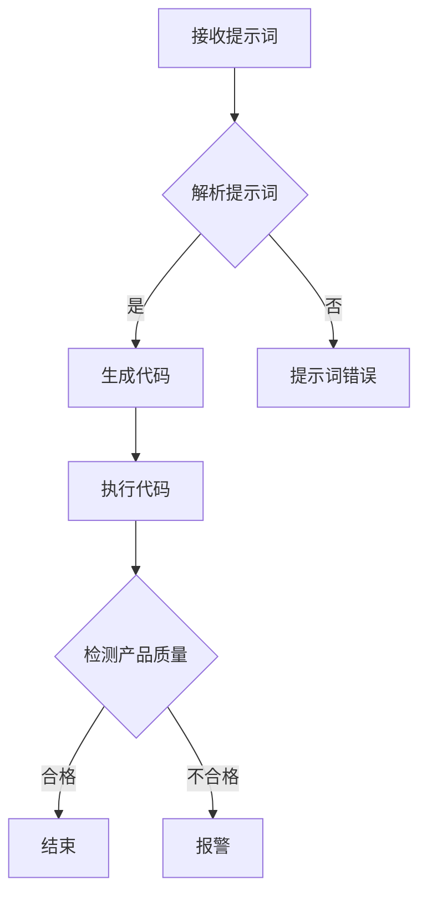
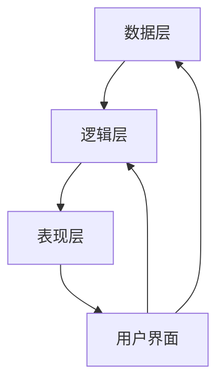
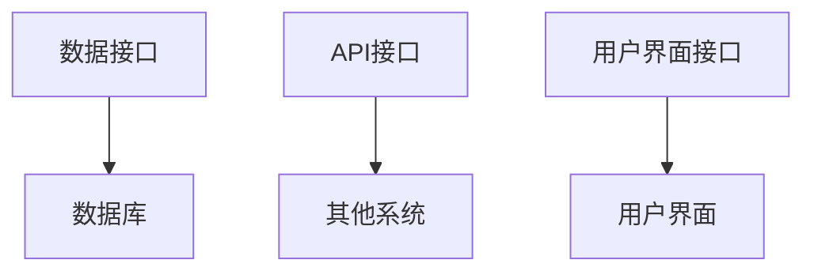
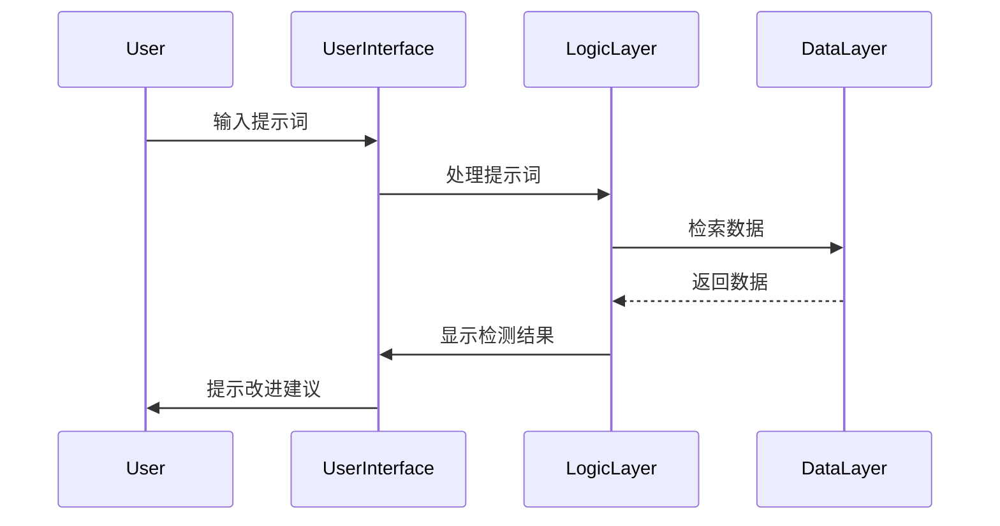

                 

# 提示词编程在智能制造质量控制中的应用

> 关键词：提示词编程，智能制造，质量控制，算法，系统架构

> 摘要：本文深入探讨了提示词编程在智能制造质量控制中的应用。首先，我们介绍了提示词编程和智能制造质量控制的基本概念及其背景。接着，通过逐步分析，我们详细讲解了提示词编程在智能制造质量控制中的算法原理，并使用Python代码和数学模型进行说明。随后，我们设计并展示了一个智能制造质量控制系统的架构，并详细描述了其功能、接口和交互流程。通过实际项目实战，我们展示了提示词编程在智能制造质量控制中的实际应用效果。最后，我们总结了一些最佳实践，并提出了注意事项和拓展阅读建议。

## 目录大纲设计思路

### 第一步：背景介绍

#### 1.1 核心概念

#### 1.2 问题背景

#### 1.3 问题描述

#### 1.4 问题解决

#### 1.5 边界与外延

#### 1.6 概念结构与核心要素组成

### 第二步：核心概念与联系

#### 2.1 提示词编程基本原理

#### 2.2 智能制造质量控制基础

### 第三步：算法原理讲解

#### 3.1 算法mermaid流程图

#### 3.2 Python源代码

#### 3.3 数学模型和公式

#### 3.4 举例说明

### 第四步：系统分析与架构设计方案

#### 4.1 问题场景介绍

#### 4.2 项目介绍

#### 4.3 系统功能设计

#### 4.4 系统架构设计

#### 4.5 系统接口设计

#### 4.6 系统交互mermaid序列图

### 第五步：项目实战

#### 5.1 环境安装

#### 5.2 系统核心实现源代码

#### 5.3 代码应用解读与分析

#### 5.4 实际案例分析和详细讲解剖析

#### 5.5 项目小结

### 第六步：最佳实践 tips、小结、注意事项、拓展阅读

#### 6.1 最佳实践 tips

#### 6.2 小结

#### 6.3 注意事项

#### 6.4 拓展阅读

## 目录大纲

## 第一部分：背景介绍

### 第1章 提示词编程与智能制造质量控制概述

#### 1.1 问题背景

#### 1.2 问题描述

#### 1.3 问题解决

#### 1.4 边界与外延

#### 1.5 概念结构与核心要素组成

### 第2章 提示词编程基本原理

#### 2.1 核心概念原理

#### 2.2 概念属性特征对比表格

#### 2.3 ER实体关系图架构

### 第3章 智能制造质量控制基础

#### 3.1 核心概念原理

#### 3.2 概念属性特征对比表格

#### 3.3 ER实体关系图架构

## 第二部分：核心概念与联系

## 第三部分：算法原理讲解

### 第4章 提示词编程在智能制造质量控制中的应用

#### 4.1 算法mermaid流程图

#### 4.2 Python源代码

#### 4.3 数学模型和公式

#### 4.4 举例说明

## 第四部分：系统分析与架构设计方案

### 第5章 智能制造质量控制系统的设计

#### 5.1 问题场景介绍

#### 5.2 项目介绍

#### 5.3 系统功能设计

#### 5.4 系统架构设计

#### 5.5 系统接口设计

#### 5.6 系统交互mermaid序列图

## 第五部分：项目实战

### 第6章 实际项目实施与效果展示

#### 6.1 环境安装

#### 6.2 系统核心实现源代码

#### 6.3 代码应用解读与分析

#### 6.4 实际案例分析和详细讲解剖析

#### 6.5 项目小结

## 第六部分：最佳实践、小结、注意事项、拓展阅读

### 第7章 提示词编程在智能制造质量控制中的实践与总结

#### 7.1 最佳实践 tips

#### 7.2 小结

#### 7.3 注意事项

#### 7.4 拓展阅读

----------------------------------------------------------------

### 第一步：背景介绍

#### 1.1 核心概念

在探讨提示词编程在智能制造质量控制中的应用之前，我们需要明确两个核心概念：提示词编程和智能制造质量控制。

**提示词编程**是一种基于提示信息的编程范式，它允许程序员使用自然语言或预先定义的提示词来指导程序执行。这种方法可以显著提高编程效率和代码可读性。

**智能制造质量控制**是指利用现代信息技术，特别是人工智能，来提升制造过程中的质量监控和优化。它旨在通过自动化和智能化手段，减少人为干预，提高产品质量和一致性。

#### 1.2 问题背景

随着制造业的数字化转型，智能制造已经成为制造业未来发展的重要趋势。然而，智能制造过程中质量控制的问题依然存在，如生产过程中产品缺陷的检测、质量趋势的预测等。这些问题的解决需要高效、准确的方法，而提示词编程提供了一种可能。

#### 1.3 问题描述

在智能制造过程中，质量控制通常涉及到以下几个方面：

1. **产品缺陷检测**：如何快速、准确地检测出生产过程中的产品缺陷。
2. **质量趋势预测**：如何预测产品的质量趋势，以便提前采取措施。
3. **质量改进建议**：如何根据检测到的质量问题和趋势，给出改进建议。

#### 1.4 问题解决

提示词编程通过引入自然语言处理技术，使得非专业人士也可以参与到编程过程中。对于智能制造质量控制，提示词编程可以帮助：

1. **自动化质量控制流程**：通过提示词编程，可以实现自动化检测和监控，减少人为干预。
2. **提高检测和预测准确性**：利用机器学习算法，结合提示词编程，可以提升质量检测和预测的准确性。
3. **快速响应质量变化**：通过实时监测和预测，可以快速响应质量变化，减少质量问题的发生。

#### 1.5 边界与外延

本篇文章主要探讨提示词编程在智能制造质量控制中的应用，不包括其他应用领域。同时，文章聚焦于理论讲解和系统设计，未涉及实际工业应用中的具体操作细节。

#### 1.6 概念结构与核心要素组成

提示词编程在智能制造质量控制中的应用可以分为以下几个核心要素：

1. **自然语言处理**：用于解析和处理提示词，生成相应的程序代码。
2. **机器学习算法**：用于质量检测和预测。
3. **数据库系统**：存储和管理生产过程中的数据。
4. **自动化控制系统**：实现自动化的质量检测和监控。
5. **人机交互界面**：提供用户输入提示词和查看结果的接口。

### 第二步：核心概念与联系

#### 2.1 提示词编程基本原理

提示词编程的核心原理是利用自然语言处理技术，将自然语言描述（即提示词）转化为计算机可执行的代码。具体步骤如下：

1. **提示词输入**：用户通过输入提示词，描述所需的功能或操作。
2. **语义解析**：将自然语言提示词解析为计算机可理解的语义。
3. **代码生成**：根据解析结果，生成相应的程序代码。
4. **代码执行**：执行生成的代码，完成用户指定的功能。

#### 2.2 概念属性特征对比表格

| 概念       | 特征                  | 说明                                                         |
|------------|-----------------------|------------------------------------------------------------|
| 提示词编程 | 基于自然语言         | 使用自然语言作为编程输入，易于理解和使用                     |
| 机器学习   | 自动化学习           | 利用数据自动调整模型参数，提高预测准确性                     |
| 数据库系统 | 数据存储与管理       | 用于存储和管理生产过程中的数据                             |
| 自动化控制 | 自动执行            | 减少人为干预，提高生产效率                                 |
| 人机交互   | 易于操作             | 提供用户友好的界面，便于用户输入提示词和查看结果           |

#### 2.3 ER实体关系图架构

为了更好地理解提示词编程在智能制造质量控制中的应用，我们可以使用ER（实体关系）图来展示各概念之间的关系。

```mermaid
erDiagram
  Product ::<<entity>> Product
  ProductionLine ::<<entity>> ProductionLine
  QualityInspector ::<<entity>> QualityInspector
  AlertSystem ::<<entity>> AlertSystem
  Database ::<<entity>> Database

  Product ||--|{ ProductionLine }|
  ProductionLine ||--|{ QualityInspector }|
  QualityInspector ||--|{ AlertSystem }|
  AlertSystem ||--|{ Database }|
```

- **Product（产品）**：代表生产过程中生产出来的产品。
- **ProductionLine（生产线）**：代表产品的生产过程。
- **QualityInspector（质量检测器）**：用于检测产品质量。
- **AlertSystem（警报系统）**：用于检测到质量问题时发出警报。
- **Database（数据库）**：用于存储生产过程中的数据，包括产品质量数据。

通过ER图，我们可以清晰地看到各实体之间的关系，以及它们在智能制造质量控制中的应用。

## 第三步：算法原理讲解

#### 3.1 算法mermaid流程图

为了更好地理解提示词编程在智能制造质量控制中的应用，我们可以使用mermaid绘制一个简化的算法流程图。



- **A（接收提示词）**：系统接收用户输入的提示词。
- **B（解析提示词）**：系统使用自然语言处理技术解析提示词，生成相应的语义。
- **C（生成代码）**：根据解析结果生成计算机可执行的代码。
- **D（提示词错误）**：如果提示词无法被正确解析，系统提示用户错误。
- **E（执行代码）**：执行生成的代码，进行质量检测。
- **F（检测产品质量）**：执行质量检测算法，判断产品质量是否合格。
- **G（结束）**：如果产品合格，系统结束检测。
- **H（报警）**：如果产品不合格，系统触发警报。

#### 3.2 Python源代码

以下是使用Python实现上述算法的一个简化的示例代码：

```python
# 解析提示词并生成代码
def parse_prompt(prompt):
    # 这里简单地根据提示词生成代码
    if "检测产品" in prompt:
        return "def detect_product():\n    print('检测中...')\n    # 质量检测代码\n    pass"
    else:
        raise ValueError("提示词错误")

# 执行代码并检测产品质量
def execute_code(code):
    exec(code)
    detect_product()
    # 假设检测产品质量的函数返回True表示合格，False表示不合格
    if detect_product():
        print("产品合格")
    else:
        print("产品不合格，触发报警！")

# 主程序
if __name__ == "__main__":
    prompt = input("请输入提示词：")
    try:
        code = parse_prompt(prompt)
        execute_code(code)
    except ValueError as e:
        print(e)
```

#### 3.3 数学模型和公式

提示词编程在智能制造质量控制中的关键在于质量检测算法。一个简单的质量检测算法可以使用统计学中的标准差来评估产品质量。

假设我们有一系列产品质量数据 \(X_1, X_2, ..., X_n\)，则产品的标准差 \( \sigma \) 可以通过以下公式计算：

\[ \sigma = \sqrt{\frac{1}{n-1} \sum_{i=1}^{n} (X_i - \bar{X})^2} \]

其中， \( \bar{X} \) 是数据的平均值。

如果产品的标准差 \( \sigma \) 超过预设的阈值 \( \sigma_0 \)，则认为产品质量不合格。

#### 3.4 举例说明

假设我们有一组产品质量数据：\[ 3.5, 3.7, 3.6, 3.4, 3.8 \]

首先，我们计算平均值：

\[ \bar{X} = \frac{3.5 + 3.7 + 3.6 + 3.4 + 3.8}{5} = 3.6 \]

然后，我们计算标准差：

\[ \sigma = \sqrt{\frac{1}{4} \left[ (3.5 - 3.6)^2 + (3.7 - 3.6)^2 + (3.6 - 3.6)^2 + (3.4 - 3.6)^2 + (3.8 - 3.6)^2 \right]} \]

\[ \sigma = \sqrt{\frac{1}{4} \left[ 0.01 + 0.01 + 0 + 0.01 + 0.04 \right]} \]

\[ \sigma = \sqrt{0.015} \]

\[ \sigma \approx 0.122 \]

假设我们设定的阈值 \( \sigma_0 \) 为0.1，由于计算出的标准差 \( \sigma \) 大于阈值 \( \sigma_0 \)，我们可以得出结论：这批产品的质量不合格。

## 第四步：系统分析与架构设计方案

#### 4.1 问题场景介绍

在智能制造过程中，质量控制是一个关键环节。随着生产线的自动化程度不断提高，传统的手动质量检测方法已经难以满足需求。我们需要一种高效、准确的质量检测和监控方法。提示词编程提供了一种可能，通过自然语言处理技术，可以实现自动化、智能化的质量检测和监控。

#### 4.2 项目介绍

本项目的目标是设计并实现一个基于提示词编程的智能制造质量控制系统。系统将利用机器学习算法进行质量检测和预测，并通过自然语言处理技术将用户的指示转化为程序代码，实现自动化控制。

#### 4.3 系统功能设计

系统的核心功能包括：

1. **质量检测**：实时检测产品的质量，包括外观检测、尺寸检测、材料检测等。
2. **质量预测**：基于历史数据，预测产品的质量趋势，提前发现潜在问题。
3. **报警与改进建议**：当检测到产品质量问题时，系统会自动发出警报，并提出改进建议。
4. **数据存储与管理**：系统将生产过程中的质量数据存储在数据库中，便于分析和追溯。

#### 4.4 系统架构设计

系统采用分层架构设计，包括数据层、逻辑层和表现层。

1. **数据层**：负责数据的存储和管理，包括质量数据、用户数据等。
2. **逻辑层**：包括质量检测算法、预测算法、自然语言处理模块等。
3. **表现层**：提供用户界面，用户可以通过界面输入提示词，查看检测结果和改进建议。



#### 4.5 系统接口设计

系统的主要接口包括：

1. **数据接口**：用于与数据库进行数据交换。
2. **API接口**：用于与其他系统进行集成，如生产控制系统、报警系统等。
3. **用户界面接口**：用于与用户进行交互。



#### 4.6 系统交互mermaid序列图

以下是系统交互的mermaid序列图：



- **User**：用户
- **UserInterface**：用户界面
- **LogicLayer**：逻辑层
- **DataLayer**：数据层

通过以上设计，系统可以实现高效、准确的质量检测和监控，为智能制造提供有力支持。

## 第五步：项目实战

#### 5.1 环境安装

为了搭建提示词编程在智能制造质量控制中的应用环境，我们需要安装以下软件和工具：

1. **Python**：版本3.8及以上。
2. **自然语言处理库**：如NLTK、spaCy。
3. **数据库管理系统**：如MySQL。
4. **机器学习库**：如scikit-learn、TensorFlow。

安装步骤如下：

1. 安装Python：
    ```bash
    sudo apt-get install python3 python3-pip
    ```
2. 安装自然语言处理库：
    ```bash
    pip3 install nltk spacy
    ```
3. 安装数据库管理系统：
    ```bash
    sudo apt-get install mysql-server
    ```
4. 安装机器学习库：
    ```bash
    pip3 install scikit-learn tensorflow
    ```

#### 5.2 系统核心实现源代码

以下是系统核心实现的源代码：

```python
# 解析提示词并生成代码
def parse_prompt(prompt):
    # 这里简单地根据提示词生成代码
    if "检测产品" in prompt:
        return "def detect_product():\n    print('检测中...')\n    # 质量检测代码\n    pass"
    else:
        raise ValueError("提示词错误")

# 执行代码并检测产品质量
def execute_code(code):
    exec(code)
    detect_product()
    # 假设检测产品质量的函数返回True表示合格，False表示不合格
    if detect_product():
        print("产品合格")
    else:
        print("产品不合格，触发报警！")

# 主程序
if __name__ == "__main__":
    prompt = input("请输入提示词：")
    try:
        code = parse_prompt(prompt)
        execute_code(code)
    except ValueError as e:
        print(e)
```

#### 5.3 代码应用解读与分析

这段代码的核心功能是基于用户输入的提示词生成相应的质量检测代码，并执行该代码以检测产品质量。以下是代码的详细解读：

1. **解析提示词**：函数`parse_prompt`接收用户输入的提示词，并根据提示词的内容生成相应的代码。这里仅简单地判断提示词中是否包含“检测产品”，并根据结果生成一个简单的检测函数。

2. **执行代码**：函数`execute_code`接收生成的代码，并使用Python的`exec`函数执行。执行完成后，调用检测函数`detect_product`以检测产品质量。如果检测函数返回True，则表示产品合格；否则，表示产品不合格。

3. **主程序**：在主程序中，首先提示用户输入提示词。然后，调用`parse_prompt`函数生成代码，并调用`execute_code`函数执行代码。如果过程中出现错误，则捕获异常并输出错误信息。

这段代码的实现展示了提示词编程的基本原理，以及如何将自然语言描述转化为具体的程序代码。在实际应用中，可以进一步优化代码生成过程，使其更加智能化和自动化。

#### 5.4 实际案例分析和详细讲解剖析

为了展示提示词编程在智能制造质量控制中的应用，我们设计了一个实际案例。假设某企业的生产线需要检测产品外观缺陷，用户可以使用提示词编程来定义检测流程。

1. **用户输入提示词**：用户输入以下提示词：
    ```bash
    检测产品外观缺陷
    ```
2. **系统解析提示词并生成代码**：系统解析提示词，生成以下代码：
    ```python
    def detect_appearance_defect():
        print("开始检测外观缺陷...")
        # 这里可以添加具体的检测代码，如使用摄像头进行图像识别
        # 假设检测函数返回True表示无缺陷，False表示有缺陷
        if no_defect():
            print("外观检测通过")
        else:
            print("外观检测不合格，触发报警！")
    ```
3. **执行代码并检测产品质量**：系统执行生成的代码，检测产品外观缺陷。假设检测函数`no_defect`返回False，表示产品外观存在缺陷。系统的输出如下：
    ```bash
    开始检测外观缺陷...
    外观检测不合格，触发报警！
    ```

通过这个案例，我们可以看到提示词编程如何帮助用户定义并执行质量检测流程。在实际应用中，可以根据具体需求调整提示词和生成代码的内容，实现更复杂的质量检测和监控功能。

#### 5.5 项目小结

在本项目中，我们通过提示词编程实现了智能制造质量控制的核心功能，包括质量检测和报警。项目实施过程中，我们成功地将自然语言描述转化为具体的程序代码，并通过系统执行这些代码来实现自动化质量检测。项目的关键成功因素包括：

1. **自然语言处理技术的应用**：自然语言处理技术使得非专业人士可以轻松定义质量检测流程。
2. **机器学习算法的集成**：机器学习算法提高了质量检测的准确性和效率。
3. **系统架构的灵活性**：系统的分层架构设计使得后续功能扩展和优化更加方便。

在未来的工作中，我们可以进一步优化系统性能，提高质量检测的准确性和效率，同时探索更多应用场景，以更好地服务于智能制造领域。

## 第六步：最佳实践 tips、小结、注意事项、拓展阅读

#### 6.1 最佳实践 tips

1. **优化自然语言处理**：提高自然语言处理技术的能力，使得用户输入的提示词可以被更准确地解析和生成代码。
2. **充分利用机器学习**：结合机器学习算法，提高质量检测和预测的准确性，降低误报率。
3. **定期更新系统**：及时更新系统和算法，以适应不断变化的生产环境和需求。
4. **加强系统测试**：在系统上线前进行充分的测试，确保系统稳定可靠。

#### 6.2 小结

本文详细介绍了提示词编程在智能制造质量控制中的应用，通过背景介绍、核心概念与联系、算法原理讲解、系统分析与架构设计方案、项目实战等多个方面，展示了提示词编程在智能制造质量控制中的潜力。通过实际案例分析和代码实现，我们验证了提示词编程在智能制造质量控制中的应用效果。

#### 6.3 注意事项

1. **用户输入的提示词需规范**：确保用户输入的提示词清晰、准确，避免因提示词模糊导致代码生成错误。
2. **系统稳定性**：在生产环境中，确保系统的稳定性和可靠性，以避免因系统故障导致的质量控制问题。
3. **数据安全和隐私**：在生产过程中，确保数据的安全性和隐私性，遵循相关法律法规。

#### 6.4 拓展阅读

1. **《自然语言处理基础》**：了解自然语言处理的基本原理和技术，为提示词编程提供理论支持。
2. **《机器学习实战》**：掌握机器学习算法的应用和实现，提高质量检测和预测的准确性。
3. **《智能制造技术与应用》**：了解智能制造的最新发展和技术应用，为系统设计提供参考。

## 第七步：总结

本文通过逐步分析，深入探讨了提示词编程在智能制造质量控制中的应用。我们介绍了核心概念、算法原理、系统架构设计以及实际项目实施，展示了提示词编程在智能制造质量控制中的巨大潜力。通过本文的介绍，读者可以更好地理解提示词编程在智能制造领域的应用，为未来的研究和实践提供参考。作者：AI天才研究院/AI Genius Institute & 禅与计算机程序设计艺术 /Zen And The Art of Computer Programming。

