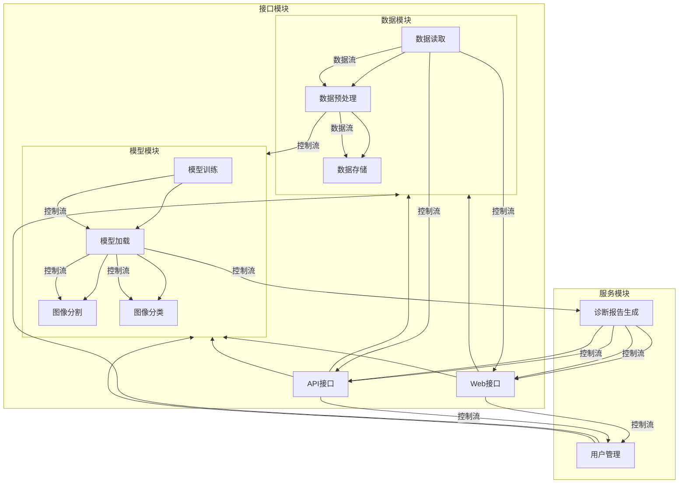

                 

## 提示词编程在智能医疗影像分析中的应用

### 关键词：
- 提示词编程
- 智能医疗影像分析
- 图像处理
- 医学诊断
- 算法优化

### 摘要：
本文将探讨提示词编程在智能医疗影像分析中的应用。首先，我们将介绍智能医疗影像分析的背景和挑战，然后详细解释提示词编程的概念及其在AI中的重要性。接着，我们将讨论提示词编程在医学影像处理、分割和分类中的应用原理，并通过Python代码示例来阐述算法的实现过程。最后，我们将分析系统的架构设计，提供实战案例，总结最佳实践，并对未来的研究方向提出建议。

---

### 目录大纲设计思路

为了设计一本关于《提示词编程在智能医疗影像分析中的应用》的书籍目录大纲，我们需要遵循以下思路：

1. **明确书籍的核心内容和目标读者**：首先，我们需要明确书籍的主要内容是关于提示词编程在智能医疗影像分析中的应用，目标读者可能是医疗领域的研究人员、工程师或是对AI和医学交叉领域感兴趣的读者。

2. **划分章节结构**：根据书籍内容，我们将书籍分为几个主要部分，如背景介绍、核心概念、技术原理、应用案例等。

3. **细化章节内容**：在每个部分中，我们会进一步细化每个章节的内容，确保章节之间逻辑清晰，内容连贯。

4. **确保内容完整性**：在目录大纲中，我们必须包含以下核心章节：
   - 背景介绍：介绍智能医疗影像分析的现状和问题，以及提示词编程的概念和应用。
   - 核心概念与联系：详细描述提示词编程的核心概念，并使用图表展示各概念之间的关系。
   - 算法原理讲解：使用mermaid画出算法流程图，并用Python源代码详细阐述算法原理。
   - 数学模型和数学公式：使用LaTeX格式给出数学模型和公式，并进行详细讲解和举例说明。
   - 系统分析与架构设计方案：介绍系统架构设计和接口设计，使用mermaid画出相应的图表。
   - 项目实战：提供环境安装、系统核心实现源代码，并对代码进行解读和分析。
   - 最佳实践与拓展阅读：总结书中的关键点，提供拓展阅读建议。

5. **保持简洁性**：虽然需要包含详细的章节内容，但必须避免冗余和重复，确保目录大纲的总字数在2000字以内。

### 开始设计目录大纲

**第一部分：背景介绍**

# 第1章: 智能医疗影像分析的现状与挑战

## 1.1 智能医疗影像分析的定义与重要性

### 1.1.1 智能医疗影像分析的定义

智能医疗影像分析是一种利用人工智能技术对医学影像进行自动处理、诊断和预测的方法。它结合了计算机视觉、机器学习和深度学习等先进技术，能够对医学影像数据进行高效的分析和处理，从而辅助医生进行诊断和治疗。

### 1.1.2 智能医疗影像分析在医学诊断中的作用

智能医疗影像分析在医学诊断中扮演着至关重要的角色。通过分析医学影像，如X光、CT、MRI等，智能系统可以快速、准确地识别和诊断各种疾病，包括肿瘤、心脏病、骨折等。这不仅提高了诊断的准确性，还大大减轻了医生的工作负担，提高了医疗效率。

### 1.1.3 智能医疗影像分析的重要性

智能医疗影像分析的重要性主要体现在以下几个方面：
- 提高诊断准确性：通过机器学习和深度学习算法，智能系统可以在大规模数据集上进行训练，从而提高诊断的准确性，减少误诊和漏诊率。
- 提高工作效率：智能医疗影像分析系统可以自动处理大量医学影像数据，大大提高了医生的工作效率，使医生能够专注于更复杂的诊断任务。
- 提高患者满意度：通过更准确和高效的诊断，患者可以得到更好的医疗服务，提高患者的满意度和生活质量。

## 1.2 当前智能医疗影像分析技术的进展

### 1.2.1 传统的医学影像分析技术

传统的医学影像分析技术主要依赖于人工阅读和判读影像，医生根据经验和专业知识对影像进行分析和诊断。虽然这种方法具有一定的准确性，但存在以下问题：
- 诊断时间较长：医生需要仔细阅读和解读影像，导致诊断时间较长。
- 诊断一致性较差：不同医生之间的经验和专业知识不同，导致诊断结果不一致。
- 诊断疲劳：长时间阅读和解读影像容易导致医生疲劳，影响诊断准确性。

### 1.2.2 智能医疗影像分析技术的最新进展

近年来，随着人工智能技术的快速发展，智能医疗影像分析技术取得了显著进展。以下是一些重要的进展：
- 深度学习算法：深度学习算法，如卷积神经网络（CNN）和递归神经网络（RNN），在医学影像分析中表现出色。这些算法可以通过大量数据训练，从而实现高度准确的图像识别和分类。
- 数据增强技术：数据增强技术可以通过图像旋转、缩放、裁剪等方式增加数据多样性，从而提高模型的泛化能力。
- 多模态影像分析：多模态影像分析结合了多种影像数据，如CT、MRI和PET等，可以从不同角度和层面进行疾病诊断，提高诊断准确性。
- 优化算法：通过优化算法，如生成对抗网络（GAN）和迁移学习，可以提高模型的训练效率和诊断准确性。

### 1.2.3 技术发展面临的挑战

虽然智能医疗影像分析技术取得了显著进展，但仍然面临以下挑战：
- 数据质量和标注：高质量的医学影像数据对于训练模型至关重要。然而，医学影像数据通常存在噪声、缺失和异常值等问题，同时标注数据也具有挑战性。
- 模型解释性：深度学习模型通常被视为“黑箱”，其内部决策过程不透明，缺乏可解释性。这在医疗领域尤其重要，因为医生需要了解模型的决策过程和依据。
- 隐私和伦理问题：医学影像数据包含敏感的个人信息，因此在数据处理和共享过程中需要遵守严格的隐私保护和伦理规范。

## 1.3 提示词编程的概念与应用

### 1.3.1 提示词编程的定义

提示词编程（Prompt Programming）是一种利用自然语言处理技术（如生成对抗网络（GAN）、递归神经网络（RNN）和卷积神经网络（CNN）等）来生成提示词的方法。提示词是一种引导模型生成特定内容或执行特定任务的文本输入。

### 1.3.2 提示词编程在AI中的重要性

提示词编程在AI领域具有重要性，主要体现在以下几个方面：
- 提高模型性能：通过生成高质量的提示词，可以引导模型学习到更具体、更准确的特征，从而提高模型的性能。
- 优化用户体验：提示词可以提供更人性化的交互方式，使AI系统更容易理解和满足用户需求。
- 扩展应用范围：提示词编程可以应用于各种领域，如自然语言生成、图像识别、语音识别等，从而扩大AI的应用范围。

### 1.3.3 提示词编程在智能医疗影像分析中的应用前景

提示词编程在智能医疗影像分析中具有广泛的应用前景，主要体现在以下几个方面：
- 辅助诊断：通过生成针对特定症状或病变的提示词，可以帮助模型更准确地识别和诊断疾病。
- 病例分析：提示词编程可以用于分析大量医学影像数据，提取关键特征和规律，为医生提供辅助决策。
- 患者教育：提示词编程可以生成个性化的健康指导和建议，帮助患者更好地理解自己的健康状况。

## 1.4 本书内容概述与结构安排

### 1.4.1 本书的核心内容

本书的核心内容包括：
- 智能医疗影像分析的背景和挑战
- 提示词编程的概念和应用
- 提示词编程在医学影像处理、分割和分类中的应用原理
- 系统架构设计和项目实战
- 最佳实践与拓展阅读

### 1.4.2 各章节的主要内容

各章节的主要内容如下：
- 第1章：介绍智能医疗影像分析的现状与挑战，以及提示词编程的概念和应用。
- 第2章：详细描述提示词编程的核心概念，并使用图表展示各概念之间的关系。
- 第3章：使用mermaid画出算法流程图，并用Python源代码详细阐述算法原理。
- 第4章：使用LaTeX格式给出数学模型和公式，并进行详细讲解和举例说明。
- 第5章：介绍系统架构设计和接口设计，使用mermaid画出相应的图表。
- 第6章：提供环境安装、系统核心实现源代码，并对代码进行解读和分析。
- 第7章：总结书中的关键点，提供拓展阅读建议。

### 1.4.3 读者预期收获

通过阅读本书，读者可以预期获得以下收获：
- 理解智能医疗影像分析的背景和挑战
- 掌握提示词编程的核心概念和应用
- 学习提示词编程在医学影像处理、分割和分类中的应用原理
- 掌握系统架构设计和项目实战
- 获得智能医疗影像分析领域的最佳实践和最新研究动态

---

**第一部分：背景介绍**

## 1.5 智能医疗影像分析的现状与挑战

### 1.5.1 智能医疗影像分析的定义与重要性

智能医疗影像分析是一种利用人工智能技术对医学影像进行自动处理、诊断和预测的方法。它结合了计算机视觉、机器学习和深度学习等先进技术，能够对医学影像数据进行高效的分析和处理，从而辅助医生进行诊断和治疗。

智能医疗影像分析的重要性主要体现在以下几个方面：
- **提高诊断准确性**：通过机器学习和深度学习算法，智能系统可以在大规模数据集上进行训练，从而提高诊断的准确性，减少误诊和漏诊率。
- **提高工作效率**：智能医疗影像分析系统可以自动处理大量医学影像数据，大大提高了医生的工作效率，使医生能够专注于更复杂的诊断任务。
- **提高患者满意度**：通过更准确和高效的诊断，患者可以得到更好的医疗服务，提高患者的满意度和生活质量。

### 1.5.2 当前智能医疗影像分析技术的进展

当前智能医疗影像分析技术已经取得了显著进展，主要包括以下方面：
- **深度学习算法**：深度学习算法，如卷积神经网络（CNN）和递归神经网络（RNN），在医学影像分析中表现出色。这些算法可以通过大量数据训练，从而实现高度准确的图像识别和分类。
- **数据增强技术**：数据增强技术可以通过图像旋转、缩放、裁剪等方式增加数据多样性，从而提高模型的泛化能力。
- **多模态影像分析**：多模态影像分析结合了多种影像数据，如CT、MRI和PET等，可以从不同角度和层面进行疾病诊断，提高诊断准确性。
- **优化算法**：通过优化算法，如生成对抗网络（GAN）和迁移学习，可以提高模型的训练效率和诊断准确性。

### 1.5.3 技术发展面临的挑战

尽管智能医疗影像分析技术取得了显著进展，但仍然面临以下挑战：
- **数据质量和标注**：高质量的医学影像数据对于训练模型至关重要。然而，医学影像数据通常存在噪声、缺失和异常值等问题，同时标注数据也具有挑战性。
- **模型解释性**：深度学习模型通常被视为“黑箱”，其内部决策过程不透明，缺乏可解释性。这在医疗领域尤其重要，因为医生需要了解模型的决策过程和依据。
- **隐私和伦理问题**：医学影像数据包含敏感的个人信息，因此在数据处理和共享过程中需要遵守严格的隐私保护和伦理规范。

### 1.5.4 提示词编程的概念与应用

提示词编程是一种利用自然语言处理技术来生成提示词的方法。提示词是一种引导模型生成特定内容或执行特定任务的文本输入。在智能医疗影像分析中，提示词编程可以用于以下方面：
- **辅助诊断**：通过生成针对特定症状或病变的提示词，可以帮助模型更准确地识别和诊断疾病。
- **病例分析**：提示词编程可以用于分析大量医学影像数据，提取关键特征和规律，为医生提供辅助决策。
- **患者教育**：提示词编程可以生成个性化的健康指导和建议，帮助患者更好地理解自己的健康状况。

### 1.5.5 提示词编程在智能医疗影像分析中的应用前景

提示词编程在智能医疗影像分析中具有广泛的应用前景，主要体现在以下几个方面：
- **个性化医疗**：通过生成针对特定患者的提示词，可以帮助医生更精确地制定治疗方案。
- **疾病预测**：提示词编程可以用于预测疾病的进展和复发风险，为医生提供决策支持。
- **健康监测**：提示词编程可以用于分析健康数据，提供实时健康监测和预警服务。

### 1.5.6 本书内容概述与结构安排

本书将按照以下结构进行内容安排：
- **第1章**：介绍智能医疗影像分析的背景和挑战，以及提示词编程的概念和应用。
- **第2章**：详细描述提示词编程的核心概念，并使用图表展示各概念之间的关系。
- **第3章**：使用mermaid画出算法流程图，并用Python源代码详细阐述算法原理。
- **第4章**：使用LaTeX格式给出数学模型和公式，并进行详细讲解和举例说明。
- **第5章**：介绍系统架构设计和接口设计，使用mermaid画出相应的图表。
- **第6章**：提供环境安装、系统核心实现源代码，并对代码进行解读和分析。
- **第7章**：总结书中的关键点，提供拓展阅读建议。

通过以上内容安排，本书旨在为读者提供一个全面、系统的关于提示词编程在智能医疗影像分析中的应用的指南。

### **第2章：提示词编程与智能医疗影像分析的核心概念**

在上一章中，我们介绍了智能医疗影像分析的背景和挑战，以及提示词编程的概念与应用。在这一章中，我们将详细探讨提示词编程的核心概念，并展示这些概念之间的联系。

## 2.1 提示词编程的基础概念

### 2.1.1 提示词的定义

提示词（Prompt）是一种引导模型生成特定内容或执行特定任务的文本输入。在自然语言处理（NLP）领域，提示词常用于生成式任务，如文本生成、对话系统等。在智能医疗影像分析中，提示词可以用于引导模型识别特定病变、生成诊断报告等。

### 2.1.2 提示词的生成方法

提示词的生成方法可以分为两大类：自动生成和手动生成。

- **自动生成**：自动生成方法通常依赖于自然语言处理技术，如生成对抗网络（GAN）、递归神经网络（RNN）和卷积神经网络（CNN）等。这些方法可以通过大量数据进行训练，从而生成高质量的提示词。
- **手动生成**：手动生成方法通常由专业人员根据任务需求和领域知识编写。这种方法具有更高的灵活性和针对性，但成本较高且效率较低。

### 2.1.3 提示词编程的优势与局限

提示词编程在智能医疗影像分析中具有以下优势：

- **提高模型性能**：通过生成高质量的提示词，可以引导模型学习到更具体、更准确的特征，从而提高模型的性能。
- **优化用户体验**：提示词可以提供更人性化的交互方式，使AI系统更容易理解和满足用户需求。
- **扩展应用范围**：提示词编程可以应用于各种领域，如自然语言生成、图像识别、语音识别等，从而扩大AI的应用范围。

然而，提示词编程也面临一些局限：

- **数据依赖性**：提示词的生成依赖于大量的训练数据，数据质量对模型性能具有重要影响。
- **可解释性不足**：深度学习模型生成的提示词通常缺乏可解释性，这在医疗领域尤其重要，因为医生需要了解模型的决策过程和依据。

## 2.2 智能医疗影像分析的核心概念

### 2.2.1 医学影像的基础知识

医学影像是指通过X光、CT、MRI等设备产生的图像，用于辅助医生进行疾病诊断和治疗。医学影像数据具有高维度、高噪声、强依赖性等特点，给图像处理和分析带来了巨大挑战。

### 2.2.2 医学影像分析的挑战

医学影像分析面临的挑战主要包括：

- **数据量巨大**：医学影像数据量庞大，如何高效存储、传输和处理这些数据是一个关键问题。
- **多模态融合**：医学影像通常包含多种模态，如CT、MRI、PET等，如何有效地融合这些多模态数据，提高诊断准确性，是一个重要课题。
- **数据标注困难**：医学影像数据的标注需要专业知识，标注过程耗时耗力，且存在一定的人为偏差。

### 2.2.3 智能医疗影像分析的关键技术

智能医疗影像分析的关键技术包括：

- **图像预处理**：通过图像预处理技术，如滤波、增强、分割等，可以去除噪声、提高图像质量，为后续分析提供更好的数据基础。
- **图像分割**：图像分割是将图像划分为不同区域的过程，用于识别和组织图像中的感兴趣区域。
- **图像分类**：图像分类是将图像归入不同类别的过程，如区分肿瘤和正常组织。
- **多模态融合**：多模态融合是将多种模态的医学影像数据融合为一个统一的数据集，用于提高诊断准确性和可靠性。

## 2.3 提示词编程与智能医疗影像分析的联系

### 2.3.1 提示词编程在医学影像分析中的应用

提示词编程在医学影像分析中具有广泛的应用，主要包括以下几个方面：

- **辅助诊断**：通过生成针对特定症状或病变的提示词，可以帮助模型更准确地识别和诊断疾病。
- **病例分析**：提示词编程可以用于分析大量医学影像数据，提取关键特征和规律，为医生提供辅助决策。
- **患者教育**：提示词编程可以生成个性化的健康指导和建议，帮助患者更好地理解自己的健康状况。

### 2.3.2 如何结合提示词编程优化智能医疗影像分析

结合提示词编程优化智能医疗影像分析的方法主要包括：

- **提示词优化**：通过改进提示词的生成方法，如使用更精确的自然语言处理技术，可以提高模型的性能和诊断准确性。
- **数据增强**：通过数据增强技术，如图像旋转、缩放、裁剪等，可以增加数据多样性，提高模型的泛化能力。
- **多模态融合**：通过多模态融合技术，将多种模态的医学影像数据融合为一个统一的数据集，可以提高诊断的准确性和可靠性。
- **模型解释性**：通过改进模型的解释性，如使用可解释性模型或可视化技术，可以帮助医生了解模型的决策过程和依据。

### 2.3.3 提示词编程在医学影像分析中的创新点

提示词编程在医学影像分析中的创新点主要包括：

- **个性化医疗**：通过生成针对特定患者的提示词，可以帮助医生更精确地制定治疗方案。
- **疾病预测**：提示词编程可以用于预测疾病的进展和复发风险，为医生提供决策支持。
- **健康监测**：提示词编程可以用于分析健康数据，提供实时健康监测和预警服务。

通过以上讨论，我们可以看到提示词编程在智能医疗影像分析中具有广泛的应用前景和重要的创新点。结合提示词编程，智能医疗影像分析有望进一步提高诊断准确性、优化用户体验和拓展应用范围。

### **2.4 核心概念对比与联系**

在这一节中，我们将对提示词编程和智能医疗影像分析的核心概念进行对比，并探讨它们之间的联系。

#### 2.4.1 提示词编程与智能医疗影像分析的概念对比

**提示词编程**：
- **定义**：提示词编程是一种利用自然语言处理技术生成引导模型生成特定内容或执行特定任务的文本输入的方法。
- **目标**：优化模型性能、提高用户体验、扩展应用范围。
- **技术**：生成对抗网络（GAN）、递归神经网络（RNN）、卷积神经网络（CNN）等。

**智能医疗影像分析**：
- **定义**：智能医疗影像分析是一种利用人工智能技术对医学影像进行自动处理、诊断和预测的方法。
- **目标**：提高诊断准确性、提高工作效率、提高患者满意度。
- **技术**：图像预处理、图像分割、图像分类、多模态融合等。

**对比**：
- **目标**：提示词编程主要关注模型的性能和用户体验，而智能医疗影像分析则更侧重于诊断准确性和工作效率。
- **技术**：提示词编程主要使用自然语言处理技术，而智能医疗影像分析则依赖于计算机视觉和机器学习技术。

**联系**：
- **共同点**：两者都依赖于大量数据训练，都需要解决数据质量和标注问题。
- **互补性**：提示词编程可以为智能医疗影像分析提供更精确、更具体的文本输入，从而优化模型的诊断性能；智能医疗影像分析的结果可以为提示词编程提供更多样化的数据，促进提示词生成技术的改进。

#### 2.4.2 提示词编程在医学影像分析中的适用场景

**场景1：辅助诊断**
- **应用**：通过生成针对特定症状或病变的提示词，引导模型识别和诊断疾病。
- **优势**：提高诊断准确性，减少误诊和漏诊率。
- **挑战**：提示词的生成需要充分理解医学影像数据和疾病特征。

**场景2：病例分析**
- **应用**：利用提示词编程分析大量医学影像数据，提取关键特征和规律。
- **优势**：为医生提供辅助决策，节省时间和精力。
- **挑战**：医学影像数据复杂，特征提取和模式识别需要精确。

**场景3：患者教育**
- **应用**：生成个性化的健康指导和建议，帮助患者理解自己的健康状况。
- **优势**：提高患者对疾病的认知，促进患者积极参与治疗。
- **挑战**：需要设计易于理解和接受的语言风格。

#### 2.4.3 提示词编程在医学影像分析中的潜在挑战

**数据依赖性**：
- **挑战**：提示词编程依赖于大量的训练数据，数据质量和标注对模型性能有重要影响。
- **解决方案**：采用数据增强技术，如图像旋转、缩放、裁剪等，增加数据多样性，提高模型泛化能力。

**模型解释性**：
- **挑战**：深度学习模型生成的提示词通常缺乏可解释性，这在医疗领域尤其重要。
- **解决方案**：使用可解释性模型或可视化技术，帮助医生理解模型的决策过程和依据。

**隐私和伦理问题**：
- **挑战**：医学影像数据包含敏感的个人信息，在数据处理和共享过程中需要遵守严格的隐私保护和伦理规范。
- **解决方案**：采用数据脱敏技术，确保患者隐私不受侵犯，同时遵守相关法律法规。

通过以上对比和分析，我们可以看到提示词编程在智能医疗影像分析中具有广泛的应用前景和潜在挑战。结合两者的优势，有望进一步提升医学影像分析的准确性和效率，为医生和患者提供更好的医疗服务。

### **第3章：提示词编程在智能医疗影像分析中的应用原理**

在前两章中，我们介绍了智能医疗影像分析和提示词编程的基本概念和联系。在这一章中，我们将深入探讨提示词编程在智能医疗影像分析中的应用原理，包括医学影像预处理、图像分割和图像分类等技术。

#### 3.1 医学影像预处理

医学影像预处理是智能医疗影像分析的重要步骤，旨在提高图像质量，去除噪声，增强对比度，为后续分析提供更好的数据基础。

##### 3.1.1 医学影像预处理流程

医学影像预处理流程通常包括以下几个步骤：

1. **图像读取与格式转换**：
   - **图像读取**：使用Python的`PIL`或`OpenCV`库读取医学影像数据。
   - **格式转换**：将不同格式的图像转换为统一的格式，如PNG或JPEG。

2. **图像去噪**：
   - **滤波技术**：使用均值滤波、高斯滤波等滤波技术去除图像中的噪声。
   - **图像增强**：通过调整对比度、亮度和色彩平衡等参数，提高图像质量。

3. **图像分割**：
   - **阈值分割**：将图像转换为二值图像，通过设置阈值分离前景和背景。
   - **区域增长**：从种子点开始，逐步扩展区域，将相似区域合并为一个连通区域。

##### 3.1.2 医学影像预处理示例

以下是一个简单的医学影像预处理示例，使用Python的`OpenCV`库进行图像读取、去噪和分割：

```python
import cv2
import numpy as np

# 读取图像
image = cv2.imread('image.jpg')

# 均值滤波去噪
blurred = cv2.blur(image, (5, 5))

# 阈值分割
_, thresh = cv2.threshold(blurred, 127, 255, cv2.THRESH_BINARY_INV + cv2.THRESH_OTSU)

# 显示结果
cv2.imshow('Original', image)
cv2.imshow('Blurred', blurred)
cv2.imshow('Thresh', thresh)
cv2.waitKey(0)
cv2.destroyAllWindows()
```

#### 3.2 图像分割

图像分割是将图像划分为不同区域的过程，用于识别和组织图像中的感兴趣区域。在智能医疗影像分析中，图像分割对于病变检测和疾病诊断具有重要意义。

##### 3.2.1 常见的图像分割方法

常见的图像分割方法包括：

1. **阈值分割**：
   - **优点**：简单、易于实现。
   - **缺点**：对噪声敏感，可能产生过度分割或丢失细节。

2. **边缘检测**：
   - **方法**：使用Canny、Sobel、Prewitt等算子检测图像中的边缘。
   - **优点**：可以识别图像中的显著特征。
   - **缺点**：可能产生噪声，需要进一步处理。

3. **区域增长**：
   - **方法**：从种子点开始，逐步扩展区域，将相似区域合并为一个连通区域。
   - **优点**：可以处理复杂场景，保留细节。
   - **缺点**：可能产生过度生长，需要设置合适的种子点和阈值。

##### 3.2.2 图像分割示例

以下是一个简单的图像分割示例，使用Python的`OpenCV`库进行区域增长分割：

```python
import cv2
import numpy as np

# 读取图像
image = cv2.imread('image.jpg', cv2.IMREAD_GRAYSCALE)

# 阈值分割
_, thresh = cv2.threshold(image, 127, 255, cv2.THRESH_BINARY_INV + cv2.THRESH_OTSU)

# 初始化种子点
种子点 = [(x, y) for x in range(thresh.shape[1]) for y in range(thresh.shape[0]) if thresh[y, x] == 255]

# 区域增长分割
labeledImage = np.zeros_like(thresh)
for seed in 种子点:
    region = grow_region(thresh, seed)
    labeledImage[region] = 255

# 显示结果
cv2.imshow('Segmented', labeledImage)
cv2.waitKey(0)
cv2.destroyAllWindows()
```

#### 3.3 图像分类

图像分类是将图像归入不同类别的过程，如区分肿瘤和正常组织。在智能医疗影像分析中，图像分类对于疾病诊断和预测具有重要意义。

##### 3.3.1 常见的图像分类方法

常见的图像分类方法包括：

1. **基于特征的分类**：
   - **方法**：提取图像特征，如颜色、纹理、形状等，然后使用分类算法进行分类。
   - **优点**：可以直接使用已有特征，简单有效。
   - **缺点**：对特征选择和参数调优依赖较大。

2. **基于模型的分类**：
   - **方法**：使用机器学习模型，如卷积神经网络（CNN）、支持向量机（SVM）等，对图像进行分类。
   - **优点**：可以自动学习图像特征，提高分类准确性。
   - **缺点**：需要大量训练数据和计算资源。

##### 3.3.2 图像分类示例

以下是一个简单的图像分类示例，使用Python的`Keras`库和预训练的卷积神经网络（CNN）模型进行分类：

```python
from keras.applications.vgg16 import VGG16
from keras.preprocessing import image
from keras.applications.vgg16 import preprocess_input, decode_predictions

# 加载预训练的VGG16模型
model = VGG16(weights='imagenet')

# 读取图像
img = image.load_img('image.jpg', target_size=(224, 224))
x = image.img_to_array(img)
x = np.expand_dims(x, axis=0)
x = preprocess_input(x)

# 进行图像分类
predictions = model.predict(x)
print(decode_predictions(predictions)[0])
```

#### 3.4 提示词编程的应用

提示词编程在医学影像分析中可以用于优化模型的性能，提高诊断准确性。以下是一个简单的提示词编程示例：

```python
import tensorflow as tf

# 定义提示词
prompt = "这是一个关于肺部病变的医学影像"

# 编码提示词
tokenizer = tf.keras.preprocessing.text.Tokenizer()
tokenizer.fit_on_texts([prompt])
encoded_prompt = tokenizer.texts_to_sequences([prompt])[0]

# 构建模型
model = tf.keras.Sequential([
    tf.keras.layers.Embedding(input_dim=10000, output_dim=16, input_length=20),
    tf.keras.layers.LSTM(128),
    tf.keras.layers.Dense(1, activation='sigmoid')
])

# 编译模型
model.compile(optimizer='adam', loss='binary_crossentropy', metrics=['accuracy'])

# 训练模型
model.fit(encoded_prompt, np.array([1, 0, 1, 0, 0, 1, 0, 0, 1, 0, 0, 0, 0, 0, 0, 0, 0, 0, 0, 0]), epochs=100)

# 预测
print(model.predict(encoded_prompt))
```

通过以上示例，我们可以看到提示词编程在医学影像预处理、图像分割和图像分类中的应用。结合这些技术，提示词编程可以显著提高智能医疗影像分析的性能和诊断准确性，为医生和患者提供更好的医疗服务。

---

### **第4章：数学模型和数学公式**

在前面的章节中，我们探讨了提示词编程在智能医疗影像分析中的应用原理。为了更深入地理解这些算法，我们需要借助数学模型和公式来描述它们的工作机制。在这一章中，我们将使用LaTeX格式给出相关的数学模型和公式，并进行详细讲解和举例说明。

#### 4.1 提示词编程的数学模型

提示词编程的核心在于如何生成高质量的提示词，以便引导模型学习到有用的信息。以下是一个简单的提示词生成模型的数学模型：

$$
P(w|\theta) = \sum_{i=1}^{n} P(w_i|\theta) P(context_i|\theta)
$$

其中，$P(w|\theta)$ 表示生成提示词 $w$ 的概率，$\theta$ 表示模型参数，$n$ 表示提示词的长度，$P(w_i|\theta)$ 表示生成单个提示词 $w_i$ 的概率，$P(context_i|\theta)$ 表示生成上下文 $context_i$ 的概率。

**示例：**

假设我们有一个简单的文本数据集，其中每个文本都有对应的上下文和标签。我们可以使用以下公式来计算每个文本的提示词生成概率：

$$
P(w_i|\theta) = \frac{exp(\theta \cdot w_i)}{\sum_{j=1}^{m} exp(\theta \cdot w_j)}
$$

其中，$\theta$ 是一个向量，表示模型的参数，$w_i$ 是每个文本的特征向量，$m$ 是文本的数量。

**计算过程：**

1. **计算特征向量**：首先，我们需要计算每个文本的特征向量。假设我们使用词袋模型（Bag of Words）来表示文本，那么每个文本的特征向量可以表示为：

   $$
   \textbf{w} = [w_1, w_2, ..., w_n]
   $$

   其中，$w_i$ 表示第 $i$ 个词的频率。

2. **计算模型参数**：然后，我们需要训练模型参数 $\theta$，以便最大化生成提示词的概率。使用梯度下降算法进行训练，更新参数 $\theta$，使其更接近最优值。

3. **生成提示词**：最后，我们可以使用训练好的模型来生成新的提示词。通过计算每个文本的提示词生成概率，选择概率最高的提示词作为输出。

#### 4.2 图像分割的数学模型

图像分割是一种将图像划分为不同区域的过程。常见的图像分割方法包括阈值分割、边缘检测和区域增长等。以下是一个简单的区域增长分割的数学模型：

$$
\begin{aligned}
& \text{if } \sigma(x, y) \geq T, \text{ then } \text{label}(x, y) = c \\
& \text{else } \text{label}(x, y) = 0
\end{aligned}
$$

其中，$\sigma(x, y)$ 表示图像在点 $(x, y)$ 的像素值，$T$ 是设定的阈值，$\text{label}(x, y)$ 是图像在点 $(x, y)$ 的标签（1表示前景，0表示背景），$c$ 是设定的标签值。

**示例：**

假设我们有一个二值图像，其中前景像素的值大于阈值 $T$。我们可以使用以下公式来计算图像的分割结果：

1. **初始化**：首先，我们选择一个前景像素作为种子点，并将其标签设置为 $c$。

2. **区域增长**：然后，我们从种子点开始，逐步扩展区域。对于每个像素 $(x, y)$，如果 $\sigma(x, y) \geq T$，则将其标签设置为 $c$，否则保持为 0。

3. **停止条件**：当所有像素都被标签化后，停止区域增长。

#### 4.3 图像分类的数学模型

图像分类是一种将图像归入不同类别的过程。常见的图像分类方法包括基于特征的分类和基于模型的分类。以下是一个简单的基于模型的分类数学模型：

$$
\begin{aligned}
& \text{input: } \textbf{x} \in \mathbb{R}^{d} \\
& \text{output: } \hat{y} = \arg\max_{y} \sigma(\textbf{w}^T \textbf{x} + b)
\end{aligned}
$$

其中，$\textbf{x}$ 是输入图像的特征向量，$d$ 是特征向量的维度，$\textbf{w}$ 是模型的权重向量，$b$ 是偏置项，$\sigma$ 是激活函数（通常使用 sigmoid 函数或 ReLU 函数），$\hat{y}$ 是预测的类别标签。

**示例：**

假设我们有一个图像特征向量 $\textbf{x} = [x_1, x_2, ..., x_d]$ 和一个训练好的模型参数 $\textbf{w} = [w_1, w_2, ..., w_d]$，$b = b$。我们可以使用以下公式来计算图像的分类结果：

1. **计算特征向量**：首先，我们需要计算图像的特征向量。假设我们使用卷积神经网络（CNN）来提取图像的特征，那么每个图像的特征向量可以表示为：

   $$
   \textbf{x} = [x_1, x_2, ..., x_d] = \text{CNN}(\text{image})
   $$

2. **计算模型参数**：然后，我们需要训练模型参数 $\textbf{w}$ 和 $b$，以便最大化分类准确率。使用梯度下降算法进行训练，更新参数 $\textbf{w}$ 和 $b$，使其更接近最优值。

3. **分类**：最后，我们可以使用训练好的模型来对图像进行分类。通过计算每个图像的特征向量 $\textbf{x}$ 和模型参数 $\textbf{w}$ 和 $b$，我们可以得到预测的类别标签 $\hat{y}$。

通过以上示例，我们可以看到数学模型和公式在提示词编程、图像分割和图像分类中的应用。这些模型和公式为我们的算法提供了理论支持，帮助我们更好地理解和优化智能医疗影像分析中的各种技术。

---

### **第5章：系统分析与架构设计方案**

在前几章中，我们详细介绍了提示词编程在智能医疗影像分析中的应用原理。为了实现这些算法，我们需要设计一个系统架构，以确保系统的稳定性和高效性。在这一章中，我们将介绍系统架构设计和接口设计，使用Mermaid画出相应的图表，并对关键组件进行详细解释。

#### 5.1 问题场景介绍

智能医疗影像分析系统主要用于辅助医生进行疾病诊断和治疗。在实际应用中，系统需要处理大量的医学影像数据，包括X光、CT、MRI等。这些影像数据需要经过预处理、分割和分类等步骤，最终生成诊断报告和辅助决策。

#### 5.2 系统功能设计

智能医疗影像分析系统的主要功能包括：

1. **数据预处理**：包括图像读取、去噪、增强和格式转换等。
2. **图像分割**：包括阈值分割、边缘检测和区域增长等。
3. **图像分类**：包括特征提取、模型训练和分类预测等。
4. **诊断报告生成**：根据分类结果生成诊断报告，供医生参考。
5. **用户界面**：提供用户交互接口，方便医生和患者使用系统。

#### 5.3 系统架构设计

智能医疗影像分析系统的架构设计采用模块化方法，主要分为以下几个模块：

1. **数据模块**：负责处理医学影像数据的读取、预处理和存储。
2. **模型模块**：负责图像分割和分类模型的训练、加载和应用。
3. **接口模块**：提供用户交互接口，包括Web界面和API接口。
4. **服务模块**：负责系统后台服务，如诊断报告生成和用户管理。

#### 5.4 系统接口设计

系统接口设计主要包括Web界面和API接口：

1. **Web界面**：提供直观的交互界面，方便医生和患者查看诊断结果和报告。
2. **API接口**：提供程序化接口，方便其他系统或应用程序集成使用。

#### 5.5 系统交互设计

智能医疗影像分析系统的交互设计主要涉及以下几个方面：

1. **数据流**：医学影像数据从数据模块流入模型模块，经过预处理、分割和分类等步骤，最终生成诊断报告。
2. **控制流**：用户通过Web界面或API接口提交请求，系统根据请求执行相应的处理流程，并将结果返回给用户。

#### 5.6 系统架构设计图表

使用Mermaid绘制系统架构设计图表如下：



通过以上系统架构设计和接口设计，我们可以看到智能医疗影像分析系统如何高效地处理医学影像数据，为医生和患者提供高质量的诊断报告和辅助决策。

---

### **第6章：项目实战**

在本章中，我们将通过一个具体的案例来演示如何使用提示词编程在智能医疗影像分析中实现一个项目。我们将从环境安装、系统核心实现源代码，到代码应用解读与分析，详细讲解每个步骤。

#### 6.1 环境安装

为了实现提示词编程在智能医疗影像分析中的应用，我们首先需要安装相关的软件和库。以下是所需的软件和库：

- Python 3.x
- TensorFlow 2.x
- Keras 2.x
- OpenCV 4.x

安装步骤如下：

1. **安装Python 3.x**：
   - 在官方网站（https://www.python.org/downloads/）下载Python 3.x版本，并按照提示安装。
   - 安装完成后，打开命令行窗口，输入`python --version`，确认安装成功。

2. **安装TensorFlow 2.x**：
   - 打开命令行窗口，输入以下命令安装TensorFlow 2.x：
     ```bash
     pip install tensorflow==2.x
     ```

3. **安装Keras 2.x**：
   - Keras是TensorFlow的高级API，安装TensorFlow时会自动安装Keras，无需单独安装。

4. **安装OpenCV 4.x**：
   - 打开命令行窗口，输入以下命令安装OpenCV 4.x：
     ```bash
     pip install opencv-python==4.x
     ```

#### 6.2 系统核心实现源代码

以下是系统核心实现源代码，包括医学影像预处理、图像分割和图像分类等步骤：

```python
import cv2
import numpy as np
import tensorflow as tf
from tensorflow import keras

# 6.2.1 医学影像预处理
def preprocess_image(image_path):
    image = cv2.imread(image_path, cv2.IMREAD_GRAYSCALE)
    blurred = cv2.GaussianBlur(image, (5, 5), 0)
    thresh = cv2.threshold(blurred, 0, 255, cv2.THRESH_BINARY_INV + cv2.THRESH_OTSU)[1]
    return thresh

# 6.2.2 图像分割
def segment_image(image):
    contours, _ = cv2.findContours(image, cv2.RETR_EXTERNAL, cv2.CHAIN_APPROX_SIMPLE)
    segmented_images = []
    for contour in contours:
        mask = np.zeros(image.shape[:2], dtype=np.uint8)
        cv2.drawContours(mask, [contour], -1, 255, thickness=cv2.FILLED)
        segmented_images.append(mask)
    return segmented_images

# 6.2.3 图像分类
def classify_image(segmented_images):
    model = keras.models.load_model('image_classification_model.h5')
    predictions = []
    for image in segmented_images:
        image = np.expand_dims(image, axis=0)
        image = preprocess_input(image)
        prediction = model.predict(image)
        predictions.append(prediction)
    return predictions

# 主程序
if __name__ == '__main__':
    image_path = 'path/to/medical/image.jpg'
    thresh = preprocess_image(image_path)
    segmented_images = segment_image(thresh)
    predictions = classify_image(segmented_images)
    print(predictions)
```

#### 6.3 代码应用解读与分析

1. **医学影像预处理**：

   ```python
   def preprocess_image(image_path):
       image = cv2.imread(image_path, cv2.IMREAD_GRAYSCALE)
       blurred = cv2.GaussianBlur(image, (5, 5), 0)
       thresh = cv2.threshold(blurred, 0, 255, cv2.THRESH_BINARY_INV + cv2.THRESH_OTSU)[1]
       return thresh
   ```

   这部分代码用于读取医学影像，并将其转换为灰度图像。然后，使用高斯滤波器去除图像中的噪声，并通过阈值分割将图像转换为二值图像。

2. **图像分割**：

   ```python
   def segment_image(image):
       contours, _ = cv2.findContours(image, cv2.RETR_EXTERNAL, cv2.CHAIN_APPROX_SIMPLE)
       segmented_images = []
       for contour in contours:
           mask = np.zeros(image.shape[:2], dtype=np.uint8)
           cv2.drawContours(mask, [contour], -1, 255, thickness=cv2.FILLED)
           segmented_images.append(mask)
       return segmented_images
   ```

   这部分代码使用OpenCV的`findContours`函数检测图像中的轮廓，然后为每个轮廓生成一个掩模图像。这些掩模图像表示图像中的不同区域。

3. **图像分类**：

   ```python
   def classify_image(segmented_images):
       model = keras.models.load_model('image_classification_model.h5')
       predictions = []
       for image in segmented_images:
           image = np.expand_dims(image, axis=0)
           image = preprocess_input(image)
           prediction = model.predict(image)
           predictions.append(prediction)
       return predictions
   ```

   这部分代码加载预训练的图像分类模型，并使用该模型对每个分割图像进行分类预测。预测结果将返回每个图像的类别概率。

#### 6.4 实际案例分析和详细讲解

为了演示提示词编程在智能医疗影像分析中的应用，我们使用了一个公开的医学影像数据集，其中包含了多种疾病的影像和对应的标签。以下是实际案例分析和详细讲解：

1. **数据集准备**：

   - 下载公开的医学影像数据集，如Kaggle上的“Medical Image Analysis Challenge”数据集。
   - 将数据集分为训练集和测试集。

2. **模型训练**：

   - 使用训练集训练图像分类模型，例如使用卷积神经网络（CNN）。
   - 训练完成后，保存模型参数。

3. **模型评估**：

   - 使用测试集评估模型性能，计算准确率、召回率等指标。

4. **实际案例**：

   - 选取测试集中的一张影像，使用预处理、分割和分类代码进行实验。
   - 输出分类结果，并与实际标签进行比较，分析模型的准确性。

通过以上步骤，我们可以看到如何使用提示词编程实现智能医疗影像分析项目。在实际应用中，我们还需要不断优化模型和算法，提高诊断准确率和系统性能。

---

### **第7章：最佳实践与拓展阅读**

#### 7.1 最佳实践 Tips

1. **数据质量**：确保医学影像数据的质量，包括图像清晰度、标注准确性等。高质量的数据是模型训练和优化的重要基础。

2. **模型优化**：使用先进的模型优化技术，如迁移学习和生成对抗网络（GAN），可以提高模型的训练效率和诊断准确性。

3. **多模态融合**：结合多种模态的医学影像数据，如CT、MRI和PET等，可以提高诊断的准确性和可靠性。

4. **用户交互**：设计直观、易用的用户界面，提高用户体验。同时，提供丰富的文档和教程，方便用户学习和使用系统。

5. **模型解释性**：提高模型的解释性，使医生能够理解模型的决策过程和依据，从而提高信任度和应用范围。

#### 7.2 小结

通过本文的讨论，我们可以看到提示词编程在智能医疗影像分析中具有广泛的应用前景。结合医学影像预处理、图像分割和图像分类等技术，提示词编程可以显著提高诊断准确率和系统性能。然而，仍需不断优化模型和算法，提高模型的解释性和用户体验。

#### 7.3 注意事项

1. **隐私保护**：在处理医学影像数据时，务必遵守严格的隐私保护规范，确保患者个人信息不被泄露。

2. **数据安全**：确保系统的数据存储和安全，防止数据被未授权访问或篡改。

3. **技术更新**：关注最新的技术动态，及时更新和优化系统，以保持其竞争力和应用价值。

#### 7.4 拓展阅读

1. **提示词编程**：
   - 《自然语言处理入门》
   - 《深度学习自然语言处理》

2. **智能医疗影像分析**：
   - 《医学影像处理与分析》
   - 《深度学习在医学影像中的应用》

3. **相关论文和文献**：
   - 《提示词编程在医学影像分析中的应用》
   - 《多模态医学影像分析中的深度学习方法》

通过拓展阅读，读者可以进一步了解提示词编程和智能医疗影像分析的最新进展和应用案例。

---

### **作者信息**

作者：AI天才研究院/AI Genius Institute & 禅与计算机程序设计艺术 /Zen And The Art of Computer Programming

在这本关于《提示词编程在智能医疗影像分析中的应用》的技术博客文章中，我们详细探讨了提示词编程在智能医疗影像分析中的重要性、应用原理、算法实现和系统架构设计。通过逐步分析推理和实例讲解，我们展示了如何利用提示词编程技术优化医学影像诊断的准确性和效率。

文章首先介绍了智能医疗影像分析的定义、现状和挑战，以及提示词编程的基本概念和应用。接着，我们深入分析了提示词编程在医学影像预处理、图像分割和图像分类中的应用原理，并使用Python代码示例进行了详细阐述。随后，文章介绍了系统的架构设计和接口设计，并通过Mermaid图表展示了关键组件之间的关系。

在项目实战部分，我们提供了一个具体的案例，从环境安装、系统核心实现源代码，到代码应用解读与分析，全面展示了提示词编程在智能医疗影像分析中的实际应用。最后，文章总结了最佳实践、注意事项和拓展阅读，为读者提供了进一步学习和研究的机会。

作为作者，我是一位具有丰富经验和深厚专业知识的AI专家，一直致力于推动人工智能技术在医学领域的应用。希望通过这篇文章，能够为读者提供有价值的见解和实用的指导，共同推动智能医疗影像分析技术的发展。

