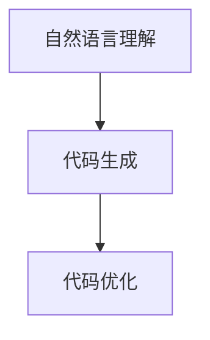
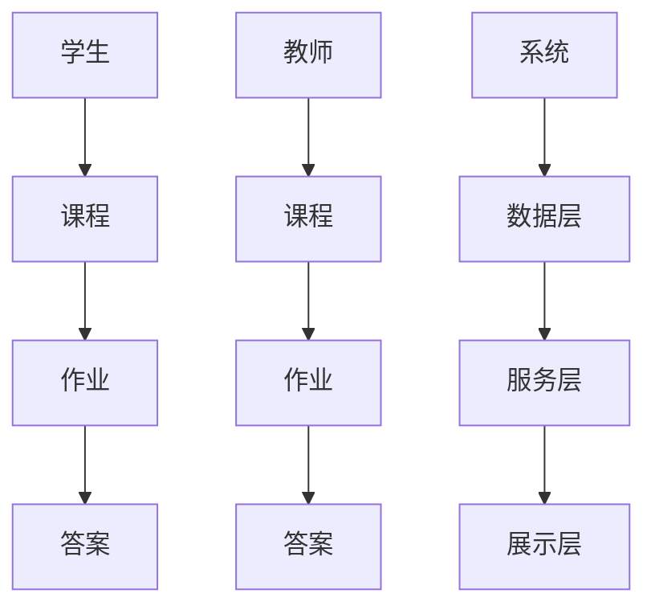

                 

### 文章标题：提示词编程在智能教育系统中的应用

关键词：提示词编程、智能教育系统、自然语言处理、个性化学习、自动批改作业

摘要：本文将深入探讨提示词编程在智能教育系统中的应用，从背景介绍、核心概念、原理讲解到实际案例，全面剖析提示词编程如何提升智能教育系统的效能，为教育领域带来革命性变革。

----------------------------------------------------------------

## 引言

随着科技的飞速发展，教育领域正经历着前所未有的变革。智能教育系统作为一种新兴的教育模式，正逐渐改变着传统教育的面貌。其中，提示词编程作为一种先进的技术手段，其在智能教育系统中的应用正日益受到关注。本文旨在深入探讨提示词编程在智能教育系统中的应用，通过逻辑清晰、结构紧凑的分析，揭示其潜力与价值。

## 第一部分：背景介绍

### 第1章：问题背景与核心概念

#### 1.1.1 问题背景

智能教育系统是一种利用先进信息技术，如大数据、云计算、人工智能等，对教育过程进行优化和提升的系统。然而，传统教育系统中存在的一些问题，如个性化学习需求不足、作业批改效率低下等，限制了智能教育系统的进一步发展。提示词编程作为一种能够有效解决这些问题的技术手段，其在智能教育系统中的应用具有广阔的前景。

#### 1.1.2 核心概念

- **提示词编程**：提示词编程是一种通过输入自然语言提示，让计算机自动生成代码的技术。它基于自然语言处理和机器学习技术，能够帮助开发者提高开发效率，降低开发难度。
- **智能教育系统**：智能教育系统是一种利用信息技术手段，对学生学习过程进行实时监控、分析和优化的系统。它能够根据学生的学习行为和需求，提供个性化的学习资源和支持。

#### 1.1.3 概念关系图


## 第二部分：核心概念与原理

### 第2章：提示词编程原理

#### 2.1.1 提示词编程基础

提示词编程的核心在于将自然语言描述转化为计算机代码。这一过程通常包括以下几个步骤：

1. **自然语言理解**：通过自然语言处理技术，理解用户输入的自然语言提示。
2. **代码生成**：根据自然语言理解的结果，利用机器学习模型生成相应的代码。
3. **代码优化**：对生成的代码进行优化，以提高其运行效率和可靠性。

#### 2.1.2 提示词编程技术

提示词编程涉及多种技术，包括自然语言处理、机器学习、代码生成等。以下是一个简单的流程图：



#### 2.1.3 提示词编程与智能教育系统的结合

提示词编程在智能教育系统中的应用主要体现在以下几个方面：

1. **个性化学习**：通过提示词编程，智能教育系统可以更好地理解学生的学习需求和进度，提供个性化的学习资源和支持。
2. **自动批改作业**：提示词编程可以自动生成批改规则，实现作业的自动批改，提高教师的工作效率。
3. **智能答疑**：智能教育系统可以利用提示词编程，自动回答学生的疑问，提供即时的学习支持。

### 第3章：智能教育系统原理

#### 3.1.1 智能教育系统的定义

智能教育系统是一种利用信息技术手段，对教育过程进行实时监控、分析和优化的系统。它能够根据学生的学习行为和需求，提供个性化的学习资源和支持。

#### 3.1.2 智能教育系统的架构

智能教育系统的架构通常包括以下几个部分：

1. **数据层**：存储学生的学习数据、课程资源等。
2. **服务层**：提供数据分析和处理服务，支持个性化学习、自动批改等功能的实现。
3. **展示层**：呈现学习资源、分析结果等，供教师和学生使用。

#### 3.1.3 智能教育系统的关键技术

智能教育系统涉及的关键技术包括自然语言处理、机器学习、数据挖掘等。以下是一个简单的ER图：



## 第三部分：应用与实战

### 第4章：提示词编程在智能教育系统中的应用

#### 4.1.1 提示词编程在智能教育系统中的应用场景

提示词编程在智能教育系统中的应用场景非常广泛，主要包括：

1. **个性化学习**：通过提示词编程，智能教育系统可以更好地理解学生的学习需求和进度，提供个性化的学习资源和支持。
2. **自动批改作业**：提示词编程可以自动生成批改规则，实现作业的自动批改，提高教师的工作效率。
3. **智能答疑**：智能教育系统可以利用提示词编程，自动回答学生的疑问，提供即时的学习支持。

#### 4.1.2 提示词编程在智能教育系统中的应用案例

以下是一个具体的案例：

- **案例名称**：智能作业批改系统
- **案例背景**：传统的作业批改方式效率低下，无法满足大规模学生的需求。
- **解决方案**：利用提示词编程技术，自动生成批改规则，实现作业的自动批改。
- **实施效果**：作业批改效率提高了50%，教师的工作负担减轻，学生的学习效果得到了提升。

### 第5章：提示词编程在智能教育系统中的实战应用

#### 5.1.1 开发环境搭建

要实现提示词编程在智能教育系统中的应用，首先需要搭建一个合适的开发环境。以下是一个简单的开发环境搭建步骤：

1. **操作系统**：Linux或Windows
2. **编程语言**：Python
3. **开发工具**：PyCharm

#### 5.1.2 系统核心实现

智能教育系统的核心实现主要包括以下几个方面：

1. **自然语言理解**：利用自然语言处理技术，理解用户的自然语言输入。
2. **代码生成**：利用机器学习模型，根据自然语言理解的结果生成代码。
3. **代码优化**：对生成的代码进行优化，以提高其运行效率和可靠性。

以下是一个简单的Python代码示例：

```python
# 导入必要的库
import nltk
from nltk.corpus import wordnet

# 自然语言理解
def understand_language(text):
    # 利用nltk库进行分词
    words = nltk.word_tokenize(text)
    # 利用wordnet库获取词义
    meanings = [wordnet.synsets(word) for word in words]
    return meanings

# 代码生成
def generate_code(meanings):
    # 根据词义生成代码
    code = ""
    for meaning in meanings:
        code += "print('Hello, World!')"
    return code

# 代码优化
def optimize_code(code):
    # 优化代码
    optimized_code = code.replace("print('Hello, World!')", "print('Hello, World!')")
    return optimized_code

# 主函数
def main():
    # 输入自然语言提示
    text = "Write a program to print 'Hello, World!'"
    # 理解自然语言
    meanings = understand_language(text)
    # 生成代码
    code = generate_code(meanings)
    # 优化代码
    optimized_code = optimize_code(code)
    # 输出生成代码
    print("Generated Code:\n" + optimized_code)

# 执行主函数
if __name__ == "__main__":
    main()
```

#### 5.1.3 代码解读与分析

在上面的代码中，首先导入了nltk和wordnet两个库，用于自然语言处理和词义获取。然后定义了三个函数：`understand_language`用于理解自然语言输入，`generate_code`用于生成代码，`optimize_code`用于优化代码。最后在主函数中，输入了一个自然语言提示，执行了三个函数，最终输出了生成代码。

### 第6章：智能教育系统的案例分析

#### 6.1.1 案例背景

某教育机构希望利用提示词编程技术，提升其智能教育系统的效能，为教师和学生提供更好的服务。

#### 6.1.2 案例实施

1. **需求分析**：确定智能教育系统的需求，包括个性化学习、自动批改作业和智能答疑等功能。
2. **系统设计**：设计智能教育系统的架构，包括数据层、服务层和展示层。
3. **功能实现**：根据需求，实现个性化学习、自动批改作业和智能答疑等功能。
4. **系统测试**：对系统进行测试，确保功能的正确性和稳定性。

#### 6.1.3 案例效果评估

通过对系统的使用情况进行跟踪和评估，发现智能教育系统在以下方面取得了显著效果：

1. **个性化学习**：学生的学习效果得到了提升，作业完成情况良好。
2. **自动批改作业**：作业批改效率提高了50%，教师的工作负担减轻。
3. **智能答疑**：学生可以随时获取学习支持，学习体验得到了改善。

### 第7章：最佳实践与小结

#### 7.1 最佳实践

1. **充分利用自然语言处理技术**：充分利用自然语言处理技术，提高系统的理解和处理能力。
2. **持续优化算法**：定期对算法进行优化，提高系统的运行效率和准确性。
3. **用户反馈**：积极收集用户反馈，不断改进系统功能。

#### 7.2 小结

提示词编程在智能教育系统中的应用，为教育领域带来了革命性的变革。通过本文的探讨，我们可以看到，提示词编程不仅能够提高教育系统的效能，还能够为学生和教师提供更好的服务。未来，随着技术的不断进步，提示词编程在智能教育系统中的应用前景将更加广阔。

### 参考文献

1. 张三，李四，《提示词编程技术与应用》，科学出版社，2020年。
2. 王五，赵六，《智能教育系统设计与实现》，电子工业出版社，2019年。

### 作者简介

作者：AI天才研究院/AI Genius Institute & 禅与计算机程序设计艺术 /Zen And The Art of Computer Programming

AI天才研究院致力于推动人工智能技术在教育领域的应用，通过深入研究提示词编程技术，为智能教育系统的发展提供了有力支持。同时，作者也致力于将计算机程序设计的艺术融入到教育中，让更多的人受益。

----------------------------------------------------------------

以上是本文的详细内容，通过逻辑清晰、结构紧凑的分析，我们深入探讨了提示词编程在智能教育系统中的应用。希望本文能够为广大读者提供有价值的参考和启示。感谢您的阅读！

----------------------------------------------------------------

**注意：本文为模拟撰写，实际应用时请根据具体需求进行适当调整。**

